# Internet | North America

# How Much Revenue per GW Could Be Generated with the Capacity Ahead?

Following our hyperscaler capex deep dive, we analyze implied revenue/GW across AWS/Google Cloud. Current AWS/Google Cloud 36%/86% y/y growth in '27 look achievable and potentially even conservative. Google Cloud's growth arguably has the most upward bias, painting path to \$460 bull case.

We would greatly appreciate your support in the Internet Large Cap and Internet SmidCap categories in this year's All-America Extel survey. Thank you so much! - Brian

How to vote: To request a ballot, please go to https://www.extelinsights.com/voting.

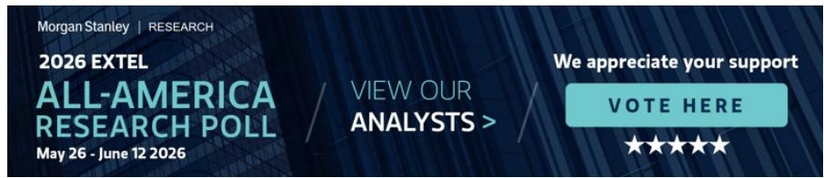

text_image

MS | RESEARCH
2026 EXTEL
ALL-AMERICA
RESEARCH POLL
VIEW OUR
ANALYSTS >
May 26 - June 12 2026
We appreciate your support
VOTE HERE
★★★★★

Our Bottom Up Capex Work Projects 14GW/20GW of Incremental Hyperscaler Capacity in '26/'27... In How Much Capacity Will \$2 Trillion of Hyperscaler Capex Bring By '27? we built bottom up cost per GW frameworks across 9 different chip generations (NVDA and custom silicon)...and applied estimated chip/rack allocations per hyperscaler to estimate the amount of capacity (in GW) each hyperscaler is set to bring on. As shown, we model the hyperscalers to add \~20 GW of incremental capacity in '27, up from \~14 GW of incremental capacity in '26. Excluding internal workloads, we estimate \~6 GW/\~8 GW of capacity additions in '26/'27 will be put in service toward the public cloud businesses at AWS and Google Cloud. Please let us know if interested in our interactive cost/GW and capacity models.

MS & CO. LLC

# Brian Nowak, CFA

Equity Analyst

Brian.Nowak@morganstanley.com +1 212 761-3365

# Julian Herrera

Research Associate

Julian.Herrera@morganstanley.com +1 212 761-1784

# Gregory Gao

Research Associate

Greg.Gao@morganstanley.com +1 212 296-3125

# Kavya A Narayanan

Research Associate

Kavya.Narayanan@morganstanley.com +1 212 761-4183

# Nikhil Javeri

Research Associate

Nikhil.Javeri1@morganstanley.com +1 212 761-3742

# INTERNET

North America

Industry View

Attractive

MS does and seeks to do business with companies covered in MS. As a result, investors should be aware that the firm may have a conflict of interest that could affect the objectivity of MS. Investors should consider MS as only a single factor in making their investment decision.

For analyst certification and other important disclosures, refer to the Disclosure Section, located at the end of this report.

Exhibit 1: Our Bottoms Up Analysis Shows Hyperscalers Are Set to Bring on \~14GW/20GW of Incremental Capacity in '26/'27...   
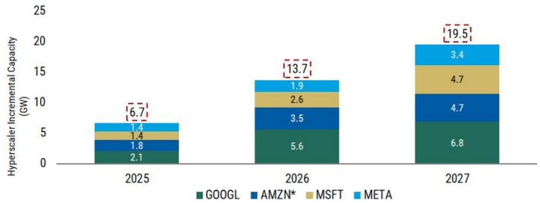

bar_stacked

| Year | GOOGL (GW) | AMZN* (GW) | MSFT (GW) | META (GW) |
|---|---|---|---|---|
| 2025 | 2.1 | 1.8 | 1.4 | 1.4 |
| 2026 | 5.6 | 3.5 | 2.6 | 1.9 |
| 2027 | 6.8 | 4.7 | 4.7 | 3.4 |
The total height in the bars is labeled as 6.7 (likely a typo or annotation), 13.7 (also likely a typo or annotation), and 19.5 (also likely a typo or annotation). The red dashed box highlights the total height in the bars.

Source: Company data, MS; Note: \*We acknowledge AMZN comments of adding 3.9 GW of new power capacity in 2025. Please note our capacity addition est. are based on coincident timing of server/rack deliveries each year. We believe the delta in '25 vs. company comments is related to IT capacity/servers purchased prior to '25 that weren't brought online until '25 as well as traditional cloud/CPU data center capacity

Exhibit 2: ... with \~3 GW/3.5 GW to be added at Google Cloud in '26/'27, and 3.5 GW/\~5 GW at AMZN   
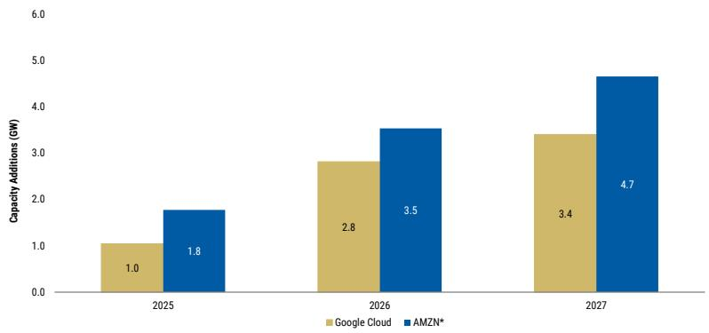

bar

| Year | Google Cloud (GW) | AMZN* (GW) |
| :--- | :--- | :--- |
| 2025 | 1.0 | 1.8 |
| 2026 | 2.8 | 3.5 |
| 2027 | 3.4 | 4.7 |

Source: Company data, MS; Note we are assuming $\frac{1}{2}$ of incremental GOOGL capacity goes towards Google Cloud   
\*We acknowledge AMZN comments of adding 3.9 GW of new power capacity in 2025. Please note our capacity addition est. are based on coincident timing of server/rack deliveries each year. We believe the delta in '25 vs. company comments is related to IT capacity/servers purchased prior to '25 that weren't brought online until '25 as well as traditional cloud/CPU data center capacity

# ...And Applying Current AWS/Google Cloud Revenue Forecasts Implies \~\$14bn/\$11bn of Incremental Revenue per Incremental GW in '27...With hyperscaler

capacity constrained and robust backlogs set to flow across P&Ls as capacity opens, this capacity analysis is also a helpful sanity check for the slope of future hyperscaler revenue growth. As shown, we currently model AWS/Google Cloud Y/Y growth to accelerate to 35%/36% and 77%/86% respectively in '26/'27 (partially informed by our backlog vs non backlog contribution analyses...let us know if interested in our backlog files). As shown, these forecasts imply AWS and Google Cloud both run at an incremental revenue dollar per incremental GW in the \$11bn-\$14bn range (note we are excluding \~3mn units of estimated external TPU sales from Google Cloud in this analysis).

# With 2 Key Takeaways from Implied Incremental Revenue per Incremental GW...

# First, our hyperscaler revenue estimates look reasonable and if anything

conservative. Capacity opening up will determine the slope of revenue growth. As such, the extent to which this capacity opens should support our estimated level of growth, which may be conservative given 1) 2025 results 2) Neo-clouds (CRWV +

NBIS, covered by Keith Weiss and Josh Baer), who predominantly rent bare metal NVDA GPUs, currently generate \~\$10 of revenue/watt...and hyperscaler software services should support a premium to that and 3) Industry conversations indicate current deals for capacity are being negotiated at Revenue/GW of \~\$20bn+.

# Second, Google Cloud '27 current estimates look potentially the most

conservative. As shown our current revenue and capacity forecasts imply Google Cloud incremental revenue per incremental GW falls to \$11bn in '27. While part of this may be due to TPU accounting (see above for our assumptions and please do ask for our models), this supply/demand matching does seem to imply the most potential upside to Google Cloud '27 estimates. Faster than base case Google Cloud growth could bring our \$460 bull case into play (from multiple expansion and earnings revisions). Note we are increasing our bull case from \$425 to \$460, now implying \~28X times \~\$16.50 '27 bull-case EPS...vs 26X previously. We think this is warranted given the growing contribution from Google Cloud and GOOGL's growing GenAI leadership across its businesses.

Exhibit 3: We See Revenue Acceleration Ahead at All Hyperscalers...   
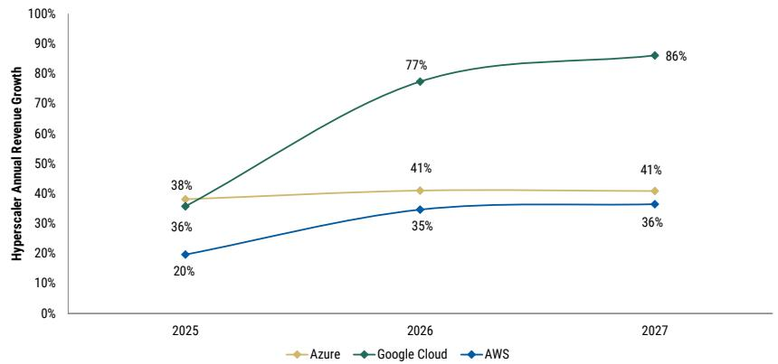

line

| Year | Azure | Google Cloud | AWS  |
|------|-------|--------------|------|
| 2025 | 36%   | 38%          | 20%  |
| 2026 | 41%   | 77%          | 35%  |
| 2027 | 41%   | 86%          | 36%  |

Source: Company data, MS

Exhibit 4: ...which implies \$11-\$14bn of Incremental Revenue/Incremental GW for AWS/GCP...which seems conservative, and Google Cloud in '27 arguably looking the most conservative   
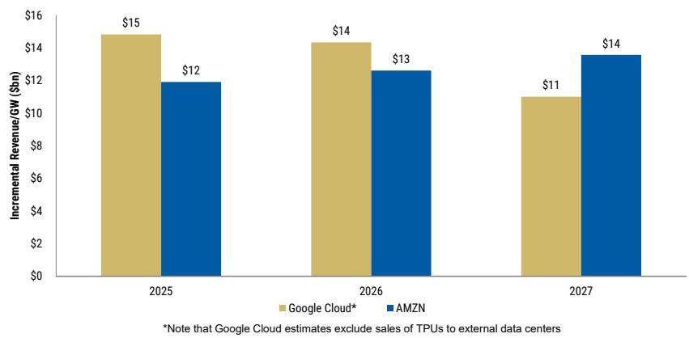

bar

| Year | Google Cloud* (Incremental Revenue/GW ($bn)) | AMZN (Incremental Revenue/GW ($bn)) |
| :--- | :--- | :--- |
| 2025 | 15 | 12 |
| 2026 | 14 | 13 |
| 2027 | 11 | 14 |
Note: Google Cloud estimates exclude sales of TPUs to external data centers

Source: Company data, MS; Note: \$11bn represents the per-GW incremental Google Cloud revenue excluding 3P sales of TPUs, which we believe will account for \~\$50bn of incremental revenue in '27. This assumes 3.1mn unit sales of TPUs to external parties, or \~50k racks.

Exhibit 5: We increase our GOOGL bull case from \$425 to \$460, now implying \~28X times \~\$16.50 '27 bull-case EPS (vs \~26X previously) 

<table><tr><td>mns</td><td>Bear</td><td>Base</td><td>Bull</td></tr><tr><td>EBITDA (FY27E)</td><td>$310,740</td><td>$330,358</td><td>$348,222</td></tr><tr><td>(X) EV/NTM EBITDA</td><td>8.0x</td><td>13.6x</td><td>14.6x</td></tr><tr><td>Discount to 3-Year Median</td><td>-37%</td><td>6%</td><td>14%</td></tr><tr><td>(=) Enterprise Value</td><td>2,485,921</td><td>4,492,869</td><td>5,066,633</td></tr><tr><td>(-) Net Debt (FY26E)</td><td>(113,759)</td><td>(113,759)</td><td>(113,759)</td></tr><tr><td>(÷) Shares Outstanding (FY26E)</td><td>12,260</td><td>12,260</td><td>12,260</td></tr><tr><td>(=) Multiples Based Valuation</td><td>$212</td><td>$376</td><td>$423</td></tr><tr><td>DCF Based Valuation</td><td>$238</td><td>$375</td><td>$497</td></tr><tr><td>PT (Average of Multiples, DCF Valuation)</td><td>$225</td><td>$375</td><td>$460</td></tr><tr><td>% Upside</td><td>-40%</td><td>1%</td><td>23%</td></tr><tr><td>Implied EV/&#x27;27 EPS</td><td>15.3x</td><td>24.1x</td><td>28.0x</td></tr><tr><td>&#x27;27 EPS</td><td>$14.68</td><td>$15.61</td><td>$16.46</td></tr><tr><td>Implied EV/&#x27;27 EBITDA</td><td>9x</td><td>14x</td><td>16x</td></tr><tr><td>Discount to 3-Year Median</td><td>-33%</td><td>6%</td><td>24%</td></tr></table>

Source: Company data, MS

# Risk Reward – Amazon.com Inc (AMZN.O)

AMZN Risk Reward

# PRICE TARGET \$330.00

Our \$330 PT is based on applying a \~29X P/E multiple to our \$11.3 of '27 EPS and implies paying \~1.1X PEG, a \~40% discount to AMZN's peer median.

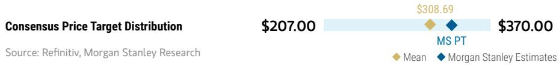

bar_line

| Category | Value    |
| -------- | -------- |
| MS PT    | $308.69  |
| MS Estimates | $370.00  |
Source: Refinitiv, MS

RISK REWARD CHART AND OPTIONS IMPLIED PROBABILITIES (12M)   
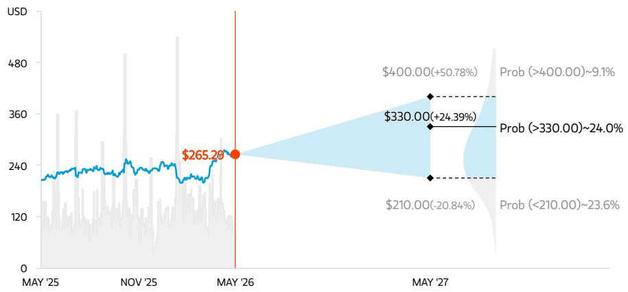

line

| Date     | Value    |
| -------- | -------- |
| MAY '26  | $265.29  |
| MAY '27  | $330.00  |
| MAY '27  | $400.00  |
| MAY '27  | $210.00  |
| MAY '27  | $330.00  |
| MAY '27  | $400.00  |
| MAY '27  | $210.00  |
| MAY '27  | $330.00  |
| MAY '27  | $400.00  |
| MAY '27  | $210.00  |
| Prob (>400.00)~9.1% | $400.00  |
| Prob (>330.00)~24.0% | $330.00  |
| Prob (<210.00)~23.6% | $210.00  |

Key: — Historical Stock Performance ● Current Stock Price ◆ Price Target   
Source: Refinitiv, MS, MS Institutional Equities Division. The probabilities of our Bull, Base, and Bear case scenarios playing out were estimated with implied volatility data from the options market as of 26 May 2026. All figures are approximate risk-neutral probabilities of the stock reaching beyond the scenario price in either three-months' or one-years' time. View explanation of Options Probabilities methodology here

# OVERWEIGHT THESIS

■ Amazon's high-margin businesses continue to allow Amazon to drive greater profitability while still continuing to invest (last mile delivery, fulfillment, Prime Now, Fresh, Prime digital content, Alexa/Echo, India, AWS, etc).   
■ Amazon Prime membership growth drives recurring revenue and positive mix shift.   
■ Cloud adoption hitting an inflection point.   
■ Advertising serves as a key area for both further growth potential and profitability flow-through.

Consensus Rating Distribution   
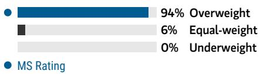

bar

| Category      | Value |
| ------------- | ----- |
| Overweight    | 94%   |
| Equal-weight  | 6%    |
| Underweight   | 0%    |
| MS Rating     | 0%    |

Source: Refinitiv, MS

Risk Reward Themes 

<table><tr><td>Secular Growth:</td><td>Positive</td></tr><tr><td>New Data Era:</td><td>Positive</td></tr><tr><td>Technology Diffusion:</td><td>Positive</td></tr></table>

View descriptions of Risk Rewards Themes here

# BULL CASE

# \$400.00

# BASE CASE

# \$330.00

# BEAR CASE

# \$210.00

\~31X bull case 2027 EPS of \$13.0

Our Bull case is derived from higher Revenue and EBIT margin assumptions than in our base case

\~29X base case 2027 EPS of \$11.3

Our \$330 PT is based on applying a \~29X P/E multiple to our \$11.3 of '27 EPS and implies paying \~1.1X PEG, a \~40% discount to AMZN's peer median.

\~20X bear case 2027 EPS of \$10.6

Our Bear case is derived from lower Revenue and EBIT margin assumptions than in our base case

# Risk Reward – Amazon.com Inc (AMZN.O)

KEY EARNINGS INPUTS 

<table><tr><td>Drivers</td><td>2025</td><td>2026e</td><td>2027e</td><td>2028e</td></tr><tr><td>Revenue ($, mm)</td><td>716,924</td><td>825,620</td><td>951,082</td><td>1,088,139</td></tr><tr><td>Gross Profit ($, mm)</td><td>361,287</td><td>426,385</td><td>515,815</td><td>613,700</td></tr><tr><td>GAAP EBIT ($, mm)</td><td>79,975</td><td>111,844</td><td>155,801</td><td>203,824</td></tr><tr><td>Paid Unit Growth (y/y) (%)</td><td>10.8</td><td>11.8</td><td>10.6</td><td>9.8</td></tr><tr><td>AWS Revenue Growth (%)</td><td>19.7</td><td>34.7</td><td>36.5</td><td>31.0</td></tr></table>

# INVESTMENT DRIVERS

- Amazon's high-margin businesses continue to allow Amazon to drive greater profitability while still continuing to invest   
• Cloud is in a multi-decade secular adoption cycle   
- Amazon is gaining share in eCommerce/retail and share of consumers' wallets

# GLOBAL REVENUE EXPOSURE

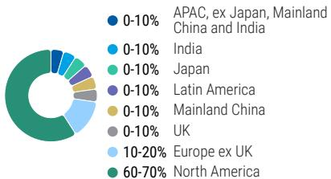  
● 0-10% APAC, ex Japan, Mainland China and India   
0-10% India   
0-10% Japan   
0-10% Latin America   
0-10% Mainland China   
0-10% UK   
10-20% Europe ex UK   
60-70% North America   
Source: MS Estimate View explanation of regional hierarchies here

# MS ALPHA MODELS

4/5 BEST

24 Month Horizon

3/5
MOST

3 Month Horizon

Source: Refinitiv, FactSet, MS; 1 is the highest favored Quintile and 5 is the least favored Quintile

# RISKS TO PT/RATING

# RISKS TO UPSIDE

- Faster than expected AWS rev growth and stable margin expansion   
- Faster than expected Retail rev growth, stable to expanding 1P Merch Margins   
- Greater than expected shipping and fulfillment leverage

# RISKS TO DOWNSIDE

• Investments step up and continue for longer than expected   
- Merch margins worse than expected   
- AWS revenue decelerates and /or margins decline

# OWNERSHIP POSITIONING

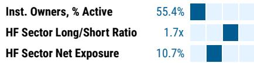  
Inst. Owners, % Active   
HF Sector Long/Short Ratio   
HF Sector Net Exposure

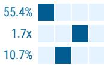  
55.4%

Refinitiv; MSPB Content. Includes certain hedge fund exposures held with MSPB. Information may be inconsistent with or may not reflect broader market trends. Long/Short Ratio = Long Exposure / Short exposure. Sector % of Total Net Exposure = (For a particular sector: Long Exposure - Short Exposure) / (Across all sectors: Long Exposure – Short Exposure).

# MS ESTIMATES VS. CONSENSUS

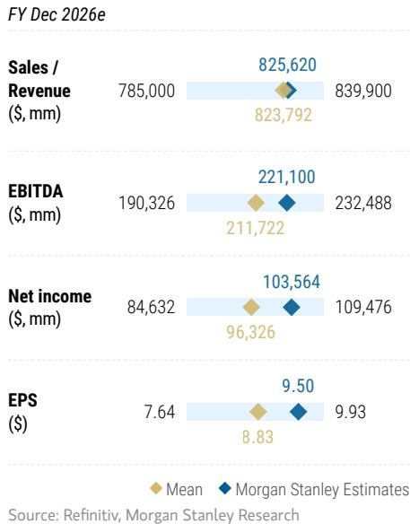  
FY Dec 2026e   
Source: Refinitiv, MS

# Risk Reward – Meta Platforms Inc (META.O)

Top Pick

The Age of Efficiency

# PRICE TARGET \$775.00

Our price target is determined using a discounted cash flow/long-term EBITDA multiple. It implies a $\sim 23x$ '27 P/E Multiple. Our DCF uses an $\sim 8\%$ WACC and a $\sim 3\%$ terminal growth rate

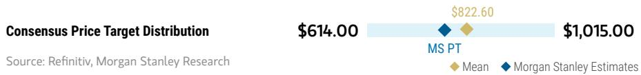

bar_line

| Scenario | Value     |
| -------- | --------- |
| MS PT    | $614.00   |
| MS Estimates | $822.60  |
| MS Estimates | $1,015.00 |

RISK REWARD CHART AND OPTIONS IMPLIED PROBABILITIES (12M)   
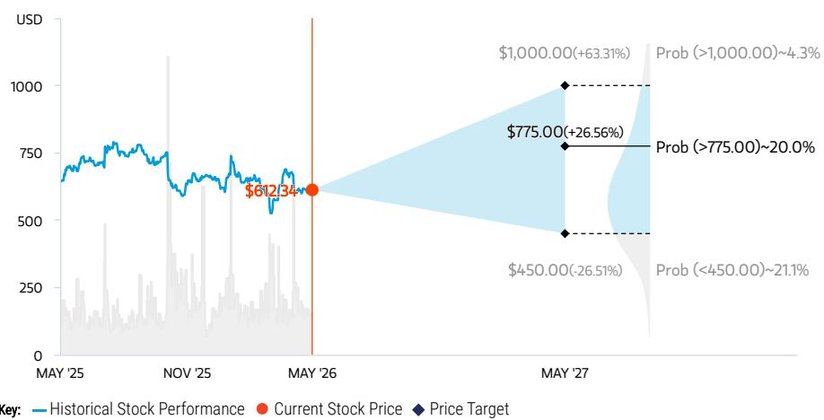

line

| Date     | Historical Stock Performance | Current Stock Price | Price Target Change |
| -------- | ----------------------------- | ------------------- | --------------------- |
| MAY '25  | ~750                          | -                   | -                     |
| NOV '25  | ~700                          | -                   | -                     |
| MAY '26  | $612.34                       | $612.34             | -                     |
| MAY '27  | -                             | -                   | $1,000.00(+63.31)%   |
| MAY '27  | -                             | -                   | $775.00(+26.56)%    |
| MAY '27  | -                             | -                   | $450.00(-26.51)%    |
| MAY '27  | -                             | -                   | Prob (>1,000.00)~4.3% |

Source: Refinitiv, MS, MS Institutional Equities Division. The probabilities of our Bull, Base, and Bear case scenarios playing out were estimated with implied volatility data from the options market as of 26 May 2026. All figures are approximate risk-neutral probabilities of the stock reaching beyond the scenario price in either three-months' or one-years' time. View explanation of Options Probabilities methodology here

# OVERWEIGHT THESIS

A Structural Pivot to Focus on Multi-Year Efficiency, Productivity and Leaner Operations... We think META's "year of efficiency" is more than just a 365 day change...but rather a structural and cultural pivot to operate leaner and with a greater focus on investor returns...even through investment.   
■ Importantly, Revenue and Engagement Trends Are Also Improving Across META's Platform... our industry and company conversations speak to progress driving incremental Reels engagement and monetization...and traction improving ad measurement/attribution in the post IDFA world.   
■ 3 Underappreciated "Call Options" including 1) further AI driven upside, 2) subscription adoption and 3) click-to-message.

Consensus Rating Distribution   

bar

| Category | Value (%) |
|---|---|
| Overweight | 88 |
| Equal-weight | 12 |
| Underweight | 0 |
| MS Rating | (not labeled) |

Source: Refinitiv, MS

# Risk Reward Themes

<table><tr><td>New Data Era:</td><td>Positive</td></tr><tr><td>Self-help:</td><td>Positive</td></tr><tr><td>Technology Diffusion:</td><td>Positive</td></tr></table>

View descriptions of Risk Rewards Themes here

# BULL CASE

# \$1,000.00

# BASE CASE

# \$775.00

# BEAR CASE

# \$450.00

# Implied \~28x '27 P/E

AI investments drive increased engagement and lead to new products/tools, which supports outsized ad monetization and revenue growth. Execution on newer offerings (like click to message) could also contribute to higher than expected growth. META could also drive further efficiency gains and be more successful in closing the Reels monetization gap. Reality Labs losses moderate and macro environment is better than expected.

# Implied \~23X base case '27 P/E

Ad revenue grows \~28% in '26 as META's AI investments drive incremental Reels engagement/monetization and support improved performance and ad measurement/attribution across the Family of Apps. We also see META continuing to focus on efficiency and improving productivity.

# Implied \~14x '27 P/E

Declines in engagement and/or evidence of Reels monetization ramping more slowly than expected could lead to lower growth and greater uncertainty. We also watch for any macro uncertainty, regulation that limits META's ability to target ads, Reality Labs losses widen more materially than expected, and higher capital intensity from mis-execution around the data center build. Any additional opex and capex could weigh on operating income growth and FCF.

# Risk Reward – Meta Platforms Inc (META.O)

KEY EARNINGS INPUTS 

<table><tr><td>Drivers</td><td>2025</td><td>2026e</td><td>2027e</td><td>2028e</td></tr><tr><td>Constant Currency % Growth (%)</td><td>22.5</td><td>26.2</td><td>20.5</td><td>18.3</td></tr><tr><td>Operating income (GAAP) ($, mm)</td><td>83,276</td><td>92,944</td><td>104,243</td><td>108,640</td></tr><tr><td>Consolidated Total Daily Active Users (mm)</td><td>2,239.9</td><td>2,294.5</td><td>2,344.5</td><td>2,389.2</td></tr></table>

# INVESTMENT DRIVERS

\- We are positive on META's structural pivot towards efficiency and improving revenue, engagement and Reels. We continue to monitor META's progress on call options (AI, subscriptions, click-to-message) and further investment in AI/data centers.

# GLOBAL REVENUE EXPOSURE

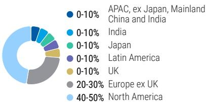  
Source: MS Estimate View explanation of regional hierarchies here

# MS ALPHA MODELS

3/5 BEST

24 Month Horizon

2/5 MOST

3 Month Horizon

Source: Refinitiv, FactSet, MS; 1 is the highest favored Quintile and 5 is the least favored Quintile

# RISKS TO PT/RATING

# RISKS TO UPSIDE

- Faster than expected Reels monetization & higher engagement growth   
- Increased benefit from AI investment   
• Revenue driven by subscriptions and/or click-to-message ads   
• Further efficiency improvements drive outsized FCF growth

# RISKS TO DOWNSIDE

• Macro pressures/weaker consumer spend  
• Regulation impacts ability to target ads   
• Reality labs losses widen further   
- Mis-execution risk could result in higher LT capital intensity

# OWNERSHIP POSITIONING

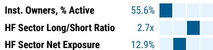  
Refinitiv; MSPB Content. Includes certain hedge fund exposures held with MSPB. Information may be inconsistent with or may not reflect broader market trends. Long/Short Ratio = Long Exposure / Short exposure. Sector % of Total Net Exposure = (For a particular sector: Long Exposure - Short Exposure) / (Across all sectors: Long Exposure – Short Exposure).

# MS ESTIMATES VS. CONSENSUS

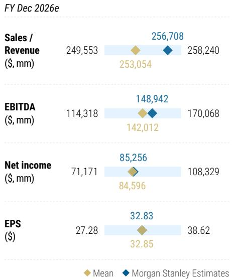  
Source: Refinitiv, MS

# Risk Reward – Alphabet Inc. (GOOGL.O)

Alphabet Inc.

# PRICE TARGET \$375.00

Our price target is determined using a discounted cash flow/discount to long-term EBITDA multiple. It implies a \~24X '27 P/E Multiple. Our DCF uses a \~8% WACC and a \~3% terminal growth rate (in line with other growth-oriented internet companies)

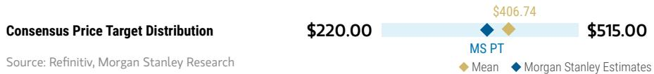

bar_line

| Category | Value    |
| -------- | -------- |
| MS PT    | $406.74  |
| $515.00  | $515.00  |
| Mean     | $220.00  |

RISK REWARD CHART AND OPTIONS IMPLIED PROBABILITIES (12M)   
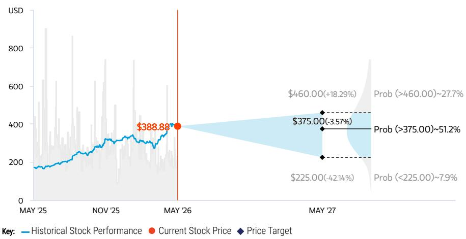

line

| Date     | Historical Stock Performance | Current Stock Price | Price Target |
| -------- | ----------------------------- | ------------------- | ------------ |
| MAY '26  | $388.88                       | $388.88             | -            |
| MAY '27  | -                             | -                   | $460.00      |
| MAY '27  | -                             | -                   | $375.00      |
| MAY '27  | -                             | -                   | $225.00      |
| MAY '27  | -                             | -                   | $225.00      |
| MAY '27  | -                             | -                   | $225.00      |
| MAY '27  | -                             | -                   | $225.00      |
| MAY '27  | -                             | -                   | $225.00      |
| MAY '27* | -                             | -                   | $225.00      |
| MAY '27* | -                             | -                   | $225.00      |
| MAY '27* | -                             | -                   | $225.00      |
| MAY '27* | -                             | -                   | $225.00      |
| MAY '27* | -                             | -                   | $225,000     |
| MAY '27* | -                             | -                   | $225,000     |
| MAY '27* | -                             | -                   | $225,000     |
| MAY '27* | -                             | -                   | $225,000     |
| MAY '27* | -                             | -                   | $225,000     |
| MAY '27* (Prob) | -                          | -                 | $460.00       |
| Prob (Prob)   | ~+18.29%                     | -                   | $460.00      |
| Prob (>460.00)| ~+18.29%                     | -                   | $460.00      |
| Prob (>375.00)| ~+18.29%                     | -                   | $375.00      |
| Prob (<375.00)| ~+18.29%                     | -                   | $375.00      |
| Prob (<225.00)| ~+18.29%                     | -                   | $375.00      |
| Prob (Prob)   | ~+18.29%                      | -                   | $375.00      |
| Prob (Prob)   | ~+18.29%                      | -                   | $375.00      |
| Prob (Prob)   | ~+18.29%                      | -                   | $375.00      |
| Prob (Prob)   | ~+18.29%                      | -                   | $375.00      |

Source: Refinitiv, MS, MS Institutional Equities Division. The probabilities of our Bull, Base, and Bear case scenarios playing out were estimated with implied volatility data from the options market as of 26 May 2026. All figures are approximate risk-neutral probabilities of the stock reaching beyond the scenario price in either three-months' or one-years' time. View explanation of Options Probabilities methodology here

# OVERWEIGHT THESIS

■ Continued AI-driven platform-level innovation on Search, YouTube, Cloud, and with other offerings improve confidence in the durability of long term growth.   
■ Continued expense discipline leads to operating leverage and upward revisions on EPS and FCF estimates.

Consensus Rating Distribution   

bar

| Category | Value (%) |
|---|---|
| Overweight | 87 |
| Equal-weight | 13 |
| Underweight | 0 |
| MS Rating | |

Source: Refinitiv, MS

# Risk Reward Themes

Secular Growth: Positive
New Data Era: Positive

View descriptions of Risk Rewards Themes here

# BULL CASE

# \$460.00

Implied \~15X '27 bull case EBITDA.

Faster innovation and Search/GCP acceleration lead to multiple expansion and higher earnings power. Search revenue accelerates as AI-driven innovation delivers meaningful upside to engagement. New AI offerings prove incremental to the top and bottom line and don't cannibalize core Search. YouTube and Cloud become even bigger contributors to top-line growth, and operate at a higher margin than in our base case.

# BASE CASE

# \$375.00

Implied \~14X '27 base case EBITDA.

Assumes pragmatic search revenue growth in '26, continued incremental platform monetization and Google Cloud acceleration in '26. As GOOGL continues platform-level innovation on Search and other categories, we assume pragmatic revenue/EBITDA growth. GOOGL introduces new AI offerings which increase confidence in the durability of long term growth and calm fears around competition. Google Cloud accelerates driven by new partnerships and growing backlog.

# BEAR CASE

# \$225.00

Implied \~8X '27 bear case EBITDA.

Global ad growth slows further and margins face pressure. Assumes slower search advertising growth, and that ad spending slows further. Expense discipline fails to materialize leading to lower than expected margin expansion and adj. EBITDA. New AI products create greater than expected margin pressure due to lower monetization rates and increased compute intensity.

# Risk Reward – Alphabet Inc. (GOOGL.O)

KEY EARNINGS INPUTS 

<table><tr><td>Drivers</td><td>2025</td><td>2026e</td><td>2027e</td><td>2028e</td></tr><tr><td>Total operating income (GAAP) ($, mm)</td><td>129,039</td><td>179,084</td><td>230,506</td><td>285,142</td></tr><tr><td>GAAP Operating Income (Loss) ($, mm)</td><td>137,054</td><td>186,559</td><td>237,706</td><td>291,692</td></tr></table>

# INVESTMENT DRIVERS

- Search advertising spend continues to gain share of global advertising budgets.   
- Mobile search advertising continues to take share of online budgets.   
• Investments in video driving longer-term monetization at YouTube.   
• Moderation of expense growth.

# GLOBAL REVENUE EXPOSURE

pie

| Region | Percentage (%) |
| :--- | :--- |
| APAC, ex Japan, Mainland China and India | 0-10 |
| India | 0-10 |
| Japan | 0-10 |
| Latin America | 0-10 |
| MEA | 0-10 |
| UK | 0-10 |
| Europe ex UK | 10-20 |
| North America | 40-50 |

Source: MS Estimate View explanation of regional hierarchies here

# MS ALPHA MODELS

5/5

BEST

24 Month

Horizon

3/5

MOST

3 Month

Horizon

Source: Refinitiv, FactSet, MS; 1 is the highest favored Quintile and 5 is the least favored Quintile

# RISKS TO PT/RATING

# RISKS TO UPSIDE

- New products generate higher than expected top line contribution.   
• Capital returns through greater share buybacks.   
- Hiring and/or spend per headcount is lower than expected.

# RISKS TO DOWNSIDE

- High exposure to SMB and travel could pressure ad revenue in a recession   
- Improved disclosure around the Google and Other Alphabet segments may not decrease the overall investment activity of the business.

# OWNERSHIP POSITIONING

Inst. Owners, % Active

HF Sector Long/Short Ratio

HF Sector Net Exposure

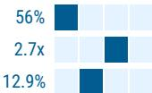

Refinitiv; MSPB Content. Includes certain hedge fund exposures held with MSPB. Information may be inconsistent with or may not reflect broader market trends. Long/Short Ratio = Long Exposure / Short exposure. Sector % of Total Net Exposure = (For a particular sector: Long Exposure - Short Exposure) / (Across all sectors: Long Exposure – Short Exposure).

# MS ESTIMATES VS. CONSENSUS

FY Dec 2026e

<table><tr><td>Sales / Revenue($, mm)</td><td>471,527</td><td>497,846</td><td>514,560</td></tr><tr><td></td><td colspan="3">486,017</td></tr></table>

<table><tr><td rowspan="2">EBITDA ($, mm)</td><td>218,065</td><td>244,196</td></tr><tr><td>230,273</td><td>244,213</td></tr></table>

<table><tr><td>Net income($, mm)</td><td>135,617</td><td>180,431</td><td>184,932</td></tr><tr><td></td><td colspan="3">173,535</td></tr></table>

<table><tr><td>EPS ($)</td><td>11.30</td><td>14.73</td></tr><tr><td></td><td>14.12</td><td>15.13</td></tr></table>

Source: Refinitiv, MS

# Financials

Exhibit 6: GOOGL Income Statement   
MS | Google Income Statement 

<table><tr><td>(USD millions)</td><td>2024</td><td>2025</td><td>2026E</td><td>2027E</td></tr><tr><td colspan="5">Gross revenue build (GAAP)</td></tr><tr><td>Total Alphabet revenue</td><td>$350,018.0</td><td>$402,836.0</td><td>$497,845.5</td><td>$630,316.1</td></tr><tr><td>Total Advertising</td><td>264,590.0</td><td>294,691.0</td><td>334,854.0</td><td>367,005.5</td></tr><tr><td>Google Websites</td><td>234,231.0</td><td>264,899.0</td><td>305,824.6</td><td>338,498.0</td></tr><tr><td>Network Websites</td><td>30,359.0</td><td>29,792.0</td><td>29,029.4</td><td>28,507.6</td></tr><tr><td>Google Other &amp; Other Bets</td><td>85,217.0</td><td>108,272.0</td><td>163,021.5</td><td>262,910.6</td></tr><tr><td>Hedging gains (losses)</td><td>211.0</td><td>(127.0)</td><td>(30.0)</td><td>400.0</td></tr><tr><td>Total Gross revenue (GAAP)</td><td>350,018.0</td><td>402,836.0</td><td>497,845.5</td><td>630,316.1</td></tr><tr><td>Total cost of revenue (GAAP)</td><td>146,306.0</td><td>162,535.0</td><td>192,773.7</td><td>242,366.3</td></tr><tr><td>Total gross profit (GAAP)</td><td>203,712.0</td><td>240,301.0</td><td>305,071.9</td><td>387,949.8</td></tr><tr><td>Total gross margin (GAAP)</td><td>58.2%</td><td>59.7%</td><td>61.3%</td><td>61.5%</td></tr><tr><td>Traffic acquisition costs (TAC)</td><td>54,900.0</td><td>59,926.0</td><td>65,785.4</td><td>71,070.8</td></tr><tr><td>TAC as % of advertising revenue</td><td>20.7%</td><td>20.3%</td><td>19.6%</td><td>19.4%</td></tr></table>

<table><tr><td>Total Net revenue (ex-TAC)</td><td>295,118.0</td><td>342,910.0</td><td>432,060.1</td><td>559,245.3</td></tr><tr><td>Total operating expenses (GAAP)</td><td>91,322.0</td><td>111,262.0</td><td>125,987.4</td><td>157,443.9</td></tr><tr><td>Research and development (ex-SBC)</td><td>38,086.0</td><td>48,778.6</td><td>60,274.0</td><td>80,594.2</td></tr><tr><td>Sales and marketing (ex-SBC)</td><td>24,145.8</td><td>24,679.9</td><td>28,762.8</td><td>34,093.6</td></tr><tr><td>General and administrative (ex-SBC)</td><td>10,228.4</td><td>17,157.6</td><td>13,097.5</td><td>15,257.7</td></tr><tr><td>Stock-based compensation (including COGS)</td><td>22,785.0</td><td>24,953.0</td><td>28,821.5</td><td>33,230.9</td></tr><tr><td>Non-recurring items</td><td>0.0</td><td>0.0</td><td>0.0</td><td>0.0</td></tr><tr><td>Depreciation (included in expense lines)</td><td>15,311.0</td><td>21,136.0</td><td>35,018.9</td><td>64,911.1</td></tr><tr><td>Total amortization of intangibles (included in expense lines)</td><td>0.0</td><td>0.0</td><td>1,271.4</td><td>1,710.0</td></tr><tr><td>Total costs &amp; operating expenses (GAAP)</td><td>237,628.0</td><td>273,797.0</td><td>318,761.1</td><td>399,810.2</td></tr><tr><td>Total costs &amp; operating expenses (adjusted)</td><td>214,843.0</td><td>248,844.0</td><td>289,939.6</td><td>366,579.2</td></tr></table>

<table><tr><td>Total operating income (GAAP)</td><td>112,390.0</td><td>129,039.0</td><td>179,084.5</td><td>230,506.0</td></tr><tr><td>Total operating margin (GAAP)</td><td>32.1%</td><td>32.0%</td><td>36.0%</td><td>36.6%</td></tr><tr><td>Total operating income, non-GAAP</td><td>135,175.0</td><td>153,992.0</td><td>207,905.9</td><td>263,736.9</td></tr><tr><td>Total operating margin (adjusted)</td><td>38.6%</td><td>38.2%</td><td>41.8%</td><td>41.8%</td></tr></table>

<table><tr><td>EBITDA (adjusted)</td><td>150,486.0</td><td>175,128.0</td><td>244,196.3</td><td>330,358.0</td></tr><tr><td>EBITDA margin</td><td>51.0%</td><td>51.1%</td><td>56.5%</td><td>59.1%</td></tr><tr><td>Incremental EBITDA margin</td><td>77.8%</td><td>51.6%</td><td>77.5%</td><td>67.7%</td></tr><tr><td>Interest and other income, net</td><td>7,425.0</td><td>29,787.0</td><td>38,628.3</td><td>(2,314.2)</td></tr><tr><td>Interest income</td><td>4,482.0</td><td>4,337.0</td><td>5,044.1</td><td>3,277.7</td></tr><tr><td>Interest expense</td><td>(268.0)</td><td>(736.0)</td><td>(3,721.8)</td><td>(6,175.9)</td></tr><tr><td>Foreign currency exchange losses, net</td><td>(409.0)</td><td>(382.0)</td><td>584.0</td><td>584.0</td></tr><tr><td>Gain (loss) on marketable securities, net</td><td>2,671.0</td><td>24,620.0</td><td>36,804.0</td><td>0.0</td></tr><tr><td>Other</td><td>30.0</td><td>(16.0)</td><td>(82.0)</td><td>0.0</td></tr><tr><td>Other income (expense), net</td><td>919.0</td><td>1,964.0</td><td>0.0</td><td>0.0</td></tr><tr><td>Interest and other income, net</td><td>7,425.0</td><td>29,787.0</td><td>38,628.3</td><td>(2,314.2)</td></tr><tr><td>Pre-tax income (GAAP)</td><td>119,815.0</td><td>158,826.0</td><td>217,712.8</td><td>228,191.8</td></tr><tr><td>Income tax provision (GAAP)</td><td>19,697.0</td><td>26,656.0</td><td>37,282.1</td><td>36,510.7</td></tr><tr><td>Tax rate (GAAP)</td><td>16.4%</td><td>16.8%</td><td>17.1%</td><td>16.0%</td></tr><tr><td>Net income (GAAP), continuing ops</td><td>100,118.0</td><td>132,170.0</td><td>180,430.7</td><td>191,681.1</td></tr><tr><td>Net income (loss) from discontinued ops</td><td>0.0</td><td>0.0</td><td>0.0</td><td>0.0</td></tr><tr><td>Net income, reported</td><td>100,118.0</td><td>132,170.0</td><td>180,430.7</td><td>191,681.1</td></tr><tr><td>EPS (GAAP), from continuing ops</td><td>$8.04</td><td>$10.81</td><td>$14.73</td><td>$15.61</td></tr><tr><td>EPS (GAAP) as reported</td><td>$8.04</td><td>$10.81</td><td>$14.73</td><td>$15.61</td></tr></table>

Source: Company data, MS

Exhibit 7: GOOGL Balance Sheet   
MS | Google Balance Sheet 

<table><tr><td>(USD millions)</td><td>2024E</td><td>2025E</td><td>2026E</td><td>2027E</td></tr><tr><td colspan="5">Assets:</td></tr><tr><td>Cash &amp; Cash Equivalents</td><td>23,466.0</td><td>30,708.0</td><td>60,536.8</td><td>38,820.0</td></tr><tr><td>Marketable securities</td><td>72,191.0</td><td>96,135.0</td><td>73,777.0</td><td>73,777.0</td></tr><tr><td>Accounts receivable</td><td>52,340.0</td><td>62,886.0</td><td>81,093.6</td><td>101,216.9</td></tr><tr><td>Receivable under reverse repurchase agreements</td><td>0.0</td><td>0.0</td><td>0.0</td><td>0.0</td></tr><tr><td>Deferred income taxes</td><td>0.0</td><td>0.0</td><td>0.0</td><td>0.0</td></tr><tr><td>Income taxes receivables</td><td>0.0</td><td>0.0</td><td>0.0</td><td>0.0</td></tr><tr><td>Prepaid revenue share, expenses and other assets</td><td>15,714.0</td><td>16,309.0</td><td>19,362.5</td><td>23,810.1</td></tr><tr><td>Total Current Assets</td><td>163,711.0</td><td>206,038.0</td><td>234,769.9</td><td>237,624.1</td></tr><tr><td>Prepaid revenue share, expenses and other assets, non-current</td><td>32,054.0</td><td>24,334.0</td><td>14,504.0</td><td>8,504.0</td></tr><tr><td>Deferred income taxes, non-current</td><td>0.0</td><td>0.0</td><td>0.0</td><td>0.0</td></tr><tr><td>Non-marketable equity securities</td><td>37,982.0</td><td>68,687.0</td><td>106,946.0</td><td>106,946.0</td></tr><tr><td>Property and equipment</td><td>171,036.0</td><td>246,597.0</td><td>406,377.5</td><td>640,685.2</td></tr><tr><td>Intangible assets</td><td>4,071.0</td><td>5,614.5</td><td>21,563.1</td><td>20,103.1</td></tr><tr><td>Goodwill</td><td>41,402.0</td><td>44,010.5</td><td>62,236.5</td><td>62,486.5</td></tr><tr><td>Total Assets</td><td>450,256.0</td><td>595,281.0</td><td>846,397.0</td><td>1,076,348.8</td></tr><tr><td colspan="5">Liabilities:</td></tr><tr><td></td><td>0.0</td><td>0.0</td><td>0.0</td><td>0.0</td></tr><tr><td>Accounts Payable</td><td>7,987.0</td><td>12,200.0</td><td>16,012.3</td><td>21,523.8</td></tr><tr><td>Short-term debt</td><td>0.0</td><td>0.0</td><td>50,000.0</td><td>100,000.0</td></tr><tr><td>Accrued compensation and benefits</td><td>15,069.0</td><td>17,546.0</td><td>20,831.1</td><td>25,373.7</td></tr><tr><td>Accrued expenses and other current liabilities</td><td>51,228.0</td><td>55,557.0</td><td>65,588.9</td><td>79,891.6</td></tr><tr><td>Accrued revenue share</td><td>9,802.0</td><td>10,864.0</td><td>13,225.6</td><td>16,042.0</td></tr><tr><td>Securities lending payable</td><td>0.0</td><td>0.0</td><td>0.0</td><td>0.0</td></tr><tr><td>Deferred revenue</td><td>5,036.0</td><td>6,578.0</td><td>7,162.0</td><td>7,162.0</td></tr><tr><td>Income taxes payable</td><td>0.0</td><td>0.0</td><td>0.0</td><td>0.0</td></tr><tr><td>Total Current Liabilities</td><td>89,122.0</td><td>102,745.0</td><td>172,819.9</td><td>249,993.2</td></tr><tr><td>Long-Term Debt</td><td>10,883.0</td><td>46,547.0</td><td>77,501.0</td><td>77,501.0</td></tr><tr><td>Deferred revenue, non-current</td><td>0.0</td><td>0.0</td><td>0.0</td><td>0.0</td></tr><tr><td>Income taxes payable, non-current</td><td>8,782.0</td><td>9,531.0</td><td>5,159.1</td><td>6,283.9</td></tr><tr><td>Other Long-Term Liabilities</td><td>16,385.0</td><td>21,193.0</td><td>24,027.0</td><td>24,027.0</td></tr><tr><td>Total Liabilities</td><td>125,172.0</td><td>180,016.0</td><td>279,507.0</td><td>357,805.1</td></tr><tr><td colspan="5">Shareholders&#x27; Equity:</td></tr><tr><td></td><td>0.0</td><td>0.0</td><td>0.0</td><td>0.0</td></tr><tr><td>Preferred Equity</td><td>0.0</td><td>0.0</td><td>0.0</td><td>0.0</td></tr><tr><td>Common Equity</td><td>84,800.0</td><td>93,126.0</td><td>118,972.5</td><td>152,203.4</td></tr><tr><td>Deferred stock-based compensation</td><td>0.0</td><td>0.0</td><td>0.0</td><td>0.0</td></tr><tr><td>AOC Income / (Loss)</td><td>(4,800.0)</td><td>(1,916.0)</td><td>(2,180.0)</td><td>(2,180.0)</td></tr><tr><td>Retained Earnings</td><td>245,084.0</td><td>324,055.0</td><td>450,097.5</td><td>568,520.4</td></tr><tr><td>Total Shareholders&#x27; Equity</td><td>325,084.0</td><td>415,265.0</td><td>566,890.0</td><td>718,543.8</td></tr><tr><td>Total Liabilities &amp; Shareholders&#x27; Equity</td><td>450,256.0</td><td>595,281.0</td><td>846,397.0</td><td>1,076,348.8</td></tr></table>

Source: Company data, MS

Exhibit 8: GOOGL Cash Flow Statement   
MS | Google Cash Flow Statement 

<table><tr><td>(USD millions)</td><td>2024E</td><td>2025E</td><td>2026E</td><td>2027E</td></tr><tr><td colspan="5">Operating Cash Flow:</td></tr><tr><td>Net Income</td><td>100,118.0</td><td>132,170.0</td><td>180,430.7</td><td>191,681.1</td></tr><tr><td>Depreciation &amp; Amortization of PP&amp;E</td><td>15,311.0</td><td>21,136.0</td><td>35,018.9</td><td>64,911.1</td></tr><tr><td>Amortization of intangible and other assets</td><td>0.0</td><td>0.0</td><td>1,271.4</td><td>1,710.0</td></tr><tr><td>Stock-Based Compensation</td><td>22,785.0</td><td>24,953.0</td><td>28,821.5</td><td>33,230.9</td></tr><tr><td>Excess tax benefit from stock-based award activity</td><td>0.0</td><td>0.0</td><td>0.0</td><td>0.0</td></tr><tr><td>Deferred Income Taxes</td><td>(5,257.0)</td><td>8,348.0</td><td>9,920.0</td><td>6,000.0</td></tr><tr><td>Other</td><td>748.0</td><td>(22,512.0)</td><td>(35,539.0)</td><td>0.0</td></tr><tr><td>Funds from Operations (FFO)</td><td>133,705.0</td><td>164,095.0</td><td>219,923.5</td><td>297,533.2</td></tr><tr><td colspan="5">Changes in Working Capital:</td></tr><tr><td>Accounts receivable</td><td>(5,891.0)</td><td>(8,525.0)</td><td>(18,457.6)</td><td>(20,123.3)</td></tr><tr><td>Income taxes</td><td>(2,418.0)</td><td>(3,226.0)</td><td>803.1</td><td>1,124.8</td></tr><tr><td>Prepaid revenue share, expenses and other assets</td><td>(1,397.0)</td><td>(4,542.0)</td><td>1,148.5</td><td>(4,447.6)</td></tr><tr><td>Accounts payable</td><td>359.0</td><td>(544.0)</td><td>(1,079.7)</td><td>5,511.5</td></tr><tr><td>Accrued expenses and other liabilities</td><td>(1,161.0)</td><td>14,136.0</td><td>3,452.1</td><td>18,845.2</td></tr><tr><td>Accrued revenue share</td><td>1,059.0</td><td>899.0</td><td>3,017.6</td><td>2,816.5</td></tr><tr><td>Deferred revenue</td><td>1,043.0</td><td>2,420.0</td><td>505.0</td><td>0.0</td></tr><tr><td>Changes in Working Capital</td><td>(8,406.0)</td><td>618.0</td><td>(10,611.1)</td><td>3,727.2</td></tr><tr><td>Operating Cash Flow</td><td>125,299.0</td><td>164,713.0</td><td>209,312.4</td><td>301,260.3</td></tr><tr><td colspan="5">Investing Cash Flow:</td></tr><tr><td></td><td>0.0%</td><td>0.0%</td><td>0.0%</td><td>0.0%</td></tr><tr><td>Capex</td><td>(52,535.0)</td><td>(91,447.0)</td><td>(189,568.4)</td><td>(299,218.8)</td></tr><tr><td>Purchase of marketable securities</td><td>(86,679.0)</td><td>(103,773.0)</td><td>(31,041.0)</td><td>0.0</td></tr><tr><td>Maturities and sales of marketable securities</td><td>103,428.0</td><td>83,240.0</td><td>53,001.0</td><td>0.0</td></tr><tr><td>Investments in non-marketable equity securities</td><td>(4,152.0)</td><td>(4,349.0)</td><td>(58.0)</td><td>0.0</td></tr><tr><td>Cash collateral received from securities lending</td><td>0.0</td><td>0.0</td><td>0.0</td><td>0.0</td></tr><tr><td>Investments in reverse repurchase agreements</td><td>0.0</td><td>0.0</td><td>0.0</td><td>0.0</td></tr><tr><td>Acquisitions, net of cash acquired, and purchases of intangible and other</td><td>(5,598.0)</td><td>(3,962.0)</td><td>(34,992.0)</td><td>(500.0)</td></tr><tr><td>Investing Cash Flow</td><td>(45,536.0)</td><td>(120,291.0)</td><td>(202,658.4)</td><td>(299,718.8)</td></tr><tr><td colspan="5">Financing Cash Flow:</td></tr><tr><td></td><td>0.0</td><td>0.0</td><td>0.0</td><td>0.0</td></tr><tr><td>Net payments related to stock-based award activities</td><td>(12,190.0)</td><td>(14,167.0)</td><td>(5,483.0)</td><td>0.0</td></tr><tr><td>Net proceeds from a public stock offering</td><td>0.0</td><td>0.0</td><td>0.0</td><td>0.0</td></tr><tr><td>Excess tax benefit from stock-based award activities</td><td>0.0</td><td>0.0</td><td>0.0</td><td>0.0</td></tr><tr><td>Repurchase of common stock in connection with acquisitions</td><td>0.0</td><td>0.0</td><td>0.0</td><td>0.0</td></tr><tr><td>Repurchase of common stock</td><td>(62,222.0)</td><td>(45,709.0)</td><td>(43,780.6)</td><td>(62,570.6)</td></tr><tr><td>Proceeds from issuance of debt, net of costs</td><td>13,589.0</td><td>64,564.0</td><td>81,379.0</td><td>50,000.0</td></tr><tr><td>Repayment of debt</td><td>(11,547.0)</td><td>(32,026.0)</td><td>1,723.0</td><td>0.0</td></tr><tr><td>Cash dividend payments</td><td>(7,363.0)</td><td>(10,050.0)</td><td>(10,540.6)</td><td>(10,687.7)</td></tr><tr><td>Other</td><td>0.0</td><td>0.0</td><td>0.0</td><td>0.0</td></tr><tr><td>Financing Cash Flow</td><td>(79,733.0)</td><td>(37,388.0)</td><td>23,297.8</td><td>(23,258.2)</td></tr><tr><td>Effects of FX</td><td>(612.0)</td><td>208.0</td><td>(123.0)</td><td>0.0</td></tr><tr><td>Beginning Cash</td><td>24,048.0</td><td>23,466.0</td><td>30,708.0</td><td>60,536.8</td></tr><tr><td>(+/-) Net Changes in Cash</td><td>(582.0)</td><td>7,242.0</td><td>29,828.8</td><td>(21,716.8)</td></tr><tr><td>(+/-) Restatements / Adjustments (pre-10-Q / K)</td><td>0.0</td><td>0.0</td><td>0.0</td><td>0.0</td></tr><tr><td>Ending Cash</td><td>23,466.0</td><td>30,708.0</td><td>60,536.8</td><td>38,820.0</td></tr></table>

Source: Company data, MS

# Risk Reward Reference links

1. View explanation of Options Probabilities methodology -   
Options\_Probabilities\_Exhibit\_Link.pdf   
2. View descriptions of Risk Rewards Themes - RR\_Themes\_Exhibit\_Link.pdf   
3. View explanation of regional hierarchies - GEG\_Exhibit\_Link.pdf   
4. View explanation of Theme/Exposure methodology -   
ESG\_Sustainable\_Solutions\_External\_Link.pdf   
5. View explanation of HERS methodology - ESG\_HERS\_External\_Link.pdf

# Disclosure Section

The information and opinions in MS were prepared by MS & Co. LLC, and/or MS C.T.V.M. S.A., and/or MS Mexico, Casa de Bolsa, S.A. de C.V., and/or MS Canada Limited. As used in this disclosure section, "MS" includes MS & Co. LLC, MS C.T.V.M. S.A., MS Mexico, Casa de Bolsa, S.A. de C.V., MS Canada Limited and their affiliates as necessary.

For important disclosures, stock price charts and equity rating histories regarding companies that are the subject of this report, please see the MS Disclosure Website at www.morganstanley.com/eqr/disclosures/webapp/generalresearch, or contact your investment representative or MS at 1585 Broadway, (Attention: Research Management), New York, NY, 10036 USA.

For valuation methodology and risks associated with any recommendation, rating or price target referenced in this research report, please contact the Client Support Team as follows: US/Canada +1 800 303-2495; Hong Kong +852 2848-5999; Latin America +1 718 754-5444 (U.S.); London +44 (0)20-7425-8169; Singapore +65 6834-6860; Sydney +61 (0)2-9770-1505; Tokyo +81 (0)3-6836-9000. Alternatively you may contact your investment representative or MS at 1585 Broadway, (Attention: Research Management), New York, NY 10036 USA.

# Analyst Certification

The following analysts hereby certify that their views about the companies and their securities discussed in this report are accurately expressed and that they have not received and will not receive direct or indirect compensation in exchange for expressing specific recommendations or views in this report: Brian Nowak, CFA.

# Global Research Conflict Management Policy

MS has been published in accordance with our conflict management policy, which is available at www.morganstanley.com/institutional/research/conflictpolicies. A Portuguese version of the policy can be found at www.morganstanley.com.br

# Important Regulatory Disclosures on Subject Companies

The analyst or strategist (or a household member) identified below owns the following securities (or related derivatives): Gregory Gao - Alphabet Inc.(common or preferred stock), Amazon.com Inc(common or preferred stock), Meta Platforms Inc(common or preferred stock), Reddit Inc(common or preferred stock), Uber Technologies Inc(common or preferred stock).

As of April 30, 2026, MS beneficially owned 1% or more of a class of common equity securities of the following companies covered in MS: Airbnb Inc, Alphabet Inc., Amazon.com Inc, AppLovin Corp, Booking Holdings Inc, Chewy Inc, Criteo SA, DoorDash Inc, DoubleVerify Holdings Inc, Duolingo Inc, eBay Inc, Electronic Arts Inc, Etsy Inc, Expedia Inc., FIGS, Inc., Instacart, Lyft Inc, Match Group Inc, Meta Platforms Inc, Opendoor Technologies Inc, Peloton Interactive, Inc., Pinterest Inc, Reddit Inc, Revolve Group Inc, Roblox Corporation, Shutterstock Inc, Snap Inc., Take-Two Interactive Software, Trade Desk Inc, Uber Technologies Inc, Unity Software Inc, Yelp Inc, Zillow Group Inc.

Within the last 12 months, MS managed or co-managed a public offering (or 144A offering) of securities of Airbnb Inc, Alphabet Inc., Amazon.com Inc, Compass, Inc., DoorDash Inc, eBay Inc, Match Group Inc, Meta Platforms Inc, Uber Technologies Inc.

Within the last 12 months, MS has received compensation for investment banking services from Airbnb Inc, Alphabet Inc., Amazon.com Inc, DoorDash Inc, eBay Inc, Instacart, Match Group Inc, Meta Platforms Inc, Reddit Inc, Uber Technologies Inc.

In the next 3 months, MS expects to receive or intends to seek compensation for investment banking services from Airbnb Inc, Alphabet Inc., Amazon.com Inc, AppLovin Corp, Booking Holdings Inc, Bumble Inc., Chewy Inc, Criteo SA, DoorDash Inc, DoubleVerify Holdings Inc, Duolingo Inc, eBay Inc, Electronic Arts Inc, Etsy Inc, Expedia Inc., FIGS, Inc., Instacart, Lyft Inc, Match Group Inc, Meta Platforms Inc, MNTN Inc, Opendoor Technologies Inc, Peloton Interactive, Inc., Pinterest Inc, Playtika Holding Corp, Reddit Inc, Revolve Group Inc, Roblox Corporation, Shutterstock Inc, Snap Inc., Take-Two Interactive Software, Trade Desk Inc, Uber Technologies Inc, Unity Software Inc, Webtoon Entertainment Inc, Yelp Inc, Zillow Group Inc.

Within the last 12 months, MS has received compensation for products and services other than investment banking services from Airbnb Inc, Alphabet Inc., Amazon.com Inc, Booking Holdings Inc, DoorDash Inc, eBay Inc, Electronic Arts Inc, Expedia Inc., Match Group Inc, Meta Platforms Inc, Pinterest Inc, Reddit Inc, Revolve Group Inc, Take-Two Interactive Software, Uber Technologies Inc, WW International Inc, Zillow Group Inc.

Within the last 12 months, MS has provided or is providing investment banking services to, or has an investment banking client relationship with, the following company: Airbnb Inc, Alphabet Inc., Amazon.com Inc, AppLovin Corp, Booking Holdings Inc, Bumble Inc., Chewy Inc, Compass, Inc., Criteo SA, DoorDash Inc, DoubleVerify Holdings Inc, Duolingo Inc, eBay Inc, Electronic Arts Inc, Etsy Inc, Expedia Inc., FIGS, Inc., Instacart, Lyft Inc, Match Group Inc, Meta Platforms Inc, MNTN Inc, Opendoor Technologies Inc, Peloton Interactive, Inc., Pinterest Inc, Playtika Holding Corp, Reddit Inc, Revolve Group Inc, Roblox Corporation, Shutterstock Inc, Snap Inc., Take-Two Interactive Software, Trade Desk Inc, Uber Technologies Inc, Unity Software Inc, Webtoon Entertainment Inc, Yelp Inc, Zillow Group Inc.

Within the last 12 months, MS has either provided or is providing non-investment banking, securities-related services to and/or in the past has entered into an agreement to provide services or has a client relationship with the following company: Airbnb Inc, Alphabet Inc., Amazon.com Inc, AppLovin Corp, Booking Holdings Inc, DoorDash Inc, eBay Inc, Electronic Arts Inc, Etsy Inc, Expedia Inc., Lyft Inc, Match Group Inc, Meta Platforms Inc, Opendoor Technologies Inc, Pinterest Inc, Playtika Holding Corp, Reddit Inc, Revolve Group Inc, Snap Inc., Take-Two Interactive Software, Uber Technologies Inc, WW International Inc, Zillow Group Inc.

An employee, director or consultant of MS is a director of eBay Inc. This person is not a research analyst or a member of a research analyst's household.

MS & Co. LLC makes a market in the securities of Bumble Inc., Criteo SA, DoubleVerify Holdings Inc, Expedia Inc., FIGS, Inc., Grindr Inc., Playtika Holding Corp, Revolve Group Inc, Shutterstock Inc, Webtoon Entertainment Inc, Yelp Inc, Zillow Group Inc.

The equity research analysts or strategists principally responsible for the preparation of MS have received compensation based upon various factors, including quality of research, investor client feedback, stock picking, competitive factors, firm revenues and overall investment banking revenues. Equity Research analysts' or strategists' compensation is not linked to investment banking or capital markets transactions performed by MS or the profitability or revenues of particular trading desks.

MS and its affiliates do business that relates to companies/instruments covered in MS, including market making, providing liquidity, fund management, commercial banking, extension of credit, investment services and investment banking. MS sells to and buys from customers the securities/instruments of companies covered in MS on a principal basis. MS may have a position in the debt of the Company or instruments discussed in this report. MS trades or may trade as principal in the debt securities (or in related derivatives) that are the subject of the debt research report.

Certain disclosures listed above are also for compliance with applicable regulations in non-US jurisdictions.

# STOCK RATINGS

MS uses a relative rating system using terms such as Overweight, Equal-weight, Not-Rated or Underweight (see definitions below). MS does not assign ratings of Buy, Hold or Sell to the stocks we cover. Overweight, Equal-weight, Not-Rated and Underweight are not the equivalent of buy, hold and sell. Investors should carefully read the definitions of all ratings used in MS. In addition, since MS contains more complete information concerning the analyst's views, investors should carefully read MS, in its entirety, and not infer the contents from the rating alone. In any case, ratings (or research) should not be used or relied upon as investment advice. An investor's decision to buy or sell a stock should depend on individual circumstances (such as the investor's existing holdings) and other considerations.

# Global Stock Ratings Distribution

(as of April 30, 2026)

The Stock Ratings described below apply to MS's Fundamental Equity Research and do not apply to Debt Research produced by the Firm.

For disclosure purposes only (in accordance with FINRA requirements), we include the category headings of Buy, Hold, and Sell alongside our ratings of Overweight, Equal-weight, Not-Rated and Underweight. MS does not assign ratings of Buy, Hold or Sell to the stocks we cover. Overweight, Equal-weight, Not-Rated and Underweight are not the equivalent of buy, hold, and sell but represent recommended relative weightings (see definitions below). To satisfy regulatory requirements, we correspond Overweight, our most positive stock rating, with a buy recommendation; we correspond Equal-weight and Not-Rated to hold and Underweight to sell recommendations, respectively.

<table><tr><td></td><td colspan="2">Coverage Universe</td><td colspan="3">Investment Banking Clients (IBC)</td><td colspan="2">Other Material Investment ServicesClients (MISC)</td></tr><tr><td>Stock RatingCategory</td><td>Count</td><td>% of Total</td><td>Count</td><td>% of Total IBC</td><td>% of RatingCategory</td><td>Count</td><td>% of Total OtherMISC</td></tr><tr><td>Overweight/Buy</td><td>1546</td><td>42%</td><td>467</td><td>51%</td><td>30%</td><td>709</td><td>44%</td></tr><tr><td>Equal-weight/Hold</td><td>1568</td><td>43%</td><td>358</td><td>39%</td><td>23%</td><td>715</td><td>44%</td></tr><tr><td>Not-Rated/Hold</td><td>4</td><td>0%</td><td>0</td><td>0%</td><td>0%</td><td>1</td><td>0%</td></tr><tr><td>Underweight/Sell</td><td>555</td><td>15%</td><td>84</td><td>9%</td><td>15%</td><td>202</td><td>12%</td></tr><tr><td>Total</td><td>3,673</td><td></td><td>909</td><td></td><td></td><td>1627</td><td></td></tr></table>

Data include common stock and ADRs currently assigned ratings. Investment Banking Clients are companies from whom MS received investment banking compensation in the last 12 months. Due to rounding off of decimals, the percentages provided in the "% of total" column may not add up to exactly 100 percent.

# Analyst Stock Ratings

Overweight (O). The stock's total return is expected to exceed the average total return of the analyst's industry (or industry team's) coverage universe, on a risk-adjusted basis, over the next 12-18 months.

Equal-weight (E). The stock's total return is expected to be in line with the average total return of the analyst's industry (or industry team's) coverage universe, on a risk-adjusted basis, over the next 12-18 months.

Not-Rated (NR). Currently the analyst does not have adequate conviction about the stock's total return relative to the average total return of the analyst's industry (or industry team's) coverage universe, on a risk-adjusted basis, over the next 12-18 months.

Underweight (U). The stock's total return is expected to be below the average total return of the analyst's industry (or industry team's) coverage universe, on a risk-adjusted basis, over the next 12-18 months.

Unless otherwise specified, the time frame for price targets included in MS is 12 to 18 months.

# Analyst Industry Views

Attractive (A): The analyst expects the performance of his or her industry coverage universe over the next 12-18 months to be attractive vs. the relevant broad market benchmark, as indicated below.

In-Line (I): The analyst expects the performance of his or her industry coverage universe over the next 12-18 months to be in line with the relevant broad market benchmark, as indicated below. Cautious (C): The analyst views the performance of his or her industry coverage universe over the next 12-18 months with caution vs. the relevant broad market benchmark, as indicated below. Benchmarks for each region are as follows: North America - S&P 500; Latin America - relevant MSCI country index or MSCI Latin America Index; Europe - MSCI Europe; Japan - TOPIX; Asia - relevant MSCI country index or MSCI sub-regional index or MSCI AC Asia Pacific ex Japan Index.

# Stock Price, Price Target and Rating History (See Rating Definitions)

Alphabet Inc. (GOOGL.O) - As of 05/27/26 GMT in USD
Industry : Internet   
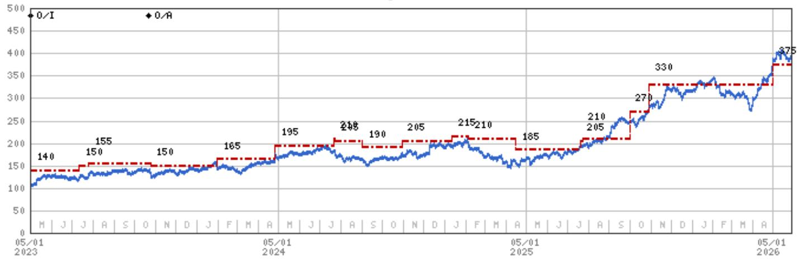

line

| Date       | Value |
| ---------- | ----- |
| 05/01 2023 | 140   |
|            | 155   |
|            | 150   |
|            | 165   |
|            | 195   |
|            | 218   |
|            | 190   |
|            | 205   |
|            | 215   |
|            | 210   |
|            | 185   |
|            | 205   |
|            | 270   |
|            | 330   |
|            | 375   |

Stock Rating History: 5/1/21 : 0/I; 10/22/23 : 0/A   
Price Target History: 4/28/21 : 128.75; 7/27/21 : 150; 11/1/21 : 160; 1/19/22 : 171.5; 2/2/22 : 172.5; 4/27/22 : 163.5;   
5/31/22 : 150; 7/18/22 : 140; 7/27/22 : 145; 10/9/22 : 135; 10/26/22 : 125; 11/14/22 : 120; 1/17/23 : 125; 2/3/23 : 135;   
4/25/23 : 140; 7/12/23 : 150; 7/26/23 : 155; 10/25/23 : 150; 1/31/24 : 165; 4/26/24 : 195; 7/22/24 : 210; 7/24/24 : 205;   
9/2/24 : 190; 10/30/24 : 205; 1/12/25 : 215; 2/5/25 : 210; 4/16/25 : 185; 7/20/25 : 205; 7/23/25 : 210; 10/1/25 : 270;   
10/30/25 : 330; 4/30/26 : 375   
Source: MS Date Format : MM/DD/YY Price Target = No Price Target Assigned (NA)   
Stock Price (Not Covered by Current Analyst) — Stock Price (Covered by Current Analyst)   
Stock and Industry Ratings (abbreviations below) appear as ♦ Stock Rating/Industry View   
Stock Ratings: Overweight (O) Equal-weight (E) Underweight (U) Not-Rated (NR) No Rating Available (NA)   
Industry View: Attractive (A) In-line (I) Cautious (C) No Rating (NR)   
Effective January 13, 2014, the stocks covered by MS Asia Pacific will be rated relative to the analyst's industry (or industry team's) coverage.   
Effective January 13, 2014, the industry view benchmarks for MS Asia Pacific are as follows: relevant MSCI country index or MSCI sub-regional index or MSCI AC Asia Pacific ex Japan Index.

Amazon.com Inc (AMZN.0) - As of 05/27/26 GMT in USD
Industry : Internet   
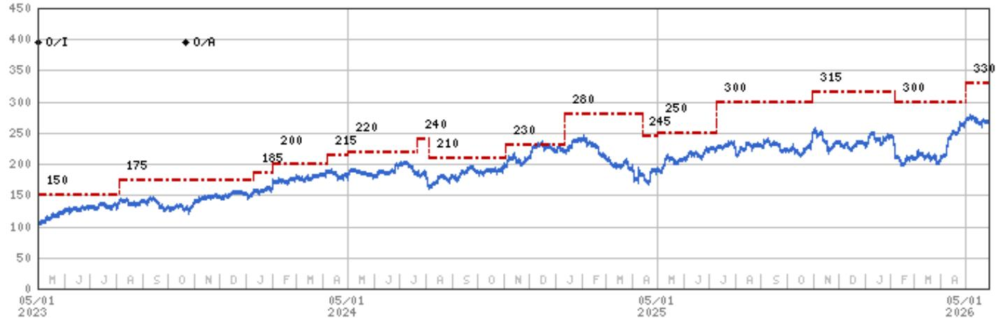

line

| Date       | Blue Line Value | Red Dashed Line Value |
|------------|-----------------|------------------------|
| 05/01 2023 | 100             | 150                    |
|            |                 |                        |
|            |                 | 175                    |
|            |                 |                        |
|            |                 | 185                    |
|            |                 | 200                    |
|            |                 | 215                    |
|            |                 | 220                    |
|            |                 | 240                    |
|            |                 | 210                    |
|            |                 | 230                    |
|            |                 | 280                    |
|            |                 | 245                    |
|            |                 | 250                    |
|            |                 | 300                    |
|            |                 | 315                    |
|            |                 | 300                    |
|            |                 | 330                    |

Stock Rating History: 5/1/21 : 0/I; 10/22/23 : 0/A   
Price Target History: 4/30/21 : 225; 7/30/21 : 215; 9/26/21 : 205; 10/29/21 : 200; 1/10/22 : 210; 4/29/22 : 190; 5/31/22 : 175;   
10/28/22 : 140; 2/3/23 : 150; 8/4/23 : 175; 1/10/24 : 185; 2/2/24 : 200; 4/7/24 : 215; 5/1/24 : 220; 7/22/24 : 240; 8/5/24 : 210;   
11/3/24 : 230; 1/12/25 : 280; 4/13/25 : 245; 5/2/25 : 250; 7/10/25 : 300; 10/31/25 : 315; 2/6/26 : 300; 4/30/26 : 330   
Source: MS Date Format : MM/DD/YY Price Target = No Price Target Assigned (NA)   
Stock Price (Not Covered by Current Analyst) — Stock Price (Covered by Current Analyst)   
Stock and Industry Ratings (abbreviations below) appear as ♦ Stock Rating/Industry View   
Stock Ratings: Overweight (O) Equal-weight (E) Underweight (U) Not-Rated (NR) No Rating Available (NA)   
Industry View: Attractive (A) In-line (I) Cautious (C) No Rating (NR)   
Effective January 13, 2014, the stocks covered by MS Asia Pacific will be rated relative to the analyst's industry (or industry team's) coverage.   
Effective January 13, 2014, the industry view benchmarks for MS Asia Pacific are as follows: relevant MSCI country index or MSCI sub-regional index or MSCI AC Asia Pacific ex Japan Index.

Meta Platforms Inc (META.0) - As of 05/27/26 GMT in USD
Industry : Internet   
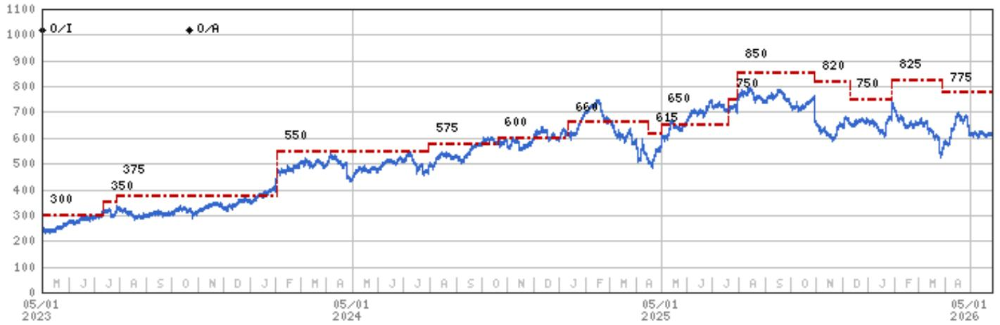

line

| Date       | Value |
| ---------- | ----- |
| 05/01 2023 | 300   |
| 05/01 2024 | 375   |
| 05/01 2024 | 550   |
| 05/01 2024 | 575   |
| 05/01 2024 | 600   |
| 05/01 2024 | 660   |
| 05/01 2024 | 615   |
| 05/01 2024 | 650   |
| 05/01 2024 | 750   |
| 05/01 2024 | 850   |
| 05/01 2024 | 820   |
| 05/01 2024 | 750   |
| 05/01 2024 | 825   |
| 05/01 2024 | 775   |

Stock Rating History: 5/1/21 : 0/I; 10/27/22 : E/I; 3/20/23 : 0/I; 10/22/23 : 0/A   
Price Target History: 4/29/21 : 375; 7/28/21 : 400; 10/26/21 : 365; 1/19/22 : 395; 2/3/22 : 360; 3/2/22 : 325; 4/28/22 : 330;   
5/31/22 : 300; 7/18/22 : 280; 8/18/22 : 225; 10/9/22 : 205; 10/27/22 : 105; 11/14/22 : 100; 1/17/23 : 130; 2/2/23 : 190;   
3/20/23 : 250; 4/26/23 : 300; 7/12/23 : 350; 7/27/23 : 375; 2/2/24 : 550; 7/31/24 : 575; 10/20/24 : 600; 1/12/25 : 660;   
4/16/25:615;5/1/25:650;7/20/25:750;7/31/25:850;10/30/25:820;12/10/25:750;1/29/26:825;3/29/26:775   
Source: MS Date Format : MM/DD/YY Price Target = No Price Target Assigned (NA)   
Stock Price (Not Covered by Current Analyst) — Stock Price (Covered by Current Analyst)   
Stock and Industry Ratings (abbreviations below) appear as ♦ Stock Rating/Industry View   
Stock Ratings: Overweight (O) Equal-weight (E) Underweight (U) Not-Rated (NR) No Rating Available (NA)   
Industry View: Attractive (A) In-line (I) Cautious (C) No Rating (NR)   
Effective January 13, 2014, the stocks covered by MS Asia Pacific will be rated relative to the analyst's industry (or industry team's) coverage.   
Effective January 13, 2014, the industry view benchmarks for MS Asia Pacific are as follows: relevant MSCI country index or MSCI sub-regional index or MSCI AC Asia Pacific ex Japan Index.

# Important Disclosures for MS Smith Barney LLC Customers

Important disclosures regarding any material conflict of interest that can reasonably be expected to have influenced MS Smith Barney LLC's choice of a third-party research provider or the subject company of a third-party research report, are available on the MS Wealth Management disclosure website at www.morganstanley.com/online/researchdisclosures. For MS specific disclosures, you may refer to https://www.morganstanley.com/eqr/disclosures/webapp/generalresearch.

Each MS report is reviewed and approved on behalf of MS Smith Barney LLC. This review and approval is conducted by the same person who reviews the research report on behalf of MS. This could create a conflict of interest.

# Other Important Disclosures

A member of Research who had or could have had access to the research prior to completion owns securities (or related derivatives) in the Uber Technologies Inc. This person is not a research analyst or a member of research analyst's household.

MS policy is to update research reports as and when the Research Analyst and Research Management deem appropriate, based on developments with the issuer, the sector, or the market that may have a material impact on the research views or opinions stated therein. In addition, certain Research publications are intended to be updated on a regular periodic basis (weekly/monthly/quarterly/annual) and will ordinarily be updated with that frequency, unless the Research Analyst and Research Management determine that a different publication schedule is appropriate based on current conditions.

MS is not acting as a municipal advisor and the opinions or views contained herein are not intended to be, and do not constitute, advice within the meaning of Section 975 of the Dodd-Frank Wall Street Reform and Consumer Protection Act.

MS produces an equity research product called a "Tactical Idea." Views contained in a "Tactical Idea" on a particular stock may be contrary to the recommendations or views expressed in research on the same stock. This may be the result of differing time horizons, methodologies, market events, or other factors. For all research available on a particular stock, please contact your sales representative or go to Matrix at http://www.morganstanley.com/matrix.

MS is provided to our clients through our proprietary research portal on Matrix and also distributed electronically by MS to clients. Certain, but not all, MS products are also made available to clients through third-party vendors or redistributed to clients through alternate electronic means as a convenience. For access to all available MS, please contact your sales representative or go to Matrix at http://www.morganstanley.com/matrix.

Any access and/or use of MS is subject to MS's Terms of Use (http://www.morganstanley.com/terms.html). By accessing and/or using MS, you are indicating that you have read and agree to be bound by our Terms of Use (http://www.morganstanley.com/terms.html). In addition you consent to MS processing your personal data and using cookies in accordance with our Privacy Policy and our Global Cookies Policy (http://www.morganstanley.com/privacy\_pledge.html), including for the purposes of setting your preferences and to collect readership data so that we can deliver better and more personalized service and products to you. To find out more information about how MS processes personal data, how we use cookies and how to reject cookies see our Privacy Policy and our Global Cookies Policy (http://www.morganstanley.com/privacy\_pledge.html). Please use the provided link to review the Terms and Conditions and Most Important Terms and Conditions for MS India Company Private Limited (https://www.morganstanley.com/assets/pdfs/about-us-global-offices/india/Terms\_and\_conditions.pdf) and the following link to review the audit report (https://ny.matrix.ms.com/eqr/research/webapp/researchdocs/

# MSICPL\_Morgan\_Stanley\_Research\_Audit\_Report.pdf).

If you do not agree to our Terms of Use and/or if you do not wish to provide your consent to MS processing your personal data or using cookies please do not access our research. MS does not provide individually tailored investment advice. MS has been prepared without regard to the circumstances and objectives of those who receive it. MS recommends that investors independently evaluate particular investments and strategies, and encourages investors to seek the advice of a financial adviser. The appropriateness of an investment or strategy will depend on an investor's circumstances and objectives. The securities, instruments, or strategies discussed in MS may not be suitable for all investors, and certain investors may not be eligible to purchase or participate in some or all of them. MS is not an offer to buy or sell or the solicitation of an offer to buy or sell any security/instrument or to participate in any particular trading strategy. The value of and income from your investments may vary because of changes in interest rates, foreign exchange rates, default rates, prepayment rates, securities/instruments prices, market indexes, operational or financial conditions of companies or other factors. There may be time limitations on the exercise of options or other rights in securities/instruments transactions. Past performance is not necessarily a guide to future performance. Estimates of future performance are based on assumptions that may not be realized. If provided, and unless otherwise stated, the closing price on the cover page is that of the primary exchange for the subject company's securities/instruments.

The fixed income research analysts, strategists or economists principally responsible for the preparation of MS have received compensation based upon various factors, including quality, accuracy and value of research, firm profitability or revenues (which include fixed income trading and capital markets profitability or revenues), client feedback and competitive factors. Fixed Income Research analysts', strategists' or economists' compensation is not linked to investment banking or capital markets transactions performed by MS or the profitability or revenues of particular trading desks.

The "Important Regulatory Disclosures on Subject Companies" section in MS lists all companies mentioned where MS owns 1% or more of a class of common equity securities of the companies. For all other companies mentioned in MS, MS may have an investment of less than 1% in securities/instruments or derivatives of securities/instruments of companies and may trade them in ways different from those discussed in MS. Employees of MS not involved in the preparation of MS may have investments in securities/instruments or derivatives of securities/instruments of companies mentioned and may trade them in ways different from those discussed in MS. Derivatives may be issued by MS or associated persons.

With the exception of information regarding MS, MS is based on public information. MS makes every effort to use reliable, comprehensive information, but we make no representation that it is accurate or complete. We have no obligation to tell you when opinions or information in MS change apart from when we intend to discontinue equity research coverage of a subject company. Facts and views presented in MS have not been reviewed by, and may not reflect information known to, professionals in other MS business areas, including investment banking personnel.

MS personnel may participate in company events such as site visits and are generally prohibited from accepting payment by the company of associated expenses unless pre-approved by authorized members of Research management.

MS may make investment decisions that are inconsistent with the recommendations or views in this report.

To our readers based in Taiwan or trading in Taiwan securities/instruments: Information on securities/instruments that trade in Taiwan is distributed by MS Taiwan Limited ("MSTL"). Such information is for your reference only. The reader should independently evaluate the investment risks and is solely responsible for their investment decisions. MS may not be distributed to the public media or quoted or used by the public media without the express written consent of MS. Any non-customer reader within the scope of Article 7-1 of the Taiwan Stock Exchange Recommendation Regulations accessing and/or receiving MS is not permitted to provide MS to any third party (including but not limited to related parties, affiliated companies and any other third parties) or engage in any activities regarding MS which may create or give the appearance of creating a conflict of interest. Information on securities/instruments that do not trade in Taiwan is for informational purposes only and is not to be construed as a recommendation or a solicitation to trade in such securities/instruments. MSTL may not execute transactions for clients in these securities/instruments.

MS is not incorporated under PRC law and the research in relation to this report is conducted outside the PRC. MS does not constitute an offer to sell or the solicitation of an offer to buy any securities in the PRC. PRC investors shall have the relevant qualifications to invest in such securities and shall be responsible for obtaining all relevant approvals, licenses, verifications and/or registrations from the relevant governmental authorities themselves. Neither this report nor any part of it is intended as, or shall constitute, provision of any consultancy or advisory service of securities investment as defined under PRC law. Such information is provided for your reference only.

MS is disseminated in Brazil by MS C.T.V.M. S.A. located at Av. Brigadeiro Faria Lima, 3600, 6th floor, São Paulo - SP, Brazil; and is regulated by the Comissão de Valores Mobiliários; in Mexico by MS México, Casa de Bolsa, S.A. de C.V which is regulated by Comision Nacional Bancaria y de Valores. Paseo de los Tamarindos 90, Torre 1, Col. Bosques de las Lomas Floor 29, 05120 Mexico City; in Japan by MS MUFG Securities Co., Ltd. and, for Commodities related research reports only, MS Capital Group Japan Co., Ltd; in Hong Kong by MS Asia Limited (which accepts responsibility for its contents) and by MS Bank Asia Limited; in Singapore by MS Asia (Singapore) Pte. (Registration number 199206298Z) and/or MS Asia (Singapore) Securities Pte Ltd (Registration number 200008434H), regulated by the Monetary Authority of Singapore (which accepts legal responsibility for its contents and should be contacted with respect to any matters arising from, or in connection with, MS) and by MS Bank Asia Limited, Singapore Branch (Registration number T14FC0118J); in Australia to "wholesale clients" within the meaning of the Australian Corporations Act by MS Australia Limited A.B.N. 67 003 734 576, holder of Australian financial services license No. 233742, which accepts responsibility for its contents; in Australia to "wholesale clients" and "retail clients" within the meaning of the Australian Corporations Act by MS Wealth Management Australia Pty Ltd (A.B.N. 19 009 145 555, holder of Australian financial services license No. 240813, which accepts responsibility for its contents; in Korea by MS & Co International plc, Seoul Branch; in India by MS India Company Private Limited having Corporate Identification No (CIN) U22990MH1998PTC115305, regulated by the Securities and Exchange Board of India ("SEBI") and holder of licenses as a Research Analyst (SEBI Registration No. INH000001105); Stock Broker (SEBI Stock Broker Registration No. INZ000244438), Merchant Banker (SEBI Registration No. INM000011203), and depository participant with National Securities Depository Limited (SEBI Registration No. IN-DP-NSDL-567-2021) having registered office at Altimus, Level 39 & 40, Pandurang Budhkar Marg, Worli, Mumbai 400018, India; Telephone no. +91-22-61181000; Compliance Officer Details: Mr. Tejarshi Hardas, Tel. No.: +91-22-61181000 or Email: tejarshi.hardas@morganstanley.com; Grievance officer details: Mr. Tejarshi Hardas, Tel. No.: +91-22-61181000 or Email: msic-compliance@morganstanley.com. MS India Company Private Limited (MSICPL) may use AI tools in providing research services. All recommendations contained herein are made by the duly qualified research analysts; in Canada by MS Canada Limited; in Germany and the European Economic Area where required by MS Europe S.E., authorised and regulated by Bundesanstalt fuer Finanzdienstleistungsaufsicht (BaFin) under the reference number 149169; in the US by MS & Co. LLC, which accepts responsibility for its contents. MS & Co. International plc, authorized by the Prudential Regulation Authority and regulated by the Financial Conduct Authority and the Prudential Regulation Authority, disseminates in the UK research that it has prepared, and research which has been prepared by any of its affiliates, only to persons who (i) are investment professionals falling within Article 19(5) of the Financial Services and Markets Act 2000 (Financial Promotion) Order 2005 (as amended, the "Order"); (ii) are persons who are high net worth entities falling within Article 49(2)(a) to (d) of the Order; or (iii) are persons to whom an invitation or inducement to engage in investment activity (within the meaning of section 21 of the Financial Services and Markets Act 2000, as amended) may otherwise lawfully be communicated or caused to be communicated. RMB MS Proprietary Limited is a member of the JSE Limited and A2X (Pty) Ltd. RMB MS Proprietary Limited is a joint venture owned equally by MS International Holdings Inc. and RMB Investment Advisory (Proprietary) Limited, which is wholly owned by FirstRand Limited. The information in MS is being disseminated by MS Saudi Arabia, regulated by the Capital Market Authority in the Kingdom of Saudi Arabia, and is directed at Sophisticated investors only.

The information in MS is being communicated by MS & Co. International plc (DIFC Branch), regulated by the Dubai Financial Services Authority (the DFSA) or by MS & Co. International plc (ADGM Branch), regulated by the Financial Services Regulatory Authority Abu Dhabi (the FSRA), and is directed at Professional Clients only, as defined by the DFSA or the FSRA, respectively. The financial products or financial services to which this research relates will only be made available to a customer who we are satisfied meets the regulatory criteria of a Professional Client. A distribution of the different MS Research ratings or recommendations, in percentage terms for Investments in each sector covered, is available upon request from your sales representative.

The information in MS is being communicated by MS & Co. International plc (QFC Branch), regulated by the Qatar Financial Centre Regulatory Authority (the QFCRA), and is directed at business customers and market counterparties only and is not intended for Retail Customers as defined by the QFCRA.

As required by the Capital Markets Board of Turkey, investment information, comments and recommendations stated here, are not within the scope of investment advisory activity. Investment advisory service is provided exclusively to persons based on their risk and income preferences by the authorized firms. Comments and recommendations stated here are general in nature. These opinions may not fit to your financial status, risk and return preferences. For this reason, to make an investment decision by relying solely to this information stated here may not bring about outcomes that fit your expectations.

The trademarks and service marks contained in MS are the property of their respective owners. Third-party data providers make no warranties or representations relating to the accuracy, completeness, or timeliness of the data they provide and shall not have liability for any damages relating to such data. The Global Industry Classification Standard (GICS) was developed by and is the exclusive property of MSCI and S&P.

MS, or any portion thereof may not be reprinted, sold or redistributed without the written consent of MS.

Indicators and trackers referenced in MS may not be used as, or treated as, a benchmark under Regulation EU 2016/1011, or any other similar framework.

The issuers and/or fixed income products recommended or discussed in certain fixed income research reports may not be continuously followed. Accordingly, investors should regard those fixed income research reports as providing stand-alone analysis and should not expect continuing analysis or additional reports relating to such issuers and/or individual fixed income products. MS may hold, from time to time, material financial and commercial interests regarding the company subject to the Research report.

Registration granted by SEBI and certification from the National Institute of Securities Markets (NISM) in no way guarantee performance of the intermediary or provide any assurance of returns to investors. Investment in securities market are subject to market risks. Read all the related documents carefully before investing.

Stock Ratings are subject to change. Please see latest research for each company.   
\* Historical prices are not split adjusted.   
INDUSTRY COVERAGE: Internet 

<table><tr><td>COMPANY (TICKER)</td><td>RATING (AS OF)</td><td>PRICE* (05/26/2026)</td></tr><tr><td colspan="3">Brian Nowak, CFA</td></tr><tr><td>Airbnb Inc (ABNB.O)</td><td>U (12/06/2022)</td><td>$132.68</td></tr><tr><td>Alphabet Inc. (GOOGL.O)</td><td>O (08/11/2015)</td><td>$388.88</td></tr><tr><td>Amazon.com Inc (AMZN.O)</td><td>O (04/24/2015)</td><td>$265.29</td></tr><tr><td>Booking Holdings Inc (BKNG.O)</td><td>O (02/23/2026)</td><td>$163.30</td></tr><tr><td>DoorDash Inc (DASH.O)</td><td>O (02/21/2024)</td><td>$154.00</td></tr><tr><td>Expedia Inc. (EXPE.O)</td><td>E (01/09/2019)</td><td>$222.97</td></tr><tr><td>Instacart (CART.O)</td><td>E (01/29/2024)</td><td>$40.53</td></tr><tr><td>Lyft Inc (LYFT.O)</td><td>E (10/24/2019)</td><td>$13.58</td></tr><tr><td>Meta Platforms Inc (META.O)</td><td>O (03/20/2023)</td><td>$612.34</td></tr><tr><td>Pinterest Inc (PINS.N)</td><td>O (07/20/2025)</td><td>$19.33</td></tr><tr><td>Reddit Inc (RDDT.N)</td><td>O (12/08/2024)</td><td>$144.64</td></tr><tr><td>Snap Inc. (SNAP.N)</td><td>E (07/22/2024)</td><td>$5.75</td></tr><tr><td>Uber Technologies Inc (UBER.N)</td><td>O (06/04/2019)</td><td>$70.12</td></tr><tr><td colspan="3">Matthew Cost</td></tr><tr><td>AppLovin Corp (APP.O)</td><td>O (04/10/2025)</td><td>$514.24</td></tr><tr><td>Compass, Inc. (COMP.N)</td><td>E (01/12/2026)</td><td>$8.30</td></tr><tr><td>Criteo SA (CRTO.O)</td><td>E (01/26/2016)</td><td>$17.03</td></tr><tr><td>DoubleVerify Holdings Inc (DV.N)</td><td>E (06/25/2024)</td><td>$9.68</td></tr><tr><td>Electronic Arts Inc (EA.O)</td><td>E (08/04/2021)</td><td>$201.13</td></tr><tr><td>MNTN Inc (MNTN.N)</td><td>E (06/16/2025)</td><td>$8.67</td></tr><tr><td>Opendoor Technologies Inc (OPEN.O)</td><td>E (07/24/2023)</td><td>$4.48</td></tr><tr><td>Playtika Holding Corp (PLTK.O)</td><td>E (11/27/2022)</td><td>$3.39</td></tr><tr><td>Roblox Corporation (RBLX.N)</td><td>O (11/04/2024)</td><td>$46.00</td></tr><tr><td>Shutterstock Inc (SSTK.N)</td><td>E (07/28/2022)</td><td>$16.14</td></tr><tr><td>Take-Two Interactive Software (TTWO.O)</td><td>O (02/01/2018)</td><td>$220.67</td></tr><tr><td>Trade Desk Inc (TTD.O)</td><td>E (09/10/2025)</td><td>$22.18</td></tr><tr><td>Unity Software Inc (U.N)</td><td>O (09/02/2024)</td><td>$26.77</td></tr><tr><td>Webtoon Entertainment Inc (WBTN.O)</td><td>E (07/22/2024)</td><td>$12.11</td></tr><tr><td>Yelp Inc (YELP.N)</td><td>U (01/10/2019)</td><td>$22.93</td></tr><tr><td>Zillow Group Inc (Z.O)</td><td>E (04/18/2018)</td><td>$35.74</td></tr><tr><td colspan="3">Nathan Feather</td></tr><tr><td>Bumble Inc. (BMBL.O)</td><td>E (03/08/2021)</td><td>$3.16</td></tr><tr><td>Chewy Inc (CHWY.N)</td><td>O (10/31/2023)</td><td>$21.25</td></tr><tr><td>Duolingo Inc (DUOL.O)</td><td>E (02/27/2026)</td><td>$106.48</td></tr><tr><td>eBay Inc (EBAY.O)</td><td>O (04/18/2024)</td><td>$115.31</td></tr><tr><td>Etsy Inc (ETSY.N)</td><td>E (07/20/2025)</td><td>$64.33</td></tr><tr><td>FIGS, Inc. (FIGS.N)</td><td>E (02/29/2024)</td><td>$12.80</td></tr><tr><td>Grindr Inc. (GRND.N)</td><td>E (02/24/2026)</td><td>$12.81</td></tr><tr><td>Match Group Inc (MTCH.O)</td><td>E (04/18/2024)</td><td>$35.95</td></tr><tr><td>Peloton Interactive, Inc. (PTON.O)</td><td>E (03/14/2022)</td><td>$5.77</td></tr><tr><td>Revolve Group Inc (RVLV.N)</td><td>E (10/20/2024)</td><td>$19.40</td></tr><tr><td>WW International Inc (WW.O)</td><td>E (08/01/2025)</td><td>$13.84</td></tr></table>

© 2026 MS