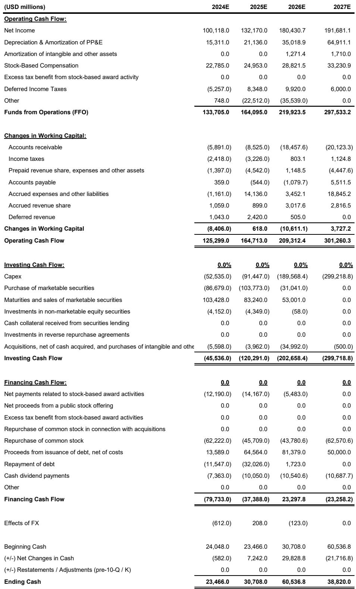
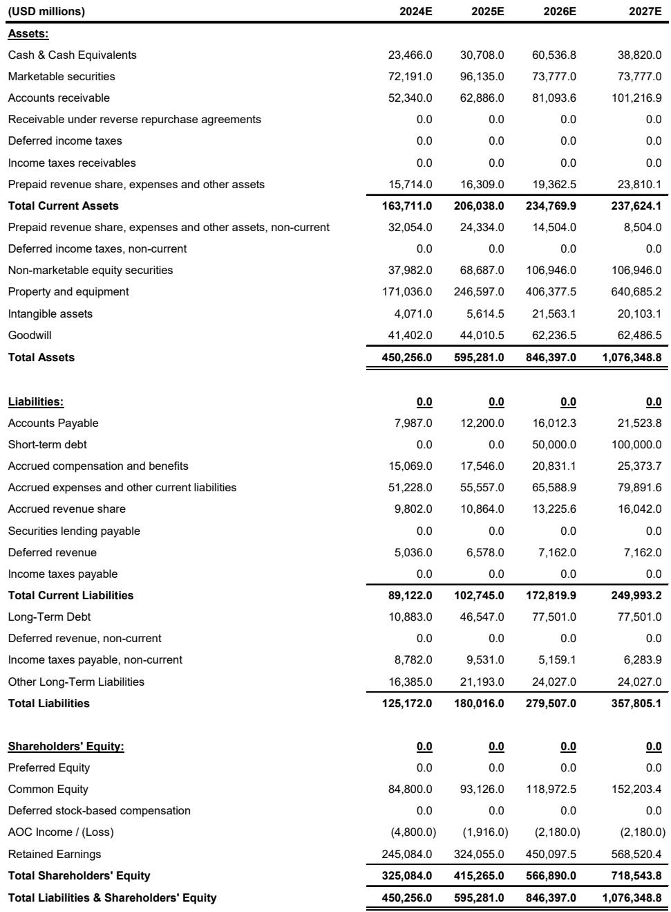
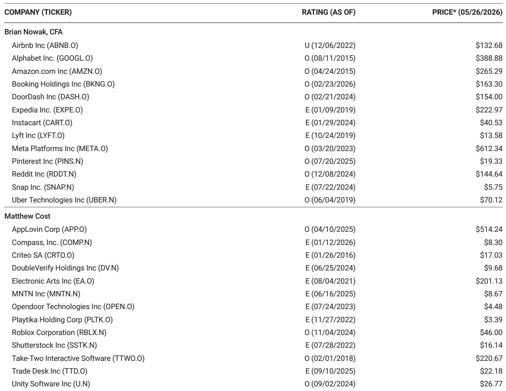

# 市场真正低估的不是需求，而是供给侧的再定价能力

关于AI基础设施投资回报的讨论，过去一年几乎都集中在同一个问题上：这些资本开支最终能否产生足够的收入。市场对此的分歧从未消失，但分歧的焦点正在发生一次重要的转移。

某外资投行最新发布的一份深度研报，通过对超大规模云厂商的资本开支进行自下而上的拆解，构建了一个此前很少被系统讨论的分析框架——每GW新增算力容量所能产生的增量收入。这个看似技术性的指标，恰恰是回答“2万亿美元资本开支到底值不值”的关键。

报告的结论值得认真对待：当前市场对AWS和Google Cloud 2027年的收入预期，不仅合理，甚至可能是保守的。而其中最被低估的，是Google Cloud的增长潜力。这不是一个关于“AI需求能否持续”的判断，而是一个关于“当供给瓶颈打开后，收入曲线会以多陡的斜率上升”的命题。

这个判断的底层逻辑并不复杂。当算力容量成为云厂商增长的核心约束时，资本开支的规模本身不再是风险，而是释放被压抑需求的必要条件。真正的问题在于，每一GW新增容量能带来多少收入，以及这个数字在不同厂商之间为何存在显著差异。

## 1. 算力容量正在从“成本项”转变为“收入驱动项”

过去两年，市场对超大规模资本开支的担忧，本质上是一种线性思维：更多的资本开支意味着更高的折旧，从而压制利润率。但这份研报提供了一个截然不同的视角——当容量本身是稀缺资源时，资本开支的扩张恰恰是收入加速的前提。

报告的自下而上模型显示，超大规模云厂商在2026年和2027年将分别新增约14GW和20GW的算力容量。这组数字本身并不令人意外，真正有洞察的是其结构：在2027年的新增容量中，约有8GW将被投入AWS和Google Cloud的公有云业务。这意味着，云厂商的收入增长曲线，将在很大程度上取决于这些新增容量何时上线、以及以多高的效率转化为收入。

这里有一个容易被忽视的要点：容量的上线时间与收入确认之间并非即时对应。报告明确指出，2025年的容量增量与公司官方指引之间存在差异，原因在于部分IT容量是在更早年份采购、但直到2025年才真正上线。这种“时间错配”意味着，当前市场看到的收入增速，反映的是更早时期的投资决策；而未来两年的收入加速，已经被今天的资本开支锁定。

对于投资者而言，这意味着一个重要的观察框架转换：与其继续争论AI需求是否真实，不如转向跟踪容量上线的时间表和每GW收入的演变趋势。

## 2. 每GW收入11-14亿美元——这个数字比看起来更有说服力

报告的核心分析工具是“每GW增量收入”。根据当前模型，AWS和Google Cloud在2027年的每GW增量收入分别在14亿美元和11亿美元左右。这个数字本身需要放在几个参照系中来理解。

第一个参照系是neo-cloud厂商。这些以出租裸金属GPU为主的云服务商，目前每瓦特收入约为10美元。换算到GW级别，意味着它们每GW的收入大约在100亿美元量级。而AWS和Google Cloud作为提供完整软件服务栈的超大规模云厂商，理应享有溢价。当前模型给出的11-14亿美元，实际上远低于neo-cloud的水平，这本身就暗示了保守性。

第二个参照系是行业谈判中的实际价格。报告提到，行业交流显示当前容量交易的谈判价格在每GW 200亿美元以上。如果这一数据具有代表性，那么当前模型中的收入假设显然留有相当大的安全边际。

第三个参照系是历史趋势。AWS的每GW增量收入从2025年的12亿美元稳步上升到2027年的14亿美元，而Google Cloud则从15亿美元下降到11亿美元。这个下降趋势是报告认为Google Cloud最可能被低估的核心原因——要么是模型假设过于保守，要么是存在尚未被充分理解的收入漏出。

这里需要特别指出的是，报告在计算Google Cloud的每GW收入时，排除了约310万单位的外部TPU销售。这些芯片销售收入在2027年可能贡献约500亿美元的增量收入，但被刻意从核心云服务收入中剥离。这一处理方式在分析上是合理的，但也意味着，如果TPU销售被视为Google Cloud整体生态系统的一部分，那么其真实的每GW收入可能远高于11亿美元。

## 3. Google Cloud的“保守”可能源于一个尚未被定价的结构性变化

报告明确表示，Google Cloud 2027年的收入预期在所有超大规模云厂商中看起来最为保守。这个判断的支撑点不仅来自每GW收入的下降趋势，更来自一个更深层的结构性变化。

当前模型假设Google Cloud在2027年实现86%的同比增长。这个数字本身已经相当惊人，但报告指出，如果容量上线顺利，实际的增长可能更快。原因在于，Google Cloud的增长驱动力正在从单纯的算力租赁转向更高附加值的AI平台服务，包括Vertex AI等模型训练和推理平台、以及TPU的生态效应。这些服务不仅单价更高，而且客户粘性更强。

报告将Google Cloud的牛市目标价从425美元上调至460美元，对应的2027年牛市EPS约为16.50美元，估值倍数从26倍提升至28倍。这个调整的幅度看似不大，但其含义是深远的：如果Google Cloud的增长超出预期，其估值体系将从“广告公司+云业务”的混合模式，向“AI平台公司”的方向重新定价。

这里有一个尚未被充分讨论的问题：Google Cloud的TPU业务究竟应该被视为硬件销售，还是AI平台生态的一部分？如果是后者，那么当前的收入模型可能系统性低估了Google Cloud的单位容量变现能力。报告没有完全回答这个问题，但它留下的分析框架已经足够让读者自行推演。

## 4. 报告尚未完全回答的关键问题：竞争格局的再分配效应

尽管报告提供了极具洞察的分析框架，但它并没有完全展开一个关键变量——当所有超大规模云厂商同时释放大量容量时，竞争格局会发生怎样的变化。

当前模型隐含的假设是，每家厂商的新增容量都能以类似的效率转化为收入。但现实可能更加复杂。如果Google Cloud的TPU生态和AI平台能力确实领先，它可能在容量释放的初期阶段获得不成比例的市场份额。反之，如果AWS的客户基数和企业关系优势更为显著，它可能在后期的收入转化中占据上风。

此外，报告没有深入讨论的一个问题是：当容量不再稀缺时，定价权会发生怎样的变化。当前的高每GW收入部分建立在供给紧张的基础之上。一旦2027年20GW的新增容量全面上线，供给端的约束将显著放松，价格竞争可能重新成为影响每GW收入的关键因素。

这个问题的答案将决定当前模型的收入假设究竟是保守还是乐观。如果供给释放后竞争加剧，每GW收入可能低于当前预期；但如果AI工作负载的增长速度超过容量释放的速度，那么当前的收入假设反而可能被证明是低估的。

## 5. 一个更务实的观察框架：从“总量”转向“结构”

对于产业决策者和投资者而言，这份报告最有价值的贡献不是它的具体数字，而是它提供了一个更精细的观察框架。

传统的分析框架关注的是总量——云厂商的总收入增速、总资本开支规模、总市场份额。但这份报告揭示了一个更有效的分析维度：每GW收入的边际变化。这个指标能够帮助判断一家云厂商的增长质量——它是在靠容量扩张驱动线性增长，还是在靠软件和服务溢价驱动非线性增长。

具体来说，跟踪以下三个信号可能比关注季度收入数字更有前瞻性。第一，容量上线的时间表是否按期推进，这决定了收入增长的“供给端”能否兑现。第二，每GW收入的趋势是上升还是下降，这反映了云厂商的变现能力是在增强还是减弱。第三，neo-cloud厂商的定价变化，它们作为“价格锚点”能够为超大规模云厂商的收入预期提供参照。

这三个信号合在一起，能够帮助判断当前市场对云厂商的定价是否合理。如果每GW收入持续高于市场预期，那么当前的估值可能仍然偏低；如果容量上线出现延迟，那么收入增长的斜率可能不及预期。

这份报告的核心价值在于，它将讨论从“AI需求是否存在”这一已无争议的问题，推进到了“供给释放后的收入转化效率”这一更具操作性的命题。对于愿意深入理解这一框架的读者，原始报告中包含的互动式成本/GW模型和积压订单分析文件，提供了进一步验证和推演的工具。这些内容在公开摘要中无法完整呈现，但恰恰是判断这一轮AI基础设施投资回报的关键素材。

欢迎来星球微信群里继续讨论这些未解问题——尤其是TPU业务的会计处理对Google Cloud真实变现能力的影响，以及竞争加剧时每GW收入可能面临的下行风险。这些细节的讨论往往比结论本身更有价值。

Personal reading notes and learning share only. Not investment advice.

