# Healthcare Technology | North America

# Digital Health 2.0: Doubling Down on HNGE and OMDA

Scar tissue in Digital Health runs deep, keeping some investors away from HNGE and OMDA. We're buyers as estimates look conservative on the back of strong execution, momentum in the self-insured market, increasing traction in fully insured, and margin upside as the platforms scale efficiently.

# Key Takeaways

On key debates of durable growth & margin expansion, our conviction is high and counter to bearish narratives (OMDA shorts are \~15% of float, HNGE \~8%)   
- Both HNGE and OMDA are \~10% penetrated within TAMs, providing a long runway for growth...   
...underpinned by strong go to market execution, health plan & PBM partnerships and increasingly effective marketing campaigns driving member activation   
We view both companies as AI winners, leveraging technology to scale platforms without adding headcount and using proprietary data to enhance member engagement   
Separately, we weigh in on the AI disruption debate for DOCS and WAY. We like DOCS' position but recognize stronger growth is needed to dispel concerns

So far, so good... Last October, within 6 months of the HNGE and OMDA IPOs, we leaned into key debates on durability of revenue growth and operating leverage, while making the case that these companies are fundamentally different than most of the prior class of Digital Health IPOs (see - Digital Health 2.0: HNGE & OMDA are charting a different path relative to peers). Since that time, both companies followed their strong inaugural Q2'25 earnings reports with 3 additional beats/raises. HNGE and OMDA both screen well on revenue growth (Exhibit 1), gross margin (Exhibit 2) and EBITDA margin (Exhibit 3) in their first year being public, as well as on Street estimates for the second year (Exhibit 8 - Exhibit 10).

...and estimates set up well for more beats to come. HNGE is outperforming the broader market and software/HCIT peers, driven by meaningful beats across revenue (Exhibit 11 - Exhibit 14), gross margin (Exhibit 15 - Exhibit 18) and EBITDA margin (Exhibit 19 - Exhibit 22) and we still see room to run in the stock. OMDA has also delivered solid upside to estimates, although the stock has been up and down, influenced by the IPO lockup and concerns over whether the company can simultaneously expand margins and sustain strong growth. We expect OMDA to play catch up to HNGE as growth and margins surprise to the upside. While the sheer magnitude of upside to estimates (especially on margins) has helped HNGE to shake off some of the negative sentiment that plagues the group, many investors are still on the fence. Instead of anchoring to the past Digital Health business

MS & CO. LLC

# Craig Hettenbach

Equity Analyst

Craig.Hettenbach@morganstanley.com +1 212 761-6435

# Jialin Jin

Research Associate

Jay.Jin@morganstanley.com +1 212 761-3913

# John Y Park

Research Associate

John.Park@morganstanley.com +1 212 761-4029

# Erin Wright

Equity Analyst

Erin.Wright1@morganstanley.com +1 212 761-6137

# Linda Bolduc

Equity Analyst

Linda.Bolduc@morganstanley.com +1 617 856-8009

# Michelle Foley

Research Associate

Michelle.Foley@morganstanley.com +1 212 761-4056

# Natasha Arya

Research Associate

Natasha.Arya@morganstanley.com +1 212 761-6294

# HEALTHCARE TECHNOLOGY

North America

Industry View

In-Line

MS does and seeks to do business with companies covered in MS. As a result, investors should be aware that the firm may have a conflict of interest that could affect the objectivity of MS. Investors should consider MS as only a single factor in making their investment decision.

For analyst certification and other important disclosures, refer to the Disclosure Section, located at the end of this report.

models that failed to scale, take a fresh look at what sets HNGE and OMDA apart. The biggest risks to our bullish view on the stocks are: execution, competition and macro (any weakening in employment trends).

Exhibit 1: Hinge and Omada posted above-average growth in their first year as public companies...   
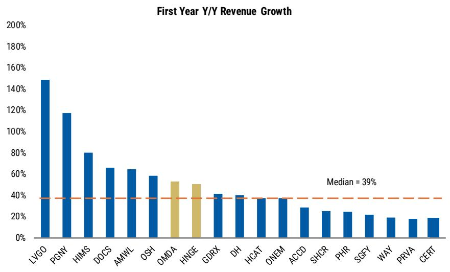

bar

| Ticker | First Year Y/Y Revenue Growth |
| ------ | ----------------------------- |
| LVGO   | 150%                          |
| PGNY   | 120%                          |
| HIMS   | 80%                           |
| DOCS   | 65%                           |
| AMWL   | 65%                           |
| OSH    | 60%                           |
| OMDA   | 55%                           |
| HINGE  | 50%                           |
| GDRX   | 40%                           |
| DH     | 40%                           |
| HCAT   | 35%                           |
| ONEM   | 35%                           |
| ACCD   | 30%                           |
| SHCR   | 25%                           |
| PHR    | 25%                           |
| SGFY   | 20%                           |
| WAY    | 20%                           |
| PRVA   | 15%                           |
| CERT   | 15%                           |

Source: MS, FactSet, Note: CHNG saw growth of 1,470%

Exhibit 2: ...With Hinge screening favorably and Omada in-line on GM...   
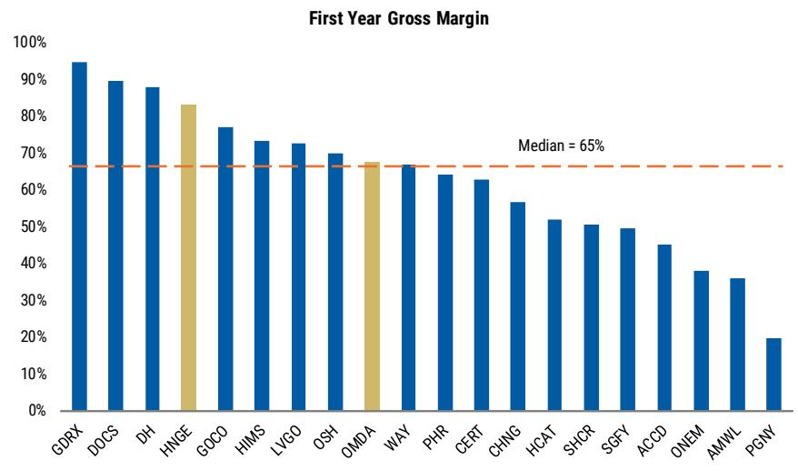

bar

| Ticker | Gross Margin |
| ------ | ------------ |
| GDRX   | 95%          |
| DOCS   | 90%          |
| DH     | 88%          |
| HNGE   | 83%          |
| GOCO   | 77%          |
| HIMS   | 73%          |
| LVGO   | 72%          |
| OSH    | 70%          |
| OMDA   | 68%          |
| WAY    | 67%          |
| PHR    | 64%          |
| CERT   | 63%          |
| CHNG   | 57%          |
| HCAT   | 52%          |
| SHCR   | 51%          |
| SGFY   | 50%          |
| ACOD   | 45%          |
| ONEM   | 38%          |
| AMWL   | 36%          |
| PGNY   | 20%          |

Source: MS, FactSet

Exhibit 3: ...And Hinge well ahead on EBITDA margin and Omada below   
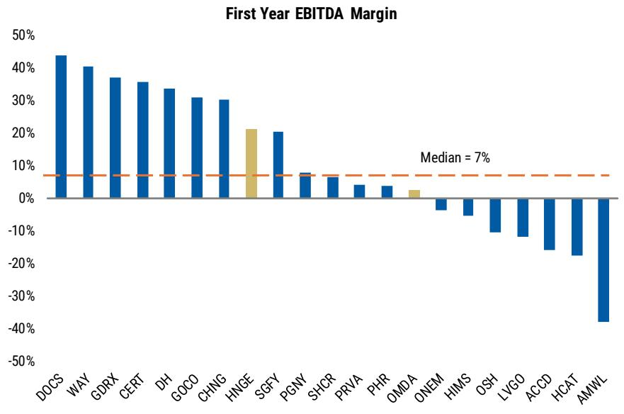

bar

First Year EBITDA Margin
| Company | First Year EBITDA Margin (%) |
| :--- | :--- |
| DOCS | 43.5 |
| WAY | 40.2 |
| GDRX | 36.8 |
| CERT | 35.5 |
| DH | 33.5 |
| GOCO | 31.0 |
| CHNG | 30.2 |
| HNGE | 21.0 |
| SGFY | 20.0 |
| PGNY | 7.5 |
| SHCR | 6.5 |
| PRVA | 4.0 |
| PHR | 3.5 |
| OMDA | 2.5 |
| ONEM | -3.0 |
| HIMS | -5.0 |
| OSH | -9.0 |
| LVGO | -11.0 |
| ACCD | -15.0 |
| HCAT | -17.0 |
| AMWL | -38.0 |
Median = 7%

Source: MS, FactSet

Hinge and Omada are still in the early innings of a large, underpenetrated opportunity (Exhibit 4 and Exhibit 5). For Hinge, business momentum is accelerating, with the self-insured segment rising to 22.6mn lives (up from 19mn in 2024) reflecting growing adoption for its virtual MSK offering. The non-self-insured segment grew even stronger (135% Y/Y in 2025) from a lower base, driven by an expanding set of health plan partnerships and growing recognition of the company's clinical outcomes data (see - New Customer Deep Dive Analysis Increases Our Conviction In Upside Drivers).

For Omada, many employers still lack a digital chronic condition solution and several structural tailwinds should help sustain its growth, including point solution fatigue among employers, a surge in GLP-1 demand/need to drive better results to justify the drug spend, and the growing recognition of Diabetes/Hypertension as top healthcare cost concerns. Omada is scratching the surface in the MA market, with an opportunity to help payor partners address multi-condition chronic care including GLP-1 support (see - CEO and CFO call underscores broad-based momentum in the business).

Exhibit 4: Hinge Health TAM   
Penetration   
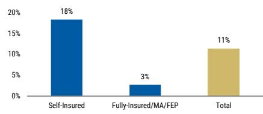

bar

| Category                  | Value |
| ------------------------- | ----- |
| Self-Insured              | 18%   |
| Fully-Insured/MA/FEP      | 3%    |
| Total                     | 11%   |

Source: MS, Company filings as of 2025.

Exhibit 5: Omada Health TAM   
Penetration   
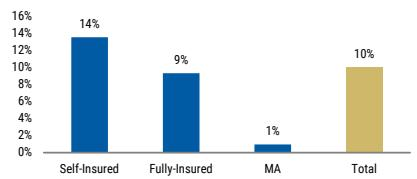

bar

| Category       | Percentage |
| -------------- | ---------- |
| Self-Insured   | 14%        |
| Fully-Insured  | 9%         |
| MA             | 1%         |
| Total          | 10%        |

Source: MS, Company filings as of 2024.

App downloads for Hinge and Omada highlight strengthening competitive positioning (Exhibit 6 and Exhibit 7). Hinge Health remains the dominant player in the digital MSK space, about 2-3x larger than the next largest operator even after the Sword/Kaia combination according to the company (see - The Wall of Worry has exhausted all bricks; Buy HNGE). As of the 4Q'25, Hinge ended the year with an overall head-to-head competitive win rate at an all-time high and saw several meaningful competitive conversions.

Omada Health faces direct competition from a range of digital programs, including Livongo (via Teladoc, TDOC), Hello Heart, Lark, Onduo, and Vida. For Livongo, while the chronic care enrollment reached 1.2mn as of 1Q'26, growth has moderated to between -1% to +4% since 2025 well below the triple-digit growth rates of the pre-merger era.

# Competitive developments:

- American Specialty Health (ASH) launched its EmpoweredDecisions! Digital MSK self-care recovery solution in January 2026, now available to 100mn eligible members. ASH explicitly markets its platform as offering savings of 50–70% compared to many other digital MSK programs. In April 2026, ASH further expanded its Digital MSK Platform with a new injury prevention module.   
- Sidekick Health (private) announced the launch of its MSK health program and pain management support in April 2026, joining its existing platform of 24+ conditions spanning cardiometabolic, oncology, behavioral health, and women's health.

Exhibit 6: Hinge continues to screen as 2-3x the size of next largest competitor Sword based on monthly app downloads   
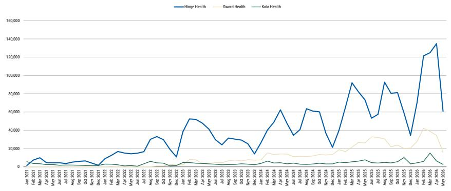  
Source: MS, SensorTower, AlphaWise

Exhibit 7: Omada has broken away from the pack on monthly app downloads, highlighting increasing momentum for its multi-condition platform   
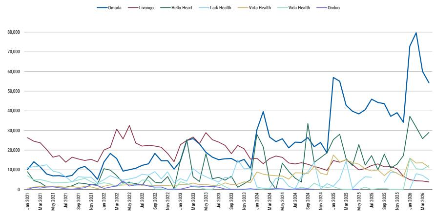  
Source: MS, SensorTower, AlphaWise

# Doximity (DOCS, OW)—Digital Health 1.0 winner experiencing growing pains.

While Doximity's business has experienced bouts of volatility since it came public nearly 5 years ago, nonetheless the company has demonstrated the ability to simultaneously grow rapidly and expand margins, leveraging its differentiated platform. That said, y/y growth has recently decelerated to only 5% in the last quarter and the company guided to just 4% y/y growth in FY27 (March year end), further igniting concerns over competition (see - Double whammy of softer revenue outlook and increased investment). Net, net while DOCS is in the penalty box following disappointments in the past 2 quarters, we're positive on the opportunity to monetize increasing traction for DoxGPT.

In the age of AI, OpenEvidence is largely viewed as the winner (for more details, please see - Private Company Research Series: A Deeper Dive into OpenEvidence). The company has gained meaningful traction, reaching approximately 1.5mn unique web visitors, 9.8mn total visits, roughly 58k monthly app downloads in March (see - Web Traffic and time spent on the platform are expanding, even as OpenEvidence ramps). Not to be outdone, Doximity's usage metrics continue to improve despite momentum at this new entrant, with unique web visitors rose to approximately 4.1mn, total visits reached 8.3mn, and monthly downloads holding steady at \~20k in March. Furthermore, Doximity noted that benchmark workflow engagement exceeded 800k unique quarterly active prescribers in fiscal 4Q'26 (up roughly 30% y/y) with nearly half of those prescribers using its AI tools during the quarter.

Since the Pathway acquisition, Doximity's AI Search and Scribe active users have tripled and users averaged 31 queries in the most recent month, nearly double January levels. Importantly, the company's distribution is rapidly expanding to 140 health systems purchasing its Clinical AI Suite, including 7 of the top 20 hospitals, with more than 250k prescribers having access through a hospital-approved workflow. For more details on the company's AI strategy, see A closer look into DoxGPT as the AI opportunity begins to take shape.

Waystar (WAY, EW)—The AI debate will take time to settle; Analyst Day in late August is an important catalyst. The company is already embedding AI in its revenue cycle platform (management cites \~50% of solutions), although faces AI threats from 2 vectors. First, foundational LLM platforms are developing agentic capabilities that can reason coverage policy, assemble prior authorization packets, and improve documentation & coding. Second, ambient AI scribe capabilities are expanding to automate upstream processes that feed into RCM, pulling mid-cycle work (e.g. documentation, coding, charge capture) into EHR-native platforms. For additional background, please see Private Company Research Series: Ambient AI Scribes Take Healthcare By Storm and Private Company Research Series: Discussions with the Founders of Commure and Ambience. Even though these alternative solutions do not replace Waystar's clearing house rails or payor connectivity (5,000 connections + 2.5mn claims edits), they represent a medium to longer-term risk as the healthcare providers re-evaluate their vendors and look to drive cost efficiencies. For more information on Waystar's AI solution suite and deeper look into the company, please see - Innovation Showcase Event: Delivering technology advancements in RCM and Patience required for a re-rating; Initiate at Equal-weight.

# Performance During the Second Year as Public Companies

Exhibit 8: Hinge screens above peers and Omada slightly below on revenue growth in the year after IPO...   
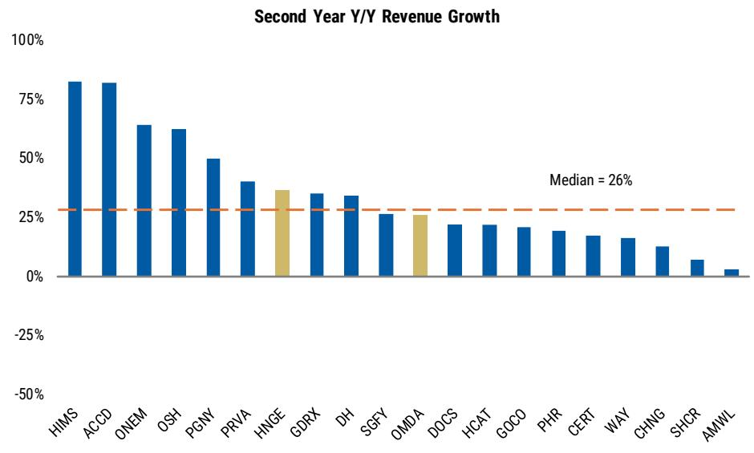

bar

| Ticker | Second Year Y/Y Revenue Growth |
| ------ | ----------------------------- |
| HIMS   | 80%                           |
| ACCD   | 80%                           |
| ONEM   | 65%                           |
| OSH    | 65%                           |
| PGNY   | 50%                           |
| PRVA   | 40%                           |
| HINGE  | 35%                           |
| GDRX   | 35%                           |
| DH     | 35%                           |
| SGFY   | 25%                           |
| OMDA   | 25%                           |
| DOCS   | 20%                           |
| HCAT   | 20%                           |
| GOCO   | 20%                           |
| PHR    | 15%                           |
| CERT   | 15%                           |
| WAY    | 15%                           |
| CHNG   | 10%                           |
| SHCR   | 5%                            |
| AMWL   | 0%                            |

Source: MS, FactSet, Note: HNGE and OMDA are Street Estimates

Exhibit 9: ...With both companies demonstrating stronger GM performance...   

bar

Second Year Gross Margin
| Company | Second Year Gross Margin (%) |
| :--- | :--- |
| GDRX | 94 |
| DOCS | 90 |
| DH | 88 |
| HNGE | 85 |
| GOCO | 77 |
| HMS | 75 |
| WAY | 69 |
| OMDA | 68 |
| PHR | 65 |
| CERT | 63 |
| CHNG | 59 |
| HCAT | 50 |
| SGFY | 49 |
| ACCD | 47 |
| SHCR | 46 |
| AMWL | 41 |
| ONEM | 30 |
| PGNY | 20 |
| PRVA | 16 |
| OSH | 2 |

Source: MS, FactSet, Note: HNGE and OMDA are Street Estimates

Exhibit 10: ...And Hinge EBITDA margins well above and Omada in-line   
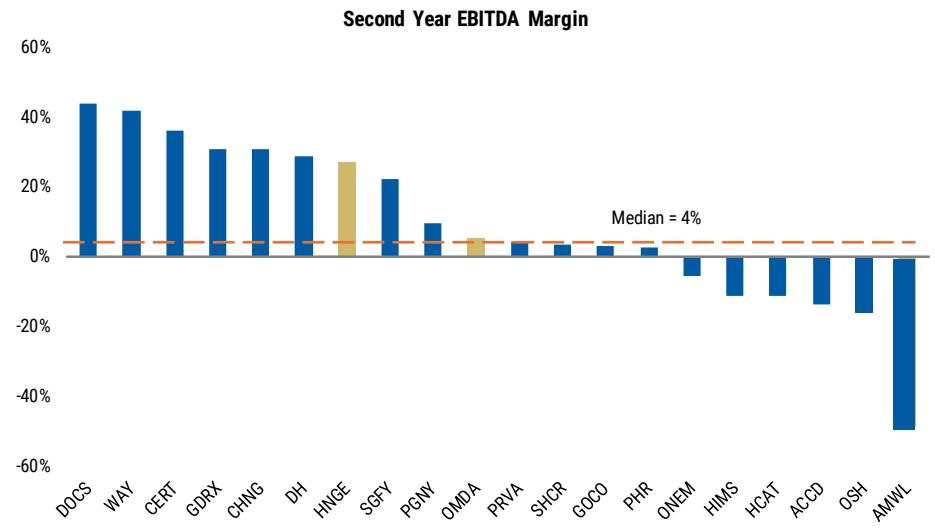

bar

Second Year EBITDA Margin
| Company | Second Year EBITDA Margin (%) |
| :--- | :--- |
| DOCS | 43 |
| WAY | 41 |
| CERT | 36 |
| GDRX | 30 |
| CHNG | 30 |
| DH | 28 |
| HNIGE | 26 |
| SGFY | 21 |
| PGNY | 9 |
| OMDA | 4 |
| PRVA | 3 |
| SHCR | 2 |
| GOCO | 2 |
| PHR | 1 |
| ONEM | -5 |
| HIMS | -10 |
| HCAT | -10 |
| ACCD | -12 |
| OSH | -15 |
| AMWL | -50 |
Median = 4%

Source: MS, FactSet, Note: HNGE and OMDA are Street Estimates

# Revenue Surprise History

Exhibit 11: First Earnings Report   
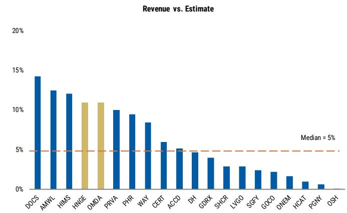

bar

| Category | Value |
| -------- | ----- |
| DOCS     | 14%   |
| AMWL     | 12%   |
| HIMS     | 12%   |
| HNGE     | 11%   |
| OMDA     | 11%   |
| PRVA     | 10%   |
| PHR      | 9%    |
| WAY      | 8%    |
| CERT     | 6%    |
| ACCD     | 5%    |
| DH       | 5%    |
| GDRX     | 4%    |
| SHCR     | 3%    |
| LVGO     | 3%    |
| SGFY     | 2%    |
| GOCO     | 2%    |
| ONEM     | 2%    |
| HCAT     | 1%    |
| PGNY     | 1%    |
| OSH      | 0%    |

Source: MS, FactSet

Exhibit 12: Second Earnings Report   
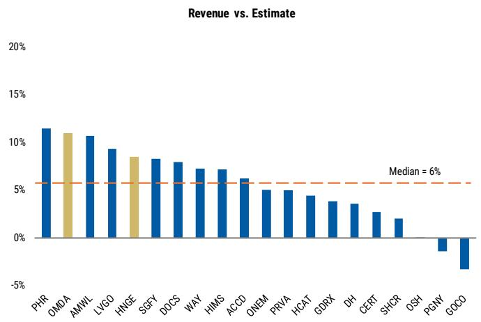

bar

| Category | Value |
| -------- | ----- |
| PHR      | 11.5% |
| OMDA     | 11.0% |
| AMWL     | 10.5% |
| LVGO     | 9.5%  |
| HNGE     | 8.5%  |
| SGFY     | 8.0%  |
| DOCS     | 7.5%  |
| WAY      | 7.0%  |
| HIMS     | 6.5%  |
| ACCD     | 6.0%  |
| ONEM     | 5.0%  |
| PRVA     | 4.5%  |
| HCAT     | 4.0%  |
| GDRX     | 3.5%  |
| DH       | 3.0%  |
| CERT     | 2.5%  |
| SHCR     | 2.0%  |
| OSH      | -1.0% |
| PGNV     | -2.0% |
| GOCO     | -3.0% |

Source: MS, FactSet

Exhibit 13: Third Earnings Report   
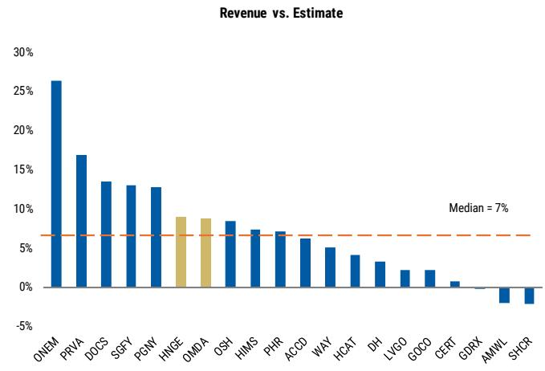

bar

| Company | Revenue vs. Estimate |
|---------|----------------------|
| ONEM    | 26%                  |
| PRVA    | 17%                  |
| DOCS    | 14%                  |
| SGFY    | 13%                  |
| PGNY    | 13%                  |
| HNGE    | 9%                   |
| OMDA    | 9%                   |
| OSH     | 8%                   |
| HIMS    | 7%                   |
| PHR     | 7%                   |
| ACCD    | 6%                   |
| WAY     | 5%                   |
| HCAT    | 4%                   |
| DH      | 3%                   |
| LVGO    | 2%                   |
| GOCO    | 2%                   |
| CERT    | 1%                   |
| GDRX    | -1%                  |
| AMWL    | -2%                  |
| SHCR    | -3%                  |

Source: MS, FactSet

Exhibit 14: Fourth Earnings Report   
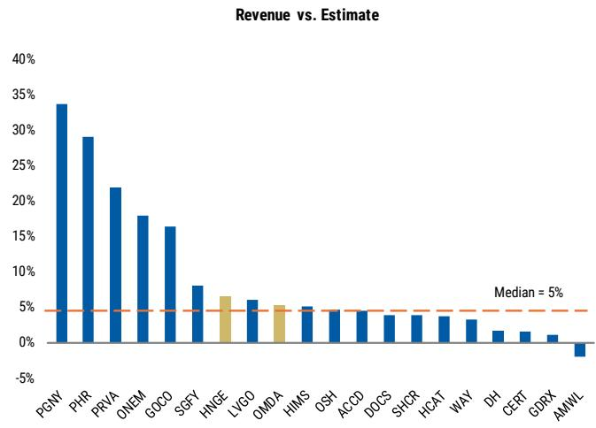

bar

| Ticker | Revenue vs. Estimate |
| ------ | --------------------- |
| PGNY   | 34%                   |
| PHR    | 29%                   |
| PRVA   | 22%                   |
| ONEM   | 18%                   |
| GOCO   | 16%                   |
| SSFT   | 8%                    |
| HNGE   | 6%                    |
| LVGO   | 6%                    |
| OMDA   | 5%                    |
| HIMS   | 5%                    |
| OSH    | 4%                    |
| ACCD   | 4%                    |
| DOCS   | 4%                    |
| SHCR   | 4%                    |
| HCAT   | 4%                    |
| WAY    | 3%                    |
| DH     | 2%                    |
| CERT   | 2%                    |
| GDRX   | 1%                    |
| AMWL   | -2%                   |

Source: MS, FactSet

# GM Surprise History

Exhibit 15: First Earnings Report   
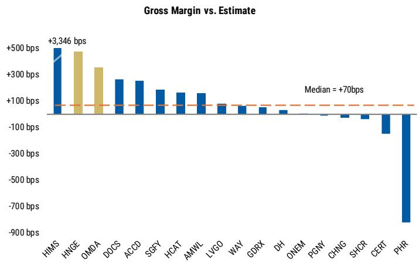

bar

| Ticker | Gross Margin (bps) |
| ------ | ------------------ |
| HIMS   | +3,346             |
| HNGE   | +3,346             |
| OMDA   | +300               |
| DOCS   | +250               |
| ACCD   | +200               |
| SGFY   | +150               |
| HCAT   | +100               |
| AMWL   | +100               |
| LVGO   | +50                |
| WAY    | +50                |
| GDRX   | +50                |
| DH     | +50                |
| ONEM   | +50                |
| PGNV   | +50                |
| CHNG   | +50                |
| SHCR   | +50                |
| CERT   | -100               |
| PHR    | -800               |

Source: MS, FactSet

Exhibit 16: Second Earnings Report   
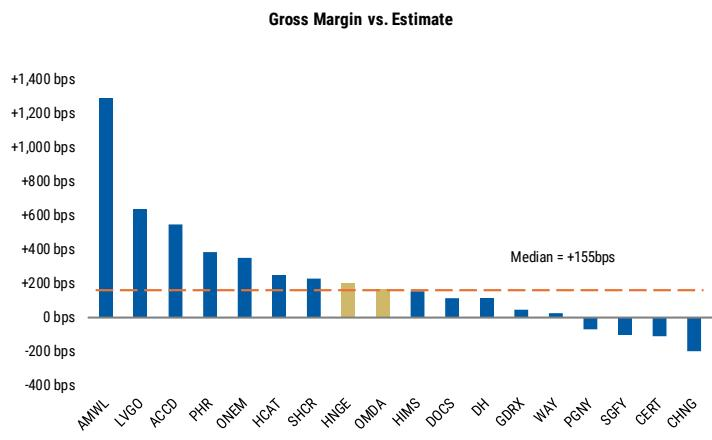

bar

| Ticker | Gross Margin (bps) |
| ------ | ------------------ |
| AMWL   | +1300              |
| LVGO   | +600               |
| ACCD   | +500               |
| PHR    | +400               |
| ONEM   | +350               |
| HCAT   | +250               |
| SHCR   | +200               |
| HNGE   | +200               |
| OMDA   | +155               |
| HIMS   | +155               |
| DOCS   | +100               |
| DH     | +100               |
| GDRX   | +50                |
| WAY    | +25                |
| PGNY   | -50                |
| SGFY   | -75                |
| CERT   | -100               |
| CHNG   | -200               |

Source: MS, FactSet

Exhibit 17: Third Earnings Report   
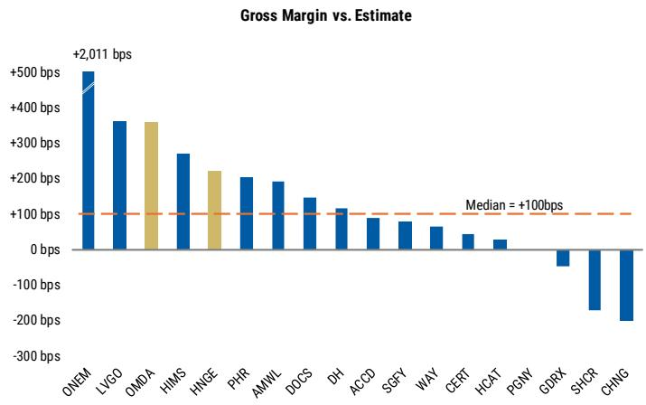

bar

| Ticker | Gross Margin (bps) |
| ------ | ------------------ |
| ONEM   | +2,011             |
| LVGO   | 350                |
| OMDA   | 350                |
| HIMS   | 270                |
| HNGE   | 220                |
| PHR    | 200                |
| AMWL   | 190                |
| DOCS   | 140                |
| DH     | 110                |
| ACCD   | 80                 |
| SGFY   | 70                 |
| WAY    | 60                 |
| CERT   | 40                 |
| HCAT   | 20                 |
| PGNY   | -50                |
| GDRX   | -150               |
| SHCR   | -200               |
| CHNG   | -220               |

Source: MS, FactSet

Exhibit 18: Fourth Earnings Report   
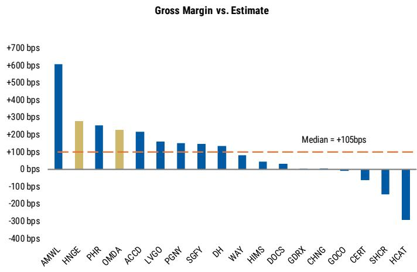

bar

| Ticker | Gross Margin (bps) |
| ------ | ------------------ |
| AMWL   | 600                |
| HNGE   | 280                |
| PHR    | 250                |
| OMDA   | 230                |
| ACCD   | 210                |
| LVGO   | 160                |
| PGNV   | 140                |
| SGFY   | 130                |
| DH     | 120                |
| WAY    | 80                 |
| HIMS   | 40                 |
| DOCS   | 20                 |
| GDRX   | 10                 |
| CHNG   | 5                  |
| GOCO   | -5                 |
| CERT   | -100               |
| SHCR   | -150               |
| HCAT   | -300               |

Source: MS, FactSet

# EBITDA Surprise History

Exhibit 19: First Earnings Report   
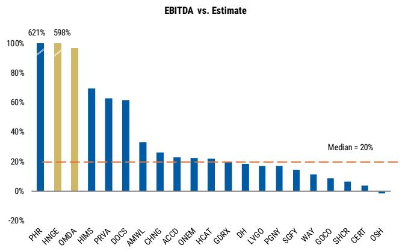

bar

| Category | Value  |
| -------- | ------ |
| PHR      | 621%   |
| HINGE    | 598%   |
| OMDA     | 598%   |
| HIMS     | 70%    |
| PRVA     | 62%    |
| DOCS     | 60%    |
| AMWL     | 32%    |
| CHNG     | 26%    |
| ACCD     | 22%    |
| ONEM     | 22%    |
| HCAT     | 22%    |
| GDRX     | 20%    |
| DH       | 18%    |
| LVGO     | 18%    |
| PGNV     | 18%    |
| SGFY     | 14%    |
| WAY      | 12%    |
| GOCO     | 8%     |
| SHGR     | 6%     |
| CERT     | 4%     |
| OSH      | 0%     |

Source: MS, FactSet

Exhibit 20: Second Earnings Report   
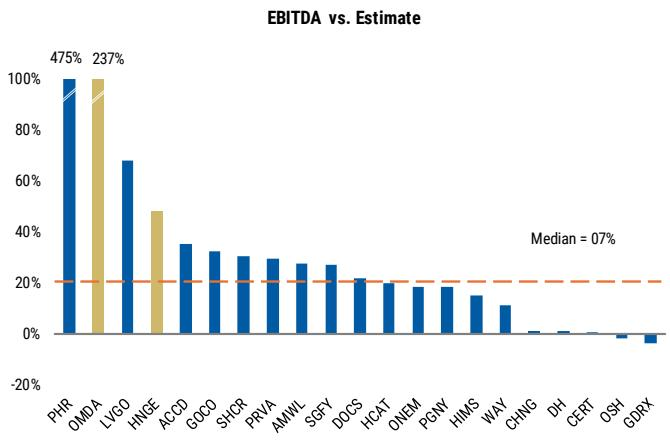

bar

| Category | Value  |
| -------- | ------ |
| PHR      | 475%   |
| OMDA     | 237%   |
| LVGO     | 68%    |
| HNGE     | 48%    |
| ACCD     | 35%    |
| GOCO     | 32%    |
| SHCR     | 30%    |
| PRVA     | 29%    |
| AMWL     | 28%    |
| SGFY     | 26%    |
| DOCS     | 21%    |
| HCAT     | 20%    |
| ONEM     | 18%    |
| PGNY     | 17%    |
| HIMS     | 15%    |
| WAY      | 12%    |
| CHNG     | 1%     |
| DH       | 1%     |
| CERT     | 0%     |
| OSH      | -1%    |
| GDRX     | -2%    |

Source: MS, FactSet

Exhibit 21: Third Earnings Report   
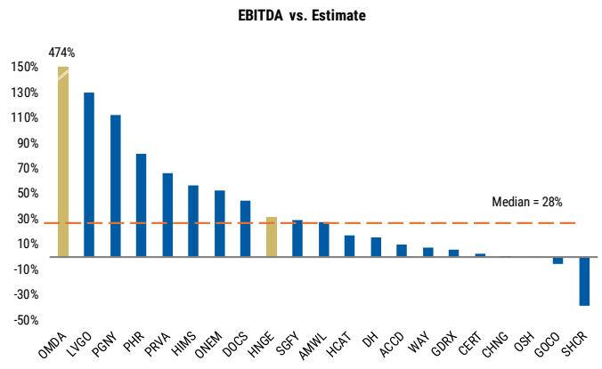

bar

| Ticker | EBITDA vs. Estimate |
| ------ | ------------------- |
| OMDA   | 474%                |
| LVGO   | 130%                |
| PGNV   | 110%                |
| PHR    | 80%                 |
| PRVA   | 65%                 |
| HIMS   | 55%                 |
| ONEM   | 50%                 |
| DOCS   | 40%                 |
| HNGE   | 30%                 |
| SGFY   | 25%                 |
| AMWL   | 20%                 |
| HCAT   | 15%                 |
| DH     | 10%                 |
| ACCD   | 5%                  |
| WAY    | 0%                  |
| GDRX   | -5%                 |
| CERT   | -10%                |
| CHNG   | -15%                |
| OSH    | -20%                |
| GOCO   | -25%                |
| SHCR   | -30%                |

Source: MS, FactSet

Exhibit 22: Fourth Earnings Report   
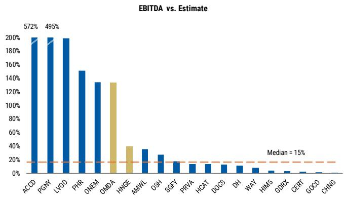

bar

| Company | EBITDA vs. Estimate |
|---------|---------------------|
| ACCD    | 572%                |
| PGNY    | 495%                |
| LVGO    | 200%                |
| PHR     | 150%                |
| ONEM    | 135%                |
| OMDA    | 135%                |
| HNGE    | 40%                 |
| AMWL    | 35%                 |
| OSH     | 25%                 |
| SGFY    | 15%                 |
| PRVA    | 10%                 |
| HCAT    | 10%                 |
| DOCS    | 10%                 |
| DH      | 10%                 |
| WAY     | 5%                  |
| HIMS    | 5%                  |
| GBRX    | 5%                  |
| CERT    | 5%                  |
| GOCO    | 5%                  |
| CHNG    | 5%                  |

Source: MS, FactSet

# Risk Reward – Hinge Health Inc (HNGE.N)

Overweight on above-average growth and high gross margin underpinned by AI

# PRICE TARGET \$72.00

\~20x EV/EBITDA, which is in line with the mean multiple of the 1st quartile of SMID software. We estimate EBITDA margins of 30% for 2027, which is above 1st quartile SMID software peers at 21%.

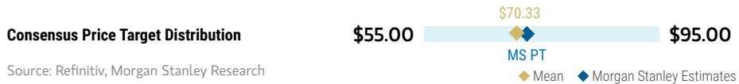

bar_line

| Category | Value   |
| -------- | ------- |
| MS PT    | $70.33  |
| Mean     | $95.00  |

RISK REWARD CHART   
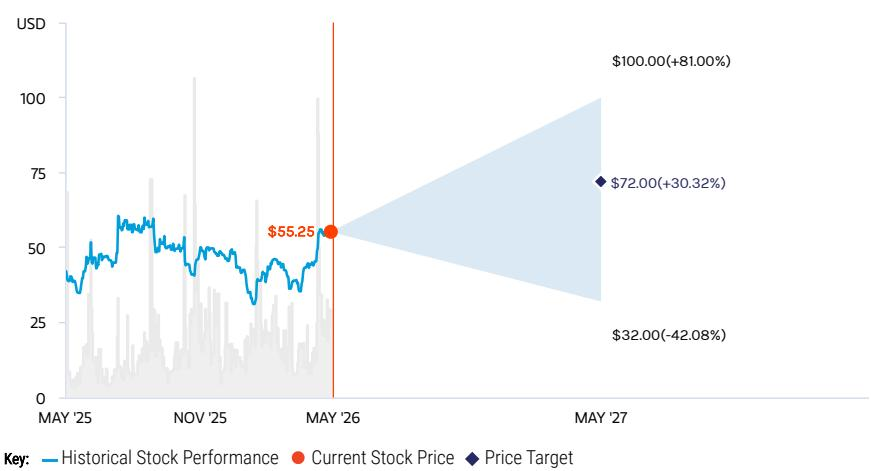

line

| Date       | Historical Stock Performance | Current Stock Price | Price Target |
| ---------- | ----------------------------- | ------------------- | ------------ |
| MAY '26    | $55.25                        | $55.25              | $55.25       |
| MAY '27    | $32.00 (-42.08%)              | $72.00 (+30.32%)   | $100.00 (+81.00%) |

Source: Refinitiv, MS

# OVERWEIGHT THESIS

We are Overweight HNGE, highlighting the most compelling tangible use case of AI adoption in our coverage. Relative to broad-based investor concerns that digital health companies are unable to simultaneously drive strong growth and expand margins, we see Hinge's business model punching through. At \~25mn contracted lives, Hinge is only 8% penetrated in its SAM. Furthermore, there's plenty of room to drive member yield beyond 3.9% relative to the 9% yield in the physical therapy market. Furthermore, Hinge has already demonstrated high GM of 83% by leveraging technology and we see upside to operating margin as sales leverage kicks in.

Consensus Rating Distribution   
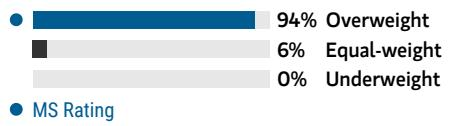

bar

| Category     | Value |
| ------------ | ----- |
| Overweight   | 94%   |
| Equal-weight | 6%    |
| Underweight  | 0%    |

Source: Refinitiv, MS

# Risk Reward Themes

Disruption: Positive

Technology Diffusion: Positive

View descriptions of Risk Rewards Themes here

# BULL CASE

# \$100.00

# BASE CASE

# \$72.00

# BEAR CASE

# \$32.00

# 22x EV/EBITDA on our 2027 bull case EBITDA

Based on a 22x EV/EBITDA multiple on our bull estimate of \$364mn. In our Bull case, we model a 33% revenue CAGR (500 bps above base case), reflecting higher than expected member growth as Hinge further penetrates the self-insured/fully-insured/MA markets, introduces new products, expands into government/international markets. We estimate margins expand to 35%, or 5% point above our base case on additional leverage form AI/technology investments.

# \~20x EV/EBITDA on 2027 base case EBITDA

Based on a \~20x EV/EBITDA multiple on our base estimate of \$288mn. This multiple is 1.5x turns below the mean multiple of the 1st quartile of SMID software, despite HNGE's much stronger growth profile (2-year revenue CAGR ending CY27 of 28% and EBITDA margin of 30%, well above comps at 18% CAGR and 21% margin).

# 12x EV/EBITDA on our 2027 bear case EBITDA

Based on a 12x EV/EBITDA multiple on our bear estimate of \$188mn. The multiple is in line with the average multiple of the 2nd quartile of SMID software peers and margins 800 bps below our base case and in line with comps.

# Risk Reward – Hinge Health Inc (HNGE.N)

KEY EARNINGS INPUTS 

<table><tr><td>Drivers</td><td>2025</td><td>2026e</td><td>2027e</td><td>2028e</td></tr><tr><td>Members ($, 000s)</td><td>783</td><td>1,026</td><td>1,202</td><td>1,359</td></tr><tr><td>Yield (%)</td><td>3.90</td><td>4.10</td><td>4.14</td><td>4.18</td></tr><tr><td>Gross Margin (%)</td><td>83.2</td><td>85.2</td><td>85.7</td><td>86.2</td></tr></table>

# INVESTMENT DRIVERS

• Lives and member growth   
- Yield

# GLOBAL REVENUE EXPOSURE

100%

North America

Source: MS Estimate View explanation of regional hierarchies here

# RISKS TO PT/RATING

# RISKS TO UPSIDE

• Higher than expected contracted lives   
- Greater than expected yield through new programs/marketing initiatives   
- Upside to margins driven by technology and sales leverage

# RISKS TO DOWNSIDE

- Lower than expected member utilization   
- Macro uncertainty impacting sales cycles & demand   
- Sales channel concentration leading to risk of client loss

OWNERSHIP POSITIONING 

<table><tr><td>Inst. Owners, % Active</td><td>81.6%</td><td></td><td></td></tr><tr><td>HF Sector Long/Short Ratio</td><td>2.3x</td><td></td><td></td></tr><tr><td>HF Sector Net Exposure</td><td>20.2%</td><td></td><td></td></tr></table>

Refinitiv; MSPB Content. Includes certain hedge fund exposures held with MSPB. Information may be inconsistent with or may not reflect broader market trends. Long/Short Ratio = Long Exposure / Short exposure. Sector % of Total Net Exposure = (For a particular sector: Long Exposure - Short Exposure) / (Across all sectors: Long Exposure – Short Exposure).

# MS ESTIMATES VS. CONSENSUS

FY Dec 2026e

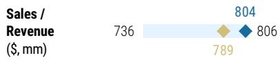

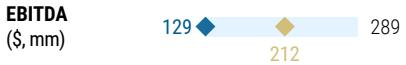

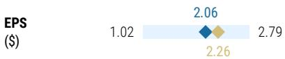

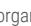

Source: Refinitiv, MS

# Risk Reward – Omada Health Inc (OMDA.O)

Top Pick

Overweight on strong growth and confidence that profitability will come sooner

# PRICE TARGET \$30.00

4.0x EV/S and 0.2x EV/S/G, which is in line to the median of Omada's most relevant HCIT comps (TEM, HIMS, WAY, HNGE, and PHR) at 4.4x. Alternatively, our PT reflects a 5.6x EV/GP.

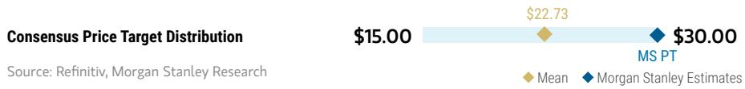

bar_line

| Category | Value   |
| -------- | ------- |
| Mean     | $22.73  |
| MS Estimates | $30.00  |

RISK REWARD CHART   
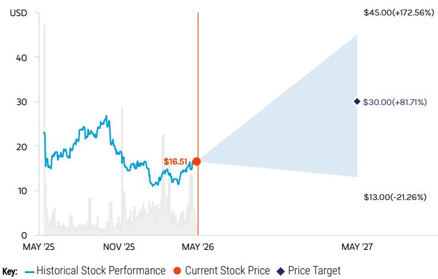

line

| Date    | Historical Stock Performance | Current Stock Price | Price Target |
|---------|-------------------------------|---------------------|--------------|
| MAY '25 | ~20                           | -                   | -            |
| NOV '25 | ~25                           | -                   | -            |
| MAY '26 | $16.51                        | $16.51              | -            |
| MAY '27 | -                             | $30.00              | $45.00       |

Source: Refinitiv, MS

# OVERWEIGHT THESIS

We're Overweight OMDA on a tipping point for cross-selling of multiple programs, which has positive implications for durability of growth and an inflection in margins. In addition to GLP-1 care track serving to extend momentum in its longest standing segment of Prevention and Weight Health (\~75% of revenue), our checks point to positive customer feedback on Hypertension (\~13%) and Diabetes (\~12%). Omada is effectively leveraging technology and AI to scale the platform, leading to a \~25% increase in total members per coach. This can be seen in the meaningful 1100 bps expansion in GM to 63.2% the past 2 years and gives us confidence in the company's longer term target of 70%+.

Consensus Rating Distribution   
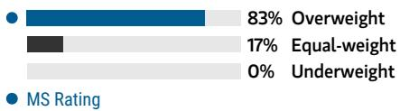

bar

| Category | Value (%) |
|---|---|
| Overweight | 83 |
| Equal-weight | 17 |
| Underweight | 0 |
MS Rating

Source: Refinitiv, MS

# Risk Reward Themes

Disruption: Positive
Secular Growth: Positive
Technology Diffusion: Positive

View descriptions of Risk Rewards Themes here

# BULL CASE

\$45.00

# BASE CASE

\$30.00

# BEAR CASE

\$13.00

# 5.5x EV/S on our 2027 bull case revenue

Based on a 5.5x EV/S multiple on our bull revenue estimate of \$450mn. OMDA's multiple expands above the median of the vertical software group, reflecting higher than expected member growth and engagement through further penetration into the self-insured markets and momentum from multi-condition sales. This translates to better operating margins through gross margin upside and sales & marketing leverage.

# 4x EV/S on our 2027 base case revenue

Based on a 4x EV/S multiple on our base revenue estimate of \$400mn, which is in line to its closest HCIT peers (TEM, HIMS, WAY, HNGE, and PHR) at 4.4x. Alternatively, our target multiple represents a 0.2x EV/S/G or 5.6x EV/GP. We estimate a 24% revenue CAGR from 2025-2027 and model 27' base adjusted EBITDA margin of 9%.

# \~1.5x EV/S on our 2027 bear case revenue

Based on a $\sim 1.5x$ EV/S on our bear revenue estimate of \$358 mn. The multiple is below the median of the HCIT group, in a scenario of lower than expected growth driven by higher competition, lower client uptake, lower member engagement, client losses, and slower demand amid macro uncertainty.

# Risk Reward – Omada Health Inc (OMDA.O)

KEY EARNINGS INPUTS 

<table><tr><td>Drivers</td><td>2025</td><td>2026e</td><td>2027e</td><td>2028e</td></tr><tr><td>Members (000s)</td><td>886</td><td>1,093</td><td>1,334</td><td>1,574</td></tr><tr><td>Total ARPU ($)</td><td>294</td><td>301</td><td>300</td><td>304</td></tr><tr><td>Gross Margin (%)</td><td>67.7</td><td>69.5</td><td>70.8</td><td>71.8</td></tr></table>

# INVESTMENT DRIVERS

- Member growth   
• Multi-condition sales   
• GM expansion by leveraging technology   
- Expansion in PBM partnerships

# GLOBAL REVENUE EXPOSURE

  
100%   
North America

Source: MS Estimate View explanation of regional hierarchies here

# RISKS TO PT/RATING

# RISKS TO UPSIDE

- Upside to margins from technology and multi-condition sales   
- Higher than expected engagement through new programs/marketing initiatives   
- GLP-1 Care Track and new sales channel partnerships

# RISKS TO DOWNSIDE

• Sales channel concentration leading to risk of client loss   
- The potential for competition to intensify   
- Lower than expected member engagement

# OWNERSHIP POSITIONING

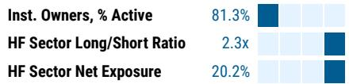

bar

| Category | Value |
| -------- | ----- |
| Inst. Owners, % Active | 81.3% |
| HF Sector Long/Short Ratio | 2.3x |
| HF Sector Net Exposure | 20.2% |

Refinitiv; MSPB Content. Includes certain hedge fund exposures held with MSPB. Information may be inconsistent with or may not reflect broader market trends. Long/Short Ratio = Long Exposure / Short exposure. Sector % of Total Net Exposure = (For a particular sector: Long Exposure - Short Exposure) / (Across all sectors: Long Exposure – Short Exposure).

# MS ESTIMATES VS. CONSENSUS

FY Dec 2026e   
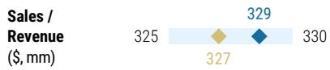

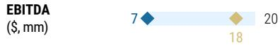

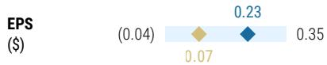

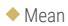

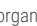

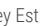

Source: Refinitiv, MS

# Valuation Methodology and Risks

# Doximity, Inc. (DOCS.N)

15x EV/EBITDA on CY27 adjusted EBITDA of \$369mn. This multiple represents a 6x turn discount to first quartile of SMID software comps, reflecting what we view as a temporary growth deceleration (HSD 2-year CAGR vs. mid-teens for comps), partially balanced by Doximity's superior EBITDA margins (\~50%, or 2.5x comps).

# Risks to Upside

■ Increasing traction in new video products   
■ Increasing engagement/monetization driven by DoxGPT   
■ Greater than expected momentum in \$10mn customers

# Risks to Downside

■ Upsell and cross sell to large pharma disappoints   
■ Potential pressure on health system spending   
■ Rising competition from companies like OpenEvidence

# Waystar Holding Corp. (WAY.O)

\~10.5x EV/EBITDA, which is a touch below the company&#39;s most relevant HCIT comps (VEEV, HQY, DOCS, HNGE, and PHR) on AI pressure uncertainty. We estimate EBITDA margins of \~42% in 2027, in line with historical trends and most relevant peers.

# Risks to Upside

■ Higher than expected AI-led upsell/cross-sell   
■ Faster lodine integration and synergy capture   
■ Strong cash flow generation and deleveraging

# Risks to Downside

■ Increased competition from AI, RCM players, and EHRs   
■ lodine integration delays or lower than planned synergies   
■ Potential pressure from selling by equity sponsors (30% ownership)

# Risk Reward Reference links

1. View explanation of Options Probabilities methodology -   
Options\_Probabilities\_Exhibit\_Link.pdf   
2. View descriptions of Risk Rewards Themes - RR\_Themes\_Exhibit\_Link.pdf   
3. View explanation of regional hierarchies - GEG\_Exhibit\_Link.pdf   
4. View explanation of Theme/Exposure methodology -   
ESG\_Sustainable\_Solutions\_External\_Link.pdf   
5. View explanation of HERS methodology - ESG\_HERS\_External\_Link.pdf

# Disclosure Section

The information and opinions in MS were prepared by MS & Co. LLC, and/or MS C.T.V.M. S.A., and/or MS Mexico, Casa de Bolsa, S.A. de C.V., and/or MS Canada Limited. As used in this disclosure section, "MS" includes MS & Co. LLC, MS C.T.V.M. S.A., MS Mexico, Casa de Bolsa, S.A. de C.V., MS Canada Limited and their affiliates as necessary.

For important disclosures, stock price charts and equity rating histories regarding companies that are the subject of this report, please see the MS Disclosure Website at www.morganstanley.com/eqr/disclosures/webapp/generalresearch, or contact your investment representative or MS at 1585 Broadway, (Attention: Research Management), New York, NY, 10036 USA.

For valuation methodology and risks associated with any recommendation, rating or price target referenced in this research report, please contact the Client Support Team as follows: US/Canada +1 800 303-2495; Hong Kong +852 2848-5999; Latin America +1 718 754-5444 (U.S.); London +44 (0)20-7425-8169; Singapore +65 6834-6860; Sydney +61 (0)2-9770-1505; Tokyo +81 (0)3-6836-9000. Alternatively you may contact your investment representative or MS at 1585 Broadway, (Attention: Research Management), New York, NY 10036 USA.

# Analyst Certification

The following analysts hereby certify that their views about the companies and their securities discussed in this report are accurately expressed and that they have not received and will not receive direct or indirect compensation in exchange for expressing specific recommendations or views in this report: Linda Bolduc; Craig Hettenbach; Erin Wright.

# Global Research Conflict Management Policy

MS has been published in accordance with our conflict management policy, which is available at www.morganstanley.com/institutional/research/conflictpolicies. A Portuguese version of the policy can be found at www.morganstanley.com.br

# Important Regulatory Disclosures on Subject Companies

As of April 30, 2026, MS beneficially owned 1% or more of a class of common equity securities of the following companies covered in MS: American Well, Certara Inc, Doximity, Inc., Hims & Hers Health Inc, Hinge Health Inc, Omada Health Inc, Waystar Holding Corp..

Within the last 12 months, MS managed or co-managed a public offering (or 144A offering) of securities of Hims & Hers Health Inc, Omada Health Inc.

Within the last 12 months, MS has received compensation for investment banking services from Hims & Hers Health Inc, Hinge Health Inc, Omada Health Inc.

In the next 3 months, MS expects to receive or intends to seek compensation for investment banking services from American Well, Certara Inc, Definitive Healthcare, Doximity, Inc., GoodRx Holdings Inc., Hims & Hers Health Inc, Hinge Health Inc, Omada Health Inc, Veeva Systems Inc.

Within the last 12 months, MS has received compensation for products and services other than investment banking services from Doximity, Inc., Hinge Health Inc, Veeva Systems Inc.

Within the last 12 months, MS has provided or is providing investment banking services to, or has an investment banking client relationship with, the following company: American Well, Certara Inc, Definitive Healthcare, Doximity, Inc., GoodRx Holdings Inc., Hims & Hers Health Inc, Hinge Health Inc, Omada Health Inc, Veeva Systems Inc.

Within the last 12 months, MS has either provided or is providing non-investment banking, securities-related services to and/or in the past has entered into an agreement to provide services or has a client relationship with the following company: Certara Inc, Doximity, Inc., Hims & Hers Health Inc, Hinge Health Inc, Veeva Systems Inc.

MS & Co. LLC makes a market in the securities of Certara Inc, Veeva Systems Inc.

The equity research analysts or strategists principally responsible for the preparation of MS have received compensation based upon various factors, including quality of research, investor client feedback, stock picking, competitive factors, firm revenues and overall investment banking revenues. Equity Research analysts' or strategists' compensation is not linked to investment banking or capital markets transactions performed by MS or the profitability or revenues of particular trading desks.

MS and its affiliates do business that relates to companies/instruments covered in MS, including market making, providing liquidity, fund management, commercial banking, extension of credit, investment services and investment banking. MS sells to and buys from customers the securities/instruments of companies covered in MS on a principal basis. MS may have a position in the debt of the Company or instruments discussed in this report. MS trades or may trade as principal in the debt securities (or in related derivatives) that are the subject of the debt research report.

Certain disclosures listed above are also for compliance with applicable regulations in non-US jurisdictions.

# STOCK RATINGS

MS uses a relative rating system using terms such as Overweight, Equal-weight, Not-Rated or Underweight (see definitions below). MS does not assign ratings of Buy, Hold or Sell to the stocks we cover. Overweight, Equal-weight, Not-Rated and Underweight are not the equivalent of buy, hold and sell. Investors should carefully read the definitions of all ratings used in MS. In addition, since MS contains more complete information concerning the analyst's views, investors should carefully read MS, in its entirety, and not infer the contents from the rating alone. In any case, ratings (or research) should not be used or relied upon as investment advice. An investor's decision to buy or sell a stock should depend on individual circumstances (such as the investor's existing holdings) and other considerations.

# Global Stock Ratings Distribution

(as of April 30, 2026)

The Stock Ratings described below apply to MS's Fundamental Equity Research and do not apply to Debt Research produced by the Firm.

For disclosure purposes only (in accordance with FINRA requirements), we include the category headings of Buy, Hold, and Sell alongside our ratings of Overweight, Equal-weight, Not-Rated and Underweight. MS does not assign ratings of Buy, Hold or Sell to the stocks we cover. Overweight, Equal-weight, Not-Rated and Underweight are not the equivalent of buy, hold, and sell but represent recommended relative weightings (see definitions below). To satisfy regulatory requirements, we correspond Overweight, our most positive stock rating, with a buy recommendation; we correspond Equal-weight and Not-Rated to hold and Underweight to sell recommendations, respectively.

<table><tr><td></td><td colspan="2">Coverage Universe</td><td colspan="3">Investment Banking Clients (IBC)</td><td colspan="2">Other Material Investment ServicesClients (MISC)</td></tr><tr><td>Stock RatingCategory</td><td>Count</td><td>% of Total</td><td>Count</td><td>% of Total IBC</td><td>% of RatingCategory</td><td>Count</td><td>% of Total OtherMISC</td></tr><tr><td>Overweight/Buy</td><td>1546</td><td>42%</td><td>467</td><td>51%</td><td>30%</td><td>709</td><td>44%</td></tr><tr><td>Equal-weight/Hold</td><td>1568</td><td>43%</td><td>358</td><td>39%</td><td>23%</td><td>715</td><td>44%</td></tr><tr><td>Not-Rated/Hold</td><td>4</td><td>0%</td><td>0</td><td>0%</td><td>0%</td><td>1</td><td>0%</td></tr><tr><td>Underweight/Sell</td><td>555</td><td>15%</td><td>84</td><td>9%</td><td>15%</td><td>202</td><td>12%</td></tr><tr><td>Total</td><td>3,673</td><td></td><td>909</td><td></td><td></td><td>1627</td><td></td></tr></table>

Data include common stock and ADRs currently assigned ratings. Investment Banking Clients are companies from whom MS received investment banking compensation in the last 12 months. Due to rounding off of decimals, the percentages provided in the "% of total" column may not add up to exactly 100 percent.

# Analyst Stock Ratings

Overweight (O). The stock's total return is expected to exceed the average total return of the analyst's industry (or industry team's) coverage universe, on a risk-adjusted basis, over the next 12-18 months.

Equal-weight (E). The stock's total return is expected to be in line with the average total return of the analyst's industry (or industry team's) coverage universe, on a risk-adjusted basis, over the next 12-18 months.

Not-Rated (NR). Currently the analyst does not have adequate conviction about the stock's total return relative to the average total return of the analyst's industry (or industry team's) coverage universe, on a risk-adjusted basis, over the next 12-18 months.

Underweight (U). The stock's total return is expected to be below the average total return of the analyst's industry (or industry team's) coverage universe, on a risk-adjusted basis, over the next 12-18 months.

Unless otherwise specified, the time frame for price targets included in MS is 12 to 18 months.

# Analyst Industry Views

Attractive (A): The analyst expects the performance of his or her industry coverage universe over the next 12-18 months to be attractive vs. the relevant broad market benchmark, as indicated below.

In-Line (I): The analyst expects the performance of his or her industry coverage universe over the next 12-18 months to be in line with the relevant broad market benchmark, as indicated below. Cautious (C): The analyst views the performance of his or her industry coverage universe over the next 12-18 months with caution vs. the relevant broad market benchmark, as indicated below. Benchmarks for each region are as follows: North America - S&P 500; Latin America - relevant MSCI country index or MSCI Latin America Index; Europe - MSCI Europe; Japan - TOPIX; Asia - relevant MSCI country index or MSCI sub-regional index or MSCI AC Asia Pacific ex Japan Index.

Stock Price, Price Target and Rating History (See Rating Definitions)

Doximity, Inc. (DOCS.N) - As of 05/26/26 GMT in USD
Industry : Healthcare Technology   
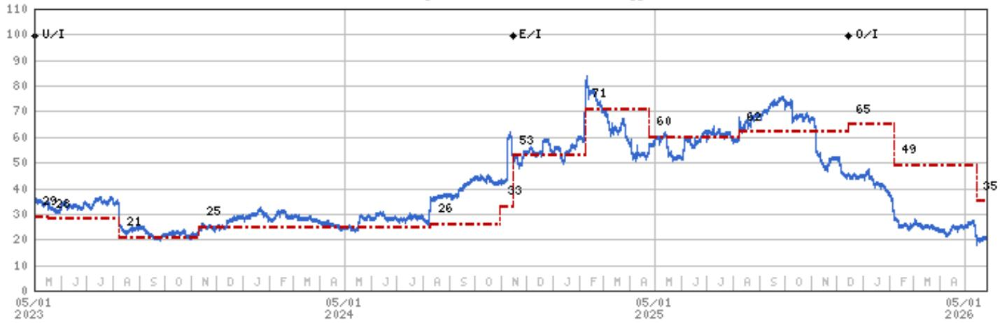

line

| Date       | Value |
| ---------- | ----- |
| 05/01 2023 | 29    |
|            | 26    |
|            | 21    |
|            | 25    |
|            | 26    |
|            | 33    |
|            | 53    |
|            | 71    |
|            | 60    |
|            | 65    |
|            | 49    |
|            | 35    |
|            |       |
|            |       |
|            |       |
|            |       |
|            |       |
|            |       |
|            |       |
|            |       |
|            |       |
|            |       |
|            |       |
|            |       |
|            |       |
|            |       |
|            |       |
|            |       |
|            |       |
|            |       |
|            |       |
|            |       |
|            | 0/I   |
|            |       |
|            |       |
|            |       |
|            |       |
|            |       |
|            |       |
|            |       |
|            |       |
|            |       |
|            |       |
|            |       |
|            |       |
|            |       |
|            |       |
|            |       |
|            |       |
|            |       |
|            |       |
|            |       |
|            | -     |
|            | -     |
|            | -     |
|            | -     |
|            | -     |
|            | -     |
|            | -     |
|            | -     |
|            | -     |
|            | -     |
|            | -     |
|            | -     |
|            | -     |
|            | -     |
|            | -     |
|            | -     |
|            | -     |
|            /      | -     |
|            /      | -     |
|            /      | -     |
|            /      | -     |
|            /      | -     |
|            /      | -     |
|            /      | -     |
|            /      | -     |
|            /      | -     |
|            /      | -     |
|            /      | -     |
|            /      | -     |
|            /      | -     |

Stock Rating History: 7/19/21 : E/NR; 2/8/22 : E/NR; 9/5/22 : E/NR; 9/8/22 : E/I; 1/6/23 : U/I; 11/14/24 : E/I; 12/15/25 : O/I   
Price Target History: 7/19/21 : 52; 8/30/21 : 71; 11/10/21 : 72; 12/16/21 : 58; 2/8/22 : 62; 3/22/22 : 55; 5/17/22 : 35; 8/5/22 : 32;   
1/6/23 : 29; 5/17/23 : 28; 8/9/23 : 21; 11/10/23 : 25; 8/9/24 : 26; 10/30/24 : 33; 11/14/24 : 53; 2/7/25 : 71; 4/24/25 : 60;   
8/8/25 : 62; 12/15/25 : 65; 2/6/26 : 49; 5/14/26 : 35   
Source: MS Date Format : MM/DD/YY Price Target No Price Target Assigned (NA)   
Stock Price (Not Covered by Current Analyst) — Stock Price (Covered by Current Analyst)   
Stock and Industry Ratings (abbreviations below) appear as ♦ Stock Rating/Industry View   
Stock Ratings: Overweight (O) Equal-weight (E) Underweight (U) Not-Rated (NR) No Rating Available (NA)   
Industry View: Attractive (A) In-line (I) Cautious (C) No Rating (NR)   
Effective January 13, 2014, the stocks covered by MS Asia Pacific will be rated relative to the analyst's industry (or industry team's) coverage.   
Effective January 13, 2014, the industry view benchmarks for MS Asia Pacific are as follows: relevant MSCI country index or MSCI sub-regional index or MSCI AC Asia Pacific ex Japan Index.

Hinge Health Inc (HNGE.N) - As of 05/26/26 GMT in USD
Industry : Healthcare Technology   
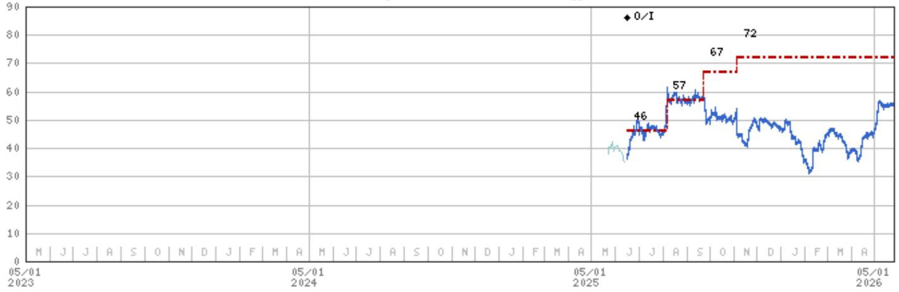

line

| Date       | Value |
| ---------- | ----- |
| 05/01 2023 | 46    |
| 05/01 2024 | 57    |
| 05/01 2025 | 67    |
| 05/01 2026 | 72    |

Stock Rating History: 6/16/25 : 0/I   
Price Target History: 6/16/25 : 46; 8/6/25 : 57; 9/23/25 : 67; 11/4/25 : 72   
Source: MS Date Format : MM/DD/YY Price Target No Price Target Assigned (NA)   
Stock Price (Not Covered by Current Analyst) — Stock Price (Covered by Current Analyst)   
Stock and Industry Ratings (abbreviations below) appear as ♦ Stock Rating/Industry View   
Stock Ratings: Overweight (O) Equal-weight (E) Underweight (U) Not-Rated (NR) No Rating Available (NA)   
Industry View: Attractive (A) In-line (I) Cautious (C) No Rating (NR)   
Effective January 13, 2014, the stocks covered by MS Asia Pacific will be rated relative to the analyst's industry (or industry team's) coverage.   
Effective January 13, 2014, the industry view benchmarks for MS Asia Pacific are as follows: relevant MSCI country index or MSCI sub-regional index or MSCI AC Asia Pacific ex Japan Index.

Omada Health Inc (OMDA.O) - As of 05/26/26 GMT in USD
Industry : Healthcare Technology   
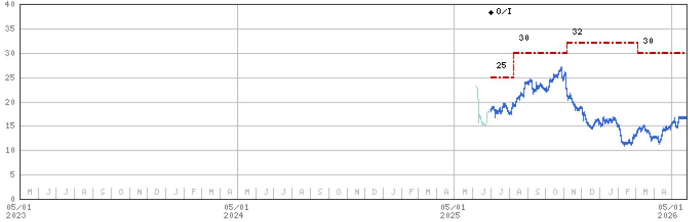

line

| Date       | Value |
| ---------- | ----- |
| 05/01 2023 | 25    |
| 05/01 2024 | 30    |
| 05/01 2025 | 32    |
| 05/01 2026 | 30    |

Stock Rating History: 7/1/25 : 0/I   
Price Target History: 7/1/25 : 25; 8/8/25 : 30; 11/6/25 : 32; 3/6/26 : 30   
Source: MS Date Format: MM/DD/YY Price Target No Price Target Assigned (NA)   
Stock Price (Not Covered by Current Analyst) — Stock Price (Covered by Current Analyst)   
Stock and Industry Ratings (abbreviations below) appear as ♦ Stock Rating/Industry View   
Stock Ratings: Overweight (O) Equal-weight (E) Underweight (U) Not-Rated (NR) No Rating Available (NA)   
Industry View: Attractive (A) In-line (I) Cautious (C) No Rating (NR)   
Effective January 13, 2014, the stocks covered by MS Asia Pacific will be rated relative to the analyst's industry (or industry team's) coverage.   
Effective January 13, 2014, the industry view benchmarks for MS Asia Pacific are as follows: relevant MSCI country index or MSCI sub-regional index or MSCI AC Asia Pacific ex Japan Index.

Waystar Holding Corp. (WAY.0) - As of 05/26/26 GMT in USD
Industry : Healthcare Technology   

line

| Date       | Value |
| ---------- | ----- |
| 05/01 2023 | 28    |

Stock Rating History: 3/30/26 : E/I   
Price Target History: 3/30/26 : 28   
Source: MS Date Format : MM/DD/YY Price Target = No Price Target Assigned (NA)   
Stock Price (Not Covered by Current Analyst) — Stock Price (Covered by Current Analyst)   
Stock and Industry Ratings (abbreviations below) appear as ♦ Stock Rating/Industry View   
Stock Ratings: Overweight (O) Equal-weight (E) Underweight (U) Not-Rated (NR) No Rating Available (NA)   
Industry View: Attractive (A) In-line (I) Cautious (C) No Rating (NR)   
Effective January 13, 2014, the stocks covered by MS Asia Pacific will be rated relative to the analyst's industry (or industry team's) coverage.   
Effective January 13, 2014, the industry view benchmarks for MS Asia Pacific are as follows: relevant MSCI country index or MSCI sub-regional index or MSCI AC Asia Pacific ex Japan Index.

# Important Disclosures for MS Smith Barney LLC Customers

Important disclosures regarding any material conflict of interest that can reasonably be expected to have influenced MS Smith Barney LLC's choice of a third-party research provider or the subject company of a third-party research report, are available on the MS Wealth Management disclosure website at www.morganstanley.com/online/researchdisclosures.

For MS specific disclosures, you may refer to https://www.morganstanley.com/eqr/disclosures/webapp/generalresearch.

Each MS report is reviewed and approved on behalf of MS Smith Barney LLC. This review and approval is conducted by the same person who reviews the research report on behalf of MS. This could create a conflict of interest.

# Other Important Disclosures

MS policy is to update research reports as and when the Research Analyst and Research Management deem appropriate, based on developments with the issuer, the sector, or the market that may have a material impact on the research views or opinions stated therein. In addition, certain Research publications are intended to be updated on a regular periodic basis (weekly/monthly/quarterly/annual) and will ordinarily be updated with that frequency, unless the Research Analyst and Research Management determine that a different publication schedule is appropriate based on current conditions.

MS is not acting as a municipal advisor and the opinions or views contained herein are not intended to be, and do not constitute, advice within the meaning of Section 975 of the Dodd-Frank Wall Street Reform and Consumer Protection Act.

MS produces an equity research product called a "Tactical Idea." Views contained in a "Tactical Idea" on a particular stock may be contrary to the recommendations or views expressed in research on the same stock. This may be the result of differing time horizons, methodologies, market events, or other factors. For all research available on a particular stock, please contact your sales representative or go to Matrix at http://www.morganstanley.com/matrix.

MS is provided to our clients through our proprietary research portal on Matrix and also distributed electronically by MS to clients. Certain, but not all, MS products are also made available to clients through third-party vendors or redistributed to clients through alternate electronic means as a convenience. For access to all available MS, please contact your sales representative or go to Matrix at http://www.morganstanley.com/matrix.

Any access and/or use of MS is subject to MS's Terms of Use (http://www.morganstanley.com/terms.html). By accessing and/or using MS, you are indicating that you have read and agree to be bound by our Terms of Use (http://www.morganstanley.com/terms.html). In addition you consent to MS processing your personal data and using cookies in accordance with our Privacy Policy and our Global Cookies Policy (http://www.morganstanley.com/privacy\_pledge.html), including for the purposes of setting your preferences and to collect readership data so that we can deliver better and more personalized service and products to you. To find out more information about how MS processes personal data, how we use cookies and how to reject cookies see our Privacy Policy and our Global Cookies Policy (http://www.morganstanley.com/privacy\_pledge.html). Please use the provided link to review the Terms and Conditions and Most Important Terms and Conditions for MS India Company Private Limited (https://www.morganstanley.com/assets/pdfs/about-us-global-offices/india/Terms\_and\_conditions.pdf) and the following link to review the audit report (https://ny.matrix.ms.com/eqr/research/webapp/researchdocs/MSICPL\_Morgan\_Stanley\_Research\_Audit\_Report.pdf).

If you do not agree to our Terms of Use and/or if you do not wish to provide your consent to MS processing your personal data or using cookies please do not access our research. MS does not provide individually tailored investment advice. MS has been prepared without regard to the circumstances and objectives of those who receive it. MS recommends that investors independently evaluate particular investments and strategies, and encourages investors to seek the advice of a financial adviser. The appropriateness of an investment or strategy will depend on an investor's circumstances and objectives. The securities, instruments, or strategies discussed in MS may not be suitable for all investors, and certain investors may not be eligible to purchase or participate in some or all of them. MS is not an offer to buy or sell or the solicitation of an offer to buy or sell any security/instrument or to participate in any particular trading strategy. The value of and income from your investments may vary because of changes in interest rates, foreign exchange rates, default rates, prepayment rates, securities/instruments prices, market indexes, operational or financial conditions of companies or other factors. There may be time limitations on the exercise of options or other rights in securities/instruments transactions. Past performance is not necessarily a guide to future performance. Estimates of future performance are based on assumptions that may not be realized. If provided, and unless otherwise stated, the closing price on the cover page is that of the primary exchange for the subject company's securities/instruments.

The fixed income research analysts, strategists or economists principally responsible for the preparation of MS have received compensation based upon various factors, including quality, accuracy and value of research, firm profitability or revenues (which include fixed income trading and capital markets profitability or revenues), client feedback and competitive factors. Fixed Income Research analysts', strategists' or economists' compensation is not linked to investment banking or capital markets transactions performed by MS or the profitability or revenues of particular trading desks.

The "Important Regulatory Disclosures on Subject Companies" section in MS lists all companies mentioned where MS owns 1% or more of a class of common equity securities of the companies. For all other companies mentioned in MS, MS may have an investment of less than 1% in securities/instruments or derivatives of securities/instruments of companies and may trade them in ways different from those discussed in MS. Employees of MS not involved in the preparation of MS may have investments in securities/instruments or derivatives of securities/instruments of companies mentioned and may trade them in ways different from those discussed in MS. Derivatives may be issued by MS or associated persons.

With the exception of information regarding MS, MS is based on public information. MS makes every effort to use reliable, comprehensive information, but we make no representation that it is accurate or complete. We have no obligation to tell you when opinions or information in MS change apart from when we intend to discontinue equity research coverage of a subject company. Facts and views presented in MS have not been reviewed by, and may not reflect information known to, professionals in other MS business areas, including investment banking personnel.

MS personnel may participate in company events such as site visits and are generally prohibited from accepting payment by the company of associated expenses unless pre-approved by authorized members of Research management.

MS may make investment decisions that are inconsistent with the recommendations or views in this report.

To our readers based in Taiwan or trading in Taiwan securities/instruments: Information on securities/instruments that trade in Taiwan is distributed by MS Taiwan Limited ("MSTL"). Such information is for your reference only. The reader should independently evaluate the investment risks and is solely responsible for their investment decisions. MS may not be distributed to the public media or quoted or used by the public media without the express written consent of MS. Any non-customer reader within the scope of Article 7-1 of the Taiwan Stock Exchange Recommendation Regulations accessing and/or receiving MS is not permitted to provide MS to any third party (including but not limited to related parties, affiliated companies and any other third parties) or engage in any activities regarding MS which may create or give the appearance of creating a conflict of interest. Information on securities/instruments that do not trade in Taiwan is for informational purposes only and is not to be construed as a recommendation or a solicitation to trade in such securities/instruments. MSTL may not execute transactions for clients in these securities/instruments.

MS is not incorporated under PRC law and the research in relation to this report is conducted outside the PRC. MS does not constitute an offer to sell or the solicitation of an offer to buy any securities in the PRC. PRC investors shall have the relevant qualifications to invest in such securities and shall be responsible for obtaining all relevant approvals, licenses, verifications and/or registrations from the relevant governmental authorities themselves. Neither this report nor any part of it is intended as, or shall constitute, provision of any consultancy or advisory service of securities investment as defined under PRC law. Such information is provided for your reference only.

MS is disseminated in Brazil by MS C.T.V.M. S.A. located at Av. Brigadeiro Faria Lima, 3600, 6th floor, São Paulo - SP, Brazil; and is regulated by the Comissão de Valores Mobiliários; in Mexico by MS México, Casa de Bolsa, S.A. de C.V which is regulated by Comision Nacional Bancaria y de Valores. Paseo de los Tamarindos 90, Torre 1, Col. Bosques de las Lomas Floor 29, 05120 Mexico City; in Japan by MS MUFG Securities Co., Ltd. and, for Commodities related research reports only, MS Capital Group Japan Co., Ltd; in Hong Kong by MS Asia Limited (which accepts responsibility for its contents) and by MS Bank Asia Limited; in Singapore by MS Asia (Singapore) Pte. (Registration number 199206298Z) and/or MS Asia (Singapore) Securities Pte Ltd (Registration number 200008434H), regulated by the Monetary Authority of Singapore (which accepts legal responsibility for its contents and should be contacted with respect to any matters arising from, or in connection with, MS) and by MS Bank Asia Limited, Singapore Branch (Registration number T14FC0118); in Australia to "wholesale clients" within the meaning of the Australian Corporations Act by MS Australia Limited A.B.N. 67 003 734 576, holder of Australian financial services license No. 233742, which accepts responsibility for its contents; in Australia to "wholesale clients" and "retail clients" within the meaning of the Australian Corporations Act by MS Wealth Management Australia Pty Ltd (A.B.N. 19 009 145 555, holder of Australian financial services license No. 240813, which accepts responsibility for its contents; in Korea by MS & Co International plc, Seoul Branch; in India by MS India Company Private Limited having Corporate Identification No (CIN) U22990MH1998PTC115305, regulated by the Securities and Exchange Board of India ("SEBI") and holder of licenses as a Research Analyst (SEBI Registration No. INH000001105); Stock Broker (SEBI Stock Broker Registration No. INZ000244438), Merchant Banker (SEBI Registration No. INM000011203), and depository participant with National Securities Depository Limited (SEBI Registration No. IN-DP-NSDL-567-2021) having registered office at Altimus, Level 39 & 40, Pandurang Budhkar Marg, Worli, Mumbai 400018, India; Telephone no. +91-22-61181000; Compliance Officer Details: Mr. Tejarshi Hardas, Tel. No.: +91-22-61181000 or Email: tejarshi.hardas@morganstanley.com; Grievance officer details: Mr. Tejarshi Hardas, Tel. No.: +91-22-61181000 or Email: msic-compliance@morganstanley.com. MS India Company Private Limited (MSICPL) may use AI tools in providing research services. All recommendations contained herein are made by the duly qualified research analysts; in Canada by MS Canada Limited; in Germany and the European Economic Area where required by MS Europe S.E., authorised and regulated by Bundesanstalt fuer Finanzdienstleistungsaufsicht (BaFin) under the reference number 149169; in the US by MS & Co. LLC, which accepts responsibility for its contents. MS & Co. International plc, authorized by the Prudential Regulation Authority and regulated by the Financial Conduct Authority and the Prudential Regulation Authority, disseminates in the UK research that it has prepared, and research which has been prepared by any of its affiliates, only to persons who (i) are investment professionals falling within Article 19(5) of the Financial Services and Markets Act 2000 (Financial Promotion) Order 2005 (as amended, the "Order"); (ii) are persons who are high net worth entities falling within Article 49(2)(a) to (d) of the Order; or (iii) are persons to whom an invitation or inducement to engage in investment activity (within the meaning of section 21 of the Financial Services and Markets Act 2000, as amended) may otherwise lawfully be communicated or caused to be communicated. RMB MS Proprietary Limited is a member of the JSE Limited and A2X (Pty) Ltd. RMB MS Proprietary Limited is a joint venture owned equally by MS International Holdings Inc. and RMB Investment Advisory (Proprietary) Limited, which is wholly owned by FirstRand Limited. The information in MS is being disseminated by MS Saudi Arabia, regulated by the Capital Market Authority in the Kingdom of Saudi Arabia, and is directed at Sophisticated investors only.

The information in MS is being communicated by MS & Co. International plc (DIFC Branch), regulated by the Dubai Financial Services Authority (the DFSA) or by MS & Co. International plc (ADGM Branch), regulated by the Financial Services Regulatory Authority Abu Dhabi (the FSRA), and is directed at Professional Clients only, as defined by the DFSA or the FSRA, respectively. The financial products or financial services to which this research relates will only be made available to a customer who we are satisfied meets the regulatory criteria of a Professional Client. A distribution of the different MS Research ratings or recommendations, in percentage terms for Investments in each sector covered, is available upon request from your sales representative.

The information in MS is being communicated by MS & Co. International plc (QFC Branch), regulated by the Qatar Financial Centre Regulatory Authority (the QFCRA), and is directed at business customers and market counterparties only and is not intended for Retail Customers as defined by the QFCRA.

As required by the Capital Markets Board of Turkey, investment information, comments and recommendations stated here, are not within the scope of investment advisory activity. Investment advisory service is provided exclusively to persons based on their risk and income preferences by the authorized firms. Comments and recommendations stated here are general in nature. These opinions may not fit to your financial status, risk and return preferences. For this reason, to make an investment decision by relying solely to this information stated here may not bring about outcomes that fit your expectations.

The trademarks and service marks contained in MS are the property of their respective owners. Third-party data providers make no warranties or representations relating to the accuracy, completeness, or timeliness of the data they provide and shall not have liability for any damages relating to such data. The Global Industry Classification Standard (GICS) was developed by and is the exclusive property of MSCI and S&P.

MS, or any portion thereof may not be reprinted, sold or redistributed without the written consent of MS.

Indicators and trackers referenced in MS may not be used as, or treated as, a benchmark under Regulation EU 2016/1011, or any other similar framework.

The issuers and/or fixed income products recommended or discussed in certain fixed income research reports may not be continuously followed. Accordingly, investors should regard those fixed income research reports as providing stand-alone analysis and should not expect continuing analysis or additional reports relating to such issuers and/or individual fixed income products.

MS may hold, from time to time, material financial and commercial interests regarding the company subject to the Research report.

Registration granted by SEBI and certification from the National Institute of Securities Markets (NISM) in no way guarantee performance of the intermediary or provide any assurance of returns to investors. Investment in securities market are subject to market risks. Read all the related documents carefully before investing.

Stock Ratings are subject to change. Please see latest research for each company.   
\* Historical prices are not split adjusted.   
INDUSTRY COVERAGE: Healthcare Technology 

<table><tr><td>COMPANY (TICKER)</td><td>RATING (AS OF)</td><td>PRICE* (05/26/2026)</td></tr><tr><td colspan="3">Craig Hettenbach</td></tr><tr><td>American Well (AMWL.N)</td><td>E (08/03/2023)</td><td>$8.48</td></tr><tr><td>Certara Inc (CERT.O)</td><td>E (01/05/2021)</td><td>$5.21</td></tr><tr><td>Definitive Healthcare (DH.O)</td><td>E (05/08/2024)</td><td>$0.90</td></tr><tr><td>Doximity, Inc. (DOCS.N)</td><td>O (12/15/2025)</td><td>$19.52</td></tr><tr><td>GoodRx Holdings Inc. (GDRX.O)</td><td>E (11/18/2020)</td><td>$2.78</td></tr><tr><td>Hims &amp; Hers Health Inc (HIMS.N)</td><td>E (02/18/2025)</td><td>$23.85</td></tr><tr><td>Hinge Health Inc (HNGE.N)</td><td>O (06/16/2025)</td><td>$52.98</td></tr><tr><td>Omada Health Inc (OMDA.O)</td><td>O (07/01/2025)</td><td>$16.10</td></tr><tr><td>Veeva Systems Inc (VEEV.N)</td><td>E (02/17/2026)</td><td>$158.54</td></tr><tr><td>Waystar Holding Corp. (WAY.O)</td><td>E (03/30/2026)</td><td>$19.72</td></tr></table>

© 2026 MS