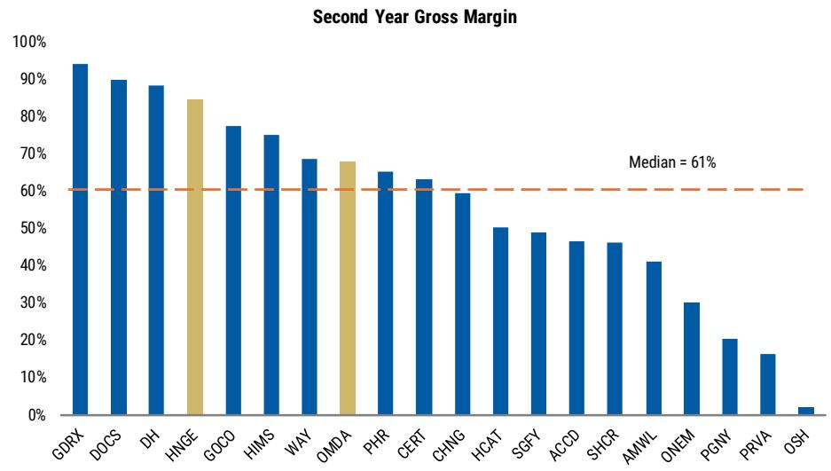
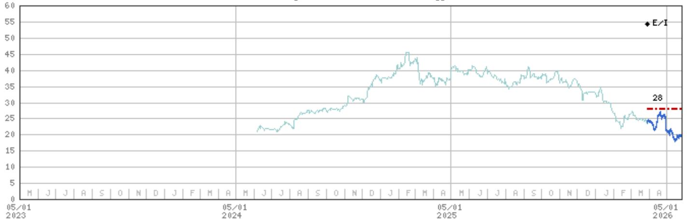

# 市场低估的不是数字健康2.0的叙事，而是其单位经济模型的可持续性

数字健康领域留给投资者的记忆并不愉快。上一轮IPO浪潮中，大量公司以高增长姿态登陆公开市场，随后迅速陷入增长失速、亏损扩大、估值崩塌的循环。这种“疤痕效应”至今仍深刻影响着机构投资者的风险偏好——当Hinge Health和Omada Health在2024年先后上市时，市场的主流叙事是警惕，而非拥抱。

但一份来自某外资投行的最新研报提出了一个与市场共识截然不同的判断：这批数字健康公司是真正不同的。报告用超过50张图表和详尽的财务拆解，试图证明HNGE和OMDA正在走一条与前辈完全不同的路——不仅增长更可持续，更重要的是，它们的单位经济模型已经开始展现规模化的杠杆效应。

这份报告的核心主张并非简单的“看好数字健康”，而是一个更具体的判断：市场系统性低估了这两家公司在“自保雇主市场渗透加速”和“平台化边际扩张”双重驱动下的盈利弹性。而这背后，是数字健康行业从“讲故事”到“算得清账”的范式转换。

## 1. 自保雇主市场的渗透率远未触顶，但市场把早期成功误读为短期冲顶

报告中最值得关注的数据之一，是HNGE和OMDA在其核心市场——自保雇主（self-insured employers）——中的渗透率。截至最新数据，HNGE在自保市场的渗透率约为18%，OMDA约为14%。如果将视野扩大到全险（fully-insured）和Medicare Advantage市场，两家公司的总渗透率仅在10%至11%之间。

这意味着什么？市场普遍担心数字健康公司已经“吃掉了最容易摘的果实”，后续增长将急剧放缓。但报告通过横向对比上一轮数字健康IPO公司上市后的增长轨迹，提出了一个反直觉的结论：HNGE和OMDA在上市第一年的营收增长率（分别约50%和55%）并非异常高企，而是处于可比公司的中位水平。更重要的是，它们在上市第二年的预期增长率（分别约35%和25%）仍然显著高于行业中位数。

这背后有两个结构性支撑因素。第一，自保雇主市场本身仍在扩张——更多企业正在从传统保险转向自保模式，这为数字健康解决方案创造了增量需求。第二，雇主对“点解决方案”（point solutions）的疲劳感正在上升，这意味着能够提供多病种管理平台的供应商将获得更高的份额。OMDA覆盖糖尿病、高血压、GLP-1支持等多条件管理，HNGE则在肌肉骨骼（MSK）领域建立了2-3倍于最大竞争对手的规模优势。

报告揭示的核心洞察是：当前的增长并非一次性渗透，而是结构性市场扩张与平台化优势叠加的结果。市场把早期成功误读为“冲顶”，但实际可能只是“开局”。

## 2. 盈利能力的改善不是靠削减费用，而是平台规模的自然结果

数字健康1.0时代最令人失望的一点是：许多公司可以在短期内实现高增长，但永远无法证明自己能够盈利。HNGE和OMDA的突破在于，它们的利润率改善并非来自一次性成本削减，而是平台规模扩大后单位经济模型的自然优化。

报告展示了两个关键数据点。第一，HNGE上市第一年的EBITDA利润率约为21%，显著高于可比公司中位数（7%）；OMDA约为2.5%，低于中位数。但到上市第二年，根据市场预期，HNGE的EBITDA利润率将提升至约26%，OMDA将提升至约4%。更重要的是，这两家公司在上市后的连续四个季度中，均实现了营收、毛利率和EBITDA利润率的三重超预期。

这种超预期的持续性，而非单次爆发，才是真正值得关注的信号。它意味着公司的运营杠杆并非依赖于特定季度的偶发因素，而是嵌入在商业模式中的结构性特征。报告特别指出，HNGE和OMDA都在利用AI技术来扩大平台规模而不显著增加人员成本，同时通过自有数据提升会员参与度——这是典型的“软件化”健康服务模型，与传统按人头服务的线性成本结构有本质区别。

市场对OMDA的担忧更为集中：能否同时保持高增长和扩大利润率？空头持仓约占流通股的15%，反映出市场对这对矛盾的深度怀疑。报告认为，随着增长和利润率持续超预期，OMDA将逐步追赶HNGE的市场表现。这一判断能否成立，取决于公司能否在未来几个季度持续证明其运营杠杆的可靠性。

## 3. 竞争格局正在分化，规模优势开始转化为结构性壁垒

数字健康领域从来不缺新进入者。报告列举了多项竞争动态：American Specialty Health（ASH）在2026年初推出了新的数字MSK解决方案，并明确宣称其定价比现有方案低50-70%；Sidekick Health也宣布进入MSK领域。这些竞争者的出现，自然会引发市场对HNGE和OMDA定价权及市场份额的担忧。

但报告的结论并非如此。它通过App下载量这一高频指标，展示了HNGE和OMDA在竞争中的实际表现。HNGE的月度App下载量约为最大竞争对手Sword的2-3倍，且差距在扩大。OMDA则已经“甩开”了包括Livongo在内的竞争对手群，其下载量趋势显示出更强的平台化吸引力。

这意味着什么？在数字健康领域，规模本身正在成为竞争壁垒。更大的用户基础意味着更丰富的行为数据，数据可以用于优化算法和提升临床效果，更好的临床效果又反过来吸引更多雇主和保险公司签约。这是一个典型的“数据网络效应”飞轮。新进入者即使能够提供更低的价格，也难以在短期内复制这种数据积累和临床验证优势。

报告还特别提到了HNGE的竞争胜率：截至2025年第四季度，其整体对战胜率（head-to-head competitive win rate）达到历史最高水平，并实现了多次有意义的竞争者转化（competitive conversions）。这进一步印证了头部平台正在从“可选供应商”变为“首选平台”。

## 4. AI不是威胁，而是加固护城河的工具——但这一判断需要更长时间验证

报告对AI在数字健康领域的影响给出了一个分层判断。对于HNGE和OMDA，AI被视为规模化杠杆：它们利用AI来优化运营、提升会员参与度，而不需要线性增加人力成本。报告甚至直接称这两家公司为“AI赢家”。

但对于另外两家公司——Doximity（DOCS）和Waystar（WAY），AI的叙事更为复杂。DOCS虽然拥有强大的医生网络和DoxGPT等AI工具，但其营收增速已放缓至个位数（最近一季度仅5%），且面临来自OpenEvidence等AI原生平台的竞争压力。WAY则面临双重AI威胁：基础大语言模型（LLM）正在发展出能够自动处理医保预授权等流程的代理能力；环境AI记录工具正在将部分收入周期管理（RCM）工作流拉入EHR原生平台，从而绕过WAY的传统优势领域。

报告的核心判断是：对于已经建立了数据飞轮和平台粘性的公司，AI是加固护城河的工具；对于依赖传统流程或网络效应的公司，AI可能成为颠覆性力量。但这一判断需要更长时间来验证——尤其是WAY，其5,000+支付方连接和250万条理赔编辑的网络效应能否抵御AI原生产品的侵蚀，仍是开放问题。

## 5. 报告尚未完全回答的关键问题：全险市场的渗透路径与盈利拐点

尽管报告对HNGE和OMDA在自保市场的增长持乐观态度，但它也坦诚地指出了两个尚未完全验证的关键假设。

第一，全险市场的渗透路径仍不清晰。目前两家公司在全险市场的渗透率仅为个位数（HNGE约3%，OMDA约9%）。保险公司的决策流程更长、对临床证据的要求更高、对价格更为敏感。报告虽然提及了HNGE与健康计划的合作关系正在扩大，但并未提供足够的数据来证明这些合作关系能够转化为可预测的、高利润率的收入流。

第二，盈利能力的可持续性仍需观察。OMDA当前4%的EBITDA利润率仍远低于行业中位数。公司能否在维持25%+营收增长的同时，将利润率提升至两位数，将是决定其估值逻辑从“成长股”切换到“成长+盈利股”的关键。报告基于历史数据做出了乐观预测，但这一预测尚未得到足够长的时间序列验证。

这两个问题构成了当前投资决策中的核心不确定性。它们也正是值得在社群中持续跟踪和讨论的方向。

---

以上是对这份研报核心逻辑的提炼与解读。报告本身包含了大量未在本文中展开的图表、财务模型和竞争对比分析——包括HNGE和OMDA与上一代数字健康公司在营收、毛利率、EBITDA利润率等维度上的完整对照表，以及DOCS和WAY面临的AI竞争深度拆解。这些内容对于理解数字健康2.0的估值框架和风险溢价至关重要。

如果你对以下问题感兴趣——全险市场的渗透何时能加速？OMDA的盈利拐点会在哪个季度出现？DOCS的AI战略能否扭转增长放缓？WAY的护城河是否真的足够深？——欢迎来星球微信群里继续讨论。我们会在社群中持续跟踪这些未解问题的进展，并分享更完整的图表和数据。

Personal reading notes and learning share only. Not investment advice.

