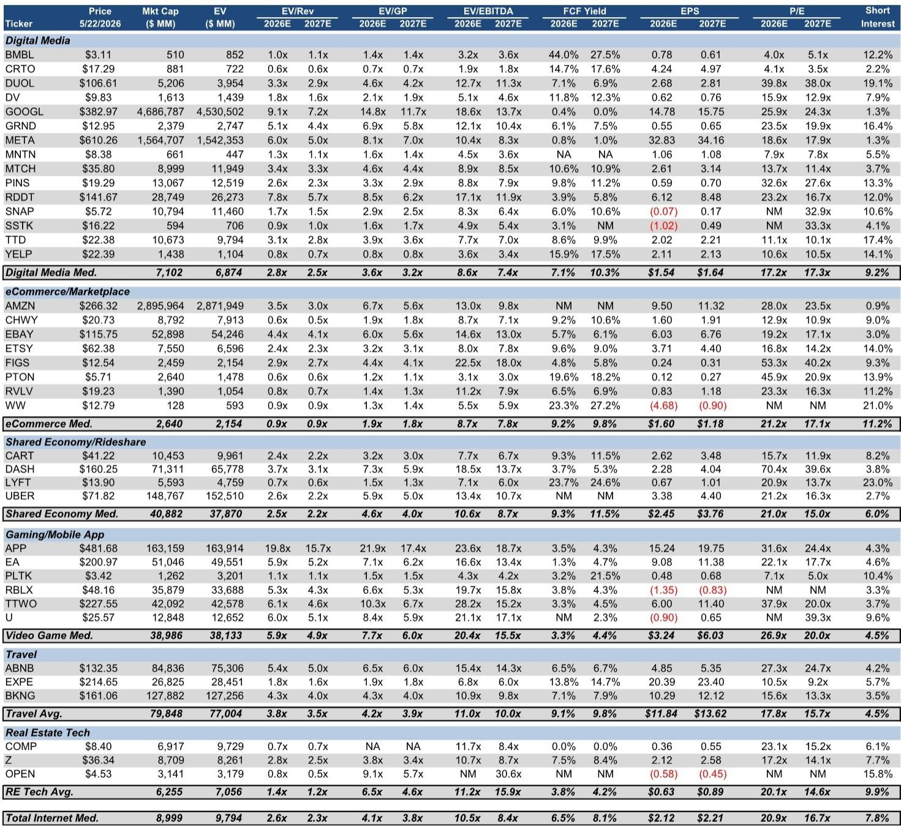
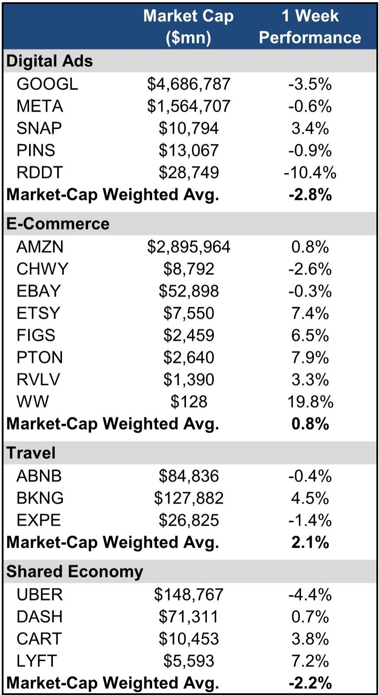
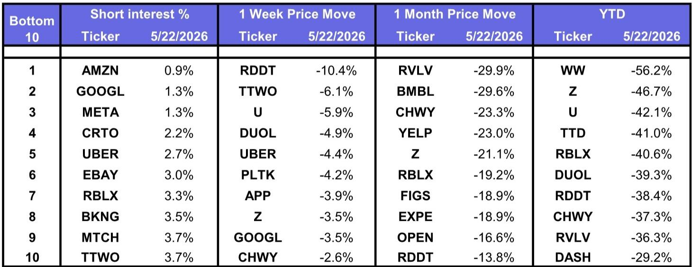

# The Market Is No Longer Asking Which Internet Companies Can Grow. It Is Asking Which Ones AI Will Save.

The latest weekly data from a major investment bank's North American internet research team reveals a market that has become brutally binary. In a week where the broad market indexes rose by roughly one percent, the aggregate of internet names fell by two percent. Yet this headline number obscures the real story. Within that decline, a sharp divergence is visible: the mega-cap advertising platforms, Google and Meta, dropped three and one percent respectively, while Amazon gained one percent. The standout winners were not the usual suspects. Booking Holdings rose four percent. Lyft gained seven percent. And Roblox surged twelve percent.

This is not a market rotating between sectors. It is a market sorting companies into two distinct baskets: those that have a credible, immediate path to benefiting from the artificial intelligence revolution, and those that do not. The old framework of growth at a reasonable price, or even simply high growth regardless of valuation, is being replaced by a more stringent test. The question is no longer "How fast is this company growing?" It is "Does this company's business model get fundamentally better because of AI?"

The data from the report's comp sheet reinforces this point. The median forward price-to-earnings multiple for the digital media group stands at over 17 times, while the travel group trades at roughly 15 times. Yet the dispersion within these groups is enormous. A company like Reddit, which is seen as having a rich data moat for AI training, trades at over 23 times forward earnings. Meanwhile, a company like Criteo, which operates in the ad-tech space but lacks a clear AI narrative, trades at just over four times earnings. The market is not pricing growth; it is pricing optionality on AI.

For investors, this creates a profound strategic challenge. The old playbook of buying a basket of high-quality internet names and waiting for mean reversion is no longer working. The tape is telling us that the AI divide is not a future risk. It is the current reality. The critical question for any portfolio manager or analyst is how to distinguish between companies that will be genuine AI beneficiaries and those that will be disrupted by it.

## The AI "Haves" Are Not Just Mega-Caps, And The "Have-Nots" Are Not Just Small-Caps

A superficial reading of the weekly performance might suggest that size is the determining factor. Amazon, with its massive cloud business and logistics network, gained. Smaller ad platforms like Snap and Pinterest were mixed or flat. But this interpretation breaks down when you look at the outliers. Roblox, a company with a market capitalization of roughly 36 billion dollars, surged twelve percent. Lyft, a ride-sharing company that has long been the underdog to Uber, gained seven percent. These are not mega-caps in the traditional sense.

The common thread among the winners is not size, but the nature of their data and their platform's relevance to the AI value chain. Roblox is a user-generated content platform that is essentially a massive, real-time data generator for how people interact, play, and socialize in three-dimensional spaces. This data is uniquely valuable for training AI models that need to understand human behavior in virtual environments. Lyft, while smaller than Uber, has a similar network of real-world mobility data. The market is beginning to recognize that any platform that generates high-frequency, high-context data about human activity has a potential second act as an AI data provider.

Conversely, the underperformance of Google and Meta in that specific week, despite their massive AI investments, suggests a more nuanced story. These companies are already priced for AI leadership. The market is now looking for the next marginal beneficiary, the companies where AI adoption is not yet fully discounted in the valuation. This is a classic sign of a maturing thematic trade. The initial wave lifted the obvious infrastructure plays and the largest platforms. The second wave is now searching for the compounders: companies where AI can drive a non-linear improvement in unit economics, not just a linear increase in revenue.

The implication is clear. Investors cannot simply buy the largest internet stocks and call it an AI strategy. They must develop a thesis on which business models are structurally advantaged by the shift from search-based to AI-driven discovery, and which are structurally threatened.

## The Travel And Shared Economy Sectors Are Becoming A Bellwether For AI-Enabled Demand Generation

The performance of the travel and shared economy sectors in this report is particularly instructive. Booking Holdings, the online travel giant, rose four percent. Expedia was flat to slightly down. Uber fell over four percent, while Lyft gained over seven percent. This divergence within the same broad sector category tells a powerful story about how AI is changing competitive dynamics.

The traditional model for online travel and ride-sharing has been demand generation through search engine marketing and app store optimization. Companies paid for user acquisition, and the winner was the one with the lowest cost per click. AI is now changing this equation in two fundamental ways. First, AI-powered recommendation engines can surface relevant travel or transportation options to users who were not actively searching, effectively creating new demand. Second, AI can optimize pricing and routing in real-time, improving margins without raising prices.

Booking Holdings appears to be benefiting from the first dynamic. Its platform has invested heavily in AI-driven trip planning and personalized recommendations, moving beyond the simple hotel and flight search model. Lyft seems to be benefiting from the second. Its operational improvements, likely driven by better route optimization and demand forecasting, are showing up in the market's willingness to re-rate the stock. Uber, despite its larger scale and advanced technology, may be suffering from the law of large numbers, where incremental AI improvements have a smaller marginal impact on a much larger base.

The strategic lesson here is that AI is not a rising tide that lifts all boats within a sector. It is a competitive weapon that can widen moats or close them. The companies that are winning are those that are using AI to change their cost structure or their user acquisition model, not just those that are talking about AI in their earnings calls. For investors, this means that sector-level analysis is no longer sufficient. One must conduct company-specific due diligence on how AI is embedded in the operational DNA of each business.

## The Most Important Data Point May Be The One The Report Does Not Fully Explain: The Short Interest

One of the most striking tables in the report is the short interest data. As of late May, the highest short interest among the covered names was Lyft at 23 percent, followed by Duolingo and WW International at roughly 19 percent. Yet Lyft was one of the best-performing stocks in that week. This creates a fascinating analytical tension.

High short interest is often interpreted as a bearish signal, indicating that sophisticated investors expect the stock to fall. But when a high-short-interest stock rallies, it can create a short squeeze that amplifies the move. The report shows Lyft up seven percent in a week where the internet sector was down. This suggests that the short thesis on Lyft may be breaking. What was the bear case? Likely, it was that Lyft would lose share to Uber and that its profitability would never match its larger rival. The AI-driven improvements in its operational efficiency may be directly refuting that thesis.

The short interest data on Duolingo is equally intriguing. The language learning app has a 19 percent short interest. Duolingo is a company that has been a vocal adopter of AI, using large language models to generate content and personalize lessons. Yet the market is heavily shorting it. Why? The bear case may be that AI commoditizes language learning, that users will soon be able to get the same service from a general-purpose AI assistant for free. If that thesis is wrong, the short squeeze potential is enormous.

This is the kind of analytical puzzle that the report's data surfaces but does not resolve. The market is betting against some of the most AI-forward companies, while rewarding others. Understanding the specific mechanics of each company's AI moat, or lack thereof, is the key to resolving this tension. The data tells us where the debate is, but not who is right.

## A Decision Framework For Navigating The AI vs. All Other Tape

Based on the patterns in this report, investors need a structured framework to evaluate internet names. The old framework of top-line growth, market share, and margin expansion is insufficient. A new framework must incorporate the following three dimensions.

First, assess the company's data moat. Not all data is created equal. The most valuable data for AI is high-frequency, contextual, and proprietary. A company like Roblox generates data on user behavior in virtual worlds that no one else has. A company like a traditional e-commerce platform may have transaction data, but that data is less unique and can be purchased or replicated. The question is not "Does this company have data?" It is "Does this company have data that cannot be obtained elsewhere?"

Second, evaluate the AI use case for demand creation versus cost reduction. The market is rewarding companies that use AI to create new demand, like Booking Holdings with its AI travel planner. It is also rewarding companies that use AI to fundamentally change their cost structure, like Lyft with its route optimization. It is not rewarding companies that use AI merely to enhance an existing product in a way that does not change the competitive dynamics. An AI chatbot on a website is not a moat.

Third, analyze the competitive response. If a company is using AI to improve its business, can its competitors do the same? If the AI advantage is based on proprietary data or a unique network effect, it is sustainable. If it is based on a publicly available model, it is likely temporary. The report shows that within the same sector, some companies are winning and some are losing. The difference is often the defensibility of their AI advantage.

Using this framework, the report's data becomes more interpretable. The companies that are winning are those that score high on at least two of these three dimensions. The companies that are lagging are those that score low on all three, or that are facing a competitor that is using AI to disrupt their model.

## The Critical Unanswered Question: What Happens When The AI Infrastructure Build Peaks?

The report focuses on the current tape, which is dominated by the narrative of AI as a positive catalyst. But there is a second-order implication that the data does not address. The massive capital expenditure on AI infrastructure, from data centers to GPUs, is currently a tailwind for companies like Amazon and Google, which are selling cloud services. But what happens when that build-out peaks?

If AI infrastructure spending decelerates, the cloud businesses of the mega-caps could face a headwind. At the same time, the AI application layer, the companies that actually use AI to generate revenue, would become relatively more important. This is a potential regime change that the current market is not pricing. The report shows that the market is currently rewarding companies that are AI beneficiaries. But it is not yet distinguishing between companies that benefit from selling picks and shovels and companies that benefit from using those picks and shovels to build something valuable.

This is the unresolved analytical question that the report leaves open. The current tape favors the infrastructure plays and the largest platforms. But the next phase of the cycle may favor the application-layer companies, the ones that can demonstrate that AI is driving real, profitable growth. Investors who are only looking at the current winners may miss the transition.

## Join The Community To Read The Full Report And Review The Original Charts

The analysis above is based on a single week of data from a single report. But the patterns it reveals are structural. The market is undergoing a fundamental repricing of internet assets based on AI exposure, and this repricing is happening in real time, stock by stock. The full report contains the detailed comp sheet with forward multiples, free cash flow yields, and short interest data for every major North American internet company. It also includes the analysts' ratings and price targets, which provide a benchmark against which to test your own thesis.

Join the community to read the full report and review the original charts. The data will allow you to apply the decision framework outlined here to your own portfolio. The most important investment decisions of the next twelve months will be made by those who understand which companies are truly AI-enabled and which are merely AI-adjacent. The report provides the raw material for that judgment.

*This article is for learning and discussion only and does not constitute investment advice.*

Personal reading notes and learning share only. Not investment advice.

