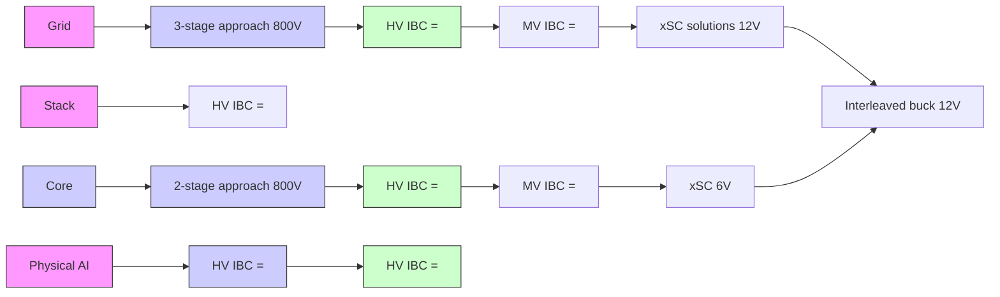

你是闲鱼资料类商品文案编辑，擅长把一份投研/行业/公司研报改写成适合闲鱼发布的商品说明。

【目标】
- 基于下面研报解析内容，生成一份可以复制到闲鱼商品详情里的中文文案。
- 风格参考用户提供的闲鱼对标笔记：标题直给、信息密度高、用途明确、适合人群明确、交付方式清楚。
- 语言要自然，像真实卖家发布，不要像公众号文章、小红书笔记或 AI 摘要。
- 不要使用太夸张的营销词，不要承诺收益，不要说“稳赚”“内幕”“必涨”。
- 可以适度口语化，但不要低俗。

【必须输出结构】
1. `闲鱼标题：` 一行，控制在 30 字以内，适合商品标题。
2. `商品描述：` 正文，适合直接粘贴到闲鱼详情页。
3. `Hashtag：` 一行，给 6-10 个平台可用标签，用 `#` 开头，空格分隔。

【严禁输出】
- 不要输出 `建议价格：`。
- 不要输出 `搜索关键词：`。
- 不要输出“搜索词”“关键词”“搜索关键词”等栏目。
- 不要给具体价格区间、成交承诺或价格建议。

【商品描述写法】
- 第一段：直接说明这是什么报告，页数/语言/主题/公司或行业。如果页数、日期、语言不确定，就不要编。
- 第二段：说明适合谁，比如投研、券商面试、PE/VC、行业研究、学习参考、写报告等。
- 第三段：用 3-5 个亮点 bullet，风格参考：
  ✅ 三大情景框架：DCF、P/ARR、EV/Sales
  ✅ 关键变量分析
  ✅ 估值逻辑、假设、终值占比等核心内容覆盖
  ✅ 适合准备 AI 相关面试、研究 AI 估值的同学
- 第四段：交付说明，参考：`资料为电子版 PDF，拍下后 24 小时内发网盘链接或邮箱。`
- 第五段：虚拟商品说明，参考：`电子类资料一经发货不退不换，有问题可以提前咨询。`
- 可以补一句：`需要其他报告也可以私聊，支持一站式咨询。`

【Hashtag 写法】
- 只输出平台相对安全、偏学习和资料属性的标签。
- 推荐从这些里选择：`#学习资料` `#研究笔记` `#学习笔记` `#行业研究` `#研报资料` `#资料整理` `#报告学习` `#案例研究`。
- 不要输出 `#财经` `#投资` `#股票` `#基金` `#理财` `#暴富` `#内幕` 等敏感标签。

【平台发布合规要求】
- 不要出现“投资建议”“买入”“卖出”“强烈推荐”“稳赚”“保本”“必涨”“抄底”“上车”“内幕”“翻倍”等金融操作或收益承诺表达。
- “投资”相关词尽量改成“投研”“研究”“观察”“学习参考”；如果必须保留，也要保持中性。
- 不要出现“独家”“原版”“内部”“无水印”“全网最低”“最全”“最强”“必看”等高风险或极限词。
- 不要写“关注”“点赞”“求关注”“评论区留言”等直接互动诱导。
- 不要承诺资料一定可用于获利、就业、通过面试或获得收益。

【合规与避坑】
- 默认避免出现具体投行品牌名，比如“GS”“GS”“MS”，统一写作“投行研报”或“投行研报”。
- 不要承诺研究或交易结果。
- 不要伪造页数、日期、作者、公司覆盖范围。研报未给出时就不写。
- 不要输出解释说明，只输出闲鱼文案本身。

【研报解析内容】
"""
May 28, 2026 04:00 AM GMT

# Technology - European Semiconductors | Europe Structural Re-rate Has Further to Run

<table><tr><td colspan="3">WHAT&#x27;S CHANGED</td></tr><tr><td>Infineon Technologies AG (IFXGn.DE)</td><td>From</td><td>To</td></tr><tr><td>Price Target</td><td>€63.00</td><td>€91.00</td></tr><tr><td>STMicroelectronics NV (STMPA.PA)</td><td></td><td></td></tr><tr><td>Price Target</td><td>€46.00</td><td>€74.00</td></tr></table>

Cyclical recovery is clear but structural drivers remain underappreciated for Infineon and STMicro. We gain confidence on Infineon's power semi deployment in the data centre and STMicro's exposure to optics and low-earth-orbit satellites.

# Key Takeaways

We lift our Infineon Technologies PT to €91 on higher power semi dollar content per rack.   
We move to a SOTP valuation framework for STMicroelectronics and lift our PT to €74, recognising the optical and LEO drivers.   
Cyclical recovery supports this as both companies talk to lower inventories, improved lead times and rising orders.   
While Infineon and STMicro have had a strong performance YTD (+100% and +14.7% respectively), we think the structural drivers remain undervalued.

Structural tailwinds drive our Analog PTs higher. While cyclical recovery is important, the main lever of our PT hikes is upside from structural drivers. For Infineon this is power semi deployment in the data centre, whereas for STMicroelectronics this is optical networking and low-earth-orbit satellites. As we did in January for Infineon, see A Structural Play Hiding in our Midst, we now also move to valuing STMicroelectronics on a Sum-of-the-Parts basis. We value the optical and LEO business on a 36x multiple, vs the core business on an 18x multiple. We lift our Infineon data centre multiple to 50x and core cycle multiple to 24x. For the core business, both companies speak to improving end-market dynamics and evidence of a cyclical recovery.

Infineon Technologies OW, PT €91. We reiterate our thesis and lift our PT to €91 as we gain confidence in Infineon's full-stack power semi opportunity in AI data centres. We raise our dollar-content assumptions for Rubin Ultra and Feynman, reflecting GaN content in the IBC and higher lateral VRM content as Agentic AI drives incremental CPU demand. This takes our Rubin Ultra power semi estimate to \$170/kW. Near term, we see the 1 July Dresden "Smart Power Fab" opening as a key catalyst opportunity, showcasing Infineon's manufacturing capability and potentially bringing an update on data centre revenue. The broader cycle is also turning: the 2Q print confirmed lower customer inventories, better lead times and rising order

MS & CO. INTERNATIONAL PLC+

# Lee Simpson

Equity Analyst
Lee.Simpson@morganstanley.com +44 20 7425-3378

# Shawn Kim

Equity Analyst  
Shawn.Kim@morganstanley.com +44 20 7677-1018

# Nigel van Putten

Equity Analyst
Nigel.Putten@morganstanley.com +44 20 7425-2803

# Amelia M Scicluna

Research Associate
Amelia.Scicluna@morganstanley.com +44 20 7425-6694

TECHNOLOGY - EUROPEAN SEMICONDUCTORS 

<table><tr><td colspan="2">Europe</td></tr><tr><td>Industry View</td><td>In-Line</td></tr></table>

MS does and seeks to do business with companies covered in MS. As a result, investors should be aware that the firm may have a conflict of interest that could affect the objectivity of MS. Investors should consider MS as only a single factor in making their investment decision.

# For analyst certification and other important disclosures, refer to the Disclosure Section, located at the end of this report.

+= Analysts employed by non-U.S. affiliates are not registered with FINRA, may not be associated persons of the member and may not be subject to FINRA restrictions on communications with a subject company, public appearances and trading securities held by a research analyst account.

intake, consistent with global analog peers. Despite the stock's $94\%$ rise since April, we still see Infineon as undervalued and raise our SOTP valuation. We move the data centre business to 50x 1-year forward P/E, still at a discount to Monolithic Power Systems, and lift the core cycle multiple to 24x from 20x, in line with peak analog cycle multiples and supported by improving visibility and end-market recovery.

STMicroelectronics OW, PT €74. Given the scale of the optical and LEO opportunities, we now move to valuing STM on an FY28e SOTP framework. We continue to expect optics to become an increasing share of the business as data centre networking shifts from copper to photonics while LEO is also emerging as a material growth vector. We view LEO sales growth as primarily led by user terminals, and lift our FY27 LEO sales estimate to \$1.25bn from \$1.08bn, driven by a higher 52% FY26-28 user-terminal CAGR. As with Infineon, the underlying business is improving with better visibility and easing pricing pressure. We value the core business at 18x, consistent with the cyclical story, and optical/LEO at 36x to reflect structural growth potential. This implies a €74 PT.

# Infineon (OW, €91)

Revisiting our server rack estimates. For our estimates of power semi content in NVIDIA racks, we readjust our dollar content assumptions for Rubin Ultra and Feynman racks, with greater weighting toward Intermediate Bus Conversion (IBC) in the first stage and lateral VRM in the second stage. As a reminder, the IBC sits after the power supply unit (PSU) in the rack and represents the first point in the power chain where GaN dominates. We lift our dollar content estimate for IBC in Rubin Ultra racks to \$16,560 (prior \$6,210) and to \$27,600 in Feynman racks (prior \$10,350), to reflect significant GaN content in the element. We also rebalance our estimates to reflect the growth of Agentic AI and the consequential demand for CPUs; see our Global Insight Rise of the AI Agent - Global Implications for further detail. In this instance, we think lateral power delivery would be more prevalent, and as such, within our second-stage estimates, we lift our lateral VRM dollar content assumptions to \$21,528 and \$37,440 in Rubin Ultra and Feynman racks, respectively (prior \$18,216 and \$28,800), while leaving our VPD/SiVR estimates unchanged. All in, this lifts our power semi estimate for Rubin Ultra racks to \$170/kW (prior \$159/kW).

Exhibit 1: Infineon IBC Solutions   

flowchart

Source: Infineon Technologies Presentation

Exhibit 2: Rubin Ultra Power Semi Content by Element   

pie

Rubin Ultra Power Semi Content by Element
| Element | Percentage (%) |
|---|---|
| PSU | 22 |
| BBU / UPS | 3 |
| IBC - 1st stage | 16 |
| PCS | 12 |
| VRM (lateral) - 2nd stage | 21 |
| VRM (VPD / SiVR) - 2nd stage | 21 |
| Switch | 1 |
| NICs | 1 |
| eFuses (etc.) | 1 |

Source: MS estimates

Eyes on Dresden. Infineon is hosting the opening of its Dresden fab module on 1 July for sell-side analysts, and will livestream the event on 2 July here. The Dresden 4 fab was first announced in November 2022 and was originally planned as a 300mm analog/mixed signal and power switches facility. However, Dresden has since been highlighted by management on recent earnings calls as key to meeting AI data centre demand, labelled as a “Smart Power Fab.” We view the event as a potential catalyst for the stock, as it not only highlights Infineon’s power semi manufacturing capability, but our sense is that management may also provide an update on data centre revenue.

More to come for the cycle. The 2Q print marked a clear shift in end-market dynamics (see Cyclical Recovery Confirmed). Management spoke confidently on continued recovery across industrial distribution channels as well as broader replenishment in the automotive segment. Lead times are improving, customer inventories are low and order intake is rising. Global analog peers' prints reaffirm these dynamics with many citing broad-based strength across end markets (see Global Analog Semis - Is This Time Different?).

Lift our PT to €91. In February we moved to valuing Infineon on a sum-of-the-parts basis, A Structural Play Hiding in our Midst, to reflect the divergent growth profiles between the data centre business and the remainder of the group. While the stock has risen 94% since April, we think Infineon remains undervalued given the company's full stack power semi solutions for the data centre. As we gain increasing confidence in Infineon's role in both Nvidia and TPU racks, we move to valuing the data centre business at a 50x P/E multiple on FY28e. This remains a discount to US peer, Monolithic Power Systems, which trades on a 55x P/E multiple. We also lift our cycle multiple to 24x (prior 20x), in-line with the analog sector's peak cycle multiple and reflecting improving visibility, better end-market dynamics and cyclical recovery. All in, this raises our PT to €91.

# Infineon Financials

Exhibit 3: IFX Annual Income Statement 

<table><tr><td>Annual Income Statement</td><td>2017</td><td>2018</td><td>2019</td><td>2020</td><td>2021</td><td>2022</td><td>2023</td><td>2024</td><td>2025</td><td>2026e</td><td>2027e</td><td>2028e</td></tr><tr><td>Revenues</td><td>7,063</td><td>7,599</td><td>8,029</td><td>8,567</td><td>11,060</td><td>14,218</td><td>16,308</td><td>14,956</td><td>14,662</td><td>16,170</td><td>18,138</td><td>20,080</td></tr><tr><td>Cost of goods Sold</td><td>-4,442</td><td>-4,714</td><td>-5,035</td><td>-5,791</td><td>-6,800</td><td>-8,087</td><td>-8,894</td><td>-8,798</td><td>-8,909</td><td>-9,529</td><td>-9,994</td><td>-10,534</td></tr><tr><td>Gross profit</td><td>2,621</td><td>2,885</td><td>2,994</td><td>2,776</td><td>4,260</td><td>6,131</td><td>7,414</td><td>6,158</td><td>5,753</td><td>6,642</td><td>8,144</td><td>9,546</td></tr><tr><td>Gross Profit - Adjusted</td><td>2,712</td><td>2,954</td><td>3,056</td><td>3,126</td><td>4,581</td><td>6,447</td><td>7,717</td><td>6,462</td><td>6,068</td><td>7,002</td><td>8,488</td><td>9,890</td></tr><tr><td>R&amp;D</td><td>-776</td><td>-836</td><td>-945</td><td>-1,113</td><td>-1,449</td><td>-1,798</td><td>-1,985</td><td>-2,074</td><td>-2,228</td><td>-2,529</td><td>-2,505</td><td>-2,666</td></tr><tr><td>SG&amp;A</td><td>-819</td><td>-850</td><td>-865</td><td>-1,042</td><td>-1,354</td><td>-1,565</td><td>-1,599</td><td>-1,553</td><td>-1,582</td><td>-1,641</td><td>-1,782</td><td>-1,846</td></tr><tr><td>Other income/(expenses)</td><td>-43</td><td>270</td><td>-23</td><td>-40</td><td>14</td><td>77</td><td>117</td><td>-340</td><td>-429</td><td>-137</td><td>1</td><td>-302</td></tr><tr><td>EBIT (reported)</td><td>983</td><td>1,469</td><td>1,161</td><td>581</td><td>1,471</td><td>2,845</td><td>3,947</td><td>2,191</td><td>1,514</td><td>2,334</td><td>3,858</td><td>4,732</td></tr><tr><td>Segment Result (&#x27;Adjusted EBIT&#x27;)</td><td>1,208</td><td>1,353</td><td>1,319</td><td>1,170</td><td>2,072</td><td>3,378</td><td>4,398</td><td>3,104</td><td>2,559</td><td>3,165</td><td>4,512</td><td>5,461</td></tr><tr><td>Adjusted EBITDA</td><td>2,020</td><td>2,214</td><td>2,264</td><td>2,430</td><td>3,585</td><td>5,041</td><td>6,152</td><td>4,970</td><td>4,476</td><td>5,123</td><td>6,795</td><td>7,957</td></tr><tr><td>Net Financials</td><td>-50</td><td>-58</td><td>-78</td><td>-157</td><td>-152</td><td>-122</td><td>-25</td><td>-31</td><td>-139</td><td>-161</td><td>36</td><td>135</td></tr><tr><td>PBT (reported)</td><td>933</td><td>1,411</td><td>1,083</td><td>424</td><td>1,319</td><td>2,723</td><td>3,922</td><td>2,160</td><td>1,375</td><td>2,174</td><td>3,894</td><td>4,866</td></tr><tr><td>Adjusted PBT</td><td>1,970</td><td>2,156</td><td>2,186</td><td>2,273</td><td>3,433</td><td>4,919</td><td>6,127</td><td>4,939</td><td>4,337</td><td>4,962</td><td>6,831</td><td>8,092</td></tr><tr><td>Income Tax</td><td>-142</td><td>-193</td><td>-194</td><td>-52</td><td>-144</td><td>-538</td><td>-783</td><td>-379</td><td>-370</td><td>-517</td><td>-779</td><td>-973</td></tr><tr><td>Net Income (reported)</td><td>791</td><td>1,218</td><td>889</td><td>372</td><td>1,175</td><td>2,185</td><td>3,139</td><td>1,781</td><td>1,005</td><td>1,656</td><td>3,115</td><td>3,893</td></tr><tr><td>Adjusted Net Income</td><td>967</td><td>1,116</td><td>1,041</td><td>814</td><td>1,564</td><td>2,574</td><td>3,467</td><td>2,441</td><td>1,818</td><td>2,282</td><td>3,612</td><td>4,449</td></tr><tr><td>EPS (€) - Basic</td><td>0.70</td><td>1.08</td><td>0.76</td><td>0.29</td><td>0.90</td><td>1.68</td><td>2.41</td><td>1.37</td><td>0.77</td><td>1.27</td><td>2.39</td><td>2.99</td></tr><tr><td>EPS (€) - Diluted</td><td>0.70</td><td>1.07</td><td>0.76</td><td>0.29</td><td>0.90</td><td>1.68</td><td>2.40</td><td>1.36</td><td>0.77</td><td>1.26</td><td>2.37</td><td>2.96</td></tr><tr><td>Adjusted EPS (€) - Diluted</td><td>0.85</td><td>0.98</td><td>0.89</td><td>0.64</td><td>1.20</td><td>1.97</td><td>2.65</td><td>1.87</td><td>1.39</td><td>1.74</td><td>2.75</td><td>3.39</td></tr><tr><td>DPS (€)</td><td>0.22</td><td>0.25</td><td>0.26</td><td>0.27</td><td>0.22</td><td>0.27</td><td>0.32</td><td>0.35</td><td>0.35</td><td>0.35</td><td>0.35</td><td>0.35</td></tr><tr><td></td><td>2017</td><td>2018</td><td>2019</td><td>2020</td><td>2021</td><td>2022</td><td>2023</td><td>2024</td><td>2025</td><td>2026e</td><td>2027e</td><td>2028e</td></tr><tr><td>Sales growth - yy</td><td>9%</td><td>8%</td><td>6%</td><td>7%</td><td>29%</td><td>29%</td><td>15%</td><td>-8%</td><td>-2%</td><td>10%</td><td>12%</td><td>11%</td></tr><tr><td>Gross margin - Adjusted</td><td>38.4%</td><td>38.9%</td><td>38.1%</td><td>36.5%</td><td>41.4%</td><td>45.3%</td><td>47.3%</td><td>43.2%</td><td>41.4%</td><td>43.3%</td><td>46.8%</td><td>49.3%</td></tr><tr><td>EBIT margin (reported)</td><td>13.9%</td><td>19.3%</td><td>14.5%</td><td>6.8%</td><td>13.3%</td><td>20.0%</td><td>24.2%</td><td>14.6%</td><td>10.3%</td><td>14.4%</td><td>21.3%</td><td>23.6%</td></tr><tr><td>Segment margin</td><td>17.1%</td><td>17.8%</td><td>16.4%</td><td>13.7%</td><td>18.7%</td><td>23.8%</td><td>27.0%</td><td>20.8%</td><td>17.5%</td><td>19.6%</td><td>24.9%</td><td>27.2%</td></tr><tr><td>EBITDA margin</td><td>28.6%</td><td>29.1%</td><td>28.2%</td><td>28.4%</td><td>32.4%</td><td>35.5%</td><td>37.7%</td><td>33.2%</td><td>30.5%</td><td>31.7%</td><td>37.5%</td><td>39.6%</td></tr><tr><td>PBT margin - Adjusted</td><td>27.9%</td><td>28.4%</td><td>27.2%</td><td>26.5%</td><td>31.0%</td><td>34.6%</td><td>37.6%</td><td>33.0%</td><td>29.6%</td><td>30.7%</td><td>37.7%</td><td>40.3%</td></tr><tr><td>Net margin (reported)</td><td>11.2%</td><td>16.0%</td><td>11.1%</td><td>4.3%</td><td>10.6%</td><td>15.4%</td><td>19.2%</td><td>11.9%</td><td>6.9%</td><td>10.2%</td><td>17.2%</td><td>19.4%</td></tr><tr><td>Net margin - Adjusted</td><td>13.7%</td><td>14.7%</td><td>13.0%</td><td>9.5%</td><td>14.1%</td><td>18.1%</td><td>21.3%</td><td>16.3%</td><td>12.4%</td><td>14.1%</td><td>19.9%</td><td>22.2%</td>

[中间内容因长度限制已省略]

ion in MS is being disseminated by MS Saudi Arabia, regulated by the Capital Market Authority in the Kingdom of Saudi Arabia, and is directed at Sophisticated investors only.

MS Hong Kong Securities Limited is the liquidity provider/market maker for securities of ASM International NV listed on the Stock Exchange of Hong Kong Limited. An updated list can be found on HKEx website: http://www.hkex.com.hk.

The information in MS is being communicated by MS & Co. International plc (DIFC Branch), regulated by the Dubai Financial Services Authority (the DFSA) or by MS & Co. International plc (ADGM Branch), regulated by the Financial Services Regulatory Authority Abu Dhabi (the FSRA), and is directed at Professional Clients only, as defined by the DFSA or the FSRA, respectively. The financial products or financial services to which this research relates will only be made available to a customer who we are satisfied meets the regulatory criteria of a Professional Client. A distribution of the different MS Research ratings or recommendations, in percentage terms for Investments in each sector covered, is available upon request from your sales representative.

The information in MS is being communicated by MS & Co. International plc (QFC Branch), regulated by the Qatar Financial Centre Regulatory Authority (the QFCRA), and is directed at business customers and market counterparties only and is not intended for Retail Customers as defined by the QFCRA.

As required by the Capital Markets Board of Turkey, investment information, comments and recommendations stated here, are not within the scope of investment advisory activity. Investment advisory service is provided exclusively to persons based on their risk and income preferences by the authorized firms. Comments and recommendations stated here are general in nature. These opinions may not fit to your financial status, risk and return preferences. For this reason, to make an investment decision by relying solely to this information stated here may not bring about outcomes that fit your expectations.

The trademarks and service marks contained in MS are the property of their respective owners. Third-party data providers make no warranties or representations relating to the accuracy, completeness, or timeliness of the data they provide and shall not have liability for any damages relating to such data. The Global Industry Classification Standard (GICS) was developed by and is the exclusive property of MSCI and S&P.

MS, or any portion thereof may not be reprinted, sold or redistributed without the written consent of MS.

Indicators and trackers referenced in MS may not be used as, or treated as, a benchmark under Regulation EU 2016/1011, or any other similar framework.

The issuers and/or fixed income products recommended or discussed in certain fixed income research reports may not be continuously followed. Accordingly, investors should regard those fixed income research reports as providing stand-alone analysis and should not expect continuing analysis or additional reports relating to such issuers and/or individual fixed income products. MS may hold, from time to time, material financial and commercial interests regarding the company subject to the Research report.

Registration granted by SEBI and certification from the National Institute of Securities Markets (NISM) in no way guarantee performance of the intermediary or provide any assurance of returns to investors. Investment in securities market are subject to market risks. Read all the related documents carefully before investing.

Stock Ratings are subject to change. Please see latest research for each company.   
\* Historical prices are not split adjusted.   
INDUSTRY COVERAGE: Technology - European Semiconductors 

<table><tr><td>COMPANY (TICKER)</td><td>RATING (AS OF)</td><td>PRICE* (05/27/2026)</td></tr><tr><td>Lee Simpson</td><td></td><td></td></tr><tr><td>ASML Holding NV (ASML.AS)</td><td>O (09/22/2025)</td><td>€1,376.40</td></tr><tr><td>Infineon Technologies AG (IFXGn.DE)</td><td>O (02/06/2025)</td><td>€76.73</td></tr><tr><td>STMicroelectronics NV (STMPA.PA)</td><td>O (03/26/2026)</td><td>€57.95</td></tr><tr><td colspan="3">Nigel van Putten</td></tr><tr><td>Aixtron SE (AIXGn.DE)</td><td>E (05/25/2023)</td><td>€57.20</td></tr><tr><td>ASM International NV (ASMI.AS)</td><td>O (06/19/2024)</td><td>€894.20</td></tr><tr><td>BE Semiconductor Industries NV (BESI.AS)</td><td>O (11/07/2022)</td><td>€276.40</td></tr><tr><td>Melexis N.V. (MLXS.BR)</td><td>E (02/05/2026)</td><td>€81.65</td></tr><tr><td>Nordic Semiconductor ASA (NOD.OL)</td><td>E (02/10/2025)</td><td>NKr 201.60</td></tr><tr><td>Soitec SA (SOIT.PA)</td><td>O (03/26/2026)</td><td>€154.20</td></tr><tr><td>VAT Group AG (VACN.S)</td><td>E (03/21/2025)</td><td>SFr 604.60</td></tr></table>

© 2026 MS
"""
