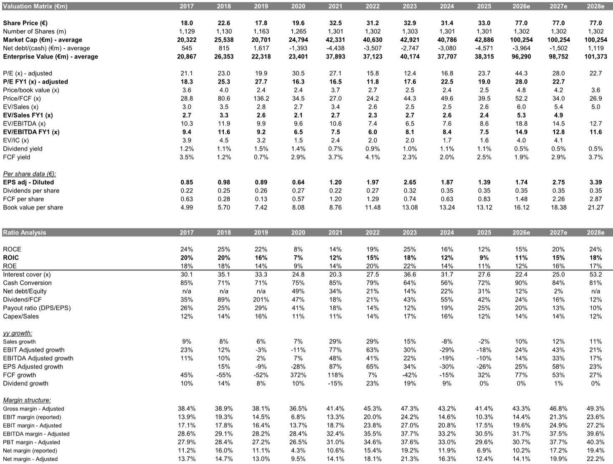
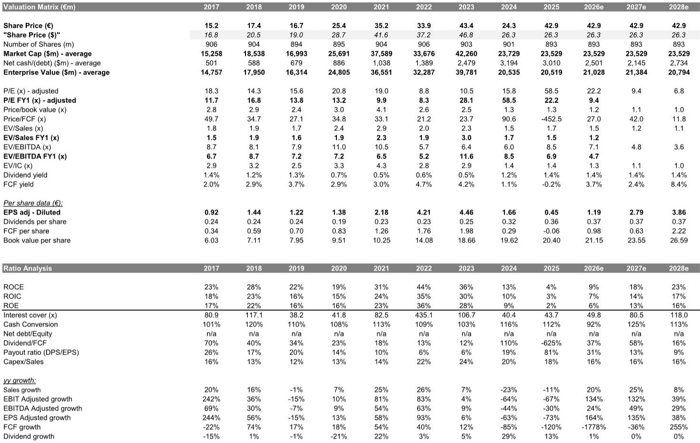
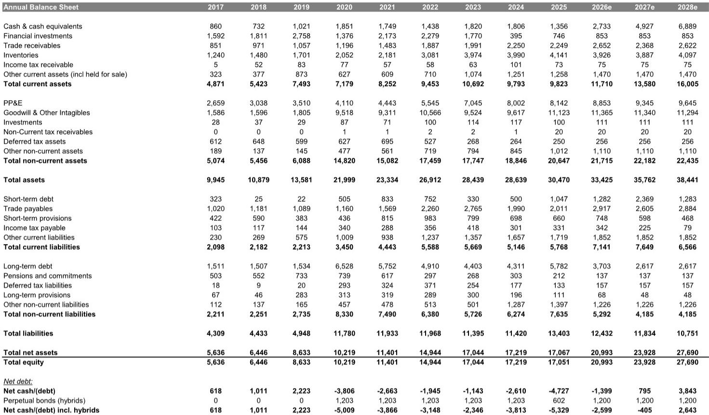

# European Semiconductors Have Entered a Structural Re-Rating, Not Just a Cyclical Bounce

The market is treating the recent surge in European semiconductor stocks as a cyclical recovery play. That interpretation is incomplete and potentially misleading. A global investment bank report published in late May 2026 makes a compelling case that the real story is structural, not cyclical, and that the re-rating of Infineon Technologies and STMicroelectronics has further room to run.

The numbers are striking. Infineon has risen roughly 94% since April 2026, and STMicroelectronics has gained about 15% year-to-date. Conventional wisdom might suggest these moves have priced in the recovery. Yet the report argues the opposite: the structural drivers that underpin these businesses remain underappreciated by the market, and the current valuation multiples do not yet reflect the scale of the opportunity in AI data centres, optical networking, and low-earth-orbit satellites.

This is not a call that rests on a single catalyst. It is a thesis built on the convergence of three forces: a confirmed cyclical recovery in end-markets, a fundamental shift in the power architecture of AI data centres, and the emergence of new growth vectors in photonics and space-based communications. Each of these forces independently justifies a re-rating. Together, they create a compound effect that the market has not fully absorbed.

The report raises the price target for Infineon to EUR 91 and for STMicroelectronics to EUR 74, using sum-of-the-parts valuation frameworks that assign significantly higher multiples to structural growth businesses. The core insight is straightforward: these companies are no longer just cyclical semiconductor plays. They are becoming diversified technology platforms with exposure to secular growth themes that deserve premium valuations.

## Infineon's Data Centre Opportunity Is Larger Than the Market Realises, and the Valuation Framework Has Not Caught Up

The most important shift in the Infineon thesis is the reassessment of power semiconductor content per AI server rack. The report revises its dollar-content estimates for Rubin Ultra and Feynman racks upward, reflecting two specific technical developments that compound in their effect.

First, the Intermediate Bus Conversion stage, which sits after the power supply unit in the rack, is increasingly dominated by GaN technology. The report lifts its dollar-content estimate for this stage from USD 6,210 to USD 16,560 for Rubin Ultra racks, and from USD 10,350 to USD 27,600 for Feynman racks. This is not a marginal adjustment. It represents a near tripling of the estimated content in the IBC stage, driven by the recognition that GaN is becoming the dominant power architecture for this critical function.

Second, the rise of Agentic AI is driving incremental demand for CPUs within data centre racks. This shifts the power delivery requirements toward lateral VRM solutions, which Infineon is well-positioned to supply. The report lifts its lateral VRM dollar-content estimates from USD 18,216 to USD 21,528 for Rubin Ultra racks, and from USD 28,800 to USD 37,440 for Feynman racks. The combined effect brings the total power semiconductor estimate for Rubin Ultra racks to USD 170 per kilowatt, up from USD 159.

The implication is that Infineon's addressable market within each AI rack is expanding faster than the market has modelled. The report values Infineon's data centre business at 50x forward P/E, which still represents a discount to its US peer Monolithic Power Systems, which trades at approximately 55x. This discount is difficult to justify if Infineon's full-stack power semiconductor solutions are indeed becoming the preferred architecture for next-generation AI racks.

The upcoming Dresden Smart Power Fab opening on 1 July 2026 serves as a potential catalyst. Originally planned as a 300mm analog and mixed-signal facility, Dresden has been repositioned by management as a key manufacturing node for AI data centre demand. The event could provide an update on data centre revenue that would validate the re-rating thesis.

## STMicroelectronics Deserves a Sum-of-the-Parts Valuation Because Its Optical and LEO Businesses Are Fundamentally Different from Its Core

The report makes a similar argument for STMicroelectronics, but the structural drivers are different. The key insight is that STM's exposure to optical networking and low-earth-orbit satellites represents a growth profile that is entirely distinct from its core cyclical business, and therefore deserves a separate valuation framework.

The optical opportunity stems from the shift from copper to photonics in data centre networking. As data centre architectures evolve to handle the bandwidth demands of AI workloads, the interconnect fabric is moving from electrical to optical transmission. STM is positioned to benefit from this transition through its optical components business, which the report expects to become an increasing share of the company's revenue mix.

The LEO opportunity is even more distinctive. The report lifts its FY27 LEO sales estimate for STM to USD 1.25 billion from USD 1.08 billion, driven by a 52% compound annual growth rate in user terminals between FY26 and FY28. This is not a speculative projection. It reflects the build-out of satellite constellations that require ground-based user terminals, and STM has established a position in this supply chain.

The report's valuation framework is instructive. It assigns a 36x multiple to the optical and LEO businesses, while valuing the core business at 18x. This 2x premium reflects the structural growth characteristics of these segments versus the cyclical nature of the core. The resulting sum-of-the-parts valuation yields a EUR 74 price target, which implies that the market is currently pricing the optical and LEO businesses at a significant discount to their intrinsic value.

The question that naturally arises is whether this premium is sustainable. The report argues yes, but the sustainability depends on execution. STM must demonstrate that it can grow these businesses at the projected rates without diluting margins or facing competitive displacement. The market will need evidence of revenue acceleration and margin expansion in these segments before it fully prices in the premium.

## The Cyclical Recovery Is a Supporting Actor, Not the Lead

It would be a mistake to dismiss the cyclical recovery as irrelevant. The report confirms that both companies are seeing improving end-market dynamics: lower customer inventories, better lead times, and rising order intake. The second-quarter results for Infineon marked a clear inflection point, with management speaking confidently about recovery across industrial distribution channels and broader replenishment in the automotive segment.

But the cyclical recovery is not the primary driver of the price target increases. The report is explicit on this point: the main lever of the PT hikes is upside from structural drivers. The cyclical recovery simply provides the foundation that makes the structural story credible. Without the cyclical recovery, the market would be sceptical of any optimistic projections. With the recovery confirmed, the structural story becomes investable.

This distinction matters for investors. If the thesis were purely cyclical, the upside would be limited to the duration of the recovery phase. But because the thesis is structural, the upside extends beyond the cycle. The report's valuation framework explicitly separates the cyclical core from the structural growth segments, assigning different multiples to each. This is not a temporary re-rating. It is a permanent reassessment of the earnings power and growth profile of these businesses.

The report raises the core cycle multiple for Infineon from 20x to 24x, in line with peak analog cycle multiples. This is a modest adjustment that reflects improved visibility and end-market recovery. But the structural multiple for the data centre business is set at 50x, more than double the core multiple. The implication is clear: the structural story is where the real value creation lies.

## What the Report Does Not Fully Answer: The Sustainability of the GaN Advantage and the Risk of Competitive Displacement

For all its analytical depth, the report leaves several important questions unresolved. The most significant is the sustainability of Infineon's GaN advantage in the data centre power chain. The report assumes that GaN will dominate the IBC stage, and that Infineon's position in GaN is secure. But GaN technology is evolving rapidly, and competitors are investing heavily in alternative architectures. Silicon carbide, advanced silicon-based solutions, and next-generation GaN designs from competitors could erode Infineon's advantage over the next two to three years.

The report does not address the competitive dynamics in GaN power semiconductors in detail. It mentions that Infineon's data centre business is valued at a discount to Monolithic Power Systems, but it does not explore whether that discount reflects a legitimate competitive risk or simply market inefficiency. If Infineon's GaN position is more fragile than assumed, the 50x multiple on the data centre business would be difficult to justify.

Similarly, the report does not fully address the execution risk at STMicroelectronics. The optical and LEO businesses are projected to grow at high compound rates, but STM has not historically been known as a high-growth technology company. Its culture, capital allocation, and operational capabilities have been shaped by decades of serving automotive and industrial markets. Whether the company can successfully pivot to serve the data centre and satellite markets with the required speed and agility remains an open question.

The report also does not address the geopolitical risk that hangs over European semiconductor companies. Both Infineon and STM are exposed to export controls, supply chain decoupling, and the potential for trade restrictions between the US, Europe, and China. The structural drivers that the report identifies are global in nature, but the companies are European. If geopolitical tensions escalate, these companies could face constraints on their ability to serve certain markets or access certain technologies.

## A Decision Framework for Investors: How to Evaluate the Structural Re-Rating Thesis

For investors considering whether to act on this thesis, a structured decision framework is useful. The thesis rests on three pillars, and each pillar must be validated independently.

The first pillar is the cyclical recovery. Has the recovery been confirmed by the data? The report says yes, citing lower inventories, better lead times, and rising orders. But the recovery is not uniform across end-markets. Automotive is improving, industrial distribution is recovering, but some segments remain weak. Investors should monitor quarterly results from both companies and their global analog peers to confirm that the recovery is broadening rather than narrowing.

The second pillar is the structural growth in data centre power semiconductors. Is Infineon's dollar-content per rack increasing as projected? The report's estimates are based on specific assumptions about GaN adoption in the IBC stage and lateral VRM in the second stage. These assumptions can be validated by tracking Infineon's data centre revenue disclosures, by monitoring the specifications of next-generation AI racks from NVIDIA and other hyperscalers, and by observing the competitive dynamics in GaN power semiconductors.

The third pillar is the emergence of optical and LEO as material growth vectors for STM. Is STM winning design wins in optical networking and LEO user terminals? The report's projections imply a significant ramp in revenue from these segments. Investors should look for evidence of design win announcements, customer commitments, and revenue acceleration in STM's segment reporting.

The decision framework also requires a view on valuation. The report's sum-of-the-parts approach is intellectually sound, but it depends on the multiples assigned to each segment. The 50x multiple on Infineon's data centre business and the 36x multiple on STM's optical and LEO businesses are justified by the growth potential, but they are not risk-free. If growth disappoints, the multiples will contract.

The most important question for investors is whether the structural re-rating has further to run or whether it has already been priced in. The report argues that it has further to run, citing the discount to US peers and the underappreciation of structural drivers. But the market is dynamic, and the re-rating could happen faster than the report anticipates. Investors who wait for full confirmation may find that the opportunity has passed.

## The Structural Thesis Deserves Serious Attention, But It Requires Active Monitoring

The report makes a strong case that European semiconductors are undergoing a structural re-rating that extends beyond the cyclical recovery. The evidence is compelling: rising dollar-content per rack for Infineon, emerging growth vectors in optics and LEO for STM, and a valuation framework that separates structural growth from cyclical core.

But the thesis is not without risk. The sustainability of the GaN advantage, the execution risk at STM, and the geopolitical backdrop all introduce uncertainty. The report acknowledges some of these risks implicitly through its use of sum-of-the-parts valuation and its discount to US peers, but it does not fully explore the downside scenarios.

For serious investors, the appropriate response is not to dismiss the thesis or to embrace it uncritically, but to engage with it actively. The structural drivers are real. The question is whether the companies can execute against them, and whether the market will continue to re-rate the stocks as the evidence accumulates.

The report's analysis provides a framework for monitoring these questions. The upcoming Dresden opening, the quarterly results, and the competitive developments in GaN and optical networking will all provide data points that either validate or challenge the thesis. Investors who track these data points will be in a position to act before the market fully prices in the outcome.

Join the community to read the full report and review the original charts.

*This article is for learning and discussion only and does not constitute investment advice.*

Personal reading notes and learning share only. Not investment advice.

