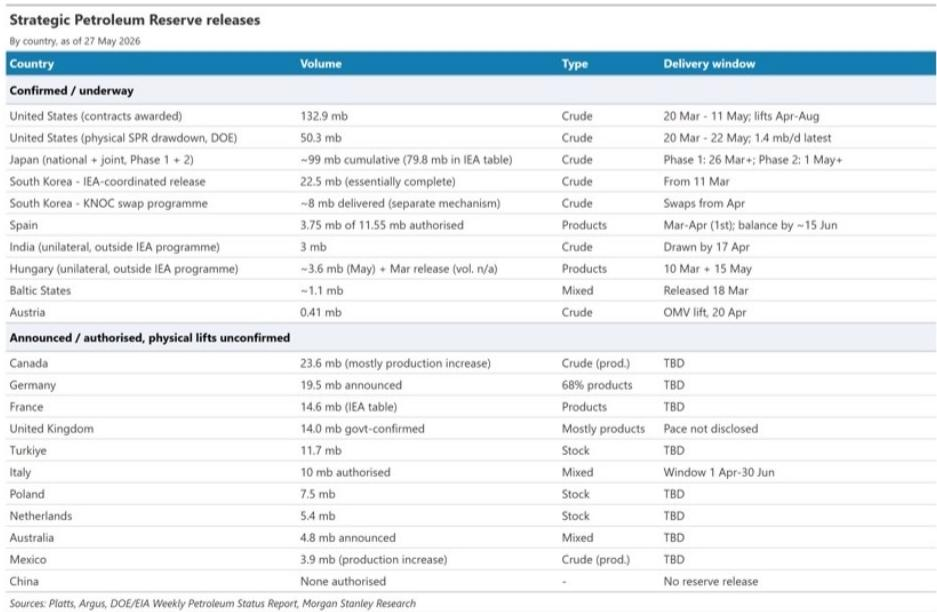
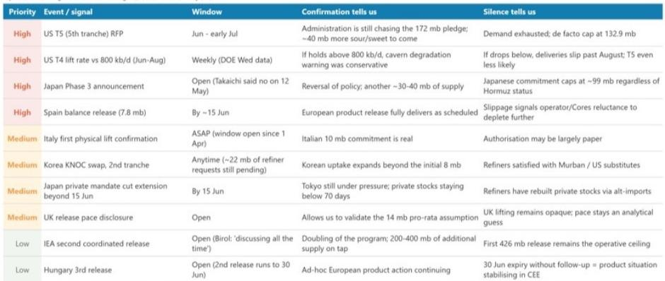
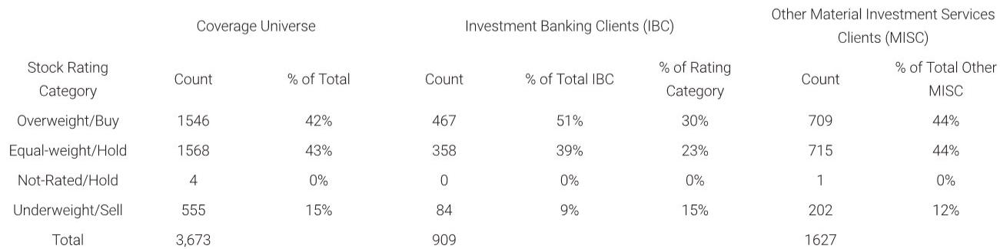

# 原油市场的真正拐点不在价格，而在7月战略储备的断崖式下降

过去两个月，全球战略石油储备（SPR）以每天250万桶的速度释放，这是有史以来最快的战略库存消耗节奏。但市场可能低估了一个关键事实：这个节奏将在7月骤降至每天70万桶，降幅超过70%。这不是预测，而是基于已签署合同和各国政府明确承诺的排期推算。

某外资投行在最新发布的石油手册中，首次系统性地追踪了全球各国SPR的实际释放进度和未来排期。这份报告的价值不在于重复“战略储备释放”这个已知事实，而在于用一个数据拼图回答了一个关键问题：当战略储备这个缓冲垫在7月突然变薄，市场会面临什么？

这份报告的原始数据分散在美国能源部每周石油状况报告、日本经济产业省、Argus、Platts以及各国政府声明中。该投行将这些碎片拼接成一张完整的全球SPR流量表，并给出了一个清晰的判断：市场真正需要关注的不是已经释放了多少，而是即将停止释放多少。

## 1. 全球SPR释放已经消耗了近1500万桶，但真正的压力测试在7月

截至5月25日，全球已确认的战略储备实物释放量约为1.5亿桶。这个数字来自该投行对各国实际提油数据的追踪，与IEA执行董事比罗尔近期提到的每天250万至300万桶的释放速率基本吻合。

但更重要的数字是释放节奏的分布。4月至6月，全球SPR释放量维持在每月7500万至8000万桶的高位，其中美国贡献了约4500万桶，日本约2700万至2900万桶。然而，进入7月后，这一数字将骤降至约2200万桶，8月进一步降至约2000万桶。

这个“7月断崖”并非假设性情景，而是由各国已公布的释放计划时间表所决定的。日本的第二阶段释放将在7月初结束，韩国IEA协调释放已经完成，西班牙的剩余释放量将在6月中旬交付完毕，匈牙利的第二轮释放将于6月30日到期。7月之后，唯一仍在运行的只有美国第四轮释放，其月度提油量约为1800万桶。

这意味着，全球原油市场将在未来两个月内失去一个每天约180万桶的供应缓冲。对于一个日消费量约1亿桶的市场而言，这个缺口本身并不致命，但考虑到当前地缘政治局势的不确定性，它可能成为一个重要的边际变量。

## 2. 美国SPR的释放能力正在接近物理极限，而非政策极限

美国是这轮全球SPR释放的绝对主力。截至5月22日，美国已签约132.9亿桶，其中实物提油量约为5030万桶。但真正值得关注的是第四轮释放的认购率——仅58%，远超前三轮的100%、85%和87%。

认购率下降的原因可能有两个。一是价格因素：随着油价回落，交换合同的预期回报率对交易商的吸引力下降。二是操作因素：美国能源部在第四轮招标文件中明确警告，“随着SPR库存下降，进入终端的提油速率将下降”。

这个警告背后是一个物理约束。SPR原油储存在盐穴中，通过注水置换的方式提取。当库存水平下降时，可达到的泵送速率会随之下降。作为参考，2022年美国SPR释放峰值约为每天100万桶，当时库存水平约为6亿桶。而当前库存已降至约3.65亿桶，释放速率却达到每天140万桶——系统正在以更低的库存水平承受更高的运行强度。

该投行的测算显示，合理的预期是：6月至7月的提油速率将放缓至每天100万至120万桶，8月进一步降至每天70万至90万桶。这意味着，即使美国宣布第五轮释放，实际可达到的释放速率也可能低于市场预期。

这里有一个尚未被充分讨论的问题：美国SPR的物理释放能力可能成为未来几个月原油供应曲线的硬约束，而非政策意愿的软约束。

## 3. 日本是市场严重低估的供应来源，但它的释放正在接近尾声

日本在这轮全球SPR释放中的贡献被严重低估。日本的累计承诺释放量约为9900万桶，与美国签约的132.9亿桶几乎相当。截至5月，两国各自释放了约5000万桶。

但日本的释放机制与美国完全不同。日本原油直接分配给四家国内炼油商（ENEOS、出光兴产、Cosmo石油、太阳石油），这些原油不会出现在货运数据追踪系统中。而美国SPR原油通过商品交易商流向市场，部分甚至以实物货运的形式出口至欧洲（5月至6月每天约40万桶）。

这意味着，市场通过货运数据感知到的供应增量主要来自美国，而日本的贡献在很大程度上是“隐形”的。当日本的第二阶段释放于7月初结束时，这个隐形的供应来源将消失。

更关键的是，日本首相高市早苗在5月已拒绝授权第三轮释放，理由是6月所需的原油已通过其他渠道获得保障。虽然她没有完全排除未来启动第三轮的可能性，但这一表态已经设定了日本释放的上限。

## 4. 欧洲国家的释放承诺存在巨大的执行不确定性

报告揭示了一个令人不安的事实：大量欧洲国家宣布了SPR释放计划，但实际执行的物理提油量极少。

德国承诺释放1950万桶，法国1460万桶，意大利1000万桶，英国1400万桶，澳大利亚480万桶——这五个国家合计约6300万桶的承诺释放量，至今几乎没有得到任何物理提油的确认。加上加拿大、土耳其、波兰、荷兰、墨西哥等IEA成员国，未确认的物理提油量总计约9800万桶。

这些承诺能否兑现，将直接决定7月断崖的“软硬”程度。如果这些国家最终完成了释放，7月至8月的月度释放量可能维持在4000万至6000万桶，而非基准情景下的2000万桶。

但这里存在一个逻辑问题：如果这些国家的释放计划是真实的，为什么至今没有物理提油的确认？是操作延迟、政治阻力，还是这些承诺本身就是“纸面释放”？该投行没有给出明确判断，但这个问题的答案对市场供需平衡至关重要。

## 5. 未来30天最关键的风向标：美国第五轮释放招标

报告给出了一个清晰的观察框架：未来30天最重要的信号是美国能源部是否在6月中旬之前宣布第五轮释放招标。如果宣布，意味着美国政府仍在追求172亿桶授权释放的剩余额度，可能额外释放约4000万桶。如果沉默，则意味着需求已经耗尽，实际释放上限锁定在132.9亿桶。

第二个关键信号是美国第四轮释放的实际提油速率。如果每周数据持续高于每天80万桶，说明盐穴退化警告是保守的；如果低于这一水平，则意味着部分交付将推迟至8月之后，第五轮释放的可能性进一步降低。

第三个信号是日本是否在6月中旬之前出现政策逆转。虽然高市早苗已经明确拒绝第三轮释放，但地缘政治局势的变化可能迫使日本重新评估。

这些信号的价值在于，它们提供了比油价走势更早的供应变化指示。在战略储备释放进入尾声的阶段，实物供应的边际变化比价格信号更有意义。

## 报告尚未完全回答的关键问题：中国的沉默意味着什么

在这份报告中，中国被明确标注为“未授权任何释放”。在全球主要经济体都参与SPR释放的背景下，中国的缺席是一个值得关注的结构性变量。

中国的战略石油储备规模从未公开披露，但市场普遍估计在3亿至5亿桶之间。如果中国选择在某个时点介入，其释放量可能超过任何一个国家。但报告没有讨论中国不释放的战略逻辑：是储备规模不足、操作能力受限，还是有意保留储备以应对更极端的场景？

这个问题的答案可能比SPR释放本身对市场的影响更大。中国的战略选择不仅影响短期供需平衡，更可能改变市场对“全球战略储备作为安全网”这一假设的信心。

## 顺着这些未解问题继续读完整报告

以上只是这份石油手册的一小部分。报告还包含了对美国SPR各轮释放的详细合同条款对比、日本释放机制的完整拆解、以及未来几个月需要关注的9个关键信号及其对应的市场含义。这些细节对于理解原油市场的短期供需变化至关重要。

如果你对原油市场的微观结构感兴趣，欢迎来星球微信群里继续讨论。我们会持续追踪这些关键信号，并在第一时间分享对市场含义的分析。

Personal reading notes and learning share only. Not investment advice.

