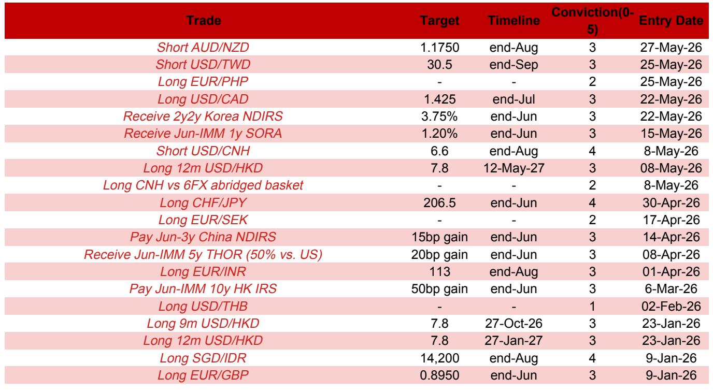
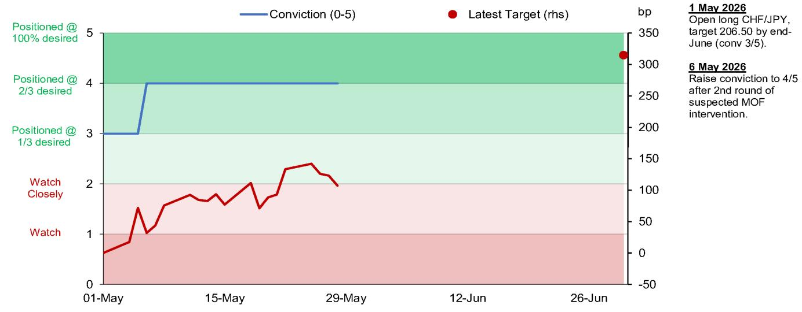
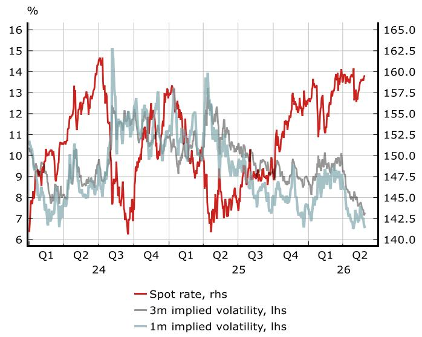

# 市场低估了瑞士央行的“克制”，却高估了日本当局的决心

在当前的全球外汇市场，一个看似矛盾的现象正在上演：瑞士央行口头干预的强硬表态与日本财务省同样强硬的措辞，引导着市场走向截然不同的定价逻辑。某外资投行最新发布的策略更新报告，通过对两国央行真实行为模式的拆解，提出了一个值得投资者重新审视的判断——市场真正需要关注的，不是两国央行“会不会干预”，而是它们“以什么节奏、什么力度、什么目标去干预”。这个差异，正在为做多瑞郎兑日元的交易提供坚实的基本面支撑。

报告的核心交易建议是：维持做多CHF/JPY，目标206.50，截至6月底。这一判断的背后，是对瑞士央行和日本财务省干预哲学的深度对比。报告没有停留在“谁更强硬”的表层叙事，而是从实际干预数据、通胀预期、官员措辞演变和隐含波动率等多个维度，揭示了两个央行在“干预工具箱”中的真实排序。

这不仅仅是货币对交易的技术判断。对于关注全球宏观资产配置的决策者而言，这组分析提供了一个理解“央行干预时代”的新框架：当口头干预常态化后，真正决定汇率走向的，不是干预的“存在”，而是干预的“边界”。

## 1. 瑞士央行的口头干预，比实际动作更有信号意义

瑞士央行行长施莱格尔近期讲话中重申了干预意愿，尤其是在中东冲突加剧背景下瑞郎面临的升值压力。这被市场解读为瑞士央行的强硬姿态。但报告通过月度外汇储备数据发现，在3月和4月，经估值调整后的瑞士央行外汇储备并未出现有意义的增加。这意味着，尽管央行表态“愿意干预”，实际动手的力度和频率远低于市场想象。

这种“雷声大雨点小”的模式，恰恰是瑞士央行当前干预哲学的体现。报告指出，施莱格尔在演讲中特别提到一个关键事实：瑞郎实际有效汇率的升值幅度，远小于名义有效汇率。这意味着，从贸易竞争力的角度看，瑞郎的强势并没有表面数据看起来那么严重。因此，瑞士央行的干预更可能是“有节制的”——目的是缓解升值压力、限制通缩效应，而不是逆转整体趋势。

这个细节至关重要。它意味着，市场如果仅仅因为瑞士央行口头强硬就押注瑞郎贬值，可能会误判干预的真实边界。瑞士央行真正不能容忍的，是瑞郎过快升值引发的通缩螺旋，而不是瑞郎本身的强势。只要实际有效汇率仍在可控范围内，瑞士央行更倾向于让资本流入（经常账户顺差、避险资金）自然支撑瑞郎。

## 2. 日本财务省的口头干预，缺乏关键人物的“背书”

与瑞士央行的“有节制干预”形成对比，日本财务省的表态看似同样强硬，但报告揭示了一个更微妙的信号缺口。5月19日，财务大臣片山使用了“大胆行动”这一强措辞进行口头干预。但在市场看来，真正的关键人物——负责外汇事务的财务官三村——近期并未发表类似言论。

报告通过一项调查指出，多数受访者（67.2%）预期日本财务省将在美元兑日元达到162时才再次干预。而当前美元兑日元的隐含波动率，无论1个月还是3个月期限，都处于显著低迷状态。这表明，市场对日本当局的干预风险并未真正感到警惕。报告判断，“干预风险尚未实质性上升”。

这个判断的核心逻辑在于：日本财务省的口头干预，如果缺乏三村等关键官员的持续“喊话”，其威慑效果会大打折扣。市场已经学会区分“政治表态”和“技术准备”。只有当财务省从单一官员喊话升级为多层级、高频次的联合喊话，市场才会真正重新定价干预风险。

## 3. 通胀预期的差异，决定了央行干预的“忍耐度”

报告提供了两组关键数据，揭示了两国央行在干预决策中的“软肋”。瑞士央行在3月会议上调了通胀预测，但2026年的CPI展望仍仅为0.5%年同比。这意味着，瑞士央行对通缩压力极为敏感。施莱格尔明确表示不愿将政策利率重返负值，这进一步收窄了瑞士央行的政策工具箱。当利率工具受限时，外汇干预就成为应对通缩的唯一可行选项，但干预的力度必须“不引发过度贬值”，否则会与通胀目标冲突。

日本方面，报告虽然未直接对比日本通胀数据，但日本央行已进入加息周期，通胀水平远高于瑞士。这意味着日本财务省在干预时面临的政治成本更低——通胀不是核心风险。因此，日本当局理论上可以更激进地干预，但实际执行上却更犹豫，因为市场对日元贬值的容忍度更高，且日本央行加息本身已在对抗贬值压力。

这个对比指向一个关键洞察：当央行面临通缩风险时，干预的“忍耐度”极低，但干预的“力度”却必须克制；当央行面临通胀压力时，干预的“政治意愿”更低，但理论上“力度”可以更大。当前的市场定价，显然没有充分反映这种不对称性。

## 4. 报告尚未完全回答的关键问题：干预的“二阶效应”如何传导

报告对CHF/JPY交易给出了明确的交易信号和逻辑支撑，但有两个关键问题尚未充分展开，而这恰恰是投资者在构建仓位时最需要自行判断的。

第一，瑞士央行的干预是否可能从“有节制”升级为“主动贬值”？报告指出，瑞士央行修订后的通胀预测仍仅0.5%，这构成了通缩风险。但如果中东局势降温、避险资金流出瑞士，瑞郎贬值压力自然缓解，瑞士央行是否还会主动干预？还是说，干预只是对冲短期冲击的“刹车”，而非长期趋势的“方向盘”？这个问题直接影响CHF/JPY交易的持有周期和止损设定。

第二，日本财务省的干预阈值是否会因美元兑日元逼近162而提前触发？报告认为当前干预风险未实质上升，但明确表示“如果美元兑日元继续走高并接近162，我们将重新审视交易”。这意味着，该交易本身带有条件性，而非无条件看多瑞郎。投资者需要自行判断，日本当局在162关口是否真的会“按兵不动”，还是会因为政治压力而提前行动。报告没有给出明确概率，而是留给市场去验证。

## 5. 一个适用于更广泛资产的观察框架：区分“干预意愿”与“干预能力”

从这笔具体交易出发，我们可以提炼出一个适用于当前全球外汇和利率市场的分析框架。在央行密集口头干预的背景下，投资者容易陷入两个误区：一是将所有口头干预视为同等有效，二是将所有实际干预视为同等可持续。

区分“干预意愿”和“干预能力”是关键。干预意愿取决于政治周期、通胀目标和国内舆论；干预能力则依赖于外汇储备规模、利率空间和资本账户开放度。瑞士央行拥有充足的储备和负利率历史经验，但通胀目标限制了其干预的持续性；日本财务省拥有庞大的储备和独立的财政操作权，但市场对日元贬值的容忍度以及日本央行的加息周期，削弱了其干预的紧迫性。

在这个框架下，做多CHF/JPY的逻辑本质上是押注：瑞士央行的“克制干预”不会逆转瑞郎的长期升值趋势，而日本财务省的“口头干预”短期内不会转化为实质性行动。这个判断成立的关键前提，是两国通胀路径不发生意外变化，以及中东地缘风险不出现极端升级。

---

这篇报告的分析深度和交易逻辑的严密性，远超普通的策略更新。它没有停留在“哪个央行更强硬”的表层叙事，而是通过干预数据、通胀预期和官员措辞的细节，拆解了两个央行在“干预工具箱”中的真实排序。对于希望深入理解央行干预时代资产定价逻辑的读者，这份报告的完整版本——包括5张关键图表、完整的策略组合清单以及分析师对风险场景的详细推演——值得仔细阅读。

这些图表背后的二阶效应、干预阈值的不确定性、以及交易仓位的动态调整条件，正是我们社群中持续讨论的焦点。欢迎来星球微信群里继续讨论，我们将围绕这份报告未完全回答的关键问题，结合最新市场数据，进行更深度的推演。

Personal reading notes and learning share only. Not investment advice.

