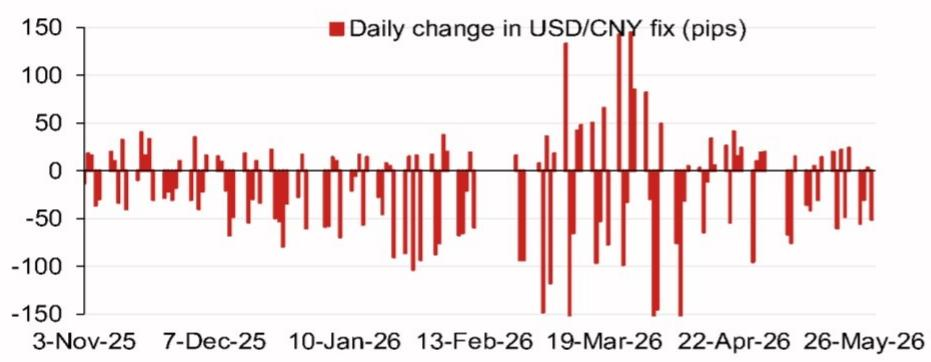
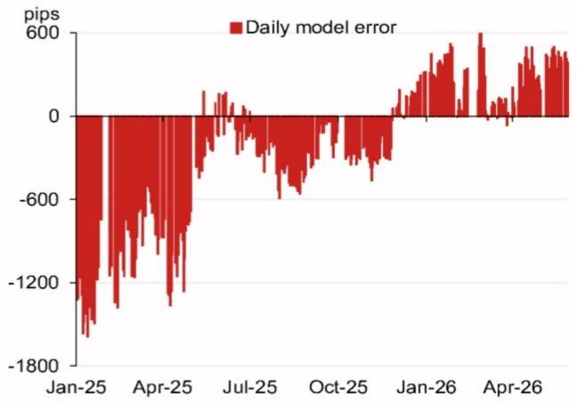

# The PBOC's Fix Model Is Signaling a Tactical Shift, Not a Structural Break

The People's Bank of China's daily USD/CNY fixing has become the single most important policy signal in Asian foreign exchange markets. For months, the fixing has been the primary tool through which Beijing communicates its tolerance for yuan depreciation, managing expectations without the need for direct intervention. A new model-based projection from a leading Asia FX strategy team now points to a fixing level of 6.7658, a full 682 pips lower than the previous projection. This is not a minor adjustment. It is a deliberate signal that the PBOC is recalibrating its approach to the yuan at a moment when global trade tensions, domestic growth concerns, and geopolitical calendar events are converging. The critical question for investors is whether this represents a tactical shift to manage near-term volatility or the beginning of a more sustained policy pivot.

The significance of this model output lies not just in the number itself, but in the context of recent model errors. The same analytical framework has historically shown meaningful deviations between its projections and actual fixes, particularly during periods of heightened policy discretion. In January 2025, the model error reached negative 1,800 pips, signaling that the PBOC was actively leaning against depreciation pressure. By April 2025, that error had narrowed to negative 600 pips. By July 2025, it was zero. The pattern suggests a central bank that has been gradually reducing its resistance to market forces, allowing the fix to converge with what a pure model would dictate. The current projection, if realized, would represent a continuation of that convergence, but with an important twist: the counter-cyclical factor adjustment adds only 185 pips, leaving a net 497-pip decline from the previous fix. This is a remarkably small adjustment for a period that includes the upcoming APEC summit, a Politburo economic work meeting, and the anticipated visit of China's president to the United States.

The analytical challenge is to distinguish between what the model is telling us about mechanical relationships and what the PBOC is telling us about its policy intentions. The model itself is a black box, but its inputs are transparent: it weights overnight currency movements across a basket that includes the Thai baht, the Australian dollar, the Korean won, and the euro. The top four weighted contributions to the projected change are all negative, with the euro alone contributing negative 36 pips. This tells us that the model is primarily responding to broad dollar weakness and the depreciation of other Asian currencies against the yuan. But the PBOC has never been a slave to its own model. The counter-cyclical factor exists precisely to give policymakers the discretion to override mechanical signals when they believe market forces are misaligned with fundamental conditions.

## The Model's Projection Is a Baseline, But the PBOC's Discretion Will Determine the Actual Fix

The model is a tool, not a policy statement. It captures the mechanical relationship between overnight currency movements and the fixing, but it cannot incorporate the strategic considerations that drive PBOC decision-making. The report's own data shows that model errors have been both large and persistent, particularly during periods of geopolitical uncertainty. The negative 1,800-pip error in January 2025 occurred during a period of heightened trade tensions, and the subsequent narrowing of errors suggests that the PBOC has been gradually reducing its intervention as market conditions stabilized. But the current environment is different. The calendar of events for the remainder of 2026 is packed with high-stakes diplomatic and economic meetings: the July Politburo meeting, the October Golden Week holiday, the November APEC summit in Shenzhen, the Central Economic Work Conference in December, and the anticipated presidential visit to the United States. Each of these events carries implications for the yuan's trajectory, and the PBOC will be acutely aware that the fixing is being watched not just by markets, but by trade negotiators and political leaders.

The counter-cyclical factor is the key variable to watch. The model's projection without the factor is 6.7658, and with the factor it is 6.7843. The 185-pip difference is the PBOC's explicit statement of how much it wants to lean against the market's direction. In a period of significant depreciation pressure, a larger counter-cyclical factor would signal that the PBOC is willing to absorb some of that pressure to prevent excessive volatility. A smaller factor, as we see here, suggests a greater tolerance for market-driven adjustments. But the absolute level of the factor is only half the story. The direction of the adjustment is equally important. A positive counter-cyclical factor that adds pips to the fix is a signal that the PBOC is resisting depreciation. A negative factor would signal the opposite. The current positive adjustment of 185 pips is modest by historical standards, but it is still a statement that the PBOC does not want the yuan to weaken as much as the model alone would suggest.

## The Pattern of Model Errors Reveals a Central Bank That Is Gradually Stepping Back

The time series of daily model errors is one of the most informative data points in the report. From January 2025 to January 2026, the errors have moved from negative 1,800 pips to positive 600 pips, with a brief period of zero in July 2025. This is not random noise. It is a clear pattern of the PBOC reducing its intervention footprint. The negative errors in early 2025 indicate that the actual fix was significantly higher (i.e., the yuan was weaker) than the model would have predicted, meaning the PBOC was actively pushing back against depreciation pressure. By July 2025, the error was zero, indicating that the PBOC was comfortable letting the model determine the fix. By January 2026, the error had turned positive, meaning the actual fix was lower than the model would have predicted, suggesting that the PBOC was now leaning against appreciation pressure.

This pattern has profound implications for how investors should interpret the current projection. If the PBOC is indeed in a phase of reducing intervention, then the model's projection becomes a more reliable guide to the actual fix. But the transition from negative to positive errors also means that the PBOC's stance has shifted from defending against depreciation to managing appreciation. That is a dramatic change in the policy environment, and it raises questions about whether the current projection of 6.7658 is consistent with the PBOC's broader objectives. A yuan that strengthens too quickly could hurt export competitiveness, particularly at a time when global demand is uncertain. A yuan that weakens too quickly could fuel capital outflows and undermine confidence. The PBOC's challenge is to navigate between these two risks, and the model error pattern suggests that it is becoming more confident in its ability to let market forces play a larger role.

## The Geopolitical Calendar Creates a Series of Decision Points That Will Test the Model's Reliability

The calendar of events for the remainder of 2026 is not just a list of meetings. It is a sequence of potential catalysts that could alter the PBOC's calculus. The July Politburo meeting will set the economic agenda for the second half of the year, and the readout will be scrutinized for any signals on exchange rate policy. The November APEC summit in Shenzhen is particularly significant because it will be the first major international economic gathering hosted by China since the pandemic, and it will provide a platform for high-level discussions on trade and investment. The anticipated visit of China's president to the United States towards the end of the year is the most consequential event on the calendar, with the potential to reset the tone of bilateral relations.

Each of these events creates a scenario in which the PBOC might choose to deviate from the model. Before a major diplomatic meeting, the PBOC might want to signal stability by keeping the fix within a narrow range. After a meeting, if the outcome is positive, the PBOC might allow the yuan to strengthen as a reward for good behavior. If the outcome is negative, the PBOC might use the fix as a tool to signal displeasure or to gain leverage. The model cannot capture these strategic considerations, which is why the counter-cyclical factor exists. But the model's projection provides a valuable baseline against which to measure the PBOC's actual decisions. If the actual fix consistently deviates from the model in a particular direction, that is a signal of policy intent.

## What the Report Leaves Unanswered: The Model's Blind Spots and the Limits of Quantitative Forecasting

The report is a technical exercise in model-based forecasting, but it leaves several critical questions unanswered. First, the model does not explicitly account for capital flow dynamics. The yuan's value is determined not just by the fixing, but by the interplay between trade flows, portfolio investment, and foreign direct investment. A model that focuses solely on overnight currency movements is capturing only one channel of influence. Second, the model does not incorporate the PBOC's own balance sheet constraints. The central bank has a finite amount of foreign exchange reserves, and its willingness to intervene is a function of its assessment of the costs and benefits of using those reserves. Third, the model does not address the possibility of a sudden shift in policy regime. The PBOC could, in theory, abandon the fixing mechanism altogether or widen the trading band, which would render the model obsolete.

These blind spots are not criticisms of the model itself, but they are important caveats for investors. A model is only as good as its assumptions, and the assumption that the fixing process will remain stable over the forecast horizon is a strong one. The geopolitical calendar creates multiple opportunities for regime change, and the PBOC has historically shown a willingness to surprise markets when it believes the situation warrants it. Investors who rely solely on the model's projection are missing the broader picture. The model is a useful input, but it is not a substitute for a comprehensive understanding of the policy environment.

## A Decision Framework for Investors: How to Use the Model Without Being Misled by It

The model's projection should be treated as a conditional forecast, not a prediction. It tells you what the fix would be if the PBOC followed its own mechanical rules, but it does not tell you whether the PBOC will actually follow those rules. The decision framework for investors should be structured around three questions. First, what is the direction and magnitude of the counter-cyclical factor? A large positive factor is a signal that the PBOC is resisting depreciation, and a large negative factor is a signal that it is resisting appreciation. The current factor is small, which suggests that the PBOC is not taking a strong stance in either direction. Second, what is the recent pattern of model errors? The transition from negative to positive errors indicates that the PBOC is becoming more comfortable with a stronger yuan, but the magnitude of the errors is shrinking, which suggests that the PBOC is also becoming more predictable. Third, what is the geopolitical context? The calendar of events creates a series of decision points, and the PBOC's behavior around those events will be more revealing than its behavior during quieter periods.

The most important insight from this framework is that the model is most useful when it is wrong. A large deviation between the model's projection and the actual fix is a signal that the PBOC is making a deliberate policy choice, and that choice contains information about the central bank's priorities. Investors should not be trying to predict the fix. They should be trying to interpret the PBOC's actions. The model provides a baseline for that interpretation, but the real work is in understanding why the PBOC chooses to deviate from the baseline.

Join the community to read the full report and review the original charts. The analysis above is based on the model outputs and calendar data provided, but the full report contains additional detail on the weighting methodology, the historical performance of the model, and the analysts' views on the key risks to the forecast. For investors who want to understand the nuances of PBOC policy, the original charts and data are essential reading.

*This article is for learning and discussion only and does not constitute investment advice.*

Personal reading notes and learning share only. Not investment advice.

