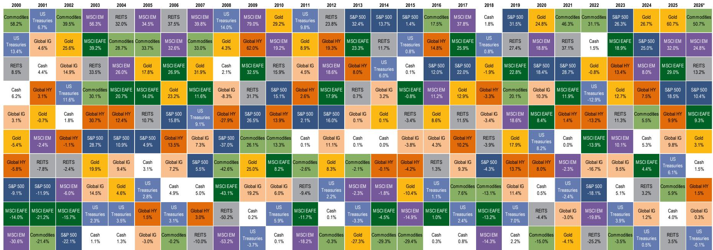
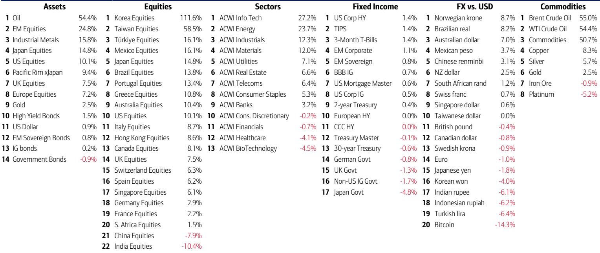
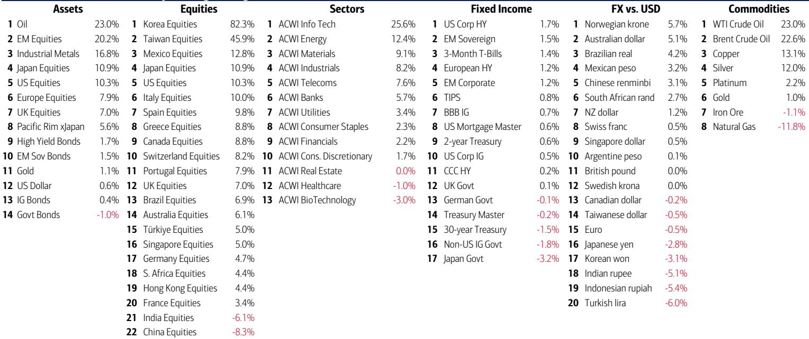

# 市场真正低估的不是泡沫本身，而是泡沫破裂后的资产轮动规律

当前全球资产价格正处于一个危险的甜蜜点。标普500指数屡创新高，但只有4%的成份股（21只）在同步创出新高——这个比例与2000年互联网泡沫顶峰时几乎完全一致。与此同时，某外资投行最新发布的周度资金流报告显示，其牛熊指标已从8.0升至8.5，正式进入“卖出信号”区间。自2002年以来，该指标共触发17次卖出信号，全球股票在此后2-3个月的平均跌幅为2-3%，最大回撤可达15-20%。

但真正值得关注的不是这些警示信号本身，而是报告揭示的一个被绝大多数投资者忽视的规律：自1929年以来，每一次重大市场顶部的共同特征，不是泡沫本身的破裂方式，而是破裂后六个月内资产轮动的惊人一致性。这份报告的核心判断是：泡沫破灭后的赢家，几乎总是那些在泡沫最后阶段被羞辱的资产。

## 1. 当前市场结构与1929年、2000年的泡沫顶峰高度相似

这不是一个情绪化的判断，而是基于可量化的市场结构数据。报告提供了一个关键数字：标普500指数中，当前有222只股票交易价格较其高点下跌超过20%，109只股票下跌超过40%。换句话说，指数的新高是由极少数股票拉动的，而大部分股票已经陷入技术性熊市甚至更深的跌幅。

这种“指数繁荣、个股萧条”的结构，历史上只在两个时期出现过：1929年9月和2000年3月。1929年的泡沫由公用事业、电信、工业和银行股引领；2000年的泡沫则是一维度的科技股行情，纳斯达克在见顶前六个月翻了一倍，而标普500等权重指数同期却在下跌。

当前的情况更接近2000年。报告指出，科技板块已占到美国投资级债券市场的10%、高收益债券市场的8%。这意味着AI相关投资的“支出者”——那些大规模举债投入算力基础设施的公司——不仅面临股权市场的估值修正风险，还面临债券市场的信用重定价风险。这是报告没有完全展开但极其重要的一个隐含判断：AI泡沫的破裂可能不会只停留在股票市场，它会通过信用市场传导，影响更广泛的资产定价。

## 2. 历史规律显示：泡沫破灭后，债券是确定性最高的资产

报告给出了一个极其简洁但有力的历史统计表。自1929年以来，每一次重大股市顶部之后，10年期国债收益率在随后六个月内的中位数变化是下降45个基点。具体来看：1929年9月后下降41个基点，1987年8月后下降48个基点，2000年3月后下降64个基点，2007年10月后下降117个基点。

有两个例外值得注意：1973年1月的“漂亮50”泡沫后，收益率反而上升了62个基点；1989年12月的日本泡沫后，收益率上升了94个基点。这两个例外恰好对应了两种不同的宏观环境——前者是石油冲击和通胀失控，后者是日本央行在泡沫破裂后继续加息刺破资产价格。但当前的宏观背景更接近2000年和2007年：全球央行已经开始转向宽松，报告数据显示，年初至今全球降息次数（31次）仍超过加息次数（12次），日本和韩国的实际政策利率仍为负值。

这意味着，如果历史规律成立，未来六个月债券市场将提供显著的资本利得机会。但报告没有回答的一个关键问题是：这一轮债券牛市的驱动因素是什么？是经济增长放缓引发的避险需求，还是通胀回落带来的货币政策空间？如果是前者，债券的上涨将伴随着股票的下跌；如果是后者，则可能出现股债双牛的格局。这个问题的答案，取决于美联储下一步的政策路径。

## 3. 泡沫破裂后的赢家不是“安全资产”，而是“被羞辱的资产”

这是报告最核心的洞察，也是与大多数投资者直觉相悖的判断。报告将其概括为“long humiliation, short hubris”——做多被羞辱的资产，做空狂妄的资产。

具体来看历史案例：1929年泡沫破裂后的六个月内，公用事业、工业、银行这些泡沫时期的领涨板块大幅跑输，而能源板块从泡沫时期的严重跑输者变成了大幅跑赢者。2000年互联网泡沫后，纳斯达克一年内下跌60%，而防御性板块大幅上涨——公用事业涨25%，必需消费涨24%，标普500等权重指数甚至在2000年全年录得正收益。

当前市场中，哪些资产是“被羞辱的”？报告给出了明确的答案：自2026年4月低点以来，纳斯达克反弹超过80%，而防御性板块（必需消费、金融、医疗保健）是最大的跑输者。这意味着，如果历史规律重复，这些被羞辱的防御性板块将是最有可能在泡沫破裂后跑赢的资产。

但这里有一个重要的结构性差异。报告指出，当前的AI泡沫与以往的泡沫有一个本质不同：以往的泡沫（1929年的无线电、2000年的互联网）都是“技术创造需求”的故事，而当前的AI泡沫是“资本创造供给”的故事。这意味着，AI领域的赢家将从“支出者”（大规模投入算力的公司）和“建设者”（半导体公司）转向“采用者”（将AI技术应用于实际场景的公司）。报告特别指出，这个逻辑的最佳载体是小盘成长股——就像1974年至1981年间，小盘成长股相对标普500的涨幅超过1000%。

## 4. 资金流数据已经给出了明确的轮动信号

报告提供的资金流数据不是滞后指标，而是领先信号。几个关键数字值得关注：

私人客户（管理资产4.5万亿美元）的股票配置比例达到66%的历史新高，债券配置比例降至17.3%的2022年3月以来最低，现金配置比例降至历史最低。但与此同时，过去一周出现了创纪录的现金流出和2022年10月以来最大的长期国债流入。这意味着，最聪明的钱已经开始行动——他们在卖出股票、买入债券。

从更细分的资金流向来看，过去四周私人客户买入的ETF集中在TIPS、材料、市政债券；卖出的ETF集中在公用事业、低波动、银行贷款。这个组合传递的信号是：投资者在寻求通胀保护（TIPS）、押注实物资产（材料）、规避利率敏感型防御板块（公用事业）。

全球资金流同样指向轮动：过去一周，投资级债券流入123亿美元（连续8周净流入），新兴市场债券流入31亿美元（连续7周净流入），而全球股票流出70亿美元（9周来首次净流出）。日本股票流出82亿美元，为2025年5月以来最大单周流出；中国股票流出140亿美元，年初至今累计流出已达2180亿美元。

这些数据合在一起意味着：资金正在从股票市场撤出，涌入债券市场，同时从日本和中国等前期热点市场流出。这不是一次性的战术调整，而是一个结构性的轮动信号。

## 5. 报告尚未完全回答的三个关键问题

尽管这份报告提供了极其丰富的历史框架和资金流数据，但有三点值得读者保持清醒。

第一，历史规律的适用性。1929年、2000年、2007年的泡沫破裂都发生在通胀相对温和或通缩的环境中，而当前的通胀水平（美国CPI接近4%）和财政赤字规模都是前所未有的。如果通胀顽固不下，债券的避险功能将受到削弱，历史规律的预测能力也会打折扣。

第二，AI泡沫的独特性。报告指出AI的赢家将从“支出者”转向“采用者”，但这个判断的前提是AI技术能够产生足够大的实际应用价值。如果AI的商业化进程不及预期，那么“采用者”可能也不存在。这个假设目前无法验证。

第三，中国市场的角色。报告显示中国股票基金年初至今累计流出2180亿美元，这是一个极其庞大的数字。但报告没有深入分析这个流出的原因——是地缘风险、经济增长放缓、还是结构性资本外流？不同的原因对应着完全不同的投资含义。

这三个问题，正是这份报告最值得深入讨论的部分。历史框架给出了方向，但具体到资产配置和个股选择，还需要更细致的分析。

对于希望进一步探讨这些问题的读者，我们会在社群中继续展开。欢迎来星球微信群里继续讨论——特别是关于AI泡沫破裂后的“采用者”如何筛选、债券牛市能否在通胀环境下成立、以及中国市场资金流出的二阶影响这些报告没有完全展开的话题。

Personal reading notes and learning share only. Not investment advice.

