# Weekend Healthcare Pulse: Japan's drug pricing scheme irks pharma companies; may eventually hurt patients' interests

Miki Sogi, Ph.D. +81 3 6777 6991 miki.sogi@bernsteinsg.com

Rebecca Liang, Ph.D. +852 2123 2656 rebecca.liang@bernsteinsg.com

Justin Smith +44 20 7762 5899 justin.smith@bernsteinsg.com

Eve Burstein +1 917 344 8313 eve.burstein@bernsteinsg.com

Lee Hambright +1 917 344 8429 lee.hambright@bernsteinsg.com

Susannah Ludwig +41 582 723 127 susannah.ludwig@bernsteinsg.com

Lance Wilkes +1 917 344 8501 lance.wilkes@bernsteinsg.com

Delphine Le Louet +33 1 42 13 92 93 delphine.le-louet@bernsteinsg.com

Courtney Breen +1 917 344 8407 courtney.breen@bernsteinsg.com

William Pickering, MD +1 917 344 8340 william.pickering@bernsteinsg.com

Nandan Kulkarni +91 22 6842 1436 nandan.kulkarni@bernsteinsg.com

Jeffrey Walch +1 917 344 8613 jeffrey.walch@bernsteinsg.com

# LOW DRUG PRICES IS MAKING JAPAN PHARMACEUTICAL MARKET UNATTRACTIVE AND JAPANESE COMPANIES' OVERSEAS BUSINESS EXPANSION IMPERATIVE FOR GROWTH

Today Japan is the fourth pharmaceutical market based on drug sales and less than a tenth size of the US market, tumbling from second in global ranking with a market size a third of the US back in 2012 (Exhibit 1). Thus it is no surprise that Japan's pharmaceutical market growth has been the weakest among the key markets (Exhibit 2). One of the key drivers of Japan market's diminishing presence is low drug price—Japan's drug price is the lowest among the key markets when compared as % of the US price (Exhibit 3). Given this unattractive market situation, key Japanese pharma companies are expanding their overseas business to seek growth (Exhibit 4).

EXHIBIT 1: Today Japan is the fourth pharmaceutical market and less than a tenth size of the US, tumbling from being the second-biggest market with a third of the US's back in 2012   
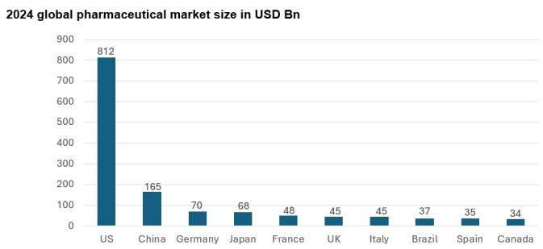

bar

2024 global pharmaceutical market size in USD Bn
| Country | Market Size (USD Bn) |
| :--- | :--- |
| US | 812 |
| China | 165 |
| Germany | 70 |
| Japan | 68 |
| France | 48 |
| UK | 45 |
| Italy | 45 |
| Brazil | 37 |
| Spain | 35 |
| Canada | 34 |

Source: Japan Pharmaceutical Industry Association, Bernstein analysis

EXHIBIT 2: Despite its aging population, Japan's pharmaceutical market is weakest among the key markets   
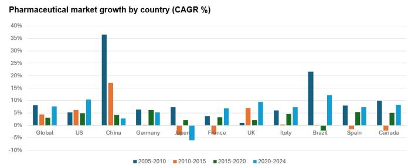

bar

| Country   | 2005-2010 | 2010-2015 | 2015-2020 | 2020-2024 |
| --------- | --------- | --------- | --------- | --------- |
| Global    | 8%        | 4%        | 3%        | 8%        |
| US        | 5%        | 6%        | 4%        | 10%       |
| China     | 37%       | 17%       | 4%        | 3%        |
| Germany   | 6%        | -1%       | 6%        | 5%        |
| Japan     | 8%        | -3%       | 2%        | -6%       |
| France    | 4%        | 10%       | 3%        | 7%        |
| UK        | 1%        | 7%        | 2%        | 9%        |
| Italy     | 6%        | -1%       | 5%        | 8%        |
| Brazil    | 22%       | -1%       | -3%       | 13%       |
| Spain     | 8%        | -3%       | 4%        | 7%        |
| Canada    | 10%       | -3%       | 5%        | 9%        |

Source: Japan Pharmaceutical Industry Association, Bernstein analysis

EXHIBIT 3: Japan's drug pricing is the lowest among the peers   
Branded drug listing price comparison as % of the US price   
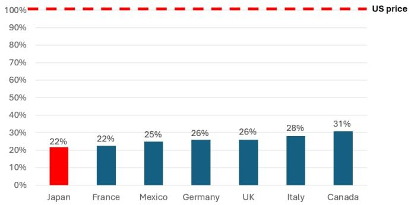

bar

| Country | Value (%) |
| :--- | :--- |
| Japan | 22 |
| France | 22 |
| Mexico | 25 |
| Germany | 26 |
| UK | 26 |
| Italy | 28 |
| Canada | 31 |
US price

Data from 2022   
Source: RAND Health Quarterly, Bernstein analysis

EXHIBIT 4: Given the unattractive domestic market situation with low drug prices, key Japanese pharma companies are expanding their overseas business to seek growth   
Revenue (JPY B) Breakdown by Japan vs. Overseas   
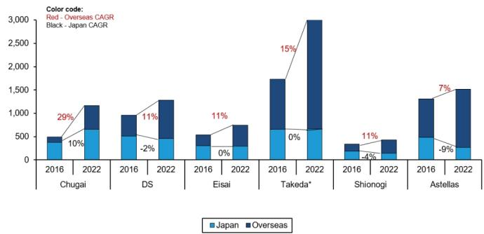

bar_stacked

| Year | Company | Japan (CAGR) | Overseas (CAGR) |
| :--- | :--- | :--- | :--- |
| 2016 | Chugai | 10% | 29% |
| 2022 | DS | -2% | 11% |
| 2016 | Eisai | 0% | 11% |
| 2022 | Takeda* | 0% | 15% |
| 2016 | Shionogi | -4% | 11% |
| 2022 | Astellas | -9% | 7% |

The majority of Takeda's growth comes from its acquisition of Shire in 2019; we don't have revenue forecast by region for Takeda & Shionogi  
Source: Company reports, Bernstein analysis

# IN JAPAN, DUE TO THE PRICING SCHEME, DRUG PRICE IS AN EASY LEVER FOR HEALTHCARE COST CONTAINMENT

# JAPANESE GOVERNMENT HAS BEEN UNDER PRESSURE TO CONTAIN HEALTHCARE EXPENDITURE IN THE FACE OF FASTEST AGING POPULATION

When measured based on the input and output, the productivity of Japan's healthcare system is arguably better than peer developed countries as Japan delivers the longest life expectancy without spending more in terms of % of GDP (Exhibit 5; we acknowledge that Japanese people's healthier diet and other factors - e.g., genetics, lifestyle - also contribute to their longevity). Yet Japan's healthcare system's productivity has been under enormous pressure due to its fast aging population, which is driving healthcare expenditure increase (Exhibit 6, Exhibit 7). Plus $38\%$ of the cost is funded by the federal and local governments (Exhibit

8). So containing the healthcare spending has been one of the key priorities of the debt-ridden Japanese government.

EXHIBIT 5: The productivity of Japan's healthcare system is better than that of peer countries, delivering the longest life expectancy without spending more...   
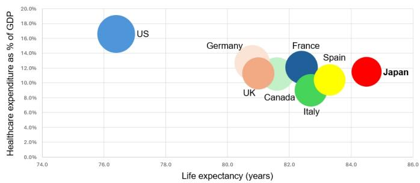

bubble

| Country | Life expectancy (years) | Healthcare expenditure as % of GDP (%) |
| :--- | :--- | :--- |
| US | 76.3 | 16.5 |
| Germany | 80.7 | 12.9 |
| UK | 81.0 | 11.4 |
| Canada | 81.6 | 10.8 |
| France | 82.4 | 12.2 |
| Spain | 83.3 | 10.5 |
| Italy | 82.7 | 9.0 |
| Japan | 84.5 | 11.5 |

Life expectancy reported in 2021-2022   
Health expenditure as % of GDP in 2022   
The bubble size represents PPP-adjusted GDP per person   
Source: OECD, World Bank, Our World in Data, Bernstein analysis

# EXHIBIT 6: ... yet its fast-growing aging population is challenging healthcare expenditure...

Japan is the fastest aging society—% of >65 yrs old increased from 22% to 29% over the past 15 years

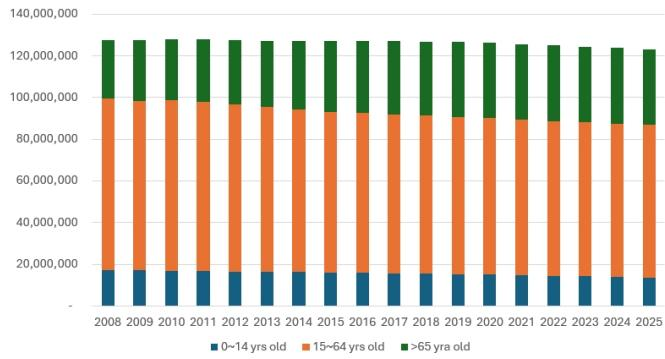

bar_stacked

| Year | 0~14 yrs old | 15~64 yrs old | >65 yrs old |
|---|---|---|---|
| 2008 | 18,000,000 | 73,000,000 | 27,000,000 |
| 2009 | 18,500,000 | 73,500,000 | 27,500,000 |
| 2010 | 18,500,000 | 74,500,000 | 28,500,000 |
| 2011 | 18,500,000 | 74,500,000 | 28,500,000 |
| 2012 | 18,500,000 | 74,500,000 | 28,500,000 |
| 2013 | 18,500,000 | 74,500,000 | 28,500,000 |
| 2014 | 18,500,000 | 74,500,000 | 28,500,000 |
| 2015 | 18,500,000 | 74,500,000 | 28,500,000 |
| 2016 | 18,500,000 | 74,500,000 | 28,500,000 |
| 2017 | 18,500,000 | 74,500,000 | 28,500,000 |
| 2018 | 18,500,000 | 74,500,000 | 28,500,000 |
| 2019 | 18,500,000 | 74,500,000 | 28,500,000 |
| 2020 | 18,500,000 | 74,500,000 | 28,500,000 |
| 2021 | 18,500,000 | 74,500,000 | 28,500,000 |
| 2022 | 18,500,000 | 74,500,000 | 28,500,000 |
| 2023 | 18,500,000 | 74,500,000 | 28,500,000 |
| 2024 | 18,500,000 | 74,553,533 | 28,553,533 |
| 2025 | 18,533,533 | 74,533,533 | 28,533,533 |

Source: Dashboard.E-stat.go.jp, Bernstein analysis

EXHIBIT 7: .. as the older population accounts for the majority of healthcare expenditure   
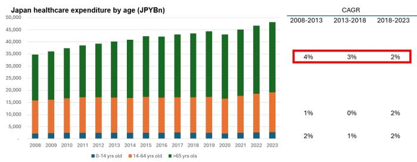

bar_stacked

Japan healthcare expenditure by age (JPYBn)
| Year | 0-14 yrs old (JPYBn) | 14-64 yrs old (JPYBn) | >65 yrs olds (JPYBn) |
|---|---|---|---|
| 2008-2013 | 2,000 | 15,000 | 17,000 |
| 2013-2018 | 2,000 | 15,000 | 17,000 |
| 2018-2023 | 2,000 | 15,000 | 17,000 |

| CAGR | 4% | 3% | 2% |
|---|---|---|---|
| | 1% | 0% | 2% |
| | 2% | 1% | 2% |

Source: Japan Ministry of Health, Labor and Welfare, Bernstein analysis

EXHIBIT 8: In Japan, 38% of healthcare expenditure is funded by the federal or local government   
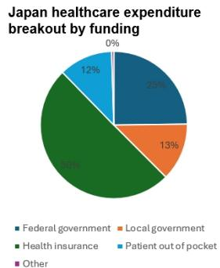

pie

Japan healthcare expenditure breakout by funding
| Category | Percentage (%) |
|---|---|
| Federal government | 25 |
| Local government | 13 |
| Health insurance | 80 |
| Patient out of pocket | 12 |
| Other | 0 |

Data in 2024

Health insurance funding represents employee contribution and the insured's premium
Source: Japan Ministry of Health, Labor and Welfare, Bernstein analysis

# DRUG SPENDING IS AN EASY LEVER FOR THE JAPANESE GOVERNMENT TO PULL IN ORDER TO CONTAIN HEALTHCARE EXPENDITURE

While drug cost accounts for only 16% within Japan's overall healthcare expenditure, it was previously the fastest growth category until the mid-2010's (Exhibit 9, Exhibit 10). Thus, it became a clear target for the government's cost containment efforts. In Japan, the government has a full control of drug prices because almost all the drugs approved in Japan are reimbursed through the national health insurance (NHI, Japan has a universal health insurance system) and the government determines drugs' NHI price, i.e., the amount drug dispensers (i.e., pharmacies, hospitals, clinics) are reimbursed. There are a few exceptions, including erectile dysfunction drugs such as Viagra. On the other hand, reducing the cost of inpatient and outpatient medical care cost is politically difficult despite these categories accounting for 70%+ of the overall healthcare expenditure. For example, the Japan Medical Association, a clinic-based physicians group, is a powerful political constituency:

EXHIBIT 9: Drug spending only accounts for 16% of overall healthcare expenditure...   
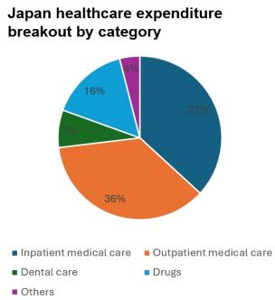

pie

Japan healthcare expenditure breakout by category
| Category | Percentage (%) |
|---|---|
| Inpatient medical care | 37 |
| Outpatient medical care | 36 |
| Dental care | 8 |
| Drugs | 16 |
| Others | 4 |

Data in 2024

Source: Japan Ministry of Health, Labor and Welfare, Bernstein analysis

EXHIBIT 10: ... yet was the fastest growing category within the healthcare expenditure   
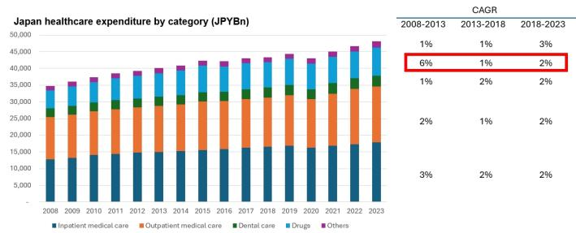  
Source: Japan Ministry of Health, Labor and Welfare, Bernstein analysis

# IN JAPAN, THE GOVERNMENT HAS FULL CONTROL OF DRUG PRICING: PRICING AT LAUNCH AND DOWNWARD ADJUSTMENT WHILE IN THE MARKET

# MOST NEW DRUG PRICING IS BASED ON COMPARISON WITH ANALOGOUS EXISTING DRUGS IN COMBINATION WITH A PREMIUM BASED ON INNOVATION, USEFULNESS, MARKET SIZE, ETC.

In Japan, Ministry of Health, Labor and Welfare (MHLW) grants new drug an official NHI price within 60 days after its regulatory approval. This price is the amount to be reimbursed to the drug dispensers (i.e., pharmacies, hospitals, clinics) under the national health insurance scheme. Pharma companies can start promoting the new drugs upon regulatory approval but have to wait for the NHI price to ship the products for distribution.

There are two approaches to new drug pricing: comparison with analogous existing drugs or COGS-based if a similar does not exist in the market.

In the comparison approach, a new drug's price is determined based on its "innovation" and "usefulness" vs the existing analogous drugs. A drug would receive a 70–120% innovation premium vs the comparator if meeting all the following three categories: clinically meaningful, novel MOA; higher efficacy and/or safety; and objectively proven improvement of the treatment approach for the target indications. A drug would receive a 5–60% usefulness premium if it met one to two out of the above three categories or is objectively a more clinically useful formulation vs the comparator.

While 65% of the 639 drugs approved between 2018 and 2025 were priced based on the comparison approach, the COGS-based approach was applied to 26% of cases. This is trickier as pharma companies usually do not want to provide full disclosure of drug COGS. So this approach is more of an art than a solid data-based approach: MHLW has reported 60%+ drugs disclosed less than 50% of the COGS information for the pricing process for the recent years.

On top of the base pricing, there are multiple premium categories:

- Market premium, 5–20%: the drug targets a rare disease and is deemed an orphan drug.   
- Pediatric premium, 5–20%: the drug has indications or dosing for pediatric use   
- Frontier premium, 10–20%: the drug receives regulatory approval in Japan ahead of other countries

Japan looks to harmonize the domestic drug pricing with exJapan's to avoid criticism for its lower price vs peers. To eschew drugs' price excessive gap vs overseas standard, Japanese government uses average price of the US, UK, Germany and France. Despite this scheme, Japan's drug pricing is still the lowest, as low as that of France, among its peer developed countries and much lower than that in the US (Exhibit 3).

# WHILE MANY DRUGS ARE SUBJECT TO ANNUAL PRICE CUTS, INNOVATIVE DRUGS ARE EXEMPTED

In Japan, drugs' NHI price is reviewed and adjusted down annually based on a principle that drug dispensers should not make more than 2% of profit margin from the gap between the drug purchase price from wholesalers and the NHI reimbursement amount. This concept is not unique to Japan: in France and Germany, pharmacies and wholesalers' margins are fixed by the government. Due to the competitive dynamics among wholesalers whose margin is neither protected nor limited in Japan, the dispensers' drug purchase price is usually under downward pressure, and the gap vs the NHI price tends to grow. Thus, the Japanese government conducts a market price survey every September and, based on the outcome, determines the adjustment amount to be disclosed the following March and implemented in April. For FY2026's adjustment, the survey revealed a 4.8% gap, which was the lowest in the past 30 years as it has been consistently declining, and the government has decided on a 0.9% price cut on average (the actual adjustment price is different by

drug). The price revision used to be every other year yet, in 2021, the government introduced an off-year revision, which has become part of the regular timeline.

Innovative drugs are exempted from the annual price cut until Gx launch or 15 years after the launch under the Patent-period Price Maintenance Program (PMP). The “innovativeness” of drugs is assessed based on criteria such as orphan drug status, recipient of innovation/usefulness premium, launch in Japan ahead of other markets, etc. The program was implemented to not discourage pharmaceutical companies from launching new innovative drugs in Japan. Under this program, most key growth drivers of global and top Japanese pharma companies should not be subject to the annual repricing. Of note, when the protection period expires, the drug’s price gets cut at once to reflect all the repricing that could have happened without the PMP. Having said that, in most cases, Gx are in the market by that time, thus the lower price does not matter any longer (nowadays Gx penetration in Japan is as fast as in other developed countries).

# OUTSIDE THE ANNUAL REPRICING, MHLW HAS AD-HOC TOOLS TO ADJUST DRUGS' NHI PRICE AFTER LAUNCH ON THE GROUNDS OF SALES AND COST-EFFECTIVENESS

Drugs with too much commercial success get punished in Japan. When a pharma company applies for an NHI price for a drug after the regulatory approval, pharma companies include in the application the drug's peak domestic sales forecast based on the approved indication. Under the Market Expansion Reassessment/Sustainability Special Price Adjustment schemes, MHLW cut drugs' NHI price if their annual sales significantly exceed the initial peak domestic sales forecast: if a drug's annual sales reach >JPY100Bn and exceed 1.3\~1.5x of the initial peak sales forecast, its NHI price can be cut by 10\~50%. Within our coverage, Daiichi Sankyo's Lixiana, an anti-coagulant, has been subject to the cut twice, in 2018 by 28% and 2026 by 20%. This price cut is often inevitable, because the initial peak sales forecast included in the NHI price application only reflects the first approved indication. Thus the sales of drugs in therapeutic areas such as oncology and immunology, where most drugs are developed for multiple indications, can easily exceed the initial forecast over time by a wide margin. Previously, this price cut was applied not only to those drugs where sales exceed their forecast but also to those with the same mode of action (e.g., Keytruda and Opdivo). This rule was absolutely loathed by pharmaceutical companies, as you can imagine, and MHLW got rid of this rule in the most recent rule updates.

Cost-effectiveness based price adjustment has been fully incorporated in the official NHI pricing rules since 2020. Japan has applied cost-effectiveness-based price adjustments only to a relatively small, select set of high-cost drugs so far, mostly oncology and immunology products. The criteria of the selection are high innovation and large budget impact: typically drugs that had received significant innovation/usefulness premiums or

that generated very high peak sales. Within our coverage, Eisai's Leqembi for Alzheimer's disease received a 15% price cut in November 2025 on the grounds of cost-effectiveness. The drug was designated for cost-effectiveness evaluation soon after its NHI price listing because of its high unit price and expected large patient population in early Alzheimer's disease. An analysis of the incremental cost-effectiveness ratio (ICER) per quality-adjusted life year (QALY) showed a 25% price adjustment from the original, yet the maximum price reduction of 15% was applied.

# LOW DRUG PRICES INDEED HELPS HEALTHCARE COST CONTAINMENT, BUT IS IT GOOD FOR PATIENTS?

Many US and EU pharma companies have been vocal about their discontent with the Japanese drug pricing system. While they don't like the lower launch price, the annual and ad-hoc price revisions are particularly incomprehensible and irk them. They have been warning the Japanese government that their unattractive drug pricing scheme will discourage them to develop and commercialize innovative drugs in Japan. We have yet to hear an outcry over not getting life-changing drugs in Japan that are available elsewhere; however, the number of new drug approvals in Japan has been in decline for the past decade while increasing in the US and the EU (Exhibit 11). R&D spending in Japan is also declining while increasing in the US, EU and China (Exhibit 12). While this can be partially explained by the fact that country-specific clinical trials are no longer required for regulatory approval in Japan (i.e., Japanese patient are included in global trials), it suggests that pharma companies' are decreasing investment in their drug development in Japan. Plus, the US's most favored nation drug price requirement for new products may get some pharma companies to opt out of launching in Japan in the future to protect revenue and profit from more lucrative markets, especially in the US. If this happens, the Japanese government will no longer be able to use drug prices as a

lever to manage healthcare spending.

EXHIBIT 11: # of new drug approvals has been declining in Japan while growing in the US and EU   
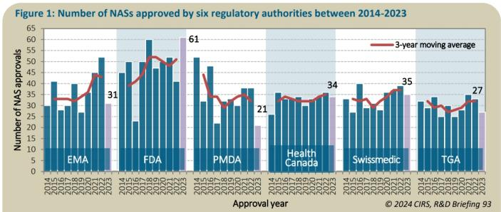

bar_line

Figure 1: Number of NASs approved by six regulatory authorities between 2014-2023
| Approval year | EMA | FDA | PMDA | Health Canada | Swissmedic | TGA |
|---|---|---|---|---|---|---|
| 2014 | 30 | 50 | 30 | 30 | 30 | 30 |
| 2015 | 30 | 50 | 30 | 30 | 30 | 30 |
| 2016 | 30 | 50 | 30 | 30 | 30 | 30 |
| 2017 | 30 | 50 | 30 | 30 | 30 | 30 |
| 2018 | 30 | 50 | 30 | 30 | 30 | 30 |
| 2019 | 30 | 50 | 30 | 30 | 30 | 30 |
| 2020 | 30 | 50 | 30 | 30 | 30 | 30 |
| 2021 | 30 | 50 | 30 | 30 | 30 | 30 |
| 2022 | 30 | 50 | 30 | 30 | 30 | 30 |
| 2023 | 31 | 51 | 61 | 21 | 34 | 27 |
©2024 CIRS, R&D Briefing 93

NAS: New Active Substance referring to new drug ingredient in EU.   
EU EMA; US FDA; Japan PMDA; Australia TGA   
Source: Centre for Innovation in Regulatory Science

EXHIBIT 12: R&D spend in Japan is declining while increasing elsewhere   
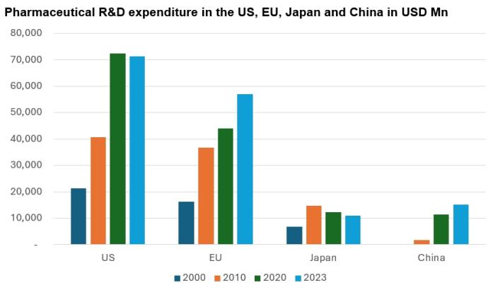

bar

Pharmaceutical R&D expenditure in the US, EU, Japan and China in USD Mn
| Region | 2000 (USD Mn) | 2010 (USD Mn) | 2020 (USD Mn) | 2023 (USD Mn) |
| :--- | :--- | :--- | :--- | :--- |
| US | 21000 | 40500 | 72500 | 71500 |
| EU | 16000 | 36500 | 43500 | 56500 |
| Japan | 7000 | 14500 | 11500 | 10500 |
| China | - | 2500 | 11000 | 14500 |

Source: EFPIA, PhRMA, JPMA, China Statistical Yearbook, Bernstein analysis

BERNSTEIN TICKER TABLE 

<table><tr><td rowspan="2">Ticker</td><td rowspan="2">Rating</td><td colspan="3">28 May 2026</td><td rowspan="2">TTMRel.</td><td colspan="4">Reported EPS</td><td colspan="3">Reported P/E (x)</td></tr><tr><td>Cur</td><td>Closing Price</td><td>Price Target</td><td>Cur</td><td>2025A</td><td>2026E</td><td>2027E</td><td>2025A</td><td>2026E</td><td>2027E</td></tr><tr><td>4503.JP (Astellas)</td><td>M</td><td>JPY</td><td>2,124.00</td><td>2,200.00</td><td>8.9%</td><td>JPY</td><td>162.77</td><td>163.46</td><td>168.81</td><td>13.0</td><td>13.0</td><td>12.6</td></tr><tr><td>4519.JP (Chugai)</td><td>O</td><td>JPY</td><td>7,743.00</td><td>9,800.00</td><td>(37.5)%</td><td>JPY</td><td>263.73</td><td>316.80</td><td>373.10</td><td>29.4</td><td>24.4</td><td>20.8</td></tr><tr><td>4568.JP (Daiichi Sankyo)</td><td>O</td><td>JPY</td><td>2,662.50</td><td>4,500.00</td><td>(74.9)%</td><td>JPY</td><td>140.37</td><td>150.11</td><td>167.44</td><td>19.0</td><td>17.7</td><td>15.9</td></tr><tr><td>4523.JP (Eisai)</td><td>O</td><td>JPY</td><td>3,901.00</td><td>6,100.00</td><td>(43.4)%</td><td>JPY</td><td>163.76</td><td>168.31</td><td>211.50</td><td>23.8</td><td>23.2</td><td>18.4</td></tr><tr><td>4578.JP (Otsuka)</td><td>M</td><td>JPY</td><td>11,140</td><td>11,600</td><td>21.4%</td><td>JPY</td><td>685.06</td><td>563.74</td><td>634.04</td><td>16.3</td><td>19.8</td><td>17.6</td></tr><tr><td>4507.JP (Shionogi)</td><td>M</td><td>JPY</td><td>2,996.50</td><td>3,000.00</td><td>(17.0)%</td><td>JPY</td><td>241.11</td><td>247.57</td><td>264.99</td><td>12.4</td><td>12.1</td><td>11.3</td></tr><tr><td>4502.JP (Takeda)</td><td>O</td><td>JPY</td><td>5,120.00</td><td>6,900.00</td><td>(21.5)%</td><td>JPY</td><td>496.16</td><td>506.05</td><td>530.52</td><td>10.3</td><td>10.1</td><td>9.7</td></tr><tr><td>JPL</td><td></td><td></td><td>2,551.66</td><td></td><td></td><td></td><td></td><td></td><td></td><td></td><td></td><td></td></tr></table>

O - Outperform, M - Market-Perform, U - Underperform, NR - Not Rated, CS - Coverage Suspended   
4502.JP estimate is Adjusted EPS; 4502.JP valuation is Adjusted P/E (x); 4523.JP base year is 2024;   
Source: Bloomberg, Bernstein estimates and analysis.

# I. REQUIRED DISCLOSURES

References to "Bernstein" or the "Firm" in these disclosures relate to the following entities: Bernstein Institutional Services LLC (April 1, 2024 onwards), Bernstein & Co., LLC (pre April 1, 2024), Bernstein Autonomous LLP, BSG France S.A. (April 1, 2024 onwards), Bernstein (Hong Kong) Limited 盛博香港有限公司, Bernstein (Canada) Limited, Bernstein (India) Private Limited (SEBI registration no. INH000006378), Bernstein (Singapore) Private Limited, Bernstein Japan KK (サンフォード・C・バーンスタイン株式会社) and analysts employed by SG Africa Technologies & Services to produce Bernstein under a Global Services Agreement in place between Bernstein and SG.

Bernstein is part of a joint venture between SG (SG) and AllianceBernstein, L.P. (AB). Unless specifically noted otherwise, for purposes of these disclosures, references to Bernstein's “affiliates” relate to both SG and AB and their respective affiliates.

# VALUATION METHODOLOGY

This research publication covers six or more companies. For valuation methodology and other company disclosures:

Please visit: https://bernstein-autonomous.bluematrix.com/sellside/Disclosures.action.

Or, you can also write to the Director of Compliance, Bernstein Institutional Services LLC, 245 Park Avenue, New York, NY 10167.

# RISKS

This research publication covers six or more companies. For risks and other company disclosures:

Please visit: https://bernstein-autonomous.bluematrix.com/sellside/Disclosures.action.

Or, you can also write to the Director of Compliance, Bernstein Institutional Services LLC, 245 Park Avenue, New York, NY 10167.

# RATINGS DEFINITIONS, BENCHMARKS AND DISTRIBUTION

# EQUITY RATINGS DEFINITIONS

# Bernstein brand

The Bernstein brand rates stocks based on forecasts of relative performance for the next 12 months versus the S&P 500 for stocks listed on the U.S. and Canadian exchanges, versus the Bloomberg Europe Developed Markets Large and Mid Cap Price Return Index EUR (EDME) for stocks listed on the European exchanges and emerging markets exchanges outside of the Asia Pacific region, versus the Bloomberg Japan Large and Mid Cap Price Return Index USD (JPL) for stocks listed on the Japanese exchanges, and versus the Bloomberg Asia ex-Japan Large and Mid Cap Price Return Index (ASIAX) for stocks listed on the Asian (ex-Japan) exchanges -unless otherwise specified.

The Bernstein brand has three categories of ratings:

- Outperform: Stock will outpace the market index by more than 15 pp   
• Market-Perform: Stock will perform in line with the market index to within +/-15 pp   
• Underperform: Stock will trail the performance of the market index by more than 15 pp

Coverage Suspended: Coverage of a company under the Bernstein brand has been suspended. Ratings and price targets are suspended temporarily, are no longer current, and should therefore not be relied upon.

Not Rated: A rating assigned when the stock cannot be accurately valued, or the performance of the company accurately predicted, at the present time. The covering analyst may continue to publish research reports on the company to update investors on events and developments.

Not Covered (NC) denotes companies that are not under coverage.

Bernstein brand stock ratings are based on a 12-month time horizon.

# Autonomous brand – common stocks

The Autonomous brand rates common stocks as indicated below. As our benchmarks we use the Bloomberg Europe 500 Banks And Financial Services Index (BEBANKS) and Bloomberg Europe Dev Mkt Financials Large and Mid Cap Price Ret Index EUR (EDMFI) index for developed European banks and Payments, the Bloomberg Europe 500 Insurance Index (BEINSUR) for European insurers, the S&P 500 and S&P Financials for US banks and Payments coverage, S5LIFE for US Insurance, the S&P Insurance Select Industry (SPSIINS) for US Non-Life Insurers coverage, and the Bloomberg Emerging Markets Financials Large, Mid and Small Cap Price Return Index (EMLSF) for emerging market banks and insurers and Payments. Ratings are stated relative to the sector (not the market).

The Autonomous brand has three categories of common stock ratings:

- Outperform (OP): Stock will outpace the relevant index by more than 10 pp   
- Neutral (N): Stock will perform in line with the market index to within +/-10 pp   
• Underperform (UP): Stock will trail the performance of the relevant index by more than 10 pp

Coverage Suspended: Coverage of a company under the Autonomous research brand has been suspended. Ratings and price targets are suspended temporarily, are no longer current, and should therefore not be relied upon.

Not Rated: A rating assigned when the stock cannot be accurately valued, or the performance of the company accurately predicted, at the present time. The covering analyst may continue to publish research reports on the company to update investors on events and developments.

Those denoted as ‘Feature’ (e.g., Feature Outperform FOP, Feature Under Outperform FUP) are our core ideas.

Not Covered (NC) denotes companies that are not under coverage.

Autonomous brand common stock ratings are based on a 12-month time horizon.

# Autonomous brand – preferred stocks

The Autonomous brand has three categories of preferred stock ratings:

- Outperform (OP): The total return of the preferred instrument is expected to outperform preferred securities of other issuers operating in similar sectors or rating categories over the next six months.   
- Neutral (N): The total return of the preferred instrument is expected to perform in line with preferred securities of other issuers operating in similar sectors or rating categories over the next six months.   
- Underperform (UP): The total return of the preferred instrument is expected to underperform preferred securities of other issuers operating in similar sectors or rating categories over the next six months.

Autonomous preferred stock ratings are based on a 6-month time horizon.

# AUTONOMOUS CREDIT RESEARCH

Where this report contains investment recommendations for credit instruments, as defined in article 3(1)(35) of the Market Abuse Regulation, the information below is presented to comply with its disclosure requirements.

The report may also include reference(s) to published opinions by other Autonomous or Bernstein analysts covering the equity securities of the issuer(s) referenced herein. Please note an investment recommendation for credit instruments published by the author(s) of this report may differ from the published view of the analyst covering equity securities for the issuer(s) contained in this report and vice versa.

# CREDIT RATINGS DEFINITIONS

The Autonomous brand has three categories of credit ratings:

- Credit Outperform (C-OP): The total return of the Reference Credit Instrument is expected to outperform the credit spread of bonds of other issuers operating in similar sectors or rating categories over the next six months.   
- Credit Neutral (C-N): The total return of the Reference Credit Instrument is expected to perform in line with the credit spread of bonds of other issuers operating in similar sectors or rating categories over the next six months.   
- Credit Underperform (C-UP): The total return of the Reference Credit Instrument is expected to underperform the credit spread of bonds of other issuers operating in similar sectors or rating categories over the next six months.

Autonomous credit ratings are based on a 6-month time horizon.

A list of all investment recommendations produced by the author(s) of this report alongside credit ratings history are available upon request.

It is at the sole discretion of the Firm as to when to initiate, update and cease research coverage. The Firm has established, maintains and relies on information barriers to control the flow of information contained in one or more areas (i.e. the private side) within the Firm, and into other areas, units, groups or affiliates (i.e. public side) of the Firm

DISTRIBUTION OF EQUITY RATINGS/INVESTMENT BANKING SERVICES 

<table><tr><td>Equity Rating</td><td>Market Abuse Regulation (MAR) and FINRA Rating Category</td><td>Global Rating Distribution</td><td>Investment Banking Relationships*</td></tr><tr><td>Outperform</td><td>BUY</td><td>51.1%</td><td>16.5%</td></tr><tr><td>Market-Perform (Bernstein Brand) Neutral (Autonomous Brand)</td><td>HOLD</td><td>36.3%</td><td>17.8%</td></tr><tr><td>Underperform</td><td>SELL</td><td>12.6%</td><td>14.9%</td></tr></table>

\* These figures represent the percentage of companies within each equity rating category for which affiliates of Bernstein have provided investment banking services within the previous 12 months.

As of March 31, 2026. All figures are updated quarterly.

# PRICE CHARTS/ RATINGS AND PRICE TARGET HISTORY

This research publication covers six or more companies. For price chart and other company disclosures, please visit https://bernstein-autonomous.bluematrix.com/sellside/Disclosures.action or you can write to the Director of Compliance, Bernstein Institutional Services LLC, 245 Park Avenue, New York, NY 10167.

# CONFLICTS OF INTEREST

SG and/or its affiliates beneficially own 1% or more of a class of common equity securities of the following company: Otsuka Holdings.

Bernstein and/or affiliates have received compensation for non-investment banking securities-related products or services in the previous twelve months from the following clients: Chugai Pharmaceutical Co Ltd and Shionogi & Co Ltd.

Certain affiliates of Bernstein act as market maker or liquidity provider in the debt securities of: Shionogi & Co Ltd.

# OTHER MATTERS

The legal entity(ies) employing the analyst(s) listed in this report, and their location, can be determined by the country code of their phone number, as follows:

+1 Bernstein Institutional Services LLC; New York, New York, USA   
+44 Bernstein Autonomous LLP; London UK   
+212 SG Africa Technologies & Services; Casablanca, Morocco   
+33 BSG France S.A.; Paris, France   
+34 BSG France S.A.; Madrid, Spain   
+41 Bernstein Autonomous LLP; Geneva, Switzerland   
+49 BSG France S.A.; Frankfurt, Germany   
+91 Bernstein (India) Private Limited; Mumbai, India   
+852 Bernstein (Hong Kong) Limited 盛博香港有限公司; Hong Kong, China   
+65 Bernstein (Singapore) Private Limited; Singapore   
+81 Bernstein Japan KK; Tokyo, Japan

Where this report has been prepared by research analyst(s) employed by a non-US affiliate, such analyst(s), is/are (unless otherwise expressly noted below) not registered as associated persons of Bernstein Institutional Services LLC or any other SEC-registered broker-dealer and are not licensed or qualified as research analysts with FINRA. Accordingly, such analyst(s) may not be subject to FINRA's restrictions regarding (among other things) communications by research analysts with a subject company, interactions between research analysts and investment banking personnel, participation by research analysts in solicitation and marketing activities relating to investment banking transactions, public appearances by research analysts, and trading securities held by a research analyst account.

Where this report has been prepared by research analyst(s) employed by SG Africa Technologies & Services (part of the SG group of companies), it has been prepared on behalf of a Bernstein company under a Global Services Agreement in place between Bernstein and SG.

# CERTIFICATION

Each research analyst listed in this report, who is primarily responsible for the preparation of the content of this report, certifies that all of the views expressed in this publication accurately reflect that analyst's personal views about any and all of the subject securities or issuers and that no part of that analyst's compensation was, is, or will be, directly or indirectly, related to the specific recommendations or views in this publication.

# II. ADDITIONAL GLOBAL CONFLICT DISCLOSURES

It is at the sole discretion of the Firm as to when to initiate, update and cease research coverage. The Firm has established, maintains and relies on information barriers to control the flow of information contained in one or more areas (i.e., the private side) within the Firm, and into other areas, units, groups or affiliates (i.e., public side) of the Firm.

# III. OTHER IMPORTANT INFORMATION AND DISCLOSURES

Separate branding is maintained for “Bernstein” and “Autonomous” research products.

\- Bernstein produces a number of different types of research products including, among others, fundamental analysis and quantitative analysis under both the “Autonomous” and “Bernstein” brands. Recommendations contained within one type of research product may differ from recommendations contained within other types of research products, whether as a result of differing time horizons, methodologies or otherwise. Furthermore, views or recommendations within a research product issued under one brand may differ from views or recommendations under the same type of research product issued under the other brand. The Research Ratings System for the two brands and other information related to those Rating Systems are included in the previous section.

\- Autonomous operates as a separate business unit within the following entities: Bernstein Institutional Services LLC, Bernstein Autonomous LLP, Bernstein (Hong Kong) Limited 盛博香港有限公司 and Bernstein (India) Private Limited. For information relating to “Autonomous” branded products (including certain Sales materials) please visit: www.autonomous.com. For information relating to Bernstein branded products please visit: www.bernsteinresearch.com.

Analysts are compensated based on aggregate contributions to the research franchise as measured by account penetration, productivity and proactivity of investment ideas. No analysts are compensated based on performance in, or contributions to, generating investment banking revenues.

This report has been produced by an independent analyst as defined in Article 3 (1)(34)(i) of EU 596/2014 Market Abuse Regulation (“MAR”) and the same article of MAR as it forms part of United Kingdom domestic law by virtue of the European Union (Withdrawal) Act 2018.

To our readers in the United States: Bernstein Institutional Services LLC, a broker-dealer registered with the U.S. Securities and Exchange Commission (“SEC”) and a member of the U.S. Financial Industry Regulatory Authority, Inc. (“FINRA”) is distributing this publication in the United States and accepts responsibility for its contents. Where this material contains an analysis of debt product(s), such material is intended only for institutional investors and is not subject to the US independence and disclosure standards applicable to debt research prepared for retail investors.

Bernstein Institutional Services LLC may act as principal for its own account or as agent for another person (including an affiliate) in sales or purchases of any security which is a subject of this report. This report does not purport to meet the objectives or needs of any specific individuals, entities or accounts.

To our readers in Canada: If this publication pertains to a Canadian domiciled company, it is being distributed in Canada by Bernstein (Canada) Limited, which is licensed and regulated by the Canadian Investment Regulatory Organization. If the publication pertains to a non-Canadian domiciled company, it is being distributed by Bernstein Institutional Services LLC, which is licensed and regulated by both the SEC and FINRA, into Canada under the International Dealers Exemption.

This document may not be passed onto any person in Canada unless that person qualifies as "permitted client" as defined in Section 1.1 of NI 31-103.

To our readers in Brazil: This report has been prepared by Bernstein Institutional Services LLC, and Banco BTG Pactual S.A. ("BTG") is responsible for the distribution of this report in Brazil.

To readers in the United Kingdom: This publication has been issued or approved for issue in the United Kingdom by Bernstein Autonomous LLP, authorised and regulated by the Financial Conduct Authority and located at 60 London Wall, London EC2M 5SH, +44 (0)20-7170-5000. Registered in England & Wales No OC343985.

This document is for distribution only to persons who (i) have professional experience in matters relating to investments falling within Article 19(5) of the Financial Services and Markets Act 2000 (Financial Promotion) Order 2005 (as amended, the “Financial Promotion Order”), (ii) are persons falling within Article 49(2)(a) to (d) (“high net worth companies, unincorporated associations, etc.”) of the Financial Promotion Order, (iii) are outside the United Kingdom, or (iv) are persons to whom an invitation or inducement to engage in investment activity (within the meaning of section 21 of the FSMA) in connection with the issue or sale of any securities may otherwise lawfully be communicated or caused to be communicated (all such persons together being referred to as “relevant persons”). This document is directed only at relevant persons and must not be acted on or relied on by persons who are not relevant persons. Any investment or investment activity to which this document relates is available only to relevant persons and will be engaged in only with relevant persons.

To our readers in the member states of the EEA: This publication is being distributed by BSG France SA, which is authorised and regulated by the Autorité de Contrôle Prudentiel et de Résolution (ACPR) and Autorité des Marchés Financiers (AMF).

To our readers in Hong Kong: This publication is being distributed in Hong Kong by Bernstein (Hong Kong) Limited 盛博香港有限公司, which is licensed and regulated by the Hong Kong Securities and Futures Commission (Central Entity No. AXC846) to carry out Type 4 (Advising on Securities) regulated activities and subject to the licensing conditions mentioned in the SFC Public Register (https://www.sfc.hk/publicregWeb/corp/AXC846/details)). This publication is solely for professional investors, as defined in the Securities and Futures Ordinance (Cap. 571). The purpose of this report is solely to provide an analysis of the issuers referred to in this report and is not intended for any purpose contrary to the laws of Hong Kong.

To our readers in Singapore: This publication is being distributed in Singapore by Bernstein (Singapore) Private Limited, only to accredited investors or institutional investors, as defined in the Securities and Futures Act 2001 of Singapore ("SFA"). Recipients in Singapore should contact Bernstein (Singapore) Private Limited in respect of matters arising from, or in connection with, this publication. Bernstein (Singapore) Private Limited is regulated by the Monetary Authority of Singapore and licensed under the SFA as a capital markets services licence holder for dealing in capital markets products that are securities and collective investment schemes and an exempt financial adviser for advising on, issuing and promulgating analyses and reports on securities. Bernstein (Singapore) Private Limited is registered in Singapore with Company Registration No. 20213710W and located at One Raffles Quay, #27-11 South Tower, Singapore 048583, +65-6230-4612.

To our readers in the People's Republic of China: The securities referred to in this document are not being offered or sold and may not be offered or sold, directly or indirectly, in the People's Republic of China (for such purposes, not including the Hong Kong and Macau Special Administrative Regions or Taiwan, the "PRC") in contravention of any applicable laws of the PRC.

This document does not constitute an offer to sell or the solicitation of an offer to buy any securities in the PRC to any person to whom it is unlawful to make the offer or solicitation in the PRC.

We do not represent that this document may be lawfully distributed, or that any securities may be lawfully offered, in compliance with any applicable registration or other requirements in the PRC, or pursuant to an exemption available thereunder, or assume any responsibility for facilitating any such distribution or offering. In particular, no action has been taken by us which would permit a public offering of any securities or distribution of this document in the PRC. Accordingly, the securities are not being offered or sold within the PRC by means of this document or any other document. Neither this document nor any advertisement or other offering material may be distributed or published in the PRC, except under circumstances that will result in compliance with any applicable laws and regulations.

To our readers in Japan: This publication is being distributed in Japan by Bernstein Japan KK (サンフォード・C・バーンスタイン株式会社), which is registered in Japan as a Financial Instruments Business Operator with the Kanto Local Finance Bureau (registration number: The Director-General of Kanto Local Finance Bureau (FIBO) No.3387) and regulated by the Financial Services Agency. It is also a member of Japan Investment Advisers Association. This publication is solely for qualified institutional investors in Japan only, as defined in Article 2, paragraph (3), items (i) of the Financial Instruments and Exchange Act.

For the institutional client readers in Japan who have been granted access to the Bernstein website by Daiwa Group Inc. ("Daiwa"), your access to this document should not be construed as meaning that Bernstein is providing you with investment advice for any purposes. Whilst Bernstein has prepared this document, your relationship is, and will remain with, Daiwa, and Bernstein has neither any contractual relationship with you nor any obligations towards you.

To our readers in Australia: Bernstein (Hong Kong) Limited 盛博香港有限公司 is responsible for distributing research in Australia. It is regulated by the Securities and Exchange Commission under U.S. laws, by the Financial Conduct Authority under U.K. laws, which differs from Australian laws. Bernstein (Hong Kong) Limited 盛博香港有限公司 is exempt from the requirement to hold an Australian financial services license under the Corporations Act 2001 in respect of the provision of the following financial services to wholesale clients:

• providing financial product advice;   
• dealing in a financial product;   
• making a market for a financial product; and   
• providing a custodial or depository service.

To our readers in India: This publication is being distributed in India by Bernstein (India) Private Limited (SCB India) which is licensed and regulated by Securities and Exchange Board of India ("SEBI") as a research analyst entity under the SEBI (Research Analyst) Regulations, 2014, having registration no. INH000006378 and as a stock broker having registration no. INZ000213537. SCB India is currently engaged in the business of providing research and stock broking services. Please refer to www.bernsteinresearch.in for more information.

\- SCB India is a Private limited company incorporated under the Companies Act, 2013, on April 12, 2017 bearing corporate identification number U65999MH2017FTC293762, and registered office at Level 3A, 4th Floor, First International Financial Centre, Plot Nos C-54 and C-55, G Block, Near CBI Office, Bandra Kurla Complex, Bandra (East), Mumbai 400098,

Maharashtra, India (Phone No: +91-22-68421401).

\- For details of Associates (i.e., affiliates/group companies) of SCB India, kindly email MUM-BERNSTEIN-InCompliance@bernsteinsg.com.

• SCB India does not have any disciplinary history as on the date of this report.

\- Except as noted above, SCB India and/or its Associates (i.e., affiliates/group companies), the Research Analysts authoring this report, and their relatives

• do not have any financial interest in the subject company   
• do not have actual/beneficial ownership of one percent or more in securities of the subject company;   
- is not engaged in any investment banking activities for Indian companies, as such;   
• have not managed or co-managed a public offering in the past twelve months for any Indian companies;

\- have not received any compensation for investment banking services or merchant banking services from the subject company in the past 12 months;

• have not received compensation for brokerage services from the subject company in the past twelve months;

\- have not received any compensation or other benefits from the subject company or third party related to the specific recommendations or views in this report; and

\- do not currently, but may in the future, act as a market maker in the financial instruments of the companies covered in the report.

\- do not have any conflict of interest in the subject company as of the date of this report.

\- Except as noted above, the subject company has not been a client of SCB India during twelve months preceding the date of distribution of this research report. Neither SCB India nor its Associates (i.e., affiliates/group companies) have received compensation for products or services other than investment banking, merchant banking or brokerage services from the subject company in the past twelve months.

\- The principal research analyst(s) who prepared this report, members of the analysts' team, and members of their households are not an officer, director, employee or advisory board member of the companies covered in the report.

\- Our Compliance officer / Grievance officer is Ms. Rupal Talati, who can be reached at +91-22-68421451, or MUM-BERNSTEIN-InCompliance@bernsteinsg.com / Scbin-investorgrievance@bernsteinsg.com

\- The Research investor charter and Terms & Conditions of SCB India are available on its website and may be accessed at Bernstein (India) Private Limited (https://bernsteinresearch.in/) for your reference.

\- Disclaimer: Registration granted by SEBI, and certification from NISM, is in no way a guarantee of performance of the intermediary or provide any assurance of returns to investors. Investments in securities market are subject to market risks. Read all the related documents carefully before investing.

To our readers in Switzerland: This document is provided in Switzerland by or through Bernstein Autonomous LLP, and is provided only to qualified investors as defined in article 10 of the Swiss Collective Investment Scheme Act (“CISA”) and related provisions of the Collective Investment Scheme Ordinance and in strict compliance with applicable Swiss law and regulations. The products mentioned in this document may not be suitable for all types of investors. This document is based on the Directives on the Independence of Financial Research issued by the Swiss Bankers Association (SBA) in January 2008.

To our readers in the Middle East: Bernstein Autonomous LLP, DIFC branch has its principal office at Gate Village 06, DIFC, Dubai, UAE. Bernstein Autonomous LLP, DIFC branch is regulated by the Dubai Financial Services Authority (DFSA) with the registration number CL10040 and is provisioned for Arranging Deals in Investments and Advising on Financial Products. All communications and services are directed at Professional Clients and Market Counterparties only (as defined in the DFSA rulebook). Persons other than Professional Clients and Market Counterparties, such as Retail Clients, are not the intended recipients of our communications or services.

# LEGAL

All research publications are disseminated to our clients through posting on the firm's password protected websites, bernsteinresearch.com and autonomous.com. Certain, but not all, research publications are also made available to clients through third-party vendors or redistributed to clients through alternate electronic means as a convenience.

This publication has been published and distributed in accordance with the Firm's policy for management of conflicts of interest in investment research, a copy of which is available from Bernstein Institutional Services LLC, Director of Compliance, 245 Park Avenue, New York, NY 10167. Additional disclosures and information regarding Bernstein's business are available on our website www.bernsteinresearch.com.

The securities described herein may not be eligible for sale in all jurisdictions or to certain categories of investors where that permission profile is not consistent with the licenses held by the entities noted herein. This document is for distribution only as may be permitted by law. This publication is not directed to, or intended for distribution to or use by, any person or entity who is a citizen or resident of, or located in any locality, state, country or other jurisdiction where such distribution, publication, availability or use would be contrary to law or regulation or which would subject any of the entities referenced herein or any of their subsidiaries or affiliates to any registration or licensing requirement within such jurisdiction. This publication is based upon public sources we believe to be reliable, but no representation is made by us that the publication is accurate or complete. We do not undertake to advise you of any change in the reported information or in the opinions herein. This publication was prepared and issued by entity referred to herein for distribution to eligible counterparties or professional clients. This publication is not an offer to buy or sell any security, and it does not constitute investment, legal or tax advice. The investments referred to herein may not be suitable for you. Investors must make their own investment decisions in consultation with their professional advisors in light of their specific circumstances. The value of investments may fluctuate, and investments that are denominated in foreign currencies may fluctuate in value as a result of exposure to exchange rate movements. Information about past performance of an investment is not necessarily a guide to, indicator of, or assurance of, future performance.

This report is directed to and intended only for our clients who are “eligible counterparties”, “professional clients”, “institutional investors” and/or “professional investors” as defined by the aforementioned regulators, and must not be redistributed to retail clients as defined by the aforementioned regulators. Retail clients who receive this report should note that the services of the entities noted herein are not available to them and should not rely on the material herein to make an investment decision. The result of such act will not hold the entities noted herein liable for any loss thus incurred as the entities noted herein are not registered/ authorised/ licensed to deal with retail clients and will not enter into any contractual agreement/arrangement with retail clients. This report is provided subject to the terms and conditions of any agreement that the clients may have entered into with the entities noted herein. All research reports are disseminated on a simultaneous basis to eligible clients through electronic publication to our client portal.

The information in this report was prepared by Bernstein solely for the internal business use of our clients. Clients may store, display, analyze, reformat and print the information in this report for this limited use only. Clients may not copy, alter, create derivative works, resell, reverse engineer, commercially exploit, share or distribute any part of the information contained herein for any purpose without Bernstein's express written consent. These restrictions include extracting data or using the content to develop indices or other products. Further, you may not use this report, or any portion of this report, to train or finetune any third-party machine learning or artificial intelligence system, or as a prompt or input into any such system. You also may not, without Bernstein's express written consent, do any of the foregoing in connection with your own internal machine learning or artificial intelligence system.

Bernstein may use artificial intelligence tools in the preparation of its materials. Any such materials are reviewed by Bernstein's research analysts prior to publication.

This report has been prepared for information purposes only and is based on current public information that we consider reliable, but the entities noted herein do not warrant or represent (express or implied) as to the sources of information or data contained herein are accurate, complete, not misleading or as to its fitness for the purpose intended even though the entities noted herein rely on reputable or trustworthy data providers, it should not be relied upon as such. Opinions expressed are the author(s)' current opinions as of the date appearing on the material only and we do not undertake to advise you of any change in the reported information or in the opinions herein.

This publication was prepared and issued by the entity referred to herein for distribution to eligible counterparties or professional clients. The information in this report is intended for general circulation and does not constitute an offer to buy or sell any security, investment, legal or tax advice nor a personal recommendation, as defined by any of the aforementioned regulators. It does not take into account the particular investment objectives, financial situations, or needs of individual investors. The report has not been reviewed by any of the aforementioned regulators and does not represent any official recommendation from the aforementioned regulators. The investments referred to herein may not be suitable for you. Investors must make their own investment decisions in consultation with advice sought from a financial adviser regarding the suitability of the investment product, taking into account the specific investment objectives, financial situation or particular needs of any recipient of the recommendation, before the recipient makes a commitment to purchase the investment product.

The analysis contained herein is based on numerous assumptions. Different assumptions could result in materially different results. The information in this report does not constitute, or form part of, any offer to sell or issue, or any offer to purchase or subscribe for shares, or to induce engage in any other investment activity. The value of any securities or financial instruments mentioned in this report may fluctuate subject to market conditions. Information about past performance of an investment is not necessarily a guide to, indicative of, or assurance of future performance. Estimates of future performance mentioned by the research analyst in this report are based on assumptions that may not be realized due to unforeseen factors like market volatility/fluctuation. In relation to securities or financial instruments denominated in a foreign currency other than the clients' home currency, movements in exchange rates will have an effect on the value, either favorable or unfavorable. Before acting on any recommendations in this report, recipients should consider the appropriateness of investing in the subject securities or financial instruments mentioned in this report and, if necessary, seek for independent professional advice.

The securities described herein may not be eligible for sale in all jurisdictions or to certain categories of investors where that permission profile is not consistent with the licenses held by the entities noted herein. This document is for distribution only as may be permitted by law. It is not directed to, or intended for distribution to or use by, any person or entity who is a citizen or resident of or located in any locality, state, country or other jurisdiction where such distribution, publication, availability or use would be contrary to law or regulation or would subject the entities noted herein to any regulation or licensing requirement within such jurisdiction.

Source: Bloomberg Index Services Limited. BLOOMBERG® is a trademark and service mark of Bloomberg Finance L.P. and its affiliates (collectively “Bloomberg”). Bloomberg or Bloomberg’s licensors own all proprietary rights in the Bloomberg Indices. Neither Bloomberg nor Bloomberg’s licensors approves or endorses this material, or guarantees the accuracy or completeness of any information herein, or makes any warranty, express or implied, as to the results to be obtained therefrom and, to the maximum extent allowed by law, neither shall have any liability or responsibility for injury or damages arising in connection therewith.

No part of this material may be reproduced, distributed or transmitted or otherwise made available without prior consent of the entities noted herein. Copyright Bernstein Institutional Services LLC Bernstein Autonomous LLP, BSG France S.A., Bernstein (Hong Kong) Limited 盛博香港有限公司, Bernstein (Canada) Limited, Bernstein (India) Private Limited (SEBI registration no. INH000006378), Bernstein (Singapore) Private Limited and Bernstein Japan KK (サンフォード・C・バーンスタイン株式会社). All rights reserved. The trademarks and service marks contained herein are the property of their respective owners. Any unauthorized use or disclosure is strictly prohibited. The entities noted herein may pursue legal action if the unauthorized use results in any defamation and/or reputational risk to the entities noted herein and research published under the Bernstein and Autonomous brands.