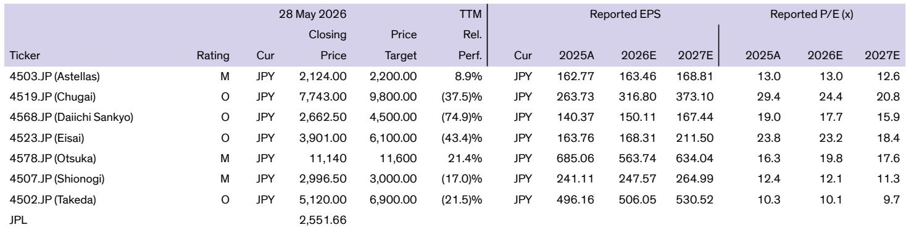

# 日本医药市场的真正挑战：低药价正在重塑全球药企的竞争版图

当全球制药巨头把目光投向中国、印度等新兴市场时，一个成熟市场正在悄然失去吸引力，而这对全球医药投资逻辑的冲击可能被严重低估。

某外资投行最新发布的研报揭示了一个令人警醒的趋势：日本已经从2012年全球第二大医药市场，下滑至2024年的第四位，市场规模仅相当于美国的十分之一。更值得关注的是，日本市场的药品价格在主要发达国家中几乎垫底，仅为美国价格的22%，与法国并列最低。

这不是一个简单的市场排名变化。它正在倒逼日本本土药企加速全球化布局，同时也在重新定义全球药企的战略优先级。对于关注医药板块的投资者而言，理解日本药价体系的运作逻辑，比关注任何单一药品的销售数据都更为重要。

这份研报的核心判断是：日本的低药价政策虽然在短期内帮助政府控制了医疗支出，但其长期后果可能是让患者失去获得创新药物的机会，同时迫使日本药企加速向海外转移研发和商业化资源。这背后是一个典型的政策与市场博弈的案例，其演变过程值得每一个关注全球医药格局的人深入理解。

## 1. 日本药价体系的核心逻辑：政府全权控制下的“成本优先”机制

日本的药品定价机制与其他发达国家有本质区别。在日本，几乎所有获批药物都纳入国民健康保险（NHI）体系，由政府直接决定药品的报销价格。这意味着，药企在日本市场几乎没有定价权，只能接受政府设定的价格。

新药定价主要采用两种方式：类比定价法和成本定价法。类比定价法占新药定价的65%，即参照市场上已有的同类药物价格，再根据新药的“创新性”和“有用性”给予一定溢价。理论上，一款真正具有突破性创新的药物可以获得70%-120%的创新溢价，但即便是最高溢价，其绝对价格水平仍然远低于美国市场。

成本定价法则更为棘手。当市场上没有同类药物可供参考时，政府要求药企披露药品的制造成本，然后在此基础上加成定价。但报告指出，超过60%的药企披露的成本信息不足50%，这使得这一过程更像是一种“艺术”而非基于数据的科学决策。

这种定价机制的直接后果是：日本市场对创新药的吸引力持续下降。对于全球大型药企而言，在日本上市一款新药，不仅要接受较低的初始定价，还要面对持续的降价压力，这与其在美国市场的定价策略形成了鲜明对比。

## 2. 年度降价机制：看似公平，实则抑制创新

日本药价体系的另一个独特之处在于其年度降价机制。每年，政府会进行一次市场调查，计算药品的实际采购价格与NHI报销价格之间的差价。如果差价超过2%，政府就会下调NHI价格，以确保药房和医院不会从价差中获取过多利润。

2026财年的调查显示，这一差价仅为4.8%，是过去30年来的最低水平。即便如此，政府仍决定平均降价0.9%。这种持续的价格压缩，使得日本市场对药企的吸引力进一步减弱。

值得注意的是，创新药物可以享受专利期内价格维护计划（PMP）的豁免，在仿制药上市或上市15年内免于年度降价。这一政策的初衷是鼓励药企在日本率先上市创新药。但问题在于，PMP的保护期一旦结束，药品价格会一次性大幅下调，以反映所有未实施的降价。到那时，仿制药通常已经进入市场，原研药的销售额已经大幅缩水，价格调整的实际意义已经不大。

这种机制设计看似平衡了控费和创新激励，但实际上，它让日本市场成为全球药企的“次优选择”。对于真正具有突破性的创新药，药企更倾向于优先在美国或欧洲上市，日本市场的上市时间往往落后于其他发达国家。

## 3. 隐性惩罚机制：卖得太好也要被降价

日本药价体系中最令药企难以接受的是其对商业成功的“惩罚”机制。根据市场扩张再评估和可持续性特别价格调整计划，如果一款药品的年销售额超过初始峰值销售预测的1.3-1.5倍，且超过1000亿日元，政府就可以将其NHI价格下调10%-50%。

这种机制的设计逻辑是：药企在申请NHI价格时提交的销售预测通常只基于首个获批适应症，而许多创新药物（尤其是肿瘤和免疫领域药物）会陆续获批多个适应症，销售额很容易超过初始预测。在这种情况下，政府认为药品的定价过高，需要下调。

这种做法的荒谬之处在于，它惩罚了那些真正满足临床需求、被医生和患者广泛接受的药物。报告提到，第一三共的抗凝血药物Lixiana就曾两次被降价，分别下调28%和20%。更令药企不满的是，此前这一规则还适用于同一作用机制的所有药物，这意味着即便你的药品没有超过销售预测，也可能因为竞争对手的药品卖得好而遭受降价。

虽然监管机构在最新规则更新中取消了这一“连坐”条款，但这种机制已经对药企的日本市场策略产生了深远影响。越来越多的药企开始重新评估日本市场的优先级，甚至考虑将新药在日本上市的时间进一步推迟。

## 4. 成本效益评估：日本正在走美国的路，但方向完全不同

2020年，日本正式将成本效益评估纳入NHI定价规则。目前，这一评估主要针对少数高成本药物，尤其是肿瘤和免疫领域的产品。评估标准包括高创新性和大预算影响，通常是在上市时获得高创新溢价或产生极高销售额的药物。

卫材的阿尔茨海默病药物Leqembi就是一个典型案例。这款药物在2025年11月接受了15%的价格下调，理由是成本效益评估。分析显示，其增量成本效益比（ICER）对应的价格调整应为25%，但由于设置了15%的上限，实际降幅被控制在15%。

这一机制与美国的情况形成了有趣对比。在美国，成本效益评估一直是医药定价改革的核心议题，但由于政治阻力，至今未能全面实施。日本却在相对低调地推进这一机制，虽然目前适用范围有限，但其方向已经明确。

对于全球药企而言，这意味着即便在日本市场获得高定价，也随时面临成本效益评估带来的降价风险。这种不确定性进一步降低了日本市场对创新药的投资吸引力。

## 5. 报告尚未完全回答的关键问题：低药价是否真的伤害了患者利益

这份报告提出了一个核心问题：低药价确实帮助日本政府控制了医疗支出，但对患者而言，这是否是好事？

从表面数据看，日本的医疗系统效率令人羡慕。日本以11.5%的GDP占比，实现了84.5岁的全球最高预期寿命，远高于美国16.5%的GDP占比和76.3岁的预期寿命。但报告也承认，日本人的长寿与其饮食习惯、遗传因素和生活方式密切相关，单纯归功于医疗系统并不准确。

更深层的问题是：低药价是否会导致创新药物上市延迟或完全退出日本市场？报告没有给出明确的结论，但提出了几个值得关注的观察点。

首先，日本药企正在加速向海外扩张。报告显示，日本主要药企的海外收入占比持续上升，国内收入增速普遍为负。武田制药的增长主要来自2019年对夏尔的收购，而安斯泰来、第一三共等公司的海外业务增速显著高于国内。

其次，全球药企对日本市场的态度正在分化。部分美国药企已经开始公开表达对日本定价体系的不满，甚至考虑调整在日本的产品管线策略。如果这种趋势持续，日本患者可能面临新药上市延迟、选择范围缩小的问题。

但另一方面，日本市场的低药价也迫使药企更加注重真正的临床价值。那些确实能改善患者预后、降低总体医疗成本的创新药物，仍然能够获得合理的市场回报。真正受到冲击的，可能是那些“me-too”类药物或增量创新产品。

## 6. 对投资者的观察框架：从日本药价体系演变中寻找投资信号

理解日本药价体系的运作逻辑，对于全球医药投资具有实际意义。以下是几个值得持续追踪的观察角度：

第一，关注日本药企的海外收入占比变化。当日本药企的海外收入占比超过50%甚至更高时，其估值逻辑应该从“国内药企”转变为“全球药企”。这意味着其风险敞口将从日本政策风险转向全球市场竞争风险。

第二，留意全球药企在日本的产品上市节奏。如果越来越多的创新药选择在日本延迟上市或完全放弃日本市场，这将是日本药价体系失效的明确信号，可能倒逼政策调整。

第三，关注日本政府的政策应对。目前日本政府已经推出了一些激励措施，如专利期内价格维护计划，但这些措施是否足够有效，仍需要时间验证。如果日本政府进一步收紧药价，可能加速本土药企的全球化进程；如果适当放宽，则可能吸引更多全球药企重返日本市场。

第四，成本效益评估的适用范围扩大值得警惕。目前日本仅对少数高成本药物进行成本效益评估，但如果这一机制扩展到更多药品类别，将对整个日本市场的定价体系产生深远影响。

第五，关注日本药企的并购策略。日本药企的海外扩张主要通过并购实现，武田收购夏尔就是一个典型案例。未来日本药企是否会继续大规模海外并购，以及并购标的的选择，将直接影响其长期增长前景。

这些观察框架需要持续跟踪和验证。报告中提到的许多细节，如不同药企的具体海外收入结构、各药品的降价幅度、政策变化的详细时间线等，都没有在这篇导读中完全展开。这些信息对于做出更精准的投资判断至关重要。

欢迎来星球微信群里继续讨论这些未解的问题：日本药价体系是否会在未来三年内出现重大改革？哪些日本药企的全球化策略最具可持续性？全球药企是否会集体调整日本市场策略？这些问题的答案，可能就藏在完整报告的图表和数据分析中。我们会在社群中分享完整报告的解读和原始图表，与大家一起深入探讨。

Personal reading notes and learning share only. Not investment advice.

