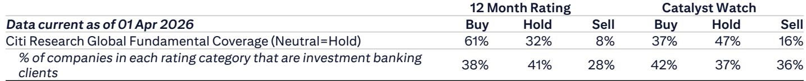
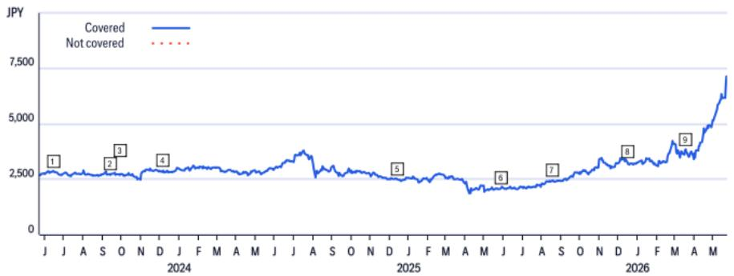
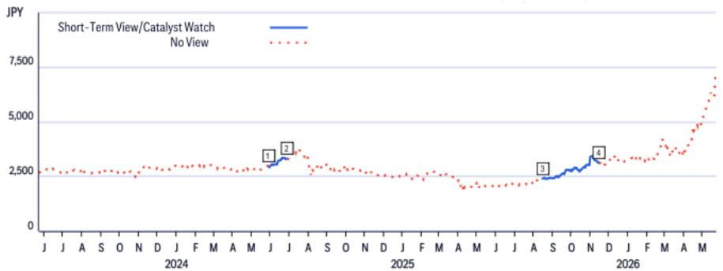

# Japan's MLCC Data Signals a Structural Shift, Not Just a Cyclical Upturn

The April MLCC trade statistics from Japan's Ministry of Finance are not merely another data point in a recovery narrative. They represent a fundamental re-pricing of what these components are worth, driven by a demand structure that looks fundamentally different from previous cycles. Shipment volume rose 10.4% year-on-year, but shipment value surged 28.0% in yen terms. The gap between volume and value growth tells the real story: average selling prices jumped 15.9% year-on-year. This is not a typical inventory restocking cycle. It is a signal that the composition of demand has shifted toward higher-value applications, and that the pricing power Japanese MLCC manufacturers once ceded during the commodity-driven downturns of 2022 and 2023 is returning. For investors tracking the semiconductor and electronics supply chain, this data offers the earliest confirmation that the new fiscal year is starting with a fundamentally stronger pricing environment than most models anticipated.

The yen depreciation from 144 to 158 against the dollar over the past year provides a tailwind, but it is not the primary driver. The real catalyst is the sustained ramp in AI server deployments, which consume significantly more MLCCs per unit than traditional servers and demand higher-specification components that command premium pricing. What makes this cycle different is the combination of volume growth with ASP expansion. In past recoveries, volume rebounded first while pricing remained depressed until capacity utilization tightened. Today, both are moving in the same direction simultaneously. This suggests that the supply-demand balance has shifted more decisively than many sell-side models had anticipated, and that the first-quarter results for major players like Murata are likely to beat the conservative guidance set at the start of the fiscal year.

## The Divergence Between Volume and Value Growth Reveals a Fundamental Change in Product Mix

The April data shows shipment volume growing at 10.4% year-on-year while value grows at 28.0%. This 17.6 percentage point gap is the largest we have observed in recent history outside of the pandemic-era supply crunch. It is not explained by currency alone. Even in dollar terms, value grew 16.6% against volume growth of 10.4%, implying a 6.2% real ASP increase after stripping out FX effects. This matters because it tells us the market is not just buying more capacitors; it is buying more expensive capacitors. The product mix is shifting toward larger, higher-voltage, and higher-reliability components required for AI accelerators, data center power management, and advanced automotive platforms. In previous cycles, ASPs typically declined or remained flat during volume recoveries because the incremental demand came from low-end consumer electronics. Today, the incremental demand is coming from infrastructure and enterprise applications where component quality and performance specifications are non-negotiable. This structural mix shift has significant implications for margin expansion across the sector.

The sequential data reinforces this point. April MLCC shipment value rose 9.3% month-on-month, while volume rose only 6.5%. The 2.8% sequential ASP increase in yen terms suggests that pricing momentum is accelerating, not decelerating, as the quarter progresses. This is particularly notable because April is typically a month where production ramps up after the Japanese fiscal year-end, which can create temporary pricing pressure as manufacturers push volume. The fact that ASPs continue to rise despite higher volumes indicates that demand is outstripping supply for premium-grade components. The implication for Murata and its peers is clear: the first-quarter capacitor revenue forecast of approximately 15% year-on-year growth, which the report cites, may prove conservative. If the April run rate sustains through May and June, actual results could meaningfully exceed that figure. For investors, the key question is whether this pricing power is sustainable or whether it reflects temporary supply constraints that will ease as capacity comes online.

## AI Server Demand Is Reshaping the MLCC Value Chain in Ways That Favor Incumbents

The report explicitly cites "ongoing strong demand for AI servers" as the driver of elevated ASPs, but the mechanism deserves deeper examination. AI servers require MLCCs that can handle higher operating temperatures, greater voltage stability, and more stringent reliability standards than standard enterprise servers. A typical AI training server can contain 5,000 to 10,000 MLCCs, compared to roughly 2,000 to 3,000 in a standard server. More importantly, the specifications are higher: many of these components must be rated for 100V or more, with low equivalent series resistance and high capacitance stability under thermal stress. These are not commodity components. They require advanced manufacturing processes, tighter quality controls, and longer qualification cycles. Japanese manufacturers like Murata, TDK, and Taiyo Yuden have maintained leadership in these high-reliability segments precisely because the barriers to entry are high. Chinese and Taiwanese competitors have made inroads in low-end consumer MLCCs, but they have not yet demonstrated the capability to qualify for AI server applications at scale.

This creates a structural advantage that extends beyond the current cycle. As AI infrastructure spending continues to grow, the mix of MLCC demand will increasingly tilt toward these premium segments. The report's data suggests that this shift is already happening faster than most industry observers anticipated. The 15.9% year-on-year ASP increase is not just a recovery from depressed levels; it represents a new pricing baseline. If AI server shipments double over the next 18 months, as many supply chain forecasts project, the demand for high-end MLCCs could outstrip available capacity even if overall MLCC capacity expands. This would give Japanese manufacturers pricing power that they have not enjoyed since the smartphone super-cycle of 2017-2018. The strategic implication is that investors should evaluate MLCC companies not on their total volume growth but on their revenue mix and their exposure to the highest-value segments of the market.

## The RoIC-WACC Valuation Framework Suggests Significant Upside If Current Trends Persist

The report employs a RoIC-WACC approach to value Murata, setting a target price of 3,900 yen based on FY3/28 adjusted NOPAT and a 0% terminal growth rate assumption. This is a deliberately conservative framework. The assumption of zero perpetual growth implies that the current earnings power is sustainable but not growing. If the current demand trends continue, this assumption will need to be revised upward. The theoretical shareholder value calculation uses a risk-free rate of 1.5% and an equity risk premium of 4.0%, derived from TOPIX earnings yield. These are reasonable inputs for a mature Japanese company, but they do not capture the optionality embedded in the AI-driven demand shift. If Murata can sustain even 3-5% revenue growth over the next five years driven by AI and automotive, the intrinsic value would be substantially higher than the 3,900 yen target.

The report's risk section identifies six key risks, including technology product demand trends, automotive supply chain adjustments, forex changes, Asian competition, smartphone market share trends, and MLCC supply-demand changes. All of these are valid, but the most underappreciated risk may be the opposite of what most investors fear: that demand accelerates faster than capacity, leading to allocation challenges and potential customer dissatisfaction. In the current environment, the bigger risk for Murata may be leaving revenue on the table rather than facing a demand collapse. The report's "numbers well above this as positive" language suggests that the analyst sees more upside than downside risk to first-quarter estimates. The shares have already risen significantly post-earnings, but the valuation may still be pricing in a cyclical recovery rather than a structural shift. If the first-quarter results confirm the April trend, the market will need to reassess its long-term growth assumptions for the sector.

## What the Report Does Not Fully Answer: The Sustainability of ASP Expansion and the Capacity Response

The report provides a snapshot of April data and a near-term forecast for Murata's first quarter, but it leaves several critical questions unanswered. The most important is whether the current ASP expansion is sustainable or whether it reflects temporary supply-demand imbalances that will correct as capacity additions come online. Japanese MLCC manufacturers have been cautious about adding capacity after the 2022-2023 downturn left them with excess production lines. If the current demand surge is real and structural, capacity constraints could persist for 12-18 months, supporting elevated pricing. However, if demand growth moderates in the second half of the year, the pricing momentum could reverse quickly. The report does not provide a detailed capacity outlook or an analysis of lead times and backlog trends, which would help answer this question.

A second unresolved question is the extent to which the yen depreciation is masking underlying weakness in non-AI demand segments. While AI server demand is strong, the automotive sector is undergoing its own inventory adjustments, and consumer electronics demand remains tepid outside of premium smartphones. If the yen weakens further, the revenue growth in yen terms will look impressive even if unit volumes in dollar-denominated markets are flat or declining. Investors need to distinguish between genuine demand growth and FX-driven revenue inflation. The report's dollar-denominated value growth of 16.6% year-on-year provides some clarity, but a deeper breakdown by end-market would be valuable. A third question concerns the competitive response from Asian rivals. If Chinese MLCC manufacturers accelerate their qualification efforts for AI-grade components, the pricing premium that Japanese manufacturers currently enjoy could erode over time. The report does not address the timeline or probability of this scenario.

## A Decision Framework for Investors: How to Interpret Future MLCC Data Releases

For investors who want to track the themes in this report, a structured framework for interpreting future monthly trade statistics and company earnings is essential. The first metric to monitor is the gap between volume growth and value growth in yen terms. A widening gap suggests ongoing mix improvement and pricing power, while a narrowing gap indicates that the recovery is becoming more volume-driven and potentially more cyclical. The second metric is the sequential ASP trend. April showed 2.6% month-on-month ASP growth, which is strong by historical standards. If this continues at 1-2% per month, the quarterly ASP increase would be 5-7%, which would significantly boost revenue and margins. If sequential ASP growth decelerates to flat or negative, it would signal that the pricing cycle is peaking.

The third metric is the relationship between Murata's actual first-quarter capacitor revenue and the analyst's 15% year-on-year growth forecast. If actual results come in at 18-20% growth, it would validate the thesis that the current cycle is stronger than expected. If results are closer to 12-13%, it would suggest that April was an outlier month. The fourth metric is capacity utilization rates, which Japanese manufacturers typically disclose with a lag. Utilization above 90% for premium-grade products would support the case for sustained pricing power. Finally, investors should track the commentary from Asian competitors, particularly in China and Taiwan. If they begin announcing new capacity dedicated to high-reliability MLCCs, it would signal that the competitive dynamics are about to change. The report's data provides a strong starting point, but the investment case depends on how these variables evolve over the next two quarters.

Join the community to read the full report and review the original charts.

*This article is for learning and discussion only and does not constitute investment advice.*

Personal reading notes and learning share only. Not investment advice.

