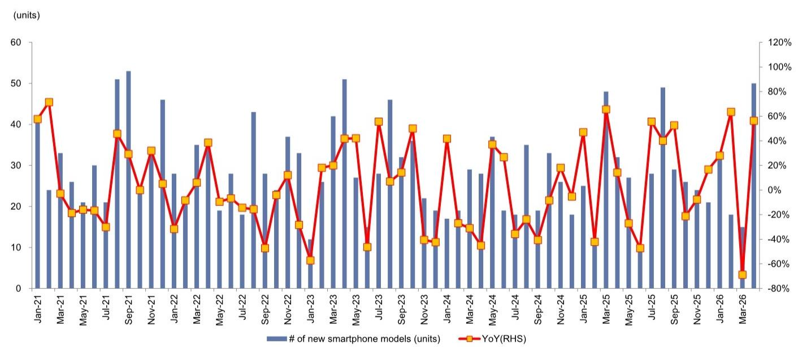

# China’s Smartphone Market Is Not Recovering — It Is Restructuring

April 2026 smartphone shipments in China surged 12% year-over-year and 25% month-over-month to 25 million units. On the surface, these numbers suggest a market shaking off its malaise. But the real story is far more strategic and less comforting. This is not a cyclical rebound. It is a structural transformation driven by component cost inflation, shifting consumer value perception, and a deliberate consolidation of specification upgrades. The headline growth masks a market that is simultaneously contracting in volume terms when measured against replacement-cycle demand and expanding in value only where manufacturers make hard choices about what to improve and what to strip away.

The most telling signal is not the shipment number itself, but the composition of what is being shipped. The average number of cameras per smartphone has fallen from its 2022 peak of 3.8 to just 2.9 in the first five months of 2026. Meanwhile, the penetration of 20-megapixel-plus cameras has risen from 52% in 2024 to 63% in 2026 year-to-date. This is not a market adding features indiscriminately. It is a market that has decided to concentrate its cost increases on the components that consumers actually notice and value, while quietly eliminating the low-end sensors that added bill-of-materials cost without driving purchase intent. The implication for investors and supply-chain strategists is clear: the battle for China’s smartphone consumer is no longer about who offers the most cameras, but who offers the right cameras.

What makes this moment critical is the convergence of memory cost pressure with this specification restructuring. The same report that highlights April’s shipment strength also expects second-quarter 2026 shipments to decline 6% year-over-year, citing rising memory costs as a demand headwind. This creates a paradox: unit volumes are being squeezed by input cost inflation at the same time that manufacturers are pushing higher-value components into fewer devices. The winners in this environment will not be the companies that maximize unit share. They will be the companies that maximize margin per device through disciplined specification strategy and supply-chain leverage.

## The Decline in Camera Count Is Not Cost Cutting — It Is Value Engineering

The decline from 3.8 cameras per device in 2022 to 2.9 in 2026 year-to-date is often misinterpreted as a simple cost-reduction move. That reading is too shallow. If manufacturers were merely cutting costs, they would have reduced camera count while keeping the remaining sensors at low resolution. Instead, the data shows the opposite: low-resolution cameras (2, 5, and 8 megapixels) have fallen from 51% of all cameras in 2022 to just 25% in 2026. The share of 20-megapixel-plus cameras has risen from 39% to 63% over the same period.

This is value engineering, not cost cutting. Manufacturers are removing the cameras that consumers do not use — the depth sensors, the macro lenses, the low-resolution ultrawide modules — and reallocating that cost budget to higher-resolution main, telephoto, and ultrawide cameras that drive purchase decisions. The strategy is backed by consumer behavior data: surveys consistently show that camera quality is the top consideration for Chinese smartphone buyers, but the number of cameras is not. A phone with three high-quality cameras sells better than a phone with five cameras where three are low-resolution fillers.

The competitive implication is significant. Brands that continue to add low-resolution cameras to hit a higher count on the spec sheet are wasting bill-of-materials cost that could be deployed toward display, battery, or processor upgrades that actually differentiate. The brands that have already moved to the 2.9-camera average with high-resolution sensors — including Huawei, Honor, OPPO, and Vivo — are likely to see better gross margin retention in a rising memory-cost environment. Transsion, at 2.8 cameras but with 33% of its cameras still in the low-resolution category, faces a more difficult transition.

## Memory Cost Pressure Will Force a Second Round of Specification Trade-Offs

The report identifies rising memory cost as the primary headwind for second-quarter 2026 shipments, projecting a 6% year-over-year decline. This is not a temporary fluctuation. Memory pricing cycles have historically lasted 12 to 18 months, and the current upcycle, driven by HBM demand from AI data centers and constrained supply from legacy DRAM production, shows no signs of peaking before late 2026.

For smartphone OEMs, memory is one of the largest single cost components, often accounting for 15% to 25% of total bill-of-materials depending on configuration. When memory prices rise, manufacturers face an uncomfortable choice: absorb the cost and compress margin, or pass it to consumers and risk demand destruction. The data suggests they are choosing a third path: specification trade-offs that reduce cost in non-differentiating areas while maintaining or improving the features that drive willingness to pay.

The camera restructuring already underway is the first wave of this strategy. The second wave will likely target other components. Display specifications may see a pause in resolution and refresh rate upgrades. Battery capacity increases may slow. Haptic engine and speaker upgrades may be deferred. The critical question for investors is which component categories are considered differentiating enough to protect and which are considered expendable.

Cameras, particularly high-resolution main sensors and telephoto modules, appear to be in the protected category. Low-resolution cameras are not. This suggests that suppliers of high-end image sensors, lens modules, and actuator components may see continued demand growth even as overall unit volumes decline. Suppliers of low-end camera modules face structural volume erosion. The pattern is reminiscent of the PC industry's consolidation of specification upgrades during memory upcycles in the 2010s, where SSD adoption accelerated as HDDs were eliminated to offset DRAM cost increases.

## The Launch Pipeline Reveals a Market That Is Betting on Foldables and Premiumization

The report shows a dramatic surge in new model launches: 50 new smartphone models in April 2026, up 56% year-over-year and 233% month-over-month. This is not a sign of market strength. It is a sign of market fragmentation and competitive desperation. When the total addressable market is shrinking or flat, the only way to gain share is to launch more models, targeting narrower consumer segments with specific feature sets.

The foldable segment is a clear focal point. The report lists 21 foldable models with pricing ranging from $710 for the Honor Magic V Flip to $2,840 for the Samsung Galaxy Z TriFold and $2,570 for the Huawei Mate XTs Ultimate Design. This is not a mass-market category. Foldables remain premium devices with limited volume potential. But they serve a strategic purpose: they allow brands to establish technological leadership, command higher average selling prices, and protect margins in a market where mid-range devices are under constant memory cost pressure.

The risk is that the proliferation of foldable models — many with overlapping price points and feature sets — creates consumer confusion and dilutes brand positioning. A consumer deciding between the Huawei Mate X6 at $1,860, the Oppo Find N5 at $1,420, and the Honor Magic V5 at $1,280 may simply defer purchase. The market may be approaching a point where the number of foldable models exceeds the addressable consumer base willing to pay foldable premiums.

## What the Report Does Not Fully Answer: The Demand Elasticity of Specification Upgrades

The report provides excellent data on what manufacturers are shipping and at what specification levels, but it does not fully address a critical question: how much are consumers willing to pay for these upgrades? The camera specification data shows a clear trend toward higher-resolution sensors, but it does not show whether consumers are actually paying higher prices for phones with those sensors, or whether they expect them at the same price point.

This is the central unknown for the second half of 2026. If memory cost increases force OEMs to raise prices by 5% to 10%, will consumers accept the increase in exchange for better cameras and displays, or will they trade down to older models or delay purchases? The report's own expectation of a 6% year-over-year decline in second-quarter shipments suggests the market expects some demand destruction. But the magnitude is uncertain.

A second unanswered question is how the foldable segment will evolve as more players enter. The report lists models from Samsung, Huawei, Oppo, Honor, Xiaomi, Tecno, and Lenovo. With seven major brands competing in a category that likely represents less than 5% of total smartphone shipments, the segment is at risk of oversupply and price compression. The report does not provide foldable shipment data, making it impossible to assess whether the model proliferation is supported by demand or is simply competitive one-upmanship.

## A Decision Framework for Investors and Strategists

For readers who need to translate this analysis into actionable decisions, the following framework organizes the key variables into a structured assessment.

The first dimension is component exposure. Suppliers of high-resolution image sensors, telephoto lens modules, and precision actuator components are positioned for volume growth even in a declining overall market. Suppliers of low-resolution cameras, entry-level display panels, and generic memory modules face volume erosion as OEMs consolidate specification upgrades. The key metric to monitor is not smartphone unit shipments, but the ratio of high-value components per device.

The second dimension is brand positioning. Brands that have already moved to a 2.9-camera average with high-resolution sensors — Huawei, Honor, OPPO, Vivo — are better positioned to absorb memory cost increases without sacrificing camera quality. Brands that still rely on low-resolution cameras for count inflation face a more difficult transition and may see margin compression as they are forced to upgrade sensors while absorbing higher memory costs.

The third dimension is foldable exposure. The segment offers margin upside but volume risk. Investors should assess whether each brand's foldable strategy is a genuine attempt to build a premium franchise or a defensive reaction to competitors. Brands with a clear foldable design philosophy and a limited number of models per price tier are more likely to succeed than brands that launch multiple overlapping models.

The fourth dimension is supply-chain leverage. OEMs that have long-term memory supply agreements, or that can substitute between DRAM and NAND configurations to optimize cost, will have more flexibility in managing the current upcycle. OEMs that purchase memory on the spot market or have limited supplier diversification face greater margin risk.

## The Full Picture Requires Granular Data on Consumer Response

The report provides an excellent foundation for understanding the supply-side dynamics of China's smartphone market. The camera specification data, the model launch pipeline, and the memory cost analysis all point to a market that is restructuring rather than recovering. But the demand side remains opaque. Without data on channel inventory, sell-through rates, and consumer price sensitivity, any projection of second-half 2026 shipments carries significant uncertainty.

The most valuable next step for serious readers is to examine the original charts and data tables that accompany this report. The exhibits on camera pixel distribution, foldable pricing, and model launch timing contain nuances that cannot be fully captured in text. The relationship between the surge in new model launches and the decline in average cameras per model, for example, becomes clearer when visualized over time.

Join the community to read the full report and review the original charts.

*This article is for learning and discussion only and does not constitute investment advice.*

Personal reading notes and learning share only. Not investment advice.

