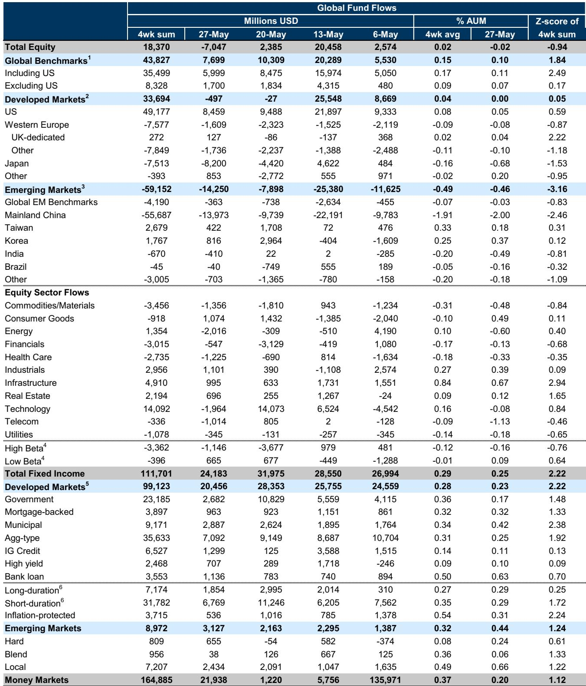
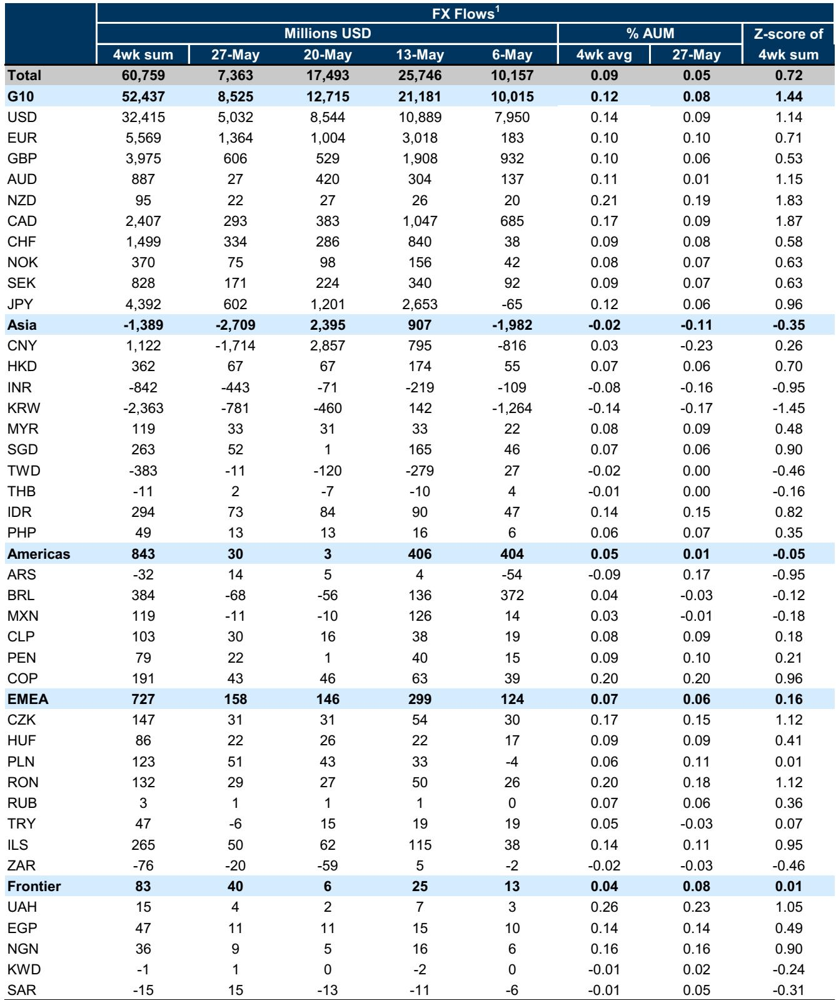
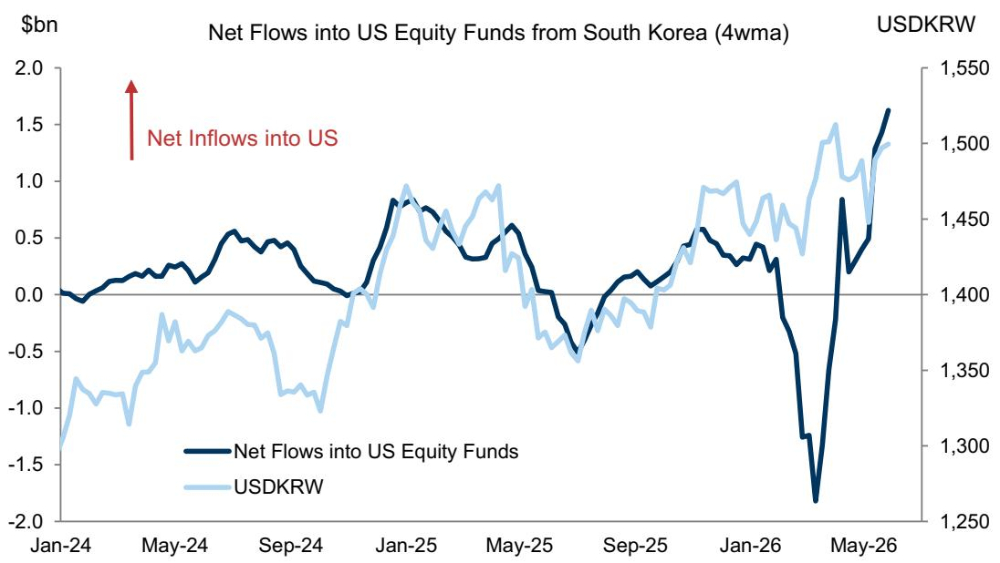

# The Great Divergence: Global Capital Is Betting on a New Axis, and Most Investors Are Still Looking at the Old Map

The latest global fund flow data, covering the week ending May 27, reveals a market that is not simply rotating but fundamentally reordering itself. Equity flows turned negative for the first time in weeks, shedding $7 billion globally. Yet beneath this headline lies a far more instructive pattern: capital is not retreating from risk; it is fleeing specific narratives and crowding into others with a precision that should unsettle any portfolio manager relying on broad-brush allocations. Fixed income continues to absorb capital at a remarkable pace, with $24 billion in net inflows for the week and a four-week sum exceeding $111 billion. Money markets added another $22 billion. The aggregate picture is one of caution, but the granular picture is one of conviction.

The most consequential signal in this week's data is not the aggregate flows but the geographic and sectoral divergence. South Korean investors are funneling an increasing share of their surplus into US equities, even as their own domestic economy struggles to capture the benefits of a booming tech export sector. Mainland China equity funds are experiencing net outflows, driven almost entirely by domestic investors. European and Japanese equity funds are bleeding. Meanwhile, US equity funds remain a magnet, but even within the US, the story is one of extreme selectivity. The cumulative year-to-date flows by sector tell a stark tale: Industrials and Infrastructure lead by a wide margin, while Consumer Goods, Financials, and Healthcare are in negative territory. This is not a market that is broadly bullish or bearish. It is a market that is voting on a thesis about where the next cycle of growth will originate, and the votes are not close.

The timing of this divergence matters. We are entering a period where the macroeconomic consensus is fracturing. The narrative of a soft landing is being challenged by persistent inflation in services, a labor market that refuses to cool, and geopolitical fragmentation that is rewriting supply chains. In such an environment, fund flows become a leading indicator of where institutional conviction is building, not just a lagging reflection of past performance. The data from this week suggests that conviction is building around two themes: the industrial renaissance in the US and the structural demand for yield in fixed income. Everything else is facing a credibility test.

## The Recycling of Asian Surpluses Is Reshaping Currency Markets and Equity Ownership Structures

The chart of the week in the report highlights a pattern that deserves far more attention than it typically receives: the bilateral net flows into US equity funds from South Korea are accelerating. This is not a marginal trend. It represents a structural recycling of South Korea's current account surplus into foreign equities, a phenomenon that has profound implications for both the won and the composition of US equity ownership.

South Korea's trade surplus is expected to surge as high-value tech exports—semiconductors, batteries, electronics—outweigh the rising cost of energy imports. But the domestic economy is not capturing this surplus. Instead, it is being exported almost in its entirety through portfolio outflows. The logic is straightforward: Korean institutional and retail investors, facing a domestic market that is heavily weighted toward a few large conglomerates and a currency that is under persistent pressure, are choosing to park their gains in US equities. This is not a speculative trade. It is a structural allocation decision.

The consequence for the won is clear. The report notes that the surplus has "largely bypassed the domestic economy as it continues to be recycled into foreign equities, weighing on the currency." This creates a feedback loop: a weaker won makes Korean exports more competitive, which increases the surplus, which leads to more outflows, which further weakens the won. For global investors, this means that any position in Korean equities or the won must account for this structural leakage. The currency is not just a function of trade flows anymore; it is a function of portfolio allocation decisions that show no sign of reversing.

For US equity markets, the implication is equally significant. South Korean investors are becoming a stable, incremental source of demand for US equities, particularly in a period when domestic retail flows have been volatile. This is a form of foreign official and quasi-official demand that operates with a different time horizon and different sensitivity to valuation than hedge fund or mutual fund flows. It is a structural bid, not a tactical one.

## Fixed Income Is Absorbing Capital at a Pace That Suggests a Regime Change in Risk Preferences, Not a Temporary Pause

The fixed income data in this week's report is striking not just for its volume but for its composition. Global fixed income funds saw $24 billion in net inflows for the week, with a four-week sum of $112 billion. Short-duration bond funds and inflation-protected bond funds have seen sustained inflows. Emerging market local-currency bond funds are driving net inflows, while hard-currency EM bond funds are also positive. This is not a flight to safety in the traditional sense. It is a strategic allocation to yield.

The key insight here is that investors are not simply hiding in cash or Treasuries. They are reaching for yield across the curve and across geographies, but they are doing so with a clear preference for duration control and inflation protection. Short-duration bond funds are absorbing capital because investors want yield without taking on the duration risk that would leave them exposed to a repricing of term premiums. Inflation-protected funds are absorbing capital because the market is not yet convinced that the inflation problem is solved. And EM local-currency bonds are absorbing capital because investors see attractive real yields in countries that are further along in their tightening cycles than the US.

This pattern tells us that the fixed income market is pricing in a scenario that is more complex than a simple recession or a simple soft landing. It is pricing in a world where inflation remains sticky enough to prevent aggressive rate cuts, where growth remains resilient enough to support credit, but where the risk of a sudden repricing of risk premiums is high enough to warrant short-duration positioning. The inflows into EM local-currency debt are particularly telling. They suggest that investors are willing to take on currency risk in exchange for yield, but only in markets where central banks have demonstrated credibility. This is a vote of confidence in EM monetary policy, but it is also a sign that the hunt for yield is becoming more desperate.

## The Rotation Out of Consumer and Healthcare and Into Industrials and Infrastructure Is a Bet on a New Growth Regime

The cumulative year-to-date sector flow data in the report reveals a dramatic reordering of preferences. Industrials have seen the largest cumulative inflows as a percentage of AUM, followed by Infrastructure, Energy, and Commodities/Materials. Technology, which dominated flows for years, is now in the middle of the pack. Consumer Goods, Financials, and Healthcare are in negative territory.

This is not a defensive rotation. It is a rotation into the sectors that benefit from physical investment, government spending, and supply chain restructuring. Industrials and Infrastructure are the direct beneficiaries of the reshoring narrative, the CHIPS Act, the Inflation Reduction Act, and the broader push to rebuild domestic manufacturing capacity. Energy and Materials benefit from the same theme, as well as from the structural underinvestment in commodity production over the past decade.

The underperformance of Technology is more nuanced. It is not that investors have given up on tech. The cumulative flows are still positive. But the relative ranking has shifted. The market is signaling that the next leg of growth will come from the application of technology to physical industries, not from pure-play software or consumer internet. The winners in the next cycle will be companies that can digitize factories, optimize supply chains, and electrify transportation, not just those that can sell ads or subscriptions.

The negative flows into Consumer Goods, Financials, and Healthcare are equally instructive. Consumer Goods are being punished by the shift in spending from goods to services and by the margin compression from input cost inflation. Financials are being punished by the flattening yield curve and the risk of credit losses. Healthcare is being punished by regulatory uncertainty and the fading of the pandemic-era tailwinds. These sectors are not broken, but they are out of favor. The question for investors is whether this rotation is cyclical or structural.

## What the Report Does Not Fully Answer: The Sustainability of Korea's Outflows and the Risk of a Reversal in EM Local-Currency Demand

The report provides a rich dataset, but it leaves several critical questions unanswered. The first concerns the sustainability of South Korea's outflows. The report notes that the surplus is expected to surge, but it does not model what happens if the won weakens to a level that triggers intervention from the Korean authorities. The Bank of Korea has a history of stepping in to stabilize the currency, and if outflows continue to accelerate, the policy response could include capital flow measures or even a coordinated intervention with other Asian central banks. The risk is that the structural bid from Korean investors into US equities could become a source of instability if it triggers a policy backlash.

The second unanswered question concerns the durability of EM local-currency bond inflows. The report shows that these inflows have been strong, but it does not disaggregate them by country or by investor type. Are these inflows coming from dedicated EM funds, or are they coming from global fixed income funds that are rotating out of DM credit? If the latter, the flows could reverse quickly if global risk appetite deteriorates. The report's data on cross-border FX flows shows that the USD saw the strongest net demand while the CNY saw the largest net outflows. This suggests that the EM local-currency story is not uniform. Some currencies are benefiting, but others are under pressure. The report does not tell us which is which.

The third unanswered question is about the relationship between equity and fixed income flows. The report shows that equity flows turned negative while fixed income flows remained strong, but it does not address whether this is a substitution effect or a diversification effect. Are investors selling equities to buy bonds, or are they allocating new capital to bonds while holding equities steady? The answer has significant implications for asset allocation. If it is a substitution, the equity market could face further headwinds. If it is a diversification, the equity market could stabilize as long as the macro environment does not deteriorate.

## A Decision Framework for Investors: Three Questions to Ask Before Making Your Next Allocation

The data in this report is not just descriptive; it is prescriptive. It provides a framework for making allocation decisions in a market that is increasingly driven by structural flows rather than cyclical momentum. Here are three questions that every investor should ask before making their next allocation.

First, where is the structural bid? The data shows that South Korean investors are providing a structural bid to US equities, that fixed income investors are providing a structural bid to short-duration and inflation-protected bonds, and that sector investors are providing a structural bid to Industrials and Infrastructure. These are not tactical trades. They are allocation decisions that are likely to persist for quarters, if not years. The question is whether your portfolio is positioned to capture these structural flows or whether it is relying on tactical flows that could reverse.

Second, what is the risk of a reversal? The structural flows that are driving the market today are not immune to reversal. Korean outflows could be disrupted by policy intervention. EM local-currency inflows could be disrupted by a sudden spike in US real yields. Sector flows into Industrials could be disrupted by a recession that reduces capital spending. The key is to identify the conditions that would trigger a reversal and to monitor them closely. For Korean outflows, the trigger is likely a sharp depreciation of the won that prompts intervention. For EM local-currency inflows, the trigger is likely a move higher in US 10-year real yields above 2%. For Industrials, the trigger is likely a sustained decline in the ISM Manufacturing Index below 45.

Third, what is the opportunity in the gaps? The report shows that some sectors and regions are being left behind. Consumer Goods, Healthcare, and Financials are seeing net outflows. Mainland China equity funds are seeing cumulative outflows of 23% of AUM year-to-date. India is also seeing outflows. These are not necessarily value traps, but they are contrarian opportunities that require a catalyst. The question is whether the catalyst is visible. For Mainland China, the catalyst could be a significant fiscal stimulus or a resolution of the property crisis. For Healthcare, the catalyst could be a regulatory easing or a wave of M&A. For Financials, the catalyst could be a steepening of the yield curve. If you can identify the catalyst before the market does, the opportunity is significant.

## The Full Report Contains the Charts That Make These Patterns Visible

The data discussed in this article is drawn from a comprehensive weekly report that includes detailed charts on cumulative flows by sector, cumulative flows by region, unhedged foreign flows by country, and the specific trajectory of Korean flows into US equities. These charts are not just visual aids; they are analytical tools that reveal patterns that are invisible in the aggregate numbers. The chart on Korean bilateral flows, for example, shows the acceleration in a way that the table alone cannot capture. The chart on cumulative sector flows shows the hierarchy of conviction in a way that is immediately intuitive.

To fully understand the implications of this week's fund flow data, you need to see these charts. They are the difference between knowing the numbers and understanding the story. Join the community to read the full report and review the original charts.

*This article is for learning and discussion only and does not constitute investment advice.*

Personal reading notes and learning share only. Not investment advice.

