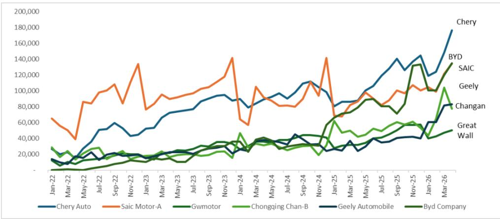
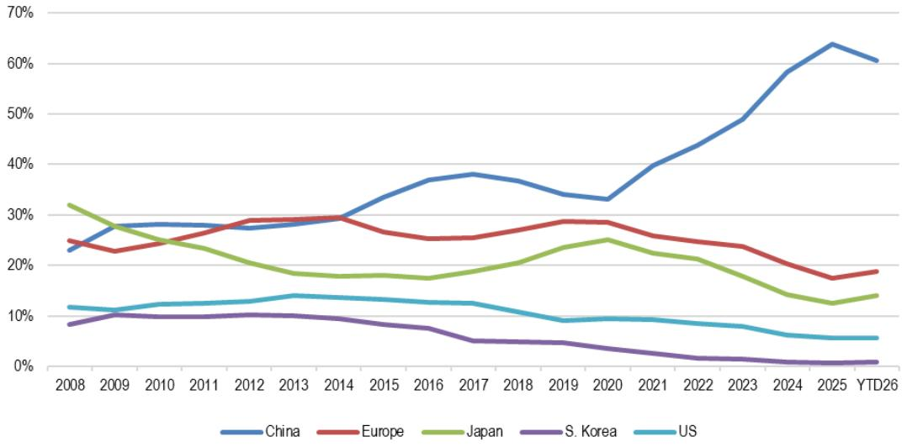
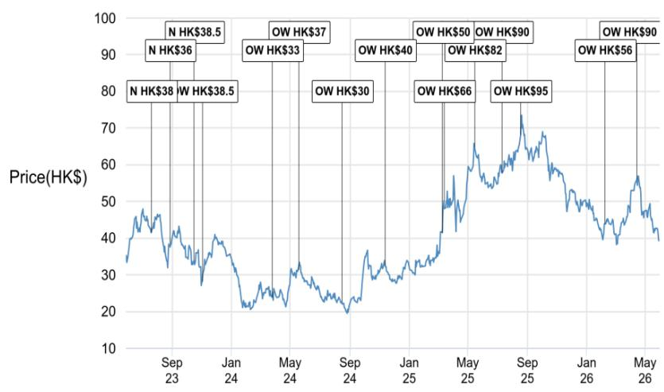

# 中国汽车出口的真正转折点：不是规模，而是结构

中国汽车出口正在经历一个被多数投资者低估的质变。2026年4月，一个关键数据点出现：新能源汽车在乘用车出口中的占比首次突破55%，而其中插电式混合动力的贡献正在加速上升。但比这个数字本身更重要的，是它揭示的结构性转变——中国车企的海外扩张已经从“卖便宜燃油车”切换到“用新能源车定义新市场”。

某外资投行最新发布的出口追踪报告显示，2026年前四个月，中国乘用车出口量同比增长约69%，全年总量预计达到约980万辆，再创历史新高。但真正值得关注的不是增速，而是三个正在重塑行业竞争格局的变量：动力总成结构的快速电动化、出口区域的多元化分散、以及海外收入对车企利润表的渗透正在从量变走向质变。

## 1. 插电混动正在成为海外市场最被低估的“中国变量”

如果只看纯电动车的出口占比，市场容易得出“中国新能源车出海节奏平稳”的判断。但插电混动的数据揭示了一个更激进的现实。

根据报告数据，2024年1月，插电混动在中国新能源车出口中的占比仅为11%，而到2026年4月，这一比例已跃升至39%。也就是说，每出口三辆新能源车，就有一辆以上是插电混动。更值得关注的是，这一趋势并非由单一车企驱动——从比亚迪到吉利，从奇瑞到上汽，几乎所有主要出口商的插电混动占比都在上升。

这意味着什么？插电混动产品在海外市场解决了纯电动的两个核心痛点：充电基础设施不足和续航焦虑。在东南亚、拉美、甚至部分欧洲市场，插电混动正在成为比纯电动更现实的“入门新能源”选择。对于投资者而言，这意味着需要重新评估那些在插电混动领域有较强产品储备的车企的海外增长潜力。

报告特别指出，插电混动在海外的增长轨迹正在复制中国国内市场过去几年的路径——从被忽视到快速渗透。如果这一规律成立，那么当前海外市场对插电混动的认知可能仍然滞后于实际需求。

## 2. 欧洲不再是唯一锚点，区域多元化正在降低单一市场风险

过去几年，中国车企的出口故事高度集中于欧洲。关税政策、碳排放法规、消费者接受度——任何一个变量都可能对出口总量产生重大影响。但最新的数据表明，这种集中度正在被主动稀释。

报告对主要车企的出口区域结构进行了拆解，揭示了几个关键变化：

上汽集团是“欧洲依赖度”最高的案例，欧洲在其出口中的占比从2024年的34%上升至2026年前四个月的46%。但与此同时，亚洲的占比从32%下降至23%。这意味着上汽正在将更多资源向欧洲倾斜，但也在承受区域集中度上升带来的风险。

比亚迪和奇瑞则呈现出更均衡的布局。比亚迪的欧洲占比从24%上升至36%，但南美占比也从21%提升至24%。奇瑞的欧洲占比虽然从45%下降至36%，但南美和世界其他地区的占比显著上升。

最具反差意义的是长城汽车。2024年，欧洲占其出口的65%，而到2026年前四个月，这一比例已降至38%。长城正在主动降低对欧洲的依赖，转而加大在亚洲和南美的布局。

这种区域多元化是结构性利好。它意味着中国车企的海外增长不再完全受制于单一市场的政策风险或需求波动。当欧洲可能加征关税时，南美和东南亚正在成为新的增长引擎。对于投资者来说，那些能够证明自己在多个区域同时具备渗透能力的车企，其海外收入的可预测性将显著高于单一市场玩家。

## 3. 海外收入占比正在超越销量占比，利润结构正在被重塑

一个容易被忽视但极具洞察力的数据点是：海外市场对中国车企的收入贡献正在远超销量贡献。

报告预测，2026年海外市场将占部分中国车企收入的约30-60%，而销量占比仅为15-30%。这意味着海外市场的单车售价和利润率显著高于国内。以比亚迪为例，报告估计其海外收入占比在2026年可能达到50-60%，而出口销量占比仅为28%。

这背后的逻辑不难理解：中国车企在海外市场定价更高，且没有国内激烈的价格战压力。同时，出口结构向新能源车倾斜，也天然提升了平均售价。

但更关键的问题是：哪些车企最能从这种利润结构变化中受益？报告给出的判断是，拥有海外产能布局的车企将占据优势。比亚迪、吉利和通过与Stellantis合作的零跑被认为处于最佳位置。

这里有一个尚未被市场充分定价的变量：海外产能的本地化程度。如果车企仅仅依赖整车出口，将面临关税、物流和汇率三重风险。而一旦实现本地化生产，不仅能够规避贸易壁垒，还能更深入地融入当地供应链和消费者生态。报告没有完全展开这一点，但这正是后续需要持续跟踪的关键——哪些车企的海外产能布局真正具备规模效应和成本竞争力。

## 4. 报告尚未完全回答的关键问题：关税与地缘政治的“二阶效应”

尽管报告提供了详实的数据和乐观的判断，但有一个关键变量尚未被充分拆解：关税和地缘政治风险对中国车企海外战略的“二阶效应”。

目前，欧洲对中国电动车加征关税的政策已经落地，但具体影响尚未在出口数据中完全体现。报告指出欧洲仍是中国车企最大的出口目的地，但占比正在发生变化。问题是：关税是否会加速中国车企从“出口”转向“本地化生产”？如果是，那么海外产能的投入节奏和资本开支将如何影响车企的短期利润？

另一个未解的问题是：插电混动是否会像在中国一样，成为规避关税的“灰色地带”？目前，欧洲对插电混动的关税政策与纯电动有所不同，但这一差异能否持续，取决于当地监管的后续调整。

这些不确定性并不意味着应该看空中国车企的出海故事。恰恰相反，它们正是需要持续跟踪和深度讨论的核心议题。对于投资者来说，理解这些变量如何演变，比简单地跟踪月度出口数据重要得多。

## 5. 一个更务实的观察框架：从“卖了多少”到“在哪里卖、怎么卖”

基于报告的洞察，我们认为投资者应该用一个更立体的框架来评估中国车企的出海进展，而不是仅仅盯着月度出口总量。

第一，关注动力总成结构。插电混动占比的上升速度，比纯电动占比更能反映车企在海外市场的产品适配能力。如果一家车企的出口以燃油车为主，其增长天花板将远低于新能源主导的车企。

第二，关注区域集中度与分散度的平衡。过度集中于单一区域（无论是欧洲还是东南亚）都意味着风险。能够同时在欧洲、南美、东南亚三个区域实现渗透的车企，其增长韧性更强。

第三，关注海外收入占比与产能本地化的匹配度。高海外收入占比是利好，但如果完全依赖出口而非本地化生产，利润的可持续性将面临挑战。海外产能的落地进度和爬坡效率，将是下一个阶段的胜负手。

第四，关注插电混动在海外市场的“教育成本”。在中国，插电混动的普及经历了消费者认知的逐步转变。在海外，这一过程可能更快，但也可能面临不同的监管和消费者偏好。哪些车企在海外市场的营销和渠道建设上真正投入了资源，将决定它们能否复制国内的成功。

中国汽车出口正在从“量的故事”转向“质的故事”。规模的增长固然重要，但真正决定未来五年竞争格局的，是结构——动力总成的结构、区域的结构、收入的结构。这份报告提供了一个清晰的起点，但每一个关键假设都需要在后续的数据和事件中得到验证。

欢迎来星球微信群里继续讨论：插电混动在海外的真实接受度如何？哪些车企的海外产能布局最有可能超预期？关税政策的下一步演变会如何影响出口节奏？这些问题的答案，将在未来的数据和事件中逐步浮现。

Personal reading notes and learning share only. Not investment advice.

