# Global Memory Market

CPU adds fuel to the ‘higher and longer’ upcycle thesis and 28E TAM at \$1.7trn; valuation framework transition in progress

- Memory demands broaden out from GPU to CPU. CPU compute workload for AI is accelerating for orchestration (task coordination and logic), state management, and API execution. We have witnessed strong traction in Vera CPU adoption and expect major CSP customers to launch their own in-house CPU (e.g. Graviton/Axion) from 2H27 onwards. The CPU-to-GPU ratio has consistently trended up over the past three years (from 5.4:1 in '23 to 3.2:1 in '25) and we estimate it moving up to 2.4:1 by 28E (major reason behind 20-22% FY27E-28E server-grade DDR/LPDDR5 bit demand upward revision). We forecast AI CPU DRAM (headnode and standalone) demand at 11mn/17mn GB for FY27E-28E (19%/24% of total market demand). In the long term, Physical and World AI are the next areas of growth and a series of new applications (e.g. wearable and humanoid) are under development.   
- Higher Memory TAM, S-D shortage likely to worsen next year, LTA remains to ASP stabilization. Reflecting CoWoS model upward revisions (note), CPU memory upside, and CE demand degrade, we revise up our FY26E-28E memory TAM by 37-53% (vs Mar-26 model) and expect S-D shortage to worsen. This could theoretically add further upside risk to pricing for DRAM/NAND next year after a 220-250% y-y increase this year; however, we see a rather stable pricing trend supported by an increase in LTA contract sales mix. We estimate the Memory TAM will further expand to US\$1.3trn in 27E with \~50% market cap upside throughout next year using a 3.6x P/S multiple. Upside could be greater if we use the Market Cap to OP approach as memory stocks trade at a discount to their earnings (Figures 2-4 for details).   
- HBM ASP upside risk from tighter S-D, higher wafer allocation trend continues. We have introduced a new HBM S-D view with higher TAM (17-21% upward revision through 26E-28E) and the key changes are: i) ASIC demand acceleration (ASIC bit mix up from 33% in 26E to 39% in 27E), ii) NVDA Rubin GPU forecast cut in 26E offset by stronger GB build, iii) conservative HBM4E content assumption reflecting a longer 12Hi product life-cycle. Given the \$/bit crossover between HBM and non-HBM, we expect memory makers to turn vocal on raising HBM ASP next year (JPMe: +10% y-y on a like-for-like and +30% on a blended basis). As the HBM bit installation demand CAGR (+85% in the next three years) continues to outpace the rest of the market, we believe DRAM wafer capacity allocation to HBM will continue to rise (from 24% in 26E to 31% in 28E) adding greater pressure on conventional DRAM S-D.   
- Memory gains substantial value within CSP capex, higher hardware spending to add confidence to memory earnings. Memory is turning into a strategic asset (MU CEO interview) and we believe stable procurement is imperative for AI service operations for faster and high quality service quality. Memory as a % of total CSP hardware capex ranged between mid-teens % at the beginning of AI and is now anticipated to reach over half this year. Considering the importance of memory's role in AI compute systems, a higher value share is understandable, but many investors we have spoken to have

# Technology - Semiconductors

# Jay Kwon AC

(82-2) 758-5725

jay.h.kwon@JPM.com

JPM Securities (Far East) Limited, Seoul Branch

# Sangsik Lee

(82-2) 758 5146

sangsik.lee@JPM.com

JPM Securities (Far East) Limited, Seoul Branch

# Neelay Y Kamath

(91-22) 6157 3764

neelay.kamath@jpmchase.com

JPM India Private Limited

# Harlan Sur

(1-415) 315-6700

harlan.sur@JPM.com

JPM Securities LLC

# Mio Shikanai

(81-3) 6736 1313

mio.shikanai@JPM.com

JPM Securities Japan Co., Ltd.

expressed concerns surrounding memory's further value share hike next year. This is one of the major reasons why memory stocks continue to trade at a discount to EPS. Higher CSP hardware capex (JPM hardware research for details) and greater longevity (more evidence on NVDA's 2030E US\$3-4trn spending outlook commentary) should help alleviate concerns on memory earnings, in our view. Delayed utility infrastructure readiness or a slower new AI business model pickup could negatively impact hardware capex spending and eventually related memory demand.

- Enterprise SSD leads NAND TAM expansion, capex upward revision not yet meaningful. We see a clear trend in customers' preference for high-density and high-speed SSD with meaningful content growth (JPMe: over 40% GB per server increase y-y). We estimate the eSSD market to be over 500EB in 26E (43% of total NAND bit demand) and we forecast it to rise to over 1,100EB in the next two years at a +52% CAGR. Considering the ASP premium, eSSD value TAM could be over US\$300bn (larger than HBM TAM) in the next two years. On technology upfront, SLC based high speed SSD is gaining stronger traction on top of mainstream TLC SSD and we expect to see various solutions hitting the market from 2H26E (high I/OPs, HBF, and others). A growing SLC mix could be in favor of NAND S-D (higher bit per wafer trade-off vs TLC/QLC) as capex spending continues to remain below historical peak levels.   
- Capex acceleration to debottleneck the supply shortage. Sharp memory economics improvement and a multi-year shortage outlook incentivize suppliers to accelerate capex spending (JPMe: US\$450bn in the next three years vs US\$300bn from Dec-25 model). DRAM: CY28-end WSPM at 2.8mn (880k increase from CY25-end) with three years accumulated capex of US\$364bn. 60% of incremental WSPM allocation to HBM and capex-to-sales average at 13% in the next three years. EUV procurement and infrastructure build out capacity is a key bottleneck. NAND: CY28-end WSPM at 1.44mn (165k increase from CY25-end) with US\$86bn spending (three year combined basis). Majority of spend is on tech migration and greenfield capacity impact materializing from 2H28. Relatively lower priority vs DRAM among top 3 producers, but we are beginning to see evidence of 2029 greenfield projects.   
- China Competition Assessment. Volume share gains continue (DRAM share from 6% in '25 to 8-11% in 26E-28E and NAND share from 12% in '25 to 12-16% in 26E-28E) with above-industry capacity build out trends (DRAM/NAND capacity shares each at 18%/19% by CY28-end) and improving supply-chain localization. While all suppliers benefit from favorable S-D dynamics, inferior product mix likely limits the value share gain potential (DRAM/NAND value share at 10%/12% by CY28E). Key monitoring points are: 1) DRAM WSPM allocation amount to HBM (greater HBM wafer mix would result in tighter conventional DRAM S-D) and 2) Equipment export restriction policy update (i.e. MATCH Act - link).   
- Investment recommendations. The global memory sector continues to outperform the respective index and ecosystem peers 2026-YTD and we maintain our multi-year bullish view on the sector. Fundamental key drivers remain: a) AI demand broadening out to CPU, b) rising HBM wafer allocation with greater trade loss ratio, and c) supply discipline in NAND (i.e. under-investment continuing) with potential supply constraints via SLC demand pickup. We acknowledge that the path to a new valuation framework will likely be a patchy one; however, we argue that AI has introduced a new spectrum of demand profiles and view a new valuation approach as necessary (GMM: “LTA paves the path for a new valuation framework” for details). Our top buy ideas include Korea Memory (SKH > SEC in the near-term), Kioxia in Japan, Micron in the U.S. We also like Winbond from Taiwan (covered by Jimmy Huang). For the broader supply chain in Asia, we like TEL (SPE) in Japan and SIMO (covered by Gokul Hariharan) in the controller solution space. Lastly, we view the risk-reward balance as unfavorable in selective stocks (Hanmi).

# Key charts

Figure 1: Aggregate market cap vs leading memory market revenue trend (1Q ahead)   
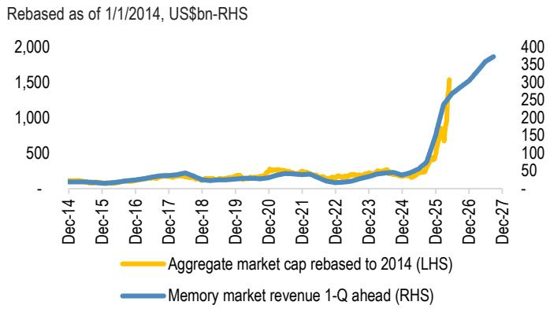

line

| Date    | Aggregate market cap rebased to 2014 (LHS) | Memory market revenue 1-Q ahead (RHS) |
|---------|---------------------------------------------|----------------------------------------|
| Dec-14  | ~100                                        | ~10                                    |
| Dec-15  | ~150                                        | ~15                                    |
| Dec-16  | ~200                                        | ~20                                    |
| Dec-17  | ~250                                        | ~25                                    |
| Dec-18  | ~300                                        | ~30                                    |
| Dec-19  | ~350                                        | ~35                                    |
| Dec-20  | ~400                                        | ~40                                    |
| Dec-21  | ~350                                        | ~35                                    |
| Dec-22  | ~300                                        | ~30                                    |
| Dec-23  | ~350                                        | ~35                                    |
| Dec-24  | ~400                                        | ~40                                    |
| Dec-25  | ~1,500                                      | ~1,50                                  |
| Dec-26  | ~2,000                                      | ~2,00                                  |
| Dec-27  | ~2,500                                      | ~2,50                                  |

Source: WSTS, OMDIA, Bloomberg Finance L.P., JPM estimates. Note: Market cap includes SEC, SK Hynix, Micron, Nanya Technology, Western Digital. Kioxia / SNDK added from 1Q25 and excluded WDC.

Figure 2: Memory TAM vs peak mkt cap/TAM analysis US\$bn, peak mkt cap/TAM (x)   
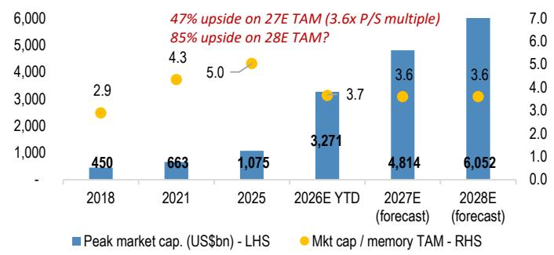

bar_line

| Year | Peak market cap. (US$bn) - LHS | Mkt cap / memory TAM - RHS |
| :--- | :--- | :--- |
| 2018 | 450 | 2.9 |
| 2021 | 663 | 4.3 |
| 2025 | 1,075 | 5.0 |
| 2026E YTD | 3,271 | 3.7 |
| 2027E (forecast) | 4,814 | 3.6 |
| 2028E (forecast) | 6,052 | 3.6 |
The chart also notes that 47% upside on 27E TAM (3.6x P/S multiple) and 85% upside on 28E TAM? The data points are annotated with percentages (47% and 85%) indicating relative multiples or changes between the two metrics.

Source: Bloomberg Finance L.P., WSTS, Company data, JPM estimates. Note: only considered SEC, SKH, and MU market cap.

Figure 3: Memory TAM vs peak mkt cap/memory OP analysis   
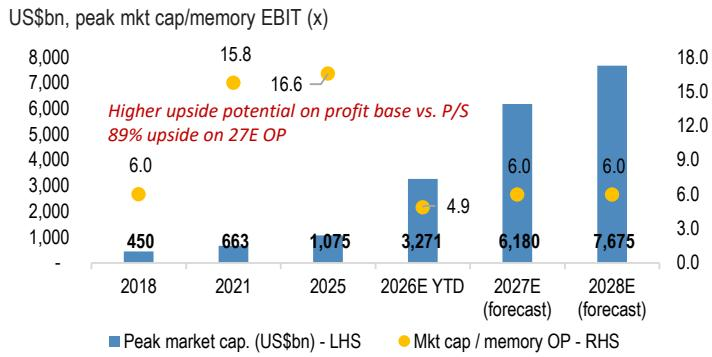

bar_line

| Year | Peak market cap. (US$bn) - LHS | Mkt cap / memory OP - RHS |
| :--- | :--- | :--- |
| 2018 | 450 | 6.0 |
| 2021 | 663 | 15.8 |
| 2025 | 1,075 | 16.6 |
| 2026E YTD | 3,271 | 4.9 |
| 2027E (forecast) | 6,180 | 6.0 |
| 2028E (forecast) | 7,675 | 6.0 |
Higher upside potential on profit base vs. P/S 89% upside on 27E OP

Source: Bloomberg Finance L.P., WSTS, Company data, JPM estimates. Note: only considered SEC, SKH, and MU market cap.

Figure 4: Memory TAM vs Memory OPM   
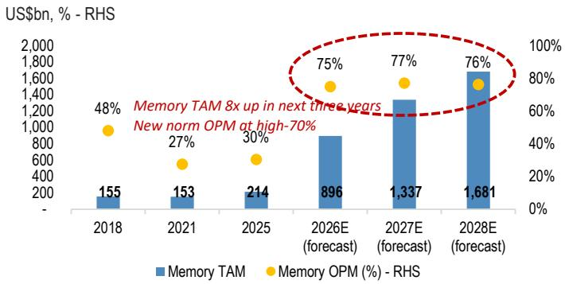

bar_line

| Year | Memory TAM (US$bn) | Memory OPM (%) |
| :--- | :--- | :--- |
| 2018 | 155 | 48 |
| 2021 | 153 | 27 |
| 2025 | 214 | 30 |
| 2026E (forecast) | 896 | 75 |
| 2027E (forecast) | 1,337 | 77 |
| 2028E (forecast) | 1,681 | 76 |
New norm OPM at high-70%

Source: Bloomberg Finance L.P., WSTS, Company data, JPM estimates. Note: only considered SEC, SKH, and MU market cap.

Figure 5: CSP capex and AI memory % share   
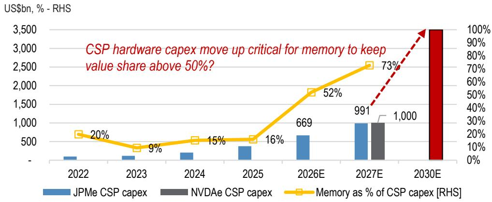

bar_line

| Year | JPMe CSP capex (US$bn) | NVDAe CSP capex (US$bn) | Memory as % of CSP capex (RHS) (%) |
| :--- | :--- | :--- | :--- |
| 2022 | 150 | - | 20 |
| 2023 | 160 | - | 9 |
| 2024 | 250 | - | 15 |
| 2025 | 400 | - | 16 |
| 2026E | 669 | - | 52 |
| 2027E | 991 | 1000 | 73 |
| 2030E | - | - | - |
CSP hardware capex move up critical for memory to keep value share above 50?

Source: Company data, Bloomberg Finance L.P., JPM estimates.

Table 1: Market cap changes across AI ecosystem partners   
US\$bn, % 

<table><tr><td>US$bn</td><td>Top 4 CSP</td><td>AI semi</td><td>Foundry</td><td>Memory</td><td>AI ecosystem mkt cap.</td><td>SOX</td><td>NASDAQ index</td><td>DOW Jones index</td></tr><tr><td>1Q24</td><td>8,122</td><td>3,226</td><td>632</td><td>595</td><td>12,575</td><td>5,795</td><td>39,807</td><td>5,254</td></tr><tr><td>2Q24</td><td>8,871</td><td>4,109</td><td>772</td><td>623</td><td>14,376</td><td>6,991</td><td>39,119</td><td>5,460</td></tr><tr><td>3Q24</td><td>8,652</td><td>4,113</td><td>784</td><td>491</td><td>14,039</td><td>6,900</td><td>42,330</td><td>5,762</td></tr><tr><td>4Q24</td><td>9,243</td><td>4,667</td><td>850</td><td>395</td><td>15,156</td><td>7,306</td><td>42,544</td><td>5,882</td></tr><tr><td>1Q25</td><td>8,162</td><td>3,651</td><td>711</td><td>423</td><td>12,947</td><td>6,040</td><td>42,002</td><td>5,612</td></tr><tr><td>2Q25</td><td>10,027</td><td>5,448</td><td>940</td><td>557</td><td>16,972</td><td>8,481</td><td>44,095</td><td>6,205</td></tr><tr><td>3Q25</td><td>10,979</td><td>6,427</td><td>1,111</td><td>721</td><td>19,238</td><td>10,022</td><td>46,398</td><td>6,688</td></tr><tr><td>4Q25</td><td>11,508</td><td>6,594</td><td>1,280</td><td>1,145</td><td>20,526</td><td>10,608</td><td>48,063</td><td>6,846</td></tr><tr><td>1Q26</td><td>9,907</td><td>6,122</td><td>1,424</td><td>1,411</td><td>18,863</td><td>10,738</td><td>46,342</td><td>6,529</td></tr><tr><td>2Q26YTD</td><td>12,435</td><td>8,233</td><td>1,948</td><td>3,369</td><td>25,986</td><td>15,469</td><td>50,669</td><td>7,564</td></tr></table>

% chaqnes 

<table><tr><td>2Q24</td><td>9%</td><td>27%</td><td>22%</td><td>5%</td><td>14%</td><td>21%</td><td>-2%</td><td>4%</td></tr><tr><td>3Q24</td><td>-2%</td><td>0%</td><td>1%</td><td>-21%</td><td>-2%</td><td>-1%</td><td>8%</td><td>6%</td></tr><tr><td>4Q24</td><td>7%</td><td>13%</td><td>8%</td><td>-19%</td><td>8%</td><td>6%</td><td>1%</td><td>2%</td></tr><tr><td>1Q25</td><td>-12%</td><td>-22%</td><td>-16%</td><td>7%</td><td>-15%</td><td>-17%</td><td>-1%</td><td>-5%</td></tr><tr><td>2Q25</td><td>23%</td><td>49%</td><td>32%</td><td>31%</td><td>31%</td><td>40%</td><td>5%</td><td>11%</td></tr><tr><td>3Q25</td><td>9%</td><td>18%</td><td>18%</td><td>30%</td><td>13%</td><td>18%</td><td>5%</td><td>8%</td></tr><tr><td>4Q25</td><td>5%</td><td>3%</td><td>15%</td><td>59%</td><td>7%</td><td>6%</td><td>4%</td><td>2%</td></tr><tr><td>1Q26</td><td>-14%</td><td>-7%</td><td>11%</td><td>23%</td><td>-8%</td><td>1%</td><td>-4%</td><td>-5%</td></tr><tr><td>2Q26YTD</td><td>26%</td><td>34%</td><td>37%</td><td>139%</td><td>38%</td><td>44%</td><td>9%</td><td>16%</td></tr></table>

mkt cap. mix within the AI ecosystem 

<table><tr><td>1Q24</td><td>65%</td><td>26%</td><td>5%</td><td>5%</td><td>100%</td><td rowspan="4"></td></tr><tr><td>2Q24</td><td>62%</td><td>29%</td><td>5%</td><td>4%</td><td>100%</td></tr><tr><td>3Q24</td><td>62%</td><td>29%</td><td>6%</td><td>3%</td><td>100%</td></tr><tr><td>4Q24</td><td>61%</td><td>31%</td><td>6%</td><td>3%</td><td>100%</td></tr><tr><td>1Q25</td><td>63%</td><td>28%</td><td>5%</td><td>3%</td><td>100%</td><td rowspan="4"></td></tr><tr><td>2Q25</td><td>59%</td><td>32%</td><td>6%</td><td>3%</td><td>100%</td></tr><tr><td>3Q25</td><td>57%</td><td>33%</td><td>6%</td><td>4%</td><td>100%</td></tr><tr><td>4Q25</td><td>56%</td><td>32%</td><td>6%</td><td>6%</td><td>100%</td></tr><tr><td>1Q26</td><td>53%</td><td>32%</td><td>8%</td><td>7%</td><td>100%</td><td rowspan="2"></td></tr><tr><td>2Q26YTD</td><td>48%</td><td>32%</td><td>7%</td><td>13%</td><td>100%</td></tr></table>

Source: Bloomberg Finance L.P., Note: 1) Top 4 CSP includes GOOG/MSFT/AMZN/META;; 2) AI semi includes NVDA/AMD/AVGO/MRVL; 3) Foundry includes TSMC; 4) Memory includes SKH/MU/SEC; 5) NASDAQ and DJIS in index vs others in absolute market cap; 6) Market cap. based on qtr-end; 7) colors indicate % performance rank within the qtr.

Table 2: OPM comparison across AI ecosystem partners   
% 

<table><tr><td>OPM comparison</td><td>2022</td><td>2023</td><td>2024</td><td>2025</td><td>2026E</td><td>2027E</td><td>2028E</td></tr><tr><td>CSP Cloud</td><td>29%</td><td>29%</td><td>35%</td><td>36%</td><td>37%</td><td>38%</td><td>39%</td></tr><tr><td>AI Semi</td><td>39%</td><td>49%</td><td>57%</td><td>57%</td><td>63%</td><td>64%</td><td>63%</td></tr><tr><td>Memory</td><td>23%</td><td>-30%</td><td>26%</td><td>36%</td><td>76%</td><td>75%</td><td>72%</td></tr><tr><td>Foundry</td><td>46%</td><td>40%</td><td>42%</td><td>49%</td><td>56%</td><td>55%</td><td>56%</td></tr></table>

Source: Company data, JPM estimates, Bloomberg Finance L.P. \*note: Memory OPM includes both DRAM and NAND.

Figure 6: DRAM bit demand vs bit supply   
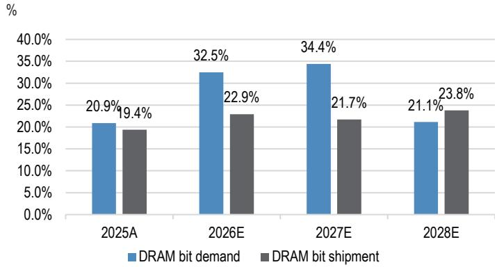

bar

| Year | DRAM bit demand (%) | DRAM bit shipment (%) |
| :--- | :--- | :--- |
| 2025A | 20.9 | 19.4 |
| 2026E | 32.5 | 22.9 |
| 2027E | 34.4 | 21.7 |
| 2028E | 21.1 | 23.8 |

Source: JPM estimates.

Figure 7: NAND bit demand vs bit supply   
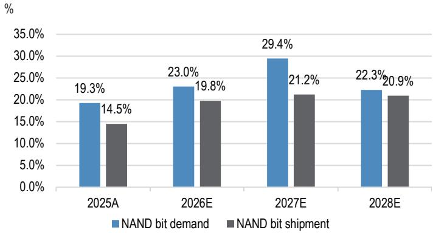

bar

| Year | NAND bit demand (%) | NAND bit shipment (%) |
| :--- | :--- | :--- |
| 2025A | 19.3 | 14.5 |
| 2026E | 23.0 | 19.8 |
| 2027E | 29.4 | 21.2 |
| 2028E | 22.3 | 20.9 |

Source: JPM estimates.

Figure 8: DRAM bit demand vs bit consumption vs bit supply in absolute terms   
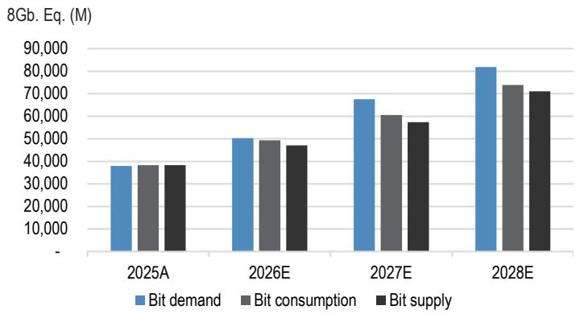

bar

| Year | Bit demand (M) | Bit consumption (M) | Bit supply (M) |
| :--- | :--- | :--- | :--- |
| 2025A | 37,000 | 38,000 | 38,000 |
| 2026E | 50,000 | 49,000 | 46,000 |
| 2027E | 67,000 | 61,000 | 57,000 |
| 2028E | 81,000 | 73,000 | 71,000 |

Source: JPM estimates.

Figure 10: DRAM capex and Y/Y trend   
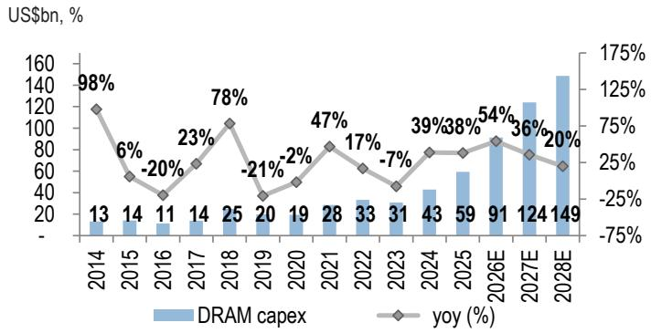

bar_line

| Year | DRAM capex (US$bn) | yoy (%) |
| :--- | :--- | :--- |
| 2014 | 13 | 98 |
| 2015 | 14 | 6 |
| 2016 | 11 | -20 |
| 2017 | 14 | 23 |
| 2018 | 25 | 78 |
| 2019 | 20 | -21 |
| 2020 | 19 | -2 |
| 2021 | 28 | 47 |
| 2022 | 33 | 17 |
| 2023 | 31 | -7 |
| 2024 | 43 | 39 |
| 2025 | 59 | 38 |
| 2026E | 91 | 54 |
| 2027E | 124 | 36 |
| 2028E | 149 | 20 |

Source: Company data, JPM estimates.

Figure 12: NAND capex and Y/Y trend   
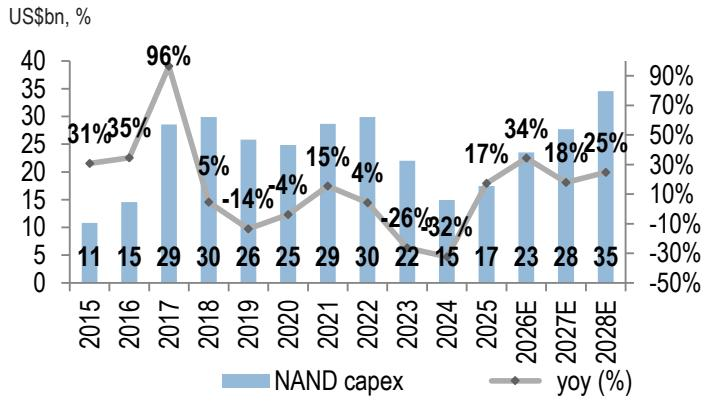

bar_line

| Year | NAND capex (US$bn) | yoy (%) |
| :--- | :--- | :--- |
| 2015 | 11 | 31 |
| 2016 | 15 | 35 |
| 2017 | 29 | 96 |
| 2018 | 30 | -5 |
| 2019 | 26 | -14 |
| 2020 | 25 | -4 |
| 2021 | 29 | 15 |
| 2022 | 30 | 4 |
| 2023 | 22 | -26 |
| 2024 | 15 | -32 |
| 2025 | 17 | 17 |
| 2026E | 23 | 34 |
| 2027E | 28 | 18 |
| 2028E | 35 | 25 |

Source: Company data, JPM estimates.

Figure 9: NAND bit demand vs bit consumption vs bit supply in absolute terms   
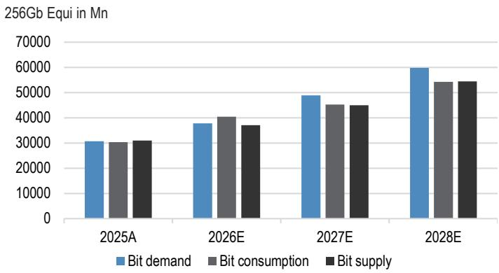

bar

256Gb Equi in Mn
| Year | Bit demand (Mb) | Bit consumption (Mb) | Bit supply (Mb) |
| :--- | :--- | :--- | :--- |
| 2025A | 30500 | 30000 | 31000 |
| 2026E | 37500 | 40500 | 37000 |
| 2027E | 48500 | 45000 | 45000 |
| 2028E | 60000 | 54500 | 54500 |

Source: JPM estimates.

Figure 11: DRAM capital intensity   
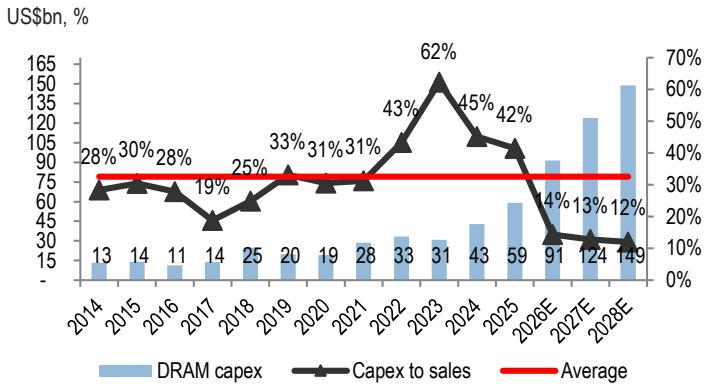  
Source: Company data, JPM estimates.

Figure 13: NAND capital intensity   
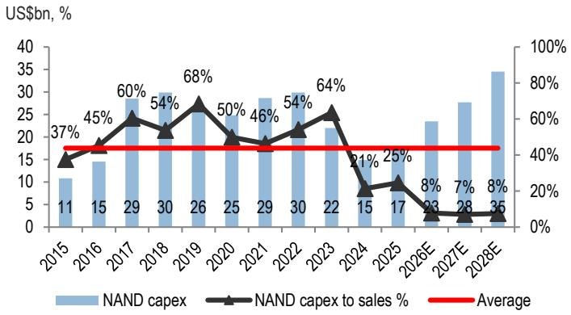

bar_line

| Year | NAND capex (US$bn) | NAND capex to sales (%) |
| :--- | :--- | :--- |
| 2015 | 11 | 37 |
| 2016 | 15 | 45 |
| 2017 | 29 | 60 |
| 2018 | 30 | 54 |
| 2019 | 26 | 68 |
| 2020 | 25 | 50 |
| 2021 | 29 | 46 |
| 2022 | 30 | 54 |
| 2023 | 22 | 64 |
| 2024 | 15 | 21 |
| 2025E | 17 | 25 |
| 2026E | 23 | 8 |
| 2027E | 28 | 7 |
| 2028E | 35 | 8 |
Average: NAND capex to sales %; Average: NAND capex to sales %.

Source: Company data, JPM estimates. Note: Average from 2011-25.

Figure 14: DRAM ASP Y/Y% change vs previous assumptions   
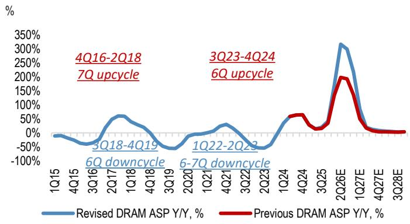

line

| Quarter | Revised DRAM ASP Y/Y, % | Previous DRAM ASP Y/Y, % |
|---------|--------------------------|---------------------------|
| 4Q16-2Q18 | - | - |
| 3Q23-4Q24 | - | - |
| 6Q upcycle | - | - |
| 6Q downcycle | - | - |
| 3Q18-4Q19 | - | - |
| 1Q22-2Q23 | - | - |
| 2Q26E | - | - |
| 1Q27E | - | - |
| 4Q27E | - | - |
| 3Q28E | - | - |

Source: WSTS, JPM estimates.

Figure 15: NAND ASP Y/Y% change vs previous assumptions   
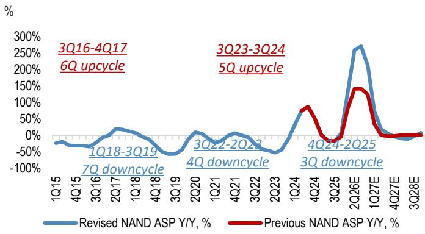

line

| Quarter | Revised NAND ASP Y/Y, % | Previous NAND ASP Y/Y, % |
|---------|--------------------------|---------------------------|
| 3Q16-4Q17 | - | - |
| 6Q upcycle | - | - |
| 3Q23-3Q24 | - | - |
| 4Q downcycle | - | - |
| 3Q22-2Q23 | - | - |
| 4Q24-2Q25 | - | - |
| 3Q downcycle | - | - |

Source: Gartner®, JPM estimates.

Figure 16: Memory Semiconductor cycle scenario analysis

# Memory Semiconductor cycle scenario

# Bull cycle (probability = 25%)

■ LLM foundation model: parameter expansion continues to expand a fast pace, sharp model transition acceleration into physical/world AI   
■ Memory consumption architecture: limited software stack improvement, hardware intensity remains at elevated level in every new computing architecture   
CSP hardware spending: token consumption curve remains exponential followed by sharp AI agent monetization enabling strong capex increase   
■ Consumer demand: resilient demand support after near-term unit sales correction, edge AI demand picks up amidst component cost inflation   
■ Multi-year supply agreement: suppliers and customers able to justify spending to each other with high investment and order visibility   
■ WFE spending and competition: aggressive infrastructure capex but reasonable equipment spending and China fails to scale-up/out due to restriction   
■ New technology development: customers actively deploying new form-factors (HBF, LLW, and others) and wafer-to-die penalty ratio sharply worsens

# Base case cycle (probability = 60%)

■ LLM foundation model: parameter continues at moderate pace, gradual model transition acceleration into physical/world AI   
■ Memory consumption architecture: continued memory intensity albeit software stack improvement, hardware intensity continues to grow in new architecture   
CSP hardware spending: token consumption curve remains robust and moderate AI agent monetization enabling stable capex increase   
■ Consumer demand: mid/low-end segment continues to shrink gradually after near-term correction, edge AI demand slowly progressing   
■ Multi-year supply agreement: suppliers and customers reach to consensus on investment scale with certain bindings and reasonable order visibility   
■ WFE spending and competition: aggressive infrastructure capex and ongoing equipment spending and China continues to face scale-up/out challenges   
■ New technology development: customers selectively adopt new form-factors and wafer-to-die penalty ratio gradually worsens

# Bear case cycle (probability = 15%)

■ LLM foundation model: parameter expansion takes a pause, slow model transition acceleration into physical/world AI at fast pace, and rising funding concerns   
■ Memory consumption architecture: software stack breakthrough, hardware intensity flattens due to BOM cost pressure in new architecture   
CSP hardware spending: token consumption curve remains linear and slow AI agent monetization translating into muted capex spending   
■ Consumer demand: demand destruction across all segments and edge AI project delayed by multiple years   
■ Multi-year supply agreement: suppliers and customers fail to comply to agreement with limited order visibility and surplus capacity turns into over-supply   
■ WFE spending and competition: aggressive infrastructure and equipment capex and China shows meaningful pickup in bit/wafer productivity and product quality   
■ New technology development: customers lose appetite to try new form-factors and wafer-to-die penalty concern dissipates

Source: JPM estimates.

# CPU: Pouring more demand

Following the GPU-dense AI narrative, the biggest surprise in 1Q26 earnings was the CPU demand upside serving as the orchestration layer and the critical control plane for AGI: 1) NVDA guided to US\$20bn standalone Vera CPU sales in 2026 (note); 2) AMD revised up the server CPU TAM to grow 35%+ per annum to \$120bn by 2030 (vs prev.: 18%) (note); 3) INTC guided the CPU:GPU ratio moving from \~1:8 to 1:4 and hinted eventual parity thanks to the increasing compute requirements of agentic AI (note).

From a memory industry perspective, we believe a few positive developments that stand out are: 1) added memory demand driver from NVDA entering the CPU market where our team estimates 600K/3M Vera CPU unit in 26/27E (report); 2) strong upside to AI server bit demand not only from increased AI server racks but also growing CPU:GPU ratio especially in ASIC server racks. Overall, we raise server bit demand assumption by 5%-22% through 26E-28E and emphasize that 60%+ of the upward revision in 27-28E originates from AI server (AI headnode + AI standalone CPU) demand upside. We estimate AI server bit demand (AI headnode + AI CPU, excluding HBM) accounts for \~30%+ of total DRAM bit demand in 27-28E (vs previously : 14%).

Figure 17: Server bit demand forecast changes   
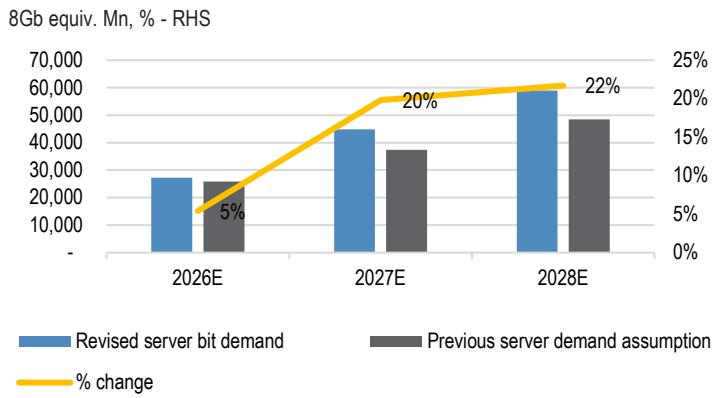

bar_line

8Gb equiv. Mn, % - RHS
| Year | Revised server bit demand (Mn) | Previous server demand assumption (Mn) | % change (%) |
| :--- | :--- | :--- | :--- |
| 2026E | 27,000 | 25,000 | 5 |
| 2027E | 45,000 | 37,000 | 20 |
| 2028E | 59,000 | 48,000 | 22 |

Source: JPM estimates.

Figure 18: AI server bit demand contribution changes   
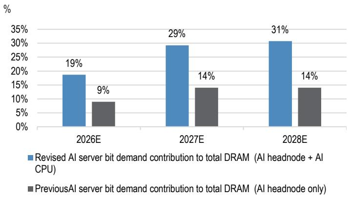

bar

| Year | Revised AI server bit demand contribution to total DRAM (AI headnode + AI CPU) (%) | Previous AI server bit demand contribution to total DRAM (AI headnode only) (%) |
| :--- | :--- | :--- |
| 2026E | 19 | 9 |
| 2027E | 29 | 14 |
| 2028E | 31 | 14 |

Source: Company data, JPM estimates.

# Calibrating the demand upside from standalone Vera CPU

Based on our supply-chain checks, we believe the Vera CPU comes in two memory configurations (768GB content based on 4 modules of 192GB SOCAMM2 and 1.5TB content based on 8 modules of 192GB SOCAMM2). Since a typical two-socket server carries \~1.5TB of memory content (or \~754GB of memory content per CPU), we take the low-end of the content configuration and assume the incremental demand from AI CPUs to reach 461M / 2.3bn GB of bit demand in 26E/27E (1%/3% of total memory demand in 26/27E) based on 600K/3M Vera CPU units in 26/27E. Albeit the contribution looks miniscule from a total contribution perspective, we envision the advent of AGI will create a strong demand tailwind for CPU and eventually for memory amidst multiple other fabless companies entering this market including ARM's AGI CPU (report) and QCOM's ARM-based server CPU (report). Nevertheless, the basis of our cautious AI CPU demand assumption comes from: 1) limitations of CoWoS-R capacity that may potentially cap Vera CPU production in the near-term; 2) more evidence of AI CPU production from other players like QCOM/ARM in the supplychain; and 3) limited memory capacity to fulfill overwhelming demand.

Table 3: AI standalone CPU bit demand and % contribution to server/DRAM TAM   
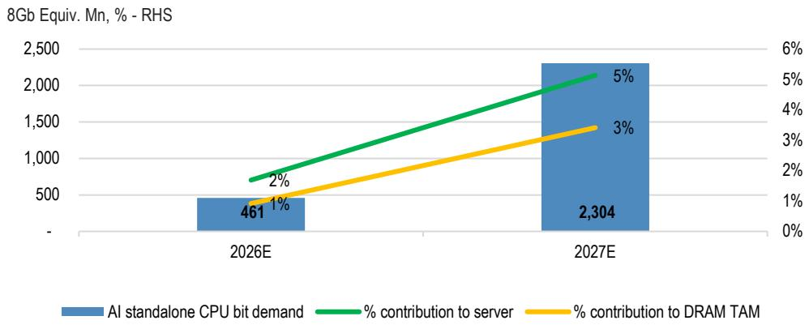

bar_line

8Gb Equiv. Mn, % - RHS
| Year | AI standalone CPU bit demand (Mn) | % contribution to server (%) | % contribution to DRAM TAM (%) |
| :--- | :--- | :--- | :--- |
| 2026E | 461 | 2 | 1 |
| 2027E | 2,304 | 5 | 3 |

Source: JPM estimates.

# Memory density map for CPU and server

To simplify, the memory capacity for a CPU is calculated by multiplying the number of channels \* DIMM per channel \* capacity per DIMM. Depending on the CPU slot configuration by server (either one, two, or four sockets per server), the system memory capacity is derived by multiplying 1x - 4x to the memory capacity per CPU. For instance, the memory capacity for a CPU carrying 12 memory channels, 2 DPC (DIMM Per Channel), and 64GB DIMM would be 1.5TB (12 \* 2 \* 64). Then, if the server rack carries a two socket specification (two physical slots to install two independent CPU chips onto a single motherboard), the memory capacity per server system would be 3TB (1.5TB \* 2).

Based on Gartner® data, total server CPU unit TAM reached 23M in 25A with two sockets per server configuration accounting for \~80%, translating to roughly 1.85 CPU sockets per server.

Figure 19: Server CPU unit TAM   
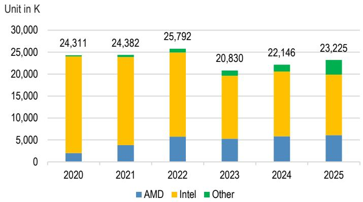

bar_stacked

| Year | AMD (K) | Intel (K) | Other (K) |
| :--- | :--- | :--- | :--- |
| 2020 | 1800 | 19,311 | 100 |
| 2021 | 4000 | 17,382 | 100 |
| 2022 | 6000 | 18,792 | 150 |
| 2023 | 5500 | 11,830 | 150 |
| 2024 | 6000 | 13,146 | 150 |
| 2025 | 6000 | 13,225 | 350 |

Source: Gartner®

Figure 20: Server CPU market share   
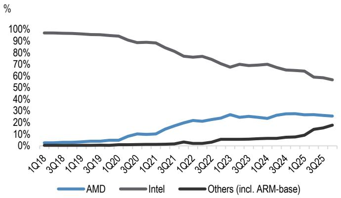

line

| Quarter | AMD  | Intel | Others (incl. ARM-base) |
|---------|------|-------|--------------------------|
| 1Q18    | 2%   | 98%   | 2%                       |
| 3Q18    | 3%   | 97%   | 2%                       |
| 1Q19    | 4%   | 96%   | 2%                       |
| 3Q19    | 5%   | 95%   | 2%                       |
| 1Q20    | 6%   | 94%   | 2%                       |
| 3Q20    | 8%   | 92%   | 2%                       |
| 1Q21    | 10%  | 90%   | 2%                       |
| 3Q21    | 15%  | 85%   | 3%                       |
| 1Q22    | 20%  | 80%   | 4%                       |
| 3Q22    | 25%  | 75%   | 5%                       |
| 1Q23    | 28%  | 70%   | 6%                       |
| 3Q23    | 26%  | 68%   | 6%                       |
| 1Q24    | 24%  | 66%   | 7%                       |
| 3Q24    | 27%  | 64%   | 8%                       |
| 1Q25    | 26%  | 62%   | 9%                       |
| 3Q25    | 25%  | 60%   | 15%                      |

Source: Gartner®

Figure 21: Server CPU configuration   
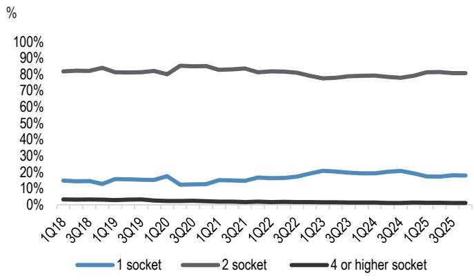

line

| Quarter | 1 socket | 2 socket | 4 or higher socket |
| ------- | -------- | -------- | ------------------- |
| 1Q18    | 15%      | 80%      | 2%                  |
| 3Q18    | 15%      | 80%      | 2%                  |
| 1Q19    | 15%      | 80%      | 2%                  |
| 3Q19    | 15%      | 80%      | 2%                  |
| 1Q20    | 15%      | 80%      | 2%                  |
| 3Q20    | 15%      | 80%      | 2%                  |
| 1Q21    | 15%      | 80%      | 2%                  |
| 3Q21    | 15%      | 80%      | 2%                  |
| 1Q22    | 15%      | 80%      | 2%                  |
| 3Q22    | 15%      | 80%      | 2%                  |
| 1Q23    | 15%      | 80%      | 2%                  |
| 3Q23    | 15%      | 80%      | 2%                  |
| 1Q24    | 15%      | 80%      | 2%                  |
| 3Q24    | 15%      | 80%      | 2%                  |
| 1Q25    | 15%      | 80%      | 2%                  |
| 3Q25    | 15%      | 80%      | 2%                  |

Source: Gartner®

Figure 22: CPU per server trend   
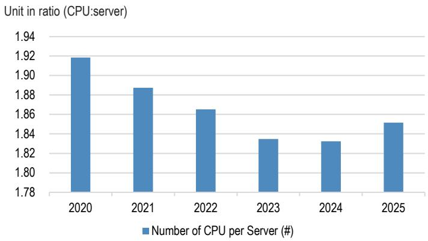

bar

| Year | Number of CPU per Server (#) |
| :--- | :--- |
| 2020 | 1.92 |
| 2021 | 1.89 |
| 2022 | 1.87 |
| 2023 | 1.84 |
| 2024 | 1.83 |
| 2025 | 1.85 |

Source: Gartner®

# Implications for memory from a narrowing GPU-to-CPU ratio

As the CPU plays a critical role in the orchestration layer for AGI, we expect a narrowing GPU-to-CPU ratio to present meaningful demand upside to memory (mainly for ASIC, in our view). Based on our bottom-up analysis, we forecast the GPU-to-CPU ratio to fall from $\sim5$ in 23A to $\sim2:1$ in 28E leading us to raise our CPU system memory content assumption. We expect this trend to be more notable in ASIC racks (more CPU density per rack per GPU) as NVDA racks are already adopting a 2:1 GPU-to-CPU ratio.

Figure 23: GPU to CPU assumption for AI headnode demand   
Unit in K, x 

<table><tr><td>Unit 000s</td><td>2025</td><td>2026E</td><td>2027E</td><td>2028E</td></tr><tr><td>GPU/ASIC</td><td>11,216</td><td>16,885</td><td>24,118</td><td>28,500</td></tr><tr><td>NVDA</td><td>6,200</td><td>8,920</td><td>9,900</td><td>10,750</td></tr><tr><td>AMD</td><td>675</td><td>550</td><td>978</td><td>1,100</td></tr><tr><td>ASIC/others</td><td>4,341</td><td>7,415</td><td>13,240</td><td>16,650</td></tr><tr><td>AI grade CPU</td><td>3,469</td><td>5,982</td><td>9,289</td><td>11,941</td></tr><tr><td>NVDA</td><td>2,720</td><td>4,186</td><td>4,394</td><td>5,314</td></tr><tr><td>AMD</td><td>169</td><td>138</td><td>245</td><td>275</td></tr><tr><td>ASIC/others</td><td>580</td><td>1,658</td><td>4,650</td><td>6,352</td></tr><tr><td>GPU to CPU (x)</td><td>3.2</td><td>2.8</td><td>2.6</td><td>2.4</td></tr><tr><td>NVDA</td><td>2.3</td><td>2.1</td><td>2.3</td><td>2.0</td></tr><tr><td>AMD</td><td>4.0</td><td>4.0</td><td>4.0</td><td>4.0</td></tr><tr><td>ASIC/others</td><td>7.5</td><td>4.5</td><td>2.8</td><td>2.6</td></tr></table>

Source: JPM estimates.

Figure 24: GPU to CPU assumption   
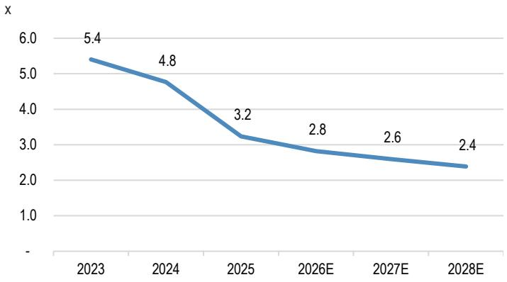

line

| Year | Value |
|---|---|
| 2023 | 5.4 |
| 2024 | 4.8 |
| 2025 | 3.2 |
| 2026E | 2.8 |
| 2027E | 2.6 |
| 2028E | 2.4 |

Source: JPM estimates.

# Memory density map for server CPU

Looking at server CPU specs for in-house custom silicons (i.e. AWS Graviton 5, MSFT Cobalt 100, and GOOG Axion), we noticed 1 DPC memory configuration (compared to 1-2 DPC configuration for others) which theoretically halves the memory content per CPU. Nevertheless, we expect higher CPU slots per server should more than offset the content shortfall per CPU (see the memory density map in Table 4 for more details). <where?>

Figure 25: Memory Density by Server Applications   
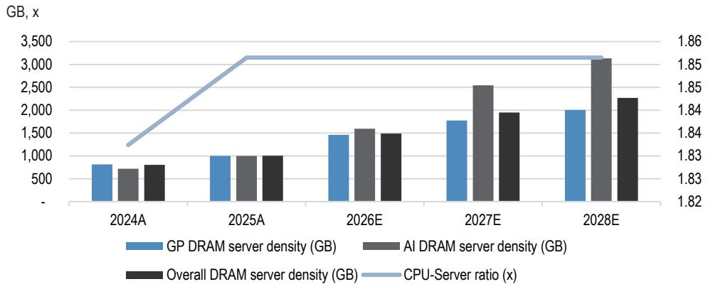

bar_line

| Year | GP DRAM server density (GB) | AI DRAM server density (GB) | Overall DRAM server density (GB) | CPU-Server ratio (x) |
| :--- | :--- | :--- | :--- | :--- |
| 2024A | 800 | 700 | 800 | 1.83 |
| 2025A | 1000 | 1000 | 1000 | 1.85 |
| 2026E | 1450 | 1600 | 1500 | 1.85 |
| 2027E | 1800 | 2550 | 1950 | 1.85 |
| 2028E | 2000 | 3150 | 2300 | 1.86 |

Source: Company data, JPM estimates.

Figure 26: Average DRAM capacity per CPU 

<table><tr><td rowspan="2">Average DRAM capacity per CPU(per one socket)</td><td colspan="5">Mainstream Server DIMM</td></tr><tr><td>32GB</td><td>64GB</td><td>96GB</td><td>128GB</td><td>256GB</td></tr><tr><td>Number of Channel = 8DIMM per CPU = 1</td><td>256</td><td>512</td><td>768</td><td>1,024</td><td>2,048</td></tr><tr><td>Number of Channel = 8DIMM per CPU = 2</td><td>512</td><td>1,024</td><td>1,536</td><td>2,048</td><td>4,096</td></tr><tr><td>Number of Channel = 12DIMM per CPU = 1</td><td>384</td><td>768</td><td>1,152</td><td>1,536</td><td>3,072</td></tr><tr><td>Number of Channel = 12DIMM per CPU = 2</td><td>768</td><td>1,536</td><td>2,304</td><td>3,072</td><td>6,144</td></tr></table>

Source: JPM estimates.

Figure 27: Average DRAM capacity per server 

<table><tr><td rowspan="2">Average DRAM capacity per server(1.85 socket per server)</td><td colspan="5">Mainstream Server DIMM</td></tr><tr><td>32GB</td><td>64GB</td><td>96GB</td><td>128GB</td><td>256GB</td></tr><tr><td>Number of Channel = 8DIMM per CPU = 1</td><td>474</td><td>948</td><td>1,422</td><td>1,896</td><td>3,792</td></tr><tr><td>Number of Channel = 8DIMM per CPU = 2</td><td>948</td><td>1,896</td><td>2,844</td><td>3,792</td><td>7,584</td></tr><tr><td>Number of Channel = 12DIMM per CPU = 1</td><td>711</td><td>1,422</td><td>2,133</td><td>2,844</td><td>5,688</td></tr><tr><td>Number of Channel = 12DIMM per CPU = 2</td><td>1,422</td><td>2,844</td><td>4,266</td><td>5,688</td><td>11,376</td></tr></table>

Source: JPM estimates. Note: Assume 1.85 CPU sockets per server

Table 4: Server CPU spec comparison 

<table><tr><td>Brand</td><td>Code</td><td>Architecture</td><td>Process node</td><td>Release</td><td>vCPUs</td><td>Memory density per socket</td><td># of memory channel support</td><td>DIMM per Channel</td><td>PCIE Gen</td></tr><tr><td>Intel</td><td>Ice Lake</td><td>x86</td><td>10nm</td><td>1H21</td><td>Up to 40 P-cores per socket</td><td>Up to 4TB per socket</td><td>Up to 8 channels of DDR4-3200</td><td></td><td>1-2 PCIE Gen 4 (Lane # = 64)</td></tr><tr><td>Intel</td><td>Sapphire Rapids</td><td>x86</td><td>10nm</td><td>1H23</td><td>Up to 64 P-cores per socket</td><td>Up to 4TB per socket</td><td>Up to 8 channels of DDR5-4800</td><td></td><td>1-2 PCIE Gen 5 (Lane # = 80)</td></tr><tr><td>Intel</td><td>Emerald Rapids</td><td>x86</td><td>7nm</td><td>2H23</td><td>Up to 64 P-cores per socket</td><td>Up to 4TB per socket</td><td>Up to 12 channels of DDR5-5600/6400</td><td></td><td>1-2 PCIE Gen 5 (Lane # = 80)</td></tr><tr><td>Intel</td><td>Sierra Forest</td><td>x86</td><td>3nm</td><td>1H24</td><td>Up to 288 E-cores per socket</td><td>Up to 1-2TB+ per socket</td><td>Up to 12 channels of DDR5-5600/6400</td><td></td><td>1-2 PCIE Gen 5 (Lane # = 136)</td></tr><tr><td>Intel</td><td>Granite Rapids</td><td>x86</td><td>3nm</td><td>2H24</td><td>Up to 128 P-cores per socket</td><td>Up to 3TB per socket or more</td><td>Up to 12 channels of DDR5-5200/6400</td><td></td><td>1-2 PCIE Gen 5 (Lane # = 136)</td></tr><tr><td>Intel</td><td>Clearwater Forest</td><td>x86</td><td>2nm</td><td>1H26</td><td>Up to 288 E-cores per socket</td><td>Up to 3TB per socket or more</td><td>Up to 12 channels of DDR5-8000</td><td></td><td>1-2 PCIE Gen 5 (Lane # = 96)</td></tr><tr><td>Intel</td><td>Diamond Rapids</td><td>x86</td><td>2nm</td><td>2H27</td><td>Up to 256-512 P-cores per socket</td><td>Up to 8TB per socket</td><td>Up to 16 channels of future DDR solutions</td><td></td><td>1-2 PCIE Gen 6 (Lane # = n/a)</td></tr><tr><td>Intel</td><td>Coral Rapids</td><td>x86</td><td>TBD</td><td>2H28</td><td>n/a</td><td>n/a</td><td>Up to 16 channels of future DDR solutions</td><td></td><td>n/a n/a</td></tr><tr><td>AMD</td><td>Milan</td><td>Zen 3</td><td>5nm</td><td>1H21</td><td>Up to 64 cores per socket</td><td>Up to 6TB per socket</td><td>Up to 12 channels per DDR4-xxxx</td><td></td><td>1-2 PCIE Gen 5 (Lane # = 128)</td></tr><tr><td>AMD</td><td>Genoa</td><td>Zen 4</td><td>5nm</td><td>2H22</td><td>Up to 96 cores per socket</td><td>Up to 6TB per socket</td><td>Up to 12 channels per DDR5-xxxx</td><td></td><td>1-2 PCIE Gen 5 (Lane # = 128)</td></tr><tr><td>AMD</td><td>Bergamo</td><td>Zen 4c</td><td>5nm</td><td>1H23</td><td>Up to 128 cores per socket</td><td>Up to 6TB per socket</td><td>Up to 12 channels of DDR5-4800</td><td></td><td>1-2 PCIE Gen 5 (Lane # = 128)</td></tr><tr><td>AMD</td><td>Siena</td><td>Zen 4c</td><td>5nm</td><td>2H23</td><td>Up to 64 cores per socket</td><td>Up to 1.15TB per socket</td><td>Up to 6 channels of DDR5-4800</td><td></td><td>1-2 PCIE Gen 5 (Lane # = 96)</td></tr><tr><td>AMD</td><td>Turin</td><td>Zen 5/5c</td><td>3nm/4nm</td><td>2H24</td><td>Up to 192 cores per socket</td><td>Up to 6TB per socket</td><td>Up to 12 channels of DDR5</td><td></td><td>1-2 PCIE Gen 5 (Lane # = 128)</td></tr><tr><td>AMD</td><td>Venice</td><td>Zen 6</td><td>2nm</td><td>2026</td><td>Up to 256 cores per socket</td><td>Up to 8TB per socket</td><td>Up to 16 channels of future DDR solutions</td><td></td><td>1-2 PCIE Gen 6 (Lane # = 128)</td></tr><tr><td>AMD</td><td>Verano</td><td>Zen 7</td><td>1.6nm</td><td>2027</td><td>n/a</td><td>n/a</td><td>Up to 8 channels of future DDR solutions or LPDDR5X SOCAMM2</td><td></td><td>n/a PCIE Gen 6 (Lane # = n/a)</td></tr><tr><td>NVDA</td><td>Grace</td><td>ARM v9</td><td>4nm</td><td>2024</td><td>Up to 72 core / socket</td><td>Up to 120GB-480GB per each CPU</td><td>Up to 32 channels</td><td></td><td>n/a PCIE Gen 5 (Lane # = 128)</td></tr><tr><td>NVDA</td><td>Vera</td><td>ARM v9.2</td><td>3nm</td><td>2026</td><td>Up to 88 core / socket</td><td>Up to 1.5TB</td><td>n/a</td><td></td><td>n/a PCIE Gen 6 (Lane # = 16)</td></tr><tr><td>AWS</td><td>Graviton 3</td><td>ARM v8.4</td><td>5nm</td><td>2022</td><td>Up to 64 core / socket</td><td>Up to 512 GiB on 64-core R7g</td><td>Up to 8 channels of DDR5-4800 memory</td><td></td><td>1-2 PCIE Gen 5 (Lane # = 64)</td></tr><tr><td>AWS</td><td>Graviton 4</td><td>ARM v9</td><td>5nm</td><td>2024</td><td>Up to 96 core / socket</td><td>Up to 3 TiB of RAM (= 3.2TB)</td><td>Up to 12 channels of DDR5-5600 memory</td><td></td><td>1-2 PCIE Gen 5 (Lane # = 96)</td></tr><tr><td>AWS</td><td>Graviton 5</td><td>ARM v9</td><td>3nm</td><td>2026</td><td>Up to 192 core / socket</td><td>Up to 3TB</td><td>Up to 12 channels of DDR5-7200, supporting future upgrade to 8800 MT/s</td><td></td><td>1 PCIE Gen 6 (Lane # = 96)</td></tr><tr><td>Ampere</td><td>Ampere One</td><td>ARM v9</td><td>5nm</td><td>2026</td><td>Up to 192 core / socket</td><td>Up to 4TB</td><td>Up to 8 channels of DDR5-5200</td><td></td><td>1 PCIE Gen 5 (Lane # = 128)</td></tr><tr><td>Ampere</td><td>Ampere One-M</td><td>ARM v9</td><td>5nm</td><td>2026</td><td>Up to 192 core / socket</td><td>Up to 1.5TB</td><td>Up to 12 channels of DDR5-5600</td><td></td><td>1 PCIE Gen 5 (Lane # = 96)</td></tr><tr><td>MSFT</td><td>Cobalt 100</td><td>ARM v9</td><td>5nm</td><td>2024</td><td>Up to 128 core / socket</td><td>Up to 672 GiB of RAM (=720GB)</td><td>Up to 12 channels of DDR5 memory support</td><td></td><td>1 PCIE Gen 5 (Lane # = 96)</td></tr><tr><td>Google</td><td>Axion</td><td>ARM v9</td><td>3nm</td><td>2025</td><td>Up to 72 core / socket</td><td>Up to 768GB</td><td>Up to 8 channels of DDR5 memory support</td><td></td><td>1 PCIE Gen 5 (Lane # = 96)</td></tr></table>

Source: Tech Powerup.

# Server bit demand sensitivity analysis based on content assumption changes

Given the multiple variants of CPU content per server rack, we have provided a bull-case sensitivity analysis assuming the below.

- Higher AI headnode-related CPU unit demand by lowering the GPU to CPU ratio to 2.7 and 2.3 in 26/27E (vs base case: 2.8 and 2.6);   
- Higher Vera CPU standalone production of 700K/3.5M in 26/27E (vs base case: 600K/3M);   
- Higher DRAM content per standalone vera CPU of 1.2TB/1.3TB (vs base case: 768GB in both years);   
- Accelerating GP server unit growth by 22%/20% y-y growth in 26/27E (vs base case: 20%/16% growth) and content growth acceleration to 50%/27% growth in 26/27E (vs base case: 46%/22%)

Assuming the above, we see 6%/20% server bit demand upside in 26/27E, and we believe the bull case demand assumptions are mostly feasible with the key bottleneck being memory supply which will ironically limit the total DRAM TAM. Historically, a mismatch in S/D dynamics impacted pricing in the event of memory shortage, but with memory margins reaching near 80%+, we expect memory makers to slow ASP hikes to soften demand destruction and seek LTA and higher demand/order visibility.

Table 5: Server bit demand sensitivity analysis 

<table><tr><td>Type</td><td>DRAM</td><td>2025</td><td>2026E</td><td>2027E</td><td>2026E (bull)</td><td>2027E (bull)</td></tr><tr><td rowspan="6">GP</td><td>DDR/LPDDR (mn GB)</td><td>10,567</td><td>18,469</td><td>26,023</td><td>19,292</td><td>29,277</td></tr><tr><td>Y-Y changes (%)</td><td>20%</td><td>75%</td><td>41%</td><td>83%</td><td>52%</td></tr><tr><td>Server (000s)</td><td>10,571</td><td>12,646</td><td>14,660</td><td>12,857</td><td>15,419</td></tr><tr><td>Y-Y changes (%)</td><td>-2%</td><td>20%</td><td>16%</td><td>22%</td><td>20%</td></tr><tr><td>Density (GB)</td><td>1,000</td><td>1,461</td><td>1,775</td><td>1,500</td><td>1,899</td></tr><tr><td>Y-Y changes (%)</td><td>23%</td><td>46%</td><td>22%</td><td>50%</td><td>27%</td></tr><tr><td rowspan="14">AI</td><td>AI headnode demand (mn GB)</td><td>1,713</td><td>4,644</td><td>10,809</td><td>4,999</td><td>12,953</td></tr><tr><td>Y-Y changes (%)</td><td></td><td>171%</td><td>133%</td><td>192%</td><td>159%</td></tr><tr><td>AI grade CPU (K)</td><td>3,469</td><td>5,982</td><td>9,289</td><td>6,317</td><td>10,502</td></tr><tr><td>Y-Y changes (%)</td><td></td><td>72%</td><td>55%</td><td>82%</td><td>66%</td></tr><tr><td>AI GPU/ASIC unit (K)</td><td>11,216</td><td>16,885</td><td>24,118</td><td>16,885</td><td>24,118</td></tr><tr><td>GPU to CPU (x)</td><td>3.2</td><td>2.8</td><td>2.6</td><td>2.7</td><td>2.3</td></tr><tr><td>DRAM content per AI CPU (GB)</td><td>494</td><td>776</td><td>1,164</td><td>791</td><td>1,233</td></tr><tr><td>Y-Y changes (%)</td><td></td><td>57%</td><td>50%</td><td>60%</td><td>56%</td></tr><tr><td>Standalone CPU demand (mn GB)</td><td></td><td>461</td><td>2,304</td><td>806</td><td>4,704</td></tr><tr><td>Y-Y changes (%)</td><td></td><td></td><td>400%</td><td>75%</td><td>483%</td></tr><tr><td>Vera CPU (K)</td><td></td><td>600</td><td>3,000</td><td>700</td><td>3,500</td></tr><tr><td>Y-Y changes (%)</td><td></td><td></td><td>400%</td><td></td><td>400%</td></tr><tr><td>DRAM content per AI CPU (GB)</td><td></td><td>768</td><td>768</td><td>1,152</td><td>1,344</td></tr><tr><td>Y-Y changes (%)</td><td></td><td></td><td>0%</td><td>50%</td><td>17%</td></tr><tr><td>Sum</td><td>Server total (mn GB)</td><td>12,280</td><td>23,574</td><td>39,136</td><td>25,097</td><td>46,934</td></tr><tr><td rowspan="2"></td><td>Y-Y changes (%)</td><td></td><td>92%</td><td>66%</td><td>104%</td><td>87%</td></tr><tr><td>Difference vs. base (%)</td><td></td><td></td><td></td><td>6%</td><td>20%</td></tr></table>

Source: JPM estimates.

# HBM update

# HBM S/D update: shortage continues to persist

Following the CoWoS model update (report), we update our HBM S-D view where key changes are: 1) stronger HBM ASP in 27E from resilient HBM3E/ASIC demand (especially from GOOG/AMZN); 2) downward revision to NVDA Rubin GPU forecast in 26E from HBM4 sourcing uncertainty offset by Blackwell GPU(GB300) unit upside while assuming higher Rubin volume mix in 27E; and 3) conservative HBM4E content assumption for Rubin Ultra (revised down from having only 1TB SKU to include both 12 Hi and 16 Hi). We raise HBM TAM by 17%-21% through 26-28E and expect HBM S-D to remain in a DD% shortage throughout 28E.

Figure 28: HBM S/D ratio (CoWoS adjusted)   
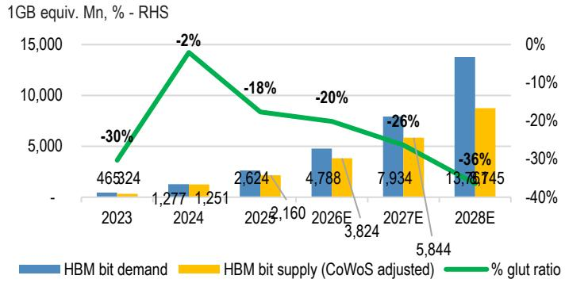

bar_line

| Year | HBM bit demand (1GB equiv. Mn) | HBM bit supply (CoWoS adjusted) (1GB equiv. Mn) | % glut ratio (%) |
| :--- | :--- | :--- | :--- |
| 2023 | 465324 | - | -30 |
| 2024 | 1,277 | 1,251 | -2 |
| 2025E | 2,624 | 2,160 | -18 |
| 2026E | 4,788 | 3,824 | -20 |
| 2027E | 7,934 | 5,844 | -26 |
| 2028E | 13,786 | 7,145 | -36 |

Source: Company data, JPM estimates.

Figure 29: Accumulated HBM bit surplus and glut ratio (weeks)   
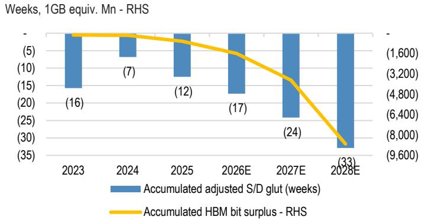

bar_line

Weeks, 1GB equiv. Mn - RHS
| Year | Accumulated adjusted S/D glut (weeks) | Accumulated HBM bit surplus - RHS |
| :--- | :--- | :--- |
| 2023 | (16) | (1,600) |
| 2024 | (7) | (1,600) |
| 2025 | (12) | (1,600) |
| 2026E | (17) | (3,200) |
| 2027E | (24) | (4,800) |
| 2028E | (33) | (8,000) |

Source: Company data, JPM estimates.

# HBM ASP

Contrary to our previous expectations of HBM3E ASP declining 2%/flat in FY26E/27E, respectively, the strong demand environment across both GPU and ASICs with the majority of the ASIC volumes adopting HBM3E by 27E, we expect HBM3E ASP to be flat/19% in FY26E/27E as tight HBM3E S-D creates a favorable market environment for memory makers. Consequently, we continue to see blended HBM ASP rising in 26E by mid-teens% aided by a 29% HBM4 pricing premium. Interestingly, despite some HBM capacity coming online in 2027, we expect blended HBM ASP to rise by a record 32% Y/Y driven by 19%/15% growth in HBM3E and HBM4 ASP, respectively, with HBM4E being priced at a 61% premium to HBM3E due to severe tightness in the supply chain. Overall, we foresee a tight HBM S-D market throughout 2028 and expect HBM TAM growth rate to accelerate in FY27E thanks to Rubin Ultra ramp as well as ASIC content upgrade to HBM3E from HBM.

Figure 30: HBM ASP and Y/Y% trend   
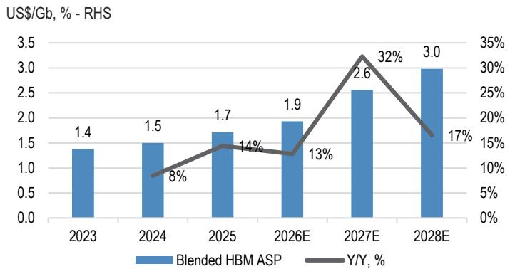

bar_line

| Year | Blended HBM ASP (US$/Gb, %) | Y/Y, % (%) |
| :--- | :--- | :--- |
| 2023 | 1.4 | |
| 2024 | 1.5 | 8 |
| 2025 | 1.7 | 14 |
| 2026E | 1.9 | 13 |
| 2027E | 2.6 | 32 |
| 2028E | 3.0 | 17 |

Source: Company data, JPM estimates.

Figure 31: HBM sales mix by product category   
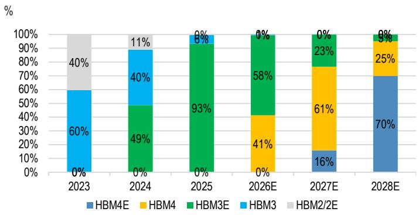

bar_stacked

| Year | HBM4E (%) | HBM4 (%) | HBM3E (%) | HBM3 (%) | HBM2/2E (%) |
|---|---|---|---|---|---|
| 2023 | 0 | 0 | 60 | 0 | 40 |
| 2024 | 0 | 0 | 49 | 0 | 11 |
| 2025 | 0 | 0 | 93 | 0 | 8 |
| 2026E | 0 | 41 | 58 | 0 | 0 |
| 2027E | 16 | 61 | 23 | 0 | 0 |
| 2028E | 70 | 25 | 9 | 0 | 0 |

Source: Company data, JPM estimates.

# HBM wallet share update

We tick up Samsung HBM4 market share within NVDA to high-teens% in 26E (HBM4 related wallet share to be higher of \~31%) to reflect the current HBM4 qualification progress where we believe Samsung is ahead vs competitors. We attribute the strength to SEC's 1cmn mono-die (SKH/MU relies on 1bnm) and SF's 4nm base die, and gradually improving back-end yield. On the ASIC front, we expect the share trend to remain broadly unchanged with minor share gains from MU given its aggressive HBM capacity expansion plans until 27E (US ID1 fab and Singapore packaging fab). The qualification of HBM4 has altered the wallet share dynamics, and we anticipate that the introduction of HBM4E will trigger a new wave of competition among memory suppliers, with companies likely to compete on factors such as pin speed, logic die sourcing, and yield performance.

As expected from the earnings conference, Samsung began shipping samples of 12-Hi 48GB HBM4E for qualification (link). We expect rack roll-out adopting HBM4E to be much later (JPMe: 2H27E) as SEC also gudies plans to expand the lineup including 8-Hi HBM4E (32GB) up to 16-Hi HBM4E (64GB). While the sample shipment does not indicate technology leadership, we see strong improvement in Samsung's HBM technology capability.

Figure 32: HBM wallet share within NVDA   
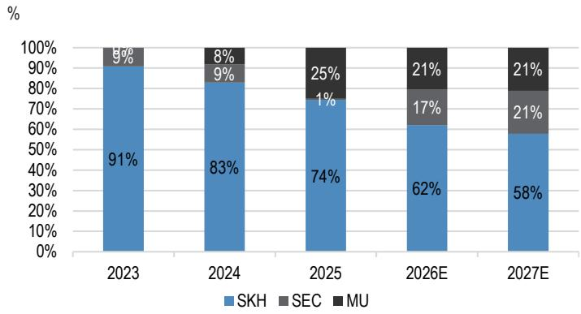

bar_stacked

| Year | SKH (%) | SEC (%) | MU (%) |
|---|---|---|---|
| 2023 | 91 | 9 | 0 |
| 2024 | 83 | 9 | 8 |
| 2025 | 74 | 1 | 25 |
| 2026E | 62 | 17 | 21 |
| 2027E | 58 | 21 | 21 |

Source: Company data, JPM estimates.

Figure 33: HBM wallet share within ASIC   
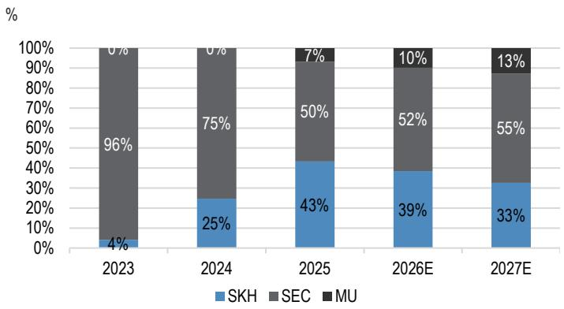

bar_stacked

| Year | SKH (%) | SEC (%) | MU (%) |
|---|---|---|---|
| 2023 | 4 | 96 | 0 |
| 2024 | 25 | 75 | 0 |
| 2025 | 43 | 50 | 7 |
| 2026E | 39 | 52 | 10 |
| 2027E | 33 | 55 | 13 |

Source: Company data, JPM estimates.

Figure 34: SEC - HBM sales mix by customers   
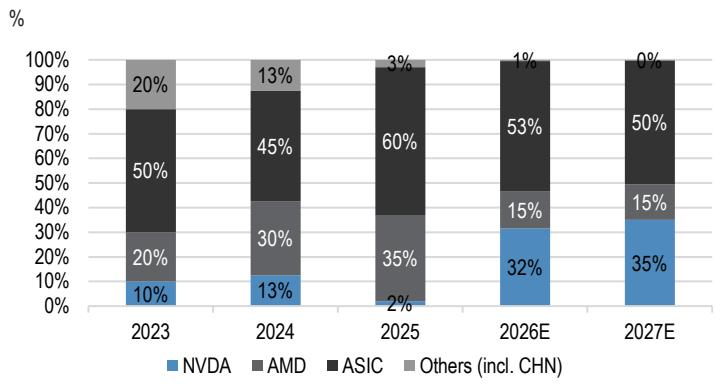

bar_stacked

| Year | NVDA (%) | AMD (%) | ASIC (%) | Others (incl. CHN) (%) |
| :--- | :--- | :--- | :--- | :--- |
| 2023 | 10 | 20 | 50 | 20 |
| 2024 | 13 | 30 | 45 | 13 |
| 2025 | 2 | 35 | 60 | 3 |
| 2026E | 32 | 15 | 53 | 1 |
| 2027E | 35 | 15 | 50 | 0 |

Source: Company data, JPM estimates.

Figure 35: SKH - HBM sales mix by customers   
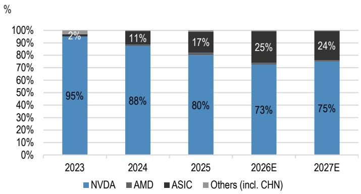

bar_stacked

| Year | NVDA (%) | AMD (%) | ASIC (%) | Others (incl. CHN) (%) |
| :--- | :--- | :--- | :--- | :--- |
| 2023 | 95 | 2 | 1 | 2 |
| 2024 | 88 | 11 | 0 | 0 |
| 2025 | 80 | 17 | 0 | 0 |
| 2026E | 73 | 25 | 0 | 0 |
| 2027E | 75 | 24 | 0 | 0 |

Source: Company data, JPM estimates.

Figure 36: HBM market share by sales   
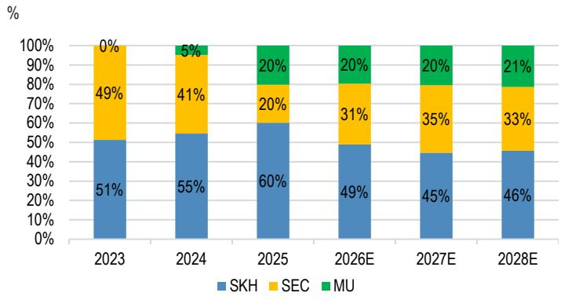

bar_stacked

| Year | SKH (%) | SEC (%) | MU (%) |
|---|---|---|---|
| 2023 | 51 | 49 | 0 |
| 2024 | 55 | 41 | 5 |
| 2025 | 60 | 20 | 20 |
| 2026E | 49 | 31 | 20 |
| 2027E | 45 | 35 | 20 |
| 2028E | 46 | 33 | 21 |

Source: Company data, JPM estimates.

Figure 37: HBM sales mix by major players   
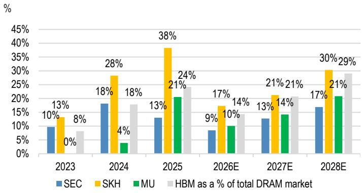

bar

| Year | SEC (%) | SKH (%) | MU (%) | HBM as a % of total DRAM market (%) |
| :--- | :--- | :--- | :--- | :--- |
| 2023 | 10 | 13 | 0 | 8 |
| 2024 | 18 | 28 | 4 | 18 |
| 2025 | 13 | 38 | 21 | 24 |
| 2026E | 9 | 17 | 10 | 14 |
| 2027E | 13 | 21 | 14 | 21 |
| 2028E | 17 | 30 | 21 | 29 |

Source: Company data, JPM estimates.

# HBM demand update

Key changes to GPU shipments include upward revisions to the Blackwell GPU shipments, slightly offset by a slower ramp of the Rubin GPU, leading NVIDIA's units to be revised up to 8.9M/9.9M in 26/27E (vs previously 7.5M/7.6M). Likewise, ASIC unit assumptions include revising up GOOG TPU unit assumptions to 4.5M/8M in 26/27E (vs previously 3.7M/5M) and AMZN Trainium volume to 1.9M/3.3M in 26/27E (vs previously 2.1M/2.6M), with ASIC volumes surpassing merchant GPU unit production by 27E. We expect TPUv8/Traninum 3 to adopt HBM3E given the limited HBM4 supply with the next generation projects such as TPUv9 and Traninum 4 adopting 288GB HBM4. As the majority of the ASIC volumes adopt HBM3E until 27E, we believe this would further squeeze HBM3E S-D creating a favorable market environment for memory makers to raise HBM3E prices. The magnitude of HBM3E price hikes will likely differ across memory makers given uneven contract terms, but we expect HBM3E prices to remain resilient throughout 27E vs previously falling in 26E.

Figure 38: HBM TAM and Y/Y% growth   
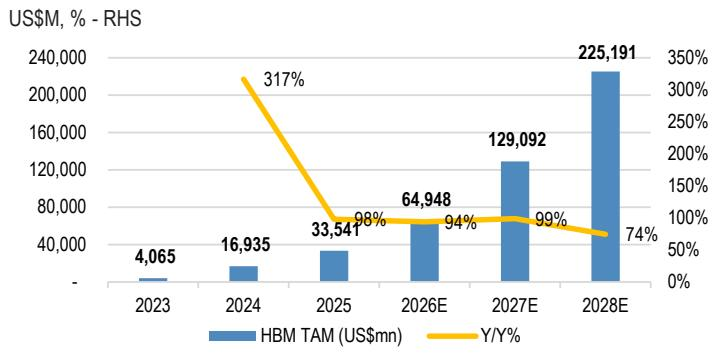

bar_line

| Year | HBM TAM (US$mn) | Y/Y (%) |
| :--- | :--- | :--- |
| 2023 | 4,065 | - |
| 2024 | 16,935 | 317 |
| 2025 | 33,541 | 98 |
| 2026E | 64,948 | 94 |
| 2027E | 129,092 | 99 |
| 2028E | 225,191 | 74 |

Source: Company data, JPM estimates.

Figure 39: HBM bit demand breakdown by customers   
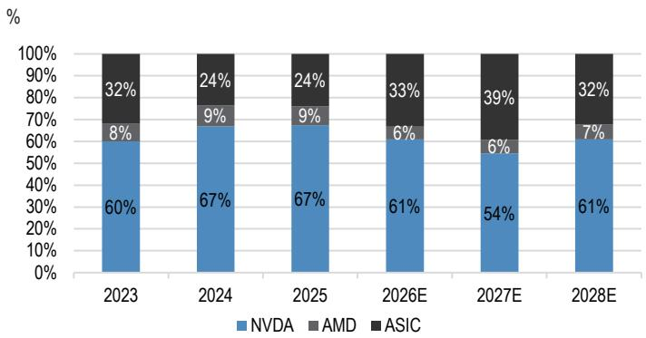

bar_stacked

| Year | NVDA (%) | AMD (%) | ASIC (%) |
| :--- | :--- | :--- | :--- |
| 2023 | 60 | 8 | 32 |
| 2024 | 67 | 9 | 24 |
| 2025 | 67 | 9 | 24 |
| 2026E | 61 | 6 | 33 |
| 2027E | 54 | 6 | 39 |
| 2028E | 61 | 7 | 32 |

Source: Company data, JPM estimates.

Figure 40: SEC - HBM sales mix by product application   
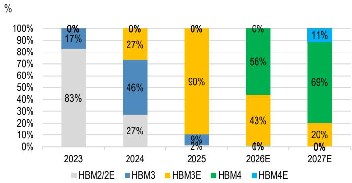

bar_stacked

| Year | HBM2/2E (%) | HBM3 (%) | HBM3E (%) | HBM4 (%) | HBM4E (%) |
| :--- | :--- | :--- | :--- | :--- | :--- |
| 2023 | 83 | 17 | 0 | 0 | 0 |
| 2024 | 27 | 46 | 27 | 0 | 0 |
| 2025 | 2 | 9 | 90 | 0 | 0 |
| 2026E | 0 | 0 | 43 | 56 | 0 |
| 2027E | 0 | 0 | 20 | 69 | 11 |

Source: Company data, JPM estimates.

Figure 41: SKH - HBM sales mix by product application   
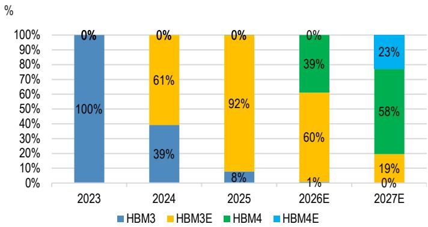

bar_stacked

| Year | HBM3 (%) | HBM3E (%) | HBM4 (%) | HBM4E (%) |
|---|---|---|---|---|
| 2023 | 100 | 0 | 0 | 0 |
| 2024 | 39 | 61 | 0 | 0 |
| 2025 | 8 | 92 | 0 | 0 |
| 2026E | 1 | 60 | 39 | 0 |
| 2027E | 0 | 19 | 58 | 23 |

Source: Company data, JPM estimates.

# AI in Memory

Figure 42: AI memory Y/Y trend   
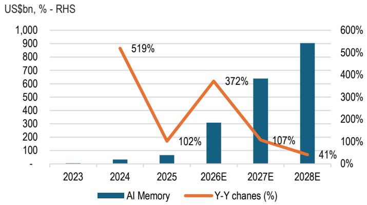

bar_line

| Year | AI Memory (US$bn) | Y-Y chanes (%) |
| :--- | :--- | :--- |
| 2023 | 15 | - |
| 2024 | 45 | 519 |
| 2025 | 75 | 102 |
| 2026E | 300 | 372 |
| 2027E | 635 | 107 |
| 2028E | 900 | 41 |

Source: Company reports and JPM estimates.

Figure 43: AI DRAM and NAND revenue trend   
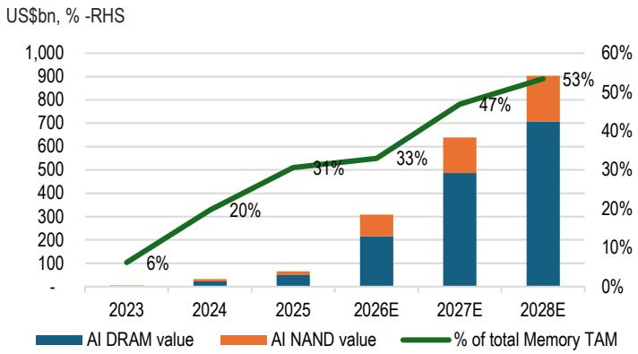

bar_line

| Year | AI DRAM value (US$bn) | AI NAND value (US$bn) | % of total Memory TAM (%) |
|---|---|---|---|
| 2023 | - | - | 6 |
| 2024 | 15 | 10 | 20 |
| 2025 | 40 | 15 | 31 |
| 2026E | 200 | 80 | 33 |
| 2027E | 480 | 120 | 47 |
| 2028E | 700 | 150 | 53 |

Source: Company reports and JPM estimates.

Figure 44: AI value within total DRAM & NAND TAM   
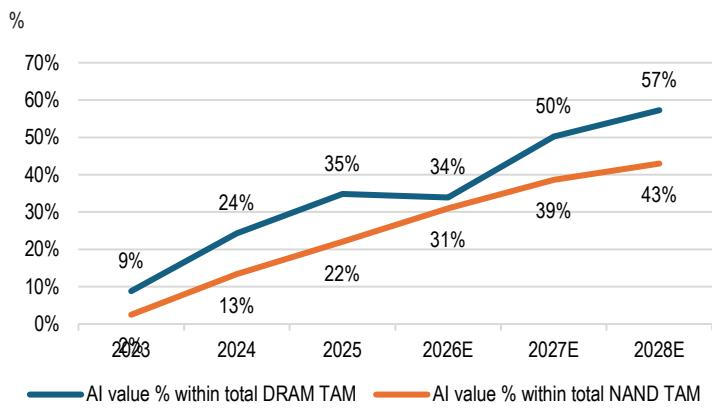

line

| Year | AI value % within total DRAM TAM (%) | AI value % within total NAND TAM (%) |
|---|---|---|
| 2023 | 9 | 2 |
| 2024 | 24 | 13 |
| 2025 | 35 | 22 |
| 2026E | 34 | 31 |
| 2027E | 50 | 39 |
| 2028E | 57 | 43 |

Source: Company reports and JPM estimates.

Figure 45: AI volume with total DRAM & NAND TAM   
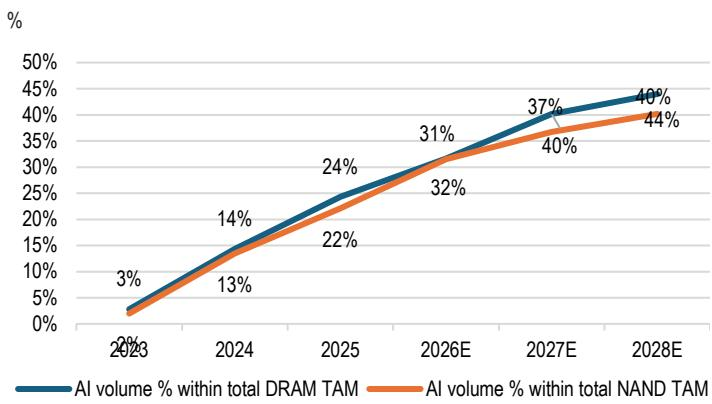

line

| Year | AI volume % within total DRAM TAM (%) | AI volume % within total NAND TAM (%) |
| :--- | :--- | :--- |
| 2023 | 3 | 2 |
| 2024 | 14 | 13 |
| 2025 | 24 | 22 |
| 2026E | 31 | 32 |
| 2027E | 37 | 40 |
| 2028E | 40 | 44 |

Source: Company reports and JPM estimates.

Figure 46: AI and non-AI DRAM value TAM CAGR trend   
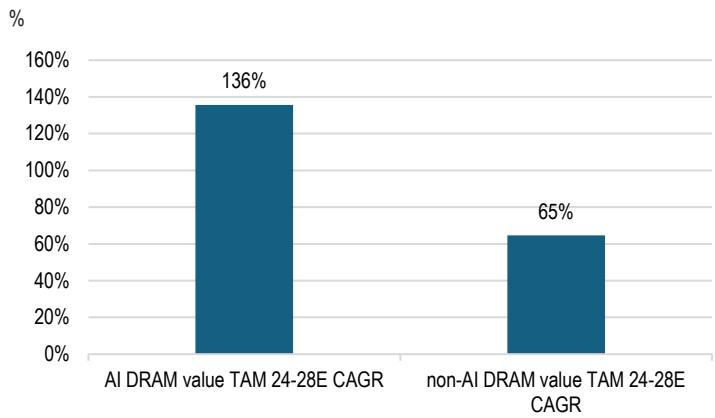

bar

| Category | CAGR (%) |
| :--- | :--- |
| AI DRAM value TAM 24-28E CAGR | 136 |
| non-AI DRAM value TAM 24-28E CAGR | 65 |

Source: Company reports and JPM estimates.

Figure 47: AI and non-AI NAND value TAM CAGR trend   
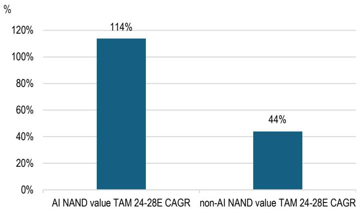

bar

| Category | Value (%) |
|---|---|
| AI NAND value TAM 24-28E CAGR | 114 |
| non-AI NAND value TAM 24-28E CAGR | 44 |

Source: Company reports and JPM estimates.

# Global memory model: Revisions

Table 6: JPM Global Memory Model: Summary of changes 

<table><tr><td></td><td colspan="3">Revised</td><td colspan="3">Previous</td><td colspan="3">Difference</td></tr><tr><td></td><td>2026E</td><td>2027E</td><td>2028E</td><td>2026E</td><td>2027E</td><td>2028E</td><td>2026E</td><td>2027E</td><td>2028E</td></tr><tr><td>Memory revenue</td><td>936.3</td><td>1,363.6</td><td>1,691.3</td><td>683.2</td><td>908.3</td><td>1,104.4</td><td>37%</td><td>50%</td><td>53%</td></tr><tr><td>DRAM revenue</td><td>636.0</td><td>970.0</td><td>1,236.8</td><td>453.7</td><td>622.9</td><td>774.4</td><td>40%</td><td>56%</td><td>60%</td></tr><tr><td>HBM revenue</td><td>64.9</td><td>129.1</td><td>225.2</td><td>57.8</td><td>98.6</td><td>167.2</td><td>12%</td><td>31%</td><td>35%</td></tr><tr><td>NAND revenue</td><td>300.3</td><td>393.6</td><td>454.5</td><td>229.4</td><td>285.5</td><td>330.0</td><td>31%</td><td>38%</td><td>38%</td></tr><tr><td>Memory price</td><td></td><td></td><td></td><td></td><td></td><td></td><td></td><td></td><td></td></tr><tr><td>DRAM ASP (8Gbe.)</td><td>12.9</td><td>16.0</td><td>16.7</td><td>9.4</td><td>11.0</td><td>11.4</td><td>37%</td><td>45%</td><td>47%</td></tr><tr><td>HBM ASP (8Gbe.)</td><td>15.5</td><td>20.5</td><td>23.8</td><td>15.3</td><td>17.2</td><td>19.3</td><td>1%</td><td>19%</td><td>23%</td></tr><tr><td>NAND ASP (256Gbe.)</td><td>7.4</td><td>8.7</td><td>8.4</td><td>5.8</td><td>6.4</td><td>6.2</td><td>27%</td><td>35%</td><td>36%</td></tr><tr><td>Memory Consumption</td><td></td><td></td><td></td><td></td><td></td><td></td><td></td><td></td><td></td></tr><tr><td>DRAM consumption (8Gbe.)</td><td>49,319</td><td>60,566</td><td>73,927</td><td>48,087</td><td>56,526</td><td>68,135</td><td>3%</td><td>7%</td><td>9%</td></tr><tr><td>NAND consumption (256Gbe.)</td><td>40,465</td><td>45,287</td><td>54,279</td><td>39,235</td><td>44,349</td><td>53,554</td><td>3%</td><td>2%</td><td>1%</td></tr><tr><td>% growth assumption</td><td></td><td></td><td></td><td></td><td></td><td></td><td></td><td></td><td></td></tr><tr><td>DRAM supply B/G</td><td>23%</td><td>22%</td><td>24%</td><td>20%</td><td>21%</td><td>22%</td><td>3%</td><td>1%</td><td>2%</td></tr><tr><td>NAND supply B/G</td><td>20%</td><td>21%</td><td>21%</td><td>18%</td><td>22%</td><td>22%</td><td>1%</td><td>-1%</td><td>-1%</td></tr><tr><td>DRAM ASP Y/Y%</td><td>246%</td><td>24%</td><td>4%</td><td>161%</td><td>17%</td><td>3%</td><td>86%</td><td>7%</td><td>1%</td></tr><tr><td>NAND ASP Y/Y%</td><td>217%</td><td>17%</td><td>-4%</td><td>147%</td><td>10%</td><td>-4%</td><td>70%</td><td>7%</td><td>1%</td></tr><tr><td>Shipments</td><td></td><td></td><td></td><td></td><td></td><td></td><td></td><td></td><td></td></tr><tr><td>Desktops</td><td>57</td><td>57</td><td>58</td><td>59</td><td>58</td><td>62</td><td>-3%</td><td>-2%</td><td>-6%</td></tr><tr><td>Notebooks</td><td>157</td><td>159</td><td>162</td><td>163</td><td>163</td><td>173</td><td>-3%</td><td>-2%</td><td>-6%</td></tr><tr><td>Servers</td><td>15.6</td><td>18.9</td><td>21.0</td><td>14.7</td><td>16.3</td><td>17.6</td><td>6%</td><td>16%</td><td>20%</td></tr><tr><td>Smartphones</td><td>1,097</td><td>1,064</td><td>1,054</td><td>1,104</td><td>1,071</td><td>1,060</td><td>-1%</td><td>-1%</td><td>-1%</td></tr><tr><td>SSDs</td><td>382</td><td>415</td><td>446</td><td>379</td><td>400</td><td>428</td><td>1%</td><td>4%</td><td>4%</td></tr><tr><td>Average DRAM memory (MB)</td><td></td><td></td><td></td><td></td><td></td><td></td><td></td><td></td><td></td></tr><tr><td>Desktops</td><td>10,904</td><td>10,451</td><td>10,124</td><td>11,006</td><td>10,866</td><td>10,841</td><td>-1%</td><td>-4%</td><td>-7%</td></tr><tr><td>Notebooks</td><td>13,377</td><td>12,918</td><td>12,943</td><td>13,526</td><td>13,660</td><td>13,855</td><td>-1%</td><td>-5%</td><td>-7%</td></tr><tr><td>Servers</td><td>1,796,955</td><td>2,428,551</td><td>2,872,462</td><td>1,801,384</td><td>2,346,712</td><td>2,826,061</td><td>0%</td><td>3%</td><td>2%</td></tr><tr><td>Smartphones</td><td>8,864</td><td>9,031</td><td>9,367</td><td>8,687</td><td>9,036</td><td>9,397</td><td>2%</td><td>0%</td><td>0%</td></tr><tr><td>Average NAND memory (MB)</td><td></td><td></td><td></td><td></td><td></td><td></td><td></td><td></td><td></td></tr><tr><td>SSDs</td><td>2,035,835</td><td>2,711,756</td><td>3,336,903</td><td>1,983,063</td><td>2,558,109</td><td>3,072,747</td><td>3%</td><td>6%</td><td>9%</td></tr><tr><td>Smartphones</td><td>252,713</td><td>255,447</td><td>257,513</td><td>249,442</td><td>259,786</td><td>279,252</td><td>1%</td><td>-2%</td><td>-8%</td></tr><tr><td>Supply assumptions</td><td></td><td></td><td></td><td></td><td></td><td></td><td></td><td></td><td></td></tr><tr><td>DRAM (8Gbe., M)</td><td>47,138</td><td>57,379</td><td>71,035</td><td>46,129</td><td>55,793</td><td>68,174</td><td>2%</td><td>3%</td><td>4%</td></tr><tr><td>HBM (8Gbe., M)</td><td>4,200</td><td>6,311</td><td>9,444</td><td>4,307</td><td>6,383</td><td>9,619</td><td>-2%</td><td>-1%</td><td>-2%</td></tr><tr><td>NAND (256Gbe., M)</td><td>37,106</td><td>44,984</td><td>54,407</td><td>36,208</td><td>44,283</td><td>54,005</td><td>2%</td><td>2%</td><td>1%</td></tr><tr><td>Memory capex</td><td>114,882</td><td>151,747</td><td>183,297</td><td>105,429</td><td>143,798</td><td>169,653</td><td>9%</td><td>6%</td><td>8%</td></tr><tr><td>DRAM</td><td>91,389</td><td>124,029</td><td>148,744</td><td>84,437</td><td>120,673</td><td>139,833</td><td>8%</td><td>3%</td><td>6%</td></tr><tr><td>NAND</td><td>23,493</td><td>27,718</td><td>34,553</td><td>20,992</td><td>23,125</td><td>29,820</td><td>12%</td><td>20%</td><td>16%</td></tr></table>

Source: JPM estimates.

Figure 48: Global memory market (DRAM+NAND) size and % change   
US\$bn, % - RHS  
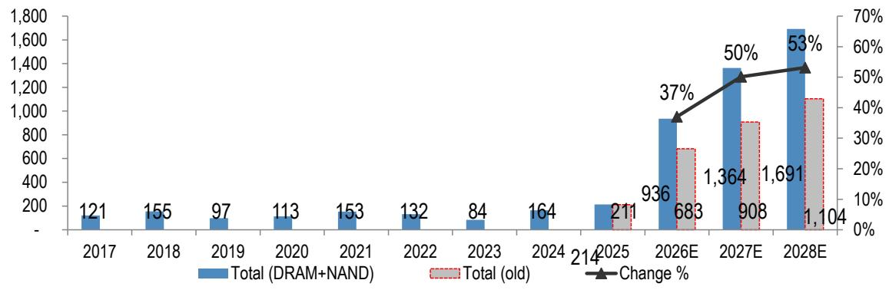

bar_line

| Year | Total (DRAM+NAND) | Total (old) | Change (%) |
| :--- | :--- | :--- | :--- |
| 2017 | 121 | | |
| 2018 | 155 | | |
| 2019 | 97 | | |
| 2020 | 113 | | |
| 2021 | 153 | | |
| 2022 | 132 | | |
| 2023 | 84 | | |
| 2024 | 164 | | |
| 2025 | 214 | 211 | 37% |
| 2026E | 936 | 683 | |
| 2027E | 1,364 | 908 | 50% |
| 2028E | 1,691 | 1,104 | 53% |

Source: WSTS, JPM estimates.

Figure 49: DRAM and NAND market size   
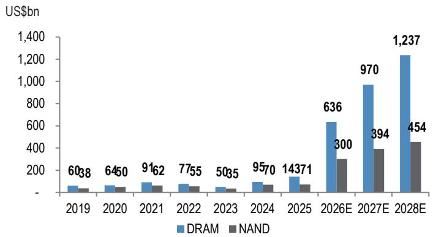

bar

| Year | DRAM (US$bn) | NAND (US$bn) |
| :--- | :--- | :--- |
| 2019 | 6038 | 38 |
| 2020 | 6450 | 50 |
| 2021 | 9162 | 62 |
| 2022 | 7755 | 55 |
| 2023 | 5035 | 35 |
| 2024 | 9570 | 70 |
| 2025 | 14371 | 111 |
| 2026E | 636 | 300 |
| 2027E | 970 | 394 |
| 2028E | 1,237 | 454 |

Source: WSTS, JPM estimates.

Figure 50: DRAM and NAND market growth rates   
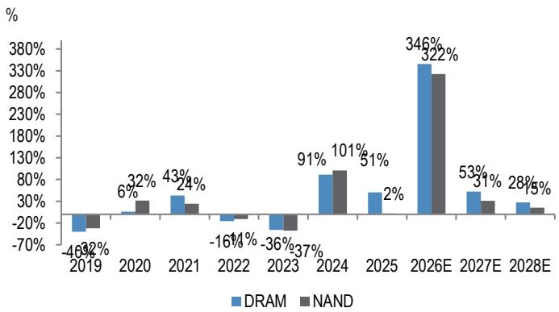

bar

| Year | DRAM (%) | NAND (%) |
| :--- | :--- | :--- |
| 2019 | -46 | -32 |
| 2020 | 6 | 32 |
| 2021 | 43 | 24 |
| 2022 | -16 | -14 |
| 2023 | -36 | -37 |
| 2024 | 91 | 101 |
| 2025 | 51 | 2 |
| 2026E | 346 | 322 |
| 2027E | 53 | 31 |
| 2028E | 28 | 15 |

Source: WSTS, JPM estimates.

# Share price related charts

Figure 51: Global memory makers' share price performance including SOX (Philadelphia Semiconductor index)   
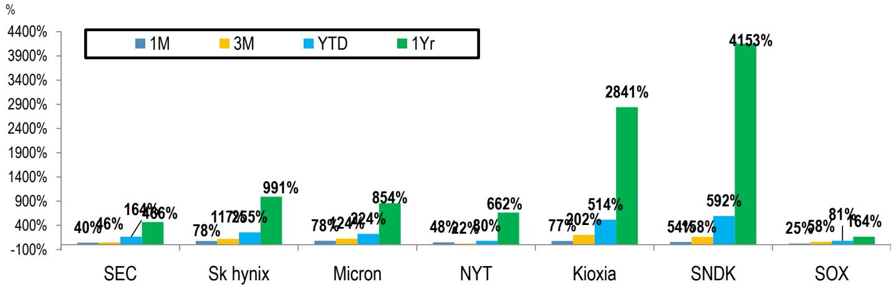

bar

| Company | 1M (%) | 3M (%) | YTD (%) | 1Yr (%) |
| :--- | :--- | :--- | :--- | :--- |
| SEC | 40 | 46 | -50 | 466 |
| Sk hynix | 78 | 117 | 255 | 991 |
| Micron | 78 | 24 | 224 | 854 |
| NYT | 48 | 22 | 30 | 662 |
| Kioxia | 77 | 202 | 514 | 2841 |
| SNDK | 54 | 158 | 592 | 4153 |
| SOX | 25 | 58 | -10 | 164 |

Source: Bloomberg Finance L.P. Note: Past performance is not an indicator of future results

Figure 52: SKH market cap vs DRAM revenue comparison (1Q ahead)   
Rebased as of 1/1/2014, US\$bn - RHS   
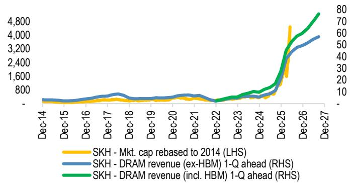

line

| Date    | SKH - Mkt. cap rebased to 2014 (LHS) | SKH - DRAM revenue (ex-HBM) 1-Q ahead (RHS) | SKH - DRAM revenue (incl. HBM) 1-Q ahead (RHS) |
|---------|----------------------------------------|-----------------------------------------------|------------------------------------------------|
| Dec-14  | ~500                                   | ~500                                          | ~500                                           |
| Dec-15  | ~500                                   | ~500                                          | ~500                                           |
| Dec-16  | ~500                                   | ~500                                          | ~500                                           |
| Dec-17  | ~500                                   | ~500                                          | ~500                                           |
| Dec-18  | ~500                                   | ~500                                          | ~500                                           |
| Dec-19  | ~500                                   | ~500                                          | ~500                                           |
| Dec-20  | ~500                                   | ~500                                          | ~500                                           |
| Dec-21  | ~500                                   | ~500                                          | ~500                                           |
| Dec-22  | ~500                                   | ~500                                          | ~500                                           |
| Dec-23  | ~500                                   | ~500                                          | ~500                                           |
| Dec-24  | ~500                                   | ~500                                          | ~500                                           |
| Dec-25  | ~1,600                                 | ~1,600                                        | ~1,600                                         |
| Dec-26  | ~4,800                                 | ~4,000                                        | ~6,000                                         |
| Dec-27  | ~4,800                                 | ~4,200                                        | ~7,500                                         |

Source: Company data, Bloomberg Finance L.P., JPM estimates. Note: 2Q26 onwards are JPM estimates.

Figure 54: SEC vs SKH: DRAM margin difference vs FTM P/B multiple discount rate   
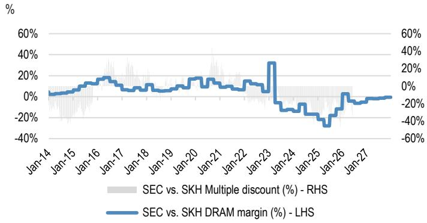

line

| Date   | SEC vs. SKH Multiple discount (%) - RHS | SEC vs. SKH DRAM margin (%) - LHS |
|--------|----------------------------------------|-----------------------------------|
| Jan-14 | ~0%                                    | ~0%                               |
| Jan-15 | ~0%                                    | ~0%                               |
| Jan-16 | ~0%                                    | ~0%                               |
| Jan-17 | ~0%                                    | ~0%                               |
| Jan-18 | ~0%                                    | ~0%                               |
| Jan-19 | ~0%                                    | ~0%                               |
| Jan-20 | ~0%                                    | ~0%                               |
| Jan-21 | ~0%                                    | ~0%                               |
| Jan-22 | ~0%                                    | ~0%                               |
| Jan-23 | ~0%                                    | ~30%                              |
| Jan-24 | ~0%                                    | ~-20%                             |
| Jan-25 | ~0%                                    | ~-40%                             |
| Jan-26 | ~0%                                    | ~-20%                             |
| Jan-27 | ~0%                                    | ~0%                               |

Source: Company data, Bloomberg Finance L.P., JPM estimates. Note: 2Q26 onwards are JPM estimates.

Figure 53: SEC market cap vs DRAM revenue comparison (1Q ahead)   
Rebased as of 1/1/2014, US\$bn - RHS   
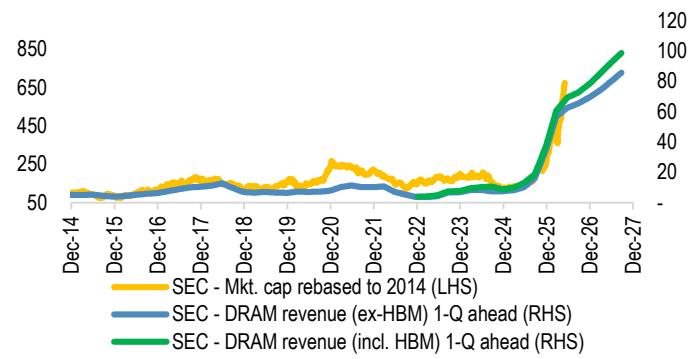

line

| Date   | SEC - Mkt. cap rebased to 2014 (LHS) | SEC - DRAM revenue (ex-HBM) 1-Q ahead (RHS) | SEC - DRAM revenue (incl. HBM) 1-Q ahead (RHS) |
|--------|--------------------------------------|---------------------------------------------|------------------------------------------------|
| Dec-14 | ~50                                  | ~50                                         | ~50                                            |
| Dec-15 | ~50                                  | ~50                                         | ~50                                            |
| Dec-16 | ~50                                  | ~50                                         | ~50                                            |
| Dec-17 | ~50                                  | ~50                                         | ~50                                            |
| Dec-18 | ~50                                  | ~50                                         | ~50                                            |
| Dec-19 | ~50                                  | ~50                                         | ~50                                            |
| Dec-20 | ~250                                 | ~50                                         | ~50                                            |
| Dec-21 | ~250                                 | ~50                                         | ~50                                            |
| Dec-22 | ~250                                 | ~50                                         | ~50                                            |
| Dec-23 | ~250                                 | ~50                                         | ~50                                            |
| Dec-24 | ~250                                 | ~50                                         | ~50                                            |
| Dec-25 | ~600                                 | ~60                                         | ~60                                            |
| Dec-26 | ~800                                 | ~80                                         | ~80                                            |
| Dec-27 | ~1000                                | ~100                                        | ~100                                           |

Source: Company data, Bloomberg Finance L.P., JPM estimates. Note: 2Q26 onwards are JPM estimates.

Figure 55: SEC vs SKH: absolute DRAM OP difference vs FTM P/B multiple discount rate   
Wbn, % - RHS  
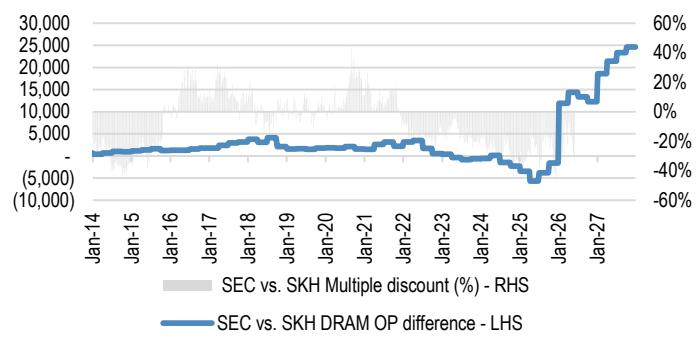

line

| Date   | SEC vs. SKH Multiple discount (%) - RHS | SEC vs. SKH DRAM OP difference - LHS |
|--------|----------------------------------------|--------------------------------------|
| Jan-14 | ~0                                     | ~0                                   |
| Jan-15 | ~0                                     | ~0                                   |
| Jan-16 | ~0                                     | ~0                                   |
| Jan-17 | ~0                                     | ~0                                   |
| Jan-18 | ~0                                     | ~0                                   |
| Jan-19 | ~0                                     | ~0                                   |
| Jan-20 | ~0                                     | ~0                                   |
| Jan-21 | ~0                                     | ~0                                   |
| Jan-22 | ~0                                     | ~0                                   |
| Jan-23 | ~0                                     | ~0                                   |
| Jan-24 | ~0                                     | ~0                                   |
| Jan-25 | ~0                                     | ~0                                   |
| Jan-26 | ~0                                     | ~15,000                              |
| Jan-27 | ~0                                     | ~25,000                              |

Source: Company data, Bloomberg Finance L.P., JPM estimates. Note: 2Q26 onwards are JPM estimates.

Figure 56: 12M FWD P/B multiple comparison between SKH and SEC   
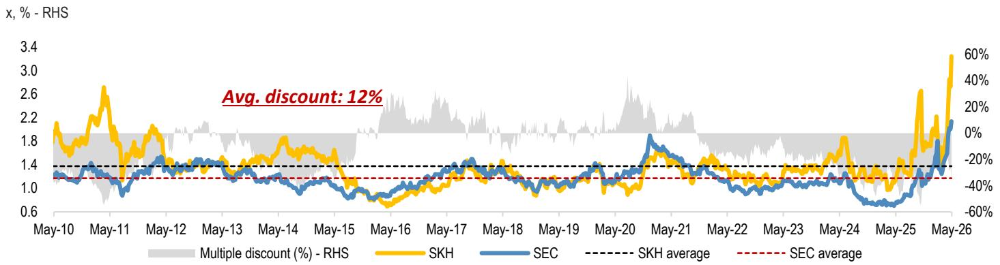

line

| Date    | Multiple discount (%) - RHS | SKH  | SEC  |
|---------|-----------------------------|------|------|
| May-10  | ~1.3                        | ~1.8 | ~1.3 |
| May-11  | ~1.3                        | ~2.7 | ~1.3 |
| May-12  | ~1.3                        | ~1.4 | ~1.3 |
| May-13  | ~1.3                        | ~1.4 | ~1.3 |
| May-14  | ~1.3                        | ~1.8 | ~1.3 |
| May-15  | ~1.3                        | ~1.4 | ~1.3 |
| May-16  | ~1.3                        | ~0.9 | ~1.3 |
| May-17  | ~1.3                        | ~1.4 | ~1.3 |
| May-18  | ~1.3                        | ~1.4 | ~1.3 |
| May-19  | ~1.3                        | ~1.4 | ~1.3 |
| May-20  | ~1.3                        | ~1.4 | ~1.3 |
| May-21  | ~1.3                        | ~1.8 | ~1.3 |
| May-22  | ~1.3                        | ~1.4 | ~1.3 |
| May-23  | ~1.3                        | ~1.4 | ~1.3 |
| May-24  | ~1.3                        | ~1.4 | ~1.3 |
| May-25  | ~1.3                        | ~2.7 | ~1.3 |
| May-26  | ~1.3                        | ~3.4 | ~2.0 |

Source: Company data, Bloomberg Finance L.P., JPM estimates.

Figure 57: Average P/B multiple for top 3 DRAM makers   
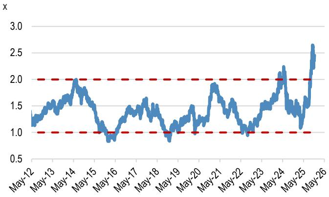

line

| Date   | Value |
|--------|-------|
| May-12 | 1.2   |
| May-13 | 1.5   |
| May-14 | 2.0   |
| May-15 | 1.8   |
| May-16 | 0.9   |
| May-17 | 1.4   |
| May-18 | 1.6   |
| May-19 | 0.8   |
| May-20 | 1.3   |
| May-21 | 1.9   |
| May-22 | 1.0   |
| May-23 | 1.5   |
| May-24 | 2.2   |
| May-25 | 1.1   |
| May-26 | 2.7   |

Source: Bloomberg Finance L.P.

Figure 59: Average P/E multiple for top 3 DRAM makers vs. SOX   
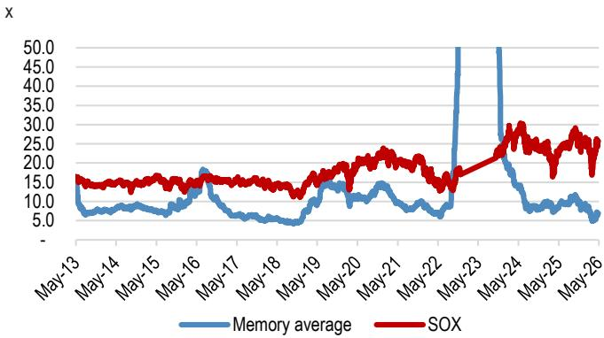

line

| Date   | Memory average | SOX  |
|--------|----------------|------|
| May-13 | 8.0            | 15.0 |
| May-14 | 7.0            | 15.0 |
| May-15 | 8.0            | 15.0 |
| May-16 | 18.0           | 15.0 |
| May-17 | 10.0           | 15.0 |
| May-18 | 5.0            | 15.0 |
| May-19 | 10.0           | 15.0 |
| May-20 | 15.0           | 20.0 |
| May-21 | 12.0           | 22.0 |
| May-22 | 8.0            | 15.0 |
| May-23 | 50.0           | 18.0 |
| May-24 | 50.0           | 30.0 |
| May-25 | 10.0           | 25.0 |
| May-26 | 5.0            | 25.0 |

Source: Bloomberg Finance L.P. Note: 23/24 not meaningful from loss making.

Figure 58: 12M Forward P/B multiple trend for DRAM makers   
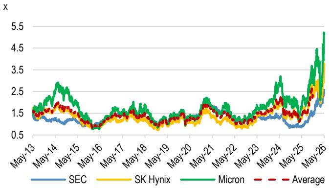

line

| Date   | SEC  | SK Hynix | Micron | Average |
|--------|------|----------|--------|---------|
| May-13 | 1.2  | 1.1      | 1.3    | 1.2     |
| May-14 | 1.1  | 1.0      | 2.8    | 1.3     |
| May-15 | 1.0  | 0.9      | 1.5    | 1.2     |
| May-16 | 0.9  | 0.8      | 0.7    | 0.9     |
| May-17 | 1.0  | 0.9      | 1.4    | 1.1     |
| May-18 | 1.1  | 1.0      | 1.6    | 1.2     |
| May-19 | 0.9  | 0.8      | 1.3    | 0.9     |
| May-20 | 1.0  | 0.9      | 1.5    | 1.1     |
| May-21 | 1.2  | 1.1      | 2.0    | 1.3     |
| May-22 | 1.1  | 1.0      | 1.4    | 1.2     |
| May-23 | 1.0  | 0.9      | 1.3    | 1.1     |
| May-24 | 1.2  | 1.1      | 3.0    | 1.3     |
| May-25 | 0.9  | 0.8      | 2.5    | 0.9     |
| May-26 | 2.5  | 2.4      | 5.0    | 2.5     |

Source: Bloomberg Finance L.P.

Figure 60: 12M Forward P/E multiple trend for DRAM makers vs. SOX   
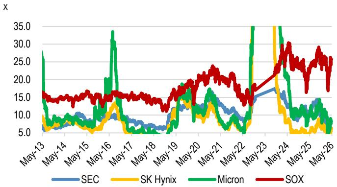

line

| Date   | SEC  | SK Hynix | Micron | SOX  |
|--------|------|----------|--------|------|
| May-13 | 7.0  | 9.0      | 28.0   | 15.0 |
| May-14 | 8.0  | 7.0      | 10.0   | 14.0 |
| May-15 | 9.0  | 6.0      | 12.0   | 15.0 |
| May-16 | 10.0 | 8.0      | 34.0   | 16.0 |
| May-17 | 8.0  | 7.0      | 6.0    | 15.0 |
| May-18 | 7.0  | 6.0      | 5.0    | 14.0 |
| May-19 | 8.0  | 7.0      | 10.0   | 15.0 |
| May-20 | 12.0 | 10.0     | 15.0   | 20.0 |
| May-21 | 14.0 | 12.0     | 18.0   | 22.0 |
| May-22 | 10.0 | 8.0      | 5.0    | 18.0 |
| May-23 | 15.0 | 18.0     | 35.0   | 25.0 |
| May-24 | 16.0 | 35.0     | 35.0   | 30.0 |
| May-25 | 14.0 | 15.0     | 15.0   | 28.0 |
| May-26 | 7.0  | 6.0      | 8.0    | 25.0 |

Source: Bloomberg Finance L.P. Note: 23/24 not meaningful from loss making.

# Memory TCO update on major end applications

Figure 61: Server DRAM cost as a % of server ASP   
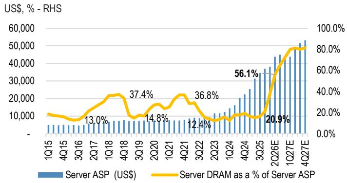

bar_line

| Quarter | Server ASP (US$) | Server DRAM as a % of Server ASP (%) |
| :--- | :--- | :--- |
| 1Q15 | 5000 | 10.0 |
| 4Q15 | 6000 | 9.0 |
| 3Q16 | 7000 | 8.0 |
| 2Q17 | 8000 | 13.0 |
| 1Q18 | 9000 | 21.0 |
| 4Q18 | 10000 | 23.0 |
| 3Q19 | 11000 | 10.0 |
| 2Q20 | 12000 | 14.8 |
| 1Q21 | 13000 | 21.0 |
| 4Q21 | 14000 | 23.0 |
| 3Q22 | 15000 | 36.8 |
| 2Q23 | 16000 | 12.4 |
| 1Q24 | 17000 | 15.0 |
| 4Q24 | 20000 | 26.8 |
| 3Q25 | 35000 | 17.6 |
| 2Q26E | 45000 | 64.4 |
| 1Q27E | 50000 | 83.6 |
| 4Q27E | 55000 | 85.6 |

Source: IDC, JPM estimates.

Figure 63: mDRAM cost as a % of smartphone ASP   
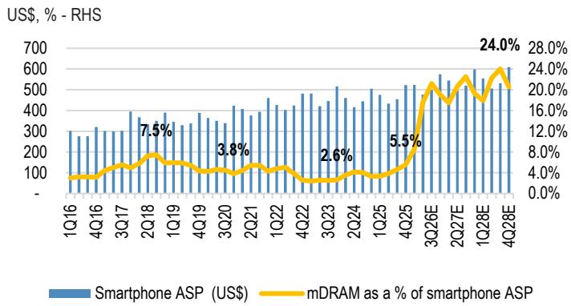

bar_line

| Quarter | Smartphone ASP (US$) | mDRAM as a % of smartphone ASP (%) |
| :--- | :--- | :--- |
| 1Q16 | 300 | 2.0 |
| 4Q16 | 320 | 3.0 |
| 3Q17 | 350 | 4.0 |
| 2Q18 | 400 | 7.5 |
| 1Q19 | 380 | 5.0 |
| 4Q19 | 390 | 4.5 |
| 3Q20 | 360 | 3.8 |
| 2Q21 | 420 | 5.0 |
| 1Q22 | 450 | 4.0 |
| 4Q22 | 470 | 3.5 |
| 3Q23 | 500 | 2.6 |
| 2Q24 | 480 | 3.0 |
| 1Q25 | 500 | 3.5 |
| 4Q25 | 520 | 5.5 |
| 3Q26E | 580 | 20.0 |
| 2Q27E | 600 | 18.0 |
| 1Q28E | 620 | 24.0 |
| 4Q28E | 650 | 24.0 |

Source: OMDIA, JPM estimates.

Figure 62: HBM as a % of GPU chip ASP   
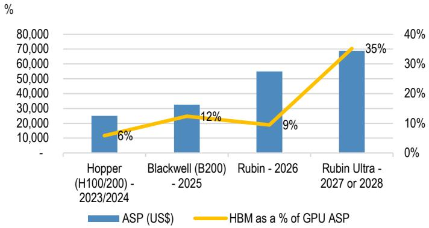

bar_line

| Category | ASP (US$) | HBM as a % of GPU ASP (%) |
| :--- | :--- | :--- |
| Hopper (H100/200) - 2023/2024 | 25,000 | 6 |
| Blackwell (B200) - 2025 | 32,000 | 12 |
| Rubin - 2026 | 55,000 | 9 |
| Rubin Ultra - 2027 or 2028 | 68,000 | 35 |

Source: Company data, JPM estimates.

Figure 64: DRAM cost as a % of NB ASP   
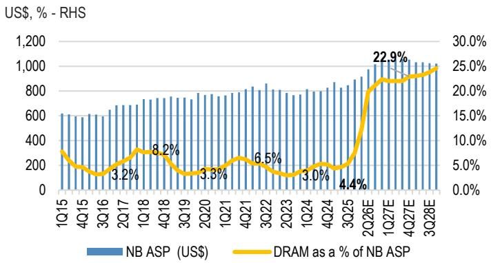

bar_line

| Quarter | NB ASP (US$) | DRAM as a % of NB ASP (%) |
| :--- | :--- | :--- |
| 1Q15 | 600 | 3.2 |
| 4Q15 | 600 | 3.2 |
| 3Q16 | 600 | 3.2 |
| 2Q17 | 700 | 8.2 |
| 1Q18 | 750 | 8.2 |
| 4Q18 | 750 | 3.3 |
| 3Q19 | 750 | 3.3 |
| 2Q20 | 750 | 6.5 |
| 1Q21 | 750 | 3.0 |
| 4Q21 | 800 | 3.0 |
| 3Q22 | 850 | 4.4 |
| 2Q23 | 800 | 4.4 |
| 1Q24 | 800 | 4.4 |
| 4Q24 | 850 | 4.4 |
| 3Q25 | 900 | 4.4 |
| 2Q26E | 1000 | 22.9 |
| 1Q27E | 1050 | 25.0 |
| 4Q27E | 1050 | 25.0 |
| 3Q28E | 1100 | 25.0 |

Source: IDC, JPM estimates.

# DRAM update

Figure 65: DRAM market revenue and ASP YoY change   
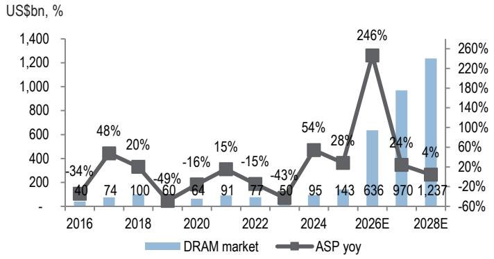

bar_line

| Year | DRAM market (US$bn) | ASP yoy (%) |
| :--- | :--- | :--- |
| 2016 | 40 | -34 |
| 2017 | 74 | 48 |
| 2018 | 100 | 20 |
| 2019 | 60 | -49 |
| 2020 | 64 | -16 |
| 2021 | 91 | 15 |
| 2022 | 77 | -15 |
| 2023 | 50 | -43 |
| 2024 | 95 | 54 |
| 2025E | 143 | 28 |
| 2026E | 636 | 246 |
| 2027E | 970 | 24 |
| 2028E | 1,237 | 4 |

Source: WSTS, JPM estimates

Figure 66: DRAM bit demand growth Y/Y by key applications   
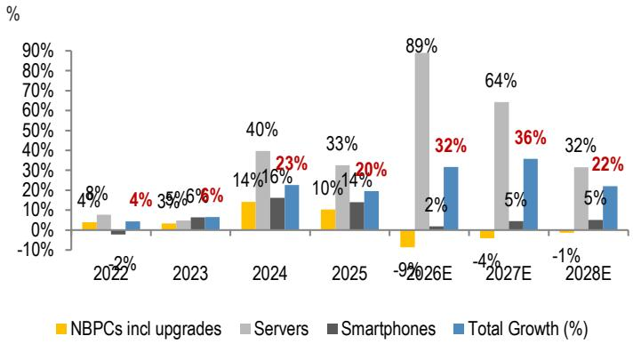

bar

| Year   | NBPCs incl upgrades | Servers | Smartphones | Total Growth (%) |
|--------|----------------------|---------|-------------|------------------|
| 2022   | 4%                   | 8%      | -           | 4%               |
| 2023   | 3%                   | 5%      | 6%          | 6%               |
| 2024   | 14%                  | 40%     | 16%         | 23%              |
| 2025   | 10%                  | 33%     | 14%         | 20%              |
| 2026E  | -9%                  | 89%     | 2%          | 32%              |
| 2027E  | -4%                  | 64%     | 5%          | 36%              |
| 2028E  | -1%                  | 32%     | 5%          | 22%              |

Source: Gartner®, IDC, OMDIA, JPM estimates. Note: Server includes HBM.

Figure 67: DRAM ASP Y/Y% change vs. previous assumptions   
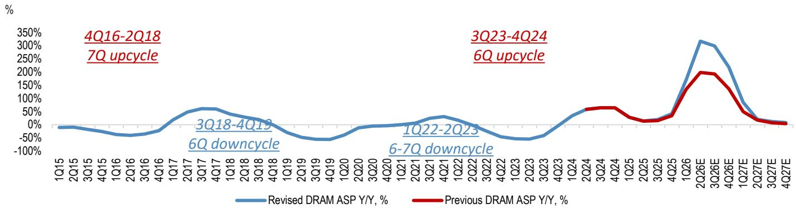

line

| Quarter | Revised DRAM ASP Y/Y, % | Previous DRAM ASP Y/Y, % |
|---------|--------------------------|---------------------------|
| 4Q16-2Q18 | 7Q upcycle | - |
| 3Q18-4Q19 | - | - |
| 1Q22-2Q23 | - | - |
| 3Q23-4Q24 | - | - |
| 6Q upcycle | - | - |

Source: WSTS, JPM estimates.

Figure 68: DRAM ASP changes by key applications   
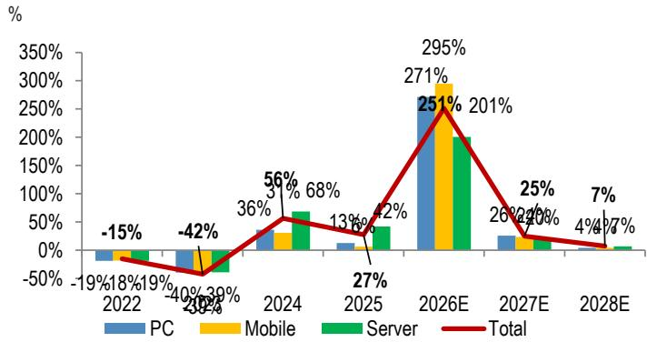

bar_line

| Year | PC (%) | Mobile (%) | Server (%) | Total (%) |
| :--- | :--- | :--- | :--- | :--- |
| 2022 | -19 | -15 | -18 | -19 |
| 2023E | -40 | -39 | -30 | -42 |
| 2024E | 36 | 31 | 56 | 68 |
| 2025E | 13 | 27 | 42 | 42 |
| 2026E | 271 | 295 | 201 | 251 |
| 2027E | 26 | 20 | 25 | 27 |
| 2028E | 4 | 4 | 7 | 7 |

Source: OMDIA, WSTS, JPM estimates.

Figure 69: DRAM quarterly pricing trend and Q/Q trend   
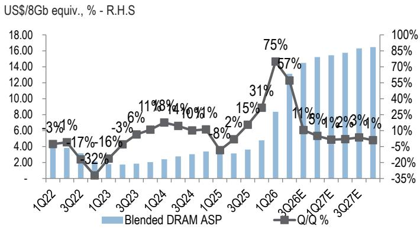

bar_line

| Quarter | Blended DRAM ASP (US$/8Gb equiv., %) | Q/Q % (%) |
|---|---|---|
| 1Q22 | 4.0 | -3 |
| 2Q22 | 4.5 | 1 |
| 3Q22 | 3.5 | 17 |
| 4Q22 | 2.5 | -32 |
| 1Q23 | 1.5 | -16 |
| 2Q23 | 1.8 | -3 |
| 3Q23 | 1.9 | 6 |
| 4Q23 | 2.0 | 11 |
| 1Q24 | 2.2 | 8 |
| 2Q24 | 2.5 | 4 |
| 3Q24 | 2.8 | 10 |
| 4Q24 | 3.0 | 1 |
| 1Q25 | 3.5 | 8 |
| 2Q25 | 3.8 | 2 |
| 3Q25 | 4.0 | 15 |
| 4Q25 | 4.5 | 31 |
| 1Q26 | 8.0 | 75 |
| 2Q26E | 14.5 | 57 |
| 3Q26E | 15.0 | 11 |
| 4Q26E | 15.5 | 6 |
| 1Q27E | 15.8 | 1 |
| 2Q27E | 16.0 | 2 |
| 3Q27E | 16.5 | 3 |
| 4Q27E | 16.8 | 1 |

Source: OMDIA, WSTS, JPM estimates.

Figure 70: DRAM bit demand mix   
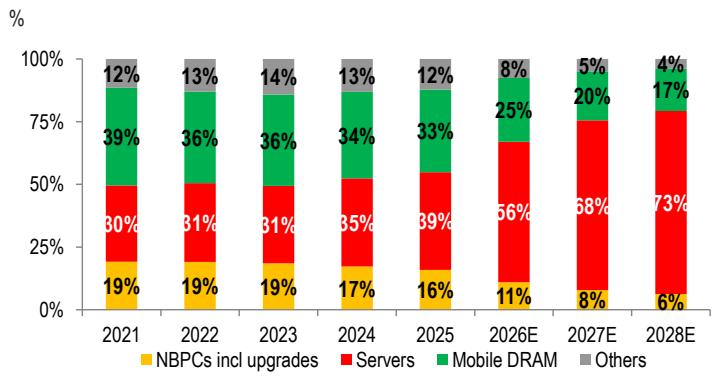

bar_stacked

| Year | NBPCs incl upgrades (%) | Servers (%) | Mobile DRAM (%) | Others (%) |
| :--- | :--- | :--- | :--- | :--- |
| 2021 | 19 | 30 | 39 | 12 |
| 2022 | 19 | 31 | 36 | 13 |
| 2023 | 19 | 31 | 36 | 14 |
| 2024 | 17 | 35 | 34 | 13 |
| 2025 | 16 | 39 | 33 | 12 |
| 2026E | 11 | 56 | 25 | 8 |
| 2027E | 8 | 68 | 20 | 5 |
| 2028E | 6 | 73 | 17 | 4 |

Source: Gartner®, JPM estimates.

Figure 72: DRAM WSPM and bit shipment Y/Y% trend   
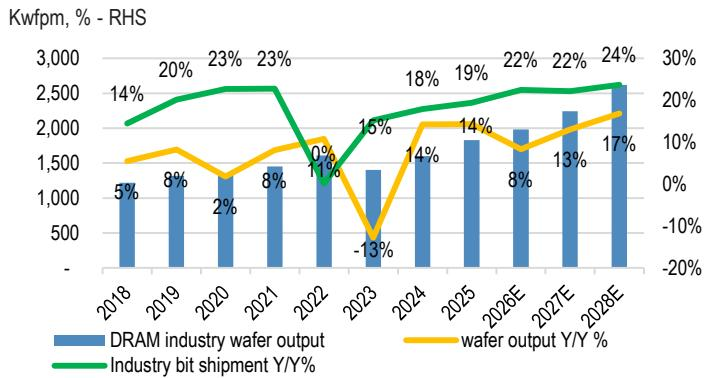

bar_line

| Year | DRAM industry wafer output (KkWpm) | Wafer output Y/Y (%) |
| :--- | :--- | :--- |
| 2018 | 5 | 14 |
| 2019 | 8 | 20 |
| 2020 | 2 | 23 |
| 2021 | 8 | 23 |
| 2022 | 11 | 10 |
| 2023 | -13 | 15 |
| 2024 | 14 | 18 |
| 2025 | 14 | 19 |
| 2026E | 8 | 22 |
| 2027E | 13 | 22 |
| 2028E | 17 | 24 |
Kwspm, % - RHS

Source: Company data, OMDIA, JPM estimates.

Figure 71: Blended quarterly DRAM ASP and Y/Y trend   
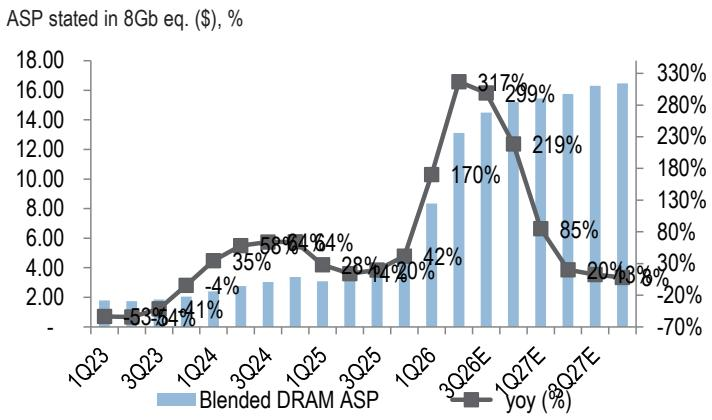

bar_line

ASP stated in 8Gb eq. ($), %
| Quarter | Blended DRAM ASP ($) | yoy (%) |
| :--- | :--- | :--- |
| 1Q23 | 1.50 | -16 |
| 2Q23 | 1.40 | -53 |
| 3Q23 | 1.40 | -44 |
| 4Q23 | 1.40 | -41 |
| 1Q24 | 2.50 | -4 |
| 2Q24 | 3.00 | 35 |
| 3Q24 | 3.50 | 56 |
| 4Q24 | 3.50 | 64 |
| 1Q25 | 3.50 | 64 |
| 2Q25 | 3.50 | 28 |
| 3Q25 | 3.50 | 44 |
| 4Q25 | 4.00 | 20 |
| 1Q26 | 8.00 | 42 |
| 2Q26E | 13.00 | 170 |
| 3Q26E | 14.50 | 317 |
| 4Q26E | 15.50 | 299 |
| 1Q27E | 16.00 | 219 |
| 2Q27E | 16.50 | 85 |
| 3Q27E | 16.50 | 20 |
| 4Q27E | 16.50 | -8 |

Source: WSTS, JPM estimates.

Figure 73: HBM % capacity mix by players and industry   
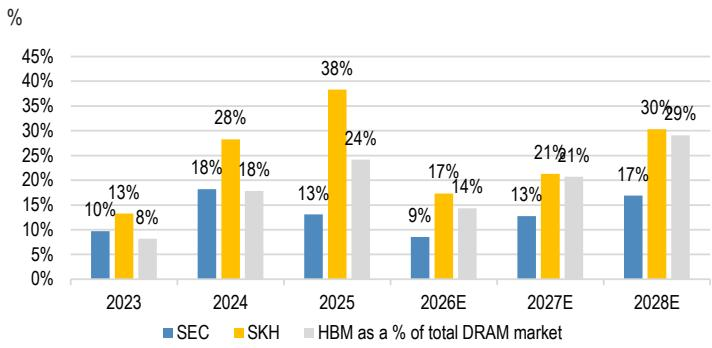

bar

| Year | SEC (%) | SKH (%) | HBM as a % of total DRAM market (%) |
| :--- | :--- | :--- | :--- |
| 2023 | 10 | 13 | 8 |
| 2024 | 18 | 28 | 18 |
| 2025 | 13 | 38 | 24 |
| 2026E | 9 | 17 | 14 |
| 2027E | 13 | 21 | 21 |
| 2028E | 17 | 30 | 29 |

Source: Company data, JPM estimates.

# Memory market cap vs key financial indicators

Figure 74: Aggregate market cap vs leading memory market revenue trend (1Q ahead)   
Rebased as of 1/1/2014, US\$bn-RHS   
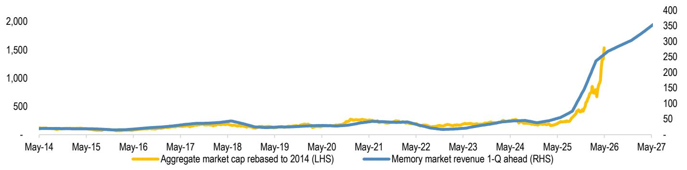

line

| Date   | Aggregate market cap rebased to 2014 (LHS) | Memory market revenue 1-Q ahead (RHS) |
|--------|---------------------------------------------|--------------------------------------|
| May-14 | ~100                                        | ~10                                  |
| May-15 | ~100                                        | ~10                                  |
| May-16 | ~100                                        | ~10                                  |
| May-17 | ~100                                        | ~10                                  |
| May-18 | ~100                                        | ~10                                  |
| May-19 | ~100                                        | ~10                                  |
| May-20 | ~100                                        | ~10                                  |
| May-21 | ~200                                        | ~20                                  |
| May-22 | ~100                                        | ~10                                  |
| May-23 | ~100                                        | ~10                                  |
| May-24 | ~200                                        | ~20                                  |
| May-25 | ~300                                        | ~30                                  |
| May-26 | ~1,600                                      | ~350                                 |
| May-27 | ~2,000                                      | ~350                                 |

Source: WSTS, Bloomberg Finance L.P., JPM estimates. Note: Market cap includes SEC, SK Hynix, Micron, Nanya Technology, Western Digital. Kioxia / SNDK added from 1Q25 and excluded WDC. Note: 2Q26 onwards are JPM estimates.

Figure 75: Aggregate market cap vs. memory industry absolute OP   
Rebased as of 1/1/2014, US\$bn-RHS   
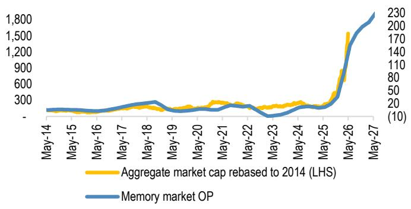

line

| Date   | Aggregate market cap rebased to 2014 (LHS) | Memory market OP |
|--------|---------------------------------------------|------------------|
| May-14 | ~200                                        | ~20              |
| May-15 | ~200                                        | ~20              |
| May-16 | ~200                                        | ~20              |
| May-17 | ~200                                        | ~20              |
| May-18 | ~200                                        | ~20              |
| May-19 | ~200                                        | ~20              |
| May-20 | ~200                                        | ~20              |
| May-21 | ~200                                        | ~20              |
| May-22 | ~200                                        | ~20              |
| May-23 | ~200                                        | ~20              |
| May-24 | ~200                                        | ~20              |
| May-25 | ~200                                        | ~20              |
| May-26 | ~1,500                                      | ~170             |
| May-27 | ~1,800                                      | ~230             |

Source: WSTS, OMDIA, Bloomberg Finance L.P., JPM estimates. Note: Market cap includes SEC, SK Hynix, Micron, Nanya Technology, Western Digital. Kioxia / SNDK added from 1Q25 and excluded WDC. Note: 2Q26 onwards are JPM estimates.

Figure 76: Aggregate market cap vs. DRAM ASP Y/Y change   
Rebased as of 1/1/2014, % - RHS   
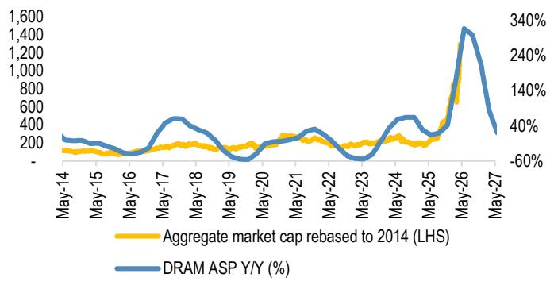

line

| Date   | Aggregate market cap rebased to 2014 (LHS) | DRAM ASP Y/Y (%) |
|--------|---------------------------------------------|------------------|
| May-14 | ~150                                        | ~25%             |
| May-15 | ~140                                        | ~20%             |
| May-16 | ~130                                        | ~15%             |
| May-17 | ~160                                        | ~45%             |
| May-18 | ~180                                        | ~35%             |
| May-19 | ~170                                        | ~10%             |
| May-20 | ~200                                        | ~-20%            |
| May-21 | ~250                                        | ~30%             |
| May-22 | ~220                                        | ~25%             |
| May-23 | ~200                                        | ~-10%            |
| May-24 | ~250                                        | ~40%             |
| May-25 | ~300                                        | ~35%             |
| May-26 | ~800                                        | ~140%            |
| May-27 | ~300                                        | ~30%             |

Source: WSTS, Bloomberg Finance L.P., JPM estimates. Note: Market cap includes SEC, SK Hynix, Micron, Nanya Technology. Note: 2Q26 onwards are JPM estimates.

# NAND update

Figure 77: NAND market revenue and ASP YoY change   
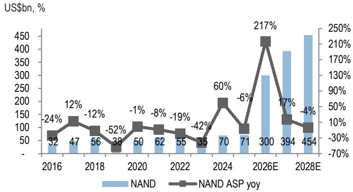

bar_line

| Year | NAND (US$bn) | NAND ASP yoy (%) |
| :--- | :--- | :--- |
| 2016 | 32 | -24 |
| 2017 | 47 | 12 |
| 2018 | 56 | -12 |
| 2019 | 38 | -52 |
| 2020 | 50 | -1 |
| 2021 | 62 | -8 |
| 2022 | 55 | -19 |
| 2023 | 35 | -42 |
| 2024 | 70 | 60 |
| 2025E | 71 | -6 |
| 2026E | 300 | 217 |
| 2028E | 454 | -4 |
NAND ASP yoy (%) |
| 2016-2018: NAND ASP yoy
| NAND ASP yoy (%) |
| 2018-2018: NAND ASP yoy
| NAND ASP yoy (%) |
| 2018-2019: NAND ASP yoy
| NAND ASP yoy (%) |
| 2019-2020: NAND ASP yoy
| NAND ASP yoy (%) |
| 2019-2021: NAND ASP yoy
| NAND ASP yoy (%) |
| 2019-2023: NAND ASP yoy
| NAND ASP yoy (%) |
| 2019-2024: NAND ASP yoy
| NAND ASP yoy (%) |
| 2019-2025: NAND ASP yoy
| NAND ASP yoy (%) |
| 2019-2030: NAND ASP yoy
| NAND ASP yoy (%) |
| 2019-2031: NAND ASP yoy
| NAND ASP yoy (%) |
| 2024E | 300 | 60 |
| 2025E | 394 | -6 |
| 2026E | 394 | 17 |
| 2027E | 454 | -4 |
NAND ASP yoy (%) |
NAND ASP yoy (%) |
NAND ASP yoy (%) |
NAND ASP yoy (%) |
NAND ASP yoy (%) |
NAND ASP yoy (%) |
NAND ASP yoy (%) |
NAND ASP yoy (%) |
NAND ASP yoy (%) |
NAND ASP yoy (%) |
NAND ASP yoy (%) |
NAND ASP yoy (%) |
NAND ASP yoy (%) |
NAND ASP yoy (%) |
NAND ASP yoy (%) |
*NAND ASP yoy (%) *NAND ASP yoy (%)

Source: WSTS, JPM estimates.

Figure 79: NAND quarterly pricing trend and Y/Y trend   
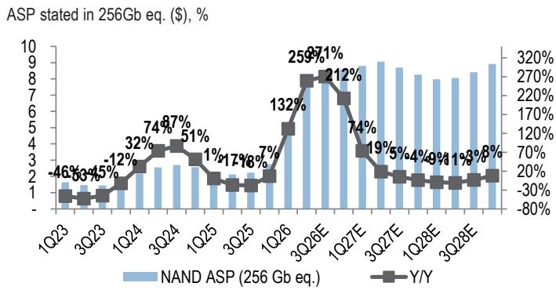

bar_line

ASP stated in 256Gb eq. ($), %
| Quarter | NAND ASP (256 Gb eq.) ($) | Y/Y (%) |
| :--- | :--- | :--- |
| 1Q23 | 1.0 | -46 |
| 2Q23 | 1.0 | -33 |
| 3Q23 | 1.0 | -45 |
| 4Q23 | 1.0 | -12 |
| 1Q24 | 2.0 | 32 |
| 2Q24 | 2.0 | 74 |
| 3Q24 | 2.0 | 87 |
| 4Q24 | 2.0 | 51 |
| 1Q25 | 1.0 | 1 |
| 2Q25 | 1.0 | 17 |
| 3Q25 | 1.0 | 18 |
| 4Q25 | 1.0 | 7 |
| 1Q26 | 1.0 | 132 |
| 2Q26E | 1.0 | 259 |
| 3Q26E | 1.0 | 271 |
| 4Q26E | 1.0 | 212 |
| 1Q27E | 1.0 | 74 |
| 2Q27E | 1.0 | 19 |
| 3Q27E | 1.0 | 5 |
| 4Q27E | 1.0 | 4 |
| 1Q28E | 1.0 | 9 |
| 2Q28E | 1.0 | 1 |
| 3Q28E | 1.0 | 8 |
The chart displays the absolute value of NAND ASP (in $) for each quarter from Q1 to Q4, with a secondary Y/Y growth rate indicated by the right-side axis. The absolute values are shown as bars, while the Y/Y growth rates are plotted as lines above the bars.

Source: WSTS, JPM estimates.

Figure 81: NAND capex and Y/Y trend   
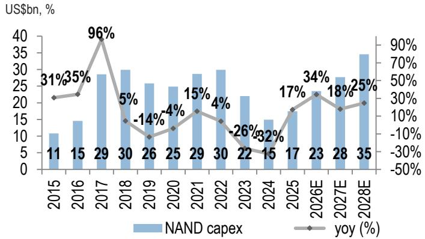

bar_line

| Year | NAND capex (US$bn) | yoy (%) |
| :--- | :--- | :--- |
| 2015 | 11 | 31 |
| 2016 | 15 | 35 |
| 2017 | 29 | 96 |
| 2018 | 30 | -5 |
| 2019 | 26 | -14 |
| 2020 | 25 | -4 |
| 2021 | 29 | 15 |
| 2022 | 30 | 4 |
| 2023 | 22 | -26 |
| 2024 | 15 | -32 |
| 2025 | 17 | 17 |
| 2026E | 23 | 34 |
| 2027E | 28 | 18 |
| 2028E | 35 | 25 |

Source: Company data, JPM estimates.

Figure 78: NAND demand growth Y/Y by key application   
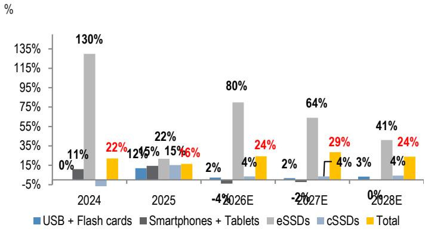

bar

| Year   | USB + Flash cards | Smartphones + Tablets | eSSDs | cSSDs | Total |
|--------|-------------------|-----------------------|-------|-------|-------|
| 2024   | 0%                | 11%                   | 130%  | -4%   | 22%   |
| 2025   | 12%               | 15%                   | 22%   | 15%   | 16%   |
| 2026E  | 2%                | -4%                   | 80%   | 4%    | 24%   |
| 2027E  | 2%                | -2%                   | 64%   | 4%    | 29%   |
| 2028E  | 3%                | 0%                    | 41%   | 4%    | 24%   |

Source: OMDIA, WSTS, JPM estimates.

Figure 80: NAND quarterly pricing trend and Q/Q trend   
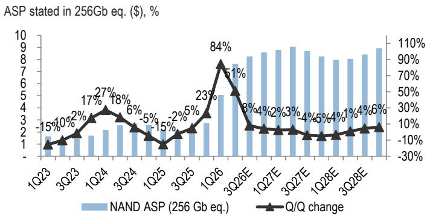

bar_line

ASP stated in 256Gb eq. ($), %
| Quarter | NAND ASP (256 Gb eq.) ($) | Q/Q change (%) |
| :--- | :--- | :--- |
| 1Q23 | 1 | -15 |
| 2Q23 | 1.5 | 10 |
| 3Q23 | 2 | 2 |
| 4Q23 | 1.8 | 17 |
| 1Q24 | 2.5 | 27 |
| 2Q24 | 3.0 | 18 |
| 3Q24 | 3.5 | 6 |
| 4Q24 | 2.0 | -5 |
| 1Q25 | 1.5 | -15 |
| 2Q25 | 1.8 | -2 |
| 3Q25 | 2.0 | 5 |
| 4Q25 | 2.5 | 23 |
| 1Q26 | 5.0 | 84 |
| 2Q26E | 7.5 | 51 |
| 3Q26E | 8.0 | 8 |
| 4Q26E | 8.5 | 4 |
| 1Q27E | 8.8 | 2 |
| 2Q27E | 9.0 | 3 |
| 3Q27E | 8.8 | -4 |
| 4Q27E | 8.5 | -5 |
| 1Q28E | 8.0 | 4 |
| 2Q28E | 8.0 | 1 |
| 3Q28E | 8.5 | 4 |
| 4Q28E | 9.0 | 6 |

Source: WSTS, JPM estimates.

Figure 82: NAND capital intensity   

bar_line

| Year | NAND capex (US$bn) | NAND capex to sales (%) |
| :--- | :--- | :--- |
| 2015 | 11 | 37 |
| 2016 | 15 | 45 |
| 2017 | 29 | 60 |
| 2018 | 30 | 54 |
| 2019 | 26 | 68 |
| 2020 | 25 | 50 |
| 2021 | 29 | 46 |
| 2022 | 30 | 54 |
| 2023 | 22 | 64 |
| 2024 | 15 | 21 |
| 2025 | 17 | 25 |
| 2026E | 23 | 8 |
| 2027E | 28 | 7 |
| 2028E | 35 | 8 |
Average: NAND capex to sales %; Average: NAND capex to sales %.

Source: Company data, JPM estimates. Note: Average from 2011-23.

# Memory OPM and spot price trend

Figure 83: DRAM OPM trend   
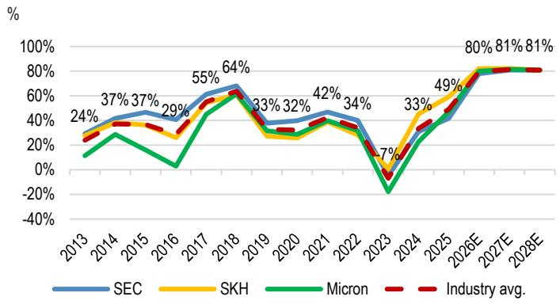

line

| Year   | SEC  | SKH  | Micron | Industry avg. |
|--------|------|------|--------|---------------|
| 2013   | 24%  |      |        |               |
| 2014   |      |      |        | 37%           |
| 2015   |      |      |        | 37%           |
| 2016   |      |      |        | 29%           |
| 2017   |      |      |        | 55%           |
| 2018   |      |      |        | 64%           |
| 2019   |      |      |        | 33%           |
| 2020   |      |      |        | 32%           |
| 2021   |      |      |        | 42%           |
| 2022   |      |      |        | 34%           |
| 2023   |      |      |        | -7%           |
| 2024   |      |      |        | 33%           |
| 2025   |      |      |        | 49%           |
| 2026E  |      |      |        | 80%           |
| 2027E  |      |      |        | 81%           |
| 2028E  |      |      |        | 81%           |

Source: OMDIA, company data, JPM estimates.

Figure 85: DDR5 vs DDR4 SO-DIMM price trend   
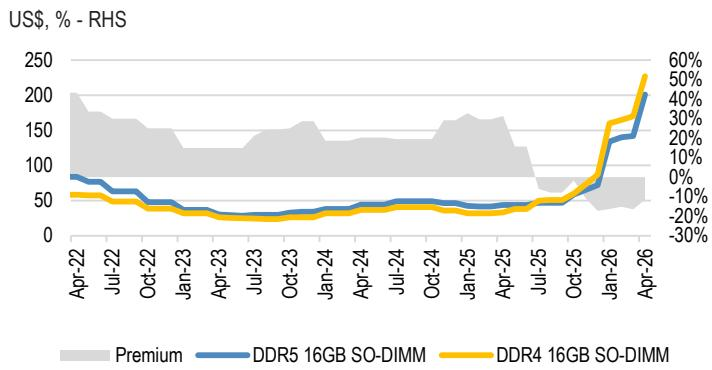

line

| Date   | Premium | DDR5 16GB SO-DIMM | DDR4 16GB SO-DIMM |
|--------|---------|-------------------|-------------------|
| Apr-22 | ~200    | ~80               | ~50               |
| Jul-22 | ~170    | ~60               | ~40               |
| Oct-22 | ~150    | ~50               | ~30               |
| Jan-23 | ~130    | ~40               | ~20               |
| Apr-23 | ~120    | ~30               | ~10               |
| Jul-23 | ~130    | ~30               | ~10               |
| Oct-23 | ~150    | ~30               | ~10               |
| Jan-24 | ~130    | ~30               | ~10               |
| Apr-24 | ~130    | ~30               | ~10               |
| Jul-24 | ~130    | ~30               | ~10               |
| Oct-24 | ~150    | ~30               | ~10               |
| Jan-25 | ~170    | ~30               | ~10               |
| Apr-25 | ~130    | ~30               | ~10               |
| Jul-25 | ~100    | ~30               | ~10               |
| Oct-25 | ~80     | ~30               | ~10               |
| Jan-26 | ~90     | ~80               | ~60               |
| Apr-26 | ~100    | ~200              | ~50               |

Source: Company data.

Figure 87: NAND spot price trend   
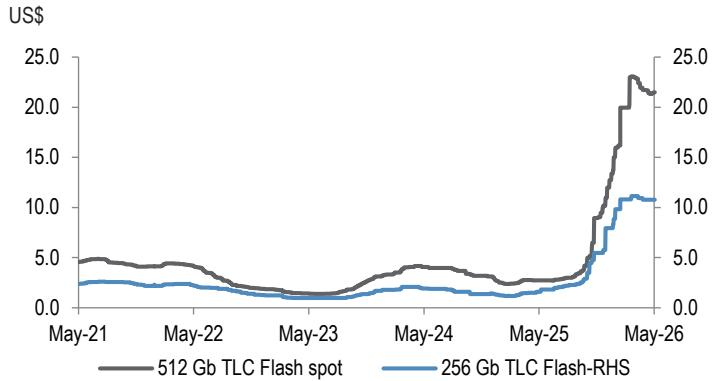

line

| Date   | 512 Gb TLC Flash spot | 256 Gb TLC Flash-RHS |
|--------|----------------------|----------------------|
| May-21 | ~4.5                 | ~2.5                 |
| May-22 | ~3.5                 | ~2.0                 |
| May-23 | ~1.5                 | ~1.0                 |
| May-24 | ~3.0                 | ~1.5                 |
| May-25 | ~2.0                 | ~1.0                 |
| May-26 | ~23.0                | ~10.0                |

Source: Bloomberg Finance L.P.

Figure 84: NAND OPM trend   
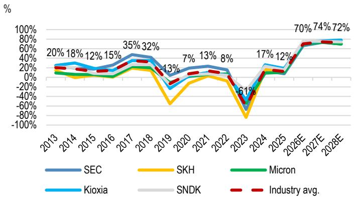

line

| Year   | SEC  | SKH  | Micron | Kioxia | SNDK | Industry avg. |
|--------|------|------|--------|--------|------|---------------|
| 2013   | 20%  | -    | -      | -      | -    | -             |
| 2014   | 18%  | -    | -      | -      | -    | -             |
| 2015   | 12%  | -    | -      | -      | -    | -             |
| 2016   | 15%  | -    | -      | -      | -    | -             |
| 2017   | 35%  | -    | -      | -      | -    | -             |
| 2018   | 32%  | -    | -      | -      | -    | -             |
| 2019   | -13% | -    | -      | -      | -    | -             |
| 2020   | 7%   | -    | -      | -      | -    | -             |
| 2021   | 13%  | -    | -      | -      | -    | -             |
| 2022   | 8%   | -    | -      | -      | -    | -             |
| 2023   | -61% | -    | -      | -      | -    | -             |
| 2024   | 17%  | -    | -      | -      | -    | -             |
| 2025   | 12%  | -    | -      | -      | -    | -             |
| 2026E  | 70%  | -    | -      | -      | -    | -             |
| 2027E  | 74%  | -    | -      | -      | -    | -             |
| 2028E  | 72%  | -    | -      | -      | -    | -             |

Source: OMDIA, company data, JPM estimates.

Figure 86: DDR5 vs DDR4 RDIMM price trend   
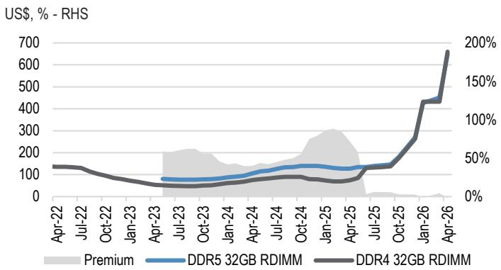

line

| Date   | Premium | DDR5 32GB RDIMM | DDR4 32GB RDIMM |
|--------|---------|-----------------|-----------------|
| Apr-22 |         |                 |                 |
| Jul-22 |         |                 |                 |
| Oct-22 |         |                 |                 |
| Jan-23 |         |                 |                 |
| Apr-23 |         |                 |                 |
| Jul-23 |         |                 |                 |
| Oct-23 |         |                 |                 |
| Jan-24 |         |                 |                 |
| Apr-24 |         |                 |                 |
| Jul-24 |         |                 |                 |
| Oct-24 |         |                 |                 |
| Jan-25 |         |                 |                 |
| Apr-25 |         |                 |                 |
| Jul-25 |         |                 |                 |
| Oct-25 |         |                 |                 |
| Jan-26 |         |                 |                 |
| Apr-26 |         |                 |                 |

Source: Company data.

Figure 88: 8Gb DDR4 spot vs contract price trend   
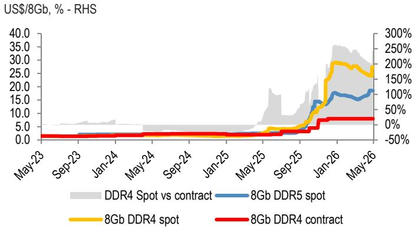

line

| Date   | DDR4 Spot vs contract | 8Gb DDR5 spot | 8Gb DDR4 spot | 8Gb DDR4 contract |
|--------|------------------------|---------------|---------------|--------------------|
| May-23 | ~1.0%                  | ~1.0%         | ~1.0%         | ~1.0%              |
| Sep-23 | ~1.0%                  | ~1.0%         | ~1.0%         | ~1.0%              |
| Jan-24 | ~1.0%                  | ~1.0%         | ~1.0%         | ~1.0%              |
| May-24 | ~1.0%                  | ~1.0%         | ~1.0%         | ~1.0%              |
| Sep-24 | ~1.0%                  | ~1.0%         | ~1.0%         | ~1.0%              |
| Jan-25 | ~1.0%                  | ~1.0%         | ~1.0%         | ~1.0%              |
| May-25 | ~1.0%                  | ~1.0%         | ~1.0%         | ~1.0%              |
| Sep-25 | ~5.0%                  | ~5.0%         | ~5.0%         | ~5.0%              |
| Jan-26 | ~25.0%                 | ~20.0%        | ~25.0%        | ~5.0%              |
| May-26 | ~35.0%                 | ~25.0%        | ~30.0%        | ~5.0%              |

Source: Bloomberg Finance L.P.

# Appendix

# Global DRAM model

Table 7: Global DRAM supply-demand model   
8Gb. equivalent 

<table><tr><td></td><td>1Q25</td><td>2Q25</td><td>3Q25</td><td>4Q25</td><td>1Q26</td><td>2Q26E</td><td>3Q26E</td><td>4Q26E</td><td>1Q27E</td><td>2Q27E</td><td>3Q27E</td><td>4Q27E</td><td>2024</td><td>2025</td><td>2026E</td><td>2027E</td><td>2028E</td></tr><tr><td>Total demand (M units)</td><td>8,266</td><td>9,031</td><td>10,045</td><td>10,577</td><td>10,925</td><td>12,026</td><td>13,254</td><td>14,021</td><td>15,304</td><td>16,461</td><td>17,511</td><td>18,227</td><td>31,364</td><td>37,920</td><td>50,226</td><td>67,504</td><td>81,771</td></tr><tr><td>Sequential growth (%)</td><td>-3%</td><td>9%</td><td>11%</td><td>5%</td><td>3%</td><td>10%</td><td>10%</td><td>6%</td><td>9%</td><td>8%</td><td>6%</td><td>4%</td><td>22%</td><td>21%</td><td>32.5%</td><td>34.4%</td><td>21.1%</td></tr><tr><td>Y/Y growth (%)</td><td>17%</td><td>19%</td><td>22%</td><td>25%</td><td>32%</td><td>33%</td><td>32%</td><td>33%</td><td>40%</td><td>37%</td><td>32%</td><td>30%</td><td></td><td></td><td>9.5%</td><td>12.7%</td><td>-2.7%</td></tr><tr><td>Total supply (M units)</td><td>8,024</td><td>9,408</td><td>10,349</td><td>10,569</td><td>11,026</td><td>11,653</td><td>12,152</td><td>12,307</td><td>12,888</td><td>13,736</td><td>14,917</td><td>15,838</td><td>32,131</td><td>38,351</td><td>47,138</td><td>57,379</td><td>71,035</td></tr><tr><td>Sequential growth (%)</td><td>-1%</td><td>17%</td><td>10%</td><td>2%</td><td>4%</td><td>6%</td><td>4%</td><td>1%</td><td>5%</td><td>7%</td><td>9%</td><td>6%</td><td>18%</td><td>19%</td><td>22.9%</td><td>21.7%</td><td>23.8%</td></tr><tr><td>Y/Y growth (%)</td><td>5%</td><td>15%</td><td>27%</td><td>30%</td><td>37%</td><td>24%</td><td>17%</td><td>16%</td><td>17%</td><td>18%</td><td>23%</td><td>29%</td><td></td><td></td><td></td><td></td><td></td></tr><tr><td>Consumption (WSTS)</td><td>8,019</td><td>9,254</td><td>10,286</td><td>10,781</td><td>11,581</td><td>12,165</td><td>12,640</td><td>12,933</td><td>13,708</td><td>14,608</td><td>15,728</td><td>16,522</td><td>32,669</td><td>38,340</td><td>49,319</td><td>60,566</td><td>73,927</td></tr><tr><td>Sequential growth (%)</td><td>-3%</td><td>15%</td><td>11%</td><td>5%</td><td>7%</td><td>5%</td><td>4%</td><td>2%</td><td>6%</td><td>7%</td><td>8%</td><td>5%</td><td>24%</td><td>17%</td><td>28.6%</td><td>22.8%</td><td>22.1%</td></tr><tr><td>Y/Y growth (%)</td><td>3%</td><td>11%</td><td>24%</td><td>30%</td><td>44%</td><td>31%</td><td>23%</td><td>20%</td><td>18%</td><td>20%</td><td>24%</td><td>28%</td><td></td><td></td><td></td><td></td><td></td></tr><tr><td>Inventory build-up</td><td>6</td><td>154</td><td>63</td><td>(212)</td><td>(555)</td><td>(512)</td><td>(487)</td><td>(627)</td><td>(821)</td><td>(872)</td><td>(811)</td><td>(684)</td><td>-</td><td>11</td><td>-</td><td>-</td><td>-</td></tr><tr><td>Cumulative inventory</td><td>1,656</td><td>1,810</td><td>1,873</td><td>1,661</td><td>1,106</td><td>594</td><td>107</td><td>(520)</td><td>(1,341)</td><td>(2,213)</td><td>(3,023)</td><td>(3,707)</td><td>1,650</td><td>1,661</td><td>(520)</td><td>(3,707)</td><td>(6,599)</td></tr><tr><td>Sufficiency ex inventory (%)</td><td>0%</td><td>2%</td><td>1%</td><td>-2%</td><td>-5%</td><td>-4%</td><td>-4%</td><td>-5%</td><td>-6%</td><td>-6%</td><td>-5%</td><td>-4%</td><td>-1.6%</td><td>0.0%</td><td>-4.4%</td><td>-5.3%</td><td>-3.9%</td></tr><tr><td>Sufficiency (%)</td><td>5.2%</td><td>5.3%</td><td>4.7%</td><td>3.4%</td><td>1.2%</td><td>0.2%</td><td>-0.8%</td><td>-2.2%</td><td>-3.9%</td><td>-5.3%</td><td>-6.1%</td><td>-6.6%</td><td>3.4%</td><td>4.4%</td><td>-5.5%</td><td>-11.4%</td><td>-12.8%</td></tr><tr><td>Inventory weeks</td><td>2.6</td><td>2.8</td><td>2.7</td><td>2.3</td><td>1.4</td><td>0.7</td><td>0.1</td><td>(0.6)</td><td>(1.4)</td><td>(2.3)</td><td>(2.9)</td><td>(3.4)</td><td></td><td></td><td></td><td></td><td></td></tr><tr><td></td><td></td><td></td><td></td><td></td><td></td><td></td><td></td><td></td><td></td><td></td><td></td><td></td><td></td><td></td><td></td><td></td><td></td></tr><tr><td>DRAM Revenues (US$, M)</td><td>24,773</td><td>29,104</td><td>37,352</td><td>51,478</td><td>96,707</td><td>159,479</td><td>183,101</td><td>196,727</td><td>211,643</td><td>230,039</td><td>256,346</td><td>271,976</td><td>94,764</td><td>142,707</td><td>636,015</td><td>970,004</td><td>1,236,783</td></tr><tr><td>Sequential growth (%)</td><td>-11%</td><td>17%</td><td>28%</td><td>38%</td><td>88%</td><td>65%</td><td>15%</td><td>7%</td><td>8%</td><td>9%</td><td>11%</td><td>6%</td><td>91%</td><td>51%</td><td>346%</td><td>53%</td><td>28%</td></tr><tr><td>Y/Y growth (%)</td><td>32%</td><td>27%</td><td>49%</td><td>85%</td><td>290%</td><td>448%</td><td>390%</td><td>282%</td><td>119%</td><td>44%</td><td>40%</td><td>38%</td><td></td><td></td><td></td><td></td><td></td></tr><tr><td>DRAM ASP ($)</td><td>3.09</td><td>3.15</td><td>3.63</td><td>4.77</td><td>8.35</td><td>13.11</td><td>14.49</td><td>15.21</td><td>15.44</td><td>15.75</td><td>16.30</td><td>16.46</td><td>2.90</td><td>3.72</td><td>12.90</td><td>16.02</td><td>16.73</td></tr><tr><td>Sequential growth (%)</td><td>-8%</td><td>2%</td><td>15%</td><td>31%</td><td>75%</td><td>57.0%</td><td>10.5%</td><td>5.0%</td><td>1.5%</td><td>2.0%</td><td>3.5%</td><td>1.0%</td><td>54%</td><td>28%</td><td>246%</td><td>24%</td><td>4%</td></tr><tr><td>Y/Y growth (%)</td><td>28%</td><td>14%</td><td>20%</td><td>42%</td><td>170%</td><td>317%</td><td>299%</td><td>219%</td><td>85%</td><td>20%</td><td>13%</td><td>8%</td><td></td><td></td><td></td><td></td><td></td></tr><tr><td></td><td></td><td></td><td></td><td></td><td></td><td></td><td></td><td></td><td></td><td></td><td></td><td></td><td></td><td></td><td></td><td></td><td></td></tr><tr><td></td><td>1Q25</td><td>2Q25</td><td>3Q25</td><td>4Q25</td><td>1Q26</td><td>2Q26E</td><td>3Q26E</td><td>4Q26E</td><td>1Q27E</td><td>2Q27E</td><td>3Q27E</td><td>4Q27E</td><td>2024</td><td>2025</td><td>2026E</td><td>2027E</td><td>2028E</td></tr><tr><td>Consumption vs. Demand</td><td>3%</td><td>-2%</td><td>-2%</td><td>-2%</td><td>-6%</td><td>-1%</td><td>5%</td><td>8%</td><td>12%</td><td>13%</td><td>11%</td><td>10%</td><td>-4%</td><td>-1%</td><td>2%</td><td>11%</td><td>11%</td></tr><tr><td>Consumption vs. Supply</td><td>0%</td><td>2%</td><td>1%</td><td>-2%</td><td>-5%</td><td>-4%</td><td>-4%</td><td>-5%</td><td>-6%</td><td>-6%</td><td>-5%</td><td>-4%</td><td>-2%</td><td>0%</td><td>-4%</td><td>-5%</td><td>-4%</td></tr></table>

Source: WSTS, JPM estimates, Gartner®.

Table 8: DRAM demand model   
8Gb. equivalent (millions) 

<table><tr><td>Demand (8Gb. Eq., M)</td><td>1Q25</td><td>2Q25</td><td>3Q25</td><td>4Q25</td><td>1Q26</td><td>2Q26E</td><td>3Q26E</td><td>4Q26E</td><td>1Q27E</td><td>2Q27E</td><td>3Q27E</td><td>4Q27E</td><td>2024</td><td>2025</td><td>2026E</td><td>2027E</td><td>2028E</td></tr><tr><td>PC DRAM</td><td>1,312</td><td>1,400</td><td>1,569</td><td>1,602</td><td>1,441</td><td>1,332</td><td>1,318</td><td>1,282</td><td>1,231</td><td>1,249</td><td>1,302</td><td>1,369</td><td>5,332</td><td>5,883</td><td>5,374</td><td>5,151</td><td>5,081</td></tr><tr><td>Desktop</td><td>151</td><td>169</td><td>191</td><td>206</td><td>160</td><td>151</td><td>141</td><td>155</td><td>125</td><td>137</td><td>142</td><td>180</td><td>617</td><td>718</td><td>606</td><td>584</td><td>574</td></tr><tr><td>Notebooks</td><td>500</td><td>551</td><td>653</td><td>642</td><td>558</td><td>486</td><td>511</td><td>500</td><td>467</td><td>472</td><td>521</td><td>549</td><td>2,050</td><td>2,346</td><td>2,055</td><td>2,009</td><td>2,051</td></tr><tr><td>Upgrades &amp; other data processing</td><td>660</td><td>680</td><td>725</td><td>754</td><td>724</td><td>695</td><td>667</td><td>627</td><td>640</td><td>640</td><td>640</td><td>640</td><td>2,665</td><td>2,819</td><td>2,713</td><td>2,558</td><td>2,456</td></tr><tr><td>Server</td><td>3,001</td><td>3,296</td><td>3,775</td><td>4,382</td><td>5,408</td><td>6,342</td><td>7,546</td><td>8,014</td><td>9,871</td><td>10,931</td><td>11,736</td><td>12,315</td><td>10,902</td><td>14,454</td><td>27,309</td><td>44,853</td><td>58,985</td></tr><tr><td>AI server (incl. SOCAMM)</td><td>343</td><td>402</td><td>463</td><td>505</td><td>757</td><td>911</td><td>1,655</td><td>1,783</td><td>2,928</td><td>3,100</td><td>3,410</td><td>3,675</td><td>852</td><td>1,713</td><td>5,105</td><td>13,113</td><td>18,140</td></tr><tr><td>General purpose server</td><td>2,266</td><td>2,413</td><td>2,725</td><td>3,208</td><td>3,923</td><td>4,570</td><td>4,851</td><td>5,163</td><td>5,726</td><td>6,506</td><td>6,829</td><td>6,999</td><td>8,806</td><td>10,612</td><td>18,507</td><td>26,060</td><td>32,346</td></tr><tr><td>HBM</td><td>392</td><td>481</td><td>587</td><td>669</td><td>728</td><td>861</td><td>1,039</td><td>1,067</td><td>1,217</td><td>1,326</td><td>1,496</td><td>1,641</td><td>1,244</td><td>2,129</td><td>3,696</td><td>5,680</td><td>8,500</td></tr><tr><td>Mobile DRAM</td><td>2,768</td><td>2,830</td><td>3,278</td><td>3,326</td><td>2,708</td><td>2,628</td><td>2,995</td><td>2,967</td><td>2,694</td><td>2,629</td><td>2,952</td><td>2,919</td><td>10,683</td><td>12,201</td><td>11,298</td><td>11,193</td><td>11,500</td></tr><tr><td>Others</td><td>995</td><td>1,123</td><td>1,174</td><td>1,234</td><td>1,085</td><td>1,188</td><td>1,239</td><td>1,303</td><td>1,136</td><td>1,241</td><td>1,295</td><td>1,361</td><td>4,070</td><td>4,526</td><td>4,815</td><td>5,033</td><td>5,269</td></tr><tr><td>Consumer Electronics</td><td>429</td><td>506</td><td>514</td><td>535</td><td>446</td><td>516</td><td>524</td><td>546</td><td>451</td><td>521</td><td>529</td><td>551</td><td>1,830</td><td>1,984</td><td>2,032</td><td>2,052</td><td>2,073</td></tr><tr><td>Automotive Electronics</td><td>195</td><td>208</td><td>225</td><td>231</td><td>244</td><td>237</td><td>252</td><td>259</td><td>273</td><td>266</td><td>282</td><td>290</td><td>675</td><td>859</td><td>992</td><td>1,111</td><td>1,244</td></tr><tr><td>Industrial Electronics</td><td>310</td><td>332</td><td>353</td><td>375</td><td>329</td><td>352</td><td>374</td><td>397</td><td>342</td><td>366</td><td>389</td><td>413</td><td>1,280</td><td>1,370</td><td>1,452</td><td>1,510</td><td>1,570</td></tr><tr><td>Military/Civil Aerospace</td><td>61</td><td>77</td><td>83</td><td>94</td><td>67</td><td>83</td><td>89</td><td>101</td><td>71</td><td>88</td><td>94</td><td>107</td><td>285</td><td>314</td><td>340</td><td>360</td><td>382</td></tr><tr><td>Total</td><td>8,075</td><td>8,648</td><td>9,796</td><td>10,545</td><td>10,642</td><td>11,490</td><td>13,098</td><td>13,566</td><td>14,932</td><td>16,050</td><td>17,285</td><td>17,964</td><td>30,987</td><td>37,064</td><td>48,796</td><td>66,230</td><td>80,836</td></tr></table>

Source: Gartner®, JPM estimates

Table 9: DRAM supply model   
8Gb. equivalent (millions) 

<table><tr><td>DRAM Supply (8Gb. Eq., M)</td><td>1Q25</td><td>2Q25</td><td>3Q25</td><td>4Q25</td><td>1Q26</td><td>2Q26E</td><td>3Q26E</td><td>4Q26E</td><td>1Q27E</td><td>2Q27E</td><td>3Q27E</td><td>4Q27E</td><td>2024</td><td>2025</td><td>2026E</td><td>2027E</td><td>2028E</td></tr><tr><td>SK hynix</td><td>2,242</td><td>2,795</td><td>3,013</td><td>3,028</td><td>3,014</td><td>3,249</td><td>3,427</td><td>3,534</td><td>3,642</td><td>3,790</td><td>4,065</td><td>4,356</td><td>8,933</td><td>11,077</td><td>13,224</td><td>15,853</td><td>19,024</td></tr><tr><td>Samsung</td><td>3,200</td><td>3,552</td><td>4,102</td><td>4,185</td><td>4,308</td><td>4,532</td><td>4,672</td><td>4,665</td><td>4,937</td><td>5,248</td><td>5,672</td><td>6,112</td><td>13,890</td><td>15,039</td><td>18,177</td><td>21,969</td><td>26,988</td></tr><tr><td>Micron</td><td>1,950</td><td>2,313</td><td>2,369</td><td>2,400</td><td>2,538</td><td>2,646</td><td>2,730</td><td>2,793</td><td>2,823</td><td>3,079</td><td>3,356</td><td>3,387</td><td>7,375</td><td>9,031</td><td>10,707</td><td>12,646</td><td>15,384</td></tr><tr><td>Nanya</td><td>92</td><td>152</td><td>192</td><td>216</td><td>203</td><td>191</td><td>184</td><td>180</td><td>180</td><td>189</td><td>199</td><td>226</td><td>421</td><td>652</td><td>758</td><td>795</td><td>1,012</td></tr><tr><td>Powerchip</td><td>44</td><td>50</td><td>54</td><td>54</td><td>53</td><td>60</td><td>64</td><td>64</td><td>64</td><td>72</td><td>77</td><td>77</td><td>167</td><td>202</td><td>242</td><td>290</td><td>348</td></tr><tr><td>Others</td><td>450</td><td>500</td><td>570</td><td>630</td><td>840</td><td>892</td><td>961</td><td>944</td><td>1,134</td><td>1,234</td><td>1,414</td><td>1,547</td><td>1,215</td><td>2,150</td><td>3,637</td><td>5,329</td><td>7,692</td></tr><tr><td>Total</td><td>8,024</td><td>9,408</td><td>10,349</td><td>10,569</td><td>11,026</td><td>11,653</td><td>12,152</td><td>12,307</td><td>12,888</td><td>13,736</td><td>14,917</td><td>15,838</td><td>32,131</td><td>38,351</td><td>46,968</td><td>57,379</td><td>70,965</td></tr></table>

Source: OMDIA, company data, JPM estimates

Table 10: DRAM capex by company   
US\$ mn 

<table><tr><td></td><td>2016</td><td>2017</td><td>2018</td><td>2019</td><td>2020</td><td>2021</td><td>2022</td><td>2023</td><td>2024</td><td>2025</td><td>2026E</td><td>2027E</td><td>2028E</td></tr><tr><td>SK hynix</td><td>3,600</td><td>3,851</td><td>6,818</td><td>7,162</td><td>5,204</td><td>6,522</td><td>8,705</td><td>4,294</td><td>10,034</td><td>17,314</td><td>26,409</td><td>37,493</td><td>45,986</td></tr><tr><td>Samsung</td><td>3,882</td><td>6,018</td><td>11,819</td><td>7,291</td><td>9,204</td><td>14,008</td><td>13,652</td><td>16,702</td><td>19,083</td><td>19,824</td><td>30,423</td><td>42,143</td><td>51,071</td></tr><tr><td>Micron</td><td>2,100</td><td>2,800</td><td>4,400</td><td>4,000</td><td>3,250</td><td>5,000</td><td>5,626</td><td>3,300</td><td>5,500</td><td>13,300</td><td>23,200</td><td>29,800</td><td>34,700</td></tr><tr><td>Nanya</td><td>693</td><td>961</td><td>669</td><td>178</td><td>286</td><td>400</td><td>695</td><td>428</td><td>505</td><td>431</td><td>1,644</td><td>1,644</td><td>1,138</td></tr><tr><td>Winbond</td><td>79</td><td>250</td><td>273</td><td>304</td><td>267</td><td>349</td><td>1,415</td><td>445</td><td>537</td><td>208</td><td>632</td><td>632</td><td>632</td></tr><tr><td>Powerchip</td><td>40</td><td>50</td><td>357</td><td>250</td><td>188</td><td>200</td><td>230</td><td>180</td><td>180</td><td>150</td><td>180</td><td>216</td><td>216</td></tr><tr><td>Others (incl. China)</td><td>-</td><td>-</td><td>500</td><td>550</td><td>1,000</td><td>2,000</td><td>3,000</td><td>5,500</td><td>7,000</td><td>8,000</td><td>8,900</td><td>12,100</td><td>15,000</td></tr><tr><td>Total</td><td>11,294</td><td>13,930</td><td>24,836</td><td>19,735</td><td>19,399</td><td>28,479</td><td>33,323</td><td>30,849</td><td>42,839</td><td>59,226</td><td>91,389</td><td>124,029</td><td>148,744</td></tr><tr><td>Change (%)</td><td>-20%</td><td>23%</td><td>78%</td><td>-21%</td><td>-2%</td><td>47%</td><td>17%</td><td>-7%</td><td>39%</td><td>38%</td><td>54%</td><td>36%</td><td>20%</td></tr></table>

Source: OMDIA, company data, JPM estimates

# Global NAND model

Table 11: Global NAND supply-demand model   
256 Gb. equivalent 

<table><tr><td>256Gb. Eq. (units in millions)</td><td>1Q25</td><td>2Q25</td><td>3Q25</td><td>4Q25</td><td>1Q26</td><td>2Q26E</td><td>3Q26E</td><td>4Q26E</td><td>1Q27E</td><td>2Q27E</td><td>3Q27E</td><td>4Q27E</td></tr><tr><td>Demand</td><td>6,342</td><td>7,189</td><td>8,274</td><td>8,905</td><td>8,744</td><td>9,156</td><td>9,723</td><td>10,165</td><td>10,808</td><td>11,667</td><td>12,780</td><td>13,661</td></tr><tr><td>Sequential change (%)</td><td>-7%</td><td>13%</td><td>15%</td><td>8%</td><td>-2%</td><td>5%</td><td>6%</td><td>5%</td><td>6%</td><td>8%</td><td>10%</td><td>7%</td></tr><tr><td>Y/Y change (%)</td><td>9%</td><td>16%</td><td>20%</td><td>30%</td><td>38%</td><td>27%</td><td>18%</td><td>14%</td><td>24%</td><td>27%</td><td>31%</td><td>34%</td></tr><tr><td>Supply</td><td>6,216</td><td>7,670</td><td>8,458</td><td>8,639</td><td>8,581</td><td>8,995</td><td>9,561</td><td>9,970</td><td>10,148</td><td>10,837</td><td>11,737</td><td>12,261</td></tr><tr><td>Sequential change (%)</td><td>-8%</td><td>23%</td><td>10%</td><td>2%</td><td>-1%</td><td>5%</td><td>6%</td><td>4%</td><td>2%</td><td>7%</td><td>8%</td><td>4%</td></tr><tr><td>Y/Y change (%)</td><td>-7%</td><td>14%</td><td>24%</td><td>27%</td><td>38%</td><td>17%</td><td>13%</td><td>15%</td><td>18%</td><td>20%</td><td>23%</td><td>23%</td></tr><tr><td>Consumption</td><td>6,254</td><td>7,317</td><td>8,120</td><td>8,669</td><td>9,683</td><td>10,119</td><td>10,269</td><td>10,394</td><td>10,399</td><td>10,999</td><td>11,737</td><td>12,151</td></tr><tr><td>Sequential change (%)</td><td>-10%</td><td>17%</td><td>11%</td><td>7%</td><td>12%</td><td>4%</td><td>1%</td><td>1%</td><td>0%</td><td>6%</td><td>7%</td><td>4%</td></tr><tr><td>Y/Y change (%)</td><td>-9%</td><td>4%</td><td>15%</td><td>25%</td><td>55%</td><td>38%</td><td>26%</td><td>20%</td><td>7%</td><td>9%</td><td>14%</td><td>17%</td></tr><tr><td>Inventory build-up</td><td>(38)</td><td>352</td><td>338</td><td>(30)</td><td>(1,103)</td><td>(1,124)</td><td>(708)</td><td>(425)</td><td>(252)</td><td>(161)</td><td>(0)</td><td>110</td></tr><tr><td>Cumulative inventory build up</td><td>3,757</td><td>4,109</td><td>4,447</td><td>4,417</td><td>3,315</td><td>2,191</td><td>1,483</td><td>1,058</td><td>807</td><td>645</td><td>645</td><td>755</td></tr><tr><td>Sufficiency (ex inventory)</td><td>-1%</td><td>5%</td><td>4%</td><td>0%</td><td>-11%</td><td>-11%</td><td>-7%</td><td>-4%</td><td>-2%</td><td>-1%</td><td>0%</td><td>1%</td></tr><tr><td>Sufficiency (incl. inventory)</td><td>14.9%</td><td>15.2%</td><td>14.7%</td><td>12.7%</td><td>5.7%</td><td>2.6%</td><td>1.9%</td><td>1.5%</td><td>1.3%</td><td>1.1%</td><td>1.4%</td><td>1.8%</td></tr><tr><td>Inventory weeks</td><td>7.4</td><td>7.8</td><td>7.9</td><td>7.4</td><td>5.2</td><td>3.3</td><td>2.2</td><td>1.5</td><td>1.1</td><td>0.8</td><td>0.8</td><td>0.9</td></tr><tr><td></td><td></td><td>-0.4%</td><td>0.5%</td><td>2.1%</td><td>6.9%</td><td>3.1%</td><td>0.7%</td><td>0.4%</td><td>0.2%</td><td>0.2%</td><td>-0.3%</td><td>-0.4%</td></tr><tr><td>NAND revenues (US$, M)</td><td>13,626</td><td>15,558</td><td>18,077</td><td>23,815</td><td>49,000</td><td>77,319</td><td>84,739</td><td>89,208</td><td>91,482</td><td>99,657</td><td>102,096</td><td>100,410</td></tr><tr><td>Sequential change (%)</td><td>-23%</td><td>14%</td><td>16%</td><td>32%</td><td>106%</td><td>58%</td><td>10%</td><td>5%</td><td>3%</td><td>9%</td><td>2%</td><td>-2%</td></tr><tr><td>Y/Y change (%)</td><td>-8%</td><td>-14%</td><td>-5%</td><td>34%</td><td>260%</td><td>397%</td><td>369%</td><td>275%</td><td>87%</td><td>29%</td><td>20%</td><td>13%</td></tr><tr><td>NAND ASP (256Gb. Eq.)</td><td>2.18</td><td>2.13</td><td>2.23</td><td>2.75</td><td>5.06</td><td>7.64</td><td>8.25</td><td>8.58</td><td>8.80</td><td>9.06</td><td>8.70</td><td>8.26</td></tr><tr><td>Sequential change (%)</td><td>-15%</td><td>-2%</td><td>5%</td><td>23%</td><td>84%</td><td>51.0%</td><td>8.0%</td><td>4.0%</td><td>2.5%</td><td>3.0%</td><td>-4.0%</td><td>-5.0%</td></tr><tr><td>Y/Y change (%)</td><td>1%</td><td>-17%</td><td>-18%</td><td>7%</td><td>132%</td><td>259%</td><td>271%</td><td>212%</td><td>74%</td><td>19%</td><td>5%</td><td>-4%</td></tr><tr><td></td><td></td><td></td><td></td><td></td><td></td><td></td><td></td><td></td><td></td><td></td><td></td><td></td></tr><tr><td></td><td>1Q25</td><td>2Q25</td><td>3Q25</td><td>4Q25</td><td>1Q26</td><td>2Q26E</td><td>3Q26E</td><td>4Q26E</td><td>1Q27E</td><td>2Q27E</td><td>3Q27E</td><td>4Q27E</td></tr><tr><td>Demand vs. Consumption</td><td>1%</td><td>-2%</td><td>2%</td><td>3%</td><td>-10%</td><td>-10%</td><td>-5%</td><td>-2%</td><td>4%</td><td>6%</td><td>9%</td><td>12%</td></tr><tr><td>Supply vs. Consumption</td><td>-1%</td><td>5%</td><td>4%</td><td>0%</td><td>-11%</td><td>-11%</td><td>-7%</td><td>-4%</td><td>-2%</td><td>-1%</td><td>0%</td><td>1%</td></tr><tr><td>Demand vs. Supply</td><td>2%</td><td>-6%</td><td>-2%</td><td>3%</td><td>2%</td><td>2%</td><td>2%</td><td>2%</td><td>7%</td><td>8%</td><td>9%</td><td>11%</td></tr></table>

<table><tr><td>2024</td><td>2025</td><td>2026E</td><td>2027E</td><td>2028E</td></tr><tr><td>25,746</td><td>30,710</td><td>37,788</td><td>48,916</td><td>59,817</td></tr><tr><td>20%</td><td>19%</td><td>23.0%</td><td>29.4%</td><td>22.3%</td></tr><tr><td></td><td></td><td>3.3%</td><td>8.2%</td><td>1.3%</td></tr><tr><td>27,060</td><td>30,982</td><td>37,106</td><td>44,984</td><td>54,407</td></tr><tr><td>14%</td><td>14%</td><td>19.8%</td><td>21.2%</td><td>20.9%</td></tr><tr><td>27,836</td><td>30,360</td><td>40,465</td><td>45,287</td><td>54,279</td></tr><tr><td>26%</td><td>9.1%</td><td>33.3%</td><td>11.9%</td><td>19.9%</td></tr><tr><td>-</td><td>622</td><td>-</td><td>-</td><td>128</td></tr><tr><td>3,795</td><td>4,417</td><td>1,058</td><td>755</td><td>883</td></tr><tr><td>-3%</td><td>2%</td><td>-8%</td><td>-1%</td><td>0%</td></tr><tr><td>10.8%</td><td>16.6%</td><td>-5.7%</td><td>1.0%</td><td>1.9%</td></tr><tr><td>69,691</td><td>71,077</td><td>300,265</td><td>393,645</td><td>454,485</td></tr><tr><td>101%</td><td>2%</td><td>322%</td><td>31%</td><td>15%</td></tr><tr><td>2.50</td><td>2.34</td><td>7.42</td><td>8.69</td><td>8.37</td></tr><tr><td>60%</td><td>-6%</td><td>217%</td><td>17%</td><td>-4%</td></tr><tr><td>2024</td><td>2025</td><td>2026E</td><td>2027E</td><td>2028E</td></tr><tr><td>-8%</td><td>1%</td><td>-7%</td><td>8%</td><td>10%</td></tr><tr><td>-3%</td><td>2%</td><td>-8%</td><td>-1%</td><td>0%</td></tr><tr><td>-5%</td><td>-1%</td><td>2%</td><td>9%</td><td>10%</td></tr></table>

Source: OMDIA, company data, JPM estimates

Table 12: NAND demand model   
256 Gb. equivalent (millions) 

<table><tr><td>NAND demand (256Gb. Eq., M)</td><td>1Q25</td><td>2Q25</td><td>3Q25</td><td>4Q25</td><td>1Q26</td><td>2Q26E</td><td>3Q26E</td><td>4Q26E</td><td>1Q27E</td><td>2Q27E</td><td>3Q27E</td><td>4Q27E</td><td>2024</td><td>2025</td><td>2026E</td><td>2027E</td><td>2028E</td></tr><tr><td>USB</td><td>151</td><td>162</td><td>166</td><td>161</td><td>156</td><td>164</td><td>166</td><td>166</td><td>160</td><td>166</td><td>164</td><td>167</td><td>564</td><td>639</td><td>652</td><td>657</td><td>683</td></tr><tr><td>Flash cards</td><td>151</td><td>156</td><td>137</td><td>142</td><td>157</td><td>160</td><td>141</td><td>145</td><td>160</td><td>163</td><td>147</td><td>150</td><td>529</td><td>586</td><td>603</td><td>620</td><td>639</td></tr><tr><td>SSDs</td><td>3,096</td><td>3,767</td><td>4,300</td><td>5,172</td><td>5,323</td><td>5,726</td><td>6,268</td><td>6,426</td><td>7,257</td><td>8,114</td><td>9,053</td><td>9,885</td><td>13,769</td><td>16,335</td><td>23,744</td><td>34,309</td><td>45,460</td></tr><tr><td>Enterprise SSD</td><td>1,531</td><td>1,990</td><td>2,322</td><td>3,091</td><td>3,527</td><td>3,861</td><td>4,265</td><td>4,429</td><td>5,484</td><td>6,182</td><td>6,888</td><td>7,818</td><td>7,344</td><td>8,934</td><td>16,082</td><td>26,372</td><td>37,174</td></tr><tr><td>Client SSD/Others</td><td>1,565</td><td>1,776</td><td>1,978</td><td>2,080</td><td>1,796</td><td>1,865</td><td>2,003</td><td>1,997</td><td>1,773</td><td>1,933</td><td>2,165</td><td>2,067</td><td>6,424</td><td>7,400</td><td>7,661</td><td>7,937</td><td>8,285</td></tr><tr><td>Smartphones</td><td>1,881</td><td>1,886</td><td>2,387</td><td>2,606</td><td>2,147</td><td>1,968</td><td>2,096</td><td>2,251</td><td>2,081</td><td>1,887</td><td>2,077</td><td>2,252</td><td>7,607</td><td>8,761</td><td>8,462</td><td>8,297</td><td>8,281</td></tr><tr><td>Tablets</td><td>200</td><td>225</td><td>245</td><td>256</td><td>191</td><td>212</td><td>219</td><td>225</td><td>177</td><td>196</td><td>212</td><td>219</td><td>850</td><td>926</td><td>848</td><td>805</td><td>812</td></tr><tr><td>Feature phones</td><td>2</td><td>2</td><td>2</td><td>2</td><td>2</td><td>2</td><td>2</td><td>2</td><td>2</td><td>2</td><td>2</td><td>2</td><td>8</td><td>9</td><td>8</td><td>8</td><td>8</td></tr><tr><td>Others</td><td>614</td><td>639</td><td>658</td><td>693</td><td>674</td><td>699</td><td>711</td><td>749</td><td>731</td><td>758</td><td>771</td><td>812</td><td>2,310</td><td>2,603</td><td>2,832</td><td>3,072</td><td>3,340</td></tr><tr><td>Total</td><td>6,095</td><td>6,836</td><td>7,895</td><td>9,032</td><td>8,651</td><td>8,932</td><td>9,603</td><td>9,963</td><td>10,569</td><td>11,287</td><td>12,426</td><td>13,488</td><td>25,636</td><td>29,858</td><td>37,149</td><td>47,769</td><td>59,222</td></tr></table>

Source: IDC, Gartner®, JPM estimates

Table 13: NAND supply model   
256 Gb. equivalent (millions) 

<table><tr><td>NAND supply (256Gb. Eq., M)</td><td>1Q25</td><td>2Q25</td><td>3Q25</td><td>4Q25</td><td>1Q26</td><td>2Q26E</td><td>3Q26E</td><td>4Q26E</td><td>1Q27E</td><td>2Q27E</td><td>3Q27E</td><td>4Q27E</td><td>2024</td><td>2025</td><td>2026E</td><td>2027E</td><td>2028E</td></tr><tr><td>SK hynix</td><td>854</td><td>1,447</td><td>1,388</td><td>1,547</td><td>1,377</td><td>1,569</td><td>1,648</td><td>1,681</td><td>1,748</td><td>1,853</td><td>1,927</td><td>1,966</td><td>4,749</td><td>5,236</td><td>6,275</td><td>7,494</td><td>8,858</td></tr><tr><td>Samsung</td><td>1,821</td><td>2,304</td><td>2,522</td><td>2,295</td><td>2,502</td><td>2,552</td><td>2,654</td><td>2,813</td><td>2,870</td><td>2,984</td><td>3,193</td><td>3,321</td><td>9,194</td><td>8,942</td><td>10,522</td><td>12,368</td><td>14,678</td></tr><tr><td>Micron</td><td>767</td><td>959</td><td>920</td><td>985</td><td>1,000</td><td>1,050</td><td>1,103</td><td>1,169</td><td>1,192</td><td>1,240</td><td>1,289</td><td>1,360</td><td>2,974</td><td>3,630</td><td>4,321</td><td>5,081</td><td>6,100</td></tr><tr><td>Kioxia</td><td>1,141</td><td>1,144</td><td>1,555</td><td>1,617</td><td>1,453</td><td>1,511</td><td>1,738</td><td>1,807</td><td>1,699</td><td>1,835</td><td>2,073</td><td>2,177</td><td>4,738</td><td>5,456</td><td>6,510</td><td>7,785</td><td>9,285</td></tr><tr><td>SNDK</td><td>903</td><td>956</td><td>1,102</td><td>1,135</td><td>1,169</td><td>1,192</td><td>1,246</td><td>1,277</td><td>1,316</td><td>1,408</td><td>1,506</td><td>1,612</td><td>3,286</td><td>4,097</td><td>4,885</td><td>5,841</td><td>6,994</td></tr><tr><td>YMTC</td><td>730</td><td>860</td><td>970</td><td>1,060</td><td>1,080</td><td>1,120</td><td>1,172</td><td>1,222</td><td>1,324</td><td>1,518</td><td>1,748</td><td>1,826</td><td>2,120</td><td>3,620</td><td>4,595</td><td>6,415</td><td>8,491</td></tr><tr><td>Total</td><td>6,216</td><td>7,670</td><td>8,458</td><td>8,639</td><td>8,581</td><td>8,995</td><td>9,561</td><td>9,970</td><td>10,148</td><td>10,837</td><td>11,737</td><td>12,261</td><td>27,060</td><td>30,982</td><td>37,106</td><td>44,984</td><td>54,407</td></tr></table>

Source: OMDIA, company data, JPM estimates

Table 14: NAND capex by company   
US\$ mn 

<table><tr><td></td><td>2016</td><td>2017</td><td>2018</td><td>2019</td><td>2020</td><td>2021</td><td>2022</td><td>2023</td><td>2024</td><td>2025</td><td>2026E</td><td>2027E</td><td>2028E</td></tr><tr><td>SK hynix</td><td>1,400</td><td>4,072</td><td>7,569</td><td>4,632</td><td>3,303</td><td>4,268</td><td>5,733</td><td>1,936</td><td>1,463</td><td>1,548</td><td>2,611</td><td>3,211</td><td>5,418</td></tr><tr><td>Samsung</td><td>4,744</td><td>11,948</td><td>6,364</td><td>6,605</td><td>9,494</td><td>10,931</td><td>9,677</td><td>8,798</td><td>5,652</td><td>5,483</td><td>6,223</td><td>7,143</td><td>8,214</td></tr><tr><td>Micron</td><td>3,100</td><td>2,700</td><td>4,996</td><td>3,981</td><td>3,500</td><td>4,700</td><td>5,000</td><td>3,000</td><td>3,000</td><td>3,000</td><td>4,300</td><td>4,800</td><td>7,800</td></tr><tr><td>Solidigm</td><td>1,600</td><td>2,500</td><td>2,763</td><td>2,951</td><td>405</td><td>480</td><td>-</td><td>-</td><td>-</td><td>-</td><td>-</td><td>-</td><td>-</td></tr><tr><td>Kioxia + SanDisk</td><td>3,700</td><td>4,850</td><td>5,200</td><td>5,500</td><td>5,800</td><td>5,800</td><td>6,000</td><td>5,300</td><td>2,300</td><td>3,450</td><td>5,059</td><td>5,565</td><td>6,121</td></tr><tr><td>YMTC</td><td></td><td>2,500</td><td>3,000</td><td>2,180</td><td>2,350</td><td>2,500</td><td>3,500</td><td>3,000</td><td>2,500</td><td>4,000</td><td>5,300</td><td>7,000</td><td>7,000</td></tr><tr><td>Total</td><td>14,544</td><td>28,570</td><td>29,891</td><td>25,849</td><td>24,852</td><td>28,679</td><td>29,910</td><td>22,034</td><td>14,914</td><td>17,481</td><td>23,493</td><td>27,718</td><td>34,553</td></tr></table>

Source: OMDIA, Company data, JPM estimates.

Companies Discussed in This Report (all prices in this report as of market close on 29 May 2026, unless otherwise indicated) Hanmi Semiconductor(042700.KS/W283,000/UW), KIOXIA Holdings (285A)(285A.T/¥65,850/OW), Micron Technology(MU/\$923.52[28 May 2026]/OW), SK hynix(000660.KS/W2,301,000/OW), Samsung Electronics(005930.KS/W317,500/OW), Silicon Motion(SIMO/\$282.44[28 May 2026]/OW), Tokyo Electron (8035)(8035.T/¥52,420/OW), Winbond(2344.TW/NT\$158.00/OW)

Analyst Certification: The Research Analyst(s) denoted by an “AC” on the cover of this report certifies (or, where multiple Research Analysts are primarily responsible for this report, the Research Analyst denoted by an “AC” on the cover or within the document individually certifies, with respect to each security or issuer that the Research Analyst covers in this research) that: (1) all of the views expressed in this report accurately reflect the Research Analyst’s personal views about any and all of the subject securities or issuers; and (2) no part of any of the Research Analyst's compensation was, is, or will be directly or indirectly related to the specific recommendations or views expressed by the Research Analyst(s) in this report. For all Korea-based Research Analysts listed on the front cover, if applicable, they also certify, as per KOFIA requirements, that the Research Analyst’s analysis was made in good faith and that the views reflect the Research Analyst’s own opinion, without undue influence or intervention.

All authors named within this report are Research Analysts who produce independent research unless otherwise specified. In Europe, Sector Specialists (Sales and Trading) may be shown on this report as contacts but are not authors of the report or part of the Research Department.

# Important Disclosures

• Market Maker/ Liquidity Provider: JPM is a market maker and/or liquidity provider in the financial instruments of/related to Hanmi Semiconductor, KIOXIA Holdings (285A), Samsung Electronics, SK hynix, Tokyo Electron (8035), Winbond or related entities.   
- Manager or Co-manager: JPM acted as manager or co-manager in a public offering of securities or financial instruments (as such term is defined in Directive 2014/65/EU) of/for Samsung Electronics or related entities within the past 12 months.   
- Beneficial Ownership (1% or more): JPM beneficially owns 1% or more of a class of common equity securities of Samsung Electronics, SK hynix, Tokyo Electron (8035), Winbond or related entities.   
- Client: JPM currently has, or had within the past 12 months, the following entity(ies) as clients: KIOXIA Holdings (285A), Samsung Electronics, SK hynix, Tokyo Electron (8035), Winbond or related entities.   
- Client/Investment Banking: JPM currently has, or had within the past 12 months, the following entity(ies) as investment banking clients: Samsung Electronics or related entities.   
- Client/Non-Investment Banking, Securities-Related: JPM currently has, or had within the past 12 months, the following entity(ies) as clients, and the services provided were non-investment-banking, securities-related: Samsung Electronics, SK hynix, Tokyo Electron (8035), Winbond or related entities.   
- Client/Non-Securities-Related: JPM currently has, or had within the past 12 months, the following entity(ies) as clients, and the services provided were non-securities-related: Samsung Electronics, SK hynix, Tokyo Electron (8035) or related entities.   
- Investment Banking Compensation Received: JPM has received in the past 12 months compensation for investment banking services from Samsung Electronics or related entities.   
- Potential Investment Banking Compensation: JPM expects to receive, or intends to seek, compensation for investment banking services in the next three months from KIOXIA Holdings (285A), Samsung Electronics, SK hynix, Tokyo Electron (8035) or related entities.   
• Non-Investment Banking Compensation Received: JPM has received compensation in the past 12 months for products or services other than investment banking from Samsung Electronics, SK hynix, Tokyo Electron (8035), Winbond or related entities.   
- Debt Position: JPM may hold a position in the debt securities of Hanmi Semiconductor, KIOXIA Holdings (285A), Samsung Electronics, SK hynix, Tokyo Electron (8035), Winbond or related entities, if any.   
- Gartner: All statements in this report attributable to Gartner represent JPM's interpretation of data, research opinion or viewpoints published as part of a syndicated subscription service by Gartner, Inc., and have not been reviewed by Gartner. Each Gartner publication speaks as of its original publication date (and not as of the date of this presentation or report). The opinions expressed in Gartner publications are not representations of fact and are subject to change without notice.

Company-Specific Disclosures: JPM does and seeks to do business with companies covered in its research reports. As a result, investors should be aware that the firm may have a conflict of interest that could affect the objectivity of this report. Investors should consider this report as only a single factor in making their investment decision. Important disclosures, including price charts and credit opinion history tables (if applicable), are available for compendium reports and all JPM-covered companies, and certain non-covered companies, by visiting https://www.jpmm.com/research/disclosures, calling 1-800-477-0406, or e-mailing research.disclosure.inquiries@JPM.com with your request.

Hanmi Semiconductor (042700.KS, 042700 KS) Price Chart   
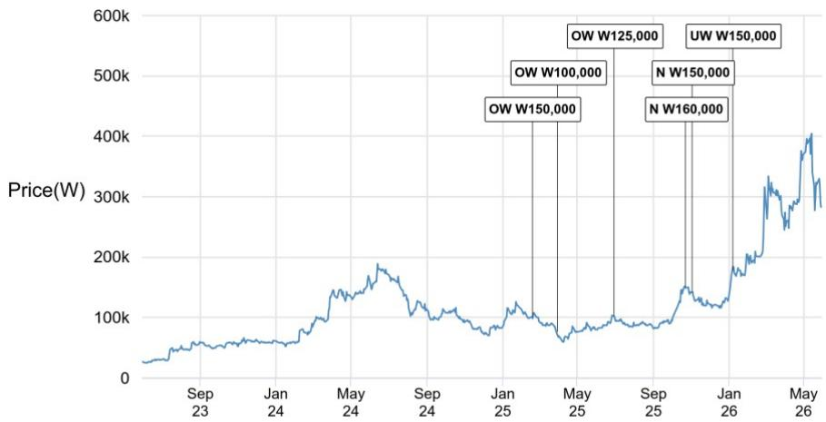

line

| Date       | Price(W) |
| ---------- | -------- |
| Jan 25     | 150,000  |
| May 25     | 100,000  |
| Sep 25     | 125,000  |
| Jan 26     | 150,000  |
| May 26     | 160,000  |

<table><tr><td>Date</td><td>Rating</td><td>Price (W)</td><td>Price Target (W)</td></tr><tr><td>18-Feb-25</td><td>OW</td><td>100900</td><td>150,000</td></tr><tr><td>31-Mar-25</td><td>OW</td><td>76500</td><td>100,000</td></tr><tr><td>30-Jun-25</td><td>OW</td><td>102900</td><td>125,000</td></tr><tr><td>23-Oct-25</td><td>N</td><td>150800</td><td>160,000</td></tr><tr><td>03-Nov-25</td><td>N</td><td>141500</td><td>150,000</td></tr><tr><td>07-Jan-26</td><td>UW</td><td>178100</td><td>150,000</td></tr></table>

Source: Bloomberg Finance L.P. and JPM; price data adjusted for stock splits and dividends. Initiated coverage Feb 18, 2025. All share prices are as of market close on the previous business day.

KIOXIA Holdings (285A) (285A.T, 285A JP) Price Chart   
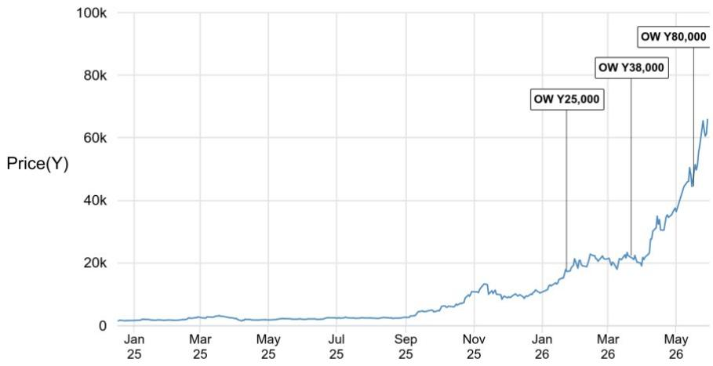

line

| Date  | Price(Y) |
|-------|----------|
| Jan 26 | 25,000   |
| Mar 26 | 38,000   |
| May 26 | 80,000   |

<table><tr><td>Date</td><td>Rating</td><td>Price (Y)</td><td>Price Target (Y)</td></tr><tr><td>23-Jan-26</td><td>OW</td><td>17910</td><td>25,000</td></tr><tr><td>22-Mar-26</td><td>OW</td><td>22360</td><td>38,000</td></tr><tr><td>17-May-26</td><td>OW</td><td>44450</td><td>80,000</td></tr></table>

Source: Bloomberg Finance L.P. and JPM; price data adjusted for stock splits and dividends. Initiated coverage Jan 23, 2026. All share prices are as of market close on the previous business day.

Samsung Electronics (005930.KS, 005930 KS) Price Chart   
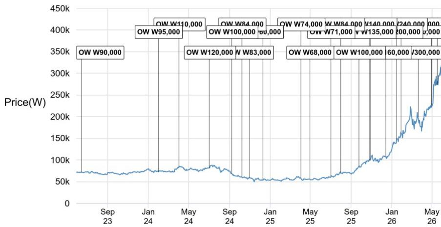

line

| Date       | Price(W) |
| ---------- | -------- |
| Sep 23     | 70k      |
| Jan 24     | 75k      |
| May 24     | 80k      |
| Sep 24     | 60k      |
| Jan 25     | 55k      |
| May 25     | 65k      |
| Sep 25     | 80k      |
| Jan 26     | 150k     |
| May 26     | 300k     |

Source: Bloomberg Finance L.P. and JPM; price data adjusted for stock splits and dividends. Initiated coverage Oct 09, 2011. All share prices are as of market close on the previous business day.

<table><tr><td>Date</td><td>Rating</td><td>Price (W)</td><td>Price Target (W)</td></tr><tr><td>15-Jun-23</td><td>OW</td><td>71900</td><td>90,000</td></tr><tr><td>01-Feb-24</td><td>OW</td><td>72700</td><td>95,000</td></tr><tr><td>03-Apr-24</td><td>OW</td><td>85000</td><td>110,000</td></tr><tr><td>03-Jul-24</td><td>OW</td><td>81800</td><td>120,000</td></tr><tr><td>08-Sep-24</td><td>OW</td><td>68900</td><td>100,000</td></tr><tr><td>08-Oct-24</td><td>OW</td><td>61000</td><td>84,000</td></tr><tr><td>31-Oct-24</td><td>OW</td><td>59100</td><td>83,000</td></tr><tr><td>10-Dec-24</td><td>N</td><td>53400</td><td>60,000</td></tr><tr><td>03-Apr-25</td><td>OW</td><td>58800</td><td>74,000</td></tr><tr><td>30-Apr-25</td><td>OW</td><td>55800</td><td>68,000</td></tr><tr><td>02-Jul-25</td><td>OW</td><td>60200</td><td>71,000</td></tr><tr><td>01-Aug-25</td><td>OW</td><td>71400</td><td>84,000</td></tr><tr><td>25-Sep-25</td><td>OW</td><td>85400</td><td>100,000</td></tr><tr><td>27-Oct-25</td><td>OW</td><td>98900</td><td>135,000</td></tr><tr><td>30-Oct-25</td><td>OW</td><td>101700</td><td>140,000</td></tr><tr><td>14-Dec-25</td><td>OW</td><td>108500</td><td>160,000</td></tr><tr><td>16-Jan-26</td><td>OW</td><td>145000</td><td>200,000</td></tr><tr><td>29-Jan-26</td><td>OW</td><td>164300</td><td>240,000</td></tr><tr><td>22-Mar-26</td><td>OW</td><td>199800</td><td>300,000</td></tr><tr><td>30-Apr-26</td><td>OW</td><td>226500</td><td>350,000</td></tr><tr><td>17-May-26</td><td>OW</td><td>273500</td><td>480,000</td></tr></table>

SK hynix (000660.KS, 000660 KS) Price Chart   
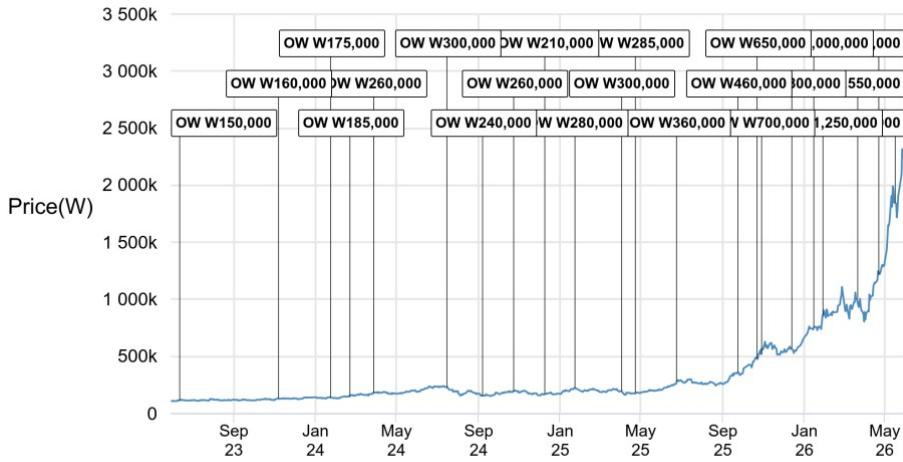

line

| Date       | Price(W) |
| ---------- | -------- |
| Sep 23     | 150,000  |
| Jan 24     | 160,000  |
| May 24     | 175,000  |
| Sep 24     | 185,000  |
| Jan 25     | 240,000  |
| May 25     | 260,000  |
| Sep 25     | 280,000  |
| Jan 26     | 360,000  |
| May 26     | 650,000  |
| Sep 26     | 700,000  |
| Jan 27     | 1,250,000|
| May 27     | 550,000  |

Source: Bloomberg Finance L.P. and JPM; price data adjusted for stock splits and dividends. Initiated coverage Dec 31, 2000. All share prices are as of market close on the previous business day.

<table><tr><td>Date</td><td>Rating</td><td>Price (W)</td><td>Price Target (W)</td></tr><tr><td>12-Jun-23</td><td>OW</td><td>115400</td><td>150,000</td></tr><tr><td>07-Nov-23</td><td>OW</td><td>133000</td><td>160,000</td></tr><tr><td>25-Jan-24</td><td>OW</td><td>141500</td><td>175,000</td></tr><tr><td>22-Feb-24</td><td>OW</td><td>149000</td><td>185,000</td></tr><tr><td>28-Mar-24</td><td>OW</td><td>181200</td><td>260,000</td></tr><tr><td>16-Jul-24</td><td>OW</td><td>230000</td><td>300,000</td></tr><tr><td>08-Sep-24</td><td>OW</td><td>156400</td><td>240,000</td></tr><tr><td>24-Oct-24</td><td>OW</td><td>196000</td><td>260,000</td></tr><tr><td>10-Dec-24</td><td>OW</td><td>168900</td><td>210,000</td></tr><tr><td>23-Jan-25</td><td>OW</td><td>225500</td><td>280,000</td></tr><tr><td>03-Apr-25</td><td>OW</td><td>197900</td><td>300,000</td></tr><tr><td>24-Apr-25</td><td>OW</td><td>181000</td><td>285,000</td></tr><tr><td>25-Jun-25</td><td>OW</td><td>278500</td><td>360,000</td></tr><tr><td>24-Sep-25</td><td>OW</td><td>361000</td><td>460,000</td></tr><tr><td>23-Oct-25</td><td>OW</td><td>481000</td><td>650,000</td></tr><tr><td>29-Oct-25</td><td>OW</td><td>519000</td><td>700,000</td></tr><tr><td>14-Dec-25</td><td>OW</td><td>571000</td><td>800,000</td></tr><tr><td>16-Jan-26</td><td>OW</td><td>756000</td><td>1,000,000</td></tr><tr><td>29-Jan-26</td><td>OW</td><td>862000</td><td>1,250,000</td></tr><tr><td>22-Mar-26</td><td>OW</td><td>1006000</td><td>1,550,000</td></tr><tr><td>23-Apr-26</td><td>OW</td><td>1220000</td><td>1,800,000</td></tr><tr><td>17-May-26</td><td>OW</td><td>1848000</td><td>3,000,000</td></tr></table>

Tokyo Electron (8035) (8035.T, 8035 JP) Price Chart   
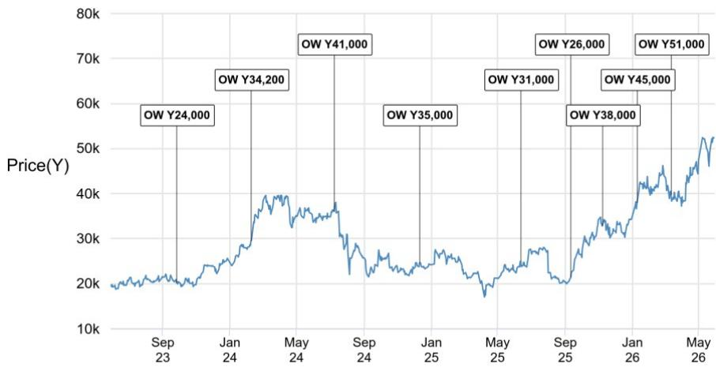

line

| Date  | Price(Y) |
|-------|----------|
| Sep 23 | 24,000   |
| Jan 24 | 34,200   |
| May 24 | 41,000   |
| Sep 24 | 35,000   |
| Jan 25 | 31,000   |
| May 25 | 26,000   |
| Sep 25 | 38,000   |
| Jan 26 | 45,000   |
| May 26 | 51,000   |

<table><tr><td>Date</td><td>Rating</td><td>Price (Y)</td><td>Price Target (Y)</td></tr><tr><td>27-Sep-23</td><td>OW</td><td>20165</td><td>24,000</td></tr><tr><td>09-Feb-24</td><td>OW</td><td>29435</td><td>34,200</td></tr><tr><td>09-Jul-24</td><td>OW</td><td>36040</td><td>41,000</td></tr><tr><td>11-Dec-24</td><td>OW</td><td>24600</td><td>35,000</td></tr><tr><td>13-Jun-25</td><td>OW</td><td>25000</td><td>31,000</td></tr><tr><td>12-Sep-25</td><td>OW</td><td>21405</td><td>26,000</td></tr><tr><td>08-Nov-25</td><td>OW</td><td>32800</td><td>38,000</td></tr><tr><td>10-Jan-26</td><td>OW</td><td>37910</td><td>45,000</td></tr><tr><td>13-Mar-26</td><td>OW</td><td>39750</td><td>51,000</td></tr></table>

Source: Bloomberg Finance L.P. and JPM; price data adjusted for stock splits and dividends. Initiated coverage Apr 04, 2001. All share prices are as of market close on the previous business day.   
The chart(s) show JPM's continuing coverage of the stocks; the current analysts may or may not have covered it over the entire period. JPM ratings or designations: OW = Overweight, N = Neutral, UW = Underweight, NR = Not Rated

# Explanation of Equity Research Ratings, Designations and Analyst(s) Coverage Universe:

JPM uses the following rating system: Overweight (over the duration of the price target indicated in this report, we expect this stock will outperform the average total return of the stocks in the Research Analyst's, or the Research Analyst's team's, coverage universe); Neutral (over the duration of the price target indicated in this report, we expect this stock will perform in line with the average total return of the stocks in the Research Analyst's, or the Research Analyst's team's, coverage universe); and Underweight (over the duration of the price target indicated in this report, we expect this stock will underperform the average total return of the stocks in the Research Analyst's, or the Research Analyst's team's, coverage universe. NR is Not Rated. In this case, JPM has removed the rating and, if applicable, the price target, for this stock because of either a lack of a sufficient fundamental basis or for legal, regulatory or policy reasons. The previous rating and, if applicable, the price target, no longer should be relied upon. An NR designation is not a recommendation or a rating. Some stocks under coverage have a rating but no price target; in these cases, we expect the stock will outperform/perform in line/underperform the average total return of the stocks in the Research Analyst's, or the Research Analyst's team's, coverage universe of the relevant duration of the region. In our Asia (ex-Australia and ex-India) and U.K. small- and mid-cap Equity Research, each stock's expected total return is compared to the expected total return of a benchmark country market index, not to those Research Analysts' coverage universe. If it does not appear in the Important Disclosures section of this report, the certifying Research Analyst's coverage universe can be found on JPM's Research website, https://www.JPMmarkets.com.

Coverage Universe: Kwon, Jay : LG Corp (003550.KS), LG Display (034220.KS), LG Electronics (066570.KS), LG Innotek (011070.KS), Nanya Technology (2408.TW), SK Inc (034730.KS), SK hynix (000660.KS), SKC (011790.KS), Samsung C&T (028260.KS), Samsung Electro-Mechanics (009150.KS), Samsung Electronics (005930.KS), Samsung SDS (018260.KS)

JPM Equity Research Ratings Distribution, as of April 04, 2026 

<table><tr><td></td><td>Overweight (buy)</td><td>Neutral (hold)</td><td>Underweight (sell)</td></tr><tr><td>JPM Global Equity Research Coverage*</td><td>51%</td><td>37%</td><td>12%</td></tr><tr><td>IB clients**</td><td>83%</td><td>79%</td><td>74%</td></tr><tr><td>JPMS Equity Research Coverage*</td><td>49%</td><td>39%</td><td>13%</td></tr><tr><td>IB clients**</td><td>94%</td><td>93%</td><td>85%</td></tr></table>

\*Please note that the percentages may not add to 100% because of rounding.   
\*\*Percentage of subject companies within each of the "buy," "hold" and "sell" categories for which JPM has provided investment banking services within the previous 12 months.   
For purposes of FINRA ratings distribution rules only, our Overweight rating falls into a buy rating category; our Neutral rating falls into a hold rating category; and our Underweight rating falls into a sell rating category. Please note that stocks with an NR designation are not included in the table above. This information is current as of the end of the most recent calendar quarter.

Equity Valuation and Risks: For valuation methodology and risks associated with covered companies or price targets for covered companies, please see the most recent company-specific research report at http://www.JPMmarkets.com, contact the primary analyst or your JPM representative, or email research.disclosure.inquiries@JPM.com. For material information about the proprietary models used, please see the Summary of Financials in company-specific research reports and the Company Tearsheets, which are available to download on the company pages of our client website, http://www.JPMmarkets.com. This report also sets out within it the material underlying

assumptions used.

# History of Investment Recommendations:

A history of JPM investment recommendations disseminated during the preceding 12 months can be accessed on the Research & Commentary page of http://www.JPMmarkets.com where you can also search by analyst name, sector or financial instrument.

Analysts' Compensation: The research analysts responsible for the preparation of this report receive compensation based upon various factors, including the quality and accuracy of research, client feedback, competitive factors, and overall firm revenues.

Registration of non-US Analysts: Unless otherwise noted, the non-US analysts listed on the front of this report are employees of non-US affiliates of JPM Securities LLC, may not be registered as research analysts under FINRA rules, may not be associated persons of JPM Securities LLC, and may not be subject to FINRA Rule 2241 or 2242 restrictions on communications with covered companies, public appearances, and trading securities held by a research analyst account.

# Other Disclosures

JPM is a marketing name for investment banking businesses of JPM Chase & Co. and its subsidiaries and affiliates worldwide.

UK MIFID FICC research unbundling exemption: UK clients should refer to UK MIFID Research Unbundling exemption for details of JPM's implementation of the FICC research exemption and guidance on relevant FICC research categorisation.

All research material made available to clients are simultaneously available on our client website, JPM Markets, unless specifically permitted by relevant laws. Not all research content is redistributed, e-mailed or made available to third-party aggregators. For all research material available on a particular stock, please contact your sales representative.

Any long form nomenclature for references to China; Hong Kong; Taiwan; and Macau within this research material are Mainland China; Hong Kong SAR (China); Taiwan (China); and Macau SAR (China).

JPM may, from time to time, write on issuers or securities targeted by economic or financial sanctions imposed or administered by the governmental authorities of the U.S., EU, UK or other relevant jurisdictions (Sanctioned Securities). Nothing in this report is intended to be read or construed as encouraging, facilitating, promoting or otherwise approving investment or dealing in such Sanctioned Securities. Clients should be aware of their own legal and compliance obligations when making investment decisions.

Any digital or crypto assets discussed in this research report are subject to a rapidly changing regulatory landscape. For relevant regulatory advisories on crypto assets, including bitcoin and ether, please see https://www.JPM.com/disclosures/cryptoasset-disclosure.

The author(s) of this research report may not be licensed to carry on regulated activities in your jurisdiction and, if not licensed, do not hold themselves out as being able to do so.

Exchange-Traded Funds (ETFs): JPM Securities LLC (“JPMS”) acts as authorized participant for substantially all U.S.-listed ETFs. To the extent that any ETFs are mentioned in this report, JPMS may earn commissions and transaction-based compensation in connection with the distribution of those ETF shares and may earn fees for performing other trade-related services, such as securities lending to short sellers of the ETF shares. JPMS may also perform services for the ETFs themselves, including acting as a broker or dealer to the ETFs. In addition, affiliates of JPMS may perform services for the ETFs, including trust, custodial, administration, lending, index calculation and/or maintenance and other services.

Options and Futures related research: If the information contained herein regards options- or futures-related research, such information is available only to persons who have received the proper options or futures risk disclosure documents. Please contact your JPM Representative or visit https://www.theocc.com/components/docs/riskstoc.pdf for a copy of the Option Clearing Corporation's Characteristics and Risks of Standardized Options or https://www.finra.org/sites/default/files/2020-08/Security\_Futures\_Risk\_Disclosure\_Statement\_2020.pdf for a copy of the Security Futures Risk Disclosure Statement.

Changes to Interbank Offered Rates (IBORs) and other benchmark rates: Certain interest rate benchmarks are, or may in the future become, subject to ongoing international, national and other regulatory guidance, reform and proposals for reform. For more information, please consult: https://www.JPM.com/global/disclosures/interbank\_offered\_rates

Notification for Credit Ratings: If this material includes credit ratings, such credit ratings provided by Japan Credit Rating Agency, Ltd. (JCR) and Rating and Investment Information, Inc. (R&I), are credit ratings provided by Registered Credit Rating Agencies (credit rating agencies registered under the Financial Instruments and Exchange Law of Japan (FIEL)). With respect to credit ratings that are provided by credit rating agencies other than JCR and R&I and have no stipulation that such credit ratings are provided by Registered Credit Rating Agencies, this means that such credit ratings are Non Registered Ratings (credit ratings provided by credit rating agencies not registered under the FIEL). Among the Non Registered Ratings, with respect to those credit ratings provided by S&P Global Ratings (S&P), Moody's Investors Service (Moody's), or Fitch Ratings (Fitch), prior to making investment decision based on such Non Registered Ratings, please carefully read the “Explanation Letter regarding Non Registered Ratings” for the corresponding credit rating agency, which we separately have sent or will send.

Private Bank Clients: Where you are receiving research as a client of the private banking businesses offered by JPM Chase & Co. and its subsidiaries (“JPM Private Bank”), research is provided to you by JPM Private Bank and not by any other division of JPM, including, but not limited to, the JPM Corporate and Investment Bank and its Global Research division.

Legal entity responsible for the production and distribution of research: The legal entity identified below the name of the Reg AC Research Analyst who authored this material is the legal entity responsible for the production of this research. Where multiple Reg AC Research Analysts authored this material with different legal entities identified below their names, these legal entities are jointly responsible for the production of this research. Where more than one legal entity is listed under an analyst's name, the first legal entity is responsible for the production unless stated otherwise. Research Analysts from various JPM affiliates may have contributed to the production of this material but may not be licensed to carry out regulated activities in your jurisdiction (and do not hold themselves out as being able to do so). Unless otherwise stated below in the legal entity disclosures, this material has been distributed by the legal entity responsible for production, or where more than one legal entity is listed under the analyst's name, the first legal entity will be responsible for distribution. If you have any queries, please contact the relevant Research Analyst in your jurisdiction or the entity in your jurisdiction that has distributed this research material.

# Legal Entities Disclosures and Country-/Region-Specific Disclosures:

Argentina: JPM Chase Bank N.A Sucursal Buenos Aires is regulated by Banco Central de la República Argentina (“BCRA”- Central Bank of Argentina) and Comisión Nacional de Valores (“CNV”- Argentinian Securities Commission - ALYC y AN Integral N°51).

Australia: JPM Securities Australia Limited (“JPMSAL”) (ABN 61 003 245 234/AFS Licence No: 238066) is regulated by the Australian Securities and Investments Commission and is a Market Participant of ASX Limited, a Clearing and Settlement Participant of ASX Clear Pty Limited and a Clearing Participant of ASX Clear (Futures) Pty Limited. This material is issued and distributed in Australia by or on behalf of JPMSAL only to "wholesale clients" (as defined in section 761G of the Corporations Act 2001). A list of all financial products covered can be found by visiting https://www.jpmm.com/research/disclosures. JPM seeks to cover companies of relevance to the domestic and international investor base across all Global Industry Classification Standard (GICS) sectors, as well as across a range of market capitalisation sizes. If applicable, in the course of conducting public side due diligence on the subject company(ies), the Research Analyst team may at times perform such diligence through corporate engagements such as site visits, discussions with company representatives, management presentations, etc. Research issued by JPMSAL has been prepared in accordance with JPM Australia’s Research Independence Policy which can be found at the following link: JPM Australia - Research Independence Policy.

Brazil: Banco JPM S.A. is regulated by the Comissao de Valores Mobiliarios (CVM) and by the Central Bank of Brazil. Ombudsman JPM: 0800-7700847 / 0800-7700810 (For Hearing Impaired) / ouvidoria.jp.morgan@jpmchase.com.

Canada: JPM Securities Canada Inc. is a registered investment dealer, regulated by the Canadian Investment Regulatory Organization and the Ontario Securities Commission and is the participating member on Canadian exchanges. This material is distributed in Canada by or on behalf of JPM Securities Canada Inc.

Chile: Inversiones JPM Limitada is an unregulated entity incorporated in Chile.

China: JPM Securities (China) Company Limited has been approved by CSRC to conduct the securities investment consultancy business.

Colombia: Banco JPM Colombia S.A. is supervised by the Superintendencia Financiera de Colombia (SFC). Any reference in this material to products or services offered abroad by entities other than the Bank in Colombia is included exclusively for descriptive purposes. Such references do not constitute, and should not be construed as, promotional activity or the provision of financial products or services within Colombian territory, as defined under applicable Colombian regulation.

Dubai International Financial Centre (DIFC): JPM Chase Bank, N.A., Dubai Branch is regulated by the Dubai Financial Services Authority (DFSA) and its registered address is Dubai International Financial Centre - The Gate, West Wing, Level 3 and 9 PO Box 506551, Dubai, UAE. This material has been distributed by JPM Chase Bank, N.A., Dubai Branch to persons regarded as professional clients or market counterparties as defined under the DFSA rules.

European Economic Area (EEA): Unless specified to the contrary, research is distributed in the EEA by JPM SE (“JPM SE”), which is authorised as a credit institution by the Federal Financial Supervisory Authority (Bundesanstalt für Finanzdienstleistungsaufsicht, BaFin) and jointly supervised by the BaFin, the German Central Bank (Deutsche Bundesbank) and the European Central Bank (ECB). JPM SE is a company headquartered in Frankfurt with registered address at TaunusTurm, Taunustor 1, Frankfurt am Main, 60310, Germany. The material has been distributed in the EEA to persons regarded as professional investors (or equivalent) pursuant to Art. 4 para. 1 no. 10 and Annex II of MiFID II and its respective implementation in their home jurisdictions (“EEA professional investors”). This material must not be acted on or relied on by persons who are not EEA professional investors. Any investment or investment activity to which this material relates is only available to EEA relevant persons and will be engaged in only with EEA relevant persons.

Hong Kong: JPM Securities (Asia Pacific) Limited (CE number AAJ321) is regulated by the Hong Kong Monetary Authority and the Securities and Futures Commission in Hong Kong, and JPM Broking (Hong Kong) Limited (CE number AAB027) is regulated by the Securities and Futures Commission in Hong Kong. JPM Chase Bank, N.A., Hong Kong Branch (CE Number AAL996) is regulated by the Hong Kong Monetary Authority and the Securities and Futures Commission, is organized under the laws of the United States with limited liability. Where the distribution of this material is a regulated activity in Hong Kong, the material is distributed in Hong Kong by or through JPM Securities (Asia Pacific) Limited and/or JPM Broking (Hong Kong) Limited.

India: JPM India Private Limited (Corporate Identity Number - U67120MH1992FTC068724), having its registered office at JPM Tower, Off. C.S.T. Road, Kalina, Santacruz - East, Mumbai – 400098, is registered with the Securities and Exchange Board of India (SEBI) as a 'Research Analyst' having registration number INH000001873. JPM India Private Limited is also registered with SEBI as a member of the National Stock Exchange of India Limited and the Bombay Stock Exchange Limited (SEBI Registration Number – INZ000239730) and as a Merchant Banker (SEBI Registration Number - MB/INM000002970). Telephone: 91-22-6157 3000, Facsimile: 91-22-6157 3990 and Website: http://www.jpmipl.com. JPM Chase Bank, N.A. - Mumbai Branch is licensed by the Reserve Bank of India (RBI) (Licence No. 53/Licence No. BY.4/94; SEBI - IN/CUS/014/ CDSL : IN-DP-CDSL-444-2008/ IN-DP-NSDL-285-2008/ INBI00000984/ INE231311239) as a Scheduled Commercial Bank in India, which is its primary license allowing it to carry on Banking business in India and other activities, which a Bank branch in India are permitted to undertake. For non-local research material, this material is not distributed in India by JPM India Private Limited. Compliance Officer: Ashutosh Sharma; ashutosh.j.sharma@jpmchase.com; +912261575002. Grievance Officer: Ramprasadh K, jpmipl.research.feedback@JPM.com; +912261573000. Registration granted by SEBI and certification from NISM in no way guarantee performance of the intermediary or provide any assurance of returns to investors. Please visit Terms and Conditions and Most Important Terms and Conditions (MITC). The annual Compliance audit report is available at http://www.jpmipl.com/#research.

Indonesia: PT JPM Sekuritas Indonesia is a member of the Indonesia Stock Exchange and is registered and supervised by the Otoritas Jasa Keuangan (OJK).

Korea: JPM Securities (Far East) Limited, Seoul Branch, is a member of the Korea Exchange (KRX). JPM Chase Bank, N.A., Seoul Branch, is licensed as a branch office of foreign bank (JPM Chase Bank, N.A.) in Korea. Both entities are regulated by the Financial Services Commission (FSC) and the Financial Supervisory Service (FSS). For non-macro research material, the material is distributed in Korea by or through JPM Securities (Far East) Limited, Seoul Branch.

Japan: JPM Securities Japan Co., Ltd. and JPM Chase Bank, N.A., Tokyo Branch are regulated by the Financial Services Agency in Japan.

Malaysia: This material is issued and distributed in Malaysia by JPM Securities (Malaysia) Sdn Bhd (18146-X), which is a Participating Organization of Bursa Malaysia Berhad and holds a Capital Markets Services License issued by the Securities Commission in Malaysia.

Mexico: JPM Casa de Bolsa, S.A. de C.V., JPM Grupo Financiero is member of the Mexican Stock Exchange (“Bolsa Mexicana de Valores”) and the Institutional Stock Exchange (“Bolsa Institucional de Valores”), and it is authorized to act as a broker dealer by the National Banking and Securities Exchange Commission (“Comisión Nacional Bancaria y de Valores”).

New Zealand: This material is issued and distributed by JPMSAL in New Zealand only to "wholesale clients" (as defined in the Financial Markets Conduct Act 2013). JPMSAL is registered as a Financial Service Provider under the Financial Service providers (Registration and Dispute Resolution) Act of 2008.

Philippines: JPM Securities Philippines Inc. is a Trading Participant of the Philippine Stock Exchange and a member of the Securities Clearing Corporation of the Philippines and the Securities Investor Protection Fund. It is regulated by the Securities and Exchange Commission.

Singapore: This material is issued and distributed in Singapore by or through JPM Securities Singapore Private Limited (JPMSS) [MDDI (P) 057/08/2025 and Co. Reg. No.: 199405335R], which is a member of the Singapore Exchange Securities Trading Limited, and/or JPM Chase Bank, N.A., Singapore branch (JPMCB Singapore), both of which are regulated by the Monetary Authority of Singapore. This material is issued and distributed in Singapore only to accredited investors, expert investors and institutional investors, as defined in Section 4A of the Securities and Futures Act, Cap. 289 (SFA). This material is not intended to be issued or distributed to any retail investors or any other investors that do not fall into the classes of “accredited investors,” “expert investors” or “institutional investors,” as defined under Section 4A of the SFA. Recipients of this material in Singapore are to contact JPMSS or JPMCB Singapore in respect of any matters arising from, or in connection with, the material.

South Africa: JPM Equities South Africa Proprietary Limited and JPM Chase Bank, N.A., Johannesburg Branch are members of the Johannesburg Securities Exchange and are regulated by the Financial Services Conduct Authority (FSCA).

Taiwan: JPM Securities (Taiwan) Limited is a participant of the Taiwan Stock Exchange (company-type) and regulated by the Taiwan Securities and Futures Bureau. Material relating to equity securities is issued and distributed in Taiwan by JPM Securities (Taiwan) Limited, subject to the license scope and the applicable laws and the regulations in Taiwan. To the extent that JPM Securities (Taiwan) Limited produces research materials on securities not listed on the Taiwan Stock Exchange or Taipei Exchange (“Non-Taiwan Listed Securities”), these materials shall not constitute securities recommendations for the purpose of applicable Taiwan regulations, and, for the avoidance of doubt, JPM Securities (Taiwan) Limited does not act as broker for Non-Taiwan Listed Securities. According to Paragraph 2, Article 7-1 of Operational Regulations Governing Securities Firms Recommending Trades in Securities to Customers (as amended or supplemented) and/or other applicable laws or regulations, please note that the recipient of this material is not permitted to engage in any activities in connection with the material that may give rise to conflicts of interests, unless otherwise disclosed in the “Important Disclosures” in this material.

Thailand: This material is issued and distributed in Thailand by JPM Securities (Thailand) Ltd., which is a member of the Stock Exchange of Thailand and is regulated by the Ministry of Finance and the Securities and Exchange Commission. The registered address is 548 One City Center Building, 50th Floor, Ploenchit Road, Lymphini, Pathum Wan, Bangkok 10330.

UK: Research is produced in the UK by JPM Securities plc (“JPMS plc”) which is a member of the London Stock Exchange and is authorised by the Prudential Regulation Authority and regulated by the Financial Conduct Authority and the Prudential Regulation Authority or JPM Markets Limited (“JPMML Ltd”) which is authorised and regulated by the Financial Conduct Authority. Unless specified to the contrary, this material is distributed in the UK by JPMS plc and is directed in the UK only to: (a) persons having professional experience in matters relating to investments falling within article 19(5) of the Financial Services and Markets Act 2000 (Financial Promotion) (Order) 2005 (“the FPO”); (b) persons outlined in article 49 of the FPO (high net worth companies, unincorporated associations or partnerships, the trustees of high value trusts, etc.); or (c) any persons to whom this communication may otherwise lawfully be made; all such persons being referred to as "UK relevant persons". This material must not be acted on or relied on by persons who are not UK relevant persons. Any investment or investment activity to which this material relates is only available to UK relevant persons and will be engaged in only with UK relevant persons. A description of JPM EMEA’s policy for prevention and avoidance of conflicts of interest related to the production of Research can be found at the following link: JPM EMEA - Research Independence Policy.

U.S.: JPM Securities LLC (“JPMS”) is a member of the NYSE, FINRA, SIPC, and the NFA. JPM Chase Bank, N.A. is a member of the FDIC. Material published by non-U.S. affiliates is distributed in the U.S. by JPMS who accepts responsibility for its content.

General: Additional information is available upon request. The information in this material has been obtained from sources believed to be reliable. While all reasonable care has been taken to ensure that the facts stated in this material are accurate and that the forecasts, opinions and expectations contained herein are fair and reasonable, JPM Chase & Co. or its affiliates and/or subsidiaries (collectively JPM) make no representations or warranties whatsoever to the completeness or accuracy of the material provided, except with respect to any disclosures relative to JPM and the Research Analyst's involvement with the issuer that is the subject of the material. Accordingly, no reliance should be placed on the accuracy, fairness or completeness of the information contained in this material. There may be certain discrepancies with data and/or limited content in this material as a result of calculations, adjustments, translations to different languages, and/or local regulatory restrictions, as applicable. These discrepancies should not impact the overall investment analysis, views and/or recommendations of the subject company(ies) that may be discussed in the material. Artificial intelligence tools may have been used in the preparation of this material, including assisting in data analysis, pattern recognition, and content drafting for research material. JPM accepts no liability whatsoever for any loss arising from any use of this material or its contents, and neither JPM nor any of its respective directors, officers or employees, shall be in any way responsible for the contents hereof, apart from the liabilities and responsibilities that may be imposed on them by the relevant regulatory authority in the jurisdiction in question, or the regulatory regime thereunder. Opinions, forecasts or projections contained in this material represent JPM's current opinions or judgment as of the date of the material only and are therefore subject to change without notice. Periodic updates may be provided on companies/industries based on company-specific developments or announcements, market conditions or any other publicly available information. There can be no assurance that future results or events will be consistent with any such opinions, forecasts or projections, which represent only one possible outcome. Furthermore, such opinions, forecasts or projections are subject to certain risks, uncertainties and assumptions that have not been verified, and future actual results or events could differ materially. The value of, or income from, any investments referred to in this material may fluctuate and/or be affected by changes in exchange rates. All pricing is indicative as of the close of market for the securities discussed, unless otherwise stated. Past performance is not indicative of future results. Accordingly, investors may receive back less than originally invested. This material is not intended as an offer or solicitation for the purchase or sale of any financial instrument. The opinions and recommendations herein do not take into account individual client circumstances, objectives, or needs and are not intended as recommendations of particular securities, financial instruments or strategies to particular clients. This material may include views on structured securities, options, futures and other derivatives. These are complex instruments, may involve a high degree of risk and may be appropriate investments only for sophisticated investors who are capable of understanding and assuming the risks involved. The recipients of this material must make their own independent decisions regarding any securities or financial instruments mentioned herein and should seek advice from such independent financial, legal, tax or other adviser as they deem necessary. JPM may trade as a principal on the basis of the Research Analysts' views and research, and it may also engage in transactions for its own account or for its clients' accounts in a manner inconsistent with the views taken in this material, and JPM is under no obligation to ensure that such other communication is brought to the attention of any recipient of this material. Others within JPM, including Strategists, Sales staff and other Research Analysts, may take views that are inconsistent with those taken in this material. Employees of JPM not involved in the preparation of this material may have investments in the securities (or derivatives of such securities) mentioned in this material and may trade them in ways different from those discussed in this material. This material is not an advertisement for or marketing of any issuer, its products or services, or its securities in any jurisdiction.

Confidentiality and Security Notice: This transmission may contain information that is privileged, confidential, legally privileged, and/or exempt from disclosure under applicable law. If you are not the intended recipient, you are hereby notified that any disclosure, copying, distribution, or use of the information contained herein (including any reliance thereon) is STRICTLY PROHIBITED. Although this transmission and any attachments are believed to be free of any virus or other defect that might affect any computer system into which it is received and opened, it is the responsibility of the recipient to ensure that it is virus free and no responsibility is accepted by JPM Chase & Co., its subsidiaries and affiliates, as applicable, for any loss or damage arising in any way from its use. If you received this transmission in error, please immediately contact the sender and destroy the material in its entirety, whether in electronic or hard copy format. This message is subject to electronic monitoring: https://www.JPM.com/disclosures/email

MSCI: Certain information herein (“Information”) is reproduced by permission of MSCI Inc., its affiliates and information providers (“MSCI”) ©2026. No reproduction or dissemination of the Information is permitted without an appropriate license. MSCI MAKES NO EXPRESS OR IMPLIED WARRANTIES (INCLUDING MERCHANTABILITY OR FITNESS) AS TO THE INFORMATION AND DISCLAIMS ALL LIABILITY TO THE EXTENT PERMITTED BY LAW. No Information constitutes investment advice, except for any applicable Information from MSCI ESG Research. Subject also to msci.com/disclaimer

Sustainalytics: Certain information, data, analyses and opinions contained herein are reproduced by permission of Sustainalytics and: (1) includes the proprietary information of Sustainalytics; (2) may not be copied or redistributed except as specifically authorized; (3) do not constitute investment advice nor an endorsement of any product or project; (4) are provided solely for informational purposes; and (5) are not warranted to be complete, accurate or timely. Sustainalytics is not responsible for any trading decisions, damages or other losses related to it or its use. The use of the data is subject to conditions available at https://www.sustainalytics.com/legal-disclaimers. ©2026 Sustainalytics. All Rights Reserved.

"Other Disclosures" last revised May 16, 2026.

Copyright 2026 JPM Chase & Co. All rights reserved. This material or any portion hereof may not be reprinted, sold or redistributed without the written consent of JPM. It is strictly prohibited to use or share without prior written consent from JPM any research material received from JPM or an authorized third-party (“JPM Data”) in any third-party artificial intelligence (“AI”) systems or models when such JPM Data is accessible by a third-party.

Completed 29 May 2026 09:53 PM HKT

Disseminated 29 May 2026 09:54 PM HKT