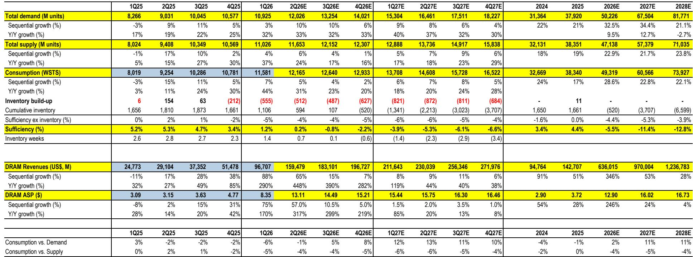
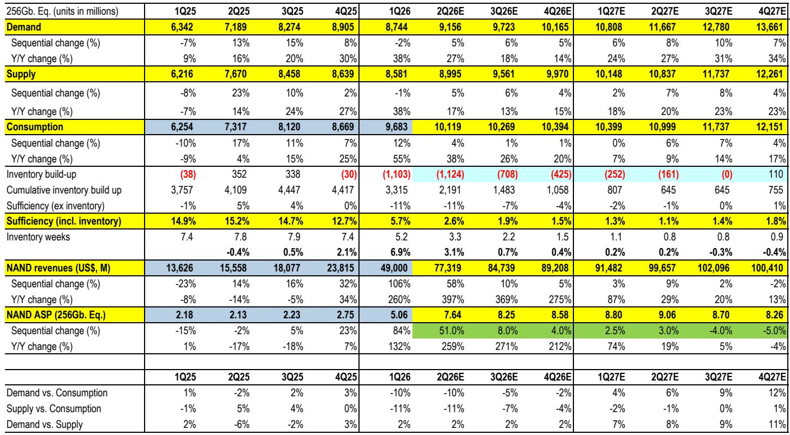
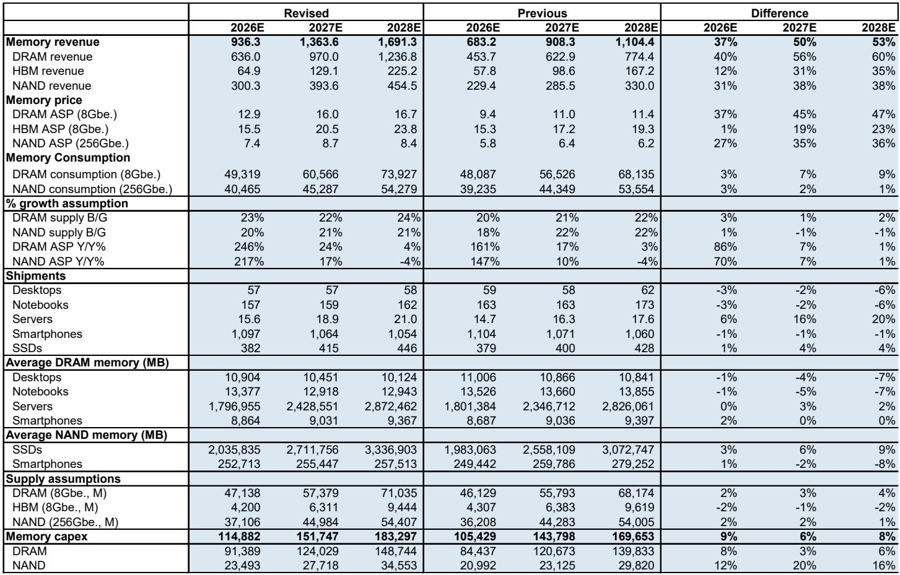

# 市场真正低估的不是需求，而是供给侧的再定价

过去三个月，全球存储芯片板块的市值已经翻倍有余。但如果你问大多数机构投资者，他们依然在纠结同一个问题：这轮景气周期能持续多久？价格会不会在某个时点突然崩盘？

这种担忧是有历史依据的。存储行业过去二十年经历了无数次“繁荣-过剩-崩塌”的循环，每一次投资者都以为这次不一样，结果证明每次都一样。但这份来自某外资投行的最新研报，给出了一个值得认真对待的论证框架：**真正被低估的，是供给端正在发生的结构性变化，而非需求端的短暂爆发。**

报告的核心判断并不复杂：AI对存储的需求正在从GPU向CPU扩散，HBM的晶圆产能挤占效应持续加剧，而NAND领域的供给纪律比历史上任何时候都更严格。三个因素叠加的结果，是存储TAM（可寻址市场）将在2027年达到1.3万亿美元，而当前市值只反映了约3.6倍的P/S倍数，远低于历史峰值。

更关键的是，报告提出了一个投资者尚未充分定价的变量：长期协议（LTA）的合同销售占比正在上升。这意味着，即使现货价格出现波动，存储厂商的盈利稳定性也将显著高于以往周期。如果这一判断成立，那么整个板块的估值框架就需要重新校准。

以下是我们从这份深度研报中提炼出的五个层次洞察，它们共同指向同一个结论：存储板块正在从“周期性商品”向“战略性资产”转型，而市场对这一转型的定价才刚刚开始。

## 1. AI对存储的需求正在从GPU向CPU扩散，这是一个尚未被充分定价的结构性增量

多数投资者对AI存储需求的理解，仍然集中在HBM（高带宽内存）和GPU配套的DRAM上。但报告揭示了一个更重要的趋势：CPU侧的AI工作负载正在加速增长。

这里的逻辑并不复杂。AI推理和训练不仅需要GPU进行大规模并行计算，还需要CPU承担任务编排、状态管理和API执行等工作。随着AI应用从训练走向部署，CPU侧的存储需求将显著放大。报告指出，过去三年CPU与GPU的比例从5.4:1持续下降至3.2:1，预计到2028年将进一步降至2.4:1。这一趋势的背后，是主要CSP客户正在加速自研CPU（如Graviton/Axion），并计划从2027年下半年开始大规模部署。

这意味着什么？意味着市场对AI存储需求的测算，可能低估了CPU侧带来的增量。报告因此将2027-2028财年服务器级DDR/LPDDR5的比特需求预测上调了20-22%。如果这一趋势成立，那么存储厂商的盈利基础将比市场预期的更宽、更稳定。

## 2. HBM的晶圆挤占效应正在从“周期性紧张”演变为“结构性短缺”

HBM对传统DRAM的产能挤占，是近年来存储行业最核心的供给约束。但这份报告给出了一个更具冲击力的量化判断：到2028年，HBM将占用DRAM晶圆产能的31%，而2026年这一比例仅为24%。

更值得关注的是，报告认为HBM的ASP（平均售价）存在上行风险。原因有三：第一，ASIC需求加速，其比特占比从2026年的33%将升至2027年的39%；第二，尽管NVDA Rubin GPU的预测有所下调，但更强的GB系统构建正在形成对冲；第三，HBM4E的产品生命周期可能比预期更长，12Hi产品的渗透速度可能慢于市场预期。

这意味着，存储厂商在HBM上的定价权正在增强。报告预计，明年HBM在同类产品基础上ASP将同比增长10%，而混合口径下（考虑产品组合变化）增幅可达30%。当HBM的每比特收入超过非HBM产品时，厂商有足够动力将更多晶圆产能转向HBM，从而进一步加剧传统DRAM的供给紧张。

## 3. NAND领域的供给纪律正在重塑，eSSD将成为下一个价值高地

如果说DRAM的故事是“产能被HBM挤占”，那么NAND的故事则是“主动控制供给”。报告指出，NAND领域的资本开支仍低于历史峰值水平，而企业级SSD（eSSD）的需求正在爆发。

eSSD市场正在经历一个量价齐升的阶段。报告估算，2026年eSSD市场规模将超过500EB，占NAND比特总需求的43%；而到2028年，这一数字将超过1100EB，年复合增长率达到52%。考虑到eSSD的ASP溢价，其价值TAM可能在未来两年超过3000亿美元——这甚至将超过HBM的市场规模。

更重要的是，技术路线正在发生变化。SLC（单层单元）高速SSD正在获得更强的市场牵引力，而SLC每晶圆的比特产出低于TLC/QLC，这意味着在同等资本开支下，NAND的有效供给增长将受到抑制。如果SLC占比持续提升，NAND的供需格局将比市场预期的更紧张。

## 4. 存储正在从“商品”变成“战略资产”，但这恰恰是估值折价的根源

报告引用了美光CEO的一个关键表述：存储正在变成一种战略资产。对于CSP（云服务提供商）而言，稳定的存储采购对于AI服务的运行质量至关重要。数据显示，存储占CSP硬件资本开支的比例，已经从AI初期的15%左右，上升到今年的超过50%。

但有趣的是，恰恰是这一趋势引发了投资者的担忧。很多投资者担心，如果存储的价值占比继续攀升，CSP可能会重新审视其采购策略，从而压制存储厂商的定价空间。这正是存储板块当前估值偏低的核心原因——市场认为，存储厂商的高盈利不可持续，因为客户不会容忍供应商拿走太多价值。

报告对此持有不同看法。它认为，更高的CSP硬件资本开支（预计2027年将达到近万亿美元）和更长的投资周期（NVDA对2030年3-4万亿美元支出的展望），将有助于缓解市场对存储盈利可持续性的担忧。但这里仍需验证：如果AI的商业化落地慢于预期，或者电力基础设施的交付出现延迟，CSP的资本开支节奏确实可能放缓，进而影响存储需求。

## 5. 新的估值框架正在形成，但路径不会平坦

报告提出了一个值得深思的估值框架转变：从传统的P/S或P/E倍数，转向基于长期协议（LTA）的盈利稳定性定价。

核心逻辑是：随着LTA合同销售占比上升，存储厂商的盈利波动性将显著下降。即使现货价格出现周期性调整，LTA合同也能为厂商提供稳定的收入基础。报告估算，未来三年存储行业的平均营业利润率将维持在75%以上，远高于历史水平。如果市场开始接受这一新的盈利模式，那么3.6倍的P/S倍数显然偏低——历史上，在类似盈利水平下，P/S倍数曾达到4-5倍。

但报告也坦诚地指出，这一估值框架的转变不会是线性的。市场需要看到更多证据，证明LTA合同确实能够平滑周期、证明CSP不会主动压价、证明供给纪律不会在盈利高峰时被打破。这些不确定性，恰恰是当前估值折价的核心来源。

**报告尚未完全回答的关键问题：** 如果CSP开始自研存储芯片，或者通过长期合同锁定价格后，是否反而会削弱存储厂商的议价权？此外，中国厂商在DRAM/NAND领域的份额提升（预计到2028年DRAM价值份额达10%、NAND价值份额达12%），是否会成为中期供给侧的扰动因素？这些问题值得持续跟踪。

---

以上是我们基于这份研报核心逻辑的深度解读。如果你对以下问题感兴趣，欢迎来星球微信群里继续讨论：

- HBM4E的产品生命周期假设是否过于保守？如果12Hi产品加速渗透，对供需格局意味着什么？
- 中国存储厂商的产能扩张能否真正改变全球供需格局？设备出口限制政策（如MATCH Act）将如何演变？
- 如果LTA合同占比提升，存储板块的估值倍数应该对标工业股还是科技股？

这些问题的答案，可能直接影响你对存储板块未来12-18个月的投资判断。我们会在社群中持续跟踪这些变量的变化，并分享更多原始图表和细节数据。

Personal reading notes and learning share only. Not investment advice.

