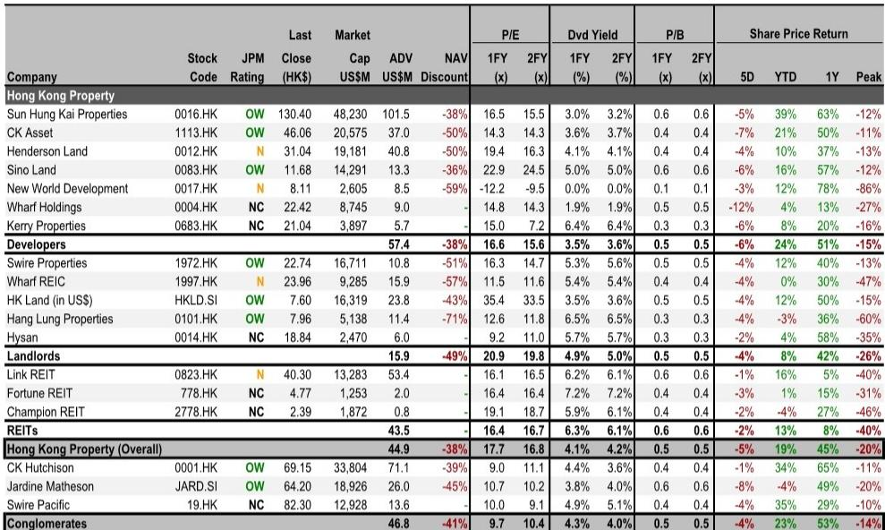
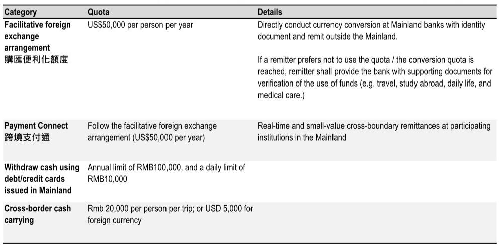
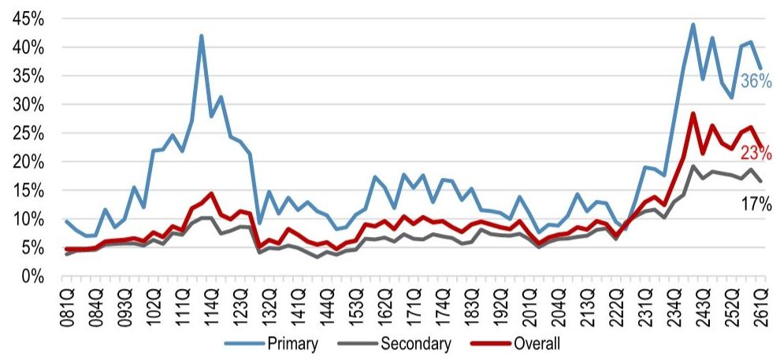

# 香港楼市真正的脆弱点不是资本管制，而是市场如何重新定价“内地购买力”

过去一周，香港地产股跑输恒指约3个百分点。触发因素并非基本面恶化，而是一则来自监管层的信号：中国证监会近期启动了对非法跨境证券业务的整治，富途等券商被处罚。市场很快将这个动作与“资本外流管控是否会收紧”联系起来，继而担忧内地资金赴港购房的通道可能被进一步压缩。

这是一次典型的“先卖后问”式避险。截至研报发布时，没有任何直接证据表明内地政府已出台针对香港购房的资本管制新政。但市场的反应本身值得追问：如果这一担忧成真，香港楼市的上升周期是否会被打断？

某外资投行最新发布的香港住宅物业研报，恰好为这个问题提供了迄今最完整的量化分析框架。报告的核心结论是：即便在最极端的情景下——假设所有基于内地的内地购房者需求全部消失——2026年全年住宅交易额仍能实现12%的同比增长。这个数字本身，已经足够说明问题。

真正值得关注的，不是资本管制这个单一变量，而是市场对“内地购买力”这一概念的结构性误读。这份报告的价值，不在于它预测了楼价涨跌，而在于它拆解了“内地买家”这四个字背后截然不同的几类需求，并揭示了哪些才是香港楼市上行周期的真正支撑力。

## 1. 市场恐慌的核心是数据误读：所谓“内地买家”中，超过一半其实住在香港

市场普遍引用的中原地产数据显示，截至2026年第一季度，“内地买家”在香港住宅市场（一二手合计）的交易金额占比达到32%，成交量占比23%。在一手市场，这两个数字更高，分别为49%和36%。乍看之下，内地需求占比接近一半，任何针对资本流出的收紧都足以引发系统性冲击。

但这份研报做了一项关键的穿透式分析：中原的数据分类标准是“买家姓氏的汉语拼音”，而非实际居住地。这意味着，数据中的“内地买家”包含三类完全不同的人群：

第一类是真正居住在内地、通过跨境资金购房的买家。第二类是已移居香港、持有香港身份证或长期居留身份的内地背景人士。第三类甚至包括部分香港本地居民，只因姓氏拼音恰好是普通话发音（如“王”）而被归类。

报告估算，真正“基于内地的内地买家”在交易金额中的占比约为15%，按交易笔数计算则只有约10%。换言之，市场恐慌所针对的“内地购买力”，其真实体量远小于直观数据所呈现的规模。更关键的是，这部分需求并非香港楼市上行周期的核心驱动力。

## 2. 即便最极端情景发生，2026年交易额仍能保持正增长

报告做了一个压力测试：假设所有基于内地的内地买家需求完全消失——这是一个极不可能发生的极端情景，但用于量化风险的上限。

2026年全年住宅交易额（一二手合计）的基准预测为6870亿港元，同比增长32%。在极端情景下，即使完全剔除15%的基于内地的买家贡献，全年交易额仍将达到约5840亿港元，同比增长12%。

12%的增长当然低于32%，但考虑到这是“所有内地跨境购房需求归零”的假设，这个数字的意义在于：香港楼市的内生动力远强于市场情绪所反映的程度。历史上，香港地产股的定价更多取决于楼价走势而非交易量。而楼价的上行驱动力，恰恰来自那些与资本管制无关的结构性因素。

## 3. 真正的需求引擎是“新香港人”，他们的购买力才刚刚开始释放

报告估算，移居香港不足七年的内地背景家庭约有20-30万户。在2024年第一季度之前，这群人购房需要缴纳额外印花税。自2024年第二季度取消相关限制以来，来自“内地买家”的交易累计约3万笔。

但关键在于：这3万笔交易中，大部分来自已经居住在香港的内地背景人士，而非跨境资金驱动的买家。报告进一步估算，在这20-30万户“新香港人”家庭中，目前只有约5-8%已经购房。这意味着，还有超过90%的潜在需求尚未释放。

这个数字的逻辑很简单：移居香港的内地人才需要居住空间，他们在香港工作、纳税、生活，购房是刚需，而非资产配置层面的跨境套利。这部分需求不受内地资本管制的影响，因为他们的资金本来就在香港。

## 4. 支撑上行的结构性因素并非单一，而是形成了一套闭环

报告列举了六项支撑上行周期的因素，但真正值得关注的是它们之间的相互强化关系：

人口增长由人才输入计划驱动，而这些新移民的住房需求直接推高了租金。当前私人住宅空置率仅为4.3%，处于历史低位，租金已连续多个季度上行。租金上涨的后果是：租售比正在接近甚至超过按揭利率。报告显示，目前净租金收益率约为3.0%，而实际按揭利率（考虑现金回赠及按揭存款利息收入）可能低于3%。这意味着，对于有能力支付首付的租客而言，买房已经变得比租房更划算。

目前香港有31%的私人住宅住户是租客，这是一个庞大的潜在购房群体。当租金收益率持续高于资金成本，租房者转买家的动力会系统性增强，而非仅由预期驱动。

与此同时，一手市场库存处于健康水平，去化月数低于10个月。低库存+低空置+租金上行+租售比转正，这四个变量形成了一个自我强化的循环。资本管制即使收紧，影响的是这个循环的外围变量，而非核心动力。

## 5. 报告尚未完全回答的关键问题：楼价上涨本身可能触发政策收紧

如果当前的上行周期有一个真正的脆弱点，可能不是资本管制，而是楼价上涨过快引发的政策反应。

截至2026年第一季度，香港住宅价格已较年初上涨9%，而全年预测涨幅为10-15%。这意味着，如果后续楼价继续加速上行，港府有动机进一步加码调控。2026年2月，港府已将价值超过1亿港元的住宅印花税率从4.25%上调至6.5%。如果楼价涨势不减，将更高税率扩展至5000万港元以上的物业并非不可想象。

报告也明确指出，相比资本管制，更大的风险来自股市崩盘（恒指与楼价历史上高度相关）或人才引进配额意外收紧。这两个变量目前都没有明确的触发信号，但它们的潜在影响远大于资本管制。

换句话说，当前市场最需要关注的不是“内地资金会不会被卡住”，而是“楼价涨得太快会不会让政府自己动手”。

## 6. 一个更实用的观察框架：区分三类内地购买力，而非笼统看待“内地买家”

对于关注香港楼市的投资者和决策者而言，这份报告提供了一个更精细的观察框架。与其盯着“内地买家占比”这个笼统数据，不如区分三类需求，并分别追踪其驱动因素：

第一类是“跨境套利型需求”，即资金从内地跨境流入香港购房。这类需求受资本管制政策影响最大，主要集中在启德、黄竹坑等一手豪宅区域。如果后续监管动作升级，这部分需求会最先收缩。但它的体量有限，对整体市场的边际影响可控。

第二类是“新香港人刚需”，即已移居香港的内地背景家庭的真实居住需求。这部分需求的驱动因素是人才引进政策、就业市场和租金走势，与资本管制无关。当前渗透率极低，上行空间最大。

第三类是“回流型需求”，即此前移民海外的香港居民回流。这部分需求受地缘政治和海外生活成本影响，与内地政策无关，但同样在推高人口和租金。

三类需求的政策敏感度、规模弹性和时间维度完全不同。将它们混为一谈，是市场误判的根源。

---

这份研报的完整版本还包含了更详细的区域分布数据、按揭利率敏感性分析，以及开发商和收租股的具体推荐逻辑。其中关于启德和黄竹坑两个区域的内地买家占比估算、以及不同情景下对开发商盈利的量化影响，在正文中因篇幅限制未能展开。

如果你希望进一步了解哪些开发商在当前环境下防御性更强，或者想看到完整的压力测试假设条件和原始图表，欢迎来星球微信群里继续讨论。群内已上传完整研报原文及中文精读笔记，我们也会定期针对报告中提到的关键假设变化进行跟踪。

Personal reading notes and learning share only. Not investment advice.

