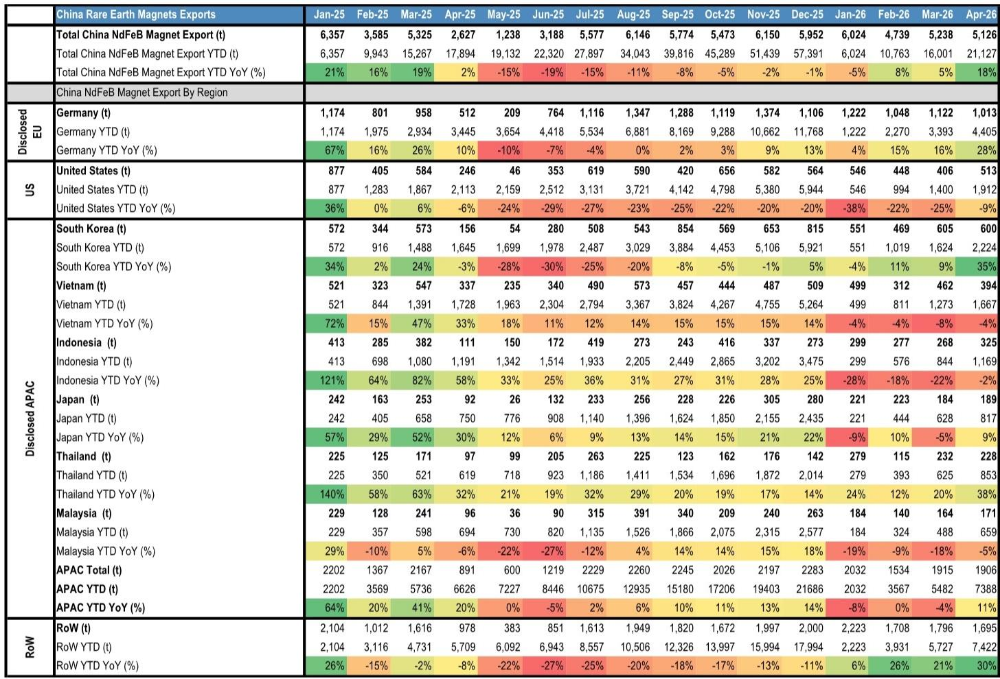
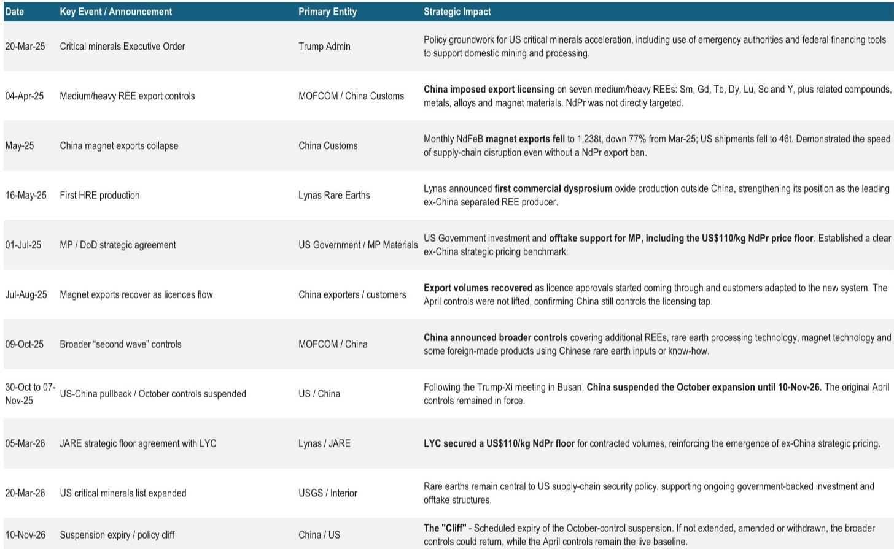
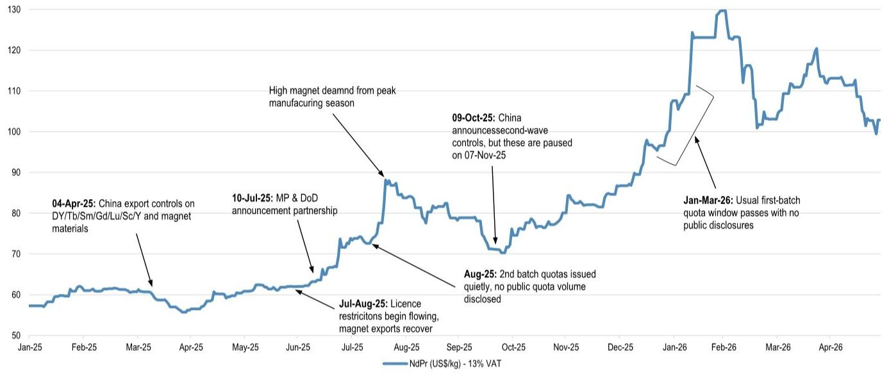

# 稀土市场的结构性裂变：中国定价权与西方安全溢价正在脱钩

市场正在经历一个比短期价格波动更深刻的转变。中国在2025年4月实施的稀土出口管制，并未针对最主要的钕镨氧化物，却依然在5月令中国钕铁硼磁材出口量骤降77%，对美出口更是暴跌92%。尽管7月后出口随许可证发放而恢复，但管制并未取消。这组数据揭示了一个被低估的事实：中国在稀土领域的杠杆，核心不在氧化物，而在于中重稀土、金属化、合金化以及磁材制造的全产业链控制力。

某外资投行最新发布的稀土商品仪表盘报告，系统性地梳理了这一结构性变化及其对定价框架、企业估值和投资逻辑的深远影响。报告的核心判断是：即便短期地缘紧张有所缓和，稀土市场的定价分叉已不可逆。西方世界正在为供应链安全支付一个明确的战略溢价，而这一溢价正在重塑整个行业的回报模型。

## 1. 中国出口管制的真正冲击在于产业链纵深，而非单一品种

2025年4月，中国对七种中重稀土（钐、钆、铽、镝、镥、钪、钇）及其化合物、金属、合金和磁材成品实施出口许可管制。市场最初的反应聚焦于一个看似矛盾的现象：管制清单并未包含用量最大的钕镨，但冲击却迅速传导至磁材出口端。

5月，中国钕铁硼磁材月出口量降至1,238吨，较3月水平下降77%。对美出口更是从877吨骤降至46吨，降幅达92%。这一数据最直接的解读是：中国在稀土产业链中游的加工制造环节拥有几乎不可替代的地位。即使上游氧化物供应不受限，下游磁材出口的“阀门”一旦收紧，全球供应链立即感受到切肤之痛。

报告还指出，2025年10月中国宣布了更广泛的“第二轮”管制，覆盖额外稀土品种、加工技术、磁材技术以及部分使用中国稀土原料或技术的境外产品。虽然该扩张在11月中美领导人会晤后被暂停至2026年11月，但原始4月管制仍在执行。这意味着，2026年11月10日的暂停到期日，将成为全球稀土行业必须面对的一个政策“悬崖”。

对投资者而言，这一系列事件的含义并非短期贸易摩擦，而是中国已展示其能够精准、快速、多层次地动用稀土供应链杠杆。西方政府和企业已经看到了“阀门被转动”的真实后果，市场不会回到管制前的状态。供应链的韧性溢价，将从口头承诺转化为实际支付。

## 2. 定价框架正在分裂：中国现货价与西方战略底价之间出现明确锚点

钕镨氧化物现货价格已从2025年4月约120美元/公斤的高点回落至当前约103美元/公斤。这一水平虽然远高于2025年价格复苏前约60-65美元/公斤的区间，但市场对短期价格方向的讨论仍集中在中国的配额、库存和收储政策上，而非终端需求。

然而，报告揭示了一个更重要的结构性变化：定价框架本身正在分裂。三个关键事件构成了新定价锚点的证据：

第一，美国国防部与MP Materials的战略协议中设定了110美元/公斤的钕镨价格下限。第二，Lynas与日本JARE修订的承购协议同样以110美元/公斤作为地板价。第三，Lynas与美国政府的协议也锚定了类似定价水平。

当前现货价约103美元/公斤，恰好低于这些战略协议的底价。这意味着，对于中国以外的供应，这个110美元/公斤的水平正在成为事实上的定价锚。即使中国国内现货价进一步走低，西方承购合同下的定价机制已经与国内市场脱钩。

这一分叉的含义是深远的。它意味着，西方稀土项目的回报模型不再完全依赖于中国现货价格的走势。只要这些战略定价框架能够维持，西方项目的经济性就有了一个独立于中国市场的支撑。对于正在评估项目可行性的投资者而言，这可能是比任何需求预测都更重要的估值变量。

## 3. 执行风险取代政策支持，成为下一阶段股价驱动的核心变量

报告明确指出，稀土股票的讨论焦点正在从“政策能否支持”转向“项目能否顺利投产”。这一转变基于一个残酷的现实：全球稀土产业链的“去中国化”在理念上已无争议，但在工程上远未成熟。

报告援引了2026年5月一次与独立湿法冶金专家的电话会议，结论令人警醒：在14家湿法冶金工厂中，有9家从未达到设计产能。而大多数可行性研究假设项目能够在12-24个月内实现满产。这一差距意味着，对于任何试图在中国以外建设分离产能的项目，投产和爬坡风险被系统性低估。

报告覆盖的三家澳大利亚上市公司，其投资逻辑正是围绕这一风险展开。Lynas作为唯一一家在中国以外实现商业规模分离稀土生产的企业，报告给予超配评级。其关键看点包括Kalgoorlie项目的爬坡进度、中重稀土产量、下游转化协议以及CEO继任计划。对于ARU和ILU，报告分别给予中性评级，核心关切点从融资转向了建设和湿法冶金执行。ILU的Eneabba项目虽然拥有约5.5千吨钕镨产能，但资本密集度、承购协议和多原料调试风险仍是悬而未决的问题。

报告中最具洞察力的一句话是：“政府可以帮助降低资本风险，但无法降低冶金风险。”这意味着，即便地缘政治推动的政策支持再强，也无法替代工程和运营能力的积累。对于投资者而言，识别哪些公司真正具备规模化运营能力，哪些只是在“画饼”，将成为区分赢家和输家的关键。

## 4. 报告尚未完全回答的关键问题：战略溢价能否持续，以及何时传导至下游

尽管报告清晰地勾勒了定价分叉的框架，但有几个关键假设尚未得到充分验证。

第一个问题是战略溢价本身的可持续性。110美元/公斤的底价目前主要基于美国政府和日本企业的承购协议。这些协议的数量和期限能否覆盖足够的产量，从而真正支撑中国以外项目的经济性？如果未来地缘紧张缓和，这些战略定价框架是否会被重新谈判？报告没有给出明确的答案，但这一问题直接关系到整个中国以外供应曲线的估值。

第二个问题是定价分叉如何传导至下游。如果西方磁材企业以110美元/公斤的价格采购钕镨，而中国竞争者以更低的价格获取原材料，西方磁材的竞争力将面临系统性挑战。报告提到了磁材出口数据，但没有深入分析这一成本劣势如何影响下游企业的市场份额和利润空间。这可能是整个供应链重构中最容易被忽视的二阶效应。

第三个问题是技术瓶颈的突破路径。报告指出了湿法冶金工厂普遍未能达产的事实，但没有详细讨论哪些技术路径或工程实践可能改变这一现状。对于长期投资者而言，理解技术突破的概率和时间线，与理解政策走向同样重要。

## 5. 一个更务实的观察框架：从“谁能拿到钱”转向“谁能把东西造出来”

基于报告的洞察，投资者在评估稀土项目时，可能需要更新自己的分析框架。传统的评估逻辑——谁能获得政府支持、谁能锁定承购协议——已经不够了。下一阶段的竞争将围绕以下三个维度展开：

第一，运营记录。Lynas之所以被给予超配评级，根本原因在于它已经在中国以外实现了商业规模的分离生产。对于任何没有这一记录的公司，其可行性研究中的爬坡假设都应被给予更高的折价。

第二，技术路径的成熟度。报告提到的湿法冶金工厂达产率数据，应该成为评估所有新项目的基准。如果一个项目的可行性研究假设的爬坡速度显著快于行业平均水平，投资者有权要求更充分的解释。

第三，定价框架的确定性。那些已经锁定战略定价协议的项目，其估值将更少受到中国现货价格波动的影响。但投资者需要关注这些协议是否包含价格重新谈判的条款，以及协议覆盖的产量比例。

这三个维度综合起来，将决定哪些公司能够穿越当前的不确定性周期，真正成长为全球稀土供应链的新支柱。

---

报告的完整版本包含了更详细的供需平衡表、各公司的财务模型和估值比较，以及关于2026年11月政策悬崖的多种情景分析。这些内容对于理解稀土股票的相对价值和风险暴露至关重要，但受限于篇幅，本文无法一一展开。

欢迎来星球微信群里继续讨论。我们会在群内分享报告原文的关键图表，并就战略溢价的可持续性、技术瓶颈的突破路径，以及2026年11月政策窗口期的投资策略，进行更深入的交流。

Personal reading notes and learning share only. Not investment advice.

