# China Biotechnology

# Innovation Dawn 2.0: From Wholesale to Bespoke

China biotech's first re-rating proved global relevance. The next leg should reward innovators with the risk capacity and asset scarcity needed to retain more global risk-adjusted net present value.

# Key Takeaways

Progress remains on track: Licensing, global trials and regulatory progress remain in line with, or ahead of, our Innovation Dawn expectations.   
Innovation Dawn 2.0: The debate now shifts to who captures value, as risk allocation and innovation scarcity increasingly dictate retained economics.   
Why the discount persists: Only c.25% of China licensing deals are late-stage/commercial vs c.50% for US biotech M&A transactions.   
Why now: Better funding, pivotal MRCT readouts, harmonization and AI-led asset quality can lift retained value; Newco/co-co can lift NPV by c.35-41%.   
- Where to allocate: Favor repeat monetizers with risk capacity and scarce assets: Keymed, Innovent, BeOne and Abbisko.

China biotech's first re-rating came from global relevance: Outbound licensing proved China-originated assets belong in the global innovation pool. The next phase is value capture: retaining economics, carrying global risk, and converting scarcity into stronger terms. By our estimate, NewCo/co-development structures could lift retained NPV by c.35-41% vs straight licensing when risk, dilution and obligations are manageable.

The mechanism is risk allocation plus scarcity premium: China licensing remains earlier-stage than US biotech M&A, with only c.25% late-stage/commercial exposure vs c.50% for US M&A. That leaves MNCs absorbing more development, regulatory, CMC, translatability and commercialization risk, making the discount rational but contestable.

Risk capacity is rising: Licensing now drives c.70% of sector funding, while median runway expanded from 2.6 years in FY23 to 4.9 years by FY25. Longer runway, licensing income, commercial engines and global trial experience let select companies carry assets further and negotiate for more retained rNPV. Geopolitics and US commercialization still cap near-term capture.

Be selective. Favor repeat monetizers with risk capacity and scarce assets. Keymed tests NewCo repeatability beyond upfront licensing. Innovent tests co-development economics through US profit share, ex-US royalties and retained influence. Abbisko tests licensing-led value capture through pimicotinib and Merck KGaA validation.

MS ASIA LIMITED+

Jack Lin

Equity Analyst

Jack.Lin@morganstanley.com +852 3963-3746

MS & CO. LLC

Sean Laaman, Ph.D.

Equity Analyst

Sean.Laaman@morganstanley.com +1 212 761-4947

Terence C Flynn, Ph.D.

Equity Analyst

Terence.Flynn@morganstanley.com +1 212 761-2230

MS ASIA LIMITED+

Alexis Yan, CFA

Equity Analyst

Alexis.Yan@morganstanley.com +852 2239-7953

Vanessa Liao

Research Associate

Vanessa.Liao@morganstanley.com +852 3963-0115

CHINA HEALTHCARE 

<table><tr><td>Asia Pacific Industry View</td><td>Attractive</td></tr><tr><td colspan="2">BIOTECHNOLOGY</td></tr><tr><td>North America Industry View</td><td>Attractive</td></tr><tr><td colspan="2">MAJOR PHARMACEUTICALS</td></tr><tr><td>North America Industry View</td><td>In-Line</td></tr></table>

MS is acting as financial advisor to Galapagos NV in relation to its binding agreement with Gilead Sciences following Gilead's definitive agreement to acquire all of the outstanding equity interests of Ouro Medicines, as announced on March 31, 2026. The proposed transaction is subject to customary closing conditions. Galapagos NV may pay fees to MS for its financial services, including transaction fees that are contingent upon the consummation of the proposed transaction. Please refer to the notes at the end of this report.

MS does and seeks to do business with companies covered in MS. As a result, investors should be aware that the firm may have a conflict of interest that could affect the objectivity of MS. Investors should consider MS as only a single factor in making their investment decision.

For analyst certification and other important disclosures, refer to the Disclosure Section, located at the end of this report.

+= Analysts employed by non-U.S. affiliates are not registered with FINRA, may not be associated persons of the member and may not be subject to FINRA restrictions on communications with a subject company, public appearances and trading securities held by a research analyst account.

# Executive Summary

# Societal Shifts

# A MS

# Key Theme of 2026

# Core Message:

- Innovation Dawn remains broadly on track: Globalization of China-originated assets continues, with out-licensing momentum, fundraising, clinical development, and regulatory progress broadly consistent with our prior assumptions and forecasts.   
- The next phase is from volume to value: The first stage rewarded proof of global demand. The next should reward companies that retain more economics and play a larger role in global development.   
- Risk allocation explains why China licensing trades below US M&A: China assets are often earlier-stage, leaving MNCs to bear more overseas development, data harmonization, translatability, chemistry, manufacturing and controls (CMC), and commercialization risk.   
- Scarcity premium determines who can move up the ladder: Better deal structures only matter when the asset is differentiated enough to command stronger economics.   
- Stock selection should follow two axes: Risk-bearing capacity, measured by cash, licensing income, domestic engine, and overseas R&D experience; and asset scarcity, measured by first-in-class/best-in-class (FIC/BIC) potential, global relevance, and regulatory portability.   
- Names to own: Repeat monetizers where value capture is becoming visible through stronger retained economics, global execution capability, and differentiated assets.   
- Risks to flag: Geopolitics and US commercialization remain difficult to internalize near term; NewCo / co-co structures can still dilute value through funding burden, governance leakage, or weak realization.

Market attention in 2025 focused disproportionately on headline deal value and upfront payments: China biotech's first re-rating came from demonstrating global relevance, but the market largely overlooked the long-tailed implications of globalization partnerships. This is evident in limited upward revisions to outer-year forecasts for many companies (Exhibit 1).

That lens is now crowded and, as a valuation shortcut, has become too blunt: More advanced structures can lift retained value through shared development economics, equity participation, and secondary monetization at vehicle exit. At the same time, China's role is expanding operationally, with global pharma increasingly leveraging China's discovery, development, and R&D infrastructure rather than simply sourcing assets from it.

Exhibit 1: Overview of select H-listed China biotech companies 

<table><tr><td rowspan="2">Ticker</td><td rowspan="2"></td><td colspan="3">Enterprise Value (US$ mn)</td><td colspan="3">Market Capitalization (US$ mn)</td><td colspan="3">2030E EV/S</td><td colspan="3">2030E P/S</td><td colspan="3">2030E Sales (US$ mn)</td></tr><tr><td>1/1/2025</td><td>12/31/2025</td><td>Delta</td><td>1/1/2025</td><td>12/31/2025</td><td>Delta</td><td>1/1/2025</td><td>12/31/2025</td><td>Delta</td><td>1/1/2025</td><td>12/31/2025</td><td>Delta</td><td>1/1/2025</td><td>12/31/2025</td><td>Delta</td></tr><tr><td>2256-HK</td><td>Abbisko</td><td>120</td><td>760</td><td>536%</td><td>402</td><td>1,124</td><td>179%</td><td>0.8x</td><td>3.1x</td><td>276%</td><td>2.8x</td><td>4.6x</td><td>65%</td><td>145</td><td>246</td><td>69%</td></tr><tr><td>9926-HK</td><td>Akeso</td><td>6,177</td><td>12,623</td><td>104%</td><td>7,005</td><td>13,014</td><td>86%</td><td>3.4x</td><td>5.2x</td><td>51%</td><td>3.9x</td><td>5.4x</td><td>37%</td><td>1,795</td><td>2,430</td><td>35%</td></tr><tr><td>6855-HK</td><td>Ascentage</td><td>1,829</td><td>2,302</td><td>26%</td><td>1,836</td><td>2,328</td><td>27%</td><td>5.2x</td><td>4.2x</td><td>-18%</td><td>5.2x</td><td>4.3x</td><td>-18%</td><td>353</td><td>545</td><td>54%</td></tr><tr><td>ONC-US</td><td>BeiGene</td><td>17,685</td><td>32,110</td><td>82%</td><td>18,032</td><td>30,919</td><td>71%</td><td>2.1x</td><td>3.2x</td><td>53%</td><td>2.1x</td><td>3.1x</td><td>44%</td><td>8,427</td><td>10,023</td><td>19%</td></tr><tr><td>6185-HK</td><td>CanSino Bio</td><td>838</td><td>915</td><td>9%</td><td>1,002</td><td>1,109</td><td>11%</td><td>1.8x</td><td>1.5x</td><td>-16%</td><td>2.2x</td><td>1.8x</td><td>-15%</td><td>464</td><td>606</td><td>31%</td></tr><tr><td>1952-HK</td><td>Everest Medicine</td><td>1,859</td><td>1,427</td><td>-23%</td><td>2,021</td><td>1,556</td><td>-23%</td><td>2.2x</td><td>1.6x</td><td>-26%</td><td>2.4x</td><td>1.8x</td><td>-26%</td><td>843</td><td>872</td><td>3%</td></tr><tr><td>HCM-US</td><td>Hutchmed</td><td>1,799</td><td>1,056</td><td>-41%</td><td>2,512</td><td>2,325</td><td>-7%</td><td>1.2x</td><td>0.9x</td><td>-20%</td><td>1.6x</td><td>2.1x</td><td>26%</td><td>1,539</td><td>1,127</td><td>-27%</td></tr><tr><td>9969-HK</td><td>InnoCare</td><td>606</td><td>2,035</td><td>236%</td><td>1,388</td><td>2,786</td><td>101%</td><td>0.9x</td><td>2.4x</td><td>151%</td><td>2.2x</td><td>3.2x</td><td>50%</td><td>641</td><td>857</td><td>34%</td></tr><tr><td>1801-HK</td><td>Innovent</td><td>6,976</td><td>15,745</td><td>126%</td><td>7,718</td><td>16,199</td><td>110%</td><td>2.2x</td><td>3.5x</td><td>59%</td><td>2.4x</td><td>3.6x</td><td>48%</td><td>3,206</td><td>4,546</td><td>42%</td></tr><tr><td>6990-HK</td><td>Kelun Bio</td><td>4,260</td><td>10,873</td><td>155%</td><td>4,778</td><td>11,750</td><td>146%</td><td>3.1x</td><td>6.4x</td><td>105%</td><td>3.5x</td><td>7.0x</td><td>98%</td><td>1,358</td><td>1,688</td><td>24%</td></tr><tr><td>2162-HK</td><td>Keymed</td><td>850</td><td>1,547</td><td>82%</td><td>1,096</td><td>2,023</td><td>85%</td><td>1.3x</td><td>2.4x</td><td>79%</td><td>1.7x</td><td>3.1x</td><td>82%</td><td>642</td><td>652</td><td>2%</td></tr><tr><td>9995-HK</td><td>RemeGen</td><td>1,258</td><td>5,352</td><td>326%</td><td>995</td><td>5,157</td><td>419%</td><td>1.2x</td><td>4.9x</td><td>321%</td><td>0.9x</td><td>4.7x</td><td>413%</td><td>1,087</td><td>1,100</td><td>1%</td></tr><tr><td>ZLAB-US</td><td>Zai Lab</td><td>1,936</td><td>1,335</td><td>-31%</td><td>2,823</td><td>1,951</td><td>-31%</td><td>0.8x</td><td>0.7x</td><td>-6%</td><td>1.1x</td><td>1.1x</td><td>-6%</td><td>2,473</td><td>1,816</td><td>-27%</td></tr></table>

Source: Visible Alpha, FactSet, MS. E = Visible Alpha consensus estimates.

The next re-rating should come from value capture, not more volume: Headline biobucks were useful when the market was still debating whether China could generate globally relevant assets. That debate has moved on. The more important question is whether China originators can retain more of the asset's rNPV after risk is allocated.

Exhibit 4 and Exhibit 5 show why this matters: out-licensing economics can sit at a meaningful discount to M&A economics, while NewCo structures can narrow but not eliminate that gap. The valuation question is therefore not whether a deal looks more sophisticated, but whether it improves retained economics after cost-sharing, dilution, governance, and execution risk.

Why allocate now - Last year's sector re-rating was about globalization: China-originated assets proved they could matter globally. The next re-rating should be about value capture: which companies can retain more economics as risk is increasingly internalized rather than sold away. That transition is becoming investable. Balance sheets, runway and profitability are improving; multiple pivotal MRCT readouts can address translatability concerns; harmonization risk continues to fade; and AI should further accelerate asset-quality convergence. The implication is simple: the China biotech risk discount is no longer static. As it compresses, the sector moves from a proof-of-globalization trade to a long-term allocation opportunity.

Exhibit 2: Why now - sector readiness for climbing the global valuation ladder 

<table><tr><td>Drivers</td><td>What has shifted now</td><td>Investment implications</td></tr><tr><td>Globalization validation</td><td>Licensing momentum has accelerated, validating the global relevance of China biotech innovation.</td><td>The next leg needs value capture, not just more deal volume.</td></tr><tr><td>Developmental risk capacity is improving</td><td>Stronger balance sheets, longer runway and improving profitability reduce reliance on early risk transfer to MNCs via licensing.</td><td>Better-capitalized companies can retain more economics by carrying assets into later-stage development.</td></tr><tr><td>Translatability test is coming</td><td>Numerous upcoming pivotal MRCT readouts provide practical evidence on whether China data can travel globally.</td><td>Positive readouts can compress the global-data risk discount.</td></tr><tr><td>Harmonization risk is fading</td><td>Regulatory alignment and global development norms continue to improve.</td><td>Lower policy friction supports greater confidence in global monetization.</td></tr><tr><td>Asset quality can accelerate</td><td>AI should narrow discovery and development gaps over time.</td><td>Scarce, globally competitive assets can support richer structures and better retained value.</td></tr></table>

Source: MS

Two factors determine who can capture more value: The first is risk-bearing capacity. Companies with cash, licensing income, domestic commercial growth, and overseas trial experience can carry assets further before externalizing and negotiate from a stronger position. The second is innovation scarcity. FIC / BIC or globally differentiated assets can command better terms because partners have fewer substitutes. Where both conditions are present, China biotech can move from wholesale licensing toward co-development, NewCo, and eventually M&A-like economics. Where either is absent, licensing remains the more likely endpoint.

Exhibit 3: Innovation Dawn 2.0 positioning: risk-bearing capacity vs. novel asset scarcity   
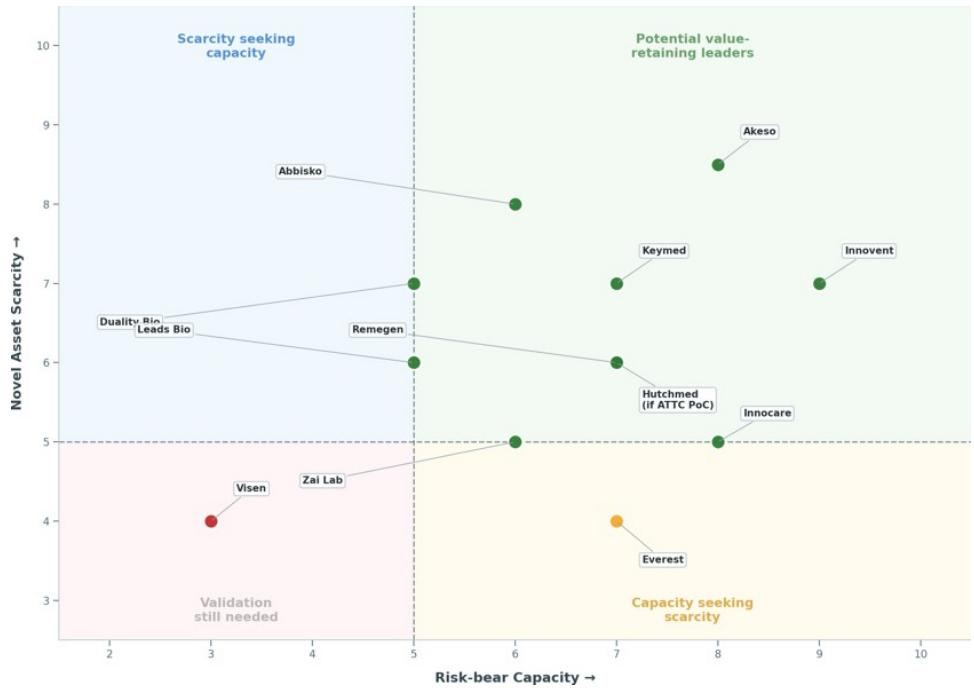

scatter

| Company | Risk-bear Capacity (X) | Novel Asset Scarcity (Y) |
| :--- | :--- | :--- |
| Abbisko | 6.0 | 8.0 |
| Duality Bio | 2.5 | 6.5 |
| Leads Bio | 2.5 | 6.5 |
| Zai Lab | 3.5 | 4.0 |
| Remegen | 5.0 | 6.0 |
| Visen | 3.0 | 4.0 |
| Keymed | 7.0 | 7.0 |
| Hutchmed (if ATTC PoC) | 7.0 | 6.0 |
| Akeso | 8.0 | 8.5 |
| Innocare | 8.0 | 5.0 |
| Everest | 7.0 | 4.0 |
| Innovent | 9.0 | 7.0 |
| Akeso | 8.0 | 8.5 |
| Innovation Medica | 9.0 | 7.0 |
| Innovation Medica (if ATTC PoC) | 8.0 | 5.0 |
The chart is divided into four quadrants by a horizontal line at y=5, indicating the level of each company's risk-cash capacity relative to its actual assets. The legend defines color coding: red for 'Validation still needed', green for 'Potential value-retaining leaders', orange for 'Capacity seeking scarcity'.

Source: MS. Note: Scores are qualitative 1-10 based on cash runway, profitability path, commercial base, partner funding, clinical execution capacity, asset differentiation, competitive crowding and global strategic relevance.

Exhibit 4: Out-licensing to M&A NPV discount (US\$mn)   
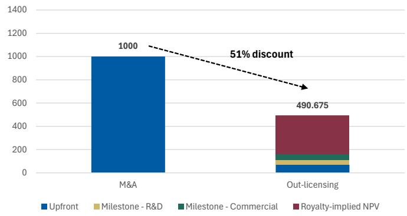

bar_stacked

| Category | Upfront | Milestone - R&D | Milestone - Commercial | Royalty-implied NPV |
| :--- | :--- | :--- | :--- | :--- |
| M&A | 1000 | 0 | 0 | 0 |
| Out-licensing | 50 | 50 | 50 | 290.675 |
51% discount indicated by dashed arrow

Source: MS estimates.

Exhibit 5: NewCo to M&A NPV discount (US\$ mn)   
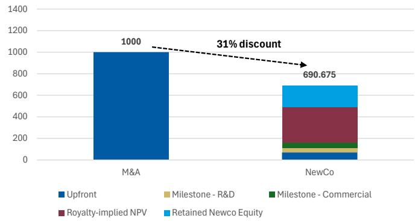

bar_stacked

| Category | Upfront | Milestone - R&D | Milestone - Commercial | Royalty-implied NPV | Retained Newco Equity |
| :--- | :--- | :--- | :--- | :--- | :--- |
| M&A | 1000 | 0 | 0 | 0 | 0 |
| NewCo | 690.675 | 0 | 0 | 450 | 180 |

Source: MS estimates.

The market needs a more demanding lens than retained take-rate alone: Royalties, profit-sharing, NewCo ownership, and residual rights matter only if they survive the obligations required to earn them. In licensing, royalties and milestone probability remain the key variables. In NewCo, post-dilution ownership, investor quality, and exit visibility matter more than formation value. In co-development, the question is whether the incremental economics compensate for the added funding and execution burden. The same structure can be value-creating for one company and value-destructive for another, depending on risk capacity and asset scarcity.

Exhibit 6: Real value signals vs deal optics 

<table><tr><td>What Should Command a Premium</td><td>What Can Mislead the Market</td></tr><tr><td>Total Residual value retained</td><td>Headline total deal value</td></tr><tr><td>Net upfront value after cost-sharing and retained obligations</td><td>Gross upfront payments quoted without cost-sharing or financial obligations</td></tr><tr><td>Quantified retained economics: Royalties, profit-sharing, post-dilution NewCo ownership</td><td>Generic “equity + royalties” language without clear quantification</td></tr><tr><td>Control retained: Governance rights, development influence, commercialization role</td><td>“Strategic collaboration” language without decision rights</td></tr><tr><td>Risk-adjusted back-end value: Milestone mix, timing, and probability of realization</td><td>Headline biobucks dominated by long-dated commercial milestones</td></tr><tr><td>Credible route to monetization: Partner quality, investor quality, financing/M&amp;A path</td><td>Optionality narrative without a credible realization path</td></tr><tr><td>Repeatability across deals</td><td>One-off headline success treated as proof of platform quality</td></tr><tr><td>Additional monetizable rights: Supply &amp; manufacturing agreements, retained territory rights where commercially practical</td><td>Ancillary terms with an unclear practical value</td></tr></table>

Source: MS.

Repeat monetizers should be the investable subset: The market should not reward all outbound activity equally. It should reward companies that repeatedly convert global relevance into retained economics, development influence, and realizable ex-China value.

Exhibit 7 should therefore be positioned not as a list of companies with deals, but as a screen for companies showing repeat monetization, stronger retained economics, and credible paths to realization. The distinction is critical: one deal validates an asset; repeated value capture validates a platform.

By contrast, we would stay cautious on one-off, headline-driven deals or richer-looking structures where apparent value may partly reflect a more supportive prior market backdrop and may still erode through dilution, funding obligations, execution risk, or weak monetization pathways: We are also cautious on companies whose re-rating last year appeared to run ahead of any meaningful long-term upward revision in retained economics or ex-China value realization, suggesting that a meaningful part of the move may have been optical rather than fundamental. In our view, the weakest setups are those where the headline is large but the retained take-rate is thin, downstream influence is limited, and the practical route from transaction optics to durable equity value remains unclear.

Exhibit 7: Potential repeatable monetizers 

<table><tr><td>Category</td><td>Company</td><td>Ticker</td><td>Notable Deals</td></tr><tr><td rowspan="2">Core exemplars</td><td>Keymed</td><td>2162.HK</td><td>Ouro Medicine (acq. by GILD/GLPG); Belenos Bio; Timberlyne Therapeutics; Prolium</td></tr><tr><td>Innovent</td><td>1801.HK</td><td>Takeda (IBI363, IBI343, IBI3001); Eli Lilly (sintilimab, co-development)</td></tr><tr><td rowspan="2">Licensing-led support</td><td>Abbisko</td><td>2256.HK</td><td>Merck KGaA (pimicotinib)</td></tr><tr><td>BeOne*</td><td>ONC.O</td><td>Novartis (Ociperlimab, tislelizumab)</td></tr></table>

Source: MS. Note: \* Deals were signed during a more supportive biotech market in 2021, which may have facilitated favorable deal terms. For more details, see section on Higher Stakes, Harder Tests

Some of the strongest historical deal terms in our selected group were signed during a more supportive biotech market in 2021, which may have flattered observed bargaining power, while other names still show limited or mixed partnership histories. The implication is not that all constituents deserve the same premium today, but that these companies show the strongest evidence of repeatable monetization and represent where the next re-rating is most likely to concentrate.

Exhibit 8: Illustrative assessment of NewCo structures under the SCORE framework 

<table><tr><td>NewCo Name</td><td>Share of Economics</td><td>Control Retained</td><td>Obligations Assumed</td><td>Route to Monetization</td><td>External Backers</td><td>NewCo Quality Tiers</td><td>Licensor</td></tr><tr><td>Ouro Medicines</td><td>***</td><td>***</td><td>*****</td><td>*****</td><td>*****</td><td>Tier 1</td><td>Keymed</td></tr><tr><td>Belenos Biosciences</td><td>****</td><td>****</td><td>*****</td><td>****</td><td>****</td><td>Tier 1</td><td>Keymed</td></tr><tr><td>Timberlyne Therapeutics</td><td>****</td><td>****</td><td>*****</td><td>****</td><td>****</td><td>Tier 1</td><td>Keymed</td></tr><tr><td>Caldera Therapeutics</td><td>****</td><td>***</td><td>*****</td><td>***</td><td>*****</td><td>Tier 1</td><td>Qyuns</td></tr><tr><td>Windward Bio</td><td>***</td><td>**</td><td>*****</td><td>****</td><td>*****</td><td>Tier 2</td><td>Harbour Bio + Kelun Bio</td></tr><tr><td>TRC 2004</td><td>**</td><td>***</td><td>*****</td><td>****</td><td>****</td><td>Tier 2</td><td>Genor Bio</td></tr><tr><td>AirNexis Therapeutics</td><td>****</td><td>***</td><td>*****</td><td>***</td><td>****</td><td>Tier 2</td><td>Haisco</td></tr><tr><td>Vignette Bio</td><td>***</td><td>**</td><td>*****</td><td>***</td><td>****</td><td>Tier 2</td><td>EpimAb Bio</td></tr><tr><td>Verdiva Bio</td><td>***</td><td>*</td><td>*****</td><td>****</td><td>****</td><td>Tier 2</td><td>Sciwind</td></tr><tr><td>Prolium Bioscience</td><td>**</td><td>**</td><td>*****</td><td>**</td><td>***</td><td>Tier 2</td><td>Keymed + InnoCare</td></tr><tr><td>Oblenio Bio</td><td>***</td><td>**</td><td>*****</td><td>**</td><td>**</td><td>Tier 2</td><td>Leads Bio</td></tr><tr><td>Kalexo Bio</td><td>*</td><td>*</td><td>*****</td><td>**</td><td>**</td><td>Tier 3</td><td>Mabwell Bio</td></tr></table>

Source: Company disclosures. Note: Stars represent how well each collaboration performs under the SCORE framework.

Exhibit 9: Notable China biotech collaboration deals with upfront & royalty terms disclosed 

<table><tr><td>Deal date</td><td>Company</td><td>Partner</td><td>Asset(s)</td><td>Upfront (US$mnn)</td><td>Total deal size (US $mn)</td><td>Upfront %</td><td>Royalty terms</td></tr><tr><td>12/4/2023</td><td>Abbisko</td><td>Merck KGaA</td><td>Pimicotinib</td><td>70 (+85 incl. global)</td><td>605.5</td><td>11.5% (25.6% if global)</td><td>double-digit</td></tr></table>

<table><tr><td>12/6/2022</td><td>Akeso</td><td>Summit Therapeutics</td><td>Ivonescimab</td><td>500</td></tr><tr><td>6/14/2024</td><td>Ascentage</td><td>Takeda</td><td>Olverembatinib</td><td>100</td></tr><tr><td>12/20/2021</td><td>BeOne</td><td>Novartis</td><td>Ociperlimab</td><td>300</td></tr><tr><td>1/11/2021</td><td>BeOne</td><td>Novartis</td><td>Tislelizumab</td><td>650</td></tr><tr><td>10/21/2025</td><td>Innovent</td><td>Takeda</td><td>IBI363 / IBI343 / IBI3001</td><td>1,200</td></tr><tr><td>8/18/2020</td><td>Innovent</td><td>Eli Lilly</td><td>Sintilimab</td><td>200</td></tr><tr><td>2/23/2023</td><td>Keymed/Lepu Bio</td><td>AstraZeneca</td><td>CMG901</td><td>63</td></tr><tr><td>1/10/2022</td><td>Junshi Bio</td><td>Coherus</td><td>JS006</td><td>35</td></tr><tr><td>2/1/2021</td><td>Junshi Bio</td><td>Coherus</td><td>Toripalimab / JS006 / JS018-1</td><td>150</td></tr><tr><td>10/16/2025</td><td>Leads Bio</td><td>Dianthus</td><td>LBL-047</td><td>20</td></tr><tr><td>1/12/2026</td><td>RemeGen</td><td>AbbVie</td><td>RC148</td><td>650</td></tr></table>

<table><tr><td>5,000</td><td>10.0%</td><td>low double-digit</td></tr><tr><td>1,300</td><td>7.7%</td><td>double-digit</td></tr><tr><td>2,895</td><td>10.4%</td><td>high-teens to mid-twenties*</td></tr><tr><td>2,200</td><td>29.6%</td><td>double-digit</td></tr><tr><td>11,400</td><td>10.5%</td><td rowspan="2">IBI363: 40/60 in US, up to high-teens ROW outside Greater China, except U.S.; IBI343: up to high-teens; IBI3001: up to mid-teens if option exercised tiered double-digit</td></tr><tr><td>1,025</td><td>19.5%</td></tr><tr><td>1,163</td><td>5.4%</td><td>Tiered royalties up to low double digits</td></tr><tr><td>290</td><td>12.1%</td><td>18%</td></tr><tr><td>1,110</td><td>13.5%</td><td>20%</td></tr><tr><td>1,000</td><td>2%</td><td>mid-single digit to low double-digit</td></tr><tr><td>5,600</td><td>11.6%</td><td>tiered double-digit</td></tr></table>

Source: Company disclosure. Note: \*BeOne is responsible for certain commercial obligations (i.e., co-detailing rights).

# Stock-level Implications

Exhibit 10: Covered Names and Thesis Implications 

<table><tr><td>Stock</td><td>MSR Rating</td><td>Analyst</td><td>Investment Thesis</td><td>Framework Implications</td></tr><tr><td>Keymed (2162.HK)</td><td>OW</td><td>Jack Lin</td><td>Distinctive antibody-based pipeline across immunology and oncology, with CM310 commercialized, CMG901 in pivotal-stage development, and a 2.0 engine in complex modalities such as bispecifics and siRNA. Near-term upside is tied to CM512 PoC and continued validation of next-generation assets.</td><td>Core exemplar. The framework strengthens the bull case because Keymed combines an internal discovery engine with repeated NewCo monetization (Ouro, Belenos, Timberlyne, Prolium), high-quality external backers, and a credible route to realization. That makes it more than a one-off licensor and supports a premium vs. plain royalty-only stories.</td></tr><tr><td>Innovent (1801.HK)</td><td>OW</td><td>Jack Lin</td><td>Domestic bellwether biopharma with a broad commercial base, visible profitability inflection, and meaningful globalization upside from IBI363, mazdutide, and a scalable discovery engine with emerging key assets (ie. oral GLP-1, IBI343). A quality-growth leader and a likely early beneficiary when foreign flow re-engages.</td><td>Core exemplar. The framework is most supportive here because Innovent is not just licensing assets out: the Takeda deal gives Takeda ex-China rights, while Innovent retains 40% U.S. profit share on IBI363, and preserves ex-U.S. royalties, while Lilly-related collaboration reinforces repeatability. This is the cleanest public example of retained economics combined with retained influence.</td></tr><tr><td>Abbisko (2256.HK)</td><td>OW</td><td>Jack Lin</td><td>Underappreciated small-molecule pure-play with commercial/global value from pimicotinib, upside from irpagratinib, and further optionality from next-gen FGFR / oral PD-L1 / PRMT5 programs. MS frames it as a catalyst-rich SMID-cap with discrete valuation-changing events.</td><td>Licensing-led support. The framework supports Abbisko mainly through strong classic licensing economics rather than NewCo/co-company structures. The Merck KGaA deal validated Abbisko&#x27;s bargaining power, but the stock thesis still rests more on asset quality and catalyst delivery than on a structurally richer globalization model.</td></tr></table>

BeOne (ONC.O) 

<table><tr><td>OW</td><td>Sean Laaman</td></tr></table>

<table><tr><td>We see BeOne Medicines as a top SMID-cap oncology compounder, supported by accelerating Brukinsa share gains and a deep hematology pipeline. We see 2026 as an inflection year, with catalysts from sonrotoclax and a BTK degrader driving diversification, margin expansion, and improving profitability.</td></tr></table>

BeOne leverages China's faster, lower-cost discovery and clinical engine through its own integrated R&D, not third-party in-licensing. Unlike many Western biopharmas that in-license Chinese assets, BeOne is a self-originating, China-rooted global developer that retains full ownership of its core pipeline programs.   
Source: MS

# Innovation Dawn 2.0: From Global Relevance to Global Value Capture

Innovation Dawn established the first phase of China biotech's global relevance: The original thesis was built on a global innovation supply-demand gap, the limits of US biotech alone to fill large pharma's pipeline needs, and China's ability to improve R&D ROI through speed, cost efficiency, patient access, and development infrastructure. A year later, the evidence remains broadly supportive. Licensing activity, funding stabilization, clinical development, and regulatory progress have broadly tracked our assumptions. The first question — whether China can supply global innovation — is increasingly answered. The second question — how much of that value China can retain — is now the core investment debate. See our prior reports on the rise of China Biotech - Innovation Dawn and China's Biotech Ascent: A Future Pillar of Industry.

Exhibit 11: China sponsors have led a rising share of global clinical trials to date...   
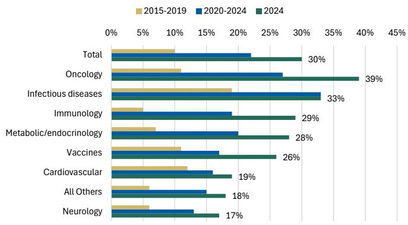

bar

| Category | 2015-2019 (%) | 2020-2024 (%) | 2024 (%) |
| :--- | :--- | :--- | :--- |
| Total | 10 | 22 | 30 |
| Oncology | 11 | 27 | 39 |
| Infectious diseases | 19 | 33 | 33 |
| Immunology | 6 | 18 | 29 |
| Metabolic/endocrinology | 8 | 20 | 28 |
| Vaccines | 11 | 17 | 26 |
| Cardiovascular | 12 | 16 | 19 |
| All Others | 6 | 15 | 18 |
| Neurology | 7 | 13 | 17 |

Source: Citeline Trialtrove, Jan 2025; IQVIA Institute, Jan 2025. MS.

Exhibit 12: ... with innovation progress driving substantial momentum in outbound licensing of China-originated assets   
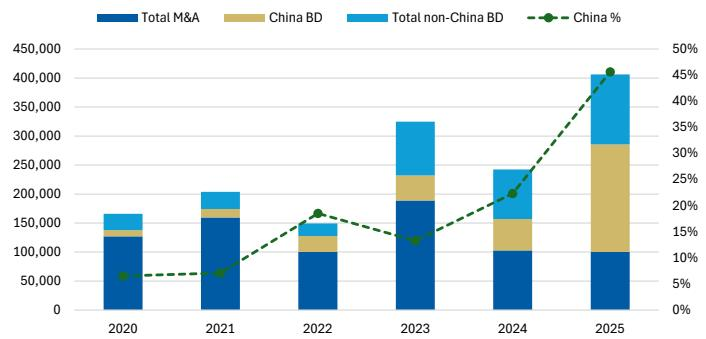

bar_line

| Year | Total M&A | China BD | Total non-China BD | China % (%) |
|---|---|---|---|---|
| 2020 | 120000 | 30000 | 40000 | 6 |
| 2021 | 160000 | 30000 | 40000 | 7 |
| 2022 | 100000 | 40000 | 30000 | 18 |
| 2023 | 190000 | 60000 | 110000 | 13 |
| 2024 | 100000 | 70000 | 110000 | 21 |
| 2025 | 100000 | 235000 | 135000 | 45 |

Source: FactSet, GBI, MS

# Progress since Innovation Dawn

Bridging from Innovation Dawn 1.0 to Innovation Dawn 2.0: Since last year's market recognition of the "DeepSeek moment" and the inflection point in China biotech's globalization outlook, licensing momentum shows that external demand for China-originated innovation has remained intact. Funding and trial activity show whether the next supply pool is being replenished. Regulatory milestones — including Phase 3 starts, BLA / sBLA submissions, PDUFA dates, and US development activity — are more important for valuation because they test whether China-originated assets are not only licensable, but also globally developable and regulatorily portable.

Exhibit 13: Globalization progress has broadly tracked our prior assumptions/forecasts during 2H25 and 2026 YTD 

<table><tr><td></td><td>2025E</td><td>2025A</td><td>2026E</td><td>4M26</td></tr><tr><td>Licensing (US$mn)</td><td></td><td>132,125</td><td></td><td>60,841</td></tr><tr><td>• est. Upfront (US $mn)</td><td></td><td>8,895</td><td></td><td>4,455</td></tr><tr><td>Funding (US$mn)</td><td>11,098</td><td>10,376</td><td>12,652</td><td>1,834</td></tr><tr><td>BLA approval</td><td>4</td><td>2</td><td>4</td><td>1</td></tr><tr><td>• Upcoming PDUFA</td><td></td><td></td><td></td><td>3</td></tr><tr><td>China NME Ph1 initiation</td><td>710</td><td>833</td><td>691</td><td>298</td></tr><tr><td>China NME entering US Ph3</td><td>8</td><td>8</td><td>8</td><td>1</td></tr></table>

Source: GBI. Company announcements. Factset. Note: Green indicates progress is on track or ahead of expectations; red indicates progress is behind expectations.

Exhibit 14: We anticipate numerous potential global pivotal/registrational readouts from China-originated assets to further validate cross-border data translatability 

<table><tr><td>Asset</td><td>Data Event</td><td>Trial code</td><td>est. Timing</td></tr><tr><td>Sunvozertinib / DZD9008</td><td>Positive topline announced</td><td>NCT05668988</td><td>Mar 2026</td></tr><tr><td>Savolitinib / ORPATHYS</td><td>Topline result</td><td>NCT05261399</td><td>1H26</td></tr><tr><td>Firmonertinib / furmonertinib</td><td>Topline result</td><td>NCT05607550</td><td>mid-26</td></tr><tr><td>Ivonescimab / AK112 – HARMONi-3 squamous</td><td>Final PFS analysis</td><td>NCT05899608</td><td>2H26</td></tr><tr><td>AZD0901 / CMG901</td><td>Topline result</td><td>NCT06346392</td><td>mid-26</td></tr><tr><td>DB-1303 / BNT323</td><td>Primary completion</td><td>NCT06018337</td><td>2H26</td></tr><tr><td>Disitamab vedotin / RC48</td><td>Primary completion</td><td>NCT05911295</td><td>2H26</td></tr><tr><td>Serplulimab / HLX10</td><td>Primary completion</td><td>NCT05353257</td><td>2H26</td></tr></table>

Source: GBI. Company announcements. Clinicaltrials.gov

But global relevance did not by itself secure a large share of downstream value. Pure out-licensing validated external demand and opened overseas markets, but it also left most economics, development control, and strategic optionality with the partner. The next phase of the sector's globalization therefore depends less on proving relevance and more on improving positioning within global value creation.

Global value capture is a function of risk allocation and scarcity: China-originated assets are generally licensed earlier than US M&A targets, as shown in Exhibit 15 and Exhibit 16. That means the MNC often absorbs more overseas development, regulatory, translatability, CMC, and commercialization risk. The valuation gap is therefore not arbitrary. It reflects who bears the risk before the asset is globally de-risked. China companies can narrow that gap only by carrying assets further, retaining a larger

development role, or owning assets scarce enough to force stronger economics.

China licensing remains earlier-stage than US M&A, explaining part of the valuation gap. The path to higher economics requires China originators to carry more risk before externalization or own assets scarce enough to offset that risk transfer.

Exhibit 15: China biotech licensing by stage   
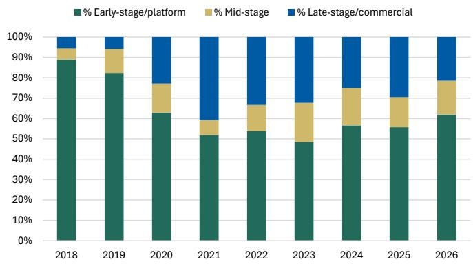

bar_stacked

| Year | % Early-stage/platform (%) | % Mid-stage (%) | % Late-stage/commercial (%) |
|---|---|---|---|
| 2018 | 88 | 5 | 5 |
| 2019 | 82 | 10 | 5 |
| 2020 | 63 | 14 | 21 |
| 2021 | 51 | 7 | 43 |
| 2022 | 53 | 11 | 34 |
| 2023 | 48 | 17 | 31 |
| 2024 | 56 | 18 | 23 |
| 2025 | 55 | 15 | 30 |
| 2026 | 61 | 17 | 21 |

Source: GBI.

Exhibit 16: US biotech M&A by stage   
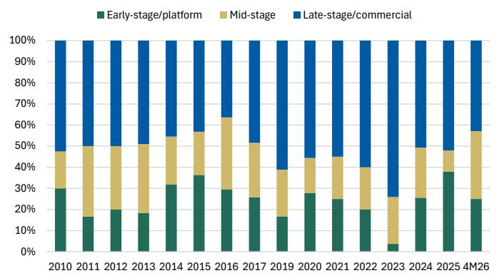

bar_stacked

| Year | Early-stage/platform (%) | Mid-stage (%) | Late-stage/commercial (%) |
|---|---|---|---|
| 2010 | 30 | 20 | 58 |
| 2011 | 16 | 35 | 53 |
| 2012 | 19 | 30 | 51 |
| 2013 | 18 | 33 | 47 |
| 2014 | 31 | 25 | 47 |
| 2015 | 36 | 23 | 43 |
| 2016 | 29 | 37 | 37 |
| 2017 | 25 | 28 | 51 |
| 2019 | 16 | 27 | 64 |
| 2020 | 28 | 18 | 51 |
| 2021 | 25 | 24 | 54 |
| 2022 | 19 | 23 | 57 |
| 2023 | 3 | 14 | 74 |
| 2024 | 25 | 26 | 51 |
| 2025 | 38 | 13 | 47 |
| 4M26 | 24 | 34 | 43 |

Source: Factset. IQVIA. BIO.

This progression is consistent with the historical evolution of current innovation hubs – US biotech began with royalty-heavy licensing models two decades ago, moved toward retention of regional rights (particularly US rights with self-commercialization capability) (link), and now primarily retains full ownership until acquisition by MNCs (link). Japan biopharma followed a comparable path, albeit with greater emphasis on joint ventures and co-development (link). Most Japanese firms that successfully entered the US market in the late 1990s to early 2000s followed this strategy to mitigate risk and maximize reach. Partnerships evolved from importing Western drugs for Japan, to out-licensing homegrown assets overseas, to broader co-development/co-promotion deals and, in a few cases, to greater self-commercialization.

China biotech is entering this transition zone: Licensing income and domestic innovative drug sales are reducing dependence on macro funding cycles (Exhibit 17). More companies are building global trial experience and regulatory capability. Meanwhile, several China-originated assets have moved beyond fast-follow innovation toward first-in-class or best-in-class potential, with recent and upcoming approvals, BLA / sBLA submissions, and PDUFA events providing the next test of global portability. This combination — more risk capacity and stronger asset scarcity — is what can move select companies toward higher retained rNPV and eventually M&A-like economics.

Exhibit 17: China biotech is increasingly financially self-sustainable with licensing income to hedge against macro funding uncertainties   
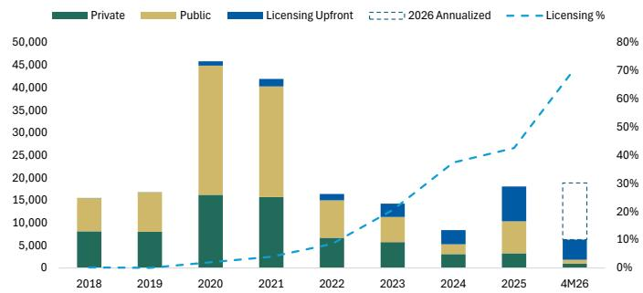

bar

| Year   | Private | Public | Licensing Upfront | 2026 Annualized | Licensing % |
|--------|---------|--------|-------------------|-----------------|-------------|
| 2018   | 8,000   | 7,000  | 0                 | -               | -           |
| 2019   | 8,000   | 8,000  | 0                 | -               | -           |
| 2020   | 16,000  | 30,000 | 1,000             | -               | -           |
| 2021   | 16,000  | 25,000 | 1,500             | -               | -           |
| 2022   | 6,000   | 7,000  | 1,500             | -               | -           |
| 2023   | 6,000   | 6,000  | 1,500             | -               | -           |
| 2024   | 3,000   | 2,000  | 3,000             | -               | -           |
| 2025   | 3,000   | 8,000  | 7,500             | -               | -           |
| 4M26   | 1,500   | 3,500  | 3,500             | -               | -           |

Source: GBI

Exhibit 18: China biotech's risk-bearing capacity is improving as cash runway extends and profitability broadens   
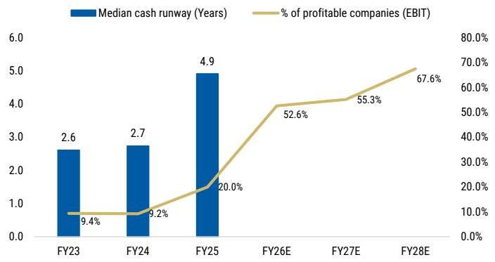

bar_line

| Fiscal Year | Median cash runway (Years) | % of profitable companies (EBIT) |
| :--- | :--- | :--- |
| FY23 | 2.6 | 9.4 |
| FY24 | 2.7 | 9.2 |
| FY25 | 4.9 | 20.0 |
| FY26E | | 52.6 |
| FY27E | | 55.3 |
| FY28E | | 67.6 |

Source: Factset. Note: % of companies with FY26E and FY27E forecast is 58.5% for each, % of companies with FY28E forecast is 56.9%; N=65.

Risk-bearing capacity is becoming more measurable: China biotech's ability to retain more value depends first on whether companies can afford to carry assets further before externalization. The data are moving in the right direction. Average cash runway has expanded from roughly a median of 2.6 years to almost 5 years by FY25, while the share of profitable biotech names is expected to rise from below $10\%$ in FY23 to $68\%$ by FY28. This matters because longer runway and improving profitability reduce forced-licensing risk. Companies with cash, domestic revenue, and licensing income can negotiate from strength, selectively co-develop, or delay externalization until assets are more clinically de-risked.

Risk capacity determines whether a company can hold an asset longer; scarcity determines whether it should: China's original Innovation Dawn advantage was built on globally viable 1-to-N innovation: fast, efficient, clinically relevant assets that could help fill global pipeline gaps. That remains valuable, but the next leg of value capture requires a narrower subset of assets that move closer to 0-to-1 biology or true best-in-class differentiation. AI-driven discovery could accelerate this shift, but should not be valued as proof today. For AI enablers, chemistry models are already delivering measurable execution benefits, while biology models still need human validation. Assets such as Insilico's FIC TNIK program are important because they test whether AI can move China from faster iteration toward genuinely differentiated biology. If validated, AI strengthens the scarcity side of the value-capture equation. For more, please see Biotechnology: Crossing the Molecule: Why 2026 Is the Make-or-Break Year for AI in Drug Discovery.

The ladder below illustrates a potential roadmap of rNPV progression for China Biotech: Domestic-only valuation is driven by China sales and earnings. Licensing adds upfronts, milestones, and royalties, but often transfers global execution risk to the partner. Co-development and co-commercialization can increase retained economics, but only if the incremental profit share compensates for funding and execution burden. NewCo can add equity-linked upside and a second monetization path, but only post-dilution ownership and exit visibility matter. M&A remains the upper bound because it crystallizes value after risk has been reduced and scarcity is proven.

Exhibit 19: Valuation ladder: From domestic sales to retained global rNPV

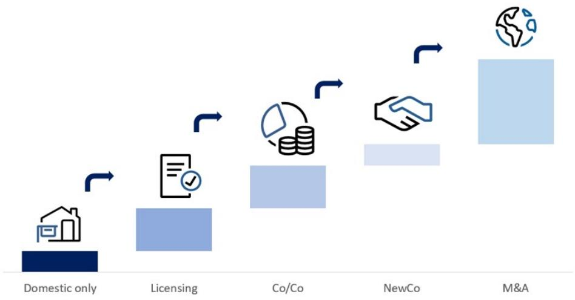

flowchart

Source: MS.

The shift is visible in transaction form, but should be interpreted through risk and scarcity: Partnerships such as Innovent / Takeda (link) and Gilead / Galapagos / Ouro / Keymed (link) matter because they show two ways China originators can retain more rNPV. Innovent retains more economics and development participation through co-development / co-commercialization. Keymed's NewCo path created layered monetization through upfronts, milestones, royalties, equity, and strategic exit. Neither structure deserves a premium by definition. The premium comes only if the structure preserves value after risk, dilution, governance, and execution are accounted for.

Exhibit 20: Innovent x Takeda (US\$) 

<table><tr><td>Dimension</td><td>Innovent</td></tr><tr><td>Net upfront value after cost-sharing retained obligations</td><td>US$1.2bn upfront incl. US$100m equity at a 20% premium, global development cost ex-Greater China on a 60/40 (Takeda/Innovent) basis.</td></tr><tr><td>Quantified retained economics</td><td>Retains full China profit; US 60/40 (Takeda/Innovent) profit sharing; ex-US royalties (tiered, rates undisclosed); milestones up to US $10.2bn.</td></tr><tr><td>Control retained</td><td>Full rights retained in China and a 60/40 profit/loss sharing Co-Co structure in the US, while receiving tiered royalties on Takeda-led sales in RoW.</td></tr><tr><td>Risk-adjusted back-end value</td><td>Milestones up to US$10.2bn on de-risked phase 3 asset IBI363.</td></tr><tr><td>Credible route to monetization</td><td>Top-tier global pharmaceutical player (Takeda) with strong overseas commercialization track record.</td></tr><tr><td>Additional monetizable rights</td><td>Manufacturing supply rights (co-exclusive in the US for IBI363); option economics on IBI3001; retained China commercial infrastructure.</td></tr></table>

Source: MS.

Exhibit 21: GILD/GLPG x Ouro/Keymed Deal (US\$) 

<table><tr><td>Dimension</td><td>Keymed</td></tr><tr><td>Net upfront value after cost-sharing retained obligations</td><td>US$16m upfront received under original licensing deal.</td></tr><tr><td>Quantified retained economics</td><td>US$250mn upfront payment received via 15% equity stake.</td></tr><tr><td>Control retained</td><td>China development and commercialization control.</td></tr><tr><td>Risk-adjusted back-end value</td><td>Up to US$680m receivable milestone (US$610m per original license + US$70m via equity stake) on a phase 1/2 asset with Fast Track and Orphan Drug designations.</td></tr><tr><td>Credible route to monetization</td><td>Early but rising autoimmune build-out, Gilead can bring strong execution capacity and explicit strategic commitment to the space.</td></tr><tr><td>Additional monetizable rights</td><td>No manufacturing transfer disclosed.</td></tr></table>

Source: MS.

# The next re-rating should depend on whether these structures improve retained rNPV:

Higher royalties, profit-sharing, NewCo ownership, or residual rights matter only if they survive cost-sharing, dilution, governance leakage, and development risk. The strongest models are those where China companies retain economics while also gaining a credible role in execution or realization. This is the move from selling innovation wholesale to capturing value bespoke. In-line with the structural foundation of our long-term China innovation thesis - if China is to reach the level of global penetration outlined in Innovation Dawn – where we estimate that 35% of US FDA approvals could originate from China – we expect that rising global asset relevance will also translate into a larger and more durable role in the economics, execution, and strategic architecture of global drug development.

The shift from wholesale to bespoke is not about more complex deal labels. It is about retained rNPV. Companies that can carry more risk and own scarcer assets should be able to negotiate better economics, delay externalization, or move closer to M&A-like outcomes. Companies without both will remain licensing stories.

Exhibit 22: Global innovation supply-demand dynamics underpin our projection that China-originated assets could account for 35% of US FDA approvals and generate US \$220bn ex-China revenue by 2040...   
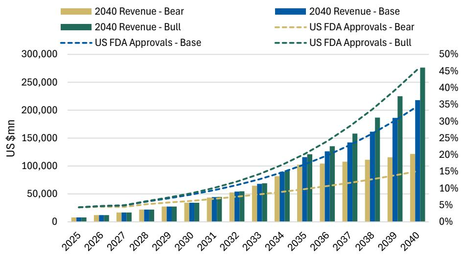

bar_line

| Year | 2040 Revenue - Bear (US $mn) | 2040 Revenue - Bull (US $mn) | 2040 Revenue - Base (US $mn) | US FDA Approvals - Bear (%) | US FDA Approvals - Bull (%) |
|---|---|---|---|---|---|
| 2025 | 5,000 | 7,000 | 8,000 | 3.5 | 4.5 |
| 2026 | 10,000 | 12,000 | 14,000 | 4.5 | 5.5 |
| 2027 | 15,000 | 18,000 | 22,000 | 5.5 | 6.5 |
| 2028 | 20,000 | 25,000 | 30,000 | 6.5 | 7.5 |
| 2029 | 25,000 | 32,000 | 38,000 | 7.5 | 8.5 |
| 2030 | 30,000 | 38,000 | 46,000 | 8.5 | 9.5 |
| 2031 | 35,000 | 45,000 | 54,000 | 9.5 | 11.5 |
| 2032 | 45,000 | 55,000 | 65,000 | 11.5 | 14.5 |
| 2033 | 65,000 | 75,000 | 85,000 | 14.5 | 18.5 |
| 2034 | 85,000 | 95,000 | 115,000 | 17.5 | 23.5 |
| 2035 | 115,000 | 125,000 | 145,000 | 21.5 | 29.5 |
| 2036 | 135,000 | 145,000 | 175,000 | 24.5 | 36.5 |
| 2037 | 165,000 | 175,000 | 215,000 | 28.5 | 44.5 |
| 2038 | 195,000 | 215,000 | 265,000 | 32.5 | 53.5 |
| 2039 | 235,000 | 265,000 | 325,000 | 37.5 | 63.5 |
| 2040 | 275,000 | 325,000 | 395,000 | 43.5 | 73.5 |

Source: GBI, US FDA, MS estimates.

# Climbing the Value Ladder of Globalization

China biotech is moving up the global value ladder along two dimensions: risk and scarcity: The economic dimension is how much downstream rNPV remains with the originator after externalization. The operational dimension is whether China companies can assume more responsibility for global development, regulatory readiness, and commercialization participation. A company cannot retain more value simply by negotiating harder. It must either carry more risk, own a scarcer asset, or both.

# The economic ascent of China biotech

The economic ascent starts with moving beyond the lowest-risk, lowest-retention model: Traditional licensing remains valuable because it validates demand, brings non-dilutive capital, and transfers expensive overseas development obligations to the partner. But that same risk transfer caps retained economics. If the partner funds the pivotal program, manages data harmonization, carries translatability risk, owns CMC, and controls commercialization, the originator should not expect M&A-like value capture.

NewCo and co-development are two responses to the same constraint: NewCo can create an offshore, financeable vehicle that may reduce China-parent friction and improve acquirability. Co-development and co-commercialization keep the China originator directly involved in execution and economics. Neither is inherently superior. NewCo works only if post-dilution ownership and exit visibility are strong. Co-development works only if incremental economics exceed the added cost and risk.

But the structure is not cost-free: Ownership dilutes, governance can shift outward, and realizable value depends on what remains after subsequent financing and execution. The relevant question is not whether NewCo adds theoretical upside, but whether it improves post-dilution monetization relative to classic licensing.

Exhibit 23: Why NewCo addresses historical barriers 

<table><tr><td>Historical barriers to overseas M&amp;A of China biotech</td><td>How NewCo structures address the barrier</td></tr><tr><td>Offshore IP constraint</td><td>Ex-China rights consolidated into an offshore entity governed by Western-law, creating a clean, company-level ownership structure.</td></tr><tr><td>Transaction friction</td><td>Transaction ownership shifts from the China parentco to an offshore vehicle, reducing regulatory, national-interest, and integration friction.</td></tr><tr><td>External syndicate gap</td><td>Dedicated offshore NewCo attracts specialist global capital and operators, strengthening financing, execution, and strategic positioning</td></tr><tr><td>M&amp;A bridge absence</td><td>Program re-cast as an acquirable offshore company, enabling strategic value transfer through equity ownership.</td></tr></table>

Source: MS

Gilead/Ouro/Keymed represents the clearest recent proof point, as it demonstrates the full chain of value transfer: Keymed first externalized the asset CM336/OM336 (BCMA/CD3) through a deal structure that preserved near-term cash, milestones, royalties, and equity. The offshore NewCo then became the object of strategic value transition. Gilead's recent acquisition of Ouro (link) demonstrates that a China-originated asset can now move through a NewCo structure and enter the global M&A cycle in a way that direct ownership often could not. Keymed did not monetize only once through licensing; it monetized across layers — upfront economics, retained contractual value, and equity realization at exit.

That said, the structure was not cost-free. The China originator's equity in the asset was diluted as external investors came in, and some value was shared away. However, at this stage, that trade-off may still be rational: a syndicate led by OrbiMed, RA Capital, Vivo, or comparable offshore specialists can often do more to finance, validate, and ultimately transact an asset than the business development function of a mid-cap China biotech acting alone. We still see scope for China biotechs to improve their share of the economics over time, but today the NewCo model expands the path to realization beyond what classic licensing allows.

Exhibit 24: GILD vs GLPG vs Keymed economics 

<table><tr><td colspan="2"></td><td>GILD</td><td>GLPG</td><td>Keymed</td></tr><tr><td rowspan="4">New-co Related</td><td>Territory Right</td><td>Execution ex-China</td><td>Development ex-China</td><td>China execution and development</td></tr><tr><td>Upfront</td><td></td><td></td><td>US$16mn received</td></tr><tr><td>Milestone</td><td>GILD to assume 75%</td><td>GLPG to assume 25%</td><td>Up to c.US $610mn to receive</td></tr><tr><td>Royalties</td><td>GILD to assume 50%</td><td>GLPG to assume 50%</td><td>High-teens ex-China</td></tr><tr><td rowspan="3">M&amp;A add-on</td><td>Upfront</td><td>US$837.5mn paid</td><td>US$837.5mn paid</td><td>US$250mn received</td></tr><tr><td>Milestone</td><td>Up to c.US$250mn payable</td><td>Up to c.US$250mn payable</td><td>c.US$70mn to receive</td></tr><tr><td>Royalties</td><td></td><td>20-23%</td><td>unchanged</td></tr></table>

Source: Company filings, MS.

Co-development and co-commercialization address a different constraint. While a NewCo structure creates an offshore bridge to financing and M&A, a co-co structure keeps the China originator directly involved. The appeal lies not only in a stronger economic stream, but also in retained influence over development and commercialization. This matters because the asset is less likely to be absorbed into a broader partner portfolio where decisions sit entirely outside the originator's control. Co-co therefore goes beyond a higher-royalty arrangement; it is a structure that preserves both economics and steering power.

NewCo and co-co represent different expressions of the same underlying shift: Both extend the traditional licensing template. Both aim to preserve a larger role for the China innovator after externalization. Both respond to a long-standing constraint: classic

licensing validated assets, but transferred too much of the downstream value and too much decision-making authority to partners. The difference lies in mechanism. NewCo pursues value capture through an offshore vehicle and the potential for a second monetization event. Co-co pursues value capture through a larger ongoing share of economics and a more durable role in development.

# The operational ascent of China biotech

The operational ascent is the other side of value capture: China's role in global pharma is expanding from asset source to development partner. This is consistent with the original Innovation Dawn thesis that global pharma can improve R&D ROI by leveraging China's speed, cost structure, patient access, and development infrastructure. The implication is not that China development is fully interchangeable with US or global development. The implication is that China-led early development, China-generated data, and China-based R&D infrastructure are becoming more useful inputs into global programs.

Another driver is rising confidence in China biotech operators. Arrangements such as between Innovent and Lilly (link) suggest that multinational pharma is becoming more receptive to relying on leading China biotech companies with established track records for meaningful portions of discovery and early development, even as global partners typically assume a larger role at the later-stage and global registration phase.

Exhibit 25: China infrastructure as part of the global R&D engine   
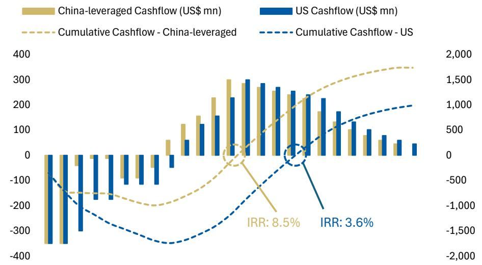  
Source: MS estimates.

That operating confidence has direct valuation implications: The more China companies can contribute to global trial execution, regulatory package formation, CMC readiness, and early clinical de-risking, the less value they need to transfer at the licensing stage. Over time, this should allow select originators to negotiate stronger retained economics, participate more meaningfully in co-development, or carry assets further before externalization. Investors should value this through retained rNPV, not abstract optionality.

Exhibit 26: China has shown significant progress in regulatory harmonization to global biotech standards   
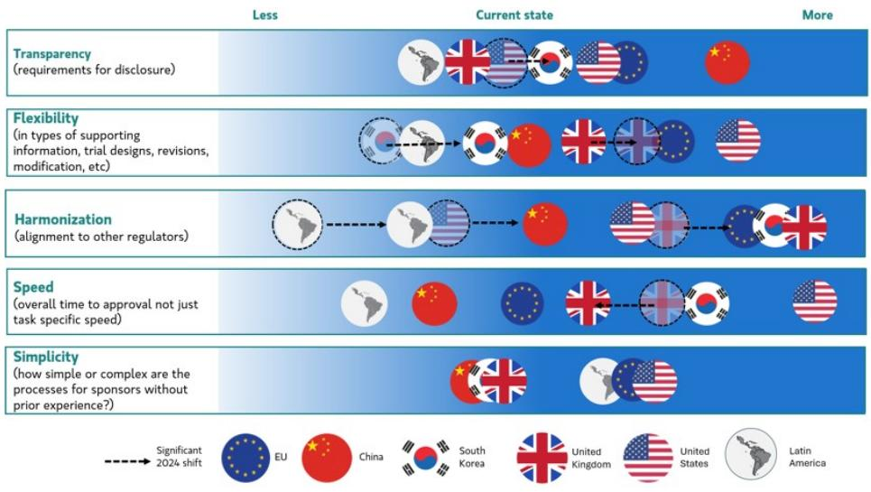

flowchart

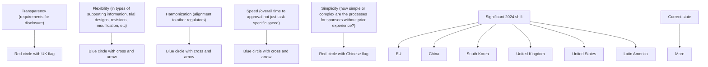

Source: IQVIA. MS.

The immediate implication is valuation: A sector with broader downstream economics and deeper operating relevance should not be assessed solely on domestic sales and risk-adjusted royalty streams. A softer but still important implication is structural. As China assets, operators, and China-generated data become more embedded in global development, the likelihood increases that China pipelines are viewed as more credible, more financeable, and more globally transferable earlier in their life cycle. That progression sets up the next section. A broader role in economics and execution should widen the valuation lens, strengthen overseas investor interest, and bring forward recognition of pipeline value that the market has historically discounted too aggressively.

Exhibit 27: China-sponsored clinical activity has increased sharply since 2015, with a consistently rising share that includes trials conducted at ex-China sites...   
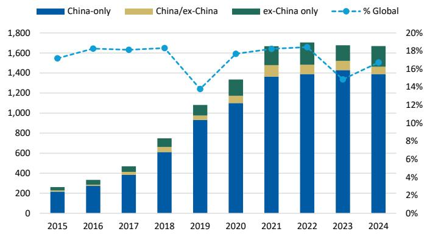

bar_line

| Year | China-only | China/ex-China | ex-China only | % Global |
|---|---|---|---|---|
| 2015 | 200 | 0 | 50 | 17.5 |
| 2016 | 280 | 0 | 70 | 18.5 |
| 2017 | 380 | 0 | 90 | 18.5 |
| 2018 | 600 | 100 | 100 | 18.5 |
| 2019 | 900 | 100 | 120 | 13.5 |
| 2020 | 1100 | 100 | 180 | 16.5 |
| 2021 | 1350 | 150 | 200 | 17.5 |
| 2022 | 1380 | 150 | 220 | 17.5 |
| 2023 | 1450 | 150 | 220 | 14.5 |
| 2024 | 1380 | 150 | 230 | 16.5 |

Source: Citeline Trialtrove, Jan 2025; IQVIA Institute, Jan 2025, MS.

Exhibit 28: ...this has translated into a rising share of China sponsors in global trial starts, particularly in oncology, closely followed by other major areas such as immunology and metabolic/endocrinology   

bar

| Category | 2015-2019 (%) | 2020-2024 (%) | 2024 (%) |
| :--- | :--- | :--- | :--- |
| Total | 10 | 22 | 30 |
| Oncology | 11 | 27 | 39 |
| Infectious diseases | 19 | 33 | 33 |
| Immunology | 4 | 18 | 29 |
| Metabolic/endocrinology | 6 | 20 | 28 |
| Vaccines | 11 | 17 | 26 |
| Cardiovascular | 12 | 16 | 19 |
| All Others | 6 | 15 | 18 |
| Neurology | 6 | 13 | 17 |

Source: Citeline Trialtrove, Jan 2025; IQVIA Institute, Jan 2025, MS.

# Why the Market Must Broaden the Lens

The current valuation framework is too narrow for the next phase of China biotech globalization: Historically, investors valued China biotech on domestic sales, domestic earnings power, and heavily discounted ex-China optionality. The 2025 re-rating began to recognize that China-originated assets can be globally relevant. Innovation Dawn 2.0 requires a stricter framework: value should be assigned based on retained rNPV, risk assumed, asset scarcity, and probability of realization.

The key question is whether structure changes cash-flow ownership: Licensing, co-development, NewCo, and M&A all need to be valued through cash flows. What changes is the share of economics retained, the cost and risk required to earn those economics, the timing of realization, and the credibility of monetization. A NewCo or co-co structure should not automatically re-rate a company, but it can justify higher value if it improves post-dilution ownership, profit participation, regulatory portability, or the path to financing or acquisition.

Exhibit 29: ... with innovation progress driving substantial momentum in outbound licensing of China-originated assets   
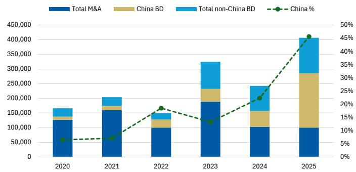

bar_line

| Year | Total M&A | China BD | Total non-China BD | China % (%) |
|---|---|---|---|---|
| 2020 | 120000 | 30000 | 40000 | 6 |
| 2021 | 160000 | 30000 | 40000 | 7 |
| 2022 | 100000 | 40000 | 40000 | 18 |
| 2023 | 190000 | 60000 | 110000 | 13 |
| 2024 | 100000 | 70000 | 110000 | 21 |
| 2025 | 100000 | 250000 | 130000 | 45 |

Source: FactSet, GBI, MS.

Exhibit 30: Without backward-loaded milestone and royalties, upfront payments represent only a minority of total value   
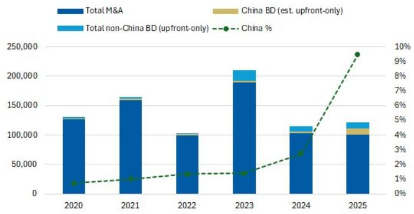

bar_line

| Year | Total M&A | China BD (est. upfront-only) | Total non-China BD (upfront-only) | China % |
|---|---|---|---|---|
| 2020 | 130,000 | 10,000 | 10,000 | 1.2 |
| 2021 | 160,000 | 10,000 | 10,000 | 1.4 |
| 2022 | 100,000 | 10,000 | 10,000 | 1.5 |
| 2023 | 190,000 | 15,000 | 25,000 | 1.6 |
| 2024 | 115,000 | 15,000 | 15,000 | 2.8 |
| 2025 | 125,000 | 15,000 | 15,000 | 9.5 |

Source: FactSet, GBI, MS.

Retained take-rate and access to realization should now sit closer to the center of the globalization debate: Pure licensing not only remains the lowest-burden path and, for many assets, is still the appropriate choice, but it also offers the most limited retained value. Co-development and co-co can preserve a larger share of the long-tail upside by replacing part of a royalty-only stream with direct exposure to ex-China development and commercialization outcomes. NewCo structures can extend this further by adding post-dilution equity exposure and a second monetization layer if the vehicle is later financed, repriced, partnered, or acquired. Straight M&A remains the upper bound of realized value because it converts future uncertainty into immediate ownership transfer, even though this route has historically been less accessible to China biotech (Exhibit 23). The point is not to value these structures equivalently, but to recognize that headline deal value alone does not capture the differences. Beyond deal structure, asset quality is a critical determinant of retained economics.

While structural innovation has expanded the options available to China biotech, bargaining power remains fundamentally driven by asset differentiation. Me-too programs — particularly in modalities where China supply has become abundant — have increasingly commoditized economics, limiting retained take-rate. By contrast, true first-in-class or best-in-class assets continue to command stronger royalties, deeper co-development participation, or equity-linked upside. Among top-tier NewCos formed with China-originated assets, and leading licensing deals with favorable deal terms (Exhibit 40, Exhibit 42), the underlying pipeline assets typically represented category-leading innovations at the time of deal formation. As China's innovation depth improves, asset scarcity rather than origin should increasingly dictate deal terms, providing an additional structural tailwind to retained economics over time.

The valuation uplift should come through three channels: First, retained economics can improve through higher royalties, profit-sharing, stronger residual rights, or post-dilution NewCo ownership. Second, the market may begin to recognize overseas pipeline value earlier as the path to realization becomes more credible. This matters particularly for NewCo structures. Previously treated as interim steps rather than full validation, NewCos now show clear proof points as credible bridges to offshore financing and, in select cases, strategic M&A. As a result, the validation value of NewCo pipelines should no longer lag, but credible NewCo formation can bring forward partial recognition of overseas pipeline value, especially where post-dilution ownership, investor quality, financing path and strategic-exit visibility are strong. Third, stronger structures can improve the quality of value retained, not just the quantity. Companies that keep measurable long-tail economics and a credible path to monetization should command a different valuation response than those whose apparent upside rests mainly in back-ended milestones or loosely defined structural optionality.

Exhibit 31: Out-licensing to M&A NPV discount   
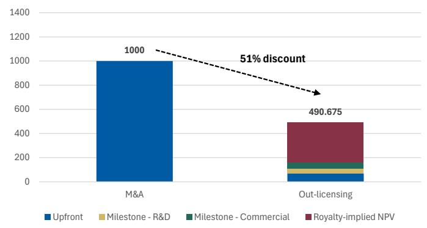

bar_stacked

| Category | Upfront | Milestone - R&D | Milestone - Commercial | Royalty-implied NPV |
| :--- | :--- | :--- | :--- | :--- |
| M&A | 1000 | 0 | 0 | 0 |
| Out-licensing | 50 | 50 | 50 | 290.675 |
51% discount indicated by dashed arrow

Source: MS estimates.

Exhibit 32: NewCo to M&A NPV discount   
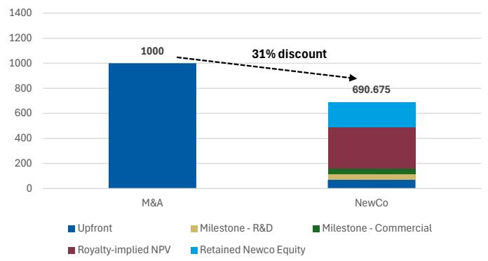

bar_stacked

| Category | Upfront | Milestone - R&D | Milestone - Commercial | Royalty-implied NPV | Retained Newco Equity |
| :--- | :--- | :--- | :--- | :--- | :--- |
| M&A | 1000 | 0 | 0 | 0 | 0 |
| NewCo | 690.675 | 80 | 40 | 320 | 150 |

Source: MS estimates.

Exhibit 33: Co-development to M&A NPV discount   
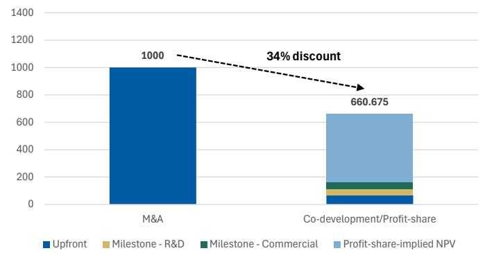

bar_stacked

| Category | Value |
| :--- | :--- |
| M&A | 1000 |
| Co-development/Profit-share | 660.675 |
34% discount indicated by dashed line.

Source: MS estimates.

Exhibit 34: NPV estimate assumptions 

<table><tr><td></td><td>Licensing</td><td>Co/Co; NewCo</td><td>PoS</td></tr><tr><td>Headline deal value (US $ mn)</td><td></td><td>1000</td><td>-</td></tr><tr><td>Upfront</td><td></td><td>7%</td><td>-</td></tr><tr><td>Milestone - R&amp;D</td><td></td><td>30%</td><td>15%</td></tr><tr><td>Milestone - Commercial</td><td></td><td>70%</td><td>15% * 50%</td></tr><tr><td>Profit Split-implied NPV</td><td>33%**</td><td>50%</td><td>-</td></tr><tr><td>NewCo Equity</td><td>-</td><td>20%</td><td>NA*</td></tr><tr><td>Retained deal value (US $ mn)</td><td>~490</td><td>~660-690</td><td>-</td></tr></table>

Source: MS. \*\*Note: As a proportion of overall assets, assuming NPM of c. 30% for innovative drugs, low-mid teens sales royalties would constitute of net profit. \*Too early for risk estimate, though not all NewCos would be acquired,

The broader lens has direct stock-selection implications: China biotech has historically traded at discounts tied to domestic and geopolitical policy sensitivity, macro funding cycles, and skepticism over ex-China value transfer. Those discounts should narrow for companies that can prove two things: first, that they have the balance sheet, licensing income, domestic cash flow, and global execution capability to assume more development risk; and second, that their assets are scarce enough to justify better economics. This is the bridge from sector thesis to portfolio construction.

# The Cases of ERASCA/Joyo and RAPT Therapeutics/Jemincare

# - ERASCA/Joyo – pan-RAS(ON) agent ERAS-0015/JYP-0015

In retrospect, there are cases where China innovators may have left value on the negotiating table: One example is the Joyo-Erasca pan-RAS transaction.

Erasca's current value is largely centered on ERAS-0015, a next-generation pan-RAS molecular glue licensed from Guangzhou JOYO Pharmatech in China. Erasca subsequently expanded the agreement to secure broader rights. Under the terms of the original ERAS-0015 license, Erasca received an exclusive license to develop and commercialize the asset in its territory (worldwide ex-mainland China, Hong Kong, and Macau) in exchange for a one-time upfront payment of US\$12.5mn, up to US\$176.5mn in development, regulatory, and commercialization milestones, and a low- to mid-single-digit royalties. The agreement also allows Erasca, at its election and prior to the Phase 2 dosing or NDA filing by either party, to convert the territory to worldwide rights through a one-time payment. Following early clinical signals for ERAS-0015 and category validation from Revolution Medicines' Phase 3 success, ERAS shares have re-rated sharply over the past year. The move reflects improving sentiment around RAS druggability, a clearer competitive benchmark, and Erasca's positioning as a potential "next-wave" RAS entrant. Since the ERAS-0015 licensing in May 2024, Erasca's share price has risen from \~US\$1.97 to \~US \$17.80 (vs. c. 52%+ for XBI). We attribute most of this valuation inflection to broader de-risking of the pan-RAS category, led by RVMD, rather than asset-

specific economics retained by the original licensor.

The valuation inflection unfolded through a sequence of clinical and corporate developments that progressively validated the pan-RAS (ON) axis. The first signal emerged in September 2025, when RVMD presented Phase 1/2 data for daraxonrasib, its pan-RAS (ON) inhibitor, showing encouraging anti-tumor activity in 2L+ PDAC. Reported outcomes included a 29–35% ORR, median PFS of 8.1–8.5 months, and median OS of 13.1–15.6 months across evaluable patients, alongside a 47% ORR in 1L monotherapy cohorts (link). These data also coincided with heightened strategic interest. Media reports indicated that Merck discussed a potential US\$28–32bn acquisition at the January 2026 JPM conference (link), although negotiations did not proceed due to valuation differences (link). Further clinical validation followed on April 13, 2026, when RVMD reported positive Phase 3 top-line results from RASolute 302. According to a company press release, RVMD's Phase 3 RASolute 302 trial of daraxonrasib achieved a median OS of 13.2 months, vs 6.7 months for chemotherapy (HR 0.40; p<0.0001), representing a meaningful improvement in survival outcomes in 2L metastatic PDAC (link). The disclosure coincided with an incremental market capitalization increase of US \$9.7bn for RVMD.

\- RAPT/Jemincare – IgE antibody RPT904/JYB1904

A second example is the Jemincare-RAPT Therapeutics transaction in December 2024. Jemincare out-licensed RPT904 (formerly JYB1904), a novel anti-IgE antibody with an extended half-life vs Xolair and potential best-in-class positioning across severe allergic conditions, including food allergies. The deal comprised US \$35mn upfront and total potential consideration of US\$707.5mn (link).

The deal appears undervalued in hindsight. GSK acquired RAPT for US\$2.2bn in March 2026, representing a 65% premium to RAPT's pre-announcement share price (link). At the time of the original deal announcement, indications of RPT904's clinical potential came from Phase 2 data in chronic spontaneous urticaria (CSU). The results showed that RPT904, dosed every 8–12 weeks, achieved comparable or superior UAS7 score reductions vs Xolair dosed every 4 weeks, with complete symptom resolution (UAS7=0) rates of 37–39%, vs 24% at Week 12, and 44–46%, vs 33%, at Week 16 (link). By comparison, Xolair generated over US\$5.4bn in global sales in 2025 across indications including food allergy, CSU, and allergic asthma. Following these Phase 2 results, RPT904 has progressed into Phase 3 development for CSU, with primary completion expected in 2027 (link), alongside ongoing readouts from the its Phase 2b prestIgE trial in food allergy (link).

These examples are hindsight illustrations rather than clean counterfactual valuations. They do not imply that the original licensor should have captured all subsequent public-market or M&A value. Rather, they show how early licensing can leave originators underexposed when category validation, strategic demand, asset scarcity or licensee execution improves after the deal.

# The Cases of Hengrui and Hansoh - Perspectives from China Pharma

\- Hengrui - maximizing asset potential while also gradually climbing the value ladder

Among traditional China pharma, we think Hengrui is a notable example of an increasingly systematic globalization path coupled with higher value retention. While its earlier deals were mainly typical out-licensing arrangements, with upfront/milestone payments and tiered sales royalties up to the teens % range, recent deals span more versatile formats including NewCo and Co-Co.

Speedy NewCo fundraising and IPO to expedite asset global development in a tight race: Take Kailera (KLRA US, not covered), Hengrui's overseas NewCo for its GLP-1 franchise, as an example. Hengrui originally provided ex-China rights to its GLP-1 franchise in return for a 19.9% stake in Kailera. In 1.5 years, Kailera completed a US\$400mn Series A funding in Oct'24, a US\$600mn Series B funding in Oct'25 and a NASDAQ listing in Apr'26. Kailera is currently trading at a US\$2.3bn market cap, in which Hengrui owns a 13.6% stake. Besides the typical milestones and future sales royalties, Hengrui is also able to book investment gains related to Kailera. More importantly, Kailera's smooth fundraising has enabled it to expedite global development for multiple GLP-1 candidates. In the increasingly crowded GLP-1 landscape, speed-to-market is at least as important as clinical profile, in our view, in enhancing commercial value. See Jiangsu Hengrui: NewCo Kailera's US IPO Validates Global Monetization Path for GLP-1 Franchise (17 Apr 2026).

Similarly, Hengrui has formed a second NewCo, BraveHeart, for its myosin inhibitor (HRS-1893), which has demonstrated global best-in-class potential in both oHCM and nHCM in China Phase II trials, and is advancing into global Phase 3 in 2026 for both indications. See China Healthcare: Trip Takeaways from Pharma Companies (18 May 2026).

Broad collaboration with BMS spans out-licensing, in-licensing and Co-Co in one package, leveraging respective strengths: In May 2026, Hengrui and BMS announced a broad strategic collaboration involving 13 assets: 1) Hengrui will out-license ex-China rights to 4 oncology/hematology assets to BMS; 2) BMS will grant Hengrui China rights to 4 immunology assets; and 3) the two companies will co-develop 5 assets. Hengrui will advance the first 8 assets to POC stages, while it also has opt-in rights for global co-commercialization of certain assets. See Jiangsu Hengrui: Landmark US\$15.2bn Strategic Collaboration with BMS Accelerates Globalization (12 May 2026)

According to Hengrui, the deal was reached in \~3 months and expanded materially beyond the initial asset-specific discussions into the eventual multi-faceted collaboration. Although the exact assets and co-co sharing terms are not disclosed, we think the deal demonstrates how China and global pharma can use their respective expertise to maximize asset potential - China pharma is responsible for moving PCCs into the clinic and up to POC stage, as well as domestic commercialization, while global biopharma is responsible for global development and ex-China commercialization.

Exhibit 35: Hengrui's deal models have evolved to maximize asset potential and climb the value ladder   
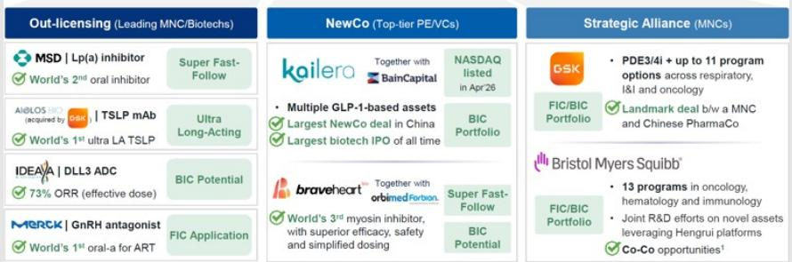

text_image

Out-licensing (Leading MNC/Biotechs)
MSD | Lp(a) inhibitor
World's 2nd oral inhibitor
Super Fast-Follow
AldBLOS (acquired by OSK) | TSLP mAb
World's 1st ultra LA TSLP
Ultra Long-Acting
IDEAVA | DLL3 ADC
73% ORR (effective dose)
BIC Potential
MERCK | GnRH antagonist
World's 1st oral-a for ART
FIC Application
NewCo (Top-tier PE/VCs)
kailera
Together with BainCapital
NASDAQ listed in Apr 26
Multiple GLP-1-based assets
Largest NewCo deal in China
Largest biotech IPO of all time
BIC Portfolio
braveheart
Together with orbimed Forbian.
World's 3rd myosin inhibitor,
with superior efficacy, safety and simplified dosing
Super Fast-Follow
BIC Potential
Strategic Alliance (MNCs)
GSK
PDE3/4i + up to 11 program options across respiratory, I&I and oncology
FIC/BIC Portfolio
Landmark deal b/w a MNC and Chinese PharmaCo
Bristol Myers Squibb*
13 programs in oncology, hematology and immunology
Joint R&D efforts on novel assets leveraging Hengrui platforms
Co-Co opportunities¹

# Source:

Company presentation

Exhibit 36: Hengrui/BMS deal spans in-licensing, out-licensing and Co-Co   
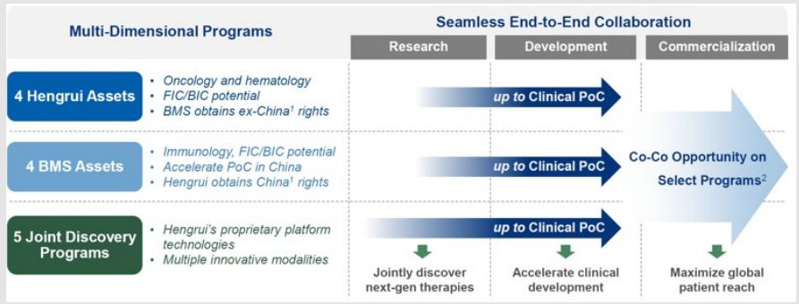

flowchart

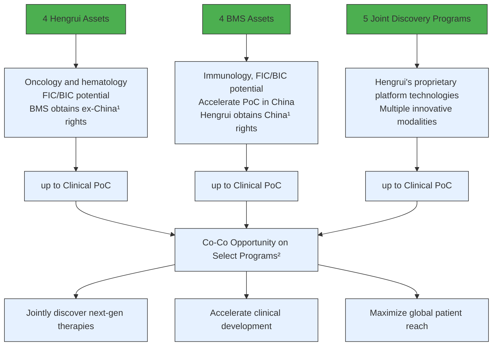

# Source:

Company presentation

\- Hansoh - consistent execution on traditional out-licensing deals, unlocking a bigger pie for win-win outcomes

Recurring and growing milestone payments support guidance: Hansoh is one of the first China pharma companies to have started receiving sizeable, recurring milestone payments from past deals. By the end of 2025, it had already received US\$200mn+ in cash from executed transactions, and management guided for business development income to grow by a double-digit % YoY in 2026, even if only accounting for milestone payments from executed deals. For example, the B7H3 ADC licensed to GSK entered Global Phase 3 in ES-SCLC by 2H25, with more global pivotal and POC trials planned for 2026-27, while the B7H4 ADC licensed to GSK is also entering 5 global trials in 2026, per GSK. The GLP-1/GIP candidate licensed to Regeneron has smoothly kicked off global Phase 2 in late 2025 and is expected to enter global Phase 3 in 2026, yielding potential positive synergies with Regeneron's cardiometabolic portfolio. The CDH17 ADC out-licensed to Roche and the oral GLP-1 out-licensed to MSD had both also entered global Phase I by 4Q25.

Unlocking the bigger pie for ultimate win-win outcomes: Although Hansoh's business development deals have all followed traditional out-licensing models, with total deal sizes generally in the US\$1.4-2bn range, they still sit well within our assessment framework. Hansoh's prudent partner selection, followed by smooth execution, has enabled partners to better realize the assets' globalization value, unlocking a bigger pie that should ultimately generate higher ROIC for both

Hansoh and its partners, we believe. From a valuation perspective, the recurring nature of milestone payments, incorporated into management guidance, also provides better earnings visibility and warrants a higher valuation multiple, in our view.

Exhibit 37: Hansoh has executed consistently on traditional deal formats, unlocking a bigger pie for win-win outcomes 

<table><tr><td colspan="2"></td><td>GSK</td><td>GSK</td><td>Roche</td><td>REGENERON</td><td>MSD</td><td>glenmark</td></tr><tr><td>$500+Min upfront payments from Partnerships and Out Licensing</td><td>Program</td><td>HS-20093B7-H3 ADC</td><td>HS-20089B7-H4 ADC</td><td>HS-20110CDH17 ADC</td><td>HS-20094GIP/GLP-1</td><td>HS-10535Oral GLP-1</td><td>aumolertinibEGFRm TKI</td></tr><tr><td rowspan="2">$200+M#in cash received from executed transactions.</td><td>Stage at InitialAnnounce-ment</td><td>China Ph2Q4, 2023</td><td>China Ph1Q4, 2023</td><td>Global Ph1Q4, 2025</td><td>China Ph3Q2, 2025</td><td>PreclinicalQ4, 2024</td><td>UK approvalQ4, 2025</td></tr><tr><td>Stage by 2025H2</td><td>Global Ph3</td><td>Global Ph3</td><td>Global Ph1</td><td>Pending for Global Ph3</td><td>Global Ph1</td><td>UK approvalEMA NDA</td></tr><tr><td rowspan="3">$9+Bin potential future milestone payments,in addition to tiered royalties.</td><td>Upfront</td><td>$185M</td><td>$85M</td><td>$80M</td><td>$80M</td><td>$112M</td><td>undisclosed</td></tr><tr><td>Milestone</td><td>$1.53B</td><td>$1.49B</td><td>$1.45B</td><td>$1.93B</td><td>$1.9B</td><td>$1B+</td></tr><tr><td colspan="5">tiered royalties on net sales ex-China*</td><td>worldwide</td><td>emerging market</td></tr></table>

# Source:

Company presentation

# Framework for Underwriting Varying Deal Structures

We assess deal structures through our SCORE framework. The framework is designed to distinguish structures that enhance theoretical upside from those that improve realizable value.

1. Share of economics — How much ex-China value is actually retained by the China originator   
2. Control retained — How much influence remains over development, commercialization, and key strategic decisions   
3. Obligation efficiency — Whether the funding, execution, and commercialization burden retained by the China side is adequately compensated by the economics preserved.   
4. Route to monetization — The credibility of the path from headline structure to realized cash value or equity value   
5. External backers — The quality of the partner or offshore syndicate in financing, validating, and exiting the structure

The first three elements of SCORE determine whether a structure genuinely improves the originator's position in the value chain: Share of economics differentiates a pure royalty stream from a broader long-tail claim through co-co, or layered economics through NewCo equity alongside residual royalties, milestones, supply rights, or China rights. Control retained tests whether those economics come with real influence over development, governance, or commercialization. Obligation efficiency completes the picture by examining what funding, execution, or commercialization burden the company must still bear to earn the higher economics. Together, these three criteria distinguish genuine upgrades from more complex versions of traditional licensing.

The remaining two elements determine whether the structure can convert into realized value: Route to monetization matters because co-co, and especially NewCo, can appear attractive on paper while still failing to deliver cash or equity value within a reasonable timeframe. In NewCo structures, the retained stake matters less than the post-dilution stake and the credibility of a future financing, partnership, or M&A pathway.

External backers matter because the quality of the partner or syndicate often determines whether that pathway materializes. Together, these criteria distinguish theoretical upside from realizable value.

Exhibit 38: SCORE framework: How deal structures differ across economics, control, burden, and realizability 

<table><tr><td>SCORE element</td><td>Licensing</td><td>Co-co</td><td>NewCo</td><td>M&amp;A</td></tr><tr><td>Share of economics</td><td>**</td><td>***</td><td>***</td><td>****</td></tr><tr><td>Control retained</td><td>*</td><td>****</td><td>***</td><td>-</td></tr><tr><td>Obligations assumed (lighter burden = better)</td><td>*****</td><td>**</td><td>****</td><td>*****</td></tr><tr><td>Route to monetization</td><td>***</td><td>***</td><td>***</td><td>*****</td></tr><tr><td>External backers</td><td>***</td><td>***</td><td>****</td><td>*****</td></tr></table>

Source: MS. Note: Stars represent how well each form of collaboration performs under the SCORE framework.

The point of the SCORE framework is not to rank structures by headline sophistication, but to distinguish contractual upside from realizable value: Licensing, co-co, NewCo, and M&A each preserve different combinations of economics, control, burden, and monetization path. SCORE therefore functions as an underwriting filter. It helps identify which structures genuinely strengthen the China originator's position and which merely appear more attractive on paper.

Exhibit 39: Illustrative examples of offshore-vehicle structures 

<table><tr><td>NewCo Name</td><td>China Biotech/Pharma Partner</td><td>Key Deal Terms</td><td>Founding Investors</td></tr><tr><td>AirNexis Therapeutics</td><td>Haisco Pharmaceutical</td><td>$40M cash + 19.9% equity + $955M milestones + royalties</td><td>Frazier, OrbiMed, GS Alt., SR One, Longitude, Enavate</td></tr><tr><td>Belenos Biosciences</td><td>Keymed Biosciences</td><td>$15M upfront (+near-term) + $170M milestones + royalties + 30.01% equity</td><td>OrbiMed</td></tr><tr><td>Caldera Therapeutics</td><td>Qyuns Therapeutics</td><td>$10M upfront + $545M milestones + tiered royalties + 24.88% equity</td><td>Atlas Venture, LAV, venBio</td></tr><tr><td>Kalexo Bio</td><td>Mabwell Bioscience</td><td>$12M upfront (+near-term) + $1B milestones + royalties + equity</td><td>Aditum Bio</td></tr><tr><td>Oblenio Bio</td><td>Leads Biolabs</td><td>$35M upfront (+near-term) + $579M milestones + royalties + equity</td><td>Aditum Bio</td></tr><tr><td>Ouro Medicines</td><td>Keymed Biosciences</td><td>$16M upfront + $610M milestones + royalties; acquired by Gilead for $2B+ in Mar 2026 ($1.675B upfront + $500M milestones)</td><td>TPG, NEA, Norwest, Monograph, GSK, UPMC, Boyu/Zoo, LongRiver</td></tr><tr><td>Prolium Bioscience</td><td>InnoCare + Keymed</td><td>$17.5M upfront (+near-term) + $502.5M milestones + royalties + minority equity stake</td><td>RTW Investments</td></tr><tr><td>Timberlyne Therapeutic</td><td>Keymed Biosciences</td><td>$30M upfront (+near-term) + $337.5M in potential milestones + Tiered royalties on net sales + 25.79% equity</td><td>Mountainfield Venture Partners, Bain Capital, Venrock, LAV</td></tr><tr><td>TRC 2004</td><td>Genor Biopharma</td><td>Double-digit million USD Upfront + equity + $443M milestones + tiered royalties</td><td>Two River, Third Rock</td></tr><tr><td>Verdiva Bio</td><td>Sciwind Biosciences</td><td>$70M upfront + $2.4B+ milestones + tiered royalties</td><td>Forbion, General Atlantic, RA, OrbiMed, Logos, LAV, LYFE</td></tr><tr><td>Vignette Bio</td><td>EpimAb Biotherapeutics</td><td>$60M upfront (cash + equity) + $575M milestones + royalties</td><td>Foresite Capital, Qiming USA, Samsara, Mirae Asset</td></tr><tr><td>Windward Bio</td><td>Harbour BioMed + Kelun Biotech</td><td>$45M upfront + $925M milestones + royalties + equity</td><td>OrbiMed, Novo Holdings, Blue Owl Healthcare Opportunities</td></tr></table>

Source: Company disclosures.

Source: Company disclosures. Note: Stars represent how well each form of collaboration performs under the SCORE framework.   
Exhibit 40: Illustrative assessment of NewCo structures under the SCORE framework 

<table><tr><td>NewCo Name</td><td>Share of Economics</td><td>Control Retained</td><td>Obligations Assumed</td><td>Route to Monetization</td><td>External Backers</td><td>NewCo Quality Tiers</td><td>Licensor</td></tr><tr><td>Ouro Medicines</td><td>***</td><td>***</td><td>*****</td><td>*****</td><td>*****</td><td>Tier 1</td><td>Keymed</td></tr><tr><td>Belenos Biosciences</td><td>****</td><td>****</td><td>*****</td><td>****</td><td>****</td><td>Tier 1</td><td>Keymed</td></tr><tr><td>Timberlyne Therapeutics</td><td>****</td><td>****</td><td>*****</td><td>****</td><td>****</td><td>Tier 1</td><td>Keymed</td></tr><tr><td>Caldera Therapeutics</td><td>****</td><td>***</td><td>*****</td><td>***</td><td>*****</td><td>Tier 1</td><td>Qyuns</td></tr><tr><td>Windward Bio</td><td>***</td><td>**</td><td>*****</td><td>****</td><td>*****</td><td>Tier 2</td><td>Harbour Bio + Kelun Bio</td></tr><tr><td>TRC 2004</td><td>**</td><td>***</td><td>*****</td><td>****</td><td>****</td><td>Tier 2</td><td>Genor Bio</td></tr><tr><td>AirNexis Therapeutics</td><td>****</td><td>***</td><td>*****</td><td>***</td><td>****</td><td>Tier 2</td><td>Haisco</td></tr><tr><td>Vignette Bio</td><td>***</td><td>**</td><td>*****</td><td>***</td><td>****</td><td>Tier 2</td><td>EpimAb Bio</td></tr><tr><td>Verdiva Bio</td><td>***</td><td>*</td><td>*****</td><td>****</td><td>****</td><td>Tier 2</td><td>Sciwind</td></tr><tr><td>Prolium Bioscience</td><td>**</td><td>**</td><td>*****</td><td>**</td><td>***</td><td>Tier 2</td><td>Keymed + InnoCare</td></tr><tr><td>Oblenio Bio</td><td>***</td><td>**</td><td>*****</td><td>**</td><td>**</td><td>Tier 2</td><td>Leads Bio</td></tr><tr><td>Kalexo Bio</td><td>*</td><td>*</td><td>*****</td><td>**</td><td>**</td><td>Tier 3</td><td>Mabwell Bio</td></tr></table>

# We also apply the same logic to past out-licensing deals by China-based biotechs:

Within the subset with disclosed royalty terms or descriptors, we identify potential winners based on stronger upfront economics and stronger royalty participation, providing a more concrete screen within traditional licensing.

Exhibit 41: Attributed royalty descriptors and % ranges among deals with disclosed terms/descriptors 

<table><tr><td>Category</td><td>Descriptors included</td><td>Avg % range</td><td>n</td></tr><tr><td>Above</td><td>Double-digit; Double-digit tiered; Escalating double-digit royalties; Tiered double-digit; Up to high-teens; 18%; High-teens to mid-twenties</td><td>&gt;14.0%</td><td>17 (44%)</td></tr><tr><td>Average</td><td>Low double-digit; 10.0%-12.5%; Up to low-double-digit tiered; High-single-digit to high-teen*</td><td>11.0%-14.0%</td><td>5 (13%)</td></tr><tr><td>Below</td><td>Single-digit; Up to double-digit; Single-digit to double-digit tiered; Mid- to high-single digit; Mid-single to low-double digit; Middle single-digit to low-double digit; Close to double-digit; 10.00%</td><td>&lt;11.0%</td><td>17 (44%)</td></tr></table>

Source: Company press release. Note: \*Taking the average of range

Exhibit 42: Notable China biotech collaboration deals with upfront & royalty terms disclosed 

<table><tr><td>Deal date</td><td>Company</td><td>Partner</td><td>Asset(s)</td><td>Upfront (US$mn)</td><td>Total deal size (US $mn)</td><td>Upfront %</td><td>Royalty terms</td></tr><tr><td>12/4/2023</td><td>Abbisko</td><td>Merck KGaA</td><td>Pimicotinib</td><td>70 (+85 incl. global)</td><td>605.5</td><td>11.5% (25.6% if global)</td><td>double-digit</td></tr><tr><td>12/6/2022</td><td>Akeso</td><td>Summit Therapeutics</td><td>Ivonescimab</td><td>500</td><td>5,000</td><td>10.0%</td><td>low double-digit</td></tr><tr><td>6/14/2024</td><td>Ascentage</td><td>Takeda</td><td>Olverembatinib</td><td>100</td><td>1,300</td><td>7.7%</td><td>double-digit</td></tr><tr><td>12/20/2021</td><td>BeOne</td><td>Novartis</td><td>Ociperlimab</td><td>300</td><td>2,895</td><td>10.4%</td><td>high-teens to mid-twenties*</td></tr><tr><td>1/11/2021</td><td>BeOne</td><td>Novartis</td><td>Tislelizumab</td><td>650</td><td>2,200</td><td>29.6%</td><td>double-digit</td></tr><tr><td>10/21/2025</td><td>Innovent</td><td>Takeda</td><td>IBI363 / IBI343 / IBI3001</td><td>1,200</td><td>11,400</td><td>10.5%</td><td>IBI363: 40/60 in US, up to high-teens ROW outside Greater China, except U.S.; IBI343: up to high-teens; IBI3001: up to mid-teens if option exercised</td></tr><tr><td>8/18/2020</td><td>Innovent</td><td>Eli Lilly</td><td>Sintilimab</td><td>200</td><td>1,025</td><td>19.5%</td><td>tiered double-digit</td></tr><tr><td>2/23/2023</td><td>Keymed/Lepu Bio</td><td>AstraZeneca</td><td>CMG901</td><td>63</td><td>1,163</td><td>5.4%</td><td>Tiered royalties up to low double digits</td></tr><tr><td>1/10/2022</td><td>Junshi Bio</td><td>Coherus</td><td>JS006</td><td>35</td><td>290</td><td>12.1%</td><td>18%</td></tr><tr><td>2/1/2021</td><td>Junshi Bio</td><td>Coherus</td><td>Toripalimab / JS006 / JS018-1</td><td>150</td><td>1,110</td><td>13.5%</td><td>20%</td></tr><tr><td>10/16/2025</td><td>Leads Bio</td><td>Dianthus</td><td>LBL-047</td><td>20</td><td>1,000</td><td>2%</td><td>mid-single digit to low double-digit</td></tr><tr><td>1/12/2026</td><td>RemeGen</td><td>AbbVie</td><td>RC148</td><td>650</td><td>5,600</td><td>11.6%</td><td>tiered double-digit</td></tr></table>

Source: Company disclosure. Note: \*While BeOne is responsible for certain commercial obligations (i.e., co-detailing rights).

# Investment Implications

The framework is ultimately about portfolio selection: By narrowing the investable universe to companies that combine risk-bearing capacity with scarce asset quality, the framework helps identify where retained value can improve. Risk-bearing capacity determines whether a company can hold more value before externalizing. Asset scarcity determines whether partners or acquirers must compete for access. Where both are present, China biotech can move toward higher retained rNPV and, over time, M&A-like economics.

The likely beneficiaries are repeat monetizers, not one-off deal makers: In licensing, this means stronger royalty participation, better upfront retention, and less value leakage through cost-sharing or weak back-end economics. In co-development, it means a larger ongoing share of economics paired with real influence over development. In NewCo, it means meaningful post-dilution ownership, credible offshore backers, and a believable path to financing, repricing, or strategic exit. Across all structures, the market should reward companies that repeatedly convert asset quality into retained economics.

We would underwrite the group on two axes: Risk-bearing capacity captures cash, funding independence, domestic commercial engine, licensing income, global study experience, and overseas regulatory capability. Asset scarcity captures clinical differentiation, global standard-of-care relevance, FIC / BIC potential, and regulatory portability. Companies scoring well on both should command the clearest premium. Companies with strong assets but limited risk capacity may still need to license early. Companies with strong balance sheets but undifferentiated assets may struggle to retain value.

Exhibit 43: Innovation Dawn 2.0 positioning: risk-bearing capacity vs. novel asset scarcity   
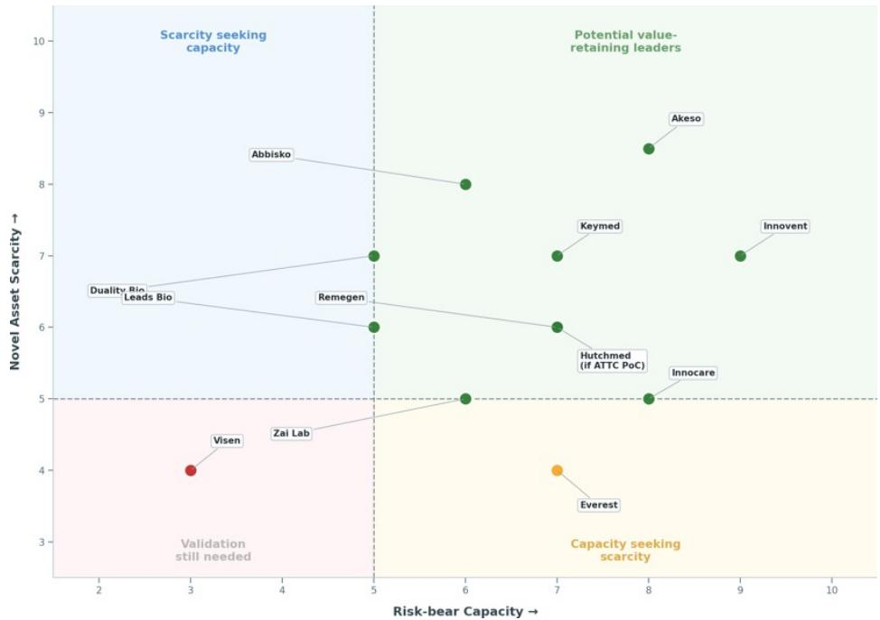

scatter

| Company | Risk-bear Capacity | Novel Asset Scarcity |
| :--- | :--- | :--- |
| Abbisko | 5.0 | 8.0 |
| Duality Bio, Leads Bio | 2.5 | 6.5 |
| Visen | 3.0 | 4.0 |
| Zai Lab | 4.0 | 4.5 |
| Remegen | 5.0 | 6.0 |
| Keymed | 7.0 | 7.0 |
| Hutchmed (if ATTC PoC) | 7.0 | 6.0 |
| Akeso | 8.0 | 8.5 |
| Innocare | 8.0 | 5.0 |
| Everest | 7.0 | 4.0 |
| Innovent | 9.0 | 7.0 |
| Potential value-retaining leaders | 8.0 | 8.5 |
| Scarcity seeking capacity | 6.0 | 5.0 |
| Capacity seeking scarcity | 7.0 | 4.0 |
Risk-bear Capacity → Scarcity → Validation still needed

Source: MS. Note: Scores are qualitative 1-10 based on cash runway, profitability path, commercial base, partner funding, clinical execution capacity, asset differentiation, competitive crowding and global strategic relevance.

Exhibit 44: Potential repeatable monetizers within MS coverage 

<table><tr><td>Category</td><td>Company</td><td>Ticker</td><td>Notable Deals</td></tr><tr><td rowspan="2">Core exemplars</td><td>Keymed</td><td>2162.HK</td><td>Ouro Medicine (acq. GILD/GLPG); Belenos Bio; Timberlyne Therapeutics; Prolium</td></tr><tr><td>Innovent</td><td>1801.HK</td><td>Takeda (IBI363, IBI364, IBI3001); Eli Lilly (sintilimab, co-development)</td></tr><tr><td rowspan="2">Licensing-led supports</td><td>Abbisko</td><td>2256.HK</td><td>Merck KGaA (pimicotinib)</td></tr><tr><td>BeOne*</td><td>ONC.O</td><td>Novartis (Ociperlimab, tislelizumab)</td></tr></table>

Source: MS. Note: \* Deals were signed during a more supportive biotech market in 2021, which facilitated favorable deal terms. For more details, see section on Higher Stakes, Harder Tests

Exhibit 45: Select near-term catalyst outlook for repeat monetizers 

<table><tr><td>Asset</td><td>Company</td><td>Catalyst</td><td>Date</td></tr><tr><td>ABSK061 (FGFR2/3)</td><td>Abbisko</td><td>Ph2 data in 1L GC</td><td>2Q26</td></tr><tr><td>BGB16673 (BTK degrader)</td><td>BeOne</td><td>Ph2 AA potential</td><td>2Q26</td></tr><tr><td>BGB43395 (CDK4 inhibitor)</td><td>BeOne</td><td>Ph3 update in 1L HR+/HER- BC</td><td>2Q26</td></tr><tr><td>BGB11417 (BCL-2 inhibitor)</td><td>BeOne</td><td>Sonro FDA decision in R/R MCL</td><td>2Q26</td></tr><tr><td>IBI3032 (oral GLP-1)</td><td>Innovent</td><td>Ph1 4-week data</td><td>2Q26</td></tr><tr><td>IBI363 (PD-1/IL-2)</td><td>Innovent</td><td>Ph1b/2 1L MSS CRC/NSCLC PoC data</td><td>2Q26</td></tr><tr><td>CM512 (TSLP/IL-13)</td><td>Keymed</td><td>Ph2 CRSwNP data</td><td>2Q26</td></tr><tr><td>CMG901 (CLDN18.2 ADC)</td><td>Keymed</td><td>Partner AstraZeneca Ph3 global MRCT CLARITY-Gastric 01 topline data in 2L+ CLDN18.2 GC</td><td>2Q26</td></tr></table>

Source: Company disclosure, MS.

# Higher Stakes, Harder Tests

The thesis carries higher stakes, but also harder tests: This report does not argue that every outward step in globalization deserves a higher multiple. It argues that the next re-rating should depend on whether stronger-looking structures and stronger deal terms convert into retained economics, realizable value, and broader market comparability. That raises the burden of proof.

1. Sample size risk: Co-co and NewCo remain early and relatively scarce. The proof-point set is still small, making it easy to overgeneralize from a handful of visible successes.   
2. Structure-risk/NPV-risk: Richer-looking structures do not automatically imply higher present value. More economics can still come with dilution, funding burden, execution drag, and longer time to realization.   
3. Risk-allocation risk: Assuming more global development risk does not automatically create value. It only works if the incremental economics retained exceed the added funding, operational, regulatory, and CMC burden.   
4. Asset-scarcity risk: Better structures cannot overcome weak differentiation. In crowded modalities, even NewCo or co-development structures may fail to improve economics if the underlying asset is not scarce.   
5. M&A-path risk: M&A economics remain the upper bound, not the base case. Most China-originated assets will still be monetized through licensing or partnership. To approach M&A-like outcomes, an asset needs later-stage de-risking, clean ownership, regulatory portability, CMC readiness, commercial significance, and scarcity strong enough for an acquirer to require control.   
6. Realization risk: Asset-level monetization does not automatically translate into company-level rerating. A good deal can still fail to change the equity story if the retained economics are too back-ended, too diluted, or too disconnected from realizable shareholder value.   
7. Timing risk: The market may capitalize structure before proof. NewCo, co-co, or stronger-looking licensing terms can rerate a stock ahead of financing, clinical, governance, or monetization evidence, raising the risk of paying for value before it is secured.   
8. Regime / cycle-confounder risk: Some of the strongest deal terms in the historical screen were signed during more supportive market windows, particularly 2021. That raises the risk of overstating company-specific bargaining power when part of the observed strength may have been aided by a hotter biotech funding and partnering backdrop. The recent trend in average upfront as a percentage of total deal value — down from 2021 and only partly recovered by 2025 despite larger aggregate deal value — suggests market regime still matters when interpreting historical strong deals.   
9. External risk: Geopolitics, US commercialization access, regulatory conversion, CMC architecture, syndicate quality, and partner execution can all interrupt the path from structure to realized value. These risks can keep China assets at licensing economics rather than M&A economics for longer, even where the underlying science remains attractive.

Exhibit 46: Scenario framing of the thesis 

<table><tr><td>Scenario</td><td>Thesis Implications</td></tr><tr><td>Bull case</td><td>More companies convert globalization into retained value in practice, not just in structure. NewCo vehicles show credible financing or exit progression, co-co precedents begin to demonstrate real economic participation, and stronger asset quality supports sustained royalty and control retention. In that case, selective rerating broadens beyond the current core exemplars.</td></tr><tr><td>Base case</td><td>The thesis remains valid but selective. A small group of repeatable monetizers continues to stand out, while most of the sector remains closer to classic licensing economics. The market increasingly differentiates on retained take-rate and realization quality, but broad sector-wide multiple convergence does not occur.</td></tr><tr><td>Bear case</td><td>Structure proves easier to announce than to monetize. NewCo exits remain scarce, coco economics do not translate cleanly into realized value, and the strongest historical deal terms look increasingly cycle-assisted rather than repeatable. In that case, the market reverts to valuing most China biotech mainly on domestic fundamentals plus discounted ex-China optionality.</td></tr></table>

Source: MS

Exhibit 47: Average upfront as a % of total deal value peaked in 2021 and remained lower thereafter   
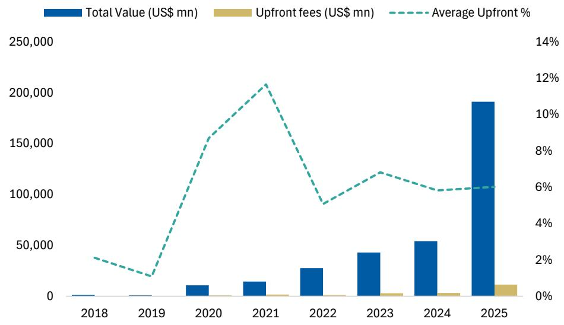

bar_line

| Year | Total Value (US$ mn) | Upfront fees (US$ mn) | Average Upfront % |
|------|----------------------|-----------------------|-------------------|
| 2018 | ~1,000               | ~0                    | ~3.5%             |
| 2019 | ~1,000               | ~0                    | ~2.0%             |
| 2020 | ~10,000              | ~0                    | ~15.0%            |
| 2021 | ~15,000              | ~0                    | ~21.0%            |
| 2022 | ~30,000              | ~0                    | ~9.0%             |
| 2023 | ~45,000              | ~5,00                 | ~7.5%             |
| 2024 | ~55,000              | ~5,00                 | ~6.5%             |
| 2025 | ~190,000             | ~15,00                | ~6.5%             |

Source: GBI, MS.

# Valuation Methodology and Risks

# Innovent Biologics Inc (1801.HK)

Base case, discounted cash flow methodology. We assume a WACC of 8.8%, and a terminal growth rate of 3%.

# Risks to Upside

■ Faster than expected pipeline progress   
■ More collaborations with large pharmaceutical companies   
■ Fast ramp-up of commercialized drugs

# Risks to Downside

■ Failures of clinical trials   
■ Intensifying competition from fast-follow molecules   
■ Rising caution from foreign drug agencies in approving drugs from China, which could prolong the approval process

# Keymed Biosciences Inc. (2162.HK)

We use discounted cash flow methodology with a 10.1% WACC and 2% terminal growth rate.

# Risks to Upside

■ Continued robust commercialization of CM310, with a favorable NRDL pricing negotiation result.   
■ Successful R&D development and commercial launch of CMG901.   
■ Successive positive PoC data readout from next-gen assets like CM512.

# Risks to Downside

■ Delay or failure in obtaining approval for key products   
■ Failure of clinical trials or lackluster clinical data for key drug candidates   
■ Competition for key products.

# Abbisko Cayman Ltd (2256.HK)

We use a 10% WACC and terminal growth of 3.5%, with explicit forecast years to 2035E.

# Risks to Upside

■ Robust commercial launch of pimicotinib and success in further label expansion opportunities   
■ Successful Ph3 data readout from irpagratinib, and potential licensing partnership for the asset   
■ Successive PoC data readout from early-stage pipeline products

# Risks to Downside

■ Failure of clinical trials or lackluster clinical data for key drug candidates   
■ Competition for key products from pharma companies

# BeOne Medicines (ONC.O)

Our PT is derived from DCF that uses a 9% discount rate and 2.0% terminal growth.

# Risks to Upside

■ European market ramp faster than anticipated   
■ BGB-16673 & Sonrotoclax progress to market earlier than expected   
■ Positive results from CELESTIAL-TNCLL trial

# Risks to Downside

■ Inadequate efficacy and/or safety data from ongoing clinical trials   
■ Price reduction on Brukinsa long-term due to IRA   
■ Jaypirca moves to first line therapy

# Disclosure Section

The information and opinions in MS were prepared or are disseminated by MS Asia Limited (which accepts the responsibility for its contents) and/or MS Asia (Singapore) Pte. (Registration number 199206298Z) and/or MS Asia (Singapore) Securities Pte Ltd (Registration number 200008434H), regulated by the Monetary Authority of Singapore (which accepts legal responsibility for its contents and should be contacted with respect to any matters arising from, or in connection with, MS), and/or MS Taiwan Limited and/or MS & Co International plc, Seoul Branch, and/or MS Australia Limited (A.B.N. 67 003 734 576, holder of Australian financial services license No. 233742, which accepts responsibility for its contents), and/or MS Wealth Management Australia Pty Ltd (A.B.N. 19 009 145 555, holder of Australian financial services license No. 240813, which accepts responsibility for its contents), and/or MS India Company Private Limited having Corporate Identification No (CIN) U22990MH1998PTC115305, regulated by the Securities and Exchange Board of India ("SEBI") and holder of licenses as a Research Analyst (SEBI Registration No. INH000001105); Stock Broker (SEBI Stock Broker Registration No. INZ000244438), Merchant Banker (SEBI Registration No. INM000011203), and depository participant with National Securities Depository Limited (SEBI Registration No. IN-DP-NSDL-567-2021) having registered office at Altimus, Level 39 & 40, Pandurang Budhkar Marg, Worli, Mumbai 400018, India; Telephone no. +91-22-61181000; Compliance Officer Details: Mr. Tejarshi Hardas, Tel. No.: +91-22-61181000 or Email: tejarshi.hardas@morganstanley.com; Grievance officer details: Mr. Tejarshi Hardas, Tel. No.: +91-22-61181000 or Email: msic-compliance@morganstanley.com which accepts the responsibility for its contents and should be contacted with respect to any matters arising from, or in connection with, MS, and their affiliates (collectively, "MS"). MS India Company Private Limited (MSICPL) may use AI tools in providing research services. All recommendations contained herein are made by the duly qualified research analysts.

For important disclosures, stock price charts and equity rating histories regarding companies that are the subject of this report, please see the MS Disclosure Website at www.morganstanley.com/eqr/disclosures/webapp/generalresearch, or contact your investment representative or MS at 1585 Broadway, (Attention: Research Management), New York, NY, 10036 USA.

For valuation methodology and risks associated with any recommendation, rating or price target referenced in this research report, please contact the Client Support Team as follows: US/Canada +1 800 303-2495; Hong Kong +852 2848-5999; Latin America +1 718 754-5444 (U.S.); London +44 (0)20-7425-8169; Singapore +65 6834-6860; Sydney +61 (0)2-9770-1505; Tokyo +81 (0)3-6836-9000. Alternatively you may contact your investment representative or MS at 1585 Broadway, (Attention: Research Management), New York, NY 10036 USA.

# Analyst Certification

The following analysts hereby certify that their views about the companies and their securities discussed in this report are accurately expressed and that they have not received and will not receive direct or indirect compensation in exchange for expressing specific recommendations or views in this report: Terence C Flynn, Ph.D.; Sean Laaman, Ph.D.; Jack Lin; Alexis Yan, CFA.

# Global Research Conflict Management Policy

MS has been published in accordance with our conflict management policy, which is available at www.morganstanley.com/institutional/research/conflictpolicies. A Portuguese version of the policy can be found at www.morganstanley.com.br

# Important Regulatory Disclosures on Subject Companies

As of April 30, 2026, MS beneficially owned 1% or more of a class of common equity securities of the following companies covered in MS: 4D Molecular Therapeutics Inc, Abbisko Cayman Ltd, Abbvie Inc., Abivax, Acadia Pharmaceuticals Inc, Alnylam Pharmaceuticals Inc, Amgen Inc., APT Medical Inc, Arcus Biosciences Inc., Arcutis Biotherapeutics, Inc., argenx SE, Arvinas Inc, Ascendis Pharma A/S, Asymchem Laboratories. Inc, Avalyn Pharma Inc, Axsome Therapeutics, Belite Bio Inc, BeOne Medicines, Bicycle Therapeutics Plc, Biogen Inc, BridgeBio Pharma Inc, Bristol Myers Squibb Co, Cabaletta Bio Inc, Centessa Pharmaceuticals, Inc, CG Oncology, Compass Pathways PLC, Crinetics Pharmaceuticals, CRISPR Therapeutics AG, Cullinan Therapeutics, Cytokinetics Inc, DaShenLin Pharmaceutical, Dian Diagnostics Group Co Ltd, Eli Lilly & Co., Exelixis Inc., Genmab A/S, Gilead Sciences Inc., Halozyme Therapeutics, Inc, Immunocore Holdings Ltd, Incyte Corp, InnoCare Pharma Ltd, Intellia Therapeutics Inc, Jiangsu Hengrui, Johnson & Johnson, Keymed Biosciences Inc., Kyverna Therapeutics, Lakefront Biotherapeutics, Legend Biotech Corp, Merck & Co., Inc., Mirum Pharmaceuticals, Moderna Inc, Neurocrine Biosciences Inc, Nurix Therapeutics Inc., Organon & Co., Pfizer Inc, Pharmaron, ProKidney Corp, PTC Therapeutics, Recursion Pharmaceuticals Inc, Regeneron Pharmaceuticals Inc., Regenxbio Inc, Rhythm Pharmaceuticals Inc, Rocket Pharmaceuticals Inc, Royalty Pharma Plc, Sarepta Therapeutics Inc, Schrodinger Inc., Silence Therapeutics Plc, Structure Therapeutics Inc, Tscan Therapeutics Inc, Ultragenyx Pharmaceutical Inc, United Therapeutics Corp, Vertex Pharmaceuticals, Viking Therapeutics Inc, Vir Biotechnology Inc, WuXi AppTec Co Ltd, WuXi Biologics Cayman Inc, Yifeng Pharmacy Chain Co Ltd, Yixintang Pharmaceutical.

Within the last 12 months, MS managed or co-managed a public offering (or 144A offering) of securities of 3SBio, Abbvie Inc., ABSCI CORP, AgomAb Therapeutics NV, Akeso, Inc., Alnylam Pharmaceuticals Inc, Alumis Inc., Amgen Inc., Avalyn Pharma Inc, Belite Bio Inc, Bicara Therapeutics, Biomarin Pharmaceutical Inc, Bristol Myers Squibb Co, Cytokinetics Inc, Denali Therapeutics Inc, Disc Medicine Inc, Duality Biotherapeutics Inc, Dyne Therapeutics Inc, Eikon Therapeutics Inc, Eli Lilly & Co., Erasca, Inc., Everest Medicines Ltd, Evommune Inc, Generate Biomedicines Inc, Genmab A/S, Gilead Sciences Inc., Halozyme Therapeutics, Inc, Hansoh Pharmaceutical Group Co Ltd, Immix Biopharma, Innovent Biologics Inc, Insilico Medicine, Ionis Pharmaceuticals Inc, Jiangsu Hengrui, Kalaris Therapeutics, Keymed Biosciences Inc, Kymera Therapeutics Inc, Kyverna Therapeutics, MapLight Therapeutics, Medtide, Merck & Co., Inc., Mirum Pharmaceuticals, Monopar Therapeutics, Nanjing Leads Biolabs Co Ltd, Pharvaris N.V., Rhythm Pharmaceuticals Inc, Royalty Pharma Plc, Sana Biotechnology, Inc, Shenzhen Edge Medical, Simcere Pharmaceutical Group, Structure Therapeutics Inc, Trevi Therapeutics Inc, Vertex Pharmaceuticals, WuXi AppTec Co Ltd, WuXi Biologics Cayman Inc, WuXi XDC Cayman Inc..

Within the last 12 months, MS has received compensation for investment banking services from 3SBio, Abbvie Inc., AgomAb Therapeutics NV, Akeso, Inc., Alnylam Pharmaceuticals Inc, Alumis Inc., Amgen Inc., Avalyn Pharma Inc, Belite Bio Inc, BeOne Medicines, Bicara Therapeutics, Biomarin Pharmaceutical Inc, Bristol Myers Squibb Co, Cytokinetics Inc, Denali Therapeutics Inc, Disc Medicine Inc, Dyne Therapeutics Inc, Eikon Therapeutics Inc, Eli Lilly & Co., Erasca, Inc., Everest Medicines Ltd, Evommune Inc, Generate Biomedicines Inc, Genmab A/S, Gilead Sciences Inc., Halozyme Therapeutics, Inc, Hansoh Pharmaceutical Group Co Ltd, Immix Biopharma, Innovent Biologics Inc, Insilico Medicine, Ionis Pharmaceuticals Inc, Jiangsu Hengrui, Kalaris Therapeutics, Keymed Biosciences Inc., Kymera Therapeutics Inc, Kyverna Therapeutics, Legend Biotech Corp, MapLight Therapeutics, Medtide, Merck & Co., Inc., Mirum Pharmaceuticals, Monopar Therapeutics, Organon & Co., Pfizer Inc, Pharvaris N.V., Rhythm Pharmaceuticals Inc, Royalty Pharma Plc, Sana Biotechnology, Inc, Shenzhen Edge Medical, Simcere Pharmaceutical Group, Structure Therapeutics Inc, Trevi Therapeutics Inc, WuXi AppTec Co Ltd, WuXi Biologics Cayman Inc, WuXi XDC Cayman Inc..

In the next 3 months, MS expects to receive or intends to seek compensation for investment banking services from 3SBio, 4D Molecular Therapeutics Inc, Aardvark Therapeutics Inc., Abbisko Cayman Ltd, Abbvie Inc., Abivax, ABSCI CORP, Acadia Pharmaceuticals Inc, Adagene Inc., Adicon Holdings Ltd, AgomAb Therapeutics NV, Aier Eye Hospital Group, Akeso, Inc., Alector Inc, Alibaba Health Information Technology, Alnylam Pharmaceuticals Inc, Alumis Inc., Amgen Inc., Angelalign Technology Inc, Arcus Biosciences Inc., Arcutis Biotherapeutics, Inc., argenx SE, Arrowhead Pharmaceuticals Inc, Arvinas Inc, Ascendis Pharma A/S, Atea Pharmaceuticals Inc, Avalyn Pharma Inc, Axsome Therapeutics, Beauty Farm Medical and Health Industry, Belite Bio Inc, BeOne Medicines, Bicara Therapeutics, BioAge Labs Inc, Biogen Inc, Biohaven Ltd, Biomarin Pharmaceutical Inc, BioNTech SE, BridgeBio Oncology Therapeutics, BridgeBio Pharma Inc, Bristol Myers Squibb Co, Cabaletta Bio Inc, Centessa Pharmaceuticals, Inc, CG Oncology, China Medical System, Compass Pathways PLC, Contineum Therapeutics, Crinetics Pharmaceuticals, CRISPR Therapeutics AG, CSPC Pharmaceutical Group, Cullinan Therapeutics, Cytokinetics Inc, Denali Therapeutics Inc, Disc Medicine Inc, Duality Biotherapeutics Inc, Dyne Therapeutics Inc, Eikon

Therapeutics Inc, Eli Lilly & Co., Erasca, Inc., Everest Medicines Ltd, Evommune Inc, Exelixis Inc., Fosun Pharmaceutical, Fractyl Health Inc, Fu Shou Yuan International Group Ltd, Generate Biomedicines Inc, Genmab A/S, Genscript Biotech Corporation, Gilead Sciences Inc., Halozyme Therapeutics, Inc, Hansoh Pharmaceutical Group Co Ltd, HUTCHMED (China) Ltd, Hygeia Healthcare Holdings Co., Ltd., Immix Biopharma, Immunocore Holdings Ltd, Incyte Corp, InnoCare Pharma Ltd, Innovent Biologics Inc, Insilico Medicine, Insmed Inc, Ionis Pharmaceuticals Inc, Jiangsu Hengrui, Jinxin Fertility Group Ltd, Johnson & Johnson, Kalaris Therapeutics, Keymed Biosciences Inc., Kymera Therapeutics Inc, Kyverna Therapeutics, Lakefront Biotherapeutics, Legend Biotech Corp, MapLight Therapeutics, Medtide, Merck & Co., Inc., MicroPort Scientific Corp., Mindray Bio-Medical, Mirum Pharmaceuticals, Moderna Inc, Monopar Therapeutics, Nanjing Leads Biolabs Co Ltd, Neurocrine Biosciences Inc, Nurix Therapeutics Inc., Organon & Co., Peijia Medical Ltd, Pfizer Inc, Pharvaris N.V., Ping An Healthcare and Technology, Prime Medicine Inc, ProKidney Corp, PTC Therapeutics, Recursion Pharmaceuticals Inc, Regeneron Pharmaceuticals Inc., Regenxbio Inc, Rhythm Pharmaceuticals Inc, Rocket Pharmaceuticals Inc, Royalty Pharma Plc, Sana Biotechnology, Inc, Sarepta Therapeutics Inc, Schrodinger Inc., Shenzhen Edge Medical, Silence Therapeutics Plc, Simcere Pharmaceutical Group, Sino Biopharmaceutical, Sinopharm Group, Structure Therapeutics Inc, Tenaya Therapeutics Inc, Trevi Therapeutics Inc, Tscan Therapeutics Inc, Ultragenyx Pharmaceutical Inc, Vertex Pharmaceuticals, Viking Therapeutics Inc, Vir Biotechnology Inc, VISEN Pharmaceuticals, WuXi AppTec Co Ltd, WuXi Biologics Cayman Inc, WuXi XDC Cayman Inc., Yifeng Pharmacy Chain Co Ltd, Yunnan Baiyao Group, Zenas Biopharma Inc, Zentalis Pharmaceuticals Inc, Zhejiang Huahai Pharmaceutical Co. Ltd., Zylox-Tonbridge Medical Technology Co..

Within the last 12 months, MS has received compensation for products and services other than investment banking services from 3SBio, Abbvie Inc., Adicon Holdings Ltd, Amgen Inc., Angelalign Technology Inc, Biogen Inc, Bristol Myers Squibb Co, Eli Lilly & Co., Genmab A/S, Gilead Sciences Inc., Halozyme Therapeutics, Inc, Hygeia Healthcare Holdings Co., Ltd., Johnson & Johnson, Merck & Co., Inc., Moderna Inc, Organon & Co., Pfizer Inc, Royalty Pharma Plc, Simcere Pharmaceutical Group, Sino Biopharmaceutical, The United Laboratories, WuXi AppTec Co Ltd, WuXi Biologics Cayman Inc, WuXi XDC Cayman Inc..

Within the last 12 months, MS has provided or is providing investment banking services to, or has an investment banking client relationship with, the following company: 3SBio, 4D Molecular Therapeutics Inc, Aardvark Therapeutics Inc., Abbisko Cayman Ltd, Abbvie Inc., Abivax, ABSCI CORP, Acadia Pharmaceuticals Inc, Adagene Inc., Adicon Holdings Ltd, AgomAb Therapeutics NV, Aier Eye Hospital Group, Akeso, Inc., Alector Inc, Alibaba Health Information Technology, Alnylam Pharmaceuticals Inc, Alumis Inc., Amgen Inc., Angelalign Technology Inc, Arcus Biosciences Inc., Arcutis Biotherapeutics, Inc., argenx SE, Arrowhead Pharmaceuticals Inc, Arvinas Inc, Ascendis Pharma A/S, Atea Pharmaceuticals Inc, Avalyn Pharma Inc, Axsome Therapeutics, Beauty Farm Medical and Health Industry, Belite Bio Inc, BeOne Medicines, Bicara Therapeutics, BioAge Labs Inc, Biogen Inc, Biohaven Ltd, Biomarin Pharmaceutical Inc, BioNTech SE, BridgeBio Oncology Therapeutics, BridgeBio Pharma Inc, Bristol Myers Squibb Co, Cabaletta Bio Inc, Centessa Pharmaceuticals, Inc, CG Oncology, China Medical System, Compass Pathways PLC, Contineum Therapeutics, Crinetics Pharmaceuticals, CRISPR Therapeutics AG, CSPC Pharmaceutical Group, Cullinan Therapeutics, Cytokinetics Inc, Denali Therapeutics Inc, Disc Medicine Inc, Duality Biotherapeutics Inc, Dyne Therapeutics Inc, Eikon Therapeutics Inc, Eli Lilly & Co., Erasca, Inc., Everest Medicines Ltd, Evommune Inc, Exelixis Inc., Fosun Pharmaceutical, Fractyl Health Inc, Fu Shou Yuan International Group Ltd, Generate Biomedicines Inc, Genmab A/S, Genscript Biotech Corporation, Gilead Sciences Inc., Halozyme Therapeutics, Inc, Hansoh Pharmaceutical Group Co Ltd, HUTCHMED (China) Ltd, Hygeia Healthcare Holdings Co., Ltd., Immix Biopharma, Immunocore Holdings Ltd, Incyte Corp, InnoCare Pharma Ltd, Innovent Biologics Inc, Insilico Medicine, Insmed Inc, Ionis Pharmaceuticals Inc, Jiangsu Hengrui, Jinxin Fertility Group Ltd, Johnson & Johnson, Kalaris Therapeutics, Keymed Biosciences Inc., Kymera Therapeutics Inc, Kyverna Therapeutics, Lakefront Biotherapeutics, Legend Biotech Corp, MapLight Therapeutics, Medtide, Merck & Co., Inc., MicroPort Scientific Corp., Mindray Bio-Medical, Mirum Pharmaceuticals, Moderna Inc, Monopar Therapeutics, Nanjing Leads Biolabs Co Ltd, Neurocrine Biosciences Inc, Nurix Therapeutics Inc., Organon & Co., Peijia Medical Ltd, Pfizer Inc, Pharvaris N.V., Ping An Healthcare and Technology, Prime Medicine Inc, ProKidney Corp, PTC Therapeutics, Recursion Pharmaceuticals Inc, Regeneron Pharmaceuticals Inc., Regenxbio Inc, Rhythm Pharmaceuticals Inc, Rocket Pharmaceuticals Inc, Royalty Pharma Plc, Sana Biotechnology, Inc, Sarepta Therapeutics Inc, Schrodinger Inc., Shenzhen Edge Medical, Silence Therapeutics Plc, Simcere Pharmaceutical Group, Sino Biopharmaceutical, Sinopharm Group, Structure Therapeutics Inc, Tenaya Therapeutics Inc, Trevi Therapeutics Inc, Tscan Therapeutics Inc, Ultragenyx Pharmaceutical Inc, Vertex Pharmaceuticals, Viking Therapeutics Inc, Vir Biotechnology Inc, VISEN Pharmaceuticals, WuXi AppTec Co Ltd, WuXi Biologics Cayman Inc, WuXi XDC Cayman Inc., Yifeng Pharmacy Chain Co Ltd, Yunnan Baiyao Group, Zenas Biopharma Inc, Zentalis Pharmaceuticals Inc, Zhejiang Huahai Pharmaceutical Co. Ltd., Zylox-Tonbridge Medical Technology Co.. Within the last 12 months, MS has either provided or is providing non-investment banking, securities-related services to and/or in the past has entered into an agreement to provide services or has a client relationship with the following company: 3SBio, Abbisko Cayman Ltd, Abbvie Inc., Adicon Holdings Ltd, Akeso, Inc., Alnylam Pharmaceuticals Inc, Amgen Inc., Angelalign Technology Inc, Biogen Inc, BioNTech SE, Bristol Myers Squibb Co, Duality Biotherapeutics Inc, Eli Lilly & Co., Genmab A/S, Gilead Sciences Inc., Halozyme Therapeutics, Inc, HUTCHMED (China) Ltd, Hygeia Healthcare Holdings Co., Ltd., Innovent Biologics Inc, Insilico Medicine, Jinxin Fertility Group Ltd, Johnson & Johnson, Keymed Biosciences Inc., Medtide, Merck & Co., Inc., Moderna Inc, Nanjing Leads Biolabs Co Ltd, Organon & Co., Peijia Medical Ltd, Pfizer Inc, RemeGen Co., Ltd., Royalty Pharma Plc, Simcere Pharmaceutical Group, Sino Biopharmaceuticals The United Laboratories, Vertex Pharmaceuticals,VISEN Pharmaceuticals,WuXi AppTec Co Ltd,WuXi Biologics Cayman Inc,WuXi XDC CaymanInc,Zylox-Tonbridge Medical Technology Co..

An employee, director or consultant of MS is a director of Merck & Co., Inc.. This person is not a research analyst or a member of a research analyst's household.

MS & Co. LLC makes a market in the securities of 4D Molecular Therapeutics Inc, ABSCI CORP, Acadia Pharmaceuticals Inc, Alector Inc, Arcus Biosciences Inc., Arcutis Biotherapeutics, Inc., Arrowhead Pharmaceuticals Inc, Arvinas Inc, Avalyn Pharma Inc, Axsome Therapeutics, Belite Bio Inc, Bicara Therapeutics, Bicycle Therapeutics Plc, BioAge Labs Inc, Biohaven Ltd, BridgeBio Oncology Therapeutics, Celldex Therapeutics Inc, Centessa Pharmaceuticals, Inc, CG Oncology, Compass Pathways PLC, Crinetics Pharmaceuticals, Cullinan Therapeutics, Denali Therapeutics Inc, Disc Medicine Inc, Dyne Therapeutics Inc, Generate Biomedicines Inc, Immunocore Holdings Ltd, Intellia Therapeutics Inc, Kalaris Therapeutics, Kymera Therapeutics Inc, Kyverna Therapeutics, MapLight Therapeutics, Mirum Pharmaceuticals, Nurix Therapeutics Inc., Organon & Co., Pharvaris N.V., PTC Therapeutics, Regeneron Pharmaceuticals Inc., Regenxbio Inc, Rhythm Pharmaceuticals Inc, Rocket Pharmaceuticals Inc, Sana Biotechnology, Inc, Schrodinger Inc., Silence Therapeutics Plc, Trevi Therapeutics Inc, Tscan Therapeutics Inc, Ultragenyx Pharmaceutical Inc, Vir Biotechnology Inc, Zai Lab Ltd, Zenas Biopharma Inc, Zentalis Pharmaceuticals Inc.

The equity research analysts or strategists principally responsible for the preparation of MS have received compensation based upon various factors, including quality of research, investor client feedback, stock picking, competitive factors, firm revenues and overall investment banking revenues. Equity Research analysts' or strategists' compensation is not linked to investment banking or capital markets transactions performed by MS or the profitability or revenues of particular trading desks.

MS and its affiliates do business that relates to companies/instruments covered in MS, including market making, providing liquidity, fund management, commercial banking, extension of credit, investment services and investment banking. MS sells to and buys from customers the securities/instruments of companies covered in MS on a principal basis. MS may have a position in the debt of the Company or instruments discussed in this report. MS trades or may trade as principal in the debt securities (or in related derivatives) that are the subject of the debt research report.

Certain disclosures listed above are also for compliance with applicable regulations in non-US jurisdictions.

# STOCK RATINGS

MS uses a relative rating system using terms such as Overweight, Equal-weight, Not-Rated or Underweight (see definitions below). MS does not assign ratings of Buy, Hold or Sell to the stocks we cover. Overweight, Equal-weight, Not-Rated and Underweight are not the equivalent of buy, hold and sell. Investors should carefully read the definitions of all ratings used in MS. In addition, since MS contains more complete information concerning the analyst's views, investors should carefully read MS, in its entirety, and not infer the contents from the rating alone. In any case, ratings (or research) should not be used or relied upon as investment advice. An investor's decision to buy or sell a stock should depend on individual circumstances (such as the investor's existing holdings) and other considerations.

# Global Stock Ratings Distribution

(as of April 30, 2026)

The Stock Ratings described below apply to MS's Fundamental Equity Research and do not apply to Debt Research produced by the Firm.

For disclosure purposes only (in accordance with FINRA requirements), we include the category headings of Buy, Hold, and Sell alongside our ratings of Overweight, Equal-weight, Not-Rated and Underweight. MS does not assign ratings of Buy, Hold or Sell to the stocks we cover. Overweight, Equal-weight, Not-Rated and Underweight are not the equivalent of buy, hold, and sell but represent recommended relative weightings (see definitions below). To satisfy regulatory requirements, we correspond Overweight, our most positive stock rating, with a buy recommendation; we correspond Equal-weight and Not-Rated to hold and Underweight to sell recommendations, respectively.

<table><tr><td></td><td colspan="2">Coverage Universe</td><td colspan="3">Investment Banking Clients (IBC)</td><td colspan="2">Other Material Investment ServicesClients (MISC)</td></tr><tr><td>Stock RatingCategory</td><td>Count</td><td>% of Total</td><td>Count</td><td>% of Total IBC</td><td>% of RatingCategory</td><td>Count</td><td>% of Total OtherMISC</td></tr><tr><td>Overweight/Buy</td><td>1546</td><td>42%</td><td>467</td><td>51%</td><td>30%</td><td>709</td><td>44%</td></tr><tr><td>Equal-weight/Hold</td><td>1568</td><td>43%</td><td>358</td><td>39%</td><td>23%</td><td>715</td><td>44%</td></tr><tr><td>Not-Rated/Hold</td><td>4</td><td>0%</td><td>0</td><td>0%</td><td>0%</td><td>1</td><td>0%</td></tr><tr><td>Underweight/Sell</td><td>555</td><td>15%</td><td>84</td><td>9%</td><td>15%</td><td>202</td><td>12%</td></tr><tr><td>Total</td><td>3,673</td><td></td><td>909</td><td></td><td></td><td>1627</td><td></td></tr></table>

Data include common stock and ADRs currently assigned ratings. Investment Banking Clients are companies from whom MS received investment banking compensation in the last 12 months. Due to rounding off of decimals, the percentages provided in the "% of total" column may not add up to exactly 100 percent.

# Analyst Stock Ratings

Overweight (O). The stock's total return is expected to exceed the average total return of the analyst's industry (or industry team's) coverage universe, on a risk-adjusted basis, over the next 12-18 months.

Equal-weight (E). The stock's total return is expected to be in line with the average total return of the analyst's industry (or industry team's) coverage universe, on a risk-adjusted basis, over the next 12-18 months.

Not-Rated (NR). Currently the analyst does not have adequate conviction about the stock's total return relative to the average total return of the analyst's industry (or industry team's) coverage universe, on a risk-adjusted basis, over the next 12-18 months.

Underweight (U). The stock's total return is expected to be below the average total return of the analyst's industry (or industry team's) coverage universe, on a risk-adjusted basis, over the next 12-18 months.

Unless otherwise specified, the time frame for price targets included in MS is 12 to 18 months.

# Analyst Industry Views

Attractive (A): The analyst expects the performance of his or her industry coverage universe over the next 12-18 months to be attractive vs. the relevant broad market benchmark, as indicated below.

In-Line (I): The analyst expects the performance of his or her industry coverage universe over the next 12-18 months to be in line with the relevant broad market benchmark, as indicated below. Cautious (C): The analyst views the performance of his or her industry coverage universe over the next 12-18 months with caution vs. the relevant broad market benchmark, as indicated below. Benchmarks for each region are as follows: North America - S&P 500; Latin America - relevant MSCI country index or MSCI Latin America Index; Europe - MSCI Europe; Japan - TOPIX; Asia - relevant MSCI country index or MSCI sub-regional index or MSCI AC Asia Pacific ex Japan Index.

# Stock Price, Price Target and Rating History (See Rating Definitions)

Abbisko Cayman Ltd (2256.HK) - As of 05/28/26 GMT in HKD Industry : China Healthcare   
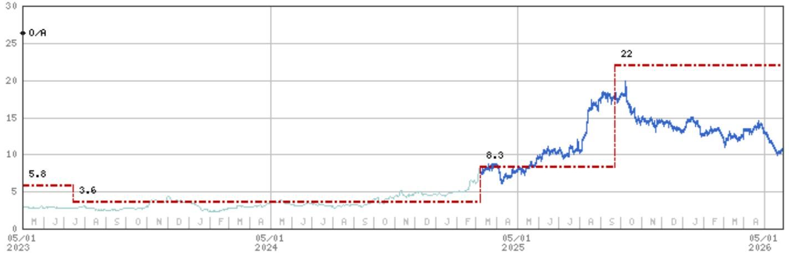

line

| Date       | Value |
| ---------- | ----- |
| 05/01 2023 | 0/A   |
| 05/01 2024 | 5.8   |
| 05/01 2024 | 3.6   |
| 05/01 2025 | 8.3   |
| 05/01 2025 | 22    |

Stock Rating History: 11/17/21 : 0/A   
Price Target History: 11/17/21 : 13.63; 3/17/22 : 5.6; 7/12/22 : 5.4; 11/23/22 : 5.6; 3/17/23 : 5.8; 7/14/23 : 3.6; 3/7/25 : 8.3; 9/22/25 : 22   
Source: MS Date Format : MM/DD/YY Price Target = No Price Target Assigned (NA)   
Stock Price (Not Covered by Current Analyst) — Stock Price (Covered by Current Analyst)   
Stock and Industry Ratings (abbreviations below) appear as ♦ Stock Rating/Industry View   
Stock Ratings: Overweight (O) Equal-weight (E) Underweight (U) Not-Rated (NR) No Rating Available (NA)   
Industry View: Attractive (A) In-line (I) Cautious (C) No Rating (NR)   
Effective January 13, 2014, the stocks covered by MS Asia Pacific will be rated relative to the analyst's industry (or industry team's) coverage.   
Effective January 13, 2014, the industry view benchmarks for MS Asia Pacific are as follows: relevant MSCI country index or MSCI sub-regional index or MSCI AC Asia Pacific ex Japan Index.

BeOne Medicines (ONC.0) - As of 05/28/26 GMT in USD
Industry : Biotechnology   
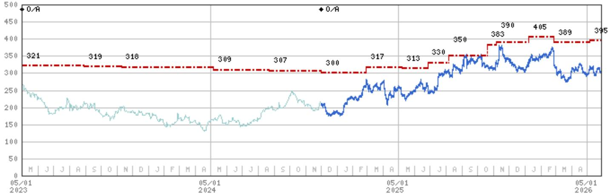

line

| Date       | Blue Line | Red Dashed Line |
|------------|-----------|-----------------|
| 05/01 2023 | 250       | 321             |
| 05/01 2024 | 150       | 309             |
| 05/01 2025 | 350       | 313             |
| 05/01 2026 | 395       | 395             |

Stock Rating History: 5/1/21 : 0/I; 11/5/22 : 0/A; 12/2/24 : 0/A   
Price Target History: 1/19/21 : 375; 5/10/21 : 357; 6/3/21 : 409; 8/15/21 : 407; 1/18/22 : 360; 2/28/22 : 330; 4/12/22 : 338;   
5/6/22 : 300; 7/14/22 : 293; 8/4/22 : 290; 10/12/22 : 295; 1/23/23 : 325; 2/27/23 : 321; 8/29/23 : 319; 11/10/23 : 318; 5/7/24 : 309;   
8/23/24 : 307; 12/2/24 : 300; 2/27/25 : 317; 5/7/25 : 313; 6/26/25 : 330; 8/6/25 : 350; 10/19/25 : 383; 11/6/25 : 390; 1/6/26 : 405;   
2/26/26 : 389; 5/6/26 : 395   
Source: MS Date Format : MM/DD/YY Price Target = No Price Target Assigned (NA)   
Stock Price (Not Covered by Current Analyst) — Stock Price (Covered by Current Analyst)   
Stock and Industry Ratings (abbreviations below) appear as ♦ Stock Rating/Industry View   
Stock Ratings: Overweight (O) Equal-weight (E) Underweight (U) Not-Rated (NR) No Rating Available (NA)   
Industry View: Attractive (A) In-line (I) Cautious (C) No Rating (NR)   
Effective January 13, 2014, the stocks covered by MS Asia Pacific will be rated relative to the analyst's industry (or industry team's) coverage.   
Effective January 13, 2014, the industry view benchmarks for MS Asia Pacific are as follows: relevant MSCI country index or MSCI sub-regional index or MSCI AC Asia Pacific ex Japan Index.

Innovent Biologics Inc (1801.HK) - As of 05/28/26 GMT in HKD
Industry : China Healthcare   
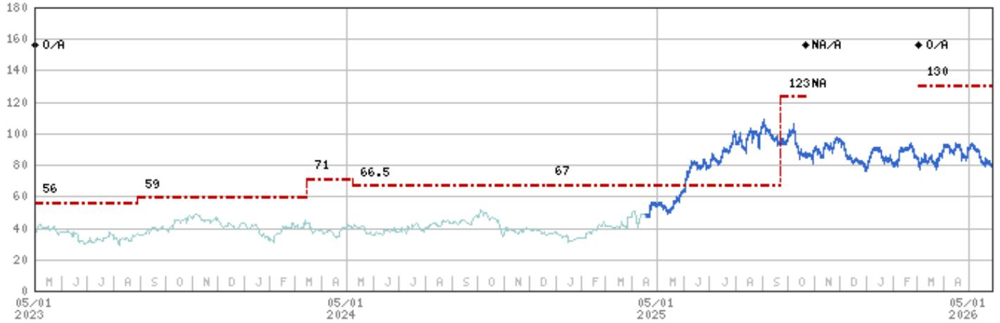

line

| Date       | Value |
| ---------- | ----- |
| 05/01 2023 | 56    |
| 05/01 2024 | 59    |
| 05/01 2025 | 71    |
| 05/01 2026 | 66.5  |
| 05/01 2027 | 67    |
| 05/01 2028 | 123   |
| 05/01 2029 | 130   |

Stock Rating History: 5/1/21 : 0/A; 10/21/25 : NA/A; 3/3/26 : 0/A   
Price Target History: 1/12/21 : 104; 9/16/21 : 95; 2/14/22 : 65; 3/17/22 : 42.25; 6/8/22 : 42.5; 2/23/23 : 56; 8/29/23 : 59;   
3/15/24 : 71; 5/8/24 : 66.5; 12/23/24 : 67; 9/22/25 : 123; 10/21/25 : NA; 3/3/26 : 130   
Source: MS Date Format : MM/DD/YY Price Target No Price Target Assigned (NA)   
Stock Price (Not Covered by Current Analyst) — Stock Price (Covered by Current Analyst)   
Stock and Industry Ratings (abbreviations below) appear as ♦ Stock Rating/Industry View   
Stock Ratings: Overweight (O) Equal-weight (E) Underweight (U) Not-Rated (NR) No Rating Available (NA)   
Industry View: Attractive (A) In-line (I) Cautious (C) No Rating (NR)   
Effective January 13, 2014, the stocks covered by MS Asia Pacific will be rated relative to the analyst's industry (or industry team's) coverage.   
Effective January 13, 2014, the industry view benchmarks for MS Asia Pacific are as follows: relevant MSCI country index or MSCI sub-regional index or MSCI AC Asia Pacific ex Japan Index.

Keymed Biosciences Inc. (2162.HK) - As of 05/28/26 GMT in HKD Industry : China Healthcare   
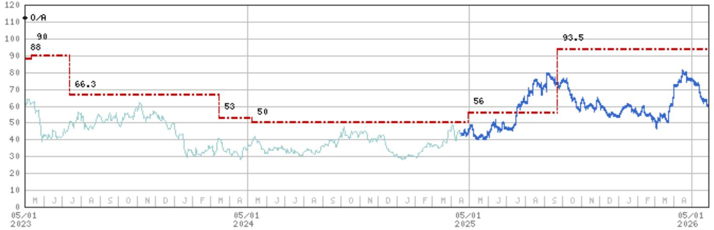

line

| Date       | Value |
| ---------- | ----- |
| 05/01 2023 | 88    |
| 05/01 2024 | 66.3  |
| 05/01 2025 | 53    |
| 05/01 2026 | 93.5  |

Stock Rating History: 8/10/21 : 0/A   
Price Target History: 8/10/21 : 83.18; 9/27/21 : 74.84; 3/17/22 : 39.25; 5/11/22 : 38.5; 2/23/23 : 88; 5/12/23 : 90; 7/14/23 : 66.3; 3/15/24 : 53; 5/6/24 : 50; 4/29/25 : 56; 9/22/25 : 93.5   
Source: MS Date Format : MM/DD/YY Price Target No Price Target Assigned (NA)   
Stock Price (Not Covered by Current Analyst) — Stock Price (Covered by Current Analyst)   
Stock and Industry Ratings (abbreviations below) appear as ♦ Stock Rating/Industry View   
Stock Ratings: Overweight (O) Equal-weight (E) Underweight (U) Not-Rated (NR) No Rating Available (NA)   
Industry View: Attractive (A) In-line (I) Cautious (C) No Rating (NR)   
Effective January 13, 2014, the stocks covered by MS Asia Pacific will be rated relative to the analyst's industry (or industry team's) coverage.   
Effective January 13, 2014, the industry view benchmarks for MS Asia Pacific are as follows: relevant MSCI country index or MSCI sub-regional index or MSCI AC Asia Pacific ex Japan Index.

# Important Disclosures for MS Smith Barney LLC Customers

Important disclosures regarding any material conflict of interest that can reasonably be expected to have influenced MS Smith Barney LLC's choice of a third-party research provider or the subject company of a third-party research report, are available on the MS Wealth Management disclosure website at www.morganstanley.com/online/researchdisclosures. For MS specific disclosures, you may refer to https://www.morganstanley.com/eqr/disclosures/webapp/generalresearch.

Each MS report is reviewed and approved on behalf of MS Smith Barney LLC. This review and approval is conducted by the same person who reviews the research report on behalf of MS. This could create a conflict of interest.

# Other Important Disclosures

A member of Research who had or could have had access to the research prior to completion owns securities (or related derivatives) in the Eli Lilly & Co.. This person is not a research analyst or a member of research analyst's household.

MS policy is to update research reports as and when the Research Analyst and Research Management deem appropriate, based on developments with the issuer, the sector, or the market that may have a material impact on the research views or opinions stated therein. In addition, certain Research publications are intended to be updated on a regular periodic basis (weekly/monthly/quarterly/annual) and will ordinarily be updated with that frequency, unless the Research Analyst and Research Management determine that a different publication schedule is appropriate based on current conditions.

MS is not acting as a municipal advisor and the opinions or views contained herein are not intended to be, and do not constitute, advice within the meaning of Section 975 of the Dodd-Frank Wall Street Reform and Consumer Protection Act.

MS produces an equity research product called a "Tactical Idea." Views contained in a "Tactical Idea" on a particular stock may be contrary to the recommendations or views expressed in research on the same stock. This may be the result of differing time horizons, methodologies, market events, or other factors. For all research available on a particular stock, please contact your sales representative or go to Matrix at http://www.morganstanley.com/matrix.

MS is provided to our clients through our proprietary research portal on Matrix and also distributed electronically by MS to clients. Certain, but not all, MS products are also made available to clients through third-party vendors or redistributed to clients through alternate electronic means as a convenience. For access to all available MS, please contact your sales representative or go to Matrix at http://www.morganstanley.com/matrix.

Any access and/or use of MS is subject to MS's Terms of Use (http://www.morganstanley.com/terms.html). By accessing and/or using MS, you are indicating that you have read and agree to be bound by our Terms of Use (http://www.morganstanley.com/terms.html). In addition you consent to MS processing your personal data and using cookies in accordance with our Privacy Policy and our Global Cookies Policy (http://www.morganstanley.com/privacy\_pledge.html), including for the purposes of setting your preferences and to collect readership data so that we can deliver better and more personalized service and products to you. To find out more information about how MS processes personal data, how we use cookies and how to reject cookies see our Privacy Policy and our Global Cookies Policy (http://www.morganstanley.com/privacy\_pledge.html). Please use the provided link to review the Terms and Conditions and Most Important Terms and Conditions for MS India Company Private Limited (https://www.morganstanley.com/assets/pdfs/about-us-global-offices/india/Terms\_and\_conditions.pdf) and the following link to review the audit report (https://ny.matrix.ms.com/eqr/research/webapp/researchdocs/MSICPL\_Morgan\_Stanley\_Research\_Audit\_Report.pdf).

If you do not agree to our Terms of Use and/or if you do not wish to provide your consent to MS processing your personal data or using cookies please do not access our research. MS does not provide individually tailored investment advice. MS has been prepared without regard to the circumstances and objectives of those who receive it. MS recommends that investors independently evaluate particular investments and strategies, and encourages investors to seek the advice of a financial adviser. The appropriateness of an investment or strategy will depend on an investor's circumstances and objectives. The securities, instruments, or strategies discussed in MS may not be suitable for all investors, and certain investors may not be eligible to purchase or participate in some or all of them. MS is not an offer to buy or sell or the solicitation of an offer to buy or sell any security/instrument or to participate in any particular trading strategy. The value of and income from your investments may vary because of changes in interest rates, foreign exchange rates, default rates, prepayment rates, securities/instruments prices, market indexes, operational or financial conditions of companies or other factors. There may be time limitations on the exercise of options or other rights in securities/instruments transactions. Past performance is not necessarily a guide to future performance. Estimates of future performance are based on assumptions that may not be realized. If provided, and unless otherwise stated, the closing price on the cover page is that of the primary exchange for the subject company's securities/instruments.

The fixed income research analysts, strategists or economists principally responsible for the preparation of MS have received compensation based upon various factors, including quality, accuracy and value of research, firm profitability or revenues (which include fixed income trading and capital markets profitability or revenues), client feedback and competitive factors. Fixed Income Research analysts', strategists' or economists' compensation is not linked to investment banking or capital markets transactions performed by MS or the profitability or revenues of particular trading desks.

The "Important Regulatory Disclosures on Subject Companies" section in MS lists all companies mentioned where MS owns 1% or more of a class of common equity securities of the companies. For all other companies mentioned in MS, MS may have an investment of less than 1% in securities/instruments or derivatives of securities/instruments of companies and may trade them in ways different from those discussed in MS. Employees of MS not involved in the preparation of MS may have investments in securities/instruments or derivatives of securities/instruments of companies mentioned and may trade them in ways different from those discussed in MS. Derivatives may be issued by MS or associated persons.

With the exception of information regarding MS, MS is based on public information. MS makes every effort to use reliable, comprehensive information, but we make no representation that it is accurate or complete. We have no obligation to tell you when opinions or information in MS change apart from when we intend to discontinue equity research coverage of a subject company. Facts and views presented in MS have not been reviewed by, and may not reflect information known to, professionals in other MS business areas, including investment banking personnel.

MS personnel may participate in company events such as site visits and are generally prohibited from accepting payment by the company of associated expenses unless pre-approved by authorized members of Research management.

MS may make investment decisions that are inconsistent with the recommendations or views in this report.

To our readers based in Taiwan or trading in Taiwan securities/instruments: Information on securities/instruments that trade in Taiwan is distributed by MS Taiwan Limited ("MSTL"). Such information is for your reference only. The reader should independently evaluate the investment risks and is solely responsible for their investment decisions. MS may not be distributed to the public media or quoted or used by the public media without the express written consent of MS. Any non-customer reader within the scope of Article 7-1 of the Taiwan Stock Exchange Recommendation Regulations accessing and/or receiving MS is not permitted to provide MS to any third party (including but not limited to related parties, affiliated companies and any other third parties) or engage in any activities regarding MS which may create or give the appearance of creating a conflict of interest. Information on securities/instruments that do not trade in Taiwan is for informational purposes only and is not to be construed as a recommendation or a solicitation to trade in such securities/instruments. MSTL may not execute transactions for clients in these securities/instruments.

Certain information in MS was sourced by employees of the Shanghai Representative Office of MS Asia Limited for the use of MS Asia Limited. MS is not incorporated under PRC law and the research in relation to this report is conducted outside the PRC. MS does not constitute an offer to sell or the solicitation of an offer to buy any securities in the PRC. PRC investors shall have the relevant qualifications to invest in such securities and shall be responsible for obtaining all relevant approvals, licenses, verifications and/or registrations from the relevant governmental authorities themselves. Neither this report nor any part of it is intended as, or shall constitute, provision of any consultancy or advisory service of securities investment as defined under PRC law. Such information is provided for your reference only.

MS is disseminated in Brazil by MS C.T.V.M. S.A. located at Av. Brigadeiro Faria Lima, 3600, 6th floor, São Paulo - SP, Brazil; and is regulated by the Comissão de Valores Mobiliários; in Mexico by MS México, Casa de Bolsa, S.A. de C.V which is regulated by Comision Nacional Bancaria y de Valores. Paseo de los Tamarindos 90, Torre 1, Col. Bosques de las Lomas Floor 29, 05120 Mexico City; in Japan by MS MUFG Securities Co., Ltd. and, for Commodities related research reports only, MS Capital Group Japan Co., Ltd; in Hong Kong by MS Asia Limited (which accepts responsibility for its contents) and by MS Bank Asia Limited; in Singapore by MS Asia (Singapore) Pte. (Registration number 199206298Z) and/or MS Asia (Singapore) Securities Pte Ltd (Registration number 200008434H), regulated by the Monetary Authority of Singapore (which accepts legal responsibility for its contents and should be contacted with respect to any matters arising from, or in connection with, MS) and by MS Bank Asia Limited, Singapore Branch (Registration number T14FC0118); in Australia to "wholesale clients" within the meaning of the Australian Corporations Act by MS Australia Limited A.B.N. 67 003 734 576, holder of Australian financial services license No. 233742, which accepts responsibility for its contents; in Australia to "wholesale clients" and "retail clients" within the meaning of the Australian Corporations Act by MS Wealth Management Australia Pty Ltd (A.B.N. 19 009 145 555, holder of Australian financial services license No. 240813, which accepts responsibility for its contents; in Korea by MS & Co International plc, Seoul Branch; in India by MS India Company Private Limited having Corporate Identification No (CIN) U22990MH1998PTC115305, regulated by the Securities and Exchange Board of India ("SEBI") and holder of licenses as a Research Analyst (SEBI Registration No. INH000001105); Stock Broker (SEBI Stock Broker Registration No. INZ000244438), Merchant Banker (SEBI Registration No. INM000011203), and depository participant with National Securities Depository Limited (SEBI Registration No. IN-DP-NSDL-567-2021) having registered office at Altimus, Level 39 & 40, Pandurang Budhkar Marg, Worli, Mumbai 400018, India; Telephone no. +91-22-61181000; Compliance Officer Details: Mr. Tejarshi Hardas, Tel. No.: +91-22-61181000 or Email: tejarshi.hardas@morganstanley.com; Grievance officer details: Mr. Tejarshi Hardas, Tel. No.: +91-22-61181000 or Email: msic-compliance@morganstanley.com. MS India Company Private Limited (MSICPL) may use AI tools in providing research services. All recommendations contained herein are made by the duly qualified research analysts; in Canada by MS Canada Limited; in Germany and the European Economic Area where required by MS Europe S.E., authorised and regulated by Bundesanstalt fuer Finanzdienstleistungsaufsicht (BaFin) under the reference number 149169; in the US by MS & Co. LLC, which accepts responsibility for its contents. MS & Co. International plc, authorized by the Prudential Regulation Authority and regulated by the Financial Conduct Authority and the Prudential Regulation Authority, disseminates in the UK research that it has prepared, and research which has been prepared by any of its affiliates, only to persons who (i) are investment professionals falling within Article 19(5) of the Financial Services and Markets Act 2000 (Financial Promotion) Order 2005 (as amended, the "Order"); (ii) are persons who are high net worth entities falling within Article 49(2)(a) to (d) of the Order; or (iii) are persons to whom an invitation or inducement to engage in investment activity (within the meaning of section 21 of the Financial Services and Markets Act 2000, as amended) may otherwise lawfully be communicated or caused to be communicated. RMB MS Proprietary Limited is a member of the JSE Limited and A2X (Pty) Ltd. RMB MS Proprietary Limited is a joint venture owned equally by MS International Holdings Inc. and RMB Investment Advisory (Proprietary) Limited, which is wholly owned by FirstRand Limited. The information in MS is being disseminated by MS Saudi Arabia, regulated by the Capital Market Authority in the Kingdom of Saudi Arabia, and is directed at Sophisticated investors only.

MS Hong Kong Securities Limited is the liquidity provider/market maker for securities of 3SBio, Akeso, Inc., Alibaba Health Information Technology, BeOne Medicines, CSPC Pharmaceutical Group, Fosun Pharmaceutical, Innovent Biologics Inc, JD Health International Inc., MicroPort Scientific Corp., Ping An Healthcare and Technology, RemeGen Co., Ltd., Sino Biopharmaceutical, WuXi AppTec Co Ltd, WuXi Biologics Cayman Inc, WuXi XDC Cayman Inc. listed on the Stock Exchange of Hong Kong Limited. An updated list can be found on HKEx website: http://www.hkex.com.hk.

The information in MS is being communicated by MS & Co. International plc (DIFC Branch), regulated by the Dubai Financial Services Authority (the DFSA) or by MS & Co. International plc (ADGM Branch), regulated by the Financial Services Regulatory Authority Abu Dhabi (the FSRA), and is directed at Professional Clients only, as defined by the DFSA or the FSRA, respectively. The financial products or financial services to which this research relates will only be made available to a customer who we are satisfied meets the regulatory criteria of a Professional Client. A distribution of the different MS Research ratings or recommendations, in percentage terms for Investments in each sector covered, is available upon request from your sales representative.

The information in MS is being communicated by MS & Co. International plc (QFC Branch), regulated by the Qatar Financial Centre Regulatory Authority (the QFCRA), and is directed at business customers and market counterparties only and is not intended for Retail Customers as defined by the QFCRA.

As required by the Capital Markets Board of Turkey, investment information, comments and recommendations stated here, are not within the scope of investment advisory activity. Investment advisory service is provided exclusively to persons based on their risk and income preferences by the authorized firms. Comments and recommendations stated here are general in nature. These opinions may not fit to your financial status, risk and return preferences. For this reason, to make an investment decision by relying solely to this information stated here may not bring about outcomes that fit your expectations.

The trademarks and service marks contained in MS are the property of their respective owners. Third-party data providers make no warranties or representations relating to the accuracy, completeness, or timeliness of the data they provide and shall not have liability for any damages relating to such data. The Global Industry Classification Standard (GICS) was developed by and is the exclusive property of MSCI and S&P.

MS, or any portion thereof may not be reprinted, sold or redistributed without the written consent of MS.

Indicators and trackers referenced in MS may not be used as, or treated as, a benchmark under Regulation EU 2016/1011, or any other similar framework.

The issuers and/or fixed income products recommended or discussed in certain fixed income research reports may not be continuously followed. Accordingly, investors should regard those fixed income research reports as providing stand-alone analysis and should not expect continuing analysis or additional reports relating to such issuers and/or individual fixed income products. MS may hold, from time to time, material financial and commercial interests regarding the company subject to the Research report.

Registration granted by SEBI and certification from the National Institute of Securities Markets (NISM) in no way guarantee performance of the intermediary or provide any assurance of returns to investors. Investment in securities market are subject to market risks. Read all the related documents carefully before investing.

# INDUSTRY COVERAGE: China Healthcare

<table><tr><td>COMPANY (TICKER)</td><td>RATING (AS OF)</td><td>PRICE* (05/27/2026)</td></tr><tr><td colspan="3">Alexis Yan, CFA</td></tr><tr><td>3SBio (1530.HK)</td><td>O (08/01/2025)</td><td>HK$18.66</td></tr><tr><td>Adicon Holdings Ltd (9860.HK)</td><td>O (08/03/2023)</td><td>HK$4.35</td></tr><tr><td>Aier Eye Hospital Group (300015.SZ)</td><td>U (07/08/2024)</td><td>Rmb9.19</td></tr><tr><td>Alibaba Health Information Technology (0241.HK)</td><td>U (05/28/2025)</td><td>HK$3.74</td></tr><tr><td>Angelalign Technology Inc (6699.HK)</td><td>E (03/17/2023)</td><td>HK$72.30</td></tr><tr><td>Beauty Farm Medical and Health Industry (2373.HK)</td><td>O (01/21/2026)</td><td>HK$19.10</td></tr><tr><td>Beijing Tiantan Biological Products Corp (600161.SS)</td><td>O (05/27/2024)</td><td>Rmb13.14</td></tr><tr><td>China Resources Boya Bio-pharmaceutical (300294.SZ)</td><td>E (05/27/2024)</td><td>Rmb15.32</td></tr><tr><td>CSPC Pharmaceutical Group (1093.HK)</td><td>O (08/15/2012)</td><td>HK$7.04</td></tr><tr><td>Dian Diagnostics Group Co Ltd (300244.SZ)</td><td>E (07/12/2022)</td><td>Rmb17.61</td></tr><tr><td>Fosun Pharmaceutical (2196.HK)</td><td>O (09/08/2025)</td><td>HK$16.98</td></tr><tr><td>Fosun Pharmaceutical (600196.SS)</td><td>O (09/08/2025)</td><td>Rmb23.32</td></tr><tr><td>Guangzhou Kingmed Diagnostics (603882.SS)</td><td>U (07/08/2024)</td><td>Rmb26.27</td></tr><tr><td>Gushengtang Holdings Ltd (2273.HK)</td><td>O (07/08/2024)</td><td>HK$26.26</td></tr><tr><td>Hansoh Pharmaceutical Group Co Ltd (3692.HK)</td><td>O (07/16/2019)</td><td>HK$33.80</td></tr><tr><td>Huadong Medicine Co Ltd (000963.SZ)</td><td>U (05/06/2024)</td><td>Rmb29.39</td></tr><tr><td>Hygeia Healthcare Holdings Co., Ltd. (6078.HK)</td><td>O (07/30/2020)</td><td>HK$10.01</td></tr><tr><td>Imeik Technology Development Co Ltd (300896.SZ)</td><td>U (01/21/2026)</td><td>Rmb102.20</td></tr><tr><td>JD Health International Inc. (6618.HK)</td><td>E (05/28/2025)</td><td>HK$39.74</td></tr><tr><td>Jiangsu Hengrui (600276.SS)</td><td>O (07/01/2025)</td><td>Rmb50.37</td></tr><tr><td>Jiangsu Hengrui (1276.HK)</td><td>O (07/01/2025)</td><td>HK$60.15</td></tr><tr><td>Jinxin Fertility Group Ltd (1951.HK)</td><td>U (07/14/2025)</td><td>HK$2.17</td></tr><tr><td>Mindray Bio-Medical (300760.SZ)</td><td>O (07/15/2020)</td><td>Rmb154.00</td></tr><tr><td>Ping An Healthcare and Technology (1833.HK)</td><td>E (05/28/2025)</td><td>HK$8.99</td></tr><tr><td>Shandong Weigao (1066.HK)</td><td>E (07/10/2020)</td><td>HK$3.44</td></tr><tr><td>Shanghai United Imaging Healthcare Co (688271.SS)</td><td>E (02/21/2025)</td><td>Rmb121.91</td></tr><tr><td>Shenzhen Edge Medical (2675.HK)</td><td>O (02/16/2026)</td><td>HK$57.35</td></tr><tr><td>Shenzhen New Industries (300832.SZ)</td><td>O (05/28/2024)</td><td>Rmb47.60</td></tr><tr><td>Sichuan Kelun Pharmaceutical Co Ltd (002422.SZ)</td><td>U (05/16/2025)</td><td>Rmb35.68</td></tr><tr><td>Simcere Pharmaceutical Group (2096.HK)</td><td>E (05/16/2025)</td><td>HK$10.24</td></tr><tr><td>Sino Biopharmaceutical (1177.HK)</td><td>O (04/09/2019)</td><td>HK$5.00</td></tr><tr><td colspan="3">Clinton Ng</td></tr><tr><td>APT Medical Inc (688617.SS)</td><td>O (10/21/2025)</td><td>Rmb218.75</td></tr><tr><td>China Medical System (0867.HK)</td><td>E (05/16/2025)</td><td>HK$10.84</td></tr><tr><td>MicroPort Scientific Corp. (0853.HK)</td><td>E (09/25/2023)</td><td>HK$7.82</td></tr><tr><td>Peijia Medical Ltd (9996.HK)</td><td>O (06/18/2020)</td><td>HK$4.89</td></tr><tr><td>Zylox-Tonbridge Medical Technology Co. (2190.HK)</td><td>O (08/05/2021)</td><td>HK$20.80</td></tr><tr><td colspan="3">Jack Lin</td></tr><tr><td>Abbisko Cayman Ltd (2256.HK)</td><td>O (11/17/2021)</td><td>HK$10.54</td></tr><tr><td>Akeso, Inc. (9926.HK)</td><td>O (05/28/2020)</td><td>HK$115.20</td></tr><tr><td>Duality Biotherapeutics Inc (9606.HK)</td><td>O (05/22/2025)</td><td>HK$223.00</td></tr><tr><td>Everest Medicines Ltd (1952.HK)</td><td>E (03/15/2024)</td><td>HK$30.20</td></tr><tr><td>HUTCHMED (China) Ltd (0013.HK)</td><td>U (09/22/2025)</td><td>HK$18.70</td></tr><tr><td>HUTCHMED (China) Ltd (HCM.O)</td><td>U (09/22/2025)</td><td>US$11.72</td></tr><tr><td>InnoCare Pharma Ltd (9969.HK)</td><td>E (09/11/2023)</td><td>HK$11.75</td></tr><tr><td>Innovent Biologics Inc (1801.HK)</td><td>O (03/03/2026)</td><td>HK$78.95</td></tr><tr><td>Insilico Medicine (3696.HK)</td><td>O (02/03/2026)</td><td>HK$48.10</td></tr><tr><td>Keymed Biosciences Inc. (2162.HK)</td><td>O (08/10/2021)</td><td>HK$59.50</td></tr><tr><td>Nanjing Leads Biolabs Co Ltd (9887.HK)</td><td>E (09/02/2025)</td><td>HK$62.95</td></tr><tr><td>RemeGen Co., Ltd. (9995.HK)</td><td>E (05/08/2024)</td><td>HK$82.30</td></tr><tr><td>VISEN Pharmaceuticals (2561.HK)</td><td>O (04/29/2025)</td><td>HK$23.78</td></tr><tr><td>Zai Lab Ltd (ZLAB.O)</td><td>O (12/14/2023)</td><td>US$18.69</td></tr><tr><td>Zai Lab Ltd (9688.HK)</td><td>O (12/14/2023)</td><td>HK$14.32</td></tr><tr><td colspan="3">Laurence Tam</td></tr><tr><td>Acrobiosystems Co Ltd (301080.SZ)</td><td>O (09/11/2025)</td><td>Rmb41.79</td></tr><tr><td>Apeloa Pharmaceutical Co Ltd (000739.SZ)</td><td>O (02/28/2025)</td><td>Rmb16.79</td></tr><tr><td>Asymchem Laboratories. Inc (002821.SZ)</td><td>E (08/01/2025)</td><td>Rmb122.16</td></tr><tr><td>Asymchem Laboratories. Inc (6821.HK)</td><td>E (06/06/2023)</td><td>HK$94.55</td></tr><tr><td>Beijing Tongrentang (600085.SS)</td><td>U (11/03/2014)</td><td>Rmb25.30</td></tr><tr><td>Beijing Tongrentang Chinese Medicine (3613.HK)</td><td>O (01/14/2015)</td><td>HK$7.08</td></tr><tr><td>China National Accord Medicines Corp Ltd (000028.SZ)</td><td>U (07/25/2022)</td><td>Rmb23.38</td></tr><tr><td>China Resources Pharmaceutical Group Ltd (3320.HK)</td><td>O (06/16/2022)</td><td>HK$4.71</td></tr><tr><td>China Resources Sanjiu Medical &amp; Pharma (000999.SZ)</td><td>O (08/30/2019)</td><td>Rmb24.53</td></tr><tr><td>China Traditional Chinese Medicine (0570.HK)</td><td>U (01/17/2025)</td><td>HK$1.56</td></tr><tr><td>DaShenLin Pharmaceutical (603233.SS)</td><td>O (07/25/2022)</td><td>Rmb16.56</td></tr><tr><td>Dong E E Jiao Co. (000423.SZ)</td><td>O (05/16/2024)</td><td>Rmb49.23</td></tr><tr><td>Fu Shou Yuan International Group Ltd (1448.HK)</td><td>E (03/19/2025)</td><td>HK$2.64</td></tr><tr><td>Genscript Biotech Corporation (1548.HK)</td><td>O (08/14/2024)</td><td>HK$15.16</td></tr><tr><td>Hangzhou Tigermed Consulting (300347.SZ)</td><td>O (08/01/2025)</td><td>Rmb39.70</td></tr><tr><td>Jiangzhong Pharmaceutical Co. Ltd. (600750.SS)</td><td>O (02/08/2024)</td><td>Rmb23.99</td></tr><tr><td>Joinn Laboratories China Co Ltd (603127.SS)</td><td>E (06/06/2023)</td><td>Rmb36.84</td></tr><tr><td>Joinn Laboratories China Co Ltd (6127.HK)</td><td>E (02/26/2024)</td><td>HK$18.28</td></tr><tr><td>Jointown Pharmaceutical Group (600998.SS)</td><td>U (07/26/2021)</td><td>Rmb4.74</td></tr><tr><td>LBX Pharmacy Chain (603883.SS)</td><td>O (03/14/2022)</td><td>Rmb12.42</td></tr><tr><td>Medtide (3880.HK)</td><td>E (08/06/2025)</td><td>HK$22.20</td></tr><tr><td>Nanjing King-friend Biochemical (603707.SS)</td><td>O (02/28/2025)</td><td>Rmb8.12</td></tr><tr><td>Pharmaron (3759.HK)</td><td>O (09/25/2024)</td><td>HK$17.92</td></tr><tr><td>Pharmaron (300759.SZ)</td><td>E (09/25/2024)</td><td>Rmb25.31</td></tr><tr><td>Shandong Xinhua Pharmaceutical Co Ltd (000756.SZ)</td><td>U (02/28/2025)</td><td>Rmb13.36</td></tr><tr><td>Shanghai Pharmaceutical (601607.SS)</td><td>E (08/17/2021)</td><td>Rmb16.39</td></tr><tr><td>Shanghai Pharmaceutical (2607.HK)</td><td>O (08/17/2021)</td><td>HK$11.54</td></tr><tr><td>Shenzhen Hepalink Pharmaceutical (002399.SZ)</td><td>U (06/16/2023)</td><td>Rmb9.90</td></tr><tr><td>Sinopharm Group (1099.HK)</td><td>O (02/10/2023)</td><td>HK$17.13</td></tr><tr><td>Tasly Pharmaceutical Group Co. Ltd (600535.SS)</td><td>E (07/19/2024)</td><td>Rmb14.10</td></tr><tr><td>The United Laboratories (3933.HK)</td><td>E (06/13/2017)</td><td>HK$8.89</td></tr><tr><td>Tofflon Science &amp; Technology Group (300171.SZ)</td><td>E (09/11/2025)</td><td>Rmb11.87</td></tr><tr><td>WuXi AppTec Co Ltd (603259.SS)</td><td>O (01/17/2019)</td><td>Rmb102.63</td></tr><tr><td>WuXi AppTec Co Ltd (2359.HK)</td><td>O (01/17/2019)</td><td>HK$128.00</td></tr><tr><td>WuXi Biologics Cayman Inc (2269.HK)</td><td>O (07/17/2017)</td><td>HK$33.68</td></tr><tr><td>WuXi XDC Cayman Inc. (2268.HK)</td><td>O (12/22/2023)</td><td>HK$57.30</td></tr><tr><td>Yantai Dongcheng Biochemicals Co Ltd (002675.SZ)</td><td>E (02/28/2025)</td><td>Rmb12.61</td></tr><tr><td>Yifeng Pharmacy Chain Co Ltd (603939.SS)</td><td>O (07/25/2022)</td><td>Rmb20.99</td></tr><tr><td>Yixintang Pharmaceutical (002727.SZ)</td><td>E (07/25/2022)</td><td>Rmb11.54</td></tr><tr><td>Yunnan Baiyao Group (000538.SZ)</td><td>O (10/11/2021)</td><td>Rmb49.73</td></tr><tr><td>Zhangzhou Pientzehuang Pharmaceutical (600436.SS)</td><td>U (01/21/2022)</td><td>Rmb124.08</td></tr><tr><td>Zhejiang Hisun Pharmaceutical Co. Ltd. (600267.SS)</td><td>U (06/01/2023)</td><td>Rmb10.29</td></tr><tr><td>Zhejiang Huahai Pharmaceutical Co. Ltd. (600521.SS)</td><td>O (06/01/2023)</td><td>Rmb15.83</td></tr><tr><td>Zhejiang Jiuzhou Pharmaceutical Co Ltd (603456.SS)</td><td>E (02/28/2025)</td><td>Rmb12.72</td></tr><tr><td>Zhejiang Medicine Co. Ltd. (600216.SS)</td><td>E (02/28/2025)</td><td>Rmb12.80</td></tr></table>

Stock Ratings are subject to change. Please see latest research for each company.   
\* Historical prices are not split adjusted.

INDUSTRY COVERAGE: Biotechnology 

<table><tr><td>COMPANY (TICKER)</td><td>RATING (AS OF)</td><td>PRICE* (05/27/2026)</td></tr><tr><td>Judah C. Frommer, CFA</td><td></td><td></td></tr><tr><td>4D Molecular Therapeutics Inc (FDMT.O)</td><td>E (11/06/2025)</td><td>US$8.85</td></tr><tr><td>Abivax (ABVX.O)</td><td>O (07/23/2025)</td><td>US$129.73</td></tr><tr><td>AgomAb Therapeutics NV (AGMB.O)</td><td>O (03/03/2026)</td><td>US$11.67</td></tr><tr><td>Arcutis Biotherapeutics, Inc. (ARQT.O)</td><td>O (07/02/2025)</td><td>US$21.15</td></tr><tr><td>Avalyn Pharma Inc (AVLN.O)</td><td>O (05/25/2026)</td><td>US$26.82</td></tr><tr><td>Belite Bio Inc (BLTE.O)</td><td>O (01/06/2026)</td><td>US$142.09</td></tr><tr><td>Bicara Therapeutics (BCAX.O)</td><td>O (10/08/2024)</td><td>US$21.58</td></tr><tr><td>Celldex Therapeutics Inc (CLDX.O)</td><td>O (03/20/2025)</td><td>US$31.65</td></tr><tr><td>Compass Pathways PLC (CMPS.O)</td><td>O (08/08/2025)</td><td>US$11.85</td></tr><tr><td>enGene Holdings Inc. (ENGN.O)</td><td>E (05/07/2026)</td><td>US$1.72</td></tr><tr><td>Evommune Inc (EVMN.N)</td><td>O (12/01/2025)</td><td>US$23.34</td></tr><tr><td>Genmab A/S (GMAB.O)</td><td>E (02/16/2026)</td><td>US$26.71</td></tr><tr><td>Immix Biopharma (IMMX.O)</td><td>O (03/25/2026)</td><td>US$8.73</td></tr><tr><td>Incyte Corp (INCY.O)</td><td>E (07/02/2025)</td><td>US$97.34</td></tr><tr><td>Kalaris Therapeutics (KLRS.O)</td><td>O (04/16/2026)</td><td>US$5.24</td></tr><tr><td>Kymera Therapeutics Inc (KYMR.O)</td><td>O (07/02/2025)</td><td>US$81.70</td></tr><tr><td>Lakefront Biotherapeutics (LKFT.O)</td><td></td><td>US$27.73</td></tr><tr><td>ProKidney Corp (PROK.O)</td><td>E (11/10/2022)</td><td>US$1.81</td></tr><tr><td>PTC Therapeutics (PTCT.O)</td><td>O (03/06/2025)</td><td>US$70.66</td></tr><tr><td>Regenxbio Inc (RGNX.O)</td><td>O (11/15/2024)</td><td>US$6.69</td></tr><tr><td>Trevi Therapeutics Inc (TRVI.O)</td><td>O (08/21/2025)</td><td>US$14.45</td></tr><tr><td>Zenas Biopharma Inc (ZBIO.O)</td><td>E (01/05/2026)</td><td>US$18.09</td></tr></table>

<table><tr><td colspan="3">Maxwell Skor</td></tr><tr><td>Adagene Inc. (ADAG.O)</td><td>E (01/30/2025)</td><td>US$4.00</td></tr><tr><td>Ascendis Pharma A/S (ASND.O)</td><td>O (05/05/2025)</td><td>US$235.26</td></tr><tr><td>Atea Pharmaceuticals Inc (AVIR.O)</td><td>E (08/12/2024)</td><td>US$4.55</td></tr><tr><td>Bicycle Therapeutics Plc (BCYC.O)</td><td>E (02/14/2022)</td><td>US$4.57</td></tr><tr><td>Crinetics Pharmaceuticals (CRNX.O)</td><td>O (01/16/2024)</td><td>US$36.79</td></tr><tr><td>Cytokinetics Inc (CYTK.O)</td><td>O (02/13/2025)</td><td>US$77.15</td></tr><tr><td>Insmed Inc (INSM.O)</td><td>O (03/30/2026)</td><td>US$106.40</td></tr><tr><td>Monopar Therapeutics (MNPR.O)</td><td>O (01/09/2026)</td><td>US$64.55</td></tr><tr><td>Pharvaris N.V. (PHVS.O)</td><td>O (08/15/2023)</td><td>US$29.47</td></tr><tr><td>Sana Biotechnology, Inc (SANA.O)</td><td>O (03/01/2021)</td><td>US$3.06</td></tr><tr><td>Tscan Therapeutics Inc (TCRX.O)</td><td>E (11/13/2025)</td><td>US$1.07</td></tr><tr><td>Ultragenyx Pharmaceutical Inc (RARE.O)</td><td>O (03/27/2019)</td><td>US$23.39</td></tr></table>

<table><tr><td colspan="3">Michael E Ulz</td></tr><tr><td>Aardvark Therapeutics Inc. (AARD.O)</td><td>U (05/15/2026)</td><td>US$3.99</td></tr><tr><td>Alnylam Pharmaceuticals Inc (ALNY.O)</td><td>E (09/09/2022)</td><td>US$295.63</td></tr><tr><td>Arrowhead Pharmaceuticals Inc (ARWR.O)</td><td>O (04/21/2026)</td><td>US$78.99</td></tr><tr><td>BioAge Labs Inc (BIOA.O)</td><td>E (12/05/2025)</td><td>US$16.95</td></tr><tr><td>Cabaletta Bio Inc (CABA.O)</td><td>O (01/27/2023)</td><td>US$3.83</td></tr><tr><td>Dyne Therapeutics Inc (DYN.O)</td><td>O (04/30/2024)</td><td>US$18.16</td></tr><tr><td>Fractyl Health Inc (GUTS.O)</td><td>E (01/29/2026)</td><td>US$0.86</td></tr><tr><td>Ionis Pharmaceuticals Inc (IONS.O)</td><td>O (07/30/2025)</td><td>US$76.49</td></tr><tr><td>Kyverna Therapeutics (KYTX.O)</td><td>O (03/04/2024)</td><td>US$8.59</td></tr><tr><td>Mirum Pharmaceuticals (MIRM.O)</td><td>O (11/13/2023)</td><td>US$97.33</td></tr><tr><td>Rhythm Pharmaceuticals Inc (RYTM.O)</td><td>O (12/19/2023)</td><td>US$91.42</td></tr><tr><td>Rocket Pharmaceuticals Inc (RCKT.O)</td><td>E (05/27/2025)</td><td>US$2.99</td></tr><tr><td>Sarepta Therapeutics Inc (SRPT.O)</td><td>E (06/16/2025)</td><td>US$16.68</td></tr><tr><td>Silence Therapeutics Plc (SLN.O)</td><td>O (05/08/2023)</td><td>US$6.80</td></tr><tr><td>Tenaya Therapeutics Inc (TNYA.O)</td><td>O (08/24/2021)</td><td>US$0.79</td></tr><tr><td>Viking Therapeutics Inc (VKTX.O)</td><td>O (06/27/2024)</td><td>US$31.66</td></tr><tr><td>Vir Biotechnology Inc (VIR.O)</td><td>O (01/08/2025)</td><td>US$9.10</td></tr><tr><td>Zentalis Pharmaceuticals Inc (ZNTL.O)</td><td>E (06/18/2024)</td><td>US$4.02</td></tr></table>

Stock Ratings are subject to change. Please see latest research for each company.   
\* Historical prices are not split adjusted. 

<table><tr><td colspan="3">Sean Laaman, Ph.D.</td></tr><tr><td>ABSCI CORP (ABSI.O)</td><td>E (01/08/2026)</td><td>US$5.16</td></tr><tr><td>Acadia Pharmaceuticals Inc (ACAD.O)</td><td>E (08/06/2024)</td><td>US$21.19</td></tr><tr><td>Alector Inc (ALEC.O)</td><td>U (11/26/2024)</td><td>US$2.21</td></tr><tr><td>argenx SE (ARGX.O)</td><td>O (07/02/2025)</td><td>US$820.63</td></tr><tr><td>Axsome Therapeutics (AXSM.O)</td><td>E (01/08/2026)</td><td>US$234.52</td></tr><tr><td>BeOne Medicines (ONC.O)</td><td>O (12/02/2024)</td><td>US$300.01</td></tr><tr><td>Biomarin Pharmaceutical Inc (BMRN.O)</td><td>O (04/27/2026)</td><td>US$52.38</td></tr><tr><td>BridgeBio Oncology Therapeutics (BBOT.O)</td><td>O (12/05/2025)</td><td>US$8.53</td></tr><tr><td>BridgeBio Pharma Inc (BBIO.O)</td><td>O (01/06/2026)</td><td>US$66.44</td></tr><tr><td>Centessa Pharmaceuticals, Inc (CNTA.O)</td><td>++</td><td>US$39.77</td></tr><tr><td>CG Oncology (CGON.O)</td><td>O (02/19/2024)</td><td>US$60.80</td></tr><tr><td>Contineum Therapeutics (CTNM.O)</td><td>E (01/08/2026)</td><td>US$13.44</td></tr><tr><td>Cullinan Therapeutics (CGEM.O)</td><td>O (03/06/2025)</td><td>US$15.52</td></tr><tr><td>Denali Therapeutics Inc (DNLI.O)</td><td>O (03/06/2025)</td><td>US$20.21</td></tr><tr><td>Disc Medicine Inc (IRON.O)</td><td>O (11/04/2024)</td><td>US$69.76</td></tr><tr><td>Eikon Therapeutics Inc (EIKN.O)</td><td>O (03/02/2026)</td><td>US$10.37</td></tr><tr><td>Erasca, Inc. (ERAS.O)</td><td>E (08/17/2025)</td><td>US$12.47</td></tr><tr><td>Exelixis Inc. (EXEL.O)</td><td>E (01/08/2026)</td><td>US$50.03</td></tr><tr><td>Generate Biomedicines Inc (GENB.O)</td><td>O (03/24/2026)</td><td>US$13.08</td></tr><tr><td>Halozyme Therapeutics, Inc (HALO.O)</td><td>O (08/05/2025)</td><td>US$68.65</td></tr><tr><td>Immunocore Holdings Ltd (IMCR.O)</td><td>E (12/12/2024)</td><td>US$28.52</td></tr><tr><td>MapLight Therapeutics (MPLT.O)</td><td>O (11/21/2025)</td><td>US$29.55</td></tr><tr><td>Neurocrine Biosciences Inc (NBIX.O)</td><td>E (01/08/2026)</td><td>US$155.83</td></tr><tr><td>Recursion Pharmaceuticals Inc (RXRX.O)</td><td>E (05/22/2023)</td><td>US$3.17</td></tr><tr><td>Schrodinger Inc. (SDGR.O)</td><td>E (11/19/2021)</td><td>US$13.24</td></tr><tr><td colspan="3">Terence C Flynn, Ph.D.</td></tr><tr><td>Alumis Inc. (ALMS.O)</td><td>O (05/30/2025)</td><td>US$21.33</td></tr><tr><td>Amgen Inc. (AMGN.O)</td><td>E (10/16/2023)</td><td>US$336.06</td></tr><tr><td>Arcus Biosciences Inc. (RCUS.N)</td><td>E (01/08/2026)</td><td>US$23.97</td></tr><tr><td>Arvinas Inc (ARVN.O)</td><td>E (04/06/2022)</td><td>US$8.85</td></tr><tr><td>Biogen Inc (BIIB.O)</td><td>E (10/31/2024)</td><td>US$196.97</td></tr><tr><td>Biohaven Ltd (BHVN.N)</td><td>O (07/24/2024)</td><td>US$11.29</td></tr><tr><td>BioNTech SE (BNTX.O)</td><td>O (09/23/2024)</td><td>US$93.00</td></tr><tr><td>CRISPR Therapeutics AG (CRSP.O)</td><td>U (10/11/2022)</td><td>US$53.53</td></tr><tr><td>Gilead Sciences Inc. (GILD.O)</td><td>O (01/10/2025)</td><td>US$133.69</td></tr><tr><td>Intellia Therapeutics Inc (NTLA.O)</td><td>E (01/26/2025)</td><td>US$13.44</td></tr><tr><td>Legend Biotech Corp (LEGN.O)</td><td>O (01/31/2022)</td><td>US$28.50</td></tr><tr><td>Moderna Inc (MRNA.O)</td><td>E (12/16/2020)</td><td>US$47.61</td></tr><tr><td>Nurix Therapeutics Inc. (NRIX.O)</td><td>O (01/08/2026)</td><td>US$17.47</td></tr><tr><td>Prime Medicine Inc (PRME.O)</td><td>E (11/14/2022)</td><td>US$3.30</td></tr><tr><td>Regeneron Pharmaceuticals Inc. (REGN.O)</td><td>E (12/03/2025)</td><td>US$627.74</td></tr><tr><td>Structure Therapeutics Inc (GPCR.O)</td><td>O (09/22/2024)</td><td>US$39.54</td></tr><tr><td>United Therapeutics Corp (UTHR.O)</td><td>E (07/11/2024)</td><td>US$570.75</td></tr><tr><td>Vertex Pharmaceuticals (VRTX.O)</td><td>O (12/03/2025)</td><td>US$437.22</td></tr></table>

Stock Ratings are subject to change. Please see latest research for each company.   
\* Historical prices are not split adjusted.   
INDUSTRY COVERAGE: Major Pharmaceuticals 

<table><tr><td>COMPANY (TICKER)</td><td>RATING (AS OF)</td><td>PRICE* (05/27/2026)</td></tr><tr><td>Terence C Flynn, Ph.D.</td><td></td><td></td></tr><tr><td>Abbvie Inc. (ABBV.N)</td><td>O (05/11/2020)</td><td>US$215.40</td></tr><tr><td>Bristol Myers Squibb Co (BMY.N)</td><td>U (04/06/2022)</td><td>US$57.52</td></tr><tr><td>Eli Lilly &amp; Co. (LLY.N)</td><td>O (09/03/2020)</td><td>US$1,082.92</td></tr><tr><td>Johnson &amp; Johnson (JNJ.N)</td><td>O (01/28/2026)</td><td>US$231.29</td></tr><tr><td>Merck &amp; Co., Inc. (MRK.N)</td><td>E (09/07/2021)</td><td>US$120.24</td></tr><tr><td>Organon &amp; Co. (OGN.N)</td><td>++</td><td>US$13.38</td></tr><tr><td>Pfizer Inc (PFE.N)</td><td>E (07/30/2019)</td><td>US$26.21</td></tr><tr><td>Royalty Pharma Plc (RPRX.O)</td><td>O (05/16/2025)</td><td>US$53.97</td></tr></table>

© 2026 MS