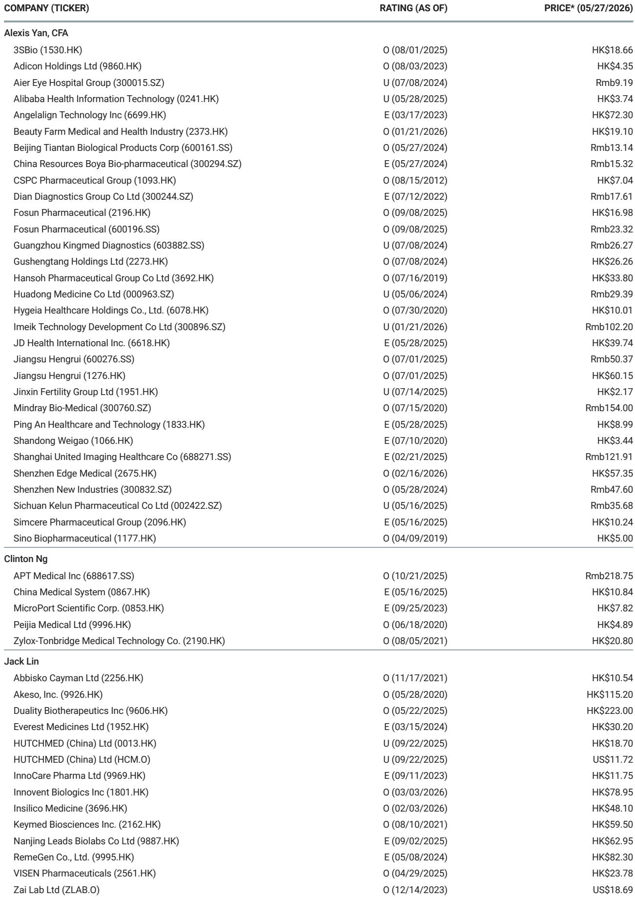
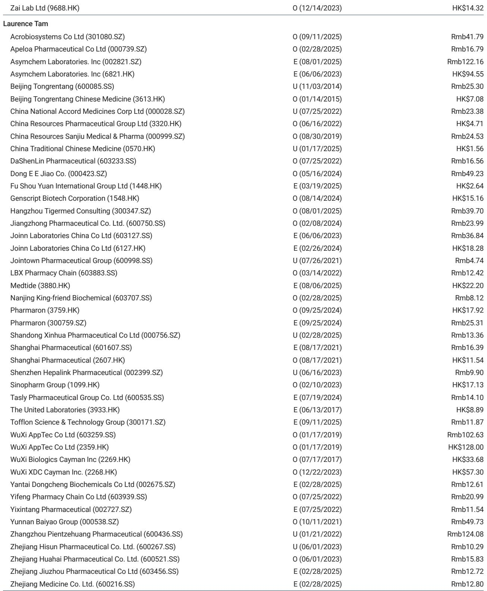
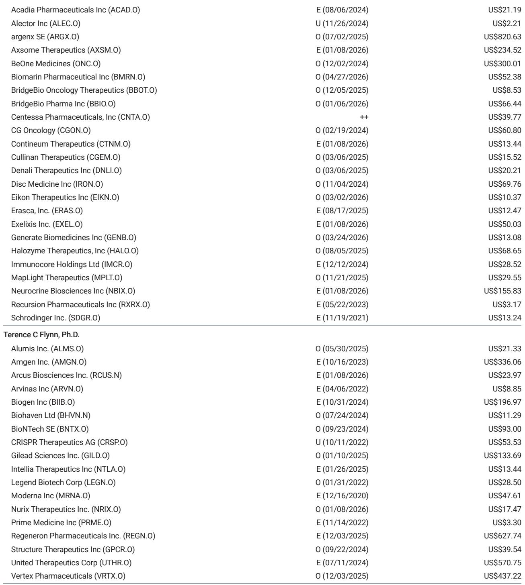

# 中国生物科技的下一个重估：从“证明全球化”到“锁定价值留存”

市场对2025年中国生物科技板块的重估，本质上是一次“全球化证明”的投票。大量对外授权交易证明了源自中国的资产可以进入全球创新池。但这份来自某外资投行的最新研报指出，市场的注意力过度集中在首付款和交易总额上，而真正决定长期回报的问题尚未被充分定价：**谁能从“卖资产”转向“留价值”**。

报告的核心判断是，中国生物科技的下一个重估阶段，奖励的将不是交易数量，而是风险承担能力和资产稀缺性共同决定的价值留存率。这不再是一个板块性的beta故事，而是一个需要精细判断个股alpha的转折点。

## 1. 市场低估的不是全球化需求，而是价值留存的定价差距

中国生物科技的第一轮重估，逻辑清晰：对外授权交易证明了中国创新药可以在全球市场获得认可，板块估值随之修复。但这份研报指出，这一视角已经变得拥挤且过于粗糙。市场对许多公司的远期预测几乎没有上调，说明投资者对“中国资产能卖出去”的认可，并未转化为对“中国公司能从中留下多少价值”的深入分析。

真正的差距在于交易结构。报告通过测算指出，典型的对外授权交易（out-licensing）与并购交易（M&A）相比，中国原研方留存的风险调整后净现值（rNPV）存在约51%的折价。即便采用更复杂的NewCo或共同开发结构，这一差距也只能收窄至约35-41%。这并非简单的谈判能力问题，而是风险分配的结构性问题：中国授权交易中，仅有约25%处于临床后期或商业化阶段，而美国生物科技并购交易中这一比例约为50%。跨国药企承担了更多的海外开发、监管、CMC、数据可翻译性和商业化风险，这一折价在逻辑上是合理的，但并非不可挑战。

这意味着，如果一家中国公司能够证明自己可以承担更多全球开发风险，它所留存的rNPV就有显著提升空间。这才是下一轮重估的真正引擎。

## 2. 风险承担能力正在改善，但内部差异巨大

支撑价值留存改善的宏观条件正在成熟。报告列举了几个关键变化：首先，中国生物科技公司的资金状况显著改善。授权交易目前贡献了约70%的行业融资，而中位现金跑道从2023财年的2.6年延长至2025财年的4.9年。更长的跑道、授权收入、国内商业化引擎以及海外临床试验经验，使得部分精选公司有能力将资产推向更后期阶段，并在谈判中争取更好的条件。

但报告同时强调，这种能力并非均匀分布。它提出了一个二维筛选框架：风险承担能力（risk-bearing capacity）和资产稀缺性（asset scarcity）。前者由现金、授权收入、国内商业基础、海外研发经验构成；后者由同类首创/同类最佳潜力、全球相关性、监管可移植性决定。只有在这两个维度上都得分较高的公司，才有可能从传统的授权模式向共同开发、NewCo乃至并购级别的经济条款迈进。

报告用一张散点图将中国生物科技公司划分为四个象限。右上角的公司被标记为“潜在价值留存领导者”，它们同时拥有较高的风险承担能力和资产稀缺性。左下角的公司则“仍需验证”，它们可能需要在其中一个维度上取得突破才能获得重估。这为投资者提供了一个清晰的筛选逻辑：不是所有中国生物科技公司都能参与下一轮重估。

## 3. 授权交易的结构性折价：为什么“卖得早”不等于“卖得好”

报告对授权交易与并购交易的经济学差异进行了量化拆解。在一个典型的情景中，一项价值10亿美元的并购交易，原研方可以一次性获得全部价值。而在授权交易中，首付款可能仅为5000万美元，剩余价值以研发里程碑、商业里程碑和特许权使用费的形式在未来多年内兑现。考虑到里程碑的成功概率和时间折现，授权交易的实际留存价值显著低于并购。

NewCo结构可以部分弥补这一差距。通过将资产注入一家新公司，并引入外部投资者和合作伙伴，原研方可以保留股权并分享未来价值。报告测算，在NewCo结构下，原研方的留存价值可以接近并购水平的69-75%。但这一结构也引入了新的风险：后续融资的稀释、治理权的外流、以及退出路径的不确定性。报告指出，NewCo结构对一家公司是价值创造还是价值毁灭，取决于其风险承担能力和资产稀缺性。

这一分析的核心含义是：**市场不能简单地将“交易总额”视为价值信号**。报告的“真实价值信号 vs 交易表象”对比表明确指出，总交易额、首付款、以及模糊的“战略合作”表述，都可能误导市场对价值留存的判断。真正需要关注的是：扣除成本分担和保留义务后的净首付款价值、量化的留存经济学（特许权使用费、利润分成、稀释后的NewCo股权）、以及保留的控制权（治理权、开发影响力、商业化角色）。

## 4. 报告尚未完全回答的关键问题：NewCo的退出路径与地缘政治风险

尽管报告为价值留存提供了令人信服的分析框架，但它也坦诚地指出了几个尚未被充分验证的假设。

首先，NewCo结构的退出路径仍不清晰。报告提到，NewCo的价值最终需要通过IPO或并购实现。但中国生物科技资产在海外市场的IPO窗口是否稳定？并购方是否愿意为NewCo股权支付与中国原研方直接授权相近的溢价？这些问题的答案取决于市场周期和地缘政治环境，报告并未给出明确的概率判断。

其次，地缘政治和美国商业化能力仍然是近端限制因素。报告承认，地缘政治风险和美国商业化难度“短期内难以完全内化”。对于计划在美国市场自主商业化的中国公司，这构成了一个显著的估值折价。报告建议关注那些通过合作伙伴进行美国商业化的公司，但这一策略本身也意味着价值分享。

最后，报告的筛选框架是定性的。风险承担能力和资产稀缺性的评分（1-10分）基于分析师判断，而非客观数据。不同投资者对同一家公司的评分可能存在显著差异。这意味着，框架的逻辑是坚实的，但具体应用需要投资者自己的判断。

## 5. 投资者的观察框架：从“交易数量”转向“价值留存信号”

基于报告的分析，投资者在评估中国生物科技公司时，需要建立一个新的观察框架。核心问题不再是“这家公司做了多少授权交易”，而是“每一笔交易为公司留下了多少净现值”。

具体而言，可以关注以下几个信号：

第一，**交易结构升级**。公司是否从简单的对外授权转向共同开发、利润分成或NewCo模式？报告提到的几个案例公司正在测试不同的路径：某公司测试NewCo模式的重复性；某公司测试通过美国利润分成、海外特许权使用费以及保留影响力来实现共同开发的经济性；某公司测试通过单一资产和跨国药企验证来驱动授权交易的价值捕获。

第二，**风险承担能力的可见提升**。公司是否在海外开展关键的多区域临床试验（MRCT）？是否建立了海外研发团队？国内商业化是否提供了稳定的现金流？这些都是风险承担能力改善的具体信号。

第三，**资产稀缺性的外部验证**。公司的核心资产是否获得了跨国药企的高额首付款或高比例特许权使用费？是否被行业公认为同类首创或同类最佳？外部验证是资产稀缺性的最有力证据。

第四，**警惕交易表象**。当一家公司宣布一项“总交易额”巨大的授权交易时，投资者应追问：首付款是多少？研发里程碑和商业里程碑的分布如何？特许权使用费率是多少？公司是否保留了任何治理权或商业化角色？这些细节决定了交易的真实价值。

## 写在最后：下一轮重估的驱动力

中国生物科技板块的下一个重估，不会来自更多的授权交易，而来自价值留存的改善。报告认为，推动这一改善的驱动力已经就位：资金状况改善、关键MRCT数据读出、监管协调风险减弱、以及AI驱动的资产质量提升。但最终，市场将奖励那些能够将风险承担能力和资产稀缺性转化为更强经济条款的公司。

报告没有回答的一个问题是：这种价值留存改善，在多大程度上已经被市场定价？2025年，部分头部中国生物科技公司的股价已经大幅上涨。当前估值中，有多少反映了价值留存的预期，有多少仍然是对全球化证明的延续？这需要投资者基于报告提供的框架进行独立判断。

如果你对这份报告的完整图表、公司具体评分以及未展开的交易结构细节感兴趣，欢迎来我们的星球微信群里继续讨论。我们会分享报告的原始图表和我们的解读笔记，并持续跟踪这些关键公司的价值留存信号。

Personal reading notes and learning share only. Not investment advice.

