# China Internet & New Media

EQUITY: INTERNET & NEW MEDIA

# Monthly App Tracker – April 2026

Bytedance sweeps online entertainment space

# MAS rose 1.5% y-y and total monthly time spent increased 10.3% y-y in April

Monthly active smartphone (MAS) users in China rose 1.5% y-y to 1.28bn in April 2026. China's MAS has remained stable in recent months. Total monthly time spent (MTS) grew 10.3% y-y in April, largely on par with the 10.9% y-y in March 2026.

# Text-to-video generation apps gaining strong traction globally

According to Sensor Tower data, both Kling [owned by Kuaishou (1024 HK, Neutral)] and Jimeng apps (owned by Bytedance and embedded with Bytedance's video-generation LLM, Seedance 2.0) maintained their growth trajectory in April, with gross revenue increasing 10% and 12% m-m, respectively. Kling app's revenue scale was ahead of Jimeng's, and meanwhile, a structural difference existed between the two apps' revenue sources: Kling app's revenue was primarily driven by overseas markets, while Jimeng app's came predominantly from the domestic market. Examining recent trends, Kling saw notable weekly revenue growth for the week beginning 11 May 2026, rising 62% on a w-w basis and 3.6x on a y-y basis, compared to 34% w-w growth and 2.8x y-y growth for Jimeng app. This uptick was largely attributable to Kling's overseas performance following the viral spread of its Korean Baseball effect, i.e., allowing users to transform themselves into spectators at a live Korean baseball game. However, it remains to be seen whether this momentum is sustainable, as such viral trends can be transient. We believe market competition in this vertical remains intense, and it is premature to predict a clear winner.

We note that both Kling and Jimeng may derive a majority of their revenue from their web versions, as a desktop enables better experience for such applications. Hence, the trends we discuss here for their mobile apps may differ from those for the web versions.

Furthermore, both applications may derive a meaningful portion of their grossing from the third-party LLM API aggregation platforms such as Higgsfield, which further dilutes the revenue share for the mobile apps.

Finally, Bytedance's SOTA video LLM, Seedance 2.0, is not only present in its Jimeng app, but is also included in other video-related apps launched owned by Bytedance, including its flagship video-editing app, CapCut (剪影). This app's monthly gross billing in April was 27x that of Kling app.

# Bytedance's DouShengSheng gaining traction

ByteDance launched its standalone group-buying app, Dou Sheng Sheng, in February 2026. The app showed growth after its release, with MTS doubling sequentially in April, mainly driven by 115% m-m growth in daily active users (DAU). In contrast, MTS for Meituan app was flat, while that for Dianping app rose 9% on an m-m basis (both owned by Meituan [3690 HK, Neutral]). On a y-y basis, MTS for Meituan and Dianping declined 3% and 1%, respectively, primarily due to reduced average daily time spent, which offset 7% and 18% y-y DAU growth. In April, Dou Sheng Sheng's MTS reached 16% of Dianping's level, while its DAU reached 29% of Dianping's.

# Softening user engagement across the travel sector

The travel sector showed sequential improvement in user engagement during April, driven by the Qingming Festival and in the lead-up-to the Labour Day holidays. However, the y-y-y picture was less favorable, with weakening engagement observed across the sector. Trip.com's (TCOM US, Neutral) two Chinese apps experienced notable declines – Ctrip's DAU fell 3% y-y, while Qunar's dropped 7% y-y. Fliggy saw an even steeper 9% y-y decline. The state-backed ticketing app Umetrip was the sole platform to record growth, though its momentum decelerated to 14% in April.

# Research Analysts

# China Internet & New Media

# Jialong Shi - NIHK

Jialong.shi@NOM.com

+852 2252 1409

# Rachel Guo - NIHK

rachel.guo@NOM.com

+852 2252 1400

We attribute this weakness partly to the domestic air fuel surcharge increases implemented in early April. With Chinese authorities raising these surcharges further in May, we anticipate the y-y decline in user engagement will persist through May.

# Bytedance sweeping the online entertainment space, except gaming

ByteDance is systematically capturing user time across multiple entertainment verticals – online video, music streaming, and digital reading – by leveraging Douyin's traffic ecosystem and employing low-monetization strategies centered on advertising rather than subscription models.

# Video streaming

Long-form video platforms continued to experience material MTS erosion in April, declining 10-20% y-y, driven primarily by DAU attrition. In contrast, ByteDance's Red Fruit app, a free short drama platform, sustained robust growth momentum, with MTS expanding 145% y-y, underpinned by 115% y-y DAU growth.

# Music streaming

ByteDance's music platforms – Soda Music and Tomato Music – continued to gain market share, recording MTS growth of 131% and 77% y-y, respectively, in April. This stands in sharp contrast to Tencent Music's (TME US, Buy) three flagship apps, which experienced MTS declines of 14% (Kugou), 11% (QQ Music), and 9% (Kuwo Music), according to QuestMobile data. NetEase Cloud Music (9899 HK, Not Rated) demonstrated greater resilience, declining only 1% y-y.

On a DAU basis, Soda Music rose 76% y-y to 57mn users, surpassing QQ Music (51mn) and Kugou (50mn) to become China's largest music streaming platform by this metric.

# Online reading

ByteDance's Tomato Free Novels maintained solid growth momentum, with MTS rising 15% y-y in April, supported by 12% DAU expansion. Conversely, China Literature's (772 HK, Buy) paid reading platforms – Qidian Reading and QQ Reading – recorded MTS declines of 21% and 17% y-y, respectively, dragged by DAU contractions of 13% and 9%.

# Overview of leading Chinese apps

Much of the traffic flow in April 2026 was dominated by apps owned by Bytedance, Tencent (700 HK, Buy), Baidu (BIDU US, Buy), and Alibaba. In particular, Bytedance's apps took five spots among the Top-20 in terms of both monthly active users (MAU) and time spent share in April, according to QuestMobile. Tencent's WeChat alone recorded an 19.3% share in terms of time spent by Chinese mobile users, leading the next two apps – Douyin and Douyin Lite (both unlisted, owned by Bytedance) – with 18.2% and 6.2% time-spent share, respectively.

Fig. 1: Top-20 apps in China, by MAU and time spent – April 

<table><tr><td colspan="5">Top 20 Apps in MAU: MAUs change and penetration</td></tr><tr><td>App Name</td><td>Rank M-Mchg</td><td>Penetration</td><td>PenetrationY-Y</td><td>PenetrationM-M</td></tr><tr><td>WeChat</td><td>-</td><td>89.1%</td><td>2.0ppt</td><td>0.3ppt</td></tr><tr><td>Douyin</td><td>-</td><td>79.4%</td><td>8.6ppt</td><td>0.4ppt</td></tr><tr><td>Taobao</td><td>-</td><td>75.0%</td><td>-0.5ppt</td><td>0.0ppt</td></tr><tr><td>Alipay</td><td>↑</td><td>73.1%</td><td>0.2ppt</td><td>0.0ppt</td></tr><tr><td>Amap</td><td>↓</td><td>71.4%</td><td>1.6ppt</td><td>-1.9ppt</td></tr><tr><td>Pinduoduo</td><td>-</td><td>56.2%</td><td>2.5ppt</td><td>-1.4ppt</td></tr><tr><td>Sogou Keyboard</td><td>-</td><td>54.5%</td><td>4.3ppt</td><td>0.2ppt</td></tr><tr><td>Baidu</td><td>-</td><td>50.8%</td><td>-4.6ppt</td><td>0.0ppt</td></tr><tr><td>QQ</td><td>-</td><td>48.5%</td><td>-1.2ppt</td><td>-0.2ppt</td></tr><tr><td>JD</td><td>-</td><td>47.4%</td><td>2.1ppt</td><td>0.5ppt</td></tr><tr><td>Baidu Maps</td><td>-</td><td>43.9%</td><td>-2.3ppt</td><td>0.5ppt</td></tr><tr><td>Meituan</td><td>-</td><td>40.4%</td><td>0.8ppt</td><td>0.3ppt</td></tr><tr><td>Baidu Keyboard</td><td>-</td><td>38.4%</td><td>-0.8ppt</td><td>-0.1ppt</td></tr><tr><td>Weibo</td><td>-</td><td>37.2%</td><td>-1.4ppt</td><td>-0.5ppt</td></tr><tr><td>Kuaishou</td><td>-</td><td>35.3%</td><td>-1.1ppt</td><td>-0.3ppt</td></tr><tr><td>Toutiao</td><td>-</td><td>29.5%</td><td>-1.3ppt</td><td>-1.1ppt</td></tr><tr><td>Doubao</td><td>↑</td><td>28.1%</td><td>18.6ppt</td><td>1.0ppt</td></tr><tr><td>QQ Browser</td><td>↓</td><td>27.6%</td><td>-6.7ppt</td><td>-1.5ppt</td></tr><tr><td>Red Fruit Free Short Dram</td><td>↑</td><td>26.2%</td><td>11.2ppt</td><td>1.5ppt</td></tr><tr><td>Douyin Lite</td><td>-</td><td>25.9%</td><td>3.7ppt</td><td>0.0ppt</td></tr></table>

<table><tr><td colspan="5">Time spent share for top 20 Chinese mobile apps in April</td></tr><tr><td>App Name</td><td>Rank M-M chg</td><td>Time spent share</td><td>Time spent share Y-Y</td><td>Time spent share M-M</td></tr><tr><td>WeChat</td><td>-</td><td>19.3%</td><td>-1.5ppt</td><td>-0.1ppt</td></tr><tr><td>Douyin</td><td>-</td><td>18.2%</td><td>2.1ppt</td><td>0.3ppt</td></tr><tr><td>Douyin Lite</td><td>-</td><td>6.2%</td><td>1.2ppt</td><td>-0.1ppt</td></tr><tr><td>Kuaishou</td><td>-</td><td>3.9%</td><td>-1.0ppt</td><td>-0.1ppt</td></tr><tr><td>Red Fruit Free Short Drama</td><td>-</td><td>3.8%</td><td>2.1ppt</td><td>0.2ppt</td></tr><tr><td>Sogou Keyboard</td><td>-</td><td>3.2%</td><td>0.0ppt</td><td>0.0ppt</td></tr><tr><td>Toutiao</td><td>-</td><td>2.9%</td><td>-0.3ppt</td><td>-0.1ppt</td></tr><tr><td>Pinduoduo</td><td>-</td><td>2.3%</td><td>0.1ppt</td><td>0.0ppt</td></tr><tr><td>rednote</td><td>-</td><td>2.2%</td><td>-0.2ppt</td><td>0.0ppt</td></tr><tr><td>Kuaishou Express</td><td>-</td><td>2.2%</td><td>-0.4ppt</td><td>0.0ppt</td></tr><tr><td>Baidu Keyboard</td><td>-</td><td>2.0%</td><td>-0.3ppt</td><td>0.0ppt</td></tr><tr><td>Weibo</td><td>-</td><td>2.0%</td><td>-0.2ppt</td><td>-0.1ppt</td></tr><tr><td>Fanqie Free Novels</td><td>-</td><td>1.9%</td><td>0.1ppt</td><td>0.0ppt</td></tr><tr><td>Taobao</td><td>-</td><td>1.7%</td><td>0.0ppt</td><td>0.0ppt</td></tr><tr><td>Bilibili</td><td>-</td><td>1.7%</td><td>0.0ppt</td><td>0.0ppt</td></tr><tr><td>Sina News</td><td>↑</td><td>1.6%</td><td>-0.1ppt</td><td>0.0ppt</td></tr><tr><td>Baidu</td><td>↓</td><td>1.6%</td><td>-0.5ppt</td><td>-0.1ppt</td></tr><tr><td>Honour of Kings</td><td>↑</td><td>1.3%</td><td>0.0ppt</td><td>0.2ppt</td></tr><tr><td>Alipay</td><td>-</td><td>1.2%</td><td>0.1ppt</td><td>0.0ppt</td></tr><tr><td>Tencent News</td><td>↓</td><td>1.1%</td><td>0.0ppt</td><td>-0.1ppt</td></tr></table>

Source: QuestMobile, NOM

Among the Top-50 apps, which accounted for \~93% of the total mobile time spent in China during April, we note that the Bytedance camp gained time-spent share on a y-y basis, which rose from 32.3% in April 2025 to 38.3% in April 2026, surpassing Tencent camp's 30.8%. Sequentially, Bytedance's time-spent share was up 0.3pp m-m.

Fig. 2: Time-spent share of various internet camps among the Top-50 apps in China   

bar_stacked

| Month | Tencent (%) | Bytedance (%) | Baidu (%) | Alibaba (%) | Sina (%) | Others (%) |
| :--- | :--- | :--- | :--- | :--- | :--- | :--- |
| Apr-26 | 30.8 | 38.3 | 5.0 | 5.4 | 3.8 | 16.7 |
| Mar-26 | 30.5 | 38.0 | 5.2 | 5.5 | 4.0 | 16.8 |
| Apr-25 | 32.4 | 32.3 | 6.3 | 5.9 | 4.1 | 19.0 |

Source: QuestMobile, NOM

# Long-form vs short-form dramas

Long-form video apps remained weak in April. The MTS of Tencent Video (owned by Tencent) recorded a 21% y-y decline in April, dragged by a 17% decline in DAU and a 4% decline in DTSD. Youku (owned by BABA)/Mango TV (300413 CH, Not rated)/iQIYI (IQ US, Neutral) recorded 20%/15%/12% y-y declines in total time spent, mainly dragged by 13%/12%/17% declines in DAU.

The dominant short-form drama app – Red Fruit Free Short Drama – kept its strong growth trend with an MTS increase of 145%, backed by 115% growth in DAU and 14% growth in DTSD.

Fig. 3: DAUs of long-form vs short-form dramas apps   
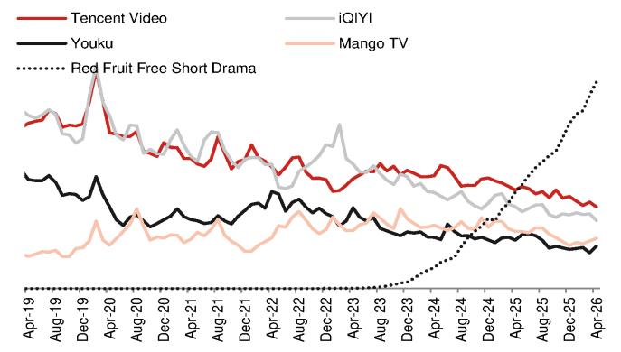

line

| Date    | Tencent Video | Youku | iQIYI | Mango TV | Red Fruit Free Short Drama |
|---------|---------------|-------|-------|----------|-----------------------------|
| Apr-19  | ~0.8          | ~0.7  | ~0.8  | ~0.3     | ~0.0                        |
| Aug-19  | ~0.7          | ~0.6  | ~0.7  | ~0.3     | ~0.0                        |
| Dec-19  | ~1.0          | ~0.5  | ~0.6  | ~0.4     | ~0.0                        |
| Apr-20  | ~0.9          | ~0.4  | ~0.5  | ~0.5     | ~0.0                        |
| Aug-20  | ~0.8          | ~0.3  | ~0.4  | ~0.6     | ~0.0                        |
| Dec-20  | ~0.7          | ~0.2  | ~0.3  | ~0.7     | ~0.0                        |
| Apr-21  | ~0.6          | ~0.1  | ~0.2  | ~0.8     | ~0.0                        |
| Aug-21  | ~0.5          | ~0.0  | ~0.1  | ~0.9     | ~0.0                        |
| Dec-21  | ~0.4          | ~-0.1 | ~0.0  | ~1.0     | ~0.0                        |
| Apr-22  | ~0.3          | ~-0.2 | ~-0.1 | ~1.1     | ~0.0                        |
| Aug-22  | ~0.2          | ~-0.3 | ~-0.2 | ~1.2     | ~0.0                        |
| Dec-22  | ~0.1          | ~-0.4 | ~-0.3 | ~1.3     | ~0.0                        |
| Apr-23  | ~0.0          | ~-0.5 | ~-0.4 | ~1.4     | ~0.0                        |
| Aug-23  | ~-0.1         | ~-0.6 | ~-0.5 | ~1.5     | ~0.0                        |
| Dec-23  | ~-0.2         | ~-0.7 | ~-0.6 | ~1.6     | ~0.0                        |
| Apr-24  | ~-0.3         | ~-0.8 | ~-0.7 | ~1.7     | ~0.1                        |
| Aug-24  | ~-0.4         | ~-0.9 | ~-0.8 | ~1.8     | ~0.2                        |
| Dec-24  | ~-0.5         | ~-1.0 | ~-0.9 | ~1.9     | ~0.3                        |
| Apr-25  | ~-0.6         | ~-1.1 | ~-1.0 | ~2.0     | ~0.4                        |
| Aug-25  | ~-0.7         | ~-1.2 | ~-1.1 | ~2.1     | ~0.5                        |
| Dec-25  | ~-0.8         | ~-1.3 | ~-1.2 | ~2.2     | ~0.6                        |
| Apr-26  | ~-0.9         | ~-1.4 | ~-1.3 | ~2.3     | ~0.7                        |

Source: QuestMobile, NOM

Fig. 4: Average daily time spent per user   
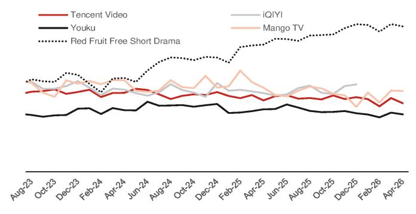

line

| Month    | Tencent Video | Youku | iQIYI | Mango TV | Red Fruit Free Short Drama |
|----------|---------------|-------|-------|----------|-----------------------------|
| Aug-23   | ~0.8          | ~0.7  | ~0.9  | ~0.8     | ~0.9                        |
| Oct-23   | ~0.8          | ~0.7  | ~0.9  | ~0.8     | ~0.9                        |
| Dec-23   | ~0.8          | ~0.7  | ~0.9  | ~0.8     | ~0.9                        |
| Feb-24   | ~0.8          | ~0.7  | ~0.9  | ~0.8     | ~0.9                        |
| Apr-24   | ~0.8          | ~0.7  | ~0.9  | ~0.8     | ~0.9                        |
| Jun-24   | ~0.8          | ~0.7  | ~0.9  | ~0.8     | ~0.9                        |
| Aug-24   | ~0.8          | ~0.7  | ~0.9  | ~0.8     | ~0.9                        |
| Oct-24   | ~0.8          | ~0.7  | ~0.9  | ~0.8     | ~0.9                        |
| Dec-24   | ~0.8          | ~0.7  | ~0.9  | ~0.8     | ~0.9                        |
| Feb-25   | ~0.8          | ~0.7  | ~0.9  | ~0.8     | ~0.9                        |
| Apr-25   | ~0.8          | ~0.7  | ~0.9  | ~0.8     | ~0.9                        |
| Jun-25   | ~0.8          | ~0.7  | ~0.9  | ~0.8     | ~0.9                        |
| Aug-25   | ~0.8          | ~0.7  | ~0.9  | ~0.8     | ~0.9                        |
| Oct-25   | ~0.8          | ~0.7  | ~0.9  | ~0.8     | ~0.9                        |
| Dec-25   | ~0.8          | ~0.7  | ~0.9  | ~0.8     | ~0.9                        |
| Feb-26   | ~0.8          | ~0.7  | ~0.9  | ~0.8     | ~0.9                        |
| Apr-26   | ~0.8          | ~0.7  | ~0.9  | ~0.8     | ~0.9                        |

Source: QuestMobile, NOM

# Short video

In April, Douyin maintained its solid growth momentum in terms of MTS, at 25% y-y, mainly driven by 20% growth in DAU. Total time spent for Bilibili (BILI US, Neutral) recorded 10% y-y growth in April, driven by 4% y-y growth in DAU and 6% growth in DTSD. However, Kuaishou (1024 HK, Neutral) continued its relatively soft performance, with a decline of 12% y-y in MTS, mainly dragged by a 12% y-y decline in DTSD.

Fig. 5: DAUs of short video apps   
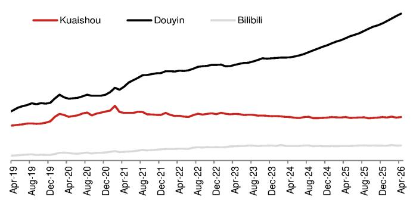

line

| Date    | Kuaishou | Douyin | Bilibili |
|---------|----------|--------|----------|
| Apr-19  | ~0.4     | ~0.5   | ~0.1     |
| Aug-19  | ~0.4     | ~0.6   | ~0.1     |
| Dec-19  | ~0.4     | ~0.7   | ~0.1     |
| Apr-20  | ~0.5     | ~0.8   | ~0.1     |
| Aug-20  | ~0.5     | ~0.9   | ~0.1     |
| Dec-20  | ~0.6     | ~1.0   | ~0.1     |
| Apr-21  | ~0.6     | ~1.2   | ~0.1     |
| Aug-21  | ~0.6     | ~1.4   | ~0.1     |
| Dec-21  | ~0.6     | ~1.6   | ~0.1     |
| Apr-22  | ~0.6     | ~1.8   | ~0.1     |
| Aug-22  | ~0.6     | ~2.0   | ~0.1     |
| Dec-22  | ~0.6     | ~2.2   | ~0.1     |
| Apr-23  | ~0.6     | ~2.4   | ~0.1     |
| Aug-23  | ~0.6     | ~2.6   | ~0.1     |
| Dec-23  | ~0.6     | ~2.8   | ~0.1     |
| Apr-24  | ~0.6     | ~3.0   | ~0.1     |
| Aug-24  | ~0.6     | ~3.2   | ~0.1     |
| Dec-24  | ~0.6     | ~3.4   | ~0.1     |
| Apr-25  | ~0.6     | ~3.6   | ~0.1     |
| Aug-25  | ~0.6     | ~3.8   | ~0.1     |
| Dec-25  | ~0.6     | ~4.0   | ~0.1     |
| Apr-26  | ~0.6     | ~4.2   | ~0.1     |

Source: QuestMobile, NOM

Fig. 6: Average daily time spent per user   
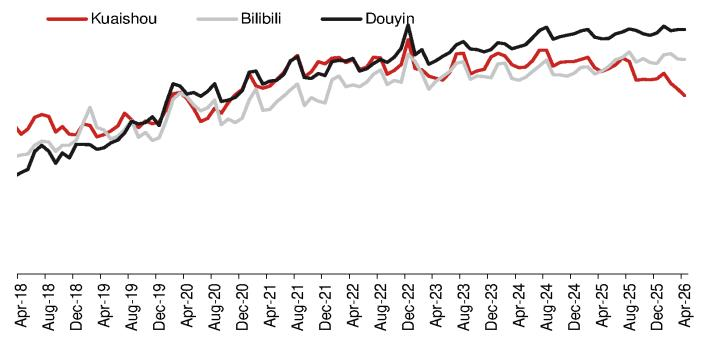

line

| Date   | Kuaishou | Bilibili | Douyin |
|--------|----------|----------|--------|
| Apr-18 |          |          |        |
| Aug-18 |          |          |        |
| Dec-18 |          |          |        |
| Apr-19 |          |          |        |
| Aug-19 |          |          |        |
| Dec-19 |          |          |        |
| Apr-20 |          |          |        |
| Aug-20 |          |          |        |
| Dec-20 |          |          |        |
| Apr-21 |          |          |        |
| Aug-21 |          |          |        |
| Dec-21 |          |          |        |
| Apr-22 |          |          |        |
| Aug-22 |          |          |        |
| Dec-22 |          |          |        |
| Apr-23 |          |          |        |
| Aug-23 |          |          |        |
| Dec-23 |          |          |        |
| Apr-24 |          |          |        |
| Aug-24 |          |          |        |
| Dec-24 |          |          |        |
| Apr-25 |          |          |        |
| Aug-25 |          |          |        |
| Dec-25 |          |          |        |
| Apr-26 |          |          |        |

Source: QuestMobile, NOM

# Online reading

The MTS of the free reading app leader Tomato Free Novels (unlisted; owned by ByteDance) maintained its solid growth momentum, up 15% y-y in April, driven by increases of 12% y-y in DAU. Another free reading app, Qimao Free Novels (unlisted), recorded a 41% y-y decline in total time spent, dragged by 29% and 18% y-y declines in DAU and DTSD, respectively.

Paid reading apps owned by China Literature (772 HK, Buy), i.e., Qidian reading and QQ reading, recorded respective declines of 13% and 9% on a y-y basis in DAU during the month, while their DTSDs were down by 10% and 9% y-y, respectively.

Fig. 7: DAU of online reading platforms   
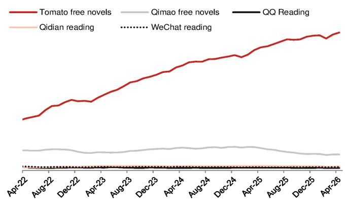

line

| Date    | Tomato free novels | Qimao free novels | QQ Reading | Qidian reading | WeChat reading |
|---------|--------------------|-------------------|----------|----------------|----------------|
| Apr-22  | ~8                 | ~4                | ~0       | ~0             | ~0             |
| Aug-22  | ~9                 | ~4                | ~0       | ~0             | ~0             |
| Dec-22  | ~10                | ~4                | ~0       | ~0             | ~0             |
| Apr-23  | ~11                | ~4                | ~0       | ~0             | ~0             |
| Aug-23  | ~13                | ~4                | ~0       | ~0             | ~0             |
| Dec-23  | ~15                | ~4                | ~0       | ~0             | ~0             |
| Apr-24  | ~17                | ~4                | ~0       | ~0             | ~0             |
| Aug-24  | ~19                | ~4                | ~0       | ~0             | ~0             |
| Dec-24  | ~21                | ~4                | ~0       | ~0             | ~0             |
| Apr-25  | ~23                | ~4                | ~0       | ~0             | ~0             |
| Aug-25  | ~25                | ~4                | ~0       | ~0             | ~0             |
| Dec-25  | ~27                | ~4                | ~0       | ~0             | ~0             |
| Apr-26  | ~29                | ~4                | ~0       | ~0             | ~0             |

Source: QuestMobile, NOM

Fig. 8: Average daily time spent per DAU of online reading platforms   
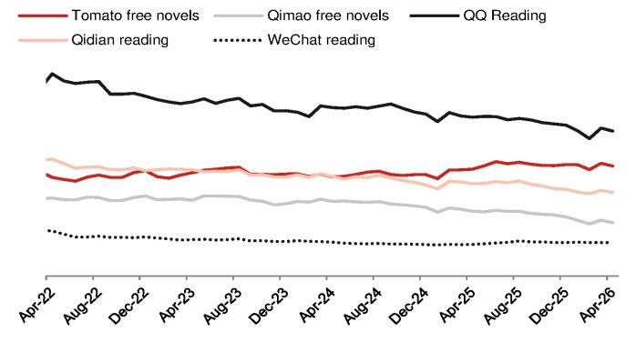

line

| Date   | Tomato free novels | Qimao free novels | QQ Reading | Qidian reading | WeChat reading |
|--------|--------------------|-------------------|----------|----------------|----------------|
| Apr-22 | ~0.8               | ~0.5              | ~1.0     | ~0.7           | ~0.3           |
| Aug-22 | ~0.7               | ~0.4              | ~0.9     | ~0.6           | ~0.2           |
| Dec-22 | ~0.6               | ~0.3              | ~0.8     | ~0.5           | ~0.1           |
| Apr-23 | ~0.5               | ~0.2              | ~0.7     | ~0.4           | ~0.1           |
| Aug-23 | ~0.4               | ~0.1              | ~0.6     | ~0.3           | ~0.1           |
| Dec-23 | ~0.3               | ~0.1              | ~0.5     | ~0.2           | ~0.1           |
| Apr-24 | ~0.2               | ~0.1              | ~0.4     | ~0.1           | ~0.1           |
| Aug-24 | ~0.1               | ~0.1              | ~0.3     | ~0.1           | ~0.1           |
| Dec-24 | ~0.1               | ~0.1              | ~0.2     | ~0.1           | ~0.1           |
| Apr-25 | ~0.1               | ~0.1              | ~0.1     | ~0.1           | ~0.1           |
| Aug-25 | ~0.1               | ~0.1              | ~0.1     | ~0.1           | ~0.1           |
| Dec-25 | ~0.1               | ~0.1              | ~0.1     | ~0.1           | ~0.1           |
| Apr-26 | ~0.1               | ~0.1              | ~0.1     | ~0.1           | ~0.1           |

Source: QuestMobile, NOM

# Live broadcasting

Live broadcasting show apps maintained their y-y downward trend in MTS in April. The DAU of Momo (MOMO US, Not rated) and YY (owned by Baidu) declined by 13% and 2% y-y, respectively. In terms of DTSD, Momo was flat y-y, while YY recorded a 16% y-y decline during the month.

Fig. 9: DAUs of live broadcasting show apps   
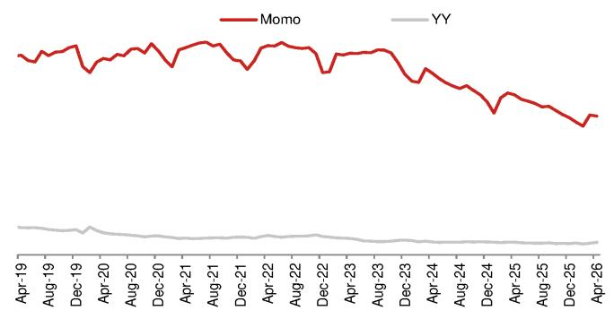

line

| Date    | Momo  | YY   |
|---------|-------|------|
| Apr-19  |       |      |
| Aug-19  |       |      |
| Dec-19  |       |      |
| Apr-20  |       |      |
| Aug-20  |       |      |
| Dec-20  |       |      |
| Apr-21  |       |      |
| Aug-21  |       |      |
| Dec-21  |       |      |
| Apr-22  |       |      |
| Aug-22  |       |      |
| Dec-22  |       |      |
| Apr-23  |       |      |
| Aug-23  |       |      |
| Dec-23  |       |      |
| Apr-24  |       |      |
| Aug-24  |       |      |
| Dec-24  |       |      |
| Apr-25  |       |      |
| Aug-25  |       |      |
| Dec-25  |       |      |
| Apr-26  |       |      |

Source: QuestMobile, NOM

Fig. 10: Average daily time spent per user   
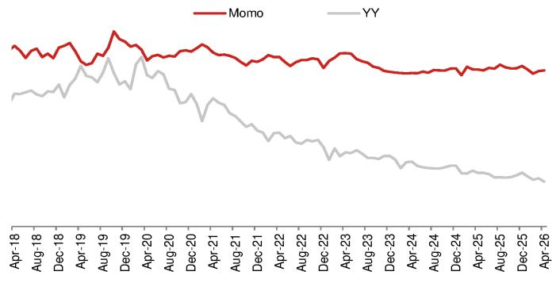

line

| Date    | Momo  | YY    |
|---------|-------|-------|
| Apr-18  |       |       |
| Aug-18  |       |       |
| Dec-18  |       |       |
| Apr-19  |       |       |
| Aug-19  |       |       |
| Dec-19  |       |       |
| Apr-20  |       |       |
| Aug-20  |       |       |
| Dec-20  |       |       |
| Apr-21  |       |       |
| Aug-21  |       |       |
| Dec-21  |       |       |
| Apr-22  |       |       |
| Aug-22  |       |       |
| Dec-22  |       |       |
| Apr-23  |       |       |
| Aug-23  |       |       |
| Dec-23  |       |       |
| Apr-24  |       |       |
| Aug-24  |       |       |
| Dec-24  |       |       |
| Apr-25  |       |       |
| Aug-25  |       |       |
| Dec-25  |       |       |
| Apr-26  |       |       |

Source: QuestMobile, NOM

For game live broadcasting apps, the MTS for Huya (HUYA US, Not rated) recorded a 14% decline in April, mainly dragged by a 13% y-y decline in DAU. The downward trend of MTS for Douyu (DOYU US, Not rated) slowed in April, recording a 3% y-y decline, vs a 12% y-y decline in March, dragged by a 15% decline in DAU, offsetting 14% y-y growth in DTSD.

Fig. 11: DAUs of game live broadcasting apps   
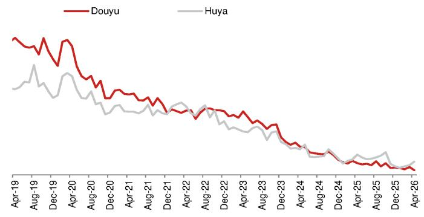

line

| Date    | Douyu | Huya |
|---------|-------|------|
| Apr-19  |       |      |
| Aug-19  |       |      |
| Dec-19  |       |      |
| Apr-20  |       |      |
| Aug-20  |       |      |
| Dec-20  |       |      |
| Apr-21  |       |      |
| Aug-21  |       |      |
| Dec-21  |       |      |
| Apr-22  |       |      |
| Aug-22  |       |      |
| Dec-22  |       |      |
| Apr-23  |       |      |
| Aug-23  |       |      |
| Dec-23  |       |      |
| Apr-24  |       |      |
| Aug-24  |       |      |
| Dec-24  |       |      |
| Apr-25  |       |      |
| Aug-25  |       |      |
| Dec-25  |       |      |
| Apr-26  |       |      |

Source: QuestMobile, NOM

Fig. 12: Average daily time spent per user   
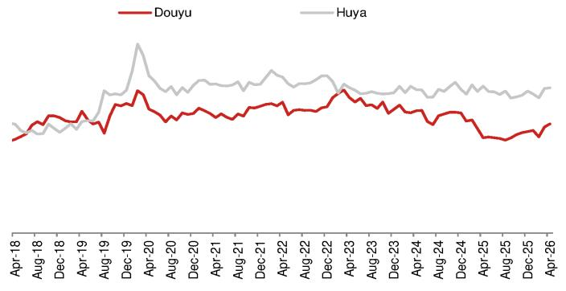

line

| Date    | Douyu | Huya |
|---------|-------|------|
| Apr-18  |       |      |
| Aug-18  |       |      |
| Dec-18  |       |      |
| Apr-19  |       |      |
| Aug-19  |       |      |
| Dec-19  |       |      |
| Apr-20  |       |      |
| Aug-20  |       |      |
| Dec-20  |       |      |
| Apr-21  |       |      |
| Aug-21  |       |      |
| Dec-21  |       |      |
| Apr-22  |       |      |
| Aug-22  |       |      |
| Dec-22  |       |      |
| Apr-23  |       |      |
| Aug-23  |       |      |
| Dec-23  |       |      |
| Apr-24  |       |      |
| Aug-24  |       |      |
| Dec-24  |       |      |
| Apr-25  |       |      |
| Aug-25  |       |      |
| Dec-25  |       |      |
| Apr-26  |       |      |

Source: QuestMobile, NOM

# Music

The y-y decline in DAU continued for most part of the music universe, except for Soda Music and Tomato Music (both owned by ByteDance), which recorded 76% and 72% y-y growth in April. The DAU of NetEase Cloud Music (9899 HK, Not rated) recorded 1% y-y decline in April. QQ Music/Kugou Music/Kuwo Music [owned by TME (TME US, Buy)] decreased 5%/12%/13% y-y in terms of DAU in April (as shown in Fig. 13 13).

Tencent Karaoke maintained its y-y downward trend in MTS, with a 25% y-y decline, mainly dragged by a 33% y-y drop in DAU, offsetting 13% y-y growth in DTSD in April (as shown in Fig. 14).

Fig. 13: DAUs of music streaming apps   
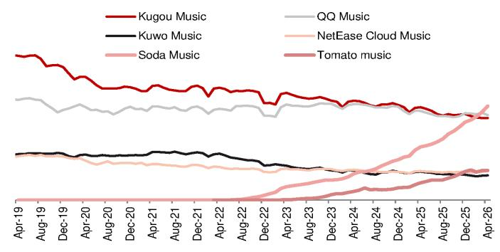

line

| Date    | Kugou Music | Kuwo Music | Soda Music | QQ Music | NetEase Cloud Music | Tomato music |
|---------|-------------|------------|------------|----------|---------------------|--------------|
| Apr-19  | ~1.0        | ~0.3       | ~0.0       | ~0.8     | ~0.3                | ~0.0         |
| Aug-19  | ~0.9        | ~0.3       | ~0.0       | ~0.7     | ~0.3                | ~0.0         |
| Dec-19  | ~0.8        | ~0.3       | ~0.0       | ~0.6     | ~0.3                | ~0.0         |
| Apr-20  | ~0.7        | ~0.3       | ~0.0       | ~0.5     | ~0.3                | ~0.0         |
| Aug-20  | ~0.6        | ~0.3       | ~0.0       | ~0.4     | ~0.3                | ~0.0         |
| Dec-20  | ~0.5        | ~0.3       | ~0.0       | ~0.3     | ~0.3                | ~0.0         |
| Apr-21  | ~0.4        | ~0.3       | ~0.0       | ~0.2     | ~0.3                | ~0.0         |
| Aug-21  | ~0.3        | ~0.3       | ~0.0       | ~0.1     | ~0.3                | ~0.0         |
| Dec-21  | ~0.2        | ~0.3       | ~0.0       | ~0.0     | ~0.3                | ~0.0         |
| Apr-22  | ~0.1        | ~0.3       | ~0.0       | ~-0.1    | ~0.3                | ~0.0         |
| Aug-22  | ~-0.1       | ~0.3       | ~-0.1      | ~-0.2    | ~0.3                | ~0.0         |
| Dec-22  | ~-0.2       | ~0.3       | ~-0.2      | ~-0.3    | ~0.3                | ~0.0         |
| Apr-23  | ~-0.3       | ~0.3       | ~-0.3      | ~-0.4    | ~0.3                | ~0.0         |
| Aug-23  | ~-0.4       | ~0.3       | ~-0.4      | ~-0.5    | ~0.3                | ~0.0         |
| Dec-23  | ~-0.5       | ~0.3       | ~-0.5      | ~-0.6    | ~0.3                | ~0.0         |
| Apr-24  | ~-0.6       | ~0.3       | ~-0.6      | ~-0.7    | ~0.3                | ~0.0         |
| Aug-24  | ~-0.7       | ~0.3       | ~-0.7      | ~-0.8    | ~0.3                | ~0.0         |
| Dec-24  | ~-0.8       | ~0.3       | ~-0.8      | ~-0.9    | ~0.3                | ~0.0         |
| Apr-25  | ~-0.9       | ~0.3       | ~-0.9      | ~-1.0    | ~0.3                | ~0.0         |
| Aug-25  | ~-1.0       | ~0.3       | >-1.0      | ~-1.1    | ~0.3                | ~0.1         |
| Dec-25  | ~-1.1       | ~0.3       | >-1.1      | ~-1.2    | ~0.3                | ~0.2         |
| Apr-26  | ~-1.2       | ~0.3       | >-1.2      | ~-1.3    | ~0.3                | ~0.3         |

Source: QuestMobile, NOM

Fig. 14: DAUs of online karaoke app   
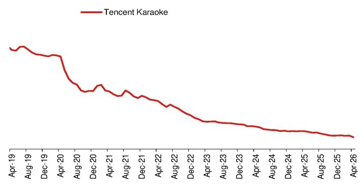

line

| Date    | Tencent Karaoke |
|---------|-----------------|
| Apr-19  | ~1.0            |
| Aug-19  | ~0.9            |
| Dec-19  | ~0.8            |
| Apr-20  | ~0.7            |
| Aug-20  | ~0.6            |
| Dec-20  | ~0.5            |
| Apr-21  | ~0.4            |
| Aug-21  | ~0.3            |
| Dec-21  | ~0.2            |
| Apr-22  | ~0.1            |
| Aug-22  | ~0.0            |
| Dec-22  | ~-0.1           |
| Apr-23  | ~-0.2           |
| Aug-23  | ~-0.3           |
| Dec-23  | ~-0.4           |
| Apr-24  | ~-0.5           |
| Aug-24  | ~-0.6           |
| Dec-24  | ~-0.7           |
| Apr-25  | ~-0.8           |
| Aug-25  | ~-0.9           |
| Dec-25  | ~-1.0           |
| Apr-26  | ~-1.1           |

Source: QuestMobile, NOM

# Social

The MTS of Xiaohongshu (unlisted) saw flat growth for the first time in April, backed by 5% y-y growth in DAU, offsetting a 4% decline in DTSD. The MTS of Weibo (WB US, Neutral) also flattened in April, decelerating from 12% y-y growth in March. Within Tencent's social ecosystem, QQ maintained its downward trend in MTS, with a 9% y-y decline, while WeChat recorded 2% y-y growth in terms of total time spent in April.

Fig. 15: DAUs of social apps   
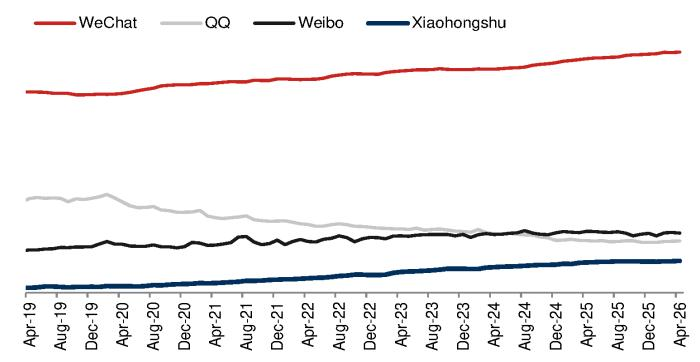

line

| Date    | WeChat | QQ   | Weibo | Xiaohongshu |
|---------|--------|------|-------|-------------|
| Apr-19  | ~35    | ~30  | ~20   | ~5          |
| Aug-19  | ~35    | ~30  | ~20   | ~5          |
| Dec-19  | ~35    | ~30  | ~20   | ~5          |
| Apr-20  | ~35    | ~30  | ~20   | ~5          |
| Aug-20  | ~35    | ~30  | ~20   | ~5          |
| Dec-20  | ~35    | ~30  | ~20   | ~5          |
| Apr-21  | ~35    | ~30  | ~20   | ~5          |
| Aug-21  | ~35    | ~30  | ~20   | ~5          |
| Dec-21  | ~35    | ~30  | ~20   | ~5          |
| Apr-22  | ~35    | ~30  | ~20   | ~5          |
| Aug-22  | ~35    | ~30  | ~20   | ~5          |
| Dec-22  | ~35    | ~30  | ~20   | ~5          |
| Apr-23  | ~35    | ~30  | ~20   | ~5          |
| Aug-23  | ~35    | ~30  | ~20   | ~5          |
| Dec-23  | ~35    | ~30  | ~20   | ~5          |
| Apr-24  | ~35    | ~30  | ~20   | ~5          |
| Aug-24  | ~35    | ~30  | ~20   | ~5          |
| Dec-24  | ~35    | ~30  | ~20   | ~5          |
| Apr-25  | ~35    | ~30  | ~20   | ~5          |
| Aug-25  | ~35    | ~30  | ~20   | ~5          |
| Dec-25  | ~35    | ~30  | ~20   | ~5          |
| Apr-26  | ~35    | ~30  | ~20   | ~5          |

Source: QuestMobile, NOM

Fig. 16: Average daily time spent per user   
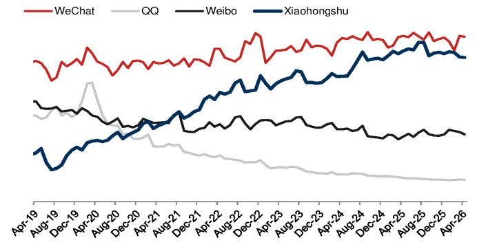

line

| Date    | WeChat | QQ   | Weibo | Xiaohongshu |
|---------|--------|------|-------|-------------|
| Apr-19  |        |      |       |             |
| Aug-19  |        |      |       |             |
| Dec-19  |        |      |       |             |
| Apr-20  |        |      |       |             |
| Aug-20  |        |      |       |             |
| Dec-20  |        |      |       |             |
| Apr-21  |        |      |       |             |
| Aug-21  |        |      |       |             |
| Dec-21  |        |      |       |             |
| Apr-22  |        |      |       |             |
| Aug-22  |        |      |       |             |
| Dec-22  |        |      |       |             |
| Apr-23  |        |      |       |             |
| Aug-23  |        |      |       |             |
| Dec-23  |        |      |       |             |
| Apr-24  |        |      |       |             |
| Aug-24  |        |      |       |             |
| Dec-24  |        |      |       |             |
| Apr-25  |        |      |       |             |
| Aug-25  |        |      |       |             |
| Dec-25  |        |      |       |             |
| Apr-26  |        |      |       |             |

Source: QuestMobile, NOM

# Office apps

Within the office apps vertical, the DAU of Feishu (owned by Bytedance) and Wecom (owned by Tencent) recorded 42% y-y and 8% y-y growth, respectively, in April, while Ding Talk (owned by BABA) declined by 2%. However, Ding Talk owned the largest DAU base at \~83mn, which was 1.1x and 9.5x that of Wecom and Feishu, respectively. For Feishu, the DTSD was at 14.9 minutes (down 1% y-y), followed by Wecom's 12.2 minutes (up 2% y-y) and DingTalk's 10.0 minutes (down 3% y-y), as per QuestMobile data.

Fig. 17: DAUs of office business apps   
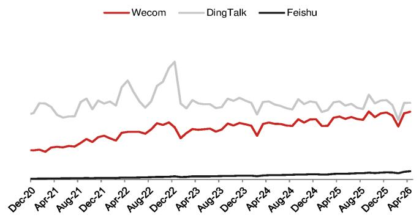

line

| Date    | Wecom | DingTalk | Feishu |
|---------|-------|----------|--------|
| Dec-20  |       |          |        |
| Apr-21  |       |          |        |
| Aug-21  |       |          |        |
| Dec-21  |       |          |        |
| Apr-22  |       |          |        |
| Aug-22  |       |          |        |
| Dec-22  |       |          |        |
| Apr-23  |       |          |        |
| Aug-23  |       |          |        |
| Dec-23  |       |          |        |
| Apr-24  |       |          |        |
| Aug-24  |       |          |        |
| Dec-24  |       |          |        |
| Apr-25  |       |          |        |
| Aug-25  |       |          |        |
| Dec-25  |       |          |        |
| Apr-26  |       |          |        |

Source: QuestMobile, NOM

Fig. 18: Average daily time spent per user   
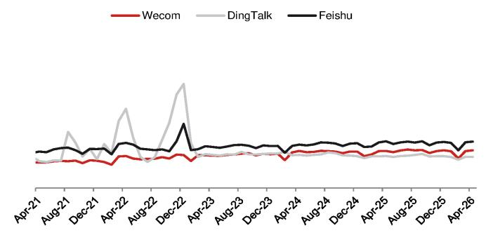

line

| Date    | Wecom | DingTalk | Feishu |
|---------|-------|----------|--------|
| Apr-21  | 0.5   | 0.4      | 0.6    |
| Aug-21  | 0.6   | 0.7      | 0.5    |
| Dec-21  | 0.4   | 0.3      | 0.5    |
| Apr-22  | 0.5   | 0.8      | 0.6    |
| Aug-22  | 0.4   | 0.2      | 0.5    |
| Dec-22  | 0.5   | 1.0      | 0.6    |
| Apr-23  | 0.4   | 0.3      | 0.5    |
| Aug-23  | 0.5   | 0.4      | 0.6    |
| Dec-23  | 0.4   | 0.3      | 0.5    |
| Apr-24  | 0.5   | 0.4      | 0.6    |
| Aug-24  | 0.4   | 0.3      | 0.5    |
| Dec-24  | 0.5   | 0.4      | 0.6    |
| Apr-25  | 0.4   | 0.3      | 0.5    |
| Aug-25  | 0.5   | 0.4      | 0.6    |
| Dec-25  | 0.4   | 0.3      | 0.5    |
| Apr-26  | 0.5   | 0.4      | 0.6    |

Source: QuestMobile, NOM

# Search

The Baidu app, despite being a dominant search engine in China, witnessed an 18% y-y decline in MTS during the month, dragged by a 20% y-y decline in DAU, offsetting 2% y-y growth in DTSD.

Fig. 19: DAU of Baidu app   
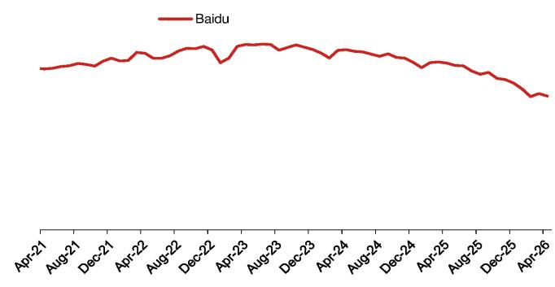

line

| Date    | Baidu |
|---------|-------|
| Apr-21  |       |
| Aug-21  |       |
| Dec-21  |       |
| Apr-22  |       |
| Aug-22  |       |
| Dec-22  |       |
| Apr-23  |       |
| Aug-23  |       |
| Dec-23  |       |
| Apr-24  |       |
| Aug-24  |       |
| Dec-24  |       |
| Apr-25  |       |
| Aug-25  |       |
| Dec-25  |       |
| Apr-26  |       |

Source: QuestMobile, NOM

Fig. 20: Average daily time spent per user   
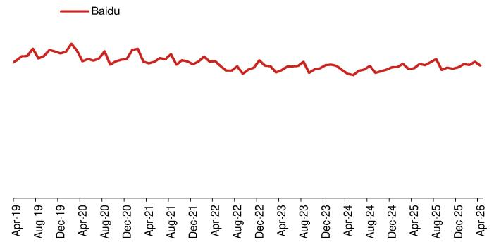

line

| Date    | Baidu |
|---------|-------|
| Apr-19  |       |
| Aug-19  |       |
| Dec-19  |       |
| Apr-20  |       |
| Aug-20  |       |
| Dec-20  |       |
| Apr-21  |       |
| Aug-21  |       |
| Dec-21  |       |
| Apr-22  |       |
| Aug-22  |       |
| Dec-22  |       |
| Apr-23  |       |
| Aug-23  |       |
| Dec-23  |       |
| Apr-24  |       |
| Aug-24  |       |
| Dec-24  |       |
| Apr-25  |       |
| Aug-25  |       |
| Dec-25  |       |
| Apr-26  |       |

Source: QuestMobile, NOM

# AI tools

The DAU of Doubao (owned by ByteDance) ranked first in April at 151mn (according to QuestMobile data), representing 3.8x y-y and 13% m-m growth. This was followed by Quark Browser at 32mn (down 1% y-y and 3% m-m), Qwen (owned by Alibaba) at 29mn (up 66x y-y and 1% m-m), and Deepseek at 29mn (down 20% y-y and up 1% m-m).

In terms of DTSD, Quark Browser recorded the highest time spent at 33 minutes in April (up 5% y-y and 1% m-m). Deepseek ranked the second at 15.7 minutes (up 80% y-y and 9% m-m), followed by Doubao's 11.5 minutes (up 13% y-y and 2% m-m) and Zhipu Qingyan's 11.4 minutes (up 70% y-y and 10% m-m).

Fig. 21: DAUs of AI apps   
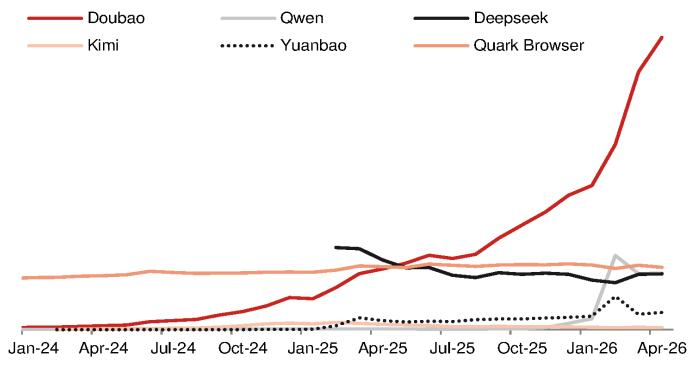

line

| Date   | Doubao | Qwen | Deepseek | Kimi | Yuanbao | Quark Browser |
|--------|---------|------|----------|------|---------|---------------|
| Jan-24 | 0       | 0    | 0        | 0    | 0       | 0             |
| Apr-24 | 0       | 0    | 0        | 0    | 0       | 0             |
| Jul-24 | 0       | 0    | 0        | 0    | 0       | 0             |
| Oct-24 | 0       | 0    | 0        | 0    | 0       | 0             |
| Jan-25 | 0       | 0    | 0        | 0    | 0       | 0             |
| Apr-25 | 0       | 0    | 0        | 0    | 0       | 0             |
| Jul-25 | 0       | 0    | 0        | 0    | 0       | 0             |
| Oct-25 | 0       | 0    | 0        | 0    | 0       | 0             |
| Jan-26 | 0       | 0    | 0        | 0    | 0       | 0             |
| Apr-26 | 1.5     | 0.5  | 0.3      | 0.2  | 0.1     | 0.1           |

Source: QuestMobile, NOM

Fig. 22: Average daily time spent per DAU of AI apps   
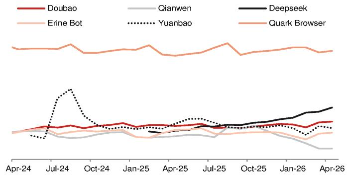

line

| Date    | Doubao | Qianwen | Deepseek | Erine Bot | Yuanbao | Quark Browser |
|---------|---------|---------|----------|-----------|---------|---------------|
| Apr-24  |         |         |          |           |         |               |
| Jul-24  |         |         |          |           |         |               |
| Oct-24  |         |         |          |           |         |               |
| Jan-25  |         |         |          |           |         |               |
| Apr-25  |         |         |          |           |         |               |
| Jul-25  |         |         |          |           |         |               |
| Oct-25  |         |         |          |           |         |               |
| Jan-26  |         |         |          |           |         |               |
| Apr-26  |         |         |          |           |         |               |

Source: QuestMobile, NOM

# Online travel

Among online travel apps, TRIP.com's domestic apps, Ctrip and Qunar, and Fliggy (unlisted, owned by BABA) recorded 12%/6%/8% y-y declines in MTS in April, mainly dragged by 3%/7%/9% y-y declines in DAU respectively. In terms of DTSD, Qunar app and Fliggy each recorded 1% y-y growth in April, while Ctrip app recorded a 9% y-y decline.

Fig. 23: DAUs of online travel apps   
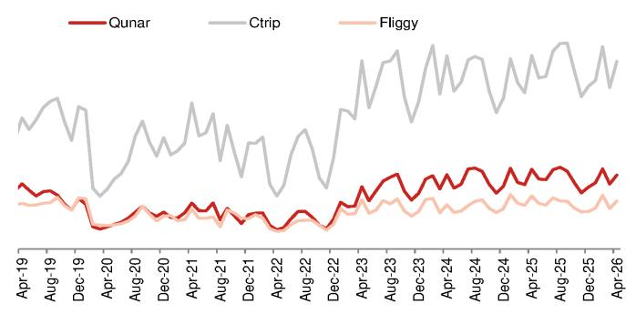

line

| Date    | Qunar | Ctrip | Fliggy |
|---------|-------|-------|--------|
| Apr-19  |       |       |        |
| Aug-19  |       |       |        |
| Dec-19  |       |       |        |
| Apr-20  |       |       |        |
| Aug-20  |       |       |        |
| Dec-20  |       |       |        |
| Apr-21  |       |       |        |
| Aug-21  |       |       |        |
| Dec-21  |       |       |        |
| Apr-22  |       |       |        |
| Aug-22  |       |       |        |
| Dec-22  |       |       |        |
| Apr-23  |       |       |        |
| Aug-23  |       |       |        |
| Dec-23  |       |       |        |
| Apr-24  |       |       |        |
| Aug-24  |       |       |        |
| Dec-24  |       |       |        |
| Apr-25  |       |       |        |
| Aug-25  |       |       |        |
| Dec-25  |       |       |        |
| Apr-26  |       |       |        |

Source: QuestMobile, NOM

Fig. 24: Average daily time spent per user   
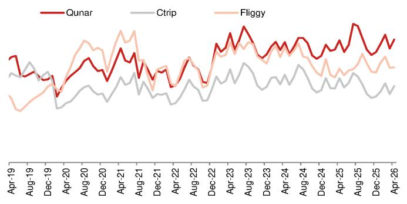

line

| Date    | Qunar | Ctrip | Fliggy |
|---------|-------|-------|--------|
| Apr-19  |       |       |        |
| Aug-19  |       |       |        |
| Dec-19  |       |       |        |
| Apr-20  |       |       |        |
| Aug-20  |       |       |        |
| Dec-20  |       |       |        |
| Apr-21  |       |       |        |
| Aug-21  |       |       |        |
| Dec-21  |       |       |        |
| Apr-22  |       |       |        |
| Aug-22  |       |       |        |
| Dec-22  |       |       |        |
| Apr-23  |       |       |        |
| Aug-23  |       |       |        |
| Dec-23  |       |       |        |
| Apr-24  |       |       |        |
| Aug-24  |       |       |        |
| Dec-24  |       |       |        |
| Apr-25  |       |       |        |
| Aug-25  |       |       |        |
| Dec-25  |       |       |        |
| Apr-26  |       |       |        |

Source: QuestMobile, NOM

# E-commerce

Pinduoduo (PDD US, Neutral) app and Alibaba's Taobao app were the top-two e-commerce names in terms of users and total time spent. In April, Taobao's DAU increase of 6% y-y was mainly driven by 7% growth in the number of hardcore users (daily time spent >1 minute) and 5% growth in the number of casual users (daily time spent <1 minute). Pinduoduo's DAU recorded 10% y-y growth in April, backed by 35% y-y growth in the number of casual users and 4% growth in the number of hardcore users. JD app's DAU increased 9% y-y, driven by 2% y-y growth in the number of hardcore users and 34% y-y growth in the number of casual users.

In terms of DTSD, Taobao and PDD delivered 4%/3% y-y growth, respectively, in April, while JD app recorded a 1% y-y decline.

Fig. 25: DAUs of China e-commerce apps   
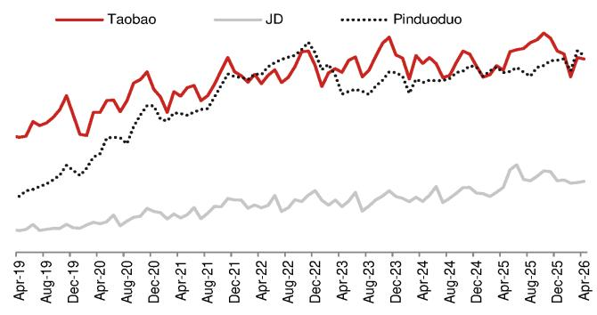

line

| Date    | Taobao | JD   | Pinduoduo |
|---------|--------|------|-----------|
| Apr-19  |        |      |           |
| Aug-19  |        |      |           |
| Dec-19  |        |      |           |
| Apr-20  |        |      |           |
| Aug-20  |        |      |           |
| Dec-20  |        |      |           |
| Apr-21  |        |      |           |
| Aug-21  |        |      |           |
| Dec-21  |        |      |           |
| Apr-22  |        |      |           |
| Aug-22  |        |      |           |
| Dec-22  |        |      |           |
| Apr-23  |        |      |           |
| Aug-23  |        |      |           |
| Dec-23  |        |      |           |
| Apr-24  |        |      |           |
| Aug-24  |        |      |           |
| Dec-24  |        |      |           |
| Apr-25  |        |      |           |
| Aug-25  |        |      |           |
| Dec-25  |        |      |           |
| Apr-26  |        |      |           |

Source: QuestMobile, NOM

Fig. 26: Average daily time spent per user   
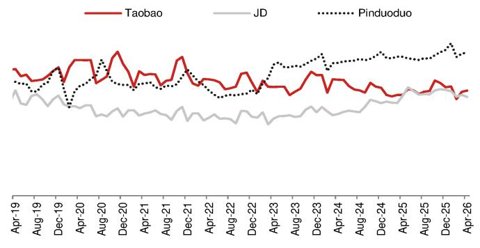

line

| Date   | Taobao | JD   | Pinduoduo |
|--------|--------|------|-----------|
| Apr-19 |        |      |           |
| Aug-19 |        |      |           |
| Dec-19 |        |      |           |
| Apr-20 |        |      |           |
| Aug-20 |        |      |           |
| Dec-20 |        |      |           |
| Apr-21 |        |      |           |
| Aug-21 |        |      |           |
| Dec-21 |        |      |           |
| Apr-22 |        |      |           |
| Aug-22 |        |      |           |
| Dec-22 |        |      |           |
| Apr-23 |        |      |           |
| Aug-23 |        |      |           |
| Dec-23 |        |      |           |
| Apr-24 |        |      |           |
| Aug-24 |        |      |           |
| Dec-24 |        |      |           |
| Apr-25 |        |      |           |
| Aug-25 |        |      |           |
| Dec-25 |        |      |           |
| Apr-26 |        |      |           |

Source: QuestMobile, NOM

Fig. 27: Number of users with daily time spent at <1 minute   
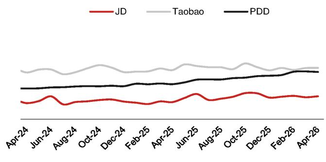

line

| Month   | JD    | Taobao | PDD   |
|---------|-------|--------|-------|
| Apr-24  |       |        |       |
| Jun-24  |       |        |       |
| Aug-24  |       |        |       |
| Oct-24  |       |        |       |
| Dec-24  |       |        |       |
| Feb-25  |       |        |       |
| Apr-25  |       |        |       |
| Jun-25  |       |        |       |
| Aug-25  |       |        |       |
| Oct-25  |       |        |       |
| Dec-25  |       |        |       |
| Feb-26  |       |        |       |
| Apr-26  |       |        |       |

Source: QuestMobile, NOM

Fig. 28: Number of users with daily time spent at >1 minute   
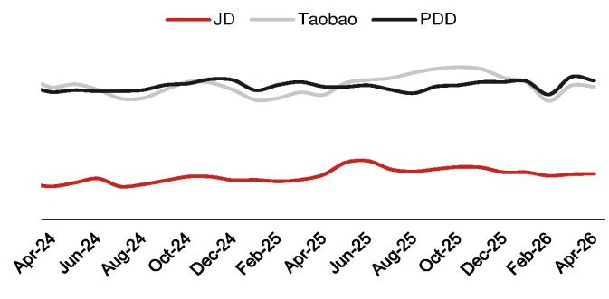

line

| Date   | JD    | Taobao | PDD   |
|--------|-------|--------|-------|
| Apr-24 |       |        |       |
| Jun-24 |       |        |       |
| Aug-24 |       |        |       |
| Oct-24 |       |        |       |
| Dec-24 |       |        |       |
| Feb-25 |       |        |       |
| Apr-25 |       |        |       |
| Jun-25 |       |        |       |
| Aug-25 |       |        |       |
| Oct-25 |       |        |       |
| Dec-25 |       |        |       |
| Feb-26 |       |        |       |
| Apr-26 |       |        |       |

Source: QuestMobile, NOM

# O2O

The Meituan app recorded a 3% y-y decline in MTS in April, dragged by a 9% decline in DTSD, offsetting 7% growth in DAU. Dianping app (owned by Meituan) recorded a 1% decline in MTS, dragged by a 17% y-y decline in DTSD, offsetting 18% growth in DAU.

Fig. 29: DAUs of Meituan and Dianping   
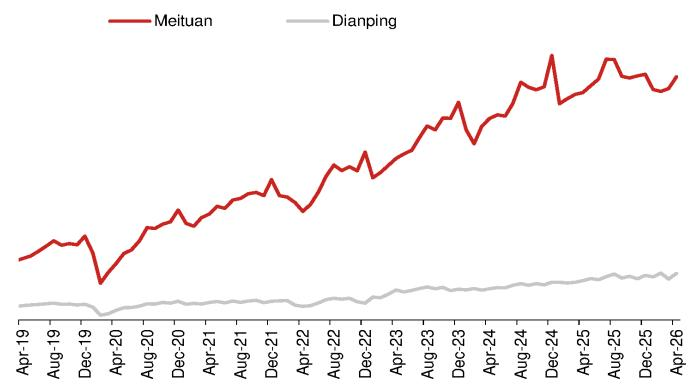

line

| Date    | Meituan | Dianping |
|---------|---------|----------|
| Apr-19  |         |          |
| Aug-19  |         |          |
| Dec-19  |         |          |
| Apr-20  |         |          |
| Aug-20  |         |          |
| Dec-20  |         |          |
| Apr-21  |         |          |
| Aug-21  |         |          |
| Dec-21  |         |          |
| Apr-22  |         |          |
| Aug-22  |         |          |
| Dec-22  |         |          |
| Apr-23  |         |          |
| Aug-23  |         |          |
| Dec-23  |         |          |
| Apr-24  |         |          |
| Aug-24  |         |          |
| Dec-24  |         |          |
| Apr-25  |         |          |
| Aug-25  |         |          |
| Dec-25  |         |          |
| Apr-26  |         |          |

Source: QuestMobile, NOM

Fig. 30: Average daily time spent per user   
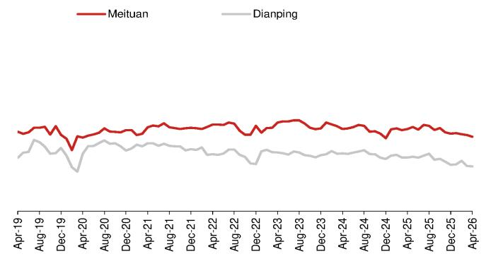

line

| Date    | Meituan | Dianping |
|---------|---------|----------|
| Apr-19  |         |          |
| Aug-19  |         |          |
| Dec-19  |         |          |
| Apr-20  |         |          |
| Aug-20  |         |          |
| Dec-20  |         |          |
| Apr-21  |         |          |
| Aug-21  |         |          |
| Dec-21  |         |          |
| Apr-22  |         |          |
| Aug-22  |         |          |
| Dec-22  |         |          |
| Apr-23  |         |          |
| Aug-23  |         |          |
| Dec-23  |         |          |
| Apr-24  |         |          |
| Aug-24  |         |          |
| Dec-24  |         |          |
| Apr-25  |         |          |
| Aug-25  |         |          |
| Dec-25  |         |          |
| Apr-26  |         |          |

Source: QuestMobile, NOM

# Mobile map apps

Total time spent on Baidu Maps (owned by Baidu) declined 11% y-y in April, dragged by a 6% decline in DTSD and a 5% decline in DAU. However, Amap (owned by BABA) recorded 4% y-y growth in April, mainly driven by a 5% y-y increase in DAU.

Fig. 31: DAUs of Baidu Maps and Amap   
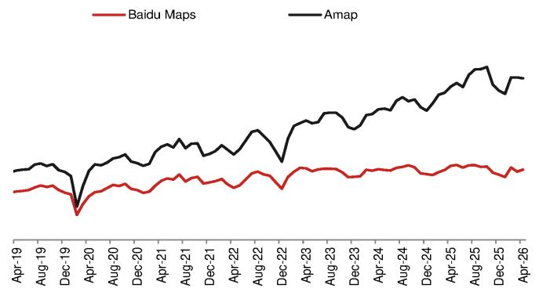

line

| Date    | Baidu Maps | Amap  |
|---------|------------|-------|
| Apr-19  |            |       |
| Aug-19  |            |       |
| Dec-19  |            |       |
| Apr-20  |            |       |
| Aug-20  |            |       |
| Dec-20  |            |       |
| Apr-21  |            |       |
| Aug-21  |            |       |
| Dec-21  |            |       |
| Apr-22  |            |       |
| Aug-22  |            |       |
| Dec-22  |            |       |
| Apr-23  |            |       |
| Aug-23  |            |       |
| Dec-23  |            |       |
| Apr-24  |            |       |
| Aug-24  |            |       |
| Dec-24  |            |       |
| Apr-25  |            |       |
| Aug-25  |            |       |
| Dec-25  |            |       |
| Apr-26  |            |       |

Source: QuestMobile, NOM

Fig. 32: Average daily time spent per user   
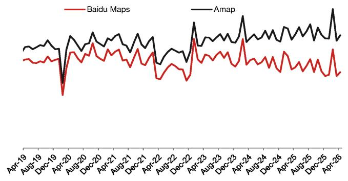

line

| Date    | Baidu Maps | Amap |
|---------|------------|------|
| Apr-19  |            |      |
| Aug-19  |            |      |
| Dec-19  |            |      |
| Apr-20  |            |      |
| Aug-20  |            |      |
| Dec-20  |            |      |
| Apr-21  |            |      |
| Aug-21  |            |      |
| Dec-21  |            |      |
| Apr-22  |            |      |
| Aug-22  |            |      |
| Dec-22  |            |      |
| Apr-23  |            |      |
| Aug-23  |            |      |
| Dec-23  |            |      |
| Apr-24  |            |      |
| Aug-24  |            |      |
| Dec-24  |            |      |
| Apr-25  |            |      |
| Aug-25  |            |      |
| Dec-25  |            |      |
| Apr-26  |            |      |

Source: QuestMobile, NOM

# Digital freight apps

On the shipper side, the MTS of YMM Shipper (owned by Full Truck Alliance, FTA [YMM US, Not rated]) and Huolala (unlisted) recorded 10% y-y and 17% y-y growth, respectively, in April. However, Huochebang Shipper (owned by FTA) recorded a 7% y-y decline in April, dragged by 5% decline in DAU and a 2% decline in DTSD.

On the driver side, YMM Driver (owned by FTA)/Huolala Driver (unlisted) recorded 21%/25% y-y growth in MTS in April, accelerating from 10%/14% y-y growth in March, mainly driven by 17%/10% y-y growth in DTSD. Huochebang Driver (owned by FTA) recorded a 2% y-y decline in MTS, mainly dragged by a 14% decline in DAU.

Fig. 33: DAUs of digital freight apps   
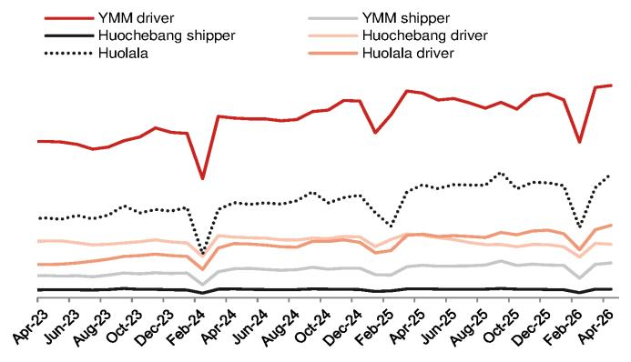

line

| Month    | YMM driver | Huochebang shipper | Huolala | YMM shipper | Huochebang driver | Huolala driver |
|----------|------------|--------------------|---------|-------------|-------------------|----------------|
| Apr-23   | ~1.0       | ~0.1               | ~0.8    | ~0.3        | ~0.5              | ~0.4           |
| Jun-23   | ~1.0       | ~0.1               | ~0.8    | ~0.3        | ~0.5              | ~0.4           |
| Aug-23   | ~1.0       | ~0.1               | ~0.8    | ~0.3        | ~0.5              | ~0.4           |
| Oct-23   | ~1.0       | ~0.1               | ~0.8    | ~0.3        | ~0.5              | ~0.4           |
| Dec-23   | ~1.0       | ~0.1               | ~0.8    | ~0.3        | ~0.5              | ~0.4           |
| Feb-24   | ~0.5       | ~0.1               | ~0.3    | ~0.3        | ~0.3              | ~0.2           |
| Apr-24   | ~1.0       | ~0.1               | ~0.8    | ~0.3        | ~0.5              | ~0.4           |
| Jun-24   | ~1.0       | ~0.1               | ~0.8    | ~0.3        | ~0.5              | ~0.4           |
| Aug-24   | ~1.0       | ~0.1               | ~0.8    | ~0.3        | ~0.5              | ~0.4           |
| Oct-24   | ~1.0       | ~0.1               | ~0.8    | ~0.3        | ~0.5              | ~0.4           |
| Dec-24   | ~1.0       | ~0.1               | ~0.8    | ~0.3        | ~0.5              | ~0.4           |
| Feb-25   | ~1.0       | ~0.1               | ~0.8    | ~0.3        | ~0.5              | ~0.4           |
| Apr-25   | ~1.0       | ~0.1               | ~0.8    | ~0.3        | ~0.5              | ~0.4           |
| Jun-25   | ~1.0       | ~0.1               | ~0.8    | ~0.3        | ~0.5              | ~0.4           |
| Aug-25   | ~1.0       | ~0.1               | ~0.8    | ~0.3        | ~0.5              | ~0.4           |
| Oct-25   | ~1.0       | ~0.1               | ~0.8    | ~0.3        | ~0.5              | ~0.4           |
| Dec-25   | ~1.0       | ~0.1               | ~0.8    | ~0.3        | ~0.5              | ~0.4           |
| Feb-26   | ~1.0       | ~0.1               | ~0.8    | ~0.3        | ~0.5              | ~0.4           |
| Apr-26   | ~1.0       | ~0.1               | ~0.8    | ~0.3        | ~0.5              | ~0.4           |

Source: QuestMobile, NOM

Fig. 34: Average daily time spent per user   
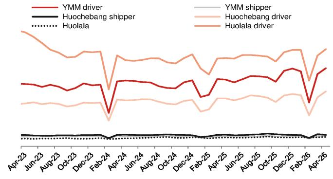

line

| Month    | YMM driver | Huochebang shipper | Huolala |
|----------|------------|--------------------|---------|
| Apr-23   | ~0.8       | ~0.1               | ~0.1    |
| Jun-23   | ~0.7       | ~0.1               | ~0.1    |
| Aug-23   | ~0.6       | ~0.1               | ~0.1    |
| Oct-23   | ~0.5       | ~0.1               | ~0.1    |
| Dec-23   | ~0.4       | ~0.1               | ~0.1    |
| Feb-24   | ~0.3       | ~0.1               | ~0.1    |
| Apr-24   | ~0.4       | ~0.1               | ~0.1    |
| Jun-24   | ~0.5       | ~0.1               | ~0.1    |
| Aug-24   | ~0.6       | ~0.1               | ~0.1    |
| Oct-24   | ~0.7       | ~0.1               | ~0.1    |
| Dec-24   | ~0.8       | ~0.1               | ~0.1    |
| Feb-25   | ~0.9       | ~0.1               | ~0.1    |
| Apr-25   | ~1.0       | ~0.1               | ~0.1    |
| Jun-25   | ~1.1       | ~0.1               | ~0.1    |
| Aug-25   | ~1.2       | ~0.1               | ~0.1    |
| Oct-25   | ~1.3       | ~0.1               | ~0.1    |
| Dec-25   | ~1.4       | ~0.1               | ~0.1    |
| Feb-26   | ~1.5       | ~0.1               | ~0.1    |
| Apr-26   | ~1.6       | ~0.1               | ~0.1    |

Source: QuestMobile, NOM

# Online recruitment apps

Boss Zhipin app (owned by Kanzhun [BZ US, Not rated]), a leading player in the online recruitment industry, recorded 10% y-y growth in MTS in April, driven by 9% y-y growth in DAU. The MTS of Zhaopin (unlisted) decreased 13% y-y in April, dragged by an 11% decline in DTSD and 3% drop in DAU. Another peer, 51Job (unlisted), reported an 8% y-y decline in MTS in April, dragged by a 2% y-y decline in DAU and a 7% y-y decline in DTSD.

Fig. 35: DAUs of online recruitment apps   
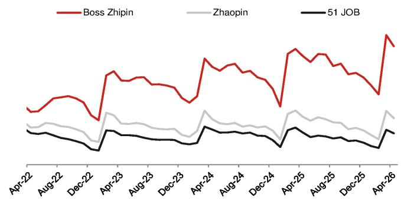

line

| Date   | Boss Zhipin | Zhaopin | 51 JOB |
|--------|-------------|---------|--------|
| Apr-22 | ~0.8        | ~0.6    | ~0.4   |
| Aug-22 | ~0.9        | ~0.7    | ~0.5   |
| Dec-22 | ~0.7        | ~0.5    | ~0.3   |
| Apr-23 | ~1.0        | ~0.8    | ~0.6   |
| Aug-23 | ~0.9        | ~0.7    | ~0.5   |
| Dec-23 | ~0.8        | ~0.6    | ~0.4   |
| Apr-24 | ~1.1        | ~0.9    | ~0.7   |
| Aug-24 | ~1.0        | ~0.8    | ~0.6   |
| Dec-24 | ~0.9        | ~0.7    | ~0.5   |
| Apr-25 | ~1.2        | ~0.9    | ~0.8   |
| Aug-25 | ~1.1        | ~0.8    | ~0.7   |
| Dec-25 | ~1.0        | ~0.7    | ~0.6   |
| Apr-26 | ~1.3        | ~0.9    | ~0.8   |

Source: QuestMobile, NOM

Fig. 36: Average daily time spent per user   
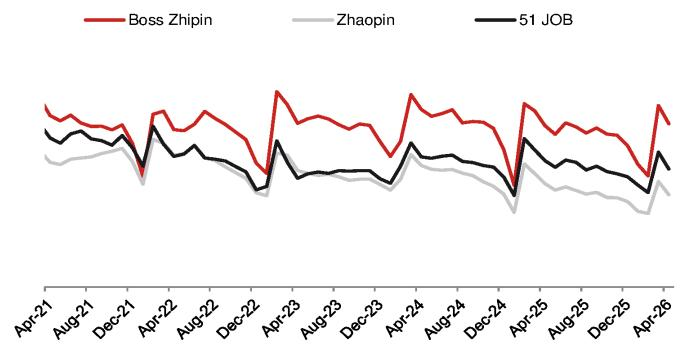

line

| Date    | Boss Zhipin | Zhaopin | 51 JOB |
|---------|-------------|---------|--------|
| Apr-21  | ~0.8        | ~0.6    | ~0.7   |
| Aug-21  | ~0.7        | ~0.5    | ~0.6   |
| Dec-21  | ~0.6        | ~0.4    | ~0.5   |
| Apr-22  | ~0.7        | ~0.5    | ~0.6   |
| Aug-22  | ~0.6        | ~0.4    | ~0.5   |
| Dec-22  | ~0.5        | ~0.3    | ~0.4   |
| Apr-23  | ~0.8        | ~0.5    | ~0.6   |
| Aug-23  | ~0.7        | ~0.4    | ~0.5   |
| Dec-23  | ~0.6        | ~0.3    | ~0.4   |
| Apr-24  | ~0.7        | ~0.4    | ~0.5   |
| Aug-24  | ~0.6        | ~0.3    | ~0.4   |
| Dec-24  | ~0.5        | ~0.2    | ~0.3   |
| Apr-25  | ~0.8        | ~0.4    | ~0.5   |
| Aug-25  | ~0.7        | ~0.3    | ~0.4   |
| Dec-25  | ~0.6        | ~0.2    | ~0.3   |
| Apr-26  | ~0.7        | ~0.3    | ~0.4   |

Source: QuestMobile, NOM

# Appendix A-1

This report has been produced by NOM International (Hong Kong) Ltd. (NIHK), Hong Kong.

See Disclaimers for NOM Group entity details.

# Analyst Certification

We, Rachel Guo and Jialong Shi, hereby certify (1) that the views expressed in this Research report accurately reflect our personal views about any or all of the subject securities or issuers referred to in this Research report, (2) no part of our compensation was, is or will be directly or indirectly related to the specific recommendations or views expressed in this Research report and (3) no part of our compensation is tied to any specific investment banking transactions performed by NOM Securities International, Inc., NOM International plc or any other NOM Group company.

# Important Disclosures

# Online availability of research and conflict-of-interest disclosures

NOM Group research is available on www.NOMnow.com/research, Bloomberg, Capital IQ, Factset, LSEG.

Important disclosures may be read at http://go.NOMnow.com/research/m/Disclosures or requested from NOM Securities International, Inc. If you have any difficulties with the website, please email grpsupport@NOM.com for help.

The analysts responsible for preparing this report have received compensation based upon various factors including the firm's total revenues, a portion of which is generated by Investment Banking activities. Unless otherwise noted, the non-US analysts listed at the front of this report are not registered/qualified as research analysts under FINRA rules, may not be associated persons of NSI, and may not be subject to FINRA Rule 2241 restrictions on communications with covered companies, public appearances, and trading securities held by a research analyst account.

NOM Global Financial Products Inc. (NGFP) NOM Derivative Products Inc. (NDP) and NOM International plc. (NIplc) are registered with the Commodities Futures Trading Commission and the National Futures Association (NFA) as swap dealers. NGFP, NDPI, and NIplc are generally engaged in the trading of swaps and other derivative products, any of which may be the subject of this report.

# Distribution of ratings (NOM Group)

The distribution of all ratings published by NOM Group Global Equity Research is as follows:

57% have been assigned a Buy rating which, for purposes of mandatory disclosures, are classified as a Buy rating; 34% of companies with this rating are investment banking clients of the NOM Group\*. 0% of companies (which are admitted to trading on a regulated market in the EEA) with this rating were supplied material services\*\* by the NOM Group.

41% have been assigned a Neutral rating which, for purposes of mandatory disclosures, is classified as a Hold rating; 57% of companies with this rating are investment banking clients of the NOM Group\*. 0% of companies (which are admitted to trading on a regulated market in the EEA) with this rating were supplied material services by the NOM Group

2% have been assigned a Reduce rating which, for purposes of mandatory disclosures, are classified as a Sell rating; 0% of companies with this rating are investment banking clients of the NOM Group\*. 0% of companies (which are admitted to trading on a regulated market in the EEA) with this rating were supplied material services by the NOM Group.

As at 31 March 2026.

\*The NOM Group as defined in the Disclaimer section at the end of this report.

\*\* As defined by the EU Market Abuse Regulation

# Definition of NOM Group's equity research rating system and sectors

The rating system is a relative system, indicating expected performance against a specific benchmark identified for each individual stock, subject to limited management discretion. An analyst's target price is an assessment of the current intrinsic fair value of the stock based on an appropriate valuation methodology determined by the analyst. Valuation methodologies include, but are not limited to, discounted cash flow analysis, expected return on equity and multiple analysis. Analysts may also indicate expected absolute upside/downside relative to the stated target price, defined as (target price - current price)/current price.

# STOCKS

A rating of 'Buy', indicates that the analyst expects the stock to outperform the Benchmark over the next 12 months. A rating of 'Neutral', indicates that the analyst expects the stock to perform in line with the Benchmark over the next 12 months. A rating of 'Reduce', indicates that the analyst expects the stock to underperform the Benchmark over the next 12 months. A rating of 'Suspended', indicates that the rating, target price and estimates have been suspended temporarily to comply with applicable regulations and/or firm policies. Securities and/or companies that are labelled as 'Not rated' or shown as 'No rating' are not in regular research coverage. Investors should not expect continuing or additional information from NOM relating to such securities and/or companies. Benchmarks are as follows: United States/Europe/Asia ex-Japan: please see valuation methodologies for explanations of relevant benchmarks for stocks, which can be accessed at: http://go.NOMnow.com/research/m/Disclosures; Global Emerging Markets (ex-Asia): MSCI Emerging Markets ex-Asia, unless otherwise stated in the valuation methodology; Japan: Russell/NOM Large Cap.

# SECTORS

A 'Bullish' stance, indicates that the analyst expects the sector to outperform the Benchmark during the next 12 months. A 'Neutral' stance, indicates that the analyst expects the sector to perform in line with the Benchmark during the next 12 months. A 'Bearish' stance, indicates that the analyst expects the sector to underperform the Benchmark during the next 12 months. Sectors that are labelled as 'Not rated' or shown as 'N/A' are not assigned ratings. Benchmarks are as follows: United States: S&P 500; Europe: Dow Jones STOXX 600; Global Emerging Markets (ex-Asia): MSCI Emerging Markets ex-Asia. Japan/Asia ex-Japan: Sector ratings are not assigned.

# Target Price

A Target Price, if discussed, indicates the analyst's forecast for the share price with a 12-month time horizon, reflecting in part the analyst's estimates for the company's earnings. The achievement of any target price may be impeded by general market and macroeconomic trends, and by other risks related to the company or the market, and may not occur if the company's earnings differ from estimates.

# Disclaimers

This publication contains material that has been prepared by the NOM Group entity identified on page 1 and, if applicable, with the contributions of one or more NOM Group entities whose employees and their respective affiliations are specified on page 1 or identified elsewhere in this publication. The term "NOM Group" used herein refers to NOM Holdings, Inc. and its affiliates and subsidiaries including: (a) NOM Securities Co., Ltd. ('NSC') Tokyo, Japan, (b) NOM Financial Products Europe GmbH ('NFPE'), Germany, (c) NOM International plc ('NIplc'), UK, (d) NOM Securities International, Inc. ('NSI'), New York, US, (e) NOM International (Hong Kong) Ltd. ('NIHK'), Hong Kong, (f) NOM Financial Investment (Korea) Co., Ltd. ('NFIK'), Korea (Information on NOM analysts registered with the Korea Financial Investment Association ('KOFIA') can be found on the KOFIA Intranet at http://dis.kofia.or.kr, (g) NOM Singapore Ltd. ('NSL'), Singapore (Registration number 197201440E, regulated by the Monetary Authority of Singapore) (h) NOM Australia Ltd. ('NAL'), Australia (ABN 48 003 032 513), regulated by the Australian Securities and Investment Commission ('ASIC') and holder of an Australian financial services licence number 246412, (i) NOM Securities Malaysia Sdn. Bhd. ('NSM'), Malaysia, (j) NIHK, Taipei Branch ('NITB'), Taiwan, (k) NOM Financial Advisory and Securities (India) Private Limited ('NFASL'), Mumbai, India (Registered Address: Ceejay House, Level 11, Plot F, Shivsagar Estate, Dr. Annie Besant Road, Worli, Mumbai- 400 018, India; Tel: 91 22 4037 4037, Fax: 91 22 4037 4111; CIN No: U74140MH2007PTC169116, SEBI Registration No. for Stock Broking activities : INZ000255633; SEBI Registration No. for Merchant Banking : INM000011419; SEBI Registration No. for Research: INH000001014 - Compliance Officer: Ms. Pratiksha Tondwalkar, 91 22 40374904, grievance email: investorgrievancesra@NOM.com Webpage: LINK

For reports with respect to Indian public companies or authored by India-based NFASL research analysts: (i) Investment in securities markets is subject to market risks. Read all the related documents carefully before investing. (ii) Registration granted by SEBI, and certification from NISM in no way guarantee performance of the intermediary or provide any assurance of returns to investors. (iii) NFASL terms and conditions for availing research services is disclosed on NFASL webpage.

(I) NOM Fiduciary Research & Consulting Co., Ltd. ('NFRC') Tokyo, Japan. (m) NOM Orient International Securities Co., Ltd ("NOI"), is a majority owned joint venture amongst NOM Group, Orient International (Holding) Co., Ltd, and Shanghai Huangpu Investment Holding (Group) Co., Ltd. In accordance with the laws of the People's Republic of China ("PRC", excluding Hong Kong, Macau and Taiwan, for the purpose of this document), NOI is licensed in the PRC to provide securities research and investment recommendations and it operates independently from the other members of the NOM Group; in particular, NOI's interests in PRC securities are not disclosed to, or aggregated with the holdings of, any other NOM Group entities and the interests in PRC securities of other NOM Group entities are not disclosed to, or aggregated with the holdings of, NOI. An individual name printed next to NOI on the front page of a research report indicates that individual is employed by NOI to provide research assistance to NIHK under a research partnership agreement. 'NSFSPL' next to an employee's name on the front page of a research report indicates that the individual is employed by NOM Structured Finance Services Private Limited to provide assistance to certain NOM entities under inter-company agreements. 'Verdhana' next to an individual's name on the front page of a research report indicates that the individual is employed by PT Verdhana Sekuritas Indonesia ('Verdhana') to provide research assistance to NIHK under a research partnership agreement and neither Verdhana nor such individual is licensed outside of Indonesia.

THIS MATERIAL IS: (I) FOR YOUR PRIVATE INFORMATION, AND WE ARE NOT SOLICITING ANY ACTION BASED UPON IT; (II) NOT TO BE CONSTRUED AS AN OFFER TO SELL OR A SOLICITATION OF AN OFFER TO BUY ANY SECURITIES IN ANY JURISDICTION WHERE SUCH OFFER OR SOLICITATION WOULD BE ILLEGAL; AND (III) OTHER THAN DISCLOSURES RELATING TO THE NOM GROUP, BASED UPON INFORMATION FROM SOURCES THAT WE CONSIDER RELIABLE, BUT HAS NOT BEEN INDEPENDENTLY VERIFIED BY NOM GROUP.

Other than disclosures relating to the NOM Group, the NOM Group does not warrant, represent or undertake, express or implied, that the document is fair, accurate, complete, correct, reliable or fit for any particular purpose or merchantable, and to the maximum extent permissible by law and/or regulation, does not accept liability (in negligence or otherwise, and in whole or in part) for any act (or decision not to act) resulting from use of this document and related data. To the maximum extent permissible by law and/or regulation, all warranties and other assurances by the NOM Group are hereby excluded and the NOM Group shall have no liability (in negligence or otherwise, and in whole or in part) for any loss howsoever arising from the use, misuse, or distribution of this material or the information contained in this material or otherwise arising in connection therewith.

Opinions or estimates expressed are current opinions as of the original publication date appearing on this material and the information, including the opinions and estimates contained herein, are subject to change without notice. The NOM Group, however, expressly disclaims any

obligation, and therefore is under no duty, to update or revise this document. Any comments or statements made herein are those of the author(s) and may differ from views held by other parties within NOM Group. Clients should consider whether any advice or recommendation in this report is suitable for their particular circumstances and, if appropriate, seek professional advice, including tax advice. The NOM Group does not provide tax advice.

The NOM Group, and/or its officers, directors, employees and affiliates, may, to the extent permitted by applicable law and/or regulation, deal as principal, agent, or otherwise, or have long or short positions in, or buy or sell, the securities, commodities or instruments, or options or other derivative instruments based thereon, of issuers or securities mentioned herein. The NOM Group companies may also act as market maker or liquidity provider (within the meaning of applicable regulations in the UK) in the financial instruments of the issuer. Where the activity of market maker is carried out in accordance with the definition given to it by specific laws and regulations of the US or other jurisdictions, this will be separately disclosed within the specific issuer disclosures.

This document may contain information obtained from third parties, including, but not limited to, ratings from credit ratings agencies such as Standard & Poor's. The NOM Group hereby expressly disclaims all representations, warranties or undertakings of originality, fairness, accuracy, completeness, correctness, merchantability or fitness for a particular purpose with respect to any of the information obtained from third parties contained in this material or otherwise arising in connection therewith, and shall not be liable (in negligence or otherwise, and in whole or in part) for any direct, indirect, incidental, exemplary, compensatory, punitive, special or consequential damages, costs, expenses, legal fees, or losses (including lost income or profits and opportunity costs) in connection with any use or misuse of any of the information obtained from third parties contained in this material or otherwise arising in connection therewith. Reproduction and distribution of third-party content in any form is prohibited except with the prior written permission of the related third-party. Third-party content providers do not, express or implied, guarantee the fairness, accuracy, completeness, correctness, timeliness or availability of any information, including ratings, and are not in any way responsible for any errors or omissions (negligent or otherwise), regardless of the cause, or for the results obtained from the use or misuse of such content. Third-party content providers give no express or implied warranties, including, but not limited to, any warranties of merchantability or fitness for a particular purpose or use. Third-party content providers shall not be liable (in negligence or otherwise, and in whole or in part) for any direct, indirect, incidental, exemplary, compensatory, punitive, special or consequential damages, costs, expenses, legal fees, or losses (including lost income or profits and opportunity costs) in connection with any use or misuse of their content, including ratings. Credit ratings are statements of opinions and are not statements of fact or recommendations to purchase hold or sell securities. They do not address the suitability of securities or the suitability of securities for investment purposes, and should not be relied on as investment advice. Any MSCI sourced information in this document is the exclusive property of MSCI Inc. ('MSCI'). Without prior written permission of MSCI, this information and any other MSCI intellectual property may not be duplicated, reproduced, re-disseminated, redistributed or used, in whole or in part, for any purpose whatsoever, including creating any financial products and any indices. This information is provided on an "as is" basis. The user assumes the entire risk of any use made of this information. MSCI, its affiliates and any third party involved in, or related to, computing or compiling the information hereby expressly disclaim all representations, warranties or undertakings of originality, fairness, accuracy, completeness, correctness, merchantability or fitness for a particular purpose with respect to any of this material or the information contained in this material or otherwise arising in connection therewith. Without limiting any of the foregoing, in no event shall MSCI, any of its affiliates or any third party involved in, or related to, computing or compiling the information have any liability (in negligence or otherwise, and in whole or in part) for any damages of any kind. MSCI and the MSCI indexes are services marks of MSCI and its affiliates.

The intellectual property rights and any other rights, in Russell/NOM Japan Equity Index belong to NOM Fiduciary Research & Consulting Co., Ltd. ("NFRC") and FTSE Russell ("Russell"). NFRC and Russell do not guarantee fairness, accuracy, completeness, correctness, reliability, usefulness, marketability, merchantability or fitness of the Index, and do not account for business activities or services that any index user and/or its affiliates undertakes with the use of the Index.

Investors should consider this document as only a single factor in making their investment decision and, as such, the report should not be viewed as identifying or suggesting all risks, direct or indirect, that may be associated with any investment decision. NOM Group produces a number of different types of research product including, among others, fundamental analysis and quantitative analysis; recommendations contained in one type of research product may differ from recommendations contained in other types of research product, whether as a result of differing time horizons, methodologies or otherwise. The NOM Group publishes research product in a number of different ways including the posting of product on the NOM Group portals and/or distribution directly to clients. Different groups of clients may receive different products and services from the research department depending on their individual requirements.

Figures presented herein may refer to past performance or simulations based on past performance which are not reliable indicators of future or likely performance. Where the information contains an expectation, projection or indication of future performance and business prospects, such forecasts may not be a reliable indicator of future or likely performance. Moreover, simulations are based on models and simplifying assumptions which may oversimplify and not reflect the future distribution of returns. Any figure, strategy or index created and published for illustrative purposes within this document is not intended for “use” as a “benchmark” as defined by the European Benchmark Regulation.

Certain securities are subject to fluctuations in exchange rates that could have an adverse effect on the value or price of, or income derived from, the investment.

With respect to Fixed Income Research: Recommendations fall into two categories: tactical, which typically last up to three months; or strategic, which typically last from 6-12 months. However, trade recommendations may be reviewed at any time as circumstances change. 'Stop loss' levels for trades are also provided; which, if hit, closes the trade recommendation automatically. Prices and yields shown in recommendations are taken at the time of submission for publication and are based on either indicative Bloomberg, LSEG or NOM prices and yields at that time. The prices and yields shown are not necessarily those at which the trade recommendation can be implemented.

The securities described herein may not have been registered under the US Securities Act of 1933 (the ‘1933 Act’), and, in such case, may not be offered or sold in the US or to US persons unless they have been registered under the 1933 Act, or except in compliance with an exemption from the registration requirements of the 1933 Act. Unless governing law permits otherwise, any transaction should be executed via a NOM entity in your home jurisdiction.

This document has been approved for distribution in the UK as investment research by NIplc. NIplc is authorised by the Prudential Regulation Authority and regulated by the Financial Conduct Authority and the Prudential Regulation Authority. NIplc is a member of the London Stock

Exchange. This document does not constitute a personal recommendation within the meaning of applicable regulations in the UK, or take into account the particular investment objectives, financial situations, or needs of individual investors. This document is intended only for investors who are 'eligible counterparties' or 'professional clients' for the purposes of applicable regulations in the UK, and may not, therefore, be redistributed to persons who are 'retail clients' for such purposes.

This document has been approved for distribution in the European Economic Area as investment research by NOM Financial Products Europe GmbH (“NFPE”). NFPE is a company organized as a limited liability company under German law registered in the Commercial Register of the Court of Frankfurt/Main under HRB 110223. NFPE is authorized and regulated by the German Federal Financial Supervisory Authority (BaFin).

This document has been approved by NIHK, which is regulated by the Hong Kong Securities and Futures Commission, for distribution in Hong Kong by NIHK. This document is intended only for investors who are 'professional investors' for the purposes of applicable regulations in Hong Kong and may not, therefore, be redistributed to persons who are not 'professional investors' for such purposes.

This document has been approved for distribution in Australia by NAL, which is authorized and regulated in Australia by the ASIC. This document has also been approved for distribution in Malaysia by NSM.

In Singapore, this document has been distributed by NSL, an exempt financial adviser as defined under the Financial Advisers Act (Chapter 110), among other things, and regulated by the Monetary Authority of Singapore. NSL may distribute this document produced by its foreign affiliates pursuant to an arrangement under Regulation 32C of the Financial Advisers Regulations. This document is intended for accredited, expert or institutional investors as defined by the Securities and Futures Act (Chapter 289). Where the recipient of this document is not an accredited, expert or institutional investor, NSL accepts legal responsibility for the contents of this document in respect of such recipient only to the extent required by law. Recipients of this document in Singapore should contact NSL in respect of matters arising from, or in connection with, this document. THIS DOCUMENT IS INTENDED FOR GENERAL CIRCULATION. IT DOES NOT TAKE INTO ACCOUNT THE SPECIFIC INVESTMENT OBJECTIVES, FINANCIAL SITUATION OR PARTICULAR NEEDS OF ANY PARTICULAR PERSON. RECIPIENTS SHOULD TAKE INTO ACCOUNT THEIR SPECIFIC INVESTMENT OBJECTIVES, FINANCIAL SITUATION OR PARTICULAR NEEDS BEFORE MAKING A COMMITMENT TO PURCHASE ANY SECURITIES, INCLUDING SEEKING ADVICE FROM AN INDEPENDENT FINANCIAL ADVISER REGARDING THE SUITABILITY OF THE INVESTMENT, UNDER A SEPARATE ENGAGEMENT, AS THE RECIPIENT DEEMS FIT. Unless prohibited by the provisions of Regulation S of the 1933 Act, this material is distributed in the US, by NSI, a US-registered broker-dealer, which accepts responsibility for its contents in accordance with the provisions of Rule 15a-6, under the US Securities Exchange Act of 1934. The entity that prepared this document permits its separately operated affiliates within the NOM Group to make copies of such documents available to their clients.

This document has not been approved for distribution to persons other than ‘Authorised Persons’, ‘Exempt Persons’ or ‘Institutions’ (as defined by the Capital Markets Authority) in the Kingdom of Saudi Arabia (‘Saudi Arabia’) or a ‘Market Counterparty’ or a ‘Professional Client’ (as defined by the Dubai Financial Services Authority) in the United Arab Emirates (‘UAE’) or a ‘Market Counterparty’ or a ‘Business Customer’ (as defined by the Qatar Financial Centre Regulatory Authority) in the State of Qatar (‘Qatar’) by NOM Saudi Arabia, NIplc or any other member of the NOM Group, as the case may be. Neither this document nor any copy thereof may be taken or transmitted or distributed, directly or indirectly, by any person other than those authorised to do so into Saudi Arabia or in the UAE or in Qatar or to any person other than ‘Authorised Persons’, ‘Exempt Persons’ or ‘Institutions’ located in Saudi Arabia or a ‘Market Counterparty’ or a ‘Professional Client’ in the UAE or a ‘Market Counterparty’ or a ‘Business Customer’ in Qatar. Any failure to comply with these restrictions may constitute a violation of the laws of the UAE or Saudi Arabia or Qatar.

For report with reference of TAIWAN public companies or authored by Taiwan based research analyst:

THIS DOCUMENT IS SOLELY FOR REFERENCE ONLY. You should independently evaluate the investment risks and are solely responsible for your investment decisions. NO PORTION OF THE REPORT MAY BE REPRODUCED OR QUOTED BY THE PRESS OR ANY OTHER PERSON WITHOUT WRITTEN AUTHORIZATION FROM NOM GROUP. Pursuant to Operational Regulations Governing Securities Firms Recommending Trades in Securities to Customers and/or other applicable laws or regulations in Taiwan, you are prohibited to provide the reports to others (including but not limited to related parties, affiliated companies and any other third parties) or engage in any activities in connection with the reports which may involve conflicts of interests. INFORMATION ON SECURITIES / INSTRUMENTS NOT EXECUTABLE BY NOM INTERNATIONAL (HONG KONG) LTD., TAIPEI BRANCH IS FOR INFORMATIONAL PURPOSES ONLY AND IS NOT BE CONSTRUED AS A RECOMMENDATION OR A SOLICITATION TO TRADE IN SUCH SECURITIES / INSTRUMENTS.

This material may not be distributed in Indonesia or passed on within the territory of the Republic of Indonesia or to persons who are Indonesian citizens (wherever they are domiciled or located) or entities of or residents in Indonesia in a manner which constitutes a public offering under the laws of the Republic of Indonesia. The securities mentioned in this document may not be offered or sold in Indonesia or to persons who are citizens of Indonesia (wherever they are domiciled or located) or entities of or residents in Indonesia in a manner which constitutes a public offering under the laws of the Republic of Indonesia.

An individual name printed next to NOI on the front page of a research report indicates that this document is a translation of a research report issued by NOI in the PRC. In all other cases, this document is prepared by NOM Group or its subsidiary or affiliate (collectively, “Offshore Issuers”) that is not licensed in the PRC to provide securities research. This research report is not approved or intended to be circulated in the PRC. The A-share related analysis (if any) is not produced for any persons located or incorporated in the PRC. The recipients should not rely on any information contained in this research report in making investment decisions and Offshore Issuers take no responsibility in this regard. NO PART OF THIS MATERIAL MAY BE (I) COPIED, PHOTOCOPIED, REPRODUCED OR DUPLICATED IN ANY FORM, BY ANY MEANS; OR (II) REDISSEMINATED, REPUBLISHED OR REDISTRIBUTED WITHOUT THE PRIOR WRITTEN CONSENT OF A MEMBER OF THE NOM GROUP. If this document has been distributed by electronic transmission, such as e-mail, then such transmission cannot be guaranteed to be secure or error-free as information could be intercepted, corrupted, lost, destroyed, arrive late or incomplete, or contain viruses. The sender therefore does not accept liability (in negligence or otherwise, and in whole or in part) for any errors or omissions in the contents of this document, which may arise as a result of electronic transmission. If verification is required, please request a hard-copy version.

The NOM Group manages conflicts with respect to the production of research through its compliance policies and procedures (including, but not limited to, Conflicts of Interest, Chinese Wall and Confidentiality policies) as well as through the maintenance of Chinese Walls and employee training.

Additional information regarding the methodologies or models used in the production of any investment recommendations contained within this document is available upon request by contacting the Research Analysts of NOM listed on the front page. Disclosures information is available upon request and disclosure information is available at the NOM Disclosure web page:

http://go.NOMnow.com/research/m/Disclosures

Copyright © 2026 NOM International (Hong Kong) Ltd., Hong Kong. All rights reserved.