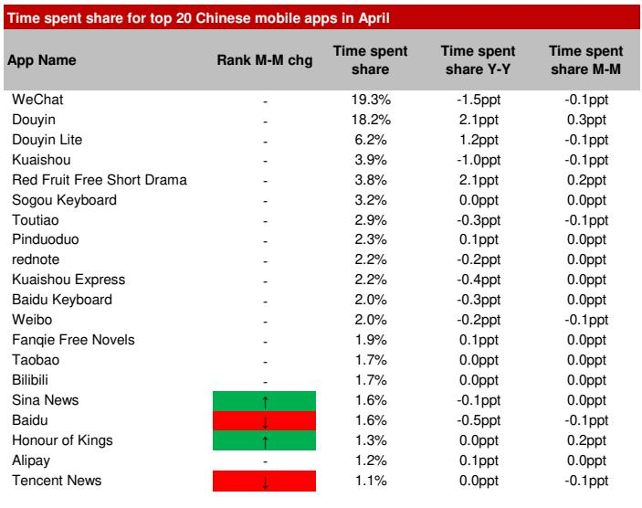
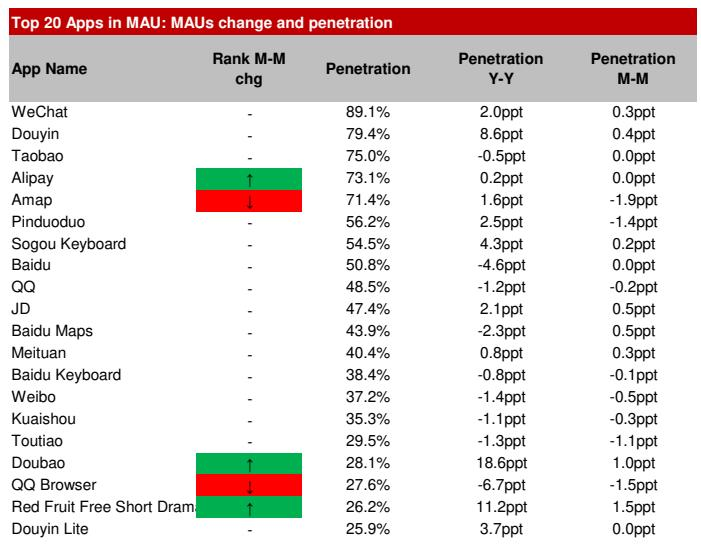
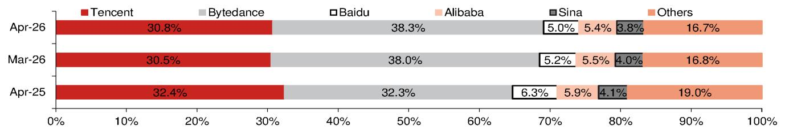

# ByteDance Is Not Just Winning the Attention War—It Is Redefining the Battlefield

In April 2026, China's mobile internet reached a deceptively quiet milestone. Monthly active smartphone users ticked up just 1.5% year-on-year to 1.28 billion, a figure that has barely budged in recent months. The total time spent on mobile, however, surged 10.3% year-on-year. This divergence—stagnant users but expanding engagement—signals that the Chinese internet has entered a phase where growth is no longer about acquiring new users but about capturing a larger share of each user's finite daily minutes.

That battle for time-share is being won decisively by one company. ByteDance's stable of apps now commands 38.3% of all time spent among China's top 50 mobile applications, up from 32.3% just one year ago. Tencent's ecosystem, by contrast, has slipped to 30.8%. This six-percentage-point swing in a single year is not incremental drift; it is a structural reordering of China's digital economy.

The narrative emerging from the latest monthly app tracker is not simply that ByteDance is gaining share. It is that ByteDance is systematically dismantling the competitive moats of established players across multiple verticals simultaneously—music streaming, digital reading, short-form drama, and local services—while its core video platform continues to widen its lead. The company is executing a playbook that combines traffic leverage from Douyin with a willingness to prioritize user engagement over near-term monetization. For every incumbent facing a declining user base, the strategic question is no longer how to win but how to avoid being swept aside.

## ByteDance's Multi-Vertical Expansion Is Not Opportunistic—It Is a Coordinated Strategy to Own User Attention at Every Layer

The conventional view of ByteDance's expansion treats each new app launch as a separate experiment. The data from April suggests otherwise. ByteDance is now present across online video, music streaming, digital reading, group buying, and text-to-video generation, and in nearly every category, its apps are growing at rates that far outpace incumbents.

Consider music streaming. ByteDance's Soda Music grew its monthly time spent by 131% year-on-year in April, while Tomato Music grew 77%. In contrast, Tencent Music's three flagship apps—Kugou, QQ Music, and Kuwo—saw declines of 14%, 11%, and 9%, respectively. On a daily active user basis, Soda Music has surpassed QQ Music to become China's largest music streaming platform. This is not a niche player nibbling at the edges; it is a direct displacement of a previously dominant incumbent.

The pattern repeats in digital reading. ByteDance's Tomato Free Novels grew time spent 15% year-on-year, while China Literature's paid platforms—Qidian Reading and QQ Reading—declined 21% and 17%. In short-form drama, ByteDance's Red Fruit app expanded time spent 145% year-on-year, while every major long-form video platform experienced double-digit declines. Even in group buying, ByteDance's newly launched Dou Sheng Sheng app doubled its monthly time spent in April alone, reaching 16% of Dianping's level.

The common thread across these verticals is not a single killer feature or superior content library. It is ByteDance's ability to cross-leverage Douyin's massive user base and its advertising-driven monetization model. By subsidizing consumption through ad revenue rather than charging subscription fees, ByteDance can offer free or lower-cost alternatives that draw users away from paid platforms. This is a structural advantage that incumbents cannot easily replicate without cannibalizing their existing revenue streams.

## The Text-to-Video Race Is Heating Up, But the Revenue Story Is More Complex Than the Headlines Suggest

Kuaishou's Kling and ByteDance's Jimeng have both shown strong momentum in text-to-video generation, with gross revenue growing 10% and 12% month-on-month in April, respectively. The recent surge in Kling's weekly revenue, driven by the viral Korean Baseball effect, highlights how quickly consumer-facing AI applications can gain traction. But the underlying revenue picture is more nuanced than the top-line growth suggests.

A meaningful portion of both apps' revenue flows through third-party LLM API aggregation platforms, which dilute the revenue share captured by the mobile apps themselves. Moreover, both applications likely derive the majority of their revenue from web versions, where the desktop interface enables a better user experience for video generation. The mobile app data, while useful for tracking user adoption trends, may significantly understate the true scale of engagement.

Most importantly, ByteDance's Seedance 2.0 video model is embedded not only in Jimeng but also in CapCut, ByteDance's flagship video-editing app. CapCut's monthly gross billing in April was 27 times that of Kling. This means that the competitive landscape in text-to-video is not simply a two-player race between Kling and Jimeng. ByteDance has already integrated its video generation capabilities into a product with an established user base and monetization engine. The question for Kuaishou is whether Kling can build a standalone user base before ByteDance's broader ecosystem absorbs the category entirely.

## The Travel Sector's Weakness Is a Leading Indicator of Broader Consumption Pressure

Travel apps have historically been a bellwether for consumer discretionary spending in China. The April data raises a cautionary flag. Ctrip's DAU fell 3% year-on-year, Qunar dropped 7%, and Fliggy declined 9%. Only the state-backed ticketing app Umetrip recorded growth, and even that decelerated to 14%. This weakness is not seasonal; it reflects a structural softening in consumer travel demand.

The domestic air fuel surcharge increases implemented in early April are a proximate cause, and with further increases announced for May, the year-on-year declines are likely to persist. But the pattern is worth examining more closely. User engagement in travel is declining even as overall mobile time spent continues to grow. This suggests that consumers are not simply substituting one form of travel engagement for another; they are reallocating time away from travel planning and booking entirely.

For investors, this raises a second-order question: Is travel a leading indicator for other discretionary categories? If consumers are pulling back on trip planning, they may also be reducing spending on other non-essential services. The travel weakness, combined with the broader shift toward free, ad-supported entertainment platforms, paints a picture of a consumer base that is becoming more price-sensitive and less willing to pay for premium experiences.

## ByteDance's Playbook Raises a Strategic Dilemma for Incumbents That the Report Does Not Fully Resolve

The data presents a clear picture of ByteDance's momentum, but it leaves several critical questions unanswered. The most important of these is whether ByteDance's low-monetization strategy is sustainable. By prioritizing user engagement over direct revenue, ByteDance is effectively trading short-term profitability for long-term market share. This works as long as the company can continue to fund these investments through advertising revenue from Douyin. But advertising markets are cyclical, and Douyin itself faces eventual saturation.

A second unresolved question concerns the gaming vertical. ByteDance has swept across online video, music, reading, and local services, but gaming remains a notable gap. Tencent's Honor of Kings and NetEase's titles continue to dominate. Is gaming a vertical that ByteDance cannot crack due to its different user behavior and monetization dynamics, or is it simply a matter of time before the company applies its playbook there as well?

Third, the report does not fully address the regulatory dimension. ByteDance's growing dominance across multiple entertainment verticals is attracting increasing scrutiny. The company's share of time spent among top apps has risen from 32.3% to 38.3% in one year. At what point does this concentration trigger regulatory intervention, and how would the company's strategy need to adapt?

## A Decision Framework for Investors Navigating the ByteDance-Led Restructuring

For investors trying to make sense of these trends, the key is to differentiate between companies that are losing share due to cyclical factors and those that are facing structural displacement. The following framework can help guide that assessment.

First, assess whether the incumbent's core product is a substitute for a ByteDance offering. If users can easily replace the service with a free, ad-supported alternative from ByteDance, the risk of structural displacement is high. This applies to paid music streaming, paid digital reading, and subscription-based long-form video.

Second, evaluate the incumbent's ability to pivot without destroying its existing business model. Can a company like Tencent Music introduce a free, ad-supported tier without cannibalizing its subscription revenue? Can China Literature offer free novels while maintaining its paid ecosystem? The answer in most cases is no, which is why incumbents are losing share.

Third, look for moats that ByteDance cannot easily cross. Gaming may be one such moat, given its different engagement patterns and the importance of exclusive content. Enterprise services and cloud computing are another area where ByteDance has less presence. Incumbents that can retreat into these defensible positions may survive, but those that compete head-on in entertainment verticals are likely to continue losing ground.

Finally, monitor the travel and local services sectors as leading indicators. If ByteDance's Dou Sheng Sheng continues to gain traction against Meituan, and if travel weakness persists, it would suggest that the broader consumer environment is becoming more challenging for all players, not just those directly competing with ByteDance.

## The Full Picture Requires Going Beyond the Headline Numbers

The April app tracker reveals a Chinese internet that is being reshaped in real time. ByteDance's rise is not a story about a single product or a viral moment. It is a story about a company that has built a traffic engine powerful enough to subsidize entry into multiple industries simultaneously, and that is now using that engine to systematically displace incumbents across entertainment, reading, music, and local services.

But the data also raises questions that the headline numbers cannot answer. How sustainable is ByteDance's ad-funded model as it expands into more capital-intensive verticals? Will regulatory scrutiny eventually force the company to moderate its ambitions? And which incumbents have the strategic flexibility to adapt rather than be displaced?

These are the questions that demand a deeper look at the original charts and the full dataset behind the analysis. The monthly app tracker contains granular breakdowns of user behavior across dozens of apps, revealing patterns that are invisible in the aggregate numbers. For investors who want to understand which companies are positioned to survive the ByteDance-led restructuring and which are at risk of being swept aside, the full report provides the necessary detail.

Join the community to read the full report and review the original charts.

*This article is for learning and discussion only and does not constitute investment advice.*

Personal reading notes and learning share only. Not investment advice.

