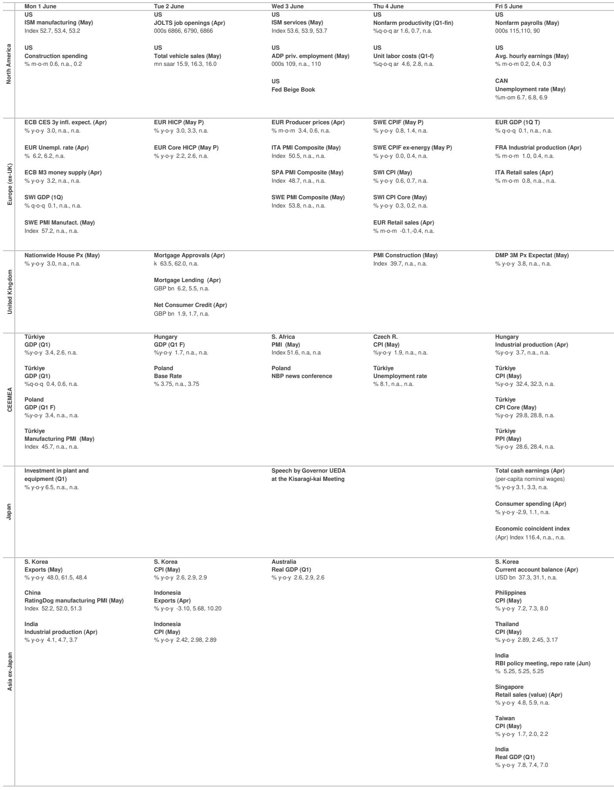
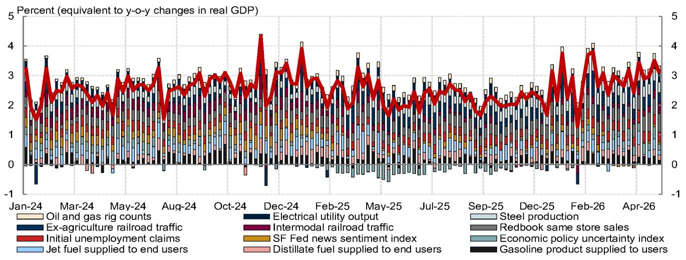
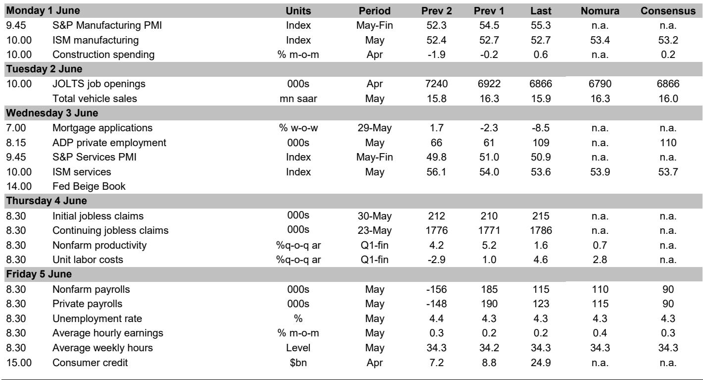

# Inflation Is No Longer Fading Quietly: The Fed Is Being Pushed Toward a Hike Debate It Did Not Expect

The dominant narrative entering 2026 was that the Federal Reserve had successfully threaded the needle—growth stabilizing, inflation cooling, rates on hold indefinitely. That narrative is now under serious strain. The latest data and Fed communication point to a more dangerous configuration: a labor market that refuses to soften, core inflation that is accelerating on a year-over-year basis, and a growing faction within the FOMC that is openly discussing the conditions under which they would support rate hikes. This is not a repeat of the 2022 panic. It is something more subtle and perhaps more insidious—a slow erosion of the disinflation thesis, masked by a few favorable monthly prints and an alternative inflation measure that may be giving policymakers false comfort.

The report we have analyzed makes a clear case that the balance of risks has shifted. Headline payrolls are expected to remain strong at 110,000 in May, with the three-month average rising to its highest level since December 2024. The unemployment rate is holding at 4.3 percent, and average hourly earnings are poised to rebound on favorable calendar effects. Meanwhile, core PCE inflation, despite a softer April print, actually accelerated on a year-over-year basis to 3.29 percent from 3.24 percent in March. The trimmed-mean PCE measure favored by Chair Warsh eased to 2.3 percent, but the report argues this gauge is understating underlying inflation by nearly 50 basis points. The combination of a resilient labor market and sticky inflation is exactly the scenario that forces central bankers to choose between patience and preemption.

The most striking signal in this week's data is not the inflation print itself but the shift in Fed language. Multiple officials, including Governor Cook, have introduced the word "timely" into their discussion of disinflation—a term historically associated with the hawkish wing of the committee. Cook, Waller, and Collins have all laid out timelines for when they would need to see inflation moderate to avoid considering rate increases. St. Louis Fed President Musalem went further, arguing that the real policy rate is below neutral and that a failure to see disinflation in the next one to two quarters would concern him. This is not the language of a committee that expects to remain on hold indefinitely. It is the language of a committee that is preparing the ground for a potential shift, even if the base case remains no change through next year.

## The Labor Market Is Not Softening Fast Enough to Give the Fed Cover

The single most important variable for the Fed's next move is the labor market, and the data here are unambiguous: employment growth remains elevated. The report forecasts nonfarm payrolls of 110,000 in May, which would bring the three-month average to 137,000—the strongest since December 2024. Private payrolls are expected to hold essentially flat at 115,000, down only modestly from 123,000 in April. This is not a labor market that is cooling in any meaningful sense. It is a labor market that has stabilized at a level that, combined with current inflation, keeps the Fed in a reactive posture.

The report notes that lead indicators such as ADP's weekly private employment measure and continuing jobless claims are pointing to accelerating job gains. The continuing claims data are particularly telling: they have stabilized close to a multi-year low, suggesting that workers who lose their jobs are finding new ones quickly. The report's forecast of a roughly sideways NFP reading this month is driven not by a broad-based slowdown but by mean-reversion in specific sectors that outperformed in March and April—retail trade and couriers and messengers. Meanwhile, construction and manufacturing payrolls are expected to remain strong. The composition of employment matters here: if the slowdown is concentrated in a few volatile sectors while core industries keep hiring, the underlying momentum is intact.

The unemployment rate is expected to remain at 4.3 percent, and the report's analysis of job loss measures paints a mixed picture. The four-week moving average for initial jobless claims reached a multi-year low during the May NFP reference week, which is a clear signal of labor market tightness. On the other hand, the April household survey and March JOLTS data point to a modest increase in job losses. This divergence is typical of a labor market that is not deteriorating but is also not generating enough slack to put downward pressure on wages. The report expects average hourly earnings to rebound to 0.4 percent month-over-month in May, driven by a favorable calendar effect that reverses the negative technical factor that weighed on April's reading. The report's judgment is clear: the recent slowdown in wage growth has been largely technical, and underlying wage pressures remain elevated.

For the Fed, this is a difficult configuration. A strong labor market is not inherently inflationary if productivity is rising, but the report highlights a growing skepticism among Fed officials about the productivity-led disinflation narrative. Governor Cook warned that AI investment could strengthen demand and exacerbate inflation pressures. St. Louis Fed President Musalem argued that evidence of sustained, disinflationary productivity gains remains limited and that a persistent increase in productivity would likely generate a stronger demand response that offsets supply-side cost relief. The implication is that the Fed cannot rely on productivity to solve its inflation problem, especially when the labor market is showing no signs of cracking.

## Core Inflation Is Sticky at Levels That Matter, and the Preferred Alternative Gauge Is Misleading

The April core PCE print of 0.24 percent month-over-month came in below consensus, but the report's deeper analysis reveals why this should not be read as good news. Prior-month revisions were slightly firmer, pushing year-over-year core PCE to 3.29 percent from 3.24 percent in March. The direction of travel is upward, not downward. The report identifies specific components that are likely to reverse in coming months: financial service prices, which declined in April, are expected to rebound given the recent strong performance of stock markets, and airline fares are expected to continue rising. Beyond May, the balance of risks is tilted to the upside due to higher energy prices, semiconductor shortages, and rising transportation costs.

The most analytically interesting part of the inflation discussion in this report concerns the trimmed-mean PCE measure, which Chair Warsh has highlighted as an alternative gauge of underlying inflation. This measure eased to 2.3 percent year-over-year in April, about a full percentage point below core PCE. If one takes this measure at face value, the inflation problem appears to be largely solved. The report argues forcefully that this is a mistake. In its calculation, the trimmed-mean PCE underestimates underlying inflation by 48 basis points on a year-over-year basis. The reason is that the trimmed-mean measure is slow to capture shifts in goods inflation dynamics and changes in the skewness of the inflation distribution. In plain language, when inflation becomes more broad-based and less driven by a few outlier categories, the trimmed-mean measure systematically understates the true pressure.

This is not a trivial technical debate. If the Fed's preferred alternative gauge is giving a false signal of disinflation, the committee risks falling behind the curve. The report notes that the trimmed-mean measure has not yet gained broad-based support on the FOMC to replace core PCE, but Governor Bowman has referenced it as a useful tool to look through increased volatility in recent inflation data. The risk is that a subset of policymakers becomes anchored to a measure that is telling them things are better than they actually are. The report's bias-adjusted estimate suggests that the true underlying inflation rate is closer to 2.8 percent, not 2.3 percent. That is still above target, and it is not declining.

## The Fed Is Debating the Conditions for Hikes, Not Just the Timing of Cuts

The shift in Fed communication over the past week is the most significant development in this report. It is not that the committee has moved to a hawkish stance. It is that the committee is now explicitly discussing the conditions under which it would move to a hawkish stance. Governor Cook's use of the word "timely" is a notable escalation, as the report points out, because this has historically been a talking point for FOMC hawks. Cook indicated that her base case is for rates to remain on hold, but she opened the door to tightening if the expected disinflation does not appear in a timely manner. Governor Waller and Boston Fed President Collins have used similar language, with Waller referring to "soon" and Collins to "in a timely manner."

St. Louis Fed President Musalem provided the most detailed framework for thinking about hikes. He argued that the real policy rate is currently below the FOMC's estimate of long-run neutral, which means that monetary policy is less restrictive than it appears on a nominal basis. He said that if he does not see disinflation in the next one to two quarters, that would concern him. This timeline is important because it suggests that the threshold for action is not immediate but is measured in months, not years. If inflation remains sticky through the summer and into the fall, the conversation could shift from hypotheticals to concrete proposals.

The dovish wing of the committee is not silent. New York Fed President Williams reiterated his view that policy remains slightly restrictive and that recent inflation pressures tied to energy shocks and tariffs should peak in coming months. Governor Bowman described monetary policy as moderately restrictive and attributed elevated inflation largely to higher energy prices. San Francisco Fed President Daly supported the wait-and-see strategy and expected crude oil prices to come down further. The committee is genuinely divided, but the direction of travel is clear: the hawks are gaining confidence, and the doves are becoming more conditional in their optimism.

## The Report Does Not Fully Answer One Critical Question: How Much Tightening Is Already Priced In

For all its analytical depth, the report leaves one question largely unanswered, and it is the question that matters most for investors: how much of this hawkish shift is already discounted by financial markets? The report provides detailed forecasts for payrolls, inflation, and GDP tracking, and it maps out the range of Fed views, but it does not offer a clear assessment of whether current market pricing is consistent with the risks it identifies. If the market is already pricing in a meaningful probability of a hike, then the marginal impact of further hawkish communication may be limited. If the market is still pricing in a prolonged hold, then the repricing risk is substantial.

This is not a criticism of the report, which is focused on economic data and Fed communication rather than market pricing. But for the strategic reader, this is the natural next question. The report's GDP tracking estimate stands at 2.4 percent for Q2, with real final sales to private domestic purchasers at 2.8 percent. These are not recessionary numbers. They are not even slow-growth numbers. They are numbers that, combined with sticky inflation and a tight labor market, argue for a policy rate that is higher than where it currently sits. The question is whether the market has already moved to price that in, or whether there is a gap between the economic reality and market expectations.

## A Decision Framework for Readers: Three Scenarios and Their Implications

The value of a report like this is not just in its data and analysis but in the framework it provides for thinking about the path ahead. Based on the report's findings, we can construct three scenarios that capture the range of plausible outcomes.

The first scenario is the base case embedded in the report's forecast: the Fed remains on hold through the end of next year. Inflation moderates gradually, the labor market cools without breaking, and the committee's patience is rewarded. In this scenario, the hawkish talk is precisely that—talk designed to keep financial conditions tight without the need for actual action. The risk to this scenario is that inflation does not moderate as expected, and the committee is forced to either act or lose credibility.

The second scenario is a delayed tightening cycle. Inflation remains sticky through the summer and into the fall. The trimmed-mean measure continues to understate true inflation, but core PCE stays above 3 percent. The labor market shows no signs of weakening. By the September or December meeting, a faction of the committee pushes for a hike, and the chair is forced to accommodate. In this scenario, the first hike comes later than markets expect, but the cumulative tightening is meaningful.

The third scenario is a credibility-driven preemptive move. The committee decides that the cost of waiting is too high, and it moves to hike before the data clearly justify it, in order to preserve its inflation-fighting reputation. This is the least likely scenario in the near term, but it is the scenario that would have the largest market impact. The report's discussion of the "timely" language suggests that some officials are already thinking along these lines.

For the strategic reader, the key insight is that the balance of risks has shifted from "when will the Fed cut" to "will the Fed need to hike." That shift has profound implications for asset allocation, duration positioning, and sector selection. The report provides the data to make that assessment. The decision framework is up to the reader.

## Join the Community to Read the Full Report and Review the Original Charts

The analysis above is based on a detailed parsing of one of the most important economic reports of the month, but it necessarily leaves out the granular data, the charts, and the full context that the original document provides. The report includes figures on continuing jobless claims, ADP private employment, labor demand measures, job loss rates, supercore PCE inflation components, and the bias adjustment to trimmed-mean inflation that is central to the argument. It also includes the full GDP tracking estimates and the week-ahead data previews that provide the near-term calendar for the next set of data points.

For readers who want to see the original charts, verify the data, and understand the full analytical chain that leads to the report's conclusions, the full document is essential. Join the community to read the full report and review the original charts.

*This article is for learning and discussion only and does not constitute investment advice.*

Personal reading notes and learning share only. Not investment advice.

