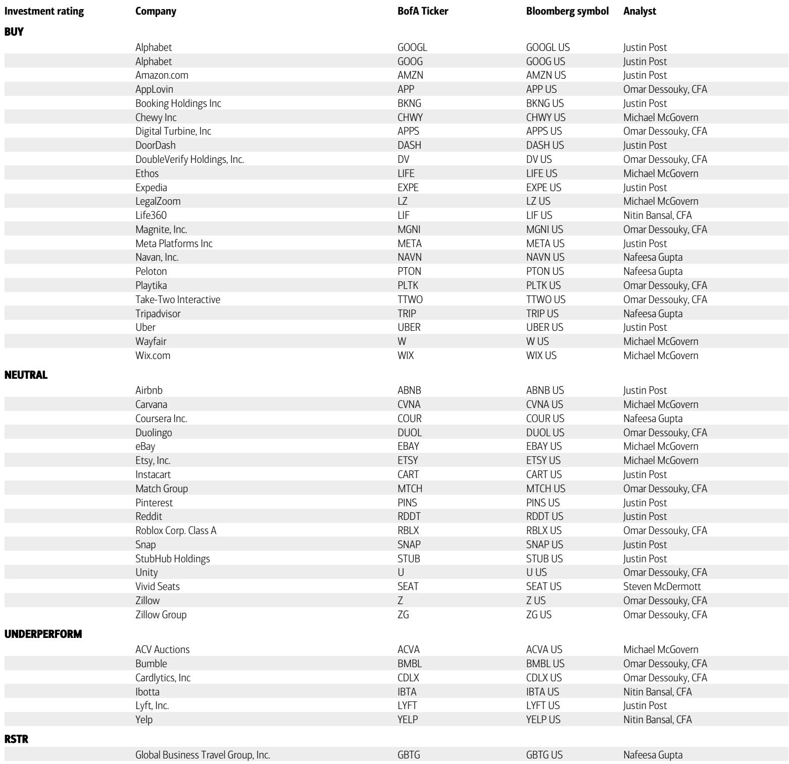
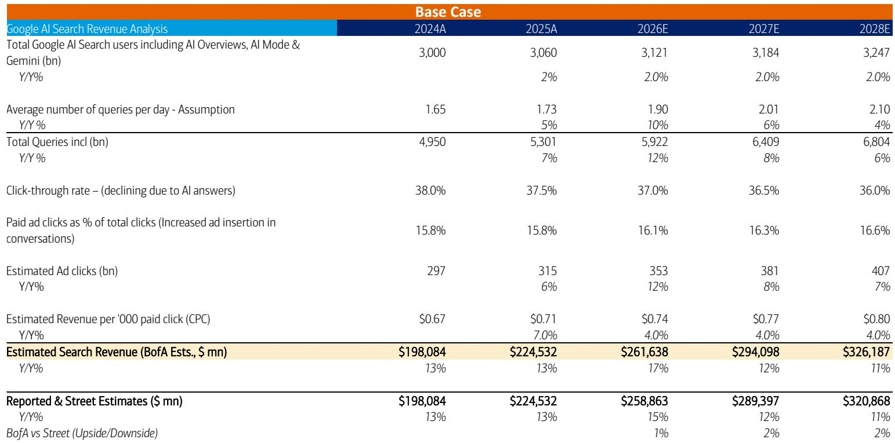
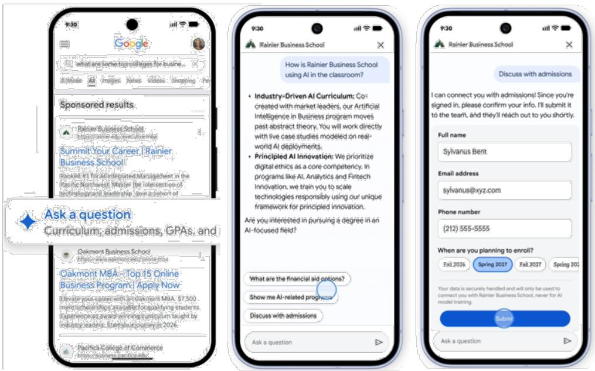

# Agentic AI Will Reshape the Internet's Economic Architecture, and Incumbents Must Act Now or Face Disintermediation

The internet is undergoing its most fundamental structural shift since the transition from dial-up to broadband, and this time the change is not about speed but about agency. The rise of conversational AI interfaces—ChatGPT, Gemini, Google AI Mode—has already begun to alter how consumers discover, evaluate, and transact online. But the next phase, Agentic AI, represents something far more consequential: a move from information retrieval to autonomous task execution. This is not merely an incremental product update; it is a re-architecting of the internet's value chain, where the economic center of gravity shifts from traffic generation to outcome delivery.

The implications for businesses are stark and immediate. Transaction-based verticals—eCommerce, online travel, financial services—must confront a future where the consumer's primary interface is no longer a search bar or a marketplace homepage, but an AI agent that plans, compares, and executes on their behalf. The question is not whether this transition will happen, but which platforms will control the decision engine, and which incumbents will be reduced to commodity suppliers in an agent-mediated economy. The report we draw upon makes clear that this transformation is already underway, with Google's AI Mode reaching one billion monthly users and query volumes doubling each quarter since launch. The window for strategic repositioning is narrowing.

## The Agentic Transition Moves Value from Traffic Generation to Outcome Delivery, Forcing a Reconsideration of Business Models

The traditional internet economy is built on a simple value proposition: generate traffic, capture intent, and monetize through advertising or transactions. This model has sustained giants like Google, Amazon, and Meta for decades. Agentic AI breaks this logic. When a consumer instructs an agent to "find me the best flight to London under $800 departing next Tuesday," the agent does not generate clicks or impressions in the traditional sense. It evaluates options, negotiates constraints, and completes the transaction—all within a single, contained interaction. The economic value that once accrued to multiple parties across the search-to-purchase funnel is now concentrated in the agent's decision engine.

This compression of the consumer journey has profound implications. In the traditional flow, a user might conduct multiple searches, visit several comparison sites, read reviews, and finally click through to a transaction site. Each step generated ad impressions, click-through revenue, and data. In the agentic flow, the user communicates intent once, the agent evaluates across sources, and the transaction is executed. The upper and mid-funnel—awareness and consideration—are absorbed into the agent's processing. The lower funnel—click, landing page, checkout—is completed natively within the platform. For businesses that depend on being discovered through search, this is an existential threat.

The report identifies that agentic systems can process significantly larger datasets than humans, optimize decisions across a broader set of variables, and learn from user behavior over time. This means that the agent's recommendations will be increasingly personalized and accurate, reducing the user's incentive to manually compare options. The implication is clear: any business that relies on being one of many options in a search results page must find a way to become the agent's preferred option—or risk invisibility.

## Marketplaces with Network Effects and Physical Differentiation Are Insulated, but Not Immune, from Agentic Disruption

Not all verticals face the same level of risk. The report usefully categorizes digital activities based on their structural suitability for agentic workflows. Digital and services categories—insurance, financial products, healthcare—are highly susceptible because transactions are digital, product attributes are comparable, and decision frameworks are standardized. An agent can easily compare insurance policies across providers and execute a purchase on behalf of a user. These verticals face rapid disintermediation if they do not develop their own agentic capabilities.

Conversely, categories with significant network effects or economies of scale—eCommerce, ride-sharing, restaurant and grocery delivery—are more insulated. The report argues that AI companies will need to partner with scaled platforms like Amazon or Walmart because these platforms offer unique value that agents cannot replicate: differentiated supply, one-hour delivery, and cost savings from network effects. An agent cannot secure exclusive inventory or build a logistics network overnight. These verticals have structural moats that protect them from pure disintermediation.

However, insulation is not immunity. The report warns that even network-effect-rich marketplaces must evolve their front-end AI experiences to maintain direct traffic. If consumers increasingly interact with agents rather than directly with marketplaces, the marketplace risks becoming a backend supplier—visible only through the agent's recommendation. The economic terms of such arrangements could shift dramatically. The report notes that transaction-based sites with proprietary user information, inventory, or customer service capabilities will need to carefully negotiate terms with agentic platforms to maintain favorable economics. This is not a hypothetical concern; it is a near-term strategic imperative.

Online travel occupies a "tweener" position. The complexity of travel planning—multi-leg itineraries, price optimization, timing constraints—makes it well-suited for agentic usage. Yet supply complexities and long-tail inventory fragmentation make full disintermediation difficult. The report suggests that online travel companies must evolve front-end interfaces, partner with activity and restaurant reservation sites, and incorporate agentic booking and trip monitoring capabilities. The message is clear: adapt your business model to the agentic paradigm, or watch your margins erode as agents capture the decision value.

## Google's Early Mover Advantage in Agentic Infrastructure Creates Ecosystem Lock-In Risks for Competitors

The report identifies Google as being in the pole position for the agentic era, citing its leading foundation models, time-to-market advantages, and deep merchant data. Google's recent announcements at I/O and Marketing Live reveal a comprehensive strategy to embed agentic capabilities directly into its search and advertising ecosystem. Three initiatives stand out: conversational AI ads integrated within AI-generated responses, AI-powered shopping ads that surface products alongside explanations, and a universal shopping cart that enables purchases directly within Google sites.

These moves are strategically coherent. By integrating real-time product data, capturing richer intent signals, and enabling native transactions, Google is building an agentic ecosystem that captures value at every stage of the consumer journey. The report notes that Google's early mover advantage could help establish ecosystem lock-in and guide behavioral defaults around agentic workflows. This is the classic platform play: once users become accustomed to completing transactions within Google's AI environment, the switching costs rise, and competitors face an uphill battle to reclaim user attention.

The implications for other platforms are significant. OpenAI, Meta, and Amazon also have large consumer audiences and deep AI capabilities, but they face different strategic challenges. Amazon, for instance, has a commerce-native advantage with proprietary product catalogs and logistics infrastructure, but it must ensure its agentic interfaces are compelling enough to keep users within its ecosystem. Meta has massive user engagement but lacks a native transaction infrastructure. The report expects strong innovation and competition across agentic ecosystems over the next two years, but the early mover advantage may prove decisive.

For businesses that depend on Google for traffic—which is nearly every digital business—this concentration of agentic capability raises uncomfortable questions. If Google's AI agent becomes the default decision engine for a significant portion of consumer transactions, businesses will find themselves negotiating with a platform that controls both the discovery layer and the transaction layer. The report does not fully explore the antitrust implications of this concentration, but the strategic risk is evident: dependence on a single agentic platform could replicate the dynamics of dependence on a single search engine, but with even less room for independent differentiation.

## The Report Leaves Unanswered Questions About Trust, Regulation, and the Pace of Consumer Adoption

The report is admirably clear about the technological trajectory of agentic AI, but it leaves several critical questions unresolved. The most significant concern trust. The report acknowledges that users must be comfortable allowing agents to make decisions or complete transactions on their behalf, and that for higher-value or sensitive activities, trust in the agent's incentives, transparency, and alignment with user outcomes will be critical. But it does not fully explore how this trust will be built, or what happens when agents make errors.

The reliability requirement is stringent. The report notes that even small error rates in decision-making or transaction execution could impact adoption, particularly for financial or mission-critical tasks. Yet the current generation of AI models is known for hallucination, inconsistent reasoning, and susceptibility to manipulation. The gap between current capabilities and the reliability required for autonomous financial transactions is substantial. The report's timeline suggests structured multi-step task execution by late 2026 or early 2027, but this may be optimistic if trust and reliability challenges prove more intractable than anticipated.

Regulatory uncertainty is another unresolved factor. The report notes that handling payments, personal data, and delegated decision-making authority introduces new regulatory and security considerations, but it does not speculate on how regulators might respond. Given the increasing scrutiny of AI systems in Europe and the United States, it is plausible that agentic AI platforms will face significant compliance requirements, particularly around data privacy, algorithmic transparency, and liability for autonomous decisions. These regulatory costs could slow adoption or reshape the competitive landscape in ways that the report does not model.

Finally, the report's adoption timeline assumes a relatively smooth progression from early experimentation to widespread use. But consumer behavior is notoriously sticky. The report itself notes that eCommerce, after thirty years, still has only twenty percent penetration in the United States. The shift to agentic workflows requires not just technological capability, but a fundamental change in how consumers approach online tasks. Many users may prefer to retain manual control, particularly for high-stakes decisions. The report's assumption that agents will significantly increase internet utility is plausible, but it does not account for the inertia of existing habits.

## A Decision Framework for Incumbents: Three Strategic Levers to Manage Agentic Risk

For business leaders reading this analysis, the key question is not whether agentic AI will matter, but what to do about it now. Based on the report's logic, three strategic levers emerge for incumbents in transaction-based verticals.

First, invest in proprietary front-end AI experiences. The report emphasizes that marketplaces and transaction sites must build their own AI chat and downstream agentic capabilities to maintain direct consumer relevance. If your customers interact with your brand through a third-party agent, you lose control over the relationship, the data, and the economics. Building a compelling AI interface that users choose to interact with directly is the strongest defense against disintermediation.

Second, deepen structural differentiation in supply, service, and logistics. The report argues that AI cannot replicate network effects, delivery speed, or customer service excellence. These are moats that protect against commoditization. The more difficult it is for an agent to replicate your value proposition, the more negotiating power you retain in an agent-mediated ecosystem. This means investing in exclusive inventory, faster fulfillment, superior customer support, and loyalty programs that are difficult for agents to bypass.

Third, negotiate terms with agentic platforms early and strategically. The report warns that transaction-based sites will need to carefully negotiate terms to maintain favorable economics. This is not a passive process. Incumbents should proactively establish commercial relationships with emerging agentic platforms, ensuring that their products are prominently featured and that the economic terms reflect the value they bring. Waiting until agents become the default interface will leave incumbents in a weak bargaining position.

These three levers—front-end AI, structural differentiation, and strategic partnerships—form a coherent framework for managing agentic risk. The report does not prescribe a specific sequence or weight, but the logic suggests that all three are necessary. A marketplace with a great AI interface but undifferentiated supply will still be vulnerable. A marketplace with superior logistics but no AI interface will lose direct traffic. And a marketplace that neglects partnerships may find itself excluded from the agentic ecosystem entirely.

## Join the Community to Read the Full Report and Review the Original Charts

The analysis presented here draws on a detailed research report that includes proprietary data on user adoption trends, competitive dynamics, and advertising revenue projections. The original report contains exhibits on agentic adoption timelines, advertising funnel transformation, and competitive positioning that provide essential context for strategic decision-making. To access the full report and review the original charts, join the community where these materials are discussed and debated by practitioners and analysts who are tracking these developments in real time.

*This article is for learning and discussion only and does not constitute investment advice.*

Personal reading notes and learning share only. Not investment advice.

