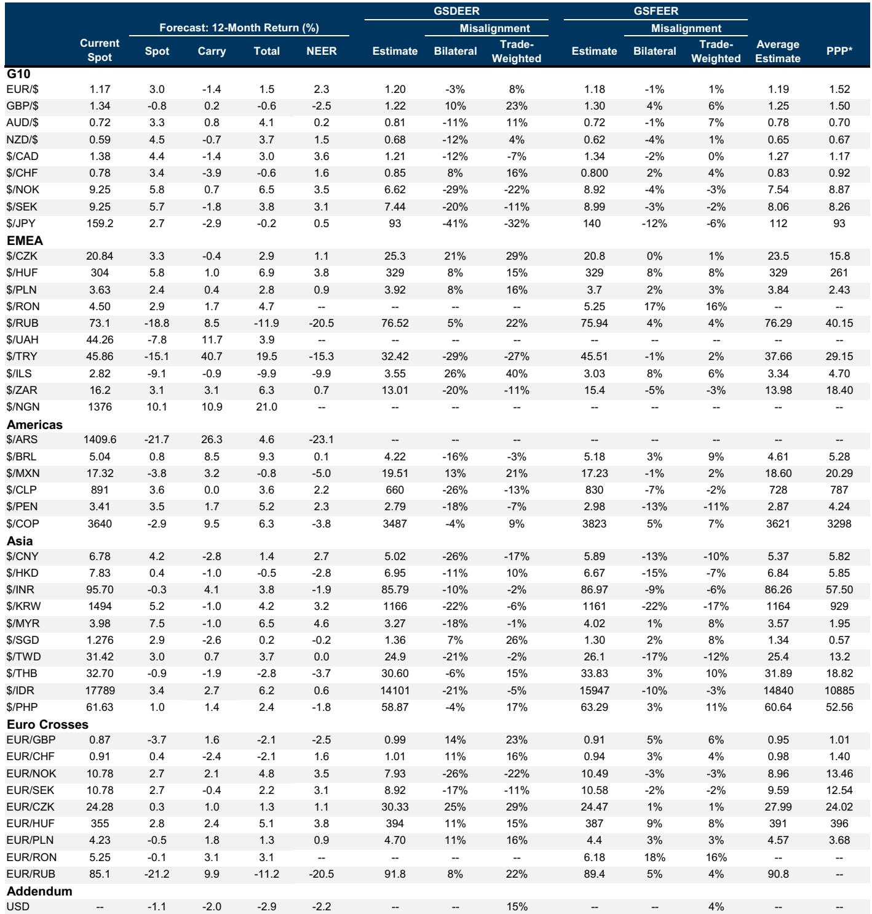
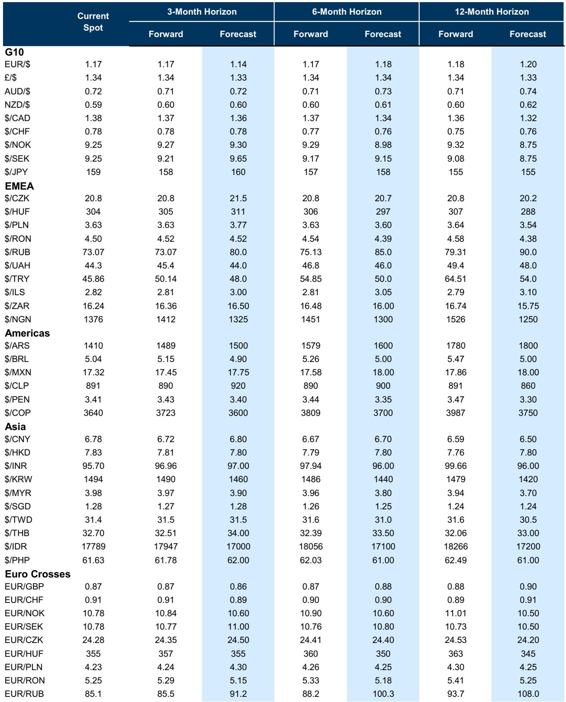
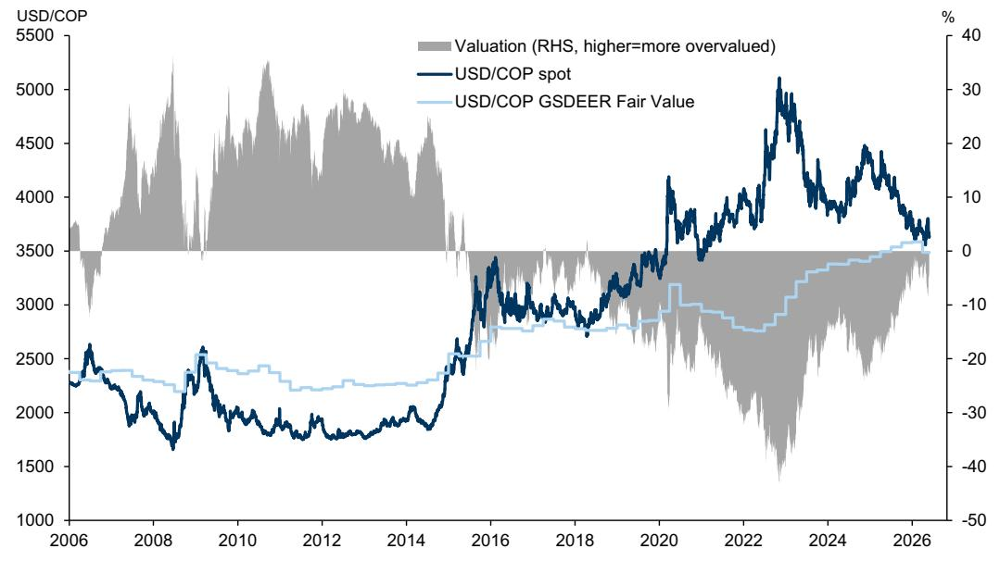

# 美元并未真正走弱，市场低估的是“双引擎”对美元定价权的重塑

过去一周，美元在“美伊和谈进展”和“人民币稳步升值”的叙事中走弱。但这份来自某外资投行全球外汇团队的研报，给出了一个与市场直觉截然不同的判断：**美元近期的下跌是战术性的，而非结构性的。** 真正值得关注的，不是美元会不会跌，而是驱动美元定价的结构性力量已经发生了根本性切换。

报告的核心洞察在于，市场当前对美元的定价，同时受到两股巨大力量的作用——AI 繁荣与能源供给冲击。这两股力量并非简单对冲，而是共同指向一个方向：**美元的中期支撑比市场想象的要强得多。** 理解这一点，是理解未来 3-6 个月外汇市场所有交叉盘交易逻辑的起点。

报告没有停留在“美元会涨还是会跌”的二元判断上，而是深入拆解了不同货币在“地缘缓和”与“结构分化”两种场景下的不对称表现。我们以下从几个关键维度展开。

## 1. 美元下跌的叙事并不完整，AI 与能源双引擎正在重塑定价锚

市场习惯用“避险消退”或“风险偏好回升”来解释美元走势。但这份报告指出，当前美元定价中最重要的变量，并非地缘政治情绪，而是两股结构性力量的同时作用。

第一，AI 繁荣。报告明确提到，AI 热潮正在恢复外国投资者对美元资产的需求。这一点至关重要——去年美元贬值的一个关键原因，正是外资对美元资产的兴趣下降。AI 带来的投资热潮，通过更宽松的金融条件和更强的投资增长，不仅改善了美国的经济表现，也推高了前端利率差。这直接支撑了美元的相对价值。

第二，能源供给冲击。即便霍尔木兹海峡的通行恢复，能源短缺的影响也不会立即消失。报告指出，在经历了三个多月的严重供应受限后，产品短缺和价格上涨将继续推动各国增长的分化。对于能源进口国而言，增长压力是持续的；而对于美国这样的能源生产大国，这反而构成了一个相对优势。

这两股力量叠加的结果是：**美元在 3 月初至今净上涨了 1-1.5%**。这个涨幅并非偶然，而是上述结构性因素在定价中的体现。报告认为，尽管在积极消息下美元仍有贬值空间，但整体图景指向的是“更分化”的美元表现，而非单边走弱。

这里需要补充一个关键点：报告没有完全展开的是，AI 繁荣对美元资产需求的拉动，是否具有可持续性。如果 AI 投资热潮出现边际降温，这部分支撑是否会迅速消退？这仍是需要持续跟踪的变量。

## 2. 匈牙利福林：欧盟资金解冻是催化剂，但真正的驱动力是通胀约束

匈牙利福林是近期新兴市场货币中表现较为突出的品种。报告从两个维度拆解了其升值逻辑。

第一个维度是货币政策。匈牙利央行在 6 月会议中释放了降息信号，但报告强调了一个反直觉的关系：**福林的强弱本身，就是降息能否顺利推进的关键约束条件。** 央行行长明确表示，降息的前提是通胀前景显著改善，而福林升值正是压低通胀的重要渠道。这意味着，福林越强，央行降息的空间反而越大——这是一个典型的“正反馈”机制，而非市场习惯理解的“降息利空货币”。

第二个维度是欧盟资金。报告测算，已解冻的 164 亿欧元资金（包括 100 亿欧元的 RRF 基金及部分凝聚力基金）占匈牙利 GDP 的 7% 以上。这笔资金对经常账户和增长的提振，足以对冲能源价格上涨带来的负面影响。报告维持做空 EUR/HUF 的交易建议，目标位 350。

但这里有一个未充分讨论的风险：欧盟资金的到位时间表和实际使用效率。资金解冻是行政层面的信号，但实际流入经济并产生效果，还需要时间。如果资金落地节奏低于预期，福林的升值逻辑会面临短期考验。

## 3. 澳元兑纽元：政策分化与数据背离正在积累一个有趣的机会

澳元兑纽元在过去一个月经历了从强势到停滞的转变。报告将其归因于三股力量的拉扯。

第一，政策预期分化。新西兰央行在 5 月会议上意外转鹰，三位委员倾向于加息，所有委员均同意未来会议加息是必要的。报告引用的经济学家预测已提前加息时间至 7 月和 9 月。而澳洲联储则反向操作，将最终加息的预期从 6 月推迟到 8 月。这导致澳新利差出现见顶迹象。

第二，数据背离。澳洲 4 月 CPI 低于预期，就业数据疲软，消费者信心恶化。而新西兰方面并未出现类似的下行压力。

第三，持仓与场景。报告指出，纽元在“地缘缓和”场景下受益更多，且澳元兑纽元的净多头持仓已较为拥挤。

这些因素叠加，使得做空 AUD/NZD 的风险回报比变得有吸引力。报告认为，一旦全球能源流动正常化，这一方向将获得明确压力。

值得留意的是，报告也承认，能源价格高企仍在支撑澳洲的贸易条件，对澳元形成支撑。因此，这一交易的核心假设是“国内因素”终将压倒“贸易条件因素”。这个假设能否成立，取决于能源价格回落的节奏。

## 4. 瑞士法郎：避险属性被 SNB 干预压制，但通胀可能成为解锁钥匙

瑞士法郎的避险属性在当前的能源冲击中本应大放异彩，但实际情况并非如此。报告指出，关键在于瑞士央行的干预倾向。

过去两个月，SNB 通过干预市场限制了瑞郎的避险涨幅。但报告认为，**国内通胀的重新加速，可能足以改变这一倾向。** 瑞士 5 月 CPI 已高于央行 Q2 预测，市场预期 6 月数据将继续上升。如果通胀压力持续，SNB 在 6 月 18 日的会议上可能转向中性干预立场，从而释放瑞郎的避险潜力。

但报告也坦诚列出了三个重要风险：第一，EUR/CHF 的 carry-to-vol 接近 2015 年后高位，直接做空的性价比下降；第二，黄金与风险资产的关联性变化正在外溢到瑞郎；第三，6 月 14 日的人口上限公投如果通过，可能重估瑞士增长前景，对瑞郎构成小幅下行风险。

这里有一个值得深入探讨的问题：SNB 的干预倾向转变，需要通胀持续到什么程度？报告提到了“重新加速”，但没有给出具体的阈值。这可能是完整报告中更为细致的讨论。

## 5. 哥伦比亚比索：选举风险被低估，因为起点已从“低估”变为“公允”

哥伦比亚总统选举第一轮即将举行，市场似乎已部分定价了右翼候选人胜选的预期。但报告给出了一个重要的警示：**当前 COP 的估值状态，与 2022 年大选时完全不同。**

2022 年大选前，USD/COP 的 GSDEER 估值模型显示比索被大幅低估，这意味着即使出现不利结果，贬值空间也有限。但当前，USD/COP 已接近公允价值（约 3500），估值保护已经消失。这意味着，一旦选举结果偏离市场预期（例如左翼候选人表现强于预期），比索的贬值幅度可能远超 2022 年。

报告也指出，比索此前的升值有基本面支撑：外部脆弱性下降、央行加息周期、以及风险偏好提振。但这些因素已经被定价。在估值趋于中性的起点上，选举风险的不对称性是向下的。

这个判断的核心假设是：右翼候选人胜选已被部分定价。如果右翼在第一轮得票率超预期，比索可能继续走强；但如果左翼进入第二轮并展现竞争力，比索的下行风险将显著放大。报告没有提供具体的概率分布，这可能是完整报告中的关键内容。

## 6. 加元：USMCA 谈判的“加拿大溢价”被低估，低 delta 期权是更聪明的表达方式

USMCA 谈判的 7 月 1 日截止日期正在逼近，但市场似乎并未充分定价这一风险。报告通过历史数据分析了两个关键发现。

第一，谈判的紧张程度是不对称的。历史数据显示，美国与加拿大的谈判通常比与墨西哥的更为激烈。这意味着，USMCA 谈判对加元的影响可能大于对墨西哥比索的影响。

第二，市场定价的贸易政策溢价有限。报告通过 GSBEER 模型发现，加元当前并未包含显著的贸易政策风险溢价。原因是加拿大央行已将贸易政策不确定性纳入其反应函数——2018 年和近期均是如此。这意味着，贸易冲击更多通过利率差渠道传导至 USD/CAD，而非形成对传统周期性驱动因素的持续溢价。

第三，更微妙的信号在期权市场。报告发现，贸易紧张升级期间，加元的低 delta 期权（尤其是 10 delta 蝶式）受到的影响最大，而隐含 ATM 波动率和实现波动率的变化较小。这意味着，市场更倾向于通过低 delta 期权来对冲尾部风险，而非直接押注波动率飙升。

综合来看，报告给出的交易含义是：USMCA 谈判对加元是一个被低估的风险；直接做空加元可能面临央行干预的干扰，但买入低 delta USD/CAD 看涨期权，是一种更精确的风险表达方式。

---

这份报告的价值，不在于给出了多少具体的交易建议，而在于它提供了一个分析框架：**在 AI 与能源双冲击的背景下，传统的外汇定价逻辑——利差、风险偏好、贸易条件——正在被重新排序。** 某些货币的驱动因子在变化，某些市场的不对称性在扩大。

报告没有完全回答的问题是：AI 繁荣对美元资产需求的拉动，能否持续到下半年？能源冲击的“二阶效应”是否会在更多经济体引发政策转向？USMCA 谈判如果超出截止日期，是否会触发更广泛的市场波动？这些问题的答案，可能需要更完整的数据和更细致的场景分析。

欢迎来星球微信群里继续讨论这些未解问题，我们会在群内分享完整报告的原始图表和更多细节。

Personal reading notes and learning share only. Not investment advice.

