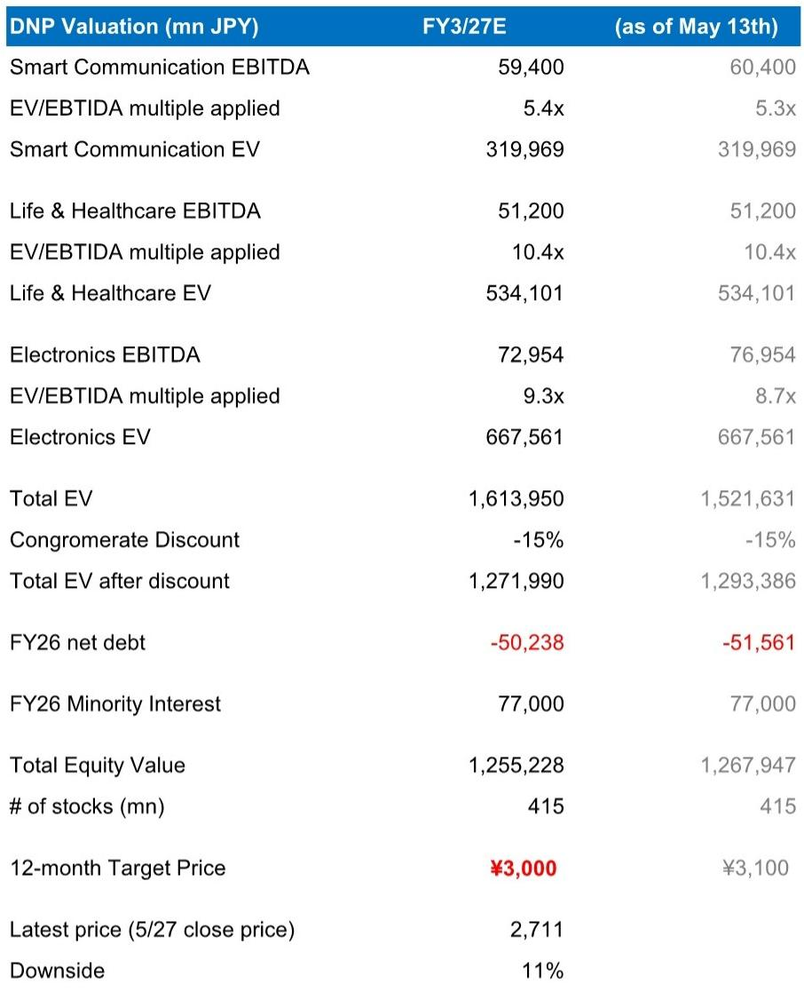
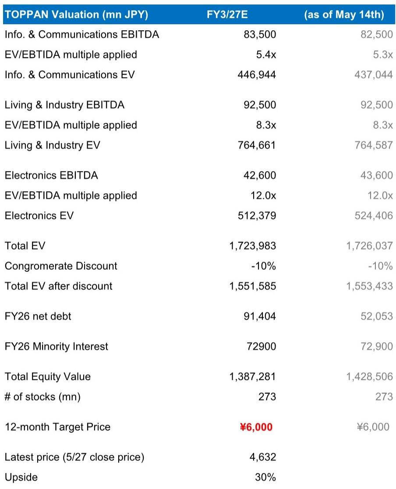
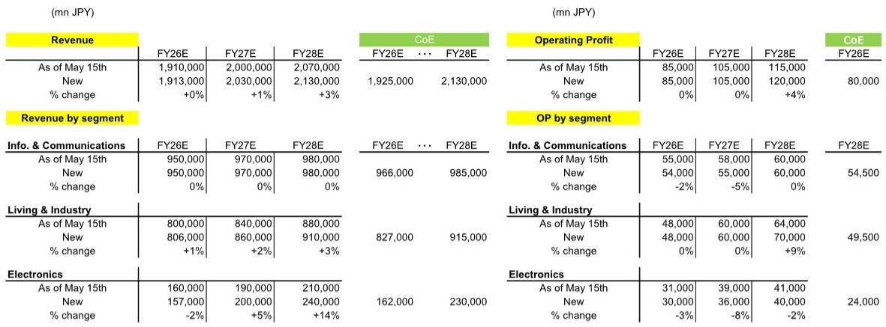

# 日本印刷巨头的真正价值不在印刷，而在半导体封装材料的定价权

当一家公司的股票市净率跌破1倍，而它的核心业务正在以35%的年复合增长率扩张，市场究竟在担心什么？

某外资投行最新发布的日本电子与半导体行业研报，聚焦了两家常被归类为“印刷公司”的企业——TOPPAN和DNP。报告的核心判断出人意料：市场对这两家公司的定价，正在犯一个典型的“分类错误”。投资者仍然把它们当作传统印刷商来估值，却忽略了它们正在成为半导体先进封装材料领域的关键供应商。

这份报告的价值不在于它给出了多少财务预测，而在于它揭示了一个被低估的结构性变化：当日本电子产业从终端品牌竞争转向上游材料与设备竞争时，那些拥有技术壁垒和客户粘性的中间件供应商，正在获得前所未有的议价权。而当前不到1倍的P/B，恰好提供了一个罕见的估值错配窗口。

以下是我们从这份研报中提炼出的五个核心洞察。

## 1. FC-BGA业务的增长被短期投资成本掩盖，但35%的营收CAGR意味着赛道逻辑已经成立

报告对TOPPAN的FC-BGA（倒装芯片球栅阵列）业务给出了明确的增长预期：FY3/27至FY3/29期间，营收年复合增长率达到35%，营业利润年复合增长率达到26%。这个数字本身已经足够说明问题——它不是传统印刷业务的增长速度，而是半导体材料赛道的增长速度。

但市场为什么没有充分反应？原因在于利润增速低于营收增速。报告指出，TOPPAN正在加大对下一代半导体封装（尤其是玻璃核心基板）的前期投资，这部分研发与资本开支将在未来几年内压制利润率。公司预计，FC-BGA业务的营业利润率在FY3/27-29期间将持平甚至小幅下降。

这恰恰是市场容易误读的地方。如果只看短期利润表，投资者可能会认为这项业务“增收不增利”，从而给予较低的估值倍数。但报告的逻辑是：这些投资是为了抢占下一代封装技术的制高点，一旦产能爬坡完成、产品结构向高端AI ASIC和网络交换机转移，利润率将迎来拐点。

从产能扩张路径来看，报告显示TOPPAN的FC-BGA产能将从2024年底的基准线，持续扩张至2030年的300（以2024年底为100）。这个产能节奏本身就是一个信号：客户需求是真实存在的，否则公司不会做出如此大规模的资本承诺。

对于关注半导体产业链的投资者来说，这意味着一个关键判断：FC-BGA不是周期性的封装材料，而是AI算力基础设施的“耗材”。只要AI芯片的封装需求在增长，这条赛道的长期逻辑就不会被短期投资成本证伪。

## 2. DNP的金属掩膜业务遭遇短期逆风，但新中期计划暗示了更彻底的盈利结构改革

与TOPPAN的乐观预期不同，报告对DNP的金属掩膜业务采取了更谨慎的立场。原因很直接：存储半导体短缺导致开发阶段产品需求下降，尤其是低价格的G6金属掩膜。

报告将DNP FY3/27的营业利润预测下调了5%，主要就是因为金属掩膜出货量低于预期。这个调整虽然幅度不大，但反映了一个重要事实：即使是技术壁垒较高的材料业务，也无法完全摆脱下游周期的影响。

不过，报告的看点不在于短期下调，而在于DNP新中期计划所传递的战略信号。报告的评价是：DNP正在从“通过资本配置和业务组合策略改善盈利结构”转向“以敏捷性/灵活性为核心”。翻译成更直白的语言：DNP不再满足于在现有业务框架内做优化，而是准备对业务组合进行更大幅度的调整。

这种转向对估值的影响是深远的。如果DNP能够成功剥离低效资产、聚焦高增长领域，那么当前市场给予它的“综合印刷商”估值折扣就应该被修正。报告虽然没有给出明确的催化剂时间表，但指出DNP的隐含P/B和P/E比较显示当前股价被低估——这至少说明，市场还没有充分计入改革成功的可能性。

## 3. 两家公司的信息通信业务都在经历“从项目制到订阅制”的转型，但效果分化明显

报告对TOPPAN的信息通信业务现状描述相当坦诚：许多销售仍然局限于独立的数字解决方案，未能实现规模化。公司设想的“数字解决方案到运营支持到数据分析到咨询”的增长循环，到目前为止进展不及预期。

但值得关注的是，TOPPAN正在做出调整。报告提到，公司正在将业务模式从一次性数字解决方案转向包含运营支持的经常性服务模式。在BPO业务中，经常性项目已经占到近期销售额的90%。这个数字意味着，即使整体收入增长低于预期，利润的稳定性正在提升。

相比之下，报告对DNP的智能通信业务着墨较少，但从资产比率数据看，DNP的智能通信部门资产占比从FY3/16的52%下降至FY3/25的39%，而电子部门资产占比从16%上升至20%。这个资产结构变化本身就在讲述一个故事：DNP的资源正在向电子材料领域倾斜，通信业务在战略优先级中的位置可能正在下降。

对于产业观察者来说，这两家公司的转型路径提供了一个有价值的比较框架：TOPPAN选择在现有业务内做模式升级，而DNP选择通过资产再配置实现结构转型。哪种策略更有效，可能需要等到下一个中期计划周期才能见分晓。

## 4. 股东回报承诺成为估值底线，但真正的催化剂在于资产周转率的改善

报告反复强调的一个积极因素是TOPPAN对股东回报的承诺——总派息率设定100%下限。在盈利增长被推迟到下一个中期计划的情况下，这个承诺起到了“估值锚”的作用，帮助维持市场预期。

但更值得深挖的是报告提到的另外两个改革方向：SG&A费用削减2个百分点（主要是总部成本），以及总资产削减30%。报告特别指出，TOPPAN的总部资产和费用长期以来被股票市场视为盈利能力和资本回报的拖累。

这里有一个容易被忽略的财务逻辑：P/B估值低的原因，往往不是因为盈利能力差，而是因为资产周转率低。如果TOPPAN能够通过削减总部资产和交叉持股（目标是从12.3%降至7%以下）来提升资产周转率，那么即使利润率不变，ROE也会显著改善。而ROE的提升，最终会推动P/B的修复。

报告给出的数据支持这个判断：TOPPAN的P/B长期维持在0.9倍左右。在ROE改善的预期下，这个估值水平显然存在修复空间。问题在于，资产削减和费用控制能否在1-2年内取得实质性进展——这是TOPPAN管理层承诺的时间表，也是市场需要验证的关键节点。

## 5. 报告尚未完全回答的关键问题：下一代封装技术的竞争格局将如何演变

这份报告在技术细节上着墨不多，但有一个关键问题被有意无意地悬置了：玻璃核心基板的技术路线是否真的能成为主流？如果答案是肯定的，TOPPAN的先发优势能持续多久？

报告提到，TOPPAN计划将下一代半导体封装的投资从FY3/26的约10亿日元增加至FY3/27的约80亿日元，并在FY3/29达到峰值约150亿日元。这个投资规模对于一家传统印刷公司来说相当可观，但相对于整个半导体封装材料市场的规模，仍然只是冰山一角。

问题在于，玻璃核心基板的技术壁垒究竟有多高？是否有其他竞争者正在同步跟进？如果技术路线最终标准化，价格竞争是否会侵蚀利润率？报告没有给出明确的答案，这也意味着TOPPAN的FC-BGA业务估值中包含了较高的技术路线不确定性。

另一个悬而未决的问题是：AI ASIC和网络交换机对FC-BGA的需求结构变化，是否会改变整个供应链的利润分配格局？如果高端产品占比提升，TOPPAN的议价能力能否同步增强？这些问题的答案，可能需要等到FY3/28-29的实际业绩数据出来后才能验证。

对于认真研究这个赛道的投资者来说，上述未解问题恰恰是深度讨论的起点。在完整报告中，分析师对FC-BGA的产能扩张节奏、产品组合变化、以及竞争对手的产能规划都有更详细的拆解。这些细节对于判断TOPPAN的真实竞争地位至关重要。

如果你对日本半导体材料赛道的估值重构逻辑感兴趣，欢迎来星球微信群里继续讨论。我们会围绕这份报告中的未解问题，包括玻璃核心基板的技术路线风险、FC-BGA的竞争格局演变、以及两家公司的资产周转率改善路径，进行更深入的交流与观点碰撞。

Personal reading notes and learning share only. Not investment advice.

