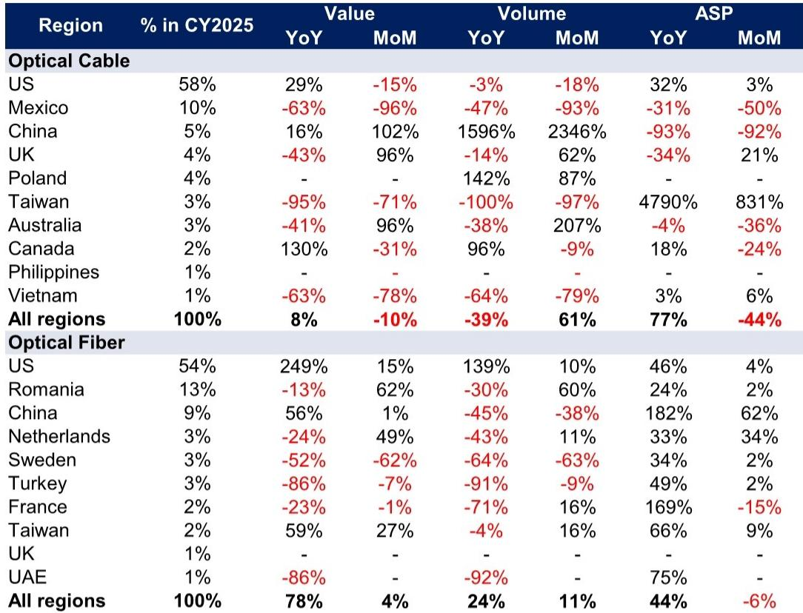
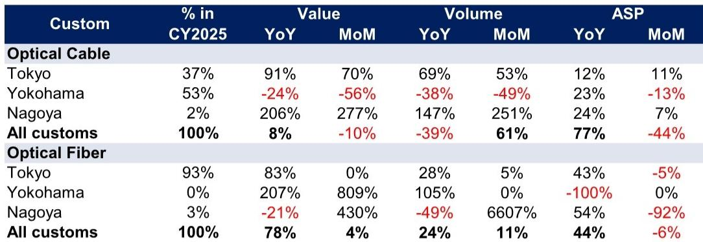
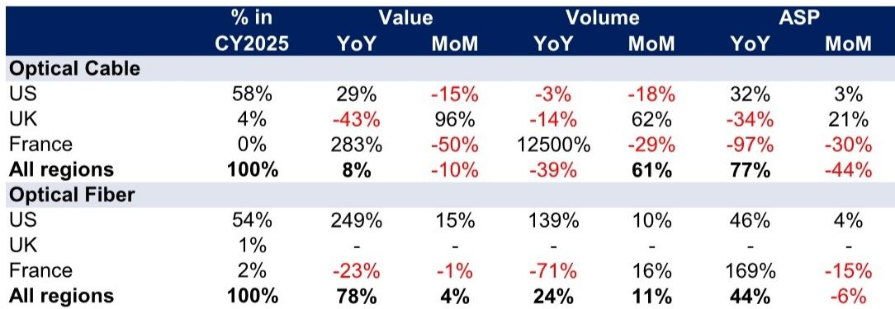

# The Optical Fiber Bottleneck Is Not Easing—It Is Repricing, and the Market Has Not Yet Priced the Full Cycle

The April trade data from Japan’s Ministry of Finance reveals a pattern that contradicts the prevailing narrative of a slowdown in the AI data center supply chain. Export values for optical fiber cable rose 8% year-on-year, but the headline figure masks a far more important structural shift. Unit prices for optical fiber cable surged 77% year-on-year, while optical fiber prices rose 44%. This is not a cyclical blip. It is evidence that the tight supply-demand balance in optical components is now expressing itself through pricing power, not volume growth alone.

The market reacted negatively in mid-May when Fujikura and Furukawa Electric published guidance and medium-term plans that fell short of expectations. Investors read these forecasts as confirmation that growth was decelerating. But the trade data tells a different story. The volume declines in optical fiber cable exports—down 39% year-on-year—were interpreted as weakness. Yet the simultaneous explosion in average selling prices suggests that manufacturers are prioritizing margin over volume, a rational response to capacity constraints that are not resolving quickly.

The disconnect between market sentiment and the underlying data creates a strategic opportunity. The optical components that underpin AI data center construction—especially the high-density rollable ribbon cable produced by Furukawa Electric’s new Mie plant—are becoming more valuable, not less. The question is whether the market is underestimating the duration and magnitude of this pricing cycle.

## The New Mie Plant Is Already Moving the Needle, and It Signals a Capacity-Constrained Future

Nagoya customs jurisdiction, which covers Furukawa Electric’s Mie plant, recorded a 206% year-on-year increase in optical fiber cable export value and a 147% increase in volume. This is the first tangible evidence that the company’s new ultra-high-density optical fiber cable facility is ramping production. The plant is dedicated to rollable ribbon cable, a product specifically designed for the high-fiber-count, space-constrained environments of AI data centers.

The significance extends beyond one company. Furukawa Electric, Fujikura, and Sumitomo Electric are the three dominant Japanese producers of optical components critical to AI data center construction. Their manufacturing bases map directly to customs jurisdictions: Fujikura in Chiba (Tokyo customs), Sumitomo Electric in Yokohama (Yokohama customs), and Furukawa Electric in Mie (Nagoya customs). The Nagoya data is therefore a direct read on Furukawa Electric’s operational trajectory.

What makes this data point strategically important is that it demonstrates capacity addition is happening, but it is not keeping pace with demand. The Mie plant is new, yet its output is already being absorbed at prices 24% higher than a year ago. This suggests that even as new supply comes online, it is immediately consumed by insatiable demand from US hyperscalers and data center operators. The bottleneck is not being broken; it is being managed through price.

The implication for investors is clear. The market’s disappointment with Furukawa Electric’s medium-term plan may reflect a misunderstanding of the company’s strategy. If the company is prioritizing margin expansion over volume growth in a capacity-constrained environment, then a conservative volume guidance is not a sign of weakness—it is a signal of discipline. The trade data supports this interpretation.

## The ASP Surge Is Structural, Not Cyclical, and It Changes the Earnings Calculus for Japanese Optical Producers

The 77% year-on-year increase in optical fiber cable average selling prices is the most important data point in the April release. To understand why, compare this with the volume trend. Export volume for optical fiber cable fell 39% year-on-year. If this were a simple demand collapse, prices would fall. Instead, prices rose sharply. This is the classic signature of a supply-constrained market where buyers are willing to pay a premium for available product.

The optical fiber data reinforces the same conclusion. Export value rose 78% year-on-year, while volume increased only 24%. The 44% ASP increase is the mechanism by which value is being captured. This is not a commodity market. These are engineered products with specific performance characteristics required for AI data center architecture. Substitution is not easy, and lead times are long.

The structural nature of this pricing power is supported by the destination data. The United States accounted for 58% of optical fiber cable exports and 54% of optical fiber exports by value. For optical fiber cable, US export value rose 29% year-on-year while volume fell 3%. The ASP to the US increased 32%. For optical fiber, US export value surged 249%, volume rose 139%, and ASP increased 46%. The US market is absorbing Japanese optical products at accelerating prices, even as volume growth moderates.

This has direct implications for earnings models. The market has historically valued these companies based on volume growth assumptions tied to data center buildout. If the pricing cycle is longer and stronger than anticipated, revenue and margin trajectories could significantly exceed current guidance. The risk is not that demand falters. The risk is that investors are using the wrong framework to value these companies.

## The Market Has Overcorrected to Guidance That Was Never Meant to Be a Demand Signal

The selloff following Fujikura’s and Furukawa Electric’s guidance releases in mid-May was sharp. Investors interpreted the conservative outlooks as evidence that AI data center investment was slowing. This interpretation is flawed for three reasons.

First, the guidance numbers are company-specific, not market-wide. Fujikura cited potential bottlenecks in electric power, power equipment, memory, and construction personnel, in addition to optical products. These are real constraints, but they are not demand constraints. They are execution constraints. The fact that a company flags bottlenecks does not mean demand is falling. It means the company is being realistic about its ability to ramp production.

Second, the market is conflating a growth rate moderation with a growth reversal. The optical component companies have been growing rapidly from a low base. As the base expands, year-on-year growth rates will naturally decelerate even if absolute demand continues to rise. A company that grew 100% last year and guides for 30% growth this year is still growing. The market treated this as a disappointment.

Third, the trade data directly contradicts the bear case. If AI data center investment were slowing, we would expect to see declining export values and falling prices. Instead, we see rising prices and stable-to-growing export values. The data says the opposite of what the market narrative suggests.

The strategic error is mistaking a company’s capacity guidance for a demand signal. The two are fundamentally different. The optical component companies are telling the market how much they can produce, not how much their customers want to buy. The trade data tells us what customers are actually buying and at what price. The latter is the more reliable signal.

## What the Report Does Not Fully Answer: The Elasticity of Pricing Power and the Risk of Demand Destruction

The April data is a snapshot, not a forecast. It tells us that pricing power is strong today, but it does not tell us how long it will last. The critical unknown is the price elasticity of demand for optical components in AI data centers. At what point do rising prices cause hyperscalers to delay projects, redesign architectures, or seek alternative technologies?

There are reasons to believe the pricing cycle could be longer than typical. AI data center construction is driven by competitive dynamics among a small number of hyperscale operators. The cost of delaying a data center is measured in lost revenue from AI inference and training capacity. In this context, the demand for optical components is relatively inelastic in the short to medium term. A 30-50% price increase is painful, but it is a fraction of the total project cost and a small price to pay for maintaining deployment timelines.

However, there is a limit. If optical component prices continue to rise, hyperscalers may accelerate investments in alternative technologies such as co-packaged optics, silicon photonics, or even wireless interconnects for certain use cases. The Japanese optical producers are not immune to technological disruption. Their current pricing power is a function of scarcity, not technological moats that cannot be replicated.

The report does not address this risk in detail. It notes that bottlenecks exist across multiple inputs to AI data center construction, including power, memory, and construction labor. But it does not model the scenario where these bottlenecks compound to slow overall data center deployment, thereby reducing optical component demand. This is the bear case that investors should consider. The bull case is that pricing power persists because demand is inelastic. The truth likely lies somewhere in between, and the inflection point is unknowable from a single month of trade data.

## A Decision Framework for Investors: Three Questions to Distinguish Signal from Noise

The April MOF data provides a useful lens, but it must be placed within a broader decision framework. Investors should ask three questions to determine whether the current opportunity in Japanese optical component stocks is a buying opportunity or a value trap.

First, is the pricing power sustainable? This requires monitoring monthly trade data for at least two more quarters. If ASPs remain elevated while volumes stabilize or grow, the thesis is confirmed. If volumes collapse while prices rise, it signals demand destruction. The key metric to watch is the ASP-to-volume ratio. A rising ratio with stable or growing volume is bullish. A rising ratio with rapidly falling volume is a warning.

Second, are the companies investing in capacity? The Furukawa Electric Mie plant is a positive signal. But one plant does not solve a global bottleneck. Investors should track capital expenditure guidance from all three major producers. If capacity investment accelerates, it suggests management sees the pricing cycle as durable. If investment remains cautious, it suggests management views the current pricing as temporary and is reluctant to commit capital.

Third, what is the competitive response from non-Japanese producers? The US and European optical component manufacturers are not standing still. If they ramp capacity faster than expected, Japanese pricing power could erode. Conversely, if they also face constraints, the pricing cycle could extend. This is a global supply-demand question, not a Japan-specific one.

These three questions form the basis for a disciplined investment approach. The market has already priced a slowdown. The trade data suggests the slowdown narrative is premature. The next two quarters of data will determine which view is correct.

## Join the Community to Read the Full Report and Review the Original Charts

The April MOF data is one piece of a larger puzzle. The full report from which this analysis is drawn includes detailed exhibits on export trends by destination, customs jurisdiction, and product type, as well as a deeper discussion of the capacity dynamics at Fujikura, Sumitomo Electric, and Furukawa Electric. It also contains the original charts that allow readers to track month-over-month and year-over-year changes in a granular way. Join the community to read the full report and review the original charts.

*This article is for learning and discussion only and does not constitute investment advice.*

Personal reading notes and learning share only. Not investment advice.

