# US WEEKLY KICKSTART

# Corporate equity demand should outweigh record IPO supply in 2026

- IPO activity is continuing to recover after four years of muted issuance. 40 deals worth \$28 billion have launched YTD, the largest totals through May since 2021. While elevated IPO activity has characterized some previous equity market peaks, the number of IPOs YTD is only on pace to reach the historical annual average of 100. In contrast, more than 250 IPOs launched in 2021 and nearly 400 launched in 1999.   
2026 should be a record year for IPOs in dollar terms. Our IPO Barometer continues to signal a healthy macro backdrop for new launches, and news reports and prediction markets indicate an increased likelihood that some of the largest private companies will come public this year. We raise our forecast for 2026 IPO volume to \$225 billion (from \$160 billion). We expect total corporate equity supply to register \$675 billion including follow-ons and other issuance. However, this issuance scales to just 1.0% of US equity market cap, compared to an average of 1.5% since 1995.   
As investor lockups expire, IPO issuance leads to additional potential equity supply. History shows that large IPOs with initial floats of less than 10% experience an average increase in float to 46% 12 months later. Following this historical pattern, we expect nearly \$500 billion in potential equity supply from expiring lockups in 2026. However, this post-lockup potential supply may not materialize if investors choose to maintain their ownership positions.   
Buyback growth has slowed alongside the AI capex boom, rising just 4% y/y in Q1 2026. Because market values have continued to rise, the S&P 500 buyback yield has declined to 1.9%, near the lowest level since 2021. However, the magnitude of repurchases remains large and continues to grow. Financials account for 27% of S&P 500 buybacks and grew repurchases by 18% in Q1. NVDA announced an \$80 billion authorization, and total buyback announcements are running at a record \$860 billion YTD. We forecast gross corporate buybacks of \$1.3 trillion this year.   
Despite slow recent buyback growth and prospects for a record year for IPOs, corporate demand for equities should outweigh both direct corporate equity issuance and potential post-lockup equity supply in 2026. Strong M&A activity should bolster that balance; announcements have totaled nearly \$900 billion YTD, 48% higher than this time last year, with nearly 70% cash consideration.

# Ben Snider

+1(212)357-1744 | ben.snider@gs.com

GS & Co. LLC

# Ryan Hammond

+1(212)902-5625

ryan.hammond@gs.com

GS & Co. LLC

# Jenny Ma

+1(212)357-5775 | jenny.ma@gs.com

GS & Co. LLC

# Daniel Chavez

+1(212)357-7657

daniel.chavez@gs.com

GS & Co. LLC

# Kartik Jayachandran

+1(212)855-7744

kartik.jayachandran@gs.com

GS & Co. LLC

# Christophe Sung

+1(212)902-3841

christophe.sung@gs.com

GS & Co. LLC

The balance of corporate equity supply and demand will become more challenging in 2027. The magnitude of post-lockup supply will depend on many factors, including the performance of IPOs, the size of initial floats, and investor desire for liquidity. However, post-lockup equity supply will likely increase in 2027 relative to 2026.

■ Outside of corporates, foreign investors represent a likely additional source of equity demand in coming months, as do households, who were net sellers in the late 1990s but have recently been buying US equities. In addition, much of the liquidity created by IPOs should eventually end up reinvested in the equity market. Changes in index inclusion rules should accelerate passive demand for some new issues.

# The outlook for IPOs and the corporate equity supply/demand balance

US IPO activity has recently accelerated following four consecutive years of muted issuance. 24 US companies have come to market so far in Q2 2026, bringing the YTD total to 40. This represents more than double the number of IPOs at this point in 2025 and the largest total through May since the 95 IPOs launched in the first five months of 2021. Nonetheless, despite the recent pickup in activity, the number of deals so far this year has lagged the average total of 50 IPOs through May since 1995.

Exhibit 1: 40 US companies have gone public so far this year US deals greater than \$25 million in value   
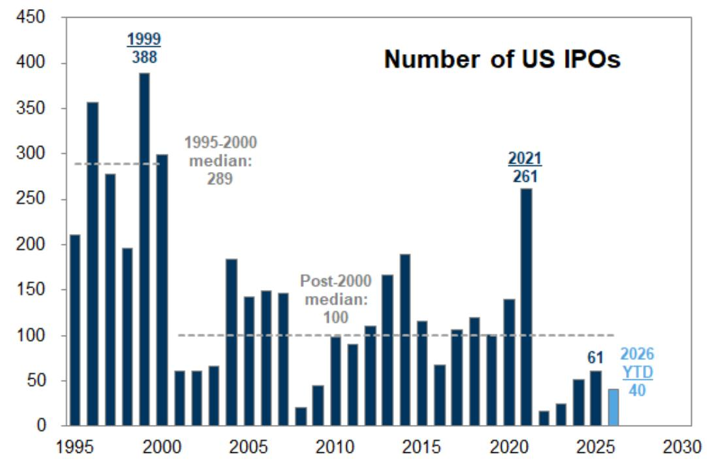

bar

| Year | Number of IPOs |
| ---- | -------------- |
| 1999 | 388            |
| 1995-2000 | 289          |
| Post-2000 | 100          |
| 2021 | 261            |
| 2025 | 61             |
| 2026 YTD | 40         |

Source: FactSet, GS Global Investment Research

US IPOs have raised \$28 billion in gross proceeds YTD, the largest total at this point in the year since 2021. \$44 billion was raised in the first five months of 2021. First day returns of recent IPOs indicate a healthy appetite for new issuance, with the average IPO in Q2 rising by 21% on its first trading day, in line with the historical average.

Exhibit 2: US IPOs have raised \$28 billion YTD   
US deals greater than \$25 million in value   
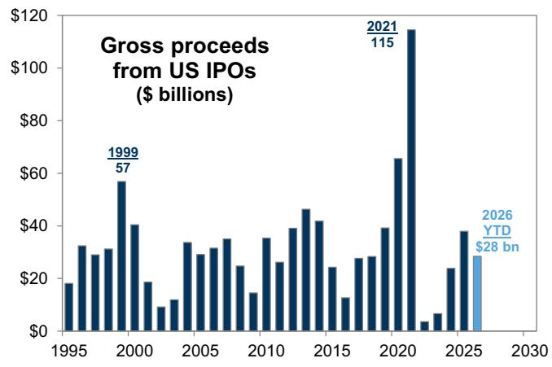

bar

| Year | Gross Proceeds ($ billions) |
|------|------------------------------|
| 1999 | 57                           |
| 2021 | 115                          |
| 2026 YTD | 28                         |

Source: FactSet, GS Global Investment Research

Exhibit 3: First day trading returns for the average IPO   
US deals greater than \$25 million in value   
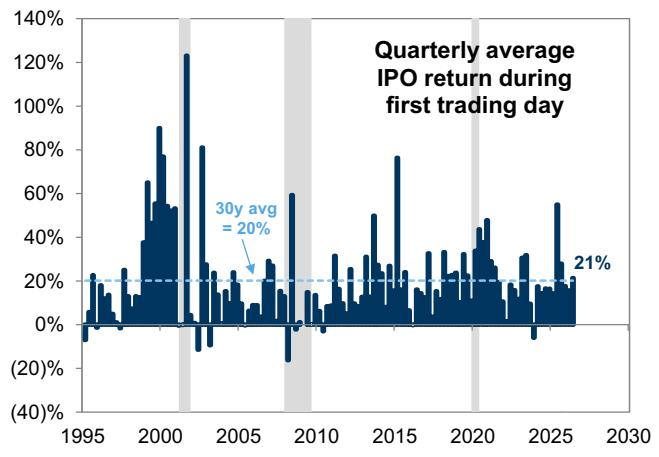

bar

| Year | Quarterly average IPO return (%) |
| ---- | -------------------------------- |
| 2005 | 20%                            |
| 2025 | 21%                            |

Source: FactSet, GS Global Investment Research

We estimate IPO gross proceeds will total a record \$225 billion in 2026. Our previous forecast was for \$160 billion of IPO issuance. Our new estimates reflect a continued healthy macro backdrop for IPOs, as signaled by our IPO Barometer (Exhibit 35), and recent changes to the outlook for potential launches by some of the largest private companies. Including follow-ons, converts, and SPACs, we estimate corporate equity issuance will total \$675 billion this year.

Although we expect a record year in 2026 for corporate equity issuance, supply relative to the size of the equity market should remain below the long-term average. Our estimate for \$675 billion of corporate equity supply equates to 1% of Russell 3000 market cap, in line with average annual equity issuance from 2015-2019.

Exhibit 4: We forecast \$225 billion of IPO gross proceeds in 2026   
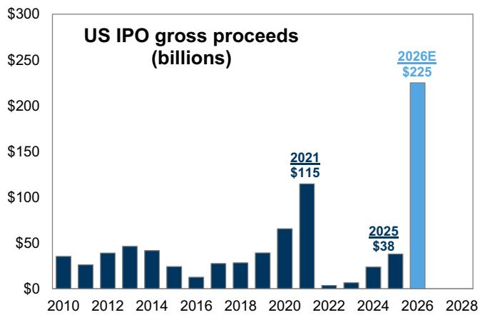

bar

| Year | Gross Proceeds (billions) |
| ---- | -------------------------- |
| 2021 | $115                       |
| 2025 | $38                        |
| 2026E | $225                       |

Universe consists of US deals greater than \$25 million in value

Exhibit 5: We expect equity issuance will equal 1% of Russell 3000 market cap this year   
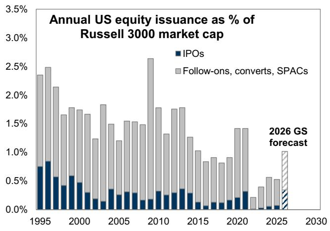

bar

| Year | IPOs | Follow-ons, converts, SPACs |
|------|------|-----------------------------|
| 1995 | 0.7% | 1.4%                        |
| 1996 | 0.8% | 1.5%                        |
| 1997 | 0.6% | 1.3%                        |
| 1998 | 0.5% | 1.4%                        |
| 1999 | 0.4% | 1.5%                        |
| 2000 | 0.5% | 1.4%                        |
| 2001 | 0.3% | 1.5%                        |
| 2002 | 0.2% | 1.6%                        |
| 2003 | 0.1% | 1.7%                        |
| 2004 | 0.2% | 1.8%                        |
| 2005 | 0.3% | 1.5%                        |
| 2006 | 0.3% | 1.5%                        |
| 2007 | 0.3% | 1.5%                        |
| 2008 | 0.2% | 1.6%                        |
| 2009 | 0.2% | 2.7%                        |
| 2010 | 0.3% | 1.8%                        |
| 2011 | 0.3% | 1.3%                        |
| 2012 | 0.3% | 1.8%                        |
| 2013 | 0.3% | 1.8%                        |
| 2014 | 0.3% | 1.3%                        |
| 2015 | 0.2% | 1.0%                        |
| 2016 | 0.2% | 0.8%                        |
| 2017 | 0.2% | 0.9%                        |
| 2018 | 0.2% | 0.8%                        |
| 2019 | 0.2% | 0.9%                        |
| 2020 | 0.3% | 1.4%                        |
| 2021 | 0.3% | 1.4%                        |
| 2022 | 0.2% | 0.4%                        |
| 2023 | 0.1% | 0.5%                        |
| 2024 | 0.1% | 0.5%                        |
| 2025 | 0.1% | 1.0%                        |
| 2026 (GS forecast) | -    | -                          |

Source: Dealogic, GS Global Investment Research   
Source: FactSet, GS Global Investment Research

While modest floats should limit the equity supply created immediately by potential upcoming IPOs, these deals will create additional equity supply in subsequent months and years. Since 2003, 14 IPOs have come public with gross proceeds exceeding 5 bp of Russell 3000 market cap and float shares of less than 10%. On average, the floats of these companies increased from 7% at launch to 28% 6 months following the IPO and 46% by 12 months post-IPO.

Exhibit 6: Additional equity supply could come to market as float increases post-IPO includes 1,960 IPOs since 2003   
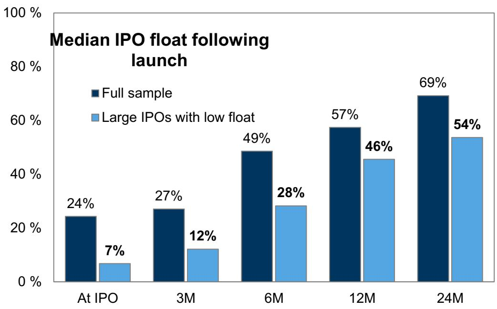

bar

Median IPO float following launch
| Time Period | Full sample (%) | Large IPOs with low float (%) |
| :--- | :--- | :--- |
| At IPO | 24 | 7 |
| 3M | 27 | 12 |
| 6M | 49 | 28 |
| 12M | 57 | 46 |
| 24M | 69 | 54 |

Large IPOs with low float are 14 IPOs with deal values of at least 5 bp of Russell 3000 market cap at the time of IPO and float shares totaling less than 10% of total. 5 bp of Russell 3000 market cap today corresponds to roughly \$36 billion.   
Source: Bloomberg, FactSet, GS Global Investment Research

Based on the historical pattern, we estimate that recent and upcoming IPOs will result in roughly \$500 billion of additional unlocked shares available to sell in 2026 and likely a larger quantity in 2027. We expect the majority of potential equity supply from the current pipeline of IPOs will become free float in 2027. Importantly, however, these shares will not necessarily translate to additional equity supply if investors choose to maintain their ownership in recent IPOs rather than sell those positions.

Exhibit 7: In addition to shares floated at IPO, expiring lockups can increase equity supply   
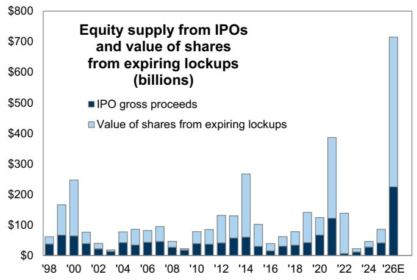

bar

| Year | IPO gross proceeds (billions) | Value of shares from expiring lockups (billions) |
|------|----------------------------------|----------------------------------------------------|
| '98  | ~50                              | ~30                                                |
| '00  | ~70                              | ~150                                               |
| '02  | ~40                              | ~30                                                |
| '04  | ~50                              | ~40                                                |
| '06  | ~50                              | ~50                                                |
| '08  | ~30                              | ~30                                                |
| '10  | ~40                              | ~50                                                |
| '12  | ~50                              | ~70                                                |
| '14  | ~60                              | ~120                                               |
| '16  | ~30                              | ~40                                                |
| '18  | ~40                              | ~50                                                |
| '20  | ~70                              | ~120                                               |
| '22  | ~120                             | ~250                                               |
| '24  | ~30                              | ~30                                                |
| '26E | ~220                             | ~450                                               |

Value of shares from expiring lockups calculated as shares available for trading at lockup expiry date multiplied by the share price at the expiry date. Lockup expiry data based on data in company filings captured by FactSet. These data understate the total value of locked up shares because they are only available for roughly 60% of IPOs in our database.

Exhibit 8: Value of shares from expiring lockups   
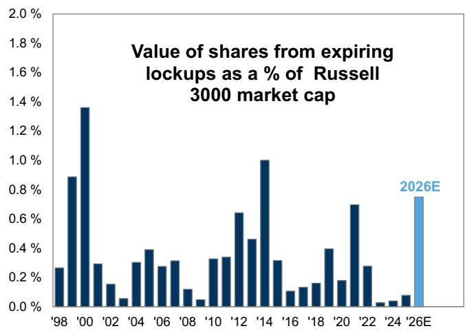

bar

| Year | Value of shares from expiring lockups as a % of Russell 3000 market cap |
| ---- | ------------------------------------------------------------------------ |
| '98  | 0.25                                                                     |
| '00  | 1.35                                                                     |
| '02  | 0.28                                                                     |
| '04  | 0.30                                                                     |
| '06  | 0.38                                                                     |
| '08  | 0.30                                                                     |
| '10  | 0.32                                                                     |
| '12  | 0.65                                                                     |
| '14  | 1.00                                                                     |
| '16  | 0.32                                                                     |
| '18  | 0.15                                                                     |
| '20  | 0.40                                                                     |
| '22  | 0.70                                                                     |
| '24  | 0.28                                                                     |
| '26E | 0.75                                                                     |

Source: FactSet, GS Global Investment Research   
Source: Bloomberg, FactSet, GS Global Investment Research

On the demand side of the equation, corporate buybacks have continued to give way to surging capex spending. S&P 500 buybacks rose by 4% year/year in Q1, continuing the recent trend of mid-single digit growth. We forecast S&P 500 buybacks will grow by 3% this year as capex growth exceeds 30%.

Exhibit 9: S&P 500 buyback growth registered just 4% in Q1 2026   
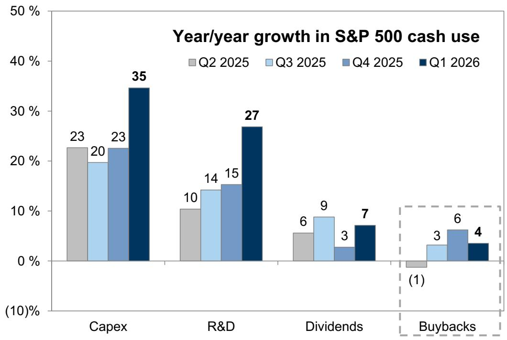

bar

Year/year growth in S&P 500 cash use
| Category | Q2 2025 (%) | Q3 2025 (%) | Q4 2025 (%) | Q1 2026 (%) |
| :--- | :--- | :--- | :--- | :--- |
| Capex | 23 | 20 | 23 | 35 |
| R&D | 10 | 14 | 15 | 27 |
| Dividends | 6 | 9 | 3 | 7 |
| Buybacks | (1) | 3 | 6 | 4 |

Source: FactSet, GS Global Investment Research

Slowing buyback growth alongside equity market appreciation has continued to push the S&P 500 buyback yield lower. The S&P 500 trailing 12-month net buyback yield sits at 1.9%, compared with a median of 2.4% since 2005. As a result, the index divisor – a proxy for share count – has risen modestly during the last several quarters.

Exhibit 10: The S&P 500 buyback yield has continued to decline   
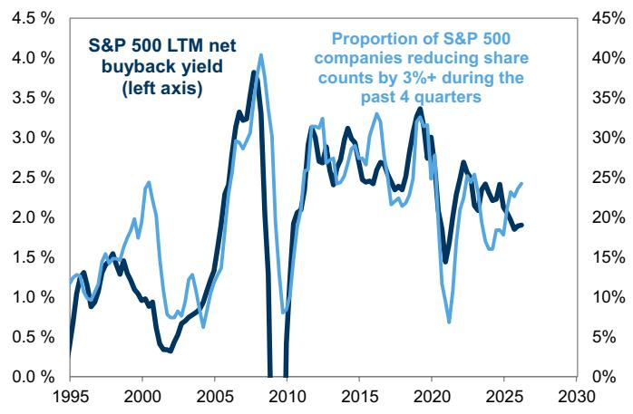

line

| Year | S&P 500 LTM net buyback yield | Proportion of S&P 500 companies reducing share counts by 3%+ during the past 4 quarters |
|------|----------------------------------|----------------------------------------------------------------------------------|
| 1995 | ~1.2%                            | ~15%                                                                             |
| 2000 | ~1.5%                            | ~25%                                                                             |
| 2005 | ~2.5%                            | ~35%                                                                             |
| 2010 | ~4.0%                            | ~30%                                                                             |
| 2015 | ~3.0%                            | ~35%                                                                             |
| 2020 | ~2.5%                            | ~25%                                                                             |
| 2025 | ~2.0%                            | ~20%                                                                             |
| 2030 | ~1.8%                            | ~18%                                                                             |

Source: GS Global Investment Research

Exhibit 11: The S&P 500 divisor has inflected higher   
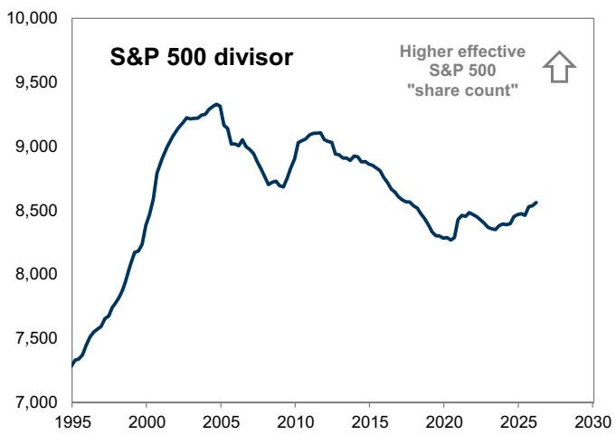

line

| Year | Value |
|------|-------|
| 1995 | 7,300 |
| 2000 | 8,200 |
| 2005 | 9,300 |
| 2010 | 8,700 |
| 2015 | 8,900 |
| 2020 | 8,300 |
| 2025 | 8,500 |
| 2030 | 8,600 |

Source: Standard and Poor's, GS Global Investment Research

Despite weak recent buyback growth, US companies remain a large source of equity demand. We expect US companies will execute more than \$1.3 trillion in buybacks in 2026. While hyperscaler buybacks fell by 64% year/year in Q1, growing buybacks from Banks and the beneficiaries of AI capex, such as semiconductors, should help offset some of those headwinds. NVDA, for example, added \$80 billion to its buyback authorization following its latest report. In total, US companies have announced a record \$860 billion in buyback authorizations YTD, 18% growth relative to this time last year.

Exhibit 12: Buyback authorizations have totaled \$860 billion YTD   
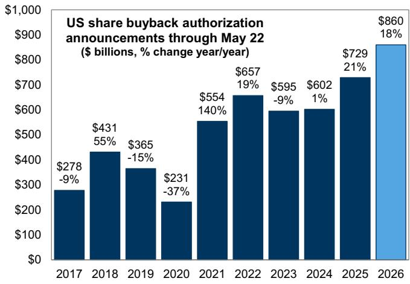

bar

| Year | Value ($ billions) | Change (%) |
|------|---------------------|------------|
| 2017 | $278                | -9         |
| 2018 | $431                | 55         |
| 2019 | $365                | -15        |
| 2020 | $231                | -37        |
| 2021 | $554                | 140        |
| 2022 | $657                | 19         |
| 2023 | $595                | -9         |
| 2024 | $602                | 1          |
| 2025 | $729                | 21         |
| 2026 | $860                | 18         |

Source: GS Global Investment Research

Exhibit 13: Consensus buyback growth estimates by sector 

<table><tr><td rowspan="2">Sector</td><td colspan="2">Cons. 2026E buybacks</td></tr><tr><td>Share of total</td><td>Year/Year growth</td></tr><tr><td>Information Technology</td><td>33 %</td><td>27 %</td></tr><tr><td>Financials</td><td>27</td><td>18</td></tr><tr><td>Communication Services</td><td>10</td><td>(19)</td></tr><tr><td>Health Care</td><td>6</td><td>10</td></tr><tr><td>Consumer Discretionary</td><td>6</td><td>(14)</td></tr><tr><td>Industrials</td><td>7</td><td>(15)</td></tr><tr><td>Energy</td><td>6</td><td>16</td></tr><tr><td>Consumer Staples</td><td>2</td><td>(11)</td></tr><tr><td>Materials</td><td>2</td><td>8</td></tr><tr><td>Utilities</td><td>1</td><td>124</td></tr><tr><td>Real Estate</td><td>0</td><td>64</td></tr><tr><td>S&amp;P 500</td><td>100 %</td><td>10 %</td></tr></table>

Source: FactSet, GS Global Investment Research

Even including the additional potential supply represented by expiring lockups, we expect corporate buybacks will outweigh corporate equity issuance in 2026.

Buybacks of \$1.3 trillion this year compare with \$1.1 trillion of corporate equity issuance

combined with potential post-lockup supply.

Exhibit 14: Corporate equity demand from buybacks should exceed corporate equity supply this year net demand assumes all shares available after lockups expire are sold   
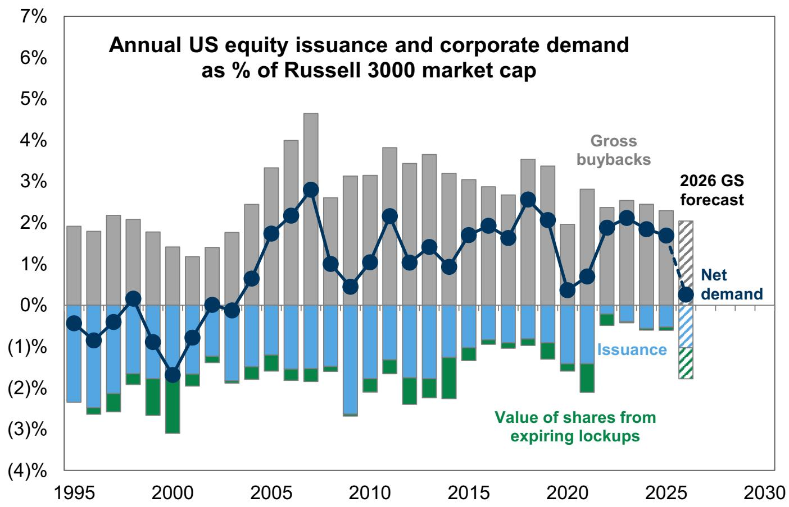

bar_line

Annual US equity issuance and corporate demand as % of Russell 3000 market cap
| Year | Issuance (%) | Net demand (%) |
| :--- | :--- | :--- |
| 1995 | -2.4 | -0.6 |
| 1996 | -2.5 | -0.7 |
| 1997 | -2.4 | -0.6 |
| 1998 | -2.3 | -0.5 |
| 1999 | -2.4 | -0.8 |
| 2000 | -3.0 | -1.8 |
| 2001 | -2.3 | -0.7 |
| 2002 | -2.2 | -0.6 |
| 2003 | -2.1 | -0.5 |
| 2004 | -2.1 | -0.4 |
| 2005 | -1.8 | 0.7 |
| 2006 | -1.7 | 1.8 |
| 2007 | -1.7 | 2.8 |
| 2008 | -1.7 | 1.0 |
| 2009 | -3.1 | 0.4 |
| 2010 | -1.8 | 1.1 |
| 2011 | -1.6 | 2.1 |
| 2012 | -1.7 | 1.0 |
| 2013 | -1.7 | 1.4 |
| 2014 | -1.7 | 0.9 |
| 2015 | -1.6 | 1.7 |
| 2016 | -1.5 | 1.9 |
| 2017 | -1.4 | 1.6 |
| 2018 | -1.3 | 2.5 |
| 2019 | -1.3 | 2.0 |
| 2020 | -1.4 | 0.4 |
| 2021 | -1.8 | 0.7 |
| 2022 | -0.5 | 1.9 |
| 2023 | -0.4 | 2.1 |
| 2024 | -0.4 | 1.9 |
| 2025 | -0.4 | 1.8 |
| 2026 (GS forecast) | — | — |
| 2030 (GS forecast) | — | — |

Source: GS Global Investment Research

# M&A will be another source of corporate demand for US equity in coming quarters.

US M&A activity has been resilient this year despite market volatility, with almost \$900 billion of announced transactions YTD (+48% year/year). Cash has represented roughly 70% of consideration for announced M&A this year, close to recent averages.

Exhibit 15: Announced US M&A has been resilient YTD   
US strategic and sponsor M&A over \$100 million   
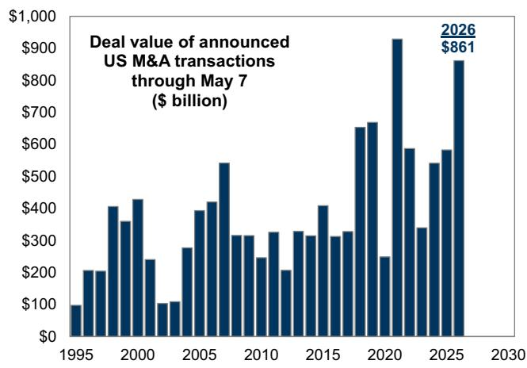

bar

| Year | Deal Value ($ billion) |
| ---- | ---------------------- |
| 2026 | 861                    |

Source: Dealogic, GS Global Investment Research

Exhibit 16: Cash has represented nearly 70% of consideration for announced M&A YTD   
US strategic and sponsor M&A over \$100 million   
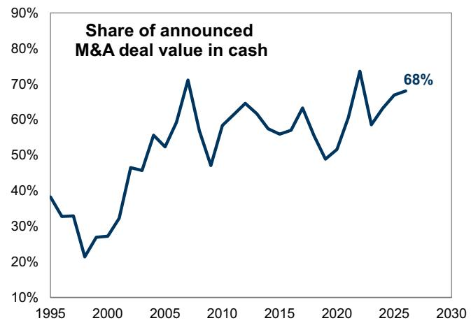

line

| Year | Share of announced M&A deal value in cash |
| ---- | ---------------------------------------- |
| 2025 | 68%                                      |

Source: Dealogic, GS Global Investment Research

In addition to corporates, US households and foreign investors represent additional potential sources of US equity demand in coming months. While households were a significant source equity supply during the late 1990s, the group has recently been a net buyer of equities. The share of the corporate US equity market owned by foreign investors has risen from 6% in 1995 to 18% today, and recent ETF and mutual fund flows have reflected an incremental recent rotation from global equities to US equities.

Exhibit 17: Households have been net buyers of US corporate equities in recent years   
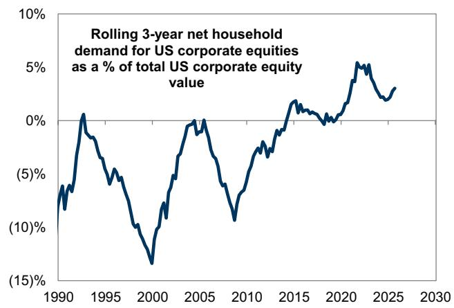

line

| Year | Rolling 3-year net household demand for US corporate equities as a % of total US corporate equity value |
|------|------------------------------------------------------------------------|
| 1990 | -8.0%                                                                 |
| 1995 | -2.0%                                                                 |
| 2000 | -14.0%                                                                |
| 2005 | 0.0%                                                                 |
| 2010 | -10.0%                                                                |
| 2015 | 2.0%                                                                 |
| 2020 | 5.0%                                                                 |
| 2025 | 3.0%                                                                 |
| 2030 | 2.5%                                                                 |

Source: Federal Reserve, GS Global Investment Research

Exhibit 18: Flows into US equity funds have recently outpaced flows into non-US equity funds   
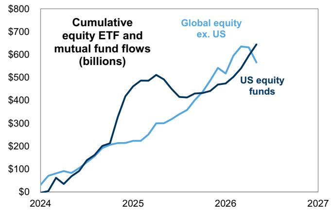

line

| Year | US equity funds (billions) | Global equity ex. US (billions) |
|------|-----------------------------|----------------------------------|
| 2024 | ~$50                        | ~$100                            |
| 2025 | ~$500                       | ~$450                            |
| 2026 | ~$600                       | ~$550                            |
| 2027 | ~$650                       | ~$600                            |

Source: EPFR, GS Global Investment Research

Recent changes to index inclusion rules should accelerate the demand from passive funds for some of the potential impending IPO supply. FTSE Russell recently approved methodology changes to Russell US indices that would allow fast entry for large IPOs, following in the footsteps of changes to the Nasdaq-100 methodology earlier this month. The consultation on treatment of large IPOs held by S&P Dow Jones Indices closed for comments this past week.

Exhibit 19: Passive funds and foreign investors have grown as owners of US equities   
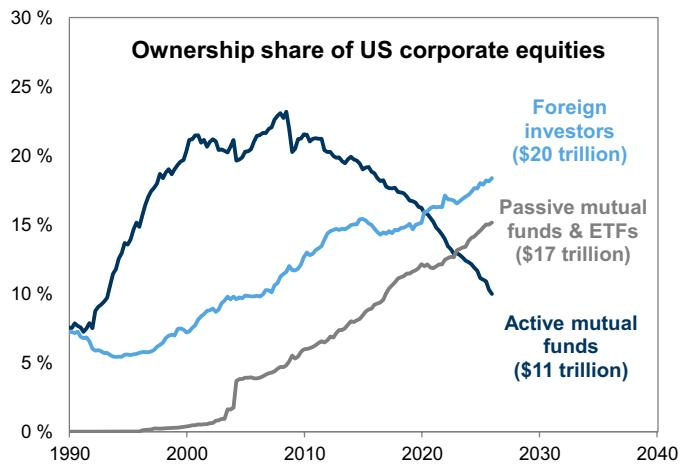

line

| Year | Foreign investors (%) | Passive mutual funds & ETFs (%) | Active mutual funds (%) |
|------|------------------------|----------------------------------|--------------------------|
| 1990 | ~7%                    | ~6%                              | 0%                       |
| 2000 | ~20%                   | ~10%                             | ~1%                      |
| 2010 | ~23%                   | ~15%                             | ~5%                      |
| 2020 | ~15%                   | ~17%                             | ~12%                     |
| 2030 | ~18%                   | ~18%                             | ~15%                     |
| 2040 | ~19%                   | ~19%                             | ~17%                     |

Source: Federal Reserve, GS Global Investment Research

Exhibit 20: Index inclusion timelines and AUM for select US equity indices 

<table><tr><td rowspan="2">Index</td><td colspan="2">Estimated benchmarked AUM ($ billions)</td><td rowspan="2">Earliest possible inclusion for large IPOs</td></tr><tr><td>Active</td><td>Passive</td></tr><tr><td>Russell 1000 Growth</td><td>1,770</td><td>408</td><td>5 trading days post IPO</td></tr><tr><td>Russell 1000 Value</td><td>1,698</td><td>240</td><td>5 trading days post IPO</td></tr><tr><td>Russell 1000</td><td>268</td><td>488</td><td>5 trading days post IPO</td></tr><tr><td>S&amp;P 500</td><td>8,044</td><td>10,100</td><td>6 months post IPO*</td></tr><tr><td>Nasdaq 100</td><td>6</td><td>617</td><td>15 trading days post IPO</td></tr><tr><td>S&amp;P Total Market</td><td>1</td><td>126</td><td>5 business days post IPO</td></tr><tr><td>CRSP Total Market</td><td>3</td><td>2,323</td><td>5 days post IPO</td></tr><tr><td>Total</td><td>11,789</td><td>14,302</td><td></td></tr></table>

\*S&P 500 timeline for consideration of inclusion based on proposed methodology for large IPOs in latest consultation. Current index methodology would require a 12-month seasoning period post-IPO before being considered for index inclusion.   
Source: eVestment, EPFR, GS Global Investment Research

# S&P 500 earnings and return forecasts

Pricing as of May 28, 2026, unless otherwise noted.

Exhibit 21: GS top-down S&P 500 forecasts   
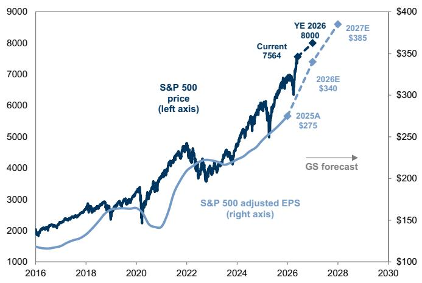

line

| Year | S&P 500 price | S&P 500 adjusted EPS |
|------|---------------|----------------------|
| 2026E | $340 | $275 |
| YE 2026 | 8000 | - |
| Current | 7564 | - |
| 2027E | - | $385 |

Source: FactSet, GS Global Investment Research

Exhibit 22: GS and consensus forecasts for S&P 500 earnings and returns 

<table><tr><td></td><td>GS forecast</td><td>Bottom-up analyst consensus</td><td>Top-down strategist consensus</td></tr><tr><td colspan="4">S&amp;P 500 EPS</td></tr><tr><td>2025</td><td>$275</td><td>$275</td><td>$275</td></tr><tr><td>Y/Y growth</td><td>12 %</td><td>12 %</td><td>12 %</td></tr><tr><td>2026</td><td>$340</td><td>$340</td><td>$320</td></tr><tr><td>Y/Y growth</td><td>24 %</td><td>24 %</td><td>16 %</td></tr><tr><td>2027</td><td>$385</td><td>$395</td><td>$364</td></tr><tr><td>Y/Y growth</td><td>13 %</td><td>16 %</td><td>14 %</td></tr><tr><td colspan="4">S&amp;P 500 P/E</td></tr><tr><td>Current on NTM EPS</td><td>21x</td><td>21x</td><td>22x</td></tr><tr><td colspan="4">S&amp;P 500 price target</td></tr><tr><td>YE 2026</td><td>8000</td><td rowspan="2">NA</td><td>7600</td></tr><tr><td>Return to target</td><td>6 %</td><td>0 %</td></tr><tr><td>12-month</td><td>8300</td><td>8550</td><td rowspan="2">NA</td></tr><tr><td>Return to target</td><td>10 %</td><td>13 %</td></tr></table>

Source: Bloomberg, FactSet, GS Global Investment Research

# Biggest stock movers this week

Exhibit 23: S&P 500 stocks with the largest moves this week

as of May 29, 2026

<table><tr><td rowspan="2">Company</td><td rowspan="2">Ticker</td><td rowspan="2">Industry group</td><td colspan="4">Total return</td><td rowspan="2">Market cap (bn)</td><td rowspan="2">Consensus 2026 EPS growth</td><td rowspan="2">Fwd 12m P/E</td></tr><tr><td>This week</td><td>3m</td><td>6m</td><td>12m</td></tr><tr><td colspan="10">Top 10 returns this week</td></tr><tr><td>Dell Technologies</td><td>DELL</td><td>Tech Hardware &amp; Equipment</td><td>43 %</td><td>115 %</td><td>140 %</td><td>183 %</td><td>$207</td><td>43 %</td><td>25x</td></tr><tr><td>Super Micro Computer</td><td>SMCI</td><td>Tech Hardware &amp; Equipment</td><td>30</td><td>28</td><td>22</td><td>(2)</td><td>25</td><td>68</td><td>15</td></tr><tr><td>Micron Technology</td><td>MU</td><td>Semiconductors &amp; Semi Equip</td><td>29</td><td>124</td><td>291</td><td>863</td><td>1,041</td><td>622</td><td>10</td></tr><tr><td>Robinhood Markets</td><td>HOOD</td><td>Financial Services</td><td>28</td><td>12</td><td>(34)</td><td>30</td><td>76</td><td>(9)</td><td>48</td></tr><tr><td>AppLovin Corp.</td><td>APP</td><td>Software &amp; Services</td><td>27</td><td>38</td><td>0</td><td>54</td><td>202</td><td>64</td><td>35</td></tr><tr><td>Best Buy Inc.</td><td>BBY</td><td>Consumer Discretionary Retail</td><td>26</td><td>22</td><td>(3)</td><td>10</td><td>16</td><td>1</td><td>12</td></tr><tr><td>NetApp Inc.</td><td>NTAP</td><td>Tech Hardware &amp; Equipment</td><td>25</td><td>45</td><td>29</td><td>46</td><td>28</td><td>11</td><td>20</td></tr><tr><td>Dollar Tree Inc.</td><td>DLTR</td><td>Consumer Staples Retail</td><td>23</td><td>(11)</td><td>2</td><td>26</td><td>22</td><td>17</td><td>16</td></tr><tr><td>ServiceNow Inc.</td><td>NOW</td><td>Software &amp; Services</td><td>22</td><td>1</td><td>(33)</td><td>(47)</td><td>112</td><td>18</td><td>29</td></tr><tr><td>First Solar Inc.</td><td>FSLR</td><td>Semiconductors &amp; Semi Equip</td><td>19</td><td>54</td><td>11</td><td>94</td><td>33</td><td>22</td><td>16</td></tr><tr><td colspan="10">Bottom 10 returns this week</td></tr><tr><td>Boston Scientific</td><td>BSX</td><td>Health Care Equipment &amp; Svcs</td><td>(16)%</td><td>(36)%</td><td>(52)%</td><td>(53)%</td><td>$73</td><td>11 %</td><td>14x</td></tr><tr><td>AutoZone Inc.</td><td>AZO</td><td>Consumer Discretionary Retail</td><td>(14)</td><td>(20)</td><td>(24)</td><td>(20)</td><td>50</td><td>9</td><td>17</td></tr><tr><td>Rollins Inc.</td><td>ROL</td><td>Commercial &amp; Professional Svcs</td><td>(11)</td><td>(19)</td><td>(19)</td><td>(12)</td><td>24</td><td>11</td><td>38</td></tr><tr><td>ONEOK Inc.</td><td>OKE</td><td>Energy</td><td>(11)</td><td>6</td><td>23</td><td>14</td><td>55</td><td>5</td><td>14</td></tr><tr><td>Lumentum Holdings</td><td>LITE</td><td>Tech Hardware &amp; Equipment</td><td>(10)</td><td>23</td><td>165</td><td>1005</td><td>67</td><td>217</td><td>54</td></tr><tr><td>Synopsys Inc.</td><td>SNPS</td><td>Software &amp; Services</td><td>(9)</td><td>16</td><td>15</td><td>4</td><td>92</td><td>15</td><td>30</td></tr><tr><td>Williams Companies</td><td>WMB</td><td>Energy</td><td>(9)</td><td>(1)</td><td>22</td><td>25</td><td>89</td><td>3</td><td>31</td></tr><tr><td>ResMed Inc.</td><td>RMD</td><td>Health Care Equipment &amp; Svcs</td><td>(8)</td><td>(20)</td><td>(20)</td><td>(16)</td><td>30</td><td>13</td><td>16</td></tr><tr><td>Everest Group Ltd.</td><td>EG</td><td>Insurance</td><td>(8)</td><td>(0)</td><td>7</td><td>1</td><td>13</td><td>11</td><td>6</td></tr><tr><td>Kinder Morgan Inc.</td><td>KMI</td><td>Energy</td><td>(8)</td><td>(3)</td><td>19</td><td>19</td><td>71</td><td>15</td><td>22</td></tr><tr><td>Median S&amp;P 500 stock</td><td></td><td></td><td>(0)%</td><td>(2)%</td><td>5 %</td><td>14 %</td><td>$41</td><td>10 %</td><td>18x</td></tr><tr><td>S&amp;P 500 Index</td><td></td><td></td><td>1</td><td>10</td><td>11</td><td>30</td><td>67,665</td><td>24</td><td>21</td></tr></table>

Source: FactSet, GS Global Investment Research

# YTD absolute and risk-adjusted returns

Exhibit 24: YTD asset returns and return/volatility ratios   
Total return (%)   
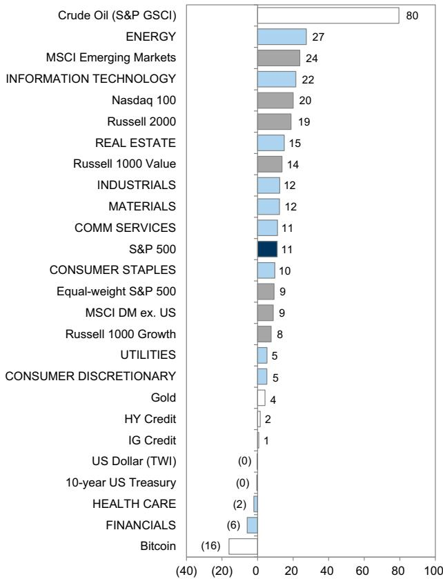

bar

| Category | Value |
| :--- | :--- |
| Crude Oil (S&P GSCI) | 80 |
| ENERGY | 27 |
| MSCI Emerging Markets | 24 |
| INFORMATION TECHNOLOGY | 22 |
| Nasdaq 100 | 20 |
| Russell 2000 | 19 |
| REAL ESTATE | 15 |
| Russell 1000 Value | 14 |
| INDUSTRIALS | 12 |
| MATERIALS | 12 |
| COMM SERVICES | 11 |
| S&P 500 | 11 |
| CONSUMER STAPLES | 10 |
| Equal-weight S&P 500 | 9 |
| MSCI DM ex. US | 9 |
| Russell 1000 Growth | 8 |
| UTILITIES | 5 |
| CONSUMER DISCRETIONARY | 5 |
| Gold | 4 |
| HY Credit | 2 |
| IG Credit | 1 |
| US Dollar (TWI) | (0) |
| 10-year US Treasury | (0) |
| HEALTH CARE | (2) |
| FINANCIALS | (6) |
| Bitcoin | (16) |

Risk-adjusted return (Return/realized volatility)   
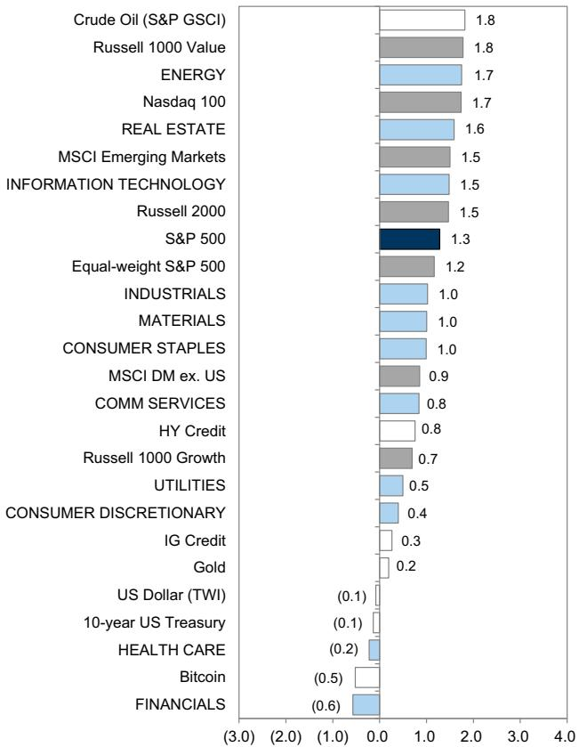

bar

| Entity | Value |
| :--- | :--- |
| Crude Oil (S&P GSCI) | 1.8 |
| Russell 1000 Value | 1.8 |
| ENERGY | 1.7 |
| Nasdaq 100 | 1.7 |
| REAL ESTATE | 1.6 |
| MSCI Emerging Markets | 1.5 |
| INFORMATION TECHNOLOGY | 1.5 |
| Russell 2000 | 1.5 |
| S&P 500 | 1.3 |
| Equal-weight S&P 500 | 1.2 |
| INDUSTRIALS | 1.0 |
| MATERIALS | 1.0 |
| CONSUMER STAPLES | 1.0 |
| MSCI DM ex. US | 0.9 |
| COMM SERVICES | 0.8 |
| HY Credit | 0.8 |
| Russell 1000 Growth | 0.7 |
| UTILITIES | 0.5 |
| CONSUMER DISCRETIONARY | 0.4 |
| IG Credit | 0.3 |
| Gold | 0.2 |
| US Dollar (TWI) | (0.1) |
| 10-year US Treasury | (0.1) |
| HEALTH CARE | (0.2) |
| Bitcoin | (0.5) |
| FINANCIALS | (0.6) |

Crude oil represents S&P GSCI Crude Oil Index.   
Source: FactSet, Haver Analytics, GS Global Investment Research

# Sentiment and flows

Exhibit 25: GS US Equity Sentiment Indicator of investor positioning   
as of May 29, 2026   
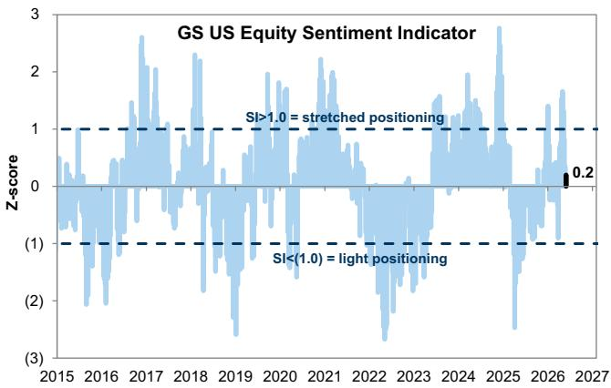

line

| Year | Z-score |
|------|---------|
| 2027 | 0.2     |

The Sentiment Indicator combines 9 measures of positioning across institutional, retail, and foreign investors and has historically been a statistically significant signal for near-term S&P 500 returns.   
Source: GS Global Investment Research

Exhibit 26: Recent mutual fund and ETF flows   
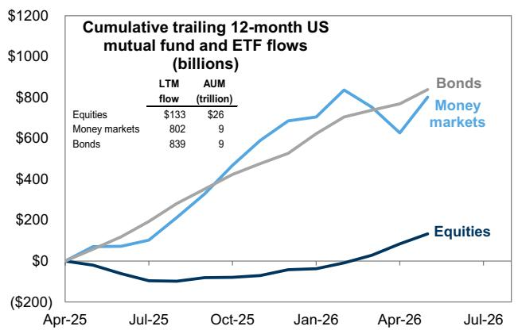

line

| Date   | Bonds | Money markets | Equities |
|--------|-------|---------------|----------|
| Apr-25 | $133  | $0            | $0       |
| Jul-25 | $802  | $9            | ($200)   |
| Oct-25 | $400  | $400          | ($200)   |
| Jan-26 | $700  | $800          | ($200)   |
| Apr-26 | $800  | $600          | ($200)   |
| Jul-26 | $839  | $800          | ($200)   |

Source: EPFR, GS Global Investment Research

# Economic growth

Exhibit 27: US equity market internal pricing of economic growth   
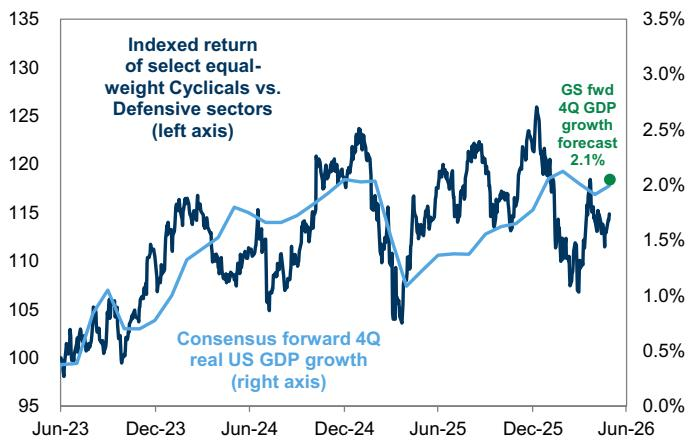

line

| Date    | Indexed return of select equal-weight Cyclicals vs. Defensive sectors (left axis) | Consensus forward 4Q real US GDP growth (right axis) |
|---------|------------------------------------------------------------------------|-----------------------------------------------------|
| Jun-26  | 125                                                                    | 2.1%                                                |

Source: Bloomberg, GS Global Investment Research

Exhibit 28: GS and consensus forecasts for US real GDP growth   
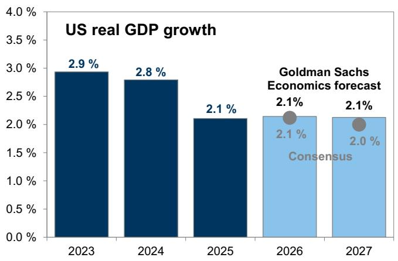

bar

| Year | US real GDP growth |
| ---- | ------------------ |
| 2023 | 2.9%               |
| 2024 | 2.8%               |
| 2025 | 2.1%               |
| 2026 | 2.1%               |
| 2027 | 2.1%               |

Source: Bloomberg, GS Global Investment Research

# Interest rates and financial conditions

Exhibit 29: Market pricing of near-term and long-term interest rate outlook   
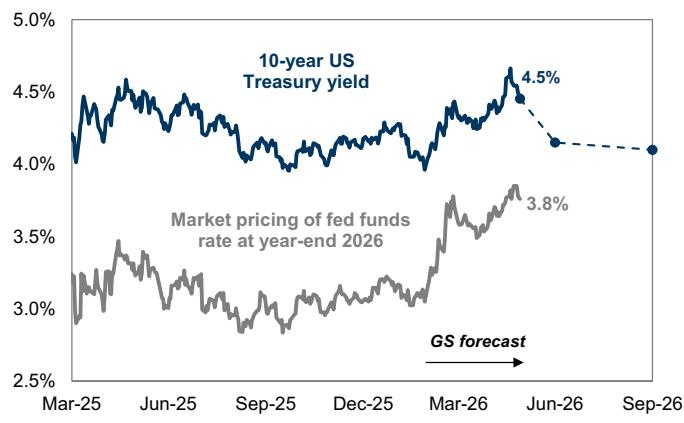

line

| Date    | 10-year US Treasury yield | Market pricing of fed funds rate at year-end 2026 |
|---------|---------------------------|--------------------------------------------------|
| Jun-26  | 4.5%                      | 3.8%                                             |

Source: GS Global Investment Research

Exhibit 30: GS Financial Conditions Index   
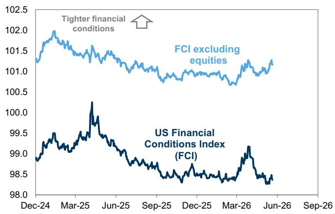

line

| Date    | FCI excluding equities | US Financial Conditions Index (FCI) |
|---------|------------------------|-------------------------------------|
| Dec-24  | ~101.3                 | ~98.9                               |
| Mar-25  | ~101.8                 | ~100.2                              |
| Jun-25  | ~101.4                 | ~99.5                               |
| Sep-25  | ~101.0                 | ~98.7                               |
| Dec-25  | ~100.8                 | ~98.5                               |
| Mar-26  | ~101.2                 | ~99.2                               |
| Jun-26  | ~101.3                 | ~98.4                               |

Source: GS Global Investment Research

# Market breadth and concentration

Exhibit 31: S&P 500 52-week market breadth   
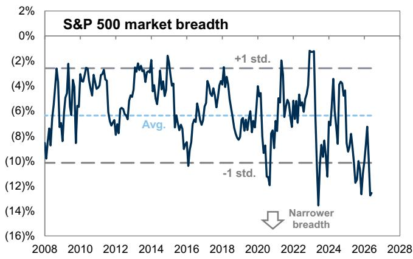

line

| Year | Value |
|------|-------|
| 2008 | -8%   |
| 2010 | -2%   |
| 2012 | -6%   |
| 2014 | -4%   |
| 2016 | -10%  |
| 2018 | -6%   |
| 2020 | -4%   |
| 2022 | -12%  |
| 2024 | -16%  |
| 2026 | -10%  |

Market breadth calculated as the difference between the distance of the aggregate S&P 500 Index from its 52-week high and the distance of the median S&P 500 constituent from its 52-week high. When the aggregate index is much closer to its 52-week high than is the median stock, market breadth is narrow.

Exhibit 32: Concentration of S&P 500 market cap and earnings in the 10 largest index constituents   
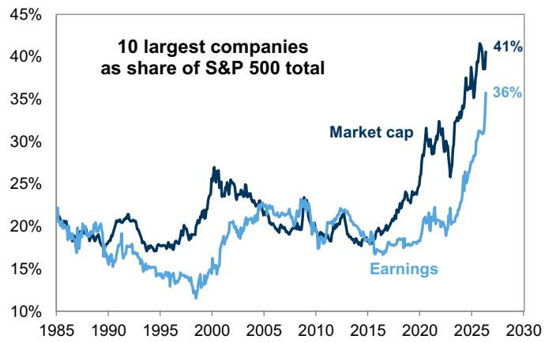

line

| Year | Market cap | Earnings |
|------|------------|----------|
| 2025 | 41%        | 36%      |

Earnings reflect consensus forward 12-month estimates.   
Source: Compustat, IBES, FactSet, GS Global Investment Research   
Source: GS Global Investment Research

# Correlation and volatility

Exhibit 33: S&P 500 realized average stock correlation   
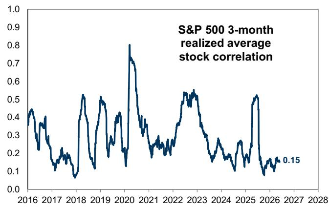

line

| Year | S&P 500 3-month realized average stock correlation |
| ---- | -------------------------------------------------- |
| 2027 | 0.15                                               |

Source: GS Global Investment Research

Exhibit 34: S&P 500 implied volatility   
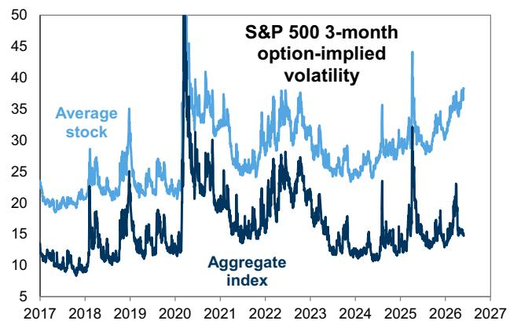

line

| Year | Average stock | Aggregate index |
|------|---------------|-----------------|
| 2017 | ~20           | ~10             |
| 2018 | ~25           | ~15             |
| 2019 | ~35           | ~20             |
| 2020 | ~50           | ~15             |
| 2021 | ~35           | ~25             |
| 2022 | ~30           | ~20             |
| 2023 | ~35           | ~15             |
| 2024 | ~30           | ~10             |
| 2025 | ~45           | ~15             |
| 2026 | ~35           | ~20             |
| 2027 | ~38           | ~15             |

Source: GS Global Investment Research

# IPO Barometer and mutual fund performance

Exhibit 35: GS IPO Barometer   
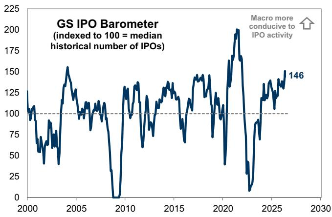

line

| Year | Value |
|------|-------|
| 2030 | 146   |

The GS IPO Barometer combines five indicators that gauge the conduciveness of the macro environment to IPO activity.

Exhibit 36: US equity mutual fund returns relative to benchmarks 

<table><tr><td>Mutual fund style</td><td>Average YTD return</td><td>% outperforming benchmarks YTD</td></tr><tr><td>Large-cap core</td><td>9%</td><td>25%</td></tr><tr><td>Large-cap growth</td><td>8</td><td>50</td></tr><tr><td>Large-cap value</td><td>9</td><td>13</td></tr><tr><td>Large-cap total</td><td>9%</td><td>29%</td></tr><tr><td>Small-cap core</td><td>15%</td><td>19%</td></tr></table>

Source: FactSet, GS Global Investment Research   
Source: GS Global Investment Research

# Earnings growth

Exhibit 37: Realized and consensus EPS growth for select US equity indices   
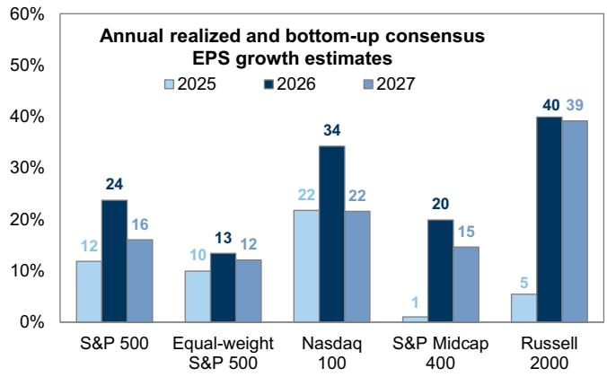

bar

Annual realized and bottom-up consensus EPS growth estimates
| Index | 2025 (%) | 2026 (%) | 2027 (%) |
| :--- | :--- | :--- | :--- |
| S&P 500 | 12 | 24 | 16 |
| Equal-weight S&P 500 | 10 | 13 | 12 |
| Nasdaq 100 | 22 | 34 | 22 |
| S&P Midcap 400 | 1 | 20 | 15 |
| Russell 2000 | 5 | 40 | 39 |

Source: FactSet, GS Global Investment Research

Exhibit 38: Realized and consensus year/year S&P 500 EPS growth   
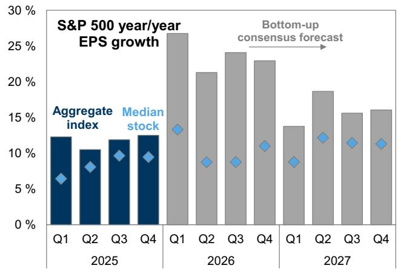

bar

| Quarter | Aggregate index | Median stock |
| ------- | --------------- | ------------ |
| Q1 2025 | ~12%            | ~13%         |
| Q2 2025 | ~10%            | ~9%          |
| Q3 2025 | ~11%            | ~10%         |
| Q4 2025 | ~12%            | ~10%         |
| Q1 2026 | ~27%            | ~13%         |
| Q2 2026 | ~21%            | ~9%          |
| Q3 2026 | ~24%            | ~9%          |
| Q4 2026 | ~23%            | ~11%         |
| Q1 2027 | ~14%            | ~9%          |
| Q2 2027 | ~19%            | ~12%         |
| Q3 2027 | ~16%            | ~11%         |
| Q4 2027 | ~16%            | ~11%         |

Source: FactSet, GS Global Investment Research

Exhibit 39: S&P 500 FY2 earnings revision breadth   
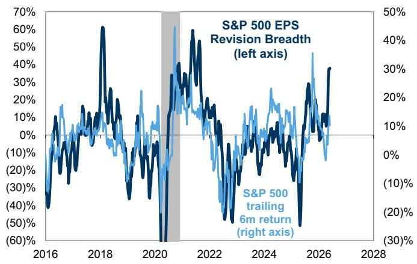

line

| Year | S&P 500 EPS Revision Breadth (left axis) | S&P 500 trailing 6m return (right axis) |
|------|------------------------------------------|------------------------------------------|
| 2016 | ~10%                                     | ~-10%                                    |
| 2018 | ~60%                                     | ~-40%                                    |
| 2020 | ~-60%                                    | ~-20%                                    |
| 2022 | ~60%                                     | ~-20%                                    |
| 2024 | ~20%                                     | ~-10%                                    |
| 2026 | ~40%                                     | ~-30%                                    |
| 2028 | ~30%                                     | ~-20%                                    |

Revision breadth calculated as [(# of companies with positive EPS revisions)-(# of companies with negative revisions)]/(total # of companies). Revisions reflect FY2 EPS estimate changes during a rolling 1-month window.   
Source: FactSet, GS Global Investment Research

# Valuations

Exhibit 40: US equity index P/E valuations vs. history   
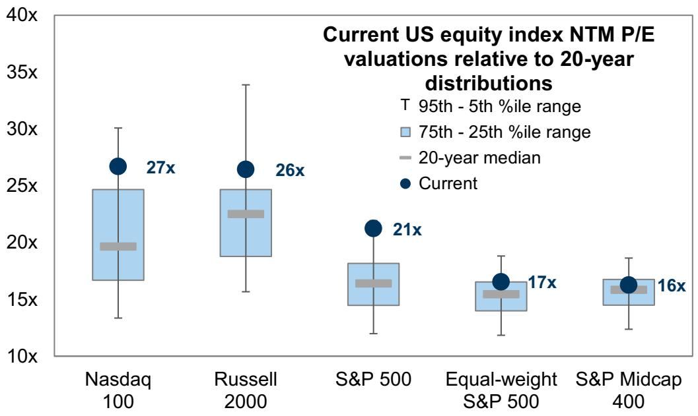

boxplot

| Index / Category       | Current NTM P/E Valuation (x) |
| ---------------------- | ----------------------------- |
| Nasdaq 100             | 27                            |
| Russell 2000           | 26                            |
| S&P 500                | 21                            |
| Equal-weight S&P 500    | 17                            |
| S&P Midcap 400         | 16                            |

Source: Compustat, FactSet, IBES, GS Global Investment Research

Exhibit 41: S&P 500 consensus forward 12-month P/E   
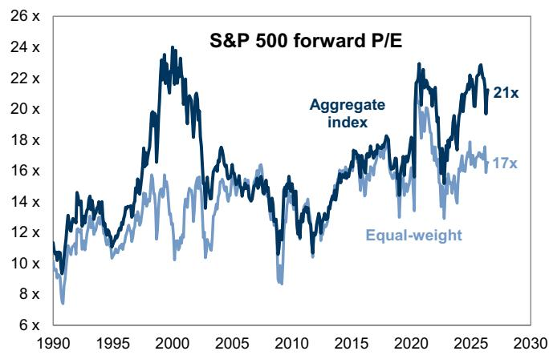

line

| Year | Aggregate index | Equal-weight |
|------|-----------------|--------------|
| 2030 | 21x             | 17x          |

Source: Compustat, FactSet, IBES, GS Global Investment Research

Exhibit 42: S&P 500 valuation relative to US Treasury yields   
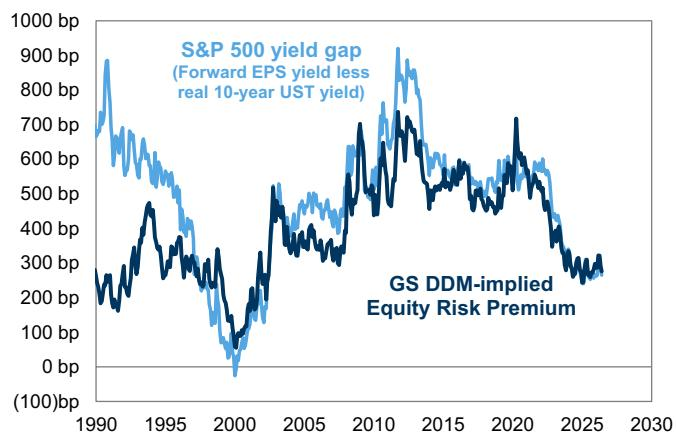

line

| Year | S&P 500 yield gap (Forward EPS yield less real 10-year UST yield) | GS DDM-implied Equity Risk Premium |
|------|------------------------------------------------------------------------|-------------------------------------|
| 1990 | ~850 bp                                                              | ~250 bp                             |
| 1995 | ~600 bp                                                              | ~400 bp                             |
| 2000 | ~100 bp                                                              | ~50 bp                              |
| 2005 | ~500 bp                                                              | ~300 bp                             |
| 2010 | ~750 bp                                                              | ~600 bp                             |
| 2015 | ~600 bp                                                              | ~550 bp                             |
| 2020 | ~550 bp                                                              | ~500 bp                             |
| 2025 | ~300 bp                                                              | ~250 bp                             |
| 2030 | ~250 bp                                                              | ~200 bp                             |

Equity risk premium calculated by solving for the discount rate that equates the fair value of our multi-stage S&P 500 dividend discount model to the current market price and subtracting the 10-year US Treasury yield.   
Source: GS Global Investment Research

# Sector returns, earnings, and valuations

Exhibit 43: Sector and industry group returns 

<table><tr><td rowspan="3" colspan="2">S&amp;P 500</td><td rowspan="2">Index weight</td><td rowspan="2">1 Week</td><td colspan="4">Top quartile</td><td rowspan="3">GS allocation</td></tr><tr><td>1 Month</td><td>3 Months</td><td>Last 12 Mo</td><td>YTD</td></tr><tr><td>100 %</td><td>1.6 %</td><td>6 %</td><td>10 %</td><td>30 %</td><td>11 %</td></tr><tr><td rowspan="11">SECTOR</td><td>Information Technology</td><td>38 %</td><td>3.2 %</td><td>13 %</td><td>29 %</td><td>53 %</td><td>22 %</td><td rowspan="4">OW</td></tr><tr><td>Consumer Discretionary</td><td>10</td><td>2.8</td><td>5</td><td>9</td><td>18</td><td>5</td></tr><tr><td>Materials</td><td>2</td><td>2.0</td><td>(0)</td><td>(5)</td><td>20</td><td>12</td></tr><tr><td>Industrials</td><td>8</td><td>2.0</td><td>2</td><td>(2)</td><td>24</td><td>12</td></tr><tr><td>Health Care</td><td>8</td><td>1.9</td><td>5</td><td>(5)</td><td>17</td><td>(2)</td><td rowspan="7">OW</td></tr><tr><td>Communication Services</td><td>11</td><td>1.0</td><td>5</td><td>11</td><td>44</td><td>11</td></tr><tr><td>Real Estate</td><td>2</td><td>(0.1)</td><td>2</td><td>3</td><td>15</td><td>15</td></tr><tr><td>Utilities</td><td>2</td><td>(0.8)</td><td>(3)</td><td>(6)</td><td>14</td><td>5</td></tr><tr><td>Financials</td><td>11</td><td>(0.9)</td><td>(1)</td><td>0</td><td>3</td><td>(6)</td></tr><tr><td>Consumer Staples</td><td>5</td><td>(1.4)</td><td>0</td><td>(6)</td><td>7</td><td>10</td></tr><tr><td>Energy</td><td>3</td><td>(4.0)</td><td>(2)</td><td>2</td><td>44</td><td>27</td></tr><tr><td rowspan="24">INDUSTRY</td><td>Automobiles &amp; Components</td><td>2 %</td><td>6.7 %</td><td>18 %</td><td>10 %</td><td>28 %</td><td>(0)%</td><td rowspan="24"></td></tr><tr><td>Pharma Biotech &amp; Life Sciences</td><td>5</td><td>3.6</td><td>9</td><td>(4)</td><td>34</td><td>2</td></tr><tr><td>Semiconductors &amp; Semi Equipment</td><td>18</td><td>3.3</td><td>15</td><td>41</td><td>107</td><td>43</td></tr><tr><td>Technology Hardware &amp; Equipment</td><td>11</td><td>3.3</td><td>18</td><td>26</td><td>74</td><td>29</td></tr><tr><td>Software &amp; Services</td><td>9</td><td>2.8</td><td>6</td><td>12</td><td>(8)</td><td>(11)</td></tr><tr><td>Consumer Durables &amp; Apparel</td><td>0</td><td>2.7</td><td>(2)</td><td>(14)</td><td>(0)</td><td>(7)</td></tr><tr><td>Transportation</td><td>1</td><td>2.4</td><td>3</td><td>2</td><td>25</td><td>12</td></tr><tr><td>Capital Goods</td><td>6</td><td>2.2</td><td>2</td><td>(1)</td><td>34</td><td>17</td></tr><tr><td>Household &amp; Personal Products</td><td>1</td><td>2.1</td><td>0</td><td>(11)</td><td>(9)</td><td>5</td></tr><tr><td>Materials</td><td>2</td><td>2.0</td><td>(0)</td><td>(5)</td><td>20</td><td>12</td></tr><tr><td>Consumer Discretionary Retail</td><td>6</td><td>1.7</td><td>3</td><td>16</td><td>23</td><td>12</td></tr><tr><td>Consumer Services</td><td>2</td><td>1.6</td><td>(0)</td><td>(5)</td><td>(1)</td><td>(5)</td></tr><tr><td>Media &amp; Entertainment</td><td>10</td><td>1.2</td><td>5</td><td>13</td><td>49</td><td>12</td></tr><tr><td>Real Estate Investment Trusts (REITs)</td><td>2</td><td>(0.1)</td><td>2</td><td>3</td><td>15</td><td>15</td></tr><tr><td>Financial Services</td><td>7</td><td>(0.3)</td><td>1</td><td>1</td><td>(1)</td><td>(6)</td></tr><tr><td>Commercial &amp; Professional Svcs</td><td>1</td><td>(0.5)</td><td>(1)</td><td>(10)</td><td>(26)</td><td>(13)</td></tr><tr><td>Utilities</td><td>2</td><td>(0.8)</td><td>(3)</td><td>(6)</td><td>14</td><td>5</td></tr><tr><td>Telecommunication Services</td><td>1</td><td>(0.9)</td><td>(2)</td><td>(10)</td><td>(3)</td><td>5</td></tr><tr><td>Banks</td><td>3</td><td>(0.9)</td><td>(4)</td><td>1</td><td>21</td><td>(5)</td></tr><tr><td>Health Care Equipment &amp; Services</td><td>3</td><td>(1.2)</td><td>(2)</td><td>(8)</td><td>(5)</td><td>(9)</td></tr><tr><td>Food Beverage &amp; Tobacco</td><td>2</td><td>(1.4)</td><td>3</td><td>(4)</td><td>10</td><td>11</td></tr><tr><td>Consumer Staples Retail</td><td>2</td><td>(2.8)</td><td>(3)</td><td>(5)</td><td>12</td><td>10</td></tr><tr><td>Insurance</td><td>1</td><td>(3.5)</td><td>(4)</td><td>(6)</td><td>(9)</td><td>(6)</td></tr><tr><td>Energy</td><td>3</td><td>(4.0)</td><td>(2)</td><td>2</td><td>44</td><td>27</td></tr></table>

Source: FactSet, GS Global Investment Research

Exhibit 44: Earnings contributions and growth by S&P 500 sector 

<table><tr><td rowspan="3">Sector</td><td rowspan="3">2025A</td><td colspan="4">Consensus bottom-up</td></tr><tr><td colspan="2">Contribution</td><td colspan="2">EPS growth</td></tr><tr><td>2026</td><td>2027</td><td>2026</td><td>2027</td></tr><tr><td>Info Tech</td><td>$70</td><td>$106</td><td>$136</td><td>51 %</td><td>28 %</td></tr><tr><td>Financials</td><td>52</td><td>56</td><td>63</td><td>8</td><td>11</td></tr><tr><td>Health Care</td><td>33</td><td>34</td><td>40</td><td>1</td><td>18</td></tr><tr><td>Comm Services</td><td>29</td><td>37</td><td>39</td><td>26</td><td>6</td></tr><tr><td>Cons Discretionary</td><td>23</td><td>26</td><td>29</td><td>14</td><td>14</td></tr><tr><td>Industrials</td><td>21</td><td>23</td><td>28</td><td>9</td><td>19</td></tr><tr><td>Consumer Staples</td><td>15</td><td>15</td><td>17</td><td>4</td><td>8</td></tr><tr><td>Energy</td><td>12</td><td>19</td><td>18</td><td>61</td><td>(7)</td></tr><tr><td>Utilities</td><td>8</td><td>9</td><td>10</td><td>14</td><td>9</td></tr><tr><td>Materials</td><td>5</td><td>8</td><td>8</td><td>41</td><td>9</td></tr><tr><td>Real Estate</td><td>6</td><td>7</td><td>8</td><td>15</td><td>8</td></tr><tr><td>S&amp;P 500</td><td>$275</td><td>$340</td><td>$395</td><td>24 %</td><td>16 %</td></tr></table>

Source: FactSet, GS Global Investment Research

Exhibit 45: S&P 500 sector P/E valuations relative to history 

<table><tr><td rowspan="3"></td><td colspan="5">Consensus forward 12-month P/E valuation</td></tr><tr><td rowspan="2">Current P/E</td><td colspan="2">Absolute P/E %ile rank vs. history</td><td colspan="2">P/E vs. S&amp;P 500 %ile rank vs. history</td></tr><tr><td>10-year</td><td>30-year</td><td>10-year</td><td>30-year</td></tr><tr><td>Consumer Discretionary</td><td>28x</td><td>64%</td><td>87%</td><td>33%</td><td>75%</td></tr><tr><td>Industrials</td><td>25</td><td>87</td><td>96</td><td>96</td><td>99</td></tr><tr><td>Information Technology</td><td>25</td><td>66</td><td>67</td><td>56</td><td>45</td></tr><tr><td>Consumer Staples</td><td>22</td><td>85</td><td>84</td><td>44</td><td>24</td></tr><tr><td>Communication Services</td><td>21</td><td>72</td><td>72</td><td>44</td><td>14</td></tr><tr><td>S&amp;P 500</td><td>21</td><td>65</td><td>82</td><td></td><td></td></tr><tr><td>Real Estate</td><td>18</td><td>61</td><td>78</td><td>33</td><td>31</td></tr><tr><td>Utilities</td><td>18</td><td>59</td><td>86</td><td>61</td><td>67</td></tr><tr><td>Materials</td><td>18</td><td>49</td><td>67</td><td>18</td><td>11</td></tr><tr><td>Health Care</td><td>17</td><td>69</td><td>62</td><td>33</td><td>14</td></tr><tr><td>Financials</td><td>14</td><td>34</td><td>62</td><td>1</td><td>3</td></tr><tr><td>Energy</td><td>13</td><td>34</td><td>44</td><td>33</td><td>12</td></tr></table>

Source: Compustat, FactSet, IBES, GS Global Investment Research

# Thematic baskets

Exhibit 46: Recent performance of select GS baskets

basket returns expressed relative to the equal-weight S&P 500 except for long/short basket pairs as noted

<table><tr><td rowspan="4" colspan="4"></td><td colspan="3">Top quartileBottom quartile</td></tr><tr><td>Ticker(GSTH_)</td><td>1 Wk</td><td>Total returns3 Mo 12 Mo YTD</td></tr><tr><td>S&amp;P 500</td><td>SPX</td><td>1.6 %</td></tr><tr><td>Equal-weight S&amp;P 500</td><td>SPW</td><td>1.7</td></tr><tr><td rowspan="4">Macroeconomic</td><td>Dual Beta</td><td>BETA</td><td>6.8 %</td><td>34 %</td><td>92 %</td><td>45 %</td></tr><tr><td>Low vs. High Labor Cost</td><td>LLAB / HLAB</td><td>2.5</td><td>8</td><td>23</td><td>14</td></tr><tr><td>Interest Rate Sensitive</td><td>USTY</td><td>1.9</td><td>22</td><td>28</td><td>19</td></tr><tr><td>High vs. Low Tax Rate</td><td>HTAX / LTAX</td><td>(3.7)</td><td>(6)</td><td>(5)</td><td>(1)</td></tr><tr><td rowspan="4">Geographic sales</td><td>EM Sales</td><td>BRIC</td><td>5.2 %</td><td>38 %</td><td>87 %</td><td>53 %</td></tr><tr><td>International Sales</td><td>INTL</td><td>3.6</td><td>25</td><td>52</td><td>33</td></tr><tr><td>Western Europe Sales</td><td>WEUR</td><td>1.6</td><td>10</td><td>14</td><td>8</td></tr><tr><td>US Sales</td><td>AINT</td><td>1.2</td><td>7</td><td>(12)</td><td>(4)</td></tr><tr><td rowspan="6">Fundamental</td><td>Long vs. Short Duration</td><td>LDUR / SDUR</td><td>3.7 %</td><td>8 %</td><td>(21)%</td><td>(8)%</td></tr><tr><td>ROE Growth</td><td>GROE</td><td>3.1</td><td>20</td><td>46</td><td>32</td></tr><tr><td>High vs. Low Operating Leverage</td><td>OPHI / OPLO</td><td>1.1</td><td>5</td><td>(10)</td><td>(5)</td></tr><tr><td>High Quality</td><td>QUAL</td><td>(0.7)</td><td>(3)</td><td>(14)</td><td>(9)</td></tr><tr><td>Stable Growers</td><td>STGR</td><td>(1.6)</td><td>(2)</td><td>(19)</td><td>(9)</td></tr><tr><td>Strong vs. Weak Balance Sheet</td><td>SBAL / WBAL</td><td>(1.9)</td><td>1</td><td>(20)</td><td>(9)</td></tr><tr><td rowspan="6">Uses of cash</td><td>Capex and R&amp;D</td><td>CAPX</td><td>5.4 %</td><td>29 %</td><td>63 %</td><td>36 %</td></tr><tr><td>High Growth Investment</td><td>HGIR</td><td>2.7</td><td>26</td><td>48</td><td>28</td></tr><tr><td>Total Cash Return</td><td>CASH</td><td>2.0</td><td>12</td><td>14</td><td>6</td></tr><tr><td>Dividend Growth</td><td>DIVG</td><td>1.6</td><td>9</td><td>17</td><td>6</td></tr><tr><td>Buybacks</td><td>REPO</td><td>1.0</td><td>9</td><td>5</td><td>1</td></tr><tr><td>Debt Reducers vs. Issuers</td><td>DRED / DISS</td><td>(0.1)</td><td>12</td><td>28</td><td>15</td></tr><tr><td rowspan="4">Ownership, risk &amp; liquidity</td><td>Hedge Fund VIP</td><td>HVIP</td><td>1.5 %</td><td>14 %</td><td>18 %</td><td>8 %</td></tr><tr><td>High Sharpe Ratio</td><td>SHRP</td><td>(0.8)</td><td>(4)</td><td>(15)</td><td>(8)</td></tr><tr><td>Mutual Fund Over- vs. Underweights</td><td>MFOW / MFUW</td><td>(0.9)</td><td>(22)</td><td>(34)</td><td>(26)</td></tr><tr><td>Low vs. High Liquidity</td><td>LLIQ / HLIQ</td><td>(1.5)</td><td>(16)</td><td>(20)</td><td>(15)</td></tr><tr><td rowspan="4">Equity research</td><td>Gov&#x27;t Exposure</td><td>GSRHGOVT</td><td>3.7 %</td><td>2 %</td><td>27 %</td><td>2 %</td></tr><tr><td>Oil Input Cost</td><td>GSRHOILX</td><td>3.6</td><td>(5)</td><td>(8)</td><td>1</td></tr><tr><td>M&amp;A Candidates</td><td>GSRHACQN</td><td>0.4</td><td>10</td><td>24</td><td>(5)</td></tr><tr><td>SMB Exposure</td><td>GSRHSMBX</td><td>(0.7)</td><td>5</td><td>(22)</td><td>(12)</td></tr></table>

Basket returns and constituents can be accessed via GS Marquee or Bloomberg using the indicated tickers.   
Source: GS Global Investment Research

# Factors

Exhibit 47: Indexed return of select equity factors   
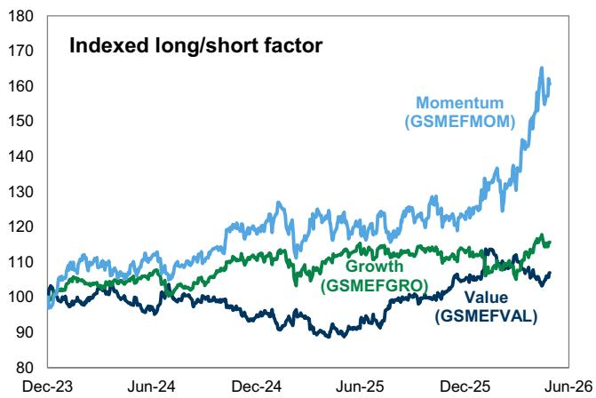

line

| Date    | Momentum (GSMEFMOM) | Growth (GSMEFGRO) | Value (GSMEFVAL) |
|---------|---------------------|-------------------|------------------|
| Jun-26  | ~165                | ~115              | ~105             |

Factor performance and constituents can be viewed on GS Marquee or Bloomberg using the tickers indicated on the chart.   
Source: GS Global Investment Research

Exhibit 48: Equity factor valuations relative to history   
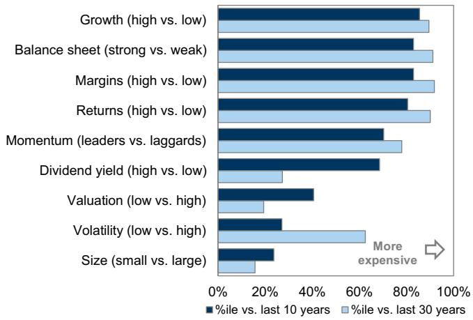

bar

| Metric | %ile vs. last 10 years (%) | %ile vs. last 30 years (%) |
| :--- | :--- | :--- |
| Growth (high vs. low) | 85 | 90 |
| Balance sheet (strong vs. weak) | 82 | 92 |
| Margins (high vs. low) | 84 | 91 |
| Returns (high vs. low) | 80 | 90 |
| Momentum (leaders vs. laggards) | 70 | 78 |
| Dividend yield (high vs. low) | 68 | 26 |
| Valuation (low vs. high) | 40 | 19 |
| Volatility (low vs. high) | 26 | 62 |
| Size (small vs. large) | 22 | 16 |
More expensive

Source: GS Global Investment Research

# GS global macro research cross-asset forecasts

Exhibit 49: GS macro research asset forecasts   
GS Global Macro Forecasts 

<table><tr><td></td><td>units</td><td>Current</td><td>3m</td><td>6m</td><td>12m</td><td>Change to 12m target</td></tr><tr><td colspan="7">Equities</td></tr><tr><td>TOPIX</td><td>level</td><td>3902</td><td>4100</td><td>4200</td><td>4400</td><td>13 %</td></tr><tr><td>MXAPJ</td><td>level</td><td>885</td><td>900</td><td>940</td><td>990</td><td>12</td></tr><tr><td>S&amp;P 500</td><td>level</td><td>7564</td><td>7600</td><td>8000</td><td>8300</td><td>10</td></tr><tr><td>STOXX Europe 600</td><td>level</td><td>625</td><td>640</td><td>645</td><td>660</td><td>6</td></tr><tr><td colspan="7">10-year rates</td></tr><tr><td>Euro Area (Germany)</td><td>%</td><td>2.5</td><td>3.0</td><td>3.0</td><td>3.0</td><td>55 bp</td></tr><tr><td>Japan</td><td>%</td><td>2.7</td><td>2.5</td><td>2.5</td><td>2.5</td><td>(20)</td></tr><tr><td>US</td><td>%</td><td>4.5</td><td>4.2</td><td>4.1</td><td>4.1</td><td>(35)</td></tr><tr><td colspan="7">Corporate bonds</td></tr><tr><td>High yield</td><td>bp</td><td>264</td><td>335</td><td>325</td><td>NA</td><td>NA</td></tr><tr><td>Investment grade</td><td>bp</td><td>79</td><td>95</td><td>92</td><td>NA</td><td>NA</td></tr><tr><td colspan="7">Currencies</td></tr><tr><td>Euro / US dollar</td><td>EUR/$</td><td>1.16</td><td>1.14</td><td>1.18</td><td>1.20</td><td>3 %</td></tr><tr><td>Sterling / US dollar</td><td>£/$</td><td>1.34</td><td>1.33</td><td>1.34</td><td>1.33</td><td>(1)</td></tr><tr><td>US dollar / Yen</td><td>$/¥</td><td>159</td><td>160</td><td>158</td><td>155</td><td>(3)</td></tr><tr><td colspan="7">Commodities</td></tr><tr><td>COMEX gold</td><td>$/troy oz</td><td>4532</td><td>4805</td><td>4990</td><td>5445</td><td>20 %</td></tr><tr><td>NYMEX nat. gas</td><td>$/mmBtu</td><td>3</td><td>3.50</td><td>3.50</td><td>3.50</td><td>7</td></tr><tr><td>Brent crude oil</td><td>$/bbl</td><td>93</td><td>94</td><td>91</td><td>86</td><td>(7)</td></tr><tr><td>LME copper</td><td>$/mt</td><td>13513</td><td>12635</td><td>12535</td><td>12265</td><td>(9)</td></tr></table>

Source: FactSet, GS Global Investment Research

# Disclosure Appendix

# Reg AC

We, Ben Snider, Ryan Hammond, Jenny Ma, Daniel Chavez, Kartik Jayachandran and Christophe Sung, hereby certify that all of the views expressed in this report accurately reflect our personal views, which have not been influenced by considerations of the firm's business or client relationships.

Unless otherwise stated, the individuals listed on the cover page of this report are analysts in GS' Global Investment Research division.

Contributing Authors: Ben Snider GS & Co. LLC, Ryan Hammond GS & Co. LLC, Jenny Ma GS & Co. LLC, Daniel Chavez GS & Co. LLC, Kartik Jayachandran GS & Co. LLC, Christophe Sung GS & Co. LLC.

Unless otherwise stated, the individuals listed in the Contributing Authors disclosure of this report are analysts in GS' Global Investment Research division.

# Disclosures

# Basket disclosure

The ability to trade the basket(s) in this report will depend upon market conditions, including liquidity and borrow constraints at the time of trade.

# Regulatory disclosures

# Disclosures required by United States laws and regulations

See company-specific regulatory disclosures above for any of the following disclosures required as to companies referred to in this report: manager or co-manager in a pending transaction; 1% or other ownership; compensation for certain services; types of client relationships; managed/co-managed public offerings in prior periods; directorships; for equity securities, market making and/or specialist role. GS trades or may trade as a principal in debt securities (or in related derivatives) of issuers discussed in this report.

The following are additional required disclosures: Ownership and material conflicts of interest: GS policy prohibits its analysts, professionals reporting to analysts and members of their households from owning securities of any company in the analyst's area of coverage. Analyst compensation: Analysts are paid in part based on the profitability of GS, which includes investment banking revenues. Analyst as officer or director: GS policy generally prohibits its analysts, persons reporting to analysts or members of their households from serving as an officer, director or advisor of any company in the analyst's area of coverage. Non-U.S. Analysts: Non-U.S. analysts may not be associated persons of GS & Co. LLC and therefore may not be subject to FINRA Rule 2241 or FINRA Rule 2242 restrictions on communications with a subject company, public appearances and trading in securities covered by the analysts.

# Additional disclosures required under the laws and regulations of jurisdictions other than the United States

The following disclosures are those required by the jurisdiction indicated, except to the extent already made above pursuant to United States laws and regulations. Australia: GS Australia Pty Ltd and its affiliates are not authorised deposit-taking institutions (as that term is defined in the Banking Act 1959 (Cth)) in Australia and do not provide banking services, nor carry on a banking business, in Australia. This research, and any access to it, is intended only for “wholesale clients” within the meaning of the Australian Corporations Act, unless otherwise agreed by GS. In producing research reports, members of Global Investment Research of GS Australia may attend site visits and other meetings hosted by the companies and other entities which are the subject of its research reports. In some instances the costs of such site visits or meetings may be met in part or in whole by the issuers concerned if GS Australia considers it is appropriate and reasonable in the specific circumstances relating to the site visit or meeting. To the extent that the contents of this document contains any financial product advice, it is general advice only and has been prepared by GS without taking into account a client’s objectives, financial situation or needs. A client should, before acting on any such advice, consider the appropriateness of the advice having regard to the client’s own objectives, financial situation and needs. A copy of certain GS Australia and New Zealand disclosure of interests and a copy of GS’ Australian Sell-Side Research Independence Policy Statement are available at: https://www.goldmansachs.com/disclosures/australia-new-zealand/index.html. Brazil: Disclosure information in relation to CVM Resolution n. 20 is available at https://www.gs.com/worldwide/brazil/area/gir/index.html. Where applicable, the Brazil-registered analyst primarily responsible for the content of this research report, as defined in Article 20 of CVM Resolution n. 20, is the first author named at the beginning of this report, unless indicated otherwise at the end of the text. Canada: This information is being provided to you for information purposes only and is not, and under no circumstances should be construed as, an advertisement, offering or solicitation by GS & Co. LLC for purchasers of securities in Canada to trade in any Canadian security. GS & Co. LLC is not registered as a dealer in any jurisdiction in Canada under applicable Canadian securities laws and generally is not permitted to trade in Canadian securities and may be prohibited from selling certain securities and products in certain jurisdictions in Canada. If you wish to trade in any Canadian securities or other products in Canada please contact GS Canada Inc., an affiliate of The GS Group Inc., or another registered Canadian dealer. Hong Kong: Further information on the securities of covered companies referred to in this research may be obtained on request from GS (Asia) L.L.C. India: Further information on the subject company or companies referred to in this research may be obtained from GS (India) Securities Private Limited, Research Analyst - SEBI Registration Number INH000001493, 10th Floor, Ascent-Worli, Sudam Kalu Ahire Marg, Worli, Mumbai-400 025, India, Corporate Identity Number U74140MH2006FTC160634, Phone +91 22 6616 9000, Fax +91 22 6616 9001. GS may beneficially own 1% or more of the securities (as such term is defined in clause 2 (h) the Indian Securities Contracts (Regulation) Act, 1956) of the subject company or companies referred to in this research report. Investment in securities market are subject to market risks. Read all the related documents carefully before investing. Registration granted by SEBI and certification from NISM in no way guarantee performance of the intermediary or provide any assurance of returns to investors. GS (India) Securities Private Limited compliance officer and investor grievance contact details can be found at: https://www.goldmansachs.com/worldwide/india/documents/Grievance-Redressal-and-Escalation-Matrix.pdf, and a copy of the annual audit compliance report can be found at this link: https://publishing.gs.com/content/site/india-annual-compliance-report.html. Japan: See below. Korea: This research, and any access to it, is intended only for “professional investors” within the meaning of the Financial Services and Capital Markets Act, unless otherwise agreed by GS. Further information on the subject company or companies referred to in this research may be obtained from GS (Asia) L.L.C., Seoul Branch. New Zealand: GS New Zealand Limited and its affiliates are neither “registered banks” nor “deposit takers” (as defined in the Reserve Bank of New Zealand Act 1989) in New Zealand. This research, and any access to it, is intended for “wholesale clients” (as defined in the Financial Advisers Act 2008) unless otherwise agreed by GS. A copy of certain GS Australia and New Zealand disclosure of interests is available at: https://www.goldmansachs.com/disclosures/australia-new-zealand/index.html. Russia: Research reports distributed in the Russian Federation are not advertising as defined in the Russian legislation, but are information and analysis not having product promotion as their main purpose and do not provide appraisal within the meaning of the Russian legislation on appraisal activity. Research reports do not constitute a personalized investment recommendation as defined in Russian laws and regulations, are not addressed to a specific client, and are prepared without analyzing the financial circumstances, investment profiles or risk profiles of clients. GS assumes no responsibility for any investment decisions that may be taken by a client or any other person based on this research report. Singapore: GS (Singapore) Pte. (Company Number: 198602165W), which is regulated by the Monetary Authority of Singapore, accepts legal responsibility for this

research, and should be contacted with respect to any matters arising from, or in connection with, this research. Taiwan: This material is for reference only and must not be reprinted without permission. Investors should carefully consider their own investment risk. Investment results are the responsibility of the individual investor. United Kingdom: Persons who would be categorized as retail clients in the United Kingdom, as such term is defined in the rules of the Financial Conduct Authority, should read this research in conjunction with prior GS on the covered companies referred to herein and should refer to the risk warnings that have been sent to them by GS International. A copy of these risks warnings, and a glossary of certain financial terms used in this report, are available from GS International on request.

European Union and United Kingdom: Disclosure information in relation to Article 6 (2) of the European Commission Delegated Regulation (EU) (2016/958) supplementing Regulation (EU) No 596/2014 of the European Parliament and of the Council (including as that Delegated Regulation is implemented into United Kingdom domestic law and regulation following the United Kingdom's departure from the European Union and the European Economic Area) with regard to regulatory technical standards for the technical arrangements for objective presentation of investment recommendations or other information recommending or suggesting an investment strategy and for disclosure of particular interests or indications of conflicts of interest is available at https://www.gs.com/disclosures/europeanpolicy.html which states the European Policy for Managing Conflicts of Interest in Connection with Investment Research.

Japan: GS Japan Co., Ltd. is a Financial Instrument Dealer registered with the Kanto Financial Bureau under registration number Kinsho 69, and a member of Japan Securities Dealers Association, Financial Futures Association of Japan Type II Financial Instruments Firms Association, and Investment Management Association of Japan. Sales and purchase of equities are subject to commission pre-determined with clients plus consumption tax. See company-specific disclosures as to any applicable disclosures required by Japanese stock exchanges, the Japanese Securities Dealers Association or the Japanese Securities Finance Company.

# Global product; distributing entities

GS Global Investment Research produces and distributes research products for clients of GS on a global basis. Analysts based in GS offices around the world produce research on industries and companies, and research on macroeconomics, currencies, commodities and portfolio strategy. This research is disseminated in Australia by GS Australia Pty Ltd (ABN 21 006 797 897); in Brazil by GS do Brasil Corretora de Títulos e Valores Mobiliários S.A.; Public Communication Channel GS Brazil: 0800 727 5764 and / or contatogoldmanbrasil@gs.com. Available Weekdays (except holidays), from 9am to 6pm. Canal de Comunicação com o Público GS Brasil: 0800 727 5764 e/ou contatogoldmanbrasil@gs.com. Horário de funcionamento: segunda-feira à sexta-feira (exceto feriados), das 9h às 18h; in Canada by GS & Co. LLC; in Hong Kong by GS (Asia) L.L.C.; in India by GS (India) Securities Private Ltd.; in Japan by GS Japan Co., Ltd.; in the Republic of Korea by GS (Asia) L.L.C., Seoul Branch; in New Zealand by GS New Zealand Limited; in Russia by OOO GS; in Singapore by GS (Singapore) Pte. (Company Number: 198602165W); and in the United States of America by GS & Co. LLC. GS International has approved this research in connection with its distribution in the United Kingdom.

GS International (“GSI”), authorised by the Prudential Regulation Authority (“PRA”) and regulated by the Financial Conduct Authority (“FCA”) and the PRA, has approved this research in connection with its distribution in the United Kingdom.

European Economic Area: GS Bank Europe SE (“GSBE”) is a credit institution incorporated in Germany and, within the Single Supervisory Mechanism, subject to direct prudential supervision by the European Central Bank and in other respects supervised by German Federal Financial Supervisory Authority (Bundesanstalt für Finanzdienstleistungsaufsicht, BaFin) and Deutsche Bundesbank and disseminates research within the European Economic Area.

# General disclosures

This research is for our clients only. Other than disclosures relating to GS, this research is based on current public information that we consider reliable, but we do not represent it is accurate or complete, and it should not be relied on as such. The information, opinions, estimates and forecasts contained herein are as of the date hereof and are subject to change without prior notification. We seek to update our research as appropriate, but various regulations may prevent us from doing so. Other than certain industry reports published on a periodic basis, the large majority of reports are published at irregular intervals as appropriate in the analyst's judgment.

GS conducts a global full-service, integrated investment banking, investment management, and brokerage business. We have investment banking and other business relationships with a substantial percentage of the companies covered by Global Investment Research. GS & Co. LLC, the United States broker dealer, is a member of SIPC (https://www.sipc.org).

Our salespeople, traders, and other professionals may provide oral or written market commentary or trading strategies to our clients and principal trading desks that reflect opinions that are contrary to the opinions expressed in this research. Our asset management area, principal trading desks and investing businesses may make investment decisions that are inconsistent with the recommendations or views expressed in this research.

We and our affiliates, officers, directors, and employees will from time to time have long or short positions in, act as principal in, and buy or sell, the securities or derivatives, if any, referred to in this research, unless otherwise prohibited by regulation or GS policy.

The views attributed to third party presenters at GS arranged conferences, including individuals from other parts of GS, do not necessarily reflect those of Global Investment Research and are not an official view of GS.

Any third party referenced herein, including any salespeople, traders and other professionals or members of their household, may have positions in the products mentioned that are inconsistent with the views expressed by analysts named in this report.

This research is focused on investment themes across markets, industries and sectors. It does not attempt to distinguish between the prospects or performance of, or provide analysis of, individual companies within any industry or sector we describe.

Any trading recommendation in this research relating to an equity or credit security or securities within an industry or sector is reflective of the investment theme being discussed and is not a recommendation of any such security in isolation.

This research is not an offer to sell or the solicitation of an offer to buy any security in any jurisdiction where such an offer or solicitation would be illegal. It does not constitute a personal recommendation or take into account the particular investment objectives, financial situations, or needs of individual clients. Clients should consider whether any advice or recommendation in this research is suitable for their particular circumstances and, if appropriate, seek professional advice, including tax advice. The price and value of investments referred to in this research and the income from them may fluctuate. Past performance is not a guide to future performance, future returns are not guaranteed, and a loss of original capital may occur. Fluctuations in exchange rates could have adverse effects on the value or price of, or income derived from, certain investments.

Certain transactions, including those involving futures, options, and other derivatives, give rise to substantial risk and are not suitable for all investors. Investors should review current options and futures disclosure documents which are available from GS sales representatives or at https://www.theocc.com/about/publications/character-risks.jsp and https://www.goldmansachs.com/disclosures/cftc\_fcm\_disclosures. Transaction costs may be significant in option strategies calling for multiple purchase and sales of options such as spreads. Supporting documentation will be

supplied upon request.

Differing Levels of Service provided by Global Investment Research: The level and types of services provided to you by GS Global Investment Research may vary as compared to that provided to internal and other external clients of GS, depending on various factors including your individual preferences as to the frequency and manner of receiving communication, your risk profile and investment focus and perspective (e.g., marketwide, sector specific, long term, short term), the size and scope of your overall client relationship with GS, and legal and regulatory constraints. As an example, certain clients may request to receive notifications when research on specific securities is published, and certain clients may request that specific data underlying analysts' fundamental analysis available on our internal client websites be delivered to them electronically through data feeds or otherwise. No change to an analyst's fundamental research views (e.g., ratings, price targets, or material changes to earnings estimates for equity securities), will be communicated to any client prior to inclusion of such information in a research report broadly disseminated through electronic publication to our internal client websites or through other means, as necessary, to all clients who are entitled to receive such reports.

All research reports are disseminated and available to all clients simultaneously through electronic publication to our internal client websites. Not all research content is redistributed to our clients or available to third-party aggregators, nor is GS responsible for the redistribution of our research by third party aggregators. For research, models or other data related to one or more securities, markets or asset classes (including related services) that may be available to you, please contact your GS representative or go to https://research.gs.com.

Disclosure information is also available at https://www.gs.com/research/hedge.html or from Research Compliance, 200 West Street, New York, NY 10282.

# © 2026 GS.

You are permitted to store, display, analyze, modify, reformat, and print the information made available to you via this service only for your own use. You may not resell or reverse engineer this information to calculate or develop any index for disclosure and/or marketing or create any other derivative works or commercial product(s), data or offering(s) without the express written consent of GS. You are not permitted to publish, transmit, or otherwise reproduce this information, in whole or in part, in any format to any third party without the express written consent of GS. This foregoing restriction includes, without limitation, using, extracting, downloading or retrieving this information, in whole or in part, to train or finetune a machine learning or artificial intelligence system, or to provide or reproduce this information, in whole or in part, as a prompt or input to any such system.