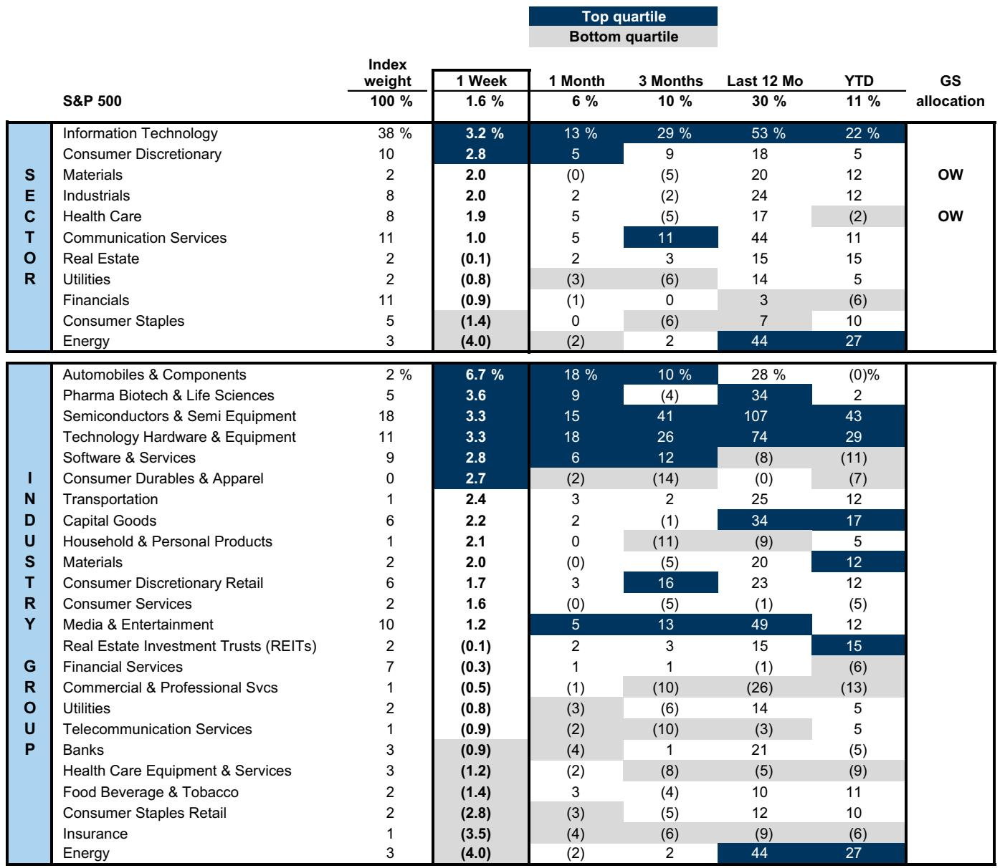
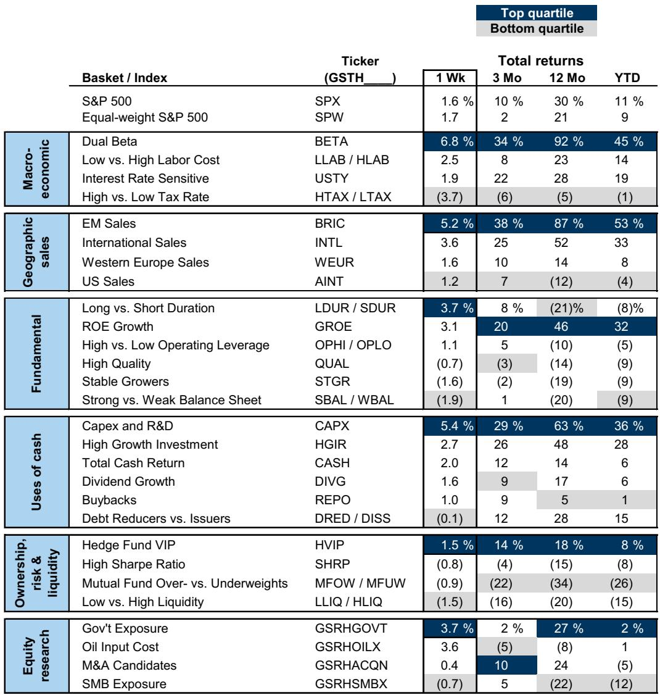
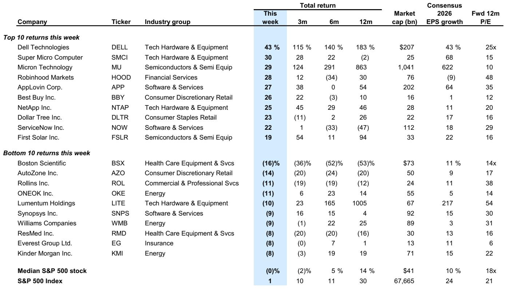

# 2026年IPO创纪录，但市场真正该担心的不是供给过剩，而是企业需求的结构性变化

市场正在为即将到来的IPO洪流做准备。2026年至今，已有40宗IPO完成，融资额达280亿美元，这是自2021年以来最活跃的发行窗口。某外资投行最新研报将全年IPO规模预测从1600亿美元大幅上调至2250亿美元，并预计包括增发、可转债和SPAC在内的企业股权总供给将达到6750亿美元。

这些数字听起来令人不安。过去四年发行低迷后，供给端的突然放量很容易让人联想到1999年或2021年的市场顶部。但这份报告提供了一个反直觉的核心判断：**2026年，企业自身的股权需求将超过供给**。这不仅仅是数字上的平衡，更指向了市场定价逻辑正在发生的深层变化。

真正值得关注的，不是IPO规模本身，而是供给结构、需求来源以及锁定期释放这三股力量如何在未来12-18个月内重塑市场的供需格局。这份报告提供了关键的分析框架，但其中一些最重要的二阶效应，报告本身并未完全展开。

## 1. 供给的绝对规模创纪录，但相对比例仍低于历史均值

市场的第一反应往往是恐慌。2250亿美元的IPO规模确实史无前例，加上增发、可转债等，总供给达到6750亿美元。但判断供给是否过度，不能只看绝对数字，必须将其置于整个市场的背景中衡量。

报告指出，6750亿美元的企业股权供给仅相当于罗素3000指数总市值的1.0%。而自1995年以来的历史均值是1.5%。换句话说，尽管IPO活动在加速，但相对于不断膨胀的市场规模，供给压力实际上低于长期平均水平。

这个比较意味着什么？它表明，当前市场吸收新股的能力比历史上大多数时期都要强。过去四年发行低迷期间，大量优质公司推迟了上市计划，这部分被压抑的供给正在释放，但市场同时也在以更快的速度增长。从相对供给的角度看，这更像是一次正常的补课，而非泡沫顶端的狂欢。

然而，这里有一个关键变量：2026年IPO的规模分布。报告提到，今年可能有一些最大的私营公司上市。如果这些巨型IPO的初始流通比例极低（例如低于10%），那么它们对市场的即时供给冲击有限，但会为后续的锁定期释放埋下伏笔。这一点，恰恰是报告最值得深挖的部分。

## 2. 锁定期释放的潜在供给是真正的“灰犀牛”，但并非必然兑现

IPO的供给效应并非一次性完成。报告揭示了一个容易被忽视的机制：锁定期到期后释放的潜在供给。历史上，初始流通比例低于10%的大型IPO，12个月后平均流通比例会从7%上升至46%。按照这一规律，报告预计2026年将有近5000亿美元的股票因锁定期到期而变得可供交易。

这5000亿美元是悬在市场上的“灰犀牛”。它比IPO本身更具不确定性，因为其规模取决于未来股价表现、投资者持有意愿以及市场流动性环境。报告谨慎地指出，这些股票“不一定”会转化为实际卖盘——如果投资者选择继续持有。

但问题在于，什么情况下投资者会选择持有？什么情况下会抛售？报告没有完全展开。这里需要引入一个二阶判断：如果IPO首日表现强劲但后续走势疲软，锁定期到期时抛压会显著增加。反之，如果股价持续上涨，投资者可能选择锁定利润。因此，2026年IPO的质量和后续表现，将直接决定2027年实际供给压力的规模。

报告本身也承认，2027年的供需平衡将更具挑战性。这意味着，当前看似平衡的格局，可能只是暴风雨前的宁静。投资者需要跟踪的不是IPO数量，而是每宗大型IPO的锁定期结构和后续股价表现。

## 3. 企业回购正在经历结构性转变，从规模驱动转向选择性驱动

供给之外，需求端的最大变量是企业回购。报告显示，标普500指数成分股2026年一季度的回购同比仅增长4%，回购收益率已降至1.9%，接近2021年以来的最低水平。AI资本开支的爆发正在挤压回购空间——一季度资本开支同比增长35%。

但这并不意味着企业需求消失。报告预测2026年全年回购总额仍将达到1.3万亿美元。关键在于结构变化：金融板块的回购增长了18%，占标普500回购总额的27%；英伟达宣布了800亿美元的新增授权。回购不再是全市场的普涨，而是高度集中于特定行业和公司。

这种结构性转变意味着什么？首先，回购对市场的支撑作用正在从“广度”转向“深度”。过去，大量公司通过回购提升每股收益；现在，只有现金流充裕、资本开支需求较低的公司（如银行）或AI直接受益者（如半导体）仍在积极回购。其次，回购授权创纪录（年初至今8600亿美元）与实际执行之间存在时滞。公司倾向于在股价下跌时执行回购，这意味着回购提供的价格支撑可能是间歇性的，而非持续性的。

对于投资者而言，需要关注的不再是“回购总额是否增长”，而是“哪些行业和公司仍在回购，以及它们的回购动机是什么”。这直接关系到个股的估值锚定。

## 4. 并购活动正在重塑股权供需的平衡，现金收购是需求端的新变量

报告还提到了一个容易被忽略的需求来源：并购。年初至今，并购公告总额已接近9000亿美元，同比增长48%，其中近70%以现金支付。

现金收购对股权市场意味着什么？当一家公司用现金收购另一家公司时，被收购方的股东获得现金，这些现金通常会重新投入市场。同时，收购方可能会减少自身的回购或增加杠杆，但这笔交易本身并不会直接增加股权供给。相反，如果收购方以股票支付，则会增加股权供给。当前近70%的现金支付比例，意味着并购活动实际上在创造额外的股权需求。

这个逻辑链值得展开。现金收购的活跃，往往伴随着企业对自身估值和资金成本的判断。当管理层认为现金比股票更“便宜”时，他们会倾向于用现金收购。这反过来暗示，当前市场整体估值可能并未泡沫化到令企业管理者望而却步的程度。并购活动的活跃度，可以作为市场估值合理性的一个侧面验证。

## 5. 报告尚未完全回答的关键问题：家庭投资者和外资能否接住这轮供给？

报告在需求侧提到了两个重要力量：家庭投资者和外国投资者。家庭投资者在2026年一季度是净买入方，这与1990年代末期的净卖出形成鲜明对比。外国投资者也被视为“额外的需求来源”。

但这里有几个问题报告没有完全解答。第一，家庭投资者的购买力能否持续？过去几年家庭部门的资产负债表因房价和股市上涨而大幅改善，但如果利率维持高位或经济放缓，这种购买力可能迅速消退。第二，外国投资者的流入是否稳定？当前全球地缘政治格局下，资金流向美国更多是避险行为，而非对美国经济增长的信心。一旦风险偏好转变，外资可能同时流出。

更重要的是，报告提到的“IPO创造的流动性最终会重新投入市场”这一机制，其传导效率取决于二级市场的定价吸引力。如果IPO定价过高，首日涨幅过大，后续回报不佳，那么这些流动性可能不会回流，而是被锁定或转移到其他资产类别。

这些未解问题构成了2027年供需格局的关键变量。报告给出了一个严谨的基准情景，但投资者需要自己构建压力测试。

## 6. 投资者需要建立的观察框架：从总量到结构，从供给到锁定

基于以上分析，投资者不应再简单地将“IPO规模”作为市场顶部的信号。一个更有效的观察框架应该包含以下三个维度：

**第一，关注“有效供给”而非“名义供给”。** 名义供给是IPO、增发和可转债的总和。有效供给则需要扣除锁定期内无法交易的股份。当前IPO的低初始流通比例，意味着名义供给可能远高于实际市场冲击。追踪每宗大型IPO的初始流通比例和锁定期结构，比关注IPO总融资额更有意义。

**第二，追踪“回购执行率”而非“回购授权”。** 授权金额可以轻易增加，但实际执行取决于股价、现金流和资本开支计划。关注季度实际回购金额与授权的比例，以及回购收益率的变化趋势，才能准确判断企业需求的实际强度。

**第三，观察“并购支付方式”作为市场情绪的先行指标。** 当并购中股票支付比例上升时，意味着企业认为自己的股票被低估，或者被收购方更愿意接受股票作为支付手段。这通常发生在市场情绪高涨时期。当前近70%的现金支付比例，更可能反映的是企业对现金回报的偏好，而非对自身估值的极度乐观。

这三个框架可以帮助投资者在2026年IPO洪流中保持清醒，而不是被总量数字所迷惑。

这份研报的核心价值不在于给出了2250亿美元的预测数字，而在于它揭示了股权供需平衡正在从“供给驱动”转向“需求结构分化”。2026年的市场，考验的不是能否吸收这些新股，而是能否在新的供需格局下重新定价风险。

关于2027年锁定期释放的具体时间表、不同行业IPO的锁定期结构差异，以及家庭投资者行为变化的微观证据，这些内容在报告中有更详细的图表和数据支撑。欢迎来星球微信群里继续讨论这些未解问题，获取完整研报的原始图表和我们的深度解读。

Personal reading notes and learning share only. Not investment advice.

