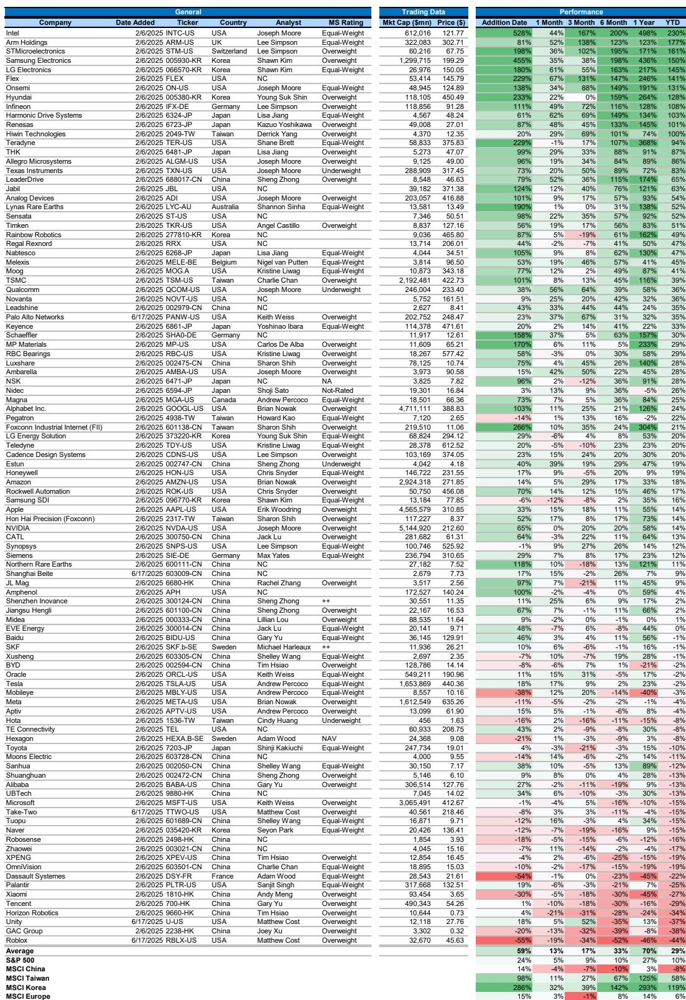
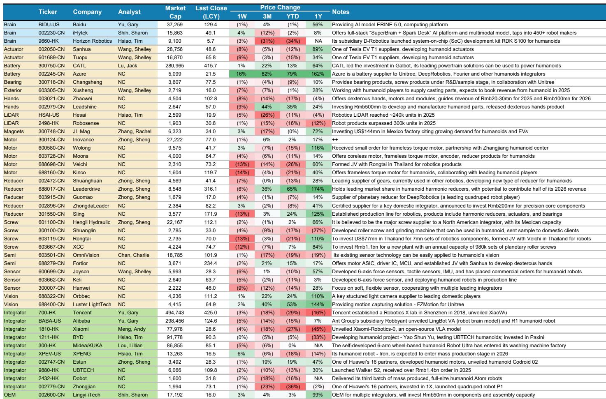
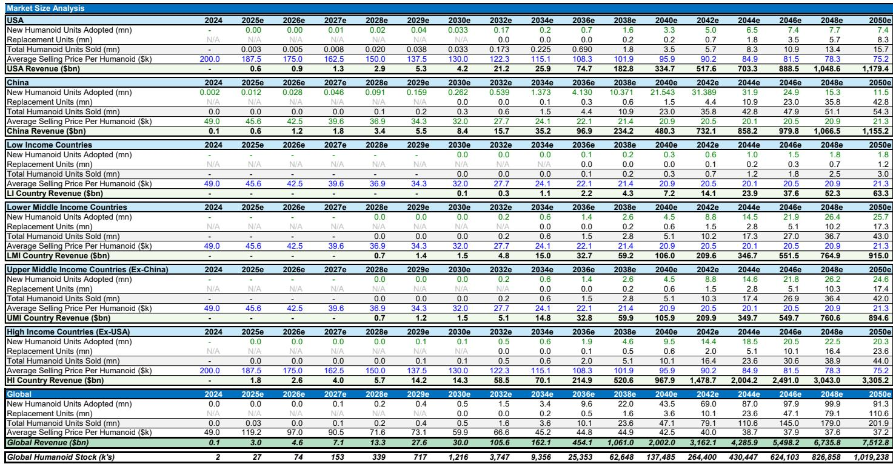

# 人形机器人IPO浪潮的真正含义：不是炒概念，而是供应链的再定价

2026年下半年，人形机器人将同时进入劳动力市场和股票市场。这不是一个预言，而是一个正在发生的事实。

某外资投行在5月发布的研报中给出了一个核心判断：更多机器人公司和机器人股票将在2026年下半年进入两个市场——工厂和交易所。驱动因素不是技术突破，而是机器人公司自身对“落地”和“上市”的主动推动。

这意味着什么？意味着人形机器人行业正在从一个“技术验证阶段”进入一个“资本化与规模化并行”的新阶段。而市场目前对这件事的定价，可能远未充分。

这份研报最值得关注的信号，不是某家公司的IPO估值，也不是某个直播秀的技术细节，而是一个结构性变化：人形机器人的价值重心正在从“谁做得出来”转向“谁能把规模转化为议价权”。这个转变对供应链的影响，将远比对整机厂商的影响更持久、更可投资。

## 1. 中国整机厂商的IPO潮，正在改变行业的风向标

2026年5月，中国多家人形机器人整机初创公司提交了A股或港股的上市申请。宇树科技已迈出实质性一步，上交所上市委员会定于6月1日审议其申请。如果流程顺利，7月即可完成上市。

这是行业的一个关键转折点。IPO的意义不只是融资——它意味着这些公司必须开始向市场证明：自己的收入是可验证的、增长是可预期的、商业模式是可持续的。

根据宇树科技更新的招股书，2026年上半年收入增速放缓至40%，调整后净利率从2025年的约35%降至22%-25%。原因很简单：研发和销售费用在增加。这不是一个坏信号，而是一个行业从“实验室”走向“市场”的必然代价。

研报指出，这些IPO募集资金的大部分将投向研发，尤其是机器人模型（robot models），少部分用于产能建设。这意味着，整机厂商的竞争焦点正在从“谁能融更多钱”转向“谁能把融到的钱更高效地转化为产品力和市场份额”。

对于投资者而言，整机厂商的利润率压力是短期的，但规模放量是长期的。真正值得关注的不是某一家公司的盈利波动，而是整个行业从“讲故事”到“交答卷”的切换。这个切换，将重新定义哪些公司值得给高估值。

## 2. Figure AI的200小时直播，证明的不仅是技术，更是商业化的临界点

2026年5月，Figure AI完成了一场引人注目的直播：三台人形机器人在仓库中连续自主工作200小时，处理了249,560个包裹，每三秒完成一个分拣动作。在10小时的比拼中，机器人比人类仅慢约1.5%。

这个数字很重要。1.5%的差距，意味着在特定任务上，机器人已经接近人类效率。而机器人可以24小时不间断工作，不需要休息、换班、加班费。

但研报也提出了一个需要冷静看待的问题：从直播中展示的“干净环境”到真实世界的“复杂场景”，还有多大的工程鸿沟？从单一的分拣任务到更通用的操作能力，还有多少路要走？

在中国，抓取和放置（包括分拣、搬运、装卸等）同样被视为关键的应用场景。研报预计2026年中国在这些领域也会取得进展。但报告没有完全展开的是：这个“进展”的速度和规模，很大程度上取决于供应链的响应能力——而不是整机厂商的算法能力。

这意味着，对于投资者来说，判断整机厂商的技术领先性固然重要，但判断供应链企业能否在成本、良率、交付上满足规模化需求，可能才是更可靠的收益来源。

## 3. 供应链正在成为这场竞赛的真正“瓶颈”和“杠杆”

这份研报最值得细读的部分，不是对整机厂商的分析，而是对全球人形机器人价值图谱的绘制。从“大脑”（芯片、模型、软件）到“身体”（执行器、传感器、电池、结构件），再到“集成商”，每个环节都有数十家上市公司和初创企业。

但真正有意思的是，研报透露了一个尚未被充分讨论的趋势：整机厂商的产能建设和量产计划，正在创造对供应链组件的需求顺风。换句话说，不管哪家整机厂商最终胜出，供应链企业都会受益。

以Figure AI为例，其BotQ工厂初期设计年产能约12,000台，未来几年目标达到100,000台。特斯拉也在将部分汽车产线转向人形机器人生产。这些计划一旦落地，对电机、减速器、轴承、传感器、电池等组件的需求将是数量级的跃升。

研报还提到了一个值得关注的现象：传统工业巨头与机器人初创公司之间的战略合作正在增加。例如舍弗勒与人形机器人公司、先导智能与北京人形机器人创新中心的合作。这些合作不仅仅是供应商与客户的关系，更强调数据收集和特定应用开发——这是让人形机器人从“能做”到“好用”的关键。

但报告没有完全展开的是：这些合作背后，供应链企业面临的不是简单的“订单增长”，而是“技术迭代压力”和“成本控制挑战”的双重考验。能够同时满足这两点的企业，才是真正的长期赢家。

## 4. 市场表现已经给出了方向，但尚未充分定价

截至2026年5月，某外资投行编制的人形机器人100指数（等权重）自2025年2月成立以来上涨约62%，跑赢标普500、MSCI欧洲和MSCI中国，但跑输MSCI韩国和MSCI台湾。

这个表现说明什么？说明市场已经在为人形机器人主题定价，但定价的分布并不均匀。表现最好的公司集中在芯片、半导体设备、以及部分韩国和台湾的电子巨头——这些都是“卖铲子”的公司，而不是“挖金子”的公司。

在中国人形机器人价值链中，5月的表现更为分化。等权重计算的中国价值链当月上涨8%，其中“身体”类公司上涨11%，而“大脑”和“集成商”类公司涨幅较小。这与研报的核心判断一致：在商业化早期，供应链（尤其是执行器、结构件等“身体”部件）的确定性高于整机厂商。

但这里有一个关键问题尚未回答：当前的市场定价是否已经充分反映了供应链企业的增长潜力？考虑到整机厂商的IPO和量产计划刚刚起步，供应链订单的能见度仍然有限，目前的高估值可能更多是基于预期而非兑现。如果订单落地速度不及预期，估值回调的风险不容忽视。

## 5. 报告尚未完全回答的关键问题：谁能从“样品”走向“商品”？

这份研报提供了丰富的数据和框架，但有一个问题它没有完全回答，而这恰恰是投资者最需要思考的：从“样品”到“商品”，中间最大的障碍是什么？

报告提到了几个关键变量：成本、良率、通用性。但更深层的问题是：人形机器人的“杀手应用”到底是什么？是仓储物流、制造业装配、还是服务业接待？不同的应用场景，对机器人的形态、成本、可靠性要求截然不同，对应的供应链需求也完全不同。

目前，行业处于一个“所有场景都在试，但还没有一个场景形成规模”的阶段。研报提到，在中国，抓取和放置被视为关键应用场景，预计2026年会有进展。但这个“进展”能否转化为可持续的商业订单，取决于三个因素：成本是否低于人工、可靠性是否达到工业标准、部署是否足够简单。

这三个因素中，成本是最核心的。而成本的控制，最终取决于供应链的成熟度。谁能在保证性能的前提下，把执行器、传感器、电池的成本降到足够低，谁就能帮助整机厂商跨过商业化的门槛。

这个判断意味着，投资者应该更多关注那些“能够通过规模化和工艺改进降低成本”的供应链企业，而不是那些“拥有独特技术但成本居高不下”的公司。

## 6. 一个可供读者使用的观察框架

基于以上分析，我们可以构建一个简单的观察框架，用于跟踪人形机器人行业的投资机会：

第一层：看整机厂商的订单能见度。不要只看发布会和直播，要看是否有来自真实客户的重复订单，以及订单的规模是否在扩大。

第二层：看供应链企业的产能扩张计划。如果一家执行器或传感器公司开始大规模投资新产线，说明它收到了足够确定的订单预期。这是比整机厂商的“发布会”更可靠的信号。

第三层：看成本曲线的下降速度。人形机器人的商业化，本质上是一个成本问题。如果供应链企业能够持续降低组件成本，整机厂商的放量就会加速，形成正向循环。

第四层：看跨界合作的深度。传统工业巨头与机器人公司的合作，如果不仅仅是“采购”，而是“联合开发”和“数据共享”，说明行业正在从“卖产品”转向“建生态”。

这个框架的核心逻辑是：人形机器人的投资机会，不是赌哪家公司能做出最好的机器人，而是赌哪条供应链能支撑起一个万亿级市场。

---

以上判断和框架，均基于某外资投行5月发布的研报内容推导得出。但正如报告中多次提到的，许多关键假设——例如整机厂商的量产时间表、供应链企业的成本下降速度、应用场景的真实需求规模——仍有待验证。这些未解问题，恰恰是理解这个行业最需要深入讨论的部分。

如果你想继续追踪这些问题的答案，欢迎来我们的微信群里继续讨论。我们会定期分享最新的研报解读、行业动态和投资框架，帮助你在人形机器人这个主题上建立更完整的认知体系。

Personal reading notes and learning share only. Not investment advice.

