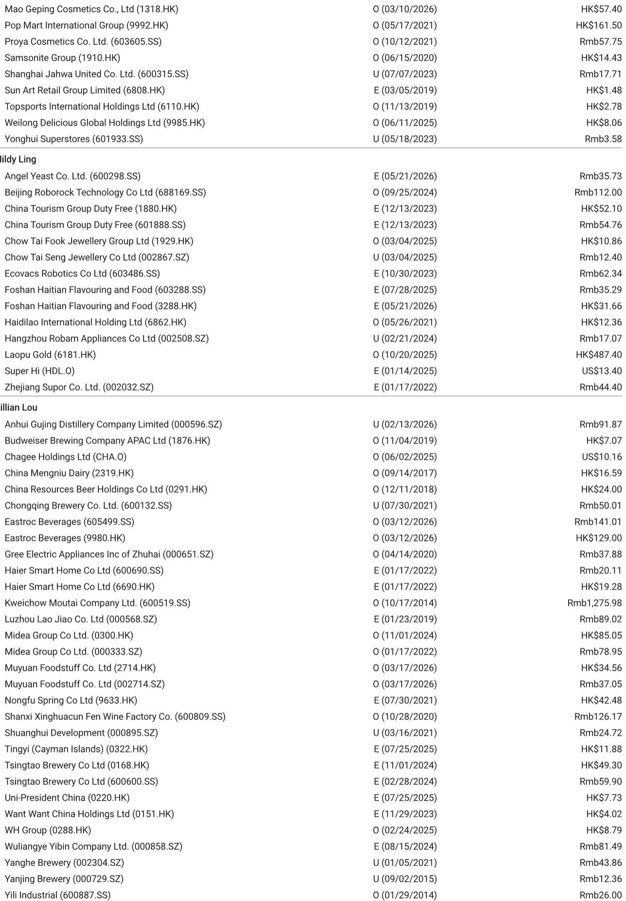
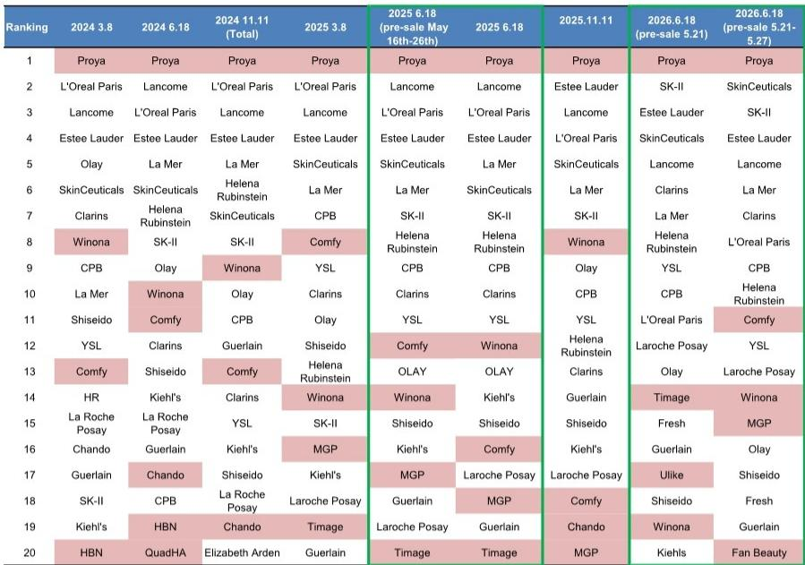
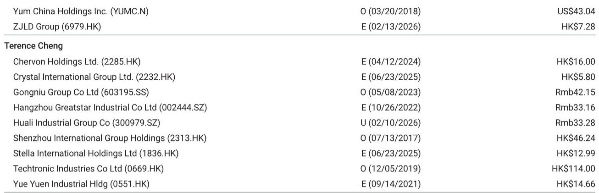

# Proya's Crown Is Secure, But the Real Story of China's 6.18 Beauty Pre-Sale Is the Rise of Niche Domestic Brands with Science-Backed Credibility

The top-line numbers from the 2026 6.18 pre-sale rankings on Tmall confirm what many suspected: Proya retains the No. 1 position for the fourth consecutive major shopping festival. This is a formidable achievement in a market where loyalty is fleeting and shelf space is contested by both global luxury giants and agile domestic challengers. Yet the real strategic insight lies not in who holds the top spot, but in which brands are rising fastest and what their ascent reveals about the structural shifts underway in China's beauty market.

The pre-sale data from May 21 to May 27 shows a market bifurcating in two distinct ways. First, international premium brands like SkinCeuticals, SK-II, and Clarins have made significant ranking gains, rising three to four positions compared to last year's pre-sale period. Second, and more telling for long-term investors, a subset of domestic brands—Giant Biogene's Comfy, Mao Geping (MGP), and Fan Beauty—are not just holding their ground but are outperforming expectations against a high base and despite external headwinds. The conventional narrative that domestic brands are simply gaining share from international players is too simplistic. The data suggests a more nuanced reality: the market is rewarding brands that combine strong science narratives with authentic founder or influencer equity, while punishing those that rely solely on broad distribution or legacy marketing.

This year's pre-sale phase also reveals a critical timing divergence. Rankings on the first day of pre-sale (May 21) differ materially from the seven-day cumulative rankings. International brands such as Estee Lauder and Lancome performed strongly on day one, driven by loyal customer bases and early-bird promotions. However, domestic and mass-premium brands, including Comfy, Winona, and MGP, gained significant momentum in the later stages of the pre-sale window. This pattern suggests that while international brands can generate immediate demand through brand heritage and heavy initial discounting, domestic brands are winning the longer game by converting consideration into purchase through targeted content, KOL seeding, and community engagement. The implication for brand strategy is clear: the battle for the first-day ranking is a tactical skirmish, but the war for the seven-day cumulative ranking is a strategic campaign.

The most important takeaway from this report is that the pre-sale data is not merely a snapshot of consumer behavior; it is a leading indicator of which brands have successfully restructured their go-to-market strategies for a post-pandemic, regulation-tightened environment. For investors, the key question is not whether Proya can hold its lead, but whether the second-tier domestic brands that are rising fastest can sustain their trajectory and convert pre-sale momentum into full-festival dominance.

## Comfy's Post-Crisis Resilience Proves That Brand Trust, Built on Science, Is the Most Durable Competitive Advantage

The performance of Giant Biogene's Comfy brand during this pre-sale period is arguably the most strategically significant data point in the entire ranking. Comfy was absent from the Top 20 on the first day of pre-sale, yet over the full seven-day period it climbed to No. 11 overall and No. 2 among domestic brands, trailing only Proya. This is a remarkable recovery given the context. During the comparable period last year (May 16-26), the brand was operating under the shadow of an external negative event that occurred on May 24. To not only recover but to improve its ranking by one position versus last year's pre-sale period is a testament to the resilience of its consumer franchise.

The "so what" here is that Comfy's rebound is not a fluke or a function of aggressive discounting. It is the result of a deliberate brand architecture that prioritizes scientific credibility over transient marketing hype. Giant Biogene's core technology platform, centered on recombinant collagen, has become a trusted ingredient narrative in China's skincare market. This scientific moat creates a repeat-purchase cycle that is less susceptible to the volatility of fashion-driven beauty trends. When a brand like Comfy faces a crisis, its loyal customer base does not evaporate because the product's efficacy has been validated through clinical data and dermatologist endorsements. The seven-day pre-sale ranking suggests that consumers who may have hesitated initially were ultimately convinced by the brand's underlying value proposition.

This has direct implications for how investors should evaluate the competitive landscape. Brands without a proprietary technology or ingredient story are increasingly vulnerable to the boom-bust cycle of China's e-commerce festivals. They can buy their way onto the first-day ranking through deep discounts and massive traffic acquisition, but they cannot sustain that position without a repeat-purchase engine. Comfy's trajectory from outside the Top 20 on day one to No. 11 over seven days is a textbook example of a brand with high "customer lifetime value" winning the medium-term game. For portfolio managers, the question becomes: which other domestic beauty brands have a similarly defensible scientific narrative, and are they currently undervalued by the market?

## The Pre-Sale Versus First-Day Ranking Divergence Exposes a Fundamental Strategic Choice for Brands: Discount Depth Versus Brand Equity

The report's data reveals a stark and instructive pattern: the ranking correlation between the first day of pre-sale and the full seven-day period is weak. Brands that rank highly on day one are not guaranteed to hold that position, and conversely, brands that start slowly often finish strongly. This divergence is not random. It reflects a fundamental strategic choice that each brand makes about how to allocate its promotional budget and manage its pricing architecture.

International prestige brands such as Estee Lauder and Lancome tend to front-load their promotional intensity. They offer limited-edition gift sets, steep discounts on hero SKUs, and exclusive early-bird benefits to capture the most enthusiastic segment of their customer base. This strategy is effective for generating a strong opening day ranking, which in turn creates social proof and media buzz. However, it comes at a cost: the deep discounts can erode brand equity over time, and the strategy leaves little ammunition for the later stages of the pre-sale window. By contrast, domestic brands like Comfy, Winona, and Mao Geping appear to be employing a more measured approach. They may not lead on day one, but they maintain consistent promotional intensity throughout the pre-sale period, often layering in live-streaming events, KOL collaborations, and community-exclusive offers that sustain momentum.

The strategic implication for brand managers is profound. The first-day ranking is a vanity metric unless it translates into a sustained lead. The brands that are winning the seven-day cumulative ranking are those that have optimized for total pre-sale revenue rather than peak-hour velocity. This requires a different organizational capability: the ability to manage a multi-week marketing campaign with dynamic resource allocation, rather than a single-day sales sprint. For investors, the pre-sale pattern serves as a diagnostic tool. Brands that consistently underperform in the seven-day ranking relative to their day-one ranking may be over-investing in short-term traffic acquisition at the expense of long-term brand health. Conversely, brands that show a strong seven-day ranking despite a weak day-one start may have a more sustainable growth model.

## Mao Geping's Sustained Ascent Signals the Mainstreaming of "Founder-Led" Brand Equity in China's Premium Cosmetics Segment

Mao Geping's performance in this pre-sale period is another data point that warrants deeper analysis. The brand ranked No. 15 in the seven-day pre-sale period, compared to being outside the Top 20 on the first day. This represents an improvement versus last year, when it ranked No. 17-18 during the 6.18 festival. More importantly, the report notes that MGP's online growth across platforms remains one of the strongest year-to-date among sizable brands, driven by continued new customer acquisitions through makeup and brand appeal.

What makes MGP's rise strategically significant is that it represents a distinct model of brand building that is different from both the science-led approach of Giant Biogene and the broad-distribution model of Proya. MGP is a founder-led brand, built on the personal reputation and professional credibility of Mao Geping, a legendary Chinese makeup artist. This model creates a unique form of trust that is difficult for competitors to replicate. Consumers are not just buying a product; they are buying into the expertise and aesthetic philosophy of a recognized authority. This is particularly powerful in the makeup category, where the barrier to trial is high and consumers rely heavily on expert endorsement to make purchase decisions.

The rise of founder-led beauty brands in China mirrors a global trend, but with local characteristics. In Western markets, founder-led brands often rely on celebrity or influencer status. In China, the most successful founder-led brands in beauty are built on professional credibility—dermatologists, makeup artists, and cosmetic chemists. This gives them a natural advantage in the current regulatory environment, where claims about product efficacy are increasingly scrutinized. A founder who is a recognized professional can make claims that a general marketing executive cannot. For investors, the question is whether MGP's model is scalable beyond its founder's personal brand, or whether it will face a ceiling once it exhausts the core fan base of the Mao Geping name. The pre-sale data suggests that the model is still gaining momentum, but the long-term answer will depend on the brand's ability to institutionalize its founder's expertise into a broader product and marketing system.

## The Report Does Not Fully Answer How the Shift from Pre-Sale to Full-Festival Performance Will Reshape Brand Investment Cycles

While the pre-sale data provides valuable directional signals, it leaves several critical questions unanswered. The most important of these is the relationship between pre-sale rankings and full-festival (6.18 total) performance. The report notes that "this year's rankings differ significantly between the 'pre-sale phase' and 'first day,'" but it does not provide the full-festival data that would allow investors to calibrate the predictive power of pre-sale numbers. In previous years, the correlation between pre-sale rankings and final rankings has varied, and it is unclear whether this year's pattern represents a structural change or a one-off anomaly.

A second unresolved question concerns the role of platform diversification. The data in this report is exclusively from Tmall. However, the Chinese beauty market has become increasingly multi-platform, with Douyin, Kuaishou, and JD.com all capturing significant share of beauty spending. Brands that rank well on Tmall may be underperforming on other platforms, and vice versa. Without cross-platform data, it is difficult to assess whether a brand's Tmall ranking reflects its overall competitive position or merely its relative strength in a single channel. This is particularly relevant for domestic brands that have invested heavily in Douyin live-streaming, which may not be captured in Tmall-centric rankings.

A third area of ambiguity is the impact of promotional intensity on profitability. The report does not discuss the depth of discounts offered by different brands during the pre-sale period. A brand that achieves a high ranking through 50% discounts may be generating top-line growth at the expense of margin, while a brand that ranks lower but discounts less may be building a more profitable business. For investors focused on earnings quality, this distinction is crucial. The pre-sale ranking is a measure of revenue generation, not value creation. Until the full financial results are available, the ranking data should be interpreted as a signal of market share momentum, not of sustainable profitability.

## A Decision Framework for Evaluating Beauty Brands Based on Pre-Sale Performance Signals

For investors and strategists seeking to translate this report into actionable insights, a structured decision framework is essential. The pre-sale data should not be read in isolation but should be evaluated across three dimensions: ranking trajectory, promotional strategy, and brand moat.

**Dimension One: Ranking Trajectory.** Compare a brand's day-one ranking to its seven-day cumulative ranking. Brands that improve significantly over the window (e.g., Comfy, MGP, Fan Beauty) are demonstrating sustained consumer interest and effective mid-campaign marketing. Brands that decline (e.g., L'Oreal Paris, which dropped from No. 11 on day one to No. 8 over seven days, a relative decline versus its historical position) may be losing momentum or relying too heavily on early-bird promotions. A positive trajectory is a bullish signal, particularly for smaller brands that are gaining share.

**Dimension Two: Year-over-Year Ranking Change.** Compare a brand's current pre-sale ranking to its ranking during the same period last year. This controls for festival-specific effects and reveals underlying competitive momentum. SkinCeuticals, SK-II, and Clarins all showed strong year-over-year improvement, suggesting that premium science-based skincare is gaining share. L'Oreal Paris's five-position decline is a significant negative signal that warrants further investigation into whether it reflects brand fatigue, increased competition, or a strategic shift in promotional approach.

**Dimension Three: Brand Moat Type.** Categorize each brand by its primary source of competitive advantage: proprietary technology (Comfy, SkinCeuticals), founder credibility (MGP), broad distribution (Proya, L'Oreal Paris), or heritage prestige (Estee Lauder, Lancome). Brands with technology or founder moats have historically shown more stable rankings across festivals and are less vulnerable to competitive discounting. Brands relying on distribution or heritage are more susceptible to disruption from new entrants. The pre-sale data suggests that technology and founder moats are currently being rewarded by consumers.

Applying this framework to the report's data yields a clear strategic picture. Proya remains the benchmark for execution, but its moat is primarily distribution and scale, which may be vulnerable over time. Comfy and MGP represent higher-quality growth stories, with defensible moats and positive ranking momentum. Among international brands, SkinCeuticals and SK-II are demonstrating that science-based premium positioning can win in China even as mass-market international brands struggle. The brands to watch with caution are those that have fallen in the rankings without a clear narrative for recovery, particularly L'Oreal Paris and, to a lesser extent, Estee Lauder, which held its position but did not improve.

## Join the Community to Read the Full Report and Review the Original Charts

The pre-sale rankings are only the first chapter of the 6.18 story. The full festival data, which will include total sales across all platforms and the final ranking for the entire event, will provide a far more complete picture of which brands are truly winning and which are merely peaking early. The original report from the global investment bank includes detailed year-over-year comparisons, historical trend lines for each major brand, and a breakdown of performance by category segment. These charts are essential for any investor or strategist seeking to build a data-driven thesis on China's beauty market. Join the community to read the full report and review the original charts.

*This article is for learning and discussion only and does not constitute investment advice.*

Personal reading notes and learning share only. Not investment advice.

