# Australia Materials | Asia Pacific

# China and the Miners

Our monthly report summarizes key data/charts from China to give investors quick insights into China's macroenvironment and its demand for mineral resources.

China view – Energy Shock and Weaker Consumption: Our China economics team notes that April activity slowed more sharply than expected, weighed by the oil shock impacting energy-intensive sectors and broad-based consumption weakness, with retail sales dropping to a record low ex-Covid and property showing no signs of stabilization despite selective gains in top-tier secondary markets. While export-linked production (EVs, machinery, tech) remained resilient on AI-led global capex strength, they cut 2Q GDP tracking by 20bps to 4.5%Y, and expect a recovery toward 5%Y in 2H as the oil shock fades and exports stay strong, although consumption is likely to lag amid weak labour markets, fading policy support, and ongoing property adjustment (see here).

Macro – Production Declines for Majority: China's IP was 4.1% YoY in April (Mar 5.7%); April PMI was 50.3 (Mar 50.4). April CPI was 1.2% YoY (Mar 1.0%). New property starts fell 27.1% YoY in April (Mar -17.1% YoY) and GFA sold fell 10.3% YoY in April (Mar -8.0% YoY). Our China property team notes that while secondary home sales in top-tier cities exceeded expectations in March–April, momentum has slowed sharply in May, with divergence widening across cities as lower-tier markets continue to weaken in both listings and prices. Combined with fragile sentiment and fading policy support, they remain cautious on the rebound's durability, although near-term declines may stay modest on favorable base effects. FAI was down 9.4% YoY in April (Mar +1.6% YoY). April aluminum production was up 3.1% YoY to 3.9mnt, reflecting capacity resumption in Liaoning.

Commodities data – Steel Exports Slowed: Steel exports in April decreased 9% YoY to 9.5mnt, and crude steel output was down 2.8% YoY in April, while domestic steel apparent consumption fell 3.1% YoY. China's iron ore imports were up 1% YoY in April to 104mnt. Port inventories started to draw slowly during the month but remain elevated.

How are we positioned? BHP.AX remains our preferred diversified exposure, supported by low-cost WAIO cash generation with accretive 330Mtpa expansion optionality, Copper SA valuation upside, potential for further asset crystallisation, and stronger long term growth profile than peers (see our recent insight note here). Our iron ore order of preference: BHP.AX (OW), DRR.AX (OW), RIO.AX (EW), then FMG.AX (UW). In coal, WHC.AX (OW) is most preferred (#1 in our OOP, see our 2Q Strategy), supported by potential gas-to-coal switching in North Asia and tight met coal following the major coal mine accident in Shanxi, triggering safety inspections. We remain OW S32.AX for base metals exposure, with aluminium supported by supply disruption, high energy prices and a slower Indonesian ramp. In lithium, we see some merit in taking profits; we are EW PLS, remaining preferred over IGO (UW), with the Greenbushes LOM plan still a key uncertainty.

MS AUSTRALIA LIMITED+

# Rahul Anand, CFA

Equity Analyst

R.Anand@morganstanley.com

+61 2 9770-1136

# Michael A Stancliff

Research Associate

Michael.Stancliff@morganstanley.com

+61 2 9770-9253

# AUSTRALIA MATERIALS

Asia Pacific

Industry View

Attractive

# Recent Research:

Asia Energy Security and AI: Energy Meets
Compute: Supercycle Recharges (21 May 2026)
Mineral Resources Limited: TripNotes: Wodgina
Site Visit (20 May 2026)
BHP Group Ltd: Rising data centre build favours
BHP's commodity mix – but there's plenty of
alpha too (13 May 2026)
Boss Energy Ltd: Updating Estimates and Price
Target (1 May 2026)
Mineral Resources Limited: Updating Estimates
(30 Apr 2026)
South32 Ltd: Hermosa: Higher capex somewhat
offset by longer life. A large overhang is
removed with modest impact expected. (29 Apr
2026)

MS does and seeks to do business with companies covered in MS. As a result, investors should be aware that the firm may have a conflict of interest that could affect the objectivity of MS. Investors should consider MS as only a single factor in making their investment decision.

# For analyst certification and other important disclosures, refer to the Disclosure Section, located at the end of this report.

+= Analysts employed by non-U.S. affiliates are not registered with FINRA, may not be associated persons of the member and may not be subject to FINRA restrictions on communications with a subject company, public appearances and trading securities held by a research analyst account.

# Industrial Production Data and Trade Data

# IP data:

New starts were down 27.1% YoY in April, and GFA sold fell 10.3% YoY, while property completions were down 19.0% YoY. Our China property team notes that while secondary home sales in top-tier cities exceeded expectations in March–April, momentum has slowed sharply in May, with divergence widening across cities as lower-tier markets continue to weaken in both listings and prices. Combined with fragile sentiment and fading policy support, they remain cautious on the durability of the rebound, although near-term declines may stay modest on favorable base effects.

Domestic steel apparent consumption decreased 3.1% YoY in April, together with a 9% decline in net exports while key steel mills production was down 5.7% YoY in April.

April aluminum production was up 3.1% YoY, to 3.9mnt. The slight MoM increase in production volume was mainly due to capacity resumption in Liaoning province. Currently, the total operating capacity in China has reached 45.3mnt, which is at the ceiling imposed by China's government with limited upside.

April coal production was down 1% YoY and down 12.5% MoM to 386mnt. The MoM drop in coal volume mainly reflected the seasonal decline, as the winter heating season ended in March. Total coal production increased 1.2% YoY YTD. Thermal power generation rose 3.1% YoY in April to 463.8bn kWh, accounting for 62% of total power generation vs. 66% in Mar-26 as hydro power generation gradually picked up moving towards the rainy season.

# Trade data:

Iron ore imports were up 1% YoY in April to 104Mt. Port inventories in China started to draw slowly during the month but remain elevated. Pig iron production at steel mills is down 4% YTD.

Coal imports decreased 13% YoY and 15% MoM in April to 33Mt. Total YTD coal imports in 4M26 were down by 2% YoY to 149mnt. The decline in coal imports reflected the seasonal decline in demand in slow consumption season and higher imported coal prices.

The following material was published in a report titled: China Materials: April IP Data: Production Declines for Majority (18 May 2026)

Property – New starts fell 27.1% YoY in April (vs. -17.1% YoY in March). GFA sold fell 10.3% YoY (vs. -8% YoY in March) and property completions were down 19% YoY (vs. -19.3% YoY in March), all based on restated data for 2025. While secondary real-time home sales in select high-tier cities beat market expectations in March-April, our China property team notes a rapid deceleration so far in May. Also, they note further divergence among cities in terms of secondary listing volume and listing prices, with select tier-2 and low-tier cities continuing to worsen. Together with still-fragile resident sentiment and diminishing effects of recent city-level policies, the team remains prudent about the durability of the sales rebound, although the drops may remain narrow in coming months on favorable bases.

FAI was down $9.4\%$ YoY in April 26 (vs. $+1.6\%$ YoY in March). Highway FAI slipped $18.1\%$ YoY in April.

Crude steel output was -2.8% YoY in April (vs. -6.3% YoY in March). 4M26 production was down 4.1% YoY. We estimate domestic steel apparent consumption was down 3.1% in April (vs. -7.1% YoY in March), together with a 9% decline in net exports.

Cement production was -10.8% YoY in April (vs. -21% YoY in March). 4M26 production was down 8.6% YoY. Output YoY decline is narrowing in May due to lower base numbers. The cement price hikes in east China continued to decline in April-May due to weak downstream demand and wet weather conditions.

Aluminum production was up 3.1% YoY and 0.5% MoM to 3.9mnt in Apr 26. The slight MoM increase in production volume was mainly due to capacity resumption in Liaoning province. Currently, the total operating capacity in China has reached 45.3mnt, which is at the ceiling imposed by China's government with limited upside. Constrained by the limited supply increase, aluminum smelters saw solid margins >Rmb8,600/t in April.

Coal production was down 1% YoY and down 12.5% MoM to 386mnt in April 2026. The MoM drop in coal volume mainly reflected the seasonal decline, as the winter heating season ended in March. Total coal production increased 1.2% YoY YTD. Thermal power generation rose 3.1% YoY in April to 463.8bn kWh, accounting for 62% of total power generation vs. 66% in Mar-26 as hydro power generation gradually picked up moving towards the rainy season.

Exhibit 1: April 2026 industrial production data 

<table><tr><td>Apr 2026 Production Data</td><td>Growth rate trend</td><td>Apr 2026</td><td>MoM Apr 2026</td><td>YoY Apr 2026</td><td>Mar 2026</td><td>Jan+Feb 2026</td><td>Dec-25</td><td>Nov-25</td><td>Oct-25</td><td>Sep-25</td><td>Aug-25</td><td>Jul-25</td><td>Jun-25</td><td>May-25</td><td>Apr-25</td><td>2025</td></tr><tr><td>Crude steel (Mnt)</td><td></td><td>83.6</td><td>-3.9%</td><td>-2.8%</td><td>-6.3%</td><td>-3.6%</td><td>-10.3%</td><td>-10.9%</td><td>-12.1%</td><td>-4.6%</td><td>-0.7%</td><td>-4.0%</td><td>-9.2%</td><td>-6.9%</td><td>0.0%</td><td>-4.4%</td></tr><tr><td>Finished steel (Mnt)</td><td></td><td>122.6</td><td>-6.4%</td><td>-1.7%</td><td>-2.3%</td><td>-1.1%</td><td>-3.8%</td><td>-2.6%</td><td>-0.9%</td><td>5.1%</td><td>9.7%</td><td>6.4%</td><td>1.8%</td><td>3.4%</td><td>6.6%</td><td>3.1%</td></tr><tr><td>Cement (Mnt)</td><td></td><td>145.7</td><td>18.4%</td><td>-10.8%</td><td>-21.0%</td><td>6.8%</td><td>-6.6%</td><td>-8.2%</td><td>-15.8%</td><td>-8.6%</td><td>-6.2%</td><td>-5.6%</td><td>-5.3%</td><td>-8.1%</td><td>-5.3%</td><td>-6.9%</td></tr><tr><td>Aluminum (Mnt)</td><td></td><td>3.9</td><td>0.5%</td><td>3.1%</td><td>2.7%</td><td>3.0%</td><td>3.0%</td><td>2.5%</td><td>0.4%</td><td>1.8%</td><td>-0.5%</td><td>0.6%</td><td>3.4%</td><td>5.0%</td><td>4.2%</td><td>2.4%</td></tr><tr><td>Glass (mn wt cases)</td><td></td><td>72.8</td><td>-4.6%</td><td>-7.9%</td><td>-6.6%</td><td>-3.5%</td><td>3.4%</td><td>3.7%</td><td>3.3%</td><td>-9.7%</td><td>-2.0%</td><td>-3.4%</td><td>-4.5%</td><td>-5.7%</td><td>-4.6%</td><td>-3.0%</td></tr><tr><td>Coal production (Mnt)</td><td></td><td>385.6</td><td>-12.5%</td><td>-1.0%</td><td>0.0%</td><td>-0.3%</td><td>-1.0%</td><td>-0.5%</td><td>-2.3%</td><td>-1.8%</td><td>-3.2%</td><td>-3.8%</td><td>3.0%</td><td>4.2%</td><td>3.8%</td><td>1.2%</td></tr><tr><td>Thermal power generation (kWH bn)</td><td></td><td>463.8</td><td>-12.9%</td><td>3.1%</td><td>4.2%</td><td>3.3%</td><td>-3.2%</td><td>-4.2%</td><td>7.3%</td><td>-5.4%</td><td>1.7%</td><td>4.3%</td><td>1.1%</td><td>1.2%</td><td>-2.3%</td><td>-1.0%</td></tr><tr><td>FAI, % YoY</td><td></td><td>-9.4%</td><td>-11.0ppt</td><td>-9.4%</td><td>1.6%</td><td>-4.4%</td><td>-15.1%</td><td>-12.0%</td><td>-12.2%</td><td>-7.1%</td><td>-7.1%</td><td>-5.3%</td><td>-0.1%</td><td>2.7%</td><td>3.5%</td><td>-3.8%</td></tr><tr><td>IP, %, YoY</td><td></td><td>4.1%</td><td>-1.6ppt</td><td>4.1%</td><td>5.7%</td><td>6.3%</td><td>5.2%</td><td>4.8%</td><td>4.9%</td><td>6.5%</td><td>5.2%</td><td>5.7%</td><td>6.8%</td><td>5.8%</td><td>6.1%</td><td>5.9%</td></tr><tr><td colspan="17">Property</td></tr><tr><td>FS starts (mn sqm)</td><td></td><td>35.3</td><td>-33.3%</td><td>-27.1%</td><td>-17.1%</td><td>-23.1%</td><td>-19.3%</td><td>-27.7%</td><td>-29.3%</td><td>-15.0%</td><td>-19.8%</td><td>-15.2%</td><td>-9.5%</td><td>-18.7%</td><td>-22.3%</td><td>-20.5%</td></tr><tr><td>FS sold (mn sqm)</td><td></td><td>57.3</td><td>-44.0%</td><td>-10.3%</td><td>-8.0%</td><td>-13.5%</td><td>-16.6%</td><td>-17.9%</td><td>-19.6%</td><td>-11.9%</td><td>-11.0%</td><td>-8.4%</td><td>-6.6%</td><td>-4.6%</td><td>-2.9%</td><td>-9.5%</td></tr><tr><td>FS completions (mn sqm)</td><td></td><td>21.0</td><td>-39.6%</td><td>-19.0%</td><td>-19.3%</td><td>-27.9%</td><td>-18.4%</td><td>-25.4%</td><td>-27.9%</td><td>0.4%</td><td>-21.3%</td><td>-29.4%</td><td>-2.2%</td><td>-19.1%</td><td>-28.2%</td><td>-18.2%</td></tr><tr><td>Investment (Rmb bn)</td><td></td><td>624.9</td><td>-22.9%</td><td>-20.1%</td><td>-11.7%</td><td>-10.3%</td><td>-36.8%</td><td>-31.4%</td><td>-23.2%</td><td>-21.3%</td><td>-19.9%</td><td>-17.1%</td><td>-12.4%</td><td>-12.4%</td><td>-11.5%</td><td>-17.4%</td></tr><tr><td colspan="17">Infrastructure FAI</td></tr><tr><td>Highway (Rmb bn)*</td><td></td><td>280.6</td><td>-46.3%</td><td>-18.1%</td><td>5.6%</td><td>-0.6%</td><td>-18.4%</td><td>-8.7%</td><td>-15.4%</td><td>0.9%</td><td>-11.6%</td><td>-16.6%</td><td>3.4%</td><td>1.1%</td><td>-2.7%</td><td>-6.0%</td></tr></table>

Source: National Bureau of Statistics, MS. \*Note: Railway and highway FAI growth is rebased.

The following material was published in our recent report: China Materials: April Trade Data: Aluminium Exports Start to Rise (10 May 2026)

Steel exports in April decreased 9% YoY but improved 4% MoM to 9.5Mt, which is slower than we expected. We think steel billets export may grow quickly in April. Daily production of CISA member mills decreased 5.7% YoY in April (vs -6.1% YoY in March).

China's imports of copper and copper products (refined + alloys) were 452kt in April, up $9 \%$ MoM and $3 \%$ YoY. A pullback in the copper price in March encouraged Chinese buyers to re-engage, with the import arbitrage opening briefly. Despite the higher imports, inventories drew strongly during the month, potentially driven by downstream restocking. The Yangshan premium held between \$60 and \$75/t during the month. Copper ore and concentrate imports fell 11% MoM and 20% YoY to 2.35 mln tonnes as treatment charges fell, although strong sulphuric acid prices supported smelter margins.

Aluminium and product exports rose 23% MoM and 15% YoY to 598kt in April to the highest level since November 2024. Supply disruptions in the Middle East drove ex-China tightness and took LME prices higher, widening the export arbitrage. Despite these strong exports, Chinese aluminium inventories rose to all-time highs, and have not yet started to draw.

China's iron ore imports totalled 104Mt in April, down $1\%$ MoM and up $1\%$ YoY. Port inventories in China started to draw slowly during the month but remain elevated. Pig iron production at steel mills is down $4\%$ YTD. China lifted the ban on procuring BHP's seaborne cargoes including previously restricted products during the month which may ease some of the tightness.

Coal imports were down 13% YoY and 15% MoM in April 2026, to 33mnt. Total YTD coal imports in 4M26 were down by 2% YoY to 149mnt. The decline in coal import reflected the seasonal decline in demand in slow consumption season and higher imported coal prices. May coal imports may see some rebound MoM on restocking at power plants in China to prepare for the upcoming peak consumption in summer. The improved demand would support coal prices to further go up in the near term.

Exhibit 2: China: April 2026 trade data 

<table><tr><td rowspan="2">Apr 2026Trade data</td><td rowspan="2">Apr 2025 - Apr 2026</td><td colspan="12">Jan+Feb</td><td rowspan="2">2026YTD</td></tr><tr><td>Apr-26</td><td>Mar-26</td><td>2026</td><td>Dec-25</td><td>Nov-25</td><td>Oct-25</td><td>Sep-25</td><td>Aug-25</td><td>Jul-25</td><td>Jun-25</td><td>May-25</td><td>Apr-25</td></tr><tr><td rowspan="3">Finished Steel Imports (kt)</td><td></td><td>465</td><td>512</td><td>827</td><td>517</td><td>496</td><td>503</td><td>548</td><td>500</td><td>452</td><td>470</td><td>481</td><td>522</td><td>1,804</td></tr><tr><td>Change %, YoY</td><td>-11%</td><td>2%</td><td>-21%</td><td>-17%</td><td>5%</td><td>-6%</td><td>-1%</td><td>-2%</td><td>-10%</td><td>-18%</td><td>-24%</td><td>-21%</td><td>-13%</td></tr><tr><td>Change %, MoM</td><td>-9%</td><td>39%</td><td>NA</td><td>4%</td><td>-1%</td><td>-8%</td><td>10%</td><td>11%</td><td>-4%</td><td>-2%</td><td>-8%</td><td>4%</td><td>NA</td></tr><tr><td rowspan="3">Finished Steel Exports (kt)</td><td></td><td>9,498</td><td>9,135</td><td>15,591</td><td>11,301</td><td>9,980</td><td>9,782</td><td>10,465</td><td>9,510</td><td>9,836</td><td>9,678</td><td>10,578</td><td>10,462</td><td>34,214</td></tr><tr><td>Change %, YoY</td><td>-9%</td><td>-13%</td><td>-8%</td><td>16%</td><td>8%</td><td>-13%</td><td>3%</td><td>0%</td><td>26%</td><td>11%</td><td>10%</td><td>13%</td><td>-10%</td></tr><tr><td>Change %, MoM</td><td>4%</td><td>17%</td><td>NA</td><td>13%</td><td>2%</td><td>-7%</td><td>10%</td><td>-3%</td><td>2%</td><td>-9%</td><td>1%</td><td>0%</td><td>NA</td></tr><tr><td rowspan="3">Iron Ore Imports (mnt)</td><td></td><td>104</td><td>105</td><td>210</td><td>120</td><td>111</td><td>111</td><td>116</td><td>105</td><td>105</td><td>106</td><td>98</td><td>103</td><td>419</td></tr><tr><td>Change %, YoY</td><td>1%</td><td>11%</td><td>10%</td><td>6%</td><td>9%</td><td>7%</td><td>12%</td><td>4%</td><td>2%</td><td>9%</td><td>-4%</td><td>1%</td><td>8%</td></tr><tr><td>Change %, MoM</td><td>-1%</td><td>7%</td><td>NA</td><td>8%</td><td>-1%</td><td>-4%</td><td>11%</td><td>1%</td><td>-1%</td><td>8%</td><td>-5%</td><td>10%</td><td>NA</td></tr><tr><td rowspan="3">Copper and Products Imports (kt)</td><td></td><td>452</td><td>416</td><td>700</td><td>437</td><td>427</td><td>438</td><td>485</td><td>425</td><td>480</td><td>464</td><td>427</td><td>438</td><td>1,567</td></tr><tr><td>Change %, YoY</td><td>3%</td><td>-11%</td><td>-16%</td><td>-22%</td><td>-19%</td><td>-13%</td><td>1%</td><td>2%</td><td>10%</td><td>6%</td><td>-17%</td><td>0%</td><td>-10%</td></tr><tr><td>Change %, MoM</td><td>9%</td><td>32%</td><td>NA</td><td>2%</td><td>-3%</td><td>-10%</td><td>14%</td><td>-11%</td><td>3%</td><td>9%</td><td>-3%</td><td>-6%</td><td>NA</td></tr><tr><td rowspan="3">Copper Ores &amp; Concentrates Imports (kt)</td><td></td><td>2,352</td><td>2,630</td><td>4,934</td><td>2,704</td><td>2,526</td><td>2,451</td><td>2,587</td><td>2,759</td><td>2,560</td><td>2,350</td><td>2,395</td><td>2,924</td><td>9,915</td></tr><tr><td>Change %, YoY</td><td>-20%</td><td>10%</td><td>5%</td><td>7%</td><td>13%</td><td>6%</td><td>6%</td><td>7%</td><td>18%</td><td>2%</td><td>6%</td><td>25%</td><td>-1%</td></tr><tr><td>Change %, MoM</td><td>-11%</td><td>14%</td><td>NA</td><td>7%</td><td>3%</td><td>-5%</td><td>-6%</td><td>8%</td><td>9%</td><td>-2%</td><td>-18%</td><td>22%</td><td>NA</td></tr><tr><td rowspan="3">Aluminum and Products Exports (kt)</td><td></td><td>598</td><td>485</td><td>971</td><td>545</td><td>570</td><td>503</td><td>521</td><td>534</td><td>542</td><td>489</td><td>547</td><td>518</td><td>2,053</td></tr><tr><td>Change %, YoY</td><td>15%</td><td>-4%</td><td>13%</td><td>8%</td><td>-15%</td><td>-13%</td><td>-7%</td><td>-10%</td><td>-8%</td><td>-20%</td><td>-3%</td><td>0%</td><td>9%</td></tr><tr><td>Change %, MoM</td><td>23%</td><td>13%</td><td>NA</td><td>-4%</td><td>13%</td><td>-3%</td><td>-2%</td><td>-1%</td><td>11%</td><td>-11%</td><td>6%</td><td>2%</td><td>NA</td></tr><tr><td rowspan="3">Coal Imports (mnt)</td><td></td><td>33</td><td>39</td><td>77</td><td>59</td><td>44</td><td>42</td><td>46</td><td>43</td><td>36</td><td>33</td><td>36</td><td>38</td><td>149</td></tr><tr><td>Change %, YoY</td><td>-13%</td><td>1%</td><td>1%</td><td>12%</td><td>-20%</td><td>-10%</td><td>-3%</td><td>-7%</td><td>-23%</td><td>-26%</td><td>-18%</td><td>-16%</td><td>-2%</td></tr><tr><td>Change %, MoM</td><td>-15%</td><td>26%</td><td>NA</td><td>33%</td><td>6%</td><td>-9%</td><td>8%</td><td>20%</td><td>8%</td><td>-8%</td><td>-5%</td><td>-2%</td><td>NA</td></tr></table>

Source: General Administration of Customs, MS.

# China – Macro Monitor

- April PMI +50.3 (Mar +50.4). April Industrial production was +4.1% YoY (Mar +5.7%).   
- April CPI rises $1.2\%$ YoY (1% Mar), while PPI increased $2.8\%$ YoY (0.5% Mar).   
• Power generation rises 2.6% YoY in April vs. a rise of 1.4% YoY in Mar.   
• M2 supply in April was up 8.6% YoY (Mar +8.5% YoY).

Exhibit 3: Chinese PMI and IP   
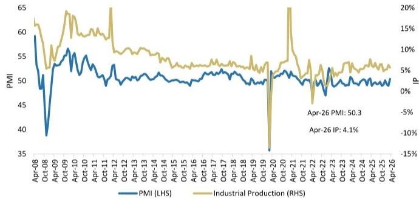

line

| Date    | PMI (LHS) | Industrial Production (RHS) |
|---------|-----------|-----------------------------|
| Apr-26  | 50.3      | 4.1%                        |

Source: Refinitiv, MS.

Exhibit 4: Chinese CPI and PPI   
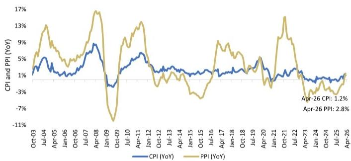

line

| Date    | CPI (YoY) | PPI (YoY) |
|---------|-----------|-----------|
| Apr-26  | 1.2%      | 2.8%      |

Source: Refinitiv, MS.

Exhibit 5: Chinese power generation   
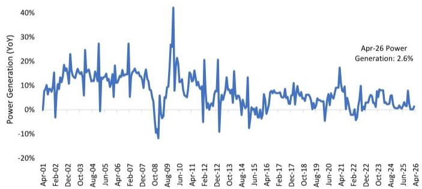

line

| Date     | Power Generation (YoY) |
| -------- | ---------------------- |
| Apr-26   | 2.6%                   |

Source: Refinitiv, MS.

Exhibit 6: Chinese new loans and M2 supply   
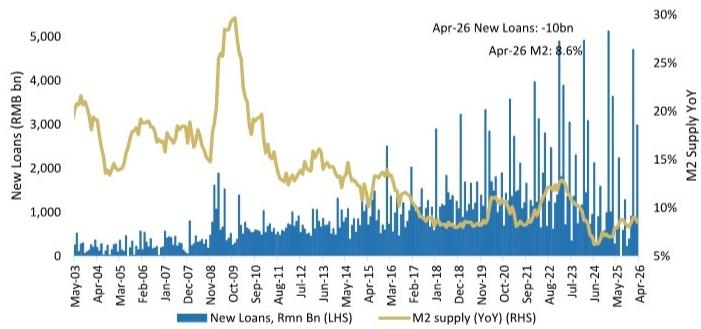

bar_line

| Date | New Loans, Rmn Bn (RMB bn) | M2 supply (YoY) (%) |
|---|---|---|
| Apr-26 | -10 | 8.6 |
Apr-26 M2: 8.6%

Source: Refinitiv, MS.

Exhibit 7: China – Excavator sales   
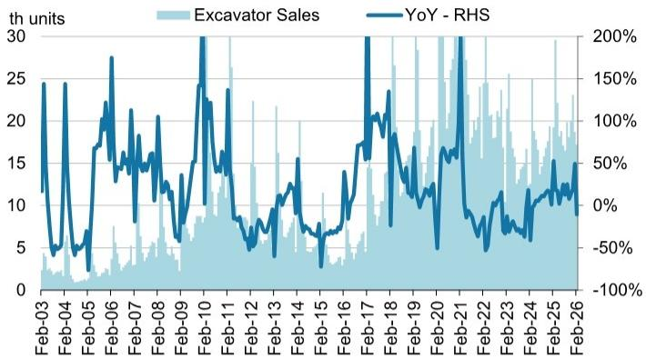

bar_line

| Date   | Excavator Sales (th units) | YoY - RHS (%) |
|--------|----------------------------|---------------|
| Feb-03 | ~5                         | ~150%         |
| Feb-04 | ~25                        | ~50%          |
| Feb-05 | ~15                        | ~100%         |
| Feb-06 | ~28                        | ~150%         |
| Feb-07 | ~20                        | ~100%         |
| Feb-08 | ~15                        | ~50%          |
| Feb-09 | ~10                        | ~0%           |
| Feb-10 | ~25                        | ~150%         |
| Feb-11 | ~20                        | ~100%         |
| Feb-12 | ~15                        | ~50%          |
| Feb-13 | ~10                        | ~0%           |
| Feb-14 | ~15                        | ~50%          |
| Feb-15 | ~5                         | ~-50%         |
| Feb-16 | ~10                        | ~0%           |
| Feb-17 | ~20                        | ~150%         |
| Feb-18 | ~25                        | ~100%         |
| Feb-19 | ~20                        | ~50%          |
| Feb-20 | ~15                        | ~0%           |
| Feb-21 | ~30                        | ~150%         |
| Feb-22 | ~25                        | ~100%         |
| Feb-23 | ~20                        | ~50%          |
| Feb-24 | ~15                        | ~0%           |
| Feb-25 | ~20                        | ~50%          |
| Feb-26 | ~25                        | ~100%         |

Source: CEIC, MS.

Exhibit 9: Transportation infrastructure new orders reported by large infrastructure construction groups   
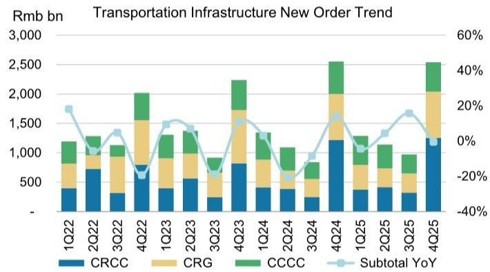  
Source: Company data, MS.

Exhibit 8: China – infrastructure spending   
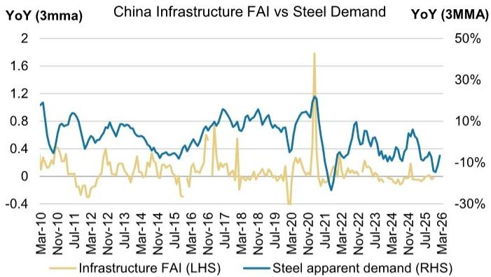

line

| Date    | Infrastructure FAI (LHS) | Steel apparent demand (RHS) |
|---------|---------------------------|-----------------------------|
| Mar-10  | 0.4                       | 1.2                         |
| Nov-10  | 0.2                       | 0.8                         |
| Jul-11  | -0.2                      | 0.9                         |
| Mar-12  | 0.3                       | 0.7                         |
| Nov-12  | 0.1                       | 0.8                         |
| Jul-13  | 0.2                       | 0.7                         |
| Mar-14  | 0.3                       | 0.6                         |
| Nov-14  | 0.1                       | 0.5                         |
| Jul-15  | -0.1                      | 0.4                         |
| Mar-16  | 0.2                       | 0.6                         |
| Nov-16  | 0.3                       | 0.8                         |
| Jul-17  | 0.1                       | 0.9                         |
| Mar-18  | 0.2                       | 1.0                         |
| Nov-18  | 0.3                       | 0.9                         |
| Jul-19  | 0.1                       | 0.8                         |
| Mar-20  | -0.3                      | 0.7                         |
| Nov-20  | 1.8                       | 1.2                         |
| Jul-21  | -0.2                      | 0.4                         |
| Mar-22  | 0.3                       | 0.6                         |
| Nov-22  | 0.2                       | 0.8                         |
| Jul-23  | 0.1                       | 0.7                         |
| Mar-24  | 0.2                       | 0.6                         |
| Nov-24  | 0.1                       | 0.5                         |
| Jul-25  | 0.2                       | 0.4                         |
| Mar-26  | 0.1                       | 0.3                         |

Source: CEIC, MS.

Exhibit 10: Building construction new order trend for CSCEC and MCC   
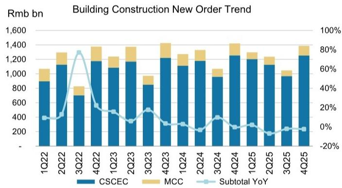

bar_line

Building Construction New Order Trend
| Quarter | CSCEC (Rmb bn) | MCC (Rmb bn) | Subtotal YoY (%) |
|---|---|---|---|
| 1Q22 | 900 | 200 | 10 |
| 2Q22 | 1100 | 300 | 15 |
| 3Q22 | 700 | 150 | 85 |
| 4Q22 | 1200 | 300 | 20 |
| 1Q23 | 1100 | 250 | 15 |
| 2Q23 | 1150 | 350 | 10 |
| 3Q23 | 850 | 150 | 45 |
| 4Q23 | 1200 | 350 | 5 |
| 1Q24 | 1100 | 250 | 5 |
| 2Q24 | 1150 | 300 | -5 |
| 3Q24 | 950 | 150 | 15 |
| 4Q24 | 1250 | 350 | -5 |
| 1Q25 | 1200 | 200 | 5 |
| 2Q25 | 1100 | 150 | -15 |
| 3Q25 | 950 | 150 | -5 |
| 4Q25 | 1250 | 250 | -5 |

Source: Company data, MS.

# China – Property Update

# Mixed April Data

Home sales declines narrowed in April on a low base. We expect the recent strength in secondary home sales to moderate in coming months, given still-elevated inventory, weak buyer sentiment, and limited improvement in household income and leverage. We recommend waiting for greater clarity and remaining selective on stock picks.

See: China Property: Monthly Tracker: Mixed April Data; We Stay Prudent on Sales Recovery (21 May 2026)

Exhibit 11: China – Property sales and new starts   
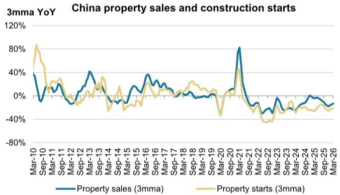

line

China property sales and construction starts
| Date | Property sales (3mma) (%) | Property starts (3mma) (%) |
|---|---|---|
| Mar-10 | 40 | 85 |
| Sep-10 | -10 | 30 |
| Mar-11 | 10 | 20 |
| Sep-11 | 5 | 15 |
| Mar-12 | -5 | 5 |
| Sep-12 | 40 | -5 |
| Mar-13 | 20 | 30 |
| Sep-13 | 10 | 25 |
| Mar-14 | -10 | -20 |
| Sep-14 | -5 | -15 |
| Mar-15 | 10 | -5 |
| Sep-15 | 20 | -10 |
| Mar-16 | 30 | -5 |
| Sep-16 | 20 | 5 |
| Mar-17 | 10 | 0 |
| Sep-17 | 5 | -5 |
| Mar-18 | 0 | 0 |
| Sep-18 | -5 | 5 |
| Mar-19 | 0 | 0 |
| Sep-19 | -5 | -5 |
| Mar-20 | -10 | -40 |
| Sep-20 | 0 | -20 |
| Mar-21 | 80 | 40 |
| Sep-21 | -20 | -30 |
| Mar-22 | -30 | -45 |
| Sep-22 | -20 | -35 |
| Mar-23 | -10 | -30 |
| Sep-23 | -5 | -25 |
| Mar-24 | -10 | -25 |
| Sep-24 | -5 | -20 |
| Mar-25 | 0 | -15 |
| Sep-25 | -5 | -20 |
| Mar-26 | -10 | -25 |

Source: CEIC, MS.

Exhibit 12: Chinese Property – Monthly units sold in Tier 1 cities   
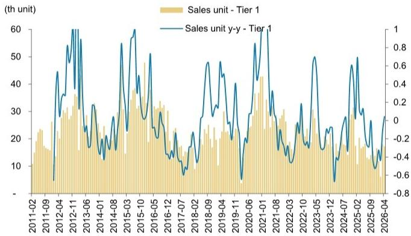

bar_line

| Date | Sales unit - Tier 1 (th unit) | Sales unit y-y - Tier 1 |
|---|---|---|
| 2011-02 | 23 | -0.4 |
| 2011-09 | 17 | -0.5 |
| 2011-16 | 28 | 0.3 |
| 2012-04 | 32 | 0.5 |
| 2012-11 | 35 | 0.9 |
| 2013-06 | 30 | 0.3 |
| 2013-13 | 25 | -0.2 |
| 2014-01 | 20 | -0.3 |
| 2014-08 | 25 | 0.1 |
| 2014-15 | 38 | 0.6 |
| 2015-03 | 45 | 0.7 |
| 2015-10 | 50 | 0.4 |
| 2016-05 | 35 | -0.1 |
| 2016-12 | 30 | -0.3 |
| 2017-07 | 25 | -0.4 |
| 2017-14 | 20 | -0.5 |
| 2018-02 | 25 | -0.3 |
| 2018-09 | 35 | 0.4 |
| 2018-16 | 45 | 0.6 |
| 2019-04 | 35 | -0.2 |
| 2019-11 | 25 | -0.4 |
| 2020-06 | 35 | -0.6 |
| 2020-13 | 45 | 0.7 |
| 2021-01 | 40 | -0.3 |
| 2021-08 | 35 | -0.4 |
| 2021-15 | 30 | -0.5 |
| 2022-03 | 35 | -0.3 |
| 2022-10 | 30 | -0.4 |
| 2023-05 | 35 | -0.3 |
| 2023-12 | 25 | -0.6 |
| 2024-07 | 35 | -0.4 |
| 2024-14 | 45 | 0.6 |
| 2025-02 | 50 | -0.3 |
| 2025-09 | 35 | -0.4 |
| 2025-16 | 30 | -0.5 |
| 2026-04 | 25 | -0.4 |

Source: CREIS, MS.

Exhibit 13: Chinese Property – Monthly units sold in Tier 2 cities   
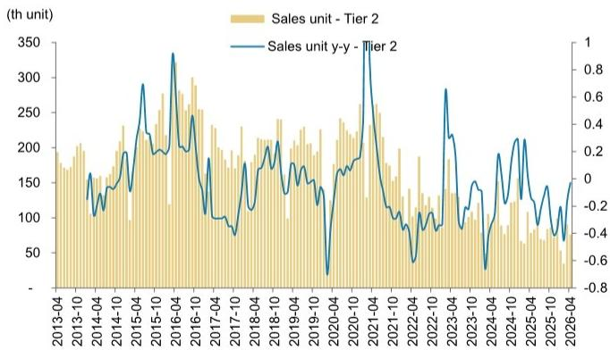

bar_line

| Date | Sales unit - Tier 2 (th unit) | Sales unit y-y - Tier 2 |
|---|---|---|
| 2013-04 | 180 | 0.0 |
| 2013-10 | 200 | 0.1 |
| 2014-04 | 150 | -0.1 |
| 2014-10 | 170 | 0.1 |
| 2015-04 | 230 | 0.3 |
| 2015-10 | 290 | 0.5 |
| 2016-04 | 330 | 0.9 |
| 2016-10 | 290 | 0.3 |
| 2017-04 | 240 | -0.1 |
| 2017-10 | 230 | -0.3 |
| 2018-04 | 250 | 0.1 |
| 2018-10 | 240 | 0.2 |
| 2019-04 | 230 | -0.1 |
| 2019-10 | 240 | -0.3 |
| 2020-04 | 250 | -0.6 |
| 2020-10 | 260 | -0.4 |
| 2021-04 | 350 | 1.0 |
| 2021-10 | 260 | -0.3 |
| 2022-04 | 190 | -0.6 |
| 2022-10 | 180 | -0.4 |
| 2023-04 | 280 | 0.3 |
| 2023-10 | 150 | -0.3 |
| 2024-04 | 80 | -0.6 |
| 2024-10 | 210 | 0.3 |
| 2025-04 | 90 | -0.4 |
| 2025-10 | 85 | -0.5 |
| 2026-04 | 150 | -0.7 |

Source: CREIS, MS

Exhibit 14: Chinese Property – Monthly units sold in Tier 3 cities   
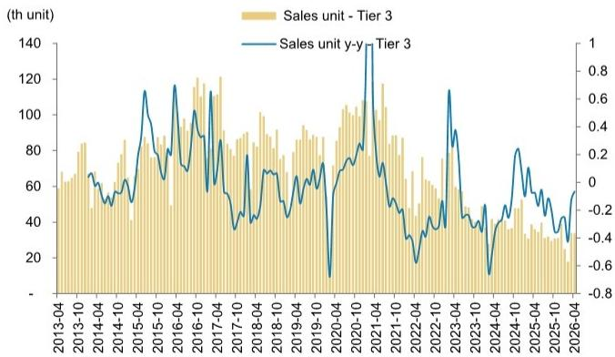

bar_line

| Date     | Sales unit - Tier 3 (th unit) | Sales unit y-y Tier 3 |
|----------|-------------------------------|------------------------|
| 2013-04  | ~65                           | ~0.1                   |
| 2013-10  | ~75                           | ~0.1                   |
| 2014-04  | ~85                           | ~0.1                   |
| 2014-10  | ~90                           | ~0.1                   |
| 2015-04  | ~100                          | ~0.3                   |
| 2015-10  | ~115                          | ~0.5                   |
| 2016-04  | ~120                          | ~0.6                   |
| 2016-10  | ~115                          | ~0.5                   |
| 2017-04  | ~125                          | ~0.4                   |
| 2017-10  | ~110                          | ~0.3                   |
| 2018-04  | ~95                           | ~0.2                   |
| 2018-10  | ~90                           | ~0.1                   |
| 2019-04  | ~85                           | ~0.1                   |
| 2019-10  | ~80                           | ~0.1                   |
| 2020-04  | ~75                           | ~-0.6                  |
| 2020-10  | ~105                          | ~0.8                   |
| 2021-04  | ~135                          | ~0.7                   |
| 2021-10  | ~115                          | ~0.5                   |
| 2022-04  | ~85                           | ~-0.3                  |
| 2022-10  | ~75                           | ~-0.4                  |
| 2023-04  | ~65                           | ~-0.6                  |
| 2023-10  | ~55                           | ~-0.7                  |
| 2024-04  | ~45                           | ~-0.5                  |
| 2024-10  | ~35                           | ~-0.3                  |
| 2025-04  | ~30                           | ~-0.4                  |
| 2025-10  | ~25                           | ~-0.3                  |
| 2026-04  | ~20                           | ~-0.2                  |

Source: CREIS, MS

Exhibit 15: Chinese Property – Total inventory months   
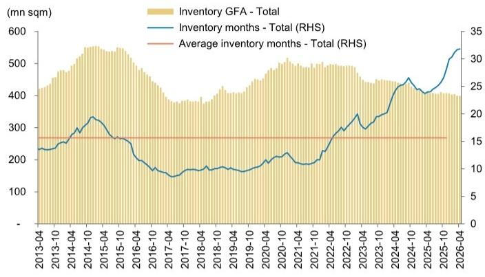

bar_line

| Date     | Inventory GFA - Total (mn sqm) | Inventory months - Total (RHS) | Average inventory months - Total (RHS) |
|----------|-------------------------------|----------------------------------|----------------------------------------|
| 2013-04  | ~450                          | ~230                             | 15                                     |
| 2014-10  | ~550                          | ~320                             | 15                                     |
| 2015-10  | ~550                          | ~280                             | 15                                     |
| 2016-10  | ~450                          | ~180                             | 15                                     |
| 2017-10  | ~380                          | ~160                             | 15                                     |
| 2018-10  | ~400                          | ~170                             | 15                                     |
| 2019-10  | ~420                          | ~170                             | 15                                     |
| 2020-10  | ~480                          | ~200                             | 15                                     |
| 2021-10  | ~500                          | ~190                             | 15                                     |
| 2022-10  | ~480                          | ~250                             | 15                                     |
| 2023-10  | ~450                          | ~300                             | 15                                     |
| 2024-10  | ~480                          | ~350                             | 15                                     |
| 2025-10  | ~450                          | ~320                             | 15                                     |
| 2026-10  | ~420                          | ~380                             | 15                                     |

Source: CREIS, MS.

Exhibit 16: Chinese Property – YTD new starts, by city tier   
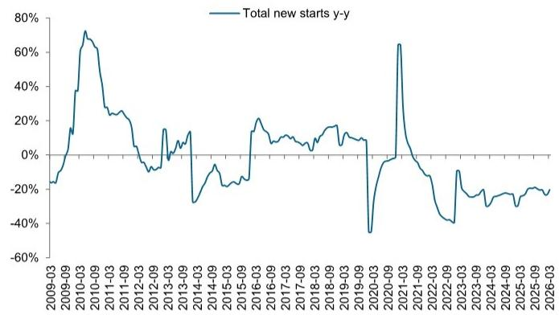

line

Total new starts y-y
| Date | Total new starts y-y (%) |
|---|---|
| 2009-03 | -15 |
| 2009-09 | 10 |
| 2010-03 | 70 |
| 2010-09 | 65 |
| 2011-03 | 25 |
| 2011-09 | 20 |
| 2012-03 | -5 |
| 2012-09 | -10 |
| 2013-03 | 15 |
| 2013-09 | -25 |
| 2014-03 | -15 |
| 2014-09 | -5 |
| 2015-03 | -15 |
| 2015-09 | -5 |
| 2016-03 | 20 |
| 2016-09 | 15 |
| 2017-03 | 10 |
| 2017-09 | 5 |
| 2018-03 | 15 |
| 2018-09 | 15 |
| 2019-03 | 10 |
| 2019-09 | -45 |
| 2020-03 | -5 |
| 2020-09 | 65 |
| 2021-03 | -5 |
| 2021-09 | -15 |
| 2022-03 | -40 |
| 2022-09 | -35 |
| 2023-03 | -15 |
| 2023-09 | -25 |
| 2024-03 | -25 |
| 2024-09 | -30 |
| 2025-03 | -25 |
| 2025-09 | -25 |
| 2026-03 | -25 |

Source: NBS, CEIC, MS. Note: The tiered cities include four tier 1 cities: Beijing, Shanghai, Guangzhou, Shenzhen; 15 tier 2 cities: Fuzhou, Nanchang, Tianjin, Chongqing, Chengdu, Hangzhou, Nanjing, Wuhan, Suzhou, Dalian, Shenyang, Qingdao, Jinan, Xiamen, Xi'an; and nine tier 3 cities: Dongguan, Guiyang, Wenzhou, Baotou, Bangbu, Huizhou, Sanya, Zhongshan, Shaoguan.

Exhibit 17: Chinese Property – YTD sales   
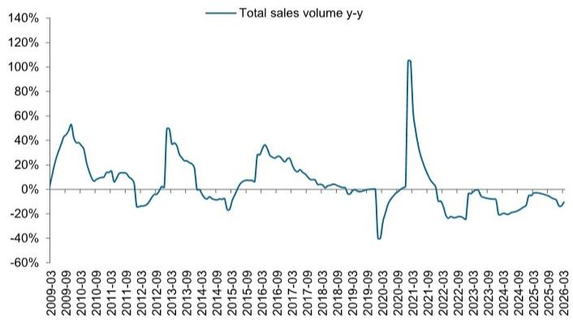

line

| Date | Total sales volume y-y (%) |
|---|---|
| 2009-03 | 0 |
| 2009-09 | 50 |
| 2010-03 | 40 |
| 2010-09 | 15 |
| 2011-03 | 10 |
| 2011-09 | 15 |
| 2012-03 | -15 |
| 2012-09 | -5 |
| 2013-03 | 50 |
| 2013-09 | 25 |
| 2014-03 | -5 |
| 2014-09 | -15 |
| 2015-03 | -15 |
| 2015-09 | 5 |
| 2016-03 | 35 |
| 2016-09 | 25 |
| 2017-03 | 15 |
| 2017-09 | 5 |
| 2018-03 | 5 |
| 2018-09 | 0 |
| 2019-03 | -5 |
| 2019-09 | -45 |
| 2020-03 | -45 |
| 2020-09 | 105 |
| 2021-03 | 15 |
| 2021-09 | -15 |
| 2022-03 | -25 |
| 2022-09 | -15 |
| 2023-03 | -5 |
| 2023-09 | -15 |
| 2024-03 | -15 |
| 2024-09 | -5 |
| 2025-03 | -5 |
| 2025-09 | -5 |
| 2026-03 | -15 |

Source: NBS, CEIC, MS.

Exhibit 18: Chinese Property – YTD completion   
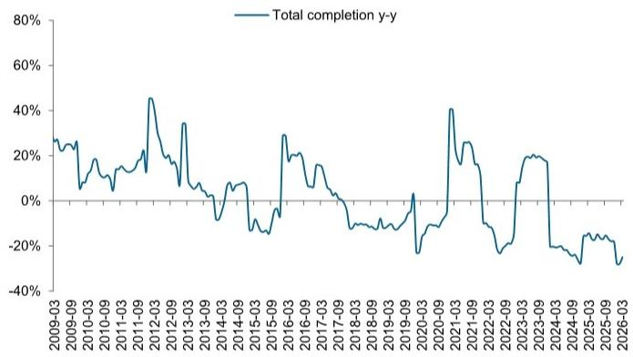

line

Total completion y-y
| Date | Total completion y-y (%) |
|---|---|
| 2009-03 | 25 |
| 2009-09 | 28 |
| 2010-03 | 15 |
| 2010-09 | 10 |
| 2011-03 | 18 |
| 2011-09 | 25 |
| 2012-03 | 45 |
| 2012-09 | 20 |
| 2013-03 | 35 |
| 2013-09 | 5 |
| 2014-03 | -5 |
| 2014-09 | 5 |
| 2015-03 | -15 |
| 2015-09 | -10 |
| 2016-03 | 30 |
| 2016-09 | 20 |
| 2017-03 | 15 |
| 2017-09 | -5 |
| 2018-03 | -10 |
| 2018-09 | -15 |
| 2019-03 | -5 |
| 2019-09 | -10 |
| 2020-03 | -25 |
| 2020-09 | -5 |
| 2021-03 | 40 |
| 2021-09 | 25 |
| 2022-03 | -15 |
| 2022-09 | -25 |
| 2023-03 | 20 |
| 2023-09 | -15 |
| 2024-03 | -25 |
| 2024-09 | -30 |
| 2025-03 | -15 |
| 2025-09 | -25 |
| 2026-03 | -35 |

Source: NBS, CEIC, MS.

# China – Steel and Iron Ore Update

# April Regional Prices Tighten in Spite of Rising China Exports

China's April finished-steel net exports rose $\sim 8\%$ MoM day-adjusted to 9.0mt ( $\sim 110$ mtpa), but remain $\sim 9\%$ lower YoY. Europe is increasingly insulated as imports are constrained, regional HRC premiums widen and CBAM/safeguards reinforce price floors and EBITDA/t upside.

See: China Steel Exports: April - Regional Prices Tighten in Spite of Rising China Exports (11 May 2026)

Exhibit 19: Consumption of steel in China   
2025 MSe China Steel Demand Drivers   
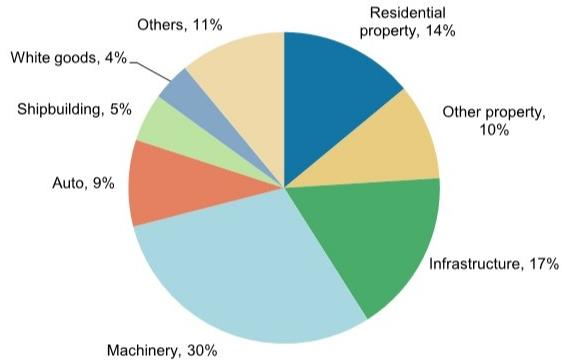

pie

| Category | Percentage (%) |
| :--- | :--- |
| Residential property | 14 |
| Other property | 10 |
| Infrastructure | 17 |
| Machinery | 30 |
| Auto | 9 |
| Shipbuilding | 5 |
| White goods | 4 |
| Others | 11 |

Source: Antaike, MS (MSe)

Exhibit 20: Steel product inventory at distributors   
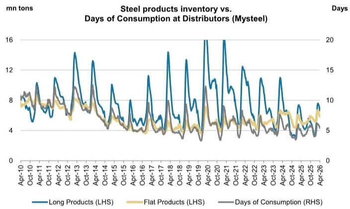

line

| Date   | Long Products (LHS) | Flat Products (LHS) | Days of Consumption (RHS) |
|--------|---------------------|---------------------|---------------------------|
| Apr-10 | ~8.5                | ~7.5                | ~9.0                      |
| Oct-10 | ~7.0                | ~6.5                | ~8.5                      |
| Apr-11 | ~8.0                | ~7.0                | ~9.5                      |
| Oct-11 | ~9.0                | ~7.5                | ~10.0                     |
| Apr-12 | ~10.0               | ~8.0                | ~11.0                     |
| Oct-12 | ~11.0               | ~8.5                | ~12.0                     |
| Apr-13 | ~13.0               | ~9.0                | ~13.0                     |
| Oct-13 | ~12.0               | ~8.5                | ~12.5                     |
| Apr-14 | ~10.0               | ~7.5                | ~11.5                     |
| Oct-14 | ~9.0                | ~7.0                | ~10.5                     |
| Apr-15 | ~8.0                | ~6.5                | ~9.5                      |
| Oct-15 | ~7.0                | ~6.0                | ~8.5                      |
| Apr-16 | ~6.0                | ~5.5                | ~7.5                      |
| Oct-16 | ~7.0                | ~6.0                | ~8.5                      |
| Apr-17 | ~8.0                | ~6.5                | ~9.5                      |
| Oct-17 | ~9.0                | ~7.0                | ~10.5                     |
| Apr-18 | ~10.0               | ~7.5                | ~11.5                     |
| Oct-18 | ~9.0                | ~7.0                | ~10.5                     |
| Apr-19 | ~8.0                | ~6.5                | ~9.5                      |
| Oct-19 | ~7.0                | ~6.0                | ~8.5                      |
| Apr-20 | ~6.0                | ~5.5                | ~7.5                      |
| Oct-20 | ~5.0                | ~5.0                | ~6.5                      |
| Apr-21 | ~4.0                | ~4.5                | ~5.5                      |
| Oct-21 | ~3.0                | ~4.0                | ~4.5                      |
| Apr-22 | ~4.0                | ~4.5                | ~5.5                      |
| Oct-22 | ~5.0                | ~5.0                | ~6.5                      |
| Apr-23 | ~6.0                | ~5.5                | ~7.5                      |
| Oct-23 | ~7.0                | ~6.0                | ~8.5                      |
| Apr-24 | ~8.0                | ~6.5                | ~9.5                      |
| Oct-24 | ~9.0                | ~7.0                | ~10.5                     |
| Apr-25 | ~10.0               | ~7.5                | ~11.5                     |
| Oct-25 | ~9.0                | ~7.0                | ~10.5                     |
| Apr-26 | ~8.0                | ~6.5                | ~9.5                      |

Source: Mysteel, MS.

Exhibit 21: GP/t for mills at spot prices   
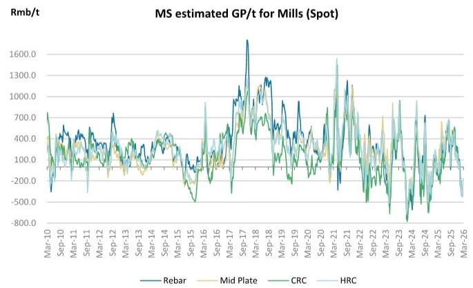

line

| Date   | Rebar | Mid Plate | CRC  | HRC  |
|--------|-------|-----------|------|------|
| Mar-10 | -200  | 400       | 700  | 300  |
| Sep-10 | 400   | 300       | 500  | 200  |
| Mar-11 | 300   | 200       | 400  | 100  |
| Sep-11 | 500   | 300       | 600  | 200  |
| Mar-12 | 700   | 400       | 800  | 300  |
| Sep-12 | 300   | 200       | 400  | 100  |
| Mar-13 | 400   | 300       | 500  | 200  |
| Sep-13 | 300   | 200       | 400  | 100  |
| Mar-14 | 400   | 300       | 500  | 200  |
| Sep-14 | 300   | 200       | 400  | 100  |
| Mar-15 | 200   | 100       | 300  | 50   |
| Sep-15 | 100   | 50        | 200  | -50  |
| Mar-16 | -100  | -50       | -200 | -150 |
| Sep-16 | -50   | -25       | -150 | -100 |
| Mar-17 | -25   | -15       | -100 | -50  |
| Sep-17 | -15   | -5        | -25  | -25  |
| Mar-18 | -5    | -2        | -15  | -15  |
| Sep-18 | -2    | -5        | -25  | -25  |
| Mar-19 | -5    | -15       | -25  | -25  |
| Sep-19 | -15   | -25       | -25  | -25  |
| Mar-20 | -25   | -35       | -25  | -25  |
| Sep-20 | -35   | -45       | -35  | -35  |
| Mar-21 | -45   | -55       | -45  | -45  |
| Sep-21 | -5    | -6        | -5   | -5   |
| Mar-22 | -6    | -7        | -6   | -6   |
| Sep-22 | -7    | -8        | -7   | -7   |
| Mar-23 | -8    | -9        | -8   | -8   |
| Sep-23 | -9    | -10       | -9   | -9   |
| Mar-24 | -10   | -11       | -10  | -10  |
| Sep-24 | -11   | -12       | -11  | -11  |
| Mar-25 | -12   | -13       | -12  | -12  |
| Sep-25 | -13   | -14       | -13  | -13  |
| Mar-26 | -14   | -15       | -14  | -14  |

Source: Bloomberg, MS.

Exhibit 22: Total steel inventory in China (traders + mills)   
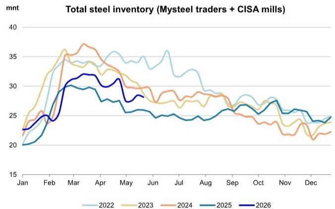

line

Total steel inventory (Mysteel traders + CISA mills)
| Month | 2022 (mmt) | 2023 (mmt) | 2024 (mmt) | 2025 (mmt) | 2026 (mmt) |
|---|---|---|---|---|---|
| Jan | 21.5 | 23.0 | 22.5 | 20.5 | 22.0 |
| Feb | 32.0 | 35.0 | 34.0 | 24.0 | 25.0 |
| Mar | 34.0 | 36.0 | 37.0 | 30.0 | 31.0 |
| Apr | 35.0 | 34.0 | 35.0 | 29.0 | 31.0 |
| May | 36.0 | 32.0 | 31.0 | 28.0 | 30.0 |
| Jun | 34.0 | 30.0 | 29.0 | 26.0 | 28.0 |
| Jul | 36.0 | 28.0 | 28.0 | 25.0 | 27.0 |
| Aug | 33.0 | 27.0 | 27.0 | 25.0 | 26.0 |
| Sep | 29.0 | 26.0 | 26.0 | 25.0 | 25.0 |
| Oct | 28.0 | 25.0 | 25.0 | 24.0 | 26.0 |
| Nov | 27.0 | 24.0 | 23.0 | 25.0 | 26.0 |
| Dec | 25.0 | 23.0 | 22.0 | 24.0 | 25.0 |

Source: Mysteel, CISA, MS.

Exhibit23: Spread between Chinese export prices and domestic prices   
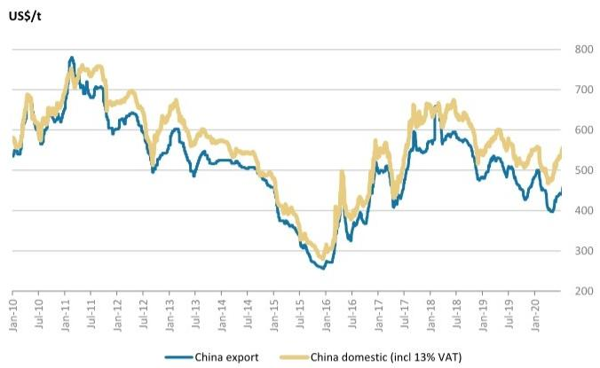

line

| Date   | China export | China domestic (incl 13% VAT) |
|--------|--------------|-------------------------------|
| Jan-10 | ~550         | ~600                          |
| Jul-10 | ~650         | ~700                          |
| Jan-11 | ~750         | ~780                          |
| Jul-11 | ~700         | ~750                          |
| Jan-12 | ~600         | ~650                          |
| Jul-12 | ~500         | ~550                          |
| Jan-13 | ~450         | ~500                          |
| Jul-13 | ~400         | ~450                          |
| Jan-14 | ~350         | ~400                          |
| Jul-14 | ~300         | ~350                          |
| Jan-15 | ~250         | ~300                          |
| Jul-15 | ~200         | ~250                          |
| Jan-16 | ~250         | ~300                          |
| Jul-16 | ~350         | ~400                          |
| Jan-17 | ~450         | ~500                          |
| Jul-17 | ~550         | ~600                          |
| Jan-18 | ~650         | ~700                          |
| Jul-18 | ~600         | ~650                          |
| Jan-19 | ~550         | ~600                          |
| Jul-19 | ~500         | ~550                          |
| Jan-20 | ~450         | ~500                          |

Source: Bloomberg, MS.

Exhibit24: Shanghai steel futures prices   
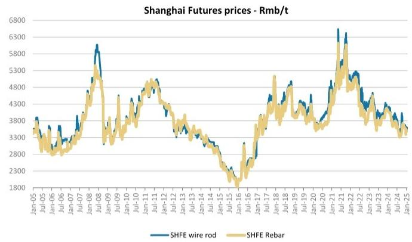

line

| Date   | SHFE wire rod | SHFE Rebar |
|--------|---------------|----------|
| Jan-05 | 3800          | 3300     |
| Jul-05 | 3700          | 3200     |
| Jan-06 | 3600          | 3100     |
| Jul-06 | 3500          | 3000     |
| Jan-07 | 3400          | 2900     |
| Jul-07 | 3300          | 2800     |
| Jan-08 | 3200          | 2700     |
| Jul-08 | 3100          | 2600     |
| Jan-09 | 3000          | 2500     |
| Jul-09 | 2900          | 2400     |
| Jan-10 | 2800          | 2300     |
| Jul-10 | 2700          | 2200     |
| Jan-11 | 2600          | 2100     |
| Jul-11 | 2500          | 2000     |
| Jan-12 | 2400          | 1900     |
| Jul-12 | 2300          | 1800     |
| Jan-13 | 2200          | 1700     |
| Jul-13 | 2100          | 1600     |
| Jan-14 | 2000          | 1500     |
| Jul-14 | 1900          | 1400     |
| Jan-15 | 1800          | 1300     |
| Jul-15 | 1700          | 1200     |
| Jan-16 | 1600          | 1100     |
| Jul-16 | 1500          | 1000     |
| Jan-17 | 1400          | 900      |
| Jul-17 | 1300          | 800      |
| Jan-18 | 1200          | 700      |
| Jul-18 | 1100          | 600      |
| Jan-19 | 1000          | 500      |
| Jul-19 | 900           | 400      |
| Jan-20 | 800           | 300      |
| Jul-20 | 700           | 200      |
| Jan-21 | 600           | 10       |
| Jul-21 | 50            | 5        |
| Jan-22 | 40            | 4        |
| Jul-22 | 30            | 3        |
| Jan-23 | 20            | 2        |
| Jul-23 | 10            | 1        |
| Jan-24 | 5             | 1        |
| Jul-24 | 4             | 1        |
| Jan-25 | 3             | 1        |

Source: Bloomberg, MS.

Exhibit25: Chinese exports vs. international HRC price spread   
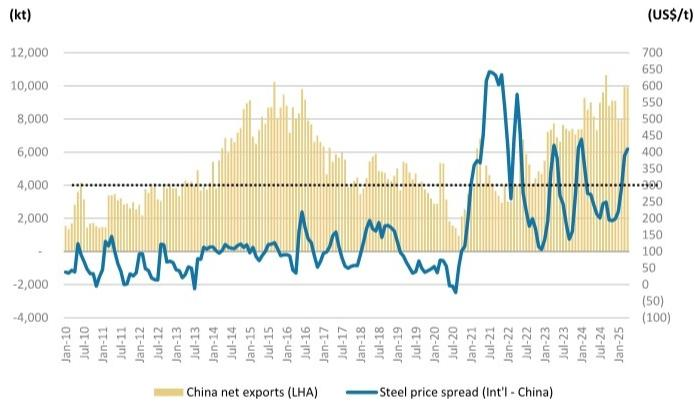

bar_line

| Date   | China net exports (LHA) (kt) | Steel price spread (Int'l - China) (US$/t) |
|--------|-------------------------------|-------------------------------------------|
| Jan-10 | ~4,000                        | ~0                                        |
| Jul-10 | ~3,500                        | ~-50                                      |
| Jan-11 | ~3,800                        | ~-100                                     |
| Jul-11 | ~3,200                        | ~-50                                      |
| Jan-12 | ~3,600                        | ~-100                                     |
| Jul-12 | ~3,900                        | ~-50                                      |
| Jan-13 | ~4,200                        | ~-100                                     |
| Jul-13 | ~4,500                        | ~-150                                     |
| Jan-14 | ~4,800                        | ~-100                                     |
| Jul-14 | ~5,200                        | ~-50                                      |
| Jan-15 | ~5,500                        | ~-50                                      |
| Jul-15 | ~5,800                        | ~-50                                      |
| Jan-16 | ~6,000                        | ~-50                                      |
| Jul-16 | ~6,200                        | ~-50                                      |
| Jan-17 | ~6,500                        | ~-50                                      |
| Jul-17 | ~6,800                        | ~-50                                      |
| Jan-18 | ~7,000                        | ~-50                                      |
| Jul-18 | ~7,200                        | ~-50                                      |
| Jan-19 | ~7,500                        | ~-50                                      |
| Jul-19 | ~7,800                        | ~-50                                      |
| Jan-20 | ~8,000                        | ~-50                                      |
| Jul-20 | ~8,200                        | ~-50                                      |
| Jan-21 | ~8,500                        | ~-50                                      |
| Jul-21 | ~8,800                        | ~-50                                      |
| Jan-22 | ~9,000                        | ~-50                                      |
| Jul-22 | ~9,200                        | ~-50                                      |
| Jan-23 | ~9,500                        | ~-50                                      |
| Jul-23 | ~9,800                        | ~-50                                      |
| Jan-24 | ~10,000                       | ~-50                                      |
| Jul-24 | ~10,200                       | ~-50                                      |
| Jan-25 | ~10,500                       | ~-50                                      |

Source: Bloomberg, MS.

Exhibit26: Asian steel contract prices vs. East Asian spot   
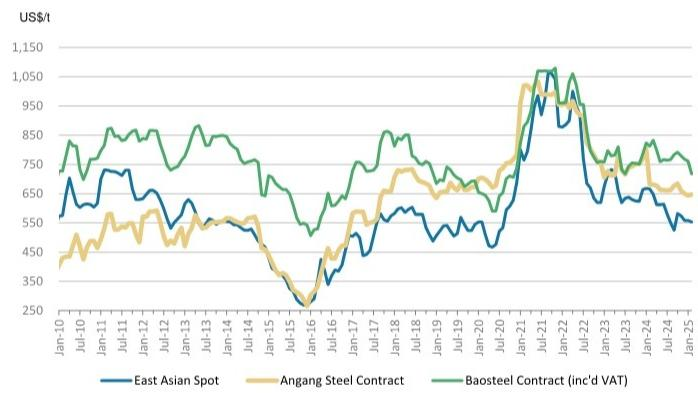

line

| Date   | East Asian Spot | Angang Steel Contract | Baosteel Contract (inc'd VAT) |
|--------|-----------------|------------------------|-------------------------------|
| Jan-10 | 650             | 450                    | 750                           |
| Jul-10 | 680             | 470                    | 780                           |
| Jan-11 | 700             | 490                    | 800                           |
| Jul-11 | 670             | 500                    | 820                           |
| Jan-12 | 650             | 480                    | 810                           |
| Jul-12 | 630             | 460                    | 800                           |
| Jan-13 | 610             | 440                    | 790                           |
| Jul-13 | 590             | 420                    | 780                           |
| Jan-14 | 570             | 400                    | 770                           |
| Jul-14 | 550             | 380                    | 760                           |
| Jan-15 | 530             | 360                    | 750                           |
| Jul-15 | 510             | 340                    | 740                           |
| Jan-16 | 490             | 320                    | 730                           |
| Jul-16 | 470             | 300                    | 720                           |
| Jan-17 | 450             | 280                    | 710                           |
| Jul-17 | 430             | 260                    | 700                           |
| Jan-18 | 410             | 240                    | 690                           |
| Jul-18 | 390             | 220                    | 680                           |
| Jan-19 | 370             | 200                    | 670                           |
| Jul-19 | 350             | 180                    | 660                           |
| Jan-20 | 330             | 160                    | 650                           |
| Jul-20 | 310             | 140                    | 640                           |
| Jan-21 | 290             | 120                    | 630                           |
| Jul-21 | 270             | 100                    | 620                           |
| Jan-22 | 250             | 80                     | 610                           |
| Jul-22 | 230             | 60                     | 600                           |
| Jan-23 | 210             | 40                     | 590                           |
| Jul-23 | 190             | 20                     | 580                           |
| Jan-24 | 170             | 10                     | 570                           |
| Jul-24 | 150             | 5                      | 560                           |
| Jan-25 | 130             | 3                      | 550                           |

Source: Bloomberg, MS.

Exhibit27: Implied China iron ore production (62% Fe equivalent)   
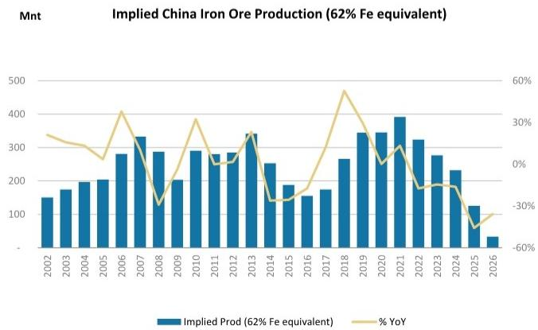

bar_line

Implied China Iron Ore Production (62% Fe equivalent)
| Year | Implied Prod (62% Fe equivalent) (Mnt) | % YoY (%) |
|---|---|---|
| 2002 | 150 | 35 |
| 2003 | 175 | 32 |
| 2004 | 195 | 30 |
| 2005 | 205 | 25 |
| 2006 | 280 | 41 |
| 2007 | 335 | 28 |
| 2008 | 285 | -28 |
| 2009 | 200 | 18 |
| 2010 | 290 | 38 |
| 2011 | 280 | 15 |
| 2012 | 290 | 18 |
| 2013 | 345 | 34 |
| 2014 | 255 | -18 |
| 2015 | 190 | -18 |
| 2016 | 160 | -15 |
| 2017 | 175 | 15 |
| 2018 | 265 | 47 |
| 2019 | 345 | 30 |
| 2020 | 345 | -5 |
| 2021 | 395 | 18 |
| 2022 | 325 | -18 |
| 2023 | 275 | -18 |
| 2024 | 230 | -18 |
| 2025 | 125 | -33 |
| 2026 | 45 | -33 |

Source: CEIC, MS.

Exhibit 28: CISA member mill vs. NBS (restated) average daily steel output   
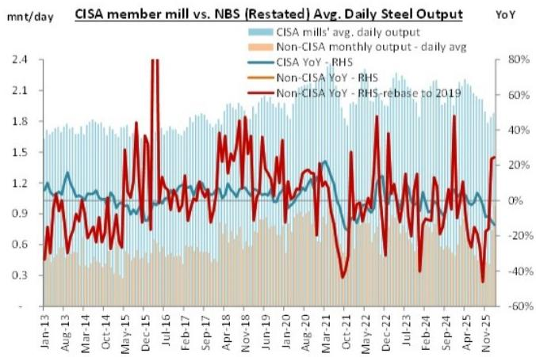

line

| Date    | CISA mills' avg. daily output | Non-CISA monthly output - daily avg | CISA YoY - RHS | Non-CISA YoY - RHS | Non-CISA YoY - RHS-rebase to 2019 |
|---------|-------------------------------|--------------------------------------|----------------|--------------------|-------------------------------------|
| Jan-13  | ~1.8                          | ~0.6                                 | ~1.2           | ~0.6               | ~0.6                                |
| Aug-13  | ~1.8                          | ~0.6                                 | ~1.2           | ~0.6               | ~0.6                                |
| Mar-14  | ~1.8                          | ~0.6                                 | ~1.2           | ~0.6               | ~0.6                                |
| Oct-14  | ~1.8                          | ~0.6                                 | ~1.2           | ~0.6               | ~0.6                                |
| May-15  | ~1.8                          | ~0.6                                 | ~1.2           | ~0.6               | ~0.6                                |
| Dec-15  | ~2.4                          | ~0.6                                 | ~1.2           | ~0.6               | ~0.6                                |
| Jul-16  | ~2.4                          | ~0.6                                 | ~1.2           | ~0.6               | ~0.6                                |
| Feb-17  | ~2.4                          | ~0.6                                 | ~1.2           | ~0.6               | ~0.6                                |
| Sep-17  | ~2.4                          | ~0.6                                 | ~1.2           | ~0.6               | ~0.6                                |
| Apr-18  | ~2.4                          | ~0.6                                 | ~1.2           | ~0.6               | ~0.6                                |
| Nov-18  | ~2.4                          | ~0.6                                 | ~1.2           | ~0.6               | ~0.6                                |
| Jun-19  | ~2.4                          | ~0.6                                 | ~1.2           | ~0.6               | ~0.6                                |
| Jan-20  | ~2.4                          | ~0.6                                 | ~1.2           | ~0.6               | ~0.6                                |
| Aug-20  | ~2.4                          | ~0.6                                 | ~1.2           | ~0.6               | ~0.6                                |
| Mar-21  | ~2.4                          | ~0.6                                 | ~1.2           | ~0.6               | ~0.6                                |
| Oct-21  | ~2.4                          | ~0.6                                 | ~1.2           | ~0.6               | ~0.6                                |
| May-22  | ~2.4                          | ~0.6                                 | ~1.2           | ~0.6               | ~0.6                                |
| Dec-22  | ~2.4                          | ~0.6                                 | ~1.2           | ~0.6               | ~0.6                                |
| Jul-23  | ~2.4                          | ~0.6                                 | ~1.2           | ~0.6               | ~0.6                                |
| Feb-24  | ~2.4                          | ~0.6                                 | ~1.2           | ~0.6               | ~0.6                                |
| Sep-24  | ~2.4                          | ~0.6                                 | ~1.2           | ~0.6               | ~0.6                                |
| Apr-25  | ~2.4                          | ~0.6                                 | ~1.2           | ~0.6               | ~0.6                                |
| Nov-25  | ~2.4                          | ~0.6                                 | ~1.2           | ~0.6               | ~0.6                                |

Source: CISA, CEIC, MS.

Exhibit29: China – Iron ore prices   
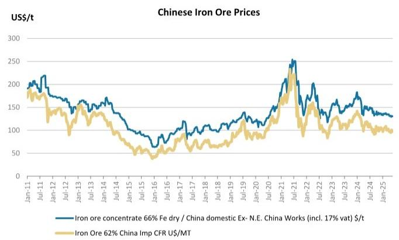

line

| Date   | Iron ore concentrate 66% Fe dry / China domestic Ex- N.E. China Works (incl. 17% val) $/t | Iron Ore 62% China Imp CFR US$/MT |
|--------|----------------------------------------------------------------------------------|-----------------------------------|
| Jan-11 | ~200                                                                             | ~180                              |
| Jul-11 | ~220                                                                             | ~170                              |
| Jan-12 | ~180                                                                             | ~150                              |
| Jul-12 | ~160                                                                             | ~130                              |
| Jan-13 | ~150                                                                             | ~120                              |
| Jul-13 | ~140                                                                             | ~110                              |
| Jan-14 | ~130                                                                             | ~100                              |
| Jul-14 | ~120                                                                             | ~90                               |
| Jan-15 | ~100                                                                             | ~80                               |
| Jul-15 | ~80                                                                              | ~70                               |
| Jan-16 | ~70                                                                              | ~60                               |
| Jul-16 | ~90                                                                              | ~80                               |
| Jan-17 | ~100                                                                             | ~90                               |
| Jul-17 | ~110                                                                             | ~100                              |
| Jan-18 | ~120                                                                             | ~110                              |
| Jul-18 | ~130                                                                             | ~120                              |
| Jan-19 | ~140                                                                             | ~130                              |
| Jul-19 | ~150                                                                             | ~140                              |
| Jan-20 | ~160                                                                             | ~150                              |
| Jul-20 | ~180                                                                             | ~170                              |
| Jan-21 | ~250                                                                             | ~240                              |
| Jul-21 | ~260                                                                             | ~250                              |
| Jan-22 | ~240                                                                             | ~230                              |
| Jul-22 | ~220                                                                             | ~210                              |
| Jan-23 | ~200                                                                             | ~190                              |
| Jul-23 | ~180                                                                             | ~170                              |
| Jan-24 | ~160                                                                             | ~150                              |
| Jul-24 | ~140                                                                             | ~130                              |
| Jan-25 | ~130                                                                             | ~120                              |

Source: Datastream, MS.

Exhibit30: Iron ore inventories at China's major ports   
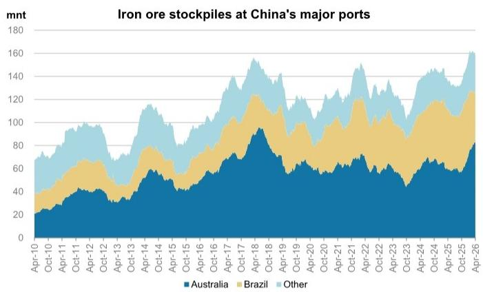  
Source: MySteel, MS.

Exhibit31: Chinese iron ore miners' average daily output and operating rate   
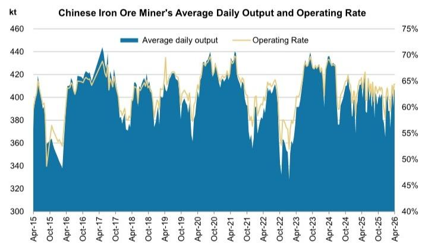

line

| Date   | Average daily output (kt) | Operating Rate (%) |
|--------|---------------------------|--------------------|
| Apr-15 | 390                       | 65                 |
| Oct-15 | 360                       | 60                 |
| Apr-16 | 400                       | 65                 |
| Oct-16 | 420                       | 70                 |
| Apr-17 | 440                       | 75                 |
| Oct-17 | 410                       | 65                 |
| Apr-18 | 420                       | 65                 |
| Oct-18 | 410                       | 65                 |
| Apr-19 | 420                       | 70                 |
| Oct-19 | 430                       | 65                 |
| Apr-20 | 440                       | 70                 |
| Oct-20 | 430                       | 65                 |
| Apr-21 | 440                       | 70                 |
| Oct-21 | 420                       | 65                 |
| Apr-22 | 410                       | 65                 |
| Oct-22 | 360                       | 60                 |
| Apr-23 | 380                       | 65                 |
| Oct-23 | 430                       | 70                 |
| Apr-24 | 420                       | 65                 |
| Oct-24 | 430                       | 65                 |
| Apr-25 | 420                       | 65                 |
| Oct-25 | 410                       | 65                 |
| Apr-26 | 400                       | 65                 |

Source: MySteel, MS.

Exhibit 32: China's iron ore stock at ports and stock-to-consumption ratio   
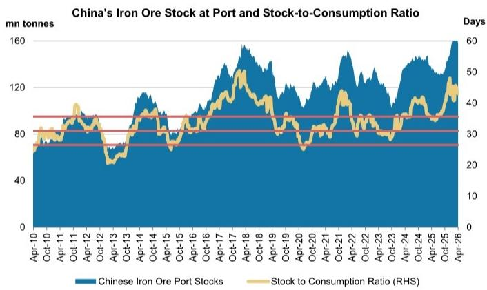

line

| Date    | Chinese Iron Ore Port Stocks (mn tonnes) | Stock to Consumption Ratio (RHS) (Days) |
|---------|------------------------------------------|------------------------------------------|
| Apr-10  | ~70                                      | ~30                                      |
| Oct-10  | ~75                                      | ~30                                      |
| Apr-11  | ~80                                      | ~30                                      |
| Oct-11  | ~85                                      | ~30                                      |
| Apr-12  | ~90                                      | ~30                                      |
| Oct-12  | ~75                                      | ~30                                      |
| Apr-13  | ~80                                      | ~30                                      |
| Oct-13  | ~85                                      | ~30                                      |
| Apr-14  | ~90                                      | ~30                                      |
| Oct-14  | ~95                                      | ~30                                      |
| Apr-15  | ~85                                      | ~30                                      |
| Oct-15  | ~90                                      | ~30                                      |
| Apr-16  | ~95                                      | ~30                                      |
| Oct-16  | ~100                                     | ~30                                      |
| Apr-17  | ~110                                     | ~30                                      |
| Oct-17  | ~120                                     | ~30                                      |
| Apr-18  | ~130                                     | ~30                                      |
| Oct-18  | ~140                                     | ~30                                      |
| Apr-19  | ~135                                     | ~30                                      |
| Oct-19  | ~125                                     | ~30                                      |
| Apr-20  | ~120                                     | ~30                                      |
| Oct-20  | ~115                                     | ~30                                      |
| Apr-21  | ~125                                     | ~30                                      |
| Oct-21  | ~135                                     | ~30                                      |
| Apr-22  | ~140                                     | ~30                                      |
| Oct-22  | ~135                                     | ~30                                      |
| Apr-23  | ~130                                     | ~30                                      |
| Oct-23  | ~125                                     | ~30                                      |
| Apr-24  | ~130                                     | ~30                                      |
| Oct-24  | ~135                                     | ~30                                      |
| Apr-25  | ~140                                     | ~30                                      |
| Oct-25  | ~145                                     | ~30                                      |
| Apr-26  | ~160                                     | ~45                                      |

Source: Mysteel, NBS, CEIC, MS.

Exhibit33: Brazilian and West Australian freight rates   
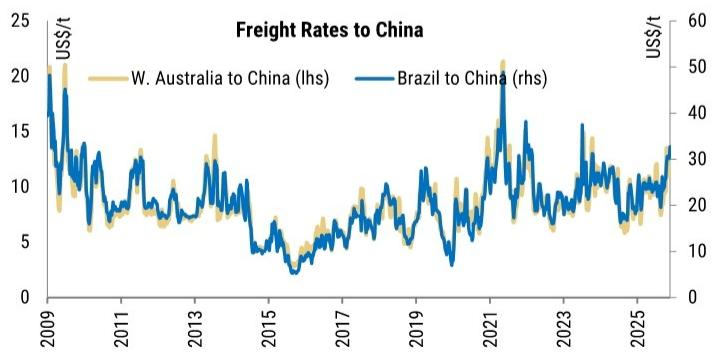

line

| Year | W. Australia to China (lhs) | Brazil to China (rhs) |
|------|-----------------------------|------------------------|
| 2009 | ~20 US$/t                   | ~20 US$/t              |
| 2010 | ~10 US$/t                   | ~15 US$/t              |
| 2011 | ~8 US$/t                    | ~10 US$/t              |
| 2012 | ~7 US$/t                    | ~8 US$/t               |
| 2013 | ~10 US$/t                   | ~12 US$/t              |
| 2014 | ~8 US$/t                    | ~10 US$/t              |
| 2015 | ~6 US$/t                    | ~5 US$/t               |
| 2016 | ~5 US$/t                    | ~3 US$/t               |
| 2017 | ~7 US$/t                    | ~8 US$/t               |
| 2018 | ~9 US$/t                    | ~10 US$/t              |
| 2019 | ~10 US$/t                   | ~12 US$/t              |
| 2020 | ~8 US$/t                    | ~10 US$/t              |
| 2021 | ~15 US$/t                   | ~20 US$/t              |
| 2022 | ~10 US$/t                   | ~15 US$/t              |
| 2023 | ~8 US$/t                    | ~10 US$/t              |
| 2024 | ~7 US$/t                    | ~8 US$/t               |
| 2025 | ~10 US$/t                   | ~12 US$/t              |

Source: Bloomberg, MS

Exhibit34: Rebar utilization rate   
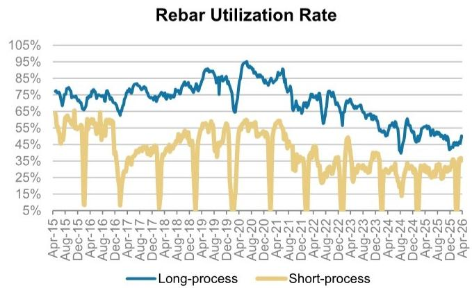

line

| Date    | Long-process | Short-process |
|---------|--------------|---------------|
| Apr-15  | 75%          | 60%           |
| Aug-15  | 78%          | 55%           |
| Dec-15  | 70%          | 50%           |
| Apr-16  | 75%          | 55%           |
| Aug-16  | 72%          | 50%           |
| Dec-16  | 65%          | 40%           |
| Apr-17  | 70%          | 35%           |
| Aug-17  | 75%          | 40%           |
| Dec-17  | 78%          | 45%           |
| Apr-18  | 80%          | 50%           |
| Aug-18  | 82%          | 55%           |
| Dec-18  | 85%          | 60%           |
| Apr-19  | 88%          | 65%           |
| Aug-19  | 90%          | 70%           |
| Dec-19  | 85%          | 65%           |
| Apr-20  | 95%          | 60%           |
| Aug-20  | 90%          | 55%           |
| Dec-20  | 85%          | 50%           |
| Apr-21  | 80%          | 45%           |
| Aug-21  | 75%          | 40%           |
| Dec-21  | 70%          | 35%           |
| Apr-22  | 65%          | 30%           |
| Aug-22  | 60%          | 25%           |
| Dec-22  | 55%          | 20%           |
| Apr-23  | 50%          | 15%           |
| Aug-23  | 45%          | 10%           |
| Dec-23  | 40%          | 5%            |
| Apr-24  | 35%          | 0%            |
| Aug-24  | 30%          | 5%            |
| Dec-24  | 25%          | 10%           |
| Apr-25  | 20%          | 15%           |
| Aug-25  | 15%          | 20%           |
| Dec-25  | 10%          | 25%           |
| Apr-26  | 5%           | 30%           |

Source: Mysteel, MS

Exhibit35: Electric arc furnace (EAF) capacity utilization rate   
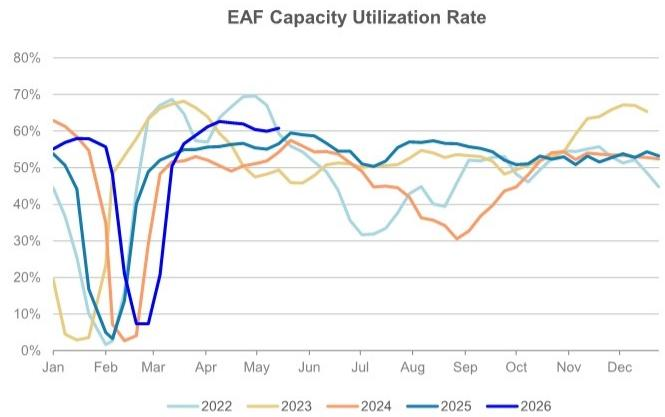

line

EAF Capacity Utilization Rate
| Month | 2022 (%) | 2023 (%) | 2024 (%) | 2025 (%) | 2026 (%) |
|---|---|---|---|---|---|
| Jan | 45 | 18 | 62 | 55 | 56 |
| Feb | 10 | 5 | 3 | 5 | 57 |
| Mar | 68 | 69 | 50 | 50 | 8 |
| Apr | 70 | 60 | 52 | 55 | 62 |
| May | 70 | 48 | 55 | 57 | 61 |
| Jun | 50 | 48 | 53 | 59 | 60 |
| Jul | 32 | 48 | 48 | 51 | 50 |
| Aug | 40 | 53 | 43 | 57 | 50 |
| Sep | 30 | 48 | 31 | 54 | 50 |
| Oct | 50 | 50 | 43 | 51 | 50 |
| Nov | 53 | 63 | 53 | 51 | 51 |
| Dec | 45 | 67 | 53 | 53 | 53 |

Source: MySteel, MS.

Exhibit 36: Iron ore prices: -discount/+premium vs. $62\%$ Fe $(\%)$   
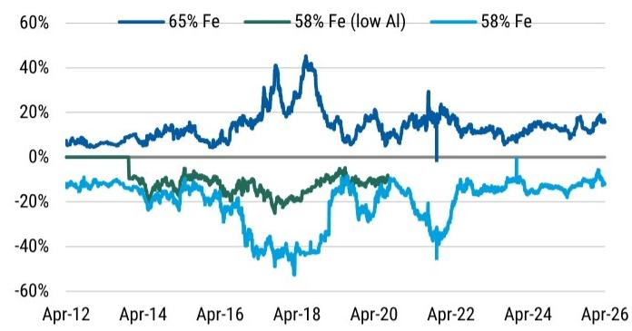

line

| Date   | 65% Fe | 58% Fe (low Al) | 58% Fe |
|--------|--------|-----------------|--------|
| Apr-12 | ~5%    | ~0%             | ~-10%  |
| Apr-14 | ~10%   | ~-10%           | ~-20%  |
| Apr-16 | ~15%   | ~-15%           | ~-30%  |
| Apr-18 | ~40%   | ~-20%           | ~-50%  |
| Apr-20 | ~20%   | ~-10%           | ~-20%  |
| Apr-22 | ~30%   | ~-15%           | ~-40%  |
| Apr-24 | ~15%   | ~-10%           | ~-20%  |
| Apr-26 | ~20%   | ~-5%            | ~-10%  |

Source: MS, Tex Report, Platts; Note: Sourced from our Commodities team

# China – Coal Update

# Domestic Coal Prices Firm as Summer Demand Outlook Supports Further Upside

Thermal coal prices in China continued to recover modestly, rising WoW alongside stronger mine-mouth prices in Datong, while seaborne prices declined. Domestic coking coal prices were also broadly firmer, with gains at Liulin and higher FOR prices, partially offset by a slight dip in Queensland export prices. April coal production declined seasonally (down 1% YoY and 12.5% MoM), following the end of the winter heating season, though YTD output remains marginally higher. Looking ahead, the outlook remains constructive as summer cooling demand is expected to lift thermal power generation, with relatively low power plant inventories providing additional support to domestic coal prices.

See: China Coal: Weekly Coal Update: Coal Production Declined Seasonally in May (18 May 2026)

The following material was published in the report titled: China Coal: Weekly Coal Update: Coal Production Declined Seasonally in May (18 May 2026)

Exhibit 37: Chart of the week – China: Monthly Coal Production   
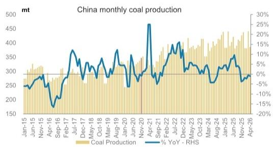

line

| Month    | Coal Production (mt) | % YoY - RHS |
|----------|----------------------|-------------|
| Jan-15   | ~250                 | ~0%         |
| Jun-15   | ~270                 | ~5%         |
| Nov-15   | ~280                 | ~10%        |
| Jan-16   | ~290                 | ~15%        |
| Apr-16   | ~260                 | ~-10%       |
| Sep-16   | ~240                 | ~-15%       |
| Feb-17   | ~280                 | ~0%         |
| Jul-17   | ~300                 | ~5%         |
| Dec-17   | ~320                 | ~10%        |
| Mar-18   | ~310                 | ~5%         |
| Aug-18   | ~330                 | ~10%        |
| Nov-18   | ~340                 | ~15%        |
| Jan-19   | ~350                 | ~20%        |
| Apr-19   | ~360                 | ~25%        |
| Jul-19   | ~370                 | ~30%        |
| Oct-19   | ~380                 | ~25%        |
| Jan-20   | ~390                 | ~20%        |
| Apr-20   | ~400                 | ~15%        |
| Jul-20   | ~410                 | ~10%        |
| Oct-20   | ~420                 | ~5%         |
| Jan-21   | ~430                 | ~0%         |
| Apr-21   | ~440                 | ~5%         |
| Jul-21   | ~450                 | ~10%        |
| Oct-21   | ~440                 | ~5%         |
| Jan-22   | ~430                 | ~0%         |
| Apr-22   | ~420                 | ~5%         |
| Jul-22   | ~410                 | ~10%        |
| Oct-22   | ~400                 | ~5%         |
| Jan-23   | ~390                 | ~0%         |
| Apr-23   | ~380                 | ~5%         |
| Jul-23   | ~370                 | ~10%        |
| Oct-23   | ~360                 | ~5%         |
| Jan-24   | ~350                 | ~0%         |
| Apr-24   | ~340                 | ~5%         |
| Jul-24   | ~330                 | ~10%        |
| Oct-24   | ~320                 | ~5%         |
| Jan-25   | ~310                 | ~0%         |
| Apr-25   | ~300                 | ~5%         |
| Jul-25   | ~290                 | ~10%        |
| Oct-25   | ~280                 | ~5%         |
| Jan-26   | ~270                 | ~0%         |
| Apr-26   | ~260                 | ~5%         |

Source: Sxcoal, MS.

Exhibit 38: Data for the week 

<table><tr><td colspan="2"></td><td>15-May</td><td>WoW</td><td>YTD</td><td>YTD avg</td><td>&#x27;25 avg</td><td>YTD vs &#x27;25</td></tr><tr><td colspan="8">Regional</td></tr><tr><td>NEWC thermal coal</td><td>US$/ton</td><td>130</td><td>-1.5%</td><td>19.3%</td><td>124</td><td>106.6</td><td>16.6%</td></tr><tr><td>QLD coking coal</td><td>US$/ton</td><td>239</td><td>-0.4%</td><td>9.6%</td><td>231</td><td>189.0</td><td>22.4%</td></tr><tr><td colspan="8">China</td></tr><tr><td>QHD 5500 kcal/kg</td><td>Rmb/ton</td><td>715</td><td>0.3%</td><td>2.9%</td><td>695</td><td>684</td><td>1.5%</td></tr><tr><td>CCI 5500 kcal/kg</td><td>Rmb/ton</td><td>835</td><td>1.3%</td><td>22.4%</td><td>743</td><td>864</td><td>-14.0%</td></tr><tr><td>BSPI</td><td>Rmb/ton</td><td>704</td><td>0.3%</td><td>1.3%</td><td>690</td><td>682</td><td>1.1%</td></tr><tr><td>Liuilin No. 4 mine-mouth</td><td>Rmb/ton</td><td>710</td><td>2.9%</td><td>6.0%</td><td>686</td><td>641</td><td>7.0%</td></tr><tr><td>Liuilin No. 4 FOR</td><td>Rmb/ton</td><td>1,640</td><td>1.9%</td><td>3.8%</td><td>1,567</td><td>1,399</td><td>12.1%</td></tr><tr><td>QHD Inventory</td><td>mt</td><td>5.92</td><td>1.0%</td><td>-15.1%</td><td>5.97</td><td>6.37</td><td>-6.3%</td></tr></table>

Note: QLD = Queensland; QHD = Qinhuangdao; CCI = China Coal Index; BSPI = Bohai-Rim Steam-Coal Price Index; FOR = Free on Rail. Source: China Coal Transport and Distribution Association (CCTD), McCloskeys, MS.

Exhibit 39: China vs. regional FOB thermal coal prices   
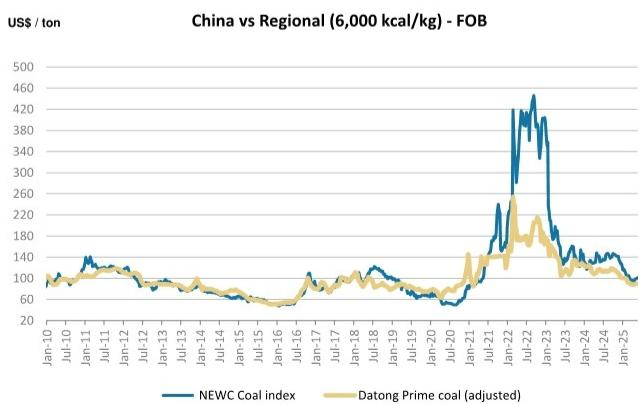

line

| Date   | NEWC Coal Index | Datong Prime coal (adjusted) |
|--------|-----------------|------------------------------|
| Jan-10 | ~100            | ~100                         |
| Jul-10 | ~100            | ~100                         |
| Jan-11 | ~130            | ~100                         |
| Jul-11 | ~120            | ~100                         |
| Jan-12 | ~110            | ~100                         |
| Jul-12 | ~100            | ~100                         |
| Jan-13 | ~90             | ~90                          |
| Jul-13 | ~80             | ~80                          |
| Jan-14 | ~70             | ~70                          |
| Jul-14 | ~60             | ~60                          |
| Jan-15 | ~50             | ~50                          |
| Jul-15 | ~40             | ~40                          |
| Jan-16 | ~30             | ~30                          |
| Jul-16 | ~40             | ~40                          |
| Jan-17 | ~60             | ~60                          |
| Jul-17 | ~80             | ~80                          |
| Jan-18 | ~100            | ~100                         |
| Jul-18 | ~120            | ~120                         |
| Jan-19 | ~130            | ~130                         |
| Jul-19 | ~140            | ~140                         |
| Jan-20 | ~150            | ~150                         |
| Jul-20 | ~160            | ~160                         |
| Jan-21 | ~220            | ~220                         |
| Jul-21 | ~380            | ~260                         |
| Jan-22 | ~450            | ~280                         |
| Jul-22 | ~420            | ~240                         |
| Jan-23 | ~350            | ~220                         |
| Jul-23 | ~280            | ~200                         |
| Jan-24 | ~250            | ~180                         |
| Jul-24 | ~220            | ~160                         |
| Jan-25 | ~180            | ~140                         |

Source: Bloomberg, CCTD, MS.

Exhibit40: China's coking coal prices – Mine-mouth vs. FOR   
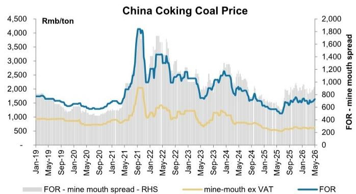

line

| Date    | FOR - mine mouth spread - RHS | mine-mouth ex VAT | FOR |
|---------|-------------------------------|-------------------|-----|
| Jan-19  | ~1,700                        | ~1,000            | ~1,700 |
| May-19  | ~1,600                        | ~950              | ~1,600 |
| Sep-19  | ~1,500                        | ~900              | ~1,500 |
| Jan-20  | ~1,400                        | ~850              | ~1,400 |
| May-20  | ~1,300                        | ~800              | ~1,300 |
| Sep-20  | ~1,400                        | ~850              | ~1,400 |
| Jan-21  | ~1,500                        | ~900              | ~1,500 |
| May-21  | ~1,800                        | ~1,000            | ~1,800 |
| Sep-21  | ~2,200                        | ~1,200            | ~2,200 |
| Jan-22  | ~3,800                        | ~1,400            | ~3,800 |
| May-22  | ~3,500                        | ~1,300            | ~3,500 |
| Sep-22  | ~3,200                        | ~1,200            | ~3,200 |
| Jan-23  | ~3,000                        | ~1,100            | ~3,000 |
| May-23  | ~2,800                        | ~1,000            | ~2,800 |
| Sep-23  | ~3,500                        | ~1,100            | ~3,500 |
| Jan-24  | ~3,200                        | ~1,050            | ~3,200 |
| May-24  | ~3,000                        | ~1,000            | ~3,000 |
| Sep-24  | ~2,800                        | ~950              | ~2,800 |
| Jan-25  | ~2,600                        | ~900              | ~2,600 |
| May-25  | ~2,400                        | ~850              | ~2,400 |
| Sep-25  | ~2,500                        | ~850              | ~2,500 |
| Jan-26  | ~2,600                        | ~850              | ~2,600 |
| May-26  | ~2,700                        | ~850              | ~2,700 |

Source: Bloomberg, CCTD, MS

Exhibit41: Coal inventory at QHD port   
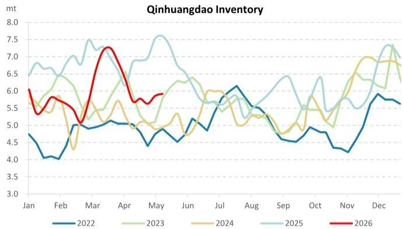

line

Qinhuangdao Inventory
| Month | 2022 (mt) | 2023 (mt) | 2024 (mt) | 2025 (mt) | 2026 (mt) |
|---|---|---|---|---|---|
| Jan | 4.8 | 5.8 | 5.7 | 6.5 | 6.1 |
| Feb | 4.1 | 6.0 | 5.9 | 6.8 | 5.4 |
| Mar | 4.9 | 5.5 | 4.3 | 7.5 | 7.3 |
| Apr | 5.1 | 5.2 | 5.7 | 6.8 | 5.7 |
| May | 4.5 | 5.1 | 5.0 | 7.6 | 5.9 |
| Jun | 4.7 | 6.3 | 4.8 | 6.0 | 5.8 |
| Jul | 5.6 | 5.4 | 6.0 | 5.7 | 5.7 |
| Aug | 6.1 | 5.3 | 5.2 | 5.8 | 5.6 |
| Sep | 4.7 | 5.0 | 4.9 | 6.4 | 5.7 |
| Oct | 4.9 | 5.6 | 5.8 | 6.4 | 5.3 |
| Nov | 4.3 | 6.0 | 6.9 | 5.4 | 5.8 |
| Dec | 5.7 | 6.4 | 6.8 | 7.3 | 6.9 |

Source: CCTD, MS

Exhibit 42: Coal inventory at Bohai Rim ports   
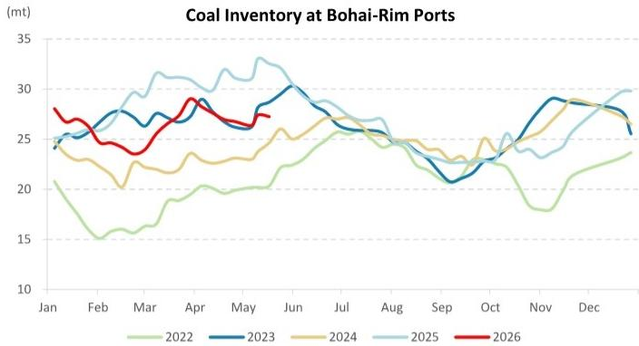

line

Coal Inventory at Bohai-Rim Ports
| Month | 2022 (mt) | 2023 (mt) | 2024 (mt) | 2025 (mt) | 2026 (mt) |
|---|---|---|---|---|---|
| Jan | 21.0 | 25.0 | 24.0 | 25.0 | 28.0 |
| Feb | 15.0 | 27.0 | 23.0 | 26.0 | 26.0 |
| Mar | 16.0 | 27.0 | 22.0 | 31.0 | 24.0 |
| Apr | 19.0 | 28.0 | 23.0 | 31.0 | 29.0 |
| May | 20.0 | 27.0 | 24.0 | 33.0 | 27.0 |
| Jun | 21.0 | 30.0 | 26.0 | 31.0 | 27.0 |
| Jul | 23.0 | 26.0 | 27.0 | 28.0 | - |
| Aug | 24.0 | 25.0 | 25.0 | 27.0 | - |
| Sep | 23.0 | 21.0 | 23.0 | 24.0 | - |
| Oct | 22.0 | 23.0 | 25.0 | 25.0 | - |
| Nov | 18.0 | 29.0 | 28.0 | 24.0 | - |
| Dec | 24.0 | 27.0 | 28.0 | 30.0 | - |

Source: CCTD, MS. Note: Bohai Rim Ports include QHD Port, Huanghua Port, Tianjin Port, Caofeidian Port, and Jingtang Port..

Exhibit 43: Water level of Three Gorges Dam   
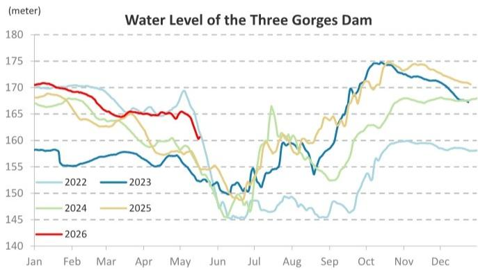

line

Water Level of the Three Gorges Dam
| Month | 2022 (meter) | 2023 (meter) | 2024 (meter) | 2025 (meter) | 2026 (meter) |
|---|---|---|---|---|---|
| Jan | 170.5 | 158.0 | 168.0 | 169.0 | 170.5 |
| Feb | 170.0 | 155.5 | 167.5 | 168.5 | 170.0 |
| Mar | 169.5 | 156.0 | 167.0 | 167.5 | 169.5 |
| Apr | 168.0 | 156.5 | 166.5 | 166.0 | 169.0 |
| May | 170.0 | 157.0 | 166.0 | 165.5 | 168.5 |
| Jun | 145.0 | 152.0 | 148.0 | 150.0 | 160.0 |
| Jul | 148.0 | 153.0 | 149.0 | 149.5 | 152.0 |
| Aug | 149.0 | 158.0 | 159.0 | 159.5 | 158.0 |
| Sep | 147.0 | 160.0 | 153.0 | 162.0 | 163.0 |
| Oct | 152.0 | 174.0 | 163.0 | 172.0 | 174.0 |
| Nov | 160.0 | 173.0 | 167.0 | 174.0 | 173.0 |
| Dec | 158.0 | 168.0 | 168.5 | 172.5 | 170.5 |

Source: Wind, MS

Exhibit 44: China's weekly coal arrivals   
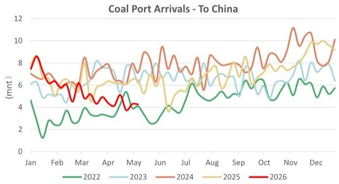

line

| Month | 2022 | 2023 | 2024 | 2025 | 2026 |
|-------|------|------|------|------|------|
| Jan   | 4.5  | 6.0  | 7.0  | 7.5  | 8.5  |
| Feb   | 1.5  | 5.5  | 6.5  | 6.0  | 7.0  |
| Mar   | 3.0  | 6.5  | 8.0  | 6.5  | 6.0  |
| Apr   | 3.5  | 7.0  | 7.5  | 6.0  | 5.5  |
| May   | 4.0  | 7.5  | 8.5  | 6.5  | 4.5  |
| Jun   | 3.0  | 7.0  | 9.0  | 6.0  | 4.0  |
| Jul   | 4.5  | 6.5  | 8.0  | 7.0  | 5.0  |
| Aug   | 5.0  | 6.0  | 8.5  | 7.5  | 5.5  |
| Sep   | 5.5  | 6.5  | 8.0  | 7.0  | 6.0  |
| Oct   | 6.0  | 7.0  | 9.0  | 7.5  | 6.5  |
| Nov   | 6.5  | 7.5  | 11.0 | 8.0  | 7.0  |
| Dec   | 5.5  | 7.0  | 10.0 | 9.0  | 7.5  |

Source: Bloomberg, MS

# Major Theme of the Month

# Tighter Copper Scrap Market in China?

China's output of refined copper and semi-finished products has grown more reliant on scrap, but availability is being limited by domestic policy while global scrap trade is changing too. This brings upside risks to copper prices, all else equal. For further details, see Commodity Matters: Tighter Copper Scrap Market in China? (14 May 2026)

Tightening copper scrap markets might weigh on refined copper output in China (and elsewhere): Tight copper concentrate markets have pushed China's copper smelters to use more scrap in recent years. However, tighter regulation of China's domestic scrap market – particularly full implementation of reverse invoicing and clampdown on circular invoicing – have increased compliance and tax scrutiny, raising costs and limiting the supply of compliant, invoice-bearing material. US-China trade tensions have also weighed on US scrap exports, while growing recognition of scrap's strategic importance is leading to increased policy focus, which may further restrict trade and global availability.

Secondary semi-fabricators may turn to more refined metal: With less scrap available, semi-fabricators are either lowering utilisation rates or using refined copper to feed their operations, supporting refined demand and potentially driving the rapid copper inventory draws since CNY.

Smelters face feed challenges too, potentially impacting refined output: Smelters may also face more challenges sourcing scrap and copper concentrate, weighing on metal output. Larger smelters may be more resilient though, and some may even see improved scrap availability as smaller secondary processors cease operations.

MS Outlook: A tighter scrap market brings upside risk to copper prices, all else equal, as reduced supply from scrap-based semi-fabricators, or more semis being made with refined metal, plus risk of smelter cuts, point to a tighter refined copper market. However, with copper already at all-time highs, demand may come under pressure too, providing some offset, while the clampdown on circular invoicing is also impacting spot copper trading.

Exhibit 45: Increased scrap usage at China's copper smelters has supported continued growth in output. Since 2022, smelter output has diverged from the volume of concentrate available in China, highlighting further reliance on scrap as a feedstock   
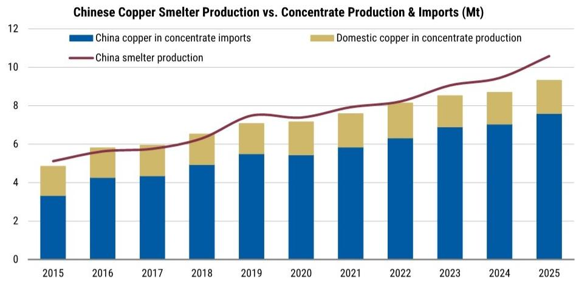

bar_line

Chinese Copper Smelter Production vs. Concentrate Production & Imports (Mt)
| Year | China copper in concentrate imports (Mt) | Domestic copper in concentrate production (Mt) | China smelter production (Mt) |
|---|---|---|---|
| 2015 | 3.3 | 1.8 | 5.1 |
| 2016 | 4.2 | 1.9 | 5.7 |
| 2017 | 4.3 | 1.9 | 5.8 |
| 2018 | 4.9 | 2.1 | 6.2 |
| 2019 | 5.5 | 2.1 | 7.5 |
| 2020 | 5.4 | 2.1 | 7.3 |
| 2021 | 5.8 | 2.2 | 7.8 |
| 2022 | 6.3 | 2.3 | 8.1 |
| 2023 | 6.9 | 2.3 | 9.0 |
| 2024 | 7.0 | 2.4 | 9.3 |
| 2025 | 7.6 | 2.5 | 10.5 |

Source: TradeMap, MS, assumed $25\%$ imported copper concentrate grade

Exhibit 46: The share of secondary production at smelters (using scrap) has been rising with higher copper prices   
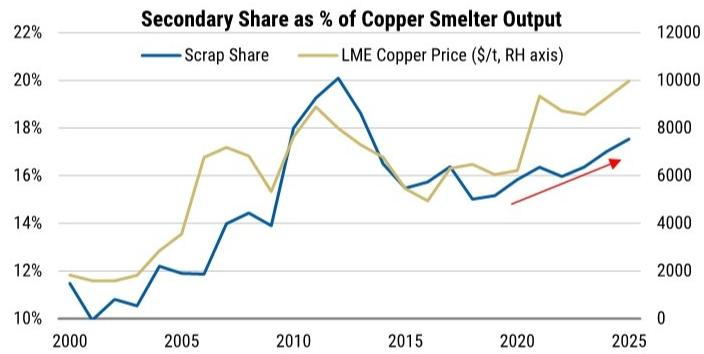

line

| Year | Scrap Share | LME Copper Price ($/t, RH axis) |
|------|-------------|----------------------------------|
| 2000 | 11%         | 2000                             |
| 2005 | 12%         | 4000                             |
| 2010 | 18%         | 8000                             |
| 2015 | 16%         | 6000                             |
| 2020 | 15%         | 7000                             |
| 2025 | 17%         | 10000                            |

Source: Woodmac, Bloomberg, MS

Exhibit 47: TCRCs (spot and contract) have fallen sharply with a lack of copper concentrate supply   
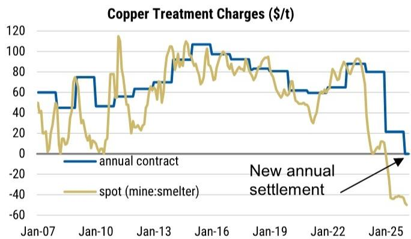

line

| Date    | annual contract | spot (mine:smelter) |
|---------|-----------------|---------------------|
| Jan-07  | 60              | 40                  |
| Jan-10  | 80              | 10                  |
| Jan-13  | 100             | 110                 |
| Jan-16  | 90              | 90                  |
| Jan-19  | 80              | 80                  |
| Jan-22  | 60              | 60                  |
| Jan-25  | 20              | -40                 |

Source: Platts, MS

# Disclosure Section

The information and opinions in MS were prepared or are disseminated by MS Asia Limited (which accepts the responsibility for its contents) and/or MS Asia (Singapore) Pte. (Registration number 199206298Z) and/or MS Asia (Singapore) Securities Pte Ltd (Registration number 200008434H), regulated by the Monetary Authority of Singapore (which accepts legal responsibility for its contents and should be contacted with respect to any matters arising from, or in connection with, MS), and/or MS Taiwan Limited and/or MS & Co International plc, Seoul Branch, and/or MS Australia Limited (A.B.N. 67 003 734 576, holder of Australian financial services license No. 233742, which accepts responsibility for its contents), and/or MS Wealth Management Australia Pty Ltd (A.B.N. 19 009 145 555, holder of Australian financial services license No. 240813, which accepts responsibility for its contents), and/or MS India Company Private Limited having Corporate Identification No (CIN) U22990MH1998PTC115305, regulated by the Securities and Exchange Board of India ("SEBI") and holder of licenses as a Research Analyst (SEBI Registration No. INH000001105); Stock Broker (SEBI Stock Broker Registration No. INZ000244438), Merchant Banker (SEBI Registration No. INM000011203), and depository participant with National Securities Depository Limited (SEBI Registration No. IN-DP-NSDL-567-2021) having registered office at Altimus, Level 39 & 40, Pandurang Budhkar Marg, Worli, Mumbai 400018, India; Telephone no. +91-22-61181000; Compliance Officer Details: Mr. Tejarshi Hardas, Tel. No.: +91-22-61181000 or Email: tejarshi.hardas@morganstanley.com; Grievance officer details: Mr. Tejarshi Hardas, Tel. No.: +91-22-61181000 or Email: msic-compliance@morganstanley.com which accepts the responsibility for its contents and should be contacted with respect to any matters arising from, or in connection with, MS, and their affiliates (collectively, "MS"). MS India Company Private Limited (MSICPL) may use AI tools in providing research services. All recommendations contained herein are made by the duly qualified research analysts.

For important disclosures, stock price charts and equity rating histories regarding companies that are the subject of this report, please see the MS Disclosure Website at www.morganstanley.com/eqr/disclosures/webapp/generalresearch, or contact your investment representative or MS at 1585 Broadway, (Attention: Research Management), New York, NY, 10036 USA.

For valuation methodology and risks associated with any recommendation, rating or price target referenced in this research report, please contact the Client Support Team as follows: US/Canada +1 800 303-2495; Hong Kong +852 2848-5999; Latin America +1 718 754-5444 (U.S.); London +44 (0)20-7425-8169; Singapore +65 6834-6860; Sydney +61 (0)2-9770-1505; Tokyo +81 (0)3-6836-9000. Alternatively you may contact your investment representative or MS at 1585 Broadway, (Attention: Research Management), New York, NY 10036 USA.

# Analyst Certification

The following analysts hereby certify that their views about the companies and their securities discussed in this report are accurately expressed and that they have not received and will not receive direct or indirect compensation in exchange for expressing specific recommendations or views in this report: Rahul Anand, CFA.

# Global Research Conflict Management Policy

MS has been published in accordance with our conflict management policy, which is available at www.morganstanley.com/institutional/research/conflictpolicies. A Portuguese version of the policy can be found at www.morganstanley.com.br

# Important Regulatory Disclosures on Subject Companies

As of April 30, 2026, MS beneficially owned 1% or more of a class of common equity securities of the following companies covered in MS: BHP Group Ltd, Boss Energy Ltd, Fortescue Metals Group Ltd., Iluka Resources Ltd, Lynas Rare Earths, Paladin Energy Ltd, PLS Group Ltd, Rio Tinto Limited, Sandfire Resources Ltd, South32 Ltd.

Within the last 12 months, MS managed or co-managed a public offering (or 144A offering) of securities of Nickel Industries, Whitehaven Coal Ltd.

Within the last 12 months, MS has received compensation for investment banking services from Nickel Industries, Whitehaven Coal Ltd.

In the next 3 months, MS expects to receive or intends to seek compensation for investment banking services from BHP Group Ltd, Fortescue Metals Group Ltd., IGO Ltd, Iluka Resources Ltd, Lynas Rare Earths, Mineral Resources Limited, Nickel Industries, Paladin Energy Ltd, PLS Group Ltd, Rio Tinto Limited, Sandfire Resources Ltd, South32 Ltd, Whitehaven Coal Ltd.

Within the last 12 months, MS has received compensation for products and services other than investment banking services from Nickel Industries, Rio Tinto Limited, South32 Ltd. Within the last 12 months, MS has provided or is providing investment banking services to, or has an investment banking client relationship with, the following company: BHP Group Ltd, Fortescue Metals Group Ltd., IGO Ltd, Iluka Resources Ltd, Lynas Rare Earths, Mineral Resources Limited, Nickel Industries, Paladin Energy Ltd, PLS Group Ltd, Rio Tinto Limited, Sandfire Resources Ltd, South32 Ltd, Whitehaven Coal Ltd.

Within the last 12 months, MS has either provided or is providing non-investment banking, securities-related services to and/or in the past has entered into an agreement to provide services or has a client relationship with the following company: Nickel Industries, Rio Tinto Limited, South32 Ltd.

The equity research analysts or strategists principally responsible for the preparation of MS have received compensation based upon various factors, including quality of research, investor client feedback, stock picking, competitive factors, firm revenues and overall investment banking revenues. Equity Research analysts' or strategists' compensation is not linked to investment banking or capital markets transactions performed by MS or the profitability or revenues of particular trading desks.

MS and its affiliates do business that relates to companies/instruments covered in MS, including market making, providing liquidity, fund management, commercial banking, extension of credit, investment services and investment banking. MS sells to and buys from customers the securities/instruments of companies covered in MS on a principal basis. MS may have a position in the debt of the Company or instruments discussed in this report. MS trades or may trade as principal in the debt securities (or in related derivatives) that are the subject of the debt research report.

Certain disclosures listed above are also for compliance with applicable regulations in non-US jurisdictions.

# STOCK RATINGS

MS uses a relative rating system using terms such as Overweight, Equal-weight, Not-Rated or Underweight (see definitions below). MS does not assign ratings of Buy, Hold or Sell to the stocks we cover. Overweight, Equal-weight, Not-Rated and Underweight are not the equivalent of buy, hold and sell. Investors should carefully read the definitions of all ratings used in MS. In addition, since MS contains more complete information concerning the analyst's views, investors should carefully read MS, in its entirety, and not infer the contents from the rating alone. In any case, ratings (or research) should not be used or relied upon as investment advice. An investor's decision to buy or sell a stock should depend on individual circumstances (such as the investor's existing holdings) and other considerations.

# Global Stock Ratings Distribution

(as of April 30, 2026)

The Stock Ratings described below apply to MS's Fundamental Equity Research and do not apply to Debt Research produced by the Firm.

For disclosure purposes only (in accordance with FINRA requirements), we include the category headings of Buy, Hold, and Sell alongside our ratings of Overweight, Equal-weight, Not-Rated and Underweight. MS does not assign ratings of Buy, Hold or Sell to the stocks we cover. Overweight, Equal-weight, Not-Rated and Underweight are not the equivalent of buy, hold, and sell but represent recommended relative weightings (see definitions below). To satisfy regulatory requirements, we correspond Overweight, our most positive stock rating, with a buy recommendation; we correspond Equal-weight and Not-Rated to hold and Underweight to sell recommendations, respectively.

<table><tr><td></td><td colspan="2">Coverage Universe</td><td colspan="3">Investment Banking Clients (IBC)</td><td colspan="2">Other Material Investment Services Clients (MISC)</td></tr><tr><td>Stock Rating Category</td><td>Count</td><td>% of Total</td><td>Count</td><td>% of Total IBC</td><td>% of Rating Category</td><td>Count</td><td>% of Total Other MISC</td></tr><tr><td>Overweight/Buy</td><td>1546</td><td>42%</td><td>467</td><td>51%</td><td>30%</td><td>709</td><td>44%</td></tr><tr><td>Equal-weight/Hold</td><td>1568</td><td>43%</td><td>358</td><td>39%</td><td>23%</td><td>715</td><td>44%</td></tr><tr><td>Not-Rated/Hold</td><td>4</td><td>0%</td><td>0</td><td>0%</td><td>0%</td><td>1</td><td>0%</td></tr><tr><td>Underweight/Sell</td><td>555</td><td>15%</td><td>84</td><td>9%</td><td>15%</td><td>202</td><td>12%</td></tr><tr><td>Total</td><td>3,673</td><td></td><td>909</td><td></td><td></td><td>1627</td><td></td></tr></table>

Data include common stock and ADRs currently assigned ratings. Investment Banking Clients are companies from whom MS received investment banking compensation in the last 12 months. Due to rounding off of decimals, the percentages provided in the "% of total" column may not add up to exactly 100 percent.

# Analyst Stock Ratings

Overweight (O). The stock's total return is expected to exceed the average total return of the analyst's industry (or industry team's) coverage universe, on a risk-adjusted basis, over the next 12-18 months.

Equal-weight (E). The stock's total return is expected to be in line with the average total return of the analyst's industry (or industry team's) coverage universe, on a risk-adjusted basis, over the next 12-18 months.

Not-Rated (NR). Currently the analyst does not have adequate conviction about the stock's total return relative to the average total return of the analyst's industry (or industry team's) coverage universe, on a risk-adjusted basis, over the next 12-18 months.

Underweight (U). The stock's total return is expected to be below the average total return of the analyst's industry (or industry team's) coverage universe, on a risk-adjusted basis, over the next 12-18 months.

Unless otherwise specified, the time frame for price targets included in MS is 12 to 18 months.

# Analyst Industry Views

Attractive (A): The analyst expects the performance of his or her industry coverage universe over the next 12-18 months to be attractive vs. the relevant broad market benchmark, as indicated below.

In-Line (I): The analyst expects the performance of his or her industry coverage universe over the next 12-18 months to be in line with the relevant broad market benchmark, as indicated below. Cautious (C): The analyst views the performance of his or her industry coverage universe over the next 12-18 months with caution vs. the relevant broad market benchmark, as indicated below. Benchmarks for each region are as follows: North America - S&P 500; Latin America - relevant MSCI country index or MSCI Latin America Index; Europe - MSCI Europe; Japan - TOPIX; Asia - relevant MSCI country index or MSCI sub-regional index or MSCI AC Asia Pacific ex Japan Index.

# Important Disclosures for MS Smith Barney LLC Customers

Important disclosures regarding any material conflict of interest that can reasonably be expected to have influenced MS Smith Barney LLC's choice of a third-party research provider or the subject company of a third-party research report, are available on the MS Wealth Management disclosure website at www.morganstanley.com/online/researchdisclosures. For MS specific disclosures, you may refer to https://www.morganstanley.com/eqr/disclosures/webapp/generalresearch.

Each MS report is reviewed and approved on behalf of MS Smith Barney LLC. This review and approval is conducted by the same person who reviews the research report on behalf of MS. This could create a conflict of interest.

# Other Important Disclosures

MS policy is to update research reports as and when the Research Analyst and Research Management deem appropriate, based on developments with the issuer, the sector, or the market that may have a material impact on the research views or opinions stated therein. In addition, certain Research publications are intended to be updated on a regular periodic basis (weekly/monthly/quarterly/annual) and will ordinarily be updated with that frequency, unless the Research Analyst and Research Management determine that a different publication schedule is appropriate based on current conditions.

MS is not acting as a municipal advisor and the opinions or views contained herein are not intended to be, and do not constitute, advice within the meaning of Section 975 of the Dodd-Frank Wall Street Reform and Consumer Protection Act.

MS produces an equity research product called a "Tactical Idea." Views contained in a "Tactical Idea" on a particular stock may be contrary to the recommendations or views expressed in research on the same stock. This may be the result of differing time horizons, methodologies, market events, or other factors. For all research available on a particular stock, please contact your sales representative or go to Matrix at http://www.morganstanley.com/matrix.

MS is provided to our clients through our proprietary research portal on Matrix and also distributed electronically by MS to clients. Certain, but not all, MS products are also made available to clients through third-party vendors or redistributed to clients through alternate electronic means as a convenience. For access to all available MS, please contact your sales representative or go to Matrix at http://www.morganstanley.com/matrix.

Any access and/or use of MS is subject to MS's Terms of Use (http://www.morganstanley.com/terms.html). By accessing and/or using MS, you are indicating that you have read and agree to be bound by our Terms of Use (http://www.morganstanley.com/terms.html). In addition you consent to MS processing your personal data and using cookies in accordance with our Privacy Policy and our Global Cookies Policy (http://www.morganstanley.com/privacy\_pledge.html), including for the purposes of setting your preferences and to collect readership data so that we can deliver better and more personalized service and products to you. To find out more information about how MS processes personal data, how we use cookies and how to reject cookies see our Privacy Policy and our Global Cookies Policy (http://www.morganstanley.com/privacy\_pledge.html). Please use the provided link to review the Terms and Conditions and Most Important Terms and Conditions for MS India Company Private Limited (https://www.morganstanley.com/assets/pdfs/about-us-global-offices/india/Terms\_and\_conditions.pdf) and the following link to review the audit report (https://ny.matrix.ms.com/eqr/research/webapp/researchdocs/MSICPL\_Morgan\_Stanley\_Research\_Audit\_Report.pdf).

If you do not agree to our Terms of Use and/or if you do not wish to provide your consent to MS processing your personal data or using cookies please do not access our research. MS does not provide individually tailored investment advice. MS has been prepared without regard to the circumstances and objectives of those who receive it. MS recommends that investors independently evaluate particular investments and strategies, and encourages investors to seek the advice of a financial adviser. The appropriateness of an investment or strategy will depend on an investor's circumstances and objectives. The securities, instruments, or strategies discussed in MS may not be suitable for all investors, and certain investors may not be eligible to purchase or participate in some or all of them. MS is not an offer to buy or sell or the solicitation of an offer to buy or sell any security/instrument or to participate in any particular trading strategy. The value of and income from your investments may vary because of changes in interest rates, foreign exchange rates, default rates, prepayment rates, securities/instruments prices, market indexes, operational or financial conditions of companies or other factors. There may be time limitations on the exercise of options or other rights in securities/instruments transactions. Past performance is not necessarily a guide to future performance. Estimates of future performance are based on assumptions that may not be realized. If provided, and unless otherwise stated, the closing price on the cover page is that of the primary exchange for the subject company's securities/instruments.

The fixed income research analysts, strategists or economists principally responsible for the preparation of MS have received compensation based upon various factors, including quality, accuracy and value of research, firm profitability or revenues (which include fixed income trading and capital markets profitability or revenues), client feedback and competitive factors. Fixed Income Research analysts', strategists' or economists' compensation is not linked to investment banking or capital markets transactions performed by MS or the profitability or revenues of particular trading desks.

The "Important Regulatory Disclosures on Subject Companies" section in MS lists all companies mentioned where MS owns 1% or more of a class of common equity securities of the companies. For all other companies mentioned in MS, MS may have an investment of less than 1% in securities/instruments or derivatives of securities/instruments of companies and may trade them in ways different from those discussed in MS. Employees of MS not involved in the preparation of MS may have investments in securities/instruments or derivatives of securities/instruments of companies mentioned and may trade them in ways different from those discussed in MS. Derivatives may be issued by MS or associated persons.

With the exception of information regarding MS, MS is based on public information. MS makes every effort to use reliable, comprehensive information, but we make no representation that it is accurate or complete. We have no obligation to tell you when opinions or information in MS change apart from when we intend to discontinue equity research coverage of a subject company. Facts and views presented in MS have not been reviewed by, and may not reflect information known to, professionals in other MS business areas, including investment banking personnel.

MS personnel may participate in company events such as site visits and are generally prohibited from accepting payment by the company of associated expenses unless pre-approved by authorized members of Research management.

MS may make investment decisions that are inconsistent with the recommendations or views in this report.

To our readers based in Taiwan or trading in Taiwan securities/instruments: Information on securities/instruments that trade in Taiwan is distributed by MS Taiwan Limited ("MSTL"). Such information is for your reference only. The reader should independently evaluate the investment risks and is solely responsible for their investment decisions. MS may not be distributed to the public media or quoted or used by the public media without the express written consent of MS. Any non-customer reader within the scope of Article 7-1 of the Taiwan Stock Exchange Recommendation Regulations accessing and/or receiving MS is not permitted to provide MS to any third party (including but not limited to related parties, affiliated companies and any other third parties) or engage in any activities regarding MS which may create or give the appearance of creating a conflict of interest. Information on securities/instruments that do not trade in Taiwan is for informational purposes only and is not to be construed as a recommendation or a solicitation to trade in such securities/instruments. MSTL may not execute transactions for clients in these securities/instruments.

Certain information in MS was sourced by employees of the Shanghai Representative Office of MS Asia Limited for the use of MS Asia Limited. MS is not incorporated under PRC law and the research in relation to this report is conducted outside the PRC. MS does not constitute an offer to sell or the solicitation of an offer to buy any securities in the PRC. PRC investors shall have the relevant qualifications to invest in such securities and shall be responsible for obtaining all relevant approvals, licenses, verifications and/or registrations from the relevant governmental authorities themselves. Neither this report nor any part of it is intended as, or shall constitute, provision of any consultancy or advisory service of securities investment as defined under PRC law. Such information is provided for your reference only.

MS is disseminated in Brazil by MS C.T.V.M. S.A. located at Av. Brigadeiro Faria Lima, 3600, 6th floor, São Paulo - SP, Brazil; and is regulated by the Comissão de Valores Mobiliários; in Mexico by MS México, Casa de Bolsa, S.A. de C.V which is regulated by Comision Nacional Bancaria y de Valores. Paseo de los Tamarindos 90, Torre 1, Col. Bosques de las Lomas Floor 29, 05120 Mexico City; in Japan by MS MUFG Securities Co., Ltd. and, for Commodities related research reports only, MS Capital Group Japan Co., Ltd; in Hong Kong by MS Asia Limited (which accepts responsibility for its contents) and by MS Bank Asia Limited; in Singapore by MS Asia (Singapore) Pte. (Registration number 199206298Z) and/or MS Asia (Singapore) Securities Pte Ltd (Registration number 200008434H), regulated by the Monetary Authority of Singapore (which accepts legal responsibility for its contents and should be contacted with respect to any matters arising from, or in connection with, MS) and by MS Bank Asia Limited, Singapore Branch (Registration number T14FC0118); in Australia to "wholesale clients" within the meaning of the Australian Corporations Act by MS Australia Limited A.B.N. 67 003 734-576, holder of Australian financial services license No. 233742, which accepts responsibility for its contents; in Australia to "wholesale clients" and "retail clients" within the meaning of the Australian Corporations Act by MS Wealth Management Australia Pty Ltd (A.B.N. 19 009 145 555, holder of Australian financial services license No. 240813, which accepts responsibility for its contents; in Korea by MS & Co International plc, Seoul Branch; in India by MS India Company Private Limited having Corporate Identification No (CIN) U22990MH1998PTC115305, regulated by the Securities and Exchange Board of India ("SEBI") and holder of licenses as a Research Analyst (SEBI Registration No. INH000001105); Stock Broker (SEBI Stock Broker Registration No. INZ000244438), Merchant Banker (SEBI Registration No. INM000011203), and depository participant with National Securities Depository Limited (SEBI Registration No. IN-DP-NSDL-567-2021) having registered office at Altimus, Level 39 & 40, Pandurang Budhkar Marg, Worli, Mumbai 400018, India; Telephone no. +91-22-61181000; Compliance Officer Details: Mr. Tejarshi Hardas, Tel. No.: +91-22-61181000 or Email: tejarshi.hardas@morganstanley.com; Grievance officer details: Mr. Tejarshi Hardas, Tel. No.: +91-22-61181000 or Email: msic-compliance@morganstanley.com. MS India Company Private Limited (MSICPL) may use AI tools in providing research services. All recommendations contained herein are made by the duly qualified research analysts; in Canada by MS Canada Limited; in Germany and the European Economic Area where required by MS Europe S.E., authorised and regulated by Bundesanstalt fuer Finanzdienstleistungsaufsicht (BaFin) under the reference number 149169; in the US by MS & Co. LLC, which accepts responsibility for its contents. MS & Co. International plc, authorized by the Prudential Regulation Authority and regulated by the Financial Conduct

Authority and the Prudential Regulation Authority, disseminates in the UK research that it has prepared, and research which has been prepared by any of its affiliates, only to persons who (i) are investment professionals falling within Article 19(5) of the Financial Services and Markets Act 2000 (Financial Promotion) Order 2005 (as amended, the "Order"); (ii) are persons who are high net worth entities falling within Article 49(2)(a) to (d) of the Order; or (iii) are persons to whom an invitation or inducement to engage in investment activity (within the meaning of section 21 of the Financial Services and Markets Act 2000, as amended) may otherwise lawfully be communicated or caused to be communicated. RMB MS Proprietary Limited is a member of the JSE Limited and A2X (Pty) Ltd. RMB MS Proprietary Limited is a joint venture owned equally by MS International Holdings Inc. and RMB Investment Advisory (Proprietary) Limited, which is wholly owned by FirstRand Limited. The information in MS is being disseminated by MS Saudi Arabia, regulated by the Capital Market Authority in the Kingdom of Saudi Arabia, and is directed at Sophisticated investors only.

The information in MS is being communicated by MS & Co. International plc (DIFC Branch), regulated by the Dubai Financial Services Authority (the DFSA) or by MS & Co. International plc (ADGM Branch), regulated by the Financial Services Regulatory Authority Abu Dhabi (the FSRA), and is directed at Professional Clients only, as defined by the DFSA or the FSRA, respectively. The financial products or financial services to which this research relates will only be made available to a customer who we are satisfied meets the regulatory criteria of a Professional Client. A distribution of the different MS Research ratings or recommendations, in percentage terms for Investments in each sector covered, is available upon request from your sales representative.

The information in MS is being communicated by MS & Co. International plc (QFC Branch), regulated by the Qatar Financial Centre Regulatory Authority (the QFCRA), and is directed at business customers and market counterparties only and is not intended for Retail Customers as defined by the QFCRA.

As required by the Capital Markets Board of Turkey, investment information, comments and recommendations stated here, are not within the scope of investment advisory activity. Investment advisory service is provided exclusively to persons based on their risk and income preferences by the authorized firms. Comments and recommendations stated here are general in nature. These opinions may not fit to your financial status, risk and return preferences. For this reason, to make an investment decision by relying solely to this information stated here may not bring about outcomes that fit your expectations.

The trademarks and service marks contained in MS are the property of their respective owners. Third-party data providers make no warranties or representations relating to the accuracy, completeness, or timeliness of the data they provide and shall not have liability for any damages relating to such data. The Global Industry Classification Standard (GICS) was developed by and is the exclusive property of MSCI and S&P.

MS, or any portion thereof may not be reprinted, sold or redistributed without the written consent of MS.

Indicators and trackers referenced in MS may not be used as, or treated as, a benchmark under Regulation EU 2016/1011, or any other similar framework.

The issuers and/or fixed income products recommended or discussed in certain fixed income research reports may not be continuously followed. Accordingly, investors should regard those fixed income research reports as providing stand-alone analysis and should not expect continuing analysis or additional reports relating to such issuers and/or individual fixed income products. MS may hold, from time to time, material financial and commercial interests regarding the company subject to the Research report.

Registration granted by SEBI and certification from the National Institute of Securities Markets (NISM) in no way guarantee performance of the intermediary or provide any assurance of returns to investors. Investment in securities market are subject to market risks. Read all the related documents carefully before investing.

INDUSTRY COVERAGE: Australia Materials 

<table><tr><td>COMPANY (TICKER)</td><td>RATING (AS OF)</td><td>PRICE* (05/28/2026)</td></tr><tr><td>Rahul Anand, CFA</td><td></td><td></td></tr><tr><td>BHP Group Ltd (BHPB.L)</td><td>O (09/19/2024)</td><td>3,274p</td></tr><tr><td>BHP Group Ltd (BHGJ.J)</td><td>O (09/19/2024)</td><td>ZAc 71,313</td></tr><tr><td>BHP Group Ltd (BHP.AX)</td><td>O (09/19/2024)</td><td>A$62.31</td></tr><tr><td>Boss Energy Ltd (BOE.AX)</td><td>O (01/16/2026)</td><td>A$1.28</td></tr><tr><td>Deterra Royalties Ltd (DRR.AX)</td><td>O (01/16/2026)</td><td>A$4.50</td></tr><tr><td>Fortescue Metals Group Ltd. (FMG.AX)</td><td>U (01/16/2026)</td><td>A$22.31</td></tr><tr><td>IGO Ltd (IGO.AX)</td><td>U (07/15/2025)</td><td>A$9.58</td></tr><tr><td>Iluka Resources Ltd (ILU.AX)</td><td>O (05/22/2025)</td><td>A$7.90</td></tr><tr><td>Lynas Rare Earths (LYC.AX)</td><td>E (04/14/2026)</td><td>A$19.19</td></tr><tr><td>Mineral Resources Limited (MIN.AX)</td><td>++</td><td>A$73.47</td></tr><tr><td>Paladin Energy Ltd (PDN.AX)</td><td>O (10/08/2025)</td><td>A$11.32</td></tr><tr><td>PLS Group Ltd (PLS.AX)</td><td>E (04/14/2026)</td><td>A$6.46</td></tr><tr><td>Rio Tinto Limited (RIO.AX)</td><td>E (04/09/2025)</td><td>A$185.63</td></tr><tr><td>Sandfire Resources Ltd (SFR.AX)</td><td>U (12/16/2024)</td><td>A$19.63</td></tr><tr><td>South32 Ltd (S32.AX)</td><td>O (12/16/2024)</td><td>A$4.81</td></tr><tr><td>South32 Ltd (S32J.J)</td><td>O (12/16/2024)</td><td>ZAc 5,499</td></tr><tr><td>Whitehaven Coal Ltd (WHC.AX)</td><td>O (04/14/2026)</td><td>A$8.75</td></tr><tr><td>Shannon J Sinha</td><td></td><td></td></tr><tr><td>Nickel Industries (NIC.AX)</td><td>E (04/09/2025)</td><td>A$1.06</td></tr></table>

Stock Ratings are subject to change. Please see latest research for each company.   
\* Historical prices are not split adjusted.

© 2026 MS