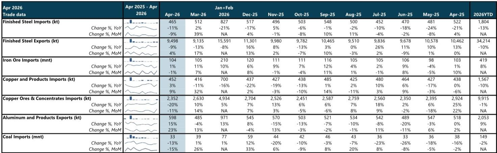
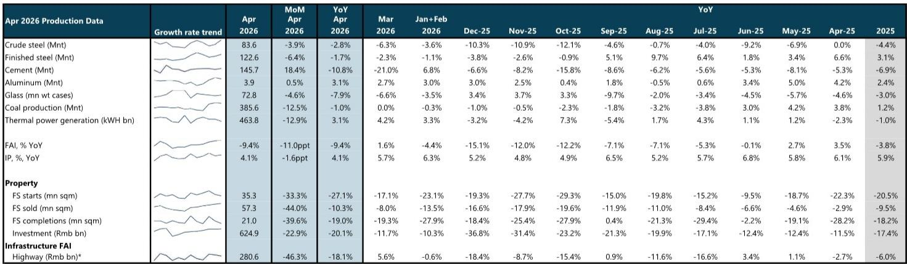
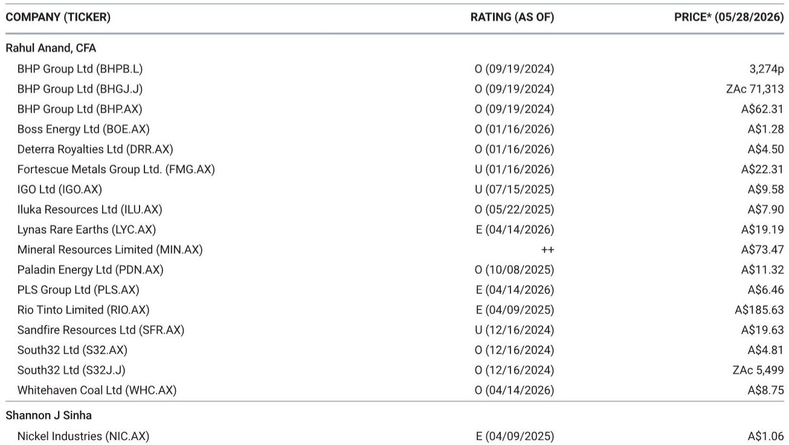

# 市场真正低估的不是需求，而是供给侧的再定价

四月中国宏观数据公布后，市场目光自然聚焦在需求端的疲弱：新开工面积同比下滑27.1%，零售消费创疫情以来新低，FAI转负至-9.4%。这些数字令人不安，但某外资投行最新发布的月度矿业报告揭示了一个更值得深思的结构性信号：真正需要被重新定价的，不是中国需求的短期波动，而是全球资源品供给侧的硬约束正在以比需求下滑更快的速度收紧。

这份覆盖钢铁、铝、铜、煤炭、铁矿石五大核心品种的报告，月复一月追踪中国工业生产的毛细血管。四月的数字表面上描绘了一幅需求放缓的图景，但当我们把生产数据、贸易流量和库存变化放在一起审视，一个与市场共识截然不同的叙事浮现出来：供给端的制约——政策天花板、事故引发的安全检查、产能自然衰减——正在成为比需求更关键的定价变量。这意味着，即便中国需求继续温和走弱，大宗商品的价格中枢也可能因供给弹性消失而保持高位。

这不是一个关于“抄底”的故事，而是一个关于“重新理解成本曲线和定价权”的框架。以下是我们从这份报告中提炼出的五个关键洞察。

## 1. 铝的供给天花板已从政策承诺变为物理现实，而市场仍在用旧框架定价

四月中国原铝产量达到390万吨，同比增长3.1%，环比微增0.5%。这个数字本身并不惊人，真正重要的是其背后的产能天花板：中国当前运行产能已达4530万吨，恰好触及政府设定的产能上限。报告明确指出，产能利用率已经没有上行空间。

这意味着什么？在过去的周期中，当需求回升时，中国铝冶炼厂可以通过重启闲置产能来快速响应，从而抑制价格涨幅。但这一次，供给侧的弹性已经消失。即便四月铝冶炼厂利润仍维持在每吨8600元人民币以上的高位，产能也无法进一步扩张。与此同时，铝材出口在四月环比增长23%、同比增长15%，达到2024年11月以来的最高水平，中东供应中断正在推动海外市场收紧。

供给刚性叠加出口通道打开，铝正在从“中国定价”转向“全球定价”。市场若仍用过去几年中国产能可以灵活调节的框架来给铝估值，可能低估了价格中枢上移的持续性。报告没有完全展开的一个问题是：当产能天花板成为硬约束，下游补库行为是否会从“按需采购”转变为“战略性囤货”？这将进一步放大价格弹性。

## 2. 钢铁的真实图景不是需求崩溃，而是出口通道收窄后的供需再平衡

粗钢产量同比下降2.8%，看起来是需求疲弱的直接反映。但拆解数据后发现，四月钢铁净出口同比下降9%，而国内表观消费仅下降3.1%。换言之，钢铁产量下降的幅度大于国内需求下降的幅度，出口的收缩才是产量调整的主要驱动力。

这引出一个关键判断：中国钢铁行业的调整，与其说是需求端的自由落体，不如说是出口通道阶段性收窄后的主动减产。四月钢材出口950万吨，环比仍有4%的增长，但同比回落。报告提到，钢坯出口可能在四月增长较快，这意味着出口结构正在从高附加值产品向初级产品转移——这通常是一个行业利润承压的信号。

铁矿石端，四月进口量1.04亿吨，同比微增1%，港口库存虽开始缓慢去化但仍处高位。一个值得关注的变量是：中国在四月解除了对BHP部分海运货物的采购禁令，这可能缓解短期供给紧张，但也意味着铁矿石市场的定价权博弈正在进入新阶段。报告没有完全解答的问题是：当中国钢厂主动减产、出口通道变窄，铁矿石的高库存能否持续？如果库存去化加速，市场对铁矿石的定价逻辑将从“供给过剩”切换为“成本支撑”。

## 3. 煤炭的季节性淡季掩盖了一个更重要的结构性变化：安全检查正在重塑供给曲线

四月煤炭产量3.86亿吨，同比下降1%，环比骤降12.5%。表面上看，环比大幅下降是冬季供暖季结束后的季节性回落，但同比转负意味着什么？报告提到，山西某大型煤矿事故后引发的安全检查正在对产量产生持续影响。

这并非短期扰动。安全检查往往伴随着停产整顿、产能核减和复产审批流程拉长，这些因素叠加在一起，会系统性地抬升边际生产成本。报告指出，四月煤炭进口同比下降13%，进口煤价格走高也是原因之一。这意味着国内供给受限的同时，海外补充也在减少。

对于动力煤而言，夏季用电高峰即将到来，电厂补库需求将支撑价格。但真正值得关注的是焦煤：安全检查对优质主焦煤的供给影响更为显著，而钢铁生产虽然短期承压，但一旦需求边际改善，焦煤的供给刚性将迅速转化为价格弹性。报告在煤炭板块的偏好排序中，将Whitehaven Coal列为最优先标的，核心逻辑正是“北亚气转煤需求”和“冶金煤供给紧张”——这一判断在四月数据中得到了初步验证，但安全检查的持续时间和影响范围，仍是需要持续跟踪的关键变量。

## 4. 铜的进口数据背后，隐藏着一个尚未被充分定价的“中国再库存”逻辑

四月铜及铜制品进口45.2万吨，环比增长9%，同比增长3%。报告指出，三月铜价回调短暂打开了进口套利窗口，中国买家重新入场。更值得注意的是，尽管进口量增加，国内库存却在当月显著去化——这暗示下游可能正在进行补库。

铜精矿进口则同比下降20%，加工费持续走低。冶炼厂的利润依赖硫酸价格上涨来弥补，但这本质上是一种“副产品补贴主产品”的脆弱平衡。如果硫酸价格回落，冶炼厂将面临减产压力，届时精炼铜的供给将进一步收紧。

这里有一个市场尚未充分讨论的推论：如果中国下游企业在铜价回调时开始战略性补库，而精矿端供给持续紧张，铜的库存周期可能从“去库”切换为“补库”，从而在需求没有大幅改善的情况下推升价格。报告对铜的偏好通过South32来表达，但这份报告并未详细展开铜的库存周期分析——这恰恰是读者可以深入探讨的方向。

## 5. 地产的“慢变量”正在成为大宗商品的“快变量”，但市场可能高估了其边际冲击

新房开工同比下降27.1%，销售面积下降10.3%，固定资产投资下降9.4%。这些数字令人沮丧，但报告中的一句话值得反复咀嚼：“虽然一线城市二手房成交在3-4月超预期，但5月动能已明显放缓，城市间分化加剧。”这意味着政策驱动的脉冲式复苏正在消退，而结构性下行趋势仍在延续。

然而，大宗商品定价的边际变化往往来自“预期差”而非“绝对值”。市场对地产的悲观预期已经相当充分，甚至可能过度外推。当新开工面积已经连续数月维持-20%至-30%的同比降幅时，进一步恶化的空间正在收窄。更重要的是，地产对大宗商品需求的拖累正在被其他领域对冲：出口相关的生产（电动车、机械、科技）在AI驱动的全球资本开支支撑下保持韧性，铝的出口增长就是一个例证。

报告的中国宏观团队将二季度GDP跟踪预测下调20个基点至4.5%，但预期下半年将回升至5%左右。如果这一判断成立，大宗商品需求的底部可能比市场想象的更近。关键在于：供给侧的调整速度是否快于需求的恢复速度？从铝的产能天花板和煤炭的安全检查来看，答案很可能是肯定的。

---

这份报告提供了丰富的月度数据，但它的真正价值不在于数字本身，而在于这些数字共同指向的一个判断：大宗商品的定价权正在从需求端向供给端转移。对于投资者而言，这意味着传统的“看中国需求做商品”的框架可能需要修正。铝的产能天花板、煤炭的安全检查、铜的精矿瓶颈——这些供给侧变量正在成为比需求更持久的定价因子。

但报告并未回答所有问题。铝的产能天花板能否被打破？安全检查对煤炭供给的影响会持续多久？铜的库存周期何时从去库转向补库？铁矿石的高库存能否在钢厂减产的背景下持续去化？这些未解之问，恰恰是深入理解大宗商品定价逻辑的关键。

欢迎来星球微信群里继续讨论。我们将基于这份报告的数据和框架，持续追踪每个品种的供需边际变化，并在关键转折点到来前与群内读者分享我们的判断。

Personal reading notes and learning share only. Not investment advice.

