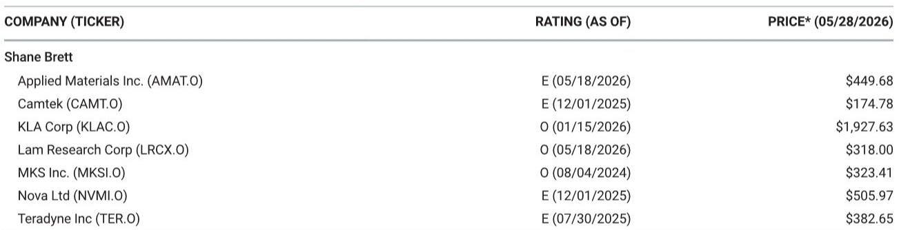

# 市场真正低估的不是需求，而是NAND和Intel的拐点何时到来

当所有人都看到了强劲的需求，市场的分歧就落在了那些“尚未被数据证实”的变量上。

某外资投行在本周发布的日本路演纪要进一步确认了2026年WFE（晶圆厂设备）市场的强劲——设备商和供应商反复提及来自DRAM客户“前所未有”的拉货请求和项目加速，先进逻辑的势头也在延续。供应链对2027年的增长展望依然谨慎，但每一家设备商都在为1800亿美元以上的WFE环境做准备，并且反复表态“不会让自己成为产能瓶颈”。

这些信号并不令人意外。真正值得关注的是报告中的三个分歧点：NAND设备支出的拐点何时到来、Intel资本开支何时启动、以及设备定价权是否真的在改善。报告对前两个变量给出了比市场更乐观的判断，但也坦承“早期证据尚未出现”。这种“逻辑上成立但时间上不确定”的状态，恰恰是当前半导体设备投资中最值得拆解的核心矛盾。

这份报告的价值不在于它确认了需求强劲——这一点市场已经定价——而在于它提供了一个框架，帮助读者区分哪些是已经兑现的利好，哪些是尚未被验证但可能带来超额收益的变量。

## 1. NAND的拐点正在萌芽，但市场需要耐心等待2027

报告对NAND WFE的判断是清晰的：2027年将出现加速，但短期内的证据仍然有限。

Kioxia给出了FY3/27的资本开支指引为4500亿日元，其中大部分将用于设备采购。这个数字虽然看起来不小，但依然低于2018年和2022年的水平。报告认为，洁净室可用性、盈利能力和位需求这三个条件将共同推动NAND WFE在2027年加速——Kioxia拥有洁净室空间，且其2026年6月季度的营业利润率已达74%，盈利能力完全具备。问题在于，制造商目前仍然保持资本纪律，短期内不太可能出现大幅度的支出增长。

这里有一个关键的观察框架：NAND市场的资本开支周期与DRAM不同。DRAM的支出更多由技术节点转换驱动，而NAND的支出则高度依赖市场供需平衡和厂商的盈利状况。当Kioxia的盈利能力已经恢复到历史高位时，资本开支的释放只是时间问题，但时间点的不确定性意味着，押注NAND拐点需要承受一段“数据真空期”。

报告特别指出，东京电子已经开始看到除中国以外的NAND绿地项目活动。这是一个积极的早期信号，但兴奋程度远不如DRAM——后者正在经历前所未有的订单加速。这种温差本身就是重要的市场信号：DRAM的支出已经进入加速期，而NAND仍处于“准备加速”的阶段。

对于投资者而言，这意味着NAND相关的设备股（如LAM Research、MKS Instruments）可能需要等到2027年才会迎来真正的业绩催化。当前的时间窗口更适合观察而非重仓。

## 2. Intel的资本开支拐点尚未出现，但“不可避免”的判断值得留意

报告对Intel的判断比市场预期的更为谨慎，但核心结论却更有张力。

报告明确指出，除了工艺控制设备之外，Intel尚未给设备商带来订单增长。Intel已经明确表示，其代工业务的支出将跟随客户获取的节奏，因此报告原本就不期待代工业务会带来订单增长。但令人意外的是，连IDM（整合器件制造）一侧也没有出现增长迹象。

然而，报告仍然维持“更高资本开支不可避免”的判断。这个看似矛盾的结论背后，隐藏着一个重要的逻辑：Intel的资本开支拐点不是由“是否增加支出”决定的，而是由“何时增加支出”决定的。当前Intel持有大量过去过度采购时积压的库存设备，这是订单尚未恢复的直接原因。但这些库存终将消耗完毕，而Intel在先进制程上的竞争压力不会消失。

东京电子的反馈进一步印证了这一点：Intel目前对其销售占比仅为低个位数，且尚未看到订单回升。报告认为，这很可能是因为Intel仍在消化库存。一旦库存消化完成，订单的恢复将是必然的，只是时间问题。

这里有一个值得深思的推论：如果Intel的资本开支拐点确实“不可避免”，那么当前市场对Intel设备供应链的定价可能低估了这种恢复的确定性。但问题在于，报告的判断基于逻辑推演而非实际订单数据，这意味着押注Intel拐点的投资者需要承担“等待时间可能比预期更长”的风险。

## 3. 设备定价权的分化：东京电子的乐观有其特殊性

定价能力是这份报告中最具分歧的话题之一。

美国设备公司的财报并未增强市场对设备涨价的信心，而日本路演的反馈也同样分化。东京电子对涨价表达了乐观态度，但报告认为这种乐观具有一定的特殊性——主要得益于日元贬值和东京电子自身的毛利率结构。

具体来看，东京电子的毛利率目前处于45%左右的中段水平，远低于应用材料和LAM Research的约50%。东京电子计划在FY3/28将毛利率提升至50%，并从FY3/27下半年开始逐步改善。这种提升空间是存在的，但报告认为，设备公司的定价能力更多来自“价值创造”而非“工具稀缺性”。成本转嫁通常是涨价的极限，真正的定价权提升需要设备商证明其产品能为客户带来独特的价值增量。

这意味着，设备定价权的改善将是一个分化而非普涨的过程。东京电子的涨价逻辑有其自身的合理性——它正在满足客户的加急需求并积极扩大供应链能力——但这不能简单外推到整个设备行业。对于应用材料和LAM Research而言，由于毛利率已经处于较高水平，进一步涨价的难度更大，市场对其定价能力的期待需要更加克制。

## 4. 成熟制程的紧张正在形成，但IDM的资本开支犹豫不决

报告中最容易被忽视但极具价值的一个洞察，来自瑞萨电子的反馈。

瑞萨电子正在看到显著的AI需求尾流：用于CPU的内存接口产品需求强劲，GPU和ASIC客户的电源产品需求同样旺盛。公司表示，数据中心收入预计今年将翻倍，但如果代工产能充足，增长幅度本可以达到3到4倍。这是一个重要的信号——AI需求对半导体的拉动正在从先进制程向成熟制程扩散。

瑞萨电子的内部产能约为210万片/月（以12英寸等效计算），利用率仅为55%。但问题在于，这些产能集中在成熟节点，而需求最旺盛的40nm/28nm节点需要依赖代工厂。公司正在与客户谈判涨价，且谈判已进入最后阶段。

报告认为，28nm/40nm等成熟节点的紧张是真实存在的，但IDM对立即增加资本开支仍持犹豫态度，因为整体利用率仍然偏低。这意味着，成熟逻辑的WFE修正风险偏向于上行，但近期的修正幅度更可能是边际性的而非实质性的。

对于设备投资者而言，这个观察意味着成熟制程的设备需求改善将是渐进的，而非突然爆发。那些在成熟制程有敞口的设备公司（如东京电子、应用材料）可能会受益，但时间节奏需要更加耐心。

## 5. 报告尚未完全回答的关键问题：定价权改善的可持续性

这份报告最有价值的部分，不是它确认了需求强劲，而是它揭示了市场尚未完全定价的几个关键变量。其中最大的一个未解问题，就是设备定价权改善的可持续性。

报告对东京电子的定价乐观给出了合理的解释，但并未深入探讨这种定价权改善是否具有行业普遍性。如果东京电子的涨价主要得益于日元贬值和毛利率追赶，那么当这些因素消退后，定价权是否还能维持？更重要的是，设备客户（尤其是DRAM和逻辑厂商）对涨价的接受度到底有多高？在需求强劲的背景下，客户可能愿意接受一定程度的涨价，但如果涨价幅度超出成本转嫁的范畴，客户是否会转向替代供应商或推迟采购？

另一个未完全回答的问题是：NAND和Intel的资本开支拐点是否真的会在2027年到来，还是会因为宏观环境变化或技术路线调整而进一步推迟？报告的逻辑推演是合理的，但缺乏足够的数据支撑。这些问题的答案，可能需要等到下一季度的财报季或更长时间的行业数据积累才能逐渐明朗。

---

对于认真跟踪半导体设备行业的读者来说，这份报告的真正价值不在于它给出了确定的答案，而在于它提供了一个清晰的框架，帮助区分哪些是已经被市场定价的共识，哪些是尚未被验证但可能带来超额收益的分歧点。

NAND的拐点、Intel的资本开支恢复、设备定价权的分化、成熟制程的紧张——这四个变量中，每一个都蕴含着机会，但也伴随着不确定性。而正是这些不确定性，构成了深度研究和持续跟踪的价值所在。

如果您希望进一步讨论这些未解问题，欢迎来星球微信群里继续交流。我们会在群内分享更多原始数据、图表拆解，以及对这些关键变量的持续跟踪。

Personal reading notes and learning share only. Not investment advice.

