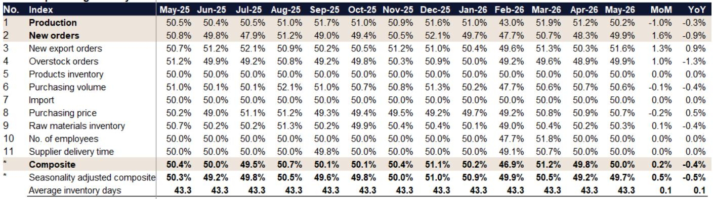
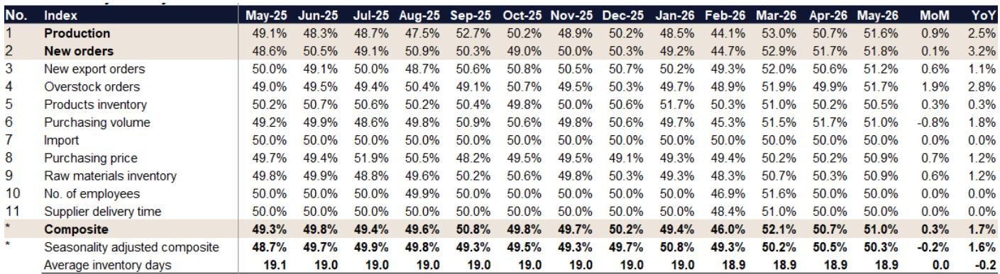
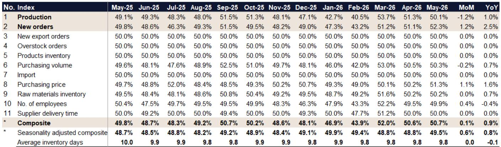

# China's Steel Demand Is Recovering, But the Recovery Is Far From Uniform

The headline number looks encouraging. China's steel downstream PMI for May 2026 came in at 50.66%, marking a modest improvement of 0.22 percentage points month-over-month and a more substantial 0.85 percentage points year-over-year. For the first time in months, every major downstream sector except infrastructure posted readings above the 50-point expansion threshold. This is the kind of data that prompts cautious optimism among steel investors who have spent the better part of two years watching demand signals flicker between contraction and tepid expansion.

But a single composite number obscures more than it reveals. Beneath the surface of this aggregate improvement lies a far more complex picture—one of diverging momentum, shifting procurement behavior, and structural realignment that will determine which steel producers and which end-markets benefit most in the coming quarters. The recovery is real, but it is also uneven, selective, and in some cases fragile.

What matters most for strategic decision-making is not whether the PMI crossed 50, but why it did so, which sectors drove the improvement, and whether the pattern is sustainable. The May data from a leading investment bank's research report offers a granular view of these dynamics across six key downstream industries: construction, machinery, automotive, shipbuilding, home appliances, and infrastructure. When read together, these sub-indices tell a story of a steel market that is healing in some areas while remaining structurally constrained in others.

The critical insight for investors is this: the recovery is being led by short-cycle, quick-payback projects rather than large-scale, long-duration infrastructure. This has immediate implications for steel product mix, pricing power, and inventory strategy. It also raises a fundamental question about the durability of demand once these short-cycle projects are exhausted.

## Machinery and Automotive Are Leading the Recovery, But for Different Reasons

The strongest performer in May was the machinery sector, with a PMI of 51.01%, up 0.31 percentage points month-over-month and 1.67 percentage points year-over-year. This marks a continuation of the momentum that has been building since the post-Lunar New Year ramp-up in March. Within machinery, the report highlights that machine tools and transformers are experiencing particularly robust new orders, while engineering and heavy machinery remain steady. Agricultural machinery, however, is trending weaker following the conclusion of spring plowing.

This divergence within machinery matters because it signals that the recovery is not broad-based even within a single strong sector. The strength in machine tools and transformers reflects capital expenditure cycles in manufacturing and power infrastructure—areas where businesses are investing in capacity and grid modernization. Agricultural machinery weakness, by contrast, is seasonal but also suggests that rural demand may not be providing the uplift that some had anticipated.

The automotive sector posted a PMI of 50.84%, up a notable 1.6 percentage points month-over-month. The report attributes this to the Labor Holiday effect, auto exhibitions, and increasing OEM discounts. Critically, new energy vehicles continue to outperform internal combustion engine vehicles, and exports remain a key catalyst. This export dynamic is worth watching closely: if overseas demand for Chinese NEVs remains strong, it could provide a sustained tailwind for steel demand in the automotive supply chain, particularly for advanced high-strength steels used in lightweighting.

The auto sector's raw material procurement remains "buying-as-needed," which suggests that OEMs and suppliers are not building inventory in anticipation of stronger demand. This is a cautious posture that limits the upside for steel volumes even as production increases.

## Construction Is Stabilizing, But the Mix Is Shifting Toward Short-Cycle Projects

Construction PMI came in at 50.71%, up 0.15 percentage points month-over-month and 0.94 percentage points year-over-year. On a seasonally adjusted basis, the reading was 49.5%, indicating that the underlying trend is still slightly below the expansion threshold. The report describes May as a "mixed bag" for construction: positive factors include the traditional peak season and expedited project progress, while negative factors include rainy weather in some regions that delayed activity.

The most revealing data point in the construction sub-index is the new orders reading of 52.3%, up 1.2 percentage points month-over-month and 2.5 percentage points year-over-year. This is the highest new orders reading in the construction sector in recent months. But the report adds a critical qualifier: the improvement is coming primarily from "projects with short cycles and quick payback periods (i.e., factories and warehouses)." This is not the large-scale infrastructure or residential real estate that typically drives sustained steel demand.

This shift has significant implications. Short-cycle projects generate steel demand that is concentrated in time and limited in duration. They are also more sensitive to financing conditions and investor sentiment. If the improvement in construction new orders is driven by a pipeline of factories and warehouses rather than roads, bridges, and residential towers, the steel demand boost may be shallower and shorter-lived than a traditional construction cycle.

Raw material prices in construction were slightly up month-over-month, and downstream buyers are purchasing "as-needed." This mirrors the behavior seen in automotive and suggests that end-users across multiple sectors are reluctant to carry inventory. This is a rational response to uncertain demand visibility, but it also means that any acceleration in end-demand will quickly translate into higher steel orders as buyers scramble to replenish.

## Infrastructure and Shipbuilding Show the Limits of the Recovery

Not all sectors are participating in the recovery. Infrastructure PMI slipped to 50.04%, down 0.36 percentage points month-over-month and 0.28 percentage points year-over-year. This is barely above the expansion threshold and represents the weakest performance among the six sectors tracked. The report attributes the decline in new orders to "concern of fund availability." New projects continue to focus on traditional infrastructure such as roads and railways, but funding constraints are clearly limiting the pace of execution.

This is a critical point for the broader steel demand outlook. Infrastructure has been a key pillar of China's economic stimulus efforts, and steel-intensive infrastructure projects have historically provided a reliable floor under demand. If local government financing constraints are tightening despite central government support, the infrastructure-driven steel demand that many have been counting on may not materialize at the expected scale.

Shipbuilding PMI was 50.03%, up 0.23 percentage points month-over-month but down 0.38 percentage points year-over-year. Utilization rates remain high and capacity is still tight, but new orders were stable rather than growing. The report notes a potential positive catalyst from the suspension of the Section 301 investigation, which could stimulate demand from overseas shipbuilding. However, this is a forward-looking possibility rather than a current driver.

Home appliances PMI was 50.74%, up a strong 1.71 percentage points month-over-month. This improvement is attributed to the 6.18 shopping festival and high temperatures ahead of summer. However, the report adds a cautionary note: some home appliance makers are concerned about overseas order books ahead, as recent raw material cost inflation may put downward pressure on overseas demand. This is a reminder that even when domestic demand improves, export-facing sectors face headwinds from cost pass-through challenges.

## What the Report Does Not Fully Explain: The Inventory Paradox and the Sustainability Question

The report provides excellent granularity on current conditions, but it leaves several important analytical questions unanswered. The most significant of these is the inventory paradox. Across multiple sectors, procurement is described as "buying-as-needed," and raw materials inventory readings are hovering near the 50-point neutral line. This suggests that downstream users are not building inventory in anticipation of stronger demand, even as production and new orders improve.

This behavior is rational in an environment of uncertain demand visibility and rising raw material costs. But it creates a structural dynamic where any acceleration in end-demand will trigger a sharp but potentially short-lived restocking cycle, while any deceleration will lead to rapid destocking. The report does not model what this means for steel pricing or producer margins in the second half of 2026.

A second open question concerns the funding constraints in infrastructure. The report mentions "concern of fund availability" as a reason for weaker infrastructure new orders, but it does not provide detail on whether this is a local government financing issue, a central budget allocation issue, or a broader credit tightening. The answer matters enormously for the steel demand trajectory. If funding constraints are temporary and policy-driven, they could be reversed. If they reflect structural fiscal pressures, the infrastructure-driven steel demand recovery may be permanently smaller than historical patterns would suggest.

Third, the report does not fully explore the implications of the shift toward short-cycle construction projects. If the construction recovery is being driven by factories and warehouses rather than residential or infrastructure projects, what does this mean for steel product mix? Short-cycle projects tend to favor certain steel products over others, and producers who are positioned to supply those products may benefit disproportionately.

## A Decision Framework for Steel Investors

For investors trying to navigate this uneven recovery, the May PMI data points toward a framework organized around three dimensions: sector exposure, product mix, and inventory positioning.

First, sector exposure matters more than ever. Machinery and automotive are the clear leaders, and within machinery, the strength is concentrated in machine tools and transformers. Investors with exposure to steel supply chains serving these sub-sectors are likely to see better volume and pricing dynamics than those tied to infrastructure or residential construction. The divergence between machinery and infrastructure is not a temporary anomaly; it reflects a structural shift in where demand is coming from.

Second, product mix is a critical differentiator. The shift toward short-cycle construction projects and the continued strength in NEV production favor higher-value steel products. Advanced high-strength steels for automotive lightweighting, electrical steels for transformers, and specialized grades for machine tools are likely to outperform commodity-grade rebar and hot-rolled coil. Steel producers with a diversified product portfolio that includes these higher-margin grades will be better positioned than those reliant on construction-grade products.

Third, inventory strategy is becoming a competitive variable. With downstream buyers maintaining a "buying-as-needed" posture, steel producers who can offer reliable supply with shorter lead times may capture market share. However, this also means that producers who build inventory in anticipation of stronger demand risk being caught with excess stock if the recovery falters. The optimal strategy is likely to be one of flexibility: maintaining the ability to ramp up production quickly while avoiding large speculative inventory positions.

The most important question for the second half of 2026 is whether the short-cycle demand drivers in construction and machinery can sustain momentum, or whether the recovery will require a reacceleration in infrastructure investment. The May data suggests that the former is working but the latter is not yet materializing. Investors should watch infrastructure funding announcements closely as a leading indicator for the broader steel demand trajectory.

## What the Full Report Reveals

The analysis above is based on the summary data and sector breakdowns available in the report. But the full report contains additional detail that could sharpen investment decisions: the complete time series data for each sub-index, the seasonally adjusted readings that strip out calendar effects, and the historical comparisons that show how current readings compare to prior cycles.

For example, the report includes seasonally adjusted composite PMIs for each sector. The construction seasonally adjusted composite was 49.5% in May, up from 48.8% in April but still below 50. This tells a different story than the headline 50.7% reading. Similarly, the machinery seasonally adjusted composite was 50.3%, actually down 0.2 percentage points from April. These adjustments matter because they reveal whether the improvement is real or just a reflection of normal seasonal patterns.

The report also includes detailed breakdowns of sub-indices such as new export orders, overstock orders, and supplier delivery times. These can provide early warning signals of shifts in trade flows, inventory imbalances, or supply chain constraints. The new export orders data for machinery, for instance, shows a reading of 51.2% in May, up 0.6 percentage points month-over-month. This suggests that export demand for Chinese machinery remains healthy, which is a positive signal for the broader industrial economy.

For investors who want to move beyond the headlines and make informed decisions based on the full granularity of the data, the complete report with its charts and time series is essential reading. The patterns that emerge from the detailed sub-indices and seasonally adjusted readings provide a much richer picture than the composite PMI alone.

Join the community to read the full report and review the original charts.

*This article is for learning and discussion only and does not constitute investment advice.*

Personal reading notes and learning share only. Not investment advice.

