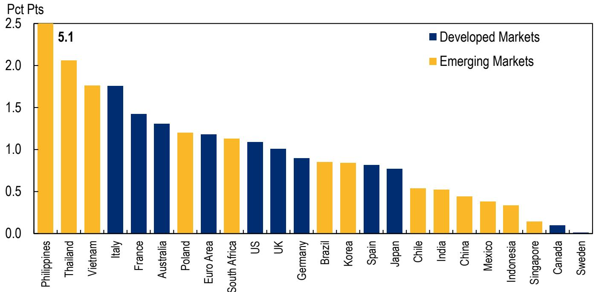
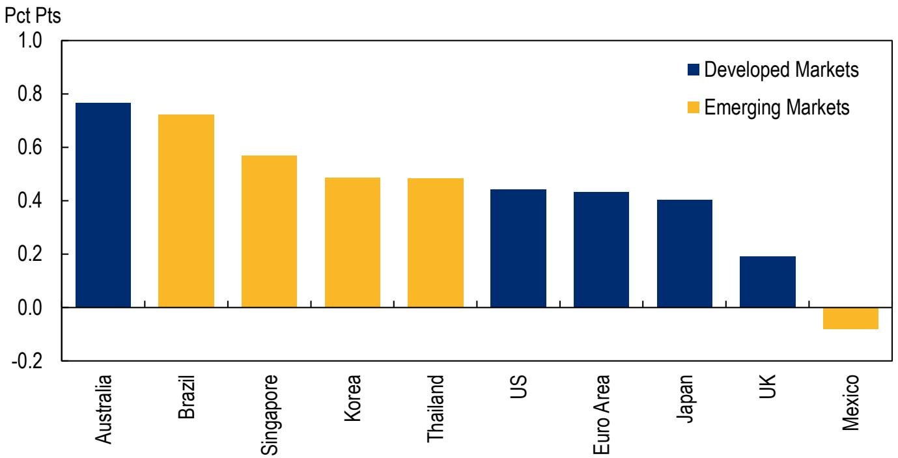
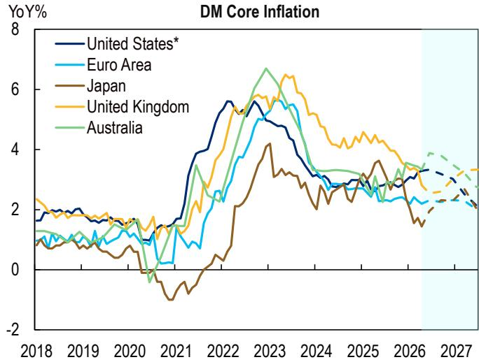

# The Global Inflation Story Has Split in Two: Energy Is the Immediate Risk, but Sticky Core Services Are the Real Strategic Test

Global headline inflation has surged to nearly 3% as of April, a full percentage point higher than before the recent conflict escalation began. The immediate culprit is unambiguous: soaring energy prices are driving the headline number, with oil pass-through effects now visible across developed and emerging economies alike. Yet beneath this surface-level shock lies a more complex and strategically important divergence. Core inflation globally remains flat at 2.3%, but projections for the second half of the year have been revised upward by roughly half a percentage point across most forecasted economies, with the United States and the euro area each seeing upward adjustments of about four-tenths. This is not a uniform inflation story. It is a two-track narrative where the energy-driven spike creates immediate policy noise, while the slow, persistent creep in core services inflation poses the deeper challenge for central banks and investors. The question is not whether inflation will moderate, but which components will prove transitory and which are becoming embedded in the economy's structure.

For business leaders and portfolio strategists, the critical insight is that the inflation landscape is fragmenting along sectoral and regional lines. Energy inflation is a global shock, but its transmission into core inflation depends on local labor markets, service sector pricing power, and monetary policy credibility. The countries that will navigate this period most effectively are those where core inflation remains anchored, not those where headline numbers look best on paper. This report parses the data to separate the cyclical from the structural, identifying where the real risks lie and what decision-makers should watch in the months ahead.

## The Energy Shock Is Real but Not Yet Contagious: Core Inflation Has Not Followed Headline Higher

The most striking feature of the April data is the decoupling between headline and core inflation at the global level. Headline inflation rose sharply to nearly 3%, driven almost entirely by energy inflation that has surged into double-digit territory. Yet global core inflation held steady at 2.3%, unchanged from the prior month. This is not a contradiction; it is a sign that the pass-through from energy costs to core prices remains incomplete, at least for now. The data show that energy inflation is running at roughly 9.4% year-on-year, while food inflation remains moderate at around 2.1%. The headline spike is a mechanical result of energy weighting, not a broad-based acceleration in demand-driven price pressures.

What makes this moment strategically important is that the flat core number masks significant upward revisions in forward projections. The median upward revision across forecasted countries is about half a percentage point for core inflation this year. The US and euro area each saw their core projections raised by roughly four-tenths. This suggests that analysts expect the energy shock to gradually feed into core prices through higher production costs, transportation expenses, and eventual pass-through to consumer goods and services. The question is how long that transmission takes and whether it becomes self-reinforcing through wage demands.

The risk is that the flat core inflation number creates a false sense of security. Central banks looking at the April print may conclude that monetary policy is on the right track and that the energy shock is a temporary supply-side disturbance. But the upward revisions to core projections tell a different story: the energy shock is expected to become a core inflation problem over the coming quarters. For investors, this means that the window for rate cuts is narrowing, and the risk of a second wave of tightening is higher than the current data suggest.

## Asia Bears the Brunt of the Upward Revision: The Pass-Through Mechanism Is Stronger in Emerging Markets

The regional dispersion of inflation revisions reveals a clear pattern: the largest upward adjustments are concentrated in several Asian economies, including the Philippines, Thailand, and Vietnam. This is not accidental. These economies are more exposed to energy imports, have less developed hedging mechanisms, and often have more rigid pricing structures that pass cost increases through to consumers more quickly. The data show that emerging markets ex-China are running headline inflation at about 3.5%, compared to 3.3% in developed markets and just 1.2% in China.

China remains the outlier, with both headline and core inflation well below global averages. This is partly a function of its industrial structure, where overcapacity in manufacturing suppresses goods prices, and partly a result of subdued domestic demand. For global investors, China's low inflation is a double-edged sword. It provides a buffer for global supply chains and keeps import prices down for the rest of the world, but it also signals weak internal consumption that could drag on global growth.

The strategic implication for businesses operating in Asia is clear: the cost environment is deteriorating faster than in other regions, and pricing power will be tested. Companies that can pass through cost increases without losing market share will outperform, while those with thin margins or strong competition will face margin compression. The divergent inflation paths within Asia itself, with China on one side and much of the rest of the region on the other, creates a complex operating environment where country-level strategy matters more than regional aggregation.

## Services Inflation Is the Silent Accumulator: Why the Core Projections Are Rising Even as Headline Energy Peaks

The most strategically important data point in this report is not the headline surge but the behavior of services inflation. The longer-term view shows global services inflation at 2.6%, with developed markets at 3.0% and emerging markets ex-China at 4.5%. These numbers are not alarming in isolation, but they are persistent and show no sign of rapid deceleration. Unlike goods inflation, which can fall quickly as supply chains adjust, services inflation is driven by labor costs, rents, and other sticky components that respond slowly to monetary policy.

The upward revisions to core projections reflect an expectation that services inflation will remain elevated even as energy prices stabilize. This is the classic second-round effect that central banks fear most. If workers demand higher wages to compensate for higher energy costs, and if businesses pass those wage increases through to prices, the inflation dynamic becomes self-sustaining. The data suggest this process is already underway in several economies, particularly in the US and euro area, where core projections were raised by four-tenths.

For central banks, the implication is that they cannot afford to declare victory on inflation based on headline numbers alone. The energy spike may fade, but if services inflation remains sticky at current levels or edges higher, the final leg of the disinflation process will be the hardest. This argues for a cautious approach to rate cuts, with central banks likely to hold rates higher for longer than markets currently price in. For fixed-income investors, this means the risk of a hawkish surprise is elevated, and duration exposure should be managed carefully.

## What the Report Does Not Fully Answer: The Transmission Mechanism from PPI to CPI Remains an Open Question

The report provides extensive data on producer price inflation (PPI), which has diverged significantly from consumer price inflation in recent months. Global PPI rose to 2.8% in the latest reading, up from 1.4% in the longer-term view, with developed markets seeing PPI at 3.6% and emerging markets at a similar level. Yet the pass-through from producer prices to consumer prices is neither automatic nor uniform. The report does not fully answer how much of this PPI increase will ultimately reach consumers, nor how quickly.

Several factors complicate the transmission. First, corporate margins can absorb some of the cost increases, particularly in sectors with strong pricing power or efficient operations. Second, the composition of PPI matters: if the increase is concentrated in energy and raw materials, the pass-through is faster than if it is in capital goods or intermediate inputs. Third, the competitive landscape varies by country and sector, with some markets able to pass through costs and others forced to absorb them.

This uncertainty creates a meaningful analytical gap. Investors need to understand not just where PPI is heading, but which sectors and regions will bear the cost burden. The report's data on US import prices provides some clues, showing that import prices from Mexico and the European Union have risen more sharply than those from China and Japan, suggesting that supply chain diversification is creating new inflation pressures in some corridors. But the broader question of how much PPI feeds into CPI over the next 6-12 months remains unanswered, and this is the critical variable for both monetary policy and corporate profitability.

## A Decision Framework for Navigating the Two-Track Inflation Environment

For readers who need to translate this analysis into actionable decisions, the following framework organizes the key variables into a structured approach.

First, distinguish between energy-driven headline volatility and core inflation trends. Headline numbers will fluctuate with oil prices and are not reliable signals for structural policy direction. Instead, focus on core inflation, particularly services inflation, as the true measure of underlying price pressures. A central bank that reacts to headline spikes with aggressive tightening risks overtightening, while one that ignores core stickiness risks allowing inflation to become entrenched.

Second, assess your exposure by region and sector. If your business or portfolio is concentrated in Asian emerging markets ex-China, the inflation risk is higher and the pass-through from energy to core prices is faster. If you are exposed to China, the risk is lower but the demand environment is weaker. In developed markets, the US and euro area are seeing similar core revision magnitudes, but the underlying drivers differ: US services inflation is more wage-driven, while euro area inflation is more energy-exposed.

Third, monitor the PPI-to-CPI transmission in your specific supply chain. If your input costs are rising but your output prices are constrained by competition or regulation, margins will compress. If you have pricing power, you can pass through costs but risk volume loss. The key is to identify which of these regimes applies to your specific situation and adjust pricing strategy, inventory management, and hedging accordingly.

Fourth, prepare for a longer period of elevated rates than markets currently price. The combination of sticky services inflation and upward core revisions suggests that central banks will err on the side of caution. Rate cuts are likely to be delayed and gradual, not aggressive and immediate. This has implications for borrowing costs, discount rates, and asset valuations across the board.

## The Full Picture Requires Granular Data: Join the Community to Read the Full Report and Review the Original Charts

The analysis above captures the strategic direction of the global inflation landscape, but the full picture requires the granular detail that only the complete report and its accompanying charts can provide. The country-level breakdowns reveal significant variation within regions, with some economies already seeing core inflation accelerate while others remain stable. The PPI data across sectors and the import price indexes offer a forward-looking view of where cost pressures are building. The longer-term historical context shows how current inflation compares to previous cycles and whether the current trajectory is unusual or within normal bounds.

For serious investors, business leaders, and policy analysts, these details are not optional. They are the raw material for sound decision-making in an environment where aggregate numbers can be misleading. The report from which this analysis is drawn contains the charts, country-level scatter plots, and historical comparisons that allow readers to test the conclusions presented here against the underlying data.

Join the community to read the full report and review the original charts. The data will allow you to form your own view on which inflation risks are most relevant to your specific circumstances and to challenge or confirm the strategic framework outlined above.

*This article is for learning and discussion only and does not constitute investment advice.*

Personal reading notes and learning share only. Not investment advice.

