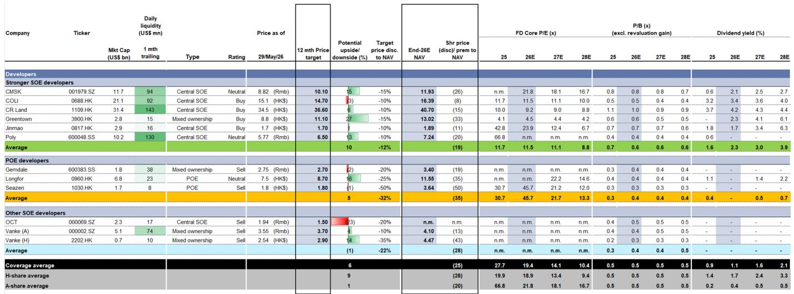
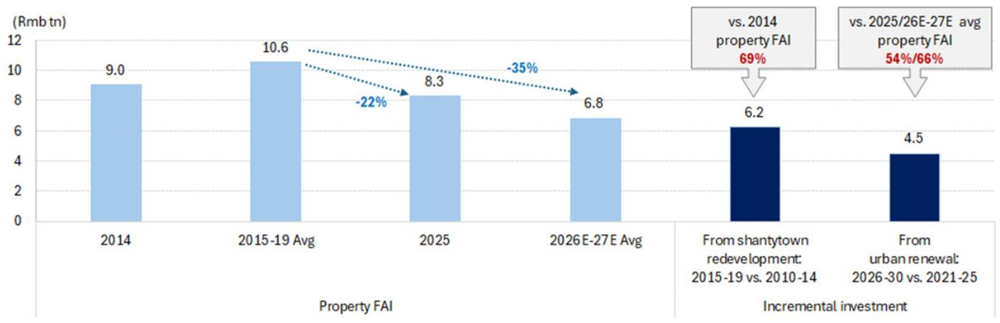
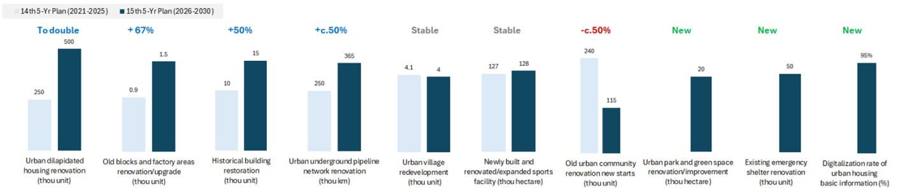

# China’s Urban Renewal 15th Five-Year Plan Is Not a Stimulus—It Is a Structural Pivot That Could Reanchor the Property Market

The most consequential policy document for China’s property sector in 2026 is not a demand-side rescue package or a new round of home purchase subsidies. It is the State Council’s Urban Renewal 15th Five-Year Plan, a comprehensive blueprint that formally shifts the axis of urban construction from greenfield expansion to the systematic upgrading of existing stock. This plan represents a strategic recalibration of how the Chinese government intends to manage the post-boom urban landscape, and for investors, it demands a corresponding shift in analytical focus away from new home sales volumes and toward the economics of asset renovation, land revitalization, and infrastructure modernization.

The controlling idea is this: the plan targets an estimated RMB 4-5 trillion in incremental investment relative to the 14th Five-Year Plan, a scale that is not merely large but structurally significant. To put this in perspective, this incremental spending would represent approximately 66% of the average projected property fixed asset investment for 2026-2027. That ratio is strikingly similar to the 69% benchmark set during the shantytown redevelopment boom of 2015-2019, a period that fundamentally reshaped the housing market and the fortunes of developers. The implication is clear: urban renewal, not new construction, is being positioned as the primary engine of activity and capital deployment in the property sector for the next half-decade.

Why now matters. The Chinese property market is caught in a low-level equilibrium trap. Homebuyer confidence remains fragile, inventory overhangs persist in lower-tier cities, and the traditional model of selling pre-sold units from a construction site has lost its velocity. The Urban Renewal Plan does not directly solve the demand problem, but it creates a new vector for capital to enter the system—through government-led renovation, infrastructure upgrades, and repurposing of idle assets. This is not a stimulus that tries to reflate the bubble; it is a structural pivot that seeks to build a floor under activity by changing what gets built, where money flows, and who benefits.

The plan is also a test of execution. It outlines ambitious numerical targets: renovating 500,000 dilapidated residential units (double the 14th FYP), upgrading 1,500 old blocks and factory areas, restoring 15,000 historical buildings, and renovating 365,000 kilometers of underground pipelines. These are not abstract goals. They are project-level commitments that will require coordination across local governments, state-owned enterprises, private capital, and financial markets. The question is not whether the ambition is real—it is—but whether the machinery of implementation can generate the positive feedback loop that the housing market desperately needs.

## The Incremental Investment Scale Is Comparable to the Shantytown Redevelopment Era, but the Economic Logic Is Fundamentally Different

The headline figure of RMB 4-5 trillion in incremental investment invites an obvious comparison: the shantytown redevelopment period of 2015-2019, which saw total investment of approximately RMB 7.5 trillion and an incremental spend of over RMB 6 trillion relative to the preceding five years. That earlier wave was a powerful catalyst for housing demand, as demolition and relocation created forced buyers, and compensation payments injected liquidity into the market. Developers benefited directly, and home prices in many cities saw sustained upward pressure.

The current urban renewal plan operates on a different logic. It is not primarily about demolition and replacement. The plan emphasizes renovation, functional upgrading, and preservation. The target for old urban community renovation new starts is actually halved from 240,000 units in the 14th FYP to 115,000 in the 15th FYP. The emphasis is on quality improvement, safety enhancement, and operational efficiency. This means the demand creation mechanism is more diffuse and longer-dated. Instead of a concentrated wave of new housing demand from displaced residents, the plan aims to improve the livability and utility of existing stock, which could support property values and rental yields over time, but does not generate the same immediate sales pipeline for developers.

The strategic significance, however, lies in the stability of the investment profile. The shantytown redevelopment was a concentrated burst that peaked and then faded, contributing to the subsequent oversupply. The urban renewal plan is designed as a more sustainable, multi-year program that targets the existing urban fabric. It is less likely to create a boom-bust cycle and more likely to provide a steady floor under construction activity. For investors, the implication is that property-related fixed asset investment may not collapse as sharply as some fear, but the composition of that investment will shift dramatically away from new housing starts and toward renovation, infrastructure, and asset management.

## Funding and Execution Are the Binding Constraints, and the Plan’s Architecture Reveals a Deliberate Strategy to Diversify Risk

The plan identifies four primary funding channels: local fiscal and credit support through local government special bonds, capital markets tools such as infrastructure REITs and ABS, private sector participation via standardized PPP models, and land revitalization investments enabled by relaxed land-use conversion rules. This is not a single-source funding model. It is a deliberate attempt to spread risk across different balance sheets and investor bases.

The most immediate source of capital is the local government special bond quota, which the report estimates at RMB 4.4 trillion for 2026. These bonds are now approved as project capital for eligible urban renewal projects, which represents a significant operational change. Previously, such bonds were often used for broader infrastructure spending. By explicitly linking them to urban renewal, the government is creating a dedicated funding stream that can be deployed quickly. The report notes that the quota is on track year-to-date, suggesting that the fiscal pipeline is already primed.

The introduction of capital markets tools is equally important. Infrastructure REITs and ABS provide a mechanism for private capital to participate in urban renewal without taking direct construction risk. This could unlock a new asset class for institutional investors, particularly pension funds and insurance companies seeking long-duration, income-generating assets. The plan also encourages corporate bonds and medium-term notes from eligible entities, which could allow stronger state-owned developers and local investment platforms to raise funds directly for renovation projects.

The private sector participation angle is the most uncertain. The plan emphasizes standardizing PPP models and advancing public utility price reforms. The latter is critical: without the ability to generate predictable revenue streams from renovated assets—such as upgraded pipelines, smart city infrastructure, or commercialized historical districts—private capital will remain hesitant. The plan signals intent, but the actual reform trajectory on utility pricing will determine whether private money flows in or stays on the sidelines.

The land revitalization component adds another layer. By relaxing rules on land-use conversion and functional building upgrades, the plan enables multi-entity cooperative renovations and reduces the tax burden on land consolidation. This is a direct incentive for developers and landowners to repurpose idle assets rather than hold them as non-performing stock. It could accelerate the cleanup of stalled projects and underused industrial land, which has been a drag on the balance sheets of many developers.

## The Plan Creates a Positive Feedback Loop Only If It Connects to Broader Job Market and Income Recovery

The report’s authors are explicit about the prerequisite for success: the urban renewal plan is an important step, but it cannot operate in isolation. A broader job market recovery is necessary to stimulate housing demand in the mass market. This is a sobering caveat that investors should not ignore.

The logic is straightforward. Urban renovation projects create construction jobs and support local economic activity, but the housing demand they generate is indirect. Renovating a dilapidated residential unit does not create a new homebuyer. It improves the living conditions of an existing resident. The demand multiplier comes from improved urban environments attracting new residents, supporting commercial activity, and lifting property values. But for that multiplier to materialize, the broader economy must be generating income growth and employment opportunities.

This is why the plan’s focus on industrial and consumption facilities upgrades is strategically important. The plan specifically targets the restructuring of old commercial districts, residential areas, and idle factory zones to build innovation hubs. It also aims to upgrade consumption infrastructure to foster growth in the silver economy, ice-snow economy, low-altitude economy, and experience economy. These are not just slogans. They represent an attempt to create new economic activity within renovated urban spaces, which could generate the jobs and incomes needed to support housing demand.

The risk is that this becomes a circular argument. Urban renewal needs economic growth to succeed, but economic growth needs urban renewal to create the modern infrastructure and livable cities that attract talent and investment. The plan provides the physical framework, but the economic engine must come from elsewhere. Investors should watch for signs that the renovation projects are being paired with industrial policy incentives, tax breaks for businesses locating in upgraded zones, and targeted support for emerging sectors.

## What the Report Does Not Fully Answer: The Distribution of Benefits Across Developer Types and the Time Horizon for Demand Impact

The report provides a clear framework for understanding the scale and direction of urban renewal investment, but it leaves several critical questions unresolved. The most important is the distribution of benefits. The plan’s targets are set at the national level, but the actual projects will be executed by local governments, state-owned enterprises, and private developers. The report does not fully address which types of developers are best positioned to capture the economic upside.

Stronger state-owned developers with established relationships with local governments and access to low-cost financing are likely to be the primary beneficiaries of large-scale renovation and infrastructure projects. Their balance sheets can absorb the longer payback periods associated with renovation versus new construction. Private developers, particularly those with high leverage and limited access to capital markets, may struggle to participate unless they can partner with state-owned entities or access the newly promoted REIT and ABS channels.

The report also does not fully answer the time horizon for demand impact. The incremental investment of RMB 4-5 trillion is spread over five years. The demand creation from renovation is not instantaneous. It takes time for improved urban environments to translate into higher property values and transaction volumes. Investors expecting a quick rebound in home sales from this plan may be disappointed. The more realistic scenario is a gradual stabilization of activity, with the plan acting as a counterweight to the ongoing decline in new housing starts.

Another unresolved question is the geographic concentration of benefits. The plan emphasizes city-level tailoring, but it does not specify which cities or regions will receive the bulk of the investment. Tier-1 and strong Tier-2 cities with high land values and dense existing stock are likely to see the most activity, as the economics of renovation are more favorable where property prices are higher. Lower-tier cities may struggle to generate sufficient returns to attract private capital, and their projects may rely more heavily on fiscal transfers.

## A Decision Framework for Investors: How to Position for the Urban Renewal Cycle

The urban renewal plan creates a new analytical lens for evaluating property sector exposure. Investors should move beyond the traditional focus on new home sales and land acquisition data and instead assess companies and portfolios based on three criteria: renovation capability, asset quality, and financing access.

First, renovation capability matters more than construction scale. Developers that have demonstrated expertise in complex renovation projects, historical building restoration, and mixed-use redevelopment will be better positioned to win contracts and execute profitably. This is a different skill set from building new high-rise residential towers. It requires project management, design sensitivity, and the ability to coordinate with multiple stakeholders including local governments, cultural heritage authorities, and community groups.

Second, asset quality determines the potential for value creation. Developers with significant land banks in urban areas, particularly those with underused industrial sites, old commercial properties, or aging residential stock, have a natural advantage. The plan’s emphasis on land-use conversion and functional upgrades means that these assets can be repositioned rather than sold at distressed prices. The ability to unlock value from existing holdings will be a key differentiator.

Third, financing access is the binding constraint. The plan’s funding architecture favors entities that can issue corporate bonds, access syndicated loans, or package assets into REITs and ABS. State-owned developers and large platforms with investment-grade credit ratings are in the strongest position. Private developers will need to demonstrate financial discipline and project viability to access these channels. The companies that can secure long-term, low-cost financing for renovation projects will have a structural advantage over those that cannot.

The risk is that the plan’s benefits are captured primarily by the state-owned sector, leaving private developers with limited participation. This would accelerate the ongoing consolidation of the industry and further widen the valuation gap between state-owned and private developers. Investors should be prepared for a two-tier market in which renovation activity supports the balance sheets of stronger players while weaker players continue to face liquidity pressure.

The report also implies a shift in how investors should think about property fixed asset investment. The traditional focus on new construction as a proxy for developer health is becoming less relevant. A more useful metric may be the total value of renovation and retrofit contracts awarded, or the volume of land-use conversion applications approved. These indicators will provide a more accurate read on the plan’s implementation pace and its impact on corporate earnings.

## Join the Community to Read the Full Report and Review the Original Charts

The analysis above captures the strategic logic and investment implications of the Urban Renewal 15th Five-Year Plan, but the full report contains granular data on target comparisons between the 14th and 15th FYP periods, detailed breakdowns of funding mechanisms, and valuation comparisons across the developer coverage universe. The original charts, including the summary of urban renewal targets and the comparison of property FAI versus incremental investment from both the shantytown redevelopment and current urban renewal cycles, provide the quantitative foundation for the arguments presented here. For investors who want to stress-test their assumptions against the underlying data and explore the specific company-level implications, the full report and its supporting exhibits are essential. Join the community to read the full report and review the original charts.

*This article is for learning and discussion only and does not constitute investment advice.*

Personal reading notes and learning share only. Not investment advice.

