# GLOBAL CREDIT TRADER

# The Quality Cross Over

USD and EUR BB spreads have continued to outperform single-Bs, consistent with an ongoing ‘flight to quality’ within high yield, which has pushed the B/BB spread differential near the upper end of its historical range.   
However, this has not extended cleanly to the cross over between the low end of investment grade (BBB) and the high end of high yield (BB), where valuations remain broadly mid-range versus history. In the USD market, we think the BB/BBB ratio is fairly priced amid a somewhat more challenging growth and inflation mix. In EUR, by contrast, we see scope for more decompression given a more adverse macroeconomic backdrop and incremental technical pressures, including elevated fallen angel risk.   
While ‘generic’ rating screens (for example, BBB and BBB- debt with a Negative Outlook/Watch) can be a useful directional indicator of fallen angel risk, history suggests they capture only part of the story. Since 2010, we estimate that roughly half of fallen angels across both the USD and EUR markets have come from issuers that did not clearly signal an imminent downgrade ahead of the event. The same ‘surprise’ dynamic is even more pronounced on the upside, when tracking rising stars.   
We introduce a new framework for modeling fallen angel and rising star risk using historical rating-transition behavior, alongside a subjective overlay. On that basis, we raise our 2026 USD rising star forecast to \$75 billion (from \$40 billion previously). Elsewhere, the framework is broadly consistent with our existing 2026 forecasts: USD fallen angels of \$60 billion, and EUR rising stars and fallen angels of €20 billion and €30 billion, respectively. In EUR, that profile would imply the first year since 2020 where fallen angels outpace rising stars.   
- Fallen angel risks are not meaningfully reflected in either region. A related nuance is that the market impact of fallen angels has been asymmetric. In the USD market, downgrade risk is often well telegraphed and fallen angels have tended to outperform post-downgrade. In EUR, they have more often underperformed—in part reflecting the higher prevalence of single-agency rating structures and the potential for downgrade risk to materialize more abruptly.

# Amanda Lynam, CPA

+1(212)934-1895

amanda.lynam@gs.com

GS & Co. LLC

# Spencer Rogers, CFA

+1(801)884-1104

spencer.rogers@gs.com

GS & Co. LLC

# Sara Grut

+44(20)7774-8622 | sara.grut@gs.com

GS International

# Shamshad Ali

+1(212)902-6712

shamshad.ali@gs.com

GS & Co. LLC

# Revisiting Cross Over Dynamics and Fallen-Angel Trends

# BBs benefit from a ‘flight to quality’ within HY

In the USD market, spreads of BB-rated bonds have notably outperformed B-rated bonds since late 2025 (Exhibit 1). The OAS ratio between the two rating cohorts is hovering near the widest level of the post-financial crisis era. We believe the resilience of BBs reflects, in part, a ‘flight to quality’ positioning within the USD HY market. We attribute this sentiment to the overhang of geopolitical and macroeconomic uncertainty—even as the directional tone has felt ‘risk on’ at the index level. The relative underperformance of B-rated spreads is also consistent with the ‘atypical beta’ behavior we highlighted in late April.

Notably, however, the ‘flight to quality’ hasn’t translated into the relative value trade off between the low end of IG (BBBs) and the high end of HY (BBs). As shown in Exhibit 2, the ratio of BB spreads vs. BBBs ranks towards the middle-to-lower end of the historical distribution—signaling that the higher rated BBB cohort has not outperformed BBs. While historical valuations imply some modest scope for compression in BB spreads relative to BBBs, we believe the more likely outcome is for the ratio to remain range bound around current levels, amid a more challenging growth and inflation mix.

Exhibit 1: On a spread basis, USD BB-rated bonds have meaningfully outperformed B-rated bonds since late 2025   
OAS ratio of the B and BB subsets of the Bloomberg USD HY Corporate indices   
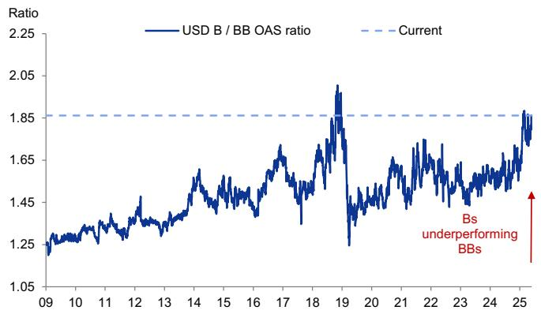

line

| Year | USD B / BB OAS ratio |
|------|----------------------|
| 09   | 1.25                 |
| 10   | 1.30                 |
| 11   | 1.35                 |
| 12   | 1.40                 |
| 13   | 1.45                 |
| 14   | 1.50                 |
| 15   | 1.55                 |
| 16   | 1.60                 |
| 17   | 1.65                 |
| 18   | 1.70                 |
| 19   | 2.00                 |
| 20   | 1.40                 |
| 21   | 1.60                 |
| 22   | 1.70                 |
| 23   | 1.65                 |
| 24   | 1.75                 |
| 25   | 1.85                 |

Note: As of May 26, 2026.

Exhibit 2: In contrast, USD BB vs. BBB spreads have been rangebound   
OAS ratio of the BB and BBB subsets of the Bloomberg USD HY and IG Corporate indices   
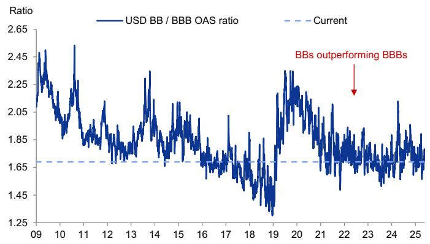

line

| Year | USD BB / BBB OAS ratio |
|------|------------------------|
| 09   | 2.45                   |
| 10   | 2.30                   |
| 11   | 2.50                   |
| 12   | 2.00                   |
| 13   | 2.30                   |
| 14   | 2.10                   |
| 15   | 2.05                   |
| 16   | 1.85                   |
| 17   | 1.80                   |
| 18   | 1.70                   |
| 19   | 1.30                   |
| 20   | 2.30                   |
| 21   | 2.10                   |
| 22   | 1.80                   |
| 23   | 1.75                   |
| 24   | 2.10                   |
| 25   | 1.70                   |

Note: As of May 26, 2026.   
Source: Bloomberg, GS Global Investment Research   
Source: Bloomberg, GS Global Investment Research

The EUR market shows a similar divergence in the ‘flight to quality’ dynamic: BBs have outperformed single-Bs (Exhibit 3), yet the BB vs. BBB spread ratio has remained relatively range bound, toward the mid-to-low end of its historical range (Exhibit 4). Unlike in the USD market, we see scope for EUR BBBs to outperform BBs over the medium term, supported by a weaker European growth backdrop due to the ongoing energy shock, as well as incremental technical headwinds for BBs from elevated fallen-angel risk.

Exhibit 3: In the EUR market, BB spreads have also outperformed the B-rated cohort   
OAS ratio of the B and BB subsets of the Bloomberg Pan Euro HY Corporate indices   
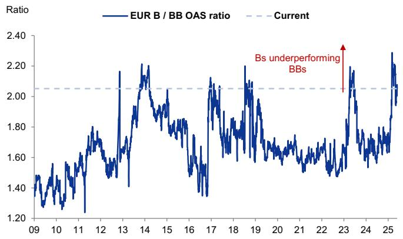

line

| Year | EUR B / BB OAS ratio |
|------|----------------------|
| 09   | 1.40                 |
| 10   | 1.50                 |
| 11   | 1.60                 |
| 12   | 1.70                 |
| 13   | 2.20                 |
| 14   | 2.10                 |
| 15   | 1.80                 |
| 16   | 1.70                 |
| 17   | 2.10                 |
| 18   | 2.00                 |
| 19   | 2.20                 |
| 20   | 1.70                 |
| 21   | 1.60                 |
| 22   | 1.70                 |
| 23   | 2.20                 |
| 24   | 1.70                 |
| 25   | 2.30                 |

Note: As of May 27, 2026.   
Source: Bloomberg, GS Global Investment Research

Exhibit 4: EUR BB vs. BBB spreads remain near the mid-to-low end of the historical range   
OAS ratio of the BB and BBB subsets of the Bloomberg Pan Euro HY and IG Corporate indices   
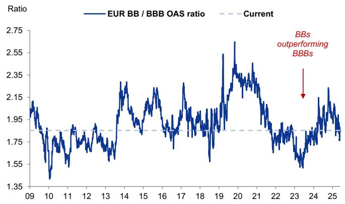

line

| Year | EUR BB / BBB OAS ratio | Current |
|------|------------------------|---------|
| 09   | 2.15                   | 1.85    |
| 10   | 1.60                   | 1.85    |
| 11   | 1.85                   | 1.85    |
| 12   | 1.90                   | 1.85    |
| 13   | 2.30                   | 1.85    |
| 14   | 2.15                   | 1.85    |
| 15   | 2.30                   | 1.85    |
| 16   | 2.15                   | 1.85    |
| 17   | 2.30                   | 1.85    |
| 18   | 2.15                   | 1.85    |
| 19   | 2.50                   | 1.85    |
| 20   | 2.70                   | 1.85    |
| 21   | 2.40                   | 1.85    |
| 22   | 2.15                   | 1.85    |
| 23   | 1.90                   | 1.85    |
| 24   | 2.30                   | 1.85    |
| 25   | 2.15                   | 1.85    |

Note: As of May 27, 2026.   
Source: Bloomberg, GS Global Investment Research

# We expect a greater technical headwind from ‘fallen angels’ in the EUR market

Beyond the well-telegraphed divergence in the macro backdrop between the US and Europe, we also expect technical conditions to differentiate across regions. In Europe, we see scope for a larger supply headwind into the BB segment from fallen angels, whereas USD BB technicals should benefit from more rising stars than fallen angels.

To assess fallen angel and rising star risk over the remainder of 2026, we introduce a new framework based on historical one year rating-transition behavior by rating bucket. The left panels of Exhibits 5 and 6 summarize the historical probability of becoming a fallen angel or a rising star over a one-year horizon, by rating bucket. The results are broadly intuitive: since 2010, bonds rated BBB- on Negative Outlook or Downgrade Watch have exhibited the highest propensity to become fallen angels, while BB+ credits with a Positive Outlook or Upgrade Watch have shown the highest likelihood of migrating back to investment grade (i.e., becoming rising stars).

That said, the right panels of both exhibits show that ratings and outlooks are, at best, an imperfect guide to forward-looking fallen angel and rising star risk: since 2010, issuers originally rated BBB/BBB- or higher without a Negative Outlook or Downgrade Watch have accounted for roughly half of all fallen angel volumes in both markets. The signal is especially noisy during abrupt macro shocks—such as COVID-19—when fundamentals can deteriorate faster than rating frameworks can adjust.

Exhibit 5: A high share of fallen angels in the EUR and USD markets were not rated BBB or BBB- on Negative outlook or Downgrade Watch prior to the event

Share of bonds in each rating bucket that became fallen angels within 12 months (since 2010, left panel). Rating composition of all fallen angels prior to downgrade (right panel). The difference reflects the denominator — the left measures transition rates within each bucket, the right measures where fallen angels came from.

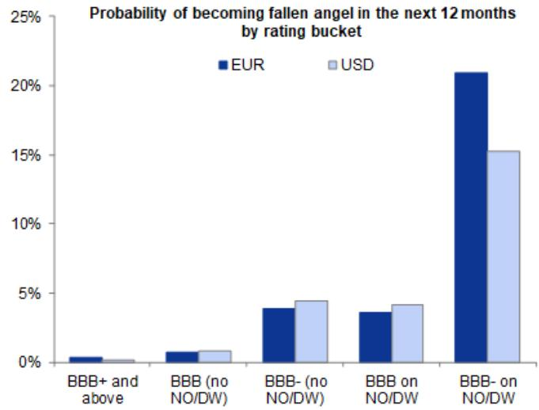

bar

| Rating bucket           | EUR   | USD   |
| ----------------------- | ----- | ----- |
| BBB+ and above          | 0.5%  | 0.3%  |
| BBB (no NO/DW)          | 0.8%  | 0.9%  |
| BBB- (no NO/DW)         | 4.0%  | 4.5%  |
| BBB on NO/DW            | 3.7%  | 4.2%  |
| BBB- on NO/DW           | 21.0% | 15.3% |

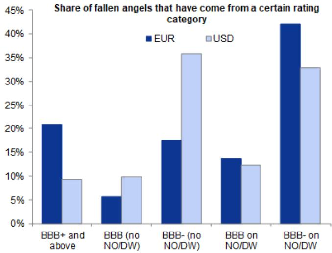

bar

| Rating Category | EUR (%) | USD (%) |
|---|---|---|
| BBB+ and above | 21 | 9.5 |
| BBB (no NO/DW) | 5.8 | 10 |
| BBB- (no NO/DW) | 17.6 | 36 |
| BBB on NO/DW | 14 | 12.5 |
| BBB- on NO/DW | 42 | 33 |

Source: Bloomberg, GS Global Investment Research

# Exhibit 6: Similarly, a high share of rising stars in the EUR and USD markets were not BB+ or BB on Positive Outlook or Upgrade Watch prior to the event

Share of bonds in each rating bucket that became rising stars within 12 months (since 2010, left panel). Rating composition of all rising stars prior to upgrade (right panel). The difference reflects the denominator — the left measures transition rates within each bucket, the right measures where rising stars came from.

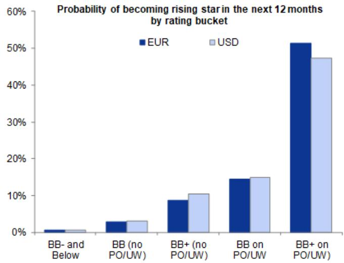

bar

| Rating bucket | EUR (%) | USD (%) |
|---|---|---|
| BB- and Below | 0.5 | 0.7 |
| BB (no PO/UW) | 3.0 | 3.2 |
| BB+ (no PO/UW) | 9.0 | 10.5 |
| BB on PO/UW | 14.5 | 15.0 |
| BB+ on PO/UW) | 51.0 | 47.5 |

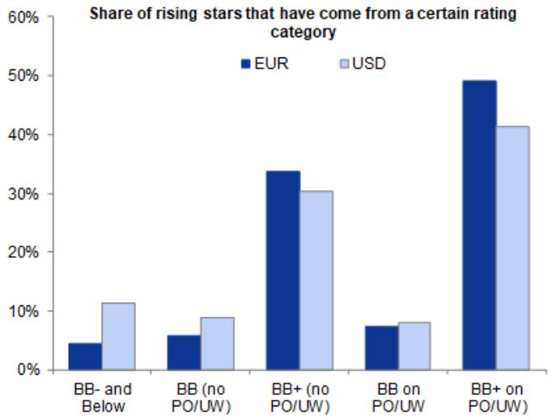

bar

| Rating Category       | EUR  | USD  |
| --------------------- | ---- | ---- |
| BB- and Below         | 4%   | 11%  |
| BB (no PO/UW)         | 6%   | 9%   |
| BB+ (no PO/UW)        | 34%  | 30%  |
| BB on PO/UW           | 7%   | 8%   |
| BB+ on PO/UW          | 49%  | 41%  |

Source: Bloomberg, GS Global Investment Research

Accordingly, while our fallen angel and rising star forecasts are anchored in historical transition behavior, we would stress that forecast uncertainty remains elevated and, at times, warrants a subjective overlay.

For example, our model would imply roughly \$85 billion of USD rising stars in 2026; however, we are tempering that signal given the somewhat more challenging growth and inflation backdrop expected by our US economists, which may slow the pace of upgrades. As a result, we raise our official USD rising star forecast to \$75 billion (from \$40 billion previously; Exhibit 7).

Elsewhere, the framework is broadly consistent with our existing forecasts for 2026: USD fallen angels of \$60 billion, and EUR rising stars and fallen angels of €20 billion and €30 billion, respectively. In the EUR market, that profile would imply the first year since 2020 in which fallen angels outpace rising stars, while the USD market is set up for yet another year of net rising stars.

This divergence is starting to show up in year-to-date net rising-star activity: the EUR market is roughly flat at €1 billion, versus \$5 billion in the USD market.

Notably, however, the market does not appear to be pricing substantial fallen-angel risk in either region. Exhibit 8 shows that the share of the BBB-segment of the EUR and USD IG markets (unsecured bonds only) trading at spreads wider than the average BB+ remains around 2% and 15%, respectively, near the low end of the past decade.

Exhibit 7: In the EUR market, fallen angels are set to outpace rising stars for the first time since 2020. Fallen angel and rising star notionals in the EUR market (left panel) and USD market (right panel)   
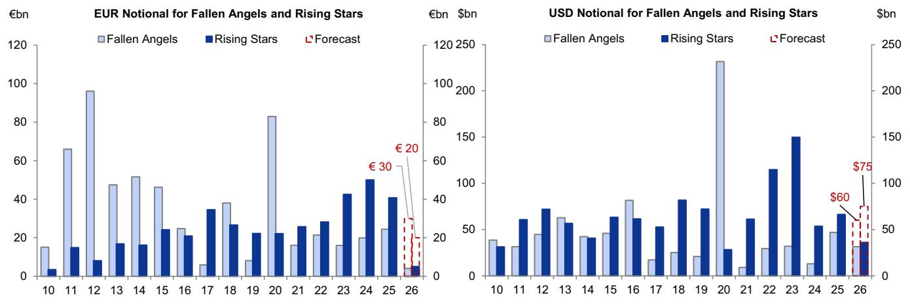

bar

EUR Notional for Fallen Angels and Rising Stars
| Year | Event | EUR Notional (€bn) | USD Notional ($bn) |
| :--- | :--- | :--- | :--- |
| 10 | Fallen Angels | 15 | 20 |
| 11 | Fallen Angels | 66 | 15 |
| 12 | Fallen Angels | 96 | 20 |
| 13 | Fallen Angels | 48 | 25 |
| 14 | Fallen Angels | 52 | 20 |
| 15 | Fallen Angels | 47 | 15 |
| 16 | Fallen Angels | 25 | 10 |
| 17 | Fallen Angels | 6 | 5 |
| 18 | Fallen Angels | 38 | 20 |
| 19 | Fallen Angels | 8 | 5 |
| 20 | Fallen Angels | 83 | 20 |
| 21 | Fallen Angels | 16 | 5 |
| 22 | Fallen Angels | 21 | 5 |
| 23 | Fallen Angels | 16 | 10 |
| 24 | Fallen Angels | 20 | 15 |
| 25 | Fallen Angels | 25 | 20 |
| 26 | Fallen Angels | - | - |
| ↑Forecast
↑USD Notional for Fallen Angels and Rising Stars
↑USD Notional for Fallen Angels and Rising Stars
↑USD Notional for Fallen Angels and Rising Stars
↑USD Notional for Fallen Angels and Rising Stars
↑USD Notional for Fallen Angels and Rising Stars
↑USD Notional for Fallen Angels and Rising Stars
↑USD Notional for Fallen Angels and Rising Stars
↑USD Notional for Fallen Angels and Rising Stars
↑USD Notional for Fallen Angels and Rising Stars
↑USD Notional for Fallen Angels and Rising Stars / ↑USD Notional for Fallen Angels and Rising Stars
↑USD Notional for Fallen Angels and Rising Stars / ↑USD Notional for Fallen Angels and Rising Stars
↑USD Notional for Fallen Angels and Rising Stars / ↑USD Notional for Fallen Angels and Rising Stars
↑USD Notional for Fallen Angels and Rising Stars / ↑USD Notional for Fallen Angels and Rising Stars
↑USD Notional for Fallen Angels and Rising Stars / ↑USD Notional for Fallen Angels and Rising Stars
↑$60
↑$75

Source: Bloomberg, GS Global Investment Research

Exhibit 8: Neither market is pricing significant fallen angel risk   
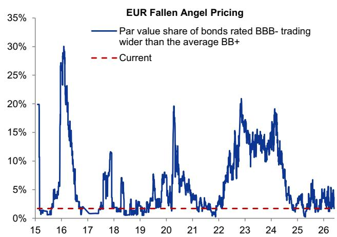

line

| Year | Par value share of bonds rated BBB- trading |
|------|---------------------------------------------|
| 15   | ~20%                                        |
| 16   | ~30%                                        |
| 17   | ~1%                                         |
| 18   | ~12%                                        |
| 19   | ~3%                                         |
| 20   | ~8%                                         |
| 21   | ~10%                                        |
| 22   | ~2%                                         |
| 23   | ~20%                                        |
| 24   | ~18%                                        |
| 25   | ~5%                                         |
| 26   | ~3%                                         |

Note: As of May 25, 2026.

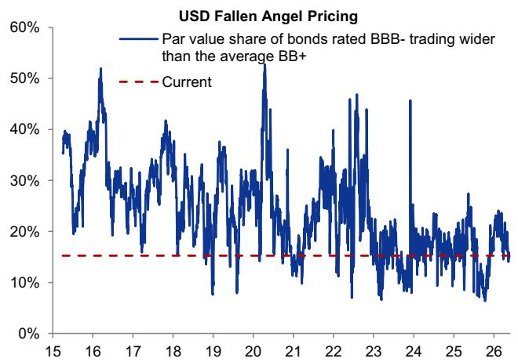

line

| Year | Par value share of bonds rated BBB- trading wider than the average BB+ |
|------|------------------------------------------------------------------------|
| 15   | ~38%                                                                   |
| 16   | ~52%                                                                   |
| 17   | ~30%                                                                   |
| 18   | ~40%                                                                   |
| 19   | ~35%                                                                   |
| 20   | ~52%                                                                   |
| 21   | ~35%                                                                   |
| 22   | ~45%                                                                   |
| 23   | ~40%                                                                   |
| 24   | ~45%                                                                   |
| 25   | ~25%                                                                   |
| 26   | ~20%                                                                   |

Source: iBoxx, GS Global Investment Research

# Sector drivers: Likely to be Energy intensive in EUR, Software in USD

The diverging paths between rising stars and fallen angels in the EUR and USD markets are further reinforced when we examine the composition of debt that has driven rising-star activity in recent years, alongside the segments that currently screen as most vulnerable to fallen angel risk.

First, the rising-star wave since 2021 has been more concentrated in European financials (Banks accounted for 30% of rising stars since 2021; Exhibit 9). While bank balance sheets remain strong, the sector faces incremental headwinds from higher taxes, slower growth, and, in some countries, lingering fiscal risks—all of which likely limit further upside rating momentum (at least in the near term). By contrast, USD rising stars have been more diversified across sectors, including Energy, Autos, and TMT.

Second, the current energy shock is weighing more heavily on energy intensive and interest rate sensitive sectors, which represent a large share of BBB/BBB- rated bonds currently on Negative Outlook or Downgrade Watch in the EUR market. For example, Automotives, Chemicals, REITs, and Food and Beverage account for 24% of EUR BBB and BBB- issuers on Negative Outlook or Downgrade Watch, versus 16% in the USD market (Exhibit 10). Idiosyncratic, issuer-specific, fallen angel risk is present in both markets, concentrated in Banks in the EUR market, and Software in the USD market.

Exhibit 9: Since 2021, rising stars have been dominated by Banks and Financials in the EUR market   
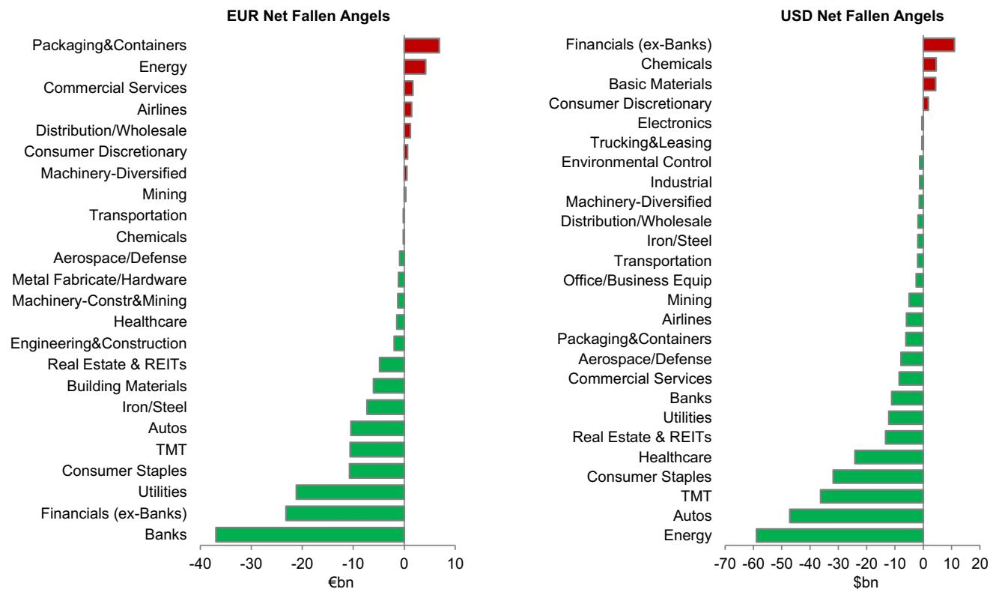  
Source: Bloomberg, GS Global Investment Research

Exhibit 10: Energy intensive sectors screen at risk of becoming fallen angels in the EUR market, alongside Software in the USD market   
Exhibit shows the sectors that are on Negative Outlook and Negative Watch   
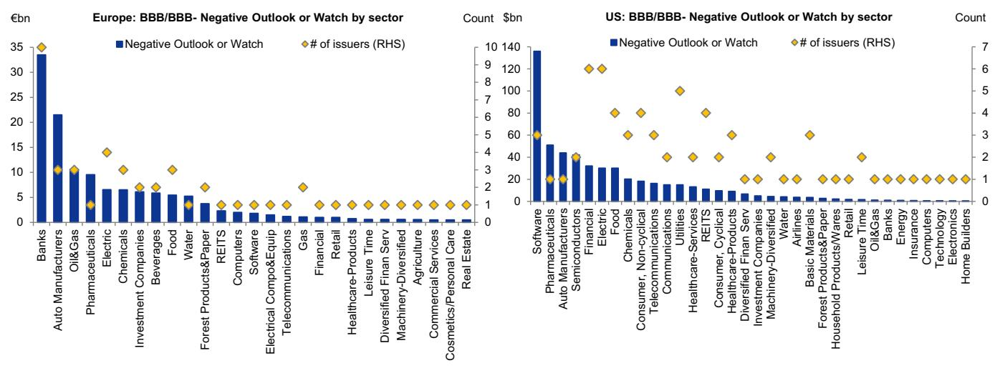

bar_line

Europe: BBB/BBB- Negative Outlook or Watch by sector
| Sector | Negative Outlook or Watch (€bn) | # of issuers (RHS) |
| :--- | :--- | :--- |
| Banks | 34 | 7 |
| Auto Manufacturers | 21.5 | 10 |
| Oil&Gas | 10.5 | 11 |
| Pharmaceuticals | 9.5 | 3 |
| Electric | 6.5 | 14 |
| Chemicals | 6.5 | 11 |
| Investment Companies | 6.5 | 7 |
| Beverages | 5.5 | 7 |
| Food | 5.5 | 11 |
| Water | 5.0 | 3 |
| Forest Products&Paper | 4.0 | 7 |
| REITS | 2.5 | 1 |
| Computers | 2.0 | 1 |
| Software | 1.5 | 1 |
| Electrical Compo&Equip | 1.5 | 1 |
| Telecommunications | 1.0 | 7 |
| Gas | 1.0 | 1 |
| Financial | 1.0 | 1 |
| Retail | 1.0 | 1 |
| Healthcare-Products | 1.0 | 1 |
| Leisure Time | 1.0 | 1 |
| Diversified Finan Serv | 1.0 | 1 |
| Machinery-Diversified | 1.0 | 1 |
| Agriculture | 1.0 | 1 |
| Commercial Services | 1.0 | 1 |
| Cosmetics/Personal Care | 1.0 | 1 |
| Real Estate | 1.0 | 1 |
Count: $bn
US: BBB/BBB- Negative Outlook or Watch by sector
Negative Outlook or Watch
# of issuers (RHS)
US: BBB/BBB- Negative Outlook or Watch by sector
Count: 
- Negative Outlook or Watch
- Negative Outlook or Watch
- # of issuers (RHS)

Source: Bloomberg, GS Global Investment Research

# Fallen angels weigh more heavily on performance in the EUR market

In Exhibits 11 and 12, we capture a sample of fallen angels (since 2010) across the EUR and USD markets, to assess performance. Our sample uses iBoxx and Bloomberg data, and includes 155 fallen angels in the EUR market and 354 fallen angels for the USD market.

In the USD market, we find that fallen angels have tended to outperform after a downgrade (Exhibit 11). In many cases, the move to high yield is well telegraphed, and subsequent HY index inclusion can broaden the buyer base. In addition, it is common for HY investors to have a favorable view of the credit quality of recent fallen angels—especially relative to the ‘existing’ HY universe and even more so if there is a stated plan to return to IG-rated metrics.

In the EUR market, however, fallen angels have tended to underperform relatively consistently following a downgrade. One important driver appears to be the prevalence of single-rated issuers in Europe. In the EUR BBB market, 19% of notional outstanding has only one rating agency, versus less than 1% in the USD market (Exhibit 12). As a result, fallen-angel risk can materialize more abruptly and be less fully anticipated than in the USD market, where a ‘true’ fallen angel typically requires a second downgrade (per index eligibility rules).

EUR fallen angels have also tended to have more pronounced downside outcomes. Since 2010, 5% of the number of bonds that become fallen angels in the EUR have been downgraded to CCC+ or lower within one year, versus 1.5% in the USD market (Exhibit 13). That said, the market does appear to price some of this risk. BBB issuers rated by just one agency typically trade at slightly wider spreads versus their peers, particularly when also on Negative Outlook (Exhibit 14).

Exhibit 11: In the EUR market, fallen angels tend to underperform post a downgrade, unlike in the USD market   
The exhibit shows the relative OAS performance before/after becoming a fallen angel since 2010, covering 155 issuers in the EUR market and 354 issuers in the USD market.   
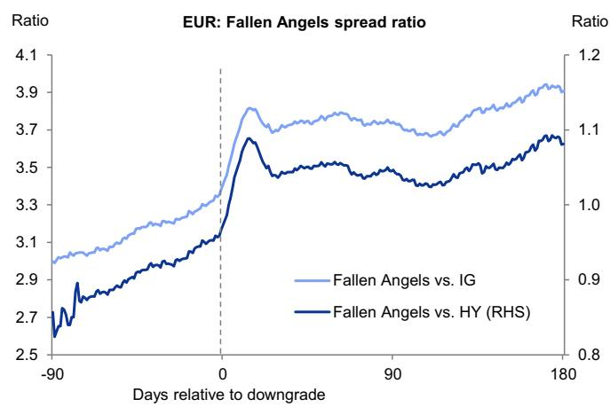

line

| Days relative to downgrade | Fallen Angels vs. IG | Fallen Angels vs. HY (RHS) |
| -------------------------- | -------------------- | -------------------------- |
| -90                        | 2.7                  | 0.8                        |
| 0                          | 3.7                  | 1.0                        |
| 90                         | 3.7                  | 1.0                        |
| 180                        | 3.9                  | 1.1                        |

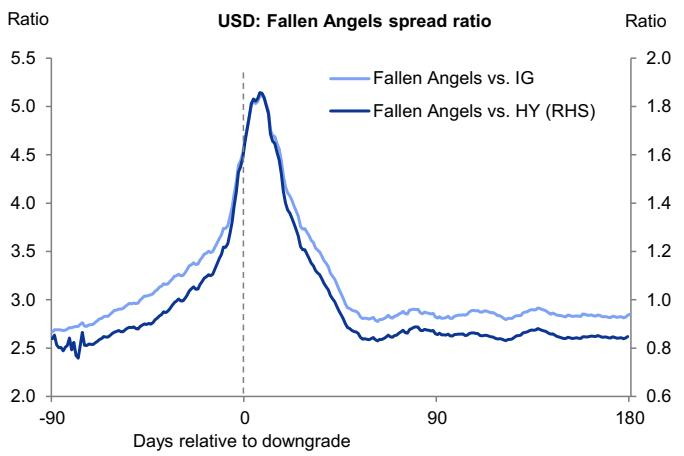

line

| Days relative to downgrade | Ratio (Fallen Angels vs. IG) | Ratio (Fallen Angels vs. HY (RHS)) |
| -------------------------- | ---------------------------- | --------------------------------- |
| -90                        | ~2.6                         | ~2.4                              |
| 0                          | ~5.2                         | ~5.1                              |
| 90                         | ~2.8                         | ~2.7                              |
| 180                        | ~2.8                         | ~2.6                              |

Source: iBoxx, Bloomberg, GS Global Investment Research

Exhibit 12: The EUR market has a high share of debt attached to just one rating agency vs. the USD market   
Percentages based on notional amounts   
Share of BBBs by number of rating agencies in Europe (%)   
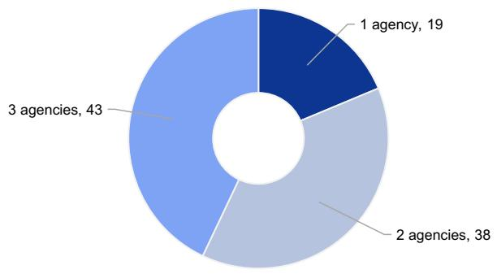

pie

| Category | Value |
|---|---|
| 1 agency | 19 |
| 2 agencies | 38 |
| 3 agencies | 43 |

Share of BBBs by number of rating agencies in the US (%)   
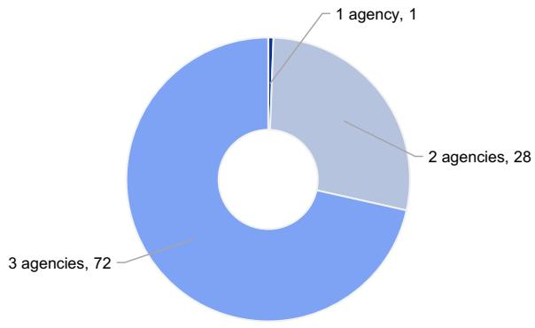

pie

| Category | Value |
|---|---|
| 1 agency | 1 |
| 2 agencies | 28 |
| 3 agencies | 72 |

Source: Bloomberg, GS Global Investment Research

Exhibit 13: In the EUR market, fallen angels have a higher tendency to be downgraded to CCC+ or below   
Exhibit shows the share of bonds that become fallen angels in the EUR and USD market which are downgraded to CCC+ or below within 1, 2 and 3 years   
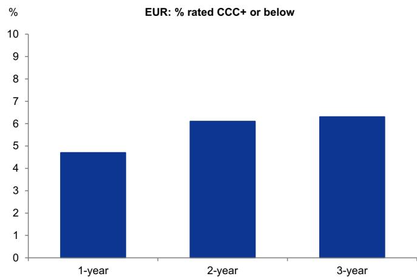

bar

EUR: % rated CCC+ or below
| Maturity | % rated CCC+ or below (%) |
| :--- | :--- |
| 1-year | 4.7 |
| 2-year | 6.1 |
| 3-year | 6.3 |

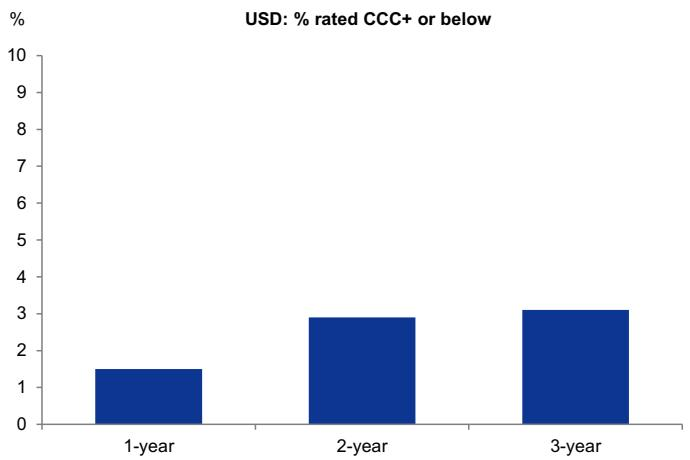

bar

USD: % rated CCC+ or below
| Timeframe | Rating (%) |
| :--- | :--- |
| 1-year | 1.5 |
| 2-year | 2.9 |
| 3-year | 3.1 |

Source: Bloomberg, GS Global Investment Research

Exhibit 14: Issuers in the EUR and USD market with just one rating agency tend to have wider spreads   
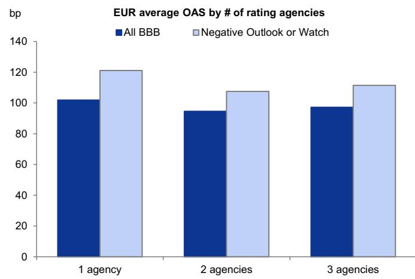

bar

EUR average OAS by # of rating agencies
| Rating Agency | All BBB (bp) | Negative Outlook or Watch (bp) |
| :--- | :--- | :--- |
| 1 agency | 102 | 121 |
| 2 agencies | 95 | 107 |
| 3 agencies | 97 | 111 |

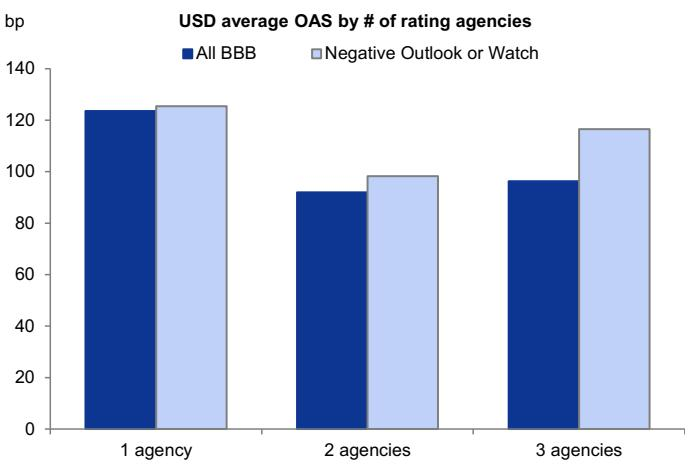

bar

USD average OAS by # of rating agencies
| Number of Rating Agencies | All BBB (bp) | Negative Outlook or Watch (bp) |
| :--- | :--- | :--- |
| 1 agency | 124 | 126 |
| 2 agencies | 92 | 99 |
| 3 agencies | 97 | 117 |

Source: iBoxx, GS Global Investment Research

# Why does Europe have such a high share of single rating-agency issuers?

Both the number of issuers and the share of issuers with only one rating in Europe have risen steadily since 2010 (Exhibit 15).

Key drivers appear to be structural and regulatory. Under the EU CRA Regulation, Article 8d, issuers (or related third parties) that intend to appoint two or more credit rating agencies are required to consider appointing at least one credit rating agency with no more than 10% total EU market share; if they do not, they must document that decision.

In practice, this can increase the cost and operational burden of maintaining a multi-rating strategy, particularly for smaller issuers. As a result, some issuers may opt to remain single-rated rather than add a second (or third) relationship that could trigger additional documentation and governance steps.

This also interacts with issuer mix and market structure. As Exhibit 16 suggests, single-rated issuers tend to be smaller (lower average notional per issuer), and a large share of new entrants to the EUR credit market begin with only one rating. Given Europe's more fragmented market, we do not expect this dynamic to fade quickly (at least absent regulatory change).

Exhibit 15: In Europe, the share of single rating agency risk has been rising   
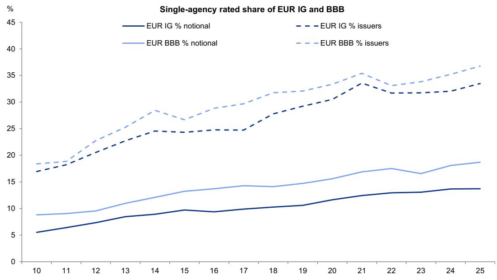

line

| Year | EUR IG % notional | EUR IG % issuers | EUR BBB % notional | EUR BBB % issuers |
|------|-------------------|------------------|--------------------|-------------------|
| 10   | 5.5               | 17.0             | 8.8                | 18.5              |
| 11   | 6.5               | 18.0             | 9.0                | 19.0              |
| 12   | 7.5               | 20.0             | 9.5                | 22.0              |
| 13   | 8.5               | 22.0             | 10.5               | 24.0              |
| 14   | 9.0               | 24.0             | 11.5               | 28.5              |
| 15   | 9.5               | 24.5             | 12.5               | 26.5              |
| 16   | 9.0               | 24.5             | 13.0               | 28.0              |
| 17   | 9.5               | 24.5             | 13.5               | 29.5              |
| 18   | 10.0              | 27.0             | 14.0               | 31.5              |
| 19   | 10.5              | 28.5             | 14.5               | 32.0              |
| 20   | 11.0              | 30.0             | 15.0               | 33.0              |
| 21   | 12.0              | 33.5             | 16.5               | 35.5              |
| 22   | 12.5              | 31.5             | 17.5               | 33.0              |
| 23   | 13.0              | 31.5             | 16.5               | 34.0              |
| 24   | 13.5              | 32.0             | 17.5               | 35.0              |
| 25   | 13.5              | 33.5             | 18.5               | 36.5              |

Source: iBoxx, GS Global Investment Research

Exhibit 16: Single rating agency risk tends to be concentrated in new and smaller issuers   
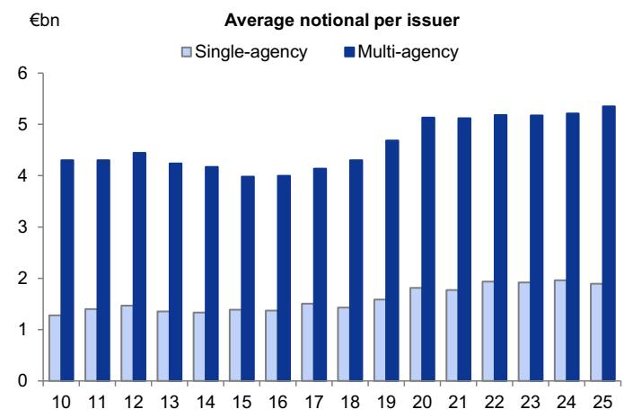

bar

| Issuer | Single-agency (€bn) | Multi-agency (€bn) |
|--------|----------------------|--------------------|
| 10     | 1.3                  | 4.3                |
| 11     | 1.4                  | 4.3                |
| 12     | 1.5                  | 4.5                |
| 13     | 1.4                  | 4.2                |
| 14     | 1.3                  | 4.2                |
| 15     | 1.4                  | 4.0                |
| 16     | 1.4                  | 4.0                |
| 17     | 1.5                  | 4.1                |
| 18     | 1.4                  | 4.3                |
| 19     | 1.6                  | 4.7                |
| 20     | 1.8                  | 5.2                |
| 21     | 1.8                  | 5.2                |
| 22     | 1.9                  | 5.2                |
| 23     | 1.9                  | 5.2                |
| 24     | 2.0                  | 5.3                |
| 25     | 1.9                  | 5.4                |

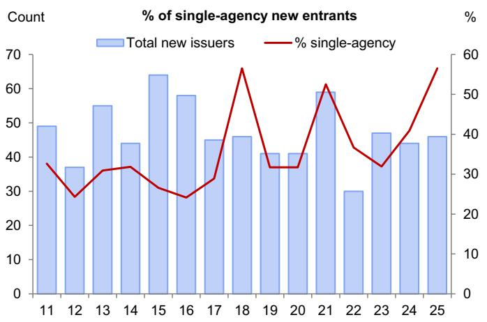

bar_line

% of single-agency new entrants
| Year | Total new issuers | % single-agency |
| :--- | :--- | :--- |
| 11 | 49 | 38 |
| 12 | 37 | 28 |
| 13 | 55 | 36 |
| 14 | 44 | 37 |
| 15 | 64 | 31 |
| 16 | 58 | 28 |
| 17 | 45 | 33 |
| 18 | 46 | 56 |
| 19 | 41 | 32 |
| 20 | 41 | 32 |
| 21 | 59 | 52 |
| 22 | 30 | 34 |
| 23 | 47 | 32 |
| 24 | 44 | 40 |
| 25 | 46 | 57 |

Source: iBoxx, GS Global Investment Research

The authors would like to thank Patricia Pacheco for her contribution to this report.

# Forecast dashboard: Spreads, returns, issuance, defaults, and ratings migrations

Exhibit 17: USD and EUR spread forecasts 

<table><tr><td rowspan="2">Index</td><td colspan="4">Updated as of May. 28, 2026</td></tr><tr><td>Current</td><td>2026Q2</td><td>2026Q3</td><td>2026Q4</td></tr><tr><td colspan="5">USD spreads</td></tr><tr><td>USD IG</td><td>72</td><td>95</td><td>92</td><td>90</td></tr><tr><td>USD Fin</td><td>76</td><td>103</td><td>98</td><td>94</td></tr><tr><td>USD Non-Fin</td><td>69</td><td>92</td><td>89</td><td>86</td></tr><tr><td>USD HY</td><td>261</td><td>335</td><td>325</td><td>315</td></tr><tr><td colspan="5">EUR spreads</td></tr><tr><td>EUR IG</td><td>89</td><td>120</td><td>117</td><td>114</td></tr><tr><td>EUR Fin</td><td>95</td><td>127</td><td>122</td><td>118</td></tr><tr><td>EUR Non-Fin</td><td>86</td><td>116</td><td>113</td><td>111</td></tr><tr><td>EUR HY</td><td>272</td><td>375</td><td>368</td><td>360</td></tr></table>

Source: Bloomberg, ICE-BAML, iBoxx, GS Global Investment Research

Exhibit 19: Issuance forecasts 

<table><tr><td>Market</td><td>2026 YTD (bn)</td><td>2026 full-year forecast (bn)</td></tr><tr><td colspan="3">USD market</td></tr><tr><td colspan="3">Gross issuance</td></tr><tr><td>IG</td><td>$1,051</td><td>$2,100</td></tr><tr><td>HY</td><td>$145</td><td>$400</td></tr><tr><td>Leveraged loans</td><td>$174</td><td>--</td></tr><tr><td colspan="3">Net issuance</td></tr><tr><td>IG</td><td>$462</td><td>$850</td></tr><tr><td>HY</td><td>$52</td><td>$160</td></tr><tr><td colspan="3">EUR market</td></tr><tr><td colspan="3">Gross issuance</td></tr><tr><td>IG</td><td>€ 405</td><td>€ 850</td></tr><tr><td>HY</td><td>€ 47</td><td>€ 125</td></tr><tr><td colspan="3">Net issuance</td></tr><tr><td>IG</td><td>€ 96</td><td>€ 265</td></tr><tr><td>HY</td><td>€ 22</td><td>€ 60</td></tr></table>

Source: Dealogic, Bloomberg, GS Global Investment Research

Exhibit 18: USD and EUR excess returns forecast 

<table><tr><td rowspan="2">Index</td><td colspan="3">Updated as of May. 28, 2026</td></tr><tr><td>Current duration</td><td>2026</td><td>2026 full-year forecast (%)</td></tr><tr><td colspan="4">USD excess returns</td></tr><tr><td>USD IG</td><td>6.8</td><td>0.7%</td><td>0.0%</td></tr><tr><td>USD HY</td><td>2.9</td><td>1.3%</td><td>1.3%</td></tr><tr><td colspan="4">EUR excess returns</td></tr><tr><td>EUR IG</td><td>4.6</td><td>0.5%</td><td>0.0%</td></tr><tr><td>EUR HY</td><td>2.7</td><td>0.6%</td><td>-0.4%</td></tr></table>

Source: Bloomberg, ICE-BAML, iBoxx, GS Global Investment Research

Exhibit 20: Ratings migration and default forecasts   
Default rates are issuer-weighted and 12-month trailing 

<table><tr><td rowspan="2">Market</td><td colspan="2">Updated as of May. 28, 2026</td></tr><tr><td>2026 YTD</td><td>2026 full-year forecast</td></tr><tr><td colspan="3">USD market</td></tr><tr><td>Rising stars</td><td>$43bn</td><td>$75bn</td></tr><tr><td>Fallen angels</td><td>$31bn</td><td>$60bn</td></tr><tr><td>HY defaults (12-month trailing)</td><td>3.6%</td><td>3.0%</td></tr><tr><td>Leveraged loan defaults (12-month trailing)</td><td>5.1%</td><td>4.75%</td></tr><tr><td colspan="3">EUR market</td></tr><tr><td>Rising stars</td><td>€ 5bn</td><td>€20bn</td></tr><tr><td>Fallen angels</td><td>€ 4bn</td><td>€30bn</td></tr><tr><td>HY defaults (12-month trailing)</td><td>4.5%</td><td>4.7%</td></tr><tr><td>Leveraged loan defaults (12-month trailing)</td><td>3.3%</td><td>4.0%</td></tr></table>

Source: Bloomberg, Moody's, GS Global Investment Research

# Forecast dashboard: Relative value views

Exhibit 21: Relative value views 

<table><tr><td colspan="3">Relative value views</td></tr><tr><td colspan="3">Corporate Credit</td></tr><tr><td>Regional</td><td>Overweight USD vs. EUR</td><td>The growth, inflation and monetary policy mix is somewhat more favorable in the US, relative to Europe. As a result, and relative to the USD market, we forecast a wider peak (and a slower recovery in 2H2026) in EUR credit spreads.</td></tr><tr><td rowspan="6">USD market</td><td>Overweight IG vs. HY</td><td>We have a slight preference for IG vs. HY in the USD market, owing to valuations and our economists&#x27; forecasts for below-potential growth.</td></tr><tr><td>Overweight BBBs vs. higher-rated cohorts</td><td>We prefer owning BBBs over the higher-rated segments of USD IG (As and AAs), as a way to capture additional spread. We also see scope for balance sheet deterioration at the highest end of the rating spectrum in IG.</td></tr><tr><td>Overweight BBs, Neutral CCCs, Underweight Bs</td><td>Current spread levels indicate that single-Bs offer the lowest credit risk premium relative to expected losses among all HY rating buckets.</td></tr><tr><td>Overweight HY bonds vs. loans</td><td>HY bonds still provide a superior trade-off between carry and duration compared to leveraged loans. In addition, loans&#x27; substantial software sector exposure is likely to present a sentiment overhang, at least in the near-term.</td></tr><tr><td>Overweight CLO mezz tranches vs. leveraged loansNeutral CLO vs. USD IGNeutral CLO vs. CMOs</td><td>For floating rate investors, we prefer CLO mezzanine tranches vs. leveraged loans.Historical data points to low impairment rates for BB and BBB CLO tranches, and current valuations offer attractive carry and a cushion against moderate to elevated default outcomes. Elsewhere, we are neutral between senior CLO tranches and USD IG; we would use spread widening to add exposure in CLOs. We are also neutral between CLO AAA and CMO floaters.</td></tr><tr><td>Prefer Agency MBS vs. IG</td><td>Agency MBS offers an attractive diversification benefit vs. a portfolio of IG corporate bonds.</td></tr><tr><td rowspan="6">EUR market</td><td>Overweight IG vs. HY</td><td>We prefer IG over HY given the more challenging growth, inflation, and monetary policy mix in the Euro Area.</td></tr><tr><td>Overweight As vs. BBBs</td><td>In the EUR market, we prefer As over BBBs, as the weaker growth backdrop warrants more of an up-in-quality stance. That said, we would not move too far up the quality spectrum, as we expect supply technicals will be a headwind in the EUR AA market.</td></tr><tr><td>Overweight HY bonds vs. loans</td><td>Similar to the US, we prefer HY bonds given the loan market&#x27;s weighting toward software (and the potential negative sentiment overhang). The reaction function of the ECB may also favor floating rate credit, given the central bank&#x27;s focus on inflationary pressures.</td></tr><tr><td>Overweight IG 10s vs. 2s</td><td>We have a slight preference for extending duration in EUR IG to optimize carry, but have scaled back this approach.</td></tr><tr><td>Overweight BBs, Neutral Bs, Underweight CCCs</td><td>At current valuations and given our expectation for heightened dispersion, we prefer moving up in quality within EUR HY.</td></tr><tr><td>Underweight AT1s vs. EUR HY</td><td>Given downside tail risks and a limited valuation cushion, we recommend an underweight on AT1s vs. EUR HY.</td></tr></table>

Source: GS Global Investment Research

# Performance dashboard: Cash and synthetic markets

Exhibit 22: Performance of USD and EUR markets 

<table><tr><td rowspan="2">Market</td><td colspan="2">Current*</td><td colspan="3">Total return</td><td rowspan="2">Spread change (YTD,bp)</td><td rowspan="2">Yield change (YTD, %)</td></tr><tr><td>Spread</td><td>Yield</td><td>MTD</td><td>QTD</td><td>YTD</td></tr><tr><td colspan="8">USD Corporate bonds</td></tr><tr><td>IG</td><td>73</td><td>5.2</td><td>0.38</td><td>0.83</td><td>0.29</td><td>-5</td><td>0.37</td></tr><tr><td>AA</td><td>46</td><td>4.9</td><td>0.23</td><td>0.47</td><td>0.15</td><td>-3</td><td>0.31</td></tr><tr><td>A</td><td>61</td><td>5.0</td><td>0.27</td><td>0.76</td><td>0.36</td><td>-4</td><td>0.31</td></tr><tr><td>BBB</td><td>93</td><td>5.4</td><td>0.42</td><td>1.14</td><td>0.67</td><td>-8</td><td>0.29</td></tr><tr><td>HY</td><td>261</td><td>7.0</td><td>0.28</td><td>1.98</td><td>1.48</td><td>-5</td><td>0.50</td></tr><tr><td>BB</td><td>161</td><td>6.2</td><td>0.33</td><td>1.80</td><td>1.42</td><td>-8</td><td>0.26</td></tr><tr><td>B</td><td>295</td><td>7.7</td><td>0.47</td><td>2.30</td><td>1.91</td><td>-6</td><td>0.36</td></tr><tr><td>CCC</td><td>936</td><td>13.7</td><td>-0.52</td><td>2.22</td><td>-0.03</td><td>51</td><td>0.78</td></tr><tr><td colspan="8">USD Leveraged Loans</td></tr><tr><td>Leveraged loan index</td><td>437</td><td>8.2</td><td>0.00</td><td>0.09</td><td>-0.46</td><td>42</td><td>0.4</td></tr><tr><td>BB</td><td>257</td><td>6.3</td><td>0.00</td><td>0.00</td><td>0.70</td><td>2</td><td>-0.1</td></tr><tr><td>B</td><td>448</td><td>8.3</td><td>0.00</td><td>0.00</td><td>-0.93</td><td>57</td><td>0.5</td></tr><tr><td>CCC</td><td>1877</td><td>23.9</td><td>0.00</td><td>0.00</td><td>-5.09</td><td>314</td><td>3.3</td></tr><tr><td colspan="8">USD Securitized products</td></tr><tr><td>Agency MBS</td><td>23</td><td>5.0</td><td>-0.04</td><td>0.03</td><td>0.43</td><td>1</td><td>0.4</td></tr><tr><td>ABS (Autos)</td><td>57</td><td>4.5</td><td>0.19</td><td>0.52</td><td>1.19</td><td>-9</td><td>0.3</td></tr><tr><td>ABS (Credit cards)</td><td>28</td><td>4.2</td><td>0.12</td><td>0.42</td><td>0.93</td><td>-5</td><td>0.2</td></tr><tr><td>ABS (Student loans)</td><td>100</td><td>4.8</td><td>0.37</td><td>0.64</td><td>1.73</td><td>127</td><td>-0.1</td></tr><tr><td colspan="8">USD Macro indices</td></tr><tr><td>CDX IG</td><td>52</td><td>--</td><td>0.18</td><td>0.63</td><td>0.40</td><td>2</td><td>--</td></tr><tr><td>CDX HY</td><td>306</td><td>--</td><td>0.34</td><td>3.07</td><td>1.20</td><td>-10</td><td>--</td></tr><tr><td colspan="8">EUR Corporate bonds</td></tr><tr><td>IG</td><td>91</td><td>3.7</td><td>0.68</td><td>1.63</td><td>0.61</td><td>1</td><td>0.2</td></tr><tr><td>AA</td><td>65</td><td>3.6</td><td>0.61</td><td>1.46</td><td>0.51</td><td>3</td><td>0.2</td></tr><tr><td>A</td><td>83</td><td>3.6</td><td>0.67</td><td>1.61</td><td>0.61</td><td>0</td><td>0.2</td></tr><tr><td>BBB</td><td>104</td><td>3.8</td><td>0.70</td><td>1.69</td><td>0.63</td><td>2</td><td>0.2</td></tr><tr><td>HY</td><td>269</td><td>5.8</td><td>0.84</td><td>2.80</td><td>1.03</td><td>-1</td><td>0.2</td></tr><tr><td>AT1</td><td>273</td><td>5.4</td><td>1.07</td><td>3.49</td><td>2.08</td><td>-13</td><td>0.1</td></tr><tr><td colspan="8">EUR Leveraged loans</td></tr><tr><td>Leveraged loan index</td><td>497</td><td>7.2</td><td>0.00</td><td>0.18</td><td>-0.87</td><td>47</td><td>0.6</td></tr><tr><td>BB</td><td>282</td><td>5.0</td><td>0.00</td><td>0.00</td><td>0.75</td><td>-70</td><td>-0.6</td></tr><tr><td>B</td><td>471</td><td>6.9</td><td>0.00</td><td>0.00</td><td>-1.30</td><td>56</td><td>0.7</td></tr><tr><td colspan="8">EUR Macro indices</td></tr><tr><td>iTraxx Main</td><td>54</td><td>--</td><td>0.30</td><td>0.94</td><td>0.3</td><td>4</td><td>--</td></tr><tr><td>iTraxx Xover</td><td>268</td><td>--</td><td>1.45</td><td>4.54</td><td>1.9</td><td>23</td><td>--</td></tr><tr><td>iTraxx SenFin</td><td>57</td><td>--</td><td>0.34</td><td>1.13</td><td>0.6</td><td>2</td><td>--</td></tr><tr><td>iTraxx SubFin</td><td>93</td><td>--</td><td>0.54</td><td>2.08</td><td>1.1</td><td>0</td><td>--</td></tr></table>

\*Data as of previous day close.   
For USD IG and HY we use the Bloomberg indices with history back to Jun-89 and Jan-94, respectively. Corp rating level, Agency MBS and ABS we use ICE-BAML indices with history back to Dec-96, EUR IG we use the iBoxx QW5A index with history back to Jan-99, EUR HY we use the ICE-BAML index with history back to Dec-97, and USD and EUR leveraged loans we use the Morningstar LSTA LLI and ELLI indices with data going back to Jan-97 and Jan-02, respectively.   
Source: Bloomberg, iBoxx, ICE-BAML, Pitchbook LCD, GS Global Investment Research

# Performance dashboard: Sectors

Exhibit 23: Sector performance: USD IG 

<table><tr><td rowspan="2">Sector</td><td colspan="7">Metrics</td><td colspan="4">Spread change</td><td colspan="4">Total return</td></tr><tr><td>Index weight</td><td>Mkt val ($bn)</td><td>OAS</td><td>Percentile rank (2010-today)</td><td>YTW</td><td>Dur</td><td>Rating</td><td>1-week</td><td>MTD</td><td>QTD</td><td>YTD</td><td>1-week</td><td>MTD</td><td>QTD</td><td>YTD</td></tr><tr><td>Basic Industry</td><td>2%</td><td>181.4</td><td>76</td><td>●----</td><td>5.3</td><td>7.4</td><td>BAA1/BAA2</td><td>1</td><td>-6</td><td>-21</td><td>-13</td><td>0.6</td><td>0.4</td><td>1.2</td><td>0.8</td></tr><tr><td>Chemicals</td><td>1%</td><td>83.1</td><td>81</td><td>●----</td><td>5.3</td><td>7.5</td><td>BAA1/BAA2</td><td>1</td><td>-9</td><td>-20</td><td>-17</td><td>0.6</td><td>0.6</td><td>1.3</td><td>1.2</td></tr><tr><td>Metals &amp; Mining</td><td>1%</td><td>72.0</td><td>67</td><td>●----</td><td>5.2</td><td>7.7</td><td>A3/BAA1</td><td>2</td><td>-4</td><td>-22</td><td>-11</td><td>0.6</td><td>0.3</td><td>1.3</td><td>0.5</td></tr><tr><td>Paper</td><td>0%</td><td>26.3</td><td>87</td><td>●----</td><td>5.3</td><td>6.0</td><td>BAA2/BAA3</td><td>0</td><td>-5</td><td>-19</td><td>-9</td><td>0.5</td><td>0.3</td><td>1.1</td><td>0.3</td></tr><tr><td>Capital Goods</td><td>5%</td><td>410.3</td><td>57</td><td>●----</td><td>5.0</td><td>6.8</td><td>A3/BAA1</td><td>0</td><td>-7</td><td>-19</td><td>-10</td><td>0.6</td><td>0.3</td><td>0.7</td><td>0.3</td></tr><tr><td>Aerospace &amp; Defense</td><td>2%</td><td>150.8</td><td>64</td><td>●----</td><td>5.2</td><td>8.3</td><td>BAA1/BAA2</td><td>1</td><td>-6</td><td>-18</td><td>-11</td><td>0.7</td><td>0.4</td><td>0.8</td><td>0.4</td></tr><tr><td>Building Materials</td><td>1%</td><td>39.9</td><td>71</td><td>●----</td><td>5.1</td><td>6.5</td><td>BAA1/BAA2</td><td>0</td><td>-6</td><td>-18</td><td>-7</td><td>0.6</td><td>0.3</td><td>0.8</td><td>0.2</td></tr><tr><td>Diversified Manufacturing</td><td>2%</td><td>116.0</td><td>57</td><td>●----</td><td>5.0</td><td>6.6</td><td>A3/BAA1</td><td>0</td><td>-6</td><td>-18</td><td>-7</td><td>0.6</td><td>0.2</td><td>0.6</td><td>0.3</td></tr><tr><td>Construction Machinery</td><td>1%</td><td>58.3</td><td>34</td><td>●----</td><td>4.6</td><td>4.7</td><td>A1/A2</td><td>0</td><td>-8</td><td>-24</td><td>-17</td><td>0.4</td><td>0.1</td><td>0.4</td><td>0.4</td></tr><tr><td>Packaging</td><td>0%</td><td>14.3</td><td>72</td><td>●----</td><td>5.0</td><td>4.5</td><td>BAA2/BAA3</td><td>0</td><td>-6</td><td>-20</td><td>-9</td><td>0.4</td><td>0.1</td><td>0.6</td><td>0.4</td></tr><tr><td>Environmental</td><td>0%</td><td>31.0</td><td>42</td><td>●----</td><td>4.8</td><td>5.8</td><td>A3/A3</td><td>2</td><td>-7</td><td>-20</td><td>-14</td><td>0.5</td><td>0.1</td><td>0.3</td><td>0.1</td></tr><tr><td>Communications</td><td>8%</td><td>567.0</td><td>89</td><td>●----</td><td>5.5</td><td>8.6</td><td>A3/BAA1</td><td>0</td><td>-5</td><td>-11</td><td>-5</td><td>0.8</td><td>0.4</td><td>0.5</td><td>-0.1</td></tr><tr><td>Cable &amp; Satellite</td><td>1%</td><td>107.8</td><td>132</td><td>●----</td><td>6.0</td><td>9.3</td><td>BAA1/BAA2</td><td>1</td><td>-1</td><td>-5</td><td>1</td><td>0.9</td><td>0.2</td><td>0.2</td><td>-0.1</td></tr><tr><td>Media &amp; Entertainment</td><td>2%</td><td>137.1</td><td>78</td><td>●----</td><td>5.4</td><td>8.7</td><td>A1/A2</td><td>1</td><td>2</td><td>-4</td><td>-7</td><td>0.8</td><td>0.2</td><td>0.1</td><td>-1.4</td></tr><tr><td>Wireless</td><td>2%</td><td>125.1</td><td>75</td><td>●----</td><td>5.2</td><td>7.3</td><td>BAA1/BAA2</td><td>0</td><td>-8</td><td>-17</td><td>-7</td><td>0.7</td><td>0.5</td><td>0.8</td><td>0.5</td></tr><tr><td>Wirelines</td><td>3%</td><td>197.0</td><td>83</td><td>●----</td><td>5.4</td><td>9.1</td><td>BAA1/BAA2</td><td>0</td><td>-8</td><td>-13</td><td>-7</td><td>0.9</td><td>0.7</td><td>0.8</td><td>0.4</td></tr><tr><td>Consumer Cyclical</td><td>7%</td><td>549.1</td><td>65</td><td>●----</td><td>5.0</td><td>6.2</td><td>A2/A3</td><td>0</td><td>-9</td><td>-21</td><td>-8</td><td>0.5</td><td>0.3</td><td>0.8</td><td>0.3</td></tr><tr><td>Automotive</td><td>2%</td><td>170.8</td><td>80</td><td>●----</td><td>5.0</td><td>4.3</td><td>A3/BAA1</td><td>-1</td><td>-11</td><td>-24</td><td>-9</td><td>0.4</td><td>0.4</td><td>1.1</td><td>0.7</td></tr><tr><td>Leisure</td><td>0%</td><td>4.8</td><td>97</td><td>●----</td><td>5.4</td><td>6.4</td><td>BAA2/BAA2</td><td>-5</td><td>-10</td><td>-19</td><td>-5</td><td>1.0</td><td>0.7</td><td>1.3</td><td>-0.2</td></tr><tr><td>Gaming</td><td>0%</td><td>23.6</td><td>101</td><td>●----</td><td>5.3</td><td>4.7</td><td>BAA2/BAA3</td><td>0</td><td>-10</td><td>-23</td><td>-9</td><td>0.4</td><td>0.4</td><td>1.3</td><td>0.7</td></tr><tr><td>Home Construction</td><td>0%</td><td>10.4</td><td>82</td><td>●----</td><td>5.1</td><td>4.9</td><td>BAA1/BAA2</td><td>1</td><td>-3</td><td>-16</td><td>-2</td><td>0.5</td><td>0.1</td><td>0.7</td><td>0.3</td></tr><tr><td>Lodging</td><td>0%</td><td>20.0</td><td>69</td><td>●----</td><td>5.0</td><td>4.8</td><td>BAA2/BAA3</td><td>-1</td><td>-11</td><td>-22</td><td>-7</td><td>0.5</td><td>0.3</td><td>0.8</td><td>0.3</td></tr><tr><td>Retailers</td><td>3%</td><td>256.5</td><td>50</td><td>●----</td><td>5.0</td><td>7.7</td><td>A1/A2</td><td>1</td><td>-8</td><td>-19</td><td>-5</td><td>0.6</td><td>0.3</td><td>0.5</td><td>0.0</td></tr><tr><td>Restaurants</td><td>0%</td><td>33.3</td><td>56</td><td>●----</td><td>5.1</td><td>7.6</td><td>BAA1/BAA2</td><td>0</td><td>-8</td><td>-21</td><td>-11</td><td>0.6</td><td>0.4</td><td>0.8</td><td>0.4</td></tr><tr><td>Consumer Cyc Services</td><td>0%</td><td>29.6</td><td>73</td><td>●----</td><td>5.1</td><td>6.0</td><td>A3/BAA1</td><td>1</td><td>-7</td><td>-15</td><td>2</td><td>0.5</td><td>0.2</td><td>0.6</td><td>-0.1</td></tr><tr><td>Consumer Non-Cyclical</td><td>15%</td><td>1133.6</td><td>62</td><td>●----</td><td>5.2</td><td>7.8</td><td>A2/A3</td><td>1</td><td>-7</td><td>-18</td><td>-8</td><td>0.7</td><td>0.4</td><td>0.7</td><td>0.1</td></tr><tr><td>Consumer Products</td><td>1%</td><td>59.4</td><td>44</td><td>●----</td><td>4.8</td><td>6.0</td><td>A2/A3</td><td>1</td><td>-5</td><td>-20</td><td>-11</td><td>0.5</td><td>0.1</td><td>0.5</td><td>0.3</td></tr><tr><td>Food &amp; Beverage</td><td>3%</td><td>235.5</td><td>67</td><td>●----</td><td>5.2</td><td>7.6</td><td>A3/BAA1</td><td>1</td><td>-7</td><td>-19</td><td>-3</td><td>0.6</td><td>0.4</td><td>0.9</td><td>0.0</td></tr><tr><td>Healthcare</td><td>4%</td><td>331.2</td><td>71</td><td>●----</td><td>5.2</td><td>7.8</td><td>A3/BAA1</td><td>1</td><td>-6</td><td>-16</td><td>-7</td><td>0.7</td><td>0.3</td><td>0.6</td><td>0.1</td></tr><tr><td>Pharmaceuticals</td><td>5%</td><td>408.5</td><td>53</td><td>●----</td><td>5.1</td><td>8.5</td><td>A1/A2</td><td>1</td><td>-8</td><td>-19</td><td>-10</td><td>0.7</td><td>0.5</td><td>0.6</td><td>0.2</td></tr><tr><td>Supermarkets</td><td>0%</td><td>13.4</td><td>82</td><td>●----</td><td>5.5</td><td>9.6</td><td>BAA1/BAA2</td><td>1</td><td>-6</td><td>-14</td><td>-4</td><td>0.8</td><td>0.6</td><td>0.9</td><td>0.0</td></tr><tr><td>Tobacco</td><td>1%</td><td>85.5</td><td>69</td><td>●----</td><td>5.1</td><td>6.6</td><td>A3/BAA1</td><td>1</td><td>-7</td><td>-18</td><td>-11</td><td>0.5</td><td>0.3</td><td>0.8</td><td>0.3</td></tr><tr><td>Energy</td><td>7%</td><td>536.5</td><td>74</td><td>●----</td><td>5.3</td><td>7.6</td><td>A3/BAA1</td><td>1</td><td>-9</td><td>-19</td><td>-18</td><td>0.6</td><td>0.5</td><td>1.1</td><td>1.2</td></tr><tr><td>Independent Energy</td><td>1%</td><td>94.2</td><td>74</td><td>●----</td><td>5.3</td><td>7.5</td><td>BAA1/BAA2</td><td>1</td><td>-11</td><td>-22</td><td>-22</td><td>0.6</td><td>0.7</td><td>1.3</td><td>2.0</td></tr><tr><td>Integrated Energy</td><td>1%</td><td>103.3</td><td>49</td><td>●----</td><td>5.1</td><td>8.3</td><td>AA3/A1</td><td>2</td><td>-6</td><td>-19</td><td>-16</td><td>0.6</td><td>0.3</td><td>0.7</td><td>0.6</td></tr><tr><td>Oil Field Services</td><td>0%</td><td>25.2</td><td>72</td><td>●----</td><td>5.2</td><td>7.6</td><td>A3/BAA1</td><td>0</td><td>-8</td><td>-21</td><td>-25</td><td>0.7</td><td>0.4</td><td>1.2</td><td>1.5</td></tr><tr><td>Refining</td><td>0%</td><td>30.3</td><td>84</td><td>●----</td><td>5.3</td><td>7.2</td><td>BAA1/BAA2</td><td>1</td><td>-7</td><td>-18</td><td>-20</td><td>0.6</td><td>0.5</td><td>1.2</td><td>1.5</td></tr><tr><td>Midstream</td><td>4%</td><td>283.5</td><td>82</td><td>●----</td><td>5.3</td><td>7.5</td><td>BAA1/BAA2</td><td>1</td><td>-9</td><td>-19</td><td>-16</td><td>0.6</td><td>0.6</td><td>1.2</td><td>1.1</td></tr><tr><td>Technology</td><td>10%</td><td>764.5</td><td>76</td><td>●----</td><td>5.2</td><td>7.3</td><td>A2/A3</td><td>1</td><td>-8</td><td>-16</td><td>1</td><td>0.6</td><td>0.5</td><td>0.9</td><td>0.1</td></tr><tr><td>Transportation</td><td>2%</td><td>150.6</td><td>66</td><td>●----</td><td>5.3</td><td>9.1</td><td>A3/BAA1</td><td>1</td><td>-6</td><td>-18</td><td>-8</td><td>0.8</td><td>0.4</td><td>0.9</td><td>0.4</td></tr><tr><td>Airlines</td><td>0%</td><td>18.3</td><td>83</td><td>●----</td><td>5.0</td><td>3.5</td><td>A3/BAA1</td><td>0</td><td>-8</td><td>-19</td><td>-8</td><td>0.3</td><td>0.2</td><td>0.8</td><td>0.7</td></tr><tr><td>Railroads</td><td>1%</td><td>90.4</td><td>61</td><td>●----</td><td>5.4</td><td>10.8</td><td>A3/BAA1</td><td>1</td><td>-6</td><td>-19</td><td>-10</td><td>0.9</td><td>0.5</td><td>1.0</td><td>0.2</td></tr><tr><td>Transportation Services</td><td>1%</td><td>41.9</td><td>70</td><td>●----</td><td>5.2</td><td>7.8</td><td>A3/BAA1</td><td>0</td><td>-4</td><td>-16</td><td>-6</td><td>0.7</td><td>0.3</td><td>0.7</td><td>0.5</td></tr><tr><td>Other Industrial</td><td>1%</td><td>38.8</td><td>59</td><td>●----</td><td>5.3</td><td>10.3</td><td>AA3/A1</td><td>0</td><td>-6</td><td>-16</td><td>-7</td><td>0.9</td><td>0.4</td><td>0.5</td><td>0.2</td></tr><tr><td>Utility</td><td>10%</td><td>759.1</td><td>77</td><td>●----</td><td>5.3</td><td>8.1</td><td>A3/BAA1</td><td>1</td><td>-7</td><td>-17</td><td>-9</td><td>0.7</td><td>0.4</td><td>0.9</td><td>0.4</td></tr><tr><td>Electric</td><td>9%</td><td>683.0</td><td>77</td><td>●----</td><td>5.3</td><td>8.2</td><td>A3/BAA1</td><td>1</td><td>-7</td><td>-17</td><td>-9</td><td>0.7</td><td>0.4</td><td>0.8</td><td>0.4</td></tr><tr><td>Natural Gas</td><td>1%</td><td>59.3</td><td>86</td><td>●----</td><td>5.4</td><td>7.8</td><td>A3/BAA1</td><td>1</td><td>-6</td><td>-18</td><td>-10</td><td>0.7</td><td>0.4</td><td>1.0</td><td>0.5</td></tr><tr><td>Other Utility</td><td>0%</td><td>16.9</td><td>66</td><td>●----</td><td>5.2</td><td>8.1</td><td>BAA1/BAA2</td><td>1</td><td>-7</td><td>-17</td><td>-5</td><td>0.7</td><td>0.3</td><td>0.7</td><td>0.0</td></tr><tr><td>Financial Institutions</td><td>32%</td><td>2412.3</td><td>76</td><td>●----</td><td>5.1</td><td>5.4</td><td>A2/A3</td><td>0</td><td>-7</td><td>-19</td><td>-2</td><td>0.5</td><td>0.3</td><td>0.9</td><td>0.2</td></tr><tr><td>Banking</td><td>22%</td><td>1647.8</td><td>71</td><td>●----</td><td>5.0</td><td>4.9</td><td>A2/A3</td><td>0</td><td>-8</td><td>-18</td><td>-1</td><td>0.4</td><td>0.2</td><td>0.8</td><td>0.2</td></tr><tr><td>Brokerage Asset Managers Exchanges</td><td>2%</td><td>119.6</td><td>75</td><td>●----</td><td>5.1</td><td>6.2</td><td>A3/BAA1</td><td>0</td><td>-9</td><td>-20</td><td>2</td><td>0.5</td><td>0.4</td><td>1.1</td><td>0.1</td></tr><tr><td>Finance Companies</td><td>1%</td><td>108.6</td><td>150</td><td>●----</td><td>5.7</td><td>3.6</td><td>BAA2/BAA3</td><td>0</td><td>-6</td><td>-18</td><td>6</td><td>0.3</td><td>0.3</td><td>1.3</td><td>0.4</td></tr><tr><td>Insurance</td><td>4%</td><td>332.2</td><td>82</td><td>●----</td><td>5.4</td><td>8.3</td><td>A3/BAA1</td><td>1</td><td>-8</td><td>-23</td><td>-8</td><td>0.7</td><td>0.6</td><td>1.4</td><td>0.3</td></tr><tr><td>REITS</td><td>3%</td><td>196.6</td><td>70</td><td>●----</td><td>5.0</td><td>5.3</td><td>A3/BAA1</td><td>0</td><td>-8</td><td>-20</td><td>-8</td><td>0.5</td><td>0.2</td><td>0.8</td><td>0.3</td></tr><tr><td>Other Financial</td><td>0%</td><td>7.5</td><td>93</td><td>●----</td><td>5.2</td><td>4.7</td><td>A3/BAA1</td><td>0</td><td>-3</td><td>-18</td><td>-8</td><td>0.4</td><td>0.1</td><td>1.0</td><td>0.9</td></tr><tr><td>US Corporate IG</td><td></td><td>7503.2</td><td>73</td><td></td><td></td><td></td><td></td><td></td><td></td><td></td><td></td><td></td><td></td><td></td><td></td></tr></table>

Source: Bloomberg, GS Global Investment Research

Exhibit 24: Sector performance: USD HY 

<table><tr><td rowspan="2">Sector</td><td colspan="7">Metrics</td><td colspan="4">Spread change</td><td colspan="4">Total return</td></tr><tr><td>Index weight</td><td>Mkt val ($bn)</td><td>OAS</td><td>Percentile rank (2010-today)</td><td>YTW</td><td>Dur</td><td>Rating</td><td>1-week</td><td>MTD</td><td>QTD</td><td>YTD</td><td>1-week</td><td>MTD</td><td>QTD</td><td>YTD</td></tr><tr><td>Basic Industry</td><td>6%</td><td>92.9</td><td>245</td><td>●----</td><td>6.9</td><td>3.3</td><td>BA3/B1</td><td>-2</td><td>-9</td><td>-24</td><td>-16</td><td>0.6</td><td>0.6</td><td>2.5</td><td>2.4</td></tr><tr><td>Chemicals</td><td>3%</td><td>48.2</td><td>214</td><td>●----</td><td>6.6</td><td>3.4</td><td>BA3/B1</td><td>-3</td><td>-12</td><td>-29</td><td>-34</td><td>0.5</td><td>0.5</td><td>2.5</td><td>3.8</td></tr><tr><td>Metals &amp; Mining</td><td>3%</td><td>37.5</td><td>199</td><td>●----</td><td>6.4</td><td>3.2</td><td>BA3/B1</td><td>-1</td><td>-11</td><td>-28</td><td>-4</td><td>0.6</td><td>0.7</td><td>2.8</td><td>1.6</td></tr><tr><td>Paper</td><td>0%</td><td>7.2</td><td>697</td><td>----●</td><td>11.3</td><td>2.6</td><td>B1/B2</td><td>-1</td><td>1</td><td>-3</td><td>39</td><td>0.7</td><td>1.2</td><td>1.7</td><td>-2.8</td></tr><tr><td>Capital Goods</td><td>10%</td><td>150.3</td><td>215</td><td>●----</td><td>6.6</td><td>3.0</td><td>BA3/B1</td><td>-1</td><td>-6</td><td>-17</td><td>1</td><td>0.5</td><td>0.2</td><td>1.6</td><td>-0.3</td></tr><tr><td>Aerospace &amp; Defense</td><td>2%</td><td>30.9</td><td>108</td><td>●----</td><td>5.7</td><td>3.0</td><td>BA3/B1</td><td>0</td><td>-2</td><td>-22</td><td>8</td><td>0.3</td><td>0.2</td><td>1.3</td><td>1.1</td></tr><tr><td>Building Materials</td><td>2%</td><td>36.1</td><td>353</td><td>----●</td><td>8.0</td><td>3.3</td><td>BA3/B1</td><td>-1</td><td>-6</td><td>-16</td><td>24</td><td>0.7</td><td>-0.1</td><td>1.7</td><td>-1.8</td></tr><tr><td>Diversified Manufacturing</td><td>2%</td><td>27.8</td><td>156</td><td>●----</td><td>5.9</td><td>2.5</td><td>BA2/BA3</td><td>-2</td><td>-7</td><td>-21</td><td>49</td><td>0.3</td><td>-0.1</td><td>1.0</td><td>0.8</td></tr><tr><td>Construction Machinery</td><td>1%</td><td>21.6</td><td>119</td><td>●----</td><td>5.7</td><td>3.0</td><td>BA3/B1</td><td>-1</td><td>-8</td><td>-35</td><td>-9</td><td>0.4</td><td>0.2</td><td>1.9</td><td>1.6</td></tr><tr><td>Packaging</td><td>2%</td><td>25.2</td><td>321</td><td>----●</td><td>7.6</td><td>3.3</td><td>B1/B2</td><td>-3</td><td>-7</td><td>-5</td><td>-23</td><td>0.9</td><td>1.0</td><td>2.2</td><td>-2.7</td></tr><tr><td>Environmental</td><td>1%</td><td>8.8</td><td>144</td><td>●----</td><td>5.8</td><td>3.1</td><td>BA3/B1</td><td>0</td><td>-2</td><td>-16</td><td>-3</td><td>0.4</td><td>0.2</td><td>1.2</td><td>1.2</td></tr><tr><td>Communications</td><td>15%</td><td>218.8</td><td>402</td><td>----●</td><td>8.4</td><td>3.7</td><td>B1/B2</td><td>1</td><td>5</td><td>-7</td><td>16</td><td>0.2</td><td>-0.4</td><td>1.4</td><td>1.4</td></tr><tr><td>Cable &amp; Satellite</td><td>5%</td><td>81.0</td><td>546</td><td>----●</td><td>9.7</td><td>2.9</td><td>B1/B2</td><td>1</td><td>9</td><td>1</td><td>36</td><td>0.3</td><td>-1.2</td><td>-0.5</td><td>0.0</td></tr><tr><td>Media &amp; Entertainment</td><td>5%</td><td>80.8</td><td>309</td><td>●----</td><td>7.6</td><td>4.2</td><td>BA3/B1</td><td>1</td><td>2</td><td>-13</td><td>-8</td><td>-0.1</td><td>0.0</td><td>2.8</td><td>1.6</td></tr><tr><td>Wireless</td><td>1%</td><td>19.8</td><td>264</td><td>●----</td><td>7.1</td><td>4.1</td><td>BA3/B1</td><td>2</td><td>8</td><td>-17</td><td>5</td><td>0.3</td><td>-0.6</td><td>2.1</td><td>0.7</td></tr><tr><td>Wirelines</td><td>3%</td><td>37.2</td><td>363</td><td>●----</td><td>8.1</td><td>4.2</td><td>B1/B2</td><td>0</td><td>-1</td><td>-12</td><td>16</td><td>0.4</td><td>0.4</td><td>2.6</td><td>3.7</td></tr><tr><td>Consumer Cyclical</td><td>18%</td><td>272.1</td><td>234</td><td>●----</td><td>6.7</td><td>3.1</td><td>BA3/B1</td><td>0</td><td>-2</td><td>-22</td><td>-7</td><td>0.5</td><td>0.4</td><td>2.1</td><td>1.3</td></tr><tr><td>Automotive</td><td>3%</td><td>46.0</td><td>250</td><td>●----</td><td>6.8</td><td>3.0</td><td>BA3/B1</td><td>-2</td><td>-1</td><td>-28</td><td>-9</td><td>0.6</td><td>0.4</td><td>2.5</td><td>1.5</td></tr><tr><td>Leisure</td><td>2%</td><td>29.2</td><td>189</td><td>●----</td><td>6.3</td><td>3.4</td><td>BA3/B1</td><td>-3</td><td>-5</td><td>-18</td><td>5</td><td>0.5</td><td>0.5</td><td>1.6</td><td>1.1</td></tr><tr><td>Gaming</td><td>3%</td><td>45.4</td><td>259</td><td>●----</td><td>7.1</td><td>3.0</td><td>BA3/B1</td><td>4</td><td>0</td><td>-16</td><td>7</td><td>0.3</td><td>0.3</td><td>2.0</td><td>1.2</td></tr><tr><td>Home Construction</td><td>1%</td><td>18.9</td><td>194</td><td>●----</td><td>6.3</td><td>2.9</td><td>BA3/B1</td><td>-2</td><td>-5</td><td>-23</td><td>-4</td><td>0.5</td><td>0.3</td><td>2.0</td><td>1.4</td></tr><tr><td>Lodging</td><td>1%</td><td>16.5</td><td>119</td><td>●----</td><td>5.6</td><td>3.8</td><td>BA2/BA3</td><td>-2</td><td>-10</td><td>-28</td><td>-10</td><td>0.5</td><td>0.4</td><td>1.8</td><td>1.0</td></tr><tr><td>Retailers</td><td>4%</td><td>61.0</td><td>238</td><td>●----</td><td>6.6</td><td>3.3</td><td>BA3/B1</td><td>0</td><td>-4</td><td>-29</td><td>-28</td><td>0.5</td><td>0.4</td><td>2.4</td><td>1.5</td></tr><tr><td>Restaurants</td><td>1%</td><td>12.5</td><td>158</td><td>●----</td><td>5.9</td><td>3.8</td><td>BA3/B1</td><td>0</td><td>3</td><td>-15</td><td>-3</td><td>0.3</td><td>0.4</td><td>1.6</td><td>1.3</td></tr><tr><td>Consumer Cyc Services</td><td>3%</td><td>42.5</td><td>298</td><td>●----</td><td>7.4</td><td>2.6</td><td>B1/B2</td><td>1</td><td>-1</td><td>-15</td><td>8</td><td>0.2</td><td>0.3</td><td>2.2</td><td>1.2</td></tr><tr><td>Consumer Non-Cyclical</td><td>11%</td><td>158.4</td><td>242</td><td>●----</td><td>6.8</td><td>3.2</td><td>B1/B2</td><td>-2</td><td>-3</td><td>-14</td><td>-2</td><td>0.3</td><td>0.1</td><td>1.7</td><td>1.7</td></tr><tr><td>Consumer Products</td><td>2%</td><td>22.8</td><td>332</td><td>●----</td><td>7.6</td><td>4.0</td><td>B1/B2</td><td>0</td><td>7</td><td>-7</td><td>2</td><td>0.2</td><td>-1.1</td><td>0.8</td><td>-0.2</td></tr><tr><td>Food &amp; Beverage</td><td>2%</td><td>28.9</td><td>171</td><td>●----</td><td>6.2</td><td>3.5</td><td>B1/B2</td><td>-1</td><td>1</td><td>-6</td><td>0</td><td>0.5</td><td>0.1</td><td>1.2</td><td>1.3</td></tr><tr><td>Healthcare</td><td>5%</td><td>71.3</td><td>205</td><td>●----</td><td>6.5</td><td>2.9</td><td>B1/B2</td><td>-5</td><td>-11</td><td>-18</td><td>-1</td><td>0.3</td><td>0.5</td><td>1.8</td><td>2.0</td></tr><tr><td>Pharmaceuticals</td><td>2%</td><td>25.3</td><td>381</td><td>●----</td><td>8.3</td><td>3.0</td><td>B2/B3</td><td>0</td><td>2</td><td>-18</td><td>-13</td><td>0.3</td><td>-0.1</td><td>3.5</td><td>3.4</td></tr><tr><td>Supermarkets</td><td>1%</td><td>9.8</td><td>153</td><td>●----</td><td>5.9</td><td>3.6</td><td>BA2/BA3</td><td>2</td><td>-1</td><td>-8</td><td>121</td><td>0.3</td><td>-0.1</td><td>0.6</td><td>0.5</td></tr><tr><td>Tobacco</td><td>0%</td><td>0.3</td><td>190</td><td>●----</td><td>6.5</td><td>3.3</td><td>BA3/BA3</td><td>4</td><td>-16</td><td>-23</td><td>11</td><td>0.1</td><td>1.2</td><td>2.2</td><td>0.3</td></tr><tr><td>Energy</td><td>11%</td><td>164.6</td><td>153</td><td>●----</td><td>6.1</td><td>3.0</td><td>BA2/BA3</td><td>11</td><td>1</td><td>-23</td><td>-44</td><td>0.2</td><td>0.2</td><td>1.6</td><td>4.2</td></tr><tr><td>Independent Energy</td><td>3%</td><td>45.1</td><td>167</td><td>●----</td><td>6.2</td><td>2.7</td><td>BA3/B1</td><td>4</td><td>9</td><td>-18</td><td>-33</td><td>0.2</td><td>0.0</td><td>1.6</td><td>4.3</td></tr><tr><td>Oil Field Services</td><td>2%</td><td>26.6</td><td>172</td><td>●----</td><td>6.3</td><td>2.7</td><td>BA3/B1</td><td>1</td><td>21</td><td>-17</td><td>-43</td><td>0.2</td><td>0.1</td><td>1.4</td><td>4.0</td></tr><tr><td>Refining</td><td>0%</td><td>6.1</td><td>224</td><td>●----</td><td>7.0</td><td>2.4</td><td>BA3/B1</td><td>3</td><td>-3</td><td>-10</td><td>-38</td><td>0.1</td><td>0.4</td><td>1.2</td><td>5.5</td></tr><tr><td>Midstream</td><td>6%</td><td>86.8</td><td>134</td><td>●----</td><td>5.8</td><td>3.3</td><td>BA2/BA3</td><td>22</td><td>-10</td><td>-29</td><td>-50</td><td>0.3</td><td>0.3</td><td>1.7</td><td>4.0</td></tr><tr><td>Technology</td><td>9%</td><td>138.9</td><td>331</td><td>●----</td><td>7.7</td><td>3.1</td><td>BA3/B1</td><td>1</td><td>-11</td><td>-19</td><td>5</td><td>0.6</td><td>1.4</td><td>2.6</td><td>0.9</td></tr><tr><td>Transportation</td><td>2%</td><td>31.5</td><td>439</td><td>●----</td><td>8.8</td><td>2.7</td><td>BA3/B1</td><td>-3</td><td>1</td><td>-13</td><td>21</td><td>0.8</td><td>0.1</td><td>1.9</td><td>-0.5</td></tr><tr><td>Airlines</td><td>1%</td><td>13.3</td><td>362</td><td>●----</td><td>7.9</td><td>2.7</td><td>BA3/B1</td><td>-6</td><td>-6</td><td>-19</td><td>31</td><td>1.0</td><td>0.6</td><td>2.4</td><td>0.0</td></tr><tr><td>Railroads</td><td>0%</td><td>1.9</td><td>1243</td><td>----●</td><td>17.1</td><td>2.6</td><td>B2/B3</td><td>1</td><td>8</td><td>13</td><td>29</td><td>0.4</td><td>0.0</td><td>-6.9</td><td>-7.2</td></tr><tr><td>Transportation Services</td><td>1%</td><td>16.2</td><td>410</td><td>●----</td><td>8.6</td><td>2.7</td><td>B1/B2</td><td>-1</td><td>5</td><td>-14</td><td>17</td><td>0.6</td><td>-0.3</td><td>2.6</td><td>-0.1</td></tr><tr><td>Other Industrial</td><td>1%</td><td>16.0</td><td>212</td><td>●----</td><td>6.6</td><td>3.3</td><td>BA3/B1</td><td>3</td><td>-1</td><td>-18</td><td>-18</td><td>0.4</td><td>0.0</td><td>2.0</td><td>1.1</td></tr><tr><td>Utility</td><td>3%</td><td>44.8</td><td>161</td><td>●----</td><td>6.1</td><td>4.0</td><td>BA2/BA3</td><td>-3</td><td>-4</td><td>-21</td><td>10</td><td>0.6</td><td>0.3</td><td>1.9</td><td>2.0</td></tr><tr><td>Financial Institutions</td><td>13%</td><td>196.5</td><td>238</td><td>●----</td><td>6.8</td><td>3.2</td><td>BA3/B1</td><td>0</td><td>-4</td><td>-26</td><td>7</td><td>0.4</td><td>0.3</td><td>2.6</td><td>0.8</td></tr><tr><td>Banking</td><td>0%</td><td>3.1</td><td>183</td><td>●----</td><td>6.1</td><td>4.3</td><td>BA1/BA2</td><td>0</td><td>-3</td><td>-33</td><td>-15</td><td>0.4</td><td>0.3</td><td>3.0</td><td>0.1</td></tr><tr><td>Brokerage Asset Managers Exchanges</td><td>1%</td><td>18.1</td><td>176</td><td>●----</td><td>6.3</td><td>2.9</td><td>BA3/B1</td><td>0</td><td>-10</td><td>-34</td><td>-7</td><td>0.3</td><td>0.6</td><td>3.0</td><td>1.8</td></tr><tr><td>Finance Companies</td><td>4%</td><td>63.4</td><td>258</td><td>●----</td><td>7.0</td><td>3.1</td><td>BA2/BA3</td><td>-1</td><td>-6</td><td>-25</td><td>24</td><td>0.5</td><td>0.5</td><td>2.9</td><td>-0.1</td></tr><tr><td>Insurance</td><td>4%</td><td>63.0</td><td>222</td><td>●----</td><td>6.7</td><td>3.6</td><td>BA3/B1</td><td>1</td><td>1</td><td>-24</td><td>16</td><td>0.4</td><td>0.0</td><td>1.9</td><td>0.3</td></tr><tr><td>REITS</td><td>2%</td><td>29.6</td><td>242</td><td>●----</td><td>6.7</td><td>2.8</td><td>B1/B2</td><td>-2</td><td>-5</td><td>-27</td><td>-11</td><td>0.4</td><td>0.5</td><td>3.0</td><td>2.2</td></tr><tr><td>Other Financial</td><td>1%</td><td>19.3</td><td>287</td><td>●----</td><td>7.5</td><td>2.9</td><td>BA3/B1</td><td>-1</td><td>-7</td><td>-23</td><td>-9</td><td>0.4</td><td>0.6</td><td>2.7</td><td>1.9</td></tr><tr><td>US Corp High Yield</td><td></td><td>1484.9</td><td>261</td><td></td><td></td><td></td><td></td><td></td><td></td><td></td><td></td><td></td><td></td><td></td><td></td></tr></table>

Source: Bloomberg, GS Global Investment Research

Exhibit 25: Sector performance: EUR IG 

<table><tr><td rowspan="2">Sector</td><td colspan="7">Metrics</td><td colspan="4">Spread Change</td><td colspan="4">Total Return</td></tr><tr><td>%Mkt</td><td>MktVal(€bn)</td><td>OAS</td><td>Percentile</td><td>YTM</td><td>Dur</td><td>Rating</td><td>1-Wk</td><td>MTD</td><td>QTD</td><td>YTD</td><td>1-Wk</td><td>MTD</td><td>QTD</td><td>YTD</td></tr><tr><td>Consumer Goods</td><td>12.5</td><td>€ 388.9</td><td>84.9</td><td>-</td><td>3.7</td><td>4.6</td><td>A</td><td>-1</td><td>-5</td><td>-18</td><td>1</td><td>0.63</td><td>0.74</td><td>1.69</td><td>0.59</td></tr><tr><td>Automobiles &amp; Parts</td><td>5.1</td><td>€ 158.4</td><td>101.7</td><td>-</td><td>3.7</td><td>3.7</td><td>A</td><td>-2</td><td>-7</td><td>-25</td><td>0</td><td>0.52</td><td>0.74</td><td>1.74</td><td>0.63</td></tr><tr><td>Beverages</td><td>2.9</td><td>€ 91.1</td><td>80.9</td><td>-</td><td>3.7</td><td>5.9</td><td>A</td><td>-1</td><td>-4</td><td>-14</td><td>0</td><td>0.79</td><td>0.80</td><td>1.80</td><td>0.64</td></tr><tr><td>Food Producers</td><td>1.9</td><td>€ 60.1</td><td>69.9</td><td>-</td><td>3.5</td><td>5.2</td><td>A</td><td>0</td><td>-1</td><td>-13</td><td>0</td><td>0.67</td><td>0.70</td><td>1.56</td><td>0.52</td></tr><tr><td>Household Goods</td><td>0.2</td><td>€ 7.3</td><td>51.5</td><td>-</td><td>3.5</td><td>5.4</td><td>AA</td><td>-1</td><td>-4</td><td>-16</td><td>0</td><td>0.68</td><td>0.65</td><td>1.50</td><td>0.50</td></tr><tr><td>Personal Goods</td><td>1.7</td><td>€ 52.0</td><td>66.0</td><td>-</td><td>3.4</td><td>4.4</td><td>A</td><td>-1</td><td>-2</td><td>-17</td><td>3</td><td>0.58</td><td>0.63</td><td>1.52</td><td>0.36</td></tr><tr><td>Tobacco</td><td>0.6</td><td>€ 20.0</td><td>110.9</td><td>-</td><td>3.9</td><td>4.8</td><td>BBB</td><td>-2</td><td>-4</td><td>-17</td><td>-1</td><td>0.69</td><td>0.83</td><td>1.75</td><td>0.77</td></tr><tr><td>Consumer Services</td><td>4.6</td><td>€ 142.9</td><td>87.4</td><td>-</td><td>3.8</td><td>5.2</td><td>A</td><td>-1</td><td>-3</td><td>-12</td><td>5</td><td>0.67</td><td>0.73</td><td>1.52</td><td>0.46</td></tr><tr><td>Food &amp; Drug Retailers</td><td>0.7</td><td>€ 20.3</td><td>85.7</td><td>-</td><td>3.6</td><td>4.3</td><td>BBB</td><td>-1</td><td>-3</td><td>-17</td><td>0</td><td>0.57</td><td>0.68</td><td>1.60</td><td>0.62</td></tr><tr><td>General Retailers</td><td>0.6</td><td>€ 18.8</td><td>91.1</td><td>-</td><td>4.0</td><td>6.9</td><td>AA</td><td>-1</td><td>-2</td><td>-11</td><td>12</td><td>0.90</td><td>0.92</td><td>1.62</td><td>0.51</td></tr><tr><td>Media</td><td>1.2</td><td>€ 36.0</td><td>92.1</td><td>-</td><td>3.7</td><td>4.0</td><td>BBB</td><td>-1</td><td>-3</td><td>-18</td><td>8</td><td>0.53</td><td>0.63</td><td>1.58</td><td>0.41</td></tr><tr><td>Travel &amp; Leisure</td><td>2.2</td><td>€ 67.8</td><td>84.7</td><td>-</td><td>3.8</td><td>5.6</td><td>A</td><td>0</td><td>-2</td><td>-10</td><td>3</td><td>0.72</td><td>0.75</td><td>1.44</td><td>0.42</td></tr><tr><td>Energy</td><td>3.2</td><td>€ 98.0</td><td>95.5</td><td>-</td><td>3.8</td><td>4.9</td><td>A</td><td>-1</td><td>-3</td><td>-16</td><td>-2</td><td>0.63</td><td>0.73</td><td>1.70</td><td>0.92</td></tr><tr><td>Oil &amp; Gas Producers</td><td>2.8</td><td>€ 87.7</td><td>96.0</td><td>-</td><td>3.8</td><td>4.8</td><td>A</td><td>-1</td><td>-4</td><td>-17</td><td>-3</td><td>0.63</td><td>0.74</td><td>1.71</td><td>0.91</td></tr><tr><td>Oil Equipment / Services &amp; Distribution</td><td>0.2</td><td>€ 7.8</td><td>91.9</td><td>-</td><td>3.9</td><td>5.6</td><td>A</td><td>0</td><td>1</td><td>3</td><td>15</td><td>0.68</td><td>0.69</td><td>1.68</td><td>1.03</td></tr><tr><td>Renewable Energy</td><td>0.1</td><td>€ 2.5</td><td>92.5</td><td>-</td><td>3.7</td><td>5.0</td><td>BBB</td><td>-1</td><td>-2</td><td>-14</td><td>-9</td><td>0.69</td><td>0.77</td><td>1.61</td><td>1.19</td></tr><tr><td>Industrials</td><td>9.7</td><td>€ 299.7</td><td>81.1</td><td>-</td><td>3.6</td><td>4.5</td><td>A</td><td>-1</td><td>-2</td><td>-17</td><td>0</td><td>0.60</td><td>0.64</td><td>1.59</td><td>0.53</td></tr><tr><td>Aerospace &amp; Defense</td><td>0.4</td><td>€ 13.6</td><td>70.0</td><td>-</td><td>3.5</td><td>4.4</td><td>A</td><td>0</td><td>-2</td><td>-15</td><td>6</td><td>0.56</td><td>0.57</td><td>1.48</td><td>0.33</td></tr><tr><td>Construction &amp; Materials</td><td>1.6</td><td>€ 50.2</td><td>83.8</td><td>-</td><td>3.6</td><td>4.2</td><td>BBB</td><td>-1</td><td>-2</td><td>-18</td><td>0</td><td>0.57</td><td>0.60</td><td>1.62</td><td>0.59</td></tr><tr><td>Electronic &amp; Electrical Equipment</td><td>0.9</td><td>€ 28.4</td><td>70.2</td><td>-</td><td>3.5</td><td>4.8</td><td>A</td><td>-1</td><td>-2</td><td>-17</td><td>0</td><td>0.66</td><td>0.69</td><td>1.64</td><td>0.53</td></tr><tr><td>General Industrials</td><td>1.3</td><td>€ 39.4</td><td>72.2</td><td>-</td><td>3.6</td><td>5.3</td><td>A</td><td>-1</td><td>-2</td><td>-20</td><td>-2</td><td>0.69</td><td>0.69</td><td>1.75</td><td>0.56</td></tr><tr><td>Industrial Engineering</td><td>1.1</td><td>€ 34.9</td><td>77.3</td><td>-</td><td>3.5</td><td>3.4</td><td>A</td><td>-1</td><td>-5</td><td>-20</td><td>0</td><td>0.45</td><td>0.61</td><td>1.51</td><td>0.60</td></tr><tr><td>Industrial Transportation</td><td>3.3</td><td>€ 103.1</td><td>85.5</td><td>-</td><td>3.6</td><td>4.8</td><td>A</td><td>-1</td><td>-2</td><td>-15</td><td>1</td><td>0.62</td><td>0.65</td><td>1.54</td><td>0.46</td></tr><tr><td>Support Services</td><td>1.0</td><td>€ 30.2</td><td>95.7</td><td>-</td><td>3.7</td><td>4.0</td><td>BBB</td><td>-2</td><td>-3</td><td>-21</td><td>1</td><td>0.56</td><td>0.64</td><td>1.64</td><td>0.68</td></tr><tr><td>Health Care</td><td>5.5</td><td>€ 170.3</td><td>78.4</td><td>-</td><td>3.7</td><td>5.8</td><td>A</td><td>-1</td><td>-2</td><td>-15</td><td>-1</td><td>0.74</td><td>0.70</td><td>1.67</td><td>0.69</td></tr><tr><td>Health Care Equipment &amp; Services</td><td>2.4</td><td>€ 75.3</td><td>82.5</td><td>-</td><td>3.8</td><td>5.7</td><td>A</td><td>-1</td><td>-4</td><td>-16</td><td>-1</td><td>0.73</td><td>0.71</td><td>1.65</td><td>0.63</td></tr><tr><td>Pharmaceuticals &amp; Biotechnology</td><td>3.1</td><td>€ 95.0</td><td>75.3</td><td>-</td><td>3.7</td><td>5.9</td><td>A</td><td>0</td><td>-1</td><td>-15</td><td>-1</td><td>0.75</td><td>0.69</td><td>1.67</td><td>0.73</td></tr><tr><td>Basic Materials</td><td>2.7</td><td>€ 84.6</td><td>83.9</td><td>-</td><td>3.6</td><td>4.8</td><td>A</td><td>-1</td><td>-3</td><td>-20</td><td>-2</td><td>0.66</td><td>0.74</td><td>1.78</td><td>0.72</td></tr><tr><td>Chemicals</td><td>2.1</td><td>€ 63.7</td><td>82.8</td><td>-</td><td>3.6</td><td>5.0</td><td>A</td><td>-1</td><td>-3</td><td>-19</td><td>-1</td><td>0.68</td><td>0.75</td><td>1.78</td><td>0.69</td></tr><tr><td>Forestry &amp; Paper</td><td>0.2</td><td>€ 5.6</td><td>90.1</td><td>-</td><td>3.6</td><td>4.2</td><td>BBB</td><td>-2</td><td>-5</td><td>-26</td><td>3</td><td>0.60</td><td>0.80</td><td>1.91</td><td>0.49</td></tr><tr><td>Industrial Metals</td><td>0.1</td><td>€ 3.7</td><td>89.5</td><td>-</td><td>3.6</td><td>5.1</td><td>BBB</td><td>-1</td><td>-1</td><td>-20</td><td>-3</td><td>0.68</td><td>0.64</td><td>1.83</td><td>0.85</td></tr><tr><td>Mining</td><td>0.4</td><td>€ 11.6</td><td>86.1</td><td>-</td><td>3.6</td><td>4.1</td><td>BBB</td><td>-1</td><td>-4</td><td>-23</td><td>-10</td><td>0.57</td><td>0.68</td><td>1.71</td><td>0.90</td></tr><tr><td>Technology</td><td>2.5</td><td>€ 77.0</td><td>94.8</td><td>-</td><td>3.9</td><td>5.3</td><td>A</td><td>0</td><td>1</td><td>-15</td><td>9</td><td>0.65</td><td>0.58</td><td>1.64</td><td>0.25</td></tr><tr><td>Software &amp; Computer Services</td><td>2.0</td><td>€ 63.5</td><td>98.8</td><td>-</td><td>3.9</td><td>5.7</td><td>A</td><td>0</td><td>1</td><td>-14</td><td>10</td><td>0.70</td><td>0.58</td><td>1.65</td><td>0.24</td></tr><tr><td>Technology Hardware &amp; Equipment</td><td>0.4</td><td>€ 13.4</td><td>64.7</td><td>-</td><td>3.3</td><td>3.5</td><td>A</td><td>0</td><td>-3</td><td>-24</td><td>5</td><td>0.43</td><td>0.60</td><td>1.58</td><td>0.31</td></tr><tr><td>Telecommunications</td><td>5.5</td><td>€ 170.9</td><td>91.9</td><td>-</td><td>3.8</td><td>5.5</td><td>BBB</td><td>-1</td><td>-2</td><td>-16</td><td>0</td><td>0.74</td><td>0.75</td><td>1.70</td><td>0.63</td></tr><tr><td>Fixed Line Telecommunications</td><td>4.4</td><td>€ 136.6</td><td>90.3</td><td>-</td><td>3.8</td><td>5.6</td><td>BBB</td><td>-1</td><td>-3</td><td>-16</td><td>0</td><td>0.74</td><td>0.76</td><td>1.68</td><td>0.64</td></tr><tr><td>Mobile Telecommunications</td><td>1.1</td><td>€ 34.3</td><td>98.4</td><td>-</td><td>3.8</td><td>5.3</td><td>BBB</td><td>-1</td><td>1</td><td>-16</td><td>3</td><td>0.72</td><td>0.71</td><td>1.81</td><td>0.63</td></tr><tr><td>Financials</td><td>42.4</td><td>€ 1,317.3</td><td>94.9</td><td>-</td><td>3.7</td><td>4.0</td><td>A</td><td>-1</td><td>-3</td><td>-21</td><td>0</td><td>0.53</td><td>0.66</td><td>1.65</td><td>0.63</td></tr><tr><td>Banks Sen</td><td>26.5</td><td>€ 823.6</td><td>83.9</td><td>-</td><td>3.5</td><td>3.8</td><td>A</td><td>-1</td><td>-3</td><td>-19</td><td>0</td><td>0.49</td><td>0.64</td><td>1.52</td><td>0.61</td></tr><tr><td>Banks Sub</td><td>4.1</td><td>€ 126.6</td><td>126.2</td><td>-</td><td>3.9</td><td>3.5</td><td>BBB</td><td>-1</td><td>-7</td><td>-28</td><td>0</td><td>0.48</td><td>0.74</td><td>1.83</td><td>0.83</td></tr><tr><td>Financial Services Sen</td><td>2.9</td><td>€ 89.4</td><td>83.3</td><td>-</td><td>3.6</td><td>4.6</td><td>A</td><td>-2</td><td>-1</td><td>-17</td><td>0</td><td>0.64</td><td>0.67</td><td>1.66</td><td>0.72</td></tr><tr><td>Financial Services Sub</td><td>0.0</td><td>€ 1.0</td><td>113.8</td><td>-</td><td>3.7</td><td>2.1</td><td>A</td><td>-9</td><td>-14</td><td>-35</td><td>-25</td><td>0.41</td><td>0.73</td><td>1.44</td><td>1.30</td></tr><tr><td>Insurance Sen</td><td>1.5</td><td>€ 45.2</td><td>77.7</td><td>-</td><td>3.5</td><td>4.1</td><td>A</td><td>-1</td><td>-1</td><td>-22</td><td>2</td><td>0.54</td><td>0.57</td><td>1.66</td><td>0.46</td></tr><tr><td>Insurance Sub</td><td>2.6</td><td>€ 81.2</td><td>135.0</td><td>-</td><td>4.1</td><td>4.8</td><td>BBB</td><td>-1</td><td>-4</td><td>-21</td><td>1</td><td>0.64</td><td>0.75</td><td>1.88</td><td>0.69</td></tr><tr><td>Real Estate Sen</td><td>4.8</td><td>€ 149.7</td><td>113.5</td><td>-</td><td>3.9</td><td>4.7</td><td>BBB</td><td>-1</td><td>-2</td><td>-26</td><td>5</td><td>0.62</td><td>0.65</td><td>2.09</td><td>0.51</td></tr><tr><td>Real Estate Sub</td><td>0.0</td><td>€ 0.5</td><td>172.3</td><td>-</td><td>4.5</td><td>5.7</td><td>A</td><td>-2</td><td>-8</td><td>-34</td><td>0</td><td>0.84</td><td>0.89</td><td>2.99</td><td>0.00</td></tr><tr><td>Utilities</td><td>11.5</td><td>€ 355.6</td><td>96.9</td><td>-</td><td>3.8</td><td>5.2</td><td>BBB</td><td>-1</td><td>-1</td><td>-12</td><td>3</td><td>0.69</td><td>0.68</td><td>1.56</td><td>0.64</td></tr><tr><td>Electricity</td><td>6.9</td><td>€ 213.5</td><td>99.7</td><td>-</td><td>3.9</td><td>5.3</td><td>BBB</td><td>-1</td><td>-2</td><td>-13</td><td>3</td><td>0.70</td><td>0.70</td><td>1.59</td><td>0.66</td></tr><tr><td>Gas / Water &amp; Multiutilities</td><td>4.6</td><td>€ 142.1</td><td>92.8</td><td>-</td><td>3.8</td><td>5.2</td><td>BBB</td><td>0</td><td>0</td><td>-11</td><td>2</td><td>0.67</td><td>0.63</td><td>1.53</td><td>0.62</td></tr><tr><td>Index</td><td>100.0</td><td>€ 3,105.2</td><td>90.6</td><td></td><td></td><td></td><td></td><td></td><td></td><td></td><td></td><td></td><td></td><td></td><td></td></tr></table>

Source: iBoxx, GS Global Investment Research

Exhibit 26: Sector performance: EUR HY 

<table><tr><td>Sector</td><td colspan="7">Metrics</td><td colspan="4">Spread Change</td><td colspan="4">Total Return</td></tr><tr><td></td><td>%Mkt</td><td>MktVal (€bn)</td><td>OAS</td><td>Percentile</td><td>YTM</td><td>Dur</td><td>Rating</td><td>1-Wk</td><td>MTD</td><td>QTD</td><td>YTD</td><td>1-Wk</td><td>MTD</td><td>QTD</td><td>YTD</td></tr><tr><td>Consumers</td><td>27.9</td><td>€ 122.7</td><td>307</td><td></td><td>5.7</td><td>2.7</td><td>BB</td><td>0</td><td>-12</td><td>-50</td><td>32</td><td>0.40</td><td>0.85</td><td>2.68</td><td>0.93</td></tr><tr><td>Consumer Goods</td><td>15.5</td><td>€ 68.1</td><td>276</td><td></td><td>5.4</td><td>2.8</td><td>BB</td><td>0</td><td>-12</td><td>-45</td><td>39</td><td>0.36</td><td>0.72</td><td>2.63</td><td>1.04</td></tr><tr><td>Consumer Services</td><td>12.4</td><td>€ 54.6</td><td>347</td><td></td><td>6.1</td><td>2.7</td><td>BB</td><td>0</td><td>-8</td><td>-46</td><td>28</td><td>0.46</td><td>1.01</td><td>2.75</td><td>0.80</td></tr><tr><td>Energy</td><td>10.0</td><td>€ 44.1</td><td>252</td><td></td><td>5.2</td><td>3.1</td><td>BB</td><td>0</td><td>-14</td><td>-37</td><td>-6</td><td>0.40</td><td>0.66</td><td>1.80</td><td>0.92</td></tr><tr><td>Energy</td><td>2.3</td><td>€ 10.3</td><td>252</td><td></td><td>5.1</td><td>2.7</td><td>BB</td><td>0</td><td>-20</td><td>-58</td><td>-49</td><td>0.30</td><td>0.99</td><td>2.41</td><td>2.50</td></tr><tr><td>Utilities</td><td>7.7</td><td>€ 33.8</td><td>252</td><td></td><td>5.2</td><td>3.2</td><td>BB</td><td>0</td><td>-13</td><td>-32</td><td>5</td><td>0.43</td><td>0.55</td><td>1.62</td><td>0.47</td></tr><tr><td>Industrials</td><td>30.4</td><td>€ 133.5</td><td>333</td><td></td><td>6.0</td><td>2.7</td><td>BB</td><td>-1</td><td>-14</td><td>-61</td><td>-12</td><td>0.41</td><td>1.15</td><td>3.03</td><td>1.76</td></tr><tr><td>Basic Materials</td><td>5.9</td><td>€ 25.7</td><td>412</td><td></td><td>6.7</td><td>2.7</td><td>B</td><td>-3</td><td>-46</td><td>-161</td><td>-151</td><td>0.46</td><td>2.21</td><td>6.13</td><td>5.97</td></tr><tr><td>Construction &amp; Materials</td><td>1.3</td><td>€ 5.5</td><td>667</td><td>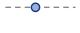</td><td>9.3</td><td>2.6</td><td>BB</td><td>8</td><td>-22</td><td>-47</td><td>59</td><td>0.30</td><td>2.07</td><td>3.50</td><td>0.03</td></tr><tr><td>Health Care</td><td>8.6</td><td>€ 37.6</td><td>293</td><td>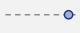</td><td>5.6</td><td>2.5</td><td>B</td><td>-1</td><td>-5</td><td>-48</td><td>27</td><td>0.34</td><td>0.69</td><td>2.29</td><td>1.33</td></tr><tr><td>Industrials</td><td>14.7</td><td>€ 64.6</td><td>296</td><td></td><td>5.6</td><td>2.8</td><td>BB</td><td>-2</td><td>-11</td><td>-44</td><td>10</td><td>0.45</td><td>0.94</td><td>2.30</td><td>0.68</td></tr><tr><td>TMT</td><td>20.1</td><td>€ 88.1</td><td>322</td><td></td><td>5.9</td><td>3.4</td><td>BB</td><td>-4</td><td>-6</td><td>-44</td><td>36</td><td>0.58</td><td>0.91</td><td>2.65</td><td>0.58</td></tr><tr><td>Technology</td><td>3.9</td><td>€ 17.1</td><td>427</td><td></td><td>7.0</td><td>3.7</td><td>BB</td><td>-7</td><td>-31</td><td>-59</td><td>48</td><td>0.66</td><td>1.25</td><td>2.85</td><td>-1.25</td></tr><tr><td>Telecommunications</td><td>16.2</td><td>€ 71.0</td><td>293</td><td></td><td>5.6</td><td>3.3</td><td>BB</td><td>-4</td><td>-2</td><td>-42</td><td>21</td><td>0.57</td><td>0.83</td><td>2.60</td><td>0.98</td></tr><tr><td>Financials</td><td>11.6</td><td>€ 50.9</td><td>368</td><td>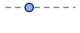</td><td>6.3</td><td>3.1</td><td>BB</td><td>-2</td><td>5</td><td>-44</td><td>41</td><td>0.49</td><td>0.30</td><td>2.20</td><td>0.05</td></tr><tr><td>Core Financials</td><td>4.3</td><td>€ 18.9</td><td>193</td><td></td><td>4.5</td><td>3.1</td><td>BB</td><td>-2</td><td>-13</td><td>-46</td><td>14</td><td>0.42</td><td>0.74</td><td>2.09</td><td>0.60</td></tr><tr><td>Financial Services</td><td>1.6</td><td>€ 7.1</td><td>898</td><td></td><td>11.6</td><td>2.0</td><td>B</td><td>5</td><td>186</td><td>217</td><td>296</td><td>0.30</td><td>-2.33</td><td>-1.50</td><td>-2.86</td></tr><tr><td>Real Estate</td><td>5.7</td><td>€ 24.9</td><td>400</td><td></td><td>6.6</td><td>3.4</td><td>BB</td><td>-4</td><td>-1</td><td>-65</td><td>22</td><td>0.60</td><td>0.72</td><td>3.36</td><td>0.51</td></tr><tr><td>Index</td><td>100.0</td><td>€ 439.2</td><td>319</td><td></td><td>5.8</td><td>2.9</td><td>BB</td><td>-1</td><td>-10</td><td>-50</td><td>17</td><td>0.45</td><td>0.87</td><td>2.64</td><td>1.02</td></tr><tr><td></td><td></td><td></td><td></td><td>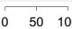</td><td></td><td></td><td></td><td></td><td></td><td></td><td></td><td></td><td></td><td></td><td></td></tr></table>

Source: iBoxx, GS Global Investment Research

# Performance dashboard: USD Credit ETFs

Exhibit 27: USD ETF performance 

<table><tr><td>Sector</td><td>ETF Ticker</td><td>AUM</td><td>Weekly Flow ($Mn.)</td><td>YTD cum flow (% of AUM)</td><td>Shares Outstanding (Mn.)</td><td>Short Interest (%)</td><td>Price</td><td>% NAV Premium</td><td>YTD Total Return</td><td>QTD Total Return</td><td>MTD Total Return</td><td>Benchmark Index</td></tr><tr><td rowspan="9">Investment Grade</td><td>LQD</td><td>$29.61B</td><td>282</td><td>0.5%</td><td>272</td><td>19.34</td><td>109.19</td><td>0.05%</td><td>0.6</td><td>1.0</td><td>0.7</td><td>iBoxx USD Liquid Investment Grade Index</td></tr><tr><td>VCSH</td><td>$43.08B</td><td>32</td><td>23.0%</td><td>545</td><td>0.91</td><td>79.12</td><td>0.04%</td><td>0.7</td><td>0.5</td><td>0.2</td><td>Bloomberg BARC US Corporate 1-5 Yrs Total Return Index Value Unhedged</td></tr><tr><td>VCIT</td><td>$66.1B</td><td>248</td><td>33.1%</td><td>801</td><td>2.27</td><td>82.73</td><td>0.06%</td><td>0.3</td><td>0.8</td><td>0.2</td><td>Bloomberg BARC US Credit Corporate 5-10 Yrs Total Return Index Value Unhedged</td></tr><tr><td>FLOT</td><td>$9.51B</td><td>112</td><td>25.2%</td><td>187</td><td>--</td><td>51.04</td><td>0.10%</td><td>1.7</td><td>0.9</td><td>0.4</td><td>Bloomberg BARC US FRN &lt; 5 yr Total Return Index Value Unhedged</td></tr><tr><td>IGSB</td><td>$22.B</td><td>-32</td><td>4.2%</td><td>420</td><td>0.73</td><td>52.48</td><td>0.01%</td><td>0.7</td><td>0.6</td><td>0.2</td><td>ICE BofAML 1-5 Year US Corporate Bond Index</td></tr><tr><td>IGIB</td><td>$18.09B</td><td>-3</td><td>20.0%</td><td>341</td><td>1.88</td><td>53.21</td><td>0.02%</td><td>0.4</td><td>0.8</td><td>0.3</td><td>Bloomberg BARC U.S. Interm</td></tr><tr><td>SPSB</td><td>$10.22B</td><td>51</td><td>22.7%</td><td>340</td><td>1.70</td><td>30.04</td><td>0.02%</td><td>0.9</td><td>0.6</td><td>0.2</td><td>Bloomberg BARC US Corporate 1-3 Yrs Total Return Index Value Unhedged</td></tr><tr><td>SPIB</td><td>$11.65B</td><td>307</td><td>16.3%</td><td>348</td><td>3.35</td><td>33.50</td><td>0.06%</td><td>0.5</td><td>0.6</td><td>0.2</td><td>Bloomberg BARC Intermediate Corporate Total Return Index Value Unhedged</td></tr><tr><td>VCLT</td><td>$8.5B</td><td>-16</td><td>-37.8%</td><td>114</td><td>23.86</td><td>75.30</td><td>0.25%</td><td>1.1</td><td>1.7</td><td>1.4</td><td>Bloomberg BARC Long U.S. Corporate Total Return Index Value Unhedged</td></tr><tr><td rowspan="8">High Yield</td><td>HYG</td><td>$15.88B</td><td>-495</td><td>6.3%</td><td>198</td><td>42.22</td><td>80.21</td><td>0.12%</td><td>1.5</td><td>1.8</td><td>0.3</td><td>iBoxx USD Liquid High Yield Index</td></tr><tr><td>JNK</td><td>$7.68B</td><td>0</td><td>-0.1%</td><td>80</td><td>11.06</td><td>96.64</td><td>0.10%</td><td>1.6</td><td>2.1</td><td>0.3</td><td>Bloomberg BARC VLI: High Yield Total Return Index Value Unhedged USD</td></tr><tr><td>SJNK</td><td>$4.76B</td><td>15</td><td>2.5%</td><td>190</td><td>2.36</td><td>25.12</td><td>0.12%</td><td>1.5</td><td>1.7</td><td>0.2</td><td>Bloomberg BARC US High Yield 350M Cash 0-5yr 2% Cap Total Return Index</td></tr><tr><td>SHYG</td><td>$7.57B</td><td>0</td><td>22.9%</td><td>178</td><td>0.64</td><td>42.55</td><td>0.08%</td><td>1.6</td><td>1.7</td><td>0.3</td><td>Markit iBoxx USD Liquid High Yield 0-5 Total Return Index</td></tr><tr><td>HYS</td><td>$1.68B</td><td>0</td><td>28.4%</td><td>18</td><td>0.04</td><td>93.76</td><td>-0.02%</td><td>1.3</td><td>1.7</td><td>0.4</td><td>ICE BofAML 0-5 Year US High Yield Constrained Index</td></tr><tr><td>HYLS</td><td>$1.64B</td><td>2</td><td>0.9%</td><td>40</td><td>0.22</td><td>40.86</td><td>-0.01%</td><td>0.4</td><td>1.8</td><td>0.3</td><td>ICE BofAML US High Yield Constrained Index</td></tr><tr><td>ANGL</td><td>$3.08B</td><td>-7</td><td>-0.7%</td><td>106</td><td>0.94</td><td>29.16</td><td>0.06%</td><td>1.4</td><td>2.7</td><td>0.2</td><td>ICE BofAML US Fallen Angel High Yield Index</td></tr><tr><td>BKLN</td><td>$7.16B</td><td>-90</td><td>-20.3%</td><td>348</td><td>24.59</td><td>20.48</td><td>-0.17%</td><td>0.1</td><td>1.4</td><td>0.0</td><td>S&amp;P/LSTA U.S. Leveraged Loan 100 Index</td></tr><tr><td rowspan="4">Loans</td><td>SRLN</td><td>$5.25B</td><td>0</td><td>-30.7%</td><td>129</td><td>6.62</td><td>40.58</td><td>-0.09%</td><td>0.7</td><td>2.3</td><td>0.5</td><td>Markit iBoxx USD Liquid Leverage Loans Total Return Index</td></tr><tr><td>FTSL</td><td>$2.3B</td><td>0</td><td>6.8%</td><td>51</td><td>0.16</td><td>44.97</td><td>0.07%</td><td>0.6</td><td>1.4</td><td>0.3</td><td>S&amp;P/LSTA US Leveraged Loan 100 Market Value Index</td></tr><tr><td>EMB</td><td>$14.09B</td><td>67</td><td>-4.6%</td><td>147</td><td>11.55</td><td>96.21</td><td>0.36%</td><td>1.7</td><td>3.4</td><td>0.9</td><td>JPM EMBI Global Core Index</td></tr><tr><td>EMLC</td><td>$4.85B</td><td>0</td><td>78.0%</td><td>191</td><td>1.34</td><td>25.57</td><td>-0.05%</td><td>1.0</td><td>2.9</td><td>0.6</td><td>JPM Government Bond Index Emerging Markets Global Core Index</td></tr><tr><td rowspan="5">CLOs</td><td>JAAA</td><td>$27.32B</td><td>109</td><td>64.7%</td><td>539</td><td>17.34</td><td>50.71</td><td>0.04%</td><td>1.8</td><td>1.1</td><td>0.4</td><td rowspan="5"></td></tr><tr><td>PAAA</td><td>$10.11B</td><td>538</td><td>494.4%</td><td>196</td><td>--</td><td>51.50</td><td>0.02%</td><td>2.0</td><td>1.0</td><td>0.4</td></tr><tr><td>JBBB</td><td>$1.2B</td><td>19</td><td>-11.7%</td><td>25</td><td>--</td><td>47.55</td><td>0.25%</td><td>1.7</td><td>2.5</td><td>0.4</td></tr><tr><td>CLOI</td><td>$1.34B</td><td>11</td><td>68.9%</td><td>25</td><td>11.22</td><td>52.95</td><td>0.00%</td><td>1.9</td><td>1.3</td><td>0.6</td></tr><tr><td>CLOA</td><td>$2.15B</td><td>16</td><td>229.1%</td><td>41</td><td>--</td><td>51.98</td><td>-0.02%</td><td>2.0</td><td>1.0</td><td>0.4</td></tr></table>

Source: Bloomberg, data compiled by GS Global Investment Research

# Performance dashboard: Bond-level dispersion

Note: Spread dispersion is the inter-decile range divided by the median across the bond index constituents and return dispersion is the inter-decile range of 10-day returns divided by the median across the bond index constituents.

Exhibit 28: USD spread dispersion   
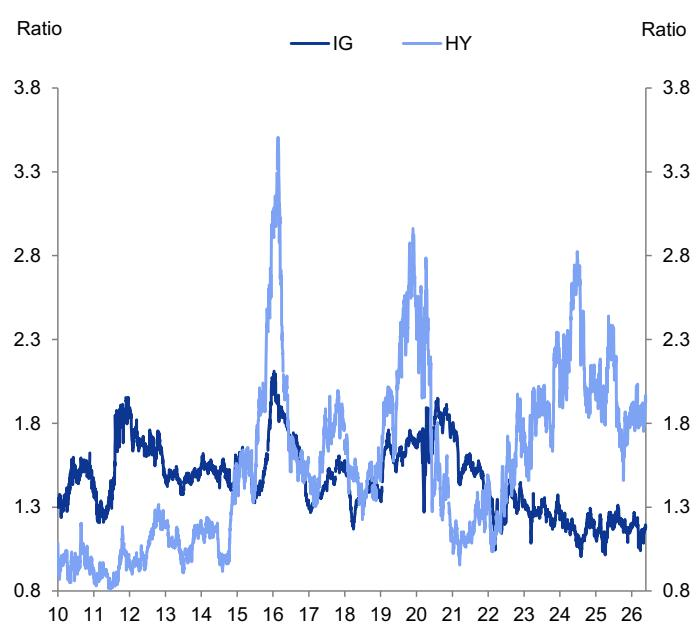

line

| Year | IG    | HY    |
|------|-------|-------|
| 10   | 1.3   | 1.0   |
| 11   | 1.4   | 0.9   |
| 12   | 1.5   | 1.0   |
| 13   | 1.4   | 1.1   |
| 14   | 1.3   | 1.0   |
| 15   | 1.4   | 1.1   |
| 16   | 1.5   | 3.4   |
| 17   | 1.3   | 1.2   |
| 18   | 1.4   | 1.3   |
| 19   | 1.5   | 1.4   |
| 20   | 1.6   | 2.8   |
| 21   | 1.5   | 2.0   |
| 22   | 1.4   | 1.8   |
| 23   | 1.3   | 2.0   |
| 24   | 1.2   | 2.8   |
| 25   | 1.1   | 2.6   |
| 26   | 1.0   | 2.0   |

Source: iBoxx, GS Global Investment Research

Exhibit 29: EUR spread dispersion   
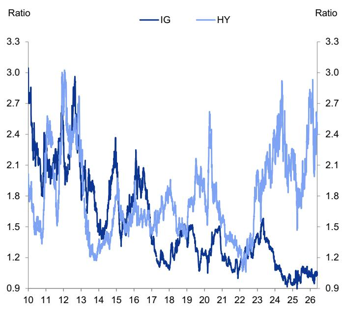

line

| Index | IG    | HY    |
|-------|-------|-------|
| 10    | 3.0   | 1.8   |
| 11    | 2.4   | 1.5   |
| 12    | 3.0   | 2.7   |
| 13    | 2.1   | 1.2   |
| 14    | 1.5   | 1.0   |
| 15    | 2.4   | 1.8   |
| 16    | 2.1   | 1.6   |
| 17    | 1.8   | 1.4   |
| 18    | 1.5   | 1.2   |
| 19    | 1.6   | 1.5   |
| 20    | 1.4   | 2.7   |
| 21    | 1.3   | 1.6   |
| 22    | 1.2   | 1.4   |
| 23    | 1.5   | 2.0   |
| 24    | 1.0   | 2.8   |
| 25    | 0.9   | 2.6   |
| 26    | 0.9   | 2.9   |

Source: iBoxx, GS Global Investment Research

Exhibit 30: USD return dispersion   
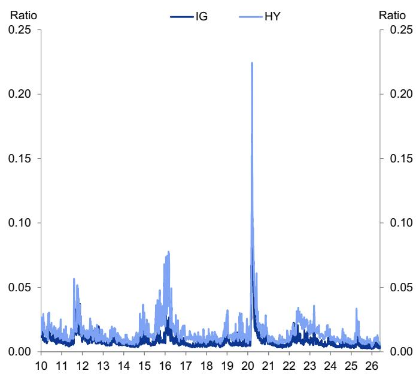

line

| X  | IG    | HY    |
|----|-------|-------|
| 10 | 0.01  | 0.03  |
| 11 | 0.01  | 0.05  |
| 12 | 0.01  | 0.07  |
| 13 | 0.01  | 0.04  |
| 14 | 0.01  | 0.03  |
| 15 | 0.01  | 0.06  |
| 16 | 0.01  | 0.08  |
| 17 | 0.01  | 0.04  |
| 18 | 0.01  | 0.03  |
| 19 | 0.01  | 0.05  |
| 20 | 0.01  | 0.23  |
| 21 | 0.01  | 0.06  |
| 22 | 0.01  | 0.04  |
| 23 | 0.01  | 0.03  |
| 24 | 0.01  | 0.04  |
| 25 | 0.01  | 0.03  |
| 26 | 0.01  | 0.02  |

Source: iBoxx, GS Global Investment Research

Exhibit 31: EUR return dispersion   
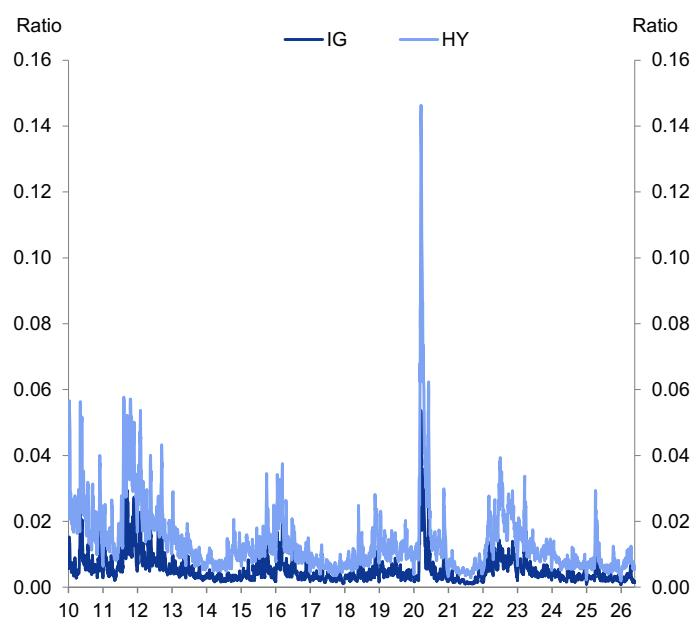

line

| X  | IG    | HY    |
|----|-------|-------|
| 10 | 0.015 | 0.055 |
| 11 | 0.018 | 0.040 |
| 12 | 0.025 | 0.058 |
| 13 | 0.022 | 0.045 |
| 14 | 0.019 | 0.035 |
| 15 | 0.017 | 0.028 |
| 16 | 0.020 | 0.038 |
| 17 | 0.016 | 0.025 |
| 18 | 0.014 | 0.022 |
| 19 | 0.013 | 0.028 |
| 20 | 0.012 | 0.145 |
| 21 | 0.011 | 0.065 |
| 22 | 0.013 | 0.040 |
| 23 | 0.014 | 0.035 |
| 24 | 0.012 | 0.030 |
| 25 | 0.011 | 0.032 |
| 26 | 0.010 | 0.015 |

Source: iBoxx, GS Global Investment Research

# Relative value dashboard: Excess spreads in the USD and EUR markets

Exhibit 32: USD/EUR IG and HY spread differential   
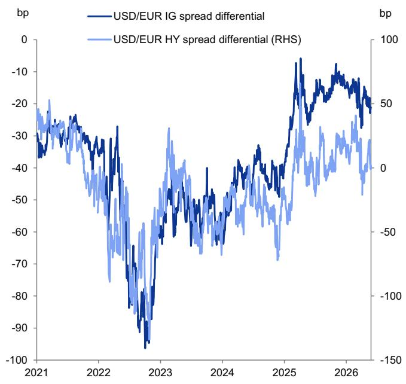

line

| Year | USD/EUR IG spread differential | USD/EUR HY spread differential (RHS) |
|------|--------------------------------|-------------------------------------|
| 2021 | -30                            | -20                                 |
| 2022 | -40                            | -30                                 |
| 2023 | -90                            | -80                                 |
| 2024 | -50                            | -40                                 |
| 2025 | -10                            | -5                                  |
| 2026 | -20                            | -10                                 |

Source: iBoxx, GS Global Investment Research

Exhibit 33: CDX IG/iTraxx Main and CDX HY/iTraxx Xover spread differential   
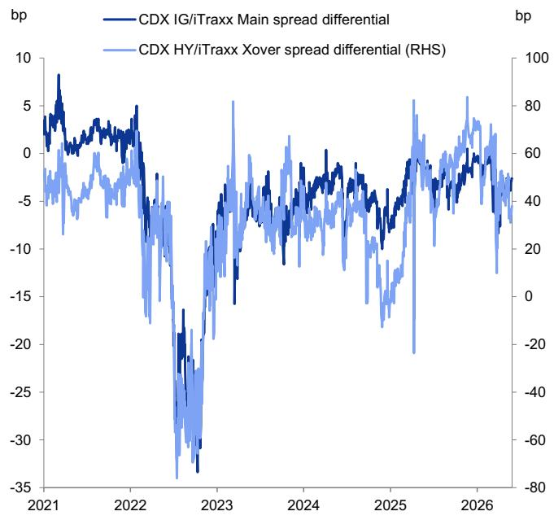

line

| Year | CDX IG/iTraxx Main spread differential | CDX HY/iTraxx Xover spread differential (RHS) |
|------|----------------------------------------|-----------------------------------------------|
| 2021 | ~8                                     | ~-5                                           |
| 2022 | ~5                                     | ~-10                                          |
| 2023 | ~-15                                   | ~-30                                          |
| 2024 | ~-5                                    | ~-10                                          |
| 2025 | ~-10                                   | ~-15                                          |
| 2026 | ~-5                                    | ~-10                                          |

Source: Bloomberg, GS Global Investment Research

Exhibit 34: IG OAS/Agency MBS spread differential   
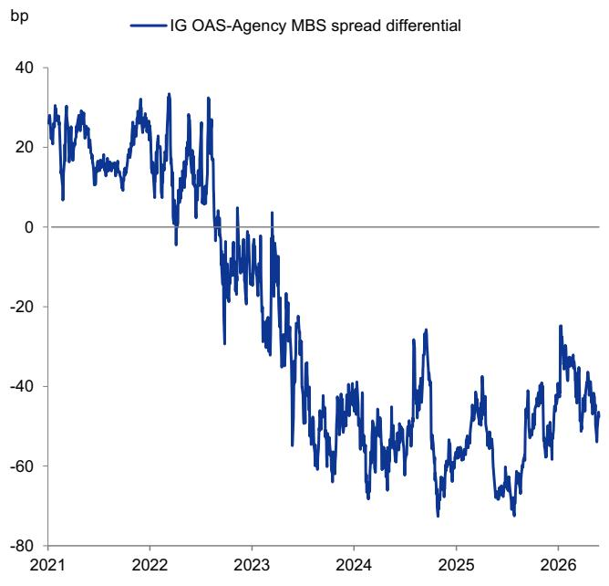

line

| Year | IG OAS-Agency MBS spread differential (bp) |
| ---- | ------------------------------------------ |
| 2021 | ~30                                        |
| 2022 | ~35                                        |
| 2023 | ~-10                                       |
| 2024 | ~-40                                       |
| 2025 | ~-70                                       |
| 2026 | ~-30                                       |

Source: Bloomberg, GS Global Investment Research

Exhibit 35: Leveraged loans/HY spread differential   
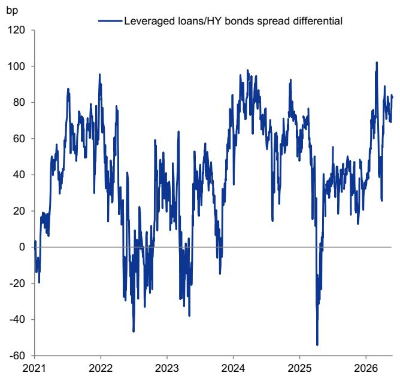

line

| Year | Leveraged loans/HY bonds spread differential (bp) |
| ---- | ----------------------------------------------- |
| 2021 | -10                                             |
| 2022 | 95                                              |
| 2023 | -40                                             |
| 2024 | 85                                              |
| 2025 | -50                                             |
| 2026 | 100                                             |

Source: Bloomberg, Morningstar LCD, GS Global Investment Research

# Performance dashboard: Biggest movers in the USD bond market

Exhibit 36: Top and bottom 20 performers in the USD IG market 

<table><tr><td>Issuer</td><td>Sector</td><td>Security</td><td>Amount outstanding ($mn)</td><td>Ratings (Moody&#x27;s/S&amp;P/Fitch)</td><td>1-week price return (%)</td><td>1-week price change (pts)</td><td>Current price</td></tr><tr><td colspan="8">Top 20 performers</td></tr><tr><td>Arcelormittal</td><td>Iron/Steel</td><td>MTNA 7 10/15/39</td><td>686</td><td>Baa2/BBB/--</td><td>3.6%</td><td>4.0</td><td>113.54</td></tr><tr><td>Intel Corp</td><td>Semiconductors</td><td>INTC 3.1 02/15/60</td><td>1,000</td><td>Baa2/BBB/BBB</td><td>3.4%</td><td>2.0</td><td>56.63</td></tr><tr><td>Toledo Hospital/The</td><td>Healthcare-Services</td><td>TOLHOS 5 3/4 11/15/38</td><td>500</td><td>A1/AA/--</td><td>3.3%</td><td>3.3</td><td>97.86</td></tr><tr><td>Oracle Corp</td><td>Software</td><td>ORCL 6 1/2 04/15/38</td><td>1,250</td><td>Baa2/BBB/BBB</td><td>3.3%</td><td>3.3</td><td>100.84</td></tr><tr><td>Comcast Corp</td><td>Media</td><td>CMCSA 5.65 06/01/54</td><td>1,200</td><td>A3/A-/A-</td><td>3.1%</td><td>2.8</td><td>90.79</td></tr><tr><td>Ally Financial Inc</td><td>Diversified Finan Serv</td><td>ALLY 6.184 07/26/35</td><td>750</td><td>Baa3/BBB-/BBB-</td><td>2.8%</td><td>2.8</td><td>101.15</td></tr><tr><td>At&amp;T Inc</td><td>Telecommunications</td><td>T 6 04/30/56</td><td>1,650</td><td>Baa2/BBB/BBB+</td><td>2.7%</td><td>2.7</td><td>96.82</td></tr><tr><td>Ibm Corp</td><td>Computers</td><td>IBM 5.8 02/03/56</td><td>750</td><td>A3/A-/A-</td><td>2.7%</td><td>2.6</td><td>95.66</td></tr><tr><td>Vale Overseas Limited</td><td>Iron/Steel</td><td>VALEBZ 8 1/4 01/17/34</td><td>335</td><td>--/--/--</td><td>2.6%</td><td>3.0</td><td>116.64</td></tr><tr><td>Las Vegas Sands Corp</td><td>Lodging</td><td>LVS 6.2 08/15/34</td><td>500</td><td>Baa3/BBB-/BBB</td><td>2.6%</td><td>2.6</td><td>102.16</td></tr><tr><td>American Honda Finance</td><td>Auto Manufacturers</td><td>HNDA 4.9 01/10/34</td><td>750</td><td>A3/BBB+/A-</td><td>2.5%</td><td>2.5</td><td>97.67</td></tr><tr><td>Micron Technology Inc</td><td>Semiconductors</td><td>MU 6.05 11/01/35</td><td>221</td><td>Baa2/BBB/BBB+</td><td>2.5%</td><td>2.6</td><td>103.07</td></tr><tr><td>Comcast Corp</td><td>Media</td><td>CMCSA 7.05 03/15/33</td><td>750</td><td>A3/A-/A-</td><td>2.3%</td><td>2.6</td><td>111.07</td></tr><tr><td>Equitable Holdings Inc</td><td>Insurance</td><td>EQH 6.7 03/28/55</td><td>500</td><td>Baa2/BBB/--</td><td>2.3%</td><td>2.4</td><td>103.04</td></tr><tr><td>Amazon.Com Inc</td><td>Internet</td><td>AMZN 2 1/2 06/03/50</td><td>2,500</td><td>A1/AA/AA-</td><td>2.3%</td><td>1.3</td><td>57.57</td></tr><tr><td>Oneok Inc</td><td>Pipelines</td><td>OKE 5.05 11/01/34</td><td>1,600</td><td>Baa2/BBB/BBB</td><td>2.3%</td><td>2.3</td><td>97.60</td></tr><tr><td>American Electric Power</td><td>Electric</td><td>AEP 5.8 03/15/56</td><td>1,500</td><td>Baa3/BBB-/BB+</td><td>2.3%</td><td>2.3</td><td>99.52</td></tr><tr><td>Sempra</td><td>Electric</td><td>SRE 6 3/8 04/01/56</td><td>800</td><td>Baa3/BBB-/BBB-</td><td>2.3%</td><td>2.3</td><td>100.25</td></tr><tr><td>Apollo Global Management</td><td>Diversified Finan Serv</td><td>APO 5.15 08/12/35</td><td>850</td><td>A2/A/A</td><td>2.1%</td><td>2.0</td><td>97.23</td></tr><tr><td>Salesforce Inc</td><td>Software</td><td>CRM 6.7 03/15/66</td><td>1,000</td><td>A2/A+/-</td><td>2.1%</td><td>2.1</td><td>100.96</td></tr><tr><td colspan="8">Bottom 20 performers</td></tr><tr><td>Concentrix Corp</td><td>Software</td><td>CNXC 6.85 08/02/33</td><td>550</td><td>Baa3/BBB-/BBB</td><td>-2.4%</td><td>-2.2</td><td>92.79</td></tr><tr><td>Dow Chemical Co/The</td><td>Chemicals</td><td>DOW 9.4 05/15/39</td><td>503</td><td>Baa3/BBB-/BBB</td><td>-1.4%</td><td>-1.9</td><td>131.13</td></tr><tr><td>Meta Platforms Inc</td><td>Internet</td><td>META 5.6 05/15/53</td><td>2,500</td><td>Aa3/AA-/--</td><td>-1.4%</td><td>-1.3</td><td>93.06</td></tr><tr><td>Pfizer Inc</td><td>Pharmaceuticals</td><td>PFE 7.2 03/15/39</td><td>2,500</td><td>A2/A/--</td><td>-1.3%</td><td>-1.5</td><td>118.14</td></tr><tr><td>Duke Energy Florida Llc</td><td>Electric</td><td>DUK 4.2 12/01/30</td><td>500</td><td>A1/A/--</td><td>-1.2%</td><td>-1.2</td><td>99.55</td></tr><tr><td>BARC Plc</td><td>Banks</td><td>BACR 5.367 02/25/31</td><td>1,750</td><td>Baa1/BBB+/A</td><td>-1.2%</td><td>-1.2</td><td>102.70</td></tr><tr><td>Ford Motor Credit Co Llc</td><td>Auto Manufacturers</td><td>F 5.73 09/05/30</td><td>1,250</td><td>Ba1/BBB-/BBB-</td><td>-1.2%</td><td>-1.2</td><td>102.06</td></tr><tr><td>Oracle Corp</td><td>Software</td><td>ORCL 5 1/2 08/03/35</td><td>1,750</td><td>Baa2/BBB/BBB</td><td>-1.1%</td><td>-1.0</td><td>97.22</td></tr><tr><td>JEF Fin Group Inc</td><td>Diversified Finan Serv</td><td>JEF 4.15 01/23/30</td><td>1,000</td><td>Baa2/BBB/BBB+</td><td>-0.9%</td><td>-0.9</td><td>97.67</td></tr><tr><td>American Honda Finance</td><td>Auto Manufacturers</td><td>HNDA 5 1/8 07/07/28</td><td>800</td><td>A3/BBB+/A-</td><td>-0.9%</td><td>-0.9</td><td>101.91</td></tr><tr><td>American Express Co</td><td>Diversified Finan Serv</td><td>AXP 4.918 07/20/33</td><td>1,750</td><td>A2/A-/A</td><td>-0.9%</td><td>-0.9</td><td>100.79</td></tr><tr><td>Chevron Usa Inc</td><td>Oil&amp;Gas</td><td>CVX 4 1/2 10/15/32</td><td>1,250</td><td>Aa2/AA-/--</td><td>-0.9%</td><td>-0.9</td><td>100.80</td></tr><tr><td>Chevron Usa Inc</td><td>Oil&amp;Gas</td><td>CVX 4.98 04/15/35</td><td>750</td><td>Aa2/AA-/--</td><td>-0.8%</td><td>-0.8</td><td>101.73</td></tr><tr><td>Mcdonald&#x27;S Corp</td><td>Retail</td><td>MCD 5.15 09/09/52</td><td>750</td><td>Baa1/BBB+/-</td><td>-0.8%</td><td>-0.7</td><td>91.79</td></tr><tr><td>Charles Schwab Corp</td><td>Diversified Finan Serv</td><td>SCHW 4.914 11/14/36</td><td>1,000</td><td>A2/A-/A</td><td>-0.8%</td><td>-0.7</td><td>97.70</td></tr><tr><td>Salesforce Inc</td><td>Software</td><td>CRM 5.55 03/15/36</td><td>4,500</td><td>A2/A+/-</td><td>-0.7%</td><td>-0.7</td><td>100.75</td></tr><tr><td>Johnson &amp; Johnson</td><td>Pharmaceuticals</td><td>JNJ 4 3/8 12/05/33</td><td>850</td><td>Aaa/AAA/--</td><td>-0.7%</td><td>-0.7</td><td>100.20</td></tr><tr><td>Us Bancorp</td><td>Banks</td><td>USB 4.967 07/22/33</td><td>1,300</td><td>A3/A-/A-</td><td>-0.7%</td><td>-0.7</td><td>99.61</td></tr><tr><td>Natwest Group Plc</td><td>Banks</td><td>NWG 3.032 11/28/35</td><td>850</td><td>Baa1/BBB+/A-</td><td>-0.7%</td><td>-0.6</td><td>91.72</td></tr><tr><td>Citi Inc</td><td>Banks</td><td>C 4 1/8 07/25/28</td><td>2,100</td><td>Baa2/BBB/BBB+</td><td>-0.7%</td><td>-0.7</td><td>99.85</td></tr></table>

Note: Only Bloomberg index-eligible bonds.   
Source: Bloomberg, TRACE, data compiled by GS Global Investment Research

Exhibit 37: Top and bottom 20 performers in the USD HY market 

<table><tr><td>Issuer</td><td>Sector</td><td>Security</td><td>Amount outstanding ($mn)</td><td>Ratings (Moody&#x27;s/S&amp;P/Fitch)</td><td>1-week price return (%)</td><td>1-week price change (pts)</td><td>Current price</td></tr><tr><td colspan="8">Top 20 performers</td></tr><tr><td>Cd&amp;R Smokey / Radio Sys</td><td>Housewares</td><td>PETSAF 9 1/2 10/15/29</td><td>775</td><td>B3/B-/--</td><td>17.9%</td><td>9.1</td><td>51.00</td></tr><tr><td>Jeldwen Holding</td><td>Building Materials</td><td>JELD 7 09/01/32</td><td>350</td><td>Caa2/CCC/--</td><td>9.2%</td><td>5.3</td><td>57.25</td></tr><tr><td>Newfold Digital Hldgs Gr</td><td>Internet</td><td>EIGI 11 3/4 04/30/29</td><td>319</td><td>--/--/BB-</td><td>8.6%</td><td>6.5</td><td>75.50</td></tr><tr><td>Macy&#x27;S Retail Hldgs Llc</td><td>Retail</td><td>M 5 1/8 01/15/42</td><td>250</td><td>Ba2/BB+/BBB-</td><td>3.6%</td><td>2.8</td><td>75.38</td></tr><tr><td>Getty Images Inc</td><td>Internet</td><td>ABEGET 11 1/4 02/21/30</td><td>540</td><td>B3/B+/-</td><td>3.1%</td><td>2.5</td><td>81.50</td></tr><tr><td>Cnt Pmt/Cdk Glo li/Fin</td><td>Software</td><td>CDK 8 06/15/29</td><td>755</td><td>B3/B-/--</td><td>2.9%</td><td>1.5</td><td>50.54</td></tr><tr><td>S&amp;S Holdings Llc</td><td>Distribution/Wholesale</td><td>SSACTI 8 3/8 10/01/31</td><td>600</td><td>B3/B-/--</td><td>2.7%</td><td>2.5</td><td>93.27</td></tr><tr><td>Unisys Corp</td><td>Computers</td><td>UIS 10 5/8 01/15/31</td><td>700</td><td>B2/B+/-</td><td>2.6%</td><td>2.4</td><td>94.10</td></tr><tr><td>Fmc Corp</td><td>Chemicals</td><td>FMC 6 3/8 05/18/53</td><td>500</td><td>Ba2/BB+/BB+</td><td>2.2%</td><td>1.7</td><td>76.50</td></tr><tr><td>Alta Equipment Group</td><td>Commercial Services</td><td>ALTG 9 06/01/29</td><td>500</td><td>Caa1/B-/--</td><td>2.1%</td><td>2.0</td><td>92.79</td></tr><tr><td>Harrow Inc</td><td>Pharmaceuticals</td><td>HROW 8 5/8 09/15/30</td><td>300</td><td>B3/--/B</td><td>1.9%</td><td>1.9</td><td>99.82</td></tr><tr><td>Fmc Corp</td><td>Chemicals</td><td>FMC 5.65 05/18/33</td><td>500</td><td>Ba2/BB+/BB+</td><td>1.9%</td><td>1.7</td><td>89.25</td></tr><tr><td>Cleveland-Cliffs Inc</td><td>Iron/Steel</td><td>CLF 4 7/8 03/01/31</td><td>325</td><td>B2/--/B+</td><td>1.9%</td><td>1.8</td><td>91.70</td></tr><tr><td>Embecta Corp</td><td>Healthcare-Products</td><td>EMBC 6 3/4 02/15/30</td><td>200</td><td>B3/B/--</td><td>1.8%</td><td>1.5</td><td>81.25</td></tr><tr><td>Fmc Corp</td><td>Chemicals</td><td>FMC 4 1/2 10/01/49</td><td>500</td><td>Ba2/BB+/BB+</td><td>1.8%</td><td>1.1</td><td>61.39</td></tr><tr><td>Masterbrand Inc</td><td>Building Materials</td><td>MASBRA 7 07/15/32</td><td>700</td><td>B1/BB/BB+</td><td>1.7%</td><td>1.7</td><td>97.33</td></tr><tr><td>Specialty Building Produ</td><td>Retail</td><td>SBPLLC 7 3/4 10/15/29</td><td>510</td><td>Caa1/B-/--</td><td>1.6%</td><td>1.5</td><td>90.50</td></tr><tr><td>Bausch Health Cos Inc</td><td>Pharmaceuticals</td><td>BHCCN 6 1/4 02/15/29</td><td>821</td><td>Ca/CCC+/-</td><td>1.6%</td><td>1.2</td><td>71.09</td></tr><tr><td>Cable One Inc</td><td>Media</td><td>CABO 4 11/15/30</td><td>548</td><td>B3/B/--</td><td>1.6%</td><td>1.0</td><td>63.50</td></tr><tr><td>Uwm Holdings Llc</td><td>Diversified Finan Serv</td><td>UWMC 6 1/4 03/15/31</td><td>1,000</td><td>Ba3/--/BB-</td><td>1.6%</td><td>1.4</td><td>89.87</td></tr><tr><td colspan="8">Bottom 20 performers</td></tr><tr><td>Cntrl Parent/Cdk Glb Inc</td><td>Software</td><td>CDK 7 1/4 06/15/29</td><td>750</td><td>B3/B-/--</td><td>-27.2%</td><td>-19.0</td><td>70.00</td></tr><tr><td>Embarq Llc</td><td>Telecommunications</td><td>EMBARQ 7.995 06/01/36</td><td>1,215</td><td>Ca/CCC-/--</td><td>-10.2%</td><td>-3.1</td><td>30.08</td></tr><tr><td>Liberty Interactive Llc</td><td>Retail</td><td>LINTA 8 1/4 02/01/30</td><td>504</td><td>WR/D/--</td><td>-4.4%</td><td>-0.3</td><td>5.81</td></tr><tr><td>Csc Holdings Llc</td><td>Media</td><td>CSCHLD 5 3/8 02/01/28</td><td>1,000</td><td>Caa2/CCC+/-</td><td>-3.0%</td><td>-2.0</td><td>66.00</td></tr><tr><td>Csc Holdings Llc</td><td>Media</td><td>CSCHLD 11 3/4 01/31/29</td><td>2,050</td><td>Caa2/CCC+/-</td><td>-2.7%</td><td>-1.8</td><td>64.75</td></tr><tr><td>Lcpr Sr Secured Fin Dac</td><td>Media</td><td>LILAPR 5 1/8 07/15/29</td><td>820</td><td>Caa3/CCC+/CCC+</td><td>-2.4%</td><td>-1.5</td><td>64.00</td></tr><tr><td>Gray Media Inc</td><td>Media</td><td>GTN 5 3/8 11/15/31</td><td>1,220</td><td>Caa1/CCC/--</td><td>-2.4%</td><td>-1.8</td><td>74.25</td></tr><tr><td>Cerdia Finanz Gmbh</td><td>Chemicals</td><td>PLATIN 9 3/8 10/03/31</td><td>900</td><td>B2/B/--</td><td>-2.2%</td><td>-2.0</td><td>93.25</td></tr><tr><td>Paramount Global</td><td>Media</td><td>PARA 5.9 10/15/40</td><td>300</td><td>Baa3/BB+/BB+</td><td>-2.0%</td><td>-1.5</td><td>77.50</td></tr><tr><td>Whirlpool Corp</td><td>Home Furnishings</td><td>WHR 5.15 03/01/43</td><td>250</td><td>B1/BB-/BB-</td><td>-1.9%</td><td>-1.3</td><td>68.65</td></tr><tr><td>Whirlpool Corp</td><td>Home Furnishings</td><td>WHR 6 1/2 06/15/33</td><td>600</td><td>B1/BB-/BB-</td><td>-1.8%</td><td>-1.6</td><td>91.31</td></tr><tr><td>Whirlpool Corp</td><td>Home Furnishings</td><td>WHR 4.6 05/15/50</td><td>500</td><td>B1/BB-/BB-</td><td>-1.6%</td><td>-1.0</td><td>64.11</td></tr><tr><td>Zi Tech Llc/Zi Fin Corp</td><td>Software</td><td>ZMINFO 3 7/8 02/01/29</td><td>650</td><td>B1/B+/-</td><td>-1.6%</td><td>-1.3</td><td>79.25</td></tr><tr><td>Whirlpool Corp</td><td>Home Furnishings</td><td>WHR 6 1/8 06/15/30</td><td>600</td><td>B1/BB-/BB-</td><td>-1.6%</td><td>-1.5</td><td>95.25</td></tr><tr><td>Lcpr Sr Secured Fin Dac</td><td>Media</td><td>LILAPR 6 3/4 10/15/27</td><td>1,161</td><td>Caa3/CCC+/CCC+</td><td>-1.6%</td><td>-1.0</td><td>66.02</td></tr><tr><td>Ew Scripps Co</td><td>Media</td><td>SSP 9 7/8 08/15/30</td><td>750</td><td>Caa2/CCC+/CCC-</td><td>-1.5%</td><td>-1.5</td><td>98.00</td></tr><tr><td>Scripps Escrow li Inc</td><td>Media</td><td>SSP 5 3/8 01/15/31</td><td>392</td><td>Caa3/CCC-/CC</td><td>-1.4%</td><td>-1.0</td><td>72.40</td></tr><tr><td>Whirlpool Corp</td><td>Home Furnishings</td><td>WHR 5 1/2 03/01/33</td><td>300</td><td>B1/BB-/BB-</td><td>-1.1%</td><td>-1.0</td><td>84.47</td></tr><tr><td>Gray Media Inc</td><td>Media</td><td>GTN 4 3/4 10/15/30</td><td>790</td><td>Caa1/CCC/--</td><td>-1.1%</td><td>-0.8</td><td>76.32</td></tr><tr><td>Whirlpool Corp</td><td>Home Furnishings</td><td>WHR 4.7 05/14/32</td><td>300</td><td>B1/BB-/BB-</td><td>-1.1%</td><td>-0.9</td><td>83.75</td></tr></table>

Note: Only Bloomberg index-eligible bonds.   
Source: Bloomberg, TRACE, data compiled by GS Global Investment Research

# Valuation dashboard: Percentile ranks for spreads and yields

Exhibit 38: Percentile ranks for spreads across markets (2000-current)   
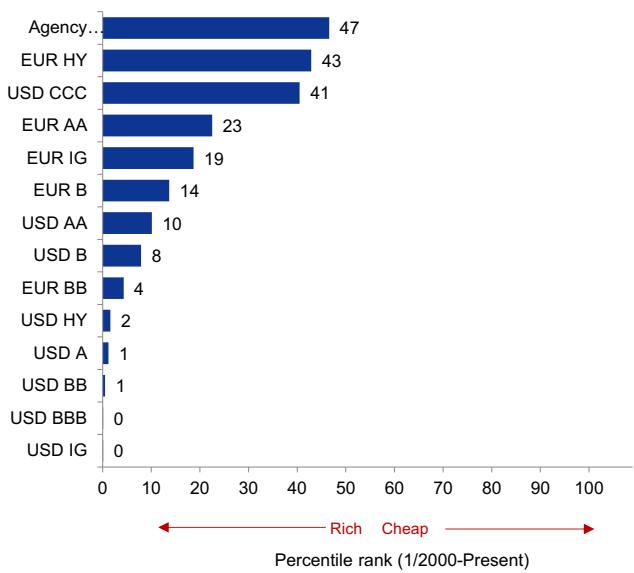

bar

| Currency Pair | Percentile Rank (1/2000-Present) |
|---|---|
| Agency... | 47 |
| EUR HY | 43 |
| USD CCC | 41 |
| EUR AA | 23 |
| EUR IG | 19 |
| EUR B | 14 |
| USD AA | 10 |
| USD B | 8 |
| EUR BB | 4 |
| USD HY | 2 |
| USD A | 1 |
| USD BB | 1 |
| USD BBB | 0 |
| USD IG | 0 |

Source: Bloomberg, GS Global Investment Research

Exhibit 39: Percentile ranks for spreads across markets (2010-current)   
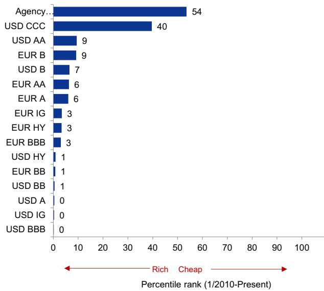

bar

| Currency | Percentile Rank (1/2010-Present) |
| :--- | :--- |
| Agency... | 54 |
| USD CCC | 40 |
| USD AA | 9 |
| EUR B | 9 |
| USD B | 7 |
| EUR AA | 6 |
| EUR A | 6 |
| EUR IG | 3 |
| EUR HY | 3 |
| EUR BBB | 3 |
| USD HY | 1 |
| EUR BB | 1 |
| USD BB | 1 |
| USD A | 0 |
| USD IG | 0 |
| USD BBB | 0 |

Source: Bloomberg, GS Global Investment Research

Exhibit 40: Percentile ranks for yields across markets (2000-current)   
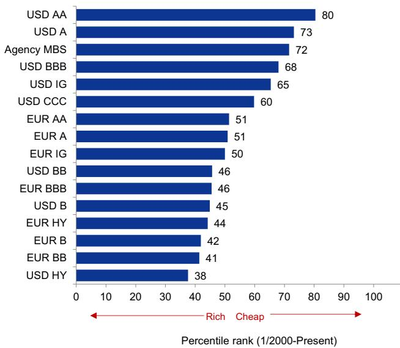

bar

| Currency | Percentile rank (1/2000-Present) |
| :--- | :--- |
| USD AA | 80 |
| USD A | 73 |
| Agency MBS | 72 |
| USD BBB | 68 |
| USD IG | 65 |
| USD CCC | 60 |
| EUR AA | 51 |
| EUR A | 51 |
| EUR IG | 50 |
| USD BB | 46 |
| EUR BBB | 46 |
| USD B | 45 |
| EUR HY | 44 |
| EUR B | 42 |
| EUR BB | 41 |
| USD HY | 38 |
Rich Cheap indicated between USD AA and USD BB; EUR BB is also listed below the chart.

Source: Bloomberg, GS Global Investment Research

Exhibit 41: Percentile ranks for yields across markets (2010-current)   
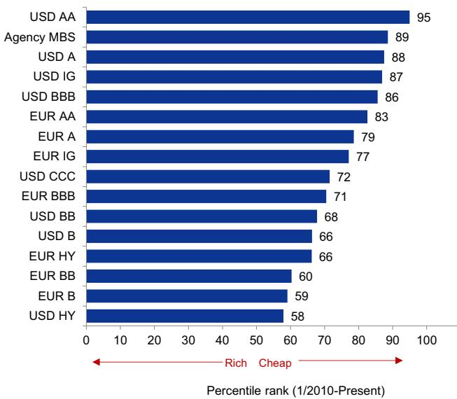

bar

| Currency Pair | Percentile Rank (1/2010-Present) |
|---|---|
| USD AA | 95 |
| Agency MBS | 89 |
| USD A | 88 |
| USD IG | 87 |
| USD BBB | 86 |
| EUR AA | 83 |
| EUR A | 79 |
| EUR IG | 77 |
| USD CCC | 72 |
| EUR BBB | 71 |
| USD BB | 68 |
| USD B | 66 |
| EUR HY | 66 |
| EUR BB | 60 |
| EUR B | 59 |
| USD HY | 58 |
Rich Cheap indicated between USD AA and EUR BB.

Source: Bloomberg, GS Global Investment Research

# Valuation dashboard: Sizing the carry in USD and EUR fixed income markets

Exhibit 42: Average yield vs. total market value outstanding across the USD fixed income complex   
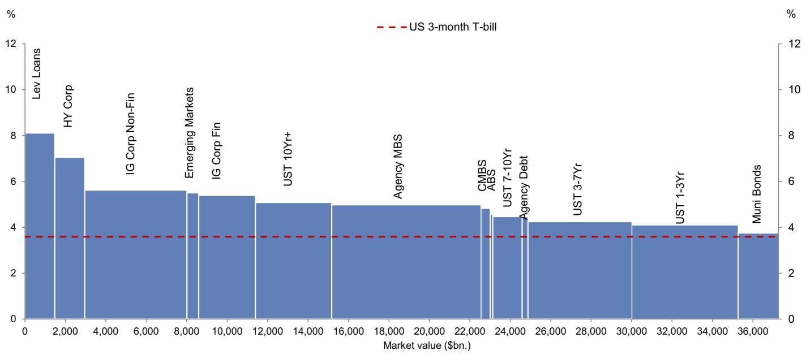

bar

| Category | Market value ($bn.) |
| :--- | :--- |
| Lev Loans | 8.1 |
| HY Corp | 7.0 |
| IG Corp Non-Fin | 5.6 |
| Emerging Markets | 5.5 |
| IG Corp Fin | 5.4 |
| UST 10Yr+ | 5.0 |
| Agency MBS | 4.9 |
| CMBS ABS | 4.8 |
| UST 7-10Yr | 4.4 |
| Agency Debt | 4.2 |
| UST 3-7Yr | 4.2 |
| UST 1-3Yr | 4.0 |
| Muni Bonds | 3.7 |

Note: We use the iBoxx indices for the IG corporate credit and US Treasury markets, the Bloomberg indices for the HY, MBS, CMBS and ABS markets, and the Morningstar LSTA index for the leveraged loan market.   
Source: iBoxx, Bloomberg, Pitchbook LCD, GS Global Investment Research

Exhibit 43: Average yield vs. total market value outstanding for the EUR fixed income markets   
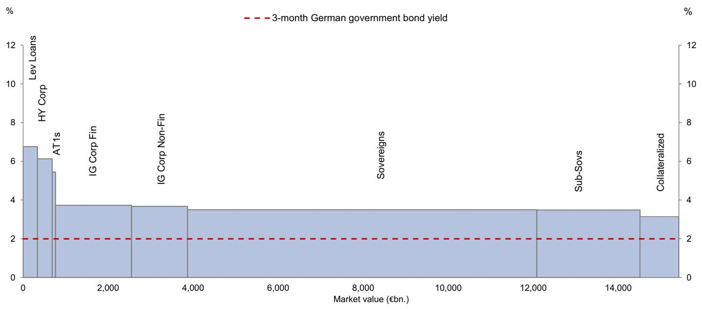

bar

| Category         | Market value (€bn.) |
| ---------------- | ------------------- |
| Lev Loans        | ~0.5                |
| HY Corp          | ~0.5                |
| AT1s             | ~0.5                |
| IG Corp Fin      | ~1.0                |
| IG Corp Non-Fin  | ~1.0                |
| Sovereigns       | ~1.0                |
| Sub-Sovs         | ~1.0                |
| Collateralized   | ~1.0                |

Source: iBoxx, GS Global Investment Research

# Valuation dashboard: Macro index volatility

Note: Skew is calculated using difference in 3m implied volatility between 25-delta payers and receivers, divided by 3m ATM implied volatility.

Exhibit 44: CDX IG and iTraxx Main vol 3m ATM implied volatility   
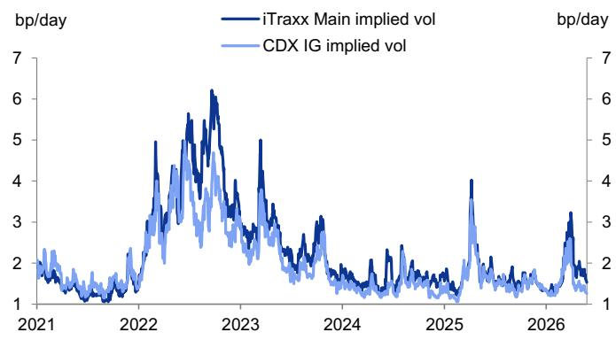

line

| Year | iTraxx Main implied vol (bp/day) | CDX IG implied vol (bp/day) |
|------|----------------------------------|-----------------------------|
| 2021 | ~1.5                             | ~1.8                        |
| 2022 | ~3.0                             | ~2.5                        |
| 2023 | ~6.0                             | ~4.5                        |
| 2024 | ~2.5                             | ~2.0                        |
| 2025 | ~4.0                             | ~3.5                        |
| 2026 | ~1.5                             | ~1.8                        |

Source: GS, GS Global Investment Research

Exhibit 45: CDX HY and iTraxx Xover vol 3m ATM implied volatility   
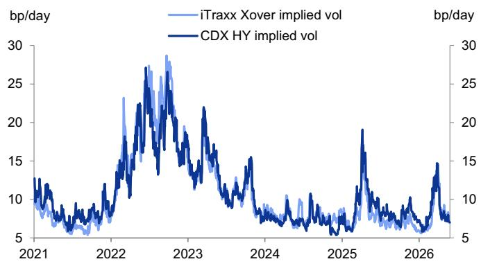

line

| Year | iTraxx Xover implied vol | CDX HY implied vol |
|------|--------------------------|--------------------|
| 2021 | ~10                      | ~12                |
| 2022 | ~15                      | ~18                |
| 2023 | ~28                      | ~27                |
| 2024 | ~10                      | ~15                |
| 2025 | ~8                       | ~19                |
| 2026 | ~7                       | ~15                |

Source: GS, GS Global Investment Research

Exhibit 46: CDX IG and iTraxx Main skew   
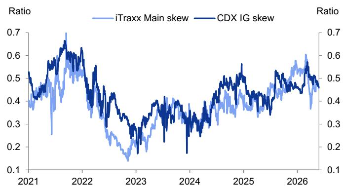

line

| Year | iTraxx Main skew | CDX IG skew |
|------|------------------|-------------|
| 2021 | ~0.4             | ~0.5        |
| 2022 | ~0.6             | ~0.6        |
| 2023 | ~0.1             | ~0.3        |
| 2024 | ~0.4             | ~0.4        |
| 2025 | ~0.5             | ~0.5        |
| 2026 | ~0.6             | ~0.5        |

Source: GS, GS Global Investment Research

Exhibit 47: CDX HY and iTraxx Xover skew   
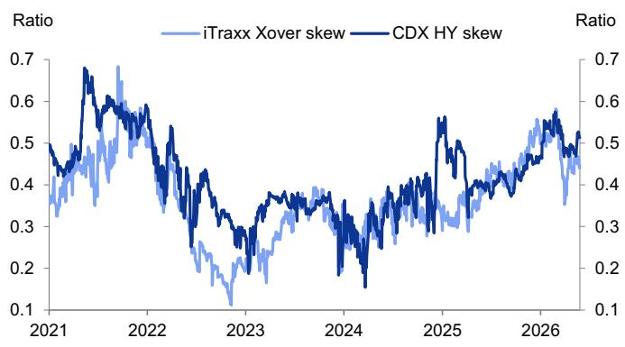

line

| Year | iTraxx Xover skew | CDX HY skew |
|------|-------------------|-------------|
| 2021 | ~0.45             | ~0.5        |
| 2022 | ~0.35             | ~0.55       |
| 2023 | ~0.1              | ~0.3        |
| 2024 | ~0.3              | ~0.2        |
| 2025 | ~0.4              | ~0.55       |
| 2026 | ~0.45             | ~0.55       |

Source: GS, GS Global Investment Research

Exhibit 48: CDX IG and iTraxx Main ATM implied volatility term structure   
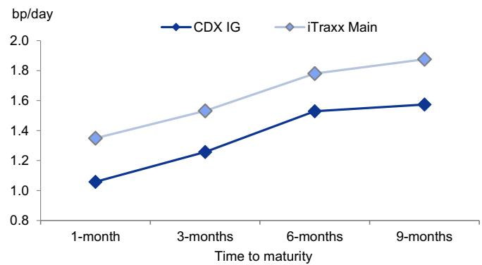

line

| Time to maturity | CDX IG | iTraxx Main |
| ---------------- | ------ | ----------- |
| 1-month          | 1.05   | 1.35        |
| 3-months         | 1.25   | 1.55        |
| 6-months         | 1.55   | 1.80        |
| 9-months         | 1.58   | 1.90        |

Source: GS, GS Global Investment Research

Exhibit 49: CDX HY and iTraxx Xover ATM implied volatility term structure   
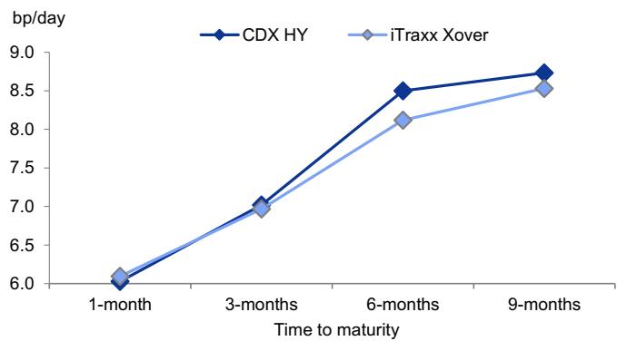

line

| Time to maturity | CDX HY | iTraxx Xover |
| ---------------- | ------ | ------------ |
| 1-month          | 6.0    | 6.0          |
| 3-months         | 7.0    | 7.0          |
| 6-months         | 8.5    | 8.1          |
| 9-months         | 8.7    | 8.5          |

Source: GS, GS Global Investment Research

# Valuation dashboard: CLOs

Exhibit 50: CLO spread percentile ranks 

<table><tr><td rowspan="2">USD</td><td rowspan="2">Current spread (bp)</td><td colspan="3">Percentile rank</td></tr><tr><td>3-year</td><td>5-year</td><td>10-year</td></tr><tr><td>AAA</td><td>104</td><td>8%</td><td>5%</td><td>2%</td></tr><tr><td>AA</td><td>143</td><td>3%</td><td>2%</td><td>1%</td></tr><tr><td>A</td><td>163</td><td>0%</td><td>0%</td><td>0%</td></tr><tr><td>BBB</td><td>284</td><td>32%</td><td>20%</td><td>14%</td></tr><tr><td>BB</td><td>762</td><td>62%</td><td>59%</td><td>64%</td></tr></table>

Source: Bloomberg, GS Global Investment Research

# Exhibit 52: CLO new issue arbitrage spread

New issue CLO arbitrage spread, i.e., the difference between new issue loan spreads and new issue CLO spreads (across the capital stack)

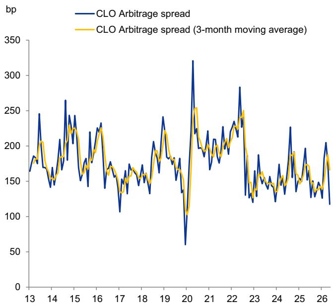

line

| Year | CLO Arbitrage spread | CLO Arbitrage spread (3-month moving average) |
|------|----------------------|-----------------------------------------------|
| 13   | ~180                 | ~175                                          |
| 14   | ~240                 | ~200                                          |
| 15   | ~260                 | ~220                                          |
| 16   | ~230                 | ~225                                          |
| 17   | ~170                 | ~160                                          |
| 18   | ~180                 | ~170                                          |
| 19   | ~240                 | ~210                                          |
| 20   | ~60                  | ~100                                          |
| 21   | ~220                 | ~250                                          |
| 22   | ~280                 | ~240                                          |
| 23   | ~190                 | ~160                                          |
| 24   | ~170                 | ~150                                          |
| 25   | ~230                 | ~190                                          |
| 26   | ~200                 | ~180                                          |

Source: Pitchbook LCD, GS Global Investment Research

Exhibit 51: CLO equity vs. CLO BB yield   
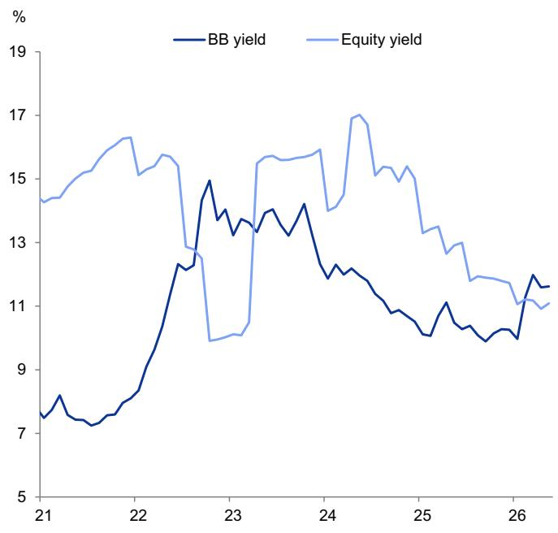

line

| Year | BB yield | Equity yield |
|------|----------|--------------|
| 21   | 7.5      | 14.5         |
| 22   | 8.5      | 15.5         |
| 23   | 13.0     | 9.5          |
| 24   | 12.0     | 17.0         |
| 25   | 10.5     | 13.0         |
| 26   | 11.5     | 11.0         |

Source: Intex, Bloomberg, GS Global Investment Research

# Exhibit 53: CLO vs. USD IG spread differential

CLO by rating and USD IG bond by rating spread differential

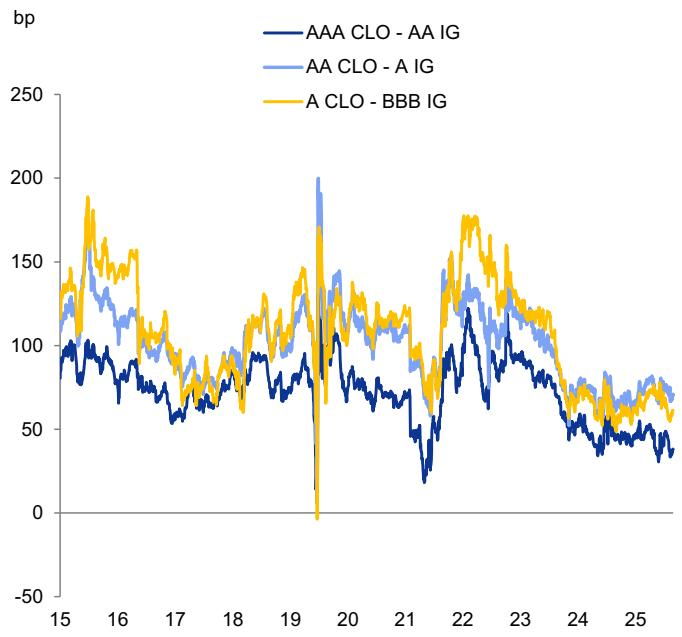

line

| Year | AAA CLO - AA IG | AA CLO - A IG | A CLO - BBB IG |
|------|-----------------|---------------|----------------|
| 15   | ~100            | ~120          | ~140           |
| 16   | ~90             | ~110          | ~180           |
| 17   | ~70             | ~90           | ~150           |
| 18   | ~80             | ~100          | ~130           |
| 19   | ~90             | ~140          | ~150           |
| 20   | ~100            | ~140          | ~170           |
| 21   | ~20             | ~80           | ~100           |
| 22   | ~120            | ~130          | ~180           |
| 23   | ~90             | ~110          | ~160           |
| 24   | ~60             | ~80           | ~120           |
| 25   | ~40             | ~70           | ~80            |

Source: Bloomberg, GS Global Investment Research

# USD IG and HY Sentiment indicators

Exhibit 54: IG Weekly sentiment indicator   
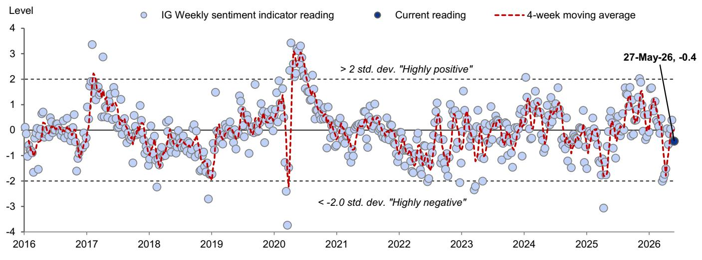

scatter

| Date       | IG Weekly sentiment indicator reading | Current reading |
| ---------- | -------------------------------------- | --------------- |
| 27-May-26  | -0.4                                   | -               |

Source: See table below.

Exhibit 55: HY Weekly sentiment indicator   
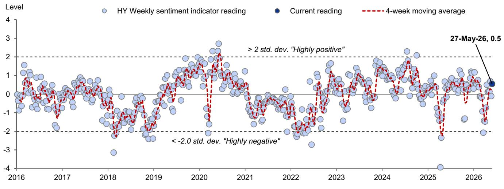

line

| Date       | HY Weekly sentiment indicator reading | Current reading | 4-week moving average |
| ---------- | ------------------------------------- | --------------- | --------------------- |
| 27-May-26  | 0.5                                   | 0.5             | 0.5                   |

Source: See table below.

Exhibit 56: Variables included in the USD IG and HY weekly sentiment indicators 

<table><tr><td>Measure</td><td>Frequency</td><td>Data Source</td></tr><tr><td>Synthetic index Positioning</td><td>Weekly</td><td>DTCC</td></tr><tr><td>Net Dealer Positioning</td><td>Weekly</td><td>FRBNY</td></tr><tr><td>Net Dealer Lift</td><td>Weekly</td><td>TRACE</td></tr><tr><td>Active US Credit Fund flows</td><td>Weekly</td><td>EPFR</td></tr><tr><td>Passive US Credit Fund flows</td><td>Weekly</td><td>EPFR</td></tr><tr><td>US Money Market Fund flows</td><td>Weekly</td><td>EPFR</td></tr><tr><td>Short interest on the largest credit ETFs</td><td>Semimonthly</td><td>GS FICC &amp; Equities</td></tr><tr><td>Credit Mutual Fund cash positions</td><td>Monthly</td><td>ICI</td></tr></table>

Source: GS Global Investment Research

# Microstructure dashboard: Top 20 most traded capital structures in the USD IG and HY markets

Exhibit 57: Top 20 most liquid issuers by weekly turnover in the USD IG market 

<table><tr><td>Ticker</td><td>Issuer</td><td>Notional bonds outstanding ($bn)</td><td>Notional volume traded on the week ($mn)</td><td>Weekly turnover ratio (Wed. to Wed. %)</td><td>Median rating</td><td>Average age of bonds outstanding (Years)</td><td>Average duration of bonds outstanding (Years)</td></tr><tr><td>CRM</td><td>Salesforce Inc</td><td>33.5</td><td>466.0</td><td>1.4</td><td>A</td><td>1.5</td><td>7.3</td></tr><tr><td>UBER</td><td>Uber Technologies Inc</td><td>7.8</td><td>95.9</td><td>1.2</td><td>BBB+</td><td>1.9</td><td>6.5</td></tr><tr><td>ZTS</td><td>Zoetis Inc</td><td>6.8</td><td>81.8</td><td>1.2</td><td>BBB+</td><td>6.0</td><td>6.7</td></tr><tr><td>DVN</td><td>Devon Energy Corp</td><td>6.2</td><td>68.5</td><td>1.1</td><td>BBB+</td><td>9.6</td><td>9.1</td></tr><tr><td>BCRED</td><td>Blackstone Private Credit Fund</td><td>6.5</td><td>70.7</td><td>1.1</td><td>BBB-</td><td>1.2</td><td>4.1</td></tr><tr><td>APH</td><td>Amphenol Corp</td><td>11.8</td><td>125.3</td><td>1.1</td><td>A-</td><td>1.7</td><td>6.6</td></tr><tr><td>FANG</td><td>Diamondback Energy Inc</td><td>9.3</td><td>97.9</td><td>1.1</td><td>BBB</td><td>2.9</td><td>8.3</td></tr><tr><td>GOOGL</td><td>Alphabet Inc</td><td>51.0</td><td>527.9</td><td>1.0</td><td>AA</td><td>1.4</td><td>10.0</td></tr><tr><td>GIS</td><td>General Mills Inc</td><td>6.3</td><td>63.4</td><td>1.0</td><td>BBB</td><td>4.4</td><td>5.1</td></tr><tr><td>HUM</td><td>Humana Inc</td><td>10.9</td><td>109.7</td><td>1.0</td><td>BBB</td><td>3.9</td><td>7.2</td></tr><tr><td>SUZANO</td><td>Suzano Austria GmbH</td><td>7.8</td><td>78.1</td><td>1.0</td><td>BBB-</td><td>5.8</td><td>5.2</td></tr><tr><td>BBVASM</td><td>Banco Bilbao Vizcaya Argentaria SA</td><td>6.1</td><td>61.0</td><td>1.0</td><td>A-</td><td>1.7</td><td>4.3</td></tr><tr><td>ETN</td><td>Eaton Corp</td><td>13.9</td><td>138.1</td><td>1.0</td><td>A-</td><td>2.7</td><td>6.2</td></tr><tr><td>SJM</td><td>The JM Smucker Co</td><td>5.8</td><td>56.6</td><td>1.0</td><td>BBB</td><td>5.1</td><td>7.6</td></tr><tr><td>EXR</td><td>Extra Space Storage LP</td><td>5.3</td><td>51.9</td><td>1.0</td><td>BBB</td><td>2.5</td><td>4.6</td></tr><tr><td>EQIX</td><td>Equinix Inc</td><td>10.7</td><td>103.5</td><td>1.0</td><td>BBB+</td><td>3.9</td><td>5.8</td></tr><tr><td>KHC</td><td>Kraft Heinz Foods Co</td><td>13.7</td><td>130.2</td><td>0.9</td><td>BBB</td><td>8.5</td><td>9.5</td></tr><tr><td>DOW</td><td>The Dow Chemical Company</td><td>12.7</td><td>117.7</td><td>0.9</td><td>BBB-</td><td>7.5</td><td>9.4</td></tr><tr><td>SW</td><td>WRKCo Inc</td><td>7.4</td><td>67.0</td><td>0.9</td><td>BBB</td><td>3.3</td><td>6.1</td></tr><tr><td>AZO</td><td>AutoZone Inc</td><td>6.1</td><td>54.2</td><td>0.9</td><td>BBB</td><td>3.9</td><td>4.1</td></tr></table>

Source: TRACE, iBoxx, data compiled by GS Global Investment Research

Exhibit 58: Top 20 most liquid issuers by weekly turnover in the USD HY market 

<table><tr><td>Ticker</td><td>Issuer</td><td>Notional bonds outstanding ($bn)</td><td>Notional volume traded on the week ($mn)</td><td>Weekly turnover ratio (Wed. to Wed. %)</td><td>Median rating</td><td>Average age of bonds outstanding (Years)</td><td>Average duration of bonds outstanding (Years)</td></tr><tr><td>KIOXIA</td><td>Kioxia Holdings Corp</td><td>2.2</td><td>176.5</td><td>8.0</td><td>BBB-</td><td>0.8</td><td>3.3</td></tr><tr><td>CAR</td><td>Avis Budget Car Rental LLC / Avis Budget Finance Inc</td><td>2.9</td><td>60.8</td><td>2.1</td><td>B</td><td>3.0</td><td>2.4</td></tr><tr><td>AAP</td><td>Advance Auto Parts Inc</td><td>2.5</td><td>45.4</td><td>1.9</td><td>BB-</td><td>1.8</td><td>3.3</td></tr><tr><td>GSYCN</td><td>goeasy Ltd</td><td>2.4</td><td>42.6</td><td>1.8</td><td>B-</td><td>1.7</td><td>3.1</td></tr><tr><td>IHRT</td><td>iHeartCommunications Inc</td><td>2.1</td><td>30.6</td><td>1.5</td><td>CCC+</td><td>1.4</td><td>3.1</td></tr><tr><td>GT</td><td>The Goodyear Tire &amp; Rubber Company</td><td>3.0</td><td>42.2</td><td>1.4</td><td>B+</td><td>3.8</td><td>4.0</td></tr><tr><td>MIK</td><td>Michaels Cos Inc/The</td><td>2.8</td><td>39.3</td><td>1.4</td><td>B-</td><td>0.2</td><td>5.2</td></tr><tr><td>JBLU</td><td>JetBlue Airways Corp / JetBlue Loyalty LP</td><td>2.0</td><td>28.5</td><td>1.4</td><td>B</td><td>1.7</td><td>4.1</td></tr><tr><td>APLD</td><td>APLD ComputeCo LLC</td><td>2.4</td><td>30.7</td><td>1.3</td><td>BB-</td><td>0.4</td><td>2.2</td></tr><tr><td>CRWV</td><td>CoreWeave Inc</td><td>6.5</td><td>83.3</td><td>1.3</td><td>B+</td><td>0.5</td><td>3.2</td></tr><tr><td>SEE</td><td>Sword Purchaser LLC</td><td>2.4</td><td>26.6</td><td>1.1</td><td>B+</td><td>0.1</td><td>4.0</td></tr><tr><td>FUN</td><td>Six Flags Entertainment Corp/Canada&#x27;s Wonderland Co/Millen</td><td>3.1</td><td>31.2</td><td>1.0</td><td>CCC+</td><td>2.3</td><td>3.4</td></tr><tr><td>NAVI</td><td>Navient Corp</td><td>2.8</td><td>26.4</td><td>1.0</td><td>BB-</td><td>3.3</td><td>2.9</td></tr><tr><td>GTN</td><td>Gray Media Inc</td><td>4.8</td><td>46.0</td><td>1.0</td><td>CCC</td><td>2.8</td><td>3.6</td></tr><tr><td>CC</td><td>The Chemours Company</td><td>2.5</td><td>23.9</td><td>0.9</td><td>B+</td><td>2.8</td><td>3.2</td></tr><tr><td>MERIDI</td><td>Meridian Arc Holdco LLC</td><td>5.7</td><td>53.9</td><td>0.9</td><td>BB</td><td>0.0</td><td>3.5</td></tr><tr><td>NCLH</td><td>NCL Corp Ltd</td><td>5.0</td><td>45.1</td><td>0.9</td><td>B-</td><td>1.8</td><td>4.1</td></tr><tr><td>MLTPLN</td><td>MPH Acquisition Holdings LLC</td><td>2.1</td><td>19.1</td><td>0.9</td><td>CCC+</td><td>1.2</td><td>3.9</td></tr><tr><td>SABHLD</td><td>Sabre GLBL Inc</td><td>3.2</td><td>28.6</td><td>0.9</td><td>B-</td><td>0.7</td><td>2.7</td></tr><tr><td>VSTJET</td><td>VistaJet Malta Finance PLC / XO Management Holding Inc</td><td>2.0</td><td>17.5</td><td>0.9</td><td>B-</td><td>3.9</td><td>1.9</td></tr></table>

Source: TRACE, iBoxx, data compiled by GS Global Investment Research

# Microstructure dashboard: Liquidity conditions in the USD secondary bond market

Exhibit 59: Seasonally adjusted daily average turnover (trading volume/amount outstanding)   
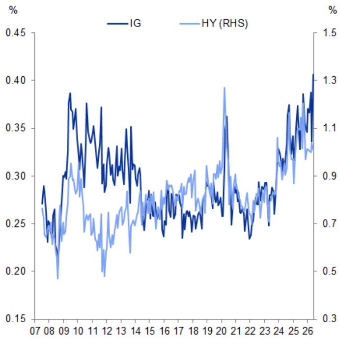

line

| Year | IG    | HY (RHS) |
|------|-------|----------|
| 07   | 0.28  | 0.25     |
| 08   | 0.26  | 0.24     |
| 09   | 0.30  | 0.28     |
| 10   | 0.38  | 0.32     |
| 11   | 0.35  | 0.26     |
| 12   | 0.37  | 0.24     |
| 13   | 0.34  | 0.26     |
| 14   | 0.36  | 0.28     |
| 15   | 0.32  | 0.26     |
| 16   | 0.28  | 0.28     |
| 17   | 0.26  | 0.30     |
| 18   | 0.27  | 0.31     |
| 19   | 0.29  | 0.32     |
| 20   | 0.36  | 0.39     |
| 21   | 0.28  | 0.30     |
| 22   | 0.24  | 0.28     |
| 23   | 0.29  | 0.31     |
| 24   | 0.34  | 0.34     |
| 25   | 0.37  | 0.36     |
| 26   | 0.41  | 0.38     |

Source: TRACE, Bloomberg, GS Global Investment Research

Exhibit 60: Primary dealer net positioning in USD corporate bonds   
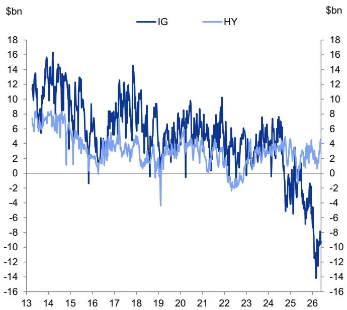

line

| Year | IG ($bn) | HY ($bn) |
|------|----------|----------|
| 13   | ~12      | ~7       |
| 14   | ~15      | ~8       |
| 15   | ~13      | ~6       |
| 16   | ~9       | ~4       |
| 17   | ~12      | ~3       |
| 18   | ~14      | ~2       |
| 19   | ~9       | ~-5      |
| 20   | ~8       | ~2       |
| 21   | ~10      | ~3       |
| 22   | ~10      | ~2       |
| 23   | ~6       | ~1       |
| 24   | ~7       | ~3       |
| 25   | ~-5      | ~4       |
| 26   | ~-14     | ~-8      |

Source: FRBNY, GS Global Investment Research

Exhibit 61: Average IG bid-ask spread   
5-day moving average   
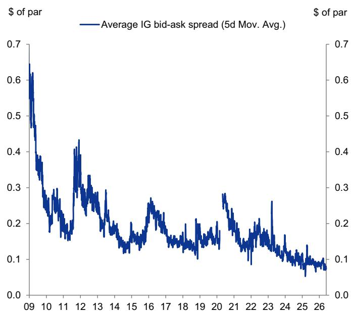

line

| Year | Average IG bid-ask spread ($ of par) |
| ---- | ------------------------------------ |
| 09   | 0.7                                  |
| 10   | 0.4                                  |
| 11   | 0.3                                  |
| 12   | 0.45                                 |
| 13   | 0.3                                  |
| 14   | 0.25                                 |
| 15   | 0.2                                  |
| 16   | 0.25                                 |
| 17   | 0.2                                  |
| 18   | 0.15                                 |
| 19   | 0.2                                  |
| 20   | 0.25                                 |
| 21   | 0.2                                  |
| 22   | 0.15                                 |
| 23   | 0.1                                  |
| 24   | 0.1                                  |
| 25   | 0.08                                 |
| 26   | 0.07                                 |

Note: March and April 2020 are omitted.

Exhibit 62: Amihud IG illiquidity measure   
5-day moving average   
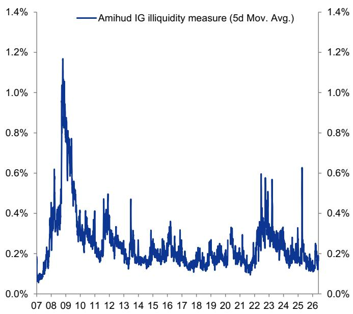

line

| Year | Amihud IG illiquidity measure (5d Mov. Avg.) |
| ---- | --------------------------------------------- |
| 07   | ~0.1%                                         |
| 08   | ~0.6%                                         |
| 09   | ~1.2%                                         |
| 10   | ~0.4%                                         |
| 11   | ~0.3%                                         |
| 12   | ~0.5%                                         |
| 13   | ~0.4%                                         |
| 14   | ~0.3%                                         |
| 15   | ~0.2%                                         |
| 16   | ~0.3%                                         |
| 17   | ~0.2%                                         |
| 18   | ~0.2%                                         |
| 19   | ~0.2%                                         |
| 20   | ~0.2%                                         |
| 21   | ~0.2%                                         |
| 22   | ~0.6%                                         |
| 23   | ~0.5%                                         |
| 24   | ~0.3%                                         |
| 25   | ~0.6%                                         |
| 26   | ~0.2%                                         |

Note: March and April 2020 are omitted.   
Source: Trace, Bloomberg, GS Global Investment Research   
Source: TRACE, Bloomberg, GS Global Investment Research

# Flow dashboard: Mutual fund and ETF AUM

Exhibit 63: AUM in USD IG-focused Mutual Funds and ETFs   
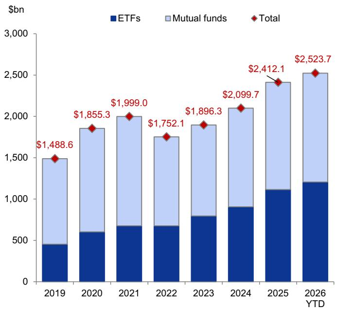

bar_stacked

| Year | ETFs ($bn) | Mutual funds ($bn) | Total ($bn) |
| :--- | :--- | :--- | :--- |
| 2019 | 450 | 850 | 1,488.6 |
| 2020 | 580 | 1070 | 1,855.3 |
| 2021 | 660 | 1130 | 1,999.0 |
| 2022 | 660 | 870 | 1,752.1 |
| 2023 | 770 | 930 | 1,896.3 |
| 2024 | 890 | 1030 | 2,099.7 |
| 2025 | 1110 | 1140 | 2,412.1 |
| 2026 YTD | 1200 | 1180 | 2,523.7 |

Source: EPFR, GS Global Investment Research

Exhibit 64: AUM in USD HY-focused Mutual Funds and ETFs   
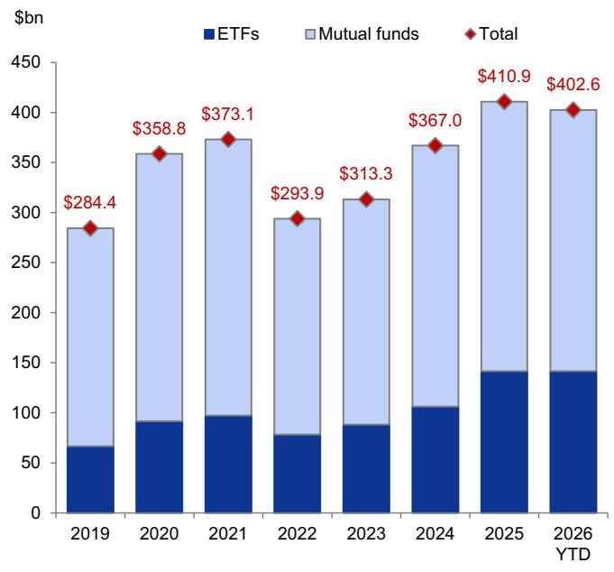

bar_stacked

| Year | ETFs ($bn) | Mutual funds ($bn) | Total ($bn) |
| :--- | :--- | :--- | :--- |
| 2019 | 65.0 | 200.0 | 284.4 |
| 2020 | 90.0 | 230.0 | 358.8 |
| 2021 | 95.0 | 240.0 | 373.1 |
| 2022 | 75.0 | 190.0 | 293.9 |
| 2023 | 85.0 | 210.0 | 313.3 |
| 2024 | 105.0 | 235.0 | 367.0 |
| 2025 | 140.0 | 270.0 | 410.9 |
| 2026 YTD | 140.0 | 265.0 | 402.6 |

Source: EPFR, GS Global Investment Research

Exhibit 65: AUM in EUR IG-focused Mutual Funds and ETFs   
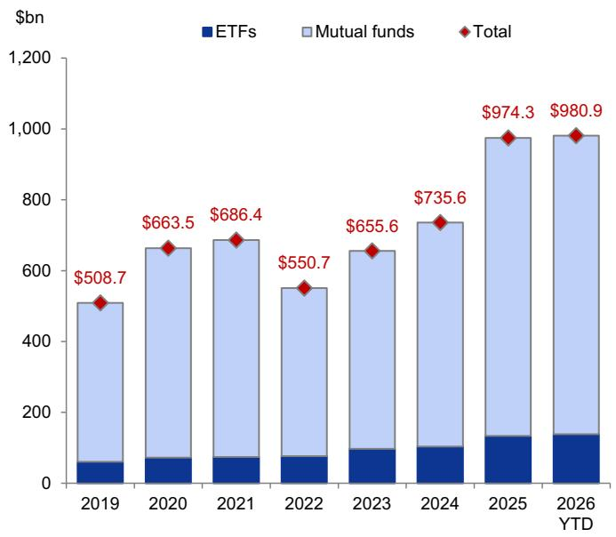

bar_stacked

| Year | ETFs ($bn) | Mutual funds ($bn) | Total ($bn) |
| :--- | :--- | :--- | :--- |
| 2019 | 60 | 480.7 | 508.7 |
| 2020 | 70 | 563.5 | 663.5 |
| 2021 | 70 | 586.4 | 686.4 |
| 2022 | 70 | 550.7 | 550.7 |
| 2023 | 90 | 555.6 | 655.6 |
| 2024 | 100 | 735.6 | 735.6 |
| 2025 | 130 | 974.3 | 974.3 |
| 2026 YTD | 130 | 980.9 | 980.9 |

Source: EPFR, GS Global Investment Research

Exhibit 66: AUM in EUR HY-focused Mutual Funds and ETFs   
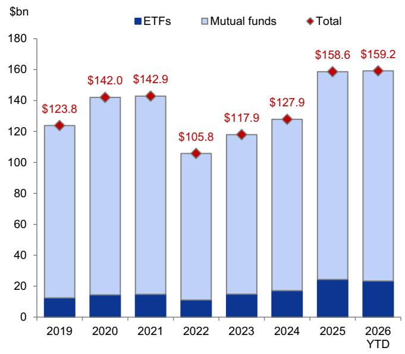

bar_stacked

| Year | ETFs ($bn) | Mutual funds ($bn) | Total ($bn) |
| :--- | :--- | :--- | :--- |
| 2019 | 12.0 | 84.5 | 123.8 |
| 2020 | 14.0 | 97.0 | 142.0 |
| 2021 | 14.0 | 97.0 | 142.9 |
| 2022 | 10.0 | 73.0 | 105.8 |
| 2023 | 15.0 | 83.0 | 117.9 |
| 2024 | 17.0 | 88.0 | 127.9 |
| 2025 | 24.0 | 113.0 | 158.6 |
| 2026 YTD | 23.0 | 115.0 | 159.2 |

Source: EPFR, GS Global Investment Research

# Flow dashboard: Mutual fund and ETF flows

Exhibit 67: Weekly mutual fund flows into US fixed income and equity markets   
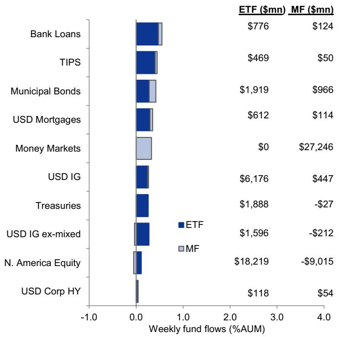

bar

| Category | ETF ($mn) | MF ($mn) |
| :--- | :--- | :--- |
| Bank Loans | 776 | 124 |
| TIPS | 469 | 50 |
| Municipal Bonds | 1,919 | 966 |
| USD Mortgages | 612 | 114 |
| Money Markets | 0 | 27,246 |
| USD IG | 6,176 | 447 |
| Treasuries | 1,888 | -27 |
| USD IG ex-mixed | 1,596 | -212 |
| N. America Equity | 18,219 | -9,015 |
| USD Corp HY | 118 | 54 |

Source: EPFR, GS Global Investment Research

Exhibit 68: Weekly mutual fund flows into European fixed income and equity markets   
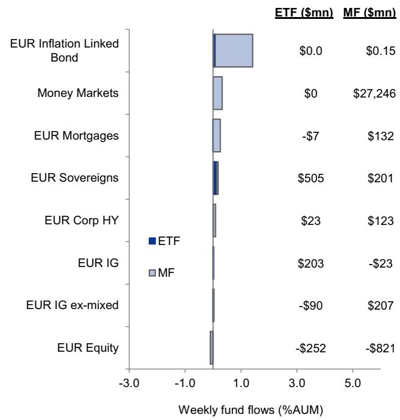

bar

| Category | ETF ($mn) | MF ($mn) |
| :--- | :--- | :--- |
| EUR Inflation Linked Bond | 0.0 | 0.15 |
| Money Markets | 0 | 27,246 |
| EUR Mortgages | -$7 | 132 |
| EUR Sovereigns | 505 | 201 |
| EUR Corp HY | 23 | 123 |
| EUR IG | 203 | -23 |
| EUR IG ex-mixed | -90 | 207 |
| EUR Equity | -252 | -821 |

Source: EPFR, GS Global Investment Research

Exhibit 69: Year-to-date cumulative flows as a percentage of beginning of the year AUM for US credit funds   
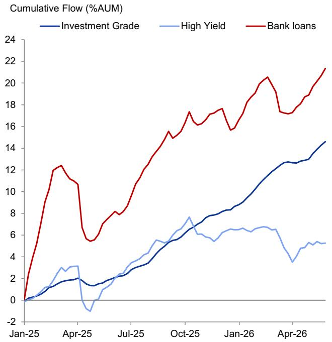

line

| Date   | Investment Grade | High Yield | Bank loans |
|--------|------------------|----------|------------|
| Jan-25 | 0.0              | 0.0      | 0.0        |
| Apr-25 | 1.5              | -1.0     | 12.0       |
| Jul-25 | 3.0              | 3.0      | 8.0        |
| Oct-25 | 6.0              | 7.5      | 17.0       |
| Jan-26 | 9.0              | 6.5      | 18.0       |
| Apr-26 | 14.5             | 5.0      | 21.0       |

Source: EPFR, GS Global Investment Research

Exhibit 70: Year-to-date cumulative flows as a percentage of beginning of the year AUM for European credit funds   
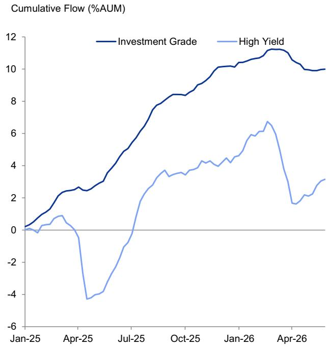

line

| Date   | Investment Grade | High Yield |
|--------|------------------|----------|
| Jan-25 | 0.0              | 0.0      |
| Apr-25 | 2.5              | -4.5     |
| Jul-25 | 5.0              | -1.0     |
| Oct-25 | 8.0              | 3.5      |
| Jan-26 | 10.0             | 6.0      |
| Apr-26 | 10.0             | 1.5      |

Source: EPFR, GS Global Investment Research

# Flow dashboard: Upcoming coupon and principal payments

Exhibit 71: Our estimates of upcoming coupon and principal payments in the USD IG market   
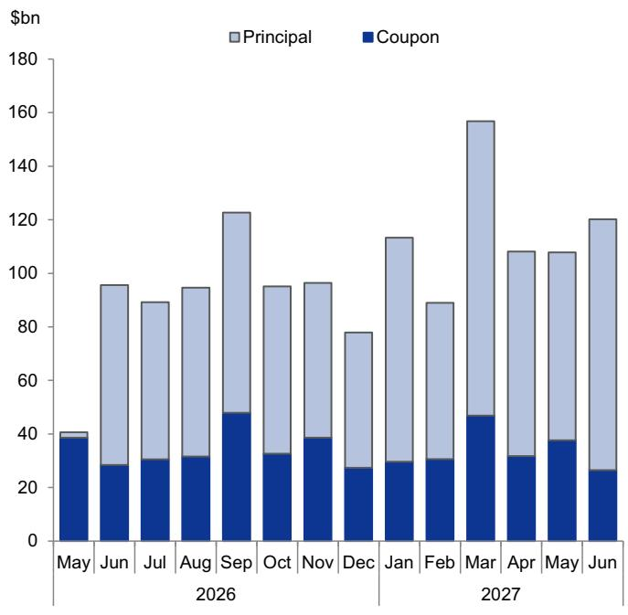

bar_stacked

| Month | 2026 ($bn) | 2027 ($bn) |
| :--- | :--- | :--- |
| May | 41 | 113 |
| Jun | 95 | 89 |
| Jul | 89 | 108 |
| Aug | 94 | 108 |
| Sep | 123 | 156 |
| Oct | 95 | 108 |
| Nov | 96 | 108 |
| Dec | 78 | 120 |
| Jan | 0 | 113 |
| Feb | 0 | 89 |
| Mar | 0 | 156 |
| Apr | 0 | 108 |
| May | 0 | 108 |
| Jun | 0 | 120 |
The chart displays stacked bars for 'Principal' and 'Coupon' categories, likely representing total revenue or sales for each month. The values are in $bn. There is no explicit label provided in the image.

Source: Bloomberg, GS Global Investment Research

Exhibit 72: Our estimates of upcoming coupon and principal payments in the USD HY market   
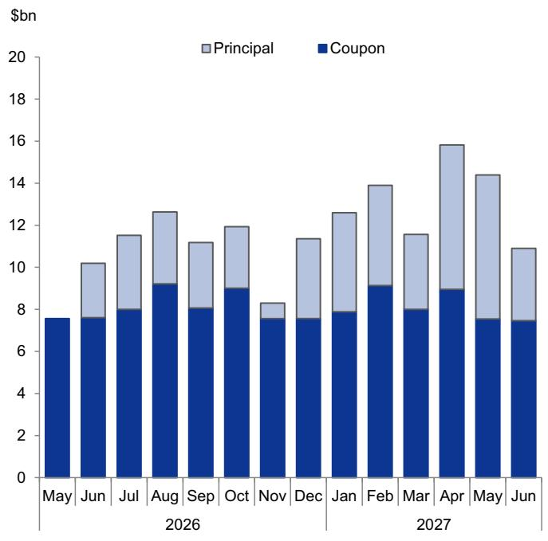

bar_stacked

| Month   | Principal | Coupon |
|---------|-----------|--------|
| May     | 0         | 7.5    |
| Jun     | 3.5       | 7.5    |
| Jul     | 4.5       | 8.0    |
| Aug     | 4.0       | 9.0    |
| Sep     | 3.5       | 8.0    |
| Oct     | 3.0       | 9.0    |
| Nov     | 1.0       | 7.5    |
| Dec     | 5.0       | 7.5    |
| Jan     | 6.0       | 7.5    |
| Feb     | 5.0       | 9.0    |
| Mar     | 4.0       | 8.0    |
| Apr     | 9.0       | 8.5    |
| May     | 8.0       | 7.5    |
| Jun     | 4.0       | 7.5    |

Source: Bloomberg, GS Global Investment Research

Exhibit 73: Our estimates of upcoming coupon and principal payments in the EUR IG market   
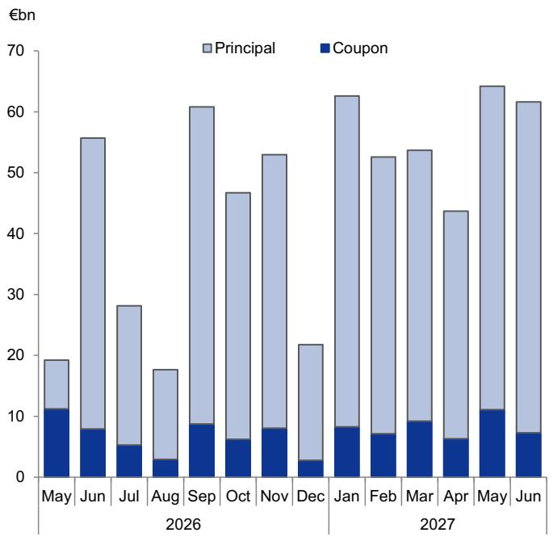

bar_stacked

| Month | 2026 (€bn) | 2027 (€bn) |
| :--- | :--- | :--- |
| May | 19 | 8 |
| Jun | 55.5 | 8 |
| Jul | 28.3 | 7.4 |
| Aug | 17.6 | 6.1 |
| Sep | 60.8 | 9.1 |
| Oct | 46.7 | 6.3 |
| Nov | 52.9 | 8.0 |
| Dec | 21.5 | 2.7 |
| Jan | 62.3 | 8.4 |
| Feb | 52.4 | 7.1 |
| Mar | 53.6 | 9.3 |
| Apr | 43.7 | 6.3 |
| May | 64.3 | 10.9 |
| Jun | 61.5 | 7.3 |

Source: Bloomberg, GS Global Investment Research

Exhibit 74: Our estimates of upcoming coupon and principal payments in the EUR HY market   
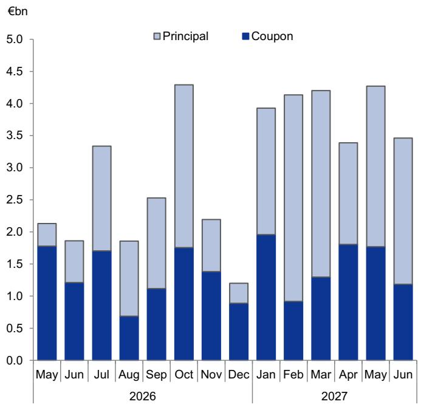

bar_stacked

| Month | Principal (€bn) | Coupon (€bn) |
|-------|-----------------|--------------|
| May   | 0.1             | 1.8          |
| Jun   | 0.1             | 1.2          |
| Jul   | 1.5             | 1.7          |
| Aug   | 1.3             | 0.7          |
| Sep   | 1.4             | 1.1          |
| Oct   | 2.0             | 1.7          |
| Nov   | 0.9             | 1.4          |
| Dec   | 0.3             | 0.9          |
| Jan   | 1.6             | 1.9          |
| Feb   | 2.5             | 0.9          |
| Mar   | 2.2             | 1.3          |
| Apr   | 1.4             | 1.8          |
| May   | 2.0             | 1.7          |
| Jun   | 1.7             | 1.2          |

Source: Bloomberg, GS Global Investment Research

# Flow dashboard: Positioning in macro indices

Exhibit 75: Net notional positioning in the CDX IG 5-year on-the-run contract   
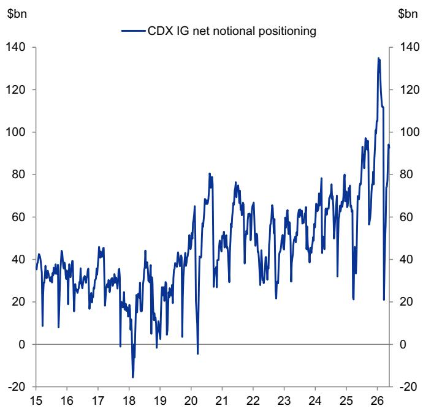

line

| Year | CDX IG net notional positioning ($bn) |
|------|----------------------------------------|
| 15   | ~40                                    |
| 16   | ~35                                    |
| 17   | ~45                                    |
| 18   | ~-15                                   |
| 19   | ~30                                    |
| 20   | ~60                                    |
| 21   | ~80                                    |
| 22   | ~65                                    |
| 23   | ~50                                    |
| 24   | ~70                                    |
| 25   | ~90                                    |
| 26   | ~135                                   |

Source: DTCC, GS Global Investment Research

Exhibit 76: Net notional positioning in the CDX HY 5-year on-the-run contract   
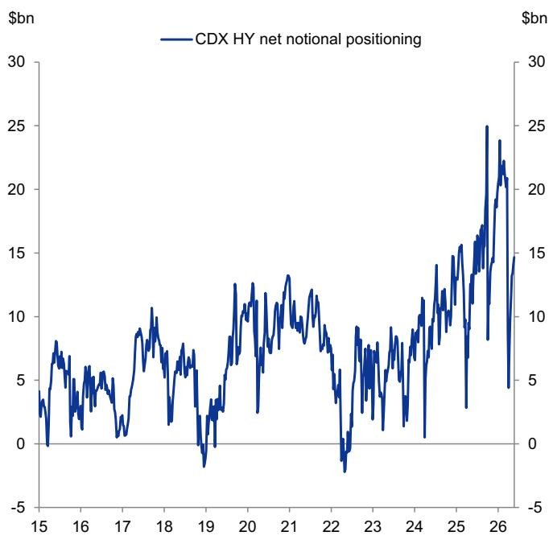

line

| Year | CDX HY net notional positioning ($bn) |
|------|----------------------------------------|
| 15   | ~3                                     |
| 16   | ~7                                     |
| 17   | ~9                                     |
| 18   | ~10                                    |
| 19   | ~3                                     |
| 20   | ~12                                    |
| 21   | ~13                                    |
| 22   | ~-3                                    |
| 23   | ~8                                     |
| 24   | ~10                                    |
| 25   | ~15                                    |
| 26   | ~25                                    |

Source: DTCC, GS Global Investment Research

Exhibit 77: Net notional positioning in the iTraxx Main 5-year on-the-run contract   
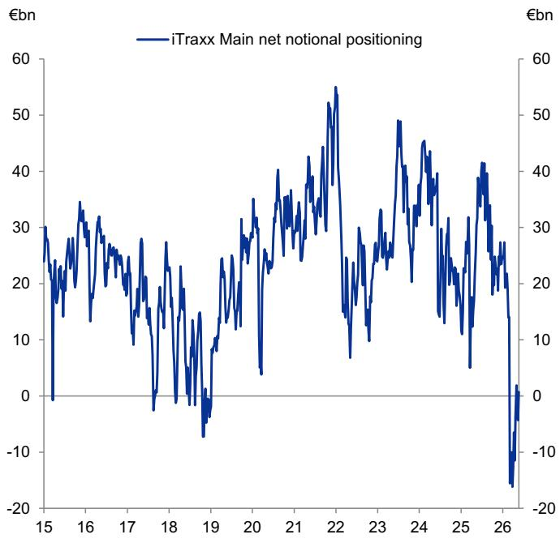

line

| Year | iTraxx Main net notional positioning (€bn) |
| ---- | ------------------------------------------ |
| 15   | 30                                         |
| 16   | 35                                         |
| 17   | 25                                         |
| 18   | 20                                         |
| 19   | -5                                         |
| 20   | 30                                         |
| 21   | 40                                         |
| 22   | 55                                         |
| 23   | 30                                         |
| 24   | 45                                         |
| 25   | 30                                         |
| 26   | -15                                        |

Source: DTCC, GS Global Investment Research

Exhibit 78: Net notional positioning in iTraxx over 5-year on-the-run contract   
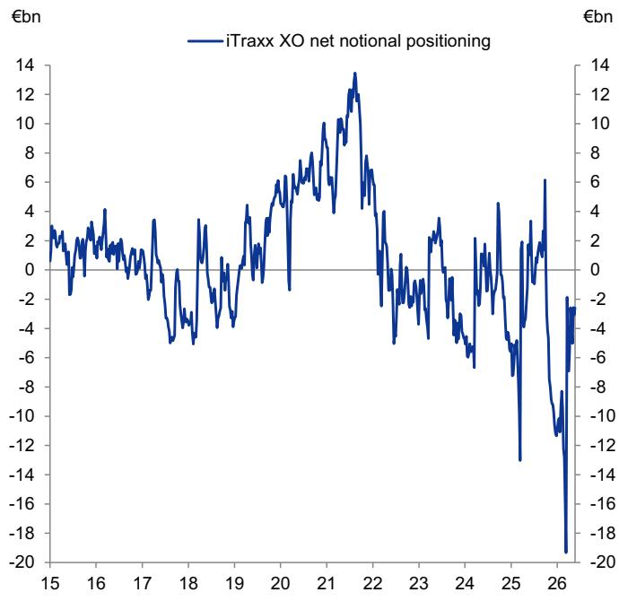

line

| Year | iTraxx XO net notional positioning (€bn) |
|------|------------------------------------------|
| 15   | ~2.5                                     |
| 16   | ~3.0                                     |
| 17   | ~2.0                                     |
| 18   | ~-5.0                                    |
| 19   | ~4.0                                     |
| 20   | ~6.0                                     |
| 21   | ~10.0                                    |
| 22   | ~13.0                                    |
| 23   | ~-2.0                                    |
| 24   | ~-6.0                                    |
| 25   | ~-12.0                                   |
| 26   | ~-18.0                                   |

Source: DTCC, GS Global Investment Research

# Flow dashboard: ECB QT

Exhibit 79: Ownership share of the ECB in the EUR IG market   

bar_stacked

| Year | CSPP Ineligible (€bn) | CSPP Eligible not held by ECB (€bn) | ECB CSPP and PEPP corporate holdings (€bn) |
|------|------------------------|-------------------------------------|---------------------------------------------|
| 2016 | ~2,500                 | ~700                                | ~0                                          |
| 2017 | ~2,600                 | ~750                                | ~100                                        |
| 2018 | ~2,700                 | ~800                                | ~150                                        |
| 2019 | ~2,900                 | ~850                                | ~150                                        |
| 2020 | ~3,100                 | ~900                                | ~200                                        |
| 2021 | ~3,200                 | ~950                                | ~250                                        |
| 2022 | ~3,300                 | ~1,000                              | ~300                                        |
| 2023 | ~3,400                 | ~1,050                              | ~350                                        |
| 2024 | ~3,500                 | ~1,100                              | ~350                                        |
| 2025 | ~3,600                 | ~1,150                              | ~350                                        |

Source: ECB, Bloomberg, GS Global Investment Research

Exhibit 80: Run-off projections for the ECB corporate bond holdings   
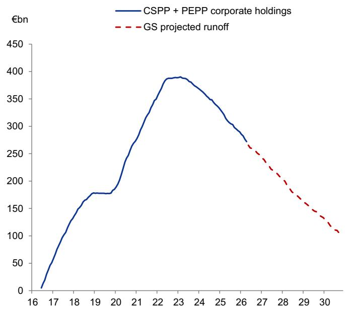

line

| Year | CSPP + PEPP corporate holdings (€bn) | GS projected runoff (€bn) |
|------|----------------------------------------|---------------------------|
| 16   | 0                                      | -                         |
| 17   | 50                                     | -                         |
| 18   | 100                                    | -                         |
| 19   | 175                                    | -                         |
| 20   | 175                                    | -                         |
| 21   | 250                                    | -                         |
| 22   | 350                                    | -                         |
| 23   | 390                                    | -                         |
| 24   | 375                                    | -                         |
| 25   | 350                                    | -                         |
| 26   | 300                                    | -                         |
| 27   | 250                                    | -                         |
| 28   | -                                      | -                         |
| 29   | -                                      | -                         |
| 30   | -                                      | -                         |

Source: ECB, Bloomberg, GS Global Investment Research

Exhibit 81: CSPP monthly run-off pace   
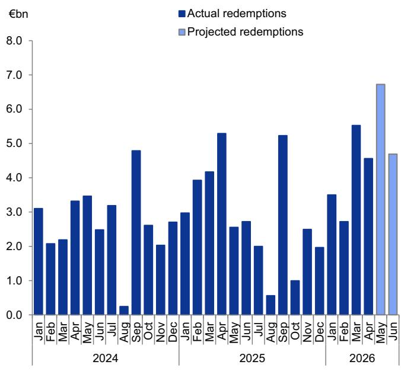

bar

| Month | Actual redemptions (€bn) | Projected redemptions (€bn) |
|---|---|---|
| Jan | 3.1 | |
| Feb | 2.1 | |
| Mar | 2.2 | |
| Apr | 3.3 | |
| May | 3.5 | |
| Jun | 2.5 | |
| Jul | 3.2 | |
| Aug | 0.3 | |
| Sep | 4.8 | |
| Oct | 2.6 | |
| Nov | 2.0 | |
| Dec | 2.7 | |
| Jan | 3.0 | |
| Feb | 3.9 | |
| Mar | 4.2 | |
| Apr | 5.3 | |
| May | 2.5 | |
| Jun | 2.7 | |
| Jul | 2.0 | |
| Aug | 0.5 | |
| Sep | 5.2 | |
| Oct | 1.0 | |
| Nov | 2.5 | |
| Dec | 2.0 | |
| Jan | 3.5 | |
| Feb | 2.7 | |
| Mar | 5.5 | |
| Apr | 4.5 | |
| May | 6.7 | |
| Jun | 4.7 | |

Source: ECB, GS Global Investment Research

Exhibit 82: Performance of CSPP-eligible bonds vs. non-eligible bonds   
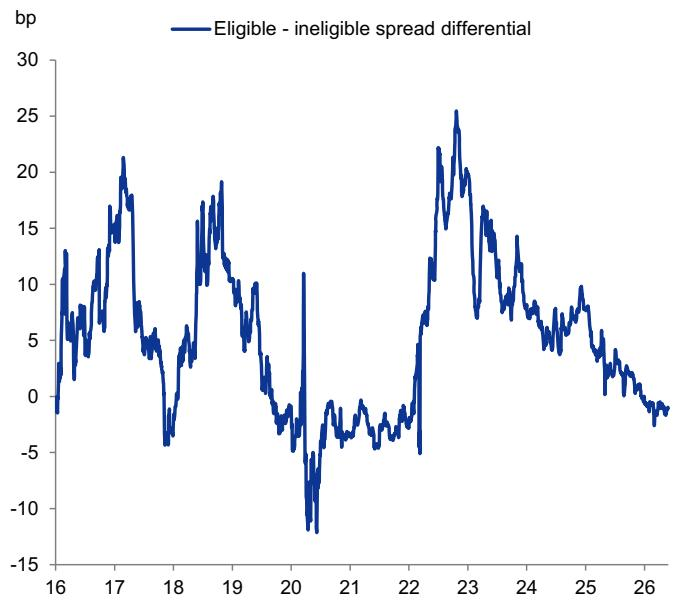

line

| Year | Eligible - ineligible spread differential (bp) |
| ---- | --------------------------------------------- |
| 16   | -1.0                                          |
| 17   | 21.0                                          |
| 18   | -4.0                                          |
| 19   | 19.0                                          |
| 20   | -12.0                                         |
| 21   | -3.0                                          |
| 22   | 25.0                                          |
| 23   | 17.0                                          |
| 24   | 8.0                                           |
| 25   | 10.0                                          |
| 26   | -2.0                                          |

Source: iBoxx, GS Global Investment Research

# Foreign demand and hedging cost

Exhibit 83: Net purchases of USD corporate bonds by foreign investors   
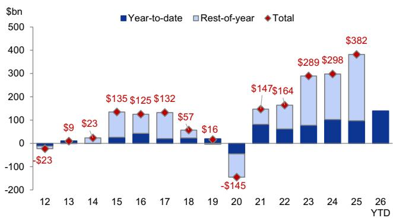

bar

| Year | Year-to-date | Rest-of-year | Total |
|------|--------------|--------------|-------|
| 12   | -            | -            | -$23  |
| 13   | -            | -            | $9    |
| 14   | -            | -            | $23   |
| 15   | -            | -            | $135  |
| 16   | -            | -            | $125  |
| 17   | -            | -            | $132  |
| 18   | -            | -            | $57   |
| 19   | -            | -            | $16   |
| 20   | -$145        | -            | -$145 |
| 21   | -            | -            | $147  |
| 22   | -            | -            | $164  |
| 23   | -            | -            | $289  |
| 24   | -            | -            | $298  |
| 25   | -            | -            | $382  |
| 26   | -            | -            | -     |

Note: As of March 2026.   
Source: Department of Treasury, GS Global Investment Research

Exhibit 84: Cumulative net foreign purchases of USD and EUR bonds by Japanese investors   

line

| Year | Cumulative net purchases of USD bonds (USD bn) | Cumulative net purchases of EUR bonds (EUR bn) |
|------|--------------------------------------------------|--------------------------------------------------|
| 2017 | -50                                              | -30                                              |
| 2018 | -100                                             | 100                                              |
| 2019 | 0                                                | 300                                              |
| 2020 | 150                                              | 120                                              |
| 2021 | 250                                              | 130                                              |
| 2022 | 200                                              | 110                                              |
| 2023 | 150                                              | 80                                               |
| 2024 | 300                                              | 60                                               |
| 2025 | 400                                              | 40                                               |
| 2026 | 450                                              | 30                                               |

Note: As of March 2026.   
Source: Bank of Japan, Haver Analytics, GS Global Investment Research

Exhibit 85: Annualized 3-month rolling cost of USD hedging against EUR, GBP and JPY   
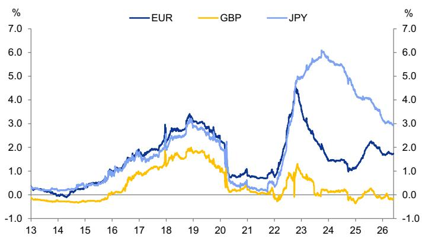

line

| Year | EUR  | GBP  | JPY  |
|------|------|------|------|
| 13   | 0.0  | -0.1 | 0.0  |
| 14   | 0.0  | -0.1 | 0.0  |
| 15   | 0.0  | -0.1 | 0.0  |
| 16   | 0.0  | -0.1 | 0.0  |
| 17   | 0.0  | 0.0  | 0.0  |
| 18   | 2.0  | 1.0  | 1.5  |
| 19   | 3.0  | 1.5  | 2.5  |
| 20   | 2.0  | 0.5  | 1.5  |
| 21   | 1.0  | 0.0  | 0.5  |
| 22   | 1.5  | -0.5 | 1.0  |
| 23   | 4.5  | 1.5  | 5.0  |
| 24   | 2.0  | 0.5  | 6.0  |
| 25   | 1.5  | 0.0  | 4.5  |
| 26   | 2.0  | -0.1 | 3.0  |

Source: GS FICC and Equities, GS Global Investment Research

# Primary market dashboard: USD gross issuance

# Exhibit 86: USD IG gross issuance

Historical investment grade issuance: Same period year to date vs. rest of the year

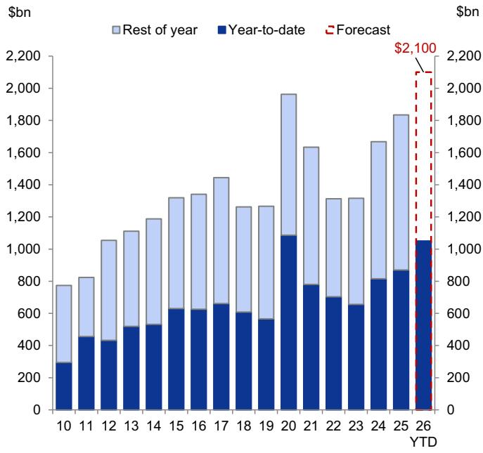

bar

| Year | Rest of year ($bn) | Year-to-date ($bn) | Forecast ($bn) |
|------|---------------------|--------------------|----------------|
| 10   | 780                 | 300                | -              |
| 11   | 820                 | 450                | -              |
| 12   | 950                 | 420                | -              |
| 13   | 1050                | 520                | -              |
| 14   | 1180                | 530                | -              |
| 15   | 1320                | 630                | -              |
| 16   | 1350                | 620                | -              |
| 17   | 1450                | 660                | -              |
| 18   | 1280                | 610                | -              |
| 19   | 1290                | 570                | -              |
| 20   | 1980                | 1090               | -              |
| 21   | 1640                | 780                | -              |
| 22   | 1320                | 710                | -              |
| 23   | 1330                | 650                | -              |
| 24   | 1680                | 810                | -              |
| 25   | 1840                | 870                | -              |
| 26   | -                   | 1060               | $2,100         |

Source: Dealogic, GS Global Investment Research

# Exhibit 87: USD HY gross issuance

Historical USD high yield issuance: Same period year to date vs. rest of the year

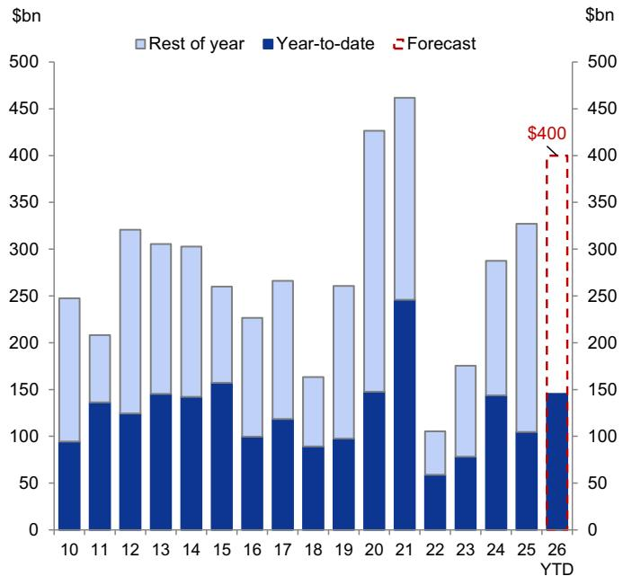

bar

| Year | Rest of year ($bn) | Year-to-date ($bn) | Forecast ($bn) |
|------|---------------------|---------------------|----------------|
| 10   | 180                 | 90                  | -              |
| 11   | 120                 | 130                 | -              |
| 12   | 220                 | 120                 | -              |
| 13   | 190                 | 140                 | -              |
| 14   | 180                 | 140                 | -              |
| 15   | 130                 | 150                 | -              |
| 16   | 170                 | 100                 | -              |
| 17   | 200                 | 120                 | -              |
| 18   | 130                 | 90                  | -              |
| 19   | 200                 | 90                  | -              |
| 20   | 250                 | 140                 | -              |
| 21   | 220                 | 240                 | -              |
| 22   | 80                  | 60                  | -              |
| 23   | 130                 | 70                  | -              |
| 24   | 180                 | 140                 | -              |
| 25   | 220                 | 100                 | -              |
| 26   | -                   | 140                 | $400           |

Source: Dealogic, GS Global Investment Research

Exhibit 88: USD institutional leveraged loan gross issuance
Historical leveraged loan issuance: Same period year to date vs. rest of the year   
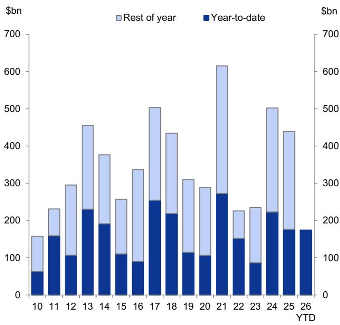

bar_stacked

| Year | Rest of year ($bn) | Year-to-date ($bn) |
| :--- | :--- | :--- |
| 10 | 150 | 60 |
| 11 | 160 | 150 |
| 12 | 290 | 105 |
| 13 | 455 | 225 |
| 14 | 375 | 185 |
| 15 | 255 | 110 |
| 16 | 335 | 90 |
| 17 | 500 | 250 |
| 18 | 430 | 215 |
| 19 | 305 | 115 |
| 20 | 285 | 105 |
| 21 | 615 | 270 |
| 22 | 220 | 150 |
| 23 | 230 | 85 |
| 24 | 495 | 215 |
| 25 | 435 | 175 |
| 26 | - | 175 |

Source: Pitchbook LCD, GS Global Investment Research

# Exhibit 89: USD CLO creation

Historical USD CLO creation: Same period year to date vs. rest of the year

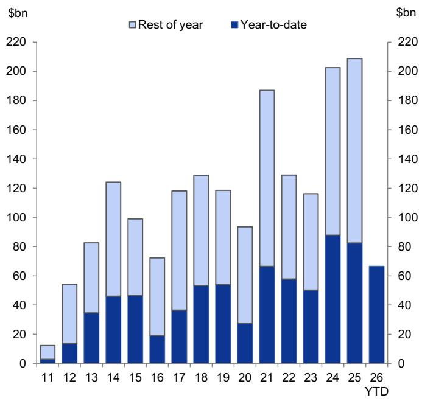

bar_stacked

| Year | Rest of year ($bn) | Year-to-date ($bn) |
| :--- | :--- | :--- |
| 11 | 10 | 5 |
| 12 | 48 | 13 |
| 13 | 57 | 34 |
| 14 | 90 | 46 |
| 15 | 63 | 46 |
| 16 | 50 | 19 |
| 17 | 95 | 36 |
| 18 | 98 | 53 |
| 19 | 82 | 54 |
| 20 | 72 | 27 |
| 21 | 110 | 66 |
| 22 | 88 | 58 |
| 23 | 77 | 50 |
| 24 | 105 | 87 |
| 25 | 115 | 82 |
| 26 | 0 | 66 |

Source: Pitchbook LCD, GS Global Investment Research

# Primary market dashboard: EUR gross issuance

# Exhibit 90: EUR IG gross issuance

Historical EUR investment grade issuance: Same period year to date vs. rest of the year

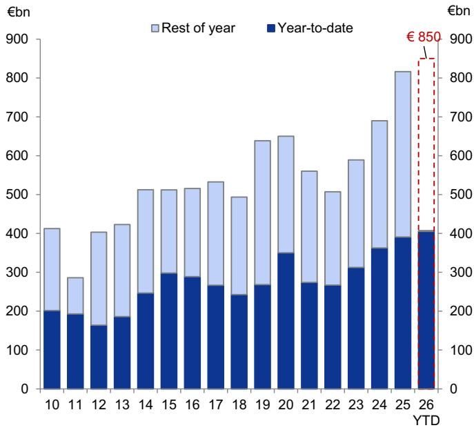

bar_stacked

| Year | Rest of year (€bn) | Year-to-date (€bn) |
| :--- | :--- | :--- |
| 10 | 240 | 200 |
| 11 | 130 | 190 |
| 12 | 270 | 160 |
| 13 | 300 | 180 |
| 14 | 320 | 240 |
| 15 | 280 | 290 |
| 16 | 290 | 280 |
| 17 | 310 | 260 |
| 18 | 290 | 240 |
| 19 | 420 | 260 |
| 20 | 380 | 340 |
| 21 | 350 | 270 |
| 22 | 310 | 260 |
| 23 | 360 | 310 |
| 24 | 410 | 360 |
| 25 | 480 | 390 |
| YTD | - | €850 |
| 26 | - | 400 |

Source: Dealogic, GS Global Investment Research

# Exhibit 92: EUR Leveraged loan gross issuance

Historical EUR leveraged loan issuance: Same period year to date vs. rest of the year

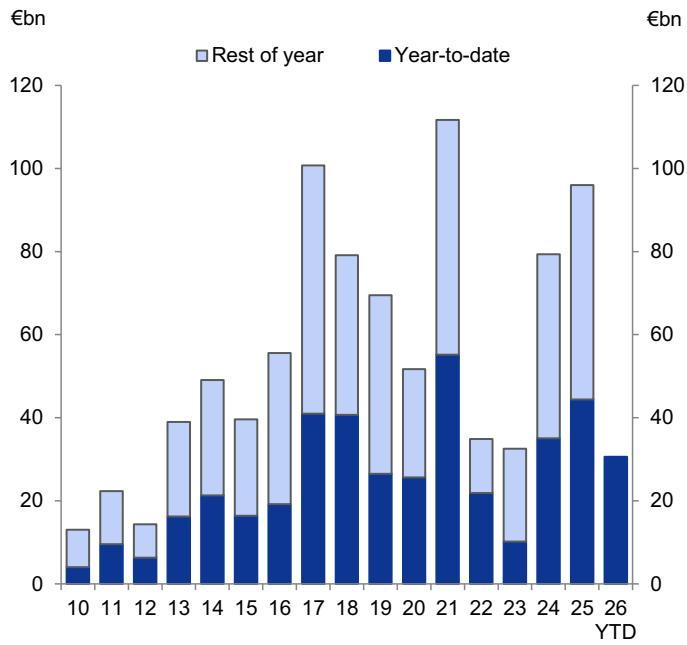

bar_stacked

| Year | Rest of year (€bn) | Year-to-date (€bn) |
| :--- | :--- | :--- |
| 10 | 12 | 4 |
| 11 | 18 | 9 |
| 12 | 13 | 6 |
| 13 | 27 | 15 |
| 14 | 32 | 21 |
| 15 | 30 | 16 |
| 16 | 45 | 19 |
| 17 | 65 | 40 |
| 18 | 48 | 40 |
| 19 | 55 | 26 |
| 20 | 35 | 25 |
| 21 | 58 | 55 |
| 22 | 20 | 21 |
| 23 | 25 | 10 |
| 24 | 48 | 34 |
| 25 | 48 | 44 |
| 26 | - | 30 |

Source: Pitchbook LCD, GS Global Investment Research

# Exhibit 91: EUR HY gross issuance

Historical EUR high yield issuance: Same period year to date vs. rest of the year

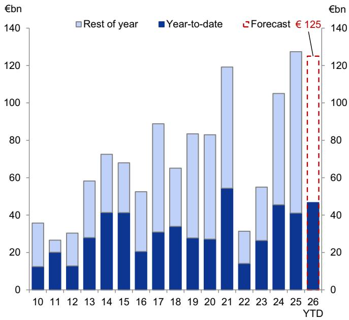

bar_stacked

| Year | Rest of year (€bn) | Year-to-date (€bn) | Forecast (€bn) |
| :--- | :--- | :--- | :--- |
| 10 | 36 | 12 | - |
| 11 | 26 | 20 | - |
| 12 | 30 | 13 | - |
| 13 | 58 | 27 | - |
| 14 | 73 | 41 | - |
| 15 | 68 | 41 | - |
| 16 | 53 | 20 | - |
| 17 | 89 | 31 | - |
| 18 | 65 | 34 | - |
| 19 | 83 | 27 | - |
| 20 | 83 | 27 | - |
| 21 | 120 | 54 | - |
| 22 | 31 | 14 | - |
| 23 | 55 | 25 | - |
| 24 | 105 | 45 | - |
| 25 | 128 | 41 | €125 |
| YTD | - | - | - |
Forecast: €125

Source: Dealogic, GS Global Investment Research

# Exhibit 93: EUR CLO creation

Historical EUR CLO creation broken: Same period year to date vs. rest of the year

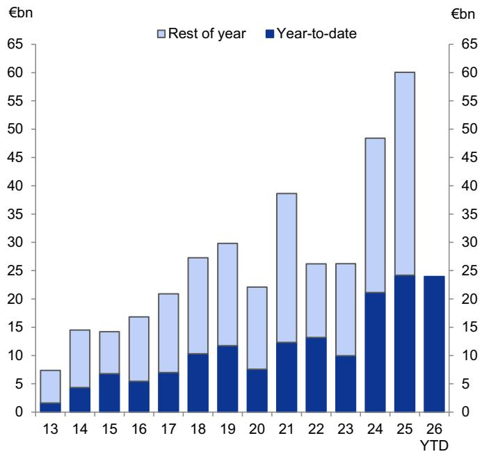

bar_stacked

| Year | Rest of year (€bn) | Year-to-date (€bn) |
| :--- | :--- | :--- |
| 13 | 7 | 2 |
| 14 | 14 | 5 |
| 15 | 14 | 7 |
| 16 | 17 | 6 |
| 17 | 21 | 7 |
| 18 | 27 | 10 |
| 19 | 30 | 12 |
| 20 | 22 | 8 |
| 21 | 39 | 12 |
| 22 | 26 | 13 |
| 23 | 26 | 10 |
| 24 | 48 | 21 |
| 25 | 60 | 24 |
| 26 | - | 24 |

Source: Pitchbook LCD, GS Global Investment Research

# Primary market dashboard: Use of proceeds

Exhibit 94: Annual USD IG issuance volumes by use of proceeds   
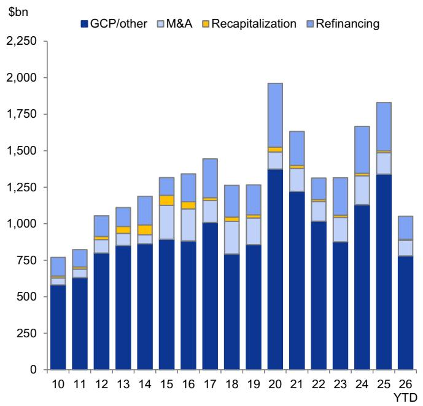

bar_stacked

| Year | GCP/other ($bn) | M&A ($bn) | Recapitalization ($bn) | Refinancing ($bn) |
| :--- | :--- | :--- | :--- | :--- |
| 10 | 570 | 40 | 30 | 180 |
| 11 | 620 | 45 | 35 | 190 |
| 12 | 780 | 80 | 40 | 200 |
| 13 | 840 | 90 | 50 | 220 |
| 14 | 860 | 95 | 60 | 230 |
| 15 | 890 | 110 | 70 | 240 |
| 16 | 880 | 115 | 65 | 250 |
| 17 | 1000 | 110 | 55 | 280 |
| 18 | 780 | 130 | 55 | 260 |
| 19 | 860 | 135 | 55 | 270 |
| 20 | 1380 | 115 | 65 | 390 |
| 21 | 1230 | 120 | 65 | 330 |
| 22 | 1010 | 125 | 45 | 230 |
| 23 | 870 | 135 | 45 | 290 |
| 24 | 1130 | 145 | 45 | 340 |
| 25 | 1350 | 135 | 45 | 340 |
| 26 | 770 | 95 | 35 | 230 |

Source: Dealogic, GS Global Investment Research

Exhibit 95: USD HY issuance volumes by use of proceeds   
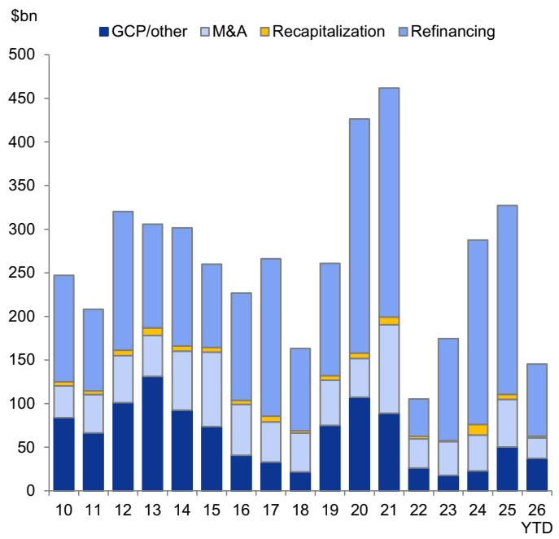

bar_stacked

| Year | GCP/other ($bn) | M&A ($bn) | Recapitalization ($bn) | Refinancing ($bn) |
| :--- | :--- | :--- | :--- | :--- |
| 10 | 83 | 27 | 5 | 149 |
| 11 | 65 | 42 | 5 | 115 |
| 12 | 100 | 48 | 5 | 173 |
| 13 | 130 | 48 | 10 | 143 |
| 14 | 92 | 64 | 5 | 153 |
| 15 | 73 | 84 | 5 | 129 |
| 16 | 42 | 64 | 5 | 139 |
| 17 | 33 | 48 | 5 | 170 |
| 18 | 21 | 42 | 5 | 139 |
| 19 | 74 | 42 | 5 | 153 |
| 20 | 107 | 38 | 5 | 276 |
| 21 | 89 | 84 | 10 | 299 |
| 22 | 26 | 42 | 5 | 48 |
| 23 | 17 | 38 | 5 | 149 |
| 24 | 23 | 38 | 10 | 200 |
| 25 | 50 | 56 | 5 | 200 |
| 26 | 38 | 20 | 5 | 139 |
The chart displays a stacked bar chart with values in $bn. The X-axis represents 'YTD' (Year-to-Date), and the Y-axis represents the monetary value. The legend defines four categories: GCP/other, M&A, Recapitalization, and Refinancing. The data is grouped by year from year start to year end.

Source: Dealogic, GS Global Investment Research

Exhibit 96: EUR IG issuance volumes by use of proceeds   
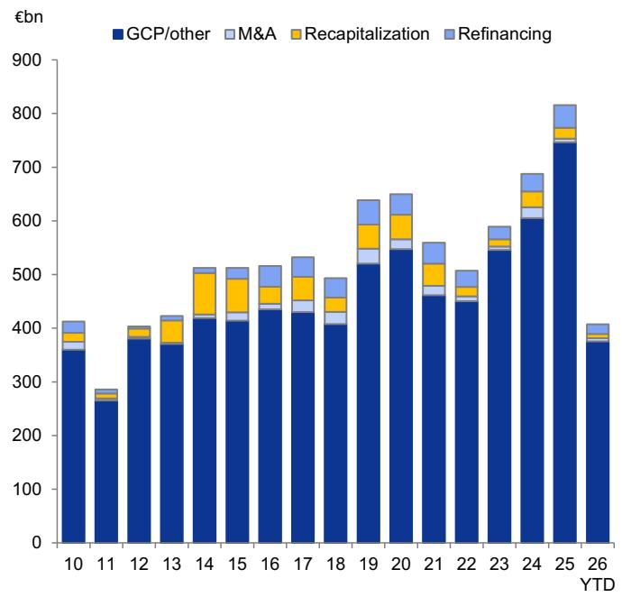

bar_stacked

| YTD | GCP/other (€bn) | M&A (€bn) | Recapitalization (€bn) | Refinancing (€bn) |
|---|---|---|---|---|
| 10 | 360 | 20 | 30 | 20 |
| 11 | 260 | 5 | 10 | 5 |
| 12 | 380 | 5 | 20 | 5 |
| 13 | 370 | 10 | 50 | 10 |
| 14 | 410 | 10 | 90 | 10 |
| 15 | 410 | 10 | 80 | 20 |
| 16 | 430 | 10 | 50 | 30 |
| 17 | 420 | 20 | 60 | 40 |
| 18 | 400 | 20 | 40 | 50 |
| 19 | 510 | 30 | 70 | 50 |
| 20 | 550 | 20 | 60 | 40 |
| 21 | 460 | 15 | 50 | 40 |
| 22 | 440 | 15 | 30 | 30 |
| 23 | 540 | 15 | 20 | 30 |
| 24 | 600 | 20 | 40 | 30 |
| 25 | 740 | 15 | 30 | 40 |
| 26 | 370 | 15 | 10 | 20 |

Source: Dealogic, GS Global Investment Research

Exhibit 97: EUR HY issuance volumes by use of proceeds   
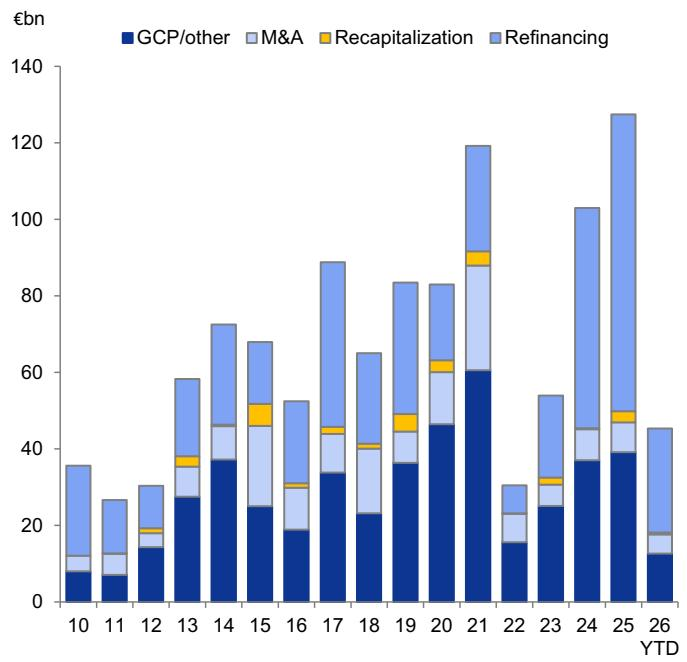

bar_stacked

| Year | GCP/other (€bn) | M&A (€bn) | Recapitalization (€bn) | Refinancing (€bn) |
| :--- | :--- | :--- | :--- | :--- |
| 10 | 8 | 5 | 0 | 34 |
| 11 | 7 | 7 | 0 | 26 |
| 12 | 14 | 3 | 2 | 19 |
| 13 | 27 | 10 | 5 | 28 |
| 14 | 37 | 10 | 0 | 33 |
| 15 | 25 | 25 | 8 | 23 |
| 16 | 19 | 13 | 5 | 33 |
| 17 | 33 | 12 | 4 | 58 |
| 18 | 23 | 25 | 2 | 39 |
| 19 | 36 | 10 | 7 | 44 |
| 20 | 46 | 15 | 5 | 30 |
| 21 | 60 | 28 | 6 | 38 |
| 22 | 16 | 10 | 0 | 14 |
| 23 | 25 | 6 | 3 | 29 |
| 24 | 37 | 8 | 0 | 60 |
| 25 | 39 | 8 | 5 | 74 |
| 26 | 12 | 5 | 0 | 44 |

Source: Dealogic, GS Global Investment Research

# Primary market dashboard: Net issuance

Note: Decomposition of the change in par value outstanding into net ratings migration vs. "organic" net issuance (gross issuance minus redemptions/matured bonds)

Exhibit 98: Annual USD IG net issuance   
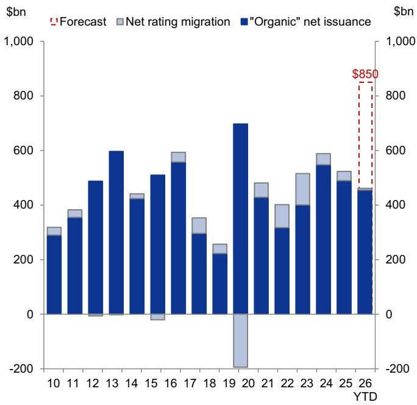

bar

| Year | Organic | Net rating migration | Forecast |
|------|---------|----------------------|----------|
| 10   | 300     | 50                   |          |
| 11   | 350     | 50                   |          |
| 12   | 480     | 0                    |          |
| 13   | 600     | 0                    |          |
| 14   | 420     | 20                   |          |
| 15   | 500     | -50                  |          |
| 16   | 550     | 50                   |          |
| 17   | 300     | 50                   |          |
| 18   | 220     | 50                   |          |
| 19   | 700     | -200                 |          |
| 20   | 420     | 50                   |          |
| 21   | 320     | 50                   |          |
| 22   | 400     | 50                   |          |
| 23   | 400     | 100                  |          |
| 24   | 550     | 50                   |          |
| 25   | 480     | 50                   |          |
| 26   | 450     | 0                    | $850     |

Source: Bloomberg, GS Global Investment Research

Exhibit 99: Annual USD HY net issuance   
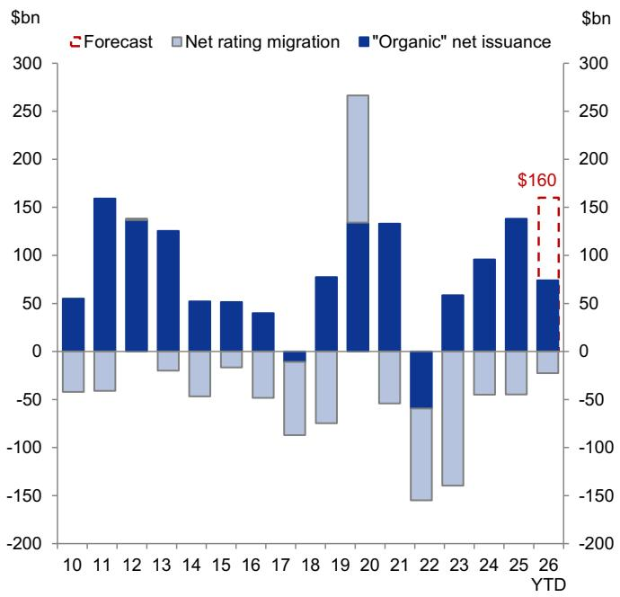

bar

| YTD | Forecast | Net rating migration | "Organic" net issuance |
| --- | --- | --- | --- |
| 10 | - | -40 | 55 |
| 11 | - | -45 | 160 |
| 12 | - | - | 135 |
| 13 | - | -25 | 125 |
| 14 | - | -45 | 50 |
| 15 | - | -20 | 50 |
| 16 | - | -45 | 40 |
| 17 | - | -85 | -10 |
| 18 | - | -70 | 75 |
| 19 | - | 270 | 130 |
| 20 | - | 270 | 130 |
| 21 | - | -50 | 130 |
| 22 | - | -160 | -50 |
| 23 | - | -140 | 55 |
| 24 | - | -40 | 95 |
| 25 | - | -40 | 140 |
| 26 | $160 | -20 | 70 |

Source: Bloomberg, GS Global Investment Research

Exhibit 100: Annual EUR IG net issuance   
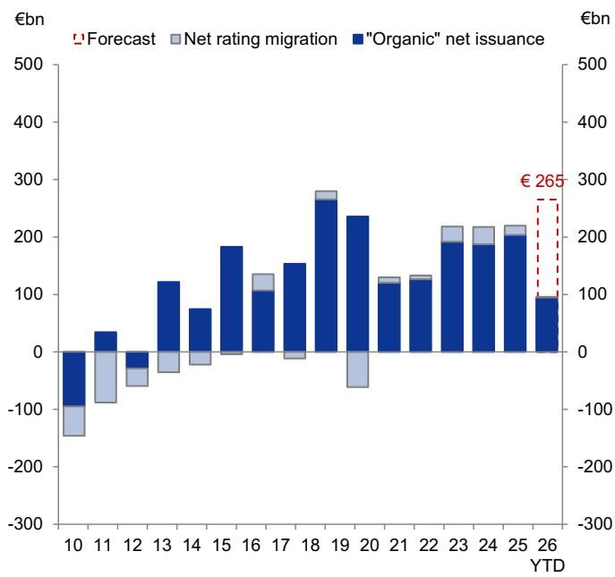

bar

| YTD | Forecast (€bn) | Net rating migration (€bn) | "Organic" net issuance (€bn) |
|-----|-----------------|----------------------------|------------------------------|
| 10  | -               | -150                       | -100                         |
| 11  | -               | -80                        | 30                           |
| 12  | -               | -40                        | -20                          |
| 13  | -               | -20                        | 120                          |
| 14  | -               | -10                        | 70                           |
| 15  | -               | -5                         | 180                          |
| 16  | -               | 0                          | 100                          |
| 17  | -               | -10                        | 150                          |
| 18  | -               | -5                         | 270                          |
| 19  | -               | -50                        | 230                          |
| 20  | -               | -5                         | 120                          |
| 21  | -               | 0                          | 120                          |
| 22  | -               | 0                          | 190                          |
| 23  | -               | 0                          | 200                          |
| 24  | -               | 0                          | 200                          |
| 25  | -               | 0                          | 210                          |
| 26  | €265            | -                          | 90                           |

Source: Bloomberg, GS Global Investment Research

Exhibit 101: Annual EUR HY net issuance   
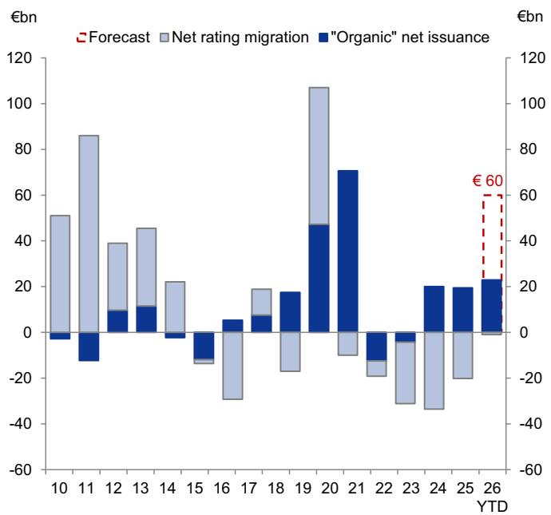

bar

| YTD | Forecast (€bn) | Net rating migration (€bn) | "Organic" net issuance (€bn) |
|-----|-----------------|----------------------------|------------------------------|
| 10  |                 | 50                         | -5                           |
| 11  |                 | 85                         | -15                          |
| 12  |                 | 38                         | 10                           |
| 13  |                 | 45                         | 12                           |
| 14  |                 | 22                         | -2                           |
| 15  |                 | -10                        | -15                          |
| 16  |                 | -25                        | 5                            |
| 17  |                 | 18                         | 8                            |
| 18  |                 | -15                        | 18                           |
| 19  |                 | -10                        | 45                           |
| 20  |                 | 45                         | 70                           |
| 21  |                 | -5                         | -5                           |
| 22  |                 | -15                        | -5                           |
| 23  |                 | -30                        | -5                           |
| 24  |                 | -35                        | 20                           |
| 25  |                 | -20                        | 20                           |
| 26  | €60             | 0                          | 25                           |

Source: Bloomberg, GS Global Investment Research

# M&A volume

Exhibit 102: Annual US M&A deal volume   
Includes strategic and sponsored deals   
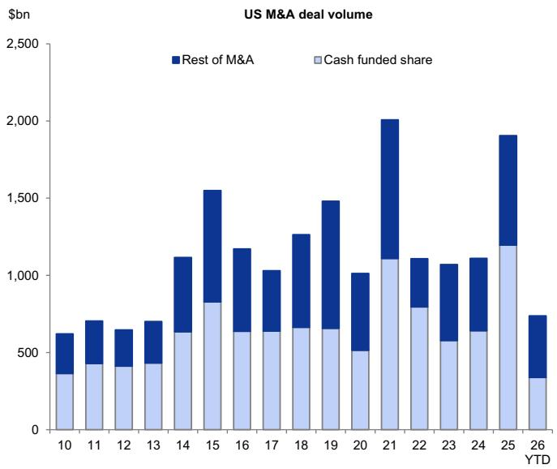

bar_stacked

US M&A deal volume
| Year | Cash funded share ($bn) | Rest of M&A ($bn) |
| :--- | :--- | :--- |
| 10 | 350 | 400 |
| 11 | 420 | 480 |
| 12 | 400 | 450 |
| 13 | 430 | 470 |
| 14 | 620 | 680 |
| 15 | 820 | 950 |
| 16 | 630 | 850 |
| 17 | 630 | 720 |
| 18 | 660 | 950 |
| 19 | 650 | 1050 |
| 20 | 510 | 780 |
| 21 | 1100 | 1150 |
| 22 | 780 | 550 |
| 23 | 570 | 750 |
| 24 | 630 | 750 |
| 25 | 1180 | 980 |
| 26 YTD | 330 | 650 |

Source: Dealogic, GS Global Investment Research

Exhibit 103: Annual European M&A deal volume   
Includes strategic and sponsored deals   
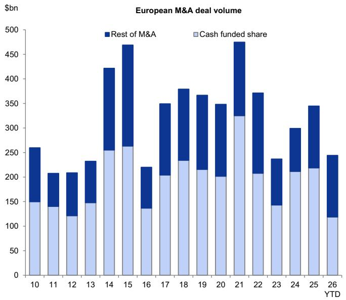

bar_stacked

European M&A deal volume
| Year | Cash funded share ($bn) | Rest of M&A ($bn) |
| :--- | :--- | :--- |
| 10 | 148 | 157 |
| 11 | 139 | 109 |
| 12 | 118 | 113 |
| 13 | 146 | 132 |
| 14 | 254 | 229 |
| 15 | 262 | 260 |
| 16 | 135 | 123 |
| 17 | 202 | 230 |
| 18 | 234 | 245 |
| 19 | 213 | 245 |
| 20 | 200 | 235 |
| 21 | 323 | 274 |
| 22 | 206 | 245 |
| 23 | 142 | 150 |
| 24 | 210 | 145 |
| 25 | 218 | 160 |
| 26 | 116 | 170 |

Source: Pitchbook LCD, GS Global Investment Research

Exhibit 104: Year-to-date US M&A volume by sector   
Includes strategic and sponsored deals   
US year-to-date M&A volume by industry (\$bn)   
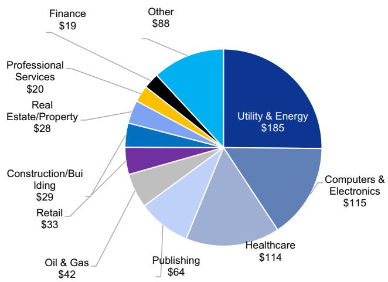

pie

| Category | Value ($) |
|---|---|
| Utility & Energy | 185 |
| Computers & Electronics | 115 |
| Healthcare | 114 |
| Publishing | 64 |
| Oil & Gas | 42 |
| Retail | 33 |
| Construction/Building | 29 |
| Real Estate/Property | 28 |
| Professional Services | 20 |
| Finance | 19 |
| Other | 88 |

Exhibit 105: Year-to-date European M&A volume by sector   
Includes strategic and sponsored deals   
European year-to-date M&A volume by industry (\$bn)   
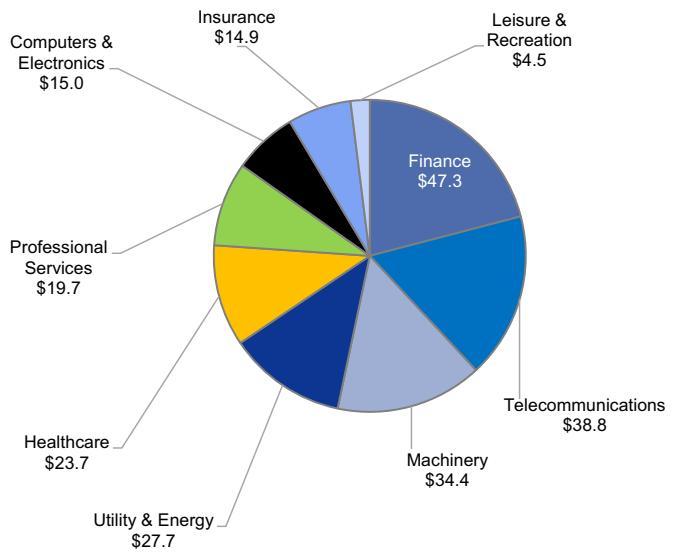

pie

| Category | Value ($) |
|---|---|
| Finance | 47.3 |
| Telecommunications | 38.8 |
| Machinery | 34.4 |
| Utility & Energy | 27.7 |
| Healthcare | 23.7 |
| Professional Services | 19.7 |
| Computers & Electronics | 15.0 |
| Insurance | 14.9 |
| Leisure & Recreation | 4.5 |

Source: Dealogic, GS Global Investment Research   
Source: Dealogic, GS Global Investment Research

# M&A volume (Strategic deals only)

Exhibit 106: Annual US strategic M&A volumes   
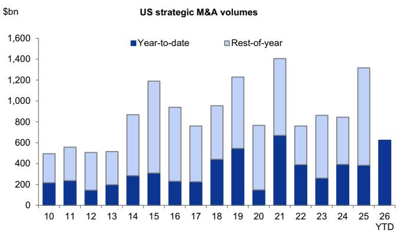

bar_stacked

US strategic M&A volumes
| Year | Year-to-date ($bn) | Rest-of-year ($bn) |
| :--- | :--- | :--- |
| 10 | 220 | 350 |
| 11 | 240 | 400 |
| 12 | 160 | 450 |
| 13 | 200 | 400 |
| 14 | 280 | 650 |
| 15 | 310 | 950 |
| 16 | 230 | 850 |
| 17 | 230 | 650 |
| 18 | 430 | 550 |
| 19 | 550 | 700 |
| 20 | 160 | 750 |
| 21 | 670 | 850 |
| 22 | 390 | 450 |
| 23 | 260 | 650 |
| 24 | 390 | 450 |
| 25 | 380 | 950 |
| YTD | 630 | - |
The chart displays stacked bars for 'Year-to-date' and 'Rest-of-year' categories. The total stacked bar height is based on the absolute value of the sum of the two components. The year-to-date values are not explicitly labeled but are included in the legend.

Source: Dealogic, GS Global Investment Research

Exhibit 107: Annual European strategic M&A volumes   
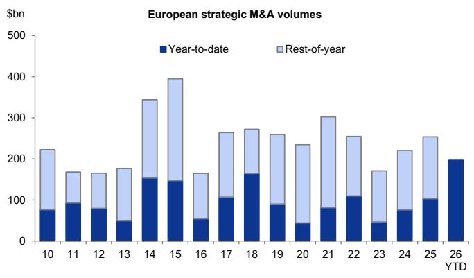

bar_stacked

European strategic M&A volumes
| Year | Year-to-date ($bn) | Rest-of-year ($bn) |
| :--- | :--- | :--- |
| 10 | 75 | 180 |
| 11 | 95 | 75 |
| 12 | 80 | 85 |
| 13 | 45 | 145 |
| 14 | 150 | 200 |
| 15 | 145 | 240 |
| 16 | 50 | 130 |
| 17 | 105 | 170 |
| 18 | 160 | 95 |
| 19 | 90 | 170 |
| 20 | 40 | 220 |
| 21 | 80 | 200 |
| 22 | 110 | 140 |
| 23 | 45 | 135 |
| 24 | 75 | 145 |
| 25 | 105 | 145 |
| 26 YTD | 200 | - |
The chart displays stacked bars for each year from year 10 to year 26. The values are in billions of dollars. The legend indicates 'Year-to-date' and 'Rest-of-year'.

Source: Dealogic, GS Global Investment Research

Exhibit 108: Annual US strategic M&A deal count   
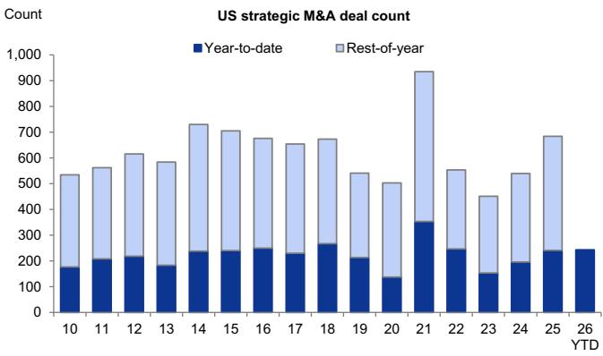

bar_stacked

US strategic M&A deal count
| Year | Year-to-date | Rest-of-year |
| :--- | :--- | :--- |
| 10 | 180 | 350 |
| 11 | 210 | 400 |
| 12 | 220 | 420 |
| 13 | 190 | 430 |
| 14 | 240 | 560 |
| 15 | 240 | 510 |
| 16 | 250 | 470 |
| 17 | 230 | 460 |
| 18 | 270 | 430 |
| 19 | 210 | 380 |
| 20 | 140 | 430 |
| 21 | 350 | 650 |
| 22 | 250 | 350 |
| 23 | 150 | 430 |
| 24 | 200 | 410 |
| 25 | 240 | 480 |
| YTD | 250 | 0 |
The chart displays a stacked bar chart comparing the total number of strategic M&A deals across years from year 10 to year 26. The 'Year-to-date' and 'Rest-of-year' values are not explicitly labeled but are included in the legend. The data is already in English.

Source: Dealogic, GS Global Investment Research

Exhibit 109: Annual European strategic M&A deal count   
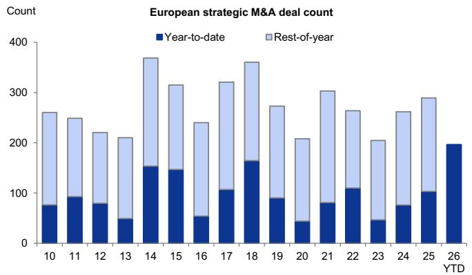

bar_stacked

European strategic M&A deal count
| Year | Year-to-date | Rest-of-year |
| :--- | :--- | :--- |
| 10 | 75 | 185 |
| 11 | 95 | 145 |
| 12 | 80 | 155 |
| 13 | 45 | 165 |
| 14 | 155 | 225 |
| 15 | 145 | 175 |
| 16 | 50 | 200 |
| 17 | 105 | 205 |
| 18 | 160 | 170 |
| 19 | 90 | 180 |
| 20 | 40 | 170 |
| 21 | 80 | 200 |
| 22 | 110 | 160 |
| 23 | 45 | 170 |
| 24 | 75 | 180 |
| 25 | 100 | 190 |
| YTD | 200 | - |
The chart displays stacked bars for each year from year 10 to year 26. The total count of deal counts is labeled above each bar.

Source: Pitchbook LCD, GS Global Investment Research

Exhibit 110: Annual US strategic M&A deal size   
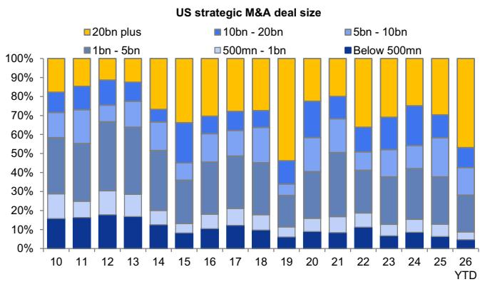

bar_stacked

| Year | Below 500mn | 500mn - 1bn | 1bn - 5bn | 10bn - 20bn | 20bn plus |
|------|-------------|-------------|-----------|-------------|-----------|
| 10   | 15%         | 15%         | 30%       | 15%         | 20%       |
| 11   | 15%         | 15%         | 30%       | 20%         | 20%       |
| 12   | 15%         | 15%         | 30%       | 20%         | 20%       |
| 13   | 15%         | 15%         | 30%       | 20%         | 20%       |
| 14   | 15%         | 15%         | 30%       | 20%         | 20%       |
| 15   | 15%         | 15%         | 30%       | 20%         | 20%       |
| 16   | 15%         | 15%         | 30%       | 20%         | 20%       |
| 17   | 15%         | 15%         | 30%       | 20%         | 20%       |
| 18   | 15%         | 15%         | 30%       | 20%         | 20%       |
| 19   | 15%         | 15%         | 30%       | 20%         | 20%       |
| 20   | 15%         | 15%         | 30%       | 20%         | 20%       |
| 21   | 15%         | 15%         | 30%       | 20%         | 20%       |
| 22   | 15%         | 15%         | 30%       | 20%         | 20%       |
| 23   | 15%         | 15%         | 30%       | 20%         | 20%       |
| 24   | 15%         | 15%         | 30%       | 20%         | 20%       |
| 25   | 15%         | 15%         | 30%       | 20%         | 20%       |
| 26   | 15%         | 15%         | 30%       | 20%         | 20%       |

Source: Dealogic, GS Global Investment Research

Exhibit 111: Annual European strategic M&A deal size   
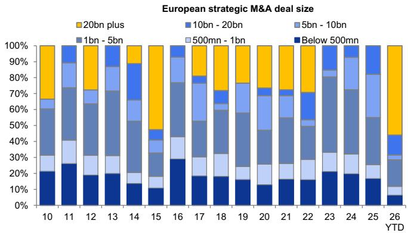

bar_stacked

| Year | Below 500mn | 500mn - 1bn | 1bn - 5bn | 5bn - 10bn | 10bn - 20bn | 20bn plus |
|------|-------------|-------------|-----------|------------|-------------|-----------|
| 10   | 20%         | 10%         | 20%       | 10%        | 20%         | 40%       |
| 11   | 25%         | 15%         | 30%       | 15%        | 25%         | 35%       |
| 12   | 20%         | 15%         | 35%       | 15%        | 25%         | 35%       |
| 13   | 20%         | 15%         | 40%       | 15%        | 25%         | 30%       |
| 14   | 15%         | 10%         | 45%       | 20%        | 30%         | 20%       |
| 15   | 10%         | 10%         | 45%       | 20%        | 30%         | 60%       |
| 16   | 25%         | 15%         | 40%       | 20%        | 30%         | 45%       |
| 17   | 20%         | 15%         | 35%       | 25%        | 30%         | 35%       |
| 18   | 20%         | 15%         | 35%       | 25%        | 30%         | 35%       |
| 19   | 20%         | 15%         | 35%       | 25%        | 30%         | 35%       |
| 20   | 20%         | 15%         | 35%       | 25%        | 30%         | 35%       |
| 21   | 20%         | 15%         | 35%       | 25%        | 30%         | 35%       |
| 22   | 20%         | 15%         | 35%       | 25%        | 30%         | 35%       |
| 23   | 20%         | 15%         | 40%       | 25%        | 30%         | 30%       |
| 24   | 20%         | 15%         | 40%       | 25%        | 30%         | 30%       |
| 25   | 20%         | 15%         | 40%       | 25%        | 30%         | 30%       |
| 26 YTD | 10%        | 10%         | 30%       | 20%        | 30%         | 60%       |

Source: Dealogic, GS Global Investment Research

# Primary market dashboard: CLO creation and refinancing

Exhibit 112: Annual USD Broadly syndicated loan CLO creation   
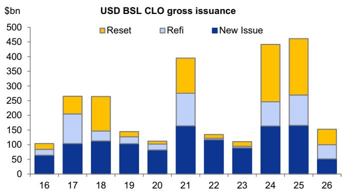

bar_stacked

| Year | Reset | Refi | New Issue |
|------|-------|------|-----------|
| 16   | 30    | 10   | 60        |
| 17   | 80    | 100  | 100       |
| 18   | 150   | 40   | 110       |
| 19   | 20    | 30   | 100       |
| 20   | 20    | 20   | 80        |
| 21   | 120   | 100  | 160       |
| 22   | 20    | 10   | 110       |
| 23   | 20    | 10   | 80        |
| 24   | 200   | 80   | 160       |
| 25   | 180   | 100  | 160       |
| 26   | 60    | 40   | 50        |

Source: Pitchbook LCD, GS Global Investment Research

Exhibit 113: Annual USD Middle market CLO creation   
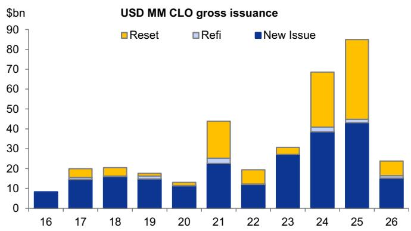

bar_stacked

USD MM CLO gross issuance
| Year | New Issue ($bn) | Reset ($bn) | Refi ($bn) |
| :--- | :--- | :--- | :--- |
| 16 | 8 | 0 | 0 |
| 17 | 14 | 5 | 0 |
| 18 | 16 | 5 | 0 |
| 19 | 15 | 0 | 3 |
| 20 | 11 | 2 | 1 |
| 21 | 22 | 19 | 3 |
| 22 | 12 | 7 | 0 |
| 23 | 26 | 3 | 0 |
| 24 | 39 | 25 | 3 |
| 25 | 43 | 34 | 3 |
| 26 | 15 | 8 | 0 |

Source: Pitchbook LCD, GS Global Investment Research

Exhibit 114: Annual USD leveraged loan net issuance   
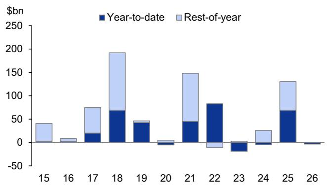

bar_stacked

| Year | Year-to-date ($bn) | Rest-of-year ($bn) |
| :--- | :--- | :--- |
| 15 | 0 | 40 |
| 16 | 0 | 5 |
| 17 | 20 | 60 |
| 18 | 65 | 130 |
| 19 | 45 | 5 |
| 20 | -5 | 5 |
| 21 | 45 | 100 |
| 22 | 80 | -10 |
| 23 | -20 | 0 |
| 24 | -5 | 25 |
| 25 | 65 | 70 |
| 26 | -5 | 0 |

Source: Pitchbook LCD, GS Global Investment Research   
Upcoming notional above prevailing WACD

Exhibit 115: USD CLO refinance monitor

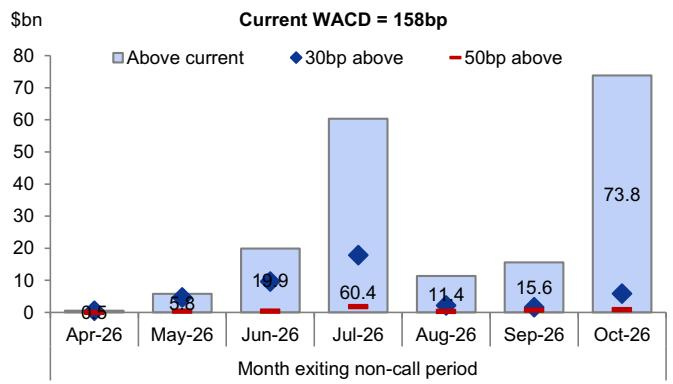

bar

| Month exiting non-call period | Above current | 30bp above | 50bp above |
| ----------------------------- | ------------- | ---------- | ---------- |
| Apr-26                        | 0.5           | 0.5        | 0.5        |
| May-26                        | 5.8           | 5.8        | 0.5        |
| Jun-26                        | 19.9          | 19.9       | 0.5        |
| Jul-26                        | 60.4          | 60.4       | 0.5        |
| Aug-26                        | 11.4          | 11.4       | 0.5        |
| Sep-26                        | 15.6          | 15.6       | 0.5        |
| Oct-26                        | 73.8          | 73.8       | 0.5        |

Source: Pitchbook LCD, GS Global Investment Research   
Notional above prevailing WACD by origination quarter

Exhibit 116: USD CLO refinance monitor

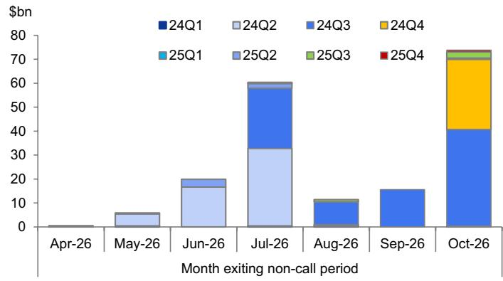

bar_stacked

| Month exiting non-call period | 24Q1 ($bn) | 24Q2 ($bn) | 24Q3 ($bn) | 24Q4 ($bn) | 25Q1 ($bn) | 25Q2 ($bn) | 25Q3 ($bn) | 25Q4 ($bn) |
|---|---|---|---|---|---|---|---|---|
| Apr-26 | 0.5 | 0.5 | 0.0 | 0.0 | 0.0 | 0.0 | 0.0 | 0.0 |
| May-26 | 0.0 | 0.0 | 5.0 | 0.0 | 0.0 | 0.0 | 0.0 | 0.0 |
| Jun-26 | 0.0 | 0.0 | 15.0 | 2.0 | 1.0 | 1.0 | 0.0 | 0.0 |
| Jul-26 | 0.0 | 32.0 | 28.0 | 1.0 | 1.0 | 1.0 | 0.5 | 0.0 |
| Aug-26 | 10.0 | 0.5 | 1.0 | 0.5 | 0.5 | 1.0 | 1.0 | 0.5 |
| Sep-26 | 15.0 | 0.0 | 0.5 | 0.5 | 0.5 | 0.5 | 1.5 | 1.5 |
| Oct-26 | 40.0 | 0.0 | 38.0 | 33.0 | 1.5 | 1.5 | 2.5 | 2.5 |
The chart displays a stacked bar chart with each quarter's value labeled on top of the stack, and the x-axis represents months from Apr-26 to Oct-26.

Source: Pitchbook LCD, GS Global Investment Research

# Primary market dashboard: Maturity walls

Exhibit 117: USD IG bond market maturity wall   
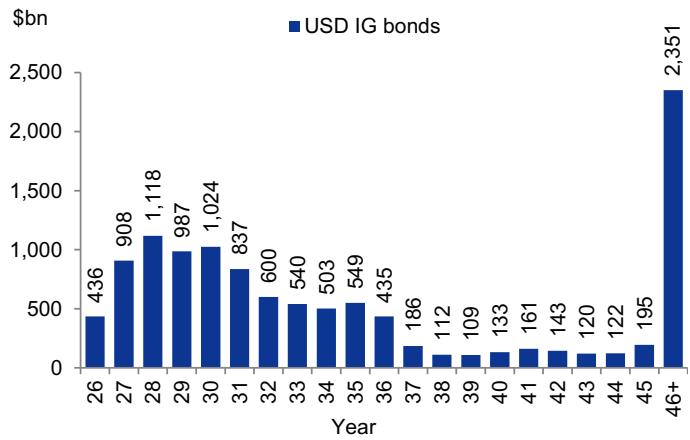

bar

| Year | USD IG bonds ($bn) |
| :--- | :--- |
| 26 | 436 |
| 27 | 908 |
| 28 | 1,118 |
| 29 | 987 |
| 30 | 1,024 |
| 31 | 837 |
| 32 | 600 |
| 33 | 540 |
| 34 | 503 |
| 35 | 549 |
| 36 | 435 |
| 37 | 186 |
| 38 | 112 |
| 39 | 109 |
| 40 | 133 |
| 41 | 161 |
| 42 | 143 |
| 43 | 120 |
| 44 | 122 |
| 45 | 195 |
| 46+ | 2,351 |

Source: Bloomberg, GS Global Investment Research

Exhibit 118: EUR IG bond market maturity wall   
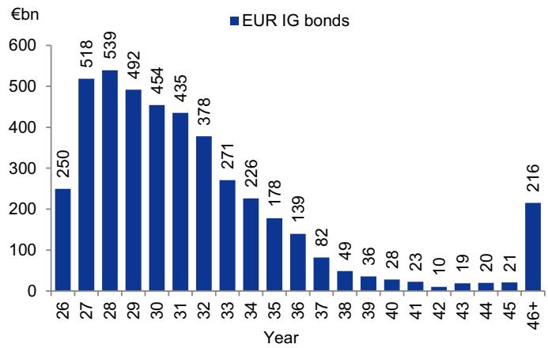

bar

| Year | EUR IG bonds (€bn) |
| :--- | :--- |
| 26 | 250 |
| 27 | 518 |
| 28 | 539 |
| 29 | 492 |
| 30 | 454 |
| 31 | 435 |
| 32 | 378 |
| 33 | 271 |
| 34 | 226 |
| 35 | 178 |
| 36 | 139 |
| 37 | 82 |
| 38 | 49 |
| 39 | 36 |
| 40 | 28 |
| 41 | 23 |
| 42 | 10 |
| 43 | 19 |
| 44 | 20 |
| 45 | 21 |
| 46+ | 216 |

Source: Bloomberg, GS Global Investment Research

Exhibit 119: USD HY bond market maturity wall   
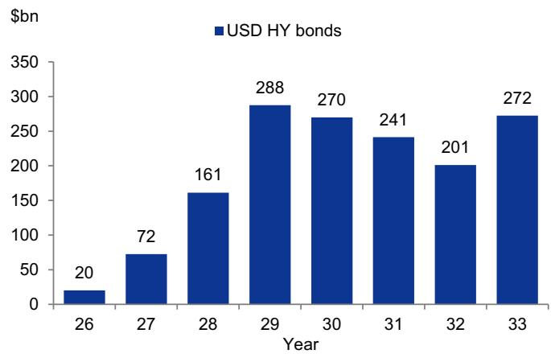

bar

USD HY bonds
| Year | USD HY bonds ($bn) |
| :--- | :--- |
| 26 | 20 |
| 27 | 72 |
| 28 | 161 |
| 29 | 288 |
| 30 | 270 |
| 31 | 241 |
| 32 | 201 |
| 33 | 272 |

Source: Bloomberg, GS Global Investment Research

Exhibit 120: EUR HY bond market maturity wall   
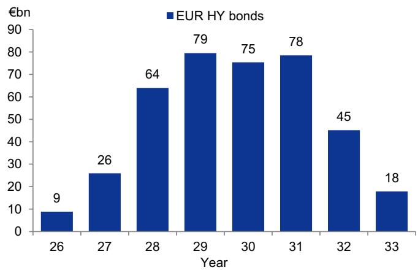

bar

EUR HY bonds
| Year | EUR HY bonds (€bn) |
| :--- | :--- |
| 26 | 9 |
| 27 | 26 |
| 28 | 64 |
| 29 | 79 |
| 30 | 75 |
| 31 | 78 |
| 32 | 45 |
| 33 | 18 |

Source: Bloomberg, GS Global Investment Research

Exhibit 121: USD leveraged loan market maturity wall   
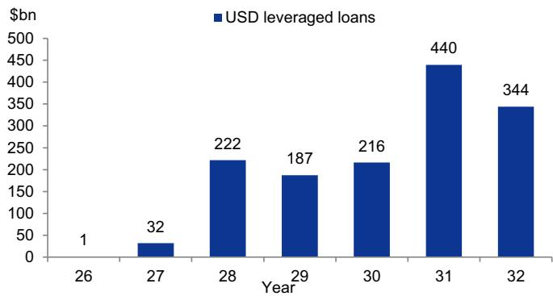

bar

USD leveraged loans
| Year | USD leveraged loans ($bn) |
| :--- | :--- |
| 26 | 1 |
| 27 | 32 |
| 28 | 222 |
| 29 | 187 |
| 30 | 216 |
| 31 | 440 |
| 32 | 344 |

Source: Pitchbook LCD, GS Global Investment Research

Exhibit 122: EUR leveraged loan market maturity wall   
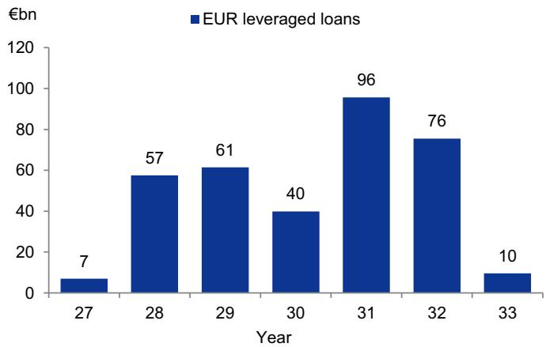

bar

EUR leveraged loans
| Year | EUR leveraged loans (€bn) |
| :--- | :--- |
| 27 | 7 |
| 28 | 57 |
| 29 | 61 |
| 30 | 40 |
| 31 | 96 |
| 32 | 76 |
| 33 | 10 |

Source: Pitchbook LCD, GS Global Investment Research

# Default and ratings migration dashboard: Default trends

# Exhibit 123: Default rates for US HY bond and leveraged loan issuers

12-month trailing issuer-weighted default rate in the US HY bond and leveraged loan markets

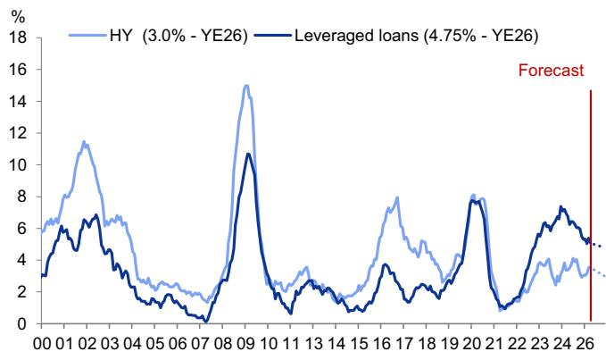

line

| Year | HY (%) | Leveraged loans (%) |
|------|--------|---------------------|
| 00   | ~6     | ~3                  |
| 01   | ~8     | ~5                  |
| 02   | ~11    | ~7                  |
| 03   | ~7     | ~5                  |
| 04   | ~5     | ~3                  |
| 05   | ~3     | ~2                  |
| 06   | ~2     | ~1                  |
| 07   | ~1     | ~0.5                |
| 08   | ~3     | ~2                  |
| 09   | ~15    | ~11                 |
| 10   | ~3     | ~2                  |
| 11   | ~2     | ~1                  |
| 12   | ~3     | ~2                  |
| 13   | ~2     | ~1                  |
| 14   | ~3     | ~2                  |
| 15   | ~4     | ~3                  |
| 16   | ~6     | ~4                  |
| 17   | ~8     | ~5                  |
| 18   | ~6     | ~4                  |
| 19   | ~8     | ~5                  |
| 20   | ~8     | ~7                  |
| 21   | ~6     | ~5                  |
| 22   | ~4     | ~3                  |
| 23   | ~5     | ~4                  |
| 24   | ~6     | ~5                  |
| 25   | ~5     | ~4                  |
| 26   | ~4     | ~3                  |

Source: Moody's, GS Global Investment Research

# Exhibit 125: High frequency default rates for US HY bond and leveraged loan issuers

3-month trailing issuer-weighted default rate in the US HY bond and leveraged loan markets

line

| Date | HY  | Leveraged loans |
|------|-----|-----------------|
| 00   | ~10 | ~5              |
| 01   | ~12 | ~7              |
| 02   | ~14 | ~8              |
| 03   | ~8  | ~4              |
| 04   | ~6  | ~3              |
| 05   | ~4  | ~2              |
| 06   | ~3  | ~1              |
| 07   | ~2  | ~1              |
| 08   | ~5  | ~3              |
| 09   | ~25 | ~18             |
| 10   | ~3  | ~2              |
| 11   | ~4  | ~3              |
| 12   | ~5  | ~4              |
| 13   | ~6  | ~5              |
| 14   | ~7  | ~6              |
| 15   | ~8  | ~7              |
| 16   | ~12 | ~6              |
| 17   | ~7  | ~5              |
| 18   | ~6  | ~4              |
| 19   | ~8  | ~5              |
| 20   | ~17 | ~15             |
| 21   | ~6  | ~4              |
| 22   | ~5  | ~3              |
| 23   | ~7  | ~6              |
| 24   | ~8  | ~7              |
| 25   | ~6  | ~5              |
| 26   | ~5  | ~4              |

Source: Moody's, GS Global Investment Research

Exhibit 127: Annual par value amounts of defaulted USD HY bonds and leveraged loans   

bar

| Year | HY ($bn) | Leveraged loans ($bn) |
| :--- | :--- | :--- |
| 10 | 16 | 12 |
| 11 | 18 | 6 |
| 12 | 21 | 12 |
| 13 | 10 | 12 |
| 14 | 25 | 25 |
| 15 | 54 | 17 |
| 16 | 55 | 30 |
| 17 | 22 | 20 |
| 18 | 30 | 14 |
| 19 | 62 | 36 |
| 20 | 85 | 70 |
| 21 | 5 | 10 |
| 22 | 18 | 24 |
| 23 | 43 | 55 |
| 24 | 30 | 87 |
| 25 | 25 | 68 |
| 26 | 13 | 14 |

Source: Moody's, GS Global Investment Research

# Exhibit 124: Default rates for European bond and leveraged loan issuers

12-month trailing issuer-weighted default rate in the European HY bond and leveraged loan markets

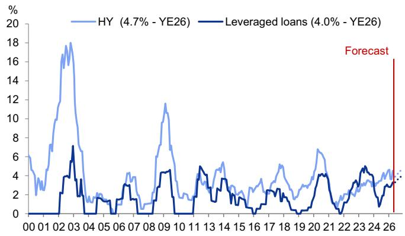

line

| Year | HY (4.7% - YE26) | Leveraged loans (4.0% - YE26) |
|------|------------------|-------------------------------|
| 00   | ~6               | ~0                            |
| 01   | ~8               | ~0                            |
| 02   | ~18              | ~4                            |
| 03   | ~18              | ~7                            |
| 04   | ~2               | ~2                            |
| 05   | ~4               | ~2                            |
| 06   | ~4               | ~2                            |
| 07   | ~4               | ~2                            |
| 08   | ~4               | ~2                            |
| 09   | ~12              | ~4                            |
| 10   | ~2               | ~2                            |
| 11   | ~4               | ~4                            |
| 12   | ~5               | ~4                            |
| 13   | ~5               | ~4                            |
| 14   | ~5               | ~4                            |
| 15   | ~5               | ~4                            |
| 16   | ~5               | ~4                            |
| 17   | ~5               | ~4                            |
| 18   | ~5               | ~4                            |
| 19   | ~5               | ~4                            |
| 20   | ~7               | ~4                            |
| 21   | ~7               | ~4                            |
| 22   | ~5               | ~4                            |
| 23   | ~5               | ~4                            |
| 24   | ~5               | ~4                            |
| 25   | ~5               | ~4                            |
| 26   | ~5               | ~4                            |

Source: Moody's, GS Global Investment Research

# Exhibit 126: High frequency default rates for European HY bond and leveraged loan issuers

3-month trailing issuer-weighted default rate in the European HY bond and leveraged loan markets

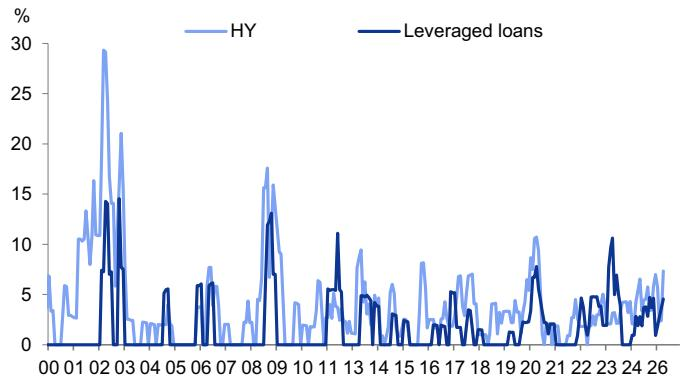

line

| Year | HY  | Leveraged loans |
|------|-----|-----------------|
| 00   | 5   | 0               |
| 01   | 10  | 0               |
| 02   | 30  | 15              |
| 03   | 20  | 15              |
| 04   | 5   | 0               |
| 05   | 5   | 0               |
| 06   | 5   | 0               |
| 07   | 5   | 0               |
| 08   | 15  | 10              |
| 09   | 15  | 10              |
| 10   | 5   | 0               |
| 11   | 5   | 10              |
| 12   | 5   | 5               |
| 13   | 5   | 5               |
| 14   | 5   | 5               |
| 15   | 5   | 5               |
| 16   | 5   | 5               |
| 17   | 5   | 5               |
| 18   | 5   | 5               |
| 19   | 5   | 5               |
| 20   | 5   | 5               |
| 21   | 5   | 5               |
| 22   | 5   | 5               |
| 23   | 5   | 10              |
| 24   | 5   | 5               |
| 25   | 5   | 5               |
| 26   | 5   | 5               |

Source: Moody's, GS Global Investment Research

Exhibit 128: Par value amounts of defaulted EUR HY bonds and leveraged loans   

bar

| Year | HY (€bn) | Leveraged loans (€bn) |
| :--- | :--- | :--- |
| 10 | 5.5 | 2.5 |
| 11 | 11.5 | 0.0 |
| 12 | 3.5 | 9.0 |
| 13 | 19.5 | 5.5 |
| 14 | 4.5 | 2.0 |
| 15 | 6.5 | 0.5 |
| 16 | 3.5 | 7.0 |
| 17 | 11.0 | 6.0 |
| 18 | 5.0 | 1.5 |
| 19 | 6.0 | 1.0 |
| 20 | 19.0 | 15.0 |
| 21 | 3.0 | 1.0 |
| 22 | 2.5 | 8.0 |
| 23 | 14.5 | 13.0 |
| 24 | 10.5 | 7.5 |
| 25 | 49.5 | 22.0 |
| 26 | 5.0 | 4.5 |

Source: Moody's, GS Global Investment Research

Exhibit 129: Top 5 largest defaults in the USD HY bond and leveraged loan markets in the past 12 months 

<table><tr><td></td><td>Default date</td><td>Issuer</td><td>Industry</td><td>Default type</td><td>Notional amount ($bn)</td></tr><tr><td rowspan="5">HY</td><td>1/29/2026</td><td>LABL, Inc.</td><td>Containers, Packaging, &amp; Glass</td><td>Prepackaged Chapter 11</td><td>2.9</td></tr><tr><td>11/20/2025</td><td>New Fortress Energy Inc.</td><td>Energy: Oil &amp; Gas</td><td>Missed interest payment</td><td>2.7</td></tr><tr><td>1/14/2026</td><td>Saks Global Enterprises LLC</td><td>Retail</td><td>Chapter 11</td><td>2.7</td></tr><tr><td>4/16/2026</td><td>QVC, Inc.</td><td>Retail</td><td>Prepackaged Chapter 11</td><td>2.7</td></tr><tr><td>8/8/2025</td><td>Saks Global Enterprises LLC</td><td>Retail</td><td>Distressed exchange</td><td>2.1</td></tr><tr><td rowspan="5">Loans</td><td>9/28/2025</td><td>First Brands Group, LLC</td><td>Automotive</td><td>Chapter 11</td><td>4.7</td></tr><tr><td>6/30/2025</td><td>Radiate HoldCo, LLC</td><td>Telecommunications</td><td>Distressed exchange</td><td>3.8</td></tr><tr><td>5/30/2025</td><td>Quest Identity Intermediate Limited</td><td>High Tech Industries</td><td>Distressed exchange</td><td>3.2</td></tr><tr><td>5/2/2025</td><td>Ivanti Software, Inc.</td><td>High Tech Industries</td><td>Distressed exchange</td><td>2.8</td></tr><tr><td>2/17/2026</td><td>Vibrantz Technologies Inc.</td><td>Chemicals, Plastics, &amp; Rubber</td><td>Distressed exchange</td><td>2.6</td></tr></table>

Source: Moody's, data compiled by GS Global Investment Research

Exhibit 130: Top 5 largest defaults in the EUR HY bond and leveraged loan markets in the past 12 months 

<table><tr><td></td><td>Default date</td><td>Issuer</td><td>Industry</td><td>Default type</td><td>Notional amount (€bn)</td></tr><tr><td rowspan="5">HY</td><td>6/10/2025</td><td>Altice France SAS</td><td>Telecommunications</td><td>Suspension of payments</td><td>6.0</td></tr><tr><td>6/16/2025</td><td>Altice France Holding S.A.</td><td>Telecommunications</td><td>Missed interest payment</td><td>2.1</td></tr><tr><td>2/19/2026</td><td>Garfunkelux Holdco 3 S.A.</td><td>Finance</td><td>Distressed exchange</td><td>1.7</td></tr><tr><td>6/25/2025</td><td>Garfunkelux Holdco 3 S.A.</td><td>Finance</td><td>Distressed exchange</td><td>1.7</td></tr><tr><td>11/12/2025</td><td>Ardagh Group S.A.</td><td>Containers, Packaging, &amp; Glass</td><td>Distressed exchange</td><td>1.4</td></tr><tr><td rowspan="5">Loans</td><td>6/10/2025</td><td>Altice France SAS</td><td>Telecommunications</td><td>Suspension of payments</td><td>3.5</td></tr><tr><td>6/3/2025</td><td>Colisee Group</td><td>Healthcare &amp; Pharmaceuticals</td><td>Missed interest payment</td><td>1.3</td></tr><tr><td>4/30/2026</td><td>Poseidon BidCo S.A.S</td><td>High Tech Industries</td><td>Missed interest payment</td><td>1.3</td></tr><tr><td>1/29/2026</td><td>Eos Finco S.a.r.l.</td><td>Wholesale</td><td>Distressed exchange</td><td>1.3</td></tr><tr><td>5/9/2025</td><td>Eos Finco S.a.r.l.</td><td>Wholesale</td><td>Distressed exchange</td><td>1.0</td></tr></table>

Source: Moody's, data compiled by GS Global Investment Research

Exhibit 131: Industry default count in the US   
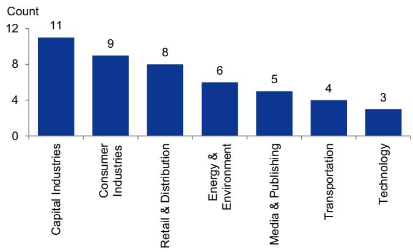

bar

| Industry | Count |
| :--- | :--- |
| Capital Industries | 11 |
| Consumer Industries | 9 |
| Retail & Distribution | 8 |
| Energy & Environment | 6 |
| Media & Publishing | 5 |
| Transportation | 4 |
| Technology | 3 |

Source: Moody's, GS Global Investment Research

Exhibit 132: Industry default count in Europe   
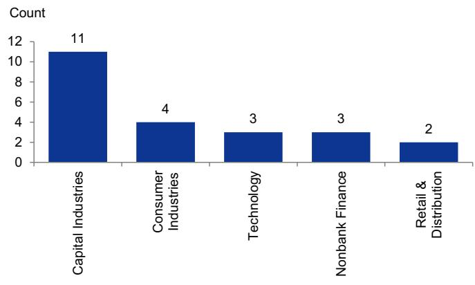

bar

| Category | Count |
| :--- | :--- |
| Capital Industries | 11 |
| Consumer Industries | 4 |
| Technology | 3 |
| Nonbank Finance | 3 |
| Retail & Distribution | 2 |

Source: Moody's, GS Global Investment Research

Exhibit 133: Composition of defaults in the USD HY bond market by type   
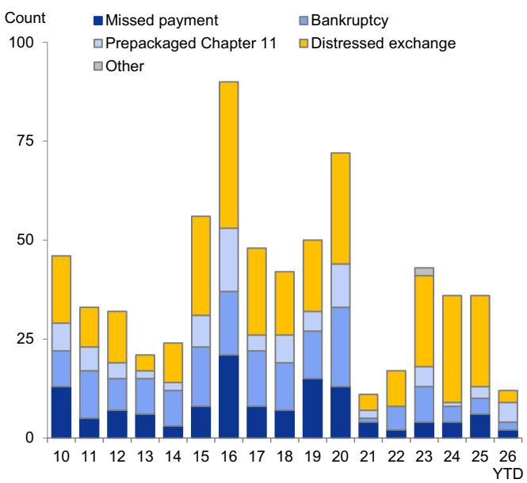

bar_stacked

| YTD | Missed payment | Bankruptcy | Prepackaged Chapter 11 | Distressed exchange | Other |
| --- | --- | --- | --- | --- | --- |
| 10 | 12 | 10 | 8 | 25 | 0 |
| 11 | 5 | 14 | 7 | 15 | 0 |
| 12 | 6 | 9 | 4 | 18 | 0 |
| 13 | 5 | 8 | 3 | 4 | 0 |
| 14 | 3 | 10 | 3 | 12 | 0 |
| 15 | 7 | 15 | 8 | 30 | 0 |
| 16 | 20 | 18 | 15 | 45 | 0 |
| 17 | 7 | 16 | 6 | 25 | 0 |
| 18 | 6 | 14 | 7 | 20 | 0 |
| 19 | 14 | 15 | 6 | 22 | 0 |
| 20 | 13 | 25 | 12 | 35 | 0 |
| 21 | 3 | 2 | 2 | 4 | 0 |
| 22 | 2 | 6 | 3 | 10 | 0 |
| 23 | 4 | 9 | 5 | 30 | 2 |
| 24 | 4 | 4 | 3 | 35 | 0 |
| 25 | 6 | 3 | 4 | 30 | 0 |
| 26 | 2 | 6 | 3 | 4 | 0 |

Source: Moody's, GS Global Investment Research

Exhibit 134: Composition of defaults in the EUR HY bond market by type   
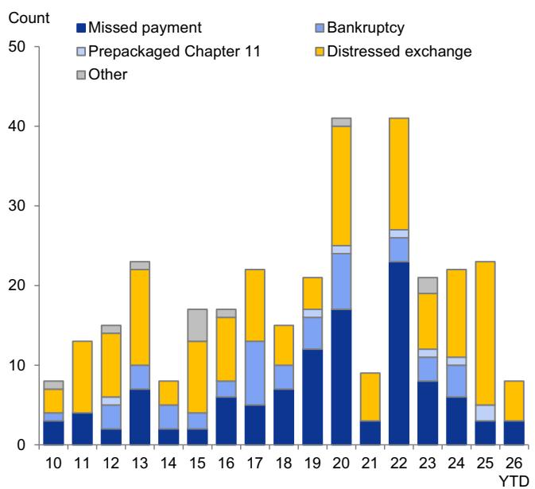

bar_stacked

| Year | Missed payment | Bankruptcy | Prepackaged Chapter 11 | Distressed exchange | Other |
|---|---|---|---|---|---|
| 10 | 3 | 1 | 0 | 3 | 1 |
| 11 | 4 | 0 | 0 | 9 | 0 |
| 12 | 2 | 3 | 2 | 10 | 1 |
| 13 | 7 | 3 | 0 | 18 | 1 |
| 14 | 2 | 3 | 0 | 4 | 0 |
| 15 | 2 | 2 | 0 | 10 | 4 |
| 16 | 6 | 2 | 0 | 9 | 1 |
| 17 | 5 | 8 | 0 | 10 | 0 |
| 18 | 7 | 3 | 0 | 6 | 0 |
| 19 | 12 | 4 | 1 | 5 | 0 |
| 20 | 17 | 6 | 1 | 20 | 1 |
| 21 | 3 | 0 | 0 | 8 | 0 |
| 22 | 23 | 3 | 1 | 18 | 0 |
| 23 | 8 | 3 | 1 | 9 | 2 |
| 24 | 6 | 3 | 1 | 13 | 0 |
| 25 | 3 | 1 | 1 | 23 | 0 |
| 26 | 3 | 0 | 0 | 7 | 0 |

Source: Moody's, GS Global Investment Research

Exhibit 135: Annual average recovery rates by seniority for US issuers   
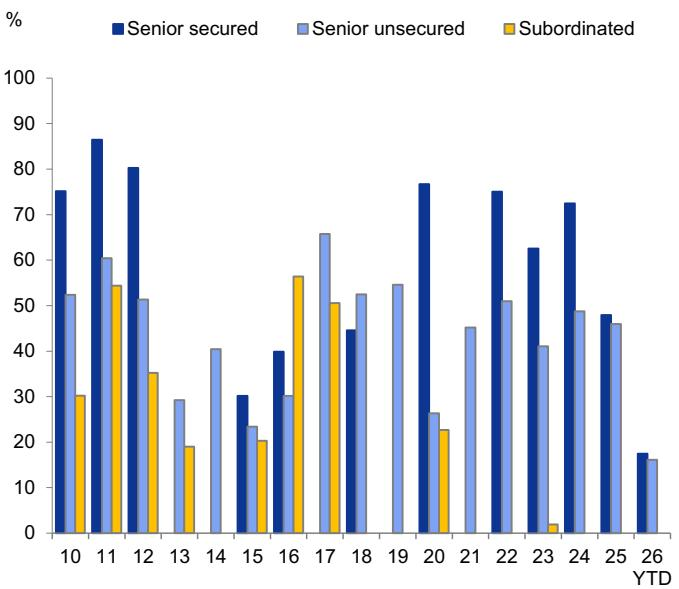

bar

| Year | Senior secured (%) | Senior unsecured (%) | Subordinated (%) |
| :--- | :--- | :--- | :--- |
| 10 | 75 | 52 | 30 |
| 11 | 86 | 60 | 54 |
| 12 | 80 | 51 | 35 |
| 13 | - | 29 | 19 |
| 14 | - | 40 | - |
| 15 | 30 | 23 | 20 |
| 16 | 40 | 30 | 56 |
| 17 | - | 65 | 50 |
| 18 | 44 | 52 | - |
| 19 | - | 54 | - |
| 20 | 76 | 26 | 22 |
| 21 | - | 45 | - |
| 22 | 74 | 51 | - |
| 23 | 62 | 41 | 2 |
| 24 | 72 | 49 | - |
| 25 | 48 | 46 | - |
| 26 | 18 | 16 | - |

Source: Moody's, GS Global Investment Research

Exhibit 136: Annual average recovery rates by seniority for European issuers   
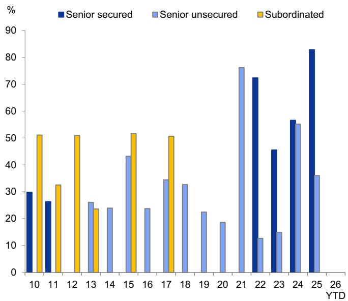

bar

| YTD | Senior secured (%) | Senior unsecured (%) | Subordinated (%) |
|---|---|---|---|
| 10 | 30 | 0 | 51 |
| 11 | 26 | 0 | 32 |
| 12 | 0 | 0 | 51 |
| 13 | 0 | 26 | 23 |
| 14 | 0 | 24 | 0 |
| 15 | 0 | 43 | 51 |
| 16 | 0 | 24 | 0 |
| 17 | 0 | 34 | 50 |
| 18 | 0 | 32 | 0 |
| 19 | 0 | 22 | 0 |
| 20 | 0 | 18 | 0 |
| 21 | 0 | 76 | 0 |
| 22 | 72 | 12 | 0 |
| 23 | 45 | 15 | 0 |
| 24 | 56 | 55 | 0 |
| 25 | 83 | 36 | 0 |
YTD

Source: Moody's, GS Global Investment Research

# Default and ratings migration dashboard: Upgrades and downgrades

Exhibit 137: Fallen angels vs. rising stars in the USD market   
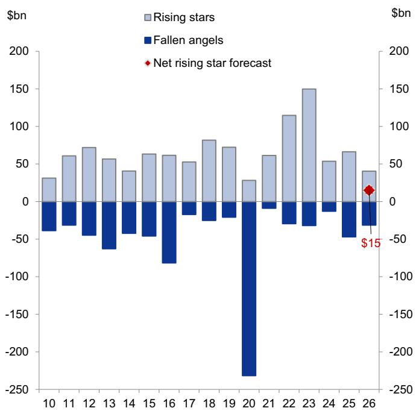

bar

| Year | Rising stars ($bn) | Fallen angels ($bn) | Net rising star forecast ($bn) |
|------|---------------------|----------------------|---------------------------------|
| 10   | 30                  | -40                  | -                               |
| 11   | 60                  | -30                  | -                               |
| 12   | 70                  | -40                  | -                               |
| 13   | 55                  | -60                  | -                               |
| 14   | 40                  | -35                  | -                               |
| 15   | 65                  | -45                  | -                               |
| 16   | 60                  | -80                  | -                               |
| 17   | 50                  | -20                  | -                               |
| 18   | 80                  | -25                  | -                               |
| 19   | 70                  | -20                  | -                               |
| 20   | 30                  | -230                 | -                               |
| 21   | 60                  | -10                  | -                               |
| 22   | 115                 | -30                  | -                               |
| 23   | 150                 | -35                  | -                               |
| 24   | 55                  | -15                  | -                               |
| 25   | 65                  | -45                  | -                               |
| 26   | 40                  | -30                  | $15                             |

Source: Bloomberg, GS Global Investment Research

Exhibit 138: Fallen angels vs. rising stars in the EUR market   
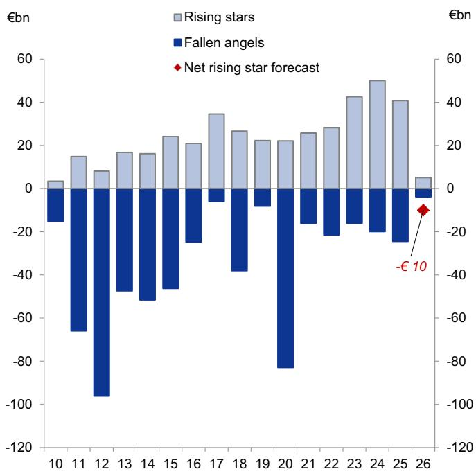

bar

| Year | Rising stars (€bn) | Fallen angels (€bn) | Net rising star forecast (€bn) |
|------|---------------------|----------------------|---------------------------------|
| 10   | 3                   | -15                  | -                               |
| 11   | 15                  | -70                  | -                               |
| 12   | 8                   | -95                  | -                               |
| 13   | 17                  | -45                  | -                               |
| 14   | 16                  | -50                  | -                               |
| 15   | 24                  | -45                  | -                               |
| 16   | 20                  | -25                  | -                               |
| 17   | 35                  | -5                   | -                               |
| 18   | 27                  | -40                  | -                               |
| 19   | 22                  | -10                  | -                               |
| 20   | 22                  | -85                  | -                               |
| 21   | 25                  | -15                  | -                               |
| 22   | 28                  | -20                  | -                               |
| 23   | 42                  | -15                  | -                               |
| 24   | 50                  | -20                  | -                               |
| 25   | 40                  | -25                  | -                               |
| 26   | 5                   | -10                  | -10                             |

Source: Bloomberg, GS Global Investment Research

Exhibit 139: BB-rated bonds on upgrade watch (upgrade candidates) vs. BBB-rated bonds on downgrade watch (downgrade candidates) in the USD market   
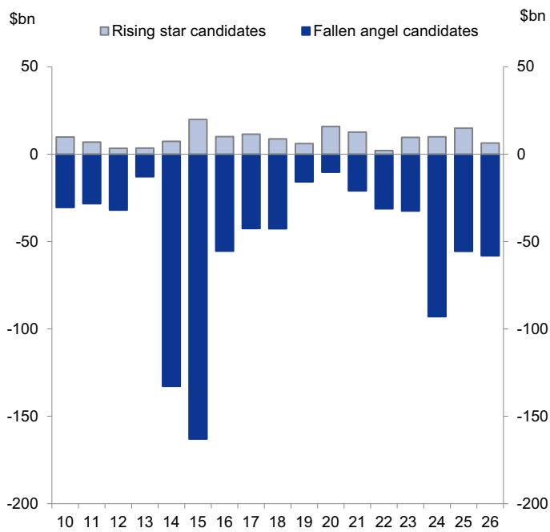

bar

| Year | Rising star candidates ($bn) | Fallen angel candidates ($bn) |
|------|-------------------------------|--------------------------------|
| 10   | 10                            | -30                            |
| 11   | 5                             | -35                            |
| 12   | 0                             | -40                            |
| 13   | 0                             | -20                            |
| 14   | 5                             | -130                           |
| 15   | 20                            | -170                           |
| 16   | 10                            | -50                            |
| 17   | 10                            | -40                            |
| 18   | 5                             | -45                            |
| 19   | 0                             | -20                            |
| 20   | 15                            | -10                            |
| 21   | 10                            | -30                            |
| 22   | 0                             | -40                            |
| 23   | 5                             | -35                            |
| 24   | 5                             | -90                            |
| 25   | 15                            | -55                            |
| 26   | 5                             | -60                            |

Source: Bloomberg, GS Global Investment Research

Exhibit 140: BB-rated bonds on upgrade watch (upgrade candidates) vs. BBB-rated bonds on downgrade watch (downgrade candidates) in the EUR market   

bar

| Year | Rising star candidates (€bn) | Fallen angel candidates (€bn) |
|------|-------------------------------|--------------------------------|
| 10   | 2                             | -18                            |
| 11   | 2                             | -27                            |
| 12   | 0                             | -55                            |
| 13   | 4                             | -10                            |
| 14   | 8                             | -45                            |
| 15   | 1                             | -23                            |
| 16   | 5                             | -22                            |
| 17   | 7                             | -28                            |
| 18   | 0                             | -20                            |
| 19   | 24                            | -21                            |
| 20   | 9                             | -7                             |
| 21   | 10                            | -5                             |
| 22   | 1                             | -7                             |
| 23   | 2                             | -15                            |
| 24   | 5                             | -8                             |
| 25   | 5                             | -9                             |
| 26   | 3                             | -6                             |

Source: Bloomberg, GS Global Investment Research

Exhibit 141: BB-rated bonds on outlook positive vs. BBB-rated bonds on outlook negative in the USD market   
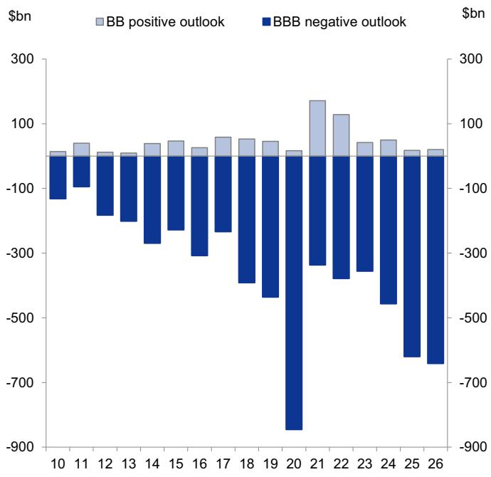

bar

| Week | BB positive outlook ($bn) | BBB negative outlook ($bn) |
|------|---------------------------|-----------------------------|
| 10   | ~-50                      | ~-100                       |
| 11   | ~-50                      | ~-100                       |
| 12   | ~-50                      | ~-150                       |
| 13   | ~-50                      | ~-150                       |
| 14   | ~-50                      | ~-250                       |
| 15   | ~-50                      | ~-250                       |
| 16   | ~-50                      | ~-300                       |
| 17   | ~-50                      | ~-250                       |
| 18   | ~-50                      | ~-350                       |
| 19   | ~-50                      | ~-450                       |
| 20   | ~-50                      | ~-850                       |
| 21   | ~150                      | ~-300                       |
| 22   | ~100                      | ~-350                       |
| 23   | ~50                       | ~-350                       |
| 24   | ~50                       | ~-450                       |
| 25   | ~50                       | ~-650                       |
| 26   | ~50                       | ~-700                       |

Source: Moody's, GS Global Investment Research

Exhibit 143: Top 10 USD fallen angel issuers in the last 12 months 

<table><tr><td>Company</td><td>Notional downgraded ($bn)</td></tr><tr><td>Centene Corp</td><td>14.7</td></tr><tr><td>Paramount Global</td><td>13.0</td></tr><tr><td>Fs Kkr Capital Corp</td><td>3.8</td></tr><tr><td>Fmc Corp</td><td>2.5</td></tr><tr><td>Huntsman International L</td><td>1.5</td></tr><tr><td>Banco Santander Mexico</td><td>1.3</td></tr><tr><td>Pacificorp</td><td>0.9</td></tr><tr><td>Blackrock Tcp Cap Corp</td><td>0.7</td></tr><tr><td>Horizon Mutual Holdings</td><td>0.6</td></tr><tr><td>Ses Americom Inc</td><td>0.5</td></tr></table>

Source: Bloomberg, data compiled by GS Global Investment Research

Exhibit 145: Top 10 EUR Fallen angel issues 

<table><tr><td>Company</td><td>Notional downgraded (€bn)</td></tr><tr><td>Ses Sa</td><td>3.4</td></tr><tr><td>Lanxess Ag</td><td>2.2</td></tr><tr><td>Worldline Sa/France</td><td>2.2</td></tr><tr><td>Citycon Treasury Bv</td><td>1.7</td></tr><tr><td>Verallia Sa</td><td>1.6</td></tr><tr><td>Mediobanca Di Cred Fin</td><td>1.5</td></tr><tr><td>Unibail-Rodamco-Westfld</td><td>1.1</td></tr><tr><td>Adecco Int Financial Svs</td><td>0.5</td></tr><tr><td>Illimity Bank Spa</td><td>0.3</td></tr><tr><td>Solaben Luxembourg</td><td>0.1</td></tr></table>

Source: Bloomberg, data compiled by GS Global Investment Research

Exhibit 142: BB-rated bonds on outlook positive vs. BBB-rated bonds on outlook negative in the EUR market   
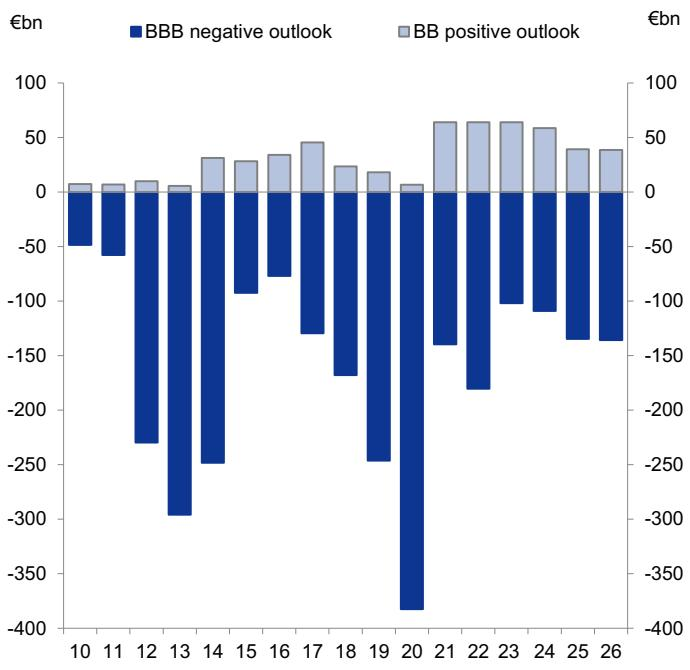

bar

| Year | BBB negative outlook (€bn) | BB positive outlook (€bn) |
|------|-----------------------------|----------------------------|
| 10   | -50                         | 5                          |
| 11   | -75                         | 5                          |
| 12   | -225                        | 10                         |
| 13   | -300                        | 5                          |
| 14   | -250                        | 25                         |
| 15   | -100                        | 25                         |
| 16   | -80                         | 30                         |
| 17   | -125                        | 40                         |
| 18   | -175                        | 20                         |
| 19   | -250                        | 15                         |
| 20   | -380                        | 5                          |
| 21   | -150                        | 60                         |
| 22   | -180                        | 60                         |
| 23   | -100                        | 60                         |
| 24   | -125                        | 50                         |
| 25   | -150                        | 35                         |
| 26   | -175                        | 35                         |

Source: Moody's, GS Global Investment Research

Exhibit 144: Top 10 USD rising star issuers in the last 12 months 

<table><tr><td>Company</td><td>Notional upgraded ($bn)</td></tr><tr><td>Vistra Operations Co Llc</td><td>6.3</td></tr><tr><td>Medline Borrower Lp</td><td>4.5</td></tr><tr><td>1011778 Bc / New Red Fin</td><td>4.0</td></tr><tr><td>Permian Resourc Optg Llc</td><td>3.6</td></tr><tr><td>Unicredit Spa</td><td>3.5</td></tr><tr><td>Frontier Communications</td><td>2.8</td></tr><tr><td>Frontier Communications</td><td>2.8</td></tr><tr><td>Constellation En Gen Llc</td><td>2.3</td></tr><tr><td>Medline Borrower/Medl Co</td><td>1.5</td></tr><tr><td>Standard Chartered Plc</td><td>1.5</td></tr></table>

Source: Bloomberg, data compiled by GS Global Investment Research

Exhibit 146: Top 10 EUR rising star issuers in the last 12 months 

<table><tr><td>Company</td><td>Notional upgraded (€bn)</td></tr><tr><td>Banca Monte Dei Paschi S</td><td>3.0</td></tr><tr><td>Terna Rete Elettrica</td><td>1.9</td></tr><tr><td>Aib Group Plc</td><td>1.7</td></tr><tr><td>Asr Nederland Nv</td><td>1.5</td></tr><tr><td>Unipol Assicurazioni Spa</td><td>1.3</td></tr><tr><td>Intesa Sanpaolo Assicura</td><td>1.1</td></tr><tr><td>Bper Banca</td><td>1.0</td></tr><tr><td>Piraeus Bank Sa</td><td>1.0</td></tr><tr><td>Czechoslovak Group</td><td>1.0</td></tr><tr><td>Abanca Corp Bancaria Sa</td><td>1.0</td></tr></table>

Source: Bloomberg, data compiled by GS Global Investment Research

# Disclosure Appendix

# Reg AC

We, Amanda Lynam, CPA, Spencer Rogers, CFA, Sara Grut and Shamshad Ali, hereby certify that all of the views expressed in this report accurately reflect our personal views, which have not been influenced by considerations of the firm's business or client relationships.

Unless otherwise stated, the individuals listed on the cover page of this report are analysts in GS' Global Investment Research division.

Contributing Authors: Amanda Lynam, CPA GS & Co. LLC, Spencer Rogers, CFA GS & Co. LLC, Sara Grut GS International, Shamshad Ali GS & Co. LLC.

Unless otherwise stated, the individuals listed in the Contributing Authors disclosure of this report are analysts in GS' Global Investment Research division.

# Disclosures

# Regulatory disclosures

# Disclosures required by United States laws and regulations

See company-specific regulatory disclosures above for any of the following disclosures required as to companies referred to in this report: manager or co-manager in a pending transaction; 1% or other ownership; compensation for certain services; types of client relationships; managed/co-managed public offerings in prior periods; directorships; for equity securities, market making and/or specialist role. GS trades or may trade as a principal in debt securities (or in related derivatives) of issuers discussed in this report.

The following are additional required disclosures: Ownership and material conflicts of interest: GS policy prohibits its analysts, professionals reporting to analysts and members of their households from owning securities of any company in the analyst's area of coverage. Analyst compensation: Analysts are paid in part based on the profitability of GS, which includes investment banking revenues. Analyst as officer or director: GS policy generally prohibits its analysts, persons reporting to analysts or members of their households from serving as an officer, director or advisor of any company in the analyst's area of coverage. Non-U.S. Analysts: Non-U.S. analysts may not be associated persons of GS & Co. LLC and therefore may not be subject to FINRA Rule 2241 or FINRA Rule 2242 restrictions on communications with a subject company, public appearances and trading in securities covered by the analysts.

# Additional disclosures required under the laws and regulations of jurisdictions other than the United States

The following disclosures are those required by the jurisdiction indicated, except to the extent already made above pursuant to United States laws and regulations. Australia: GS Australia Pty Ltd and its affiliates are not authorised deposit-taking institutions (as that term is defined in the Banking Act 1959 (Cth)) in Australia and do not provide banking services, nor carry on a banking business, in Australia. This research, and any access to it, is intended only for “wholesale clients” within the meaning of the Australian Corporations Act, unless otherwise agreed by GS. In producing research reports, members of Global Investment Research of GS Australia may attend site visits and other meetings hosted by the companies and other entities which are the subject of its research reports. In some instances the costs of such site visits or meetings may be met in part or in whole by the issuers concerned if GS Australia considers it is appropriate and reasonable in the specific circumstances relating to the site visit or meeting. To the extent that the contents of this document contains any financial product advice, it is general advice only and has been prepared by GS without taking into account a client’s objectives, financial situation or needs. A client should, before acting on any such advice, consider the appropriateness of the advice having regard to the client’s own objectives, financial situation and needs. A copy of certain GS Australia and New Zealand disclosure of interests and a copy of GS’ Australian Sell-Side Research Independence Policy Statement are available at: https://www.goldmansachs.com/disclosures/australia-new-zealand/index.html. Brazil: Disclosure information in relation to CVM Resolution n. 20 is available at https://www.gs.com/worldwide/brazil/area/gir/index.html. Where applicable, the Brazil-registered analyst primarily responsible for the content of this research report, as defined in Article 20 of CVM Resolution n. 20, is the first author named at the beginning of this report, unless indicated otherwise at the end of the text. Canada: This information is being provided to you for information purposes only and is not, and under no circumstances should be construed as, an advertisement, offering or solicitation by GS & Co. LLC for purchasers of securities in Canada to trade in any Canadian security. GS & Co. LLC is not registered as a dealer in any jurisdiction in Canada under applicable Canadian securities laws and generally is not permitted to trade in Canadian securities and may be prohibited from selling certain securities and products in certain jurisdictions in Canada. If you wish to trade in any Canadian securities or other products in Canada please contact GS Canada Inc., an affiliate of The GS Group Inc., or another registered Canadian dealer. Hong Kong: Further information on the securities of covered companies referred to in this research may be obtained on request from GS (Asia) L.L.C. India: Further information on the subject company or companies referred to in this research may be obtained from GS (India) Securities Private Limited, Research Analyst - SEBI Registration Number INH000001493, 10th Floor, Ascent-Worli, Sudam Kalu Ahire Marg, Worli, Mumbai-400 025, India, Corporate Identity Number U74140MH2006FTC160634, Phone +91 22 6616 9000, Fax +91 22 6616 9001. GS may beneficially own 1% or more of the securities (as such term is defined in clause 2 (h) the Indian Securities Contracts (Regulation) Act, 1956) of the subject company or companies referred to in this research report. Investment in securities market are subject to market risks. Read all the related documents carefully before investing. Registration granted by SEBI and certification from NISM in no way guarantee performance of the intermediary or provide any assurance of returns to investors. GS (India) Securities Private Limited compliance officer and investor grievance contact details can be found at: https://www.goldmansachs.com/worldwide/india/documents/Grievance-Redressal-and-Escalation-Matrix.pdf, and a copy of the annual audit compliance report can be found at this link: https://publishing.gs.com/content/site/india-annual-compliance-report.html. Japan: See below. Korea: This research, and any access to it, is intended only for “professional investors” within the meaning of the Financial Services and Capital Markets Act, unless otherwise agreed by GS. Further information on the subject company or companies referred to in this research may be obtained from GS (Asia) L.L.C., Seoul Branch. New Zealand: GS New Zealand Limited and its affiliates are neither “registered banks” nor “deposit takers” (as defined in the Reserve Bank of New Zealand Act 1989) in New Zealand. This research, and any access to it, is intended for “wholesale clients” (as defined in the Financial Advisers Act 2008) unless otherwise agreed by GS. A copy of certain GS Australia and New Zealand disclosure of interests is available at: https://www.goldmansachs.com/disclosures/australia-new-zealand/index.html. Russia: Research reports distributed in the Russian Federation are not advertising as defined in the Russian legislation, but are information and analysis not having product promotion as their main purpose and do not provide appraisal within the meaning of the Russian legislation on appraisal activity. Research reports do not constitute a personalized investment recommendation as defined in Russian laws and regulations, are not addressed to a specific client, and are prepared without analyzing the financial circumstances, investment profiles or risk profiles of clients. GS assumes no responsibility for any investment decisions that may be taken by a client or any other person based on this research report. Singapore: GS (Singapore) Pte. (Company Number: 198602165W), which is regulated by the Monetary Authority of Singapore, accepts legal responsibility for this research, and should be contacted with respect to any matters arising from, or in connection with, this research. Taiwan: This material is for reference only and must not be reprinted without permission. Investors should carefully consider their own investment risk. Investment results are the responsibility of the individual investor. United Kingdom: Persons who would be categorized as retail clients in the United Kingdom, as such term is

defined in the rules of the Financial Conduct Authority, should read this research in conjunction with prior GS on the covered companies referred to herein and should refer to the risk warnings that have been sent to them by GS International. A copy of these risks warnings, and a glossary of certain financial terms used in this report, are available from GS International on request.

European Union and United Kingdom: Disclosure information in relation to Article 6 (2) of the European Commission Delegated Regulation (EU) (2016/958) supplementing Regulation (EU) No 596/2014 of the European Parliament and of the Council (including as that Delegated Regulation is implemented into United Kingdom domestic law and regulation following the United Kingdom's departure from the European Union and the European Economic Area) with regard to regulatory technical standards for the technical arrangements for objective presentation of investment recommendations or other information recommending or suggesting an investment strategy and for disclosure of particular interests or indications of conflicts of interest is available at https://www.gs.com/disclosures/europeanpolicy.html which states the European Policy for Managing Conflicts of Interest in Connection with Investment Research.

Japan: GS Japan Co., Ltd. is a Financial Instrument Dealer registered with the Kanto Financial Bureau under registration number Kinsho 69, and a member of Japan Securities Dealers Association, Financial Futures Association of Japan Type II Financial Instruments Firms Association, and Investment Management Association of Japan. Sales and purchase of equities are subject to commission pre-determined with clients plus consumption tax. See company-specific disclosures as to any applicable disclosures required by Japanese stock exchanges, the Japanese Securities Dealers Association or the Japanese Securities Finance Company.

# Global product; distributing entities

GS Global Investment Research produces and distributes research products for clients of GS on a global basis. Analysts based in GS offices around the world produce research on industries and companies, and research on macroeconomics, currencies, commodities and portfolio strategy. This research is disseminated in Australia by GS Australia Pty Ltd (ABN 21 006 797 897); in Brazil by GS do Brasil Corretora de Títulos e Valores Mobiliários S.A.; Public Communication Channel GS Brazil: 0800 727 5764 and / or contatogoldmanbrasil@gs.com. Available Weekdays (except holidays), from 9am to 6pm. Canal de Comunicação com o Público GS Brasil: 0800 727 5764 e/ou contatogoldmanbrasil@gs.com. Horário de funcionamento: segunda-feira à sexta-feira (exceto feriados), das 9h às 18h; in Canada by GS & Co. LLC; in Hong Kong by GS (Asia) L.L.C.; in India by GS (India) Securities Private Ltd.; in Japan by GS Japan Co., Ltd.; in the Republic of Korea by GS (Asia) L.L.C., Seoul Branch; in New Zealand by GS New Zealand Limited; in Russia by OOO GS; in Singapore by GS (Singapore) Pte. (Company Number: 198602165W); and in the United States of America by GS & Co. LLC. GS International has approved this research in connection with its distribution in the United Kingdom.

GS International (“GSI”), authorised by the Prudential Regulation Authority (“PRA”) and regulated by the Financial Conduct Authority (“FCA”) and the PRA, has approved this research in connection with its distribution in the United Kingdom.

European Economic Area: GS Bank Europe SE (“GSBE”) is a credit institution incorporated in Germany and, within the Single Supervisory Mechanism, subject to direct prudential supervision by the European Central Bank and in other respects supervised by German Federal Financial Supervisory Authority (Bundesanstalt für Finanzdienstleistungsaufsicht, BaFin) and Deutsche Bundesbank and disseminates research within the European Economic Area.

# General disclosures

This research is for our clients only. Other than disclosures relating to GS, this research is based on current public information that we consider reliable, but we do not represent it is accurate or complete, and it should not be relied on as such. The information, opinions, estimates and forecasts contained herein are as of the date hereof and are subject to change without prior notification. We seek to update our research as appropriate, but various regulations may prevent us from doing so. Other than certain industry reports published on a periodic basis, the large majority of reports are published at irregular intervals as appropriate in the analyst's judgment.

GS conducts a global full-service, integrated investment banking, investment management, and brokerage business. We have investment banking and other business relationships with a substantial percentage of the companies covered by Global Investment Research. GS & Co. LLC, the United States broker dealer, is a member of SIPC (https://www.sipc.org).

Our salespeople, traders, and other professionals may provide oral or written market commentary or trading strategies to our clients and principal trading desks that reflect opinions that are contrary to the opinions expressed in this research. Our asset management area, principal trading desks and investing businesses may make investment decisions that are inconsistent with the recommendations or views expressed in this research.

We and our affiliates, officers, directors, and employees will from time to time have long or short positions in, act as principal in, and buy or sell, the securities or derivatives, if any, referred to in this research, unless otherwise prohibited by regulation or GS policy.

The views attributed to third party presenters at GS arranged conferences, including individuals from other parts of GS, do not necessarily reflect those of Global Investment Research and are not an official view of GS.

Any third party referenced herein, including any salespeople, traders and other professionals or members of their household, may have positions in the products mentioned that are inconsistent with the views expressed by analysts named in this report.

This research is focused on investment themes across markets, industries and sectors. It does not attempt to distinguish between the prospects or performance of, or provide analysis of, individual companies within any industry or sector we describe.

Any trading recommendation in this research relating to an equity or credit security or securities within an industry or sector is reflective of the investment theme being discussed and is not a recommendation of any such security in isolation.

This research is not an offer to sell or the solicitation of an offer to buy any security in any jurisdiction where such an offer or solicitation would be illegal. It does not constitute a personal recommendation or take into account the particular investment objectives, financial situations, or needs of individual clients. Clients should consider whether any advice or recommendation in this research is suitable for their particular circumstances and, if appropriate, seek professional advice, including tax advice. The price and value of investments referred to in this research and the income from them may fluctuate. Past performance is not a guide to future performance, future returns are not guaranteed, and a loss of original capital may occur. Fluctuations in exchange rates could have adverse effects on the value or price of, or income derived from, certain investments.

Certain transactions, including those involving futures, options, and other derivatives, give rise to substantial risk and are not suitable for all investors. Investors should review current options and futures disclosure documents which are available from GS sales representatives or at https://www.theocc.com/about/publications/character-risks.jsp and https://www.goldmansachs.com/disclosures/cftc\_fcm\_disclosures. Transaction costs may be significant in option strategies calling for multiple purchase and sales of options such as spreads. Supporting documentation will be supplied upon request.

Differing Levels of Service provided by Global Investment Research: The level and types of services provided to you by GS Global Investment Research may vary as compared to that provided to internal and other external clients of GS, depending on various factors including your individual preferences as to the frequency and manner of receiving communication, your risk profile and investment focus and perspective (e.g., marketwide, sector specific, long term, short term), the size and scope of your overall client relationship with GS, and legal and regulatory constraints. As an example, certain clients may request to receive notifications when research on specific securities is published, and certain clients may request that specific data underlying analysts' fundamental analysis available on our internal client websites be delivered to them electronically through data feeds or otherwise. No change to an analyst's fundamental research views (e.g., ratings, price targets, or material changes to earnings estimates for equity securities), will be communicated to any client prior to inclusion of such information in a research report broadly disseminated through electronic publication to our internal client websites or through other means, as necessary, to all clients who are entitled to receive such reports.

All research reports are disseminated and available to all clients simultaneously through electronic publication to our internal client websites. Not all research content is redistributed to our clients or available to third-party aggregators, nor is GS responsible for the redistribution of our research by third party aggregators. For research, models or other data related to one or more securities, markets or asset classes (including related services) that may be available to you, please contact your GS representative or go to https://research.gs.com.

Disclosure information is also available at https://www.gs.com/research/hedge.html or from Research Compliance, 200 West Street, New York, NY 10282.

# © 2026 GS.

You are permitted to store, display, analyze, modify, reformat, and print the information made available to you via this service only for your own use. You may not resell or reverse engineer this information to calculate or develop any index for disclosure and/or marketing or create any other derivative works or commercial product(s), data or offering(s) without the express written consent of GS. You are not permitted to publish, transmit, or otherwise reproduce this information, in whole or in part, in any format to any third party without the express written consent of GS. This foregoing restriction includes, without limitation, using, extracting, downloading or retrieving this information, in whole or in part, to train or finetune a machine learning or artificial intelligence system, or to provide or reproduce this information, in whole or in part, as a prompt or input to any such system.