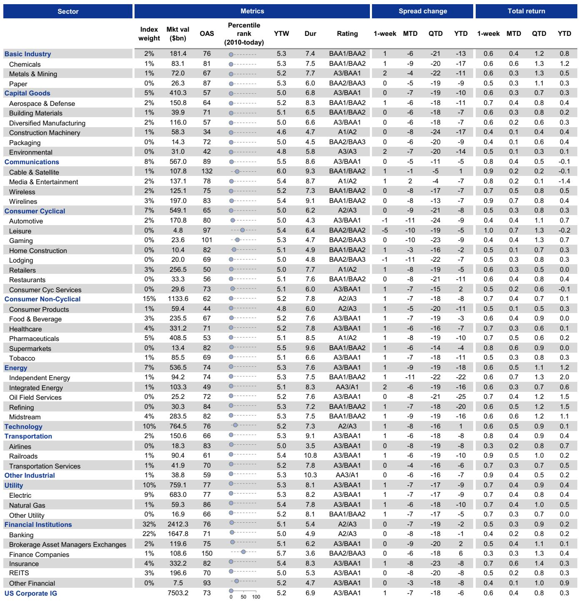
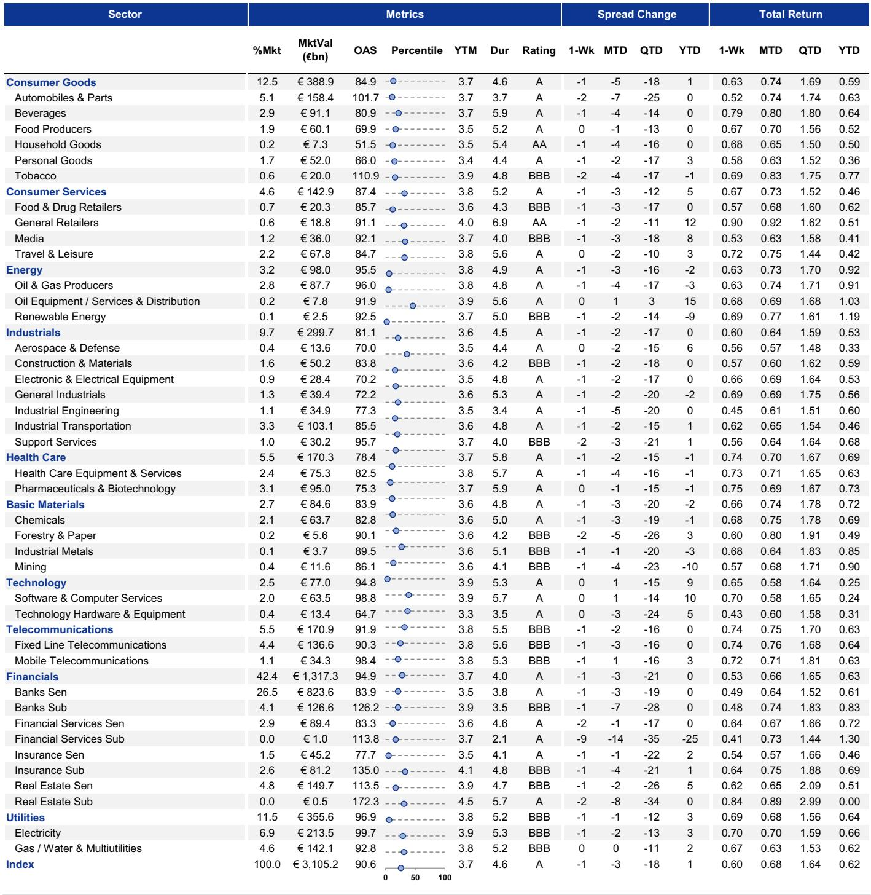
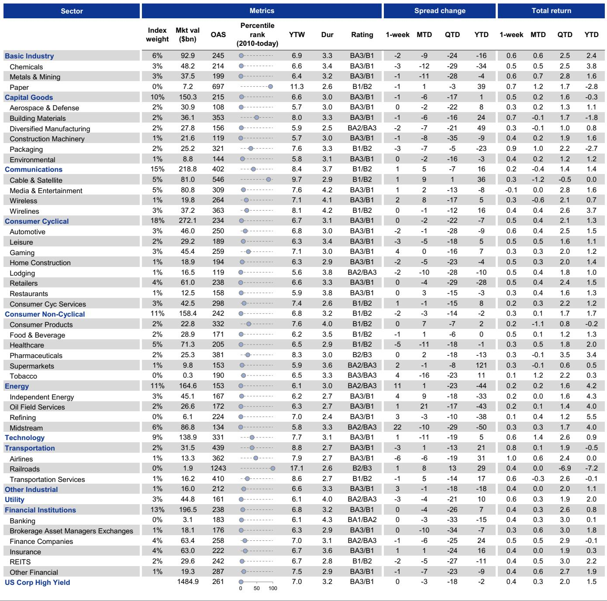

# The Quality Trade Within High Yield Is Not Reaching the IG-HY Border—And That Is Where the Next Opportunity and Risk Diverge

The high-yield market is telling a clear but incomplete story. Since late 2025, BB-rated bonds in both the USD and EUR markets have significantly outperformed their single-B counterparts, a classic flight to quality within the riskiest part of the credit spectrum. This divergence has pushed the B/BB spread differential near the upper end of its historical range, signaling that investors are paying up for safety within high yield. Yet this same logic has not extended to the border between investment grade and high yield. The spread ratio between BBs and BBBs remains stubbornly mid-range, suggesting that the market is not yet pricing the next leg of the quality cascade. For serious credit investors, this divergence between intra-HY quality rotation and the IG-HY crossover is the single most important analytical tension in the current landscape. It implies that the easy part of the trade—buying BBs over Bs—may be largely done, while the harder question of where to position at the IG-HY boundary remains unresolved. The answer depends on region, on the technical dynamics of fallen angels and rising stars, and on a risk that the market is systematically underpricing: the likelihood of surprise rating migrations.

## The Flight to Quality within High Yield Has Run Its Course, But the Crossover to BBBs Has Not Followed

The outperformance of BBs relative to single-Bs is now well established. In the USD market, the OAS ratio of B to BB bonds has reached levels not seen since the post-financial crisis era, reflecting a market that has decisively rotated toward higher-quality high-yield names. This is consistent with a macro environment where geopolitical and economic uncertainty persists, even as risk appetite appears resilient at the index level. The pattern is nearly identical in the EUR market, where BBs have similarly outperformed Bs. The strategic implication is clear: the intra-HY quality trade is mature. Spreads between BB and B have already repriced to reflect a significant risk premium for lower-quality credits. Further compression from here would require either a dramatic improvement in the macro outlook or a technical event that forces a repricing of the B segment. Neither seems likely in the near term. The more important observation, however, is what has not happened. The flight to quality has not crossed the boundary into investment grade. The BB/BBB spread ratio in both USD and EUR markets is trading near the middle to lower end of its historical range. This means that BBBs have not outperformed BBs, despite the broader risk-off tone within high yield. Why? Because the macro and technical forces that pushed investors from Bs to BBs are not the same forces that would drive them from BBs to BBBs. The former is a defensive rotation within a risky asset class; the latter would require a fundamental reassessment of growth and inflation trajectories that has not yet materialized—especially in the US. In the USD market, the BB/BBB ratio appears fairly priced given the current mix of moderate growth and sticky inflation. In the EUR market, however, the case for decompression is stronger. A weaker European growth backdrop, exacerbated by the ongoing energy shock, should eventually push investors toward the safety of BBBs. The question is timing and trigger.

## Fallen Angel Risk Is Materially Higher in Europe, and the Market Is Not Pricing It

The technical outlook for the crossover segment is not just about macro; it is about the supply of bonds that cross the IG-HY boundary. Fallen angels—bonds downgraded from investment grade to high yield—create a sudden and often forced supply of BB-rated paper, compressing spreads and creating headwinds for the broader BB cohort. Rising stars have the opposite effect, absorbing supply and supporting BB valuations. The report introduces a new framework for forecasting these events, and the results are striking. For 2026, the forecast calls for USD fallen angels of $60 billion and USD rising stars of $75 billion—a net positive for the BB segment. In EUR, the picture is reversed: fallen angels of EUR 30 billion versus rising stars of EUR 20 billion, implying the first year since 2020 in which fallen angels outpace rising stars. This divergence is already visible in year-to-date data: the EUR market is roughly flat on net rising-star activity, while the USD market has seen $5 billion in net rising stars. The strategic implication is straightforward. The EUR BB segment faces a genuine technical headwind from fallen angel supply, while the USD BB segment benefits from a tailwind. This should, all else equal, lead to further decompression in the EUR BB/BBB spread ratio, as BBBs benefit from relative scarcity and BBs suffer from incremental supply. Yet the market is not pricing this risk. The share of BBB-rated bonds trading at spreads wider than the average BB+ remains near the low end of the past decade in both regions. In the EUR market, only about 2% of BBB unsecured bonds trade through the average BB+ spread; in the USD market, the figure is around 15%. Both are low by historical standards, suggesting that investors are not demanding a significant premium for fallen angel risk. Either the market is correct and the forecast is too pessimistic, or a meaningful repricing lies ahead.

## The Most Dangerous Assumption Is That Rating Agencies Will Provide Clear Warning

One of the most counterintuitive findings in the report is that rating outlooks and watches are an unreliable guide to fallen angel and rising star risk. Since 2010, roughly half of all fallen angels in both the USD and EUR markets came from issuers that were not rated BBB or BBB- on Negative Outlook or Downgrade Watch prior to the event. The share is even higher for rising stars: a majority of issuers that migrated from high yield to investment grade were not on Positive Outlook or Upgrade Watch. This "surprise" dynamic is not a statistical anomaly; it reflects the inherent lag in rating agency actions during periods of rapid change. During abrupt macro shocks—such as the COVID-19 pandemic—fundamentals can deteriorate faster than rating frameworks can adjust. The implication for investors is profound. Relying on rating screens alone to manage crossover risk is insufficient. A portfolio that hedges only against explicitly flagged downgrade candidates will capture at best half of the actual fallen angel volume. The other half will come from issuers that appear stable until they are not. This is not a criticism of rating agencies; it is a structural feature of a system that prioritizes stability and gradual adjustment over real-time signaling. For credit investors, the practical takeaway is that the crossover segment requires a more dynamic approach to risk assessment. Static screens based on current ratings and outlooks are a starting point, not a conclusion. The report's framework, which combines historical transition probabilities with a subjective overlay, is a step in the right direction. But it also acknowledges that forecast uncertainty remains elevated, particularly in the current macro environment where the path of growth and inflation is contested.

## A Decision Framework for Navigating the Crossover: Three Questions Every Investor Must Answer

The report provides the analytical building blocks, but it does not deliver a single actionable recommendation. That is by design. The crossover trade is inherently conditional on regional macro, technical supply, and the willingness to accept surprise risk. To translate the report into a decision framework, investors should ask three questions. First, what is my regional conviction? If the view is that European growth will remain under pressure from energy costs and a weaker industrial base, then the case for EUR BBB outperformance relative to BBs is strong. The technical headwind from fallen angels reinforces this view. If the view is that the US economy will avoid a sharp slowdown, then the USD BB/BBB ratio may remain rangebound, and the intra-HY quality trade is likely exhausted. Second, how do I account for surprise risk? The report makes clear that rating screens capture only half the story. A portfolio that is long BBBs and short BBs must be sized to withstand a scenario where multiple "unflagged" issuers are downgraded simultaneously. This is not a tail risk; it is a structural feature of the market. Investors should stress-test their crossover positions against a scenario where fallen angel volumes are 50% higher than the base case, and where the composition of those fallen angels includes names that were not on Negative Outlook. Third, what is my view on market pricing of fallen angel risk? The current low share of BBBs trading through BB+ spreads suggests that the market is complacent. If the report's forecast is even partially correct, a repricing is likely. The question is whether that repricing will be gradual or abrupt. Gradual repricing favors a patient, long-volatility approach. Abrupt repricing favors immediate positioning. The report does not resolve this question, but it sharpens the terms of the debate.

## What the Report Does Not Fully Answer: The Asymmetry of Market Impact Across Regions

The report identifies a critical nuance that deserves more attention than it receives. In the USD market, fallen angels have historically tended to outperform after the downgrade. This is because downgrade risk is often well telegraphed, and the market has already priced in the event by the time it occurs. In the EUR market, the opposite is true: fallen angels have more often underperformed post-downgrade. The report attributes this to the higher prevalence of single-agency rating structures in Europe, which increases the potential for downgrade risk to materialize more abruptly. This asymmetry has profound implications for relative value. If a USD fallen angel is likely to bounce after downgrade, then the risk of holding BBs that are about to receive a wave of fallen angel supply is partially mitigated by the fact that the incoming bonds may not trade down further. In EUR, the same dynamic amplifies the risk: fallen angels may continue to underperform, creating a persistent drag on the BB segment. The report does not fully explore the second-order implications of this asymmetry for portfolio construction. For example, does it mean that the optimal hedge for EUR BB exposure is different from the optimal hedge for USD BB exposure? Does it suggest that EUR investors should be more aggressive in pre-positioning for fallen angel risk, while USD investors can afford to wait for the downgrade event itself? These are open questions that the report leaves for the reader to answer. They are also precisely the kind of questions that separate a generic crossover trade from a well-structured, region-specific strategy.

## Join the Community to Read the Full Report and Review the Original Charts

The analysis above draws on a rich set of data and a novel framework for modeling rating transitions, but it only scratches the surface. The full report includes detailed exhibits on historical transition probabilities, the composition of fallen angels and rising stars by rating bucket, and year-to-date net rising-star activity across regions. It also provides the complete set of forecasts for 2026, including the rationale for the upward revision to the USD rising star forecast from $40 billion to $75 billion. For investors who want to build their own crossover strategy, the original charts are indispensable. They reveal the nuances that a text summary cannot capture: the shape of the transition curves, the distribution of fallen angel volumes across sectors, and the precise levels at which the market is pricing—or failing to price—downgrade risk. Join the community to access the full report and review the original charts, and to engage with the analytical questions that this piece has left open.

*This article is for learning and discussion only and does not constitute investment advice.*

Personal reading notes and learning share only. Not investment advice.

