GLOBAL RATES TRADER

# Term Premia Take a Breather

Relaxation about risks from the conflict has compressed Treasury term premium, with only modest contribution from the policy expectations channel so far. We see room for US yields to fall further on additional progress towards a resolution or dovish macro data, but expect deeper rallies to be led by points further in on the curve as the case for continued long-end outperformance looks more challenging. The combination of a hawkish ECB, commodity relief and weaker activity numbers continues to support EUR duration despite the rally in recent weeks—stay long 5y5y EUR real yields. Rates vol should remain lower in Europe, supporting sovereign credit carry despite tight spreads. In the UK, term premium relaxation has probably run its course—we prefer front-end longs and curve steepeners. Next week’s speech by Governor Ueda will be a focal point as markets weigh the likely timing of the BOJ’s next rate hike; while volatility has remained concentrated in longer-term forwards, we think bearish pressure should shift in towards the 5y point over time.

# United States and Canada

Rate rally reflects reduced risk premia. Long-end Treasury yields have continued their descent from their mid-month peak amid ongoing optimism about a potential resolution to the conflict and rebuild in flows through the Strait. The long-end yield move has largely shown up as a compression in Treasury term premium, with only modest contribution from the expectations component of yields (Exhibit 1). That dynamic that has seen the yield curve move steadily flatter through the course of the month despite the back and forth in outright yield levels. While hawkish Fed communication has reinforced the curve shift, we think that the argument for continued long-end outperformance looks more challenging. The rally has undone the relatively modest valuation gap in longer-term forwards and the term premium compression suggests that the market has already embedded a combination of reduced uncertainty and a return of duration's portfolio value. We think a meaningful extension of the yield move would likely need to incorporate some shift in the distribution of risks around the Fed path. Although renewed oil upside would likely reinvigorate inflation worries and add to hawkish policy concerns, it would also erode the factors that have contributed to the relief thus far. Next week's labor market report presents two-way near-term risks—but we expect the slack and wage signals to be key to the market's interpretation—we think more benign

# George Cole

+44(20)7552-1214

george.cole@gs.com

GS International

# William Marshall

+1(212)357-0413

william.c.marshall@gs.com

GS & Co. LLC

# Simon Freycenet

+44(20)7774-5017

simon.freycenet@gs.com

GS Bank Europe SE - Paris

Branch

# Isabella Rosenberg

+1(212)357-7628

isabella.rosenberg@gs.com

GS & Co. LLC

# Friedrich Schaper

+1(917)343-3214

friedrich.schaper@gs.com

GS & Co. LLC

# Loic Mathys

+44(20)7051-1664

loic.mathys@gs.com

GS International

underlying inflation pressures and a further reduction in concerns around the conflict can support nearer-term forwards and a steeper curve. Our preference remains to tether any long bias to our performance of the 5y part of the curve.

Consolidation and vol compression favors considering hedges. US rates vol has turned lower following the most recent pop, taking implied vol on longer tails towards conflict-lows and the overall level of vol back to the lower end of our fair value estimates (Exhibit 2). We think there is value to using this reset lower to consider hedges as the rates market balances between a more hawkish Fed tone, optimistic growth pricing, and increased hope about a potential resolution to the conflict—a mix that has seen the front-end lag the reset lower in yields further out the curve. While our baseline is a non-recessionary one (curtailing the clearest route to receivers returns), fading fiscal tailwinds and the hit to disposable income from higher energy prices pose risks to the consumer, and we think US rates are putting too much mass on the right tail of the policy path. Such environments lend themselves well to using modestly out-the-money receivers on short-to-medium tails (i.e. 2-to-5y), with value to owning slightly longer expiries (i.e. 1y over 3m) as hedges against deeper downside risks. Against that, the combination of the relief priced in further out the curve (see above) and compression in rate vol leave short expiry at-the-money payers on longer (e.g. 10y) tails our preferred hedge for investors wary of renewed escalation.

Exhibit 1: The recent US rally has been predominantly driven by a reset in Treasury term premium   
Change in 10y UST term premium/rate expectations, GS estimate   
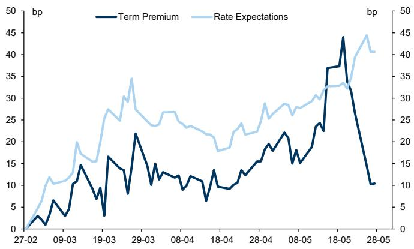

line

| Date   | Term Premium | Rate Expectations |
|--------|--------------|-------------------|
| 27-02  | 0            | 0                 |
| 09-03  | 10           | 15                |
| 19-03  | 15           | 25                |
| 29-03  | 20           | 35                |
| 08-04  | 15           | 25                |
| 18-04  | 10           | 20                |
| 28-04  | 15           | 25                |
| 08-05  | 20           | 30                |
| 18-05  | 35           | 35                |
| 28-05  | 10           | 45                |

Source: GS Global Investment Research, GS FICC and Equities

Exhibit 2: Implied vol is at the bottom of our range of estimates of fair   
Average Implied Vol vs fair value model range   
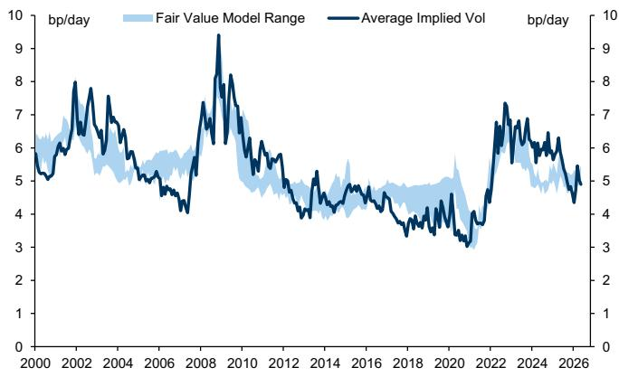

line

| Year | Fair Value Model Range (bp/day) | Average Implied Vol (bp/day) |
|------|----------------------------------|------------------------------|
| 2000 | ~5.5                             | ~5.8                         |
| 2002 | ~6.0                             | ~7.5                         |
| 2004 | ~5.5                             | ~6.5                         |
| 2006 | ~5.0                             | ~5.5                         |
| 2008 | ~6.5                             | ~9.5                         |
| 2010 | ~5.0                             | ~7.0                         |
| 2012 | ~4.5                             | ~5.5                         |
| 2014 | ~4.8                             | ~4.5                         |
| 2016 | ~4.5                             | ~4.0                         |
| 2018 | ~4.8                             | ~3.5                         |
| 2020 | ~5.0                             | ~3.0                         |
| 2022 | ~6.0                             | ~7.5                         |
| 2024 | ~5.5                             | ~6.5                         |
| 2026 | ~5.0                             | ~5.5                         |

Source: GS Global Investment Research, GS FICC and Equities

Wider swap spreads led by risk relief. The long-end has led swap spreads wider over the past month, taking spreads to levels that are slightly wide and leaving the spread curve slightly steep versus the levels implied by our swap spread framework. The performance reflects a few key factors in our view. First has been the easy funding environment; despite some normalization in repo rates towards month-end, we expect the funding backdrop to remain relatively benign (if not necessarily as persistently rich) as the Fed manages reserves towards equilibrium levels. Second, rates vol has declined this week on reports that the US and Iran are nearing a deal to reopen the Strait. We think this has been more meaningful for the long end, supporting the spread curve steepening. Third, there has been little sustained

cheapening pressure on Treasuries versus other forms of duration that would suggest material shifts in the supply/demand balance outside of the initial stage of the conflict. The US-Iran conflict has generated some Treasury selling pressure from foreign official investors, but bank/dealer absorption in March and a more favorable bill supply backdrop in April and early May have likely been offsets. While spreads are slightly wide versus fundamentals, valuations are not stretched, and we think that further progress towards a resolution to the conflict can be supportive via vol moderation and potentially a turn in foreign official demand if the Dollar weakening trend reemerges. We have liked being long 3y spreads for carry, and continue to think that position make sense, but think more levered forward expressions that carry well (e.g. 5y2y) stand to outperform should recent dynamics extend.

# Europe

Still positive EUR duration. European yields have continued to fall alongside the global relief rally over the past week. The prospect of a deal in the Middle East has capped upside risks to inflation (for now) while ECB communication, particularly last week's interview from Board member Schnabel, points to a high likelihood of a June hike. This combination, together with ongoing weak activity signals from surveys, is positive for EUR duration, and we continue to recommend long 5y5y EUR real rates. EUR rates have outperformed the US since the middle of April, and the move in 1y1y cross-market spreads has been particularly large. But divergence in activity signals between the US and Europe should keep these spreads wide. Given that ECB tightening is predominantly due to higher energy prices, the European front-end will remain sensitive to news on commodity flows through the Strait of Hormuz. However, with lingering energy market tightness likely to lead to at least some ECB tightening, we retain a flattening bias beyond U6.

Sovereign spreads tight but still a reasonable carry trade. Since the cease-fire was struck between the US and Iran, we have argued that the potential for a disconnect between front-end rate levels and volatility — with the former being sticky and the latter diminishing — would be consistent with sovereign spread compression. We still believe that further evidence of progress in negotiations towards a deal would see rates volatility decline and sovereign credit benefit as a result. However, we note that sovereign spread compression has run ahead not only of relief in core rates but also in rates volatility. Sovereign spreads have retraced a large portion of their post-conflict widening, with the retracement share decreasing with credit risk (Exhibit 3). Against this, we see a high hurdle for further tightening, even as we still see a place for sovereign credit for carry. Broadly speaking, the Euro area has been a receiver rather than provider of bearish shocks in recent weeks. Moreover, we do not expect domestic politics and policies to be a material headwind to sovereign credit. Fiscal policy responses to the energy shock continue to be muted across the Euro area, and we believe 2027 elections across a number of key Euro area countries are likely to become relevant into Q4.

Exhibit 3: Sovereign spread compression has run ahead of relief in rates levels and volatility   
Retracement from post-conflict peak / wides. Using GS fitted yields   
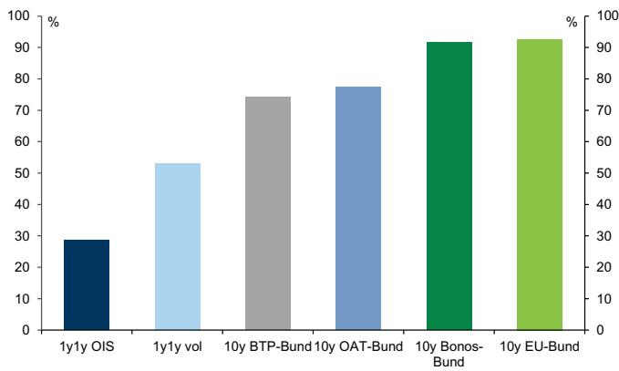

bar

| Category | Value (%) |
|---|---|
| 1y1y OIS | 29 |
| 1y1y vol | 53 |
| 10y BTP-Bund | 74 |
| 10y OAT-Bund | 78 |
| 10y Bonos-Bund | 92 |
| 10y EU-Bund | 93 |

Source: GS Global Investment Research, GS FICC and Equities

Exhibit 4: Recent bull-flattening is consistent with the relief in 10y term premium   
GS fitted yields and term premium model   
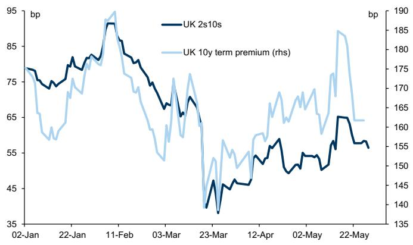

line

| Date     | UK 2s10s (bp) | UK 10y term premium (rhs) |
|----------|---------------|----------------------------|
| 02-Jan   | ~75           | ~175                       |
| 22-Jan   | ~80           | ~170                       |
| 11-Feb   | ~95           | ~185                       |
| 03-Mar   | ~65           | ~150                       |
| 23-Mar   | ~45           | ~140                       |
| 12-Apr   | ~55           | ~155                       |
| 02-May   | ~60           | ~160                       |
| 22-May   | ~55           | ~165                       |

Source: GS Global Investment Research, GS FICC and Equities

Gilts notch up a strong week; expect steepening from here. Although politics will likely remain in focus into the 18 June Makerfield by-election, risks relaxed in the Gilt market again this week as renewed hopes for a US-Iran deal weighed on energy prices. The bull-flattening of the Gilt curve in the last two weeks is consistent with term premium compression — our term premium estimates show a sharp fall after the rise in early May (Exhibit 4). Additionally, Gilts have also outperformed swaps, pointing to a relaxation of supply-related risks. However, we continue to think that durable relief for Gilts will be front-end-led, given that macro data continues to soften, and the UK’s fiscal situation and political risks are likely to remain in focus over coming weeks and months. We recommend 1y forward 2s10s GBP OIS steepeners (target 55bp, stop 25bp) for this view, where negative carry is not particularly punitive.

# Japan

Waiting for a signal on hikes. Markets continue to price over 70% probability of a BoJ hike in June which, while elevated, still reflects some uncertainty about whether the BoJ will move in June or July. Our economists think that a July hike is more likely, judging that the BoJ may feel more comfortable tightening after receiving additional CPI and wage data. Governor Ueda's speech on June 3 $^{rd}$ could provide a meaningful policy signal ahead of the June meeting. His comments last week that the BoJ would conduct policy for “stable inflation” and is more attuned to supply risks at the long end supported long-end outperformance. That relief has extended this week on news of a potential US-Iran agreement, but the 2s10s JGB curve remains steep and over the course of May the repricing in yields was mainly a function of forwards further out, with very little movement in the front-end (Exhibit 5). Fiscal news in June, like the details of the supplementary budget, could raise that risk premium further. We continue to think that domestic factors are the primary driver of higher risk premium and it will take more than global rates relief to bring lasting stability. Given the instability of bear steepening regimes, we would look for the 5y point to bear a greater share of bearish pressure over time.

Exhibit 5: Recent JPY rate repricing mainly a function of forwards further out   
JPY Forward rates, change since end April   
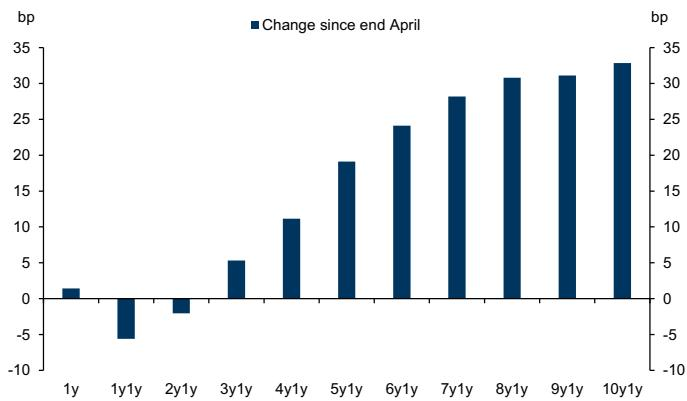

bar

| Period | Change since end April (bp) |
|---|---|
| 1y | 1.5 |
| 1y1y | -6.0 |
| 2y1y | -1.5 |
| 3y1y | 5.0 |
| 4y1y | 11.0 |
| 5y1y | 19.0 |
| 6y1y | 24.0 |
| 7y1y | 28.0 |
| 8y1y | 30.5 |
| 9y1y | 31.0 |
| 10y1y | 33.0 |

Source: GS Global Investment Research, GS FICC and Equities

Exhibit 6: NZD forwards have decoupled notably from spot policy   
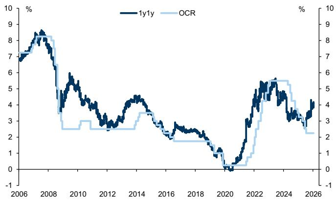

line

| Year | 1y1y (%) | OCR (%) |
|------|----------|---------|
| 2006 | 7.0      | 7.0     |
| 2008 | 8.5      | 8.5     |
| 2010 | 4.0      | 3.0     |
| 2012 | 3.0      | 3.0     |
| 2014 | 4.5      | 3.5     |
| 2016 | 2.5      | 2.0     |
| 2018 | 2.0      | 2.0     |
| 2020 | 0.5      | 0.5     |
| 2022 | 5.5      | 5.5     |
| 2024 | 4.5      | 5.5     |
| 2026 | 4.0      | 2.5     |

Source: GS FICC and Equities, GS Global Investment Research

# Australia and New Zealand

Earlier RBNZ hikes. The RBNZ kept rates on hold this week in a contentious meeting in which Chair Breman had to cast a tie-breaking vote. The revisions to the policy path were notably hawkish across the forecast horizon, and our economists now expect a hike at each of the July and September meetings (instead of December and February) in line with the guidance at the press conference. Beyond the initial hikes, however, our economists think the outlook for inflation and the labor market should be sufficiently weak to keep further hikes in check. Against that, forwards remain quite elevated relative to our or the RBNZ's policy projections (about 60bp above the peak), with more than 125bp of hikes priced cumulatively through end-27 (Exhibit 6). While starting levels and the speed of response are decidedly different from the RBA, a willingness to tighten policy despite still notable slack in the economy and medium-term fiscal consolidation can still work to trim right tail risks and potentially help to compress some of the right tail risks priced into the forwards.

# Latest Thematic Research:

Global Markets Analyst: Revisiting the Outlook for the Fed's Balance Sheet — 21 May 2026

Global Rates Notes: US Treasury Valuations and Requirements for a Yield Reversal — 20 May 2026

Global Markets Analyst: UK T-bills: Not A Magic Bullet For Gilts — 11 May 2026

Global Markets Comment: Market Stress Monitor — 11 May 2026

Rates Vol Monitor: A Look at Hedging the Right Tail — 8 May 2026

# Latest Global Markets Dailies:

The Hedge Value Of Rate Receivers — 28 May 2026

The Energy Shock Impact on Foreign Official Treasury Demand — 27 May 2026

Why Always Gilts? — 14 May 2026

A More Durable Risk Premium in JGBs — 8 May 2026

Trading Terms of Trade Shocks in the Smaller G10 Rates Markets — 21 April 2026

# Forecasts

G10 10y yield forecast 

<table><tr><td colspan="14">G10 10-Year Yield Forecasts</td></tr><tr><td></td><td>USD</td><td>DEM</td><td>FRA</td><td>ITA</td><td>ESP</td><td>GBP</td><td>JPY</td><td>CAD</td><td>CHF</td><td>SEK</td><td>NOK</td><td>AUD</td><td>NZD</td></tr><tr><td>Spot</td><td>4.45</td><td>2.96</td><td>3.57</td><td>3.67</td><td>3.37</td><td>4.81</td><td>2.67</td><td>3.41</td><td>0.41</td><td>2.80</td><td>4.35</td><td>4.83</td><td>4.51</td></tr><tr><td>2Q26</td><td>4.30</td><td>2.90</td><td>3.65</td><td>3.70</td><td>3.45</td><td>4.65</td><td>2.50</td><td>3.45</td><td>0.30</td><td>3.15</td><td>4.10</td><td>4.85</td><td>4.50</td></tr><tr><td>3Q26</td><td>4.20</td><td>2.95</td><td>3.70</td><td>3.80</td><td>3.50</td><td>4.50</td><td>2.50</td><td>3.50</td><td>0.40</td><td>3.20</td><td>4.00</td><td>4.75</td><td>4.50</td></tr><tr><td>4Q26</td><td>4.10</td><td>3.00</td><td>3.75</td><td>3.85</td><td>3.55</td><td>4.40</td><td>2.50</td><td>3.50</td><td>0.50</td><td>3.25</td><td>4.00</td><td>4.70</td><td>4.50</td></tr><tr><td>1Q27</td><td>4.10</td><td>3.00</td><td>3.75</td><td>3.90</td><td>3.60</td><td>4.40</td><td>2.45</td><td>3.50</td><td>0.50</td><td>3.25</td><td>4.00</td><td>4.60</td><td>4.50</td></tr><tr><td>2Q27</td><td>4.10</td><td>3.00</td><td>3.75</td><td>3.90</td><td>3.60</td><td>4.30</td><td>2.40</td><td>3.50</td><td>0.50</td><td>3.25</td><td>4.00</td><td>4.50</td><td>4.50</td></tr><tr><td>3Q27</td><td>4.15</td><td>3.00</td><td>3.75</td><td>3.90</td><td>3.60</td><td>4.30</td><td>2.30</td><td>3.50</td><td>0.50</td><td>3.25</td><td>4.00</td><td>4.50</td><td>4.50</td></tr><tr><td>4Q27</td><td>4.15</td><td>3.00</td><td>3.75</td><td>3.90</td><td>3.60</td><td>4.25</td><td>2.25</td><td>3.50</td><td>0.50</td><td>3.25</td><td>4.00</td><td>4.50</td><td>4.50</td></tr></table>

<table><tr><td colspan="14">Deviation from Forwards</td></tr><tr><td></td><td>USD</td><td>DEM</td><td>FRA</td><td>ITA</td><td>ESP</td><td>GBP</td><td>JPY</td><td>CAD</td><td>CHF</td><td>SEK</td><td>NOK</td><td>AUD</td><td>NZD</td></tr><tr><td>2Q26</td><td>-0.16</td><td>-0.09</td><td>0.04</td><td>-0.01</td><td>0.06</td><td>-0.19</td><td>-0.19</td><td>0.01</td><td>-0.11</td><td>0.36</td><td>-0.24</td><td>0.01</td><td>-0.04</td></tr><tr><td>3Q26</td><td>-0.31</td><td>-0.09</td><td>0.00</td><td>0.00</td><td>0.05</td><td>-0.43</td><td>-0.27</td><td>0.00</td><td>-0.05</td><td>0.39</td><td>-0.33</td><td>-0.12</td><td>-0.10</td></tr><tr><td>4Q26</td><td>-0.46</td><td>-0.08</td><td>0.00</td><td>-0.01</td><td>0.04</td><td>-0.58</td><td>-0.34</td><td>-0.04</td><td>0.03</td><td>0.41</td><td>-0.32</td><td>-0.19</td><td>-0.17</td></tr><tr><td>1Q27</td><td>-0.51</td><td>-0.12</td><td>-0.05</td><td>-0.02</td><td>0.04</td><td>-0.62</td><td>-0.47</td><td>-0.07</td><td>0.01</td><td>0.38</td><td>-0.31</td><td>-0.31</td><td>-0.24</td></tr></table>

Source: GS Global Investment Research

G4 Curve Forecast   
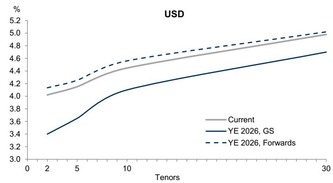

line

| Tenors | Current | YE 2026, GS | YE 2026, Forwards |
| ------ | ------- | ----------- | ----------------- |
| 2      | 4.0     | 3.4         | 4.1               |
| 5      | 4.2     | 3.7         | 4.3               |
| 10     | 4.4     | 4.1         | 4.6               |
| 30     | 4.9     | 4.7         | 5.0               |

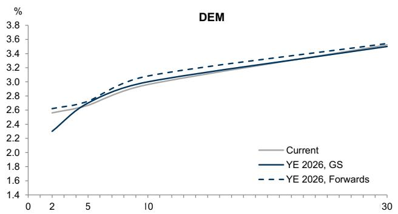

line

| x  | Current | YE 2026, GS | YE 2026, Forwards |
|----|---------|-------------|-------------------|
| 0  | 2.5     | 2.3         | 2.6               |
| 5  | 2.7     | 2.8         | 2.9               |
| 10 | 3.0     | 3.1         | 3.2               |
| 30 | 3.5     | 3.5         | 3.6               |

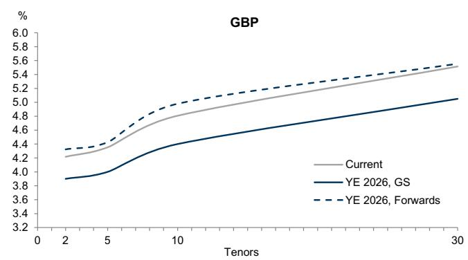

line

| Tenors | Current | YE 2026, GS | YE 2026, Forwards |
| ------ | ------- | ----------- | ----------------- |
| 2      | 4.2     | 3.9         | 4.3               |
| 5      | 4.4     | 4.0         | 4.5               |
| 10     | 4.8     | 4.4         | 5.0               |
| 30     | 5.5     | 5.1         | 5.6               |

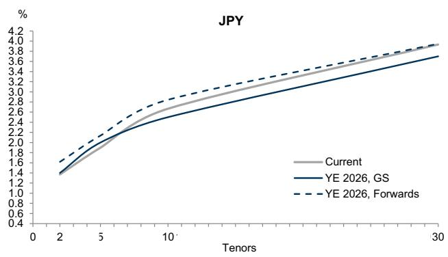

line

| Tenors | Current | YE 2026, GS | YE 2026, Forwards |
| ------ | ------- | ----------- | ----------------- |
| 2      | 1.4     | 1.4         | 1.6               |
| 5      | 2.0     | 2.0         | 2.4               |
| 10     | 2.6     | 2.4         | 3.0               |
| 30     | 3.8     | 3.6         | 4.0               |

Source: Bloomberg, GS Global Investment Research

# Central Bank Dashboard

Cumulative amount of hikes/cuts priced from today   
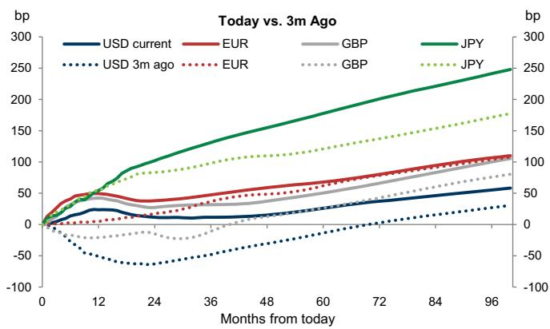

line

| Months from today | USD current | EUR | GBP | JPY | USD 3m ago | EUR | GBP | JPY |
| ----------------- | ----------- | --- | --- | --- | ---------- | --- | --- | --- |
| 0                 | 0           | 0   | 0   | 0   | 0          | 0   | 0   | 0   |
| 12                | ~20         | ~40 | ~30 | ~50 | ~-50       | ~10 | ~-10 | ~70 |
| 24                | ~10         | ~30 | ~20 | ~80 | ~-70       | ~20 | ~-20 | ~90 |
| 36                | ~15         | ~40 | ~30 | ~110| ~-60       | ~30 | ~-10 | ~110|
| 48                | ~20         | ~50 | ~40 | ~140| ~-50       | ~40 | ~0    | ~130|
| 60                | ~25         | ~60 | ~50 | ~170| ~-40       | ~50 | ~10  | ~150|
| 72                | ~30         | ~70 | ~60 | ~200| ~-30       | ~60 | ~20  | ~170|
| 84                | ~35         | ~80 | ~70 | ~220| ~-20       | ~70 | ~30  | ~190|
| 96                | ~40         | ~90 | ~80 | ~250| ~-10       | ~80 | ~40  | ~210|

Source: GS Global Investment Research

Expected hikes by year, GS vs. Market   
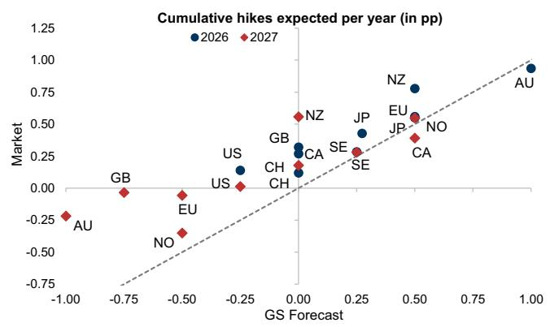

scatter

Cumulative hikes expected per year (in pp)
| Region | Year | GS Forecast | Market |
| :--- | :--- | :--- | :--- |
| AU | 2026 | 1.00 | 0.95 |
| GB | 2027 | -0.75 | -0.15 |
| EU | 2027 | -0.50 | -0.35 |
| US | 2026 | -0.25 | 0.15 |
| CH | 2026 | -0.10 | 0.15 |
| US | 2026 | -0.30 | 0.15 |
| GB | 2026 | 0.00 | 0.30 |
| CA | 2026 | 0.00 | 0.30 |
| NZ | 2026 | 0.00 | 0.55 |
| JP | 2026 | 0.25 | 0.45 |
| SE | 2027 | 0.25 | 0.30 |
| EU | 2027 | 0.50 | 0.55 |
| NO | 2027 | 0.50 | 0.45 |
| CA | 2027 | 0.50 | 0.45 |
| NZ | 2026 | 0.50 | 0.80 |
The chart displays a dashed diagonal line representing the trend of cumulative hikes expected per year across different regions or countries. The data points are labeled with country codes such as “NZ”, “JP”, and “CA”.

Source: GS Global Investment Research

Central bank ownership of sovereign bonds, current vs. 1y ago   
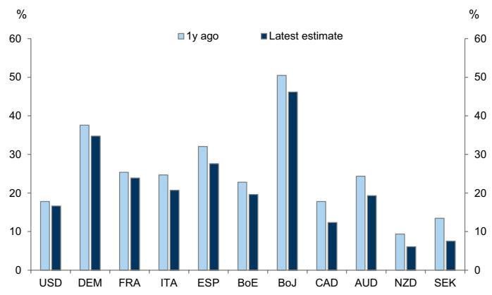

bar

| Currency | 1y ago (%) | Latest estimate (%) |
| :--- | :--- | :--- |
| USD | 18 | 17 |
| DEM | 38 | 35 |
| FRA | 25 | 24 |
| ITA | 25 | 21 |
| ESP | 32 | 28 |
| BoE | 23 | 20 |
| BoJ | 50 | 46 |
| CAD | 18 | 12 |
| AUD | 25 | 20 |
| NZD | 9 | 6 |
| SEK | 14 | 8 |

Source: Haver Analytics

Central bank assets as a share of GDP   
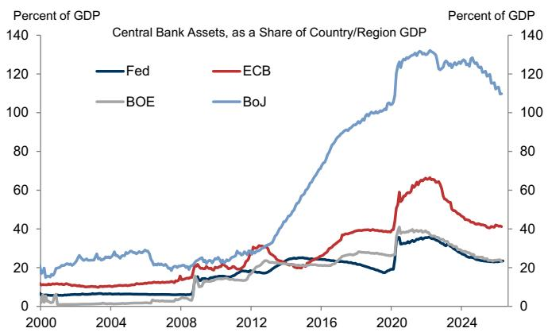

line

| Year | Fed  | ECB  | BOE  | BoJ  |
|------|------|------|------|------|
| 2000 | ~5   | ~10  | ~5   | ~20  |
| 2004 | ~10  | ~15  | ~10  | ~25  |
| 2008 | ~15  | ~20  | ~15  | ~30  |
| 2012 | ~20  | ~30  | ~25  | ~40  |
| 2016 | ~25  | ~40  | ~30  | ~70  |
| 2020 | ~30  | ~60  | ~40  | ~100 |
| 2024 | ~25  | ~45  | ~35  | ~110 |

Source: Haver Analytics

# Positioning and Flows Monitor

Option implied position indicator   
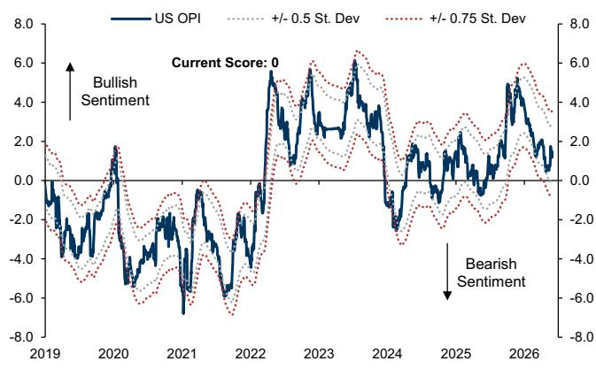

line

| Year | US OPI | +/- 0.5 St. Dev | +/- 0.75 St. Dev |
|------|--------|-----------------|------------------|
| 2019 | -4.0   | -2.0            | -1.0             |
| 2020 | 2.0    | 0.0             | -1.0             |
| 2021 | -6.0   | -4.0            | -2.0             |
| 2022 | 6.0    | 4.0             | 2.0              |
| 2023 | 4.0    | 2.0             | 0.0              |
| 2024 | -2.0   | -4.0            | -2.0             |
| 2025 | 2.0    | 0.0             | -1.0             |
| 2026 | 6.0    | 4.0             | 2.0              |

Source: GS Global Investment Research

GS Fund Positioning Indicator   
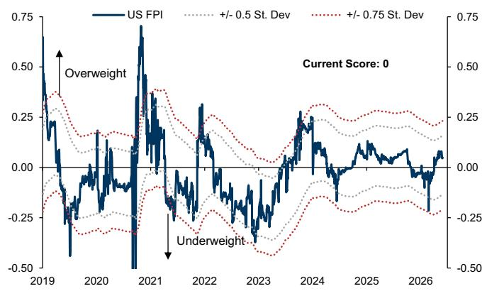

line

| Year | US FPI | +/- 0.5 St. Dev | +/- 0.75 St. Dev |
|------|--------|-----------------|------------------|
| 2019 | 0.75   | 0.30            | 0.40             |
| 2020 | -0.25  | -0.10           | -0.15            |
| 2021 | 0.75   | 0.35            | 0.45             |
| 2022 | -0.25  | -0.10           | -0.15            |
| 2023 | -0.30  | -0.15           | -0.20            |
| 2024 | 0.25   | 0.10            | 0.20             |
| 2025 | 0.10   | 0.05            | 0.15             |
| 2026 | 0.15   | 0.10            | 0.20             |

Source: GS Global Investment Research

US Data Response Indicator (DRI)   
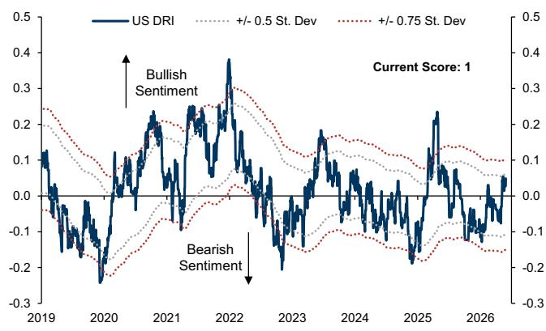

line

| Year | US DRI | +/- 0.5 St. Dev | +/- 0.75 St. Dev |
|------|--------|-----------------|------------------|
| 2019 | 0.1    | 0.2             | 0.2              |
| 2020 | -0.2   | -0.1            | -0.1             |
| 2021 | 0.2    | 0.1             | 0.1              |
| 2022 | 0.4    | 0.3             | 0.3              |
| 2023 | -0.1   | -0.1            | -0.1             |
| 2024 | 0.1    | 0.1             | 0.1              |
| 2025 | -0.2   | -0.1            | -0.1             |
| 2026 | 0.1    | 0.1             | 0.1              |

Source: GS Global Investment Research

# CFTC Commitment of Traders and Traders in Financial Futures

Duration-weighted net position by investor type

Duration-Weighted Positioning, by Contract 

<table><tr><td>$mm/bp</td><td>SFR</td><td>TU</td><td>FV</td><td>TY</td><td>TN</td><td>US</td><td>WN</td></tr><tr><td>Spec Current</td><td>-50.2</td><td>-54.2</td><td>-53.8</td><td>-50.8</td><td>-9.7</td><td>-25.5</td><td>-42.8</td></tr><tr><td>Spec 1w Change</td><td>-5.9</td><td>1.7</td><td>1.8</td><td>-3.8</td><td>-2.0</td><td>-1.2</td><td>-1.3</td></tr><tr><td>LF Current</td><td>-45.1</td><td>-65.0</td><td>-92.1</td><td>-121.9</td><td>-23.3</td><td>-44.7</td><td>-148.7</td></tr><tr><td>LF 1w Change</td><td>0.5</td><td>2.7</td><td>4.0</td><td>0.7</td><td>-1.7</td><td>-2.4</td><td>2.9</td></tr><tr><td>AM + Other Current</td><td>-3.9</td><td>76.9</td><td>119.6</td><td>148.7</td><td>53.3</td><td>59.9</td><td>183.2</td></tr><tr><td>AM + Other 1w Change</td><td>-4.9</td><td>0.0</td><td>2.7</td><td>7.2</td><td>-1.1</td><td>-1.1</td><td>-17.5</td></tr><tr><td>Dealer Current</td><td>49.0</td><td>-14.1</td><td>-26.2</td><td>-31.3</td><td>-19.7</td><td>-25.8</td><td>-33.0</td></tr><tr><td>Dealer 1w Change</td><td>4.4</td><td>-2.0</td><td>-2.7</td><td>-9.3</td><td>1.7</td><td>6.0</td><td>13.7</td></tr></table>

Source: CFTC, GS Global Investment Research

Net positions in Eurodollars   
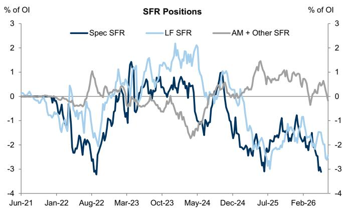

line

| Date    | Spec SFR | LF SFR | AM + Other SFR |
|---------|----------|--------|----------------|
| Jun-21  | 0        | 0      | 0              |
| Jan-22  | -1       | -1     | 0              |
| Aug-22  | -3       | -2     | 0              |
| Mar-23  | 1        | 1      | 0              |
| Oct-23  | 0        | 2      | 0              |
| May-24  | -1       | 1      | 0              |
| Dec-24  | -2       | -1     | 0              |
| Jul-25  | -3       | -2     | 1              |
| Feb-26  | -4       | -3     | 0              |

Note: Duration-weighted net position (long - short) as a % of duration-weighted gross exposure (long + short + spreading)   
Source: CFTC, GS Global Investment Research

Primary dealer transactions   
Net dealer position in US Treasuries   
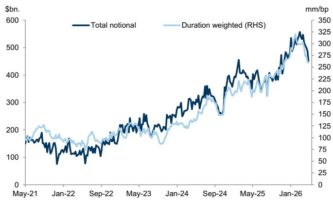

line

| Date    | Total notional ($bn) | Duration weighted (mm/bp) |
|---------|------------------------|----------------------------|
| May-21  | ~180                   | ~100                       |
| Jan-22  | ~100                   | ~75                        |
| Sep-22  | ~180                   | ~125                       |
| May-23  | ~250                   | ~150                       |
| Jan-24  | ~350                   | ~200                       |
| Sep-24  | ~450                   | ~250                       |
| May-25  | ~500                   | ~300                       |
| Jan-26  | ~550                   | ~350                       |

Source: Federal Reserve Bank of New York, GS Global Investment Research

Net positions in UST futures   
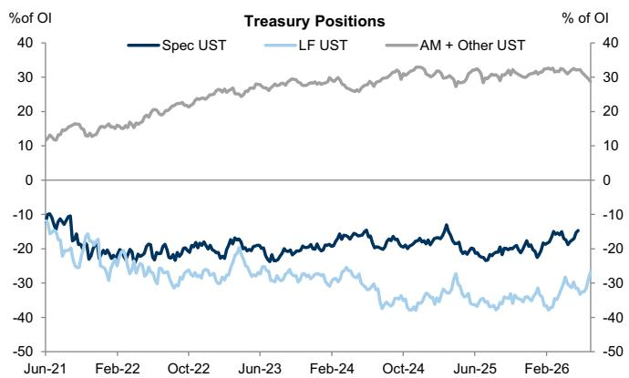

line

| Date    | Spec UST | LF UST | AM + Other UST |
|---------|----------|--------|----------------|
| Jun-21  | -10      | -15    | 10             |
| Feb-22  | -20      | -25    | 15             |
| Oct-22  | -15      | -20    | 20             |
| Jun-23  | -10      | -15    | 25             |
| Feb-24  | -15      | -20    | 30             |
| Oct-24  | -20      | -25    | 35             |
| Jun-25  | -15      | -30    | 30             |
| Feb-26  | -10      | -25    | 30             |

Note: Duration-weighted net position (long - short) as a % of duration-weighted gross exposure (long + short + spreading)   
Source: CFTC, GS Global Investment Research

US Commercial Banks' Holdings of Treasury and Agency Securities   
Total domestic and foreign holdings, all commercial banks   
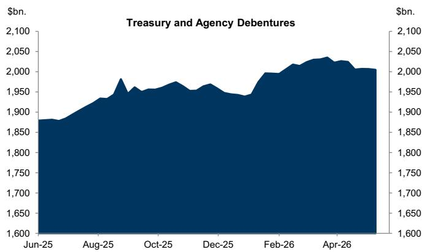

area

| Date   | Value ($bn) |
|--------|-------------|
| Jun-25 | 1,880       |
| Aug-25 | 1,950       |
| Oct-25 | 1,970       |
| Dec-25 | 1,960       |
| Feb-26 | 2,000       |
| Apr-26 | 2,050       |

Source: Federal Reserve Board

NY Fed Custody Holdings   
Marketable US Treasuries   
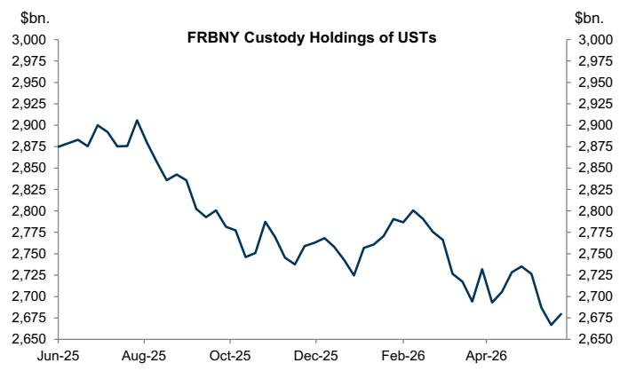

line

| Date   | Value ($bn) |
|--------|-------------|
| Jun-25 | 2,875       |
| Aug-25 | 2,900       |
| Oct-25 | 2,750       |
| Dec-25 | 2,725       |
| Feb-26 | 2,800       |
| Apr-26 | 2,675       |

Source: Federal Reserve Bank of New York

US TIC Treasury Flows   
12m change in valuation-adjusted holdings of USTs, by holder of debt   
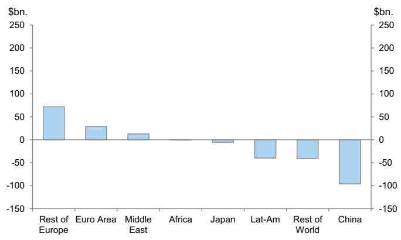

bar

| Region | Value ($bn) |
| :--- | :--- |
| Rest of Europe | 75 |
| Euro Area | 30 |
| Middle East | 15 |
| Africa | -5 |
| Japan | -10 |
| Lat-Am | -40 |
| Rest of World | -35 |
| China | -95 |

Source: US Treasury, GS Global Investment Research

Net monthly purchases of short- and long-term US Treasuries by Japanese investors   
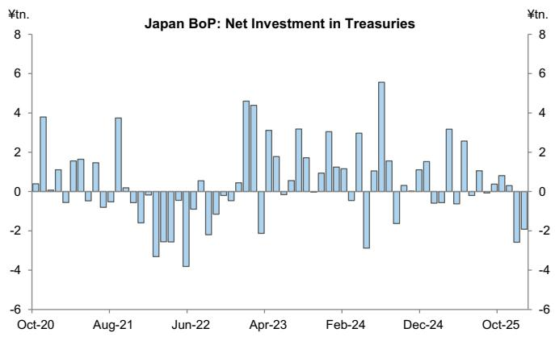

bar

| Month   | Net Investment (¥tn) |
|---------|----------------------|
| Oct-20  | 4                    |
| Nov-20  | 1                    |
| Dec-20  | 1                    |
| Jan-21  | 1                    |
| Feb-21  | 1                    |
| Mar-21  | 1                    |
| Apr-21  | 1                    |
| May-21  | 1                    |
| Jun-21  | -3                   |
| Jul-21  | -3                   |
| Aug-21  | -3                   |
| Sep-21  | -3                   |
| Oct-21  | -3                   |
| Nov-21  | -3                   |
| Dec-21  | -3                   |
| Jan-22  | -3                   |
| Feb-22  | -3                   |
| Mar-22  | -3                   |
| Apr-22  | -3                   |
| May-22  | -3                   |
| Jun-22  | -3                   |
| Jul-22  | -3                   |
| Aug-22  | -3                   |
| Sep-22  | -3                   |
| Oct-22  | -3                   |
| Nov-22  | -3                   |
| Dec-22  | -3                   |
| Jan-23  | -3                   |
| Feb-23  | -3                   |
| Mar-23  | -3                   |
| Apr-23  | -3                   |
| May-23  | -3                   |
| Jun-23  | -3                   |
| Jul-23  | -3                   |
| Aug-23  | -3                   |
| Sep-23  | -3                   |
| Oct-23  | -3                   |
| Nov-23  | -3                   |
| Dec-23  | -3                   |
| Jan-24  | -3                   |
| Feb-24  | -3                   |
| Mar-24  | -3                   |
| Apr-24  | -3                   |
| May-24  | -3                   |
| Jun-24  | -3                   |
| Jul-24  | -3                   |
| Aug-24  | -3                   |
| Sep-24  | -3                   |
| Oct-24  | -3                   |
| Nov-24  | -3                   |
| Dec-24  | -3                   |
| Jan-25  | -3                   |
| Feb-25  | -3                   |
| Mar-25  | -3                   |
| Apr-25  | -3                   |
| May-25  | -3                   |
| Jun-25  | -3                   |
| Jul-25  | -3                   |
| Aug-25  | -3                   |
| Sep-25  | -3                   |
| Oct-25  | -3                   |

Source: Bank of Japan, Haver Analytics

Flow of Funds annual net purchases of US Treasuries, by sector   

bar

| Category | 2023 ($bn) | 2024 ($bn) | 2025 Estimated ($bn) |
| :--- | :--- | :--- | :--- |
| Fed | -750 | -500 | 100 |
| Foreign Official | 50 | 50 | 50 |
| Households | 900 | 20 | 400 |
| Pensions | 100 | 350 | 200 |
| Asset Managers | 100 | 180 | 150 |
| MMMFs | 1200 | 700 | 150 |
| Foreign Private | 550 | 550 | 550 |
| Banks | -100 | 200 | 200 |
| Brokers/Dealers | 100 | 150 | 50 |
| Other Sectors | 200 | 250 | 150 |

Source: Federal Reserve Board, GS Global Investment Research

# Outright Carry

Bar chart shows top two carry points by currency, with solid reflecting carry to a long position and striped carry to a short position. Scatter illustrates top 25 carry/vol points by currency, with top point by currency noted

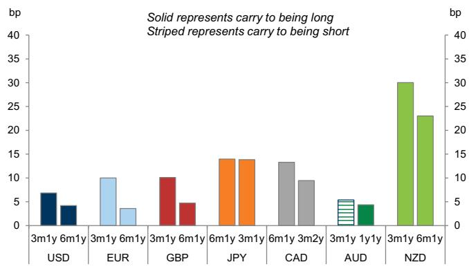

bar

| Currency | Striped (bp) | Solid (bp) |
|----------|--------------|------------|
| USD      | 4            | 7          |
| EUR      | 3            | 10         |
| GBP      | 5            | 10         |
| JPY      | 14           | 14         |
| CAD      | 9            | 13         |
| AUD      | 4            | 5          |
| NZD      | 23           | 30         |

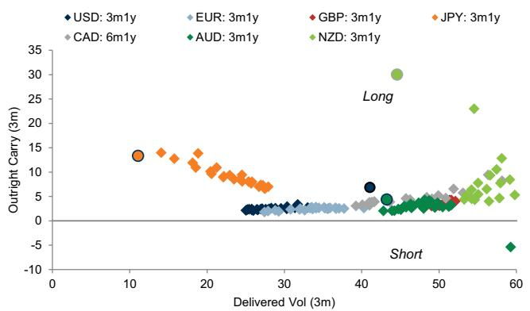

scatter

| Currency | Delivered Vol (3m) | Outright Carry (3m) |
|----------|---------------------|----------------------|
| USD      | 40                  | 7                    |
| EUR      | 30                  | 2                    |
| CAD      | 30                  | 2                    |
| AUD      | 40                  | 5                    |
| JPY      | 10                  | 13                   |
| GBP      | 50                  | 5                    |
| NZD      | 50                  | 23                   |
| Short    | 60                  | -5                   |

Source: GS Global Investment Research

# Curve Carry

Bar chart shows top two carry curves by currency, with solid reflecting carry to a steepening position and striped carry to a flattening position. Scatter illustrates top 5 carry/vol curves by currency, with top curve by currency noted

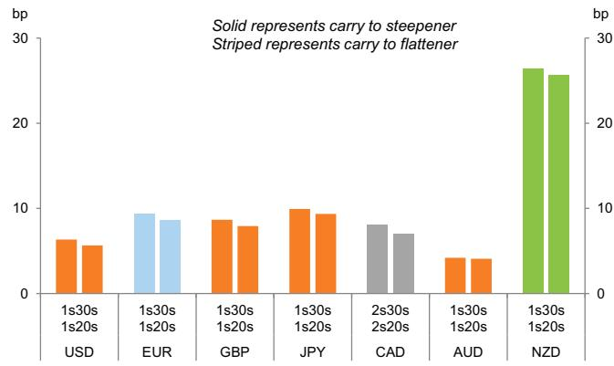

bar

| Currency | 1s30s 1s20s | 1s30s 1s20s | 1s30s 1s20s | 1s30s 1s20s | 1s30s 1s20s | 1s30s 1s20s | 1s30s 1s20s | 1s30s 1s20s | 1s30s 2s20s | 2s30s 2s20s | 2s30s 2s20s | 1s30s 1s20s | AUD |
|----------|-------------|-------------|-------------|-------------|-------------|-------------|-------------|-------------|-------------|-------------|-------------|-------------|-----|
| USD      |             |             |             |             |             |             |             |             |             |             |             |             |     |
| EUR      |             |             |             |             |             |             |             |             |             |             |             |             |     |
| GBP      |             |             |             |             |             |             |             |             |             |             |             |             |     |
| JPY      |             |             |             |             |             |             |             |             |             |             |             |             |     |
| CAD      |             |             |             |             |             |             |             |             |             |             |             |             |     |
| AUD      |             |             |             |             |             |             |             |             |             |             |             |             |     |
| NZD      |             |             |             |             |             |             |             |             |             |             |             |             |     |

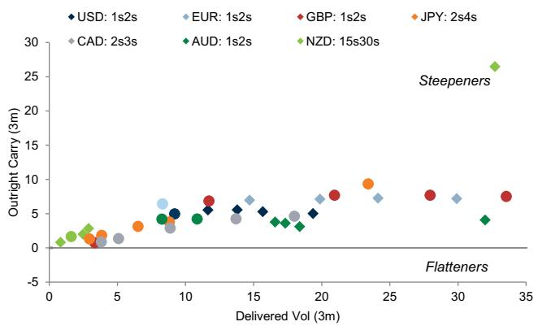

scatter

| Currency | Delivered Vol (3m) | Outright Carry (3m) |
|----------|---------------------|----------------------|
| USD      | 8                   | 6                    |
| USD      | 9                   | 5                    |
| USD      | 10                  | 6                    |
| USD      | 11                  | 7                    |
| USD      | 12                  | 6                    |
| USD      | 13                  | 5                    |
| USD      | 14                  | 6                    |
| USD      | 15                  | 5                    |
| USD      | 16                  | 6                    |
| USD      | 17                  | 5                    |
| USD      | 18                  | 6                    |
| USD      | 19                  | 5                    |
| USD      | 20                  | 6                    |
| EUR      | 8                   | 7                    |
| EUR      | 9                   | 6                    |
| EUR      | 10                  | 5                    |
| EUR      | 11                  | 6                    |
| EUR      | 12                  | 7                    |
| EUR      | 13                  | 6                    |
| EUR      | 14                  | 7                    |
| EUR      | 15                  | 6                    |
| EUR      | 16                  | 7                    |
| EUR      | 17                  | 6                    |
| EUR      | 18                  | 7                    |
| EUR      | 19                  | 6                    |
| EUR      | 20                  | 7                    |
| EUR      | 21                  | 8                    |
| EUR      | 22                  | 7                    |
| EUR      | 23                  | 8                    |
| EUR      | 24                  | 7                    |
| EUR      | 25                  | 8                    |
| EUR      | 26                  | 7                    |
| EUR      | 27                  | 8                    |
| EUR      | 28                  | 7                    |
| EUR      | 29                  | 8                    |
| EUR      | 30                  | 7                    |
| EUR      | 31                  | 8                    |
| EUR      | 32                  | 7                    |
| EUR      | 33                  | 8                    |
| GBP      | 8                   | 7                    |
| GBP      | 9                   | 6                    |
| GBP      | 10                  | 7                    |
| GBP      | 11                  | 8                    |
| GBP      | 12                  | 7                    |
| GBP      | 13                  | 6                    |
| GBP      | 14                  | 7                    |
| GBP      | 15                  | 6                    |
| GBP      | 16                  | 7                    |
| GBP      | 17                  | 6                    |
| GBP      | 18                  | 7                    |
| GBP      | 19                  | 6                    |
| GBP      | 20                  | 8                    |
| GBP      | 21                  | 7                    |
| GBP      | 22                  | 8                    |
| GBP      | 23                  | 7                    |
| GBP      | 24                  | 8                    |
| GBP      | 25                  | 7                    |
| GBP      | 26                  | 8                    |
| GBP      | 27                  | 7                    |
| GBP      | 28                  | 8                    |
| GBP      | 29                  | 7                    |
| GBP      | 30                  | 8                    |
| GBP      | 31                  | 7                    |
| GBP      | 32                  | 8                    |
| GBP      | 33                  | 7                    |
| CAD      | 8                   | 3                    |
| CAD      | 9                   | 4                    |
| CAD      | 10                  | 5                    |
| CAD      | 11                  | 4                    |
| CAD      | 12                  | 5                    |
| CAD      | 13                  | 4                    |
| CAD      | 14                  | 5                    |
| CAD      | 15                  | 4                    |
| CAD      | 16                  | 5                    |
| CAD      | 17                  | 4                    |
| CAD      | 18                  | 5                    |
| CAD      | 19                  | 4                    |
| CAD      | 20                  | 5                    |
| CAD      | 21                  | 4                    |
| CAD      | 22                  | 5                    |
| CAD      | 23                  | 4                    |
| CAD      | 24                  | 5                    |
| CAD      | 25                  | 4                    |
| AUD      | 8                   | -2                   |
| AUD      | 9                   | -3                   |
| AUD      | 10                  | -4                   |
| AUD      | 11                  | -3                   |
| AUD      | 12                  | -4                   |
| AUD      | 13                  | -3                   |
| AUD      | 14                  | -4                   |
| AUD      | 15                  | -3                   |
| AUD      | 16                  | -4                   |
| AUD      | 17                  | -3                   |
| AUD      | 18                  | -4                   |
| AUD      | 19                  | -3                   |
| AUD      | 20                  | -4                   |
| AUD      | 21                  | -3                   |
| AUD      | 22                  | -4                   |
| AUD      | 23                  | -3                   |
| AUD      | 24                  | -4                   |
| AUD      | 25                  | -3                   |
| AUD      | 26                  | -4                   |
| AUD      | 27                  | -3                   |
| AUD      | 28                  | -4                   |
| AUD      | 29                  | -3                   |
| AUD      | 30                  | -4                   |
| AUD      | 31                  | -3                   |
| AUD      | 32                  | -4                   |
| NZD     | -                   | -1                   |
| NZD     | -                   | -2                   |
| NZD     | -                   | -3                   |
| NZD     | -                   | -4                   |
| NZD     | -                   | -3                   |
| NZD     | -                   | -4                   |
| NZD     | -                   | -3                   |
| NZD     | -                   | -4                   |
| NZD     | -                   | -3                   |
| NZD     | -                   | -4                   |
| NZD     | -                   | -3                   |
| NZD     | -                   | -4                   |
| JPY     | -                   | -                     |
| JPY     | -                   | -                     |
| JPY     | -                   | -                     |
| JPY     | -                   | -                     |
| JPY     | -                   | -                     |
| JPY     | -                   | -                     |
| JPY     | -                   | -                     |
| JPY     | -                   | -                     |
| JPY     | -                   | -                     |
| JPY     | -                   | -                     |

| Steepeners   |
| Flatteners   |

Line Color: USD, EUR, GBP, JPY, CAD, NZD; Line Style: Steepeners; Line Style: Flatteners

Source: GS Global Investment Research

# Fly Carry

Bar chart shows top two carry flies by currency, with solid reflecting carry to a belly-richening fly and striped carry to a belly-cheapening fly. Scatter illustrates top 5 carry/vol flies by currency, with top fly by currency noted.

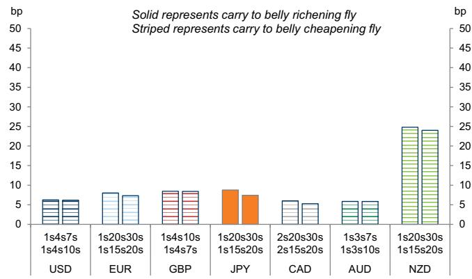

bar

| Currency | Line Style | Value (bp) |
|----------|------------|------------|
| USD      | Solid      | 6          |
| USD      | Striped    | 6          |
| EUR      | Solid      | 8          |
| EUR      | Striped    | 7          |
| GBP      | Solid      | 8          |
| GBP      | Striped    | 8          |
| JPY      | Solid      | 9          |
| JPY      | Striped    | 7          |
| CAD      | Solid      | 6          |
| CAD      | Striped    | 5          |
| AUD      | Solid      | 6          |
| AUD      | Striped    | 6          |
| NZD      | Solid      | 25         |
| NZD      | Striped    | 24         |

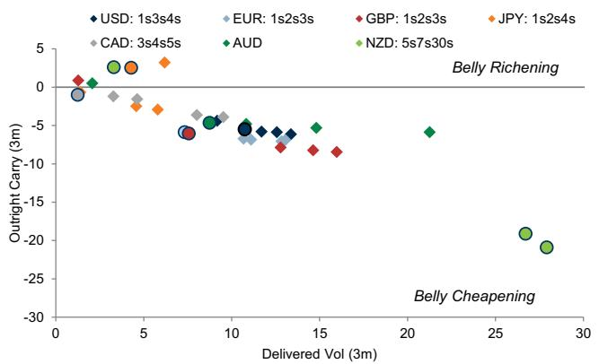

scatter

| Currency | Band           | Delivered Vol (3m) | Outright Carry (3m) |
|----------|----------------|--------------------|---------------------|
| USD      | 1s3s4s         | ~7                 | ~-6                 |
| EUR      | 1s2s3s         | ~1                 | ~-1                 |
| GBP      | 1s2s3s         | ~1                 | ~1                  |
| CAD      | 3s4s5s         | ~8                 | ~-4                 |
| JPY      | 1s2s4s         | ~6                 | ~3                  |
| AUD      | —              | ~9                 | ~-5                 |
| NZD      | 5s7s30s        | ~27                | ~-20                |

Source: GS Global Investment Research

# Treasury Supply Monitor

Gross Treasury auction size estimates by year end, with GS projections 

<table><tr><td colspan="12">Monthly Auction Amounts at End of Calendar Year ($ billions)</td></tr><tr><td></td><td>2y FRNs</td><td>2y</td><td>3y</td><td>5y</td><td>7y</td><td>10y</td><td>20y</td><td>30y</td><td>5y TIPS</td><td>10y TIPS</td><td>30y TIPS</td></tr><tr><td>YE-25 (CY)</td><td>30 / 28 (r)</td><td>69</td><td>58</td><td>70</td><td>44</td><td>42 / 39 (r)</td><td>16 / 13 (r)</td><td>25 / 22 (r)</td><td>26 / 24 (r)</td><td>21 / 19 (r)</td><td>9 / 8 (r)</td></tr><tr><td>YE-26 (CY, GS)</td><td>30 / 28 (r)</td><td>69</td><td>58</td><td>70</td><td>44</td><td>42 / 39 (r)</td><td>16 / 13 (r)</td><td>25 / 22 (r)</td><td>26 / 24 (r)</td><td>21 / 19 (r)</td><td>9 / 8 (r)</td></tr><tr><td>YE-27 (CY, GS)</td><td>33 / 30 (r)</td><td>83</td><td>72</td><td>84</td><td>58</td><td>42 / 39 (r)</td><td>16 / 13 (r)</td><td>25 / 22 (r)</td><td>28 / 26 (r)</td><td>21 / 19 (r)</td><td>9 / 8 (r)</td></tr></table>

\* Original Issue / Reopening listed for FRNs, 10s, 20s, 30s, and TIPS.

US Treasury Net Issuance by Calendar Year (\$ billions) 

<table><tr><td></td><td>Net Coupons</td><td>Fed</td><td>Net of Fed</td><td>Net Bills</td><td>Fed</td><td>Net of Fed</td></tr><tr><td>CY 2024</td><td>1346</td><td>-475</td><td>1821</td><td>511</td><td>-23</td><td>534</td></tr><tr><td>CY 2025</td><td>1566</td><td>-115</td><td>1681</td><td>360</td><td>38</td><td>322</td></tr><tr><td>CY 2026, GS</td><td>1225</td><td>-1</td><td>1226</td><td>811</td><td>422</td><td>389</td></tr><tr><td>CY 2027, GS</td><td>1286</td><td>0</td><td>1286</td><td>927</td><td>449</td><td>478</td></tr></table>

Duration supply (\$bn 10y equiv) 

<table><tr><td>Gross supply</td><td>Fed</td><td>Net of Fed</td></tr><tr><td>2765</td><td>0</td><td>2765</td></tr><tr><td>2797</td><td>0</td><td>2797</td></tr><tr><td>2796</td><td>0</td><td>2796</td></tr><tr><td>2929</td><td>0</td><td>2929</td></tr></table>

Source: GS Global Investment Research, US Department of the Treasury

Net issuance per quarter   
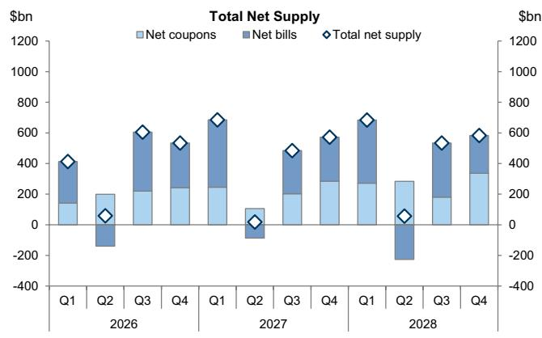

bar

| Quarter | Net coupons ($bn) | Net bills ($bn) | Total net supply ($bn) |
|---------|-------------------|-----------------|------------------------|
| Q1 2026 | 150               | 300             | 400                    |
| Q2 2026 | 200               | -150            | 100                    |
| Q3 2026 | 200               | 400             | 600                    |
| Q4 2026 | 250               | 350             | 550                    |
| Q1 2027 | 250               | 550             | 700                    |
| Q2 2027 | -100              | -50             | 50                     |
| Q3 2027 | 200               | 350             | 500                    |
| Q4 2027 | 300               | 450             | 650                    |
| Q1 2028 | 250               | 550             | 700                    |
| Q2 2028 | -300              | -150            | 100                    |
| Q3 2028 | 150               | 450             | 550                    |
| Q4 2028 | 350               | 450             | 650                    |

Source: GS Global Investment Research, US Department of the Treasury

Average monthly UST issuance, gross and net of Fed purchases; \$bn 10y equivalents   
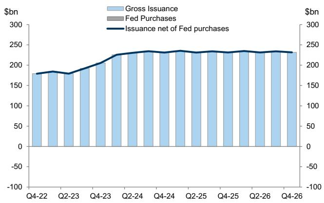

bar_line

| Quarter | Gross Issuance ($bn) | Fed Purchases ($bn) | Issuance net of Fed purchases ($bn) |
|---------|------------------------|----------------------|-------------------------------------|
| Q4-22   | 180                    | -                    | 180                                 |
| Q2-23   | 190                    | -                    | 190                                 |
| Q4-23   | 200                    | -                    | 200                                 |
| Q2-24   | 230                    | -                    | 230                                 |
| Q4-24   | 235                    | -                    | 235                                 |
| Q2-25   | 230                    | -                    | 230                                 |
| Q4-25   | 235                    | -                    | 235                                 |
| Q2-26   | 230                    | -                    | 230                                 |
| Q4-26   | 235                    | -                    | 235                                 |

Source: GS Global Investment Research, US Department of the Treasury

Free float (Treasuries outstanding less Fed and foreign official holdings) as % of GDP   
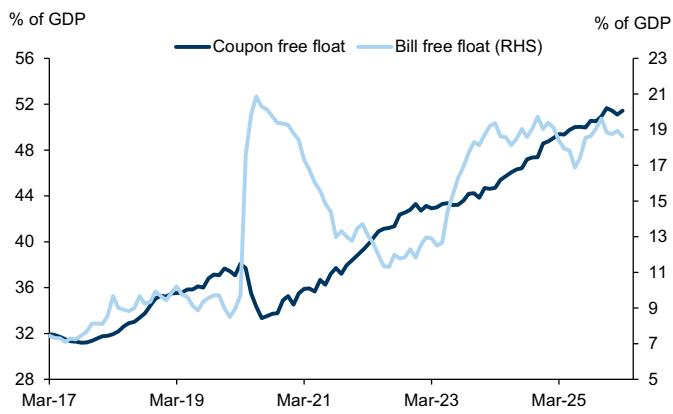

line

| Date   | Coupon free float | Bill free float (RHS) |
|--------|-------------------|------------------------|
| Mar-17 | 32                | 7                      |
| Mar-19 | 36                | 11                     |
| Mar-21 | 33                | 21                     |
| Mar-23 | 44                | 17                     |
| Mar-25 | 52                | 19                     |

Source: Haver Analytics, US Treasury, GS Global Investment Research

Bills as a share of Treasuries outstanding and GS forecast
Gray shading denotes TBAC recommended 15-20% range   
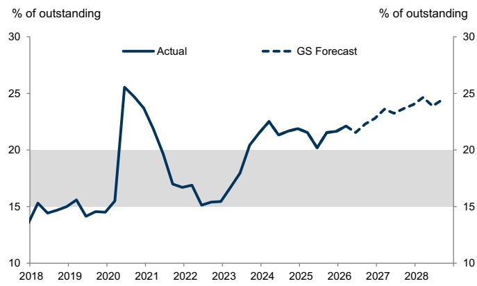

line

| Year | Actual | GS Forecast |
|------|--------|-------------|
| 2018 | 14.0   | -           |
| 2019 | 15.5   | -           |
| 2020 | 14.5   | -           |
| 2021 | 25.5   | -           |
| 2022 | 16.5   | -           |
| 2023 | 15.0   | -           |
| 2024 | 22.5   | -           |
| 2025 | 21.5   | -           |
| 2026 | 21.0   | -           |
| 2027 | -      | 23.5        |
| 2028 | -      | 24.5        |

Source: US Treasury, GS Global Investment Research

# GS Term Premium Decomposition

1y Range of G10 10y Yields, by Term Premium and Expectations Components   
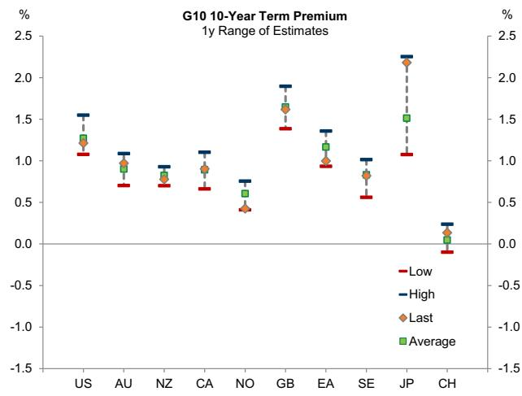

bar_line

| Country | Low  | High | Last | Average |
|---------|------|------|------|---------|
| US      | 1.1  | 1.6  | 1.3  | 1.3     |
| AU      | 0.7  | 1.1  | 0.9  | 0.9     |
| NZ      | 0.7  | 1.0  | 0.8  | 0.8     |
| CA      | 0.6  | 1.1  | 0.9  | 0.9     |
| NO      | 0.4  | 0.7  | 0.5  | 0.6     |
| GB      | 1.4  | 1.9  | 1.7  | 1.7     |
| EA      | 1.0  | 1.4  | 1.2  | 1.2     |
| SE      | 0.6  | 1.0  | 0.8  | 0.8     |
| JP      | 1.1  | 2.2  | 2.2  | 1.5     |
| CH      | -0.1 | 0.2  | 0.1  | 0.1     |

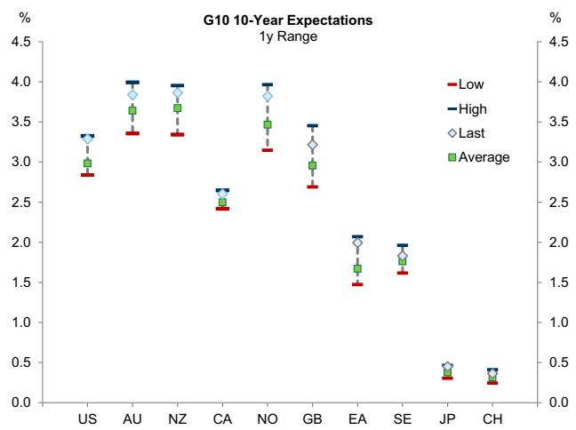

bar

| Country | Low  | High | Last | Average |
|---------|------|------|------|---------|
| US      | 2.8  | 3.3  | 3.4  | 3.0     |
| AU      | 3.4  | 4.0  | 3.9  | 3.6     |
| NZ      | 3.4  | 3.9  | 3.9  | 3.7     |
| CA      | 2.4  | 2.6  | 2.7  | 2.5     |
| NO      | 3.2  | 3.9  | 3.9  | 3.5     |
| GB      | 2.7  | 3.4  | 3.2  | 3.0     |
| EA      | 1.5  | 2.0  | 2.0  | 1.7     |
| SE      | 1.6  | 1.9  | 1.8  | 1.7     |
| JP      | 0.3  | 0.4  | 0.4  | 0.4     |
| CH      | 0.2  | 0.3  | 0.3  | 0.3     |

Term Structure of Fitted Yields, by Component   
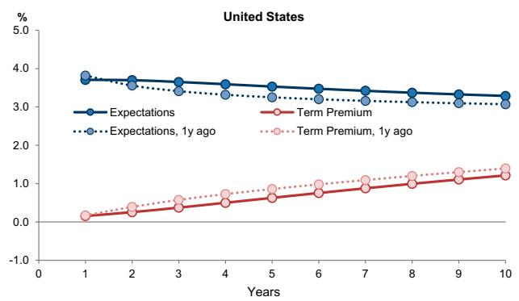

line

| Years | Expectations | Expectations, 1y ago | Term Premium | Term Premium, 1y ago |
|-------|--------------|----------------------|--------------|----------------------|
| 1     | 3.8          | 3.7                  | 0.1          | 0.1                  |
| 2     | 3.7          | 3.6                  | 0.2          | 0.3                  |
| 3     | 3.6          | 3.5                  | 0.4          | 0.5                  |
| 4     | 3.5          | 3.4                  | 0.6          | 0.7                  |
| 5     | 3.4          | 3.3                  | 0.8          | 0.9                  |
| 6     | 3.3          | 3.2                  | 1.0          | 1.0                  |
| 7     | 3.2          | 3.1                  | 1.2          | 1.1                  |
| 8     | 3.1          | 3.0                  | 1.4          | 1.2                  |
| 9     | 3.0          | 2.9                  | 1.5          | 1.3                  |
| 10    | 2.9          | 2.8                  | 1.6          | 1.4                  |

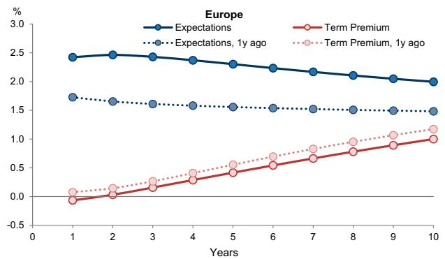

line

| Years | Expectations | Term Premium | Expectations, 1y ago | Term Premium, 1y ago |
|-------|--------------|--------------|----------------------|----------------------|
| 1     | 2.4          | -0.1         | 1.7                  | 0.1                  |
| 2     | 2.45         | 0.0          | 1.65                 | 0.15                 |
| 3     | 2.4          | 0.1          | 1.6                  | 0.25                 |
| 4     | 2.35         | 0.2          | 1.55                 | 0.35                 |
| 5     | 2.3          | 0.3          | 1.5                  | 0.5                  |
| 6     | 2.25         | 0.4          | 1.5                  | 0.6                  |
| 7     | 2.2          | 0.5          | 1.5                  | 0.7                  |
| 8     | 2.15         | 0.6          | 1.5                  | 0.8                  |
| 9     | 2.1          | 0.7          | 1.5                  | 0.9                  |
| 10    | 2.0          | 0.8          | 1.5                  | 1.0                  |

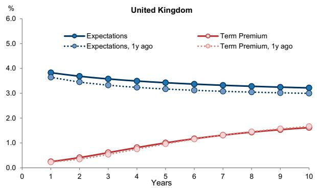

line

| Years | Expectations | Expectations, 1y ago | Term Premium | Term Premium, 1y ago |
|-------|--------------|----------------------|--------------|----------------------|
| 1     | 3.8          | 3.6                  | 0.2          | 0.2                  |
| 2     | 3.7          | 3.5                  | 0.4          | 0.4                  |
| 3     | 3.6          | 3.4                  | 0.6          | 0.6                  |
| 4     | 3.5          | 3.3                  | 0.8          | 0.8                  |
| 5     | 3.4          | 3.2                  | 1.0          | 1.0                  |
| 6     | 3.3          | 3.1                  | 1.2          | 1.2                  |
| 7     | 3.2          | 3.0                  | 1.4          | 1.4                  |
| 8     | 3.1          | 2.9                  | 1.5          | 1.5                  |
| 9     | 3.0          | 2.8                  | 1.6          | 1.6                  |
| 10    | 2.9          | 2.7                  | 1.7          | 1.7                  |

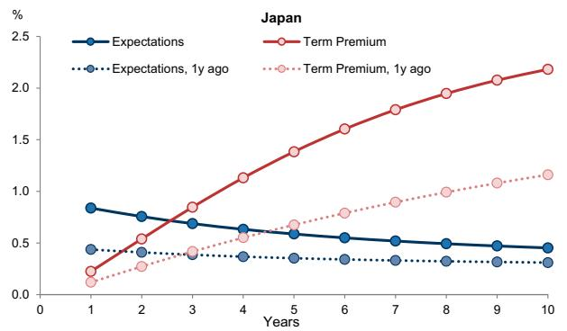

line

| Years | Expectations | Term Premium | Expectations, 1y ago | Term Premium, 1y ago |
|-------|--------------|--------------|----------------------|----------------------|
| 1     | 0.85         | 0.2          | 0.4                  | 0.1                  |
| 2     | 0.75         | 0.5          | 0.4                  | 0.3                  |
| 3     | 0.7          | 0.85         | 0.4                  | 0.4                  |
| 4     | 0.65         | 1.15         | 0.4                  | 0.6                  |
| 5     | 0.6          | 1.4          | 0.4                  | 0.7                  |
| 6     | 0.55         | 1.6          | 0.4                  | 0.8                  |
| 7     | 0.5          | 1.8          | 0.4                  | 0.9                  |
| 8     | 0.45         | 1.95         | 0.4                  | 1.0                  |
| 9     | 0.45         | 2.1          | 0.4                  | 1.1                  |
| 10    | 0.45         | 2.2          | 0.4                  | 1.2                  |

Source: GS Global Investment Research

2026 Trade Recommendations 

<table><tr><td colspan="7">GS Rates Trades</td></tr><tr><td>Active</td><td>Entry Date</td><td>Opened</td><td>Latest</td><td>Stop</td><td>Target</td><td>Performance</td></tr><tr><td>1. Long 3y France, Spain, Italy vs OIS (equally weighted)</td><td>10-Apr-26</td><td>0.33</td><td>0.30</td><td>0.32</td><td>0.23</td><td>+3 bps</td></tr><tr><td>2. Long 3y SOFR swap spread</td><td>17-Apr-26</td><td>-0.226</td><td>-0.203</td><td>-0.230</td><td>-0.180</td><td>+2 bps</td></tr><tr><td>3. 2s5s CAD steepeners</td><td>24-Apr-26</td><td>0.20</td><td>0.22</td><td>0.20</td><td>0.35</td><td>+2 bps</td></tr><tr><td>4. Long 5y5y EUR OIS - HICP</td><td>1-May-26</td><td>1.09</td><td>0.99</td><td>1.22</td><td>0.88</td><td>+10 bps</td></tr><tr><td>5. Long 5y Receivers on 3m 2s5s10s Receiver Fly (bp running)</td><td>8-May-26</td><td>0.01</td><td>-0.01</td><td>-0.05</td><td>0.10</td><td>-2 bps</td></tr><tr><td>6. 1y forward 2s10s GBP OIS steepeners</td><td>29-May-26</td><td>0.38</td><td></td><td>0.25</td><td>0.55</td><td></td></tr><tr><td>Closed</td><td>Entry Date</td><td>Closed</td><td>Performance</td><td></td><td></td><td></td></tr><tr><td>1. SFRZ6/Z7 steepeners</td><td>21-Nov-25</td><td>14-Jan-26</td><td>+6bps</td><td></td><td></td><td></td></tr><tr><td>2. Long 10y Gilts on ASW</td><td>21-Nov-25</td><td>30-Jan-26</td><td>+12 bps</td><td></td><td></td><td></td></tr><tr><td>3. Long USD 3m2y A-25 receiver vs short 3m10y A-25 receiver (return in bp running)</td><td>7-Nov-25</td><td>9-Feb-26</td><td>-2 bps</td><td></td><td></td><td></td></tr><tr><td>4. 2s5s CORRA steepener</td><td>16-Jan-26</td><td>13-Feb-26</td><td>+0 bps</td><td></td><td></td><td></td></tr><tr><td>5. Receive AUD 5y5y IRS vs pay NZD 5y5y</td><td>28-Nov-25</td><td>18-Feb-26</td><td>+0 bps</td><td></td><td></td><td></td></tr><tr><td>6. Long 20s on 10s20s30s weighted SOFR fly (weights 0.6x : 2x : 1.4x)</td><td>1-Aug-25</td><td>2-Mar-26</td><td>+6 bps</td><td></td><td></td><td></td></tr><tr><td>7. Long SFIU6</td><td>30-Jan-26</td><td>3-Mar-26</td><td>+7 bps</td><td></td><td></td><td></td></tr><tr><td>8. Long 10y Gilts vs Bunds</td><td>7-Nov-25</td><td>9-Mar-26</td><td>+4 bps</td><td></td><td></td><td></td></tr><tr><td>9. 3m10y A+5/A+20/A+27.5 payer ladders (bp running)</td><td>20-Feb-26</td><td>23-Mar-26</td><td>-5 bps</td><td></td><td></td><td></td></tr><tr><td>10. Long 10y NOK vs SEK</td><td>13-Feb-26</td><td>25-Mar-26</td><td>+20 bps</td><td></td><td></td><td></td></tr><tr><td>11. Long EU 30y on the fly against 30y Austria and Spain</td><td>27-Feb-26</td><td>10-Apr-26</td><td>-5 bps</td><td></td><td></td><td></td></tr><tr><td>12. Long USD 3m 2s10s A+10/A+25 curve cap spread (bp of notional)</td><td>23-Jan-26</td><td>15-Apr-26</td><td>-2 bps</td><td></td><td></td><td></td></tr><tr><td>13. USD 3m3y A-5/A-40 receiver spreads</td><td>13-Mar-26</td><td>30-Apr-26</td><td>-7 bps</td><td></td><td></td><td></td></tr><tr><td>14. Long 10y Inflation Swap vs 0.25x Receive 10y SOFR</td><td>27-Mar-26</td><td>7-May-26</td><td>+15 bps</td><td></td><td></td><td></td></tr><tr><td>15. Pay 10s on 5s10s30s SOFR fly</td><td>9-Jan-26</td><td>8-May-26</td><td>-1 bps</td><td></td><td></td><td></td></tr></table>

Note: Potential profit/loss estimates are given as per unit of duration risk, through yesterday's close.   
Source: GS Global Investment Research

# Global Interest Rates Strategy

# George Cole

+44(20)7552-1214

george.cole@gs.com

GS International

# William Marshall

+1(212)357-0413

william.c.marshall@gs.com

GS & Co. LLC

# Simon Freycenet

+44(20)7774-5017

simon.freycenet@gs.com

GS Bank Europe SE - Paris

Branch

# Isabella Rosenberg

+1(212)357-7628

isabella.rosenberg@gs.com

GS & Co. LLC

# Friedrich Schaper

+1(917)343-3214

friedrich.schaper@gs.com

GS & Co. LLC

# Loic Mathys

+44(20)7051-1664

loic.mathys@gs.com

GS International

# Disclosure Appendix

# Reg AC

We, George Cole, William Marshall, Simon Freycenet, Isabella Rosenberg, Friedrich Schaper and Loic Mathys, hereby certify that all of the views expressed in this report accurately reflect our personal views, which have not been influenced by considerations of the firm's business or client relationships.

Unless otherwise stated, the individuals listed on the cover page of this report are analysts in GS' Global Investment Research division.

Contributing Authors: George Cole GS International, William Marshall GS & Co. LLC, Simon Freycenet GS Bank Europe SE - Paris Branch, Isabella Rosenberg GS & Co. LLC, Friedrich Schaper GS & Co. LLC, Loic Mathys GS International.

Unless otherwise stated, the individuals listed in the Contributing Authors disclosure of this report are analysts in GS' Global Investment Research division.

# Disclosures

# Option Specific Disclosures

Price target methodology: Please refer to the analyst's previously published research for methodology and risks associated with equity price targets.

Pricing Disclosure: Option prices and volatility levels in this note are indicative only, and are based on our estimates of recent mid-market levels (unless otherwise noted). All prices and levels exclude transaction costs unless otherwise stated.

General Options Risks – The risks below and any other options risks mentioned in this research report pertain both to specific derivative trade recommendations mentioned and to discussion of general opportunities and advantages of derivative strategies. Unless otherwise noted, options strategies mentioned in this report may be a combination of the strategies below and therefore carry with them the risks of those strategies.

Buying Options – Investors who buy call (put) options risk loss of the entire premium paid if the underlying security finishes below (above) the strike price at expiration. Investors who buy call or put spreads also risk a maximum loss of the premium paid. The maximum gain on a long call or put spread is the difference between the strike prices, less the premium paid.

Selling Options – Investors who sell calls on securities they do not own risk unlimited loss of the security price less the strike price. Investors who sell covered calls (sell calls while owning the underlying security) risk having to deliver the underlying security or pay the difference between the security price and the strike price, depending on whether the option is settled by physical delivery or cash-settled. Investors who sell puts risk loss of the strike price less the premium received for selling the put. Investors who sell put or call spreads risk a maximum loss of the difference between the strikes less the premium received, while their maximum gain is the premium received.

For options settled by physical delivery, the above risks assume the options buyer or seller, buys or sells the resulting securities at the settlement price on expiry.

# Regulatory disclosures

# Disclosures required by United States laws and regulations

See company-specific regulatory disclosures above for any of the following disclosures required as to companies referred to in this report: manager or co-manager in a pending transaction; 1% or other ownership; compensation for certain services; types of client relationships; managed/co-managed public offerings in prior periods; directorships; for equity securities, market making and/or specialist role. GS trades or may trade as a principal in debt securities (or in related derivatives) of issuers discussed in this report.

The following are additional required disclosures: Ownership and material conflicts of interest: GS policy prohibits its analysts, professionals reporting to analysts and members of their households from owning securities of any company in the analyst's area of coverage. Analyst compensation: Analysts are paid in part based on the profitability of GS, which includes investment banking revenues. Analyst as officer or director: GS policy generally prohibits its analysts, persons reporting to analysts or members of their households from serving as an officer, director or advisor of any company in the analyst's area of coverage. Non-U.S. Analysts: Non-U.S. analysts may not be associated persons of GS & Co. LLC and therefore may not be subject to FINRA Rule 2241 or FINRA Rule 2242 restrictions on communications with a subject company, public appearances and trading in securities covered by the analysts.

# Additional disclosures required under the laws and regulations of jurisdictions other than the United States

The following disclosures are those required by the jurisdiction indicated, except to the extent already made above pursuant to United States laws and regulations. Australia: GS Australia Pty Ltd and its affiliates are not authorised deposit-taking institutions (as that term is defined in the Banking Act 1959 (Cth)) in Australia and do not provide banking services, nor carry on a banking business, in Australia. This research, and any access to it, is intended only for “wholesale clients” within the meaning of the Australian Corporations Act, unless otherwise agreed by GS. In producing research reports, members of Global Investment Research of GS Australia may attend site visits and other meetings hosted by the companies and other entities which are the subject of its research reports. In some instances the costs of such site visits or meetings may be met in part or in whole by the issuers concerned if GS Australia considers it is appropriate and reasonable in the specific circumstances relating to the site visit or meeting. To the extent that the contents of this document contains any financial product advice, it is general advice only and has been prepared by GS without taking into account a client’s objectives, financial situation or needs. A client should, before acting on any such advice, consider the appropriateness of the advice having regard to the client’s own objectives, financial situation and needs. A copy of certain GS Australia and New Zealand disclosure of interests and a copy of GS’ Australian Sell-Side Research Independence Policy Statement are available at: https://www.goldmansachs.com/disclosures/australia-new-zealand/index.html. Brazil: Disclosure information in relation to CVM Resolution n. 20 is available at https://www.gs.com/worldwide/brazil/area/gir/index.html. Where applicable, the Brazil-registered analyst primarily responsible for the content of this research report, as defined in Article 20 of CVM Resolution n. 20, is the first author named at the beginning of this report, unless indicated otherwise at the end of the text. Canada: This information is being provided to you for information purposes only and is not, and under no circumstances should be construed as, an advertisement, offering or solicitation by GS & Co. LLC for purchasers of securities in Canada to trade in any Canadian security. GS & Co. LLC is not registered as a dealer in any jurisdiction in Canada under applicable Canadian securities laws and generally is not permitted to trade in Canadian securities and may be prohibited from selling certain securities and products in certain jurisdictions in Canada. If you wish to trade in any Canadian securities or other products in Canada please contact GS Canada Inc., an affiliate of The GS Group Inc., or another registered Canadian dealer. Hong Kong: Further information on the securities of covered companies referred to in this research may be obtained on request from GS (Asia) L.L.C. India: Further information on the subject company or companies referred to in this research may be obtained from GS (India) Securities Private Limited, Research Analyst - SEBI Registration Number INH000001493, 10th Floor, Ascent-Worli, Sudam Kalu Ahire Marg, Worli, Mumbai-400 025, India, Corporate Identity Number U74140MH2006FTC160634, Phone +91 22 6616 9000, Fax +91 22 6616 9001. GS may beneficially own 1% or more of the securities (as such term is defined in clause 2 (h) the Indian Securities Contracts (Regulation) Act, 1956) of the subject company or companies referred to in this research report. Investment in securities market are subject to market risks. Read all the related documents carefully before investing. Registration granted by SEBI and certification from NISM in no way guarantee performance of the intermediary or provide any assurance of returns to investors. GS (India) Securities Private Limited compliance officer and investor grievance contact details can be found at: https://www.goldmansachs.com/worldwide/india/documents/Grievance-Redressal-and-Escalation-Matrix.pdf, and a copy of the annual audit compliance report can be found at this link: https://publishing.gs.com/content/site/india-annual-compliance-report.html. Japan: See below. Korea: This research, and any access to it, is intended only for “professional investors” within the meaning of the Financial Services and Capital Markets Act, unless otherwise agreed by GS. Further information on the subject company or companies referred to in this research may be obtained from GS (Asia) L.L.C., Seoul Branch. New Zealand: GS New Zealand Limited and its affiliates are neither “registered banks” nor “deposit takers” (as defined in the Reserve Bank of New Zealand Act 1989) in New Zealand. This research, and any access to it, is intended for “wholesale clients” (as defined in the Financial Advisers Act 2008) unless otherwise agreed by GS. A copy of certain GS Australia and New Zealand disclosure of interests is available at: https://www.goldmansachs.com/disclosures/australia-new-zealand/index.html. Russia: Research reports distributed in the Russian Federation are not advertising as defined in the Russian legislation, but are information and analysis not having product promotion as their main purpose and do not provide appraisal within the meaning of the Russian legislation on appraisal activity. Research reports do not constitute a personalized investment recommendation as defined in Russian laws and regulations, are not addressed to a specific client, and are prepared without analyzing the financial circumstances, investment profiles or risk profiles of clients. GS assumes no responsibility for any investment decisions that may be taken by a client or any other person based on this research report. Singapore: GS (Singapore) Pte. (Company Number: 198602165W), which is regulated by the Monetary Authority of Singapore, accepts legal responsibility for this research, and should be contacted with respect to any matters arising from, or in connection with, this research. Taiwan: This material is for reference only and must not be reprinted without permission. Investors should carefully consider their own investment risk. Investment results are the responsibility of the individual investor. United Kingdom: Persons who would be categorized as retail clients in the United Kingdom, as such term is defined in the rules of the Financial Conduct Authority, should read this research in conjunction with prior GS on the covered companies referred to herein and should refer to the risk warnings that have been sent to them by GS International. A copy of these risks warnings, and a glossary of certain financial terms used in this report, are available from GS International on request.

European Union and United Kingdom: Disclosure information in relation to Article 6 (2) of the European Commission Delegated Regulation (EU) (2016/958) supplementing Regulation (EU) No 596/2014 of the European Parliament and of the Council (including as that Delegated Regulation is implemented into United Kingdom domestic law and regulation following the United Kingdom's departure from the European Union and the European Economic Area) with regard to regulatory technical standards for the technical arrangements for objective presentation of investment recommendations or other information recommending or suggesting an investment strategy and for disclosure of particular interests or indications of conflicts of interest is available at https://www.gs.com/disclosures/europeanpolicy.html which states the European Policy for Managing Conflicts of Interest in Connection with Investment Research.

Japan: GS Japan Co., Ltd. is a Financial Instrument Dealer registered with the Kanto Financial Bureau under registration number Kinsho 69, and a member of Japan Securities Dealers Association, Financial Futures Association of Japan Type II Financial Instruments Firms Association, and Investment Management Association of Japan. Sales and purchase of equities are subject to commission pre-determined with clients plus consumption tax. See company-specific disclosures as to any applicable disclosures required by Japanese stock exchanges, the Japanese Securities Dealers Association or the Japanese Securities Finance Company.

# Global product; distributing entities

GS Global Investment Research produces and distributes research products for clients of GS on a global basis. Analysts based in GS offices around the world produce research on industries and companies, and research on macroeconomics, currencies, commodities and portfolio strategy. This research is disseminated in Australia by GS Australia Pty Ltd (ABN 21 006 797 897); in Brazil by GS do Brasil Corretora de Títulos e Valores Mobiliários S.A.; Public Communication Channel GS Brazil: 0800 727 5764 and / or contatogoldmanbrasil@gs.com. Available Weekdays (except holidays), from 9am to 6pm. Canal de Comunicação com o Público GS Brasil: 0800 727 5764 e/ou contatogoldmanbrasil@gs.com. Horário de funcionamento: segunda-feira à sexta-feira (exceto feriados), das 9h às 18h; in Canada by GS & Co. LLC; in Hong Kong by GS (Asia) L.L.C.; in India by GS (India) Securities Private Ltd.; in Japan by GS Japan Co., Ltd.; in the Republic of Korea by GS (Asia) L.L.C., Seoul Branch; in New Zealand by GS New Zealand Limited; in Russia by OOO GS; in Singapore by GS (Singapore) Pte. (Company Number: 198602165W); and in the United States of America by GS & Co. LLC. GS International has approved this research in connection with its distribution in the United Kingdom.

GS International (“GSI”), authorised by the Prudential Regulation Authority (“PRA”) and regulated by the Financial Conduct Authority (“FCA”) and the PRA, has approved this research in connection with its distribution in the United Kingdom.

European Economic Area: GS Bank Europe SE (“GSBE”) is a credit institution incorporated in Germany and, within the Single Supervisory Mechanism, subject to direct prudential supervision by the European Central Bank and in other respects supervised by German Federal Financial Supervisory Authority (Bundesanstalt für Finanzdienstleistungsaufsicht, BaFin) and Deutsche Bundesbank and disseminates research within the European Economic Area.

# General disclosures

This research is for our clients only. Other than disclosures relating to GS, this research is based on current public information that we consider reliable, but we do not represent it is accurate or complete, and it should not be relied on as such. The information, opinions, estimates and forecasts contained herein are as of the date hereof and are subject to change without prior notification. We seek to update our research as appropriate, but various regulations may prevent us from doing so. Other than certain industry reports published on a periodic basis, the large majority of reports are published at irregular intervals as appropriate in the analyst's judgment.

GS conducts a global full-service, integrated investment banking, investment management, and brokerage business. We have investment banking and other business relationships with a substantial percentage of the companies covered by Global Investment Research. GS & Co. LLC, the United States broker dealer, is a member of SIPC (https://www.sipc.org).

Our salespeople, traders, and other professionals may provide oral or written market commentary or trading strategies to our clients and principal trading desks that reflect opinions that are contrary to the opinions expressed in this research. Our asset management area, principal trading desks and investing businesses may make investment decisions that are inconsistent with the recommendations or views expressed in this research.

We and our affiliates, officers, directors, and employees will from time to time have long or short positions in, act as principal in, and buy or sell, the securities or derivatives, if any, referred to in this research, unless otherwise prohibited by regulation or GS policy.

The views attributed to third party presenters at GS arranged conferences, including individuals from other parts of GS, do not

necessarily reflect those of Global Investment Research and are not an official view of GS.

Any third party referenced herein, including any salespeople, traders and other professionals or members of their household, may have positions in the products mentioned that are inconsistent with the views expressed by analysts named in this report.

This research is focused on investment themes across markets, industries and sectors. It does not attempt to distinguish between the prospects or performance of, or provide analysis of, individual companies within any industry or sector we describe.

Any trading recommendation in this research relating to an equity or credit security or securities within an industry or sector is reflective of the investment theme being discussed and is not a recommendation of any such security in isolation.

This research is not an offer to sell or the solicitation of an offer to buy any security in any jurisdiction where such an offer or solicitation would be illegal. It does not constitute a personal recommendation or take into account the particular investment objectives, financial situations, or needs of individual clients. Clients should consider whether any advice or recommendation in this research is suitable for their particular circumstances and, if appropriate, seek professional advice, including tax advice. The price and value of investments referred to in this research and the income from them may fluctuate. Past performance is not a guide to future performance, future returns are not guaranteed, and a loss of original capital may occur. Fluctuations in exchange rates could have adverse effects on the value or price of, or income derived from, certain investments.

Certain transactions, including those involving futures, options, and other derivatives, give rise to substantial risk and are not suitable for all investors. Investors should review current options and futures disclosure documents which are available from GS sales representatives or at https://www.theocc.com/about/publications/character-risks.jsp and https://www.goldmansachs.com/disclosures/cftc\_fcm\_disclosures. Transaction costs may be significant in option strategies calling for multiple purchase and sales of options such as spreads. Supporting documentation will be supplied upon request.

Differing Levels of Service provided by Global Investment Research: The level and types of services provided to you by GS Global Investment Research may vary as compared to that provided to internal and other external clients of GS, depending on various factors including your individual preferences as to the frequency and manner of receiving communication, your risk profile and investment focus and perspective (e.g., marketwide, sector specific, long term, short term), the size and scope of your overall client relationship with GS, and legal and regulatory constraints. As an example, certain clients may request to receive notifications when research on specific securities is published, and certain clients may request that specific data underlying analysts' fundamental analysis available on our internal client websites be delivered to them electronically through data feeds or otherwise. No change to an analyst's fundamental research views (e.g., ratings, price targets, or material changes to earnings estimates for equity securities), will be communicated to any client prior to inclusion of such information in a research report broadly disseminated through electronic publication to our internal client websites or through other means, as necessary, to all clients who are entitled to receive such reports.

All research reports are disseminated and available to all clients simultaneously through electronic publication to our internal client websites. Not all research content is redistributed to our clients or available to third-party aggregators, nor is GS responsible for the redistribution of our research by third party aggregators. For research, models or other data related to one or more securities, markets or asset classes (including related services) that may be available to you, please contact your GS representative or go to https://research.gs.com.

Disclosure information is also available at https://www.gs.com/research/hedge.html or from Research Compliance, 200 West Street, New York, NY 10282.

# © 2026 GS.

You are permitted to store, display, analyze, modify, reformat, and print the information made available to you via this service only for your own use. You may not resell or reverse engineer this information to calculate or develop any index for disclosure and/or marketing or create any other derivative works or commercial product(s), data or offering(s) without the express written consent of GS. You are not permitted to publish, transmit, or otherwise reproduce this information, in whole or in part, in any format to any third party without the express written consent of GS. This foregoing restriction includes, without limitation, using, extracting, downloading or retrieving this information, in whole or in part, to train or finetune a machine learning or artificial intelligence system, or to provide or reproduce this information, in whole or in part, as a prompt or input to any such system.