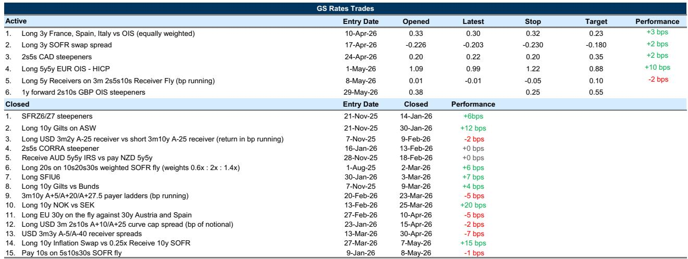
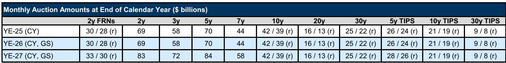
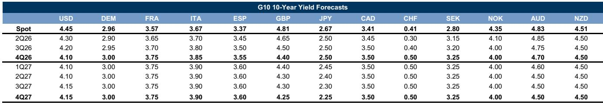

# 市场低估了“风险溢价压缩”的边界，而非降息预期本身

过去三周，全球利率市场经历了一轮显著的反弹。美债长端收益率从4月中旬的高点持续回落，欧洲核心国债同步走强，甚至连英国国债也在政治风险未消的背景下录得强劲周度表现。这轮行情的驱动力是什么？许多市场参与者将其归结为“对美联储降息的重新定价”。但某外资投行最新发布的全球利率策略报告给出了一个更精确、也更有操作含义的判断：这轮反弹的核心驱动力是“风险溢价压缩”，而非政策预期路径的根本性变化。

这个判断之所以重要，因为它直接挑战了当前市场叙事中一个常见的混淆——把“收益率下降”等同于“降息预期升温”。如果报告的分析成立，那么投资者对后续行情的方向、幅度和持仓结构，可能都需要做出实质性调整。报告的核心贡献在于，它用一套清晰的分解框架，拆解了不同市场、不同曲线段上“风险溢价”与“政策预期”各自的贡献度，并据此给出了差异化的交易建议。

以下是我们从这份报告中提炼出的五个关键洞察，以及一个报告尚未完全回答、但值得每一位利率投资者深思的问题。

## 1. 美债长端的反弹高度依赖风险溢价压缩，政策预期贡献微薄

报告明确指出，近期美国长端收益率的下降，绝大部分体现为国债期限溢价的压缩，而收益率中的“预期成分”贡献非常有限。报告中的模型估算显示，10年期美债收益率从4月中旬高点回落的过程中，期限溢价的压缩贡献了绝大部分变动，而市场对美联储未来利率路径的预期几乎没有变化。

这意味着什么？这意味着当前美债长端的定价，更多地反映的是地缘政治紧张局势缓解带来的“不确定性下降”，而不是市场对美联储货币政策转向的押注。从资产定价的角度看，期限溢价的压缩具有更强的“一次性”特征：一旦市场对冲突风险的定价调整到位，继续压缩的空间就会急剧收窄。报告对此的判断是谨慎的——认为“有意义地延长收益率下行，可能需要将美联储路径的风险分布纳入考量”。

这个判断对投资者的含义是：如果后续没有新的、更鸽派的宏观数据或美联储信号，单纯依靠地缘政治缓和来推动美债长端收益率继续下行，难度正在加大。报告甚至暗示，当前长端利率的反弹已经“抹平了远期估值中相对温和的缺口”，也就是说，估值修复的空间已经基本兑现。

## 2. 收益率曲线持续平坦化并非降息信号，而是风险定价的副产品

与收益率下行同步发生的，是美债收益率曲线的持续平坦化。许多市场参与者习惯将“曲线平坦化”解读为市场在为降息做准备。但报告提供了一个不同的归因：在风险溢价压缩主导的环境下，曲线平坦化是“长端期限溢价收缩”的机械结果，而非货币政策预期的主动反映。

报告还提到，美联储偏鹰派的沟通“强化了曲线的变化”。这意味着，在美联储没有释放明确鸽派信号的情况下，曲线平坦化的延续性本身就存在疑问。如果后续地缘政治缓和带来的风险溢价压缩效应减弱，而美联储沟通仍然偏鹰，那么曲线反而可能面临陡峭化的压力。

这个观察对久期管理和曲线交易的策略选择至关重要。如果投资者误将当前的平坦化当作“降息交易”来参与，一旦风险溢价压缩的动能衰减，持仓将面临双向风险：长端收益率可能反弹，而短端受制于美联储的鹰派立场也难以大幅下行。

## 3. 欧洲利率市场的定价逻辑与美国存在根本性差异

报告对美国利率市场的判断偏谨慎，但对欧洲利率市场则给出了更明确的正面观点。核心原因在于，欧洲的利率定价逻辑与美国存在结构性差异。

报告指出，欧洲央行偏鹰派的沟通（特别是近期管委的表态）叠加大宗商品价格回落和持续疲弱的经济活动数据，共同构成了对欧元区久期的支撑。报告明确建议“继续做多5y5y欧元实际利率”。这一建议的背后逻辑是：欧洲的通胀压力更多来自能源供给冲击，而非需求过热。因此，一旦能源价格因地缘政治缓和而回落，欧洲央行面临的加息压力也会随之减轻，这对长端实际利率构成利好。

更重要的是，报告认为美欧之间经济活动数据的差异将继续支撑利差走阔。美国经济韧性更强，而欧洲增长动能更弱，这种分化意味着欧洲利率的下行比美国更具“基本面支撑”。对于跨市场配置的投资者而言，这是一个值得纳入框架的差异化判断。

## 4. 英国国债的“风险溢价压缩”可能已经见顶

报告对英国国债的判断最为谨慎。报告认为，虽然英国国债近期表现强劲，但“风险溢价的压缩可能已经走到了尽头”。报告中的模型显示，英国国债收益率曲线近期的牛平化与期限溢价的快速下降高度一致，但这种压缩的空间已经有限。

原因在于，英国面临的宏观和政策环境与其他市场不同。一方面，英国经济数据持续疲软，这确实对短端利率构成支撑；但另一方面，英国的财政状况和政治风险（尤其是即将到来的补选）仍然是压制长端的重要因素。报告认为，“持久的缓解将由短端引领”，而非长端。

基于这一判断，报告推荐做陡英国国债收益率曲线（1年远期2s10s OIS陡峭化交易），目标55个基点，止损25个基点。这一交易结构的核心假设是：短端受益于疲弱数据和宽松预期，而长端受制于财政和政治风险难以持续下行。这是一个与美债曲线交易完全相反的思路，体现了不同市场定价逻辑的精细差异。

## 5. 日本市场提供了一个尚未被充分定价的尾部风险

报告对日本市场的分析虽然篇幅不长，但揭示了一个可能被全球投资者低估的变数。日本央行行长下田的讲话将成为市场判断加息时点的关键信号。当前市场定价显示，6月加息概率超过70%，但报告中的经济学家认为7月加息的概率更高。

更值得关注的是，报告指出日本的收益率曲线“仍然陡峭”，且5月份收益率的重新定价“主要是由远期远端驱动，短端几乎没有变动”。这种结构意味着，如果日本央行最终加息，压力可能从远端向5年期附近转移。对于持有全球久期多头头寸的投资者而言，日本利率的意外上行可能通过全球资本流动和套利交易渠道产生溢出效应。

报告中的模型显示，日本远期利率的变动已经明显偏离了短端政策利率的轨迹。这种偏离能否持续，取决于日本央行的实际政策路径。如果6月加息落地，远期曲线可能面临重新定价；如果7月加息，则市场的等待期可能进一步推高长端风险溢价。

## 报告尚未完全回答的关键问题：风险溢价压缩的“再定价”何时触发逆转？

以上五个洞察构成了这份报告的核心框架。但报告在给出明确交易建议的同时，也留下了一个尚未完全回答的问题：风险溢价压缩的进程，在什么条件下会触发逆转？

报告对此有所暗示，但并未给出明确结论。它提到，“虽然油价上涨可能会重新点燃通胀担忧并加剧鹰派政策担忧，但它也会侵蚀迄今为止推动缓解的因素”。这是一个非常精炼的表述，意味着当前的风险溢价压缩依赖于两个脆弱的前提：一是地缘政治局势不会进一步恶化，二是大宗商品价格保持稳定。这两个前提中的任何一个被打破，都可能引发风险溢价的重置。

此外，报告对美联储政策路径的讨论也留下了悬念。报告认为，当前市场“在政策路径的右尾上赋予了过多的权重”，即市场过于乐观地认为美联储不会进一步加息。但报告也承认，“非衰退基准情景”限制了做多利率接收头寸的最清晰路径。换句话说，如果美国经济数据持续强于预期，美联储维持鹰派立场，那么当前的风险溢价压缩可能被证明是过度乐观的。

这些未解问题，恰恰是继续深入阅读完整报告和参与后续讨论的价值所在。报告中的模型细节、图表背后的二阶影响、以及不同情景下的压力测试，都无法在这篇导读中完全展开。例如，报告中提到的“美国利率波动率处于公允价值区间下沿”这一判断，对于理解当前是否适合建立对冲头寸至关重要；而“英国国债与互换利差的表现”则暗示了供给端风险的变化路径。

如果你想了解这些未解问题的更多细节——比如报告对美联储资产负债表前景的更新分析、对英国国债供给压力的具体测算、或者日本央行加息情景下的全球利率传导路径——欢迎来我们的星球微信群里继续讨论。在这里，我们不仅分享完整研报的解读和原始图表，更重要的是，你可以与其他关注全球宏观的投资者一起，对报告中的关键假设进行持续跟踪和压力测试。

Personal reading notes and learning share only. Not investment advice.

