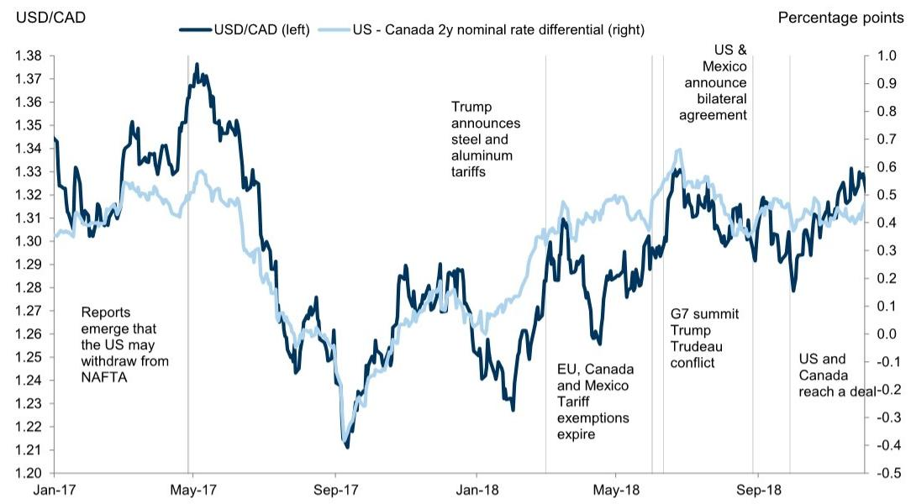
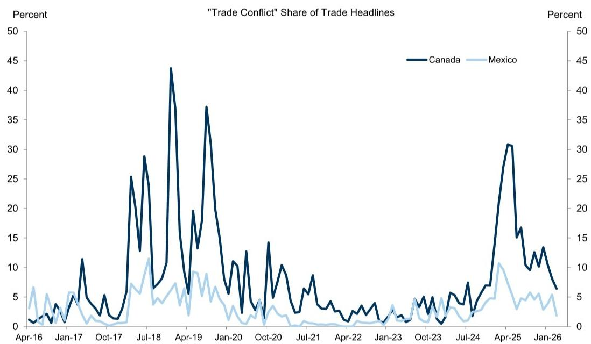
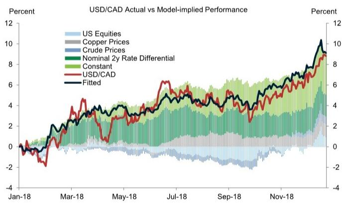

# 市场真正低估的不是关税，而是美加贸易谈判的结构性不对等

7月1日，美墨加协定的联合审查截止日正在逼近。对于大多数市场参与者而言，这只是一个日历上的标记。但对于持有加元头寸的投资者，这个日期可能意味着一次不对称的风险重定价。

某外资投行最新研报的核心判断是：市场可能低估了USMCA审查对加元的结构性压力，原因不在于关税本身，而在于谈判进程的不对称——美加之间的分歧远大于美墨，而这将转化为加元持续弱势的驱动力。

这份报告的价值不在于预测谈判结果，而在于揭示了一个被忽视的传导机制：贸易政策不确定性如何通过加拿大央行的反应函数，最终沉淀为加元的系统性弱势。这不是一个短期交易机会，而是一个需要重新审视加元定价框架的窗口。

## 1. 美加谈判的分歧比市场认知的更深，而加元对此更为敏感

历史不会简单重复，但谈判节奏会押韵。报告通过构建“贸易冲突”新闻指数发现，在2018-2019年的原USMCA谈判期间，涉及加拿大的贸易冲突报道占比远超墨西哥——峰值时加拿大为44%，墨西哥仅为9%。当前谈判的新闻覆盖同样显示，美加之间的分歧更为突出。

这不是一个偶然的统计偏差。报告指出，2018年美国与墨西哥的谈判相对顺利，而加拿大直到最后一刻才达成协议。两个独立的双边协议在当时并非不可能。这种结构性差异意味着，加元面临的贸易政策风险敞口远大于墨西哥比索。

更重要的是，报告通过回归分析验证了这一点：2018-2019年间，贸易冲突新闻占比每上升10个百分点，美元/加元月度变化约上升1.5%；而同样的指标对美元/墨西哥比索的解释力度几乎为零（R²仅为0.0005）。这组数据揭示了一个关键洞察：加元是北美贸易政策不确定性的“第一接收器”，而比索的定价更多受其他因素驱动。

对于投资者而言，这意味着如果USMCA审查延期或出现波折，加元的贬值压力将显著大于比索，而市场目前可能尚未充分定价这一不对称性。

## 2. 贸易不确定性真正影响加元的路径，是通过加拿大央行的政策反应函数

报告最值得关注的洞察之一，是回答了“贸易不确定性如何传导至汇率”这个核心问题。答案并非市场直觉中的“风险溢价”，而是一条更隐蔽的路径：加拿大央行对贸易不确定性的内生反应。

报告引用了2018年4月加拿大央行的表述：“利率可能需要维持在低于中性区间的水平，直到贸易冲突的不确定性消散。”2025年4月的声明同样强调，新的贸易限制可能需要进一步宽松以支持经济增长。我们的经济学家预计，在贸易政策不确定性高企的背景下，加拿大央行在2026年底之前将维持利率不变。

这意味着什么？贸易冲击对美元/加元的影响，不是通过一次性风险溢价定价，而是通过持久地改变美加利差来传导。报告中的实证图表显示，美元/加元与美加2年期利率差在贸易紧张时期高度同步，而传统的周期性驱动因素（如原油价格、铜价、美股）对汇率的解释力有限。

这一机制的意义在于：即使贸易谈判最终达成协议，只要不确定性在谈判期间持续存在，加拿大央行的鸽派倾向就会固化，利差就会维持在高位，进而持续压制加元。这是一个“慢变量”，但影响更为持久。

## 3. 低delta期权才是捕捉贸易不确定性的更优工具，而非ATM波动率

对于有期权交易能力的投资者，报告提供了一个更为精细的工具选择。研究发现，当贸易风险上升时，低delta期权（如10 delta蝶式期权）的隐含波动率显著上升，而平价隐含波动率和已实现波动率的反应相对有限。

这背后的逻辑是：贸易政策不确定性主要驱动尾部风险需求，而非整体波动率预期。投资者更倾向于为极端情景（如USMCA突然退出）购买保护，而不是为日常波动加仓。2025年是一个例外——当时芬太尼相关关税和“解放日”事件导致平价波动率也大幅上升，但报告认为，除非出现更无序的USMCA退出，否则当前情景更接近2018-2019年的模式。

这意味着，对于试图对冲或投机贸易政策风险的投资者，低delta期权可能比平价期权更具性价比。但这里有一个尚未完全回答的问题：如果谈判延期到7月1日之后，USMCA继续有效，市场是否会重新定价尾部风险？报告对此没有给出明确答案，但这恰恰是值得持续跟踪的关键变量。

## 4. 报告尚未完全回答的关键问题：USMCA退出风险的真实概率

尽管报告对传导机制的分析非常扎实，但对于“USMCA退出风险”本身，它并未给出概率判断。报告承认，如果谈判延期，USMCA将继续有效，但市场会继续将退出视为可信风险。

这里存在一个尚未被充分讨论的二阶效应：如果市场开始将USMCA退出视为基准情景而非尾部风险，那么定价逻辑将发生根本性变化。届时，加元可能不仅仅是通过利差渠道贬值，而是经历一次风险溢价的跳跃式重定价。报告没有展开这一情景，但这是读者在阅读完整报告时需要重点关注的假设条件。

另外，报告对加拿大央行反应函数的讨论，隐含了一个重要前提：贸易不确定性是外生冲击。但如果贸易政策不确定性持续数年，加拿大央行是否会调整其政策框架？这个问题同样没有答案，但它决定了利差渠道的持续性。

## 5. 对投资者的观察框架：三个需要持续跟踪的信号

基于报告的框架，投资者可以建立一个简单的跟踪体系：

第一个信号是美加谈判的新闻热度。如果贸易冲突新闻占比持续上升，特别是超过2018-2019年的峰值水平，那么加元面临的压力将结构性加大。

第二个信号是美加2年期利差的变化。如果利差在贸易谈判期间持续扩大，而传统周期性因素（如油价）无法对冲，那么加元的弱势将具有持续性。

第三个信号是低delta期权的隐含波动率。如果10 delta蝶式期权开始持续上行，而平价波动率保持稳定，这恰恰印证了报告的核心判断——市场在为尾部风险定价，而非整体不确定性。

这三个信号共同指向一个结论：加元的中期走势，可能更多取决于谈判桌的节奏，而非原油或铜价的波动。对于持有加元敞口的投资者，这可能意味着需要重新审视对冲策略和持仓周期。

---

以上分析仅覆盖了报告中最核心的判断框架。完整报告中还包含了具体的交易建议（如2s5s加元陡化交易）、历史相似情景的详细回测，以及不同谈判结果下的情景分析。这些内容对于构建具体的交易策略至关重要。

欢迎来星球微信群里继续讨论：在USMCA审查临近的背景下，加元是否已经充分定价了贸易不确定性？加拿大央行的鸽派立场是否会因为通胀压力而出现松动？这些问题的答案，可能决定了未来几个月的加元交易主线。

Personal reading notes and learning share only. Not investment advice.

