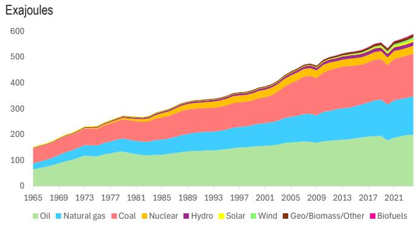
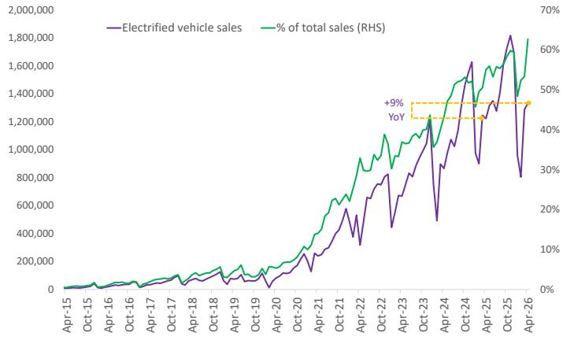
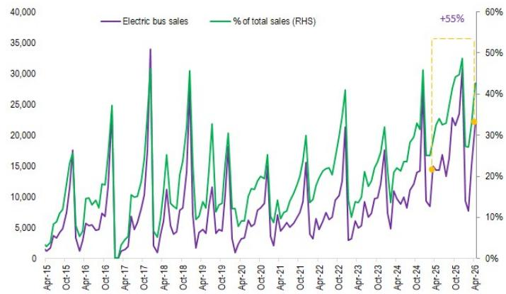
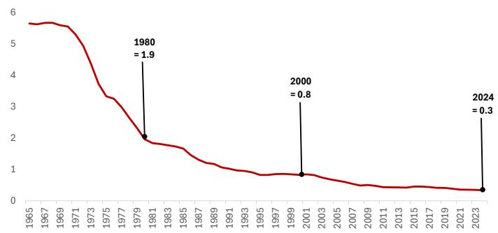
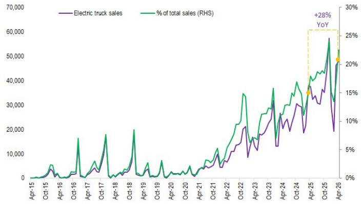
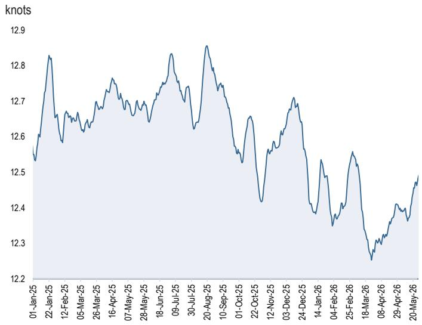
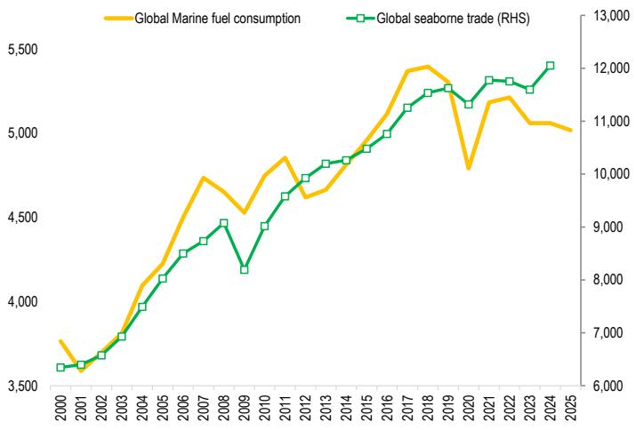

# Oil Flash Note

Can the world live with 9% less oil?

We spent last week in China, and the most striking takeaway from our meetings was not simply that oil demand has fallen. It was that it may have dropped by as much as 9% or 1.5 mbd—abruptly, unexpectedly, and with remarkably little visible disruption.

The sharpest hit has been in petrochemicals, but the weakness has spread to transportation fuels like gasoline and diesel. The decline does not appear to be the product of a formal government conservation campaign. There were no conspicuous appeals to save energy, no major limits on mobility, and no sense of crisis in daily life. Instead, it looks like consumers have made a quiet economic choice. Faced with higher gasoline, diesel and airfare, many seem to have shifted away from oil-based transportation toward cheaper, lower-carbon alternatives: electric buses, gas-powered trucks, subways, electrified high-speed rail, and electric taxis.

Feedback from Europe tells a similar story. Unlike 2022, when the energy shock registered as an acute macroeconomic crisis, this oil shock has, so far, felt oddly more manageable, even as it marks the largest disruption to oil markets on record. Even with oil prices nearing \$120 a barrel in April and May, electricity prices across most European countries continued to slip into negative territory, pushed down by massive surges in solar and wind generation.

This is not to suggest that the adjustment has been painless everywhere. Globally, we track demand losses of 2.8 mbd in March, 4.3 mbd in April, and 5.6 mbd in May, while acknowledging extremely limited visibility in parts of Africa and Southeast Asia. Roughly 40-60% of the decline reflects weaker petrochemical feedstock demand, with the remainder coming from transport fuels. Even so, the broader impact on global economic activity has been relatively contained: our economists have trimmed global growth by only about 24 basis points in 2026, while raising inflation by around 100 basis points.

Nor has China been immune, despite the presumed availability of large stocks of petrochemicals. China's economic growth weakened sharply in April, and high-frequency data suggest that softness carried into May. Industrial activity slowed, while nearly every segment tied to domestic demand weakened materially. Even so, China's shift toward alternative energy systems may have helped the country absorb the shock with far less pain than its roughly $70\%$ oil-import dependence alone would imply.

# Global Commodities Research

# Natasha Kaneva

(1-212) 834-3175

natasha.kaneva@JPM.com

# Lyuba Savinova

(1-212) 270-3781

lyuba.savinova@jpmchase.com

# Artem Fakhretdinov

(1-212) 272-1839

artem.fakhretdinov@JPM.com

JPM Chase Bank NA

Crucially, what we are seeing in China does not look like an outright collapse in activity. Road transport indicators have shown little material weakening beyond normal seasonality, yet gasoline and diesel demand fell sharply in April and May—a divergence that only makes sense if the miles are still being driven, but increasingly in different powertrains. Consistent with that interpretation, China’s highway EV charging volumes climbed to record highs during the Spring Festival holiday week in late February and then surged 55.6% year-on-year on the first day of the five-day May Day holiday in early May. China’s Ministry of Transport estimates that an average of 15.4 million electrified vehicles traveled during the May holiday period, accounting for a massive 24% of all vehicles on the road—up 33% from a year earlier.

A similar pattern is emerging in aviation. Chinese air travel is running $6.5\%$ below last year's pace so far in May, with the bulk of the weakness concentrated in the domestic market. Here again, the story may be substitution rather than retrenchment. Over the May Day holiday, China saw a record 1.52 billion inter-regional passenger trips—up $3.5\%$ from the same period a year earlier. Road travel remained the dominant mode, also up $3.5\%$ year on year, while rail trips rose $4.6\%$ and civil aviation fell $5.7\%$ . Against this backdrop, China's high-speed rail network is often faster, cheaper, and increasingly the default choice for domestic travel. In effect, some of the jet fuel demand may now be shifting to the power grid via electrified rail, rather than disappearing altogether.

Taken together, developments in China and Europe raise a larger set of questions: how much of today's demand weakness is likely to reverse once conditions normalize, and how much reflects a more durable shift in consumption? Put differently, could the world actually function with something like $9\%$ less oil?

The answer is nuanced. A decline of that magnitude would typically read as recessionary—especially when set against the Global Financial Crisis, when the world’s oil demand fell by only about 2% at its trough. But if a meaningful share of the reduction comes from substitution rather than forgone activity, the macro signal is materially different.

Consider the mechanics. Despite the relative calm in broader markets, the physical supply shock itself has been immense. Supply losses linked to the closure of the Strait of Hormuz were severe and intensified further after the US blockade effectively halted Iranian oil exports. As a closed-loop system that must clear daily, the oil market can only adjust through some combination of inventory draws and demand loss. Supply to the market fell by roughly 12.6 mbd in March, 14.1 mbd in April, and 16.4 mbd in May. These losses were offset through a mix of inventory draws—about 3 mbd in March, 6.5 mbd in April, and 7.4 mbd in May—alongside demand declines of roughly 2.8 mbd, 4.3 mbd, and 5.6 mbd over the same months, respectively.

The lessons of the 1973 oil shock are instructive precisely because the world today looks fundamentally different from the one that entered the first oil embargo. In 1973, oil was deeply embedded across nearly every part of the global economy: electricity generation was heavily oil-dependent, vehicle efficiency was poor, public transportation infrastructure was limited, and large-scale alternatives barely existed. The result was a severe macroeconomic shock that triggered recession, inflation, industrial weakness, and a lasting restructuring of global energy systems.

Much of the modern energy system was built in direct response to those vulnerabilities. In the US, the crisis led to the creation of the Strategic Petroleum Reserve, the establishment of the Department of Energy, the introduction of fuel economy standards, and even the national 55 mph speed limit aimed at reducing gasoline consumption. Across Europe and Japan, governments accelerated the buildout of nuclear power, expanded public transportation systems, improved building insulation standards, and diversified away from oil in electricity generation. The crisis also reshaped industrial processes, encouraged smaller and more fuel-efficient vehicles, and ultimately reduced the share of oil in the global energy mix over the following decades (Figures 1 & 2).

This raises the key question for today: should we expect structural changes of similar magnitude from the current shock? Possibly yes, but the direction of change may be different. The 1973 crisis pushed economies to use energy more efficiently. Two major wars involving large oil producers over the past five years could accelerate something broader: the steady decoupling of economic activity from oil consumption itself.

\- Gasoline demand may prove to be one of the clearest examples of crisis-driven behavioral adaptation. When fuel is scarce and prices surge, consumers and firms often respond by accelerating changes already underway: efficiency improvements, modal substitution, and adoption of alternative drivetrains. China sits at the center of this dynamic. Even before the current shock, gasoline demand was on a structurally weaker trajectory as rapid EV adoption displaced incremental gasoline use. The crisis is now acting as an accelerant, reinforcing the shift through higher fuel costs, energy-security concerns, supportive policy, and the continued rapid expansion of charging infrastructure. We estimate China's gasoline demand destruction at about 180 kbd, and expect $70\%$ of that loss may not return even after markets normalize (Figures 3 & 4). The reason is simple: once consumers switch to EVs, the change tends to be sticky. Outside China, the structural effects are likely smaller but still meaningful. In Europe, new car registrations climbed to their highest level since 2019 in March, led by hybrids, which overtook diesel and petrol cars in late 2025. History suggests that past oil shocks often left lasting declines in gasoline demand, and this episode may prove no different. On that basis, we expect that some portion of the 900 kbd loss in gasoline demand may never fully return. Diesel shows a similar, if more uneven, risk profile. Part of the roughly 850 kbd decline in diesel demand may also prove durable, with the risk of permanent substitution concentrated in China (Figures 5 & 6).

- Petrochemicals are a harder case for substitution, because they run through supply chains in ways that are difficult to unwind. But even there, economies tend to adapt through efficiency gains, material substitution, and, at the margin, outright thrift. A small but telling example comes from Japanese snack maker Calbee. To help offset rising naphtha costs—a key petrochemical feedstock largely sourced from the Gulf—the company has temporarily shifted 14 of its iconic products (including potato chips) to black-and-white packaging. The move will likely be reversed once naphtha supplies normalize, not least because it imposes a real friction on consumers. Without the familiar color-coding (orange for lightly salted, green for seaweed), shoppers have to slow down and scrutinize labels, relying on text rather than instant visual cues to quickly grab their favorite flavors. That distinction matters. Measures like this reflect cost pass-through and short-term coping strategies more than a durable rewriting of demand. For that reason, we assume most of the roughly 2.4 mbd of lost petrochemical feedstock demand is likely to return as supply conditions normalize.   
- Jet fuel is the clearest case of the roughly 500 kbd demand loss that should mostly recover once supply chains stabilize. The pullback—concentrated in the Middle East and Asia—looks driven more by operational disruption than a lasting shock to mobility: airlines have rerouted flights, avoided certain Middle East refueling hubs, trimmed unprofitable routes, and run inventories more conservatively amid higher prices and elevated uncertainty. Long-haul aviation is also usually hard to substitute, particularly across Asia and on intercontinental routes. Scalable alternatives are limited, and sustainable aviation fuel remains a small, supply-constrained share of the mix. For that reason, our base case is that most of today’s jet fuel demand shortfall returns as availability normalizes. That said, higher fares and prolonged uncertainty could still leave structural fingerprints. They may accelerate the shift to remote business meetings, curb discretionary short-haul travel, and divert some passenger demand to rail where it is a viable substitute. Airlines, for their part, may prioritize profitability and load factors over rapid capacity expansion. The net result is that jet demand looks relatively resilient versus other refined products, with recovery likley, but with the key risk being a flatter long-term growth trajectory than the pre-crisis path.   
- Fuel oil demand destruction is estimated at 600 kbd so far, driven by weaker shipping and industrial activity, refinery disruptions, and lower oil-fired power burn. Unlike jet fuel, a meaningful share of this loss may not return even after crude flows normalize, because end users are adapting in ways that tend to persist. In shipping, higher bunker costs are accelerating slow steaming, route optimization, and fleet-efficiency upgrades. In power, governments are minimizing oil burn through conservation, grid optimization, faster renewable deployment, and in some cases greater coal use. In industry, firms are tightening processes, selectively electrifying systems, and reducing energy intensity (Figure 7). A relevant precedent is global shipping after the 2008 financial crisis and the IMO 2020 transition. Slow steaming began as a temporary response to higher costs, but became embedded as operators found they could materially cut fuel use with limited impact on supply chains, evolving into a structurally more fuel-efficient operating model for parts of the fleet (Figure 8). Because fuel oil is relatively easy to replace at the margin, even a partial step-down can become structural. The implication is an incomplete recovery and a faster long-term decline in fuel oil demand even once conditions stabilize.

Figure 1: Global energy stack   

area_stacked

| Year | Oil | Natural gas | Coal | Nuclear | Hydro | Solar | Wind | Geo/Biomass/Other | Biofuels |
|------|-----|-------------|------|---------|-------|-------|------|-------------------|----------|
| 1965 | 70  | 30          | 40   | 10      | 10    | 5     | 10   | 5                 | 5        |
| 1969 | 80  | 40          | 50   | 15      | 10    | 5     | 10   | 5                 | 5        |
| 1973 | 90  | 50          | 60   | 20      | 10    | 5     | 10   | 5                 | 5        |
| 1977 | 100 | 60          | 70   | 25      | 10    | 5     | 10   | 5                 | 5        |
| 1981 | 110 | 70          | 80   | 30      | 10    | 5     | 10   | 5                 | 5        |
| 1985 | 120 | 80          | 90   | 35      | 10    | 5     | 10   | 5                 | 5        |
| 1989 | 130 | 90          | 100  | 40      | 10    | 5     | 10   | 5                 | 5        |
| 1993 | 140 | 100         | 110  | 45      | 10    | 5     | 10   | 5                 | 5        |
| 1997 | 150 | 110         | 120  | 50      | 10    | 5     | 10   | 5                 | 5        |
| 2001 | 160 | 120         | 130  | 55      | 10    | 5     | 10   | 5                 | 5        |
| 2005 | 170 | 130         | 140  | 60      | 10    | 5     | 10   | 5                 | 5        |
| 2009 | 180 | 140         | 150  | 65      | 10    | 5     | 10   | 5                 | 5        |
| 2013 | 190 | 150         | 160  | 70      | 10    | 5     | 10   | 5                 | 5        |
| 2017 | 200 | 160         | 170  | 75      | 10    | 5     | 10   | 5                 | 5        |
| 2021 | 210 | 170         | 180  | 80      | 10    | 5     | 10   | 5                 | 5        |
| Exajoules (Year) - Hydro / Solar / Biofuels (Geo/Biomass/Other) (Biofuels) (Geo/Biomass/Other) (Biofuels) (Geo/Biomass/Other) (Geo/Biomass/Other) (Geo/Biomass/Other) (Geo/Biomass/Other) (Geo/Biomass/Other) (Geo/Biomass/Other) (Geo/Biomass/Other) (Geo/Biomass/Other) (Geo/Biomass/Other) (Geo/Biomass/Other) (Geo/Biomass/Other) (Geo/Biomass/Other) (Geo/Biomass/Other) (GeoBiomass/Other) (Geo/Biomass/Other) (GeoBiomass/Other) (GeoBiomass/Other) (GeoBiomass/Other) (GeoBiomass/Other) (GeoBiomass/Other) (GeoBiomass/Other) (GeoBiomass/Other) (GeoBiomass/Other) (GeoBiomass/Other) (GeoBiomass/Other) (GeoBiomass/Other) (GeoBiomass/Other) (GeoBiomass/ Other) (GeoBiomass/ Other) (GeoBiomass/ Other) (GeoBiomass/ Other) (GeoBiomass/ Other) (GeoBiomass/ Other) (GeoBiomass/ Other) (GeoBiomass/ Other) (GeoBiomass/ Other) (GeoBiomass/ Other) (GeoBiomass/ Other) (GeoBiomass/ Other) (GeoBiomass/ Other) (Geo Biomass/ Other) (GeoBiomass/ Other) (GeoBiomass/ Other) (GeoBiomass/ Other) (GeoBiomass/ Other) (GeoBiomass/ Other) (GeoBiomass/ Other) (GeoBiomass/ Other) (GeoBiomass/ Other) (GeoBiomass/ Other) (GeoBiomass/ Other) (GeoBiomass/ Other) (GeoBiomass/ other) (GeoBiomass/ other) (GeoBiomass/ other) (GeoBiomass/ other) (GeoBiomass/ other) (GeoBiomass/ other) (GeoBiomass/ other) (GeoBiomass/ other) (GeoBiomass/ other) (GeoBiomass/ other) (GeoBiomass/ other) (GeoBiomass/ other) (GeoBiomass/ other) (Geo Biomass/ other) (GeoBiomass/ other) (GeoBiomass/ other) (GeoBiomass/ other) (GeoBiomass/ other) (GeoBiomass/ other) (GeoBiomass/ other) (GeoBiomass/ other) (GeoBiomass/ other) (GeoBiomass/ other) (GeoBiomass/ other) (GeoBiomass/ other) (GeoBiomass/ Other) (GeoBiomass/ other) (GeoBiomass/ other) (GeoBiomass/ other) (GeoBiomass/ other) (GeoBiomass/ other) (GeoBiomass/ other) (GeoBiomass/ other) (GeoBiomass/ other) (GeoBiomass/ other) (GeoBiomass/ other) (GeoBiomass/ other) (Geo Biomass / Other) (GeoBiomass / Other) (GeoBiomass / Other) (GeoBiomass / Other) (GeoBiomass / Other) (GeoBiomass / Other) (GeoBiomass / Other) (Geo Biomass / Other) (GeoBiomass / Other) (Geo Biomass / Other) (Geo Biomass / Other) (Geo Biomass / Other) (Geo Biomass / Other)

Source: EI Statistical Review, JPM Commodities Research

Figure 3: China electrified vehicle sales   
LHS: Number of electrified vehicles sold. RHS: share of total vehicle sales   

line

| Date   | Electrified vehicle sales | % of total sales (RHS) |
|--------|----------------------------|------------------------|
| Apr-26 | ~1.3M                      | ~60%                   |
| Oct-25 | ~1.8M                      | ~50%                   |
| Apr-24 | ~1.3M                      | ~45%                   |
| Oct-23 | ~1.2M                      | ~40%                   |
| Apr-23 | ~1.0M                      | ~35%                   |
| Oct-22 | ~800,000                   | ~30%                   |
| Apr-22 | ~600,000                   | ~25%                   |
| Oct-21 | ~400,000                   | ~20%                   |
| Apr-21 | ~200,000                   | ~15%                   |
| Oct-20 | ~100,000                   | ~10%                   |
| Apr-19 | ~50,000                    | ~5%                    |
| Oct-18 | ~30,000                    | ~3%                    |
| Apr-18 | ~20,000                    | ~2%                    |
| Oct-17 | ~10,000                    | ~1%                    |
| Apr-17 | ~5,000                     | ~0.5%                  |
| Oct-16 | ~3,000                     | ~0.3%                  |
| Apr-16 | ~2,000                     | ~0.2%                  |
| Oct-15 | ~1,500                     | ~0.1%                  |

Note: Electrified vehicles include BEV, PHEV and HEV vehicles   
Source: Bloomberg Finance L.P., JPM Commodities Research

Figure 5: China electric bus sales   
LHS: Number of buses sold. RHS: share of of total bus sales   

line

| Date   | Electric bus sales | % of total sales (RHS) |
|--------|--------------------|------------------------|
| Apr-26 | ~30,000            | ~40%                   |

Source: Bloomberg Finance L.P., JPM Commodities Research

Figure 2: Oil intensity of GDP   
Barrels of oil consumption per \$1000 of real GDP   

line

| Year | Value |
| ---- | ----- |
| 1980 | 1.9   |
| 2000 | 0.8   |
| 2024 | 0.3   |

Source: El Statistical Review, World Bank, JPM Commodities Research

Figure 4: China gasoline/diesel vehicle sales   
LHS: Number of gasoline/diesel vehicles sold. RHS: share of total vehicle sales   

line

| Date   | Gasoline/diesel vehicle sales | % of total sales (RHS) |
|--------|-------------------------------|------------------------|
| Apr-26 | ~1,100,000                    | ~40%                   |

Source: Bloomberg Finance L.P., JPM Commodities Research

Figure 6: China electric truck sales   
LHS: Number of trucks sold. RHS: share of total truck sales   

line

| Date   | Electric truck sales | % of total sales (RHS) |
|--------|----------------------|------------------------|
| Apr-25 | ~30,000              | ~25%                   |
| Apr-26 | ~45,000              | ~20%                   |

Source: Bloomberg Finance L.P., JPM Commodities Research

Figure 7: Global average containership speed   

line

| Date       | Knots |
| ---------- | ----- |
| 01-Jan-25  | 12.55 |
| 22-Jan-25  | 12.85 |
| 12-Feb-25  | 12.60 |
| 05-Mar-25  | 12.65 |
| 26-Mar-25  | 12.70 |
| 16-Apr-25  | 12.75 |
| 07-May-25  | 12.65 |
| 28-May-25  | 12.70 |
| 18-Jun-25  | 12.80 |
| 09-Jul-25  | 12.75 |
| 30-Jul-25  | 12.85 |
| 20-Aug-25  | 12.70 |
| 10-Sep-25  | 12.60 |
| 01-Oct-25  | 12.50 |
| 22-Oct-25  | 12.40 |
| 12-Nov-25  | 12.55 |
| 03-Dec-25  | 12.65 |
| 24-Dec-25  | 12.70 |
| 14-Jan-26  | 12.40 |
| 04-Feb-26  | 12.30 |
| 25-Feb-26  | 12.50 |
| 18-Mar-26  | 12.30 |
| 08-Apr-26  | 12.35 |
| 29-Apr-26  | 12.40 |
| 20-May-26  | 12.45 |

Source: Bloomberg Finance L.P., JPM Commodities Research

Figure 8: Global marine fuels demand vs seaborne trade   
LHS: Marine fuel consumption, kbd. RHS: Global seaborne trade, million tons   

line

| Year | Global Marine fuel consumption | Global seaborne trade (RHS) |
|------|----------------------------------|-----------------------------|
| 2000 | 3,700                            | 6,500                       |
| 2001 | 3,600                            | 6,600                       |
| 2002 | 3,750                            | 6,700                       |
| 2003 | 3,900                            | 6,900                       |
| 2004 | 4,100                            | 7,200                       |
| 2005 | 4,300                            | 7,500                       |
| 2006 | 4,500                            | 7,800                       |
| 2007 | 4,700                            | 8,100                       |
| 2008 | 4,600                            | 8,500                       |
| 2009 | 4,500                            | 8,200                       |
| 2010 | 4,700                            | 8,600                       |
| 2011 | 4,850                            | 9,000                       |
| 2012 | 4,750                            | 9,300                       |
| 2013 | 4,850                            | 9,500                       |
| 2014 | 4,950                            | 9,700                       |
| 2015 | 5,100                            | 9,900                       |
| 2016 | 5,300                            | 10,200                      |
| 2017 | 5,450                            | 11,500                      |
| 2018 | 5,450                            | 11,800                      |
| 2019 | 5,350                            | 11,700                      |
| 2020 | 4,150                            | 11,300                      |
| 2021 | 5,250                            | 11,800                      |
| 2022 | 5,250                            | 11,800                      |
| 2023 | 5,150                            | 11,700                      |
| 2024 | 5,150                            | 12,200                      |
| 2025 | 5,150                            | —                           |

Source: UNCTAD, WoodMackenzie, JPM Commodities Research

# Disclosures

# History of Investment Recommendations:

A history of JPM investment recommendations disseminated during the preceding 12 months can be accessed on the Research & Commentary page of http://www.JPMmarkets.com where you can also search by analyst name, sector or financial instrument.

Analysts' Compensation: The research analysts responsible for the preparation of this report receive compensation based upon various factors, including the quality and accuracy of research, client feedback, competitive factors, and overall firm revenues.

Company-Specific Disclosures: Important disclosures, including price charts and credit opinion history tables (if applicable), are available for compendium reports and all JPM-covered companies, and certain non-covered companies, by visiting https://www.jpmm.com/research/disclosures, calling 1-800-477-0406, or e-mailing research.disclosure.inquiries@JPM.com with your request.

# Other Disclosures

JPM is a marketing name for investment banking businesses of JPM Chase & Co. and its subsidiaries and affiliates worldwide.

UK MIFID FICC research unbundling exemption: UK clients should refer to UK MIFID Research Unbundling exemption for details of JPM's implementation of the FICC research exemption and guidance on relevant FICC research categorisation.

JPM may, from time to time, write on issuers or securities targeted by economic or financial sanctions imposed or administered by the governmental authorities of the U.S., EU, UK or other relevant jurisdictions (Sanctioned Securities). Nothing in this report is intended to be read or construed as encouraging, facilitating, promoting or otherwise approving investment or dealing in such Sanctioned Securities. Clients should be aware of their own legal and compliance obligations when making investment decisions.

Any digital or crypto assets discussed in this research report are subject to a rapidly changing regulatory landscape. For relevant regulatory advisories on crypto assets, including bitcoin and ether, please see https://www.JPM.com/disclosures/cryptoasset-disclosure.

The author(s) of this research report may not be licensed to carry on regulated activities in your jurisdiction and, if not licensed, do not hold themselves out as being able to do so.

Exchange-Traded Funds (ETFs): JPM Securities LLC (“JPMS”) acts as authorized participant for substantially all U.S.-listed ETFs. To the extent that any ETFs are mentioned in this report, JPMS may earn commissions and transaction-based compensation in connection with the distribution of those ETF shares and may earn fees for performing other trade-related services, such as securities lending to short sellers of the ETF shares. JPMS may also perform services for the ETFs themselves, including acting as a broker or dealer to the ETFs. In addition, affiliates of JPMS may perform services for the ETFs, including trust, custodial, administration, lending, index calculation and/or maintenance and other services.

Options and Futures related research: If the information contained herein regards options- or futures-related research, such information is available only to persons who have received the proper options or futures risk disclosure documents. Please contact your JPM Representative or visit https://www.theocc.com/components/docs/riskstoc.pdf for a copy of the Option Clearing Corporation's Characteristics and Risks of Standardized Options or https://www.finra.org/sites/default/files/2020-08/Security\_Futures\_Risk\_Disclosure\_Statement\_2020.pdf for a copy of the Security Futures Risk Disclosure Statement.

Changes to Interbank Offered Rates (IBORs) and other benchmark rates: Certain interest rate benchmarks are, or may in the future become, subject to ongoing international, national and other regulatory guidance, reform and proposals for reform. For more information, please consult: https://www.JPM.com/global/disclosures/interbank\_offered\_rates

Private Bank Clients: Where you are receiving research as a client of the private banking businesses offered by JPM Chase & Co. and its subsidiaries (“JPM Private Bank”), research is provided to you by JPM Private Bank and not by any other division of JPM, including, but not limited to, the JPM Corporate and Investment Bank and its Global Research division.

Legal entity responsible for the production and distribution of research: The legal entity identified below the name of the Reg AC Research Analyst who authored this material is the legal entity responsible for the production of this research. Where multiple Reg AC Research Analysts authored this material with different legal entities identified below their names, these legal entities are jointly responsible for the production of this research. Where more than one legal entity is listed under an analyst's name, the first legal entity is responsible for the production unless stated otherwise. Research Analysts from various JPM affiliates may have contributed to the production of this material but may not be licensed to carry out regulated activities in your jurisdiction (and do not hold themselves out as being able to do so). Unless otherwise stated below in the legal entity disclosures, this material has been distributed by the legal entity responsible for production, or where more than one legal entity is listed under the analyst's name, the first legal entity will be responsible for distribution. If you have any queries, please contact the relevant Research Analyst in your jurisdiction or the entity in your jurisdiction that has distributed this research material.

Legal Entities Disclosures and Country-/Region-Specific Disclosures:

Argentina: JPM Chase Bank N.A Sucursal Buenos Aires is regulated by Banco Central de la República Argentina (“BCRA”- Central Bank of Argentina) and Comisión Nacional de Valores (“CNV”- Argentinian Securities Commission - ALYC y AN Integral N°51).

Australia: JPM Securities Australia Limited (“JPMSAL”) (ABN 61 003 245 234/AFS Licence No: 238066) is regulated by the Australian Securities and Investments Commission and is a Market Participant of ASX Limited, a Clearing and Settlement Participant of ASX Clear Pty Limited and a Clearing Participant of ASX Clear (Futures) Pty Limited. This material is issued and distributed in Australia by or on behalf of JPMSAL only to "wholesale clients" (as defined in section 761G of the Corporations Act 2001). A list of all financial products covered can be found by visiting https://www.jpmm.com/research/disclosures. JPM seeks to cover companies of relevance to the domestic and international investor base across all Global Industry Classification Standard (GICS) sectors, as well as across a range of market capitalisation sizes. If applicable, in the course of conducting public side due diligence on the subject company(ies), the Research Analyst team may at times perform such diligence through corporate engagements such as site visits, discussions with company representatives, management presentations, etc. Research issued by JPMSAL has been prepared in accordance with JPM Australia’s Research Independence Policy which can be found at the following link: JPM Australia - Research Independence Policy.

Brazil: Banco JPM S.A. is regulated by the Comissao de Valores Mobiliarios (CVM) and by the Central Bank of Brazil. Ombudsman JPM: 0800-7700847 / 0800-7700810 (For Hearing Impaired) / ouvidoria.jp.morgan@jpmchase.com.

Canada: JPM Securities Canada Inc. is a registered investment dealer, regulated by the Canadian Investment Regulatory Organization and the Ontario Securities Commission and is the participating member on Canadian exchanges. This material is distributed in Canada by or on behalf of JPM Securities Canada Inc.

Chile: Inversiones JPM Limitada is an unregulated entity incorporated in Chile.

China: JPM Securities (China) Company Limited has been approved by CSRC to conduct the securities investment consultancy business.

Colombia: Banco JPM Colombia S.A. is supervised by the Superintendencia Financiera de Colombia (SFC). Any reference in this material to products or services offered abroad by entities other than the Bank in Colombia is included exclusively for descriptive purposes. Such references do not constitute, and should not be construed as, promotional activity or the provision of financial products or services within Colombian territory, as defined under applicable Colombian regulation.

Dubai International Financial Centre (DIFC): JPM Chase Bank, N.A., Dubai Branch is regulated by the Dubai Financial Services Authority (DFSA) and its registered address is Dubai International Financial Centre - The Gate, West Wing, Level 3 and 9 PO Box 506551, Dubai, UAE. This material has been distributed by JPM Chase Bank, N.A., Dubai Branch to persons regarded as professional clients or market counterparties as defined under the DFSA rules.

European Economic Area (EEA): Unless specified to the contrary, research is distributed in the EEA by JPM SE (“JPM SE”), which is authorised as a credit institution by the Federal Financial Supervisory Authority (Bundesanstalt für Finanzdienstleistungsaufsicht, BaFin) and jointly supervised by the BaFin, the German Central Bank (Deutsche Bundesbank) and the European Central Bank (ECB). JPM SE is a company headquartered in Frankfurt with registered address at TaunusTurm, Taunustor 1, Frankfurt am Main, 60310, Germany. The material has been distributed in the EEA to persons regarded as professional investors (or equivalent) pursuant to Art. 4 para. 1 no. 10 and Annex II of MiFID II and its respective implementation in their home jurisdictions (“EEA professional investors”). This material must not be acted on or relied on by persons who are not EEA professional investors. Any investment or investment activity to which this material relates is only available to EEA relevant persons and will be engaged in only with EEA relevant persons.

Hong Kong: JPM Securities (Asia Pacific) Limited (CE number AAJ321) is regulated by the Hong Kong Monetary Authority and the Securities and Futures Commission in Hong Kong, and JPM Broking (Hong Kong) Limited (CE number AAB027) is regulated by the Securities and Futures Commission in Hong Kong. JPM Chase Bank, N.A., Hong Kong Branch (CE Number AAL996) is regulated by the Hong Kong Monetary Authority and the Securities and Futures Commission, is organized under the laws of the United States with limited liability. Where the distribution of this material is a regulated activity in Hong Kong, the material is distributed in Hong Kong by or through JPM Securities (Asia Pacific) Limited and/or JPM Broking (Hong Kong) Limited.

India: JPM India Private Limited (Corporate Identity Number - U67120MH1992FTC068724), having its registered office at JPM Tower, Off. C.S.T. Road, Kalina, Santacruz - East, Mumbai – 400098, is registered with the Securities and Exchange Board of India (SEBI) as a 'Research Analyst' having registration number INH000001873. JPM India Private Limited is also registered with SEBI as a member of the National Stock Exchange of India Limited and the Bombay Stock Exchange Limited (SEBI Registration Number – INZ000239730) and as a Merchant Banker (SEBI Registration Number - MB/INM000002970). Telephone: 91-22-6157 3000, Facsimile: 91-22-6157 3990 and Website: http://www.jpmipl.com. JPM Chase Bank, N.A. - Mumbai Branch is licensed by the Reserve Bank of India (RBI) (Licence No. 53/Licence No. BY.4/94; SEBI - IN/CUS/014/ CDSL : IN-DP-CDSL-444-2008/ IN-DP-NSDL-285-2008/ INBI00000984/ INE231311239) as a Scheduled Commercial Bank in India, which is its primary license allowing it to carry on Banking business in India and other activities, which a Bank branch in India are permitted to undertake. For non-local research material, this material is not distributed in India by JPM India Private Limited. Compliance Officer: Ashutosh Sharma; ashutosh.j.sharma@jpmchase.com; +912261575002. Grievance Officer: Ramprasadh K, jpmipl.research.feedback@JPM.com; +912261573000. Registration granted by SEBI and certification from NISM in no way guarantee performance of the intermediary or provide any assurance of returns to investors. Please visit Terms and Conditions and Most Important Terms and Conditions (MITC). The annual Compliance audit report is available at http://www.jpmipl.com/#research.

Indonesia: PT JPM Sekuritas Indonesia is a member of the Indonesia Stock Exchange and is registered and supervised by the Otoritas Jasa Keuangan (OJK).

Korea: JPM Securities (Far East) Limited, Seoul Branch, is a member of the Korea Exchange (KRX). JPM Chase Bank, N.A., Seoul Branch, is licensed as a branch office of foreign bank (JPM Chase Bank, N.A.) in Korea. Both entities are regulated by the Financial Services Commission (FSC) and the Financial Supervisory Service (FSS). For non-macro research material, the material is distributed in Korea by or through JPM Securities (Far East) Limited, Seoul Branch.

Japan: JPM Securities Japan Co., Ltd. and JPM Chase Bank, N.A., Tokyo Branch are regulated by the Financial Services Agency in Japan.

Malaysia: This material is issued and distributed in Malaysia by JPM Securities (Malaysia) Sdn Bhd (18146-X), which is a Participating Organization of Bursa Malaysia Berhad and holds a Capital Markets Services License issued by the Securities Commission in Malaysia.

Mexico: JPM Casa de Bolsa, S.A. de C.V., JPM Grupo Financiero is member of the Mexican Stock Exchange (“Bolsa Mexicana de Valores”) and the Institutional Stock Exchange (“Bolsa Institucional de Valores”), and it is authorized to act as a broker dealer by the National Banking and Securities Exchange Commission (“Comisión Nacional Bancaria y de Valores”).

New Zealand: This material is issued and distributed by JPMSAL in New Zealand only to "wholesale clients" (as defined in the Financial Markets Conduct Act 2013). JPMSAL is registered as a Financial Service Provider under the Financial Service providers (Registration and Dispute Resolution) Act of 2008.

Philippines: JPM Securities Philippines Inc. is a Trading Participant of the Philippine Stock Exchange and a member of the Securities Clearing Corporation of the Philippines and the Securities Investor Protection Fund. It is regulated by the Securities and Exchange Commission.

Singapore: This material is issued and distributed in Singapore by or through JPM Securities Singapore Private Limited (JPMSS) [MDDI (P) 057/08/2025 and Co. Reg. No.: 199405335R], which is a member of the Singapore Exchange Securities Trading Limited, and/or JPM Chase Bank, N.A., Singapore branch (JPMCB Singapore), both of which are regulated by the Monetary Authority of Singapore. This material is issued and distributed in Singapore only to accredited investors, expert investors and institutional investors, as defined in Section 4A of the Securities and Futures Act, Cap. 289 (SFA). This material is not intended to be issued or distributed to any retail investors or any other investors that do not fall into the classes of “accredited investors,” “expert investors” or “institutional investors,” as defined under Section 4A of the SFA. Recipients of this material in Singapore are to contact JPMSS or JPMCB Singapore in respect of any matters arising from, or in connection with, the material.

South Africa: JPM Equities South Africa Proprietary Limited and JPM Chase Bank, N.A., Johannesburg Branch are members of the Johannesburg Securities Exchange and are regulated by the Financial Services Conduct Authority (FSCA).

Taiwan: JPM Securities (Taiwan) Limited is a participant of the Taiwan Stock Exchange (company-type) and regulated by the Taiwan Securities and Futures Bureau. Material relating to equity securities is issued and distributed in Taiwan by JPM Securities (Taiwan) Limited, subject to the license scope and the applicable laws and the regulations in Taiwan. To the extent that JPM Securities (Taiwan) Limited produces research materials on securities not listed on the Taiwan Stock Exchange or Taipei Exchange (“Non-Taiwan Listed Securities”), these materials shall not constitute securities recommendations for the purpose of applicable Taiwan regulations, and, for the avoidance of doubt, JPM Securities (Taiwan) Limited does not act as broker for Non-Taiwan Listed Securities. According to Paragraph 2, Article 7-1 of Operational Regulations Governing Securities Firms Recommending Trades in Securities to Customers (as amended or supplemented) and/or other applicable laws or regulations, please note that the recipient of this material is not permitted to engage in any activities in connection with the material that may give rise to conflicts of interests, unless otherwise disclosed in the “Important Disclosures” in this material.

Thailand: This material is issued and distributed in Thailand by JPM Securities (Thailand) Ltd., which is a member of the Stock Exchange of Thailand and is regulated by the Ministry of Finance and the Securities and Exchange Commission. The registered address is 548 One City Center Building, 50th Floor, Ploenchit Road, Lymphini, Pathum Wan, Bangkok 10330.

UK: Research is produced in the UK by JPM Securities plc (“JPMS plc”) which is a member of the London Stock Exchange and is authorised by the Prudential Regulation Authority and regulated by the Financial Conduct Authority and the Prudential Regulation Authority or JPM Markets Limited (“JPMML Ltd”) which is authorised and regulated by the Financial Conduct Authority. Unless specified to the contrary, this material is distributed in the UK by JPMS plc and is directed in the UK only to: (a) persons having professional experience in matters relating to investments falling within article 19(5) of the Financial Services and Markets Act 2000 (Financial Promotion) (Order) 2005 (“the FPO”); (b) persons outlined in article 49 of the FPO (high net worth companies, unincorporated associations or partnerships, the trustees of high value trusts, etc.); or (c) any persons to whom this communication may otherwise lawfully be made; all such persons being referred to as "UK relevant persons". This material must not be acted on or relied on by persons who are not UK relevant persons. Any investment or investment activity to which this material relates is only available to UK relevant persons and will be engaged in only with UK relevant persons. A description of JPM EMEA’s policy for prevention and avoidance of conflicts of interest related to the production of Research can be found at the following link: JPM EMEA - Research Independence Policy.

U.S.: JPM Securities LLC (“JPMS”) is a member of the NYSE, FINRA, SIPC, and the NFA. JPM Chase Bank, N.A. is a member of the FDIC. Material published by non-U.S. affiliates is distributed in the U.S. by JPMS who accepts responsibility for its content.

General: Additional information is available upon request. The information in this material has been obtained from sources believed to be reliable. While all reasonable care has been taken to ensure that the facts stated in this material are accurate and that the forecasts, opinions and expectations contained herein are fair and reasonable, JPM Chase & Co. or its affiliates and/or subsidiaries (collectively JPM) make no representations or warranties whatsoever to the completeness or accuracy of the material provided, except with respect to any disclosures relative to JPM and the Research Analyst's involvement with the issuer that is the subject of the material. Accordingly, no reliance should be placed on the accuracy, fairness or completeness of the information contained in this material. There may be certain discrepancies with data and/or limited content in this material as a result of calculations, adjustments, translations to different languages, and/or local regulatory restrictions, as applicable. These discrepancies should not impact the overall investment analysis, views and/or recommendations of the subject company(ies) that may be discussed in the material. Artificial intelligence tools may have been used in the preparation of this material, including assisting in data analysis, pattern recognition, and content drafting for research material. JPM accepts no liability whatsoever for any loss arising from any use of this material or its contents, and neither JPM nor any of its respective directors, officers or employees, shall be in any way responsible for the contents hereof, apart from the liabilities and responsibilities that may be imposed on them by the relevant regulatory authority in the jurisdiction in question, or the regulatory regime thereunder. Opinions, forecasts or projections contained in this material represent JPM's current opinions or judgment as of the date of the material only and are therefore subject to change without notice. Periodic updates may be provided on companies/industries based on company-specific developments or announcements, market conditions or any other publicly available information. There can be no assurance that future results or events will be consistent with any such opinions, forecasts or projections, which represent only one possible outcome. Furthermore, such opinions, forecasts or projections are subject to certain risks, uncertainties and assumptions that have not been verified, and future actual results or events could differ materially. The value of, or income from, any investments referred to in this material may fluctuate and/or be affected by changes in exchange rates. All pricing is indicative as of the close of market for the securities discussed, unless otherwise stated. Past performance is not indicative of future results. Accordingly, investors may receive back less than originally invested. This material is not intended as an offer or solicitation for the purchase or sale of any financial instrument. The opinions and recommendations herein do not take into account individual client circumstances, objectives, or needs and are not intended as recommendations of particular securities, financial instruments or strategies to particular clients. This material may include views on structured securities, options, futures and other derivatives. These are complex instruments, may involve a high degree of risk and may be appropriate investments only for sophisticated investors who are capable of understanding and assuming the risks involved. The recipients of this material must make their own independent decisions regarding any securities or financial instruments mentioned herein and should seek advice from such independent financial, legal, tax or other adviser as they deem necessary. JPM may trade as a principal on the basis of the Research Analysts' views and research, and it may also engage in transactions for its own account or for its clients' accounts in a manner inconsistent with the views taken in this material, and JPM is under no obligation to ensure that such other communication is brought to the attention of any recipient of this material. Others within JPM, including Strategists, Sales staff and other Research Analysts, may take views that are inconsistent with those taken in this material. Employees of JPM not involved in the preparation of this material may have investments in the securities (or derivatives of such securities) mentioned in this material and may trade them in ways different from those discussed in this material. This material is not an advertisement for or marketing of any issuer, its products or services, or its securities in any jurisdiction.

Confidentiality and Security Notice: This transmission may contain information that is privileged, confidential, legally privileged, and/or exempt from disclosure under applicable law. If you are not the intended recipient, you are hereby notified that any disclosure, copying, distribution, or use of the information contained herein (including any reliance thereon) is STRICTLY PROHIBITED. Although this transmission and any attachments are believed to be free of any virus or other defect that might affect any computer system into which it is received and opened, it is the responsibility of the recipient to ensure that it is virus free and no responsibility is accepted by JPM Chase & Co., its subsidiaries and affiliates, as applicable, for any loss or damage arising in any way from its use. If you received this transmission in error, please immediately contact the sender and destroy the material in its entirety, whether in electronic or hard copy format. This message is subject to electronic monitoring: https://www.JPM.com/disclosures/email

MSCI: Certain information herein (“Information”) is reproduced by permission of MSCI Inc., its affiliates and information providers (“MSCI”) ©2026. No reproduction or dissemination of the Information is permitted without an appropriate license. MSCI MAKES NO EXPRESS OR IMPLIED WARRANTIES (INCLUDING MERCHANTABILITY OR FITNESS) AS TO THE INFORMATION AND DISCLAIMS ALL LIABILITY TO THE EXTENT PERMITTED BY LAW. No Information constitutes investment advice, except for any applicable Information from MSCI ESG Research. Subject also to msci.com/disclaimer

Sustainalytics: Certain information, data, analyses and opinions contained herein are reproduced by permission of Sustainalytics and: (1) includes the proprietary information of Sustainalytics; (2) may not be copied or redistributed except as specifically authorized; (3) do not constitute investment advice nor an endorsement of any product or project; (4) are provided solely for informational purposes; and (5) are not warranted to be complete, accurate or timely. Sustainalytics is not responsible for any trading decisions, damages or other losses related to it or its use. The use of the data is subject to conditions available at https://www.sustainalytics.com/legal-disclaimers. ©2026 Sustainalytics. All Rights Reserved.

"Other Disclosures" last revised May 16, 2026.

Copyright 2026 JPM Chase & Co. All rights reserved. This material or any portion hereof may not be reprinted, sold or redistributed without the written consent of JPM. It is strictly prohibited to use or share without prior written consent from JPM any research material received from JPM or an authorized third-party (“JPM Data”) in any third-party artificial intelligence (“AI”) systems or models when such JPM Data is accessible by a third-party.

Completed 29 May 2026 03:14 AM EDT

Disseminated 29 May 2026 07:00 AM EDT