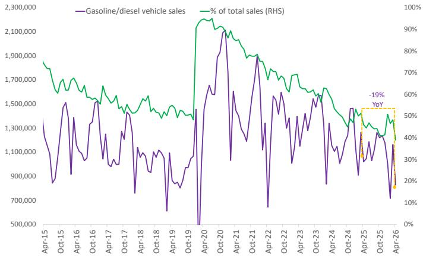

# The World Just Learned It Can Function With 9% Less Oil. That Changes Everything.

The oil market has absorbed a demand shock larger than the Global Financial Crisis without triggering a global recession. That single fact should unsettle every long-held assumption about the indispensability of crude. According to a detailed global investment bank report based on on-the-ground research in China and cross-referenced with European data, oil demand may have dropped by as much as 9% or 1.5 million barrels per day—abruptly, unexpectedly, and with remarkably little visible disruption to daily life. The decline did not come from a government-mandated conservation campaign or a collapse in economic activity. It came from substitution.

This is not 1973. In the first oil embargo, the world had no alternatives. Oil was embedded in electricity generation, transportation, and industrial processes with no ready substitutes. The result was a deep recession, runaway inflation, and a decade of economic pain. Today, the picture is fundamentally different. Even with oil prices approaching $120 a barrel earlier this year, electricity prices across most European countries continued to slip into negative territory, pushed down by massive surges in solar and wind generation. In China, road transport indicators showed little material weakening beyond normal seasonality, yet gasoline and diesel demand fell sharply—a divergence that only makes sense if the miles are still being driven, but increasingly in different powertrains.

The implication is profound. If a meaningful share of the demand reduction comes from substitution rather than forgone activity, the macro signal is materially different from a traditional recession. The world may be crossing a threshold where economic growth and oil consumption begin to decouple in a durable way. For investors, policymakers, and corporate strategists, understanding which parts of this demand loss are temporary and which are structural is no longer an academic exercise. It is the central question for capital allocation over the next decade.

## The Demand Loss Is Real, But It Is Not a Recession Signal

The numbers are staggering by historical standards. Globally, the report tracks demand losses of 2.8 million barrels per day in March, 4.3 million in April, and 5.6 million in May. To put that in context, during the Global Financial Crisis, the world's oil demand fell by only about 2% at its trough. The current decline is roughly three times that magnitude. Yet the broader impact on global economic activity has been relatively contained: the report's economists have trimmed global growth by only about 24 basis points in 2026, while raising inflation by around 100 basis points.

The reason for this disconnect lies in the composition of the demand loss. Roughly 40-60% of the decline reflects weaker petrochemical feedstock demand, with the remainder coming from transport fuels. But critically, the weakness in transport fuels does not appear to reflect fewer miles traveled. In China, highway EV charging volumes climbed to record highs during the Spring Festival holiday week and then surged 55.6% year-on-year on the first day of the May Day holiday. China's Ministry of Transport estimates that an average of 15.4 million electrified vehicles traveled during the May holiday period, accounting for 24% of all vehicles on the road—up 33% from a year earlier.

The pattern in aviation is equally telling. Chinese air travel is running 6.5% below last year's pace so far in May, with the bulk of the weakness concentrated in the domestic market. Yet over the May Day holiday, China saw a record 1.52 billion inter-regional passenger trips—up 3.5% from the same period a year earlier. Road travel remained the dominant mode, also up 3.5% year on year, while rail trips rose 4.6% and civil aviation fell 5.7%. The implication is that some of the jet fuel demand may now be shifting to the power grid via electrified rail, rather than disappearing altogether.

This is the critical analytical distinction. A demand loss driven by recession would show up in weaker economic activity, lower employment, and reduced mobility. A demand loss driven by substitution shows up in changing energy mix, stable or growing mobility, and relatively contained macroeconomic spillovers. The data strongly supports the latter interpretation.

## Gasoline Demand Destruction Is Largely Permanent Once Consumers Switch to EVs

The stickiness of consumer behavior is the most important structural insight in this analysis. Once consumers switch to electric vehicles, the change tends to persist. The report estimates China's gasoline demand destruction at about 180,000 barrels per day, and expects 70% of that loss may not return even after markets normalize. The reason is straightforward: EV adoption creates a durable reduction in oil demand because the underlying capital stock changes. A gasoline car can be driven less, but an EV displaces gasoline consumption entirely for the miles it covers.

China sits at the center of this dynamic. Even before the current shock, gasoline demand was on a structurally weaker trajectory as rapid EV adoption displaced incremental gasoline use. The crisis is now acting as an accelerant, reinforcing the shift through higher fuel costs, energy-security concerns, supportive policy, and the continued rapid expansion of charging infrastructure. The report notes that China's electrified vehicle sales have reached approximately 60% of total vehicle sales, up from roughly 45% a year earlier. At this penetration rate, the incremental demand destruction from each additional EV is compounding.

Outside China, the structural effects are likely smaller but still meaningful. In Europe, new car registrations climbed to their highest level since 2019 in March, led by hybrids, which overtook diesel and petrol cars in late 2025. History suggests that past oil shocks often left lasting declines in gasoline demand, and this episode may prove no different. On that basis, the report expects that some portion of the 900,000 barrels per day loss in gasoline demand may never fully return. Diesel shows a similar, if more uneven, risk profile, with the risk of permanent substitution concentrated in China.

The so-what for investors is clear: any investment thesis that relies on a full recovery in gasoline demand to pre-crisis levels is likely flawed. The structural shift is already embedded in consumer behavior and capital stock decisions that will not be reversed when oil prices normalize.

## Petrochemicals Will Recover, But Jet Fuel and Fuel Oil Tell Different Stories

Not all demand destruction is created equal, and the report makes careful distinctions across product categories. Petrochemical feedstock demand, estimated at roughly 2.4 million barrels per day of lost demand, is the most likely to return once supply conditions normalize. The reason is that petrochemicals run through supply chains in ways that are difficult to unwind. A Japanese snack maker temporarily shifting its iconic products to black-and-white packaging to offset rising naphtha costs is a coping strategy, not a durable rewriting of demand. Once naphtha supplies normalize, the color-coding will return, and with it the feedstock demand.

Jet fuel is a more nuanced case. The roughly 500,000 barrels per day demand loss looks driven more by operational disruption than a lasting shock to mobility. Airlines have rerouted flights, avoided certain Middle East refueling hubs, trimmed unprofitable routes, and run inventories more conservatively amid higher prices and elevated uncertainty. Long-haul aviation is also usually hard to substitute, particularly across Asia and on intercontinental routes. Scalable alternatives are limited, and sustainable aviation fuel remains a small, supply-constrained share of the mix. For that reason, the report's base case is that most of today's jet fuel demand shortfall returns as availability normalizes.

However, the report also raises the possibility that higher fares and prolonged uncertainty could leave structural fingerprints. They may accelerate the shift to remote business meetings, curb discretionary short-haul travel, and divert some passenger demand to rail where it is a viable substitute. Airlines, for their part, may prioritize profitability and load factors over rapid capacity expansion. The net result is that jet demand looks relatively resilient versus other refined products, with recovery likely, but with the key risk being a flatter long-term growth trajectory than the pre-crisis path.

Fuel oil presents the clearest case for permanent demand destruction. The estimated 600,000 barrels per day loss is driven by weaker shipping and industrial activity, refinery disruptions, and lower oil-fired power burn. Unlike jet fuel, a meaningful share of this loss may not return even after crude flows normalize, because end users are adapting in ways that tend to persist. In shipping, higher bunker costs are accelerating slow steaming, route optimization, and fleet-efficiency upgrades. In power, governments are minimizing oil burn through conservation, grid optimization, faster renewable deployment, and in some cases greater coal use. In industry, firms are tightening processes, selectively electrifying systems, and reducing energy intensity.

The precedent is instructive. Global shipping after the 2008 financial crisis and the IMO 2020 transition saw slow steaming begin as a temporary response to higher costs, but become embedded as operators found they could materially cut fuel use with limited impact on supply chains. The result was a structurally more fuel-efficient operating model for parts of the fleet. Because fuel oil is relatively easy to replace at the margin, even a partial step-down can become structural. The implication is an incomplete recovery and a faster long-term decline in fuel oil demand even once conditions stabilize.

## What the Report Does Not Fully Answer: The Limits of Substitution in a World Without Spare Capacity

The report makes a compelling case that substitution rather than recession is driving the current demand destruction. But it also raises a critical question it cannot fully answer: how much further can substitution go before it hits real constraints? The answer matters because the supply side of the oil market has not been standing still. Supply losses linked to the closure of the Strait of Hormuz were severe, with roughly 12.6 million barrels per day lost in March, 14.1 million in April, and 16.4 million in May. These losses were offset through a mix of inventory draws—about 3 million barrels per day in March, 6.5 million in April, and 7.4 million in May—alongside the demand declines.

The world is drawing down inventories at an accelerating rate. At some point, the inventory buffer runs out. When it does, the adjustment mechanism shifts entirely to demand destruction, and the question becomes whether substitution can accelerate fast enough to prevent a price spike that forces recessionary demand destruction instead.

The report does not model this scenario explicitly. It notes that even with oil prices nearing $120 a barrel, electricity prices across most European countries continued to slip into negative territory, suggesting that the energy transition has created meaningful buffers. But it also acknowledges extremely limited visibility in parts of Africa and Southeast Asia, where the substitution options available to China and Europe simply do not exist. In those regions, demand destruction is likely to be more painful and more recessionary.

This is the unresolved tension in the analysis. The substitution story works well for China, Europe, and parts of North America. It works less well for the developing world, where oil remains deeply embedded in transportation, power generation, and industrial processes with few ready alternatives. The report's framework is powerful, but it leaves open the question of whether the global system can sustain a 9% demand reduction without triggering a recession in the parts of the world least able to absorb one.

## A Decision Framework for Investors: Distinguishing Structural from Cyclical Demand Loss

The report provides the raw material for a practical decision framework that investors can apply across sectors and geographies. The core question is always the same: is this demand loss structural or cyclical? The answer determines whether to treat the current weakness as a buying opportunity or a reason to reallocate capital permanently.

The framework has three dimensions. First, assess the substitutability of the end use. Gasoline in personal transportation has high substitutability because EVs are a proven alternative. Jet fuel in long-haul aviation has low substitutability because no scalable alternative exists. Fuel oil in shipping has medium substitutability because slow steaming and route optimization can reduce consumption without eliminating it. The higher the substitutability, the more likely the demand loss is structural.

Second, assess the stickiness of the behavioral change. Once a consumer buys an EV, the gasoline demand loss is locked in for the life of the vehicle. Once a shipping company optimizes its routes and fleet efficiency, the fuel oil savings persist even after bunker prices normalize. Once an airline cuts unprofitable routes, it may not restore them even after jet fuel becomes available. Behavioral changes that involve capital investment are stickier than those that involve operational adjustments.

Third, assess the regional variation. China has the highest substitutability and the most rapid adoption of alternatives. Europe is close behind. The United States has lower EV penetration but higher fuel efficiency potential. The developing world has the lowest substitutability and the highest risk of recessionary demand destruction. Any investment thesis that applies a global average to these dynamics will miss the most important variation.

Applying this framework to the report's findings suggests that roughly 30-40% of the current demand loss may be structural and unlikely to return. That implies a permanent reduction in global oil demand of roughly 1.5 to 2 million barrels per day relative to pre-crisis trend. For oil producers, this means the demand curve has shifted left permanently, not just temporarily. For investors in renewable energy, EVs, and grid infrastructure, it means the addressable market has expanded faster than most models projected.

## The Quiet Revolution That Changed the Oil Market Forever

The most striking feature of this demand shock is how quietly it happened. There were no conspicuous appeals to save energy, no major limits on mobility, and no sense of crisis in daily life. Consumers made a quiet economic choice. Faced with higher gasoline, diesel, and airfare, many shifted toward cheaper, lower-carbon alternatives. The shift was not driven by environmental consciousness or government mandate. It was driven by price signals and available substitutes.

That is what makes this episode different from 1973. The first oil shock forced governments to build the infrastructure for an alternative energy system. This shock is merely using the infrastructure that was already built. China's high-speed rail network was not constructed in response to the current crisis. Europe's solar and wind capacity was not built to replace Middle Eastern oil. The EV charging network was not installed to hedge against supply disruptions. They were built for other reasons—economic development, climate policy, industrial strategy—but they are now serving as a shock absorber for the oil market.

The implication is that the oil market's vulnerability to supply disruptions may be structurally lower than at any point in the last 50 years. That does not mean oil is irrelevant. It means the margin of error has shrunk. Small disruptions can still cause price spikes, but large disruptions are increasingly manageable because the system has alternatives. The world just learned it can function with 9% less oil. That knowledge will not be forgotten when supply normalizes.

Join the community to read the full report and review the original charts that document the shift in China's EV penetration, the divergence between mobility and fuel demand, and the structural decline in gasoline consumption across major economies.

*This article is for learning and discussion only and does not constitute investment advice.*

Personal reading notes and learning share only. Not investment advice.

