# Financials and Thematics | North America

# AI: Financing the Next 10x Tech Cycle — Is Capital the Constraint?

AI infrastructure is evolving from hyperscaler-funded capex into a multi-asset financing ecosystem. We believe the constraint is not capital availability but how markets intermediate AI investment across equity, credit, securitization & private capital — with power & compute the real bottlenecks.

# Key Takeaways

AI is creating an unprecedented infrastructure investment cycle, with early spending already tracking \~10x above prior early cloud cycle spend.   
- \~\$256T of global capital pools appear sufficient to finance the AI build-out, following the \~\$1T mobile/cloud capex era.   
The key challenge is structuring assets with appropriate return, duration, collateral, liquidity, and risk-sharing characteristics.   
■ Public debt and equity markets have significant room to absorb issuance, with potential capacity upwards of \$17T and \$2.6T, respectively vs \$13T/\$1T in 2025.   
Alts well placed to benefit as private markets expand: OW APO, BN, BX, KKR, BLK. Banks to benefit from robust cap markets: BAC, C, GS, JPM, WFC.

Exhibit 1: Deep and diverse capital pools to finance estimated \~\$10T AI build-out this cycle   
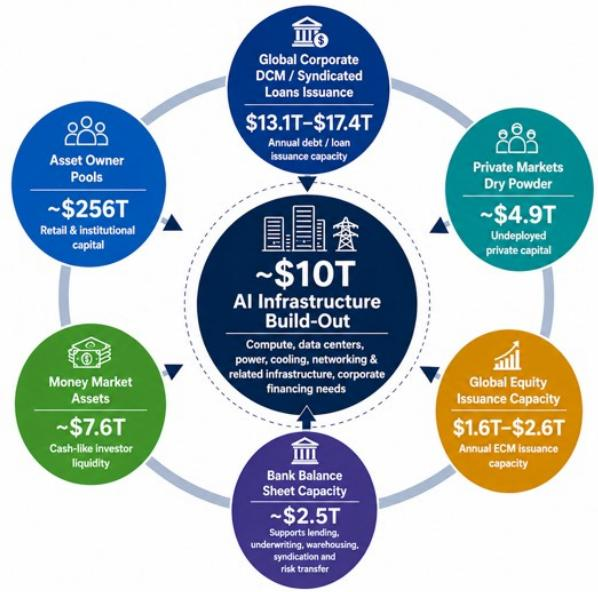

flowchart

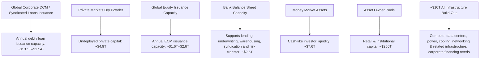
```mermaid
graph TD
    A["Global Corporate DCM / Syndicated Loans Issuance"] --> B["Annual debt / loan issuance capacity: ~$13.1T–$17.4T"]
    C["Private Markets Dry Powder"] --> D["Undeployed private capital: ~$4.9T"]
    E["Global Equity Issuance Capacity"] --> F["Annual ECM issuance capacity: ~$1.6T–$2.6T"]
    G["Bank Balance Sheet Capacity"] --> H["Supports lending, underwriting, warehousing, syndication and risk transfer: ~$2.5T"]
    I["Money Market Assets"] --> J["Cash-like investor liquidity: ~$7.6T"]
    K["Asset Owner Pools"] --> L["Retail & institutional capital: ~$256T"]
    M["~$10T AI Infrastructure Build-Out"] --> N["Compute, data centers, power, cooling, networking & related infrastructure, corporate financing needs"]
```

Source: Source: Dealogic, Morningstar, Cobalt, company data, MS estimates.

MS & CO. LLC

Michael J. Cyprys, CFA, CPA

Equity Analyst

Michael.Cyprys@morganstanley.com +1 212 761-7619

Manan Gosalia

Equity Analyst

Manan.Gosalia@morganstanley.com +1 212 761-4092

Stephen C Byrd

Equity Analyst

Stephen.Byrd@morganstanley.com +1 212 761-3865

Vishwanath Tirupattur

Strategist

Vishwanath.Tirupattur@morganstanley.com +1 212 761-1043

Barron Thomas

Research Associate

Barron.Thomas@morganstanley.com +1 212 761-2624

Connell J Schmitz

Research Associate

Connell.Schmitz@morganstanley.com +1 212 761-6252

Andrew B Pauker

Equity Strategist

Andrew.Pauker@morganstanley.com +1 212 761-1330

Nicholas Lentini, CFA

Equity Strategist

Nick.Lentini@morganstanley.com +1 212 761-5863

BROKERS, ASSET MANAGERS & EXCHANGES 

<table><tr><td colspan="2">North America</td></tr><tr><td>Industry View</td><td>In-Line</td></tr></table>

LARGE CAP BANKS 

<table><tr><td>North AmericaIndustry View</td><td>Attractive</td></tr></table>

MS does and seeks to do business with companies covered in MS. As a result, investors should be aware that the firm may have a conflict of interest that could affect the objectivity of MS. Investors should consider MS as only a single factor in making their investment decision.

For analyst certification and other important disclosures, refer to the Disclosure Section, located at the end of this report.

# AI: The Next 10x Compute Cycle

The AI era represents the next major compute cycle. Like prior waves of technology, we expect it to scale compute capacity by roughly 10x, driving a step-change in infrastructure investment. The mobile internet followed a similar path, expanding compute by \~10x and supporting roughly \$1 trillion of cloud and network capex, while reshaping market leadership as new platform companies emerged and disrupted incumbents.

We believe AI could be larger and longer-lasting than prior cycles because it requires a broader infrastructure footprint and is progressing at a faster pace. Investment spans semiconductors, servers, networking, data centers, power, cooling, and related infrastructure. At the same time, model capabilities, inference demand, and enterprise adoption continue to grow rapidly, creating a need for sustained incremental capacity. Across model development, usage, and spend, the trajectory continues to surprise to the upside, underscoring the difficulty of forecasting exponential growth in real time.

Early spending trends already point to the scale of the opportunity. In the first four years of this build-out, aggregate capex is tracking above \$1 trillion, roughly 10x higher than early-cycle cloud spending. Looking ahead, hyperscaler capex is expected to exceed \$1 trillion annually by 2027, with compute capacity increasingly becoming the key constraint to further AI scaling. These dynamics suggest we are still in the early stages of a cycle that could be both larger and longer-duration than prior technology waves. As the infrastructure build-out broadens, funding will likely need to extend beyond hyperscaler balance sheets, making public and private capital markets critical enablers of the next phase of AI deployment.

Key risks to our constructive AI infrastructure outlook include power and grid constraints, permitting delays, supply chain bottlenecks, and rising financing costs, all of which could slow deployment timelines or increase build-out costs. Longer term, risks include weaker-than-expected enterprise AI monetization, more efficient model architectures that reduce compute intensity, regulatory or geopolitical headwinds, and the potential for periods of overbuild if infrastructure investment ultimately outpaces sustainable demand growth. While we view these risks as manageable in the near term given continued upward revisions to hyperscaler capex plans, they could contribute to greater volatility in AI-related investment cycles over time.

Exhibit 2: Every tech cycle delivers 10x more compute   
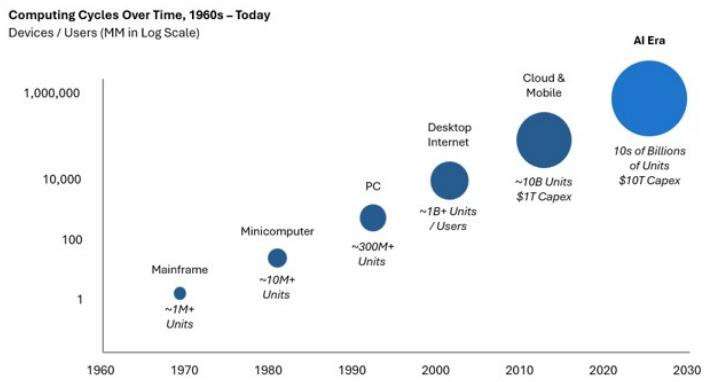

bubble

Computing Cycles Over Time, 1960s – Today
Devices / Users (MM in Log Scale)
| Device | Devices | Users (MM in log scale) |
| :--- | :--- | :--- |
| Mainframe | ~1M+ Units | ~1 |
| Minicomputer | ~10M+ Units | ~50 |
| PC | ~300M+ Units | ~200 |
| Desktop Internet | ~1B+ Units / Users | ~10,000 |
| Cloud & Mobile | ~10B Units $1T Capex | ~30,000 |
| AI Era | 10s of Billions of Units $10T Capex | ~1,000,000 |

Source: Company data, MS

Exhibit 3: AI is following the path of past cycles   
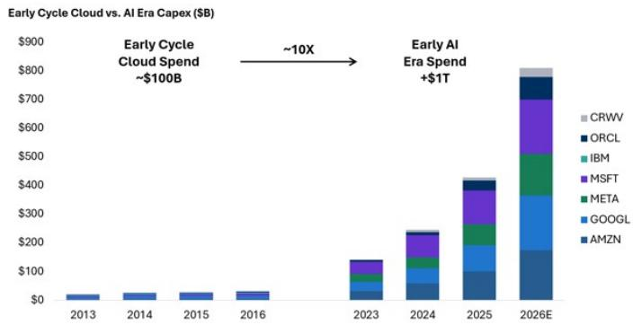

bar_stacked

Early Cycle Cloud vs. AI Era Capex ($B)
| Year | Market Capex ($B) |
| :--- | :--- |
| 2013 | ~10 |
| 2014 | ~15 |
| 2015 | ~20 |
| 2016 | ~25 |
| 2023 | ~100 |
| 2024 | ~200 |
| 2025 | ~400 |
| 2026E | ~800 |
Early Cycle Cloud Spend ~$100B → Early AI Era Spend +$1T
CRWV, ORCL, IBM, MSFT, META, GOOGL, AMZN

Source: Eikon, MS. For AMZN, 2013-2016 use change in AWS net PP&E as proxy for AWS spend and in 2023-2026, we estimate AWS capex.

Exhibit 4: Token usage is increasing non-linearly, as advancing capabilities and demand inflection points to a larger cycle than expected   
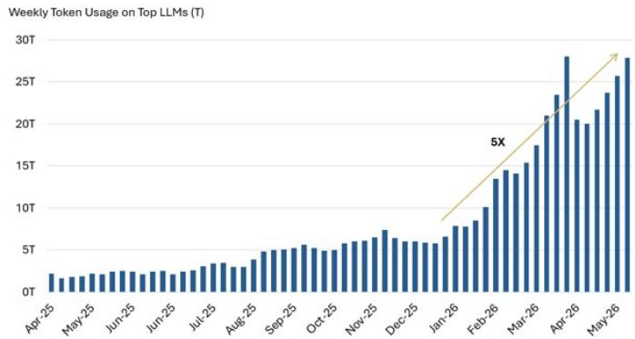

bar

| Month    | Weekly Token Usage (T) |
| -------- | ---------------------- |
| Apr-25   | ~1.5T                  |
| May-25   | ~1.5T                  |
| Jun-25   | ~1.5T                  |
| Jul-25   | ~2.0T                  |
| Aug-25   | ~3.0T                  |
| Sep-25   | ~4.0T                  |
| Oct-25   | ~4.5T                  |
| Nov-25   | ~6.0T                  |
| Dec-25   | ~7.0T                  |
| Jan-26   | ~8.0T                  |
| Feb-26   | ~10.0T                 |
| Mar-26   | ~15.0T                 |
| Apr-26   | ~28.0T                 |
| May-26   | ~29.0T                 |

Source: OpenRouter, MS

Exhibit 5: Capex revisions reflect upside surprises and highlight the challenge of forecasting exponential growth   
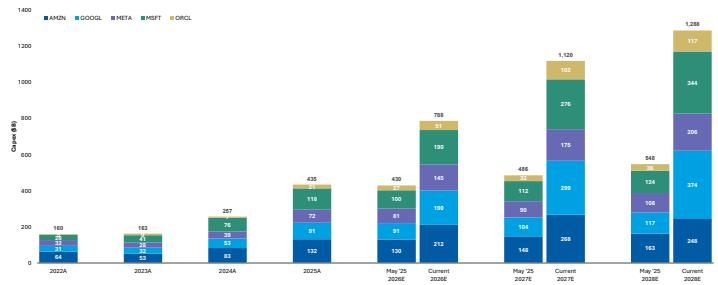

bar_stacked

| Year | ANZN (B) | CODGL (B) | META (B) | MSFT (B) | ORCL (B) |
|---|---|---|---|---|---|
| 2023A | 64 | 51 | 31 | 23 | 160 |
| 2023A | 13 | 52 | 41 | 19 | 163 |
| 2024A | 43 | 32 | 29 | 76 | 257 |
| 2023A | 132 | 91 | 72 | 118 | 435 |
| May 25 - 2026E | 130 | 91 | 81 | 100 | 438 |
| Current - 2026E | 212 | 192 | 145 | 198 | 788 |
| May 25 - 2027E | 148 | 104 | 90 | 112 | 486 |
| Current - 2027E | 288 | 299 | 175 | 276 | 1,120 |
| May 25 - 2028E | 163 | 117 | 158 | 124 | 548 |
| Current - 2028E | 288 | 374 | 206 | 344 | 1,288 |

Source: Company data, MS. MSFT data calendarized, ORCL presented on FY basis.

# Financing the AI Build-Out: Capital Is Not the Constraint

# The Key Challenge Is How Financial Markets Evolve to Intermediate Capital

We believe the AI infrastructure cycle represents not only the next compute cycle, but also the next major capital markets evolution. The scale, duration, and infrastructure-like characteristics of AI investment increasingly require financing structures that extend beyond hyperscaler balance sheets and traditional corporate capex funding. In our view, the key challenge is not whether sufficient global capital exists, but how financial markets evolve to intermediate that capital across public equity, credit, securitized products, bank capital, private infrastructure, and alternative financing channels.

Exhibit 6: The Emerging AI Infrastructure Financing Stack

# The Emerging AI Infrastructure Financing Stack

A multi-asset ecosystem matching capital to AI infrastructure risk, return and duration

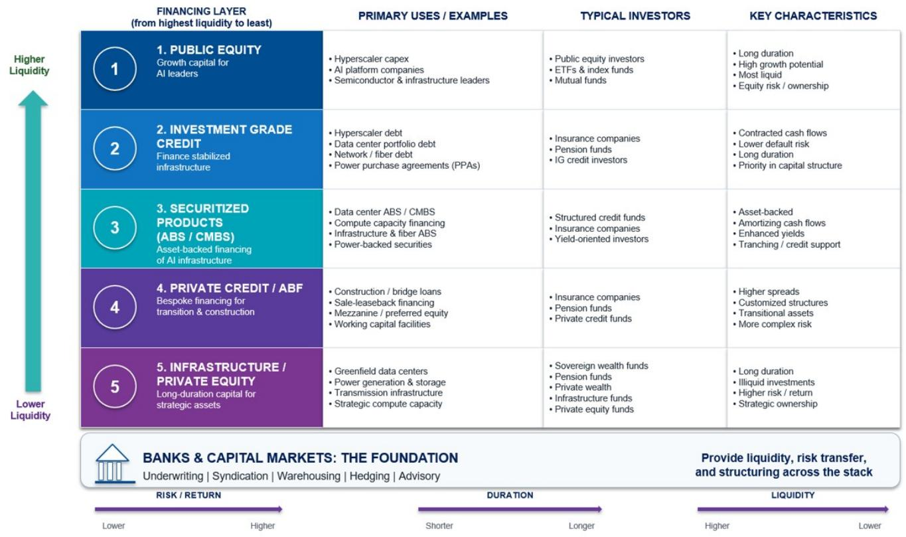  
Source: MS

The AI build-out should be supported by a diverse set of capital pools and financing channels, including \~\$256 trillion asset-owner capital, potentially \~\$2.6 trillion of annual public equity issuance capacity, potentially \~\$17 trillion of annual debt and loan market issuance capacity, \~\$8 trillion of money market liquidity, \~\$5 trillion of private markets dry powder, and \~\$2.5 trillion of bank balance sheet capacity.

Importantly, each capital pool is suited to different parts of the AI infrastructure stack, with investor mandates, liquidity needs, duration, collateral, and return requirements shaping where capital is most likely to flow. This is all while power and compute capacity remain the true bottlenecks.

# The Global Financial System Has Sufficient Capital

We see concerns around the ability of capital markets to finance a \~\$10 trillion AI build-out as overdone. We acknowledge that the \$10 trillion magnitude is large in absolute terms, but global capital pools are deep and diversified and the spend should unfold over a multi-year build-out cycle rather than all at once. We estimate global retail and institutional capital pools at \~\$256 trillion, implying that a \$10 trillion AI investment cycle would represent \~4% of identified asset-owner capital. Global equity market capitalization provides another reference point at \~\$159 trillion, with the US alone at \~\$76 trillion. The aggregate pool of capital appears large enough to support the AI build-out, provided the underlying economics remain attractive, even though not all of this capital is available for AI.

Importantly, the AI financing need should not require meaningful liquidation of existing asset-owner holdings, as funding is more likely to come through gradual portfolio reallocation, new issuance, maturing fixed income portfolios, private capital deployment, and structured financing channels. In particular, large institutional investors continuously receive principal repayments and coupon cash flows from sizable bond portfolios, creating recurring reinvestment capacity that can be redirected toward newly issued AI-related debt, infrastructure, and private market opportunities over time. Further, continued strong retail demand for annuities — driven by aging demographics and demand for income and guaranteed retirement solutions — should continue to support insurance company demand for attractive investment-grade fixed income and long-duration assets, including asset-based and structured solutions.

Exhibit 7: Global Individual and Institutional Capital Pools of \$256T represent \~\$4% of the estimated \$10T needed to finance AI build-out   
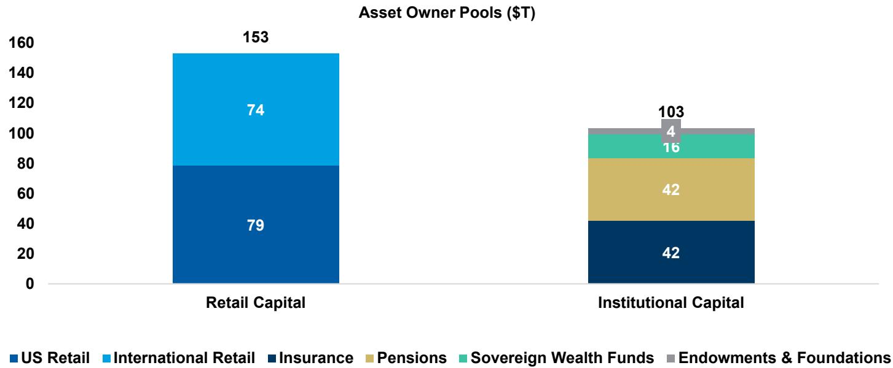

bar_stacked

Asset Owner Pools ($T)
| Category | US Retail ($T) | International Retail ($T) | Insurance ($T) | Pensions ($T) | Sovereign Wealth Funds ($T) | Endowments & Foundations ($T) |
| :--- | :--- | :--- | :--- | :--- | :--- | :--- |
| Retail Capital | 79 | 74 | 0 | 0 | 0 | 0 |
| Institutional Capital | 42 | 0 | 0 | 42 | 16 | 4 |
| Total (Total) | 153 | 0 | 0 | 0 | 0 | 103 |

Source: Individual Wealth US data from FRED. Individual Wealth International data from Oliver Wyman. Sovereign Wealth Fund date from Global SWF. Pension data from Thinking Ahead Institute. Endowment & Foundation data from Pensions & Investments, Foundation Mark, and Harvard Kennedy. Insurance data from CapitalIQ and International Association of Insurnace Supervisors (IAIS). MS Note: All data as of Dec '24 except for Sovereign Wealth Data that's as of March '26 and International Foundation data that's a MS Estimate as of December '25. Individual wealth excludes insurance and pension capital.

Importantly, these capital pools are not interchangeable, as portfolio construction and asset allocation mandates should shape which parts of the AI build-out each pool is best positioned to finance. Insurance balance sheets are naturally better suited to long-duration, income-oriented credit and structured products, making them a logical source of demand for IG credit, ABS/CMBS, private credit, and ABF tied to contracted data center cash flows. Pension funds and sovereign wealth funds can take a broader portfolio approach, with allocations across public equity, private equity, infrastructure, real assets, and private credit, making them well suited to participate across both corporate growth and longer-duration AI infrastructure projects.

Financing activity is increasingly concentrating around a relatively small group of hyperscalers and highly rated technology issuers, which over time could create portfolio construction and single-name exposure considerations for some asset owners. That said, institutional capital pools remain substantial, including \~\$42 trillion of insurance assets, \~\$42 trillion of pension assets, and \~\$16 trillion of sovereign wealth fund capital. Further, concentration constraints vary meaningfully across institutions, and likely less relevant for some investors. In our view, investors also have tools available to help mitigate concentration risk if needed, including purchasing single-name or basket protection through CDS and other hedging structures.

We acknowledge some investors may face constraints increasing private market allocations near term given muted distributions and ongoing DPI challenges across portions of private markets. However, we increasingly see liquidity and portfolio management solutions emerging through the rapid expansion of the secondary market. Secondary transaction volume exceeded \$200 billion in 2025 for the first time, up \~40% Y/Y, driven by both LP-led sales and GP-led continuation vehicles, and has compounded at \~20% annually since 2013. Looking ahead, the secondaries market continues to broaden beyond traditional buyout strategies and appears well positioned to support LP and GP liquidity needs, with over \$200 billion of available dry powder. We believe secondary liquidity solutions, combined with an improving realization backdrop over time, should help return meaningful liquidity to asset owners and support continued capital deployment into AI infrastructure and related private market opportunities.

Exhibit 8: Insurance capital skews toward fixed income   
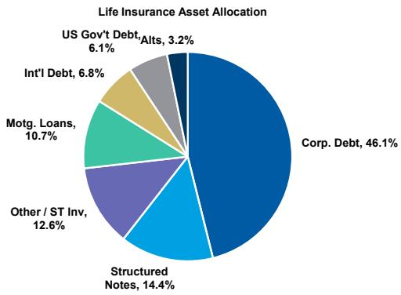

pie

Life Insurance Asset Allocation
| Category | Allocation (%) |
|---|---|
| Corp. Debt | 46.1 |
| Structured Notes | 14.4 |
| Other / ST Inv | 12.6 |
| Motg. Loans | 10.7 |
| Int'l Debt | 6.8 |
| US Gov't Debt | 6.1 |
| Alts | 3.2 |

Source: SNL data as of September 2025, MS

Exhibit 9: Pension portfolios are more diverse across asset classes vs. insurance capital   
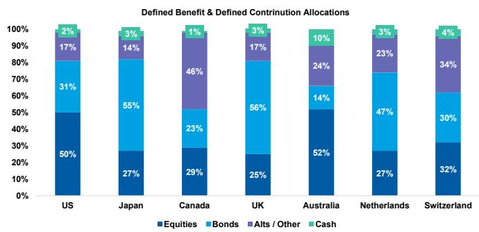

bar_stacked

| Country     | Equities | Bonds | Alts / Other | Cash |
| ----------- | -------- | ----- | ------------ | ---- |
| US          | 50%      | 31%   | 17%          | 2%   |
| Japan       | 27%      | 55%   | 14%          | 3%   |
| Canada      | 29%      | 23%   | 46%          | 1%   |
| UK          | 25%      | 56%   | 17%          | 3%   |
| Australia   | 52%      | 14%   | 24%          | 10%  |
| Netherlands | 27%      | 47%   | 23%          | 3%   |
| Switzerland | 32%      | 30%   | 34%          | 4%   |

Source: Thinking Ahead Institute as of December 2024, MS

Exhibit 10: Sovereign Wealth Fund capital skews the most toward alternatives and direct investments...   
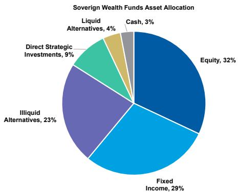

pie

Sovereign Wealth Funds Asset Allocation
| Asset Category | Allocation (%) |
| :--- | :--- |
| Equity | 32 |
| Fixed Income | 29 |
| Illiquid Alternatives | 23 |
| Direct Strategic Investments | 9 |
| Liquid Alternatives | 4 |
| Cash | 3 |

Source: Invesco Global Sovereign Asset Management Study as of December 2025, MS

Exhibit 11: ... and within alternatives, infrastructure has become an increasingly core part of sovereign wealth funds' portfolios   
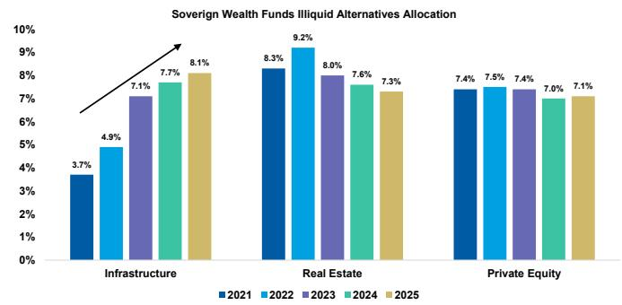

bar

Sovereign Wealth Funds Illiquid Alternatives Allocation
| Category | 2021 (%) | 2022 (%) | 2023 (%) | 2024 (%) | 2025 (%) |
| :--- | :--- | :--- | :--- | :--- | :--- |
| Infrastructure | 3.7 | 4.9 | 7.1 | 7.7 | 8.1 |
| Real Estate | 8.3 | 9.2 | 8.0 | 7.6 | 7.3 |
| Private Equity | 7.4 | 7.5 | 7.4 | 7.0 | 7.1 |

Source: Invesco Global Sovereign Asset Management Study as of December 2025, MS

# AI Financing Is Broadening Beyond Hyperscaler Balance Sheets ... with Credit Markets Emerging as a Core Financing Channel

We expect the financing mix to broaden as the AI investment cycle matures.

Hyperscaler balance sheets and internally generated cash flow have carried much of the early funding burden, but the size, duration, and complexity of the build-out should increasingly pull in external capital across a wide spectrum of capital pools across both equity and fixed income. Our Fixed Income colleagues reach a similar conclusion looking at data centers, forecasting \~\$3.2 trillion of global data center capex through 2028, with \~\$1.75 trillion financed through a wide array of credit products, including \$700 billion from private credit and \$650 billion of investment grade debt. On securitized credit specifically, data center ABS/CMBS gross issuance is expected to grow quickly through 2028; outstanding data center securitized credit is currently \~\$65 billion, and forecast to grow by nearly 3x to \~\$200 billion.

Exhibit 12: We see \$3.2T of data center capex spend through 2028   
Updated Data Center Capex – Growing Role of Credit Markets   
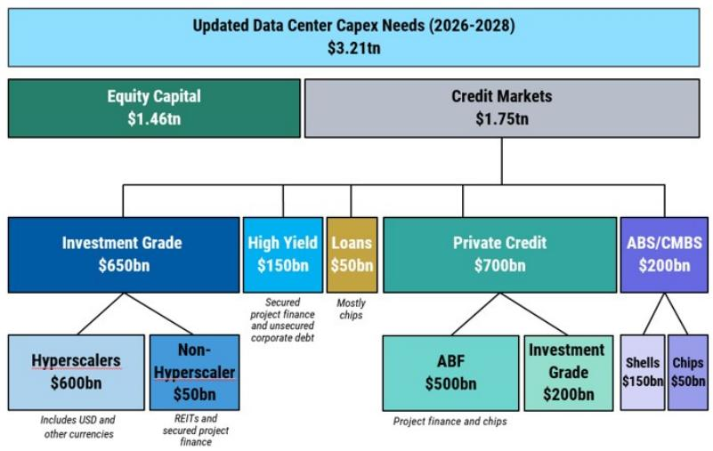

flowchart

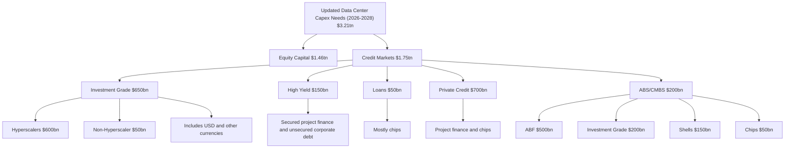
```mermaid
graph TD
    A["Updated Data Center Capex Needs (2026-2028) $3.21tn"] --> B["Equity Capital $1.46tn"]
    A --> C["Credit Markets $1.75tn"]
    C --> D["Investment Grade $650bn"]
    C --> E["High Yield $150bn"]
    C --> F["Loans $50bn"]
    C --> G["Private Credit $700bn"]
    C --> H["ABS/CMBS $200bn"]
    D --> I["Hyperscalers $600bn"]
    D --> J["Non-Hyperscaler $50bn"]
    D --> K["Includes USD and other currencies"]
    E --> L["Secured project finance and unsecured corporate debt"]
    F --> M["Mostly chips"]
    G --> N["Project finance and chips"]
    H --> O["ABF $500bn"]
    H --> P["Investment Grade $200bn"]
    H --> Q["Shells $150bn"]
    H --> R["Chips $50bn"]
```

Source: MS

Importantly our credit strategists, do not expect a financing bottleneck, citing significant credit market capacity and growing demand for higher-quality private credit mandates that are well suited to data center financing. They recently revisited their analysis, acknowledging that the speed and scale of spending has outpaced their expectations by a meaningful margin. Part of this dynamic is driven by strong hyperscaler capex — after 1Q26 earnings, our internet team increased their 2026 and 2027 Hyperscaler capex forecast by +5% and +17% to \$805 billion and \$1,116 billion, respectively.

Public debt markets are clearly open, with record global volume in 2025 helping to finance heightened AI investment spend. We analyze annual global corporate bond and syndicated loan issuance trends over time as a percentage of US nominal GDP to account for economic growth. In 2025, a record \$13.3 trillion of global corporate debt/loan issuance was \~43% of nominal GDP, or 7% above historical long-term average of \~40%. Within that broader market, AI is becoming a material incremental driver, with AI-related issuance contributing to elevated IG and HY supply. A hypothetical scenario in which global issuance moves to peak levels as a percentage of US nominal GDP would represent >\$17 trillion in annual corporate financing. While this higher level of issuance would be only partially AI-driven, we believe this suggests ample room to increasingly help finance ongoing and future AI spend. Over \$150 billion of data-center backed paper is currently outstanding across secured corporate and securitized credit markets.

Exhibit 13: Financing markets are clearly open, as annual global corporate bond/syndicated loan issuance trended above average as a % of US nominal GDP in 2025 to a record \$13.3T. A hypothetical scenario in which global issuance moves to peak levels as a % of US nominal GDP would represent >\$17T in annual corporate financing.   
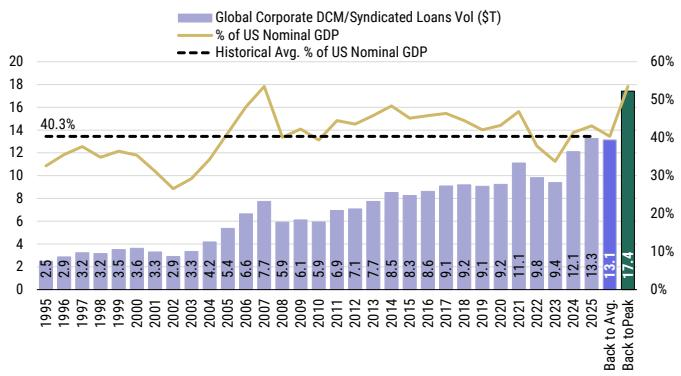

bar_line

| Year | Global Corporate DCM/Syndicated Loans Vol ($T) | % of US Nominal GDP (%) |
| :--- | :--- | :--- |
| 1995 | 2.5 | 30 |
| 1996 | 2.9 | 32 |
| 1997 | 3.2 | 31 |
| 1998 | 3.2 | 30 |
| 1999 | 3.5 | 31 |
| 2000 | 3.6 | 30 |
| 2001 | 3.3 | 28 |
| 2002 | 3.3 | 27 |
| 2003 | 3.3 | 28 |
| 2004 | 4.2 | 31 |
| 2005 | 5.4 | 35 |
| 2006 | 6.6 | 40 |
| 2007 | 7.7 | 45 |
| 2008 | 5.9 | 38 |
| 2009 | 6.1 | 39 |
| 2010 | 5.9 | 40 |
| 2011 | 6.9 | 42 |
| 2012 | 7.1 | 43 |
| 2013 | 7.7 | 44 |
| 2014 | 8.5 | 46 |
| 2015 | 8.3 | 45 |
| 2016 | 8.6 | 46 |
| 2017 | 9.1 | 47 |
| 2018 | 9.2 | 46 |
| 2019 | 9.1 | 45 |
| 2020 | 9.2 | 44 |
| 2021 | 11.1 | 47 |
| 2022 | 9.8 | 41 |
| 2023 | 9.4 | 38 |
| 2024 | 12.1 | 43 |
| 2025 | 13.1 | 45 |
| Back to Avg. / Back to Peak | 13.1 | 47 |
| Back to Avg. / Back to Peak (Historical Avg. % of US Nominal GDP) | 17.4 | 50 |
40.3% (dashed line) indicates the historical average percentage of US nominal GDP.

Note: 'Back to Avg.' and 'Back to Peak' analyses illustrate scenarios in which volume moves back to historical average/peak levels as a % of US nominal GDP, with 5.8% growth in US nominal GDP from the \~\$30.8T in 2025; Source: Dealogic, MS

Exhibit 14: US corporate bond/syndicated loan issuance also trended above average as a % of US nominal GDP in 2025 to a record \$5.7T. A hypothetical scenario in which US issuance moves to peak levels as a % of US nominal GDP would represent >\$7T in annual corporate financing.   
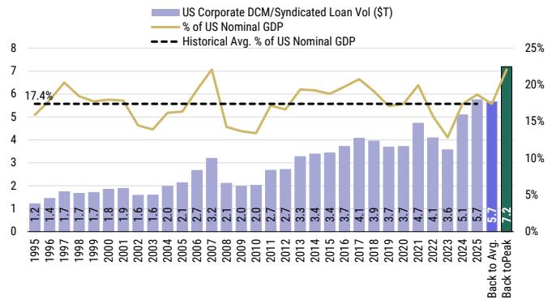

bar_line

| Year | US Corporate DCM/Syndicated Loan Vol ($T) | % of US Nominal GDP (%) |
| :--- | :--- | :--- |
| 1995 | 1.2 | 17.4 |
| 1996 | 1.4 | |
| 1997 | 1.7 | |
| 1998 | 1.7 | |
| 1999 | 1.7 | |
| 2000 | 1.8 | |
| 2001 | 1.9 | |
| 2002 | 1.6 | |
| 2003 | 1.6 | |
| 2004 | 2.0 | |
| 2005 | 2.1 | |
| 2006 | 2.7 | |
| 2007 | 3.2 | |
| 2008 | 2.1 | |
| 2009 | 2.0 | |
| 2010 | 2.0 | |
| 2011 | 2.7 | |
| 2012 | 2.7 | |
| 2013 | 3.3 | |
| 2014 | 3.4 | |
| 2015 | 3.4 | |
| 2016 | 3.7 | |
| 2017 | 4.1 | |
| 2018 | 3.9 | |
| 2019 | 3.7 | |
| 2020 | 3.7 | |
| 2021 | 4.7 | |
| 2022 | 4.1 | |
| 2023 | 3.6 | |
| 2024 | 5.1 | |
| Back to Avg. Back to Peak | 5.7 | 7.2 |
Historical Avg. % of US Nominal GDP

Note: 'Back to Avg.' and 'Back to Peak' analyses illustrate scenarios in which volume moves back to historical average/peak levels as a % of US nominal GDP, with 5.8% growth in US nominal GDP from the \~\$30.8T in 2025; Source: Dealogic, MS

# Exhibit 15:

US Investment Grade Debt Represents over Half of Liquid, Public Debt

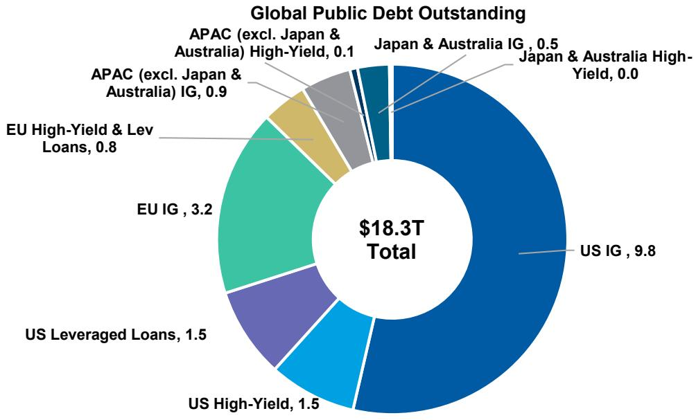

pie

Global Public Debt Outstanding
| Category | Value ($T) |
| :--- | :--- |
| Japan & Australia IG | 0.5 |
| Japan & Australia High-Yield | 0.0 |
| APAC (excl. Japan & Australia) IG | 0.9 |
| EU High-Yield & Lev Loans | 0.8 |
| EU IG | 3.2 |
| US Leveraged Loans | 1.5 |
| US High-Yield | 1.5 |
| US IG | 9.8 |
$18.3T Total

Source: Bloomberg, MS; Note: Data as of March 2026

# Public Equity Markets Retain Significant Capacity for AI Issuance

Public equity markets provide another important lens through which to assess the capacity to finance the AI build-out. Global equity market capitalization totals \~\$159 trillion, including \~\$76 trillion in the US, creating a deep pool of listed capital capable of supporting AI-related issuance over time. While the AI infrastructure cycle will not be funded through equity markets alone, we believe public markets remain significantly underutilized relative to historical issuance capacity, reinforcing our view that the key constraint is less the availability of capital and more how that capital is intermediated across public and private financing channels.

Exhibit 16: Global Equity Market Cap Exceeds \$150T

# Global Equity Market Cap by Region

Market Capitalization (USD Trillions)

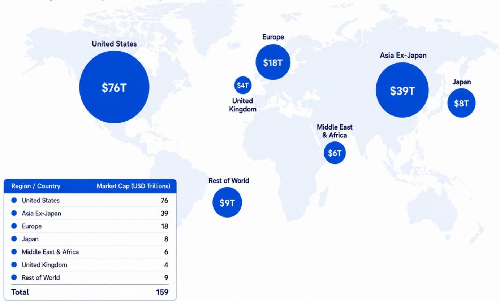

bubble

| Region/Country | Market Cap (USD Trillions) |
| :--- | :--- |
| United States | 76 |
| Europe | 18 |
| Asia Ex-Japan | 39 |
| Japan | 8 |
| Rest of World | 9 |
| United Kingdom | 4 |
| Middle East & Africa | 6 |
| Rest of World | 9 |
Total 159

Source: Bloomberg data as of May 2, 2025

IPO and broader ECM activity remain well below historical levels relative to nominal GDP, suggesting substantial unused capacity for future AI-related issuance. Global IPO issuance in 2025 totaled \~\$200 billion, roughly 50% below historical average levels as a percentage of US nominal GDP. A return toward prior average or peak issuance levels would imply potential annual IPO financing capacity of \~\$412 billion (if return to historical average) and \~\$857 billion (if return to peak issuance) globally. In the US specifically, a return to historical average and peak levels would represent \~\$165 billion and \~\$460 billion, respectively, both far greater than \~\$80 billion of US IPO issuance in 2025.

Broader equity capital markets activity suggests even greater capacity. Global ECM issuance in 2025 totaled \~\$1 trillion, more than 33% below historical average levels relative to GDP. A normalization toward historical average or peak issuance levels would imply potential annual financing capacity of \~\$1.6 trillion (if return to historical average) and \~\$2.6 trillion (if return to peak issuance) globally. In our view, these figures reinforce that public equity markets remain capable of absorbing a materially larger AI financing cycle than current issuance levels imply. In the US specifically, a return to historical average and peak levels would represent \$0.7 trillion and \$1.1 trillion, respectively, both far greater than \~\$500 billion of US ECM issuance in 2025.

Exhibit 17: Global IPO volume in 2025 was nearly 50% below historical average levels as a % of nominal GDP; A hypothetical scenario in which global IPO volume moves back to average/peak levels as a % of US nominal GDP would represent \~\$412B/\$857B in annual IPO financing, respectively.   
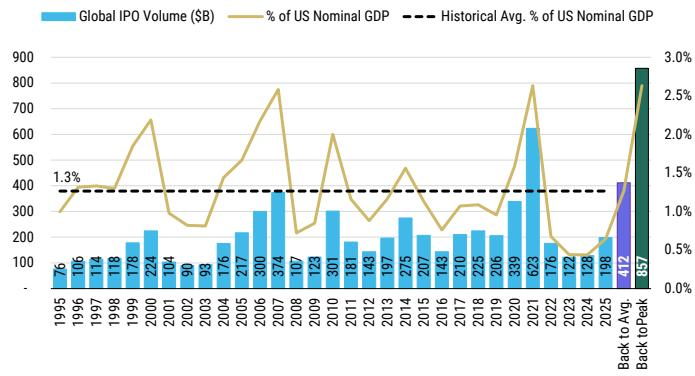

bar_line

| Year | Global IPO Volume ($B) | % of US Nominal GDP | Historical Avg. % of US Nominal GDP |
|---|---|---|---|
| 1995 | 76 | 3.0 | 1.3% |
| 1996 | 106 | 3.8 | 1.3% |
| 1997 | 114 | 3.8 | 1.3% |
| 1998 | 118 | 4.0 | 1.3% |
| 1999 | 178 | 6.5 | 1.3% |
| 2000 | 224 | 6.5 | 1.3% |
| 2001 | 104 | 2.5 | 1.3% |
| 2002 | 90 | 2.3 | 1.3% |
| 2003 | 93 | 2.3 | 1.3% |
| 2004 | 176 | 4.0 | 1.3% |
| 2005 | 217 | 4.5 | 1.3% |
| 2006 | 300 | 5.5 | 1.3% |
| 2007 | 374 | 7.5 | 1.3% |
| 2008 | 107 | 2.0 | 1.3% |
| 2009 | 123 | 2.5 | 1.3% |
| 2010 | 301 | 6.0 | 1.3% |
| 2011 | 181 | 2.5 | 1.3% |
| 2012 | 143 | 2.5 | 1.3% |
| 2013 | 197 | 3.5 | 1.3% |
| 2014 | 275 | 4.5 | 1.3% |
| 2015 | 207 | 3.5 | 1.3% |
| 2016 | 143 | 2.0 | 1.3% |
| 2017 | 210 | 3.0 | 1.3% |
| 2018 | 225 | 3.0 | 1.3% |
| 2019 | 206 | 3.0 | 1.3% |
| 2020 | 339 | 4.5 | 1.3% |
| 2021 | 623 | 7.8 | 1.3% |
| 2022 | 176 | 0.5 | 1.3% |
| 2023 | 128 | 0.5 | 1.3% |
| 2024 | 198 | 0.5 | 1.3% |
| Back to Avg. (B) - Back to Peak (B) + Back to Avg. (%) - B) (B) (B) (B) (B) (B) (B) (B) (B) (B) (B) (B) (B) (B) (B) (B) (B) (B) (B) (B) (B) (B) (B) (B) (B) (B) (B) (B) (B) (B) (B) (B) (B) (B) (B)

Note: 'Back to Avg.' and 'Back to Peak' analyses illustrate scenarios in which volume moves back to historical average/peak levels as a % of US nominal GDP, with 5.8% growth in US nominal GDP from the \~\$30.8T in 2025; Source: Dealogic, MS

Exhibit 19: On a broader level, global equity issuance volume in 2025 was more than 33% below historical average levels as a % of nominal GDP; A hypothetical scenario in which global ECM volume moves back to average/peak levels as a % of US nominal GDP would represent \~\$1.6T/\$2.6T in annual equity financing, respectively.   
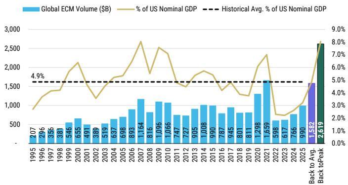

bar_line

| Year | Global ECM Volume ($B) | % of US Nominal GDP (%) | Historical Avg. % of US Nominal GDP (%) |
| :--- | :--- | :--- | :--- |
| 1995 | 207 | 8.5 | 4.9 |
| 1996 | 296 | 13.0 | 4.9 |
| 1997 | 356 | 13.5 | 4.9 |
| 1998 | 381 | 14.0 | 4.9 |
| 1999 | 546 | 18.0 | 4.9 |
| 2000 | 655 | 21.0 | 4.9 |
| 2001 | 491 | 15.0 | 4.9 |
| 2002 | 389 | 12.0 | 4.9 |
| 2003 | 519 | 16.0 | 4.9 |
| 2004 | 637 | 17.0 | 4.9 |
| 2005 | 698 | 18.0 | 4.9 |
| 2006 | 893 | 21.0 | 4.9 |
| 2007 | 1,164 | 27.0 | 4.9 |
| 2008 | 816 | 18.0 | 4.9 |
| 2009 | 1,096 | 25.0 | 4.9 |
| 2010 | 1,066 | 24.0 | 4.9 |
| 2011 | 747 | 16.0 | 4.9 |
| 2012 | 727 | 15.0 | 4.9 |
| 2013 | 905 | 18.0 | 4.9 |
| 2014 | 1,008 | 19.0 | 4.9 |
| 2015 | 990 | 17.0 | 4.9 |
| 2016 | 787 | 14.0 | 4.9 |
| 2017 | 945 | 15.0 | 4.9 |
| 2018 | 801 | 13.0 | 4.9 |
| 2019 | 811 | 13.0 | 4.9 |
| 2020 | 1,298 | 23.0 | 4.9 |
| 2021 | 1,659 | 27.0 | 4.9 |
| 2022 | 598 | 2.5 | 4.9 |
| 2023 | 617 | 3.0 | 4.9 |
| 2024 | 766 | 3.5 | 4.9 |
| 2025 | 990 | 4.5 | 4.9 |
| Back to Avg. (B) - B=1,582 (Back to Peak) + Back to Avg. (B)=2,619 (Back to Peak) (B=End) (B=Peak) (B=Peak) (B=Peak) (B=Peak) (B=Peak) (B=Peak) (B=Peak) (B=Peak) (B=Peak) (B=Peak) (B=Peak) (B=Peak) (B=Peak) (B=Peak) (B=Peak) (B=Peak) (B=Peak) (B=Peak) (B=Peak) (B=Peak) (B=Max) (B=Max) (B=Max) (B=Max) (B=Max) (B=Max) (B=Max) (B=Max) (B=Max) (B=Max) (B=Max) (B=Max) (B=Max) (B=Max) (B=Max) (B=Max) (B=Max) (B=Max) (B=Max) (B=Max) (B=Peak) (B=Peak) (B=Peak) (B=Peak) (B=Peak) (B=Peak) (B=Peak) (B=Peak) (B=Peak) (B=Peak) (B=Peak) (B=Peak) (B=Peak) (B=Peak) (B=Peak) (B=Peak) (B=Peak) (B=Peak) (B=Peak) (B=Post Peak) (B=Post Peak) (B=Post Peak) (B=Post Peak) (B=Post Peak) (B=Post Peak) (B=Post Peak) (B=Post Peak) (B=Post Peak)

Note: 'Back to Avg.' and 'Back to Peak' analyses illustrate scenarios in which volume moves back to historical average/peak levels as a % of US nominal GDP, with 5.8% growth in US nominal GDP from the \~\$30.8T in 2025; Source: Dealogic, MS

Exhibit 18: US IPO volume in 2025 was 50% below historical average levels as a % of nominal GDP; A hypothetical scenario in which US IPO volume moves back to average/peak levels as a % of US nominal GDP would represent \~\$165B/\$457B in annual IPO financing, respectively.   
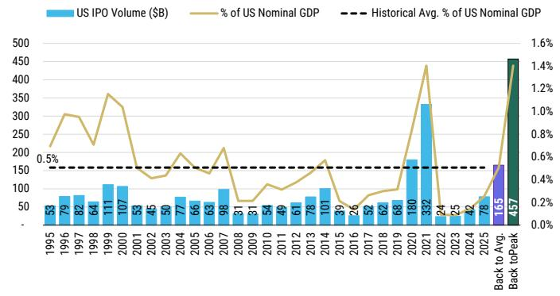

bar_line

| Year | US IPO Volume ($B) | % of US Nominal GDP | Historical Avg. % of US Nominal GDP |
|---|---|---|---|
| 1995 | 53 | 0.5% | 0.5% |
| 1996 | 79 | 300 | 0.5% |
| 1997 | 82 | 300 | 0.5% |
| 1998 | 64 | 220 | 0.5% |
| 1999 | 111 | 360 | 0.5% |
| 2000 | 107 | 320 | 0.5% |
| 2001 | 53 | 130 | 0.5% |
| 2002 | 45 | 130 | 0.5% |
| 2003 | 50 | 140 | 0.5% |
| 2004 | 77 | 190 | 0.5% |
| 2005 | 66 | 140 | 0.5% |
| 2006 | 63 | 140 | 0.5% |
| 2007 | 98 | 210 | 0.5% |
| 2008 | 81 | 60 | 0.5% |
| 2009 | 81 | 60 | 0.5% |
| 2010 | 54 | 110 | 0.5% |
| 2011 | 49 | 110 | 0.5% |
| 2012 | 61 | 130 | 0.5% |
| 2013 | 78 | 160 | 0.5% |
| 2014 | 101 | 180 | 0.5% |
| 2015 | 39 | 140 | 0.5% |
| 2016 | 26 | 80 | 0.5% |
| 2017 | 52 | 90 | 0.5% |
| 2018 | 62 | 90 | 0.5% |
| 2019 | 68 | 90 | 0.5% |
| 2020 | 180 | 180 | 0.5% |
| 2021 | 332 | 445 | 0.5% |
| 2022 | 24 | -1457 | -1.4% |
| 2023e | 25 | -1457 | -1.4% |
| 2024e | 42 | -1457 | -1.4% |
| 2025e | 78 | -1457 | -1.4% |
| Back to Avg. (Last) | 165 | -1457 | -1.4% |
| Back to Peak (Last) (Last) | 1457 | -1457 | -1.4% |

Note: 'Back to Avg.' and 'Back to Peak' analyses illustrate scenarios in which volume moves back to historical average/peak levels as a % of US nominal GDP, with 5.8% growth in US nominal GDP from the \~\$30.8T in 2025; Source: Dealogic, MS

Exhibit 20: In the US, equity issuance volume in 2025 was 25% below historical average levels as a % of nominal GDP; A hypothetical scenario in which US ECM volume moves back to average/peak levels as a % of US nominal GDP would represent \~\$0.7T/\$1.1T in annual equity financing, respectively.   
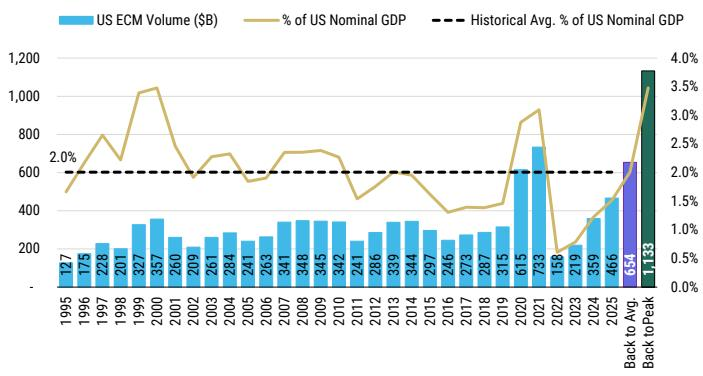

bar_line

| Year | US ECM Volume ($B) | % of US Nominal GDP | Historical Avg. % of US Nominal GDP |
|---|---|---|---|
| 1995 | 127 | 4.8 | 2.0% |
| 1996 | 175 | 7.3 | 2.0% |
| 1997 | 228 | 8.0 | 2.0% |
| 1998 | 201 | 6.5 | 2.0% |
| 1999 | 327 | 104.5 | 2.0% |
| 2000 | 357 | 104.5 | 2.0% |
| 2001 | 260 | 7.3 | 2.0% |
| 2002 | 209 | 5.8 | 2.0% |
| 2003 | 261 | 6.8 | 2.0% |
| 2004 | 284 | 6.8 | 2.0% |
| 2005 | 241 | 5.8 | 2.0% |
| 2006 | 263 | 6.8 | 2.0% |
| 2007 | 341 | 7.3 | 2.0% |
| 2008 | 348 | 7.3 | 2.0% |
| 2009 | 345 | 7.3 | 2.0% |
| 2010 | 342 | 6.8 | 2.0% |
| 2011 | 241 | 4.8 | 2.0% |
| 2012 | 286 | 6.8 | 2.0% |
| 2013 | 339 | 6.8 | 2.0% |
| 2014 | 344 | 6.8 | 2.0% |
| 2015 | 297 | 5.8 | 2.0% |
| 2016 | 246 | 4.8 | 2.0% |
| 2017 | 273 | 4.8 | 2.0% |
| 2018 | 287 | 4.8 | 2.0% |
| 2019 | 315 | 5.8 | 2.0% |
| 2020 | 615 | 8.8 | 2.0% |
| 2021 | 733 | 9.3 | 2.0% |
| 2022 | 158 | 1.5 | 2.0% |
| 2023 | 219 | 1.5 | 2.0% |
| 2024 | 359 | 3.5 | 2.0% |
| 2025 | 466 | 4.8 | 2.0% |
| Back to Avg. / Back to Peak: US ECM Volume ($B): $654; Historical Avg.: % of US Nominal GDP: $1,133; Back to Avg.: % of US Nominal GDP: -1.7%; Historical Avg.: % of US Nominal GDP: -1.3%. The chart displays a bar for the cumulative total volume and a line for the percentage of nominal GDP over time.

Note: 'Back to Avg.' and 'Back to Peak' analyses illustrate scenarios in which volume moves back to historical average/peak levels as a % of US nominal GDP, with 5.8% growth in US nominal GDP from the \~\$30.8T in 2025; Source: Dealogic, MS

As AI-related issuance expands, questions around equity market concentration and absorption capacity are likely to become increasingly important. Historically, stronger IPO markets have coincided with broader participation and lower concentration among the largest deals. For example, in 2021 — the strongest IPO year on record — the top 10 IPOs represented just 8% of global issuance volume, well below the historical average of 23%. While potential new issuances could temporarily increase concentration, we would generally expect a broader expansion in issuance activity over time as capital formation normalizes toward historical levels. Our US Equity Strategy team discusses equity concentration further below (see US Equity Strategy) and highlights that dispersion among the most concentrated names is high which pushes back on the notion that thematic concentration is/will be a risk for the major indices.

Exhibit 21: We observe a modest inverse relationship between the total IPO volume in a given year and the concentration of volume in the top 10 IPOs in that year   
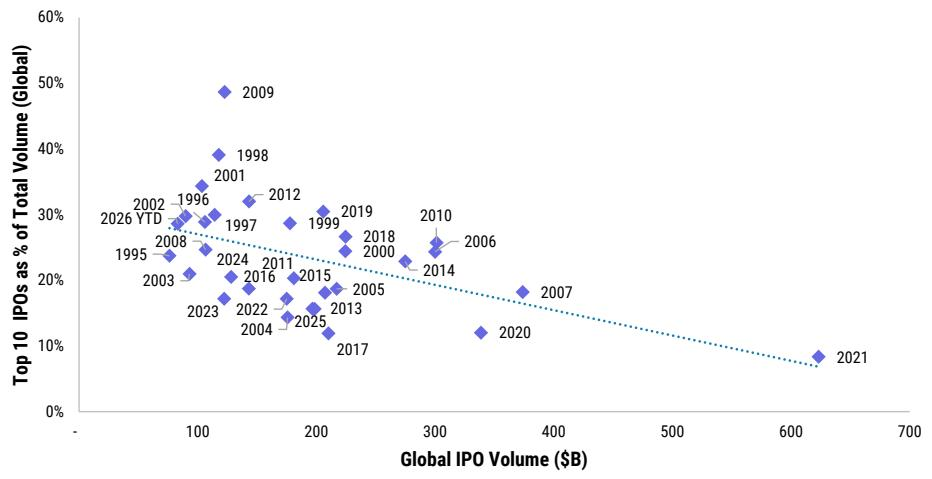

scatter

| Year | Global IPO Volume ($B) | Top 10 IPOs as % of Total Volume (Global) |
|------|------------------------|------------------------------------------|
| 2009 | ~110                   | ~48%                                     |
| 1998 | ~100                   | ~38%                                     |
| 2001 | ~100                   | ~34%                                     |
| 2002 | ~80                    | ~30%                                     |
| 2003 | ~90                    | ~25%                                     |
| 2004 | ~150                   | ~15%                                     |
| 2005 | ~200                   | ~18%                                     |
| 2006 | ~300                   | ~25%                                     |
| 2007 | ~380                   | ~18%                                     |
| 2008 | ~80                    | ~24%                                     |
| 2009 | ~110                   | ~48%                                     |
| 2010 | ~300                   | ~25%                                     |
| 2011 | ~150                   | ~20%                                     |
| 2012 | ~140                   | ~32%                                     |
| 2013 | ~180                   | ~16%                                     |
| 2014 | ~280                   | ~22%                                     |
| 2015 | ~180                   | ~20%                                     |
| 2016 | ~160                   | ~18%                                     |
| 2017 | ~210                   | ~12%                                     |
| 2018 | ~230                   | ~26%                                     |
| 2019 | ~220                   | ~31%                                     |
| 2020 | ~340                   | ~12%                                     |
| 2021 | ~630                   | ~8%                                      |
| 2022 | ~130                   | ~16%                                     |
| 2023 | ~130                   | ~17%                                     |
| 2024 | ~130                   | ~24%                                     |
| 2025 | ~180                   | ~14%                                     |
| 2026 YTD | ~70                  | ~30%                                     |

Note: YTD 2026 Data as of May 14; Source: Dealogic, MS

Exhibit 22: 2010 had the highest volume among the top 10 global IPOs in aggregate   
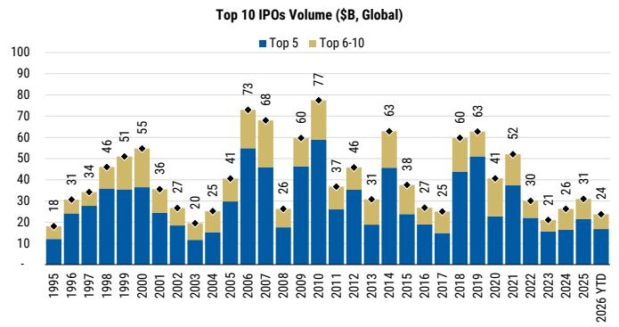

bar_stacked

Top 10 IPOs Volume ($B, Global)
| Year | Top 5 ($B) | Top 6-10 ($B) |
|---|---|---|
| 1995 | 18 | 1 |
| 1996 | 31 | 4 |
| 1997 | 34 | 6 |
| 1998 | 46 | 8 |
| 1999 | 51 | 10 |
| 2000 | 55 | 11 |
| 2001 | 36 | 7 |
| 2002 | 27 | 5 |
| 2003 | 20 | 4 |
| 2004 | 25 | 7 |
| 2005 | 41 | 10 |
| 2006 | 73 | 18 |
| 2007 | 68 | 23 |
| 2008 | 26 | 5 |
| 2009 | 60 | 13 |
| 2010 | 77 | 23 |
| 2011 | 37 | 8 |
| 2012 | 46 | 10 |
| 2013 | 31 | 7 |
| 2014 | 63 | 13 |
| 2015 | 38 | 7 |
| 2016 | 27 | 5 |
| 2017 | 25 | 5 |
| 2018 | 60 | 14 |
| 2019 | 63 | 14 |
| 2020 | 41 | 13 |
| 2021 | 52 | 14 |
| 2022 | 30 | 7 |
| 2023 | 21 | 5 |
| 2024 | 26 | 6 |
| 2025 YTD | 31 | 7 |
| 2026 YTD | 24 | 6 |

Note: YTD 2026 Data as of May 14; Source: Dealogic, MS

Exhibit 23: The top 10 largest IPOs annually have historically represented 23% of global volume on average   
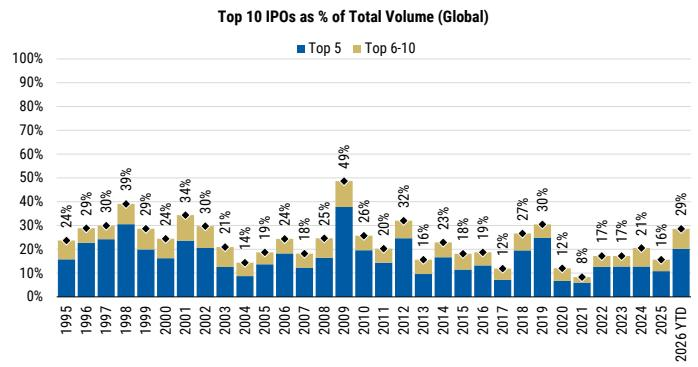

bar_stacked

Top 10 IPOs as % of Total Volume (Global)
| Year | Top 5 (%) | Top 6-10 (%) |
|---|---|---|
| 1995 | 17 | 24 |
| 1996 | 23 | 29 |
| 1997 | 24 | 30 |
| 1998 | 30 | 39 |
| 1999 | 23 | 29 |
| 2000 | 17 | 24 |
| 2001 | 23 | 34 |
| 2002 | 23 | 30 |
| 2003 | 12 | 21 |
| 2004 | 8 | 14 |
| 2005 | 13 | 19 |
| 2006 | 18 | 24 |
| 2007 | 13 | 18 |
| 2008 | 17 | 25 |
| 2009 | 38 | 49 |
| 2010 | 20 | 26 |
| 2011 | 15 | 20 |
| 2012 | 24 | 32 |
| 2013 | 10 | 16 |
| 2014 | 17 | 23 |
| 2015 | 13 | 18 |
| 2016 | 13 | 19 |
| 2017 | 8 | 12 |
| 2018 | 20 | 27 |
| 2019 | 25 | 30 |
| 2020 | 7 | 12 |
| 2021 | 6 | 8 |
| 2022 | 13 | 17 |
| 2023 | 14 | 17 |
| 2024 | 14 | 21 |
| 2025 | 13 | 16 |
| 2026 YTD | 20 | 29 |

Note: YTD 2026 Data as of May 14; Source: Dealogic, MS

# Investors Have Substantial Cash Pile

Both retail and institutional cash balances remain substantial in the context of the broader AI financing discussion. US money market fund assets currently total \~\$7.6 trillion, up \~10% Y/Y and nearly 70% versus five years ago, underscoring the scale of cash-like assets that could gradually be redeployed as investors seek exposure to secular growth, income, and infrastructure-linked opportunities. While money market assets are not a standalone funding source for AI, they reinforce that the AI build-out is occurring against a backdrop of significant system-wide liquidity across households, institutions, and capital markets.

Recent flow trends also suggest investor risk appetite has improved. Money market funds have seen 2026 YTD net outflows of \~\$150 billion, compared with flattish flows YTD 2025 and overall net inflows of +\$531 billion and \$578 billion in 2024 and 2025, respectively. At the same time, 2026 YTD long-term mutual fund and ETF net inflows of \~\$489 billion are up nearly 170% versus the prior-year period, consistent with investors increasingly reallocating capital toward higher-risk assets.

Exhibit 24: 2026 money market net flows have softened while equity and bond flows have increased, suggesting investor risk appetite has grown   
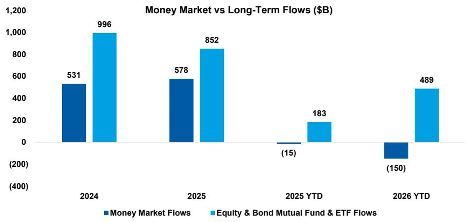

bar

Money Market vs Long-Term Flows ($B)
| Year | Money Market Flows ($B) | Equity & Bond Mutual Fund & ETF Flows ($B) |
| :--- | :--- | :--- |
| 2024 | 531 | 996 |
| 2025 | 578 | 852 |
| 2025 YTD | (15) | 183 |
| 2026 YTD | (150) | 489 |

Source: Morningstar, MS. Note: year-to-date data is through May 1st

# Private Market Funds Have Record Dry Powder Levels at Nearly \$5 Trillion Awaiting Deployment Opportunities

Alternative asset managers also have substantial dry powder available to deploy into scaled AI infrastructure opportunities. Across alternatives, dry powder totals \~\$4.9 trillion as of March 2026, reinforcing that the AI build-out is occurring against a backdrop of meaningful undeployed private capital. Recent commentary from BX, KKR, and BAM points to robust demand for AI infrastructure across data centers, power, digital infrastructure, and related financing structures, supporting our view that the constraint is less the availability of capital and more the formation of compelling investment vehicles with attractive risk-adjusted returns.

Exhibit 25: \$4.9T dry powder across private market funds, with \$360B of infrastructure dry powder representing 7% of overall private markets dry powder   
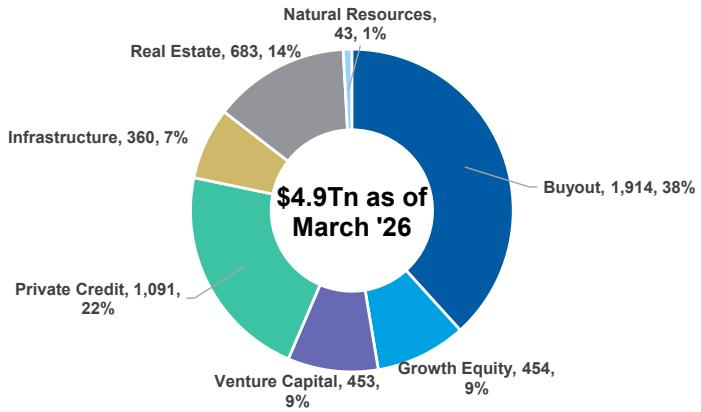

pie

$4.9Tn as of March '26
| Category | Value | Percentage (%) |
|---|---|---|
| Buyout | 1,914 | 38 |
| Growth Equity | 454 | 9 |
| Venture Capital | 453 | 9 |
| Private Credit | 1,091 | 22 |
| Infrastructure | 360 | 7 |
| Real Estate | 683 | 14 |
| Natural Resources | 43 | 1 |
$4.9Tn as of March '26

Source: Cobalt data through 3/31/2026, MS Estimates, Components shown as \$BNote: Fundraising and AuM data exclude fund of funds, secondaries and coinvest capital.

# US Banks Have over \$200 Billion of Excess Capital, Suggesting \~\$2.5 Trillion of Balance Sheet Capacity

US banks are not constrained by capital and can also provide a source of AI-related financing as needed. We estimate that the large and super-regional banks in our coverage have \$154 billion of excess capital today. Under the new capital rules proposed by regulators earlier this year, this excess capital rises to \$210 billion. This would imply \$2.5 trillion of balance sheet capacity at these banks to support both lending and capital markets activity. Of course, banks are unlikely to utilize all of their excess capital, but this illustrates that banks are not constrained by capital, and have ample room to help facilitate AI-related investment spend. Note: \$2.5 trillion capacity is a bottom-up estimate across the Cat I-IV banks in our coverage, in which we 1) estimated current excess capital above required minimum under new Fed proposals and 2) divided excess capital by each bank's required regulatory minimum floor percentage to get the output balance sheet capacity. Our estimates of excess capital and new required minimums by bank can be found here: US Banks and Consumer Finance: How Much Capital Is In Motion After 1Q26 Earnings? (6 May 2026).

Exhibit 26: We estimate there's \~\$2.5T in excess balance sheet capacity in aggregate across the large and super-regional banks in our coverage   
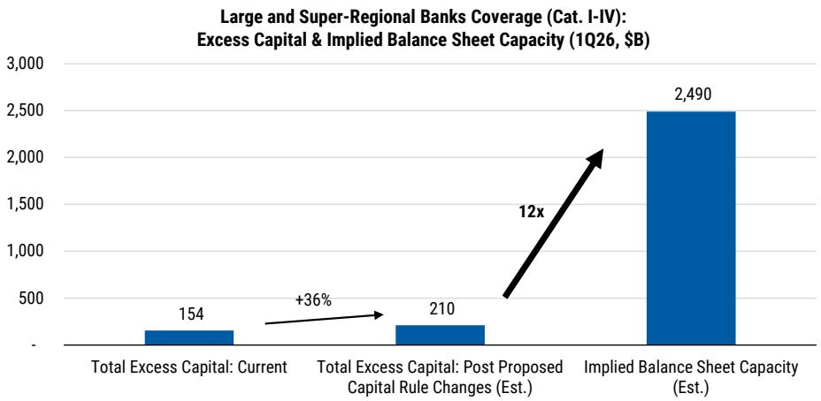

bar

Large and Super-Regional Banks Coverage (Cat. I-IV): Excess Capital & Implied Balance Sheet Capacity (1Q26, $B)
| Category | Value |
|---|---|
| Total Excess Capital: Current | 154 |
| Total Excess Capital: Post Proposed Capital Rule Changes (Est.) | 210 |
| Implied Balance Sheet Capacity (Est.) | 2,490 |
+36% growth indicated between current and proposed capital rules changes, with a 12x increase shown between current and estimated capital rules changes.

Note: Banks in analysis include BAC, BNY, C, CFG, FITB, GS, HBAN, JPM, KEY, MTB, NTRS, PNC, RF, STT, TFC, USB, WFC; Source: Company data, MS estimates

# The Challenge Is Financial Structuring ...

We see the constraint less as the availability of capital and more as the formation of suitable investment vehicles that can match different investor risk appetites. Public equity can fund corporate growth; IG credit can fund high-quality issuers with meaningful cash flow; securitized markets can finance stabilized data center assets backed by contracted cash flows, ABS has no construction risk and is already cash-flowing; CMBS generally has no built-in amortization; high-yield data center bonds and IG secured/project-finance-style data center bonds vary more by construction risk, lease tenor, guarantees, and refinancing risk; private credit and ABF can address bespoke, earlier-stage, or more complex financing needs; private infrastructure capital can absorb long-duration projects tied to strategic compute and power capacity. The key question is therefore how the \$10 trillion is intermediated — and at what return, duration, collateral package, and risk-sharing structure — rather than whether the global financial system is large enough to absorb it.

# .... While the Real Bottleneck Remains Power

AI build-out is increasingly constrained by shortages across power, compute, infrastructure, and enterprise readiness. The most immediate bottleneck is power. For more details, see Securitized & Corporate Credit: Data Center Financing: Faster, Broader, Deeper (26 May 2026) and Bitcoin Mining/Data Center Development: Correction: Watts in a Name: China/US Dynamics Drop Projected Shortfall, Room to Run for BTC-to-HPC Pivots, and Updates to EV/Watt Value (26 May 2026).

There is a significant risk that US data center demand is expected to significantly exceed available grid capacity through at least 2028, even after accounting for new power solutions. Grid access delays, permitting hurdles, labor shortages, and supply chain constraints for equipment such as turbines and nuclear components are further slowing deployment. On the compute side, AI demand continues to outstrip supply, with hyperscalers reporting near-full utilization of advanced chips. As AI shifts from training to inference and agentic workloads, new constraints are emerging around CPUs, memory, and system orchestration, while inference workloads are also creating more volatile electricity demand patterns that existing grids were not designed to handle. Beyond infrastructure, enterprise adoption remains constrained by challenges around data readiness, talent shortages, security and privacy concerns, and integration with legacy systems. The core inputs enabling AI — compute, energy, data, and trusted AI capabilities — remain structurally scarce, positioning owners of these bottlenecks to capture outsized economic value.

# US Equity Strategy

In our view, potential recovery in IPO activity, should drive allocation away from international equities and toward US equities. The US already maintains dominance in terms of AI data center/capex/related infrastructure weights within its major indices relative to international developed and emerging market gauges. This development should continue to facilitate this relative attractiveness in addition to the relative earnings strength that US major averages already possess on a global scale. Therefore, sources of funds could be international indices with less prominent AI weights and earnings, money markets/cash holdings, and/or lower quality areas of the US equity market as the year progresses and focus turns more to structural growth stories.

Our work shows that the US equity market is already concentrated from a weighting standpoint. The top 5/10 stocks in the S&P 500 make up 28%/39% of market cap, respectively — a historical high (Exhibit 27). Technology's weight (inclusive of the Tech sector, Communication Services, and AMZN) is 50%, around a historical high (Exhibit 28). Looking at the Herfindahl-Hirschman measure, a commonly cited market concentration metric, we observe a similar phenomenon as this measure is at/near historical highs (Exhibit 29, Exhibit 15). Increased IPO activity would likely lead to further concentration; however, what we have observed over the last year is that the dispersion among the largest stocks in the S&P 500 has been elevated (Exhibit 31). This pushes back to some extent against the idea that thematic concentration is/will be a risk for the major indices. The broadening in leadership that we expect this year for cyclical reasons could also help to balance out major index weights, albeit modestly. That said, we do think there is value in looking at median/average stock fundamental metrics at the S&P 500 level to get a more holistic sense of trends.

Exhibit 27: The top 5/10 stocks make up 28%/39% of S&P 500 market cap   
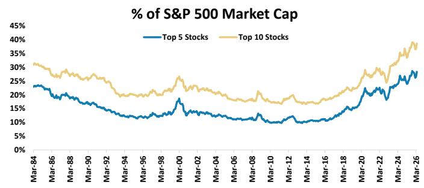

line

| Date   | Top 5 Stocks | Top 10 Stocks |
|--------|--------------|---------------|
| Mar-84 | 23%          | 31%           |
| Mar-86 | 20%          | 29%           |
| Mar-88 | 18%          | 27%           |
| Mar-90 | 16%          | 25%           |
| Mar-92 | 14%          | 23%           |
| Mar-94 | 12%          | 21%           |
| Mar-96 | 10%          | 19%           |
| Mar-98 | 12%          | 21%           |
| Mar-00 | 18%          | 25%           |
| Mar-02 | 14%          | 23%           |
| Mar-04 | 12%          | 21%           |
| Mar-06 | 10%          | 19%           |
| Mar-08 | 12%          | 21%           |
| Mar-10 | 10%          | 19%           |
| Mar-12 | 12%          | 21%           |
| Mar-14 | 14%          | 23%           |
| Mar-16 | 16%          | 25%           |
| Mar-18 | 18%          | 27%           |
| Mar-20 | 20%          | 30%           |
| Mar-22 | 22%          | 33%           |
| Mar-24 | 25%          | 36%           |
| Mar-26 | 28%          | 39%           |

Data as of 4/30/2026. Source: Compustat, MS

Exhibit 28: Tech makes up 50% of the S&P 500 market cap   
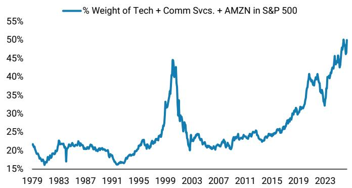

line

| Year | % Weight of Tech + Comm Svcs. + AMZN in S&P 500 |
| ---- | ----------------------------------------------- |
| 1979 | ~20%                                            |
| 1983 | ~18%                                            |
| 1987 | ~22%                                            |
| 1991 | ~16%                                            |
| 1995 | ~20%                                            |
| 1999 | ~45%                                            |
| 2003 | ~20%                                            |
| 2007 | ~22%                                            |
| 2011 | ~25%                                            |
| 2015 | ~30%                                            |
| 2019 | ~40%                                            |
| 2023 | ~50%                                            |

Data as of 4/30/2026. Source: Compustat, MS

Exhibit 29: S&P 500 concentration has made new highs over the past several years   
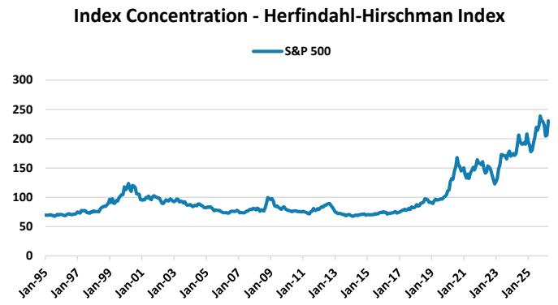

line

| Date   | S&P 500 |
|--------|---------|
| Jan-95 | 60      |
| Jan-97 | 70      |
| Jan-99 | 80      |
| Jan-01 | 120     |
| Jan-03 | 90      |
| Jan-05 | 80      |
| Jan-07 | 70      |
| Jan-09 | 80      |
| Jan-11 | 70      |
| Jan-13 | 80      |
| Jan-15 | 70      |
| Jan-17 | 80      |
| Jan-19 | 100     |
| Jan-21 | 160     |
| Jan-23 | 180     |
| Jan-25 | 240     |

Data as of 4/30/2026. Source: Compustat, MS

Exhibit 30: The Nasdaq 100 is notably more concentrated than the S&P 500 and is primarily tech focused   
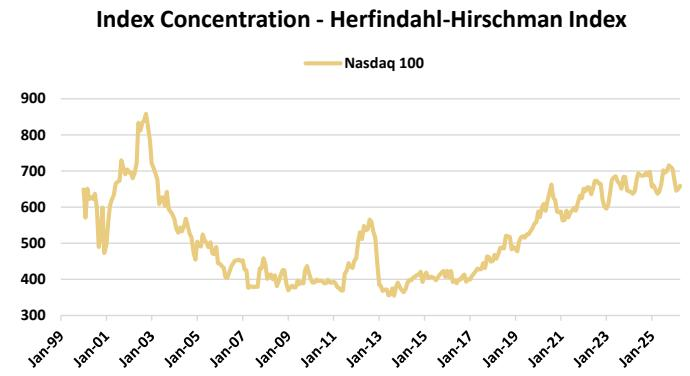

line

| Date   | Nasdaq 100 |
|--------|------------|
| Jan-99 | 650        |
| Jan-01 | 500        |
| Jan-03 | 850        |
| Jan-05 | 550        |
| Jan-07 | 450        |
| Jan-09 | 400        |
| Jan-11 | 380        |
| Jan-13 | 550        |
| Jan-15 | 400        |
| Jan-17 | 450        |
| Jan-19 | 550        |
| Jan-21 | 650        |
| Jan-23 | 680        |
| Jan-25 | 700        |

Data as of 4/30/2026. Source: Compustat, MS

Exhibit 31:
Megacap stock dispersion has risen since 2025   
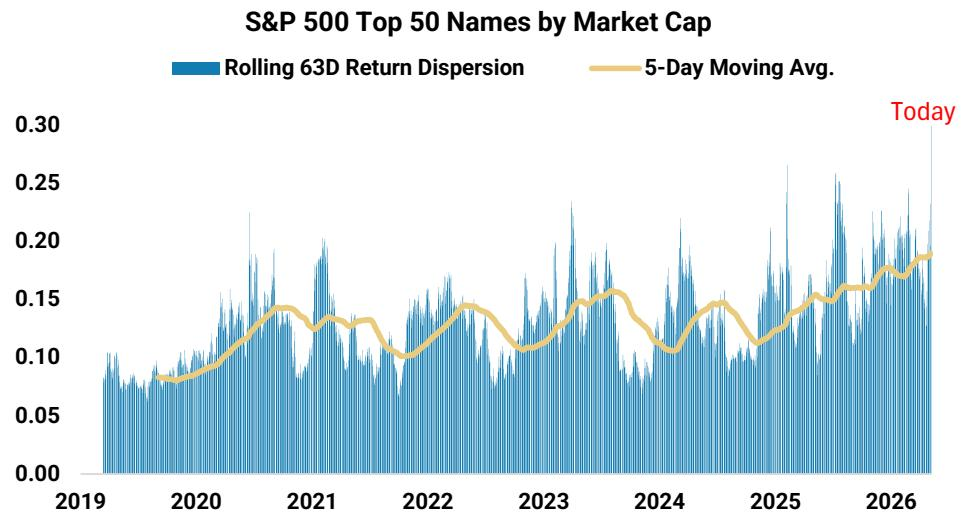

line

| Year | Rolling 63D Return Dispersion | 5-Day Moving Avg. |
|------|--------------------------------|--------------------|
| 2019 | ~0.08                          | ~0.08              |
| 2020 | ~0.10                          | ~0.10              |
| 2021 | ~0.14                          | ~0.14              |
| 2022 | ~0.12                          | ~0.12              |
| 2023 | ~0.15                          | ~0.15              |
| 2024 | ~0.11                          | ~0.11              |
| 2025 | ~0.16                          | ~0.16              |
| 2026 | ~0.19                          | ~0.19              |

Data as of 5/6/2026. Source: Compustat, MS

# Ways to Play

# Asset Managers

We're increasingly bullish on the Alternative Asset Managers (Alts) given the significant capital deployment opportunity presented by data center / AI spend in the context of the views of our colleagues that see continued signs of strength in AI infrastructure spend that skew to the upside. We see KKR, BX, APO, BN (all OW) and BAM, ARES (both EW) as best positioned for the AI investment theme given strong brand that attracts quality partners, breadth of global footprint, sizable dry powder and scale, and diversified private credit, infrastructure, and real assets capabilities. We also see BLK (OW) as well positioned given its recent acquisition of GIP and sizable infrastructure initiatives in the context of their broader platform capabilities, vast scale, global footprint and breadth of relationships across corporates and asset owners.

- KKR (OW): One of the cleanest ways to play AI infrastructure given its scale across infrastructure, private credit, real assets, and capital markets. Existing exposure through its data center platform gives KKR direct reach across data centers, power-adjacent infrastructure, and cooling, while meaningful Real Assets dry powder supports continued deployment.   
- BX (OW): Well positioned through its sizable data center and power exposure and investments in natural gas generation capacity to support data center development. We see BX as a core beneficiary of demand for large, institutional-quality vehicles tied to data centers, power, and infrastructure-linked real estate.   
- APO (OW): Well positioned for the credit-heavy components of AI infrastructure financing, including IG credit, asset-backed finance, private credit, and structured solutions. Its origination platform, insurance capital, and long-duration credit capabilities are well suited to financing stabilized or contracted AI infrastructure assets backed by durable cash flows.   
- BN / BAM (OW / EW): The broad Brookfield ecosystem is well positioned given its scaled infrastructure platform and differentiated exposure to power, renewables, transition, and digital infrastructure. Its ability to connect data center development with power solutions is increasingly relevant, supported by recent AI infrastructure mandates in France, Sweden, the US and its recent energy partnership for data center fuel cells.   
- ARES (EW): AI infrastructure exposure through private credit, infrastructure, and its expanded digital infrastructure platform following the GCP acquisition. GCP adds direct data center development expertise, including experience designing 50+ data centers globally and managing 2.5GW+ of IT load across 300+ data centers.   
- BLK (OW): GIP acquisition materially expands BLK's infrastructure capabilities and position the firm to aggregate large pools of institutional capital for AI infrastructure. Its AI Infrastructure Partnership with hyperscalers, corporates, asset owners and others provides direct exposure to large-scale financing needs across data centers and related energy infrastructure.

# Banks

All money center banks (BAC, C, GS, JPM, WFC) have scaled, global investment banking and trading franchises set to benefit from the convergence of building M&A momentum, a recovering IPO market, and the meaningful financing requirements of AI infrastructure. Importantly, US banks are not constrained by capital and can provide a direct source of AI-related financing using balance sheet as needed. These banks have grown increasingly focused on delivering a wide range of financing capabilities across both public and private channels, with AI infrastructure as a key source of demand.

\- C (OW, Top Pick): Growing share in Investment banking is a core focus area for Citi, as shown through its elevated recent hiring. Citi established a dedicated AI Infrastructure Banking team in February to support AI infrastructure projects through a broad-range of financing capabilities. We see Citi's global network as a key in advantage in this effort, particularly for cross-border AI capex deals. Citi has already demonstrated growing success in upping investment baking market share, taking part in 15 of the top 25 transactions in 2025, and we see continued growth as a key driver to executing on Citi's new medium-term ROTCE target of 14-15%. Citi is our Top Pick, as at 1.1x 2027 P/TBV the stock is not priced to get to the company's 14-15% medium-term ROTCE. Investment banking (5%) and trading (26%) made up 31% of total revenue in 2025.

\- BAC (OW): BofA has a deep corporate client base and expansive middle market coverage team to provide a broad funnel for deal flow. In February, BAC announced a \$25 billion capital commitment for private credit deals, backing BAC's focus on delivering holistic financing solutions to meet AI-related demand. Investment banking (6%) and trading (18%) made up 24% of total revenue in 2025.

\- GS (EW): GS has top M&A market share and is directly set up to capture the AI infrastructure financing opportunity through its Capital Solutions Group, which was established to serve as a centralized hub for the firm's origination, structuring, and financing activities in one unified platform with one unified set of incentives. The Capital Solutions Group is creating a multiplier effect across GS's advisory franchise by adding financing and risk management solutions to transactions in which GS serves as advisor. Investment banking (16%) and trading (55%) made up 71% of total revenue in 2025.

\- JPM (EW): JPM commands the largest balance sheet among the group with a top investment banking franchise well suited to help finance AI infrastructure spend. JPM has specifically dedicated \$50 billion of balance sheet to direct lending and has announced the Security and Resilience Initiative, which is a \$1.5 trillion, 10-year plan to facilitate, finance, and invest in industries critical to national economic security and resilience (i.e., including of AI). Investment banking (5%) and trading (19%) made up 25% of total revenue in 2025.

\- WFC (EW): Wells Fargo has made the build-out of the Corporate and Investment Banking segment a top priority, with the recent lifting of the asset cap a boost to WFC's growth ambitions. Investment banking (4%) and trading (8%) made up 12% of total revenue in 2025.

# Disclosure Section

Mortgage Backed Securities (MBS) and Collateralized Mortgage Obligations (CMO)

Principal is returned on a monthly basis over the life of the security. Principal prepayment can significantly affect the monthly income stream and the maturity of any type of MBS, including standard MBS, CMOs and Lottery Bonds. Yields and average lives are estimated based on prepayment assumptions and are subject to change based on actual prepayment of the mortgages in the underlying pools. The level of predictability of an MBS/CMO's average life, and its market price, depends on the type of MBS/CMO class purchased and interest rate movements. In general, as interest rates fall, prepayment speeds are likely to increase, thus shortening the MBS/CMO's average life and likely causing its market price to rise. Conversely, as interest rates rise, prepayment speeds are likely to decrease, thus lengthening average life and likely causing the MBS/CMO's market price to fall. Some MBS/CMOs may have "original issue discount" (OID). OID occurs if the MBS/CMO's original issue price is below its stated redemption price at maturity, and results in "imputed interest" that must be reported annually for tax purposes, resulting in a tax liability even though interest was not received. Investors are urged to consult their tax advisors for more information. Government agency backing applies only to the face value of the CMO and not to any premium paid.

The information and opinions in MS were prepared by MS & Co. LLC, and/or MS C.T.V.M. S.A., and/or MS Mexico, Casa de Bolsa, S.A. de C.V., and/or MS Canada Limited. As used in this disclosure section, "MS" includes MS & Co. LLC, MS C.T.V.M. S.A., MS Mexico, Casa de Bolsa, S.A. de C.V., MS Canada Limited and their affiliates as necessary.

For important disclosures, stock price charts and equity rating histories regarding companies that are the subject of this report, please see the MS Disclosure Website at www.morganstanley.com/eqr/disclosures/webapp/generalresearch, or contact your investment representative or MS at 1585 Broadway, (Attention: Research Management), New York, NY, 10036 USA.

For valuation methodology and risks associated with any recommendation, rating or price target referenced in this research report, please contact the Client Support Team as follows: US/Canada +1 800 303-2495; Hong Kong +852 2848-5999; Latin America +1 718 754-5444 (U.S.); London +44 (0)20-7425-8169; Singapore +65 6834-6860; Sydney +61 (0)2-9770-1505; Tokyo +81 (0)3-6836-9000. Alternatively you may contact your investment representative or MS at 1585 Broadway, (Attention: Research Management), New York, NY 10036 USA.

# Analyst Certification

The following analysts hereby certify that their views about the companies and their securities discussed in this report are accurately expressed and that they have not received and will not receive direct or indirect compensation in exchange for expressing specific recommendations or views in this report: Stephen C Byrd; Michael J. Cyprys, CFA, CPA; Manan Gosalia; Nicholas Lentini, CFA; Andrew B Pauker; Vishwanath Tirupattur.

# Global Research Conflict Management Policy

MS has been published in accordance with our conflict management policy, which is available at www.morganstanley.com/institutional/research/conflictpolicies. A Portuguese version of the policy can be found at www.morganstanley.com.br

# Important Regulatory Disclosures on Subject Companies

The analyst or strategist (or a household member) identified below owns the following securities (or related derivatives): Nicholas Lentini, CFA - Regions Financial Corp(common or preferred stock); Andrew B Pauker - BofA(common or preferred stock); Vishwanath Tirupattur - BofA(common or preferred stock), Bank of New York Mellon(common or preferred stock), BlackRock Inc.(common or preferred stock), Blackstone Inc.(common or preferred stock), Brookfield Corporation(common or preferred stock), Carlyle Group Inc(common or preferred stock), CBOE Global Markets Inc.(common or preferred stock), Charles Schwab Corp(common or preferred stock), Citi Inc.(common or preferred stock), CME Group Inc.(common or preferred stock), GS Group Inc(common or preferred stock), Intercontinental Exchange Inc(common or preferred stock), JPM Chase & Co(common or preferred stock), Nasdaq, Inc.(common or preferred stock), PNC Financial Services(common or preferred stock), RJ Financial Inc.(common or preferred stock), Robinhood Markets, Inc.(common or preferred stock), State Street Corporation(common or preferred stock), T. Rowe Price Group, Inc.(common or preferred stock), Tradeweb Markets Inc(common or preferred stock), Truist Financial Corp(common or preferred stock), U.S. Bancorp(common or preferred stock), Wells Fargo & Co.(common or preferred stock).

As of April 30, 2026, MS beneficially owned 1% or more of a class of common equity securities of the following companies covered in MS: Acadian Asset Management Inc., Ameriprise Financial, Inc., Apollo Global Management Inc, Ares Management Corp, BofA, Bank of New York Mellon, BlackRock Inc., Blackstone Inc., Carlyle Group Inc, CBOE Global Markets Inc., Charles Schwab Corp, Citi Inc., CME Group Inc., Franklin Resources Inc., Gemini Space Station, Inc, GS Group Inc, Hamilton Lane Inc., Intercontinental Exchange Inc, Invesco, Janus Henderson Group, JPM Chase & Co, KKR & CO. Inc, LPL Financial Holdings Inc., MarketAxess Holdings Inc., Miami International Holdings Inc, Nasdaq, Inc., Northern Trust Corp., PNC Financial Services, RJ Financial Inc., Regions Financial Corp, Robinhood Markets, Inc., State Street Corporation, T. Rowe Price Group, Inc., TPG, Inc., Tradeweb Markets Inc, Truist Financial Corp, U.S. Bancorp, Virtu Financial Inc, Virtus Investment Partners Inc, Wells Fargo & Co., WisdomTree Inc..

Within the last 12 months, MS managed or co-managed a public offering (or 144A offering) of securities of Apollo Global Management Inc, Ares Management Corp, BofA, Bank of New York Mellon, BlackRock Inc., Blackstone Inc., Brookfield Asset Management Ltd., Brookfield Corporation, Carlyle Group Inc, Charles Schwab Corp, Citi Inc., Gemini Space Station, Inc, GS Group Inc, Invesco, Miami International Holdings Inc, Northern Trust Corp., PNC Financial Services, State Street Corporation, TPG, Inc., Truist Financial Corp, U.S. Bancorp, Virtus Investment Partners Inc, Wells Fargo & Co..

Within the last 12 months, MS has received compensation for investment banking services from Acadian Asset Management Inc., Ameriprise Financial, Inc., Ares Management Corp, Bank of New York Mellon, BlackRock Inc., Blackstone Inc., Brookfield Asset Management Ltd., Brookfield Corporation, Carlyle Group Inc, Charles Schwab Corp, Citi Inc., Franklin Resources Inc., Gemini Space Station, Inc, GS Group Inc, JPM Chase & Co, KKR & CO. Inc, LPL Financial Holdings Inc., Miami International Holdings Inc, Northern Trust Corp., PNC Financial Services, Regions Financial Corp, State Street Corporation, T. Rowe Price Group, Inc., TPG, Inc., Truist Financial Corp, U.S. Bancorp, Victory Capital Holdings Inc, Virtus Investment Partners Inc. In the next 3 months, MS expects to receive or intends to seek compensation for investment banking services from Acadian Asset Management Inc., Ameriprise Financial, Inc., Apollo Global Management Inc, Ares Management Corp, BofA, Bank of New York Mellon, BlackRock Inc., Blackstone Inc., Brookfield Asset Management Ltd., Brookfield Corporation, Carlyle Group Inc, CBOE Global Markets Inc., Charles Schwab Corp, Citi Inc., CME Group Inc., Franklin Resources Inc., Gemini Space Station, Inc, GS Group Inc, Hamilton Lane Inc., Intercontinental Exchange Inc, Invesco, Janus Henderson Group, JPM Chase & Co, KKR & CO. Inc, LPL Financial Holdings Inc., Miami International Holdings Inc, Nasdaq, Inc., Northern Trust Corp., PNC Financial Services, RJ Financial Inc., Regions Financial Corp, Ridgepost Capital INC, Robinhood Markets, Inc., State Street Corporation, StepStone Group, T. Rowe Price Group, Inc., TPG, Inc., Tradeweb Markets Inc, Truist Financial Corp, U.S. Bancorp, Victory Capital Holdings Inc, Virtu Financial Inc, Virtus Investment Partners Inc, Wells Fargo & Co..

Within the last 12 months, MS has received compensation for products and services other than investment banking services from Acadian Asset Management Inc., Ameriprise Financial, Inc., Apollo Global Management Inc, Ares Management Corp, BofA, Bank of New York Mellon, BlackRock Inc., Blackstone Inc., Brookfield Asset Management Ltd., Brookfield Corporation, Carlyle Group Inc, CBOE Global Markets Inc., Charles Schwab Corp, Citi Inc., CME Group Inc., Franklin Resources Inc., GS Group Inc, Hamilton Lane Inc.,

Intercontinental Exchange Inc, Invesco, Janus Henderson Group, JPM Chase & Co, KKR & CO. Inc, LPL Financial Holdings Inc., MarketAxess Holdings Inc., Nasdaq, Inc., Northern Trust Corp., PNC Financial Services, RJ Financial Inc., Regions Financial Corp, Robinhood Markets, Inc., State Street Corporation, StepStone Group, T. Rowe Price Group, Inc., TPG, Inc., Tradeweb Markets Inc, Truist Financial Corp, U.S. Bancorp, Victory Capital Holdings Inc, Virtu Financial Inc, Virtus Investment Partners Inc, Wells Fargo & Co., WisdomTree Inc..

Within the last 12 months, MS has provided or is providing investment banking services to, or has an investment banking client relationship with, the following company: Acadian Asset Management Inc., Ameriprise Financial, Inc., Apollo Global Management Inc, Ares Management Corp, BofA, Bank of New York Mellon, BlackRock Inc., Blackstone Inc., Brookfield Asset Management Ltd., Brookfield Corporation, Carlyle Group Inc, CBOE Global Markets Inc., Charles Schwab Corp, Citi Inc., CME Group Inc., Franklin Resources Inc., Gemini Space Station, Inc, GS Group Inc, Hamilton Lane Inc., Intercontinental Exchange Inc, Invesco, Janus Henderson Group, JPM Chase & Co, KKR & CO. Inc, LPL Financial Holdings Inc., Miami International Holdings Inc, Nasdaq, Inc., Northern Trust Corp., PNC Financial Services, RJ Financial Inc., Regions Financial Corp, Ridgepost Capital INC, Robinhood Markets, Inc., State Street Corporation, StepStone Group, T. Rowe Price Group, Inc., TPG, Inc., Tradeweb Markets Inc, Truist Financial Corp, U.S. Bancorp, Victory Capital Holdings Inc, Virtu Financial Inc, Virtus Investment Partners Inc, Wells Fargo & Co..

Within the last 12 months, MS has either provided or is providing non-investment banking, securities-related services to and/or in the past has entered into an agreement to provide services or has a client relationship with the following company: Acadian Asset Management Inc., Ameriprise Financial, Inc., Apollo Global Management Inc, Ares Management Corp, BofA, Bank of New York Mellon, BlackRock Inc., Blackstone Inc., Brookfield Asset Management Ltd., Brookfield Corporation, Carlyle Group Inc, CBOE Global Markets Inc., Charles Schwab Corp, Citi Inc., CME Group Inc., Franklin Resources Inc., GS Group Inc, Hamilton Lane Inc., Intercontinental Exchange Inc, Invesco, Janus Henderson Group, JPM Chase & Co, KKR & CO. Inc, LPL Financial Holdings Inc., MarketAxess Holdings Inc., Nasdaq, Inc., Northern Trust Corp., PNC Financial Services, RJ Financial Inc., Regions Financial Corp, Robinhood Markets, Inc., State Street Corporation, StepStone Group, T. Rowe Price Group, Inc., TPG, Inc., Tradeweb Markets Inc, Truist Financial Corp, U.S. Bancorp, Victory Capital Holdings Inc, Virtu Financial Inc, Virtus Investment Partners Inc, Wells Fargo & Co., WisdomTree Inc..

MS & Co. LLC makes a market in the securities of Acadian Asset Management Inc., Ameriprise Financial, Inc., BofA, Hamilton Lane Inc., MarketAxess Holdings Inc., Northern Trust Corp., RJ Financial Inc., Ridgepost Capital INC, State Street Corporation, StepStone Group, Victory Capital Holdings Inc, Virtu Financial Inc, Virtus Investment Partners Inc, Wells Fargo & Co..

The equity research analysts or strategists principally responsible for the preparation of MS have received compensation based upon various factors, including quality of research, investor client feedback, stock picking, competitive factors, firm revenues and overall investment banking revenues. Equity Research analysts' or strategists' compensation is not linked to investment banking or capital markets transactions performed by MS or the profitability or revenues of particular trading desks.

MS and its affiliates do business that relates to companies/instruments covered in MS, including market making, providing liquidity, fund management, commercial banking, extension of credit, investment services and investment banking. MS sells to and buys from customers the securities/instruments of companies covered in MS on a principal basis. MS may have a position in the debt of the Company or instruments discussed in this report. MS trades or may trade as principal in the debt securities (or in related derivatives) that are the subject of the debt research report.

Certain disclosures listed above are also for compliance with applicable regulations in non-US jurisdictions.

# STOCK RATINGS

MS uses a relative rating system using terms such as Overweight, Equal-weight, Not-Rated or Underweight (see definitions below). MS does not assign ratings of Buy, Hold or Sell to the stocks we cover. Overweight, Equal-weight, Not-Rated and Underweight are not the equivalent of buy, hold and sell. Investors should carefully read the definitions of all ratings used in MS. In addition, since MS contains more complete information concerning the analyst's views, investors should carefully read MS, in its entirety, and not infer the contents from the rating alone. In any case, ratings (or research) should not be used or relied upon as investment advice. An investor's decision to buy or sell a stock should depend on individual circumstances (such as the investor's existing holdings) and other considerations.

# Global Stock Ratings Distribution

(as of April 30, 2026)

The Stock Ratings described below apply to MS's Fundamental Equity Research and do not apply to Debt Research produced by the Firm.

For disclosure purposes only (in accordance with FINRA requirements), we include the category headings of Buy, Hold, and Sell alongside our ratings of Overweight, Equal-weight, Not-Rated and Underweight. MS does not assign ratings of Buy, Hold or Sell to the stocks we cover. Overweight, Equal-weight, Not-Rated and Underweight are not the equivalent of buy, hold, and sell but represent recommended relative weightings (see definitions below). To satisfy regulatory requirements, we correspond Overweight, our most positive stock rating, with a buy recommendation; we correspond Equal-weight and Not-Rated to hold and Underweight to sell recommendations, respectively.

<table><tr><td></td><td colspan="2">Coverage Universe</td><td colspan="3">Investment Banking Clients (IBC)</td><td colspan="2">Other Material Investment ServicesClients (MISC)</td></tr><tr><td>Stock RatingCategory</td><td>Count</td><td>% of Total</td><td>Count</td><td>% of Total IBC</td><td>% of RatingCategory</td><td>Count</td><td>% of Total OtherMISC</td></tr><tr><td>Overweight/Buy</td><td>1546</td><td>42%</td><td>467</td><td>51%</td><td>30%</td><td>709</td><td>44%</td></tr><tr><td>Equal-weight/Hold</td><td>1568</td><td>43%</td><td>358</td><td>39%</td><td>23%</td><td>715</td><td>44%</td></tr><tr><td>Not-Rated/Hold</td><td>4</td><td>0%</td><td>0</td><td>0%</td><td>0%</td><td>1</td><td>0%</td></tr><tr><td>Underweight/Sell</td><td>555</td><td>15%</td><td>84</td><td>9%</td><td>15%</td><td>202</td><td>12%</td></tr><tr><td>Total</td><td>3,673</td><td></td><td>909</td><td></td><td></td><td>1627</td><td></td></tr></table>

Data include common stock and ADRs currently assigned ratings. Investment Banking Clients are companies from whom MS received investment banking compensation in the last 12 months. Due to rounding off of decimals, the percentages provided in the "% of total" column may not add up to exactly 100 percent.

# Analyst Stock Ratings

Overweight (O). The stock's total return is expected to exceed the average total return of the analyst's industry (or industry team's) coverage universe, on a risk-adjusted basis, over the next 12-18 months.

Equal-weight (E). The stock's total return is expected to be in line with the average total return of the analyst's industry (or industry team's) coverage universe, on a risk-adjusted basis, over

the next 12-18 months.

Not-Rated (NR). Currently the analyst does not have adequate conviction about the stock's total return relative to the average total return of the analyst's industry (or industry team's) coverage universe, on a risk-adjusted basis, over the next 12-18 months.

Underweight (U). The stock's total return is expected to be below the average total return of the analyst's industry (or industry team's) coverage universe, on a risk-adjusted basis, over the next 12-18 months.

Unless otherwise specified, the time frame for price targets included in MS is 12 to 18 months.

# Analyst Industry Views

Attractive (A): The analyst expects the performance of his or her industry coverage universe over the next 12-18 months to be attractive vs. the relevant broad market benchmark, as indicated below.

In-Line (I): The analyst expects the performance of his or her industry coverage universe over the next 12-18 months to be in line with the relevant broad market benchmark, as indicated below. Cautious (C): The analyst views the performance of his or her industry coverage universe over the next 12-18 months with caution vs. the relevant broad market benchmark, as indicated below. Benchmarks for each region are as follows: North America - S&P 500; Latin America - relevant MSCI country index or MSCI Latin America Index; Europe - MSCI Europe; Japan - TOPIX; Asia - relevant MSCI country index or MSCI sub-regional index or MSCI AC Asia Pacific ex Japan Index.

# Important Disclosures for MS Smith Barney LLC Customers

Important disclosures regarding any material conflict of interest that can reasonably be expected to have influenced MS Smith Barney LLC's choice of a third-party research provider or the subject company of a third-party research report, are available on the MS Wealth Management disclosure website at www.morganstanley.com/online/researchdisclosures. For MS specific disclosures, you may refer to https://www.morganstanley.com/eqr/disclosures/webapp/generalresearch.

Each MS report is reviewed and approved on behalf of MS Smith Barney LLC. This review and approval is conducted by the same person who reviews the research report on behalf of MS. This could create a conflict of interest.

# Other Important Disclosures

As of May 28, 2026, BlackRock Inc., State Street Corporation beneficially owned 5% or more of a class of common equity securities of MS.

A member of Research who had or could have had access to the research prior to completion owns securities (or related derivatives) in the Blackstone Inc., Citi Inc., GS Group Inc, JPM Chase & Co. This person is not a research analyst or a member of research analyst's household.

MS policy is to update research reports as and when the Research Analyst and Research Management deem appropriate, based on developments with the issuer, the sector, or the market that may have a material impact on the research views or opinions stated therein. In addition, certain Research publications are intended to be updated on a regular periodic basis (weekly/monthly/quarterly/annual) and will ordinarily be updated with that frequency, unless the Research Analyst and Research Management determine that a different publication schedule is appropriate based on current conditions.

MS is not acting as a municipal advisor and the opinions or views contained herein are not intended to be, and do not constitute, advice within the meaning of Section 975 of the Dodd-Frank Wall Street Reform and Consumer Protection Act.

MS produces an equity research product called a "Tactical Idea." Views contained in a "Tactical Idea" on a particular stock may be contrary to the recommendations or views expressed in research on the same stock. This may be the result of differing time horizons, methodologies, market events, or other factors. For all research available on a particular stock, please contact your sales representative or go to Matrix at http://www.morganstanley.com/matrix.

MS is provided to our clients through our proprietary research portal on Matrix and also distributed electronically by MS to clients. Certain, but not all, MS products are also made available to clients through third-party vendors or redistributed to clients through alternate electronic means as a convenience. For access to all available MS, please contact your sales representative or go to Matrix at http://www.morganstanley.com/matrix.

Any access and/or use of MS is subject to MS's Terms of Use (http://www.morganstanley.com/terms.html). By accessing and/or using MS, you are indicating that you have read and agree to be bound by our Terms of Use (http://www.morganstanley.com/terms.html). In addition you consent to MS processing your personal data and using cookies in accordance with our Privacy Policy and our Global Cookies Policy (http://www.morganstanley.com/privacy\_pledge.html), including for the purposes of setting your preferences and to collect readership data so that we can deliver better and more personalized service and products to you. To find out more information about how MS processes personal data, how we use cookies and how to reject cookies see our Privacy Policy and our Global Cookies Policy (http://www.morganstanley.com/privacy\_pledge.html). Please use the provided link to review the Terms and Conditions and Most Important Terms and Conditions for MS India Company Private Limited (https://www.morganstanley.com/assets/pdfs/about-us-global-offices/india/Terms\_and\_conditions.pdf) and the following link to review the audit report (https://ny.matrix.ms.com/eqr/research/webapp/researchdocs/MSICPL\_Morgan\_Stanley\_Research\_Audit\_Report.pdf).

If you do not agree to our Terms of Use and/or if you do not wish to provide your consent to MS processing your personal data or using cookies please do not access our research. MS does not provide individually tailored investment advice. MS has been prepared without regard to the circumstances and objectives of those who receive it. MS recommends that investors independently evaluate particular investments and strategies, and encourages investors to seek the advice of a financial adviser. The appropriateness of an investment or strategy will depend on an investor's circumstances and objectives. The securities, instruments, or strategies discussed in MS may not be suitable for all investors, and certain investors may not be eligible to purchase or participate in some or all of them. MS is not an offer to buy or sell or the solicitation of an offer to buy or sell any security/instrument or to participate in any particular trading strategy. The value of and income from your investments may vary because of changes in interest rates, foreign exchange rates, default rates, prepayment rates, securities/instruments prices, market indexes, operational or financial conditions of companies or other factors. There may be time limitations on the exercise of options or other rights in securities/instruments transactions. Past performance is not necessarily a guide to future performance. Estimates of future performance are based on assumptions that may not be realized. If provided, and unless otherwise stated, the closing price on the cover page is that of the primary exchange for the subject company's securities/instruments.

The fixed income research analysts, strategists or economists principally responsible for the preparation of MS have received compensation based upon various factors, including quality, accuracy and value of research, firm profitability or revenues (which include fixed income trading and capital markets profitability or revenues), client feedback and competitive factors. Fixed Income Research analysts', strategists' or economists' compensation is not linked to investment banking or capital markets transactions performed by MS or the profitability or revenues of particular trading desks.

The "Important Regulatory Disclosures on Subject Companies" section in MS lists all companies mentioned where MS owns 1% or more of a class of common equity securities of the companies. For all other companies mentioned in MS, MS may have an investment of less than 1% in securities/instruments or derivatives of securities/instruments of companies and may trade them in ways different from those discussed in MS. Employees of MS not involved in the preparation of MS may have investments in securities/instruments or derivatives of securities/instruments of companies mentioned and may trade them in ways different from those discussed in MS. Derivatives may be issued by MS or associated persons.

With the exception of information regarding MS, MS is based on public information. MS makes every effort to use reliable, comprehensive information, but we make no representation that it is accurate or complete. We have no obligation to tell you when opinions or information in MS change apart from when we intend to discontinue equity research coverage of a subject company. Facts and views presented in MS have not been reviewed by, and may not reflect information known to, professionals in other MS business areas, including investment banking personnel.

MS personnel may participate in company events such as site visits and are generally prohibited from accepting payment by the company of associated expenses unless pre-approved by authorized members of Research management.

MS may make investment decisions that are inconsistent with the recommendations or views in this report.

To our readers based in Taiwan or trading in Taiwan securities/instruments: Information on securities/instruments that trade in Taiwan is distributed by MS Taiwan Limited ("MSTL"). Such information is for your reference only. The reader should independently evaluate the investment risks and is solely responsible for their investment decisions. MS may not be distributed to the public media or quoted or used by the public media without the express written consent of MS. Any non-customer reader within the scope of Article 7-1 of the Taiwan Stock Exchange Recommendation Regulations accessing and/or receiving MS is not permitted to provide MS to any third party (including but not limited to related parties, affiliated companies and any other third parties) or engage in any activities regarding MS which may create or give the appearance of creating a conflict of interest. Information on securities/instruments that do not trade in Taiwan is for informational purposes only and is not to be construed as a recommendation or a solicitation to trade in such securities/instruments. MSTL may not execute transactions for clients in these securities/instruments.

MS is not incorporated under PRC law and the research in relation to this report is conducted outside the PRC. MS does not constitute an offer to sell or the solicitation of an offer to buy any securities in the PRC. PRC investors shall have the relevant qualifications to invest in such securities and shall be responsible for obtaining all relevant approvals, licenses, verifications and/or registrations from the relevant governmental authorities themselves. Neither this report nor any part of it is intended as, or shall constitute, provision of any consultancy or advisory service of securities investment as defined under PRC law. Such information is provided for your reference only.

MS is disseminated in Brazil by MS C.T.V.M. S.A. located at Av. Brigadeiro Faria Lima, 3600, 6th floor, São Paulo - SP, Brazil; and is regulated by the Comissão de Valores Mobiliários; in Mexico by MS México, Casa de Bolsa, S.A. de C.V which is regulated by Comision Nacional Bancaria y de Valores. Paseo de los Tamarindos 90, Torre 1, Col. Bosques de las Lomas Floor 29, 05120 Mexico City; in Japan by MS MUFG Securities Co., Ltd. and, for Commodities related research reports only, MS Capital Group Japan Co., Ltd; in Hong Kong by MS Asia Limited (which accepts responsibility for its contents) and by MS Bank Asia Limited; in Singapore by MS Asia (Singapore) Pte. (Registration number 199206298Z) and/or MS Asia (Singapore) Securities Pte Ltd (Registration number 200008434H), regulated by the Monetary Authority of Singapore (which accepts legal responsibility for its contents and should be contacted with respect to any matters arising from, or in connection with, MS) and by MS Bank Asia Limited, Singapore Branch (Registration number T14FC0118); in Australia to "wholesale clients" within the meaning of the Australian Corporations Act by MS Australia Limited A.B.N. 67 003 734 576, holder of Australian financial services license No. 233742, which accepts responsibility for its contents; in Australia to "wholesale clients" and "retail clients" within the meaning of the Australian Corporations Act by MS Wealth Management Australia Pty Ltd (A.B.N. 19 009 145 555, holder of Australian financial services license No. 240813, which accepts responsibility for its contents; in Korea by MS & Co International plc, Seoul Branch; in India by MS India Company Private Limited having Corporate Identification No (CIN) U22990MH1998PTC115305, regulated by the Securities and Exchange Board of India ("SEBI") and holder of licenses as a Research Analyst (SEBI Registration No. INH000001105); Stock Broker (SEBI Stock Broker Registration No. INZ000244438), Merchant Banker (SEBI Registration No. INM000011203), and depository participant with National Securities Depository Limited (SEBI Registration No. IN-DP-NSDL-567-2021) having registered office at Altimus, Level 39 & 40, Pandurang Budhkar Marg, Worli, Mumbai 400018, India; Telephone no. +91-22-61181000; Compliance Officer Details: Mr. Tejarshi Hardas, Tel. No.: +91-22-61181000 or Email: tejarshi.hardas@morganstanley.com; Grievance officer details: Mr. Tejarshi Hardas, Tel. No.: +91-22-61181000 or Email: msic-compliance@morganstanley.com. MS India Company Private Limited (MSICPL) may use AI tools in providing research services. All recommendations contained herein are made by the duly qualified research analysts; in Canada by MS Canada Limited; in Germany and the European Economic Area where required by MS Europe S.E., authorised and regulated by Bundesanstalt fuer Finanzdienstleistungsaufsicht (BaFin) under the reference number 149169; in the US by MS & Co. LLC, which accepts responsibility for its contents. MS & Co. International plc, authorized by the Prudential Regulation Authority and regulated by the Financial Conduct Authority and the Prudential Regulation Authority, disseminates in the UK research that it has prepared, and research which has been prepared by any of its affiliates, only to persons who (i) are investment professionals falling within Article 19(5) of the Financial Services and Markets Act 2000 (Financial Promotion) Order 2005 (as amended, the "Order"); (ii) are persons who are high net worth entities falling within Article 49(2)(a) to (d) of the Order; or (iii) are persons to whom an invitation or inducement to engage in investment activity (within the meaning of section 21 of the Financial Services and Markets Act 2000, as amended) may otherwise lawfully be communicated or caused to be communicated. RMB MS Proprietary Limited is a member of the JSE Limited and A2X (Pty) Ltd. RMB MS Proprietary Limited is a joint venture owned equally by MS International Holdings Inc. and RMB Investment Advisory (Proprietary) Limited, which is wholly owned by FirstRand Limited. The information in MS is being disseminated by MS Saudi Arabia, regulated by the Capital Market Authority in the Kingdom of Saudi Arabia, and is directed at Sophisticated investors only.

The information in MS is being communicated by MS & Co. International plc (DIFC Branch), regulated by the Dubai Financial Services Authority (the DFSA) or by MS & Co. International plc (ADGM Branch), regulated by the Financial Services Regulatory Authority Abu Dhabi (the FSRA), and is directed at Professional Clients only, as defined by the DFSA or the FSRA, respectively. The financial products or financial services to which this research relates will only be made available to a customer who we are satisfied meets the regulatory criteria of a Professional Client. A distribution of the different MS Research ratings or recommendations, in percentage terms for Investments in each sector covered, is available upon request from your sales representative.

The information in MS is being communicated by MS & Co. International plc (QFC Branch), regulated by the Qatar Financial Centre Regulatory Authority (the QFCRA), and is directed at business customers and market counterparties only and is not intended for Retail Customers as defined by the QFCRA.

As required by the Capital Markets Board of Turkey, investment information, comments and recommendations stated here, are not within the scope of investment advisory activity. Investment advisory service is provided exclusively to persons based on their risk and income preferences by the authorized firms. Comments and recommendations stated here are general in nature. These opinions may not fit to your financial status, risk and return preferences. For this reason, to make an investment decision by relying solely to this information stated here may not bring about outcomes that fit your expectations.

The trademarks and service marks contained in MS are the property of their respective owners. Third-party data providers make no warranties or representations relating to the accuracy, completeness, or timeliness of the data they provide and shall not have liability for any damages relating to such data. The Global Industry Classification Standard (GICS) was developed by and is the exclusive property of MSCI and S&P.

MS, or any portion thereof may not be reprinted, sold or redistributed without the written consent of MS.

Indicators and trackers referenced in MS may not be used as, or treated as, a benchmark under Regulation EU 2016/1011, or any other similar framework.

The issuers and/or fixed income products recommended or discussed in certain fixed income research reports may not be continuously followed. Accordingly, investors should regard those fixed income research reports as providing stand-alone analysis and should not expect continuing analysis or additional reports relating to such issuers and/or individual fixed income products. MS may hold, from time to time, material financial and commercial interests regarding the company subject to the Research report.

Registration granted by SEBI and certification from the National Institute of Securities Markets (NISM) in no way guarantee performance of the intermediary or provide any assurance of returns to investors. Investment in securities market are subject to market risks. Read all the related documents carefully before investing.

The following authors are Fixed Income Research Analysts/Strategists and are not opining on or expressing recommendations on equity securities: Vishwanath Tirupattur.

INDUSTRY COVERAGE: Brokers, Asset Managers & Exchanges 

<table><tr><td>COMPANY (TICKER)</td><td>RATING (AS OF)</td><td>PRICE* (05/28/2026)</td></tr><tr><td colspan="3">Michael J. Cyprys, CFA, CPA</td></tr><tr><td>Acadian Asset Management Inc. (AAMI.N)</td><td>E (04/07/2025)</td><td>$72.71</td></tr><tr><td>Ameriprise Financial, Inc. (AMP.N)</td><td>U (07/15/2025)</td><td>$439.85</td></tr><tr><td>Apollo Global Management Inc (APO.N)</td><td>O (11/20/2025)</td><td>$127.51</td></tr><tr><td>Ares Management Corp (ARES.N)</td><td>E (09/10/2021)</td><td>$126.00</td></tr><tr><td>BlackRock Inc. (BLK.N)</td><td>O (09/18/2015)</td><td>$1,046.49</td></tr><tr><td>Blackstone Inc. (BX.N)</td><td>O (12/15/2014)</td><td>$116.14</td></tr><tr><td>Brookfield Asset Management Ltd. (BAM.N)</td><td>E (01/23/2025)</td><td>$49.01</td></tr><tr><td>Brookfield Corporation (BN.N)</td><td>O (01/23/2025)</td><td>$46.08</td></tr><tr><td>Carlyle Group Inc (CG.O)</td><td>E (11/14/2018)</td><td>$45.09</td></tr><tr><td>CBOE Global Markets Inc. (CBOE.Z)</td><td>U (05/14/2025)</td><td>$344.24</td></tr><tr><td>Charles Schwab Corp (SCHW.N)</td><td>O (04/08/2025)</td><td>$85.35</td></tr><tr><td>CME Group Inc. (CME.O)</td><td>O (04/08/2025)</td><td>$277.42</td></tr><tr><td>Franklin Resources Inc. (BEN.N)</td><td>E (05/06/2026)</td><td>$31.21</td></tr><tr><td>Gemini Space Station, Inc (GEMI.O)</td><td>E (10/07/2025)</td><td>$5.20</td></tr><tr><td>Hamilton Lane Inc. (HLNE.O)</td><td>E (01/26/2021)</td><td>$86.15</td></tr><tr><td>Intercontinental Exchange Inc (ICE.N)</td><td>E (06/11/2021)</td><td>$148.30</td></tr><tr><td>Invesco (IVZ.N)</td><td>E (01/03/2018)</td><td>$28.06</td></tr><tr><td>Janus Henderson Group (JHG.N)</td><td>++</td><td>$51.77</td></tr><tr><td>KKR &amp; CO. Inc (KKR.N)</td><td>O (05/14/2025)</td><td>$94.03</td></tr><tr><td>LPL Financial Holdings Inc. (LPLA.O)</td><td>O (04/09/2024)</td><td>$265.86</td></tr><tr><td>MarketAxess Holdings Inc. (MKTX.O)</td><td>E (11/20/2025)</td><td>$131.55</td></tr><tr><td>Miami International Holdings Inc (MIAX.N)</td><td>O (09/08/2025)</td><td>$47.76</td></tr><tr><td>Nasdaq, Inc. (NDAQ.O)</td><td>O (11/20/2025)</td><td>$91.00</td></tr><tr><td>RJ Financial Inc. (RJF.N)</td><td>E (07/21/2023)</td><td>$142.00</td></tr><tr><td>Ridgepost Capital INC (RPC.N)</td><td>E (03/04/2024)</td><td>$8.37</td></tr><tr><td>Robinhood Markets, Inc. (HOOD.O)</td><td>E (04/08/2025)</td><td>$84.84</td></tr><tr><td>StepStone Group (STEP.O)</td><td>E (07/19/2022)</td><td>$50.09</td></tr><tr><td>T. Rowe Price Group, Inc. (TROW.O)</td><td>E (10/05/2017)</td><td>$103.55</td></tr><tr><td>TPG, Inc. (TPG.O)</td><td>E (04/14/2025)</td><td>$41.86</td></tr><tr><td>Tradeweb Markets Inc (TW.O)</td><td>E (04/08/2025)</td><td>$99.65</td></tr><tr><td>Victory Capital Holdings Inc (VCTR.O)</td><td>E (05/01/2026)</td><td>$85.09</td></tr><tr><td>Virtu Financial Inc (VIRT.N)</td><td>U (04/08/2025)</td><td>$48.80</td></tr><tr><td>Virtus Investment Partners Inc (VRTS.N)</td><td>U (04/08/2022)</td><td>$142.15</td></tr><tr><td>WisdomTree Inc. (WT.N)</td><td>E (04/08/2021)</td><td>$18.39</td></tr></table>

Stock Ratings are subject to change. Please see latest research for each company.   
\* Historical prices are not split adjusted.

Stock Ratings are subject to change. Please see latest research for each company.   
\* Historical prices are not split adjusted.   
INDUSTRY COVERAGE: Large Cap Banks 

<table><tr><td>COMPANY (TICKER)</td><td>RATING (AS OF)</td><td>PRICE* (05/28/2026)</td></tr><tr><td>Manan Gosalia</td><td></td><td></td></tr><tr><td>BofA (BAC.N)</td><td>O (04/07/2025)</td><td>$50.77</td></tr><tr><td>Bank of New York Mellon (BNY.N)</td><td>E (02/17/2026)</td><td>$140.56</td></tr><tr><td>Citi Inc. (C.N)</td><td>O (01/30/2024)</td><td>$124.68</td></tr><tr><td>GS Group Inc (GS.N)</td><td>E (04/07/2025)</td><td>$1,008.37</td></tr><tr><td>JPM Chase &amp; Co (JPM.N)</td><td>E (09/30/2024)</td><td>$296.73</td></tr><tr><td>Northern Trust Corp. (NTRS.O)</td><td>U (04/07/2025)</td><td>$168.35</td></tr><tr><td>PNC Financial Services (PNC.N)</td><td>E (02/17/2026)</td><td>$219.78</td></tr><tr><td>Regions Financial Corp (RF.N)</td><td>E (12/09/2024)</td><td>$27.83</td></tr><tr><td>State Street Corporation (STT.N)</td><td>O (12/09/2024)</td><td>$157.61</td></tr><tr><td>Truist Financial Corp (TFC.N)</td><td>O (02/17/2026)</td><td>$47.80</td></tr><tr><td>U.S. Bancorp (USB.N)</td><td>E (09/28/2025)</td><td>$54.45</td></tr><tr><td>Wells Fargo &amp; Co. (WFC.N)</td><td>E (09/28/2025)</td><td>$76.65</td></tr></table>

© 2026 MS