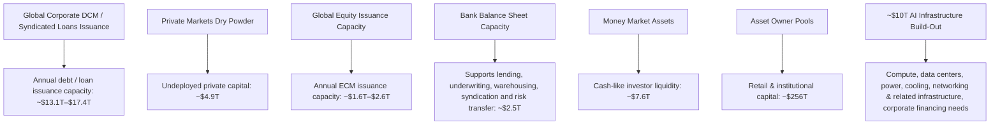

你是财经类 AI Podcast 制作人，擅长把研报内容改写成中文、英文两条独立的访谈式播客脚本。

【目标】
- 基于下面研报解析内容，写两份 podcast 脚本：一份中文，一份英文。
- 每份目标时长约 5 分钟。
- 两份都要是“访谈聊天式”，不是单人念稿。
- 听感：像一位主持人和一位研究员围绕报告做深度但自然的讨论。
- 不要使用 emoji。
- 不要把全文讲完，要留下 1-2 个“完整报告里会继续展开”的悬念。

【输出格式必须严格遵守】
- 中文部分只能使用 `ZH_A:` 和 `ZH_B:` 开头。
- 英文部分只能使用 `EN_A:` 和 `EN_B:` 开头。
- 每一句独立成行。
- 不要输出 Markdown 标题。
- 不要输出舞台说明、音效说明或括号注释。
- 先输出完整中文脚本，再输出完整英文脚本。

【角色设定】
- A 是主持人：负责提问、转场、替听众追问“所以这意味着什么”。
- B 是研究员：负责解释报告逻辑、给出结构化判断和保留悬念。
- 两个角色必须频繁轮换，避免一个人连续说超过 3 句。
- 每句要适合 TTS 朗读：短句、自然、不要太书面。

【中文脚本结构】
1. 开场：A 用一个问题引出报告价值，B 给出主判断。
2. 第一部分：这份报告真正要回答的问题是什么。
3. 第二部分：2-3 个关键洞察，每个洞察都要有“这意味着什么”。
4. 第三部分：哪些问题仍然没有完全展开，为什么值得继续读完整报告。
5. 结尾：自然引导听众加入社群/阅读完整报告，不要硬广。

【英文脚本结构】
- 英文不是中文逐句翻译，而是面向英文听众重新组织。
- 保留同样的主线和洞察，但表达更口语、更 podcast。
- Use natural conversational English.
- Avoid long sentences and avoid reading like a research memo.

【内容边界】
- 可以基于研报内容做适度发散，但必须是从原文逻辑推出的判断。
- 不要编造具体数据、公司动作或引用。
- 对不确定内容要用“这里仍需要继续验证”或 “the report does not fully answer this yet” 表达。
- 默认避免出现具体投行品牌名，比如“GS”“GS”，统一写作“投行研报”或 “a global investment bank report”。

【研报解析内容】
"""
# Financials and Thematics | North America

# AI: Financing the Next 10x Tech Cycle — Is Capital the Constraint?

AI infrastructure is evolving from hyperscaler-funded capex into a multi-asset financing ecosystem. We believe the constraint is not capital availability but how markets intermediate AI investment across equity, credit, securitization & private capital — with power & compute the real bottlenecks.

# Key Takeaways

AI is creating an unprecedented infrastructure investment cycle, with early spending already tracking \~10x above prior early cloud cycle spend.   
- \~\$256T of global capital pools appear sufficient to finance the AI build-out, following the \~\$1T mobile/cloud capex era.   
The key challenge is structuring assets with appropriate return, duration, collateral, liquidity, and risk-sharing characteristics.   
■ Public debt and equity markets have significant room to absorb issuance, with potential capacity upwards of \$17T and \$2.6T, respectively vs \$13T/\$1T in 2025.   
Alts well placed to benefit as private markets expand: OW APO, BN, BX, KKR, BLK. Banks to benefit from robust cap markets: BAC, C, GS, JPM, WFC.

Exhibit 1: Deep and diverse capital pools to finance estimated \~\$10T AI build-out this cycle   

flowchart

Source: Source: Dealogic, Morningstar, Cobalt, company data, MS estimates.

MS & CO. LLC

Michael J. Cyprys, CFA, CPA

Equity Analyst

Michael.Cyprys@morganstanley.com +1 212 761-7619

Manan Gosalia

Equity Analyst

Manan.Gosalia@morganstanley.com +1 212 761-4092

Stephen C Byrd

Equity Analyst

Stephen.Byrd@morganstanley.com +1 212 761-3865

Vishwanath Tirupattur

Strategist

Vishwanath.Tirupattur@morganstanley.com +1 212 761-1043

Barron Thomas

Research Associate

Barron.Thomas@morganstanley.com +1 212 761-2624

Connell J Schmitz

Research Associate

Connell.Schmitz@morganstanley.com +1 212 761-6252

Andrew B Pauker

Equity Strategist

Andrew.Pauker@morganstanley.com +1 212 761-1330

Nicholas Lentini, CFA

Equity Strategist

Nick.Lentini@morganstanley.com +1 212 761-5863

BROKERS, ASSET MANAGERS & EXCHANGES 

<table><tr><td colspan="2">North America</td></tr><tr><td>Industry View</td><td>In-Line</td></tr></table>

LARGE CAP BANKS 

<table><tr><td>North AmericaIndustry View</td><td>Attractive</td></tr></table>

MS does and seeks to do business with companies covered in MS. As a result, investors should be aware that the firm may have a conflict of interest that could affect the objectivity of MS. Investors should consider MS as only a single factor in making their investment decision.

For analyst certification and other important disclosures, refer to the Disclosure Section, located at the end of this report.

# AI: The Next 10x Compute Cycle

The AI era represents the next major compute cycle. Like prior waves of technology, we expect it to scale compute capacity by roughly 10x, driving a step-change in infrastructure investment. The mobile internet followed a similar path, expanding compute by \~10x and supporting roughly \$1 trillion of cloud and network capex, while reshaping market leadership as new platform companies emerged and disrupted incumbents.

We believe AI could be larger and longer-lasting than prior cycles because it requires a broader infrastructure footprint and is progressing at a faster pace. Investment spans semiconductors, servers, networking, data centers, power, cooling, and related infrastructure. At the same time, model capabilities, inference demand, and enterprise adoption continue to grow rapidly, creating a need for sustained incremental capacity. Across model development, usage, and spend, the trajectory continues to surprise to the upside, underscoring the difficulty of forecasting exponential growth in real time.

Early spending trends already point to the scale of the opportunity. In the first four years of this build-out, aggregate capex is tracking above \$1 trillion, roughly 10x higher than early-cycle cloud spending. Looking ahead, hyperscaler capex is expected to exceed \$1 trillion annually by 2027, with compute capacity increasingly becoming the key constraint to further AI scaling. These dynamics suggest we are still in the early stages of a cycle that could be both larger and longer-duration than prior technology waves. As the infrastructure build-out broadens, funding will likely need to extend beyond hyperscaler balance sheets, making public and private capital markets critical enablers of the next phase of AI deployment.

Key risks to our constructive AI infrastructure outlook include power and grid constraints, permitting delays, supply chain bottlenecks, and rising financing costs, all of which could slow deployment timelines or increase build-out costs. Longer term, risks include weaker-than-expected enterprise AI monetization, more efficient model architectures that reduce compute intensity, regulatory or geopolitical headwinds, and the potential for periods of overbuild if infrastructure investment ultimately outpaces sustainable demand growth. While we view these risks as manageable in the near term given continued upward revisions to hyperscaler capex plans, they could contribute to greater volatility in AI-related investment cycles over time.

Exhibit 2: Every tech cycle delivers 10x more compute   

bubble

Computing Cycles Over Time, 1960s – Today
Devices / Users (MM in Log Scale)
| Device | Devices | Users (MM in log scale) |
| :--- | :--- | :--- |
| Mainframe | ~1M+ Units | ~1 |
| Minicomputer | ~10M+ Units | ~50 |
| PC | ~300M+ Units | ~200 |
| Desktop Internet | ~1B+ Units / Users | ~10,000 |
| Cloud & Mobile | ~10B Units $1T Capex | ~30,000 |
| AI Era | 10s of Billions of Units $10T Capex | ~1,000,000 |

Source: Company data, MS

Exhibit 3: AI is following the path of past cycles   

bar_stacked

Early Cycle Cloud vs. AI Era Capex ($B)
| Year | Market Capex ($B) |
| :--- | :--- |
| 2013 | ~10 |
| 2014 | ~15 |
| 2015 | ~20 |
| 2016 | ~25 |
| 2023 | ~100 |
| 2024 | ~200 |
| 2025 | ~400 |
| 2026E | ~800 |
Early Cycle Cloud Spend ~$100B → Early AI Era Spend +$1T
CRWV, ORCL, IBM, MSFT, META, GOOGL, AMZN

Source: Eikon, MS. For AMZN, 2013-2016 use change in AWS net PP&E as proxy for AWS spend and in 2023-2026, we estimate AWS capex.

Exhibit 4: Token usage is increasing non-linearly, as advancing capabilities and demand inflection points to a larger cycle than expected   

bar

| Month    | Weekly Token Usage (T) |
| -------- | ---------------------- |
| Apr-25   | ~1.5T                  |
| May-25   | ~1.5T                  |
| Jun-25   | ~1.5T                  |
| Jul-25   | ~2.0T                  |
| Aug-25   | ~3.0T                  |
| Sep-25   | ~4.0T                  |
| Oct-25   | ~4.5T                  |
| Nov-25   | ~6.0T                  |
| Dec-25   | ~7.0T                  |
| Jan-26   | ~8.0T                  |
| Feb-26   | ~10.0T                 |
| Mar-26   | ~15.0T                 |
| Apr-26   | ~28.0T                 |
| May-26   | ~29.0T                 |

Source: OpenRouter, MS

Exhibit 5: Capex revisions reflect upside surprises and highlight the challenge of forecasting exponential growth   

bar_stacked

| Year | ANZN (B) | CODGL (B) | META (B) | MSFT (B) | ORCL (B) |
|---|---|---|---|---|---|
| 2023A | 64 | 51 | 31 | 23 | 160 |
| 2023A | 13 | 52 | 41 | 19 | 163 |
| 2024A | 43 | 32 | 29 | 76 | 257 |
| 2023A | 132 | 91 | 72 | 118 | 435 |
| May 25 - 2026E | 130 | 91 | 81 | 100 | 438 |
| Current - 2026E | 212 | 192 | 145 | 198 | 788 |
| May 25 - 2027E | 148 | 104 | 90 | 112 | 486 |
| Current - 2027E | 288 | 299 | 175 | 276 | 1,120 |
| May 25 - 2028E | 163 | 117 | 158 | 124 | 548 |
| Current - 2028E | 288 | 374 | 206 | 344 | 1,288 |

Source: Company data, MS. MSFT data calendarized, ORCL presented on FY basis.

# Financing the AI Build-Out: Capital Is Not the Constraint

# The Key Challenge Is How Financial Markets Evolve to Intermediate Capital

We believe the AI infrastructure cycle represents not only the next compute cycle, but also the next major capital markets evolution. The scale, duration, and infrastructure-like characteristics of AI investment increasingly require financing structures that extend beyond hyperscaler balance sheets and traditional corporate capex funding. In our view, the key challenge is not whether sufficient global capital exists, but how financial markets evolve to intermediate that capital across public equity, credit, securitized products, bank capital, private infrastructure, and alternative financing channels.

Exhibit 6: The Emerging AI Infrastructure Financing Stack

# The Emerging AI Infrastructure Financing Stack

A multi-asset ecosystem matching capital to AI infrastructure risk, return and duration

  
Source: MS

The AI build-out should be supported by a diverse set of capital pools and financing channels, including \~\$256 trillion asset-owner capital, potentially \~\$2.6 trillion of annual public equity issuance capacity, potentially \~\$17 trillion of annual debt and loan market issuance capacity, \~\$8 trillion of money market liquidity, \~\$5 trillion of private markets dry powder, and \~\$2.5 trillion of bank balance sheet capacity.

Importantly, each capital pool is suited to different parts of the AI infrastructure stack, with investor mandates, liquidity needs, duration, collateral, and return requirements shaping where capital is most likely to flow. This is all while power and compute capacity remain the true bottlenecks.

# The Global Financial System Has Sufficient Capital

We see concerns around the ability of capital markets to finance a \~\$10 trillion AI build-out as overdone. We acknowledge that the \$10 trillion magnitude is large in absolute terms, but global capital pools are deep and diversified and the spend should unfold over a multi-year build-out cycle rather than all at once. We estimate global retail and institutional capital pools at \~\$256 trillion, implying that a \$10 trillion AI investment cycle would represent \~4% of identified asset-owner capital. Global equity market capitalization provides another reference point at \~\$159 trillion, with the US alone at \~\$76 trillion. The aggregate pool of capital appears large enough to support the AI build-out, provided the underlying economics remain attractive, even though not all of this capital is available for AI.

Importantly, the AI financing need should not require meaningful liquidation of existing asset-owner holdings, as funding is more likely to come through gradual portfolio reallocation, new issuance, maturing fixed income portfolios, private capital deployment, and structured financing channels. In particular, large institutional investors continuously receive principal repayments and coupon cash flows from sizable bond portfolios, creating recurring reinvestment capacity that can be redirected toward newly issued AI-related debt, infrastructure, and private market opportunities over time. Further, continued strong retail demand for annuities — driven by aging demographics and demand for income and guaranteed retirement solutions — should continue to support insurance company demand for attractive investment-grade fixed income and long-duration assets, including asset-based and structured solutions.

Exhibit 7: Global Individual and Institutional Capital Pools of \$256T represent \~\$4% of the estimated \$10T needed to finance AI build-out   

bar_stacked

Asset Owner Pools ($T)
| Category | US Retail ($T) | International Retail ($T) | Insurance ($T) | Pensions ($T) | Sovereign Wealth Funds ($T) | Endowments & Foundations ($T) |
| :--- | :--- | :--- | :--- | :--- | :--- | :--- |
| Retail Capital | 79 | 74 | 0 | 0 | 0 | 0 |
| Institutional Capital | 42 | 0 | 0 | 42 | 16 | 4 |
| Total (Total) | 153 | 0 | 0 | 0 | 0 | 103 |

Source: Individual Wealth US data from FRED. Individual Wealth International data from Oliver Wyman. Sovereign Wealth Fund date from Global SWF. Pension data from Thinking Ahead Institute. Endowment & Foundation data from Pensions & Investments, Foundation Mark, and Harvard Kennedy. Insurance data from CapitalIQ and International Association of Insurnace Supervisors (IAIS). MS Note: All data as of Dec '24 except for Sovereign Wealth Data that's as of March '26 and International Foundation data that's a MS Estimate as of December '25. Individual wealth excludes insurance and pension capital.

Importantly, these capital pools are not interchangeable, as portfolio construction and asset allocation mandates should shape which parts of the AI build-out each pool is best positioned to finance. Insurance balance sheets are naturally better suited to long-duration, income-oriented credit and structured products, making them a logical source of demand for IG credit, ABS/CMBS, private credit, and ABF tied to contracted data center cash flows. Pension funds and sovereign wealth funds can take a broader portfolio approach, with allocations across public equity, private equity, infrastructure, real assets, and private credit, making them well suited to participate across both corporate growth and longer-duration AI infrastructure projects.

Financing activity is increasingly concentrating around a relatively small group of hyperscalers and highly rated technology issuers, which over time could create portfolio construction and single-name exposure considerations for some asset owners. That said, institutional capital pools remain substantial, including \~\$42 trillion of insurance assets, \~\$42 trillion of pension assets, and \~\$16 trillion of sovereign wealth fund capital. Further, concentration constraints vary meaningfully across institutions, and likely less relevant for some investors. In our view, investors also have tools available to help mitigate concentration risk if needed, including purchasing single-name or basket protection through CDS and other hedging structures.

We acknowledge some investors may face constraints increasing private market allocations near term given muted distributions and ongoing DPI challenges across portions of private markets. However, we increasingly see liquidity and portfolio management solutions emerging through the rapid expansion of the secondary market. Secondary transaction volume exceeded \$200 billion in 2025 for the first time, up \~40% Y/Y, driven by both LP-led sales and GP-led continuation vehicles, and has compounded at \~20% annually since 2013. Looking ahead, the secondaries market continues to broaden beyond traditional buyout strategies and appears well positioned to support LP and GP liquidity needs, with over \$200 billion of available dry powder. We believe secondary liquidity solutions, combined with an improving realization backdrop over time, should help return meaningful liquidity to asset owners and support continued capital deployment into AI infrastructure and related private market opportunities.

Exhibit 8: Insurance capital skews toward fixed income   

pie

Life Insurance Asset Allocation
| Category | Allocation (%) |
|---|---|
| Corp. Debt | 46.1 |
| Structured Notes | 14.4 |
| Other / ST Inv | 12.6 |
| Motg. Loans | 10.7 |
| Int'l Debt | 6.8 |
| US Gov't Debt | 6.1 |
| Alts | 3.2 |

Source: SNL data as of September 2025, MS

Exhibit 9: Pension portfolios are more diverse across asset classes vs. insurance capital   

bar_stacked

| Country     | Equities | Bonds | Alts / Other | Cash |
| ----------- | -------- | ----- | ------------ | ---- |
| US          | 50%      | 31%   | 17%          | 2%   |
| Japan       | 27%      | 55%   | 14%          | 3%   |
| Canada      | 29%      | 23%   | 46%          | 1%   |
| UK          | 25%      | 56%   | 17%          | 3%   |
| Australia   | 52%      | 14%   | 24%          | 10%  |
| Netherlands | 27%      | 47%   | 23%          | 3%   |
| Switzerland | 32%      | 30%   | 34%          | 4%   |

Source: Thinking Ahead Institute as of December 2024, MS

Exhibit 10: Sovereign Wealth Fund capital skews the most toward alternatives and direct investments...   

pie

Sovereign Wealth Funds Asset Allocation
| Asset Category | Allocation (%) |
| :--- | :--- |
| Equity | 32 |
| Fixed Income | 29 |
| Illiquid Alternatives | 23 |
| Direct Strategic Investments | 9 |
| Liquid Alternatives | 4 |
| Cash | 3 |

Source: Invesco Global Sovereign Asset Management Study as of December 2025, MS

Exhibit 11: ... and within alternatives, infrastructure has become an increasingly core part of sovereign wealth funds' portfolios   

[中间内容因长度限制已省略]

ted as, a benchmark under Regulation EU 2016/1011, or any other similar framework.

The issuers and/or fixed income products recommended or discussed in certain fixed income research reports may not be continuously followed. Accordingly, investors should regard those fixed income research reports as providing stand-alone analysis and should not expect continuing analysis or additional reports relating to such issuers and/or individual fixed income products. MS may hold, from time to time, material financial and commercial interests regarding the company subject to the Research report.

Registration granted by SEBI and certification from the National Institute of Securities Markets (NISM) in no way guarantee performance of the intermediary or provide any assurance of returns to investors. Investment in securities market are subject to market risks. Read all the related documents carefully before investing.

The following authors are Fixed Income Research Analysts/Strategists and are not opining on or expressing recommendations on equity securities: Vishwanath Tirupattur.

INDUSTRY COVERAGE: Brokers, Asset Managers & Exchanges 

<table><tr><td>COMPANY (TICKER)</td><td>RATING (AS OF)</td><td>PRICE* (05/28/2026)</td></tr><tr><td colspan="3">Michael J. Cyprys, CFA, CPA</td></tr><tr><td>Acadian Asset Management Inc. (AAMI.N)</td><td>E (04/07/2025)</td><td>$72.71</td></tr><tr><td>Ameriprise Financial, Inc. (AMP.N)</td><td>U (07/15/2025)</td><td>$439.85</td></tr><tr><td>Apollo Global Management Inc (APO.N)</td><td>O (11/20/2025)</td><td>$127.51</td></tr><tr><td>Ares Management Corp (ARES.N)</td><td>E (09/10/2021)</td><td>$126.00</td></tr><tr><td>BlackRock Inc. (BLK.N)</td><td>O (09/18/2015)</td><td>$1,046.49</td></tr><tr><td>Blackstone Inc. (BX.N)</td><td>O (12/15/2014)</td><td>$116.14</td></tr><tr><td>Brookfield Asset Management Ltd. (BAM.N)</td><td>E (01/23/2025)</td><td>$49.01</td></tr><tr><td>Brookfield Corporation (BN.N)</td><td>O (01/23/2025)</td><td>$46.08</td></tr><tr><td>Carlyle Group Inc (CG.O)</td><td>E (11/14/2018)</td><td>$45.09</td></tr><tr><td>CBOE Global Markets Inc. (CBOE.Z)</td><td>U (05/14/2025)</td><td>$344.24</td></tr><tr><td>Charles Schwab Corp (SCHW.N)</td><td>O (04/08/2025)</td><td>$85.35</td></tr><tr><td>CME Group Inc. (CME.O)</td><td>O (04/08/2025)</td><td>$277.42</td></tr><tr><td>Franklin Resources Inc. (BEN.N)</td><td>E (05/06/2026)</td><td>$31.21</td></tr><tr><td>Gemini Space Station, Inc (GEMI.O)</td><td>E (10/07/2025)</td><td>$5.20</td></tr><tr><td>Hamilton Lane Inc. (HLNE.O)</td><td>E (01/26/2021)</td><td>$86.15</td></tr><tr><td>Intercontinental Exchange Inc (ICE.N)</td><td>E (06/11/2021)</td><td>$148.30</td></tr><tr><td>Invesco (IVZ.N)</td><td>E (01/03/2018)</td><td>$28.06</td></tr><tr><td>Janus Henderson Group (JHG.N)</td><td>++</td><td>$51.77</td></tr><tr><td>KKR &amp; CO. Inc (KKR.N)</td><td>O (05/14/2025)</td><td>$94.03</td></tr><tr><td>LPL Financial Holdings Inc. (LPLA.O)</td><td>O (04/09/2024)</td><td>$265.86</td></tr><tr><td>MarketAxess Holdings Inc. (MKTX.O)</td><td>E (11/20/2025)</td><td>$131.55</td></tr><tr><td>Miami International Holdings Inc (MIAX.N)</td><td>O (09/08/2025)</td><td>$47.76</td></tr><tr><td>Nasdaq, Inc. (NDAQ.O)</td><td>O (11/20/2025)</td><td>$91.00</td></tr><tr><td>RJ Financial Inc. (RJF.N)</td><td>E (07/21/2023)</td><td>$142.00</td></tr><tr><td>Ridgepost Capital INC (RPC.N)</td><td>E (03/04/2024)</td><td>$8.37</td></tr><tr><td>Robinhood Markets, Inc. (HOOD.O)</td><td>E (04/08/2025)</td><td>$84.84</td></tr><tr><td>StepStone Group (STEP.O)</td><td>E (07/19/2022)</td><td>$50.09</td></tr><tr><td>T. Rowe Price Group, Inc. (TROW.O)</td><td>E (10/05/2017)</td><td>$103.55</td></tr><tr><td>TPG, Inc. (TPG.O)</td><td>E (04/14/2025)</td><td>$41.86</td></tr><tr><td>Tradeweb Markets Inc (TW.O)</td><td>E (04/08/2025)</td><td>$99.65</td></tr><tr><td>Victory Capital Holdings Inc (VCTR.O)</td><td>E (05/01/2026)</td><td>$85.09</td></tr><tr><td>Virtu Financial Inc (VIRT.N)</td><td>U (04/08/2025)</td><td>$48.80</td></tr><tr><td>Virtus Investment Partners Inc (VRTS.N)</td><td>U (04/08/2022)</td><td>$142.15</td></tr><tr><td>WisdomTree Inc. (WT.N)</td><td>E (04/08/2021)</td><td>$18.39</td></tr></table>

Stock Ratings are subject to change. Please see latest research for each company.   
\* Historical prices are not split adjusted.

Stock Ratings are subject to change. Please see latest research for each company.   
\* Historical prices are not split adjusted.   
INDUSTRY COVERAGE: Large Cap Banks 

<table><tr><td>COMPANY (TICKER)</td><td>RATING (AS OF)</td><td>PRICE* (05/28/2026)</td></tr><tr><td>Manan Gosalia</td><td></td><td></td></tr><tr><td>BofA (BAC.N)</td><td>O (04/07/2025)</td><td>$50.77</td></tr><tr><td>Bank of New York Mellon (BNY.N)</td><td>E (02/17/2026)</td><td>$140.56</td></tr><tr><td>Citi Inc. (C.N)</td><td>O (01/30/2024)</td><td>$124.68</td></tr><tr><td>GS Group Inc (GS.N)</td><td>E (04/07/2025)</td><td>$1,008.37</td></tr><tr><td>JPM Chase &amp; Co (JPM.N)</td><td>E (09/30/2024)</td><td>$296.73</td></tr><tr><td>Northern Trust Corp. (NTRS.O)</td><td>U (04/07/2025)</td><td>$168.35</td></tr><tr><td>PNC Financial Services (PNC.N)</td><td>E (02/17/2026)</td><td>$219.78</td></tr><tr><td>Regions Financial Corp (RF.N)</td><td>E (12/09/2024)</td><td>$27.83</td></tr><tr><td>State Street Corporation (STT.N)</td><td>O (12/09/2024)</td><td>$157.61</td></tr><tr><td>Truist Financial Corp (TFC.N)</td><td>O (02/17/2026)</td><td>$47.80</td></tr><tr><td>U.S. Bancorp (USB.N)</td><td>E (09/28/2025)</td><td>$54.45</td></tr><tr><td>Wells Fargo &amp; Co. (WFC.N)</td><td>E (09/28/2025)</td><td>$76.65</td></tr></table>

© 2026 MS
"""
