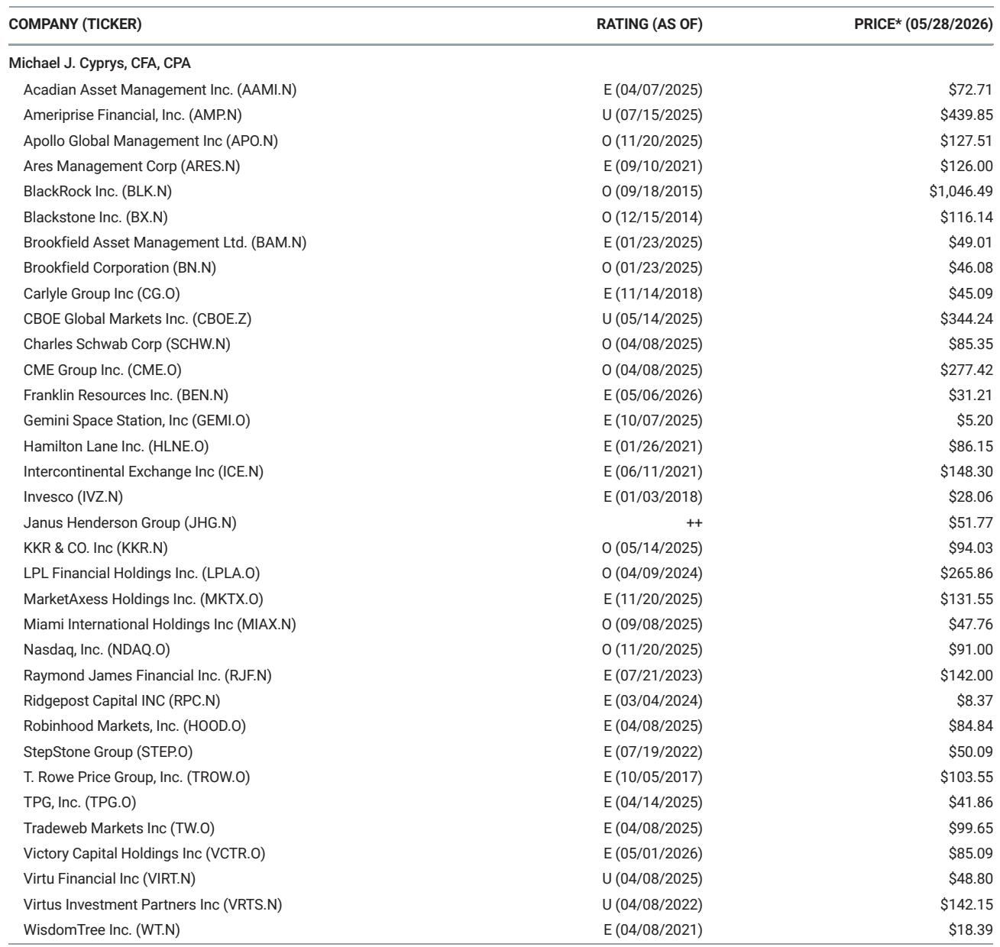

# 市场真正低估的不是AI融资缺口，而是资本中介结构的重塑

关于AI基础设施投资，市场上最流行的问题之一是：10万亿美元的资本开支，钱从哪里来？这个问题的背后，是一种隐含的担忧——资本市场的深度和流动性，可能不足以支撑一个规模远超云计算周期的投资浪潮。

但某外资投行最新发布的这份研报，给出了一个与市场直觉相反的判断。报告的核心论点并非“钱不够”，而是“钱够，但如何让钱流向正确的地方，才是真正的挑战”。这不仅是关于融资工具的讨论，更是关于全球资本市场正在经历的一次结构性演化。

这篇报告值得关注的信号，不在于它确认了AI投资规模有多大，而在于它系统性地拆解了“融资”这件事本身正在发生的变化。资本不是约束，但资本市场的中间化能力——即如何将不同风险偏好、久期、流动性的资金，匹配到AI基础设施的不同环节——才是决定这一轮投资周期能否持续的关键。

## 1. 10万亿美元的投资周期，只占全球资本池的4%

报告开篇就给出了一个令人意外的数据：全球零售和机构资本池总计约256万亿美元。一个10万亿美元的AI投资周期，仅占这一总量的约4%。即便只看美国股市的76万亿美元市值，也远高于所需的融资规模。

这个数字本身并不新鲜。真正重要的是报告提出的一个观察：这些资本池之间几乎不可互换。保险资金偏好长期、有稳定现金流的固收资产，养老金需要兼顾成长性和流动性，主权财富基金则倾向于另类投资和直接持有。不同资本的自然属性，决定了它们在AI基础设施融资中扮演的角色完全不同。

报告的深层含义是：市场讨论的“融资能力”，不应该被简化为“有没有钱”，而应该被追问为“钱愿意以什么样的条件、进入什么样的资产”。这背后涉及的是资产结构设计——收益率、久期、抵押品、流动性、风险分担机制——而不仅仅是资本总量。

## 2. 债务市场才是真正的“主力军”，而非股权

在讨论AI融资时，市场往往过度关注股权融资——尤其是科技公司的增发或IPO。但报告提供了一个更具冲击力的视角：公共债务和贷款市场的年度发行容量可达13.1万亿至17.4万亿美元，而股权市场仅为1.6万亿至2.6万亿美元。

这意味着，债务市场是AI基础设施融资的“主战场”。报告指出，保险资金是这一过程中的天然买家。美国寿险资产的配置中，公司债占46.1%，结构化产品占14.4%，两者合计超过60%。这些资金对投资级信用和长期限资产的需求，恰好与数据中心、电力基础设施等AI相关资产的现金流特征相匹配。

但这里有一个尚未被充分讨论的问题：AI基础设施的信用质量是否能够匹配保险资金的评级要求。大多数数据中心项目并非由超大规模云厂商直接持有，而是通过合资、租赁或资产证券化等方式融资。这些结构的信用评级、法律追索权和现金流稳定性，仍需要市场进一步验证。报告没有完全展开这一点，但它恰恰是债务市场能否真正“接棒”的关键前提。

## 3. 私募市场的“干火药”不是用来直接投资的，而是用来撬动杠杆的

报告提到，全球私募市场约有4.9万亿美元的未部署资本（dry powder）。这是一个被广泛引用的数字，但报告给出了一个更微妙的解读：这些资金本身并不是“直接买资产”的，而是作为杠杆融资的基石资本。

在AI基础设施融资中，私募资本的真正角色是“锚定”——通过提供夹层资本、优先股或结构性产品，为银行和债务市场创造风险分担的基础。报告特别提到，银行资产负债表容量约为2.5万亿美元，但它们更倾向于做承销、仓贮和风险转移，而非长期持有。

这意味着，AI基础设施融资的效率，取决于私募资本和银行之间能否形成有效的“资本传递链”。如果私募资本不愿意承担早期的项目风险，银行就无法完成后续的债务融资。而如果债务市场对资产结构不信任，私募资本的退出通道就会被堵死。这个循环的畅通程度，才是决定融资规模能否达到10万亿美元的真实变量。

## 4. 二级市场的流动性解决方案，正在改变私募资本的“退出焦虑”

一个经常被忽视的约束是，许多机构投资者目前面临“DPI困境”——即已投项目尚未产生足够的现金分配，导致新资本配置能力受限。报告敏锐地捕捉到了这一点，并指出二级市场正在成为缓解这一压力的关键工具。

2025年，全球私募二级交易量首次突破2000亿美元，同比增长约40%，自2013年以来年复合增长率约20%。更重要的是，二级市场正在从传统的并购策略扩展到更多资产类型，包括基础设施和信贷。这意味着，AI基础设施的私募融资，未来可以通过二级市场实现部分流动性退出，而不必等待项目完全成熟。

但报告没有完全回答的问题是：二级市场的定价机制是否足够成熟，尤其是在AI基础设施这类新型资产上。如果二级市场的折扣率过高，反而会抑制一级市场的融资意愿。这个二阶效应，可能需要更多周期的验证。

## 5. 报告尚未完全回答的三个关键问题

尽管这份报告在论证“资本不是约束”上非常有力，但它也留下了一些值得继续追问的空白。

第一，AI基础设施的“可融资性”尚未被充分验证。报告假设数据中心和电力资产能够产生稳定的、可预测的现金流，但这取决于长期电力合同、客户锁定协议以及技术迭代风险。如果模型效率提升导致算力需求下降，或者企业AI应用变现慢于预期，这些资产的现金流假设就会受到挑战。

第二，集中度风险可能被低估。报告提到，融资活动正在向少数超大规模云厂商和评级较高的科技发行人集中。这意味着，机构投资者在构建组合时可能面临单一发行人敞口过大的问题。虽然报告提到了信用违约互换等对冲工具，但这些工具的流动性和成本在压力情景下可能急剧变化。

第三，电力与算力的物理瓶颈，可能比融资问题更紧迫。报告承认电力与算力是真正的瓶颈，但没有深入讨论这些瓶颈如何反过来影响融资节奏。如果项目因电网审批延迟或芯片供应短缺而推迟，融资计划也会随之延后，进而影响资本市场的信心和定价。

这些未解问题，恰恰是理解这一轮AI投资周期复杂性的关键。资本市场的中间化能力，不是一个静态的“有没有钱”的问题，而是一个动态的“能否在不确定性中持续定价和分配风险”的问题。

---

这份报告的完整版本包含了更详细的资产结构设计分析、不同资本池的配置模拟，以及具体公司层面的受益逻辑。欢迎来星球微信群里继续讨论，我们会围绕这些未解问题，结合更多原始图表和行业数据，做进一步的推演和拆解。

Personal reading notes and learning share only. Not investment advice.

